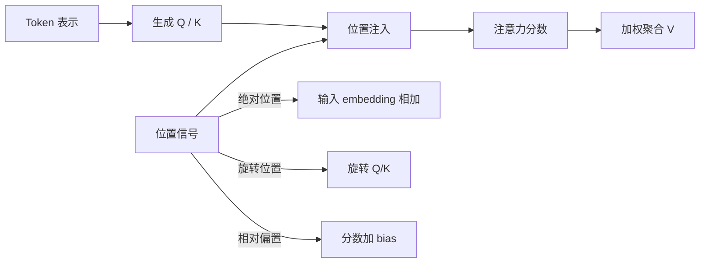
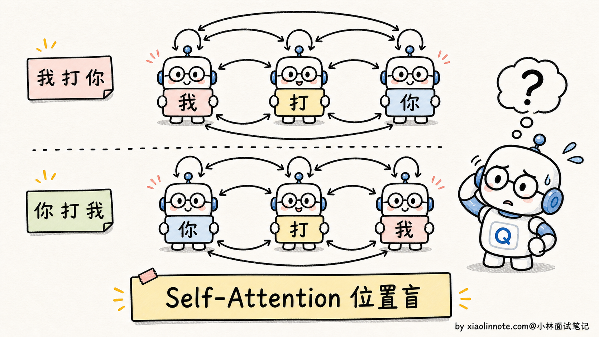
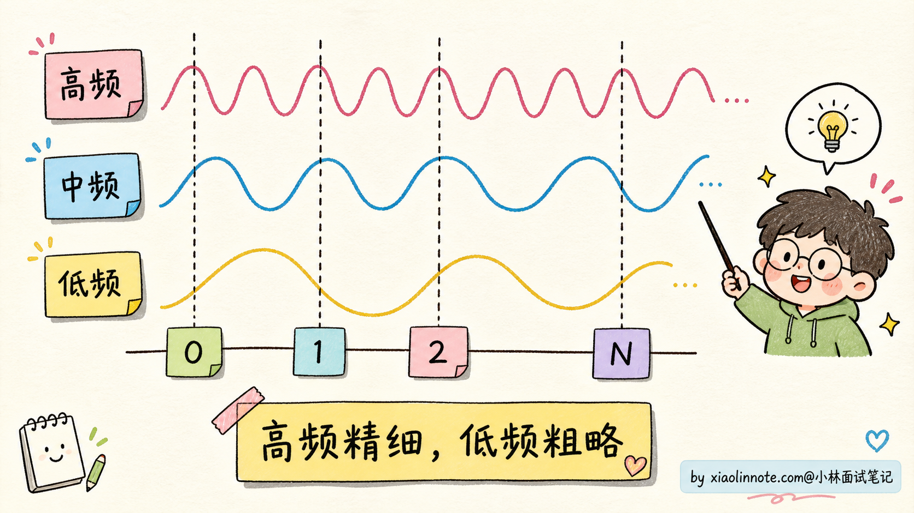
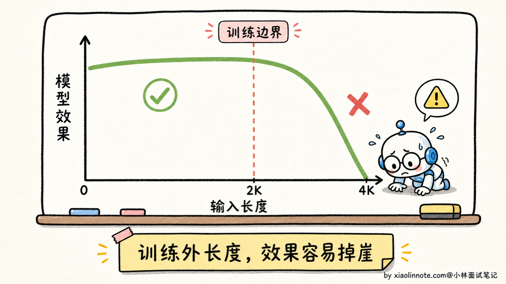
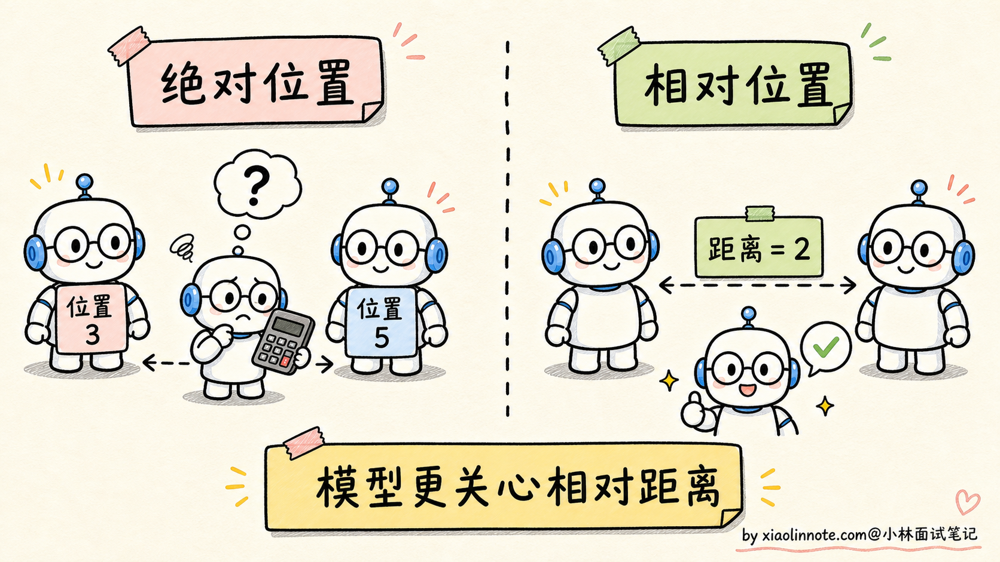
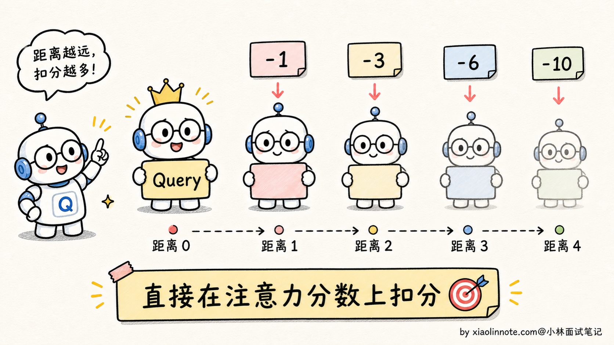
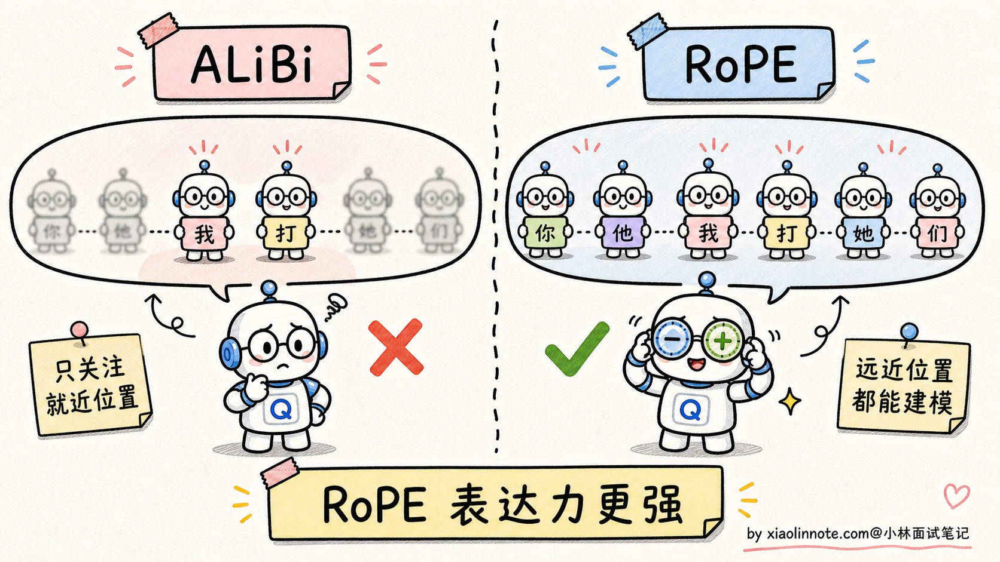
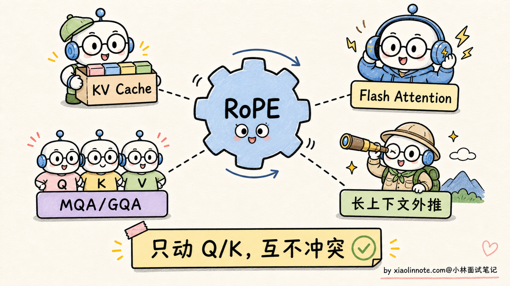
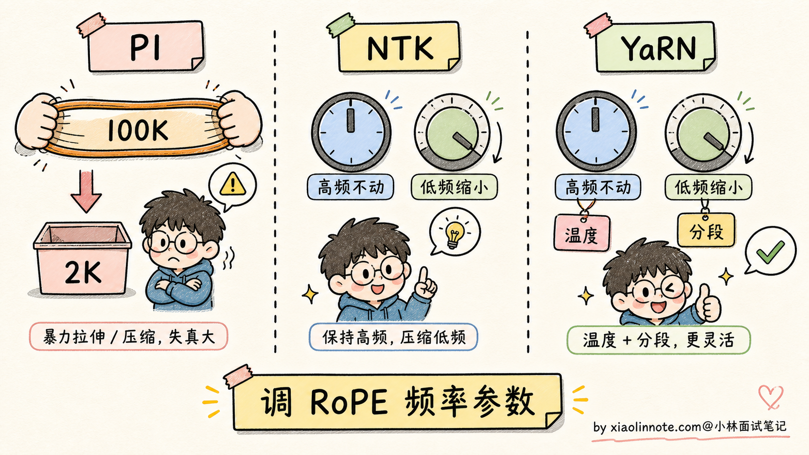

# 大模型的位置编码是干什么用的？sin/cos、RoPE、ALiBi 有什么区别？

> 原文：[大模型的位置编码是干什么用的？sin/cos、RoPE、ALiBi 有什么区别？](https://xiaolinnote.com/ai/llm/position_encoding.html) · 小林面试笔记

👔面试官：来讲讲大模型为什么需要位置编码？sin/cos、RoPE、ALiBi 这几种各有什么区别？

🙋‍♂️我：位置编码就是让模型知道每个词在第几个位置，用 sin 和 cos 函数算一下加到 token embedding 上就行。

👔面试官：……「加到 embedding 上」是怎么加？是直接做加法还是别的什么操作？为什么要用 sin 和 cos 而不是 1, 2, 3, 4 这种简单序号？再说，RoPE 你也是「加到 embedding 上」吗？那它不就和 sin/cos 一样了？

🙋‍♂️我：哦哦，RoPE 是相对位置编码，跟 sin/cos 不一样，是给 Q 和 K 做旋转。

👔面试官：「做旋转」？怎么旋转？为什么旋转能表达位置？为什么相对位置编码比绝对位置编码强？还有 ALiBi 是什么思路？为什么 Llama 选 RoPE 不选 ALiBi？

🙋‍♂️我：呃……ALiBi 我有点忘了……反正都是位置编码嘛，效果应该差不多吧？

👔面试官：「效果差不多」？那为什么主流模型都换成 RoPE 了？为什么长上下文外推 RoPE 比 sin/cos 强？为什么 ALiBi 有它的支持者但没成主流？这些问题没搞清楚，面试就是被怼。回去补一下。

从这几个反问里能听出，位置编码这道题真正想问的是：位置信息在哪里注入、它提供了什么归纳偏置，以及在目标长度上是否经过验证。不能把“所有 LLM 都换成 RoPE”或某一种方案的外推能力说成定律。

## 💡 简要回答

我理解位置编码要解决的问题，本质上是**不带位置信号的 Self-Attention 对排列不敏感**：如果只给它一组 token 表示，模型缺少“谁在前、谁在后”的可识别线索。因此需要把位置信息注入输入、Q/K 或注意力分数；不同注入方式会带来不同的归纳偏置。

三种主流位置编码各有不同的设计哲学。

第一种是 **sin/cos 绝对位置编码**（原始 Transformer 使用的方案）。给每个位置算一组固定的 sin/cos 值，加到 token embedding 上。优点是简单、不需要训练参数；缺点是模型需要从绝对位置表示中学习相对关系，超出训练长度后的效果取决于训练分布、模型和任务，不能一概而论为“必然断崖”。

第二种是 **RoPE（Rotary Position Embedding，旋转位置编码）**。它不是把位置信息直接加到 embedding 上，而是按位置旋转 Q 和 K 向量。两个 token 的 Q/K 做点积时，结果带有与位置差相关的结构。它便于表达相对位置，也有成熟的长上下文扩展方法，但外推质量仍依赖模型、频率缩放、继续训练和任务评测；多个公开模型采用它，但并非所有模型都采用。

第三种是 **ALiBi（Attention with Linear Biases）**。它直接在注意力分数里加入随相对距离变化的线性偏置，通常让不同 head 使用不同斜率。它实现简单、位置参数少，在一些设置下有不错的长度外推表现；但外推、表达能力和任务效果都需要实测，不能概括为“天然无限长”或必然弱于 RoPE。

最关键的一句话是，**RoPE 是许多公开 decoder-only LLM 的常见选择**，因为它在相对位置信号、实现复杂度和推理优化兼容性之间取得了较好平衡；最终选择仍由模型架构、训练长度和目标任务决定。

## 📝 详细解析

### 为什么 Attention 必须有位置编码

要理解位置编码，得先搞清楚 Attention 本身有什么毛病。

Self-Attention 的核心计算是 `softmax(QK^T/√d) · V`，每个 token 通过 Q 去和所有 token 的 K 做点积、算注意力权重，然后按权重加权聚合所有 token 的 V。如果不额外提供位置信号，这个计算对 token 的排列具有等变性：换序后输出也会随之换序，模型缺少区分“前后顺序”的信息。这就是常说的「位置盲」。

什么意思呢？看个例子。

假如输入是「我打你」，每个字都被转成 embedding 向量。Attention 计算时，「我」会去看「打」和「你」，「打」会去看「我」和「你」，「你」会去看「我」和「打」。这个过程里，模型只知道「这三个字之间互相算了注意力」，但**完全不知道谁在前谁在后**。

如果把输入换成「你打我」，这三个 token 的集合相同但排列不同；没有位置编码时，网络无法从计算中恢复“谁在前谁在后”。模型如果分不清位置，就很难可靠地区分主语、宾语和时序关系。

那为什么不能直接用「1, 2, 3, 4」这种位置序号？

因为裸序号的尺度和结构都需要额外设计。直接把 1、2、3 这样的标量加到高维 embedding 上既没有合适的维度对齐方式，也没有平滑的距离结构；即使使用可学习的位置向量，超过训练长度后的行为也不自动得到保证。位置编码要不要外推、如何外推，必须结合训练方式验证。

所以位置编码必须满足三个要求：

- **数值范围合理**，不能把 token embedding 给覆盖掉
- **能区分不同位置**，每个位置都有独特的「指纹」
- **长度行为可控**，如果产品需要外推，应在目标长度上单独训练、校准或评测

带着这三个要求，再来看三种主流方案就好理解了。

### sin/cos 绝对位置编码：原始 Transformer 的方案

原始 Transformer 论文使用了 sin/cos 位置编码，简称 **Sinusoidal PE**。它的核心思路是用一组不同频率的 sin/cos 函数，给每个位置生成一个位置向量。

公式不展开背，直觉上这样理解。模型 embedding 维度有 d 维（比如 d=512），把这 d 维分成 d/2 对，每对用一组 sin/cos：

- 第 1 对的频率最快（高频），相邻位置之间区别明显，适合区分近距离的位置
- 第 d/2 对的频率最慢（低频），相邻位置几乎一样，但跨越很远的位置才能区分开

类比一下：就像几个不同频率的振子叠加，高频振子记录「精细位置」，低频振子记录「粗略位置」。每个位置在 d 维空间里都有一个独特的 sin/cos 组合，就是它的「身份证」。

这个方案怎么用？把每个位置的 sin/cos 指纹向量直接**加到对应 token 的 embedding 上**。即「最终输入向量 = token embedding + position embedding」。

为什么是「加」而不是「拼接」？因为加法不增加维度，结构上更省事。神经网络强大到可以从相加的结果里把这两部分信息「自动解开」。

sin/cos 编码的优点是显而易见的：

- **零参数**：完全是数学公式算出来的，不占模型参数
- **泛化性看起来不错**：理论上 sin/cos 可以算到任意位置的指纹

它的一个工程风险是**超出训练长度后的行为并不由公式自动保证**。虽然 sin/cos 可以计算任意位置，但模型在训练中学到的注意力模式、频率组合和距离分布可能只覆盖有限范围；究竟是平滑退化还是明显下降，要在目标模型和任务上评测。

因此，在需要很长上下文的模型中，研究者会比较 sin/cos、相对偏置、RoPE 及其缩放/继续训练方案；不能仅按模型大小断言某一方案“不够用”。

### 绝对位置 vs 相对位置：模型真正想要什么

在讨论 RoPE 之前，先想一个特别生活化的问题：**你跟别人介绍你坐在哪儿，是说「我坐在前排第 3 个座位」，还是说「我坐在 XX 旁边」？**

大部分时候你会选第二种，因为「相对位置」比「绝对位置」更有信息量。同样在 NLP 里，模型理解语言时关心的也是相对位置，不是绝对位置。

举个例子。中文里「主语动词宾语」这种句法关系，关键的不是「主语在第 3 位、动词在第 5 位」这种绝对编号，而是「主语和动词之间隔了 2 个词」这种相对距离。一句话不管前面加了多少修饰语、语气词，主语和动词的相对关系是稳定的。同样的「我吃饭」，不管你前面加「今天」「中午」「饿了所以」，主谓宾的相对距离都没变。

绝对位置编码（比如 sin/cos）直接表示每个位置；模型需要从两个位置的表示中学习相对关系。相比显式把相对距离写入注意力的方案，这种归纳偏置不同，但不应简单说成“完全靠碰运气”或必然更弱。

相对位置方法的一个思路是把「相对距离」显式地编进注意力计算里，让模型更容易利用距离关系。RoPE 和 ALiBi 都有这种动机，但具体数学形式不同；实际模型也可能同时使用绝对、相对、局部窗口或其他位置机制。

### RoPE：用旋转把相对位置编进点积

RoPE（Rotary Position Embedding，旋转位置编码）是一类把位置作用到 Q/K 子空间的方案。核心思路一句话：**不把位置信息直接加到 embedding 上，而是旋转 Q 和 K 向量**。

什么意思？

在 Attention 计算里，每个 token 都会被投影成 Q（Query）和 K（Key）。RoPE 在这一步动手脚：每个 token 的 Q/K 向量根据它的位置 m，被旋转一个对应角度 mθ（θ 是预设常数）。位置 0 的 token 不旋转，位置 1 的旋转 θ，位置 2 的旋转 2θ，依此类推。

类比一下：把 Q/K 向量想象成钟表的指针，每个位置对应一个不同时刻的指针朝向。位置越靠后，指针转得越多。

为什么旋转能表达位置？关键的数学性质是：**两个旋转后的向量做点积，结果只依赖于它们的「旋转角度差」**。

在标准二维旋转构造下，位置 m 的 Q 和位置 n 的 K 做点积时，会出现与 (m-n) 相关的项；这为相对位置提供了结构化归纳偏置。它并不意味着注意力只由距离决定，内容向量和具体频率设计仍然参与结果。

RoPE 的优点非常突出，几个层面叠加起来才让它成为现在的标配。

最直观的优点是**提供相对位置的结构化偏置**，同时保留内容相关的 Q/K 点积。其次，常见 RoPE 的频率是固定的，不增加位置表参数；旋转也保持向量的二维子空间范数。工程上它通常可以和 KV Cache、Flash Attention、MQA/GQA 组合，但仍要看实现中旋转位置、缓存和 kernel 的接口是否匹配，不能承诺“无缝”或无额外开销。

RoPE 的长度外推常被认为具有较好的可调性，但它也有频率混叠、相位快速变化和训练分布偏移等问题。即使位置角度可以继续计算，模型也不一定能可靠使用更远的位置；要在目标长度和目标任务上评测。

再加上 Position Interpolation、频率缩放和 YaRN 等扩展技巧，可以在一些模型上把训练长度扩到更长。但这些方法的实现、参数和是否需要继续训练各不相同，不能承诺固定倍率或几乎无损；推得越远，越需要专门评测长文检索、多跳推理和位置敏感任务。

哪些公开模型使用 RoPE？可以举出多个采用它的 decoder-only 模型家族，但不要写成“所有主流模型都用”：

- 某些 Llama、Qwen、DeepSeek、Mistral/Mixtral 等公开架构
- 其他模型也可能选择 ALiBi、相对位置 bias、学习式位置向量或混合方案

更稳的说法是：RoPE 在许多公开 decoder-only LLM 中很常见，但不是架构层面的强制标准。

### ALiBi：直接给注意力加距离惩罚

ALiBi（Attention with Linear Biases）是另一种相对位置编码方案：**不改 Q、K、V 的内容表示，直接在注意力分数里加入随距离变化的偏置项**。

具体做法：在 `softmax(QK^T)` 这一步之前，给每对 token 的注意力分数加上一个偏置项，偏置值是 `-m × |i-j|`，其中 |i-j| 是两个 token 之间的距离，m 是一个固定的斜率（每个 head 不同）。

直观理解：离得越远，注意力分数被扣得越多，模型越倾向于关注近邻的 token。每个 head 用不同的斜率，等于让不同的 head 关注不同范围的距离（有的 head 关注近邻，有的 head 关注远处）。

ALiBi 的优点：

- **零参数**：和 RoPE 一样不引入可学习参数
- **极简实现**：就是加一个偏置矩阵，比 RoPE 还简单
- **长度扩展较直接**：偏置公式可以计算更远距离，但模型能否在更长上下文上保持质量仍需评测，并不意味着理论上多长都行

但 ALiBi 也有明显短板：

- **位置偏置较单一**：它主要通过距离偏置表达位置关系，是否足以覆盖精细的语序或远距离依赖，要看模型训练和任务
- **局部性权衡**：斜率过强可能偏向近邻，斜率过弱又可能无法提供足够的位置区分

谁用过 ALiBi？

- **MosaicML 的 MPT 系列**
- **BLOOM 的某些版本**

这些只是公开采用过 ALiBi 的例子；是否“主流”取决于时间、模型类型和比较口径，不能从模型名单直接推断方案优劣。

### 三种方案对比：为什么 RoPE 赢了

把三种方案放到一起比较：

| 维度 | sin/cos | ALiBi | RoPE |
| --- | --- | --- | --- |
| 编码类型 | 绝对位置 | 相对位置（距离惩罚） | 相对位置（旋转） |
| 是否可学习参数 | 否 | 否 | 否 |
| 注入方式 | 加到 token embedding | 加到注意力分数 | 旋转 Q/K 向量 |
| 长上下文行为 | 公式可计算更长位置，但效果依赖训练 | 偏置可直接延伸，效果仍需验证 | 可配合频率缩放/继续训练，但也会受频率和分布偏移影响 |
| 位置归纳偏置 | 从绝对表示中学习关系 | 线性距离偏置 | Q/K 旋转带来的相对位置结构 |
| 工程关注点 | 位置表示与训练长度匹配 | 斜率与局部性权衡 | 频率、缓存位置和长上下文校准 |
| 公开采用情况 | 原始 Transformer 等 | MPT、BLOOM 等部分模型 | 多个公开 decoder-only 模型 |

为什么很多公开模型选择 RoPE？可以从三个工程理由理解，但这不是“唯一正确”的结论。

**第一，长度扩展生态**。RoPE 有较丰富的频率缩放、插值和继续训练方法，但真正上线前仍要看目标长度评测，不是改一个参数就天然无损。

**第二，相对位置 + 表达力的平衡**。RoPE 的旋转结构既保留内容点积，又提供相对位置偏置；ALiBi、sin/cos 也有各自适用场景，不能把比较简化成“谁绝对更强”。

**第三，工程兼容性**。RoPE 只在 Q/K 路径上注入位置，通常容易和 KV Cache、Flash Attention、MQA/GQA 组合，但仍要由具体 kernel 和缓存布局验证。

### 拓展：长上下文外推（NTK / YaRN 简介）

最后简单提一下 RoPE 的外推扩展技巧，因为这一块面试时容易被追问。

如果 RoPE 模型需要支持明显长于训练分布的输入，直接把更长文本喂进去可能出现性能下降，因此会调整位置映射或频率参数，并用目标长度数据校准：

- **Position Interpolation（PI）**：把更长序列的位置映射回原训练范围；这种压缩可能牺牲部分精细距离分辨率
- **频率缩放**：改变不同维度的频率，使一部分频率变化得更慢；具体公式和收益依赖实现
- **YaRN（Yet another RoPE extensioN）**：一类结合频率处理与校准/训练策略的方法；不能概括为所有大厂都采用

需要强调的是，有些变体可以在推理时修改位置参数，但要在很长上下文上稳定工作，常常仍需要继续训练、校准数据或专门评测。RoPE 的优势不是无成本无限外推，而是提供了一个可调、可与主干计算结合的位置机制。

## 🎯 面试总结

回到开头那段对话，问到位置编码，最重要的是先讲清楚为什么需要它：不带位置信号的 Self-Attention 无法可靠恢复 token 的顺序，因此需要把位置注入输入、Q/K 或注意力分数。裸的 1、2、3 序号既没有合适的高维结构，也不自动保证长序列泛化。

讲完铺垫之后，再把三种方案的设计哲学讲明白：sin/cos 把绝对位置向量加到输入；RoPE 旋转 Q/K，让点积带上相对位置结构；ALiBi 在分数中加入距离偏置。长度外推、表达力和工程成本都要结合具体模型与评测，不要把任何方案写成绝对胜负。

最关键的一句话是：**很多公开 decoder-only 模型选择 RoPE，是因为它在相对位置结构、实现方式和长度扩展生态之间较平衡**。配合频率缩放、插值或继续训练后可能支持更长上下文，但必须用目标任务验证。

如果还想再加分，可以说明位置机制与 mask、KV Cache、注意力 kernel 的边界，并指出长度扩展需要校准和评测，而不是只背 PI、频率缩放或 YaRN 的名称。

---
