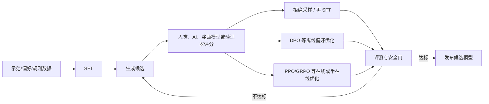
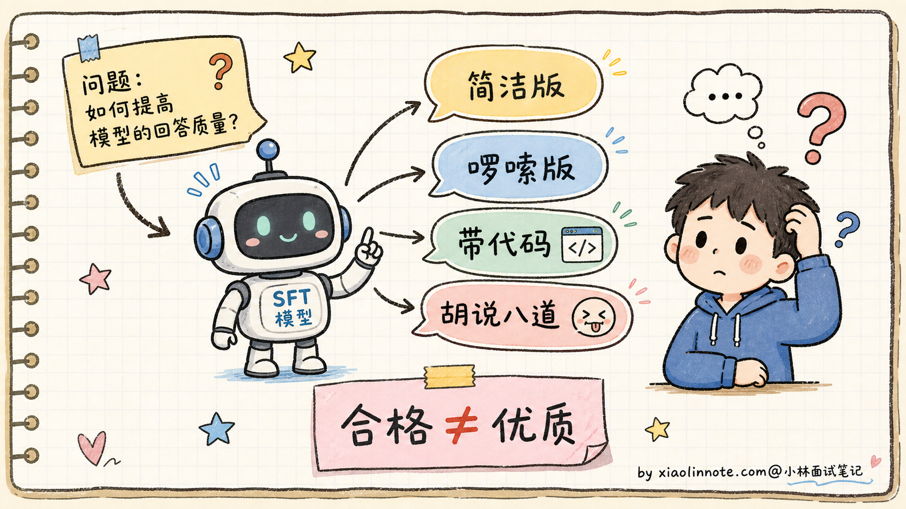
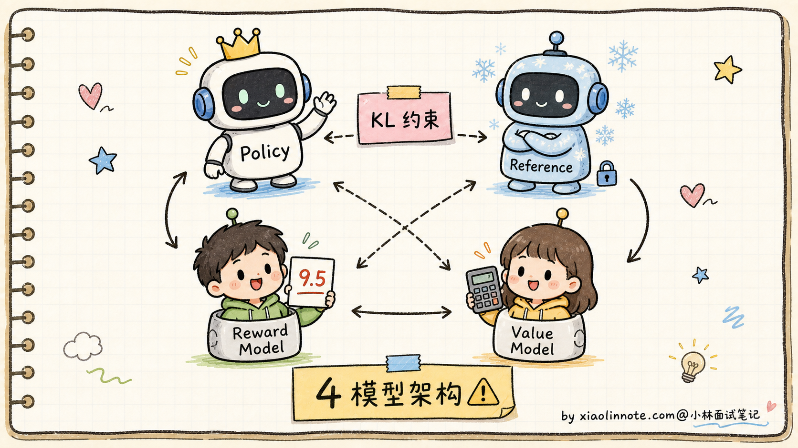
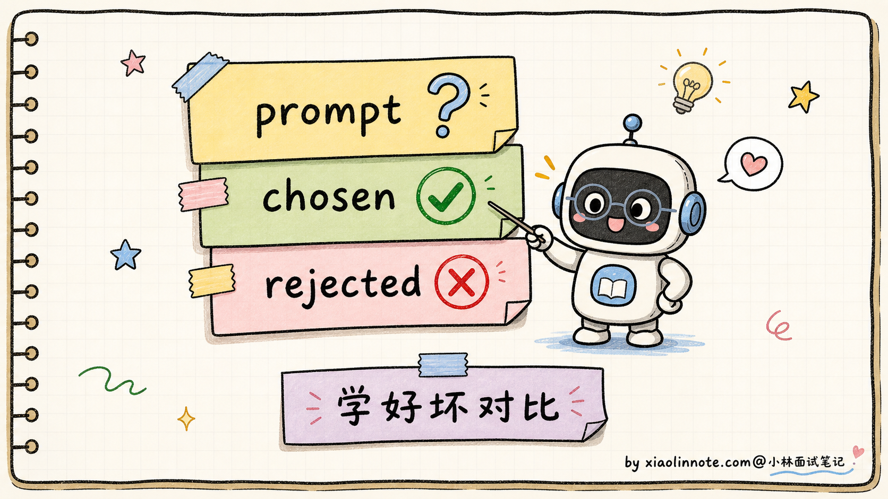
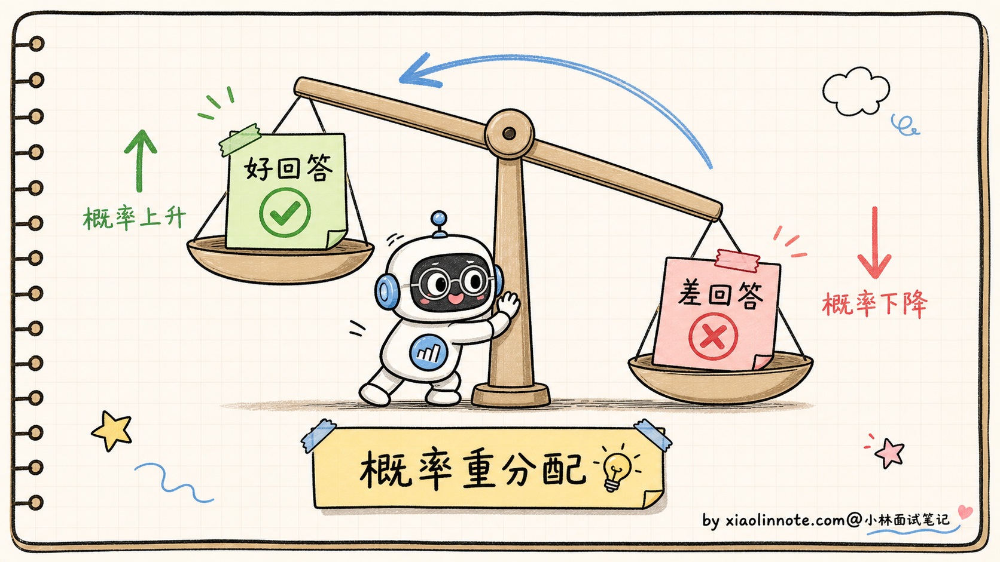
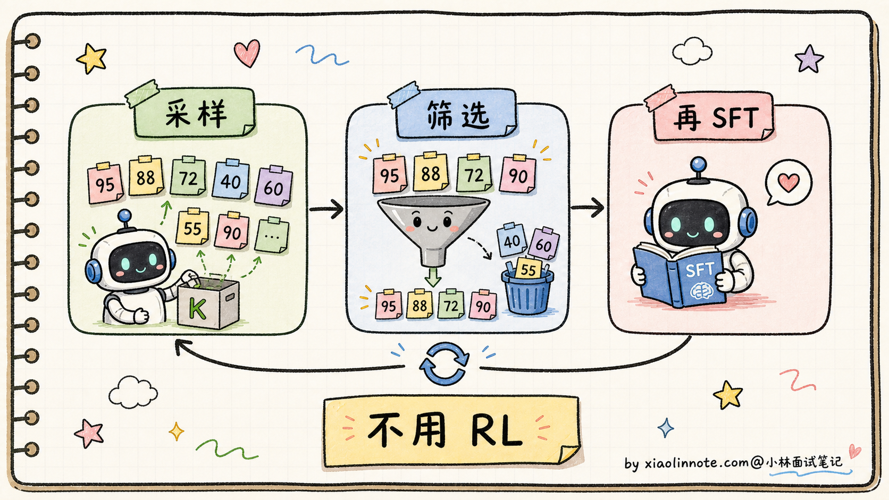
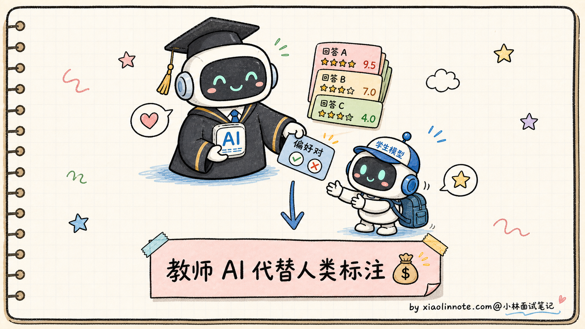
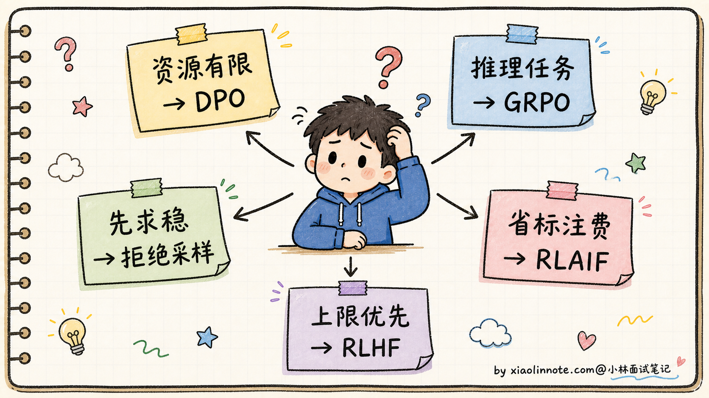
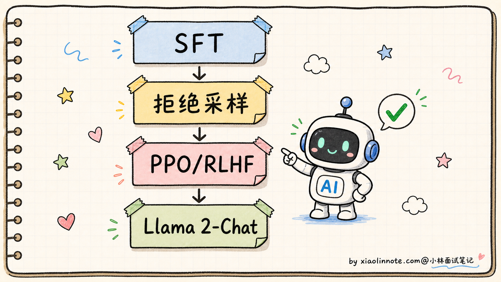
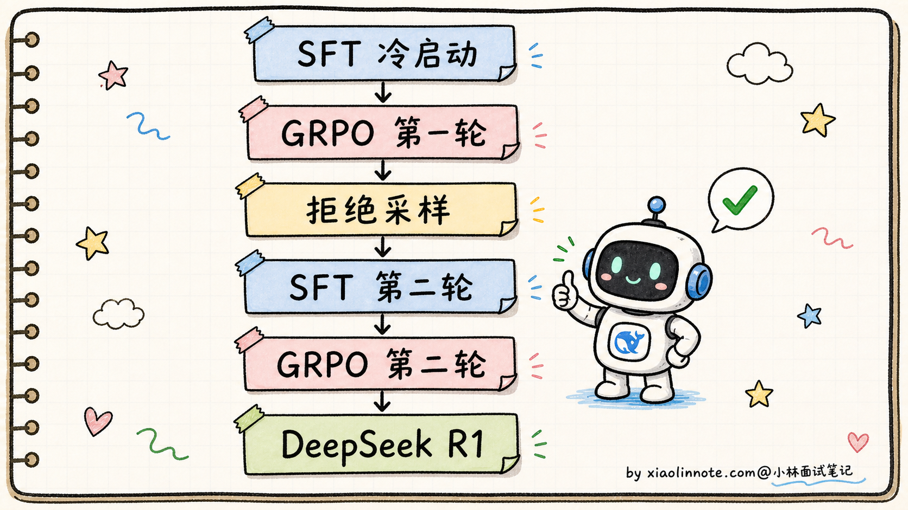

# SFT 之后还有哪些 Post-Training？RLHF、DPO、GRPO、拒绝采样什么关系？

> 原文：[SFT 之后还有哪些 Post-Training？RLHF、DPO、GRPO、拒绝采样什么关系？](https://xiaolinnote.com/ai/llm/post_training.html) · 小林面试笔记


👔面试官：来讲讲 SFT 之后还有哪些 Post-Training 方法？RLHF、DPO、GRPO、拒绝采样这几个什么关系？

🙋‍♂️我：SFT 之后就是 RLHF 嘛，先训个奖励模型再用 PPO 强化学习，让模型按人类偏好生成回答。

👔面试官：你只说了 RLHF，那 DPO 你跳过去了？DPO 和 RLHF 是替代关系还是补充关系？再说，「奖励模型」是怎么训的？「PPO 强化学习」具体在调什么？为什么需要「参考模型」？

🙋‍♂️我：哦哦，DPO 是 RLHF 的简化版，绕过奖励模型，直接拿好坏回答对学。

👔面试官：好，那 GRPO 又是什么？为什么 DeepSeek R1 出了之后整个圈子都在讨论 GRPO？它和 PPO、DPO 是什么关系？还有「拒绝采样」是怎么回事？「RLAIF」呢？这一堆方法你能画一张家族图谱吗？

🙋‍♂️我：呃……GRPO 我有点模糊，是不是 PPO 的另一种形式？

👔面试官：你这是在猜词。GRPO 是公开研究中出现的一类组内相对优化方法，相比常见 PPO 省去了单独的 Value Model。「省掉 Value Model」具体是怎么做的？用什么估计优势函数？这些不搞清楚，面试官一追问就露馅。回去补一下。

被这几个问题点完，Post-Training 这道题才显出深度。它不是「RLHF 一招走天下」，而是 SFT 之后的一组目标、数据和优化方法：DPO、PPO/RLHF、GRPO、拒绝采样和 RLAIF 可以组合，也可以只选其中一部分。关键是先区分“反馈从哪里来”和“用什么优化算法”。

## 💡 简要回答

我理解 Post-Training 是个上位概念，指的是 SFT 之后所有继续提升模型质量的训练阶段。它不是一个单一方法，而是一族方法的总称。

SFT 让模型学会「按指令格式回答」，但 SFT 后的模型还有两个问题没解决。第一，回答可能有害、不符合人类价值观；第二，同一个问题的多种合格回答里，模型不知道哪个更受人类欢迎。这就是 Post-Training 要补的课。

常见的 Post-Training 组件可以按“优化目标、反馈来源、数据构造和训练循环”来分类，下面五类只是便于面试组织答案的框架，不是互斥的官方分类。

**RLHF（Reinforcement Learning from Human Feedback，基于人类反馈的强化学习）** 是一类用人类偏好作为反馈信号的训练路线。经典 PPO 实现会用偏好数据训练奖励模型，再让策略模型生成回答并用 PPO 更新，同时用参考策略的 KL 约束控制偏移。实现中可能共享权重、用 value head 或采用其他 RL 优化，因此“同时维护 4 个完整模型”不是硬性定义。

**DPO（Direct Preference Optimization，直接偏好优化）** 是一种直接使用偏好对的目标。它在特定奖励模型形式、参考策略和 KL 正则等假设下，可以把相应的 RLHF 目标改写为偏好分类式损失；因此更准确的说法是“在这些假设下等价/对应”，不是任意 RLHF 都能无条件替换。它通常省掉显式奖励模型和在线采样，工程简单，但效果取决于偏好数据、参考模型、β 等超参和分布覆盖。

**GRPO（Group Relative Policy Optimization，组相对策略优化）** 是公开研究中提出的一类 PPO 风格方法。它不训练单独的 Value Model，而是对同一问题采样一组回答，用组内奖励的中心化/归一化结果构造相对优势；组大小、标准差为零时的处理、KL 项和奖励来源都由实现决定。它减少了一类 value 估计成本，但不等于整体显存或训练成本按固定比例下降。部分公开推理模型报告使用 GRPO 或相近路线，不能把所有推理模型都归为 GRPO。

**拒绝采样（Rejection Sampling Fine-tuning）** 是数据构造方法：让模型对 Prompt 生成一个或多个候选，用奖励模型、人类偏好或规则筛选，再把通过的样本用于 SFT。流程本身没有 PPO，但可以作为更长对齐流水线的一环；候选数量和筛选规则不是固定值。

**RLAIF（Reinforcement Learning from AI Feedback，基于 AI 反馈的强化学习）** 描述的是反馈来源，而不是唯一的优化算法：AI 可以生成偏好、批评或奖励，再配合 RL、DPO 或拒绝采样。优点是可扩展，风险是教师模型的偏差、奖励投机和分布偏移会被放大。Constitutional AI 等公开工作可作为相关例子，但具体训练步骤要以论文为准。

最关键的认知是这些组件不是互相排斥，**真实的对齐流程通常是组合使用的**。例如某些公开流程会把 SFT、拒绝采样和 PPO/RLHF 串起来；另一些会把冷启动 SFT、可验证奖励、组相对优化和筛选数据交替使用。回答时应明确哪些是公开事实，哪些只是你的工程组合方案。



## 📝 详细解析

### Post-Training 是什么概念？为什么 SFT 之后还需要它

要理解 Post-Training 这一族方法，得先回答一个问题：SFT 之后，模型还差什么？

SFT（Supervised Fine-Tuning，监督微调）的目标是让模型从「文本续写机器」变成「按指令回答的对话机器」。训练数据是（指令，期望回答）对，模型学会的是「碰到指令格式就给出格式化的回答」。

问题是，SFT 学到的主要是示范分布，不自动等于在所有任务上都“优质”。同一个问题可以有多种合格回答：有的简洁、有的啰嗦；有的带代码、有的纯文字；有的承认「我不确定」、有的硬装专业胡说八道。用户还会在事实性、帮助性、风格和风险边界上有偏好。



更严重的问题是**安全对齐**。SFT 训练数据可能没覆盖所有危险请求、越权诱导和不确定性场景，模型也可能过度拒答或自信编造。Post-Training 可以补充拒答、风险边界和“我不知道”的行为，但不能替代持续的红队、策略和上线监控。

Post-Training 这个词本身是个上位概念，覆盖了 SFT 之后的继续训练、偏好优化、蒸馏、拒绝采样、安全训练和评测闭环。下面的分类用于组织答案，具体项目还要看目标、数据、验证器和资源。

### RLHF：经典方案，4 模型架构

RLHF（Reinforcement Learning from Human Feedback，基于人类反馈的强化学习）是一类用人类偏好作为反馈信号的训练路线；InstructGPT 等公开工作推动了它的普及，不能说由单一团队“开创”。

整个流程分三步：

**第一步：收集偏好数据**。人类标注员对同一个 Prompt 的多个回答做排序，比如「回答 A 比回答 B 好，B 比 C 好」。这种排序数据比绝对评分更稳定，因为人类比较两个回答的相对好坏比给绝对分数容易。

**第二步：训练奖励模型（Reward Model）**。用偏好数据训一个独立的小模型，输入是（Prompt + 回答），输出是一个分数。训练目标是让「人类觉得好的回答」分数高、「差回答」分数低。这个奖励模型代替了人类，可以批量给后续生成的回答自动打分。

**第三步：用 PPO 算法优化主模型**。让主模型生成回答 -> 用奖励模型打分 -> PPO 调整主模型参数往高分方向走。同时维护一个「参考模型」（SFT 模型的冻结副本），用 KL 散度约束主模型不要离参考模型太远，防止「奖励 hacking」（模型学会欺骗奖励模型而不是真的变好）。



RLHF 的优点和缺点都很突出：

- **优点**：在线采样与奖励优化可以探索示范数据之外的策略
- **缺点**：组件、采样和超参较多；PPO 的稳定性、奖励投机、分布偏移和安全约束都需要额外工程

这类方法需要同时管理数据、奖励、采样和策略更新，因此后来出现了 DPO、拒绝采样和其他更简单或更可验证的路线。

### DPO：绕过奖励模型的等价转换

DPO（Direct Preference Optimization，直接偏好优化）是公开研究提出的一类偏好优化方案，核心是把特定 RLHF 目标改写为直接使用偏好对的损失。

在相应奖励模型、参考策略和 KL 正则假设下，RLHF 的目标可以通过推导改写成偏好分类式目标，**不需要显式训练奖励模型或在线 PPO**。直觉上，主模型相对于参考模型的条件概率比值承担了偏好信号的一部分；这不是对任意 RLHF 实现的无条件等价。

数据格式简单到不能再简单：

```python
# DPO 训练数据：每条是一个三元组
{
    "prompt": "如何学好 Python？",
    "chosen": "建议先从官方文档入手，配合做小项目实践……",  # 人类更偏好的回答
    "rejected": "Python 很简单，随便找个教程看看就行了……"  # 人类不太喜欢的回答
}
```



DPO 的损失函数直觉上做的事情是：

```python
# DPO 损失（简化直觉版，不是完整公式）
loss = -log(sigma(
    beta * (
        log(policy(chosen) / ref(chosen))   # 主模型 vs 参考模型在「好回答」上的概率比
      - log(policy(rejected) / ref(rejected)) # 主模型 vs 参考模型在「差回答」上的概率比
    )
))
# 目标：让 chosen 的比值 > rejected 的比值
# 即：训练后的主模型对「好回答」概率提升，对「差回答」概率降低
```



DPO 的优势：

- **组件较少**：通常需要 policy 和 reference，reference 可冻结或做实现层面的共享；显存优势取决于并行和权重管理
- **训练流程较直接**：离线偏好优化减少了在线 RL 的不稳定来源，但数据偏差和超参仍会影响训练
- **实现简单**：用现成的深度学习框架就能写

代价：

- **探索方式不同**：它主要拟合离线偏好数据，不具备在线 RL 同样的采样/探索闭环；不能简单断言效果上限一定更低
- **依赖偏好数据质量**：偏好对收集得不好、参考模型不匹配或 β 等参数不合适，都会使偏好学习失真

公开资料中可以找到 Zephyr、部分 Mistral/Qwen 社区派生模型和其他 Instruct 模型采用 DPO 或其变体；模型家族和版本要按训练报告核对。Llama 2-Chat 的公开报告常被作为 SFT、拒绝采样和 PPO/RLHF 组合的例子，不应无依据地改称 DPO 路线。

### GRPO：用组内相对奖励替代单独 Value Model 的一种 PPO 风格方法

GRPO（Group Relative Policy Optimization，组相对策略优化）出现在公开的推理训练研究中，后续公开模型报告让它受到关注。回答时应把它当作一种具体算法，而不是所有推理训练的代名词。

要理解 GRPO，得先搞清楚 PPO 为什么需要 Value Model。

**PPO 的优势函数（Advantage）**：在强化学习里，「优势」表示「这个动作比平均水平好多少」。PPO 用这个优势来决定参数往哪个方向调。Value Model 的作用就是估计「当前状态的预期奖励」作为基线，优势 = 实际奖励 - 预期奖励。

Value Model 可以是独立模型，也可以是共享主干的 value head；它需要额外的估计与训练资源，是 PPO 工程复杂度和显存压力的来源之一，但不必然与主模型同规模。

**GRPO 的核心思路**：不训练单独的 Value Model，用同一个问题的一组回答及其奖励构造组内相对优势。

具体流程：

1. 对一个问题 q，从策略模型采样一组回答；组大小由实现和显存预算决定：
2. 用奖励模型、规则或可验证结果给每个回答打分得到
3. 计算每个回答的「**组内相对优势**」：

```
A_i = normalize_within_group(r_i)
```

如果一组奖励没有方差，归一化需要使用实现定义的稳定处理（例如加 epsilon、跳过或使用其他基线）；上式是概念表达，不是唯一公式。

4. 用 PPO 风格的 clipping loss 优化，但优势用 A_i 替代

GRPO 的优势：

- **减少一类组件**：省掉单独 Value Model，但仍需要策略、参考策略/约束、奖励或验证器以及采样基础设施
- **相对信号**：组内归一化可能降低部分方差，但组大小、奖励尺度、KL 和数据分布仍影响稳定性
- **适合可验证任务**：数学、代码等任务可以用测试、证明或规则产生奖励；是否完全不需要 Reward Model 要看任务和实现的其他奖励项

为什么受到关注？因为推理训练常有可验证结果，组内相对信号容易和“同题多采样”结合：

- 某些公开的 DeepSeek 推理训练报告
- 部分数学/代码推理模型或研究复现
- 其他采用组相对奖励或相近目标的工作

这些工作把 GRPO 或类似的可验证奖励强化学习路线带到讨论中心。推理任务有时能验证对错，但开放域推理、风格和安全目标仍需要其他反馈。面试里应按公开报告陈述；没有公开细节就说“可能采用类似路线”，不要猜算法名。

### 拒绝采样：简单粗暴的迭代式 SFT

拒绝采样（Rejection Sampling Fine-tuning）是几种 Post-Training 组件里较简单的一种，数据构造本身**不需要 RL 更新**。

流程是这样的：

1. 给模型一批 Prompt
2. 让模型对每个 Prompt 生成一个或多个候选回答，候选数量由预算和目标覆盖率决定
3. 用奖励模型（或人类标注、或规则判定）给所有候选回答打分
4. **按阈值、排序或多样性规则筛选通过的回答**；不一定只保留单个最高分样本
5. 把通过筛选的（Prompt，回答）样本当作新的 SFT 数据，再做一轮 SFT

整个流程没有 RL 算法、没有 PPO/DPO 损失函数，就是「采样 -> 筛选 -> 再 SFT」的循环。



拒绝采样的优点：

- **实现极简**：就是反复 SFT，不需要任何 RL 算法
- **训练稳**：监督学习没有不稳定性
- **可解释**：训练数据全在那里，调试容易

代价：

- **覆盖受候选分布限制**：模型主要学习自己或教师生成并通过筛选的样本，探索方式与在线 RL 不同
- **迭代成本可能较高**：每轮要采样、筛选和 SFT，但是否慢于 DPO 取决于候选数量、数据规模和实现

公开报告中，Llama 2 等模型的对齐流程包含拒绝采样；其他模型也可能把它用作数据增强或中间步骤。是否再接 DPO、GRPO 或 PPO，要看公开训练方案与项目目标。

### RLAIF：用 AI 生成反馈信号

RLAIF（Reinforcement Learning from AI Feedback，基于 AI 反馈的强化学习）是 RLHF 的变种。

核心思路：**用 AI 模型生成批评、排序或奖励信号**，减少部分人工标注；这个 AI 不一定在所有能力上都比目标模型更强。

为什么要这么做？因为人类标注偏好极其昂贵：

- 人工标注需要设计指南、质量抽检和一致性控制
- 奖励模型或偏好模型需要足够覆盖目标场景的数据
- AI 评分也有调用成本、延迟、偏差和数据治理成本

如果有一个在目标任务上可靠的「教师模型」，可以批量生成偏好数据或批评，减少一部分人工成本；这不是零成本，因为教师调用、质量抽检、隐私治理和偏差纠正仍然存在。



代表工作：

- **Constitutional AI**：公开工作中使用原则、AI 批评和修订等步骤生成反馈信号，可作为 AI feedback 的例子
- 其他公开 RLAIF 工作：会比较 AI 反馈与人工反馈，但结论依赖任务、模型和数据，不宜泛化

代价：

- **依赖一个强教师 AI**：如果你的目标模型本身就是当前最强的，没法找到比它更强的老师
- **可能放大教师 AI 的偏见**：教师不完美，学生也跟着不完美

工程上常见的方向是人工标注、AI 标注、规则验证和抽检混合使用；具体比例和普及程度需要以项目资料为准，不能用一个年份或“大厂都在用”概括。

### 常见组件对比表

讲到这里，可以把各组件放到一张表里横向对比。表中的“模型数”是常见实现的逻辑组件，不代表必须使用互不共享的完整模型。

| 方法/组件 | 主要反馈与优化 | 关键组件 | 主要风险 | 适合回答的工程问题 |
| --- | --- | --- | --- | --- |
| **RLHF（PPO）** | 人类偏好 + 奖励模型 + RL | policy、reference、RM、value 或共享变体 | 奖励投机、采样和 PPO 稳定性 | 如何约束策略偏移并迭代奖励 |
| **DPO** | 离线偏好对 + 直接偏好损失 | policy、reference（常见） | 偏好数据覆盖、参考策略与超参 | 如何不搭建在线 RL 闭环 |
| **GRPO** | 组内奖励/验证器 + PPO 风格更新 | policy、参考/约束、奖励或验证器 | 组大小、奖励尺度、零方差和采样成本 | 如何减少单独 value 估计 |
| **拒绝采样** | 候选生成 + 排序/阈值 + SFT | 生成策略、评分器/规则、筛选器 | 候选分布、奖励偏差和数据放大 | 如何把评分信号转为训练样本 |
| **RLAIF** | AI 生成反馈，可接 DPO/RL/SFT | 教师/评审模型、质量抽检 | 教师偏差、隐私、成本和奖励投机 | 如何扩展反馈并保留人工校准 |

看完表之后，怎么选就清楚了。

如果你的团队**资源有限 + 偏好数据已准备好**，DPO 往往是值得先做的离线基线，但不是默认最优。若是**可验证推理任务**，且愿意承担在线采样与验证器成本，可以评估 GRPO 或其他 PPO 风格方法；要按公开训练报告和自己的基准确认。

想要先有一个**稳定的对齐基线再做精修**，可以先用评分器或规则做拒绝采样，再根据偏好数据与验证器质量选择 DPO、PPO 或 GRPO。公开报告中可找到人类标注与 AI 反馈混合的路线；RLAIF 可以降低部分人工负担，但仍要做抽检、隐私治理和偏差评估。

如果**资源充足且需要在线探索**，可以评估 RLHF/PPO 或 GRPO；但不能把某家产品的内部训练流程当成公开事实，也不能仅凭“更贵”推出“更强”。最终仍由目标任务、奖励质量和安全评测决定。



### 实际工程怎么组合使用

最关键的认知是，**这五类方法不是替代关系，工业界的对齐流程通常是组合用的**。看两个真实例子：

**一个公开的 Llama 2-Chat 对齐流程抽象**：

```
SFT（人工编写的高质量指令-回答对）
  ↓
拒绝采样（用 Llama 自己生成 + 人类奖励模型筛高分）
  ↓
PPO/RLHF（用奖励模型继续做偏好优化）
  ↓
最终的 Llama 2-Chat
```



Meta 在 Llama 2 论文中描述了拒绝采样和 PPO 等步骤；这里的图是学习用的简化，不应推断所有版本或产品都完全相同。Llama 2-Chat 不应在没有依据时被称为 DPO 代表。

**一条公开报告中的 DeepSeek R1 训练流程抽象**：

```
SFT 冷启动（推理示范数据）
  ↓
GRPO 第一轮（数学/代码任务的 RL，奖励来自对错判定）
  ↓
拒绝采样（用 GRPO 后的模型生成高质量推理链，筛选）
  ↓
SFT 第二轮（用筛出来的推理链做指令微调，让模型学会更好的推理表达）
  ↓
GRPO 第二轮（再次 RL 优化）
  ↓
最终的 DeepSeek R1
```

公开报告把这类流程拆成多个阶段；上图是用于理解的抽象，实际数据配方、奖励、筛选和迭代细节应以对应版本的训练报告为准。



这种组合用法是面试里能加分的关键：先说明公开事实，再说明你会如何根据数据、验证器和资源组合 SFT、筛选、DPO 或 RL。不要把某个模型的训练 pipeline 当成行业统一模板。

## 🎯 面试总结

回到开头那段对话，被怼三次后再来回答这个问题，思路应该清晰了。

第一，先讲清楚 Post-Training 是个上位概念。SFT 之后模型只是「合格」，不是「优质」，也不一定「安全」。Post-Training 这个伞下覆盖了 RLHF、DPO、GRPO、拒绝采样、RLAIF 等一族方法，目标都是让 SFT 后的模型继续提升。

第二，把各组件的位置讲明白。RLHF/PPO 使用人类偏好构造奖励并进行 RL，组件多且工程复杂；DPO 在特定假设下直接优化离线偏好对；GRPO 用组内相对奖励替代单独 Value Model 的一类 PPO 风格方法；拒绝采样是「采样-筛选-再 SFT」的数据循环；RLAIF 描述 AI 反馈来源，可接多种优化方法。

第三，最关键的一句话，**这些组件可以组合，不是简单替代**。公开训练报告中能看到 SFT、拒绝采样、PPO/RLHF、GRPO 等不同组合；没有公开细节的模型，只能说“可能采用类似路线”。

如果还想加分，可以指出 GRPO 在「可验证任务」（数学、代码）上容易接入测试或规则奖励，但开放域质量仍需要其他反馈；是否省掉 Reward Model、如何处理错误奖励，要以具体实现为准。能讲到这一层，回答就从背名词变成了工程分析。

---
