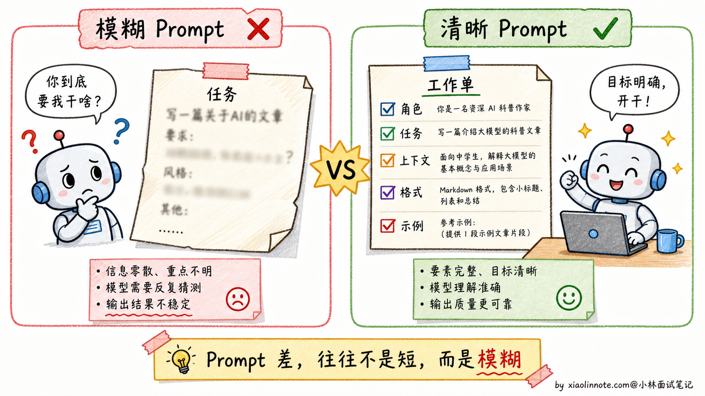
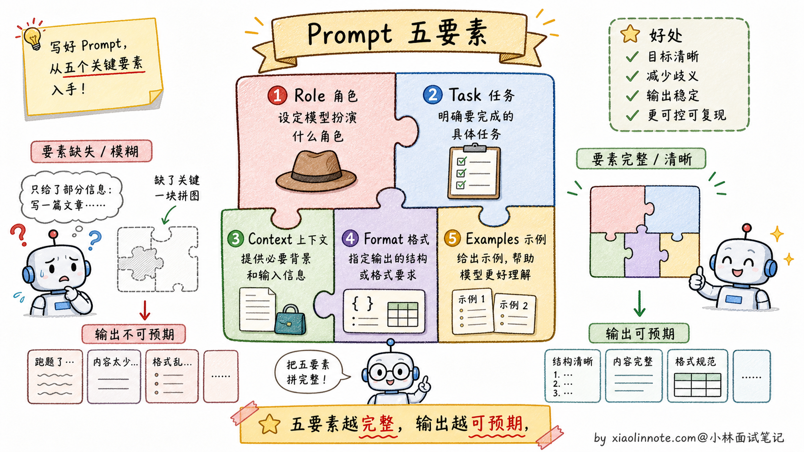
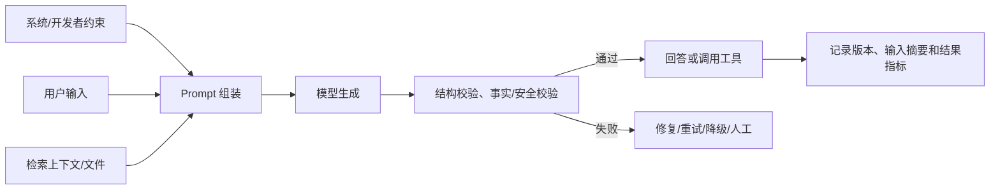
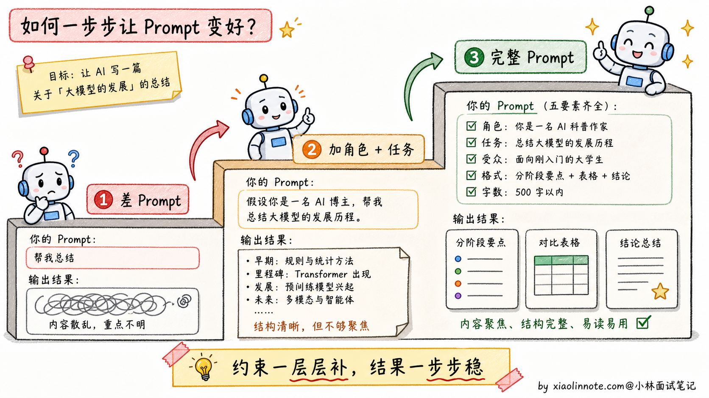
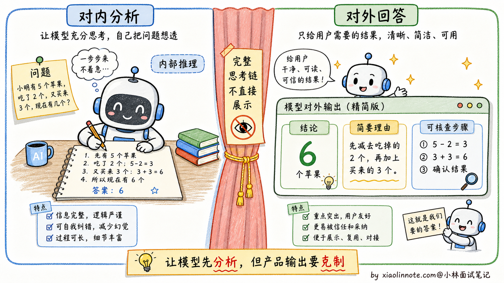
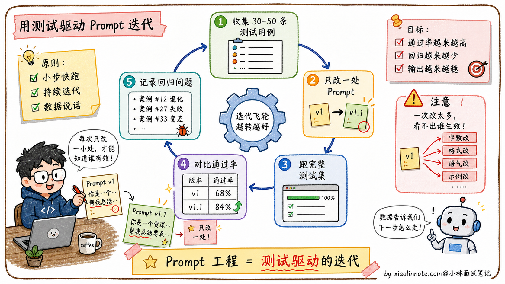
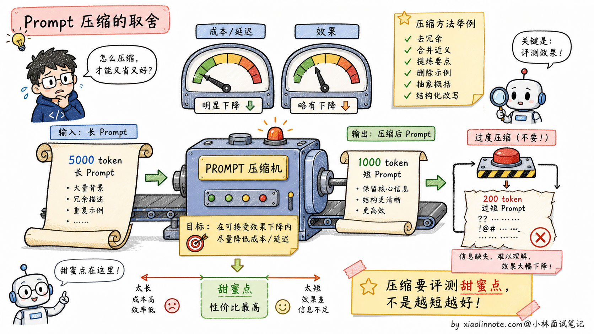

# 如何写好 Prompt？分享下 Prompt 工程实践经验？

> 原文：[如何写好 Prompt？分享下 Prompt 工程实践经验？](https://xiaolinnote.com/ai/llm/prompt_engineering.html) · 小林面试笔记


👔面试官：来讲讲怎么写好 Prompt？分享下 Prompt 工程的实践经验？

🙋‍♂️我：写 Prompt 主要就是把问题描述清楚，让模型知道我要什么。

👔面试官：……「描述清楚」是空话。具体写好 Prompt 要做哪几件事？大多数新手写 Prompt 出错，错在哪？

🙋‍♂️我：呃……可能是写得太短？

👔面试官：不只是太短。Prompt 写不好通常不是因为太短，而是因为「**模糊**」，没说清楚角色、任务、上下文、格式、示例。这五个要素你能展开讲吗？

🙋‍♂️我：呃，这五个我没有系统总结过。

👔面试官：典型的「会用 ChatGPT 但没真的研究过 Prompt 工程」。Prompt 不是写完就完了，是需要「测试集 + 持续迭代」的工程问题。这种「Prompt 也是工程」的认知没有，去面试就是被怼。回去搞清楚再来。

这几个反问指向的其实是同一件事：Prompt 工程不是「把人话写清楚」就结束，而是要把目标、输入边界、输出契约和评测闭环写清楚。五要素、Few-shot、推理提示、工具/结构化输出和迭代测试都只是可选工具。

## 💡 简要回答

我在实际做项目时踩过不少坑，发现 Prompt 写不好通常不是因为太短，而是因为「模糊」或缺少边界：模型不知道目标、输入前提、输出格式或失败时怎么办。可以用五件事组织答案：说明任务角色/视角、明确任务、交代上下文、约定输出契约、提供代表性示例。格式约束对程序解析很重要，但仍要配合结构化输出能力、校验、重试和拒绝处理。Prompt 不是写完就完了，需要固定测试集和回归评测。

## 📝 详细解析

### 为什么 Prompt 的好坏能决定效果的上限

同一个模型、同一个任务，Prompt 的清晰度、上下文质量和输出契约可能显著影响结果，但提升幅度会随模型、任务和评测集变化，不能预先承诺“一个数量级”。模型只能根据可见输入和自身能力推断目标，Prompt 越模糊，输出分布通常越难控制。

新手写 Prompt 最常见的三个问题是：指令不清晰（「帮我写一篇文章」vs「写一篇面向高中生的 800 字科普文章，解释黑洞是如何形成的」）、缺少关键上下文（模型不知道你是什么行业、你的用户是谁）、没有格式约束（模型自由发挥格式，导致下游解析出错）。这三类问题对应的是 Prompt 设计中最重要的五个要素，逐一来看。



### 五要素拆解

**Role（角色/视角设定）** 是告诉模型以什么视角、受众和约束来回答。它主要改变任务 framing 和表达方式，不会凭空增加模型没有的专业知识；“10 年经验”也不能替代事实来源、工具和评测。

❌ **差的写法：**

```
你是一个助手，帮我分析这段代码。
```

✅ **好的写法：**

```
你是一位有 10 年经验的 Python 后端工程师，专注代码 Review 和性能优化，熟悉常见的安全漏洞。
回答时直接指出问题，解释原因，给出具体的修改方案。
```

区别在于第二版明确了关注点和审查维度，可能让输出更聚焦；经验年限只是示例性的语气设定，不能保证模型真的具备对应经验或结论正确。

**Task（任务描述）** 是告诉模型「做什么」。关键是用清晰的动词，把任务边界说明白，避免歧义。复杂任务要拆成子步骤，不要让模型一步做完所有事。

❌ **差的写法：**

```
帮我写一篇文章。
```

✅ **好的写法：**

```
写一篇面向高中生的 800 字科普文章，主题是「为什么黑洞会弯曲时空」。
用日常生活类比帮助读者理解，避免数学公式，结尾给一个思考题。
```

「帮我写一篇文章」给了模型较多自由度：写什么风格、给谁看、如何验收都不明确。好的写法把受众、主题、风格和验收条件点清楚；字数只是软约束，仍需检查实际输出。

**Context（背景信息）** 是告诉模型「你需要知道的前提」。模型不了解你的业务场景，你需要把关键背景主动塞进 Prompt。有了正确的上下文，模型的表达方式会完全不同。

❌ **差的写法：**

```
把这段话翻译成英文。
```

✅ **好的写法：**

```
这是一份面向海外投资者的商业计划书摘要，需要翻译成英文。
要求：使用正式商务英语，保留所有专业术语，不要口语化，保持原文的段落结构。

[原文内容]
```

第一版没有交代任何背景，模型不知道这段话是什么用途，翻译出来可能是很日常的英文。第二版告诉了模型受众（海外投资者）、用途（商业计划书）和具体要求，输出质量会有本质区别。

**Format（输出格式）** 是告诉模型「以什么形式输出」。这是很多人忽略但最影响实用性的要素，尤其是当输出要被程序解析的时候。

❌ **差的写法：**

```
分析这条用户评论的情感。
```

✅ **好的写法：**

```
分析以下用户评论，以 JSON 格式输出，包含以下字段：
- "summary"：20 字以内的评论概述
- "sentiment"：正面 / 中性 / 负面 三选一
- "keywords"：最多 3 个关键词的列表

[用户评论]
```

没有格式约束时，模型可能输出下游难解析的自然语言。即使 Prompt 要求 JSON，也不能把“看起来像 JSON”当作可靠契约；更稳的做法是使用模型/API 提供的结构化输出或工具参数 schema，再做 JSON Schema、枚举、长度和业务校验，失败时重试或转人工。

**Examples（示例）** 是 Few-shot 学习的一种方式。代表性、覆盖边界且无矛盾的示例可以帮助模型对齐格式和风格，但并非越多越好，也不是每个任务都需要。

对于格式复杂或风格特殊的任务，Few-shot 往往有帮助。示例应覆盖正例、边界例和拒答/不确定情况，并注意不要把敏感数据或错误模式带进去；它不能替代对输出的校验。



### Prompt 的边界、优先级与安全

在真实应用中，Prompt 不是唯一控制面。系统/开发者/用户消息的优先级由所用 API 或框架定义；工具权限、业务鉴权、输出 schema 和服务端策略不能只写在一段自然语言里。外部文档、网页和用户输入都应视为不可信数据，明确包裹并要求模型把其中的指令当作内容而不是上级指令，仍要在工具层做权限和参数校验。



如果 Prompt 里写了“请调用某工具”，这不等于模型一定调用，也不等于调用一定安全；真正的权限、幂等性、超时、审计和副作用控制应在工具服务端实现。

### 从差 Prompt 到好 Prompt：完整改造示例

光看五要素还是有点抽象，来看一个端到端的改造过程，感受一下「加一层约束，效果跳一个台阶」的规律。

场景：让模型给一篇技术博客生成摘要。

**第一版（差）：**

```
帮我总结一下这篇文章。

{文章内容}
```

这个 Prompt 几乎没有任何约束，问题很多：没有角色（模型用什么视角总结？），没有字数限制（总结多长算总结？），没有受众定义（给普通人还是给工程师看？），没有格式要求（一段话还是分点？）。结果往往是模型随机发挥，每次输出都不稳定。

稍微改一改，加上角色和任务的描述，

**第二版（加了角色 + 任务）：**

```
你是一位技术文档编辑。

请总结以下文章，提炼核心观点。

{文章内容}
```

有进步了，模型知道自己是「技术编辑」了，输出会更专业一些。但问题还是很多：「提炼核心观点」还是太模糊，输出多长？格式是什么？给谁看的？缺少这些约束，输出质量仍然不稳定。

再进一步，把所有要素都补全，

**第三版（完整好 Prompt）：**

```
你是一位技术内容编辑，负责为工程师受众提炼文章精华。

## 任务
对以下技术博客进行摘要提炼。

## 要求
- 摘要总长度：100-150 字
- 受众：有 2-3 年经验的后端工程师，熟悉基础概念，不需要解释入门知识
- 输出格式：
  - **一句话结论**：20 字以内，直接说文章最核心的观点
  - **要点列表**：3 条，每条不超过 30 字
  - **适合人群**：一句话说明哪类读者最该看这篇文章

## 文章内容
{文章内容}
```

这一版把五个要素都补全了：角色（技术内容编辑）、任务（摘要提炼）、背景（后端工程师受众）、格式（三段式固定结构）、长度约束（100-150 字）。交给不同模型、在不同时间执行，输出格式和质量都会高度稳定。这就是好 Prompt 的核心价值，**可预期、可复用、可迭代**。



### 进阶技巧

掌握了五要素之后，还有几个进阶技巧能进一步提升 Prompt 的可靠性和推理质量。

**CoT（Chain of Thought，思维链）提示**是让模型先组织中间步骤的一种方法。在 Prompt 末尾加上「先分步分析，再给出结论」有时能帮助多步推理或计算，但效果取决于模型、任务和预算；也可能增加延迟、暴露错误步骤或诱导冗长输出，不能当作通用开关。

工程上通常不默认把完整推理链原样展示给最终用户。一方面会增加 token 和延迟，另一方面中间内容可能包含不稳定推断、敏感信息或不适合当作事实依据。更稳的做法是输出简洁的依据、关键步骤或可核查结论，并用程序/工具验证关键结果；是否能获得隐藏推理取决于模型和 API，不能仅靠 Prompt 保证。

**明确分隔符**（XML 标签、Markdown 标题或 JSON 字段）可以帮助模型区分指令、数据和输出契约。某些模型文档会推荐 XML 风格，但它不是 Claude 专属语法，也不自动防御 Prompt Injection。外部内容必须被视为不可信数据：

```
<document>
{这里是要分析的文档内容}
</document>

<task>
根据上面的文档，提取所有提到的日期和对应事件，以表格形式输出。
</task>
```

**先分析后回答** 的结构对部分多步任务有帮助，但应配合验证器和输出预算。对外展示时，建议输出「简要理由」或「检查清单」，而不是把不可验证的 hidden reasoning 当作证据。掌握这些结构技巧后，Prompt 仍需持续迭代。



### 迭代方法论

Prompt 工程本质上是一个「提出假设 -> 测试 -> 优化」的循环，不是一次写完就完事的。

实践中可以先整理一组有代表性的测试用例，覆盖正常、边缘、对抗和拒答情况；每次改 Prompt，在同一测试集上跑回归，并同时看任务完成率、结构合法率、事实性、安全性、token、延迟和成本。如果改动让某些用例变好但另一些变差，就按失败类型拆分，针对不同输入写更清晰的分支或改工具/数据，而不是只堆文字。

改 Prompt 时可以使用小步实验或 A/B 测试来定位因果；当多个改动必须一起上线时，要记录版本、变更点和评测结果，避免凭单个样例判断。



### 进阶：Prompt 压缩

写好 Prompt 之后，还有一个工程优化点容易被忽略：**Prompt 压缩**。

为什么需要压缩 Prompt？通常有三个原因：输入 token 会影响上下文预算和部分计费；更长的 prefill 可能增加首 token 延迟；过多示例和检索内容还会稀释真正重要的约束。但实际费用、缓存折扣和延迟取决于模型、服务商、批量、硬件和 Prompt Cache，不能按“每增加固定 token 就增加固定毫秒”估算。

但 Prompt 里可能有冗余信息。可以合并重复约束、删除不影响判定的修辞，并用代表性示例替代大批相似样例；删除前要确认没有丢掉边界、安全规则、字段定义或验收条件。

主流的 Prompt 压缩方案有两类：

**1. LLMLingua（微软提出）**

用一个压缩模型或算法估计 token/片段重要性，删除或重写信息量低的部分。具体压缩比例、质量损失和适用任务以论文与自己的评测为准，不能把某个实验结果写成通用保证；实现选型也要检查许可证、模型版本和维护状态。

**2. Embedding 表示**

把文本压成固定长度 embedding 再让生成模型直接使用，并不是通用推理接口的 Prompt 压缩；它需要模型训练或架构支持 soft prompt/连续提示，且可能损失精确 token 信息。普通应用更常用删减、摘要、检索重排、缓存或结构化状态。

实际工程里 Prompt 压缩适合长上下文 RAG、重复 Few-shot 或固定系统提示等场景，但压缩检索证据可能删除限定条件或出处。应保留文档标识、权限边界和关键证据，并在同一测试集上比较质量、成本、延迟和安全性。

需要注意的是，**压缩对效果有损失**。压得越狠损失越大，工程上要在「省钱省时间」和「效果衰减」之间找平衡点。建议在自己的测试集上评测，找到「压到多少 token 效果还能接受」的甜蜜点。



## 🎯 面试总结

回到开头那段对话，问到怎么写好 Prompt，最重要的是先把**新手最容易踩的雷**讲出来：Prompt 写不好通常不是因为太短，而是因为「**模糊**」，没说清楚角色、任务、上下文、格式、示例。这一句先点出来，面试官就知道你抓到了核心问题。

接下来讲**五要素拆解**：Role（角色/视角）、Task（任务边界）、Context（必要背景）、Format（输出契约）和 Examples（代表性 Few-shot）。程序解析场景还要配合 schema、校验和失败处理，不能只依赖文字约束。

然后讲**进阶技巧**：CoT/分步提示可能帮助部分多步任务，但要控制预算并验证；XML 或其他分隔符有助于区分数据与指令，但不能防注入；「先分析后回答」应结合检查清单、工具或验证器。这些是可测试的策略，不是固定配方。

最关键的是讲**Prompt 是工程问题，不是一次写完就完事的**。要建覆盖正常、边缘、对抗和拒答的回归集，每次改动都比较任务质量、结构合法率、安全、token、延迟和成本，并记录版本与失败样例。

如果还想再加分，可以提一句 **Prompt 压缩**（删除冗余、摘要、检索重排、缓存或专用压缩算法）作为长 Prompt 的优化，并强调必须在自己的测试集上验证证据完整性和安全边界。

---
