# 大模型量化是什么？INT8/INT4/AWQ/GPTQ 怎么选？

> 原文：[大模型量化是什么？INT8/INT4/AWQ/GPTQ 怎么选？](https://xiaolinnote.com/ai/llm/quantization.html) · 小林面试笔记


👔面试官：来讲讲什么是大模型量化？INT8、INT4、AWQ、GPTQ 这些方案怎么选？

🙋‍♂️我：量化就是把模型参数从 32 位变成 8 位或 4 位，让模型变小、跑得更快。AWQ、GPTQ 都是常见的量化方法。

👔面试官：……「变小变快」是表面现象。深一点说，量化的核心做了什么事？为什么 16 位的 FP16 可以直接降到 4 位的 INT4 而效果还能用？精度去哪了？

🙋‍♂️我：哦哦，应该是把数值范围映射到更少的离散值上吧？

👔面试官：对，但「怎么映射」就是量化方案的核心差别。AWQ 和 GPTQ 各自怎么映射？为什么一个叫「激活感知」一个叫「误差补偿」？再说，QLoRA 用的是哪种量化？为什么 INT4 量化后的模型还能微调？

🙋‍♂️我：呃……我用过 GGUF 文件，不知道里面是 AWQ 还是 GPTQ。

👔面试官：GGUF 是文件格式，不是量化算法。量化算法和文件格式是两层东西，混淆这两层就是没真正搞清楚。回去补一下。

到这才搞明白，量化这道题不是「把 16 bit 砍成 4 bit」这种粗略说法。要先区分权重/激活/KV Cache 的量化对象、数值格式、校准方式、算法和文件格式，再讨论质量、速度、显存与 LoRA 的取舍。

## 💡 简要回答

我理解量化（Quantization）的本质是把权重、激活或缓存中的高精度数值映射到更低比特的离散表示，例如 INT8、INT4、FP8 或 NF4；不一定都是整数，也不一定只量化权重。

核心收益通常是降低权重/缓存的存储与带宽压力；速度是否提升取决于量化格式、反量化位置、GPU/CPU 指令、kernel、batch 和框架，不能从位数直接推出固定倍数。以十进制参数量粗算，7B 权重的 FP16 原始容量约为 14 GB，INT4 约为 3.5 GB，但分组 scale、元数据、运行时缓冲和 KV Cache 还要另算。

主流量化方案分两个维度。

**数值格式/位宽维度**：FP16、BF16、FP8、INT8、INT4、NF4 等。位宽、动态范围、分组方式和校准共同决定质量；低位通常更省，但不保证误差单调或某个位宽在所有任务上都“甜蜜”。

**算法维度**：

- **GPTQ（GPT Quantization）**：常见的后训练、逐层权重量化路线，利用校准激活和近似二阶信息在量化过程中补偿误差；具体位宽、分组和 kernel 支持要看实现
- **AWQ（Activation-aware Weight Quantization）**：利用校准激活识别更敏感的通道/权重，并通过缩放与保护减少权重量化误差；效果和速度依赖模型、校准数据与 kernel
- **QLoRA 里的 NF4**：NormalFloat 4-bit，是针对权重分布设计的非均匀低比特格式；QLoRA 还结合冻结的量化基座、LoRA 适配器、双重量化和分页优化器，显存门槛取决于模型、序列长度、batch 和训练配置

**怎么选**：

- 部署生产环境、看重推理速度：优先评估 **AWQ / GPTQ / FP8 / 框架原生 INT4**，具体看 vLLM、SGLang、TensorRT-LLM 当前版本支持哪种 kernel，不能简单说某个框架默认就是 AWQ
- 部署生产环境、追求最高精度：先以 FP16/BF16/FP8 等基线压测，再评估与目标 kernel 匹配的低比特方案
- 个人微调、显存受限：评估 QLoRA/NF4 或其他 PEFT 低比特路线，不能按显卡型号直接保证可训练
- 极端压缩（边缘设备）：按目标运行时选择 INT3/INT4 或 GGUF 中的具体量化类型，并重点测质量、内存和速度

实测精度损失要看模型、任务、校准数据、量化粒度和推理实现。更低位宽通常需要更谨慎，数学、代码、长上下文和工具参数生成可能比普通聊天更敏感；任何“接近无损”都应被视为待验证假设。

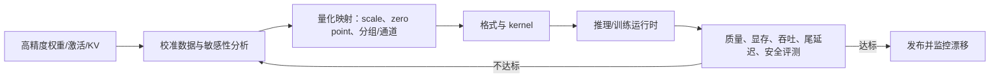

最关键的认知是，**量化算法（GPTQ/AWQ）和文件格式（GGUF/safetensors）是两层东西**。GPTQ 和 AWQ 是「怎么把高精度变低精度」的算法，GGUF 是 llama.cpp 用的「怎么存这些低精度权重」的文件格式。两者经常被混淆，理清这层关系是答好这道题的基本功。

## 📝 详细解析

### 量化是什么？为什么大模型必须量化

要理解量化，先回到一个最基础的问题：**模型参数本质是什么？**

每个参数就是一个数字。在训练时，主流做法是用 **FP32（32 位浮点）** 或 **FP16（16 位浮点）** 来存储这些数字，因为浮点数能表达的数值范围广、精度高，对训练时的梯度计算友好。

但部署时，FP16 就显得很奢侈了。来算一下显存占用：

```
7B 模型 FP16: 7 × 10⁹ × 2 字节 = 14 GB
70B 模型 FP16: 70 × 10⁹ × 2 字节 = 140 GB
```

一个 70B 模型的 FP16 权重原始容量约为 140 GB；实际部署还要加 KV Cache、运行时缓冲、并行副本和框架开销，能否运行取决于精度、上下文、batch、卸载和并行策略，不能由这条算式推出固定卡数。

如果把 FP16（16 比特）降到 INT4（4 比特），存储占用直接砍到 1/4：

```
7B 模型 INT4: 7 × 10⁹ × 0.5 字节 = 3.5 GB
70B 模型 INT4: 70 × 10⁹ × 0.5 字节 = 35 GB
```

这些只是忽略元数据和运行时开销的容量下界，不代表某一型号 GPU 一定能稳定服务目标上下文和并发。量化常用于降低部署门槛，但是否值得要用目标运行时压测。

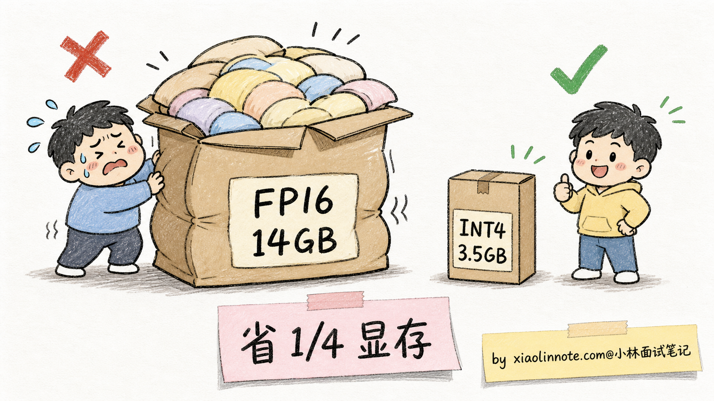

显存只是一方面，量化还可能降低权重带宽压力。若硬件和 kernel 对低比特友好，速度可能提升；若反量化、布局转换或算子不匹配，速度也可能不变甚至下降。访存量也会受到 scale、元数据、激活和缓存的影响，不是简单的 1/4。

但量化不是免费午餐。把高精度数压到低比特的有限离散表示，通常会引入舍入、裁剪或近似误差；INT4、NF4 等格式的刻度也不一定是均匀整数级。整个量化算法的核心，就是回答一个问题：**如何在最小的精度损失下，把高精度数压到低比特表示？**

### 量化的核心：映射连续到离散

要理解量化算法，得先搞清楚最基础的「映射」机制。

假设我们有一组 FP16 权重，数值范围在 [-2.5, 2.5] 之间，要把它们量化到 INT4（只有 16 个离散值；有符号范围、是否对称由实现决定）。最朴素的做法叫**线性量化**：

```
以对称、近似 [-8, 7] 的实现为例：scale ≈ max_abs / 7（也可能按组计算）
量化:    q = clip(round(fp_val / scale), -8, 7)
反量化:  fp_val ≈ q × scale

若使用非对称量化，则还会估计 zero_point：
q = clip(round(fp_val / scale) + zero_point, q_min, q_max)
反量化: fp_val ≈ (q - zero_point) × scale
```

如果示例 scale 取 0.333，权重值 0.7 会被近似到 q=2，反量化约为 0.666；真实误差还取决于 scale、分组和裁剪。

这就是量化的基本套路。不同算法的差别，在于**怎么算 scale 和 zero_point**、**怎么处理 outlier（异常大的权重值）**、**怎么补偿量化误差**。

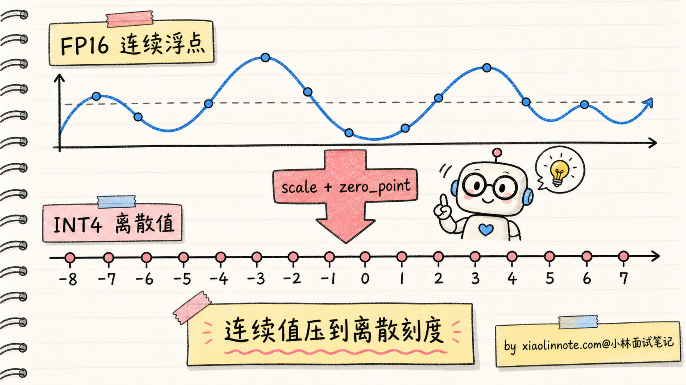

实际工程里，量化还分两种风格：

**对称量化（Symmetric）**：假设数值对称分布在 0 周围（min = -max），不需要 zero_point，公式更简单。适合权重这种通常对称分布的数。

**非对称量化（Asymmetric）**：数值不对称（比如 ReLU 之后的激活值都是正数），需要 zero_point 把范围对齐。适合激活值这种偏分布的数。

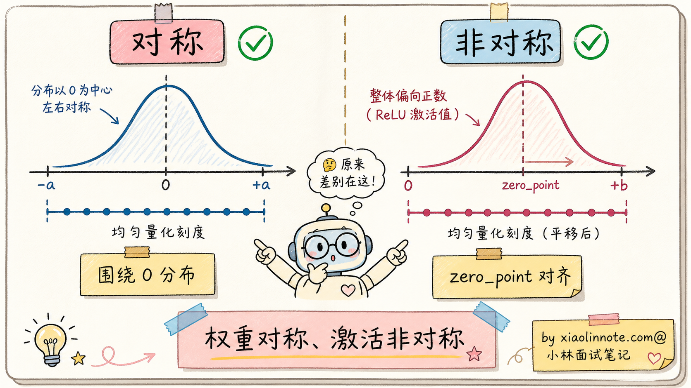

理解了基础映射机制，下面看不同位数下精度的实际表现。

### INT8 / INT4 各自的精度边界

不同位数的量化，精度损失差别很大。来看实测数据：

| 表示/位宽 | 原始权重容量趋势 | 典型质量风险 | 适用判断 |
| --- | --- | --- | --- |
| FP16/BF16 | 作为较高精度基线 | 成本和显存较高 | 先做质量/性能基线 |
| INT8/FP8 | 约为 FP16 的一半量级，实际有格式开销 | 通常较稳，但仍可能伤害敏感层/任务 | 显存或带宽受限且 kernel 友好时评估 |
| INT4/NF4 | 约为 FP16 的四分之一量级，实际有 scale/元数据 | 数学、代码、长上下文、工具参数可能更敏感 | 显存受限的常见候选 |
| INT3/INT2 等 | 更省存储 | 质量和运行时支持风险明显上升 | 只有在极端压缩目标下评估 |

INT8/FP8 在很多设置下可能较接近高精度基线，但不能叫“免费午餐”；涉及数学、代码、长上下文、工具调用时，仍要在自己的业务集上评测。

INT4/NF4 是常见候选，但质量是否可接受、体积是否接近四分之一、推理是否加速都取决于分组、元数据、kernel 和任务。不同推理框架对 INT4、GGUF、GPTQ、AWQ、FP8 的支持与限制不同，应以目标版本文档和实测为准。

INT3、INT2 等更低位宽通常更需要谨慎；误差不一定随位宽线性变化，某些层或任务可能出现突变，但不能给所有模型规定统一的退化曲线。

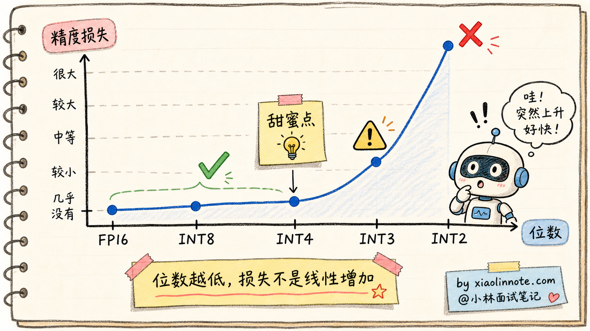

更重要的是，**精度损失不是均匀分布的**。数学推理、长链路逻辑、代码和工具参数生成可能比普通分类更敏感，因此应报告分任务结果，而不是只给一个平均百分比。GPTQ、AWQ 等校准方法是在这个背景下减少误差的工程路线。

### GPTQ：基于误差补偿的逐层量化

GPTQ（GPT Quantization）是公开的后训练权重量化路线，核心思路是「**逐层量化 + 基于校准激活的误差补偿**」。

朴素量化的问题是：每层独立量化，量化误差可能逐层累积。GPTQ 使用近似二阶信息在当前层的量化过程中调整其他权重，以减少该层输出误差；不要简单理解为把误差“写到下一层”。

具体流程：

1. 准备能代表目标分布的校准数据，规模由实现和预算决定
2. 让模型用 FP16 跑一遍校准数据，记录每层的输入激活值
3. 从第一层开始，逐层做量化：
  - 用输入激活与近似 Hessian 信息估计量化敏感度
  - 量化重要性低的权重时损失最小
  - 量化产生的误差，反向修正后面还没量化的权重
4. 一层量化完，进入下一层，重复

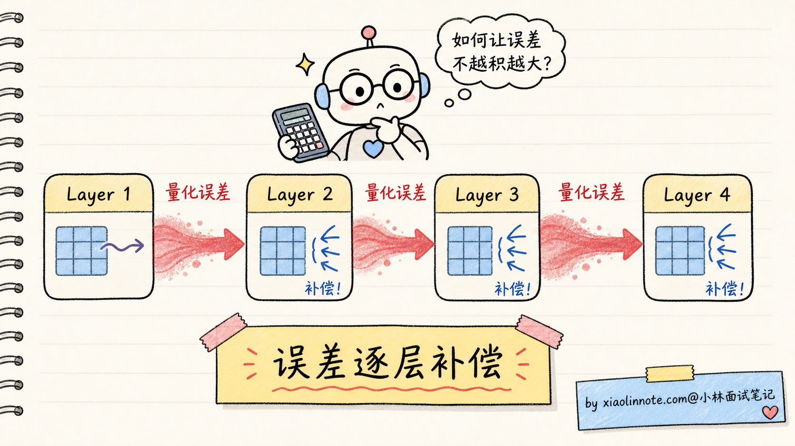

GPTQ 的优点：

- **利用二阶近似**：比只按数值范围量化更关注输出误差
- **可支持较低位宽**：具体 INT3/INT2 是否可用，取决于实现、模型和任务
- **主要是权重量化**：对常见 Transformer 可用，但不等于对所有结构和运行时都通用

GPTQ 的缺点：

- **量化有额外计算**：需要逐层校准与误差处理，耗时随模型、校准集和实现变化
- **校准数据有依赖**：选错校准数据，量化效果会变差
- **通常是权重为主**：激活值、KV Cache 和算子是否量化要看具体方案；权重量化不自动保证端到端速度提升

GPTQ 常用于需要离线校准的权重量化场景。生态工具和运行时支持会随版本变化，选择时应检查目标框架对权重格式、kernel、并行和加载流程的支持。

### AWQ：激活感知的权重保护

AWQ（Activation-aware Weight Quantization，激活感知权重量化）是一类利用校准激活识别敏感权重/通道的后训练路线。

研究中观察到少量权重或通道可能对激活输出更敏感，因此引入 **Salient Weights（显著权重）** 的概念；比例、贡献和保护方式随模型与层而变，不能记成固定比例。

但问题是，怎么找到这些敏感权重或通道？AWQ 的方法会利用校准数据中的「**激活值大小与敏感性**」。

直觉是这样的：线性层输出受权重 W 与激活 X 的共同影响。如果某些输入通道在校准数据中的激活更敏感，对应权重的量化误差可能更影响输出，量化时就需要更谨慎；不能只看单个 token 的绝对倍数。

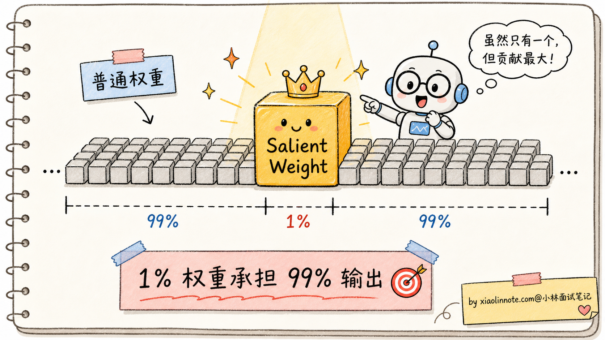

具体实现通常通过逐通道缩放、保护或等价变换，让敏感通道在量化后保留更多有效精度；缩放、反缩放和算子融合是否严格等价，要看实现与数值误差。

AWQ 的优点：

- **运行时潜力**：某些 GPU kernel 对 AWQ 布局优化较好，但速度必须在目标硬件和框架上实测
- **质量取舍**：激活感知可能改善某些模型的低比特质量，不能保证总是优于 GPTQ
- **校准开销可控**：不依赖与 GPTQ 完全相同的二阶步骤，但校准规模和耗时仍随实现变化

AWQ 的缺点：

- **极端低位的结果依赖实现**：更低位宽需要单独比较 AWQ、GPTQ 或其他方法
- **需要校准数据**：和 GPTQ 一样，量化前要跑一批校准

实践中，AWQ 是生产部署的候选之一，但是否均衡取决于模型、框架、GPU kernel 和服务目标。选型时还要比较 GPTQ、bitsandbytes、FP8、不同 kernel 和 GGUF 路线，不能脱离运行时谈算法优劣。

### QLoRA 与 NF4：让消费级 GPU 微调成为可能

GPTQ 和 AWQ 主要解决「**部署时**」的量化问题。但还有一个更激进的需求：**能不能让 4-bit 量化的模型还能继续微调？**

这就是 QLoRA（Quantized LoRA）要回答的问题。公开 QLoRA 工作提出了 NF4（NormalFloat 4-bit）等设计，配合冻结的低比特基座和 LoRA 适配器，降低了微调显存门槛；能否在某张卡上训练仍取决于模型、序列长度、batch、梯度检查点、优化器和框架。

NF4 是一种**非均匀量化**。普通 INT4 是均匀分隔（16 个值平均分布），NF4 利用了一个事实：**模型权重的分布近似于均值为 0 的正态分布**。

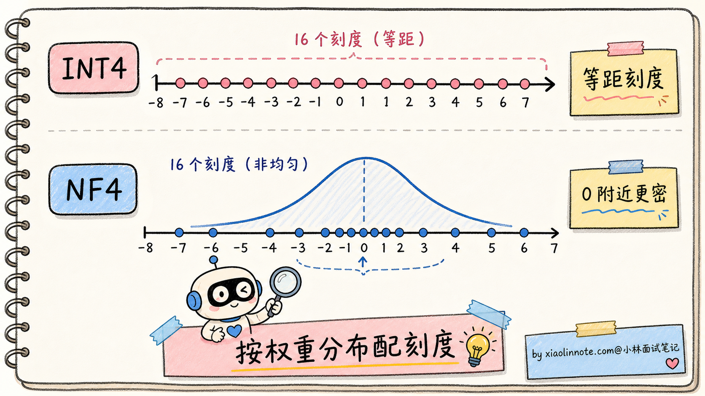

NF4 把 16 个量化值的分布也设计成正态分布形状，让密集区域（0 附近）有更多刻度、稀疏区域（远离 0）刻度少。这样量化误差更小。

QLoRA 在 NF4 基础上还加了两个优化：

**1. 双重量化（Double Quantization）**：连量化用的 scale 常数也再量化一次，进一步省显存
**2. 分页优化器（Paged Optimizer）**：通过分页/统一内存等机制缓解优化器状态的显存峰值，但可能引入 CPU-GPU 传输和性能代价

最终效果是显著降低了许多模型的微调门槛，但不要根据显卡型号和参数量直接保证可训练；应按目标 batch、上下文、LoRA rank、量化格式和是否允许 CPU offload 实测。

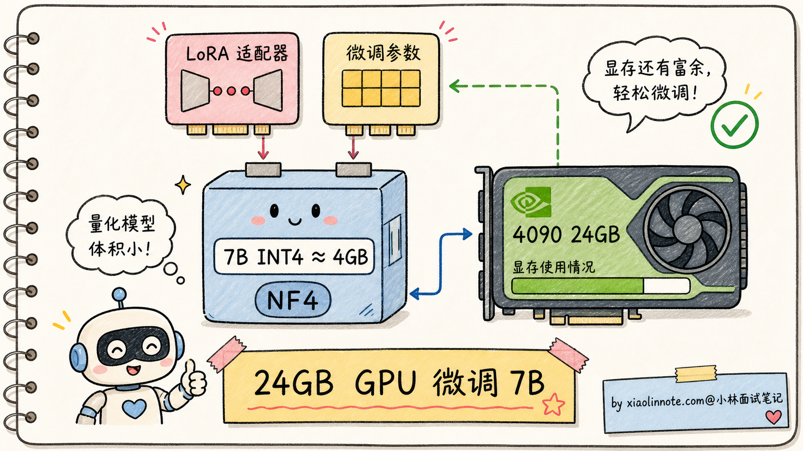

QLoRA 是量化与参数高效微调结合的典型案例：基座权重可保持冻结，梯度主要更新 LoRA 适配器；这不等于任意 INT4 权重都能直接训练，也不等于全量权重保持低比特反向传播。

### 怎么选量化方案

讲到这里，数值格式、后训练量化算法、文件格式和 QLoRA 的边界都梳理完了。实际选型怎么看？

| 场景 | 推荐方案 | 理由 |
| --- | --- | --- |
| **生产部署，看重推理速度** | AWQ / GPTQ / FP8 / 框架原生 INT4 | 看目标框架和 GPU kernel 支持，不能只背一个名字 |
| **生产部署，追求最高精度** | FP16/BF16/FP8 与低比特方案都做基线 | 先看质量门槛，再看显存、吞吐与尾延迟 |
| **个人微调，显存受限** | QLoRA NF4 等低比特 PEFT | 按模型、上下文、batch 和 offload 实测 |
| **边缘部署（手机/笔记本）** | 目标运行时支持的 GGUF/INT3/INT4 等 | 重点是内存峰值、算子覆盖与功耗 |
| **批量推理，CPU 部署** | 适配 CPU 的运行时与量化格式 | 测并发、上下文、线程数与首 token 延迟 |

几个关键提示：

**1. AWQ vs GPTQ 怎么选？** 线上部署可以先试 AWQ、GPTQ 或框架推荐的 INT4 路线，但推理 kernel、量化耗时和质量结果都要实测。GPTQ 在已有 GPTQ 权重或校准流程匹配时也常见。不要脱离框架支持谈算法好坏，最后跑得快不快取决于量化格式、kernel 和服务负载。

**2. INT4 vs INT8 怎么选？** 显存够、质量要求高，就优先用 FP16/BF16/FP8/INT8 建立基线；显存不够或带宽敏感，再评估 INT4。大模型上 INT4 可能是折中候选，但不是唯一选择，具体还要看硬件、并发、上下文长度、量化 kernel 和质量门槛。

**3. GGUF 是什么？** 它不是量化算法，是 llama.cpp 用的**文件格式**。GGUF 内部可以存各种量化方案的权重（Q4_K_M、Q5_K_M、Q8_0 等），是一个容器。这跟 AWQ/GPTQ 是「**算法**」不是一个层级。

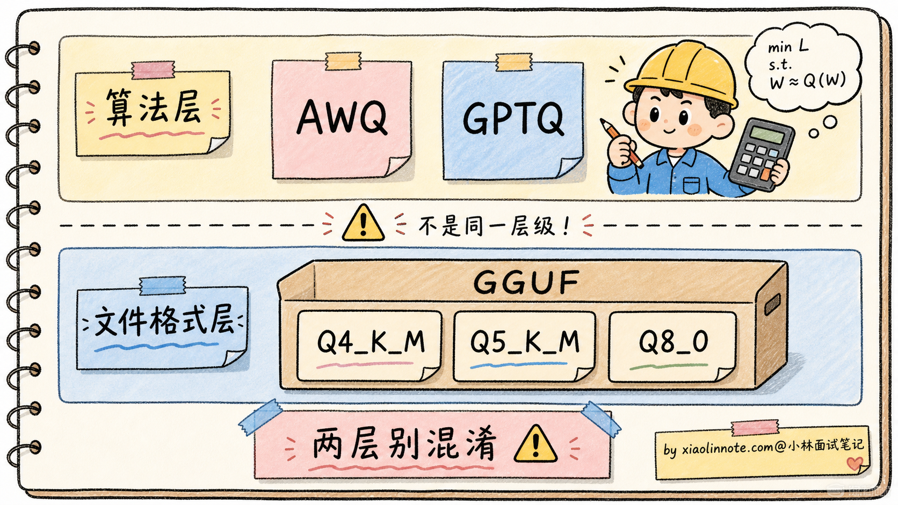

### 量化的副作用与陷阱

量化看起来很美，但有几个常见的陷阱要警惕，否则上线后会被用户骂。

**1. Outlier（异常值）问题**

模型权重或激活里可能出现相对突出的值；如果按过大的统一范围量化，普通值的有效刻度会变少。outlier 的分布和处理方式随模型、层和量化对象而变。

应对：可以使用逐通道/逐组缩放、保护敏感通道、校准或混合精度；AWQ、GPTQ 等方法的具体处理不同，不能把它们的机制混为一谈。

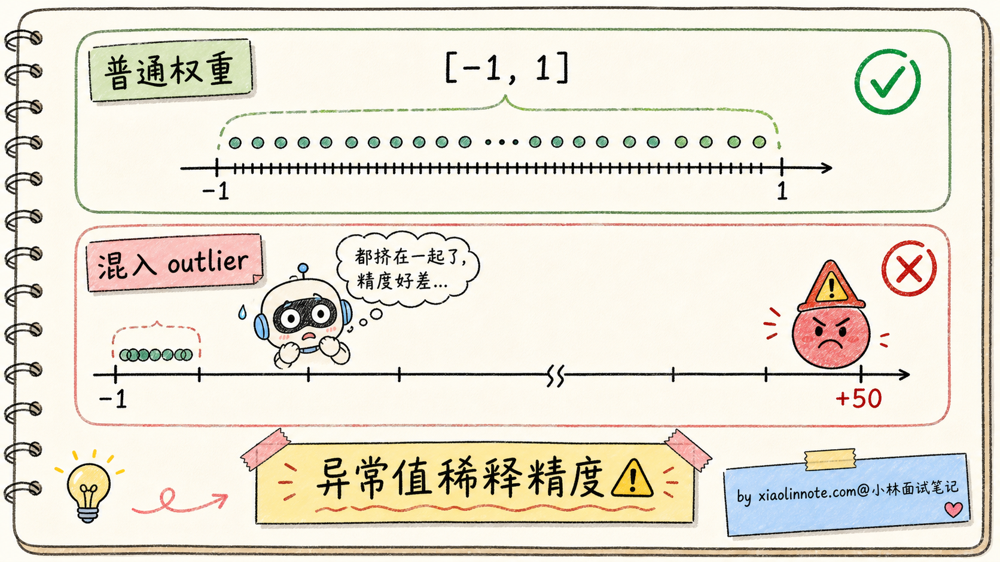

**2. KV Cache 量化的挑战**

权重量化和 **KV Cache 量化**是不同问题。KV Cache 的收益与风险取决于上下文长度、head 结构、量化粒度和运行时；它可能节省显存，但会影响长上下文、数学、代码或检索任务，必须单独评测，不能从权重量化结果推断。

**3. 不同任务的精度敏感度差异巨大**

不要把固定的“INT4 损失百分比”当作通用平均值。具体到某个任务，简单分类、抽取、通用对话、数学推理、长链路代码生成和工具调用可能呈现完全不同的敏感度。

所以**部署量化模型前必须在自己的业务场景下做评测**，不能直接看论文里的平均数。


**4. 和其他优化的兼容性**

量化要和 Flash Attention、KV Cache、Speculative Decoding 等其他推理优化同时使用，不同框架的支持度不一样。AWQ、GPTQ、FP8、GGUF 在不同框架里的成熟度和性能差异很大。选量化方案前先看你的部署框架支持哪些，再用自己的业务集压测质量和吞吐。

## 🎯 面试总结

回到开头那段对话，问到大模型量化，最重要的是先把**量化对象和表示**讲清楚：可以把权重、激活或 KV Cache 从高精度表示映射到 INT8、INT4、FP8、NF4 等低比特格式，核心机制常包含 scale、zero point、分组和校准。收益主要是降低存储与带宽压力，速度和质量要实测，不能给固定倍数。

接下来讲精度边界。更低位宽通常更省，但质量不只由位数决定；INT8/FP8、INT4/NF4、INT3 等都要结合模型、校准、kernel 和任务评测。这种“误差非均匀、敏感任务要单独测”的认知，比背固定百分比更可靠。

然后把 GPTQ、AWQ、QLoRA NF4 的边界讲清。GPTQ 是「逐层量化 + 基于校准的误差补偿」；AWQ 是「激活感知 + 敏感通道保护」；QLoRA NF4 是低比特冻结基座 + LoRA 适配器的训练路线。能区分算法、格式、运行时和训练方案，就比纯背名字更可靠。

最关键的是**选型经验**：生产部署先看框架、GPU/CPU kernel 和格式支持，再对 FP16/BF16、FP8/INT8、AWQ/GPTQ/其他 INT4 路线压测；个人微调再评估 QLoRA NF4；边缘设备看目标运行时支持的格式。还要明确 **GGUF 是文件格式/容器，不是量化算法**，避免和 AWQ/GPTQ 混淆。

如果还想再加分，可以提一句量化的常见陷阱：outlier、KV Cache 与权重量化边界、格式和 kernel 不匹配、校准数据偏移，以及不同任务的敏感度差异；最后强调业务集上的质量、延迟、吞吐、显存和安全评测。

---
