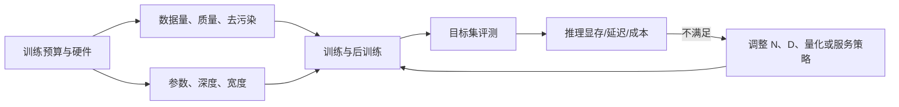
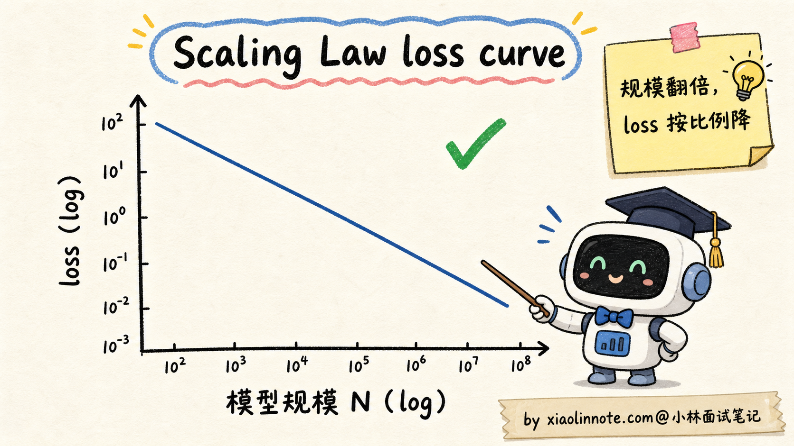
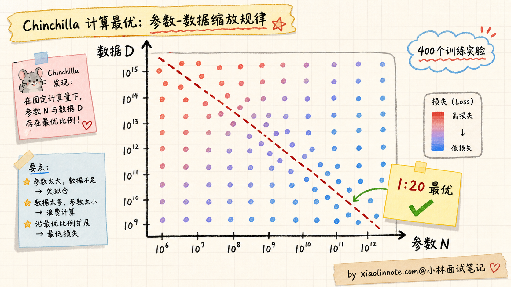
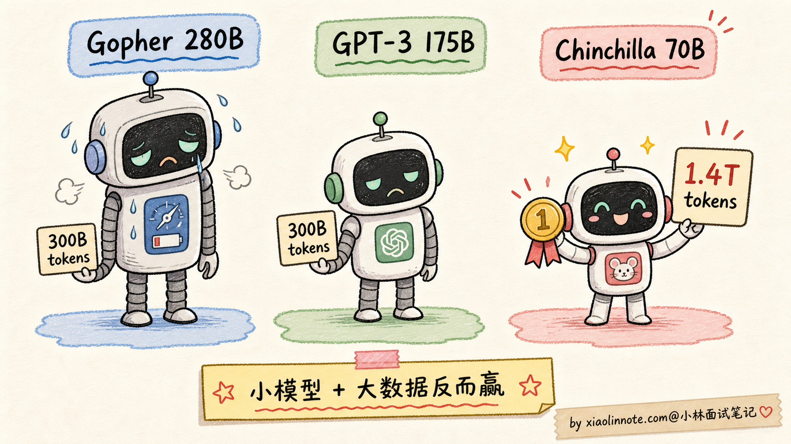
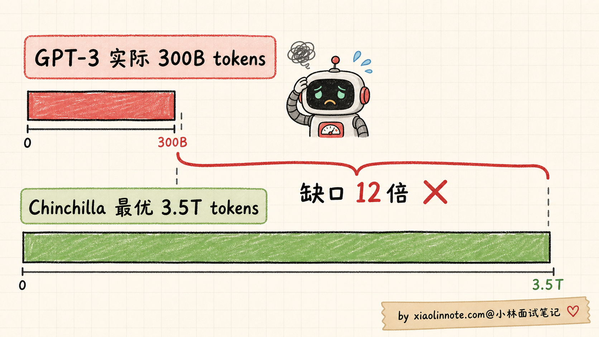
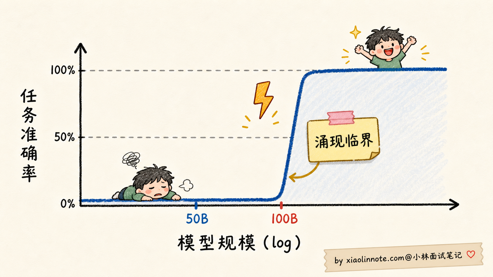
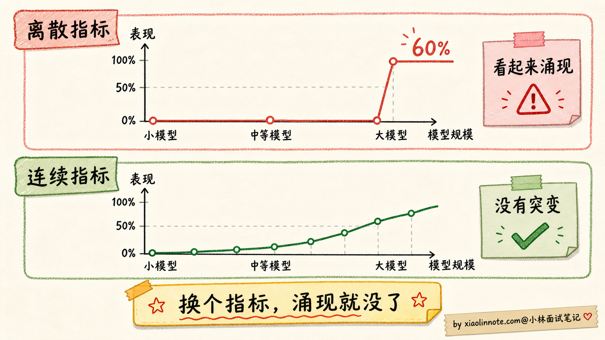
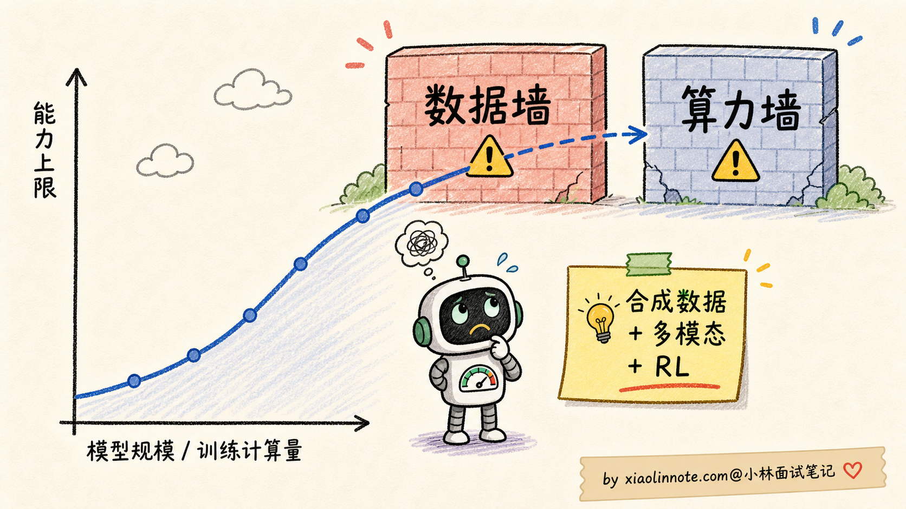

# 什么是 Scaling Law？大模型的「涌现能力」是怎么回事？

> 原文：[什么是 Scaling Law？大模型的「涌现能力」是怎么回事？](https://xiaolinnote.com/ai/llm/scaling_law_emergence.html) · 小林面试笔记


👔面试官：来讲讲什么是 Scaling Law？大模型的「涌现能力」是怎么回事？

🙋‍♂️我：Scaling Law 就是模型越大越好嘛，参数越多效果越强。涌现能力就是大模型突然变强了。

👔面试官：……「越大越好」是错的。Chinchilla 论文你看过吗？为什么 GPT-3 175B 后来被一个 70B 的小模型超过？「越大越好」忽略了什么变量？

🙋‍♂️我：哦哦，可能还要看数据量？

👔面试官：对了一半。那具体的最优配比是什么？为什么是这个比例？再说，「涌现」具体是指什么？是不是越涌现越好？为什么有人说涌现可能是「测量假象」？

🙋‍♂️我：呃……测量假象我没听过。

👔面试官：2023 年斯坦福一篇论文 *Are Emergent Abilities of Large Language Models a Mirage* 提出了挑战，认为很多涌现现象只是评估指标设置带来的错觉，换个连续指标曲线就平滑了。这种学术争议都不知道，去面试就是被怼。回去补一下。

这几下追问其实在敲两件事：Scaling Law 不是一句「越大越好」，涌现也不是「玄学闪现」。要同时讲清损失曲线、训练目标、数据质量、推理成本和评测指标；Chinchilla 的比例是特定实验条件下的 compute-optimal 经验点，不是所有模型都必须遵守的常数。

## 💡 简要回答

我理解 Scaling Law（缩放定律）讲的是在一定模型族、数据分布、优化器和训练预算下，损失或能力指标如何随**模型规模、训练数据量、训练算力**变化的经验关系。早期工作与 Chinchilla 等研究提供了重要拟合，但指数和最优分配会随模型、数据、上下文、目标函数和硬件改变。

核心发现是三个。

**第一**，在研究范围内，损失常可用幂律或近似幂律拟合（例如 `loss ≈ A·N^-α + B` 的简化形式），但拟合有范围、误差和不可外推的边界；规模翻倍并不保证能力指标等比例提升。

**第二**，参数和数据要按训练预算、数据质量和目标共同分配。Chinchilla 报告了接近 **每参数约 20 个 token** 的一个 compute-optimal 经验点；这是其模型族、数据和算力范围下的拟合，不是数据/参数的普适定律。论文中的模型对照可以说明“更大模型可能因数据不足而欠训”，但不要把它外推为所有模型的固定排名。

**第三**，后续工作可能使用远高于该比例的 token，继续训练小模型以换取更低推理成本。更准确地说，1:20 是“固定训练算力下如何分配参数和数据”的经验点，不是“数据再多就一定没用”的上限；多喂数据仍要考虑重复、质量、去污染和边际收益。

**涌现能力（Emergent Abilities）** 通常指在某项评测上，小模型表现近似为零，而规模增大后指标出现明显跃升或跨过实用阈值。它不一定对应统一的参数临界点；多步推理、上下文学习、跨语言和代码能力都应绑定具体数据集、提示、解码与指标讨论。

但要注意，关于“涌现”是否是模型内部的突变仍有争论。有研究指出，精确匹配等不连续指标会把平滑的概率提升放大成突然跳变；换成连续指标、校准模型规模和控制提示后，结论可能改变。工程上可以观察到能力跨过可用阈值，但不要把它解释成固定的魔法临界点。

对工程选型的启发是：**不是越大越好**，要同时看参数、数据质量、训练算力和推理预算；在目标部署成本固定时，小模型配更多高质量数据可能更划算，但结论要在同一任务和评测协议下验证。



## 📝 详细解析

### Scaling Law 是什么？为什么它震撼了整个业界

要理解 Scaling Law 的重要性，得先回到 2018-2020 年那个语境。

那时候的深度学习圈子里，对「模型加大有没有用」是有分歧的。一派人觉得「模型再大也有上限，参数加多了就饱和了」，另一派人觉得「先把模型加大试试再说」。但谁都没有量化证据，全凭经验和直觉。

早期 scaling-law 研究系统改变模型规模、数据量和训练算力，发现**在一定实验范围内，模型损失可用幂律近似拟合**。这类结果适合做预算和趋势估计，但不是跨架构、跨数据和跨能力指标的物理定律。

数学上写出来是这样的：

```
loss(N) ≈ A · N^(-α_N) + B
```

其中 A、B 和 α_N 都需要由实验拟合，且只在相近的模型族、数据和优化设置下有参考意义。直观理解是：**模型规模增加时，损失可能以递减收益下降**，但不能据此直接预测具体能力或线上指标。



这个发现震撼业界的关键有三点：

第一，**它提供了预算预测工具**。可以在小规模实验上拟合趋势，再估计候选规模的损失区间；这不是对最终质量和产品收益的保证。

第二，研究范围内可能没有观察到明显饱和，但这不意味着无限扩展仍按同一曲线收益；数据、优化、架构、评测和系统约束都可能成为瓶颈。

第三，参数、数据和算力之间存在耦合。单变量拟合可以提供局部敏感度，但不能把三者完全独立后再拼成准确预测，这也是后续 compute-optimal 研究要解决的问题。

早期 scaling law 没有给出所有训练目标下的参数/数据最佳分配。若参数增长快于有效数据和训练步数，就可能出现欠训；GPT-3 常被用作历史对照，但是否“严重欠训”要绑定比较的 compute-optimal 口径。

### Chinchilla 2022：参数和数据要按 1:20 的比例配

DeepMind 的 *Training Compute-Optimal Large Language Models* 工作提出了常被称为 **Chinchilla 缩放定律** 的 compute-optimal 分析，进一步讨论固定训练算力下模型参数和 token 数的分配。

该工作在一组不同规模、不同数据量的 Transformer 训练上拟合损失曲面；具体样本数量、规模和计算设置属于论文实验条件，不应当被概括为所有训练的固定配方。



实验结果表明：**在该研究的固定训练算力、模型族和数据设置下，参数与训练 token 需要一起增长，接近每参数约 20 个 token 的区域更有利于损失**。这个 1:20 不是自然常数，也不是当前所有模型、数据和后训练目标的最佳点；它把注意力从“只堆参数”拉回了“参数和数据要共同规划”。

为了验证这个发现，DeepMind 训了一个对照实验：

| 对照 | 参数/数据口径 | 训练算力/设置 | 可得出的结论 |
| --- | --- | --- | --- |
| Gopher、GPT-3 等历史模型 | 具体以对应论文为准 | 不同 | 可作为历史基线，可能存在参数/数据分配差异 |
| Chinchilla 对照模型 | 论文报告了较小参数、较多 token 的配置 | 与对照接近的训练预算 | 在该实验设置下，训练更充分的模型取得更好损失 |

注意：这个对照的意义是“在相近训练预算下，参数与数据更平衡可能更好”，不是证明某个固定参数倍数或数据倍数在任何任务都有效。



这个对照推动业界重新重视数据规模和训练充分度；不能把它外推成“当时所有大模型都严重欠训”。

如果用参数/token 比例帮助理解：

```
历史模型的参数/token 比例可能明显低于 Chinchilla 研究中的 compute-optimal 区域；具体比例要统一参数统计、token 去重口径和训练数据定义。
```

因此不能从 1:20 直接倒推出 GPT-3“应该配多少 token”，更不能据此做反事实推断；它只能说明历史训练与后续 compute-optimal 目标之间存在分配差异。



Chinchilla 改变了业界对“训练充分度”的讨论。后续公开模型中可以看到明显高于该经验点的参数/token 比例，说明模型可以把更多训练计算投入到高质量数据上，以换取较低的推理成本；但不同模型的 token 统计、数据质量和训练目标不同，不能简单排列成“谁喂得更多谁更好”。

### 小模型与海量数据：优化目标的另一种选择

一些公开模型报告会用较小的参数规模配合大量 token，并在部分基准上超过更早的大模型。这样的结果说明 **1:20 不是数据上限**，而是特定固定训练算力下的分配经验；它不证明任意小模型只要堆数据就能追上大模型。


更准确地说，Chinchilla 的 1:20 是「**给定训练算力时，参数和数据怎么分配更划算**」的经验答案。如果愿意投入更多训练计算，继续使用高质量、去重且覆盖目标任务的 token 可能让 loss 继续下降，但边际收益、过拟合和污染风险需要测量。

所以更准确的说法是：Chinchilla 告诉我们「别只堆参数，数据也要跟上」；后续小模型路线说明「为了降低推理成本，可以用更多训练计算换较小参数」。这两句话不矛盾，只是在优化不同目标，一个偏训练算力最优，一个偏部署成本最优。

具体模型是否采用“小参数 + 海量数据”、使用多少 token，要以对应版本的训练报告为准；它是一条可评估的路线，不是当前所有模型的热门定律。

为什么会出现这类取舍？第一是**推理成本**：参数、量化、上下文和 batch 共同决定显存与延迟；在质量相当时，小参数可能更容易部署。第二是**训练资源分配**：数据清洗、合成、存储和 GPU 计算都有成本，哪个更划算取决于团队的资源与目标，不能把数据说成普遍便宜。

### 涌现能力：量变到质变的临界点

Scaling Law 还有一个让所有人都没想到的副产物，叫**涌现能力（Emergent Abilities）**。

“涌现”通常用来描述：「**某项能力在小模型上几乎不可见，规模增大后在某个评测上明显跨过阈值**」。但“突然”可能来自任务阈值、离散评分、提示格式、采样策略或数据覆盖；需要比较连续指标、多个提示和多个模型规模后再下结论。



讨论时可以举几类被研究过的现象，但不要把单篇论文的数值或临界点泛化：

**1. 多步算术推理**：在某些需要全题正确的评分中，前面每一步的小概率错误会叠加，模型规模变大后最终准确率可能显得跳升；这不等于内部能力在某个参数点瞬间产生。

**2. In-Context Learning（上下文学习）**：给出示例后，模型可能在不更新参数的情况下适应任务格式；能力强弱受模型、示例、提示和评测协议影响，不应指定统一的参数临界点。

**3. 跨语言泛化**：多语种混合语料可能让模型在低资源语言上迁移，但是否出现、何时稳定以及是否只是训练数据覆盖的结果，要结合语料比例和语言级评测分析。


不存在适用于所有任务的 50B–100B 临界规模。不同任务可能有不同阈值，甚至在连续指标下没有明显阈值；注意力头数、隐藏维度、数据和训练目标都可能共同影响结果。

### Mirage 挑战：涌现可能是测量假象

一篇题为 *Are Emergent Abilities of Large Language Models a Mirage?* 的研究对“涌现”的测量方式提出了重要质疑。

论文作者 Schaeffer 等人观察到一个奇怪现象：**很多「涌现」能力只在某些评估指标下才出现，换个指标就消失了**。

举个抽象例子。多步算术任务，常规评估指标可能是「最终答案是否完全正确」（exact match）：

- 答错任何一步，最终答案就错，得 0 分
- 答对所有步骤，得 1 分

这是一个**离散的二元指标**，要么 0 要么 1；它可能把每一步逐渐变好的概率放大成突然跳变。

但如果换成分步得分、概率或校准后的连续指标，同一类提升可能变得更平滑；具体曲线要由数据和评测重新计算。



论文的核心论点是：「**涌现」可能不是模型本身的非线性特性，而是评估指标的不连续性放大了一个本来连续的能力提升过程**。

这个挑战引发了广泛讨论。后续研究从数据、指标和任务角度提出了不同解释，不能只靠一篇论文定论。目前更稳妥的表述是：

- **能力跨过实用阈值可能发生**：模型规模、数据和训练改进可能让任务从不可用变得可用
- **指标会塑造观测结果**：精确匹配、阈值判定和提示模板可能放大或隐藏连续变化
- **不存在统一的“魔法规模”**：不同任务、数据、语言和评测的阈值不同，需要报告边界

这个争议对面试来说很有用。如果你能在面试里指出 Mirage 论文的存在，并把双方观点都讲清楚，会显得你**真的看过论文，不是只在背技术博客**。

### 对工程选型的启发

理解了 Scaling Law 和涌现的内核，对实际工程选型有几个直接启发：

**1. 不是越大越好，要看 Chinchilla 比例**

参数和数据要匹配，至少不能出现「参数很大但数据很少」的欠训状态。1:20 可以作为理解 Chinchilla 的标尺，但不是所有模型都必须卡死在这个比例。选型时更应该问：这个模型是不是训练充分？数据质量怎么样？它是为训练算力最优设计，还是为推理成本最优设计？

**2. 数据规模可能比参数规模更值得加大**

在固定训练预算和质量目标下，可以比较“更大模型 + 较少 token”与“较小模型 + 更多高质量 token”；哪一种更好要由 scaling 实验和目标集验证，不能用一组 7B/3B 的固定例子替代。

**3. 推理成本和参数规模相关但不只由它决定**

权重精度、KV Cache、上下文、batch、并行、量化和模型结构都会影响部署成本。在效果相当时，小参数模型通常更容易部署，但不能从参数量直接推出所需卡数。

**4. 评测结果比“涌现标签”更重要**

如果任务依赖多步推理、ICL 或跨语言迁移，应在候选模型、提示模板和目标数据上画能力-成本曲线；简单分类、抽取、摘要也要测小模型的错误率、拒答和边界样本，不能只按 7B/13B 或 30B/70B 划线。


### Scaling Law 的天花板与未来

最后简单提一下 Scaling Law 的尽头，作为面试加分项。

Scaling 曲线可能继续在实验范围内下降，但更大规模会遇到数据、算力、能耗、通信、工程和质量边界；业界常讨论两个潜在天花板。

**第一，数据墙（Data Wall）**。高质量、合法、去重且覆盖目标任务的数据有限；总 token 数量会随语言、过滤、重复和合成数据定义而变化，不能给一个未经口径说明的固定总量。重复抓取更多网页也可能增加噪声或污染，而不是线性增加有效信息。

应对方向有三个：

- **合成数据**：用教师模型、程序或环境生成数据，但要防止教师偏差、模式坍塌和评测污染
- **多模态数据**：扩展到图像、视频、音频，把人类所有形式的信号都纳入训练
- **强化学习数据**：用环境交互、验证器或工具生成轨迹，并监控奖励投机

**第二，算力与系统约束**。芯片供给、能耗、网络带宽、显存、训练稳定性和资金都会限制扩大规模；进一步堆参数的边际成本可能越来越高，但具体趋势取决于硬件和工程进展。



这些挑战是大模型工程中的长期问题。面试时可以把它们落到数据许可、去重、合成数据质量、算力预算和能耗指标，而不是只报一个趋势年份。

## 🎯 面试总结

回到开头那段对话，问到 Scaling Law 和涌现能力，最重要的是把 Scaling Law 的本质讲清楚：在相近模型族、数据和训练设置下，loss 可用含参数 N、数据 D、算力 C 的经验函数拟合，常见是幂律近似，但要说明拟合范围和误差。它提供预算预测工具，不是对能力和产品收益的保证。

讲完本质之后，再引出 Chinchilla 的 compute-optimal 经验：在其论文实验条件下，参数和数据大致按每参数约 20 个 token 的区域分配更划算。这个比例不是所有模型的常数；历史对照说明更小但训练更充分的模型可能有更低损失，结论要统一数据、算力和评测口径。

接下来讲后续小模型路线：有些公开模型用更高的参数/token 比例，把更多训练计算投入数据，以换取更低推理成本。它说明 Chinchilla 不是“数据上限”，但不证明任何小模型只要堆数据就能追上大模型。

最关键的是讲清涌现能力 + Mirage 挑战：某项能力可能在离散指标上跨过可用阈值，但不存在统一的 50B–100B 临界点；评测指标、提示、数据覆盖和解码都会影响曲线。讨论这个争议时要同时承认工程上的能力跨阈值和测量假象风险。

如果还想再加分，提一句 Scaling Law 的边界（数据墙、算力/能耗、通信和质量）以及合成数据、多模态、环境交互等应对方向，并说明需要数据治理和污染评估。

---
