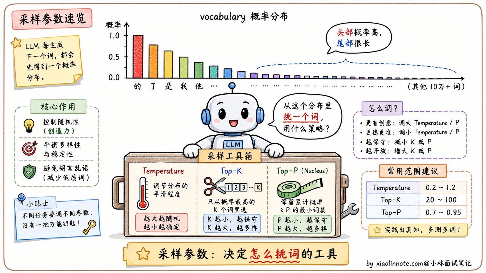
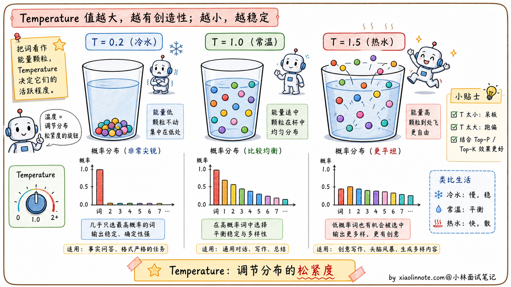
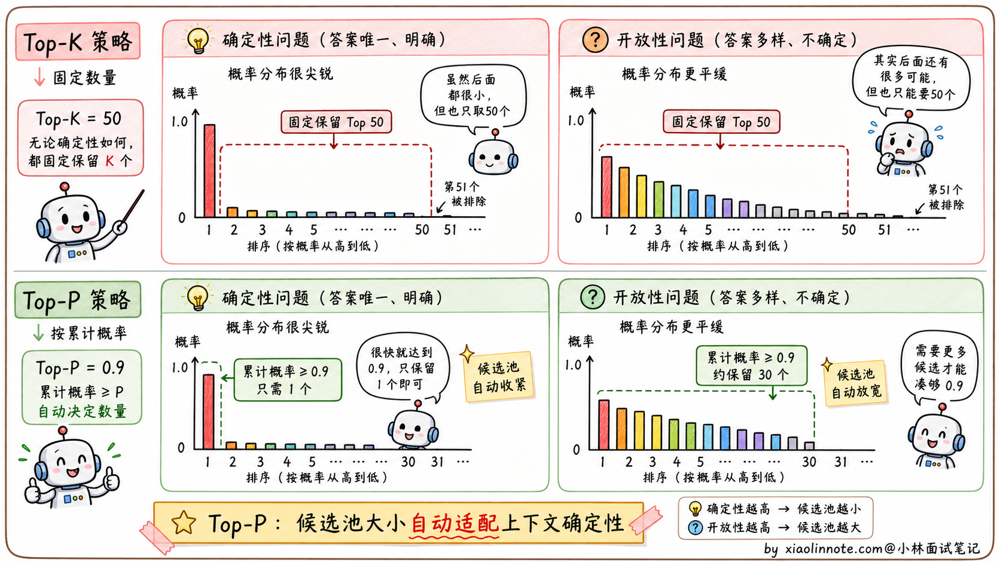
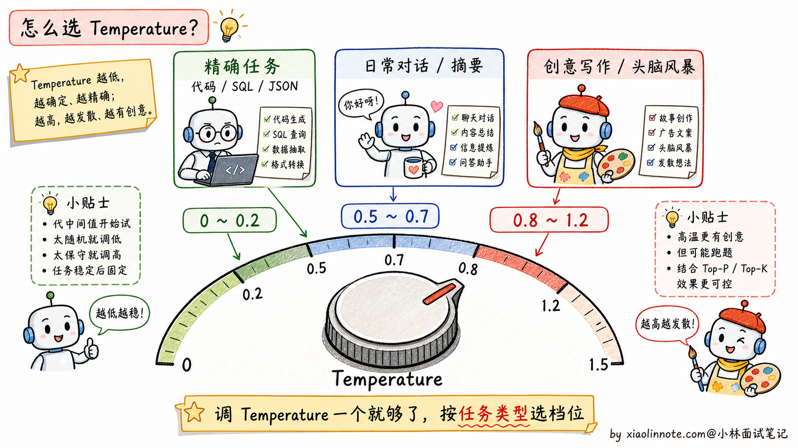

# 大模型的参数：温度值、Top-P、Top-K 分别是什么？各个场景下的最佳设置是什么？

> 原文：[大模型的参数：温度值、Top-P、Top-K 分别是什么？各个场景下的最佳设置是什么？](https://xiaolinnote.com/ai/llm/temperature_top_p_top_k.html) · 小林面试笔记


👔面试官：来讲讲大模型的几个采样参数：温度值、Top-P、Top-K 分别是什么？各场景下怎么设置？

🙋‍♂️我：温度高的话输出会更有创意，温度低就稳定。Top-P 和 Top-K 我听说过但平时没怎么调。

👔面试官：……「更有创意」是结果，没说原理。温度具体怎么影响概率分布的？为什么调高就「更有创意」？再说，Top-P 和 Top-K 都是「截断长尾」，区别在哪？哪个更智能？

🙋‍♂️我：呃，Top-K 应该是固定保留前 K 个词，Top-P 是按累积概率截断？

👔面试官：方向对了。那再问你一个实战问题：如果同时把 temperature 调高、top_p 调低，会有什么后果？这两个参数是协同还是冲突？

🙋‍♂️我：呃……我没试过这种组合。

👔面试官：典型的「会用 API 但没真的理解参数关系」。这两个参数都会改变采样分布，但具体应用顺序和默认值由 API/框架决定。更稳的做法是先固定其他参数做单变量实验，不能把某个产品的默认值当成工业界定律。回去搞清楚再来。

到这里我才反应过来，这三个参数不是“越高越有创意”的开关，而是共同改变 logits、候选集合和采样分布。温度负责缩放分布，Top-P/Top-K 负责截断候选；最终效果还受模型、解码顺序、重复惩罚、停止条件和随机种子影响。

## 💡 简要回答

我会先把这些参数当作需要在固定测试集上调的解码策略，而不是预设某个参数“最关键”。很多场景只调一个变量更容易归因，但有些运行时确实需要联合配置。

Temperature 控制 logits 缩放后的分布形状，通常越低越集中、越高越发散；Top-P 按累计概率形成候选集合，Top-K 保留固定数量的高分 token。它们不是质量或创意的保证。

可以从低温度/较少随机性作为代码和精确任务的起点，从更高温度作为创意任务的起点；具体范围只是实验起点，Top-P/Top-K 是否保持默认要看 API，联合调参也不必然互相冲突，但会增加归因难度。

## 📝 详细解析

### 先理解大模型是怎么「选下一个词」的

要理解这三个参数，得先搞清楚大模型生成文字的底层机制。

大模型生成的本质是一个「不断选择下一个 token」的过程。每生成一个 token，模型会对词表中的候选计算 logits/概率分布；词表大小、tokenizer 和概率数值随模型而变，示例中的百分比只是直觉演示。



接下来怎么选词？最简单的策略叫**贪心解码（greedy decoding）**，每次直接选概率最高的那个。这种方式输出完全确定，但往往过于保守，文本缺乏多样性，长一点还会陷入重复循环（前面已经讲过的「复读机问题」）。

为了避免贪心的死板，业界发展出三个采样调节参数：Temperature、Top-K、Top-P。它们各自从不同维度调控「怎么从概率分布里采样」，让生成既有合理性又有多样性。下面分别看。

### Temperature：热水和冷水的类比

Temperature（温度）这个名字不是随便取的，背后真的有「热」「冷」的物理意义。

数学上，Temperature 的作用是在采样前对概率分布做「缩放」：每个词的 logit（未归一化的分数）会除以温度值 T，然后再做 softmax 得到最终概率。

温度低（例如 T=0.1）的效果类似「**冷水**」：logits 除以更小的 T 后，分布通常更尖锐，高概率 token 更占优势，输出更集中，但也可能过早重复或放大错误。

温度高（例如 T=1.5）的效果类似「**热水**」：分布通常更平，尾部 token 获得更多采样机会，输出可能更多样，也可能更容易偏题或出错。

T=1 表示不做温度缩放；T 接近 0 时常被实现为近似贪心，但 T=0 的处理是 API/框架约定，可能被映射、拒绝或使用特殊采样路径。即使采样接近贪心，服务端随机性、并行、logits 处理和模型版本也会影响可复现性。



Temperature 解决的是「分布的松紧」，但还有另一个维度可以控制采样：候选词的数量。这就是 Top-K 和 Top-P 要解决的问题。

### Top-K：限制候选词的数量

Top-K 的思路特别直觉：每次采样前，把概率分布**截断**到只保留概率最高的 K 个词，其余全部置零，然后在这 K 个词里按比例采样。

比如 Top-K=50 意味着每一步只从概率最高的 50 个 token 里选。K 越小，候选集合越受限；K 越大，保留的尾部越多。它可以限制极低概率候选，但不保证剩余候选都合理，也不等于自动避免错误。

但 Top-K 有一个明显的问题，**K 是固定的，对不同情境不够自适应**。

举个例子。如果一个问题的概率集中在一个 token，固定 K 仍会保留若干低概率候选；具体影响取决于温度和 K，不应假设某个 token 固定占 99%。

在开放式写作中，概率可能更分散，固定 K 可能过窄或过宽；K 需要在目标模型和任务上调。

固定 K 不会根据当前分布的尖锐程度改变候选数量；Top-P 则用累计概率定义候选集合，但这是一种不同的权衡，不应简单称为“更智能”或总是更好。

### Top-P（Nucleus Sampling）：自适应的截断

Top-P 也叫 **Nucleus Sampling**（核采样），它解决了 Top-K「不自适应」的问题。

它的逻辑是：按概率从高到低排列 token，**累加概率**，保留达到阈值 P 所需的最小候选集合（边界 token 是否包含由实现定义），然后在集合内重新归一化采样。

举两个对比例子就能看出 Top-P 的妙处。

在概率高度集中的问题上，Top-P 可能只保留很小的候选集合；但它不能验证事实正确性，且具体集合取决于模型 logits、温度和实现。

在开放式写作中，概率更分散时，达到同一 P 可能需要更多候选，从而保留更多多样性；这仍需用重复率、质量和安全指标验证。



Top-P 的特征是候选池大小会随当前分布变化：分布集中时通常较小，分布分散时通常较大；它与 Top-K 各有适用场景。

| 参数 | 操作位置/作用 | 主要优点 | 主要风险 |
|---|---|---|---|
| Temperature | 对 logits 做尺度变换，再 softmax | 连续地改变分布尖锐度 | 过低会单调或放大高概率错误，过高会发散 |
| Top-K | 保留固定数量的最高分 token | 候选数量直观、实现简单 | 不随分布形状变化，K 对不同上下文可能过窄/过宽 |
| Top-P | 保留累计概率达到 P 的最小集合 | 候选规模随分布变化 | 受温度、概率校准和边界实现影响 |

温度、Top-K 和 Top-P 的具体执行顺序并非所有 API 都一样；如果联合设置，必须查看运行时文档或固定种子做实验。

讲清三个参数的原理之后，最关键的问题是：**实际工程里这三个参数怎么配？**

### 实际工程怎么配三个参数

讲了这么多原理，落到实战是这样：先固定模型版本、Prompt、停止条件和随机种子，做单变量或小网格实验；很多情况下先调 Temperature 或 Top-P 其中一个更容易归因，但不是所有 API 都适用同一默认策略。

为什么？因为这三个参数都会改变最终分布，同时调多个参数会增加归因和迁移难度。某些官方 API 会建议只调 temperature 或 top_p 其中一个；开源模型还要以推理框架和模型卡为准。不要一上来三个参数一起大幅改变，除非你有明确的搜索与评测方案。

具体到不同任务，可以把下面的范围当作起始点，而不是“最佳设置”：

**精确任务**（代码生成、SQL 生成、JSON 抽取、信息抽取、数学计算）。这些任务有「标准答案」或者格式严格，可以从较低 Temperature、Top-P=1 或框架默认值开始，再结合结构化输出、schema、校验和重试保证结果；T=0 是否等价于贪心由 API 定义，低温也不能保证答案正确。

**日常对话 / 总结摘要 / 翻译**。这些任务希望模型自然流畅但不能太离谱，可以从中等 Temperature 和官方默认值试起，比较流畅度、事实性、重复率和拒答边界。不要把某个产品某个版本的默认值当成行业固定标准。

**创意任务**（写作、头脑风暴、角色扮演、营销文案）。这些任务可以尝试更高 Temperature 或更宽的候选集合，并接受一定发散；同时要增加事实、安全、重复和品牌风格评测。

下面是“起始点示例”，不是跨模型的最佳配置；正式使用前要在业务集上评测：

```
# 代码生成 / 精确问答（低随机性起点；仍需校验）
temperature=0.0 ~ 0.2
top_p=1.0  # 不做限制

# 日常对话 / 总结摘要（中等随机性起点）
temperature=0.5 ~ 0.7
top_p=0.9

# 创意写作 / 头脑风暴（更宽分布起点）
temperature=0.8 ~ 1.2
top_p=0.95
```



最后讲两个常见的踩坑。

第一个是「同时调 temperature 高 + top_p 低」。比如 temperature=1.2 + top_p=0.5，通常会先得到更平的分布，再在较小累计概率集合内采样（具体顺序看实现）；它可能保留多样性又限制长尾，也可能损失候选，不能直接说“完全不可预测”，但需要实测。

第二个是「同时设置 top_k 和 top_p」。两者都在限制候选集合，先后顺序可能影响结果；联合使用不是错误，但要查清运行时语义并做回归。可以先只启用其中一个，以便判断候选范围的影响。

记住一句原则：**先固定其他设置做单变量实验**。可以先调 temperature，或先调 top_p/top_k 中的一个；如果联合使用，要记录 API 版本、执行顺序和评测结果。

## 🎯 面试总结

回到开头那段对话，问到 Temperature、Top-P、Top-K，最重要的是先把它们的作用维度讲清楚，再给实战经验。

讲作用维度时可以这样组织：Temperature 控制「**分布的松紧**」（缩放 logits），Top-K 是「**固定截断**」（保留 K 个 token），Top-P 是「**累计概率截断**」（保留达到 P 的集合）。三者都影响采样，但效果要结合执行顺序和其他解码参数。

讲完原理后，可以指出 Top-P 会根据当前分布形状调整候选池大小，而 Top-K 固定候选数量；哪一个更好要看任务、模型和评测，不要使用“更智能”的绝对表述。

最关键的实战经验是：**先做单变量或小网格评测**。固定 temperature 再比较 top_p/top_k，或反过来；对联合配置记录执行顺序、随机种子和业务指标。这样比背某个默认值更能说明你做过参数调优。

如果还想再加分，可以提一句不同任务的调参方向：精确任务从低随机性起步，日常对话从中等随机性起步，创意任务允许更宽分布；范围只是候选起点，最终由固定测试集、结构合法率、事实性、重复率和成本决定。

---
