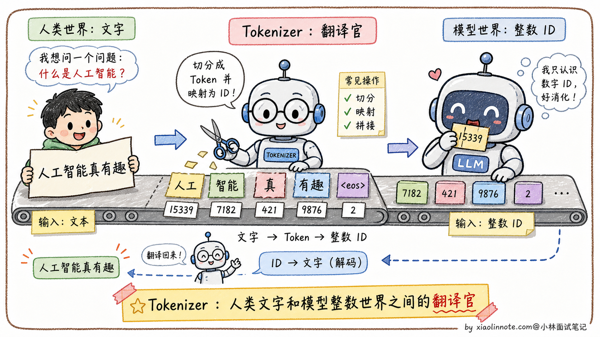
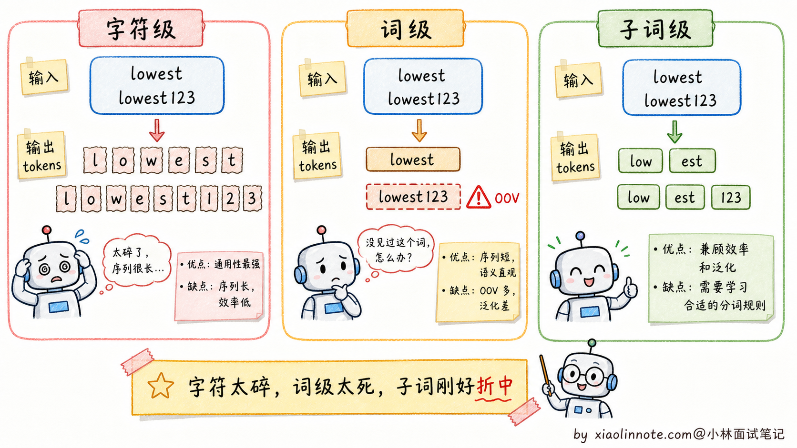
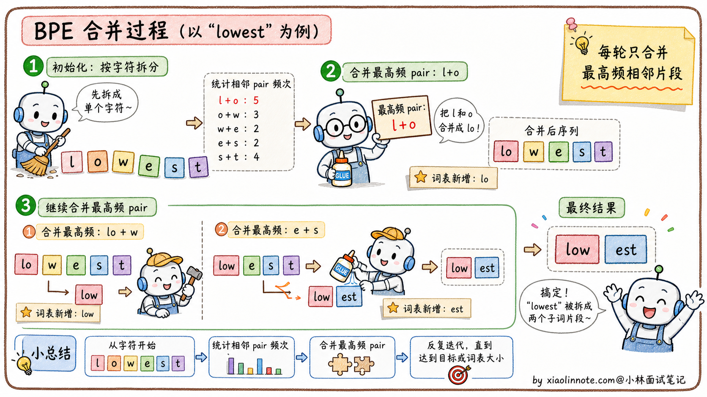
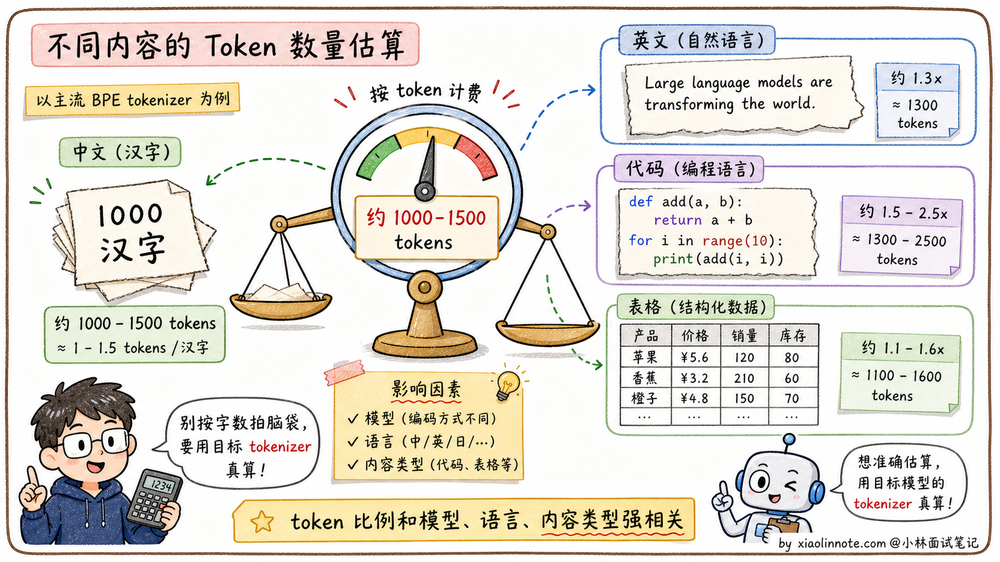
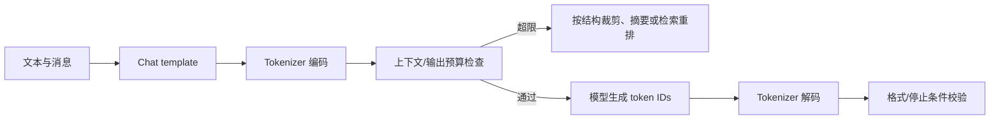

# 什么是大模型项目的分词器？原理是什么？

> 原文：[什么是大模型项目的分词器？原理是什么？](https://xiaolinnote.com/ai/llm/tokenizer.html) · 小林面试笔记

👔面试官：来讲讲什么是大模型项目的分词器？原理是什么？

🙋‍♂️我：分词器是把文本按某个模型的词表和规则编码成 token ID 序列，再把 ID 解码回文本；token 不一定等于词。

👔面试官：……「切成词」是表面理解。模型为什么需要分词？直接用文本不行吗？再说，「词」具体是什么？是汉语里的一个字、一个词、还是别的什么？

🙋‍♂️我：哦哦，应该是因为模型只能处理数字，分词器把文字转成数字 ID 序列？

👔面试官：方向对了。那再问你：分词的粒度怎么选？按字符切（每个字一个 token）行不行？按单词切呢？为什么主流大模型都用 BPE 这种「子词级别」？

🙋‍♂️我：呃，按字符切应该会让序列太长，按单词切又会有 OOV 问题？

👔面试官：终于说到点子上。但 BPE 具体怎么工作的，你能说清楚吗？为什么同一段中文在不同 tokenizer 下 token 数不同？这种「实际工程差异」要心里有数，不然估算成本都估不准。回去搞清楚再来。

问到这里分词器这道题的全貌就出来了，它解决的远不止「切词」一件事：文本到整数的转换、字符级和词级之间的折中、新词怎么处理、特殊 token 怎么放，每一层背后都有具体的工程动机。

## 💡 简要回答

我觉得面试被问到 Tokenizer，最重要的是先说清楚「为什么需要它」：模型的输入接口接收 token ID，经 embedding 后才进入网络；Tokenizer 是文字和 ID 序列之间的桥梁。常见路线有 BPE、SentencePiece/Unigram、WordPiece，以及不同的 byte-level 变体。BPE 的直觉是从小单元出发，反复把高频相邻片段合并成新 token，既控制词表大小又能通过 byte/字符回退处理未见字符串。实际开发里要注意：某些 API 按 token 计费，但本地模型不一定有同样计费；token 数、上下文上限和成本必须用目标模型的真实 tokenizer 计算，不能用固定字数换算。

## 📝 详细解析

### 为什么需要 Tokenizer

大语言模型的本质是一个函数：输入一串整数（token ID 序列），输出下一个整数的概率分布，然后把输出的整数再查表得到对应的文字。

整个过程里模型看到的全是整数，完全不认识字符串。Tokenizer 就是连接人类文字和模型整数世界的桥梁，做两件事：编码（文本 -> token ID 序列）和解码（token ID 序列 -> 文本）。

### 朴素方案的问题

要做分词，最直接能想到的两种方案都有致命缺陷。

第一种是**字符/字节级分词**，把文本拆成很小的单元。这种方案词表可能较小，但序列往往更长，Attention 的计算和 KV Cache 压力随 token 数增加；模型还要从更碎的单元中学习词形和组合规律。具体字符、字节还是 Unicode code point 取决于实现。

第二种是**词级分词**，尽量把完整单词作为 token。它可能减少序列长度，但词表会迅速膨胀，且对新词、拼写变体和无空格语言不友好；现代 tokenizer 通常用子词或 byte fallback 避免把未知字符串压成单个 `<UNK>`。中文等语言也不必先依赖一个外部分词器，模型可以直接学习字符/子词边界。

字符级太碎，词级太散，**子词分词就是这两者中间的甜蜜点**。它做的是「subword（子词）」级别的分词，既控制了词汇表大小，又能处理新词，同时保留了比字符更多的语义信息。BPE 是最常见的一类，但不是唯一方案，很多模型也会用 SentencePiece / Unigram 或 WordPiece。

### BPE 算法：从合并规则开始

BPE（Byte Pair Encoding；在 LLM 中常见 byte-level 或字符/Unicode 变体）的原理可以概括为三步。

- 第一步，初始化：把训练语料里所有文本拆成实现定义的最小单元（例如字节或字符），形成初始词汇表。
- 第二步，反复合并：统计语料中所有相邻 token pair 的出现频率，找到频率最高的那对，比如 「t」和「h」经常在一起，就把它们合并成新 token「th」，加入词汇表，同时更新语料中的所有「t」「h」相邻位置为「th」。然后继续找下一个最高频的 pair，比如「th」和「e」合并成「the」。每轮合并产生一条合并规则，同时词汇表增加一个新 token。
- 第三步，重复直到达到预设词表大小或合并规则数量；具体词表大小、特殊 token 和 byte fallback 都随 tokenizer 版本变化。

以「lowest」这个词为例，某个 BPE 可能把它分成「low」+「est」；遇到新字符串时，tokenizer 会按自己的合并规则和回退单元编码，可能得到类似「low」+「est」+若干数字/字节 token。它能避免词级 OOV，但 token 不一定都具有独立语义。

### 中文分词的特点

中文没有空格分隔词语，BPE 面对中文的处理方式和英文不同。

在不少模型中，常用汉字或汉字片段可能直接作为 token；常见词语（比如「人工智能」）也可能被合并成一个或多个 token，具体取决于 tokenizer 的训练语料、字节规则和词表。

中文 token 数没有可靠的跨模型固定比例：常用汉字、标点、混合英文、数字、代码和 tokenizer 的 byte fallback 都会改变结果。Qwen、Llama、不同 API 和不同版本的 tokenizer 可能不同，正式算成本和上下文前一定要用目标模型的 tokenizer 跑一遍。

### 特殊 Token 的作用

Tokenizer 里还可能有特殊 token，它们不是普通文本 token，而是用来传递结构或控制信息；是否存在、名称和用途由模型/聊天模板决定。

BOS（Beginning of Sequence）和 EOS（End of Sequence）在一些模型中表示序列边界；PAD（Padding）可用于批量对齐，但生成式模型未必使用它；SEP（Separator）是部分 encoder/旧式架构的分隔符。`<|im_start|>`、`<|im_end|>` 等 ChatML 风格标记也只对采用相应聊天模板的模型有效。

模型会在训练中学习这些 token 在相应模板中的统计作用，但这不是跨模型通用的“意识”；使用错误的 tokenizer、特殊 token 或 chat template 可能破坏格式和停止行为。

### 为什么 Tokenizer 对实际工程很重要

理解 Tokenizer 不只是理论知识，对实际工程有几个特别直接的影响，搞不清楚就容易踩坑。

最直接的是**API 成本估算**。许多 LLM API 按输入/输出 token 计费，但价格、缓存计费和本地部署规则不同；中文、英文、代码、表格和特殊 token 的比例也不同。要预估费用，必须用目标模型/版本的 tokenizer 和实际消息模板数出来，不能只用字数拍脑袋。

第二个是**上下文窗口管理**。每个模型/版本/API 都有自己的输入上限、输出预留和可能的系统开销；不要把某个产品的窗口数字写成通用事实。中文 + 代码混合内容尤其要在发送前实际编码并预留输出空间。

第三个是**避免截断重要信息**。上下文裁剪通常发生在 token 边界，可能删掉一个词的一部分 token、代码块尾部或结构化字段，导致下游解析失败；它不是把 Unicode 字符随意切成半个字。工程上应按段落/消息/代码块裁剪，保留输入与输出预算 buffer，并在解析失败时降级或重试。

| 工程对象 | 必须绑定的版本/配置 | 常见错误 |
|---|---|---|
| Tokenizer | 模型权重、词表、合并规则、特殊 token | 用另一个模型的 tokenizer 估算长度 |
| Chat template | system/user/assistant 标记与 stop token | 只拼文本，不计模板 token |
| 上下文预算 | 输入、输出、工具结果、隐藏系统开销 | 只按字符数裁剪 |
| 成本估算 | provider 的输入/输出/缓存计费规则 | 用“每字约几个 token”替代实测 |

## 🎯 面试总结

回到开头那段对话，问到 Tokenizer，最重要的是先讲清楚「**为什么需要它**」。模型只能处理整数，不认识字符串，Tokenizer 就是连接人类文字和模型整数世界的桥梁。这一句铺垫先讲到，面试官就知道你抓到了本质。

接下来讲清三种分词粒度的取舍。字符级太碎（序列太长、语义信息少），词级太散（OOV 严重、词汇表爆炸），BPE 取了中间的子词级折中，既控制词汇表又能处理新词。这是子词分词的核心动机。

讲 BPE 原理时，把「初始化基础词汇表 → 反复合并最高频 pair → 直到词汇表达到预设大小」这个三步流程讲清楚就行。同时补一句：BPE 只是子词分词的一种，SentencePiece / Unigram、WordPiece 也很常见。能举一个「lowest123 被切成 low + est + 1 + 2 + 3，没有 OOV」的例子，比纯讲算法生动得多。

最关键的是带出**实际工程影响**：按目标 tokenizer 估算 token/成本、正确应用 chat template、管理输入/输出窗口、按结构裁剪并校验特殊 token。不要背跨模型的中文换算比例。

如果还想再加分，可以提一句**特殊 token 与 chat template 不是通用标准**：BOS、EOS、PAD、SEP 是否存在要看模型，ChatML 标记也必须与对应模板配套；同时说明 tokenization 会影响成本、上下文和代码/结构化输出。

---
