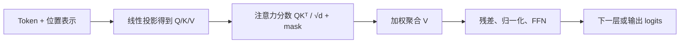
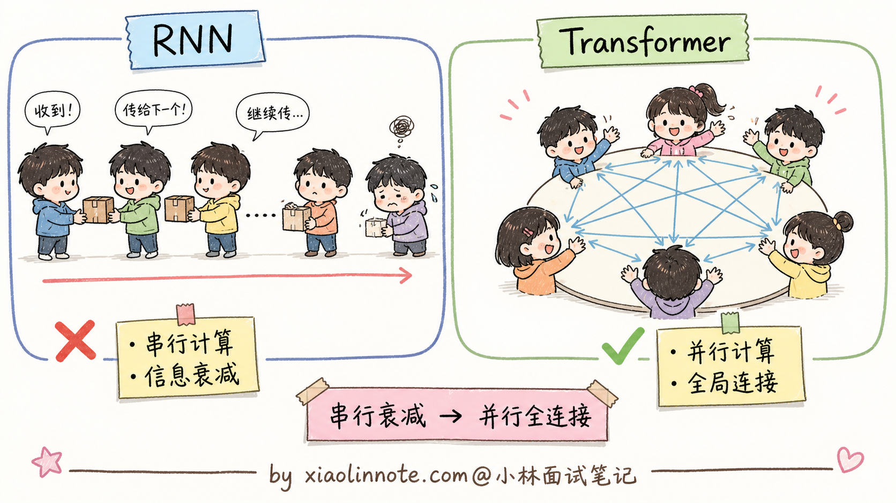
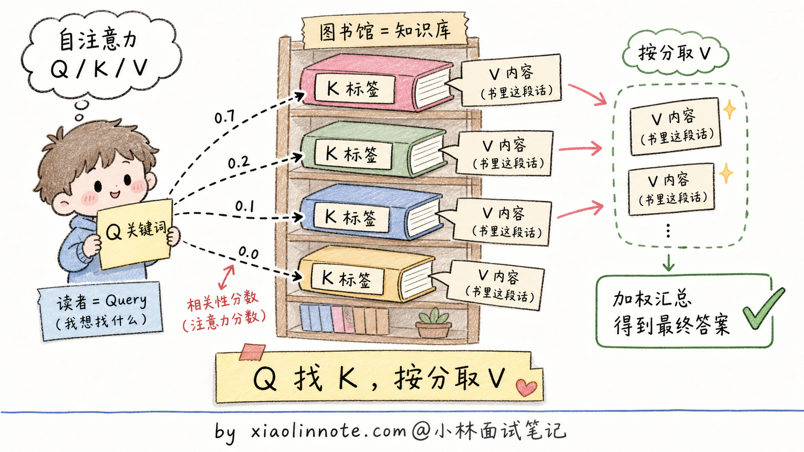
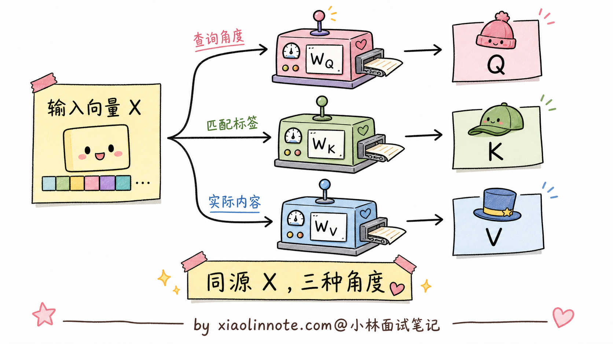
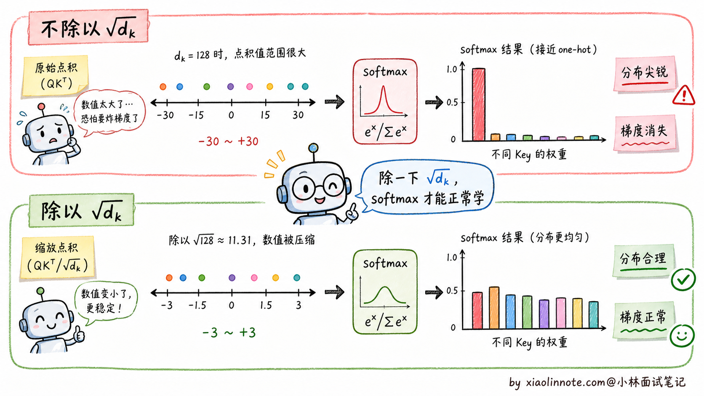
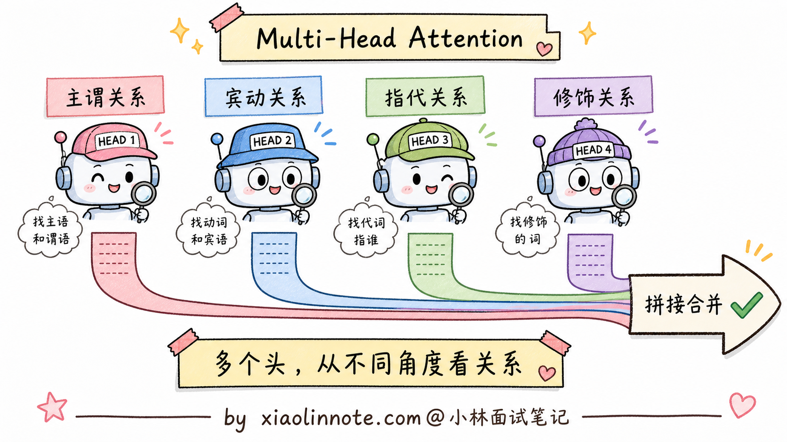
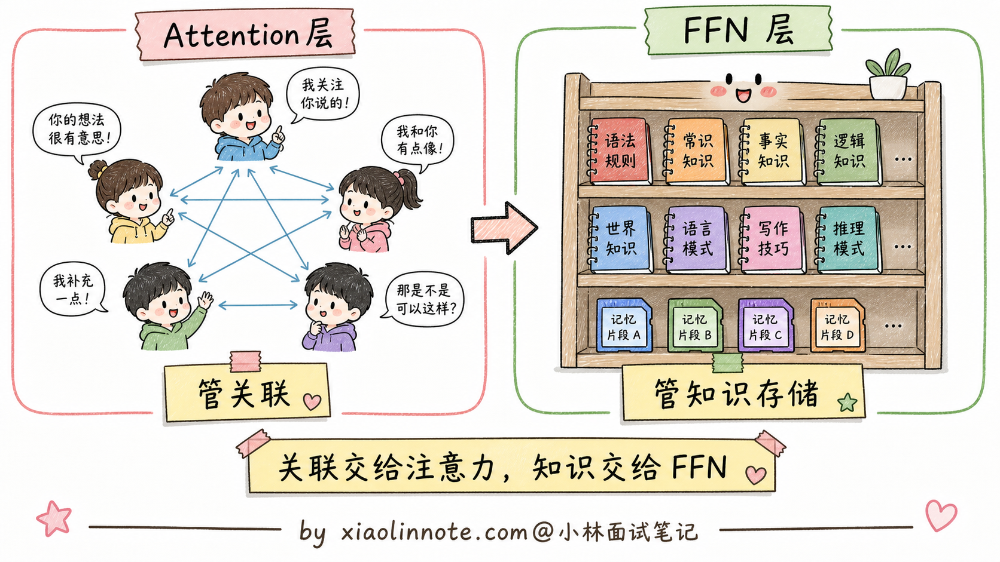
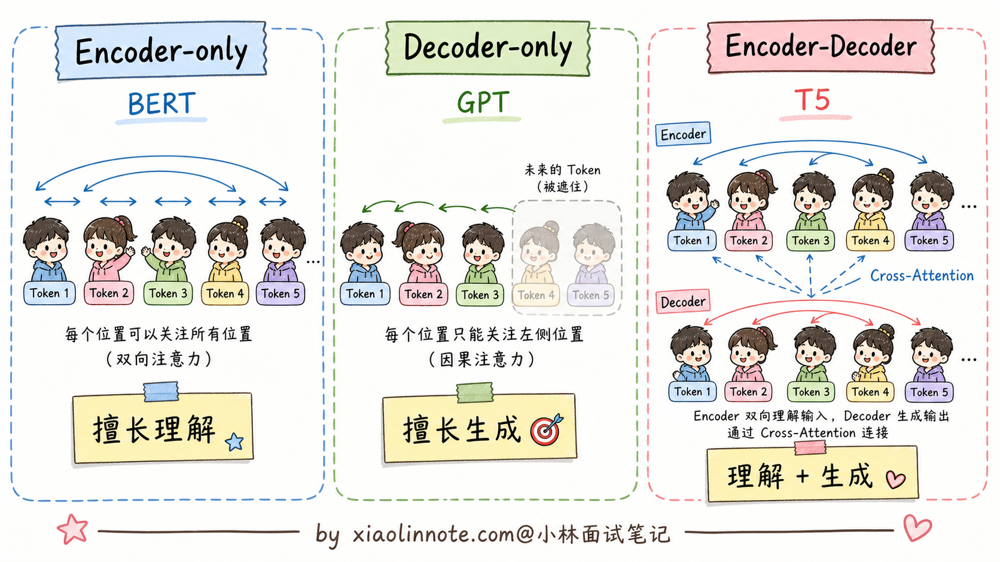
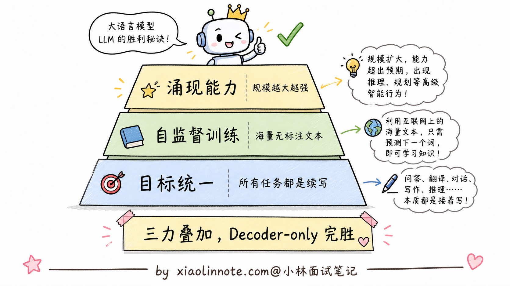

# 讲讲 Transformer 架构基本原理？Encoder 和 Decoder 是什么？

> 原文：[讲讲 Transformer 架构基本原理？Encoder 和 Decoder 是什么？](https://xiaolinnote.com/ai/llm/transformer_architecture.html) · 小林面试笔记


👔面试官：来讲讲 Transformer 架构的基本原理？Encoder 和 Decoder 是什么？

🙋‍♂️我：Transformer 是 Google 提的一个新架构，核心是 Attention，效果比 RNN 好很多。Encoder 是编码器，Decoder 是解码器。

👔面试官：……「编码器」「解码器」是中文翻译，我问的是它们具体在做什么，不是字面意思。再说，Attention 凭什么比 RNN 好？RNN 到底有什么致命缺陷？

🙋‍♂️我：哦哦，应该是 RNN 太慢了，Attention 能并行计算？

👔面试官：方向对了一半。但你只说了「快」，没说依赖路径。RNN 在长序列中需要经过很多步传递信息，梯度和记忆可能衰减；Attention 如何缩短这个路径，能讲清楚吗？

🙋‍♂️我：呃……Attention 让每个词都能看到所有其他词？

👔面试官：勉强能说出来。那再问一个：BERT 用的是 Encoder-only，GPT 等生成模型常用 Decoder-only。为什么许多通用生成模型选择 Decoder-only？这种架构选型背后的原因，你能讲清楚吗？

🙋‍♂️我：呃……

👔面试官：典型的「知道有但讲不清」。Decoder-only 赢的根本原因是「预测下一个 token」这个训练目标极其统一，所有 NLP 任务都能用它表达。这种「为什么 X 赢了 Y」的演进逻辑搞不清楚，去面试就是被怼。回去补一下。

这几个反问串起来其实就是一条主线：Transformer 这道题想听的不是「Attention is all you need」这种口号，而是 RNN 有哪些工程约束、Attention 如何缩短依赖路径、三种架构变体如何按任务取舍。

## 💡 简要回答

我理解 Transformer 最核心的机制是 Self-Attention，让 token 通过内容相关的权重直接访问其他位置，并在训练阶段并行计算；它缩短了长距离依赖的路径，但代价是注意力矩阵、显存和带宽成本。Encoder 通常使用双向可见性，适合表示/理解；Decoder 使用因果 mask，适合自回归生成；Encoder-Decoder 则把输入理解和输出生成分开。许多通用生成模型选择 Decoder-only，是因为 next-token prediction 能统一利用无标注文本和多轮生成接口，但这不是所有任务的唯一最优架构。



## 📝 详细解析

### Transformer 之前：RNN 的致命缺陷

在 Transformer 出现之前，处理序列数据常用 RNN（循环神经网络）及其变体（LSTM、GRU）。它们有两个重要工程约束：

第一个是**顺序计算，无法并行**。RNN 处理序列的方式是从左到右逐个处理每个词，第 N 步必须等第 N-1 步计算完才能开始，无法利用 GPU 的并行计算能力。这导致训练大型 RNN 极慢。

第二个是**长距离依赖难学**。当序列很长时，RNN 需要经过许多递归步传递早期信息，梯度可能衰减或爆炸，网络更难学习远距离关系。LSTM/GRU 的门控可以缓解，但仍保留顺序依赖和状态瓶颈。

Transformer 通过全局注意力和训练阶段并行化缓解了这两个问题；它没有消除长序列的计算/内存成本，也不是对所有序列任务都无条件更优。



### Self-Attention 的核心直觉

Self-Attention（自注意力）的核心思路是：让序列中的每个 token 根据 Q/K 相似度访问其他位置（是否能看见由 mask 决定），再按权重聚合 V。它把远距离信息的路径从多次递归缩短为注意力连接，但注意力权重不保证每个位置都会被有效利用。

这里有三个关键向量：Q（Query，查询）代表「我想找什么」，K（Key，键）代表「我有什么标签」，V（Value，值）代表「我的实际内容」。

可以用图书馆检索来类比：你有一个搜索关键词（Q），图书馆里每本书都有标签（K）和内容（V）。注意力机制就是用你的关键词（Q）去匹配每本书的标签（K），计算出相似度分数，然后按照分数的权重把书的内容（V）加权求和，得到你的搜索结果。



### Q/K/V 是怎么从输入变换得到的

很多人讲 Self-Attention 容易卡在「Q/K/V 是从哪儿冒出来的」这一步。其实 Q/K/V 不是模型「凭空生成」的，而是把输入 embedding 通过**三个独立的线性投影矩阵** W_Q、W_K、W_V 算出来的：

```python
# 假设输入 X 是 (序列长度 N, embedding 维度 d_model)
# W_Q, W_K, W_V 都是可训练参数矩阵，形状 (d_model, d_k)

Q = X @ W_Q     # 形状 (N, d_k)，每个 token 都有自己的 Query 向量
K = X @ W_K     # 形状 (N, d_k)，每个 token 都有自己的 Key 向量
V = X @ W_V     # 形状 (N, d_v)，每个 token 都有自己的 Value 向量
```



这一步就是面试里常被追问的「**Q/K/V 是怎么得到的**」。理解的时候有几个关键点要抓住。

最关键的一点是 Q/K/V 都是**从同一个输入 X 算出来**的。也就是说，输入既要扮演「提问者」（Q），也要扮演「被查者」（K + V），这就是「**自**注意力」里那个「自」字的含义，区别于 Encoder-Decoder 架构里 Cross-Attention 那种「Q 来自一边、K/V 来自另一边」的形式。

然后 W_Q、W_K、W_V 是三个**独立学习**的矩阵。这是个容易被忽略的细节，但很重要。如果让 Q/K/V 都直接等于 X 不做变换，模型就没法学到「该从什么角度提问」「该用什么标签匹配」「该返回什么内容」这种细致的差异。三个独立投影让模型有 3 倍的自由度去学习这种角度上的差异，模型容量大幅提升。

还有一个工程细节是每个头的 d_k 常与 d_model/H 同量级，但具体模型可以使用不同的头维度、分组或 MQA/GQA 变体。多头设计让总投影维度保持在可控范围，参数和计算是否与单头相当要看实现。

到这里，Q/K/V 三个向量就准备好了，可以代入注意力公式：

```
Attention(Q, K, V) = softmax(Q · K^T / √d_k) · V
```

### 为什么要除以 √d_k：缩放点积的数学直觉

公式里的 `/√d_k` 这一步常被叫做 **Scaled Dot-Product Attention（缩放点积注意力）**。这个 √d_k 不是随便加的，背后有具体的数学动机。

直觉上的问题是这样的：当 d_k 增大时，若 Q/K 各维近似独立、均值 0 且方差固定，点积的方差会随 d_k 增长，softmax 输入就可能变得过尖。

点积尺度过大时，softmax 对差异会更敏感，概率可能过度集中，梯度信号变差；具体范围取决于初始化、归一化和数据，不能固定写成某个区间或必然 one-hot。



过度尖锐分布可能导致非最大项梯度很小、优化变难，但归一化、温度和其他训练设计也会共同影响稳定性。

除以 √d_k 是在上述近似假设下把点积尺度标准化到更稳定的量级，帮助 softmax 和梯度保持可训练；它不是对任意实现都精确“压回 1”。

那能不能用其他方案替代 √d_k？**理论上可以；√d_k 是经典缩放点积注意力中简单、可解释的基线**。

业界也尝试过 QK 归一化、可学习温度或其他缩放。Pre-LN 主要改善输入尺度和训练稳定性，并不等同于替换 √d_k；是否更好要由模型和任务实测，不能用固定 d_k 或“效果差不多”概括。

√d_k 是经典 Transformer 中广泛使用的简单基线，但不同架构也可能使用 QK 归一化、可学习温度或其他缩放；面试时应把它说成常见设计而不是所有实现的硬规则。

回到主线：缩放后得到注意力权重，再用这些权重对 V 做加权求和。训练阶段同一层的 token 计算通常可并行，但生成阶段仍受自回归依赖限制；注意力缩短了长距离路径，却没有保证远处信息一定被保留，也没有消除长上下文的二次/带宽成本。

### Multi-Head Attention：多角度观察

单组 Q/K/V 只能学习到一种「关联关系」，但语言中的关联是多维度的：「我」和「吃」是主谓关系，「苹果」和「吃」是宾动关系，「苹果」和前文的「苹果树」是指代关系，这些不同类型的关联需要不同的「注意力头」来捕捉。

Multi-Head Attention 就是把 Q/K/V 投影到多个不同的子空间（比如 8 个或 32 个头），每组独立计算注意力，最后把所有头的输出拼接起来。每个头可以专注于捕捉不同类型的语言关联，整体上表达能力更强。



### 位置编码：注入顺序信息

不带位置信号的 Self-Attention 对 token 排列具有等变性，无法可靠恢复词序；「我打你」和「你打我」的 token 集合相同但顺序不同，模型需要额外的位置机制区分它们。

所以需要显式地给输入、Q/K 或注意力分数注入位置信息，这就是位置机制。具体方案有 sin/cos、RoPE、ALiBi、相对位置 bias 等；不一定都是“加到 embedding 上”，长度行为也要结合模型与训练评测。

### 前馈网络（FFN）的作用

除了注意力层，每个 Transformer 块里还有一个前馈网络（Feed-Forward Network），结构是两层全连接加一个激活函数。

FFN 对每个位置独立地做非线性变换，补充注意力层的内容混合（注意力聚合本身是加权和，FFN 提供位置内的非线性）。一些可解释性研究把 FFN 与事实关联联系起来，但“FFN 是记忆仓库”是简化假说，知识也分布在注意力、嵌入和其他参数中。



### Encoder-only、Decoder-only 和 Encoder-Decoder 三种架构

理解了 Attention 的基本机制，可以解释这三种架构的区别。

- **Encoder-only（以 BERT 为代表）**：通常允许 token 双向关注，适合生成上下文表示，用于分类、命名实体识别、检索和语义相似度等；MLM 是一种常见预训练目标，但不是所有 encoder 都只用 MLM。
- **Decoder-only（以 GPT 等自回归生成模型为代表）**：使用因果掩码，当前位置只能访问允许的历史位置，常用 next-token prediction 训练，天然适合连续生成；它也可以通过提示、分类头或工具接口完成理解类任务。
- **Encoder-Decoder（以 T5、BART 等为代表）**：Encoder 编码输入，Decoder 自回归生成输出，并通过 Cross-Attention 读取 Encoder 表示，适合翻译、摘要和条件生成；它并非不能规模化，取舍在于架构、训练数据和服务形态。



### 为什么 Decoder-only 赢了

现代通用生成式大模型为什么大多选择 Decoder-only 架构？这是面试里最容易被追问的点。

重要原因之一是「**预测下一个 token**」可以把大量文本、代码、对话和任务示例统一成自监督序列目标。问答、写作、推理、代码生成和翻译都能通过序列格式表达，但这是一种工程统一，不代表每个理解任务都比 Encoder-only 更高效。

更关键的是，这个目标可以直接在无标注文本上做自监督训练。MLM 同样不需要人工标注；Decoder-only 的优势更多在于训练目标与生成接口一致、数据利用方式简单，以及后续指令/偏好训练容易沿用同一接口，而不是 MLM 无法规模化。

随着模型、数据和训练方法扩大，模型可能获得数学、推理、代码和跨语言等能力；这些能力还受数据覆盖、后训练、工具和评测影响，不能只归因于 next-token prediction 或规模本身。

这些因素使 Decoder-only 成为许多通用生成模型的常见选择。Encoder-only 和 Encoder-Decoder 仍在检索、分类、嵌入、翻译、摘要和低延迟理解场景有价值；最终架构应按质量、训练数据、推理成本、吞吐和接口需求选择。



## 🎯 面试总结

回到开头那段对话，问到 Transformer 架构，最重要的是先把 **RNN 的两个工程约束**讲清楚：顺序计算限制训练并行度，长距离依赖需要经过许多状态传递，可能出现梯度/记忆衰减。它们是 Transformer 受欢迎的重要动机，但不是所有序列任务的绝对缺陷。

接下来讲 Self-Attention 怎么解决的。每个 token 通过 Q、K、V 三个线性投影得到查询、键、值向量，再用 Q 与允许访问的 K 计算分数并聚合 V。这一段能讲到「Q/K/V 在 self-attention 中来自同一个 X」「√d_k 用于控制点积尺度，帮助 softmax 保持可训练」这两个细节，就比只背公式更扎实。

最关键的一句话是解释**为什么许多通用生成模型选择 Decoder-only**：next-token prediction 能统一利用无标注序列、指令数据和生成接口；但架构选择还受任务、数据、推理成本和服务形态影响，不能说它在所有场景“完胜”。

如果还想再加分，可以提一句一些可解释性研究把 FFN 与事实关联联系起来，但这是分布式参数的简化视角，不应把 FFN 说成唯一的“记忆仓库”；再补上注意力、mask、KV Cache 和长上下文成本，回答会更完整。

---
