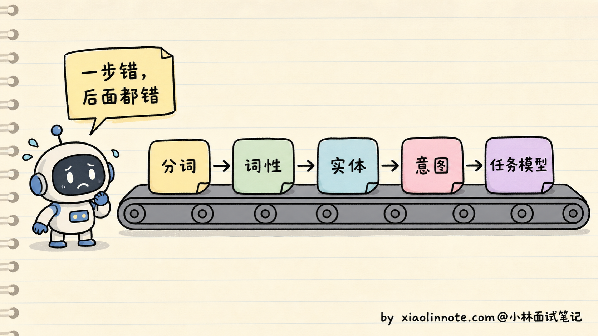
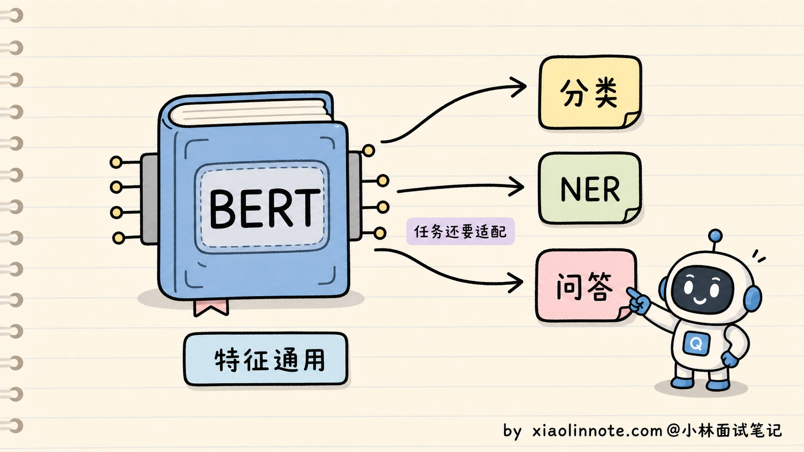
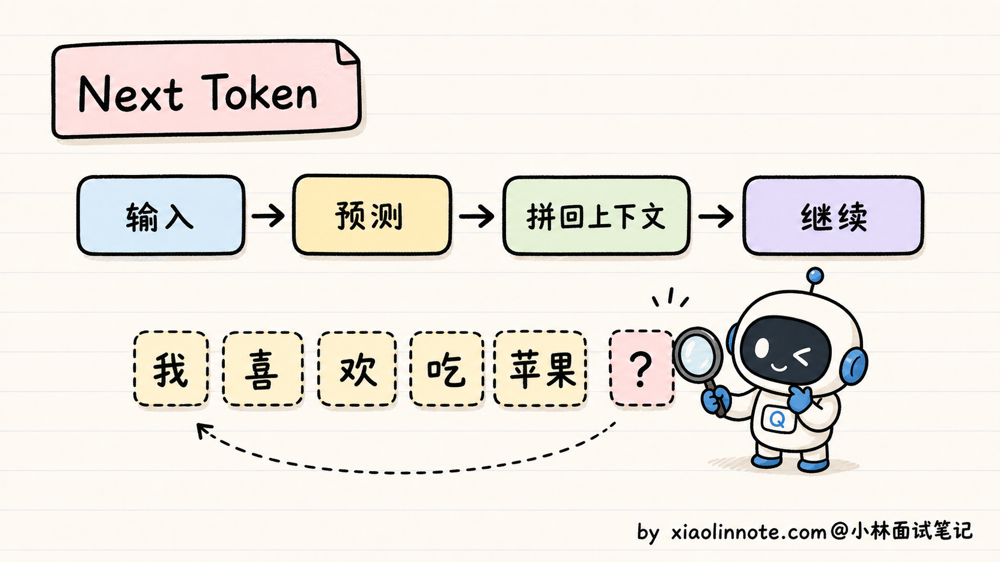
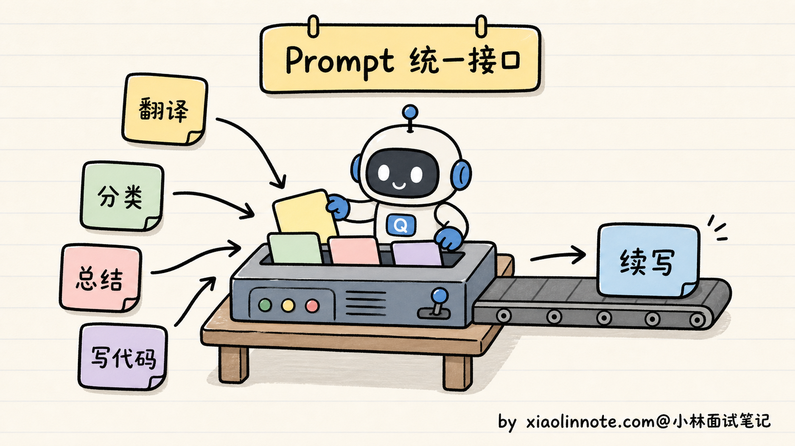
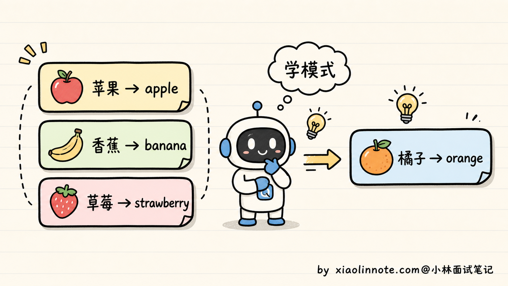
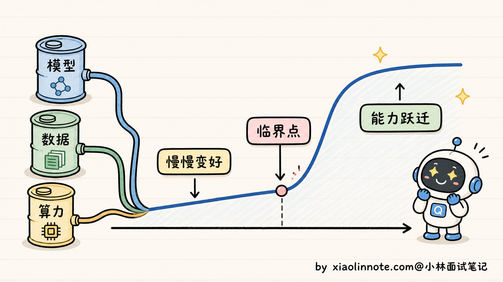
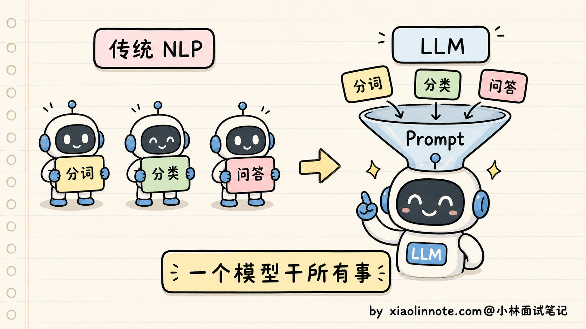
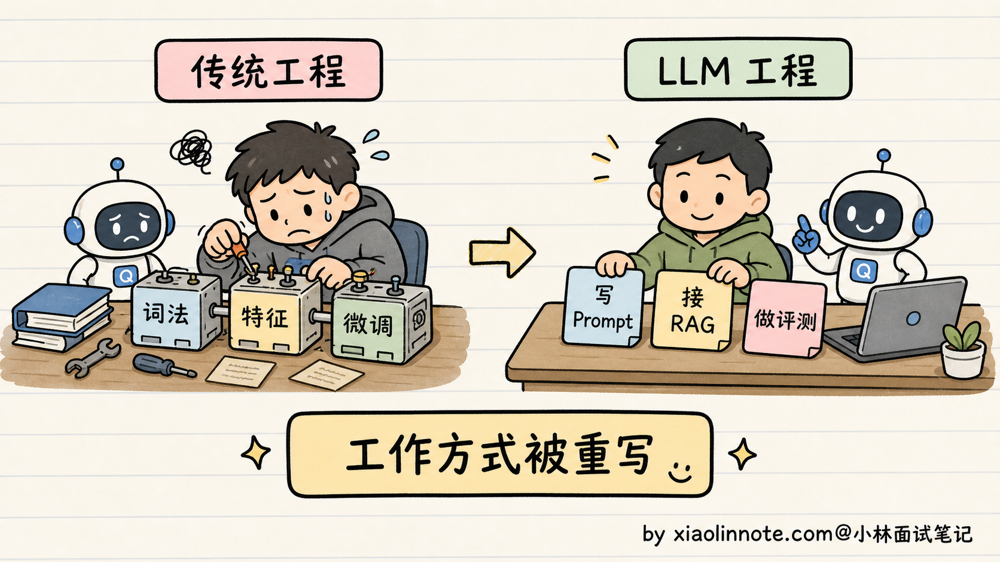

# 什么是大语言模型？和传统 NLP 模型有什么区别？

> 原文：[什么是大语言模型？和传统 NLP 模型有什么区别？](https://xiaolinnote.com/ai/llm/what_is_llm.html) · 小林面试笔记


👔面试官：来，讲讲什么是大语言模型？它和我们以前用的传统 NLP 模型有什么区别？

🙋‍♂️我：大语言模型嘛，就是 ChatGPT 那种，参数特别多、能聊天的那个。

👔面试官：……能聊天的就叫大语言模型？那 Siri 也能聊天，它也是大语言模型？「参数多」具体多到什么量级才算「大」？为什么参数多了就能聊天？

🙋‍♂️我：不能只按参数量定义。通常说的大语言模型（LLM）是用大规模文本/代码等数据训练、拥有较大容量、能处理自然语言任务的语言模型；具体边界随语境变化。

👔面试官：你说的还是结果，没说本质。BERT 也有几亿参数，那 BERT 是不是大语言模型？传统 NLP 是先分词、再词性标注、再命名实体识别，最后做下游任务，那 LLM 是怎么做的？你能说出本质区别吗？

🙋‍♂️我：呃……LLM 不分这些步骤，是一个端到端的模型对吧？

👔面试官：「端到端」我们 2015 年就在说了，那时候的 LSTM 也是端到端的，BERT 接个分类头也是端到端的，你这回答放在十年前都不算新东西。讲讲为什么 LLM 能用统一接口覆盖更多 NLP 任务？为什么之前的系统通常需要任务适配？回去搞清楚再来。

这道开场题答了几轮都没踩到点，看来「LLM 的范围是什么」「统一接口靠什么实现」「规模带来的收益如何评测」这几件事得正儿八经讲一下。

## 💡 简要回答

我理解大语言模型（LLM）的本质，是在大规模语言数据上训练、具有较强容量和通用迁移能力的语言模型；现代通用生成式 LLM 多采用自回归生成，但“LLM”不是由某个固定参数阈值或唯一架构定义的。

它和传统 NLP 模型最根本的区别有三点。

第一，传统 NLP 生态里常按任务设计标签、模型头和流水线，迁移常需要任务数据或微调；LLM 用统一的 token 序列接口和 Prompt 可以覆盖更多任务，但仍可能需要 RAG、工具、微调、分类头或专用模型，不能承诺“一个模型干所有事”。

第二，传统 NLP 中既有判别式也有生成式模型；许多 LLM 以生成式接口输出 token，但也可以通过打分、分类头或 embedding 接口完成判别任务。区别在于预训练目标、规模、接口和迁移方式的组合，而不是简单二分。

第三，规模、数据和训练方法增大后，模型可能在某些评测上跨过实用阈值，表现出上下文学习、跨语言或复杂任务能力；“涌现”是否是内部突变、是否只是指标放大仍有争议，传统模型也可能通过结构和数据获得迁移能力。

## 📝 详细解析

### 传统 NLP 是怎么干活的？

要理解 LLM 厉害在哪，得先看看在它之前，业界是怎么处理自然语言任务的。

许多传统 NLP 系统会采用「流水线」式设计，把分词、实体、意图和检索拆成组件；但“传统 NLP”也包含端到端、联合学习、多任务和预训练模型，不能一概而论。采用流水线通常是为了可解释、可控、低延迟或复用领域组件。



举个例子，假如你要做一个智能客服。流程大概是：第一步分词，把用户的「我想退货」拆成「我 / 想 / 退货」；第二步词性标注，标出「我」是代词、「退货」是动词；第三步命名实体识别，找出有没有商品名、订单号；第四步意图分类，判断这是「咨询」还是「投诉」；第五步去知识库匹配预设答案。

光是「分词」这一步，就可能有边界歧义。中文不像英文有空格天然分隔，「南京市长江大桥」可以有不同切分；系统可以用规则、统计模型、子词/字节 tokenizer 或端到端表示来处理，并不一定需要独立分词模型。词级系统会遇到 **OOV（Out-of-Vocabulary，未登录词）**，子词/字节方案可以降低该风险。

流水线中的组件可能有独立数据和标注规范；如果下游只接受上游的硬输出，错误确实可能传导，但也可以通过 n-best、置信度、联合训练、回退和人工校验缓解。LLM 应用也会有类似的检索、工具和结构化输出错误链。


迁移到新领域常需要新数据、词表、规则或适配层，但不一定所有组件都重新训练；预训练表示、检索、领域词典和少量微调都可以降低成本。代价取决于任务边界、数据质量、延迟和安全要求。

这说明一种常见取舍：任务越细分，专用组件的数量和维护成本可能越高；但专用系统也可能更可控、更便宜、更容易审计。LLM 改变的是复用和接口，不是让所有专用组件都失去价值。

### BERT 时代：预训练通了一半

BERT 等预训练模型带来了重要转折：**预训练 + 微调**把通用表示和下游任务结合起来。

在原始 BERT 论文的设置中，预训练数据、MLM（Masked Language Model，掩码语言模型）和 NSP（Next Sentence Prediction，下一句预测）都有明确配方：随机遮盖一部分 token，并判断句子关系。这些目标不需要逐条人工标注；后续模型可能改变数据、mask 比例或直接去掉 NSP，因此不能把原始配方当成所有 encoder 模型的标准。

经过预训练，BERT 学到可迁移的上下文表示。下游任务通常需要任务头、标注数据或其他适配，再比较任务指标；它在当时多个基准上取得了很强效果，但不能概括为所有任务都只需少量数据或始终 SOTA。

BERT 解决了「**表示更通用**」，但不同下游任务仍常需要任务头、标注和适配；这与它是 encoder-only、MLM 目标和产品接口有关。

第一，BERT 的输出是「**表示**」，不是直接的自回归文本流。分类、实体识别和抽取式问答通常需要任务头或任务适配；可以共享 backbone、使用参数高效微调或统一格式，是否产生多个副本取决于部署隔离和版本管理。

第二，BERT 的 MLM 目标和双向 encoder 接口并非为左到右连续生成设计，因此通常不如自回归 decoder 或 encoder-decoder 直接用于翻译、写作和对话；它并非完全不能生成，研究者可以加生成头或采用其他训练方式。



所以 BERT 时代是个很关键的过渡。它证明了「预训练 + 大规模无标注数据」这条路的价值，但不同任务仍需要适配；后来的自回归生成模型进一步把更多任务放到统一的文本接口上。

### 现代生成式 LLM：用 token 目标统一许多任务

现代生成式 LLM 的一个重要转变，是把许多 NLP 任务统一表达为**预测下一个 token**；这不是所有 LLM、所有任务或所有系统的唯一训练目标。

这个训练目标叫 **CLM（Causal Language Modeling，因果语言模型）**。它的训练数据格式特别简单：给一段文本，模型从左到右一个字一个字地往后猜，每一步都要预测「下一个 token 是什么」。比如训练数据是「我喜欢吃苹果」，模型要学会：看到「我」预测「喜」，看到「我喜」预测「欢」，看到「我喜欢」预测「吃」，依此类推。

这种训练方式叫**自回归（Autoregressive）**，意思是每个位置的预测依赖历史 token。许多通用生成模型采用“自回归 + 因果掩码”，但模型家族内部可能有不同组件，不能只凭产品名称推断完整架构。



听起来太简单了对吧？但威力极大。看几个例子就明白了：

- **翻译**：Prompt 写「把下面这句翻译成英文：我喜欢你 ->」，LLM 接着预测下一个 token，就会输出「I like you」
- **分类**：Prompt 写「下面这条评论是正面还是负面？『这家店太黑了』 -> 答：」，LLM 预测下一个 token 就会输出「负面」
- **总结**：Prompt 写「请用一句话总结：xxxxxx -> 总结：」，LLM 接着写下去就是总结
- **写代码**：Prompt 写「写一个 Python 函数，返回斐波那契数列前 N 项 -> def」，LLM 接着续写就是完整代码

很多任务可以被表达成「Prompt + 续写」的统一接口，因此减少了为每个任务从零训练模型的需要；但复杂任务仍可能需要工具、检索、结构化输出、校验、微调或专用模型。



那为什么这个简单目标能学到这么多东西？关键是**规模 + 数据**两个杠杆。

数据的杠杆是：CLM 可以使用大量无标注文本，但公开网页并不天然等于高质量、合法、去重且无 PII 的训练数据。不同模型的 token 规模、数据配方和质量口径差异很大，不能只背某几个模型的总 token 数。

模型的杠杆是：公开模型从较小的 encoder/decoder 规模扩展到更大的参数、数据和训练算力；具体参数量、数据量和闭源模型内部规模并不总是公开。更稳的说法是：模型规模、训练数据和算力共同扩大后，token 预测目标可以支持更广泛的迁移，但收益要由评测验证。

模型要在不同上下文里降低预测损失，往往会学习语法、事实关联和代码模式；但一次正确续写不等于模型显式拥有可验证事实或可靠推理。工具、检索和测试仍可用于核验。

这些能力可能从预测目标、数据覆盖、模型规模和训练过程的组合中形成，使一个模型能覆盖很多 NLP 任务；“能覆盖”不等于每项任务都达到可用质量。

还有一个让人惊讶的副产物，叫 **In-Context Learning（上下文学习）**。在 Prompt 里给模型几个例子，模型就能学会新的任务模式，不需要更新参数。比如：

```
苹果 -> apple
香蕉 -> banana
草莓 -> strawberry
橘子 ->
```

模型看到这个 Prompt，不需要更新参数，就可能从示例推断任务模式并输出「orange」。这种能力在更早的元学习和语言模型研究中已有讨论，GPT-3 等公开模型让它在大规模任务接口中受到广泛关注，也是 Prompt Engineering 工程化的重要基础。



### 「涌现能力」：量变到质变的关键

LLM 还有一个让传统 NLP 模型望尘莫及的特点，叫**涌现能力（Emergent Abilities）**。

涌现的常见定义是：「**某项能力在小模型上几乎看不到，规模到了某个临界点之后突然表现出来**」。不过这里要留一个 caveat：有研究认为，一部分「突然出现」可能来自评测指标的离散性，比如 exact match 这种非黑即白的指标会把连续提升看成突变。所以面试里可以说「涌现是工程上能观察到的能力跃迁，但学术上对它是不是测量假象还有争议」。

来看几类被研究过的现象；具体数值必须绑定论文、数据集、提示和指标，不要当作统一临界点。

第一个例子是**多步算术**。如果指标要求整题 exact match，前面每一步的小概率错误会相乘，模型规模变大后最终准确率可能显得跳升；换成分步得分或连续指标后，曲线可能更平滑。这说明要同时分析能力与测量方式。


第二个例子是 **In-Context Learning**。给出示例后，模型可能在不更新参数的情况下适应任务格式；强弱受模型、示例、提示、语言和评测协议影响，不能指定统一的 1.5B、100B 或 175B 临界点。

第三个例子是**跨语言迁移**。多语言混合语料可能让模型在低资源语言上迁移，但效果取决于语料比例、tokenizer、提示和语言级评测，不能从某个英文占比或模型名称直接推出能力。



为什么会出现这些变化？一个工程解释是 **Scaling Law（缩放定律）**：在一定模型族和训练范围内，模型规模、数据量与训练算力和损失存在可拟合关系；Chinchilla 的参数/token 比例是特定实验条件下的 compute-optimal 经验点，不是所有模型的硬规则。

涌现讨论的关键在于：模型可能在没有逐题标注的情况下从大规模数据中形成可迁移模式；但能力来自数据、架构、优化、后训练和工具的共同作用，不能把它简化为“规模一大就自动学会”。

但要注意的是，涌现不是「越大越好」。扩大参数后边际收益可能递减，训练数据质量、去污染、算力预算和推理成本都要一起考虑。小参数配更多高质量数据有时更适合部署，但不能用单个模型的 token 数或跨基准比较证明普遍优于大模型。

### 三个本质区别总结

到这里，可以把 LLM 和传统 NLP 模型的区别归到一张表：

| 维度 | 传统 NLP 生态中的常见做法 | LLM 应用中的常见做法 |
| --- | --- | --- |
| 任务接口 | 任务头、专用模型、流水线或联合模型 | token 生成接口 + Prompt，也可接工具/检索/专用头 |
| 训练目标 | 分类、序列标注、检索、生成、预训练等多种目标 | 预训练语言目标，再加 SFT、偏好、工具和任务适配 |
| 输出范式 | 标签、分数、span、向量或文本都可能 | 常见是生成文本，但也可返回结构化字段、向量或分数 |
| 迁移方式 | 规则、特征、微调、共享表示或多任务 | Prompt、RAG、工具、LoRA/微调和评测闭环 |
| 主要风险 | pipeline 传错、标注偏差、领域迁移 | 幻觉、格式不稳、提示注入、成本和延迟 |

这张表从「**工程接口**」「**训练范式**」「**迁移与风险**」几个角度比较，避免把“传统 NLP”和“LLM”当成互斥的模型清单。

工程层面的区别常表现为“更多任务复用同一个基础模型”，但真实系统仍会保留 embedding、reranker、分类器、规则、数据库和工具。复用可以减少训练与部署重复，却也带来共享模型升级、权限隔离、成本、回归和故障半径问题。

范式层面的变化是生成式接口在更多产品中占比提高，而不是判别式方法消失。分类/抽取仍应使用准确率、召回率、F1、校准和业务成功率；生成任务可补充事实性、结构合法率、人工偏好和成本，LLM-as-Judge 也需要校准与人工抽检。

能力层面的变化是：模型有时能把预训练中的模式迁移到未逐题标注的任务，但成功率取决于任务、提示、数据覆盖和工具。Prompt 不能替代事实来源、权限、验证和高风险任务的专用数据；模型能力上限也没有脱离训练和评测约束。



### 这场转变对工程团队意味着什么

理解了上面三点，就能理解一个现实：许多 NLP 团队开始把 LLM 纳入技术栈，**这不只是换一个模型，而是增加了新的接口和系统边界**；传统模型并没有因此失去所有价值。

具体来说，LLM 项目通常要同时考虑 Prompt、数据、RAG/工具、模型选择、微调、结构化输出、评测与安全；不是固定“先 Prompt、最后才数据”，高质量数据、权限和验证往往先决定系统上限。

过去的词法分析、句法、特征工程和模型调参仍然有用；LLM 工程还增加了 Prompt、RAG、Agent、工具权限、评测、观测和成本治理。两类技能是叠加关系，岗位要求和薪酬不能由模型范式直接推断。



理解了 LLM 和传统 NLP 的接口差异，再看后续 RAG、Agent、Prompt Engineering 这些话题，会发现它们是“通用生成接口 + 外部知识/工具 + 评测治理”的工程实践；底层模型变了，工具链也需要重新划分边界，但传统组件仍可共存。

## 🎯 面试总结

回到开头那段面试，问到「什么是 LLM」，硬背定义肯定不行。最重要的是把它和传统 NLP 的对照讲清楚，因为这是整道题的地基。

回答时可以这样组织：传统 NLP 既有专用模型也有预训练/多任务系统；BERT 时代强化了预训练 + 任务适配；许多 LLM 用统一的 token 生成接口覆盖更多任务，再通过 Prompt、RAG、工具或微调补足边界。不要说一个模型能无条件搞定所有工作。

讲完对照之后，补充生成式和判别式的接口差异：判别式模型常输出标签/分数，但传统 NLP 也有生成式模型；LLM 常输出 token 序列，也能通过 schema、分类头或打分接口完成判别。关键是训练目标与系统约束，而不是二元标签。

最关键的加分点是「**能力跨阈值与测量边界**」。规模、数据和训练改进可能让多步推理、上下文学习或跨语言任务从不可用变得可用，但是否是内部突变仍有争议，必须绑定评测集、提示和解码。它不是 LLM 区别于传统 NLP 的唯一核心特征。

如果还想再往上拔一层，可以延伸到工程视角：LLM 项目要在质量、数据、工具、权限、延迟、成本和安全之间做系统权衡，而不只是先写 Prompt。这种边界意识比口号更有说服力。

---
