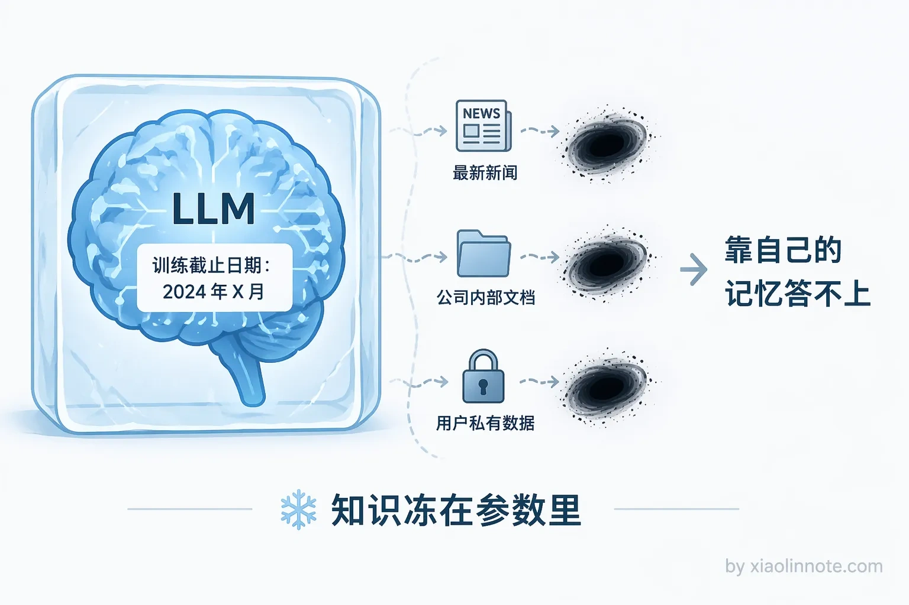
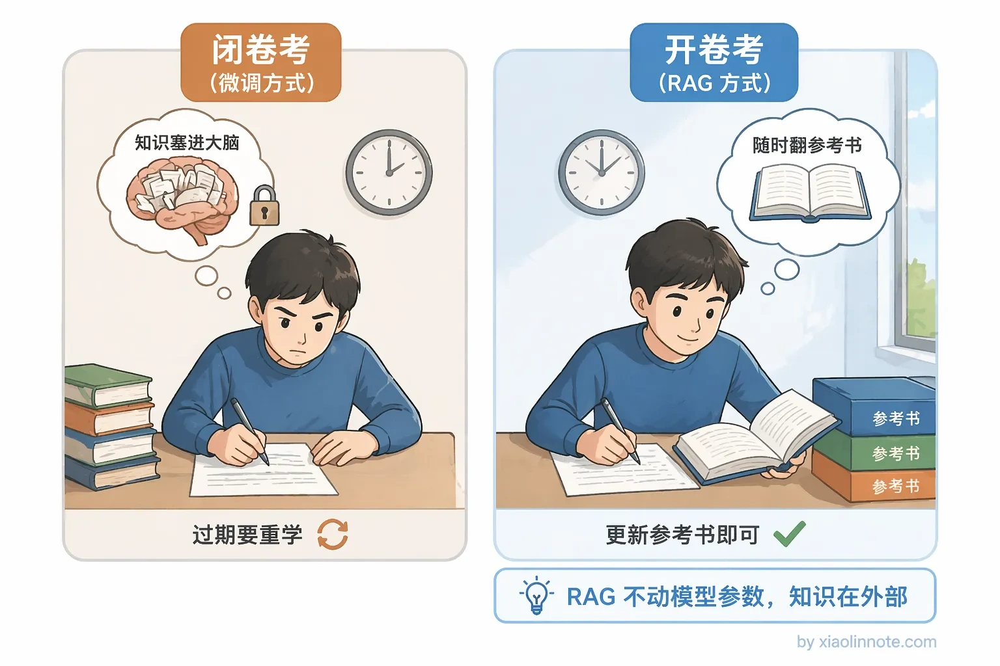
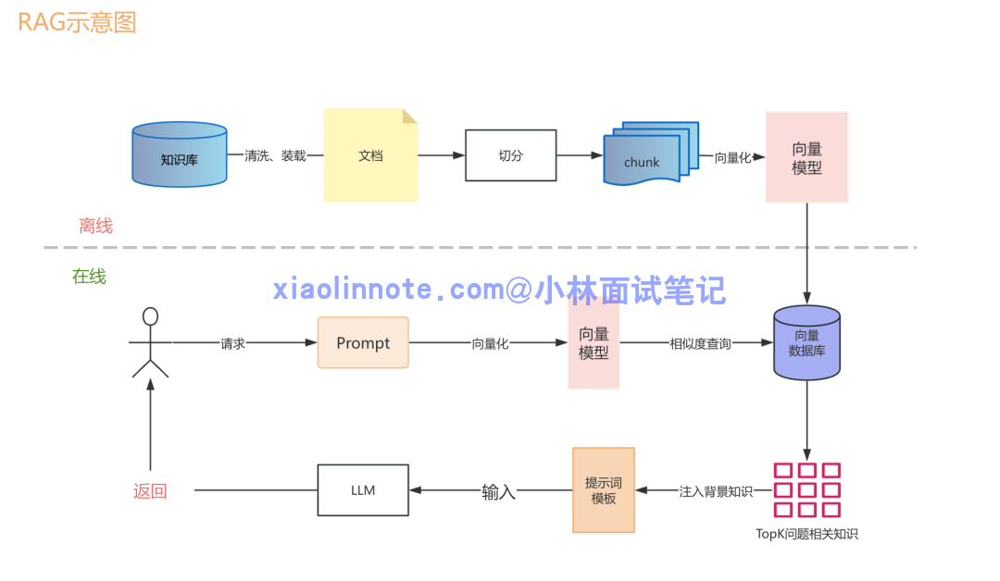
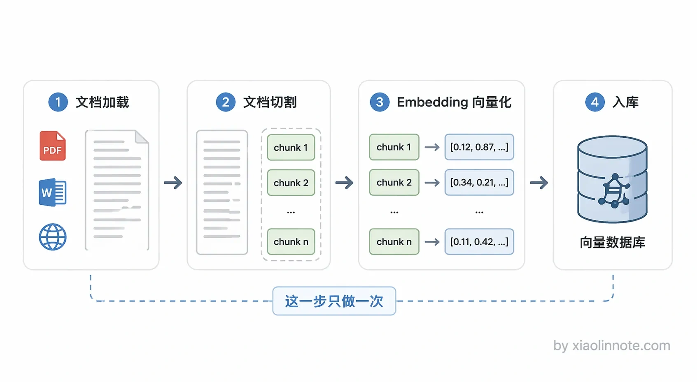
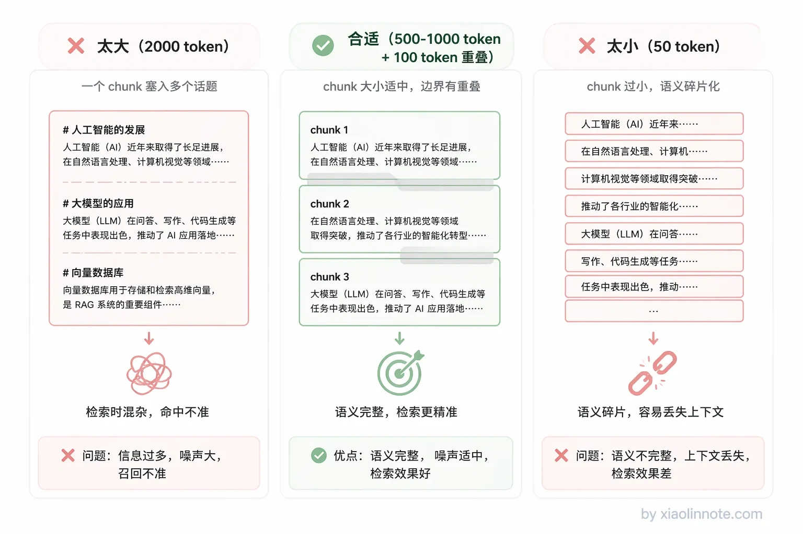
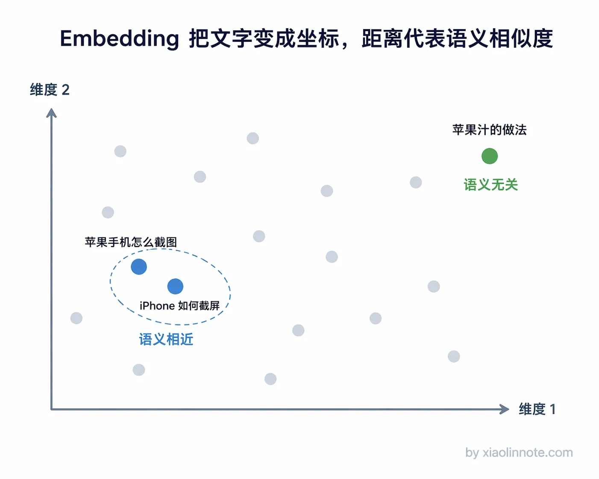
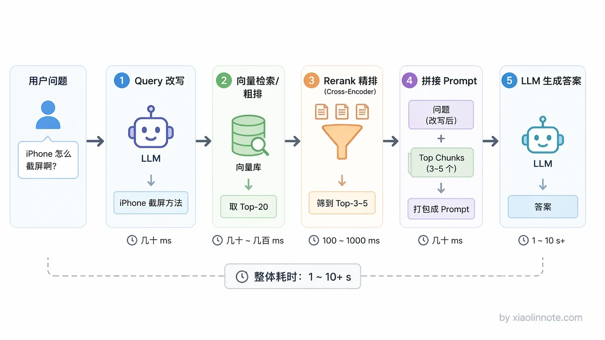
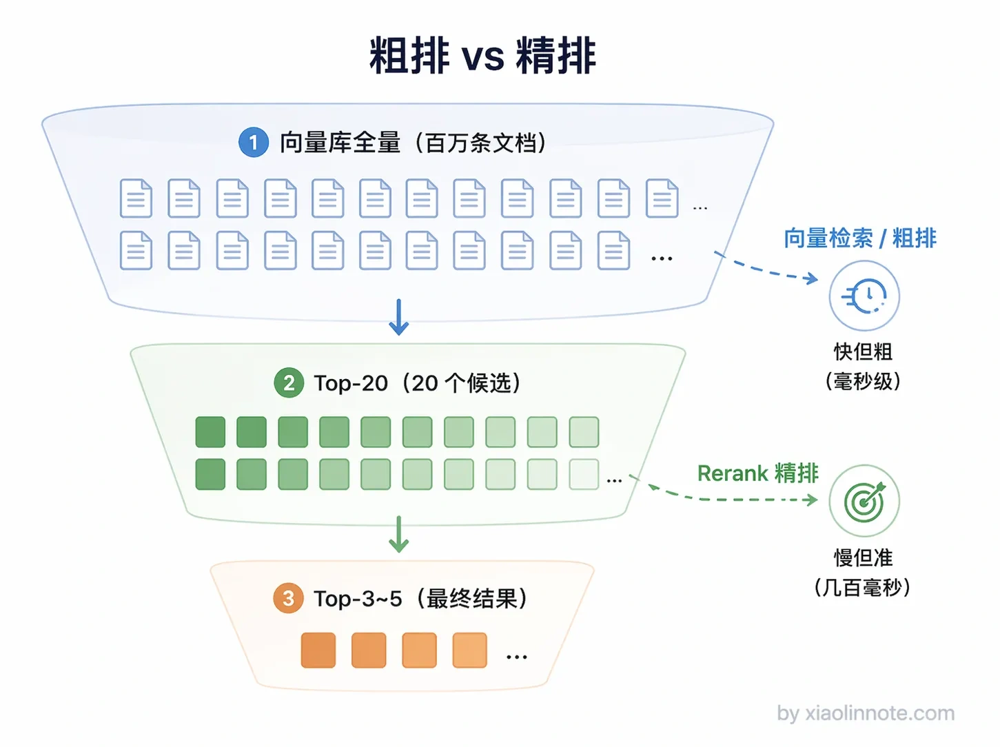
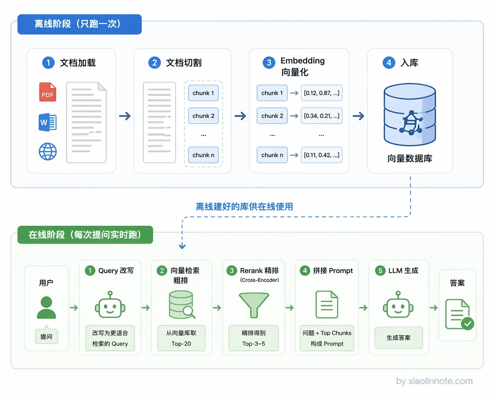
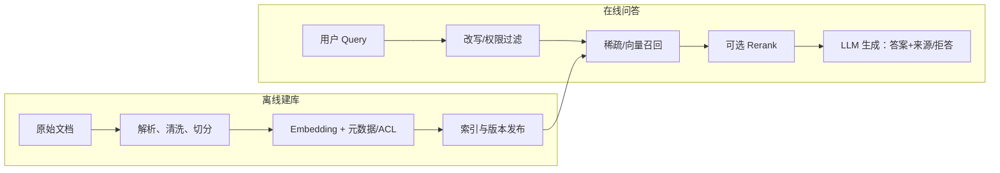

# 什么是 RAG？详细描述一个完整 RAG 系统的详细工作流程？

> 原文：[什么是 RAG？详细描述一个完整 RAG 系统的详细工作流程？](https://xiaolinnote.com/ai/rag/1_whatisrag.html) · 小林面试笔记

👔面试官：来说说什么是 RAG？详细描述一下一个完整 RAG 系统的工作流程。

🙋‍♂️我：RAG 我知道，就是一个搜索 API，用户输入关键词，去数据库里把匹配的文档捞出来返回给用户，就这样。

👔面试官：……你这是 Elasticsearch 吧？RAG 里的「G」是 Generation，生成呢？LLM 在哪？你把最核心的环节整个漏掉了。

🙋‍♂️我：哦哦，我重新说。RAG 就是把公司文档丢给大模型，让它自己学进去，下次用户问问题它就能直接答了。

👔面试官：你这说的是微调（Fine-tuning），不是 RAG。RAG 根本不会去改模型的参数，你是怎么把这两个完全不同的东西搞混的？

🙋‍♂️我：好吧，那 RAG 就是先检索再生成嘛，把数据库查出来的东西扔给大模型就行了，应该没什么复杂的吧？

👔面试官：「扔给大模型」？原始文档直接扔？一篇几万字的 PDF 你怎么扔？文档切割（Chunking）怎么切？Embedding 向量化怎么做的？离线阶段和在线阶段分别做了什么？粗排和精排（Rerank）的区别是什么？一个都说不出来是吧？回去好好补补再来吧。

好吧，这段面试属实是踩了所有雷。不过别慌，下面我把 RAG 的知识点掰开揉碎了讲一遍，保证你看完不会再被问住。

## 💡 简要回答

RAG 全称是 Retrieval-Augmented Generation，就是检索增强生成。我理解它解决的核心问题是，LLM 的知识在训练完之后就固定了，遇到私有数据或者最新的信息它就答不上来。RAG 的做法是在生成答案之前，先去外部知识库里检索相关内容，然后把检索结果和用户的问题一起交给 LLM，让它基于这些上下文来回答。本质上就是给 LLM 开了一个开卷考试的口子，不用再靠死记硬背了。

## 📝 详细解析

### LLM 的「知识冻结」困境

在聊 RAG 之前，得先搞清楚一个问题：LLM 为什么需要 RAG？它的知识到底差在哪？

你想想看，一个 LLM 训练完之后，它的知识就冻住了，训练数据截止日期之后发生的事情它一无所知，你们公司内部的文档它更不知道。就好比一个人高考之后再也不看新闻，你问他今天的股价，他怎么可能答得上来？

那能不能靠微调来更新知识呢？理论上可以，但微调成本高、耗时长，最关键的是，知识一旦写进模型参数，以后想更新就得重新训练一遍。这就好比你为了让一个人记住一条新闻，让他重新上了一遍大学，太不划算了。

RAG 走了一条完全不同的路：不把知识塞进模型参数里，而是在用户提问的时候，实时去外部知识库检索，把找到的相关内容直接放进 prompt 给 LLM 读。LLM 本身有很强的阅读理解能力，就算它之前不「知道」这段内容，只要你把它放在上下文里，它就能基于这段内容来回答问题。这就是 RAG 的核心思想：既然模型记不住，那就给它开卷考试。

一个完整的 RAG 系统分**离线**和**在线**两个阶段，下面我挨个讲。

### 离线阶段：提前把知识准备好

离线阶段的目标很明确：在用户提问之前，就把知识库建好。这一阶段只做一次，建好了后面反复用。

第一步是**文档加载**。把各种格式的原始数据读取进来，可以是 PDF、Word、Markdown、网页、数据库记录等。这一步通常用 LlamaIndex 或 LangChain 提供的 DocumentLoader 来做，它们支持几十种数据源格式，基本上你能想到的格式都有现成的加载器。

接下来是**文档切割（Chunking）**。你可能会问，为什么不把整篇文档直接存进去检索，非要切成一块一块的？原因有两个。一是向量模型有输入长度限制，一般最多几百到几千个 token，整篇文档根本塞不进去。二是更关键的，如果把一整篇文章压缩成一个向量，细节信息会被「平均掉」。这就好比你问「这道菜怎么样」，对方回答「中国菜整体偏咸」，具体哪道菜咸、咸到什么程度，全丢失了。

所以要把文档切成小片段（chunk），每个 chunk 代表一段聚焦的内容。那 chunk 大小怎么定？太大了（比如 2000 token），信息太杂，检索时容易召回来一堆不相关的东西；太小了（比如 50 token），语义不完整，上下文被切断了。500～1000 token、100 token overlap 可以作为某些语料的起点，但不是标准答案；章节结构、句子长度、表格/代码比例和查询类型都会改变最佳粒度。应通过检索 Recall@K、引用完整性、上下文长度和延迟做消融实验。

然后是整个离线阶段最核心的一步，**Embedding（向量化）**。Embedding 模型会把一段文字转成一个高维数字向量，比如一个 1536 维的浮点数列表。这东西听起来很玄，但其实你可以把它理解成一个「语义坐标系」。什么意思呢？语义相似的文本，它们在这个坐标系里的位置就靠近；语义不相关的，位置就离得远。

你可能会好奇，模型凭什么能做到这件事？答案是训练。Embedding 模型在训练时看了海量文本，学会了识别哪些句子表达的是同一个意思，然后用对比学习等方法不断调整权重，让「意思相近的文本」在输出空间里靠近、「不相关的文本」离远。所以不是模型天生懂语义，而是训练让模型「把相近的拉近、无关的推远」，这种空间结构一旦形成，查询时就能用距离计算来找语义相近的内容了。

比如「苹果手机怎么截图」和「iPhone 如何截屏」，这两句话用词完全不一样，但意思一样，所以它们的向量会非常接近。Embedding 做的事情，就是把「意思」编码成数学坐标，意思越相近，坐标越靠近。这就是语义检索的基础，它不是在匹配关键词，而是在比较「意思相不相近」。

最后一步是**入库**，把每个 chunk 的向量、原始文本和元数据一起存进可检索存储。向量数据库是候选实现之一；也可以使用带向量索引的关系库或搜索引擎。规模、过滤、混合检索、一致性、备份和部署方式都需要实测，不能从产品名称推断固定性能。

到这里，离线阶段就完成了。知识库已经建好，等着在线阶段来检索。

### 在线阶段：用户提问时实时检索

在线阶段是每次用户提问时实时执行的，对响应速度有要求。

第一步是**Query 处理**。用户的提问往往是口语化的，或者比较模糊，直接拿去检索效果不一定好。比如用户问「上次说的那个方案怎么样」，这个问题离开对话上下文完全没法检索，因为检索系统根本不知道「上次」指的是什么、「那个方案」又是哪个。所以实际工程里会加一步 Query 改写，让 LLM 把用户的问题改写成更适合检索的形式，或者从对话历史里补充必要的上下文。

然后是**向量检索（粗排）**。把用户的问题也转成向量，然后去向量库里做相似度搜索，找出向量距离最近的 Top-K 个 chunk。延迟取决于索引、硬件、过滤条件、并发和网络；向量检索主要比较表示空间中的距离，可能混入“看着近但不够相关”的候选，因此要记录召回延迟和 Recall@K，而不是预设毫秒数。

接下来是**Rerank（精排）**。这一步就是为了弥补粗排的不足。Rerank 模型（常见实现包括 Cross-Encoder）会把用户问题和候选 chunk 一起评估，再排序或过滤。粗排候选数和最终保留数应由离线 Recall/NDCG、上下文容量和延迟预算决定，不应固定为 Top-20→Top-3/5。

最后是**生成**，把用户问题 + 精排后的 chunk 拼成 prompt，交给 LLM 生成最终答案。Prompt 可以要求模型区分上下文与常识、给出来源、资料不足时拒答或说明不确定；这只能降低风险，不能替代访问控制、来源核验和事实评估。

### 串起来看完整流程

整个流程串起来是这样：离线阶段把文档切割成 chunk，转成向量存进数据库，这一步只做一次；在线阶段每次用户提问时，先把问题向量化，再去数据库里检索，经过精排后拼进 prompt，最终由 LLM 生成答案。两个阶段分工明确，离线负责建库，在线负责检索和生成。

排错应沿数据流定位：解析/切分错会造成“库里没有”；Embedding/查询不一致会造成召回错；权限过滤或版本发布错会造成拿到不该看的内容；生成约束或证据引用错会造成“召回正确但回答错误”。每层都应记录版本、耗时、候选和失败原因。

RAG 的主要价值是把知识更新与模型参数解耦，并为答案提供可关联的来源；但更新还要经过解析、切分、索引发布和权限同步，溯源也不等于来源正确。是否适合企业场景，要与搜索、结构化查询、微调或人工流程比较。

## 🎯 面试总结

回到开头那段面试，现在我们再来看，该怎么回答这个问题才不会踩雷。

面试官问「什么是 RAG」，你不能只说「检索+生成」五个字就完了，得说清楚三件事。第一，RAG 解决的是什么问题？LLM 知识冻结、无法覆盖私有数据和最新信息，这是 RAG 存在的理由。第二，RAG 和微调的本质区别是什么？微调是把知识写进模型参数，RAG 是把知识放在外部实时检索，不动模型本身。这两点搞清楚了，面试官就知道你不是背定义的。

然后面试官一定会追问「完整工作流程」。这时候你要按离线和在线两个阶段来讲。离线阶段：文档加载 → 切割（Chunking）→ 向量化（Embedding）→ 入库，这一步只做一次。在线阶段：Query 改写 → 向量检索（粗排）→ Rerank（精排）→ 拼接 prompt → LLM 生成，每次用户提问都要跑一遍。每个环节干什么、为什么需要，都要能说清楚。

最后，如果能再补一句 RAG 的核心价值，知识可热更新、答案可溯源，面试官基本就没什么好追问的了。

---
