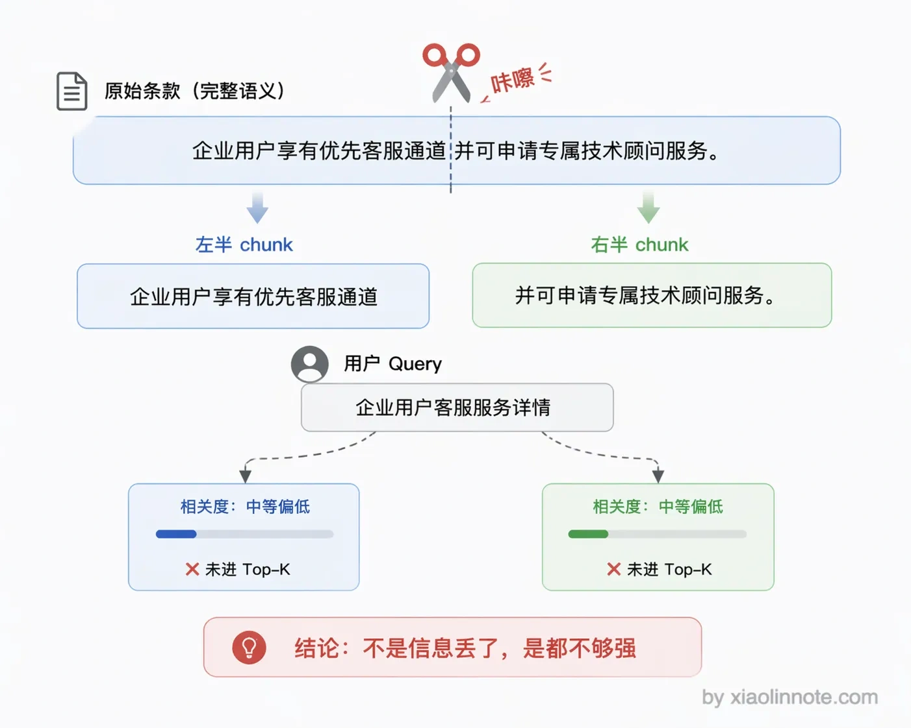
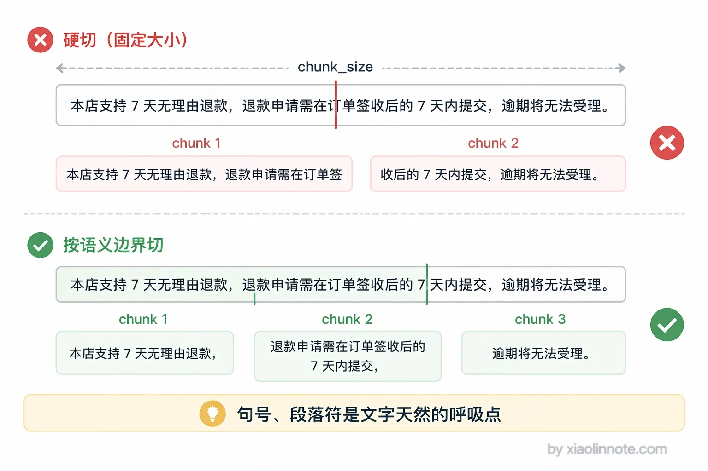
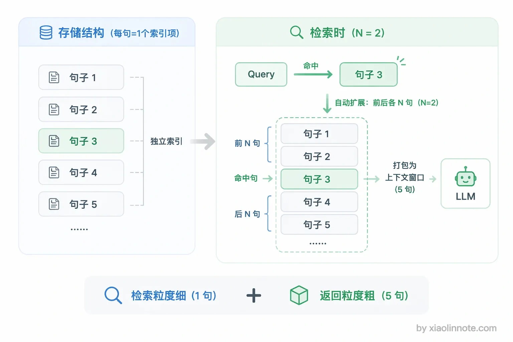
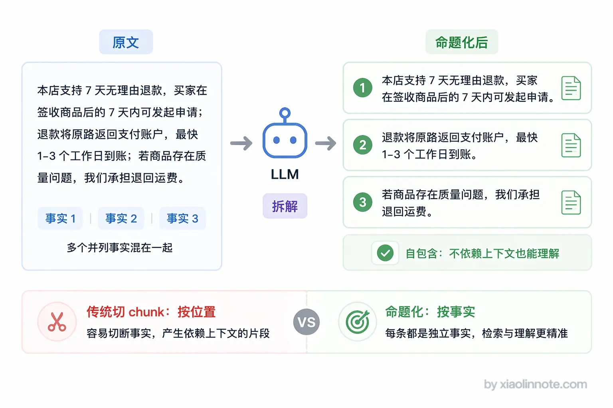
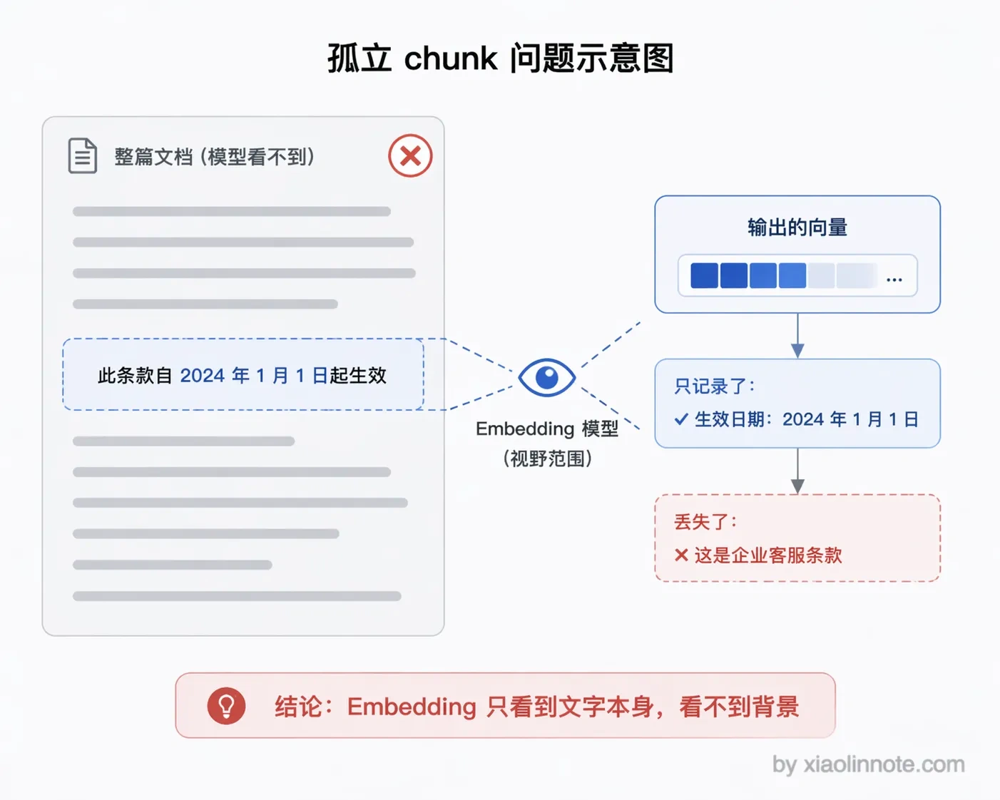
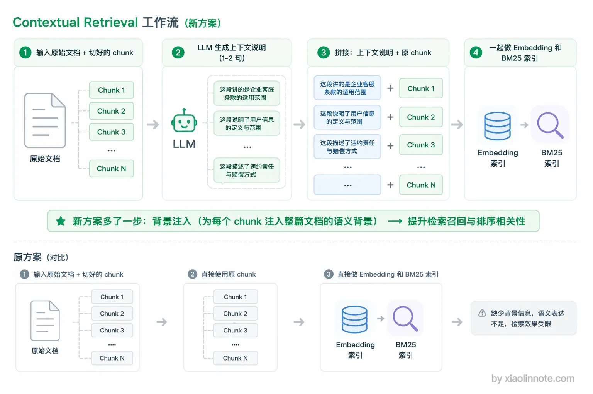
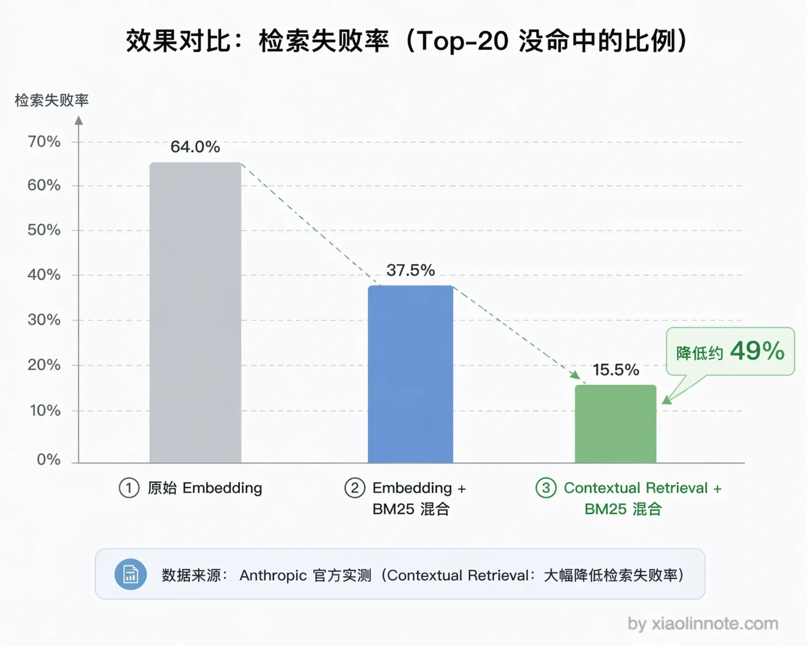

# 怎么规避语义被切割掉的问题？

> 原文：[怎么规避语义被切割掉的问题？](https://xiaolinnote.com/ai/rag/5_semantic_cuts.html) · 小林面试笔记


👔面试官：Chunking 的时候语义被切断是个很常见的问题，你有没有遇到过？怎么处理的？

🙋‍♂️我：遇到过，加个 overlap 重叠就好了，前后重叠个 100 token，基本不会出问题。

👔面试官：overlap 只是兜底方案，它能保证跨边界的文字不丢失，但解决不了「一个完整语义被拆散」的问题。比如「企业用户享有优先客服通道，响应时间不超过 2 小时，并可申请专属技术顾问服务」这句话被切成两段，两段单独看相关度都不高，overlap 帮得了吗？

🙋‍♂️我：呃……那就把 chunk 设大一点，每个 chunk 包含更多内容，就不会断了。

👔面试官：chunk 越大，语义越杂，检索精度越差。你这是用一个问题去换另一个问题。句子窗口检索呢？父子切割呢？Contextual Retrieval 呢？一个都没听说过？

好吧，语义截断这个问题远比加个 overlap 复杂，下面我来把各种方案讲透。

## 💡 简要回答

我的思路是从两个方向来规避这个问题。第一个方向是切的时候就不要在语义中间截断，用重叠切割和语义边界切割来保证每个 chunk 内容是完整的，也就是按句子、段落这些自然的边界来切。

第二个方向是切完之后用检索策略把上下文补回来，核心方案是句子窗口检索，命中一个句子就把周围几句一起返回给 LLM；另外还有父子切割，小块检索命中、大块内容输出。

还有一个可评估的方案是 Contextual Retrieval：在做 Embedding 之前让模型结合文档背景为 chunk 生成说明，再把说明与原 chunk 一起索引。它可能缓解孤立 chunk 的召回问题，但会增加离线生成、版本和错误背景的治理成本，不是从根本上消除问题。

## 📝 详细解析

### 语义被切割是什么问题?

先把问题说清楚。假设文档里有这样一段内容：

```
...前三条款适用于个人用户。
第四条：企业用户享有优先客服通道，响应时间不超过 2 小时，
并可申请专属技术顾问服务。此条款自 2024 年起生效。...
```

如果 chunk 的边界恰好切在「响应时间不超过 2 小时，」这里，那「企业用户享有优先客服通道」和「并可申请专属技术顾问服务」就被分到了两个 chunk。

你可能会想，两个 chunk 里都有部分答案，搜到其中一个不就行了？问题是，两个 chunk 单独来看相关度都不高，极可能都不会被召回，答案就断了。

这就是语义截断的核心问题：不是信息丢了，而是信息被拆散之后，每一半都不够强，检索时全军覆没。



### 方案一：重叠切割（Overlap）

最基础的方案，让相邻 chunk 之间有一段内容重叠，这样可以提高跨边界内容被共同召回的概率，但不能保证完整语义一定落在某一个 chunk 中。

重叠量可以从一个较小候选开始，例如按 token/字符设定一个可解释的比例；10%～20% 只是某些实现的试验范围，不是规范。单位、语料、结构和查询集不同，最佳设置也会不同。

你可能会问，为什么不直接设大一点，比如重叠 40%？这是实践经验摸出来的平衡点：太小了（比如 5%）重叠区域覆盖不了完整的跨边界语义，保护效果弱；太大了（比如 40%）重复内容太多，存储和检索成本上升，而且大量重复内容还会干扰 LLM 的阅读和理解。

重叠切割是一个常见基线，但不是所有 RAG 系统都应该开启；它只是提高跨边界证据共同出现的概率，不能保证文字不丢失，也不能解决所有语义被拆散的问题。应结合标题/段落边界、父子上下文、表格/代码结构和评测决定。

### 方案二：按语义边界切割

重叠切割既然只是兜底，那能不能在切的时候就更聪明一点，直接避免在语义中间截断？这就是语义边界切割的思路——找到文本中自然的语义边界再切。为什么要识别句子边界？

句子或段落通常比任意字符边界更接近语义单元，但并非每个句子都自包含（代词、列表、表格和上下文依赖仍可能存在）。切分后仍需用查询集验证召回和引用完整性。

实际操作时，可以用 NLP 工具（比如 `spacy` 或 `nltk`）识别句子结束位置，然后以句子为单位填充 chunk：把句子一条条往当前 chunk 里加，加满了就封存这个 chunk 开启新的，不会在句子中间截断。对于段落分明的文档，还可以在句子边界的基础上优先在段落边界处切，效果更好。



### 方案三：句子窗口检索（Sentence Window Retrieval）

前面两种方案都是在「怎么切」上做文章，到了这一步，思路就变了——切归切，检索的时候再把上下文补回来。这个方案的思路和前两个完全不同，它不是在「切」上做文章，而是在「检索后如何返回上下文」上做文章。类比一下：就像你在图书馆里用关键词找到了某本书里的一句话，但你实际阅读的是这句话所在的整个段落，而不是只拿走那一行文字。

具体做法是：存储时把文档切成单个句子，每个句子单独做向量，用于精准检索；检索命中一个句子后，并不只返回这一个句子，而是把这个句子前后各 N 个句子一起返回，形成一个上下文窗口，交给 LLM 阅读。



这样的好处是检索粒度细、返回时可补上下文；但窗口过大会引入冗余或无关内容，句子级索引也会增加存储、索引和更新成本。窗口大小应按任务和上下文预算评估。

### 方案四：父子切割（Parent-Child Chunking）

理解了句子窗口检索的「检索命中后动态扩展上下文」思路，父子切割就很好懂了，它是一种更结构化的实现方式。

父子切割的思路是「用小 chunk 检索，用大 chunk 生成」：小 chunk 记录 parent_id，命中后回表取大 chunk；父块可以单独存储，不必机械复制两份。检索精度、返回上下文、存储和更新复杂度需要一起评估。

和上面句子窗口检索对比：句子窗口是检索命中后动态扩展上下文，父子切割是提前把父子关系存好。两者思路相近，父子切割更灵活（父 chunk 大小可以精确控制），句子窗口实现更简单（不需要维护父子 ID 关系）。

### 方案五：命题化切割（Propositions-based Chunking）

前面几种方案都是在「怎么切」或「切完怎么补上下文」上想办法，那有没有一种方案能从根本上让每个 chunk 天然就是完整独立的？命题化切割就是冲着这个目标来的。这是质量最高但成本也最高的方案，思路不按文本位置切割，而是用 LLM 把文档分解成一条条独立的「命题」（Proposition）。每个命题是一个完整、自包含的陈述句，包含了表达这个事实所需的全部上下文，单独拿出来就能看懂，不依赖上下文，只包含一个核心事实。

举个例子来感受一下。原文是「企业用户享有优先客服通道，响应时间不超过 2 小时，并可申请专属技术顾问服务。」分解成命题后变成三条独立陈述：「企业用户享有优先客服通道。」「企业用户的客服响应时间不超过 2 小时。」「企业用户可以申请专属技术顾问服务。」这三条单独拿出来都能看懂，不需要任何上下文辅助，向量化后的语义密度极高。



命题化切割可能提高事实粒度，但 LLM 抽取可能漏掉条件、否定、来源或引入改写错误；需要保留原文指针、版本和抽取校验。成本也包括生成、存储、更新和评估。

### 方案六：Contextual Retrieval（Anthropic）

命题化切割是用 LLM 重新组织 chunk 内容，而 Contextual Retrieval 则换了一个角度：不改变原始 chunk，而是在向量化之前把部分背景补进去。它是 Anthropic 工程文章介绍的一种方案；具体效果依赖语料、模型、提示和索引配置，不应当作通用标准。

先说一下这个方案要解决的根本问题：chunk 被单独拿出来后就失去了语境。

一个 chunk 在向量化时，Embedding 模型只能看到这段文字本身，根本不知道它来自哪篇文档、讲的是什么主题。比如「此条款自 2024 年 1 月 1 日起生效」这段文字，单独向量化后完全丢失了「这是企业版客服条款」这一关键信息，检索时自然容易被无关内容干扰。

你可能会觉得奇怪，向量不是能捕捉语义吗，为什么会丢信息？原因很简单：向量只能捕捉它「看到」的文字里的语义，它看不到的那部分背景信息，自然没法编码进向量里。向量里没有主题信息，是孤立 chunk 召回质量低的根本原因。



核心做法分两步：

1. **生成 Context**：让 LLM 看着整篇原始文档，为每一个切出来的 chunk 生成一段简短的背景说明（通常 1～2 句话），说清楚这个 chunk 在整篇文档里处于什么位置、讲的是什么
2. **拼接再向量化**：把生成的 Context 前置拼到 chunk 前面，然后把这个「Context + chunk」整体去做 Embedding 和 BM25 索引

具体来说，这一步会用 LLM 传入完整文档和当前 chunk，让模型生成「这段内容是关于什么的」的背景说明，再把背景说明和原始 chunk 拼在一起，整体向量化入库。

举个例子来感受一下效果。假设原始 chunk 是：

```
此条款自 2024 年 1 月 1 日起生效，适用于所有企业版订阅用户。
```

没有上下文时，这个 chunk 孤立地看完全不知道「此条款」指的是什么，向量检索时很容易被其他内容干扰。

Contextual Retrieval 生成的 Context 可能是：

```
这段内容说明了企业用户专属客服和技术顾问服务条款的生效日期和适用范围。
```

拼在一起向量化的就是：

```
这段内容说明了企业用户专属客服和技术顾问服务条款的生效日期和适用范围。

此条款自 2024 年 1 月 1 日起生效，适用于所有企业版订阅用户。
```

现在这个 chunk 的表示可能包含「企业用户」「客服条款」「生效日期」等背景语义，是否提升召回要用标注查询集验证；同时保留原始 chunk 和生成背景，避免错误背景替代证据。



### 成本控制：用 Prompt Caching 大幅降低 LLM 调用费用

你可能会担心，每个 chunk 都要调一次 LLM，这成本得多高？Prompt Caching 在部分提供方/配置下可以复用重复前缀，但命中规则、价格、TTL 和收益必须按当前官方文档和实际调用测量。

每次调用时，`full_document`（完整文档）在所有 chunk 的请求里是相同的前缀。开启 Prompt Caching 后，第一次调用会把文档内容缓存到 KV Cache，后续同一篇文档的所有 chunk 请求都复用这份缓存，只有 chunk 部分需要重新计算。

成本估算应把文档长度、chunk 数、命中率、缓存写入/读取价格、TTL、并发和失败重试都纳入模型。Anthropic 文章中的费用与收益是特定模型和假设下的示例，不是跨提供方保证；工程上还要确认缓存前缀不会混入租户或权限敏感内容。

Anthropic 的工程文章报告过在其数据、模型和评测设置下，Contextual Retrieval 与 BM25/重排结合可降低 Top-20 检索失败率；这是来源特定的基准结果，不能直接外推到你的语料。应在自己的查询集上报告 Recall@K、MRR/nDCG、索引成本和延迟。



把几种方案的核心思路对比一下，实际选型时按场景组合使用：

| 方案 | 核心思路 | 适合场景 | 代价 |
| --- | --- | --- | --- |
| 重叠切割 | 相邻 chunk 有内容重叠 | 所有场景，基础兜底 | 存储轻微增加 |
| 语义边界切割 | 在句子/段落边界处切 | 段落结构清晰的文档 | 需要 NLP 工具 |
| 句子窗口检索 | 精细检索 + 扩展返回窗口 | 追求高召回精度 | 存储量大 |
| 父子切割 | 小块检索、大块返回 | 通用场景，效果均衡 | 存储翻倍、索引复杂 |
| 命题化切割 | LLM 拆解为独立命题 | 高质量要求、重要知识库 | LLM 调用成本高 |
| Contextual Retrieval | 向量化前为每个 chunk 补全背景上下文 | 文档语境强、chunk 孤立感严重的场景 | LLM 调用成本（Prompt Caching 可大幅降低） |

选型时同时看三类指标：召回（Recall@K、MRR/nDCG）、上下文（证据完整性、冗余率、引用覆盖）和系统（索引构建时间、更新成本、P95 延迟、token/费用）。对自动生成的 context、命题或摘要保留原文指针，并抽样检查条件、否定、数字和适用范围是否被改变。

## 🎯 面试总结

回到开头那段面试，语义截断问题的回答不能只停留在「加个 overlap」。

面试官想听的是你对问题本质的理解和多种方案的掌握。先说清问题：chunk 被单独拿出来后失去语境，语义被拆散导致检索召回不到。

然后分两个方向讲方案：一是「切的时候别截断」，包括重叠切割、语义边界切割；二是「切完之后补上下文」，包括句子窗口检索、父子切割、命题化切割、Contextual Retrieval。

实际工程中通常是组合使用：重叠切割做兜底，语义边界切割保证切割质量，对高质量要求的场景再加父子切割或 Contextual Retrieval。能把这个组合思路讲出来，面试官就满意了。

---
