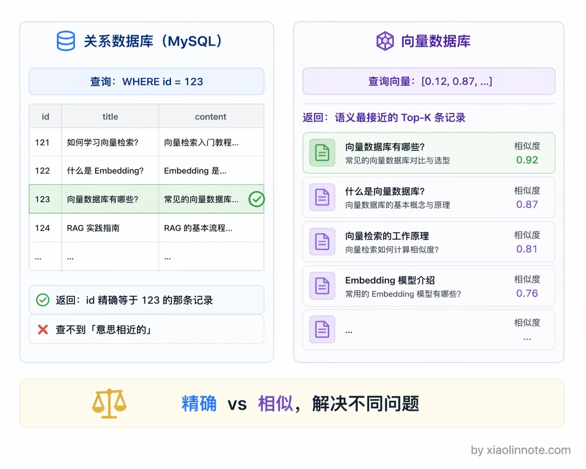
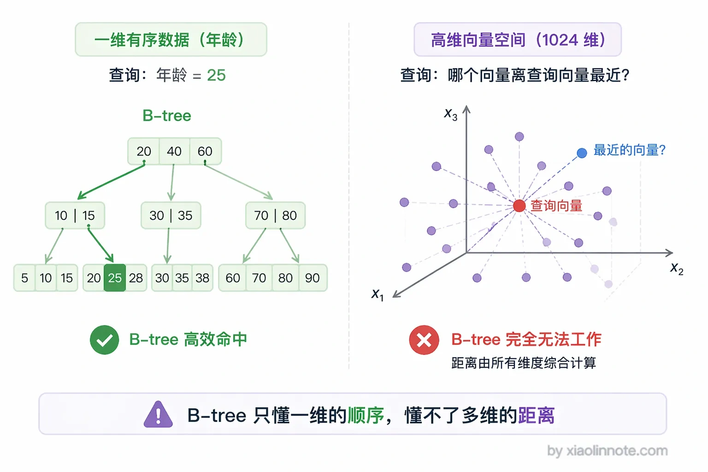
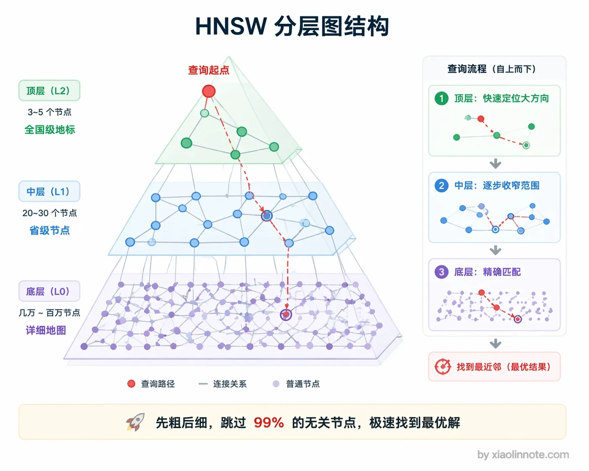
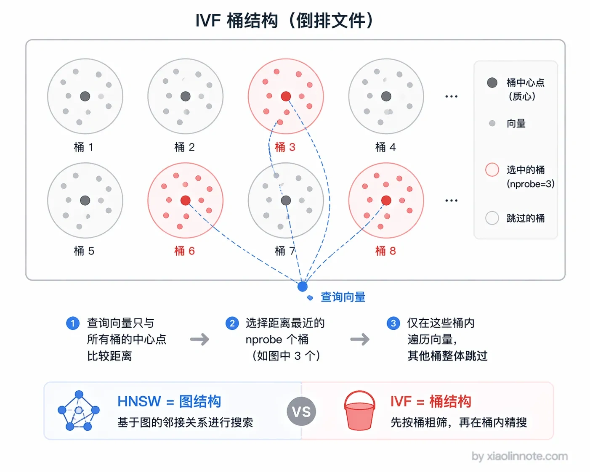
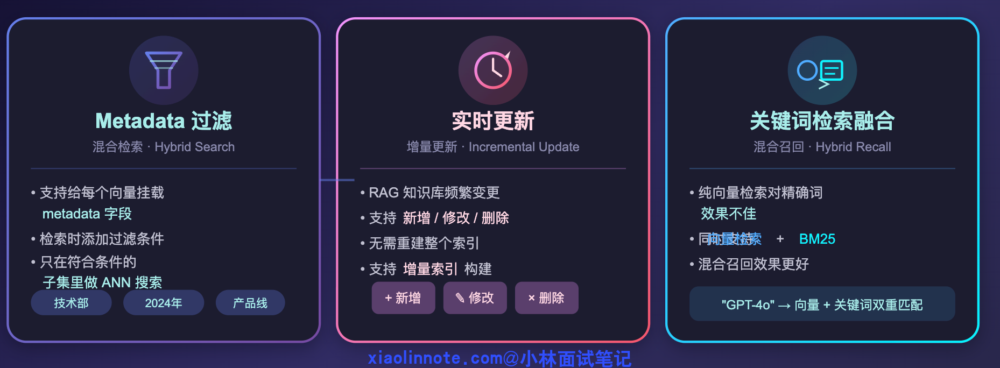
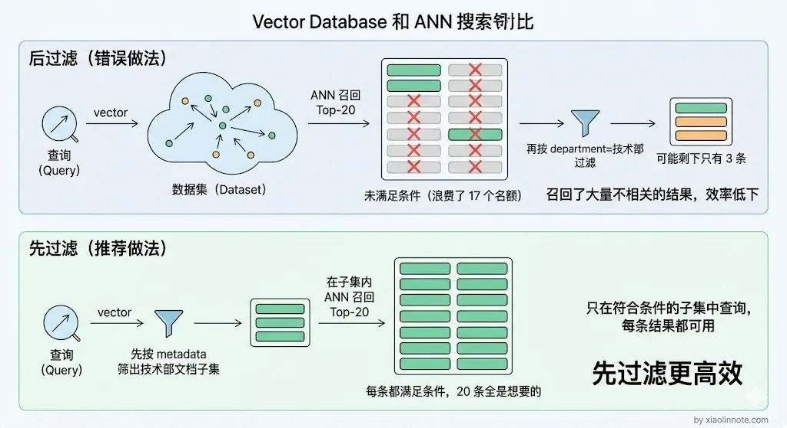

# 什么是向量数据库？有没有做过向量数据库的对比选型？

> 原文：[什么是向量数据库？有没有做过向量数据库的对比选型？](https://xiaolinnote.com/ai/rag/8_vectordb.html) · 小林面试笔记

👔面试官：来说说什么是向量数据库？你有没有做过向量数据库的对比选型？

🙋‍♂️我：向量数据库我知道，就是在 MySQL 里加个向量字段，然后用 LIKE 语句做模糊匹配检索，差不多就是存向量的数据库吧。

👔面试官：MySQL 加个向量字段？那是存向量，不是向量数据库。你用 LIKE 做语义检索？LIKE 是字符串模糊匹配，跟向量相似度搜索完全是两码事。你对向量数据库的理解就停留在「存了个向量字段」？

🙋‍♂️我：那应该是用 Elasticsearch 吧？ES 不是也能做向量检索吗，加个 dense_vector 字段类型就行了，没必要专门引入一个新的数据库吧。

👔面试官：ES 的向量检索能力是后来加的补丁，不是原生设计，数据量一大性能根本扛不住。而且你连专门的向量数据库和传统数据库的本质区别都说不清楚，还怎么做选型？选型的时候你考虑哪些因素？索引算法了解吗？HNSW 和 IVF 听说过吗？

🙋‍♂️我：选型嘛，就看哪个 Star 多用哪个呗，Chroma Star 挺多的，生产环境直接上 Chroma 就行了吧？

👔面试官：Chroma 虽然现在也有 Client-Server 模式了，但超大规模场景你确定它扛得住？百万级以上的数据量你怎么保证稳定性？面试前连基本的选型标准都没搞清楚，Star 数量能当技术选型依据？回去好好了解一下各家的适用场景再来吧。

好吧，这段面试属实是把向量数据库的雷踩了个遍。下面我来从头捋清楚向量数据库到底是什么、为什么需要它、以及怎么做选型。

## 💡 简要回答

向量数据库（或带向量索引能力的数据库/搜索引擎）用于存储向量、按相似度召回候选，并把向量与原文、版本、租户、权限等 metadata 关联起来。常见核心能力是近似最近邻搜索（ANN，Approximate Nearest Neighbor），但生产系统还要看过滤、更新、备份、扩缩容、可观测性和权限隔离。

“是否需要专门的向量数据库”不是概念题的固定答案。关系型数据库、搜索引擎和专用向量数据库都可能提供向量索引；选择应由规模、查询模式、过滤与 JOIN 需求、运维能力、合规和目标 SLO 的实测结果决定。

面试中不要把个人使用经历或厂商规模案例说成普遍事实。更稳妥的回答是先给出候选类别，再说明评测数据集、过滤条件、更新比例、并发、延迟分位数、召回质量和总成本，最后解释为什么某个方案满足当前约束。

## 📝 详细解析

### 什么是向量数据库？

向量数据库就是专门用来存储和检索「向量」的数据库。

这里的向量，指的是嵌入模型（Embedding Model）把文本、图片、音频等内容转换成的一串数值，例如 [0.12, -0.87, 0.34, ...]。维度、是否归一化和距离度量都由模型与索引配置决定；相似向量通常意味着模型认为内容相关，不等于事实一定相同，也不等于权限相同。

向量数据库支持的核心操作叫做 **近似最近邻搜索（ANN，Approximate Nearest Neighbor）**：给你一个查询向量，在库里找出和它最相似的 K 个向量，返回对应的原始内容。这正是 RAG 里「检索」那一步的底层支撑——用户问了一个问题，先把问题转成向量，再去向量数据库里找最相关的文档片段，最后喂给大模型生成回答。

很多人会把向量数据库和「在 MySQL 加个向量字段」混为一谈。更准确的说法是：关系型数据库擅长事务、约束、JOIN 和精确过滤；向量索引擅长按相似度取候选。某些关系型数据库通过扩展也能提供向量索引，因此边界是能力与运维边界，而不是产品名称的绝对二分。两类能力经常需要组合。

### 为什么需要专门的向量数据库？

理解了向量数据库是干什么的，接下来自然会问：为什么不直接在 MySQL 或者 ES 里存向量，非要引入一个新的数据库？

普通的关系型数据库（MySQL、PostgreSQL）在存储结构化数据时靠 B-tree 索引，查询 `WHERE id = 123` 这种精确匹配效率极高。但向量检索要做的事完全不同——不是找「等于」的，而是找「最相近」的，没有精确匹配，只有相似度排序。

高维向量（比如 1024 维）的相似度搜索如果暴力遍历，把查询向量和库里每一条向量都算一遍余弦相似度，百万条数据就要算一百万次，延迟完全不可接受。

那为什么不用 B-tree 加速？因为 B-tree 只能处理一维的有序索引，对高维向量这种「多个维度同时要考虑距离」的场景基本是失效的。你不可能对一个 1024 维的向量建一个 B-tree，然后说「帮我找和它最近的」，因为「近」本身是一个高维空间的综合判断，不是某一个维度上的排序。

向量索引的价值在于用专门的数据结构减少候选计算，在可接受的召回损失下满足目标延迟。具体延迟取决于硬件、向量维度、索引、过滤、并发和数据规模，不能脱离这些条件直接承诺“毫秒级”。

### 核心索引算法：HNSW 和 IVF

向量检索的性能来自索引、存储布局、过滤执行方式和缓存等多个环节。HNSW 和 IVF 是常见的两类 ANN 思路，但并不是所有系统的唯一选择：

先说 **HNSW（Hierarchical Navigable Small World）**。它构建多层图结构，查询时从上层稀疏图开始导航，逐层收窄范围，最终在底层寻找近邻。可以把它想象成在地图上找最近的餐厅：先确定大致区域，再缩小到街区，而不是遍历所有餐厅。HNSW 可以在召回与延迟之间调节，但图结构会带来额外内存和构建/更新成本。实际召回率取决于数据分布、距离度量、`M`、`efConstruction`、`efSearch` 和过滤策略，不应写成固定百分比或默认配置结论。

**IVF（Inverted File Index）** 是另一种思路：先对向量聚类，把相近向量分进不同桶，查询时只探查最相关的几个桶。这像图书馆先定位“计算机科学”区域，再在区域内找书。IVF 可以减少候选计算，也能与压缩等技术组合；但只探查部分桶时可能漏召回，需要调节聚类数量、探查桶数等参数。是否更省内存或更适合大规模，仍取决于实现、压缩、分片和硬件。

你可能会问，既然 HNSW 常见，为什么还需要 IVF？可以把它理解成两种不同的资源交换：图导航通常换取较好的候选质量，但要维护图结构；聚类索引通过只搜索部分桶减少计算，并可能配合压缩降低存储开销，但会引入漏召回风险。最终应以同一数据集、同一过滤与并发条件下的基准测试决定。

### 向量数据库的核心能力

搞清楚了索引算法这个底层核心，再来看向量数据库在工程层面需要具备哪些能力。光有 ANN 搜索还不够，生产级系统还要支持几个关键特性：

第一个是 **Metadata 过滤**。实际业务里，知识库往往有多个部门、产品线、租户和版本，用户只能查询自己有权限的文档。检索前必须先完成租户与 ACL 约束；随后再按部门、时间等 metadata 过滤。过滤是在 ANN 前、ANN 中还是 ANN 后执行，取决于具体实现和过滤选择性：后过滤可能导致 Top-K 不足，前过滤可能使索引失效或变慢。因此要用“带过滤的 Recall@K 和延迟”验证，而不是笼统地宣称某一种顺序总是最好。

第二个是**更新与一致性**。RAG 的知识库经常需要新增、修改、删除文档，系统要确认写入成功、索引何时可见、删除是否已对查询生效，以及重建期间如何回滚。许多实现支持增量写入，但“在线写入”不等于所有副本立即可见；需要明确可接受的陈旧窗口，并为失败重试、重复事件和版本切换设计幂等策略。

第三个是**与关键词检索融合**。纯向量检索对产品型号、错误码、专有名词等精确词语可能不稳定；可以在同一系统或独立搜索引擎中加入 BM25 等词法召回，再做归一化、RRF 或学习排序。混合召回是否更好也要用领域数据验证，不能只看组件是否“支持”某个功能。

### 选型建议

了解了向量数据库的核心原理和能力之后，最后来看一个很实际的问题：到底选哪个？

选型至少要看：数据量与增长、向量维度、过滤选择性、读写比例、并发与 SLO、备份恢复、部署/托管方式、数据驻留与权限、混合检索、迁移成本以及总成本。规模数字只能作为测试分层，不能直接等同于某个产品的上限。

一个更可复用的决策方式是先选候选类别，再做同口径压测：

| 候选类别 | 可能更合适的约束 | 需要重点验证 |
| --- | --- | --- |
| 本地嵌入式/轻量服务 | 原型、单机或小规模内部工具 | 并发、备份、升级、服务重启后的恢复 |
| 关系型数据库扩展 | 已有事务库，需要 SQL JOIN 和统一运维 | 向量索引类型、过滤下的延迟、写入与 vacuum/备份影响 |
| 搜索引擎 | 词法检索、过滤、聚合已经是核心需求 | 向量召回质量、资源隔离、索引更新和成本 |
| 专用向量数据库 | 向量检索是主路径，需要分片、副本或专门的索引能力 | 分布式一致性、扩缩容、故障恢复、迁移工具 |
| 托管服务 | 团队不希望维护集群 | 数据驻留、网络、计费、限额、供应商锁定和退出方案 |

Chroma、Qdrant、Milvus、Pinecone、pgvector 等可以作为候选示例，但具体功能、版本和托管形态会变化，不能只凭 GitHub Star、单个案例或“某家公司在用”作结论。最终选择应由同一份业务数据上的 Recall@K、P95/P99 延迟、更新可见性、故障恢复时间、容量成本和权限测试决定。

把几个常用的选项对比一下，方便选型时做决策：

| 数据库 | 部署方式 | 适合规模 | 混合检索 | 主要优势 | 主要劣势 |
| --- | --- | --- | --- | --- | --- |
| Chroma | 本地/服务/云（以具体版本为准） | 原型到按实测确定 | 以具体版本为准 | 上手成本低 | 需验证并发、持久化和扩展能力 |
| Qdrant | 自托管/云（以具体版本为准） | 按实测确定 | 以具体版本为准 | 向量检索接口清晰 | 需验证分布式、运维和迁移 |
| Milvus | 自托管/云（以具体版本为准） | 按实测确定 | 以具体版本为准 | 面向向量检索的多种索引选择 | 组件与运维复杂度可能更高 |
| Pinecone | 托管服务 | 按配额与实测确定 | 以具体版本为准 | 减少自建运维 | 需评估数据驻留、网络、费用和锁定 |
| pgvector | PostgreSQL 扩展 | 按现有库负载实测 | 可与全文检索组合 | 可与业务数据共用事务和 SQL | 需评估数据库资源竞争与扩展方式 |

## 🎯 面试总结

回到开头那段面试，面试官问「什么是向量数据库」，你不能只把它理解成「普通数据库加个向量字段」。核心是向量相似度检索及其配套的过滤、更新、存储和运维能力；关系型数据库的传统 B-tree 不能直接解决高维近邻搜索，但带向量扩展的关系型数据库也可能是合理方案。

面试官追问选型标准时，可以从数据规模与增长、过滤/混合检索、部署与合规、读写和延迟 SLO、恢复与总成本几个维度回答。然后说明如何用带过滤的召回率、P95/P99、更新可见性和故障恢复测试做决定，而不是给出脱离版本与数据的固定排名。

每个选项的适用场景和优劣势都要说清楚，千万别拿 GitHub Star 数量当选型依据。另外，索引算法至少要能讲清楚 HNSW 和 IVF 的区别和适用场景，这是向量数据库的核心技术，面试官一定会问。

---
