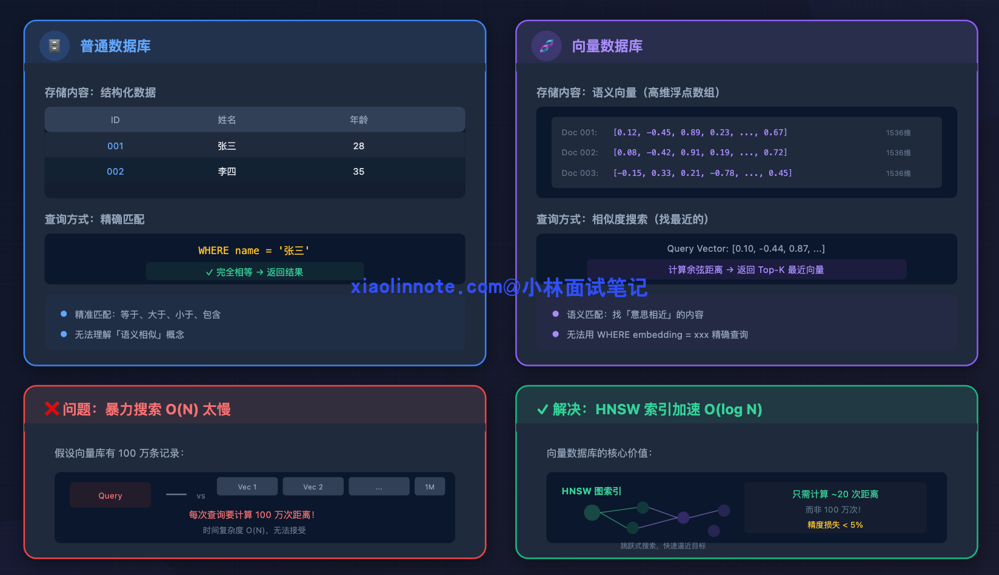
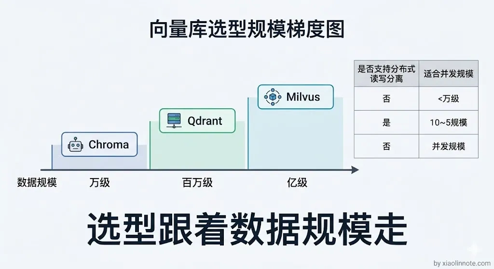
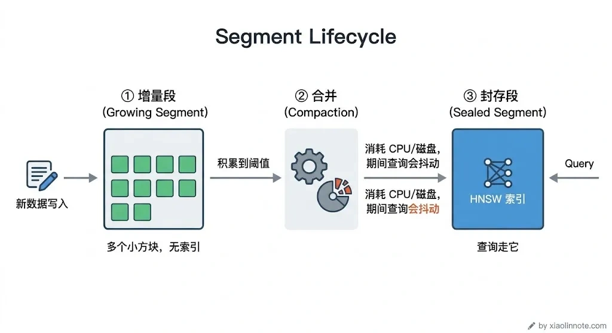
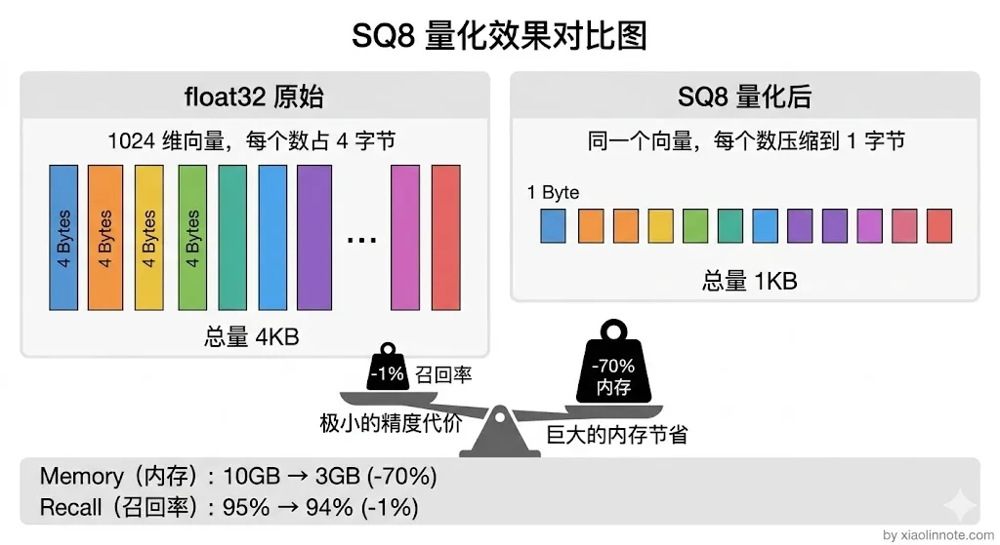
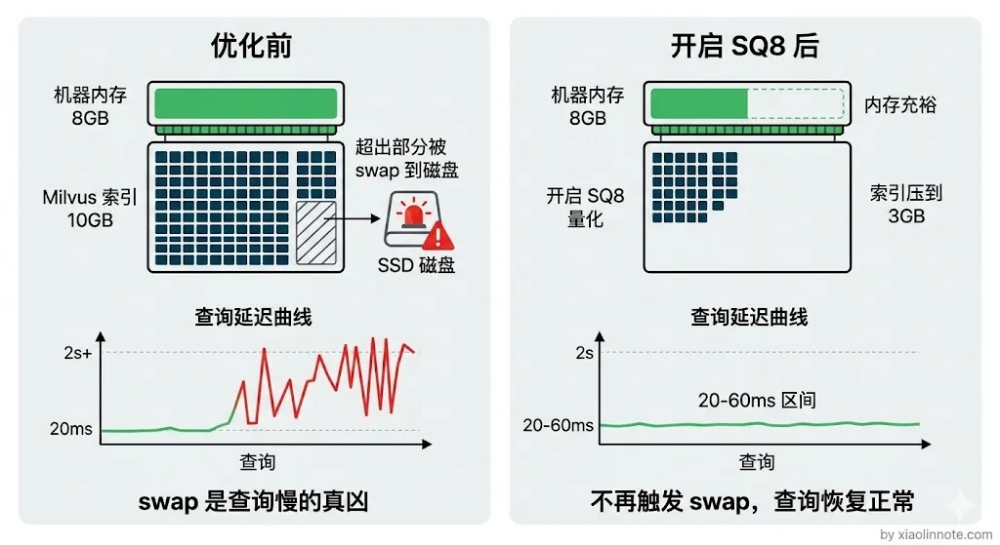
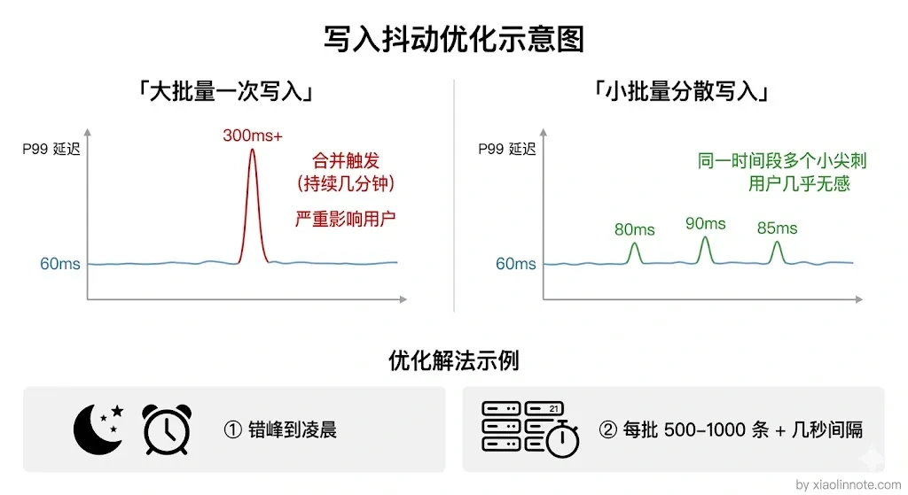

# 讲讲你用的向量数据库？数据量级是多大？性能如何？遇到过性能瓶颈吗？

> 原文：[讲讲你用的向量数据库？数据量级是多大？性能如何？遇到过性能瓶颈吗？](https://xiaolinnote.com/ai/rag/9_vectordb_practice.html) · 小林面试笔记

👔面试官：你在项目里用的什么向量数据库？数据量级大概多少？

🙋‍♂️我：用的 Chroma，挺好用的，pip install 一下就能跑了。

👔面试官：Chroma？本地嵌入式数据库你拿来做生产？你数据量多大知道吗？

🙋‍♂️我：呃，好像存了几万条吧，具体没数过。性能嘛，感觉还挺快的，反正用户也没投诉，应该没什么问题。

👔面试官：几万条都没数过？性能感觉「挺快的」？你是用体感在做性能测试吗？P50 延迟多少？P99 呢？QPS 能扛多少？一个指标都说不出来？

🙋‍♂️我：那性能瓶颈的话……还真没遇到过，Chroma 一直跑得挺稳的，我也没怎么关注过这块。

👔面试官：几万条数据用 Chroma 单机跑，当然碰不到瓶颈了。你有没有想过数据量到百万级会怎样？内存够不够？写入会不会影响查询？Segment 合并了解过吗？面试官问的是你实际的生产经验和性能优化能力，你连基本的数据量级和性能指标都答不上来，回去积累点真实项目经验再来吧。

好吧，面试官问的是实战经验，光会说「用了某个数据库，感觉挺快」是不够的。下面用一个**示例压测场景**说明如何回答；其中的规模、硬件和延迟不是通用结论，不能冒充自己的生产经历。

## 💡 简要回答

如果真实项目使用的是 Milvus，可以说明版本、部署拓扑和选择约束；如果没有亲自运行过，就应明确说是 PoC 或压测结果。一个可复现的示例可以设为“约百万级向量、固定维度、HNSW、带同样过滤条件的查询”，再报告 P50/P95/P99、吞吐、错误率和资源占用，而不是直接承诺 20～50 毫秒。

我遇到过两个比较典型的瓶颈。

第一个可能是内存压力：百万级的高维 float32 向量仅原始数据就可能占用数 GB，索引、metadata、缓存和副本还会增加开销。可以评估 SQ8 等量化、分片或 mmap，但量化会改变距离近似与召回，必须用业务数据重新测量。

第二个可能是批量写入、索引构建或 compaction 与查询争用 CPU/磁盘，造成尾延迟抖动。常见处理是限制写入并发、错峰、控制批次、隔离资源或使用版本化索引；具体参数要结合实现和监控验证。

## 📝 详细解析

### 先搞清楚：向量数据库是干什么的？

在讲 Milvus 之前，先理解一下向量数据库解决的是什么问题。很多人上来就问「哪个向量数据库好」，但连它要干什么都没搞清楚。

普通数据库（比如 MySQL）存的是结构化数据，查询方式是精确匹配，「找名字等于张三的记录」。但在 RAG 里，我们存的是文本的「语义向量」，查询方式是相似度搜索，「找和这段描述语义最接近的文档」。

这两件事的底层机制完全不同。语义向量是一个几百上千维的浮点数数组，你没办法用 `WHERE embedding = xxx` 来查，只能计算两个向量之间的距离（余弦相似度或欧氏距离），找出最近的 K 个。

那问题来了：如果向量库里有 100 万条记录，每次查询都和 100 万条逐一算距离，计算量会随 N 增长。向量索引通过减少候选数来降低开销，但 ANN 的实际复杂度、召回损失和延迟取决于索引、参数、数据分布、过滤与硬件，不能把 HNSW 简化成对所有系统都成立的 `O(log N)`。

### 为什么选 Milvus？

搞清楚了向量数据库的核心价值，下一个问题就是选哪个。市面上常见的向量数据库有好几个，选型时可以按规模和场景来判断。

**Chroma** 往往适合快速验证，但是否能满足生产要看具体部署形态、版本、并发、持久化和恢复要求，不能仅凭“本地嵌入式”或产品名称下结论。

**Qdrant** 可以作为自托管或托管候选；它是否适合某个规模，要用目标过滤、并发和更新负载实测，不能只用实现语言推断性能。

**Weaviate** 可以作为同时需要向量与结构化检索的候选，仍需核对版本、部署方式、过滤语义和运维边界。

**Milvus** 提供面向向量检索的多种部署与索引选项；是否适合分布式、高并发或某个数据规模，要结合其具体版本、拓扑、资源和运维能力验证，不能用“百万到十亿级”作为保证。

如果选择 Milvus，应该把理由写成约束到能力的映射：例如需要的索引类型、分片/副本、更新可见性、备份恢复和资源隔离是否由目标部署满足；“读写分离”是否存在以及如何配置，应以对应版本文档和压测结果为准。

### Milvus 的核心概念

选定了 Milvus，在聊具体性能数据之前，先得搞懂它的几个核心概念。这些概念直接关系到后面分析性能瓶颈时能不能听懂。

**Collection（集合）** 类似关系数据库里的「表」，存储一类向量数据。我们的知识库就是一个 Collection，每条记录包含：文本 chunk 的 ID、向量（embedding）、原文内容、来源文档等 metadata。

**Segment（段）** 是 Milvus 等系统内部管理数据的单位，具体状态和 compaction 语义随版本与部署而变化。新写入数据可能先处于未封存或未完成索引的状态，随后被持久化、构建索引或合并；这些后台任务会消耗 CPU、内存和磁盘 I/O，并可能影响尾延迟。排查时应看段状态、索引加载、compaction、资源使用和查询分位数，而不是假定所有版本都有同一流程。

**Index（索引）** 是向量检索的关键加速结构。常见的 **HNSW**（Hierarchical Navigable Small World，分层可导航小世界图）把向量组织成多层图，查询时从稀疏的顶层开始导航，再逐层细化候选。它通常通过减少访问节点来换取速度，但不保证固定复杂度或固定召回率。

HNSW 有两个关键参数，用社交网络来类比很好理解：

- `M` 影响图的连接数以及内存/构建成本；`efConstruction` 影响建图时的候选搜索；查询侧的 `efSearch` 影响候选探索量。参数名称、默认值和可调范围由具体实现决定，不能把某个项目的 16～32、100～200 或 50～200 当成通用答案。
- 调参要同时记录 Recall@K、P95/P99、吞吐、索引构建时间、内存和更新期间的表现。查询侧探索量增大通常可能提升召回，也可能增加延迟；应在目标数据和过滤条件下做曲线，而不是只凭经验取值。

### 数据规模和实测性能

搞懂了概念，现在来看如何报告数据。下面的数字只是**示例压测配置**：约 150 万条 chunk、固定维度向量、HNSW 和明确记录的索引参数。若用于面试，必须替换成自己确实测过的规模、模型、版本和部署拓扑。

先算一下原始数据的下界：150 万 × 1024 维 × 4 字节（float32）≈ **6GB**，这只是裸向量，不包含索引图、metadata、缓存、副本和服务开销。实际占用不能用固定的 10～12GB 推断，应通过同一版本、同一索引和同一副本数测量，并为应用、缓存和故障余量留空间。

开启 **标量量化（SQ8）** 后，存储表示可能从 float32 变为更低比特宽度，但量化范围、索引实现和额外结构会影响实际节省。它可能降低内存和 I/O，也可能带来召回损失或额外计算；必须对业务 Recall@K、延迟和成本做 A/B 或离线对比，不能承诺固定“四分之一”、固定百分点或“几乎没有代价”。

性能报告至少应写清硬件、网络、客户端连接池、向量维度、topK、过滤条件、索引参数、数据规模、读写比例、并发模型和预热方式，再给出 P50/P95/P99、吞吐、错误率与资源曲线。单个 P50 数字不能证明系统稳定；跨机房、冷启动、未加载索引或更新高峰都可能明显改变结果。

### 遇到的性能瓶颈

前面的估算说明了一个排查方向：高维向量、索引和副本都可能造成内存压力，但是否成为瓶颈要看监控。下面列出两个常见的**排查案例模板**，不应当当作作者亲身经历。

**瓶颈一：内存不足，查询延迟飙升**

如果机器内存不足，索引加载、缓存争用或 swap 可能使尾延迟突然升高。先核对进程 RSS、容器限制、swap、索引加载状态、磁盘 I/O 和 GC/线程指标，再判断是资源问题还是索引/过滤问题；不要看到延迟升高就直接归因于 ANN 算法。

可选措施包括降低副本或并发、扩容、选择更节省内存的索引/量化、将冷热数据分层，并在确认具体版本支持且符合 SLO 后评估 `mmap` 等磁盘映射能力。每项措施都要重新测召回、P99、重启恢复和成本，不能假设磁盘读取“对延迟影响不大”。

**瓶颈二：批量写入、索引构建或 compaction 造成查询抖动**

大批量写入可能触发后台持久化、compaction 或索引构建，与查询争用 CPU、内存和磁盘 I/O，使 P95/P99 抖动。是否发生、何时发生以及名称如何称呼，取决于版本和部署；应从服务指标、任务队列、段/索引状态和节点资源中定位证据。

可选措施包括写入限流、错峰、批量大小压测、读写资源隔离、异步索引构建和蓝绿/版本化切换。不要直接套用“每批 500～1000 条、间隔几秒”等固定参数；应以写入吞吐、查询 P99、数据可见性和恢复时间共同确定。

## 🎯 面试总结

回到开头那段面试，面试官问「你用的什么向量数据库、数据量级多大」，你不能只说「Chroma，几万条，感觉挺快」。生产环境和玩具项目是完全不同的两个世界。

更可靠的回答顺序是：先说清楚自己确实使用过的组件、版本和选择约束；再给出可复现的规模、维度、索引、过滤、并发和 P50/P95/P99；最后讲一个有监控证据的瓶颈、排查过程、改动和改动后的指标。如果没有真实生产数据，就明确标注为 PoC/压测，不能用示例数字包装成项目经历。

这样面试官就知道你是真的在生产环境踩过坑，而不是跑了个 Demo 就来面试了。

---
