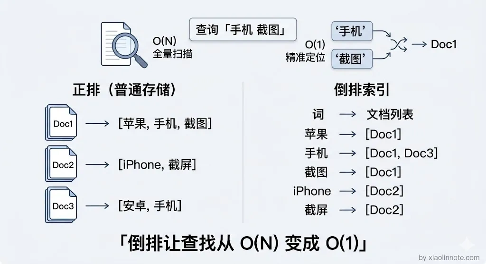
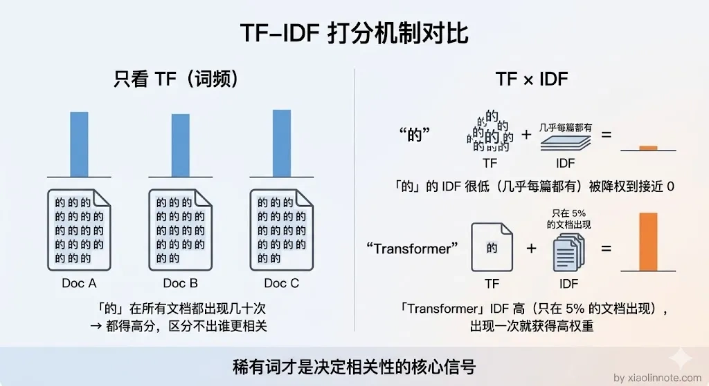
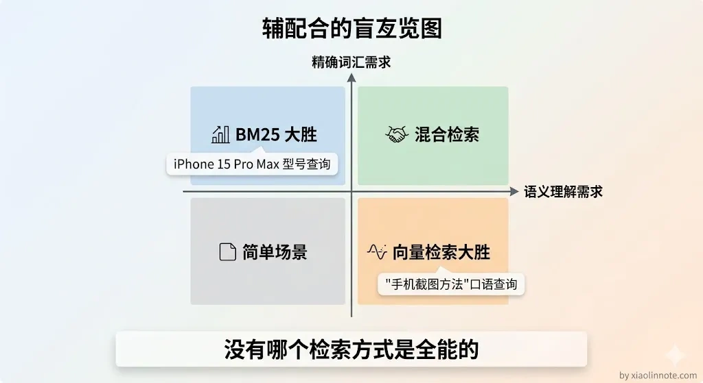
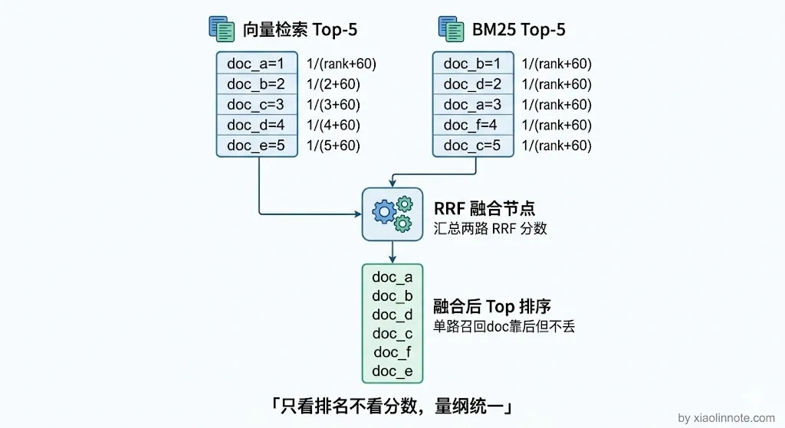

# 请你介绍一下向量检索和关键词检索的区别？

> 原文：[请你介绍一下向量检索和关键词检索的区别？](https://xiaolinnote.com/ai/rag/11_retrieval_types.html) · 小林面试笔记


👔面试官：请你介绍一下向量检索和关键词检索的区别？

🙋‍♂️我：向量检索就是用余弦相似度算向量距离，关键词检索就是 BM25 算法嘛，我觉得向量检索各方面都比关键词检索好，毕竟语义理解能力更强。

👔面试官：那你解释一下，用户搜「M4 Pro 芯片参数」，知识库里就写着「M4 Pro」，向量检索却召不回来，反而关键词检索秒找到，这是为什么？

🙋‍♂️我：呃……那可能是 Embedding 模型没训练好吧，换个好一点的模型应该就行了？

👔面试官：换个模型就能解决精确词匹配的问题？你有没有想过这两种检索方式各自的天花板在哪？遇到同义词的时候关键词检索又是什么表现？

好，让我们来彻底搞清楚这个问题。

## 💡 简要回答

关键词检索（BM25 这类）依靠词项统计和倒排索引，通常擅长精确命中；向量检索依靠嵌入空间里的距离，可能跨越部分改写和同义表达。两者都有盲区：BM25 是否能处理同义词取决于分词、词干化和同义词配置；向量检索对专有名词、产品型号等精确约束也可能不稳定。因此可以让两路召回，再用 RRF 或学习排序融合，但是否优于单路必须用领域数据验证。

## 📝 详细解析

### 检索要解决的核心问题

检索的本质是：给你一段查询，从海量文档里找出最相关的那几条。

这个「相关」可以有两种理解方式，一种是字面意义上的词汇重叠，一种是语义层面的意思接近。很多人以为检索就是「搜关键词」，其实那只是其中一种理解方式。关键词检索和向量检索分别对应这两种理解，各有各的擅长和盲区。理解了这一点，后面的内容就顺理成章了。

### 关键词检索：字面匹配，靠统计

先从最直观的方式说起。关键词检索的代表是 BM25（Best Match 25），这是 Elasticsearch、Lucene 等传统搜索引擎的核心算法。

它的基本思路可以用一个类比来理解：想象一个巨大的图书管理员，他给每本书建了一张「词汇卡片」，记录这本书里每个词出现了几次。用户来查「手机 截图」，管理员就把包含「手机」的书挑出来，再把包含「截图」的书挑出来，然后看哪些书同时被挑中、被挑中的词出现频率高，这些书就排前面。这个「词汇卡片」系统就是**倒排索引**，它记录的不是「每篇文档里有哪些词」，而是反过来，记录「每个词出现在哪些文档里」。



打分的时候核心看两个因素。



- 第一个是**词频（TF）**：这个词在这篇文档里出现了几次，出现越多说明越相关。
- 第二个是**稀缺度（IDF）**：这个词在所有文档里有多罕见。

你可能会想，直接数词频不就行了，为什么还要看稀缺度？

原因很简单：「的」「是」「在」这些词在哪篇文章里都高频出现，如果只看词频，每篇文档都会因为包含这些常用词而拿到高分，根本区分不出哪篇真正相关。所以 IDF 的作用就是给常见词降权、给罕见词加权，让真正有区分力的词决定排序结果。

BM25 在 TF-IDF 基础上又加了饱和度限制，防止某个词重复出现太多次后权重无限叠加。

```python
# 用 rank_bm25 库做关键词检索的例子
from rank_bm25 import BM25Okapi

# 文档库（实际使用时是分词后的 token 列表）
corpus = [
    ["苹果", "手机", "截图", "方法"],
    ["iPhone", "截屏", "教程"],
    ["安卓", "手机", "拍照"],
]
bm25 = BM25Okapi(corpus)

# 查询也要分词
query = ["苹果", "手机", "截图"]
scores = bm25.get_scores(query)  # 每个文档的 BM25 分数
```

BM25 的优势是对**精确词汇命中率极高**，产品型号「iPhone 15 Pro Max」、专有名词「LSTM」、缩写「RAG」，只要文档里有这个词，BM25 就能精准找到。

但它的劣势同样明显，而且刚好是向量检索的优势所在：**遇到同义词就束手无策**。

如果用户查「手机截图」，文档写的是「iPhone 截屏教程」，在没有同义词扩展、且分词后没有共享词项时，BM25 可能无法召回它；配置同义词、别名和分析器可以缓解，但也会增加维护与误召回成本。这是向量检索能提供互补信号的典型场景。

### 向量检索：语义匹配，靠 Embedding

BM25 搞不定同义词，那能不能让检索系统「理解意思」而不是「匹配字面」？这就是向量检索要解决的问题。

它的思路是这样的：先用一个 Embedding 模型把每段文本转成一个高维数字向量（比如 1024 维的浮点数列表），这个向量可以理解成这段文本在「语义空间」里的坐标。语义相近的文本，坐标就靠近；语义不相关的，坐标就离得远。好比给每段文字在地图上钉了个钉子，意思越相近的钉子挨得越近。用户查询来了，也转成向量，然后去找最近的几个钉子。

这样就好理解了：「苹果手机怎么截图」和「iPhone 如何截屏」可能在嵌入空间里较接近，但相似度数值没有跨模型、跨数据集的通用阈值。向量检索通过近似最近邻算法（ANN）在向量库里找候选，延迟取决于索引、规模、过滤、并发、硬件和网络，不能由“百万量级”直接推导出固定毫秒数。

那向量检索是不是万能的？很多人以为向量检索比关键词检索「高级」，所以所有场景都该用向量检索，其实不是。

向量检索的优势是**语义理解能力强**，能跨越同义词、近义词、不同表达方式的障碍；但它的劣势是**对精确词汇不敏感**，产品型号「Pro Max 256GB」、人名、版本号这类词，在 Embedding 空间里可能彼此距离并不近，向量检索容易把它们混淆在一起，反而不如 BM25 直接命中准确。

这就是为什么面试官会拿「M4 Pro 芯片参数」这个问题来追问：向量检索对这类精确专有名词天然不擅长，而 BM25 却能秒找到。两种方式的盲区恰好互补，谁也不能替代谁。



### 两者的核心区别对比

把前面分析过的要点整理成一张表，一目了然：

| 维度 | 关键词检索（BM25） | 向量检索 |
| --- | --- | --- |
| 匹配方式 | 词汇重叠统计 | 语义空间距离 |
| 索引结构 | 倒排索引（稀疏） | 向量库（稠密） |
| 同义词处理 | 依赖分析器/同义词配置 | 可能跨越改写，但依赖嵌入模型 |
| 精确词命中 | 通常较强 | 可能漏召回或混淆相近实体 |
| 计算方式 | 基于统计，分数相对可解释 | 依赖向量距离和索引近似 |
| 适合场景 | 专有名词、代码、精确查询 | 语义问答、模糊表达 |

### 混合检索：两路都跑，合并取长补短

既然两种方式可能互补，就可以比较两路是否值得并行。工程上常称为**混合检索（Hybrid Search）**：同时跑向量检索和 BM25，各自召回候选，再用 RRF、加权分数或其他排序方法融合；是否采用取决于查询集、延迟、成本和维护约束。

RRF 的思路很巧妙：它不看各路的原始分数，只看排名。你可能会问，为什么不直接把两路的分数加权平均呢？原因是向量相似度（0 到 1 的余弦值）和 BM25 分数（可能是任意正数）的量纲完全不同，就像拿摄氏度和华氏度直接加在一起没有意义。RRF 用排名的倒数来打分，排名越靠前倒数越大，最终按总分降序排列。这样，两路都认为相关的文档会排在最前面，只有一路认为相关的文档也不会被完全丢掉。



```python
def reciprocal_rank_fusion(results_list, k=60):
    """
    results_list: 多路检索结果，每路是一个 [doc_id, ...] 的有序列表
    k: 平滑参数；60 只是常见示例，实际应在验证集上调节
    """
    scores = {}
    for results in results_list:
        for rank, doc_id in enumerate(results):
            if doc_id not in scores:
                scores[doc_id] = 0
            # 排名越靠前（rank 越小），倒数越大
            scores[doc_id] += 1 / (rank + k)
    # 按总分降序排列，取 Top-K
    return sorted(scores.items(), key=lambda x: x[1], reverse=True)

# 使用示例
vector_results = ["doc_a", "doc_b", "doc_c"]   # 向量检索的排序结果
bm25_results   = ["doc_b", "doc_d", "doc_a"]   # BM25 的排序结果

merged = reciprocal_rank_fusion([vector_results, bm25_results])
# doc_b 两路都高排，doc_a 也两路命中，会排在前面
```

这个方案的一个工程优势是两路检索在资源允许时可以**并行执行**；实际总延迟还要加上调度、网络、融合和最慢分支的超时处理。混合检索可能提高召回，但会增加索引、存储、分数/排名融合、去重和运维复杂度，不应宣称“几乎没有代价”或默认适用于所有生产系统。

评估时至少比较三组结果：仅 BM25、仅向量、混合召回。对每组记录 Recall@K/Hit@K、MRR 或 nDCG、精确词/同义词/拼写变体分桶表现，以及 P95/P99、成本、过滤下的召回和权限正确率；否则无法知道混合带来的收益来自哪里。

## 🎯 面试总结

回到开头的问题：向量检索并不是「什么都比关键词检索好」，两者是互补关系。

关键词检索（BM25）靠词频统计，精确匹配强但同义词没辙；向量检索靠语义空间距离，语义理解强但精确词容易漏。

正确的做法不是二选一，而是混合检索，两路并行召回，用 RRF 融合排序，取长补短。

面试中回答这道题，关键是把两种检索方式的原理、各自的盲区、以及为什么需要混合检索这条主线讲清楚，而不是简单地说「向量检索更好」。

---
