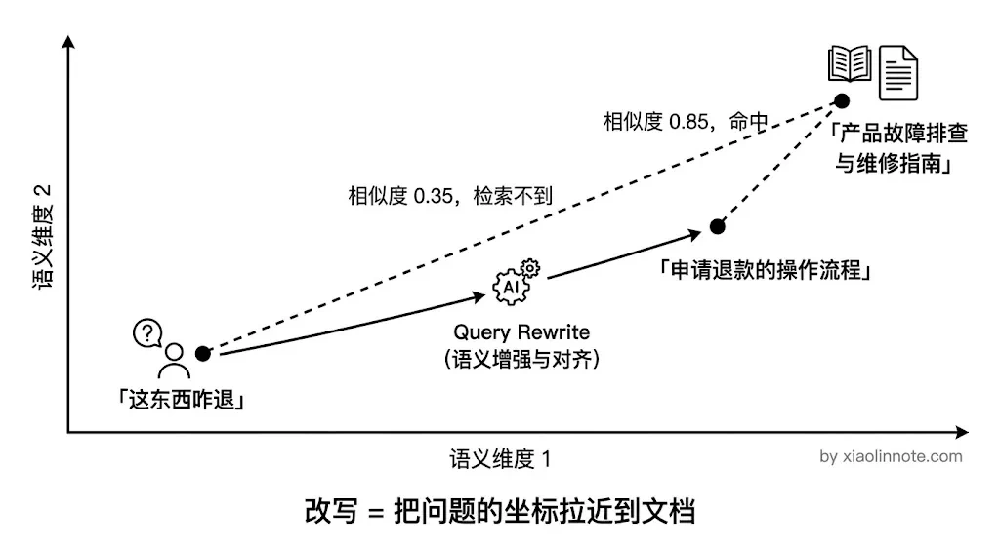
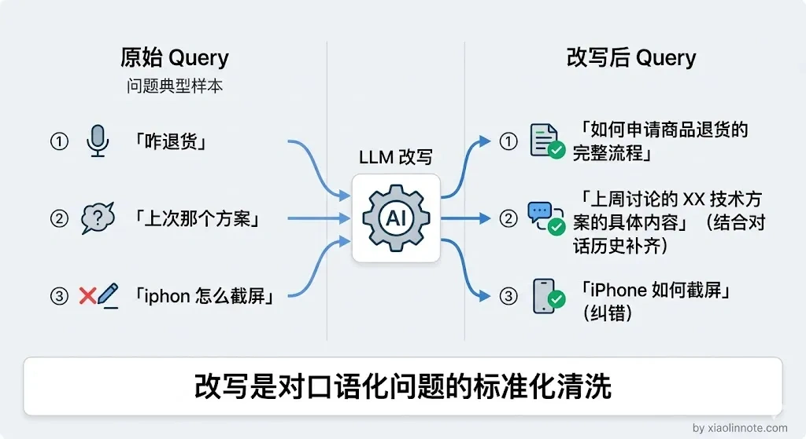
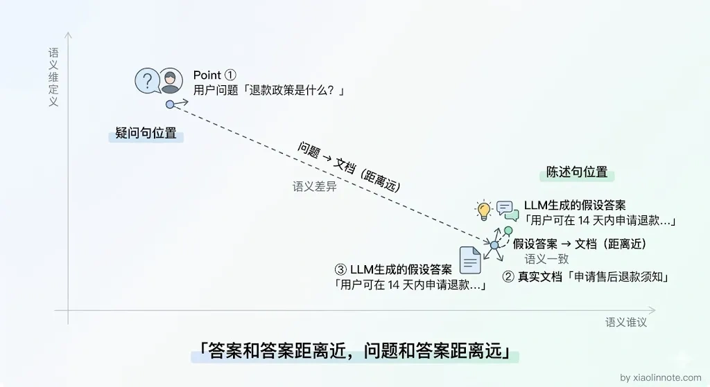
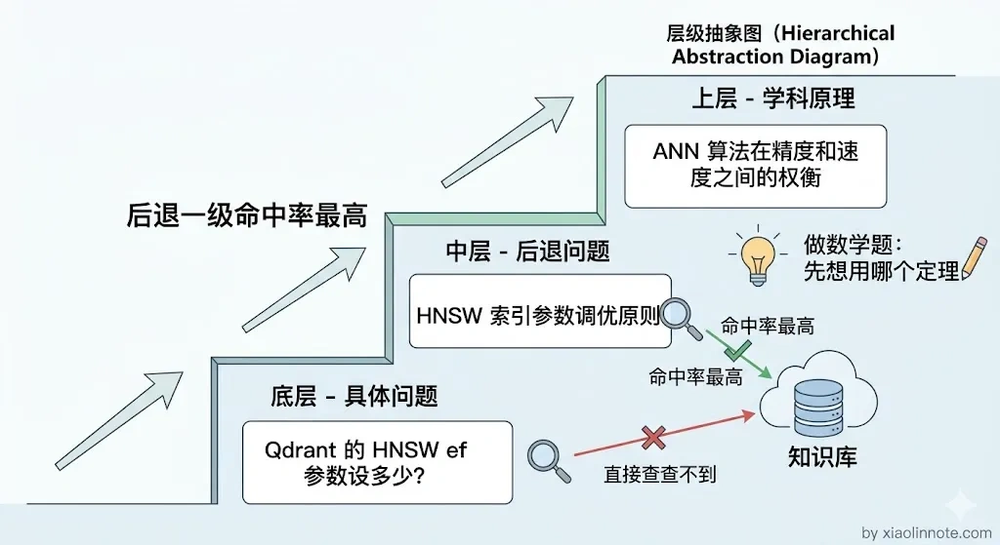
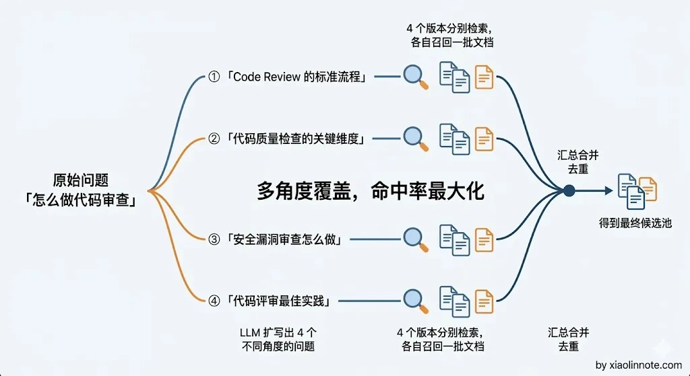

# 如何润色用户的 Query（Query Rewrite）？目的是什么？

> 原文：[如何润色用户的 Query（Query Rewrite）？目的是什么？](https://xiaolinnote.com/ai/rag/12_query_rewrite.html) · 小林面试笔记


👔面试官：RAG 系统里为什么要做 Query Rewrite？你了解哪些方法？

🙋‍♂️我：Query Rewrite 就是把用户的问题改写得更规范嘛，比如把口语转成书面语，主要就是为了提升检索效果，其他没什么特别的。

👔面试官：那用户问「这个功能怎么用」，知识库里写的是「XX 模块操作指南」，你光改写成书面语就能命中了？如果改写之后还是对不上呢？

🙋‍♂️我：那就多试几种改写方式呗，总能蒙对的……

👔面试官：蒙？你是说靠运气做检索优化？你有没有听说过 HyDE、Step-back Prompting 这些方法？它们各自解决什么问题你清楚吗？

这个问题其实比想象中更有深度，让我来展开讲讲。

## 💡 简要回答

我用 Query Rewrite 主要是为了提高候选召回的可检索性：用户的问题可能口语化、带指代、缩写、时间条件或多个子问题，而知识库的词汇和结构不同。改写可能改善 Recall@K，也可能改变原意、引入不存在的实体或增加延迟，因此不能把“语义鸿沟”或效果提升当作必然事实。

我接触过的方法主要有四种：第一是直接改写，让 LLM 把口语化的问题转成更精准的表述；第二是 Query 扩展，补充相关关键词；第三是 HyDE，让 LLM 先生成一个假设答案，然后用答案的向量去检索；第四是 Step-back Prompting，把具体问题往上抽象一层，检索更通用的背景知识。

## 📝 详细解析

### 为什么需要 Query Rewrite

用户和文档写作者之间可能存在表述差异，但这不是所有查询都需要用 LLM 改写的“天然鸿沟”。要先区分指代消解、实体/时间/权限约束、查询拆分和词汇扩展等具体问题。

用户可能这样问：「这东西坏了咋整」，而文档里写的是「产品故障排查与维修指南」。嵌入模型可能已经能处理这类改写，也可能受领域词汇、实体缺失和索引质量影响而召回失败；不能只把失败归因于口语与书面语的向量距离。

Query Rewrite 是在检索前对问题做结构化或语言处理，目标是在保留原意、实体、否定、时间和权限约束的前提下提高可检索性。它也可能发生语义漂移，因此应保留原始 Query，并用离线 Recall@K、答案质量、延迟和成本评估。



### 方法一：直接改写（Query Rewriting）

基础改写可以把口语化问题变成更完整的检索表述，也可以补全对话中的代词指代。但模型不能凭空猜测产品、地区、时间或用户身份；无法确认时应保留歧义或触发澄清。改写结果应与原 Query 一起记录，便于审计和回放。

发给 LLM 的 Prompt 模板如下：

```
请将用户的问题改写成更适合知识库检索的表述。
要求：补全可由上下文确定的指代；保留实体、版本、时间、否定、数值、权限和输出约束；无法确定时不要猜测，返回需要澄清的字段；可同时输出原问题和结构化过滤条件。

对话历史：{最近几轮对话}
用户问题：{原始问题}

只输出结构化结果，不要添加原问题中不存在的事实：
```

示例效果：原始「上次说的那个退款的事，流程是啥」-> 改写后「申请商品退款的完整操作流程是什么」。



直接改写可能帮助解决口语化和指代不清，但它不一定能改善所有文档/问题表达差异；有时原始 Query、关键词变体和结构化过滤条件一起检索更有效。

这个问题催生了 HyDE 的出现。

### 方法二：HyDE（Hypothetical Document Embeddings）

HyDE（Hypothetical Document Embeddings）是一种研究/工程启发式：先生成假设性文档，再用它作为检索信号。它不是因为“问句和陈述句必然分开”，是否有效要靠领域评测。

HyDE 的直觉可以这样理解：**先描绘文档可能长什么样子，再找相似文档**。先让 LLM 根据用户问题生成一段“假设性文档”，再用它的向量去检索。假设文本不应被当作事实来源；它可能充满模型先验、错误实体或错误时间，因此要保留原始 Query，并用原始 Query/关键词信号做并行或兜底召回。

HyDE 的作用不是回答问题，而是提供一种额外的检索表示。它可能改善某些“问题表达与文档表达差异大”的数据集，也可能把错误假设放大、漏掉精确实体或增加一次模型调用；不能宣称它必然更高效。

生成假设答案用的 Prompt 模板：

```
请根据以下问题，生成一段可能的答案。
注意：不需要完全准确，只需要用于辅助检索，风格尽量像知识库文档。

问题：{用户问题}
假设答案：
```

示例只能说明一种可能：假设文本可能与“申请售后退款须知”在表达上更接近，但其中“14 天”等具体事实不能未经资料支持就进入最终答案。



HyDE 可能缓解一类表达差异，但不保证解决知识库缺失或过度具体的问题。若希望同时检索背景原理，可以把 Step-back 作为独立候选信号，并保留原问题的实体与约束。

### 方法三：Step-back Prompting（后退提问）

对于涉及具体细节的问题，知识库可能没有直接答案但有背景原理。Step-back Prompting 把具体问题提升到更抽象的层次，检索背景知识，再与原问题的精确条件一起使用；如果只保留抽象问题，反而可能丢失版本、参数或权限约束。

类比一下，就像先判断一道题需要哪类定理，再结合题目的具体条件。知识库可能没有“ef 参数设 100 是否合适”的直接答案，但也不能假设一定存在“HNSW 参数调优原则”；检索不到时应明确缺口，而不是用背景资料补造结论。

生成「后退版本」问题的 Prompt 模板：

```
请将以下具体问题转化为一个更通用的背景问题，用于检索相关背景知识。

具体问题：{原始问题}
背景问题：
```

示例效果：具体问题「某版本 HNSW 的搜索参数如何调」可以生成背景问题「HNSW 索引参数如何在召回与延迟之间权衡」，但最终仍要回到具体版本、数据和压测结果，不能由背景文档直接给出固定值。



前面三种方法都是在「一个问题」上做文章——要么改写它、要么给它配一个假设答案、要么把它抽象化。但有时候问题的角度本身就比较窄，用一个角度去检索，覆盖面不够。这时候就需要换个思路：不求一个问题改得更好，而是多生成几个不同角度的问题。

### 方法四：多 Query 扩展

用 LLM 把用户原始问题改写成若干不同角度的版本，分别去检索，再合并去重。角度数量不应固定为 3～5；它会线性增加模型、Embedding、检索和融合成本，也可能增加噪声。适合用离线评测证明单一路径覆盖不足的场景，并需设置预算、超时和失败回退。



把这四种方法放在一起对比一下，选型时就有了清晰的依据：

| 方法 | 解决的核心问题 | 额外开销 | 适合场景 |
| --- | --- | --- | --- |
| 直接改写 | 指代、口语、上下文结构不清 | 一次模型/规则处理 | 多轮对话或需要结构化过滤的查询 |
| HyDE | 可能存在问题/文档表达差异 | 一次额外生成与 Embedding | 用评测证明假设文档信号有收益的领域 |
| Step-back | 需要背景原理辅助理解 | 一次额外生成与检索 | 原理与具体问题需要组合的查询 |
| 多 Query 扩展 | 单一角度覆盖不足 | 多路模型、Embedding 与检索 | 召回覆盖不足且预算允许的复杂问题 |

上线前要做对照实验：原始 Query、直接改写、保留原 Query 的多路方案分别比较 Recall@K/Hit@K、答案引用正确率、实体/时间/否定保真率、拒答率、P95/P99、Token 成本和缓存命中率。线上还要记录改写前后 Query、版本、超时与回退原因，避免把改写器本身变成不可观察的黑盒。

## 🎯 面试总结

回到开头的问题，Query Rewrite 可不是简单地把口语转书面语就完事了。它的核心目的是弥合用户提问和文档表述之间的语义鸿沟，而这个鸿沟有多种不同的形态。

口语化或指代问题可先试直接改写；HyDE、Step-back 和多 Query 扩展都属于有额外成本与失败模式的候选策略，是否启用要由评测、延迟预算和安全约束决定，并保留原始 Query 作为证据和回退路径。

面试中回答这道题，关键是把「为什么要做 Query Rewrite」和「四种方法各自解决什么问题」讲清楚，让面试官看到你不是只会一种改写方式，而是理解了不同场景需要不同策略。

---
