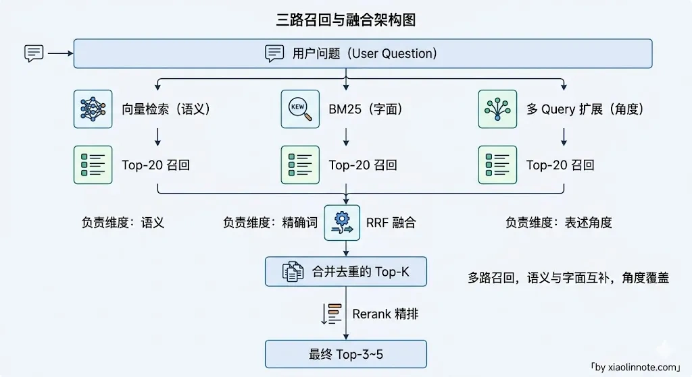
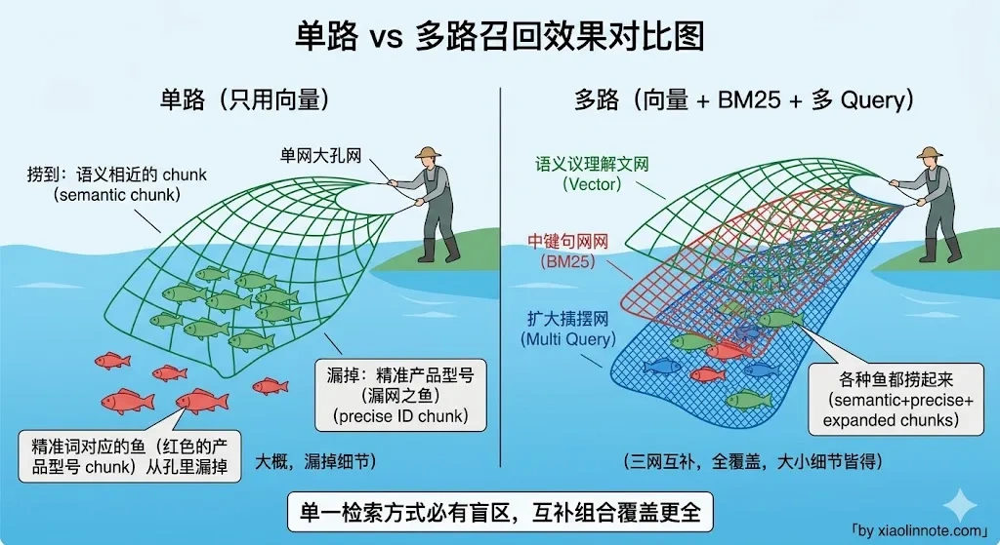
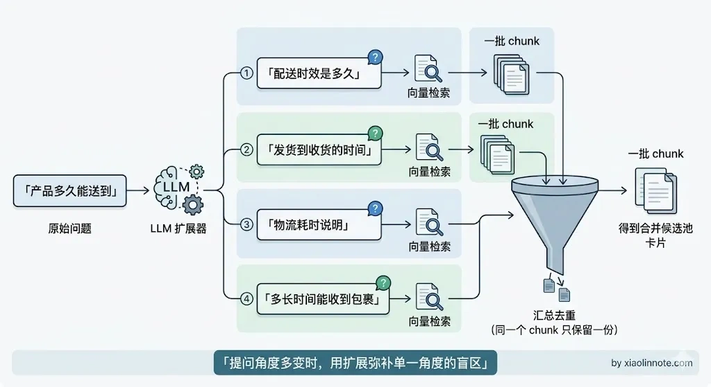
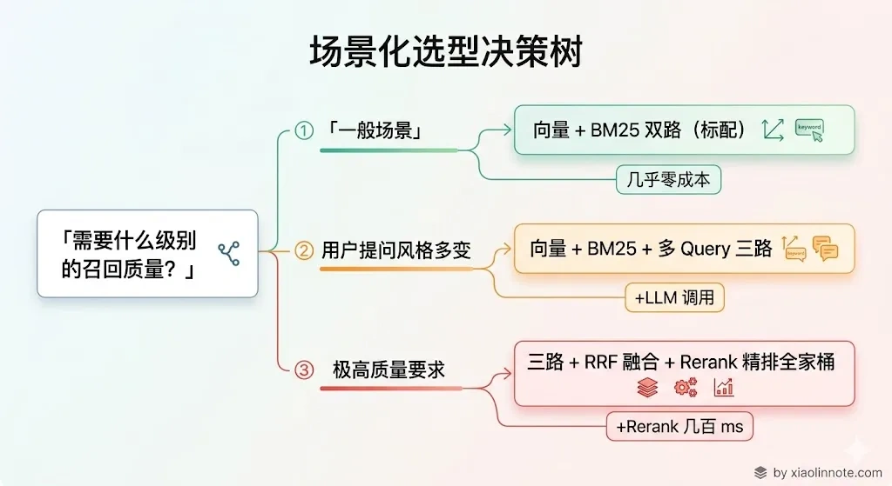

# 什么是多路召回？具体怎么做？

> 原文：[什么是多路召回？具体怎么做？](https://xiaolinnote.com/ai/rag/13_multi_retrieval.html) · 小林面试笔记

👔面试官：你的 RAG 系统用的什么检索方式？

🙋‍♂️我：用的向量检索，把用户问题转成向量去向量库里找相似度最高的，效果挺好的。

👔面试官：那用户搜「RTX 4090 显卡功耗」，你知识库里就写着「RTX 4090」，向量检索召不回来怎么办？

🙋‍♂️我：那我可以把 top-K 调大一点，或者换个更好的 Embedding 模型，总能找到的。

👔面试官：调大 top-K 召回一堆无关内容有什么用？向量相似度排序在尾部是很平的，Top-20 和 Top-200 的区别只是多塞了一堆跟问题几乎无关的 chunk 进去，正确答案照样没进来，反而把后面 LLM 的注意力稀释了。你有没有想过问题的根源在于向量检索本身对精确词就不敏感？多路召回了解过吗？

看来只靠单路检索是远远不够的，让我来聊聊多路召回的思路。

## 💡 简要回答

多路召回就是同时用多种检索信号获取候选，再合并、去重和排序，而不是只依赖一路。常见互补信号包括稠密向量、BM25/其他词法检索、结构化过滤、原始 Query 和经过验证的 Query 变体。向量和关键词各有盲区；多 Query 扩展能增加表达覆盖，也会增加调用成本和语义漂移风险。结果可以用 RRF 或其他融合方法，再送进 Rerank，但是否值得启用要由领域评测和延迟预算决定。

## 📝 详细解析

### 什么是多路召回？

多路召回，顾名思义，就是同时用多种不同的检索方式去捞候选内容，最后再把各路结果合并、排序，交给 LLM 生成答案。

和它对应的是「单路召回」，也就是只用一种检索方式，最典型的是只用向量检索：用户问题转成向量，去向量库里找候选 chunk。这套流程在很多场景下能跑起来，但质量上限取决于 Query、Embedding、索引和文档处理；单纯增大 Top-K 也可能带来更多噪音、上下文成本和注意力竞争。

你可能会问，既然向量检索有语义理解能力，为什么还不够用？原因很简单，没有任何一种检索方式是全能的，向量检索有它的盲区，BM25 也有它的盲区，把它们组合起来互相补盲区，总召回质量才会比单路高。

常见的组合是三路：

第一路是**向量检索**，提供语义相似信号，可能覆盖同义词和不同表达，但效果取决于 Embedding 模型与领域数据。第二路是**BM25 关键词检索**，提供词项和精确实体信号，适合型号、错误码、数字等约束，但也依赖分词、同义词和分析器。第三路是**Query 变体扩展**，把用户问题改写成若干角度；它扩大覆盖的同时，也可能改变实体、时间或否定条件。

三路各自召回一批候选，再用 RRF 算法把排名融合成一个统一的结果列表，最后送进 Rerank 精排，才把最终上下文交给 LLM。

### 为什么单路召回不够用?

理解了多路召回是什么之后，自然会追问：单路到底差在哪？为什么非要搞这么复杂？

单纯依赖向量检索是大多数 RAG 系统早期的做法，但它有一个明显的短板：**对精确词语的召回效果差**。

比如用户问「M4 Pro 芯片的性能参数」，这里的「M4 Pro」是精确实体。向量检索可能把它与更泛的“苹果处理器”文档混在一起，而词法检索能提供精确词项信号；但优劣仍取决于分词、文档质量和模型，不能把向量检索概括成“只看语义、不看字面”，也不能认为换模型一定无效。

反过来，关键词检索在没有同义词扩展或共享词项时，可能召回不到“怎么退货”与“申请售后”这种表达差异较大的文档；分析器、别名、词典和查询扩展可以缓解，但会带来维护与误召回成本。

两种检索方式的盲区恰好互补，这就是「多路召回」的出发点。理解了这个互补关系，后面每一路的作用就非常清晰了。

### 第一路：向量检索（Dense Retrieval）

向量检索是多路召回的基础一路。核心做法是：把文档和用户问题都用 Embedding 模型转成向量，然后用余弦相似度在向量库里找最近的 top-K 个 chunk。

它擅长语义匹配，同义词、不同表达方式都能覆盖，但对精确词语（产品型号、缩写）效果不佳——而这恰好是第二路 BM25 的强项。

### 第二路：BM25 关键词检索（Sparse Retrieval）

理解了向量检索搞不定精确词语这个问题，BM25 的加入就顺理成章了。

BM25 是 TF-IDF 的改进版本，根据词频和文档频率给每个词打分，找出包含查询词最多、且这些词在整个语料里不太常见（也就是区分度高）的文档。它的核心逻辑是：一个词在这篇文档里出现多（词频高），但在整个知识库里出现少（区分度高），说明这个词对这篇文档很具代表性，权重就高。本质上是在问：「这个词有没有『代表』这篇文档？」

中文场景下用 BM25 需要先做分词（比如用 jieba 切词），再对分词后的词列表建索引和检索。实现上就是对每个 chunk 先切词建索引，查询时同样切词后计算 BM25 分数排序。纯文本匹配，速度极快，对精确词语、数字、专有名词的召回效果非常好。

前两路解决了「语义匹配」和「精确词匹配」的问题，但还有一个场景它们都覆盖不到——用户提问的角度和文档表述的角度压根不一样，不是同义词的问题，而是整个视角的差异。这就需要第三路出场了。

### 第三路：多 Query 扩展召回

为什么还需要第三路？

因为用户提问的角度和知识库里文档的表述角度不一致，这不是同义词能解决的。比如用户问「产品多久能送到」，文档里写的是「配送时效说明」，两句话角度完全不同，向量相似度可能不高，BM25 也匹配不到关键词。

多 Query 扩展的做法是：用 LLM 把用户的原始问题改写成若干不同角度的版本，分别去检索，然后把结果合并去重。扩展可能提高覆盖，但不能保证其中一个版本就能找到正确文档；每个版本都要保留原始实体、时间、否定和权限约束。

实现上，先生成并校验问题变体，每个变体可跑向量、词法或结构化检索，再汇总去重。应设置最大变体数、总 Token/延迟预算、超时和回退到原始 Query 的路径；召回覆盖提升必须由自己的标注集测量，不能直接承诺固定百分比。

### 结果融合：RRF 算法

三路召回各自拿回了一批候选，接下来的问题就是：怎么把三路结果合成一份？每一路都有自己的排序结果，分数单位不一样（向量检索是余弦相似度，BM25 是 TF-IDF 分数），没法直接加权平均。你可能会想，能不能归一化之后再加权？理论上可以，但实际上各路分数的分布差异很大，归一化效果不稳定，工程上也更复杂。

RRF（Reciprocal Rank Fusion，倒数排名融合）是常见的排名融合基线，它只用排名而不用原始分数，能绕开部分分数不可比问题；也应与加权、分数校准或学习排序比较：

其中 `k` 是平滑参数，`rank` 是文档在某一路结果里的排名；60 只是常见示例值，应在验证集上调节。

RRF 的直觉很好理解：不直接比较不同检索器的原始分数，而看排名。一个文档在多路检索里都靠前，通常会得到更高的融合分。它不需要训练且计算简单，但可能忽略分数置信度、路由质量和权限/版本差异，仍需去重、过滤和评测。

值得注意的是，RRF 本质上还是粗排，适合在 Rerank 之前合并候选。如果质量收益值得承担额外成本，可以在融合后接 Cross-Encoder 等精排模型；具体模型、版本和部署方式要按语言、领域、延迟和合规要求选择，不要把某个产品名当成固定答案。

### 实战建议

不是每个场景都需要三路全上，按业务特点来选：

知识库里有大量专有名词、产品型号、数字的场景（比如电商、IT 文档），可以优先比较向量 + BM25 双路；收益需要由精确实体分桶评测确认。

用户提问方式多变、和文档表述差异大的场景（比如客服问答），可以对比加入 Query 扩展前后的覆盖、答案质量和延迟；不要预设固定提升幅度。

对召回质量要求高的场景，可以在预算允许时加入 Rerank，但“路数越多越好”并不成立：多一路会增加失败点、噪音、成本和尾延迟，应按增量收益逐步启用。

把三种召回方式的特点对比一下，方便选型：

| 召回方式 | 擅长 | 短板 | 适合场景 |
| --- | --- | --- | --- |
| 向量检索 | 语义相似与表达变体 | 可能混淆精确实体，受模型和索引影响 | 语义检索基线 |
| BM25 关键词 | 词项、专有名词、数字 | 依赖分词/词典，跨词表达可能漏召回 | 精确词较多的知识库 |
| Query 扩展 | 增加候选表达角度 | 模型调用、语义漂移、重复和延迟 | 评测证明单一路径覆盖不足 |

多路方案的最小评测矩阵应包含：单路基线、向量+词法、加入 Query 变体、融合后 Rerank。记录 Recall@K/Hit@K、MRR 或 nDCG、精确实体命中、引用支持率、过滤下的权限正确率、P95/P99、Token/调用成本和部分失败率。

## 🎯 面试总结

回到开头的场景：用户搜「RTX 4090 显卡功耗」，如果向量召回不稳定，盲目调大 `topK` 可能增加噪音；应先确认实体是否被正确分词/嵌入，再比较词法召回、查询扩展和过滤策略。换模型可能有效，也可能只是改变了问题，必须用标注数据验证。

多路召回的思路是用互补信号降低单一路径的漏召回风险：向量、词法和经过校验的 Query 变体可以组合，结果再去重、过滤、融合并按评测决定是否 Rerank。多路不是越多越好，必须同时满足质量、延迟、成本和安全约束。

面试时把「为什么单路不够」和「多路怎么组合、怎么融合」这两条线讲清楚，就到位了。
