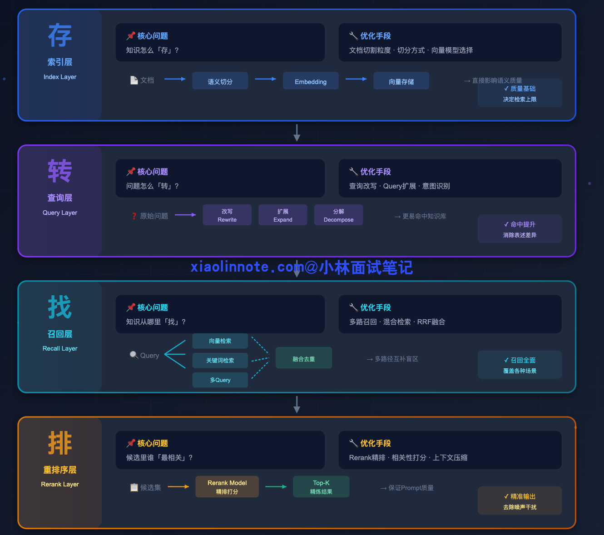
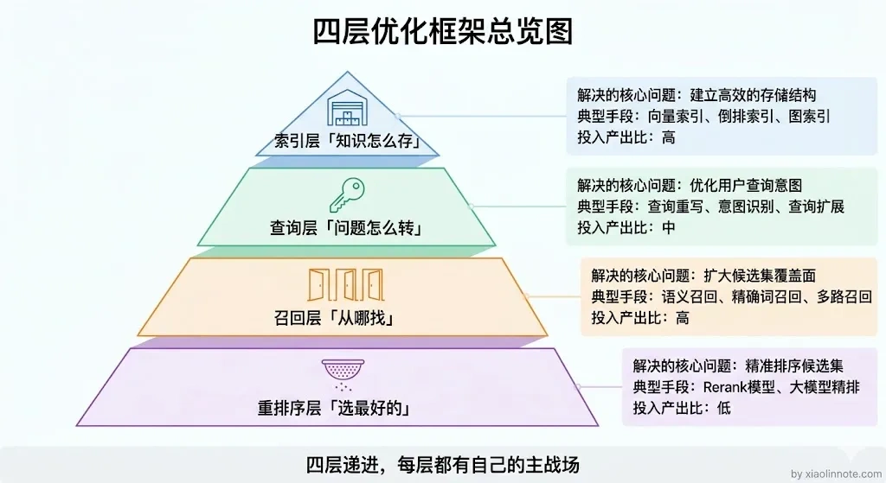
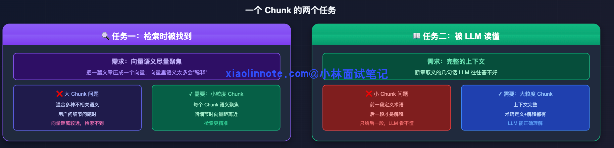
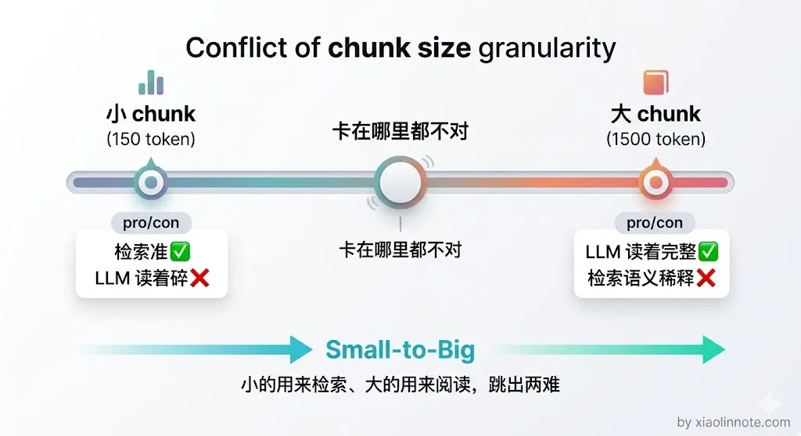
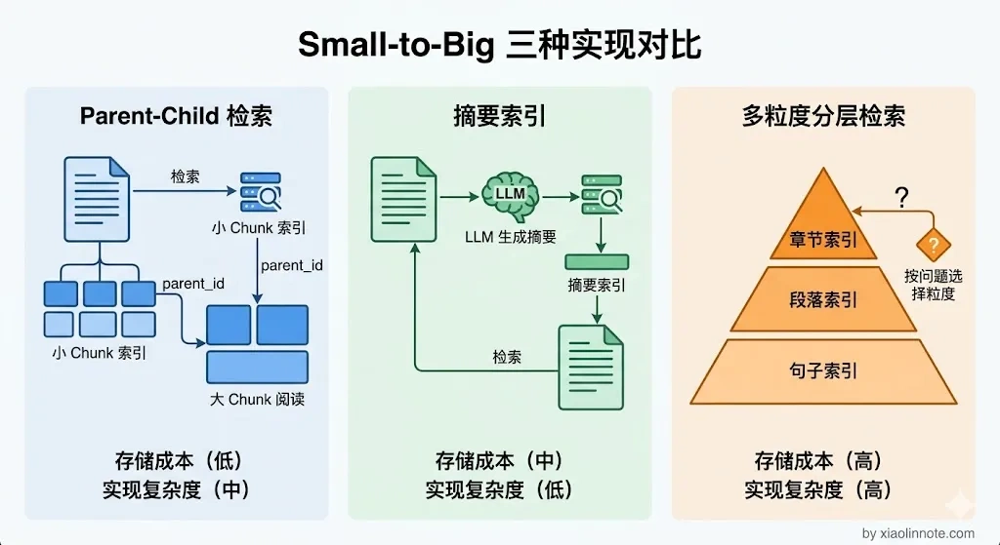
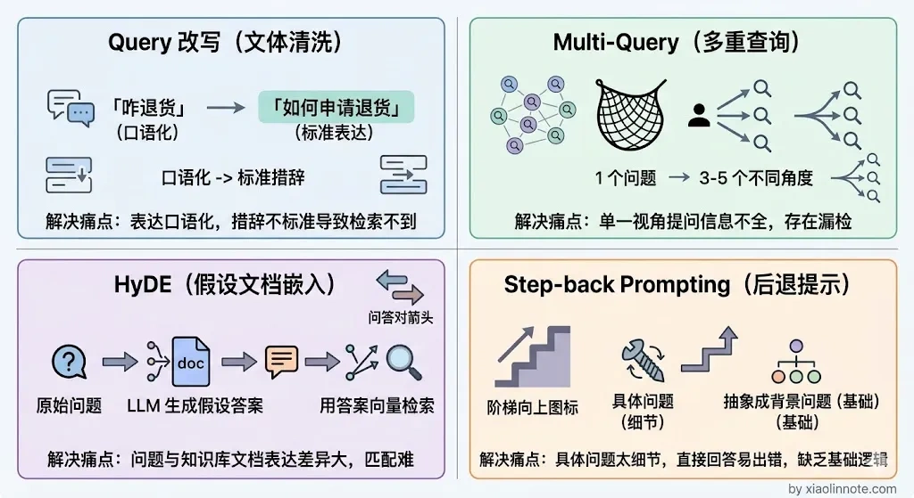
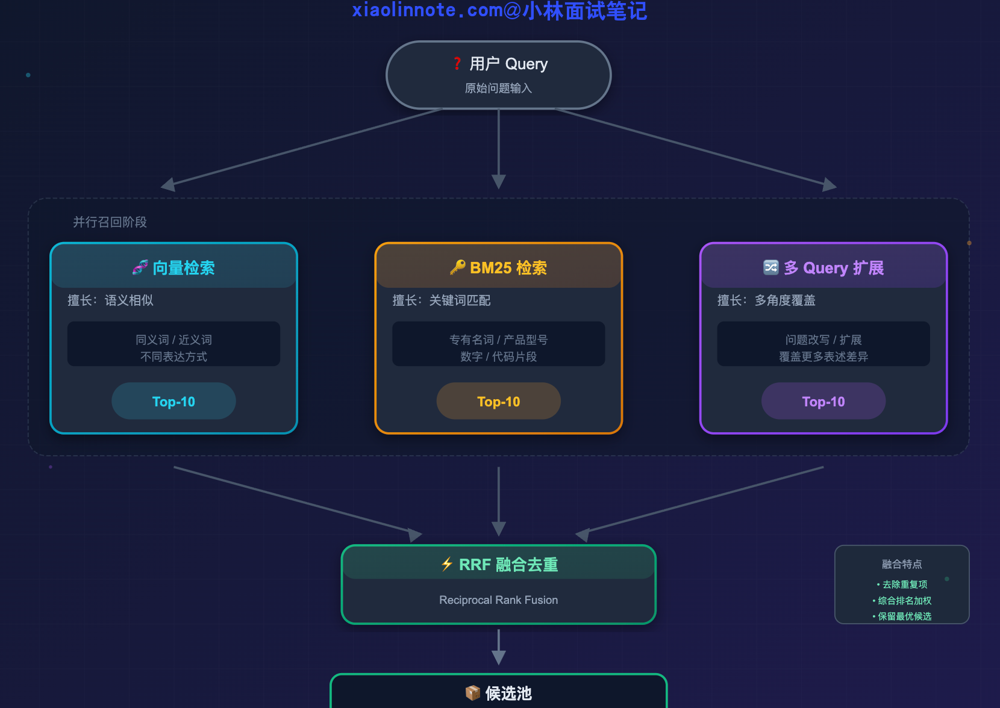
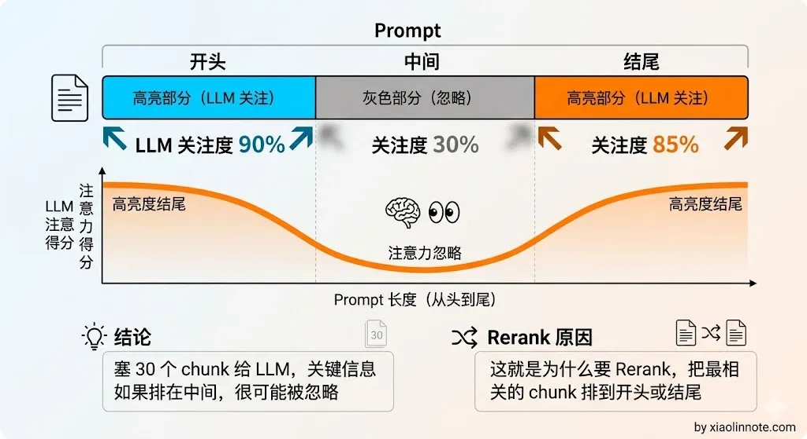
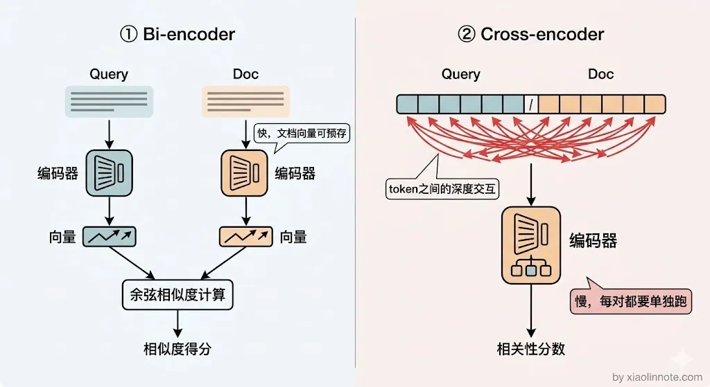
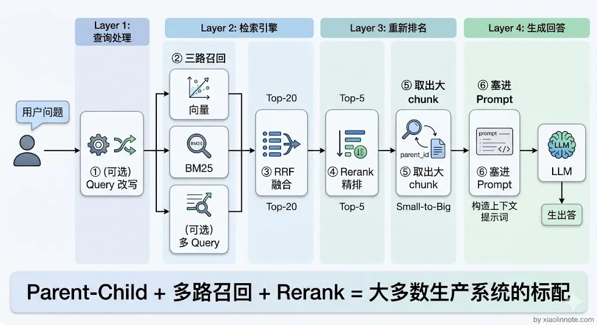

# RAG 检索优化策略有哪些？

> 原文：[RAG 检索优化策略有哪些？](https://xiaolinnote.com/ai/rag/14_retrieval_opt.html) · 小林面试笔记

👔面试官：RAG 系统的检索效果不好，你会从哪些方面优化？

🙋‍♂️我：检索效果不好嘛，那就换个好一点的 Embedding 模型，或者把 chunk 大小调一调，一般调调参数就能好很多。

👔面试官：光调参数就能解决所有问题？如果用户提问方式本身就有问题，你怎么优化？如果检索召回了 30 个 chunk，全部塞给 LLM 也不行，你怎么办？

🙋‍♂️我：那我可以做个 Rerank 精排，把最相关的几个挑出来给 LLM……

👔面试官：Rerank 是不错，但你说的这些都是零散的手段，你有没有一个系统性的优化框架？索引层、查询层、召回层、重排序层，每一层解决什么问题你能讲清楚吗？

这个问题需要一个系统性的视角来回答，让我梳理一下完整的优化框架。

## 💡 简要回答

我理解 RAG 的检索优化可以按索引/数据、查询、召回、融合与重排序几个边界排查：索引决定知识如何切分和约束，查询决定问题如何解析，召回决定候选从哪些路径获得，融合/重排序决定哪些证据进入上下文。它们不是固定的四层产品架构；应先用标注问题定位是“没召回”“召回太杂”“证据过期/无权限”还是“生成误读”，再选择改动，并同时观察质量、延迟、成本与安全。

每一层都有对应的优化手段，但不能预设所有层都要启用。先建立可回放的离线/线上基线，再按问题症状逐步加组件，避免把收益、成本和失败点混在一起。

## 📝 详细解析

### 检索是 RAG 的关键瓶颈之一

要理解为什么检索优化重要，先区分两个事实：如果必要证据没有进入 context，生成器很难凭空恢复；但证据进入 context 也不保证模型正确理解或遵守权限。因此既要优化检索，也要评估生成、引用、拒答与安全。

生成层做得再好，如果检索没把相关内容找回来，答案会缺证据；反过来，检索质量好也可能因冲突、上下文过长、提示注入或模型误读而失败。

你可能会问，那优化生成层没用吗？当然有用。应通过端到端基线判断 Prompt、模型、检索、上下文压缩和引用校验哪个环节的边际收益更高，而不是预设检索一定是投入产出比最高的环节。

### 四层优化全貌

RAG 检索优化可以从四个层次来理解，每一层解决的问题不同，优化手段也不同：

- **索引层**决定知识怎么「存」，也就是文档切割的粒度和方式，直接影响向量的语义质量；
- **查询层**决定问题怎么「转」，在检索之前对用户的 query 做加工，让它更容易命中知识库；
- **召回层**决定知识从哪里「找」，用多条不同的检索路径并行捞取候选，互补各自的盲区；
- **重排序层**决定候选里谁「最相关」，对粗召的候选集做精排，保证进入 prompt 的都是真正有用的内容。

这几个边界通常串在一条链路上，但可以按场景跳过、并行或回退。可以用一个比喻来理解：索引层决定「仓库里放了什么」，查询层决定「用什么钥匙开门」，召回层决定「从哪几扇门进去找」，重排序层决定「把找到的东西里哪些带出来」。下面依次展开说。

### 第一层：索引优化

先从最底层的索引说起，因为索引是所有后续优化的基础，如果知识存的方式就有问题，后面再怎么优化查询和检索都是白搭。

索引优化是 Chunking 策略的延伸，但它聚焦于一个更核心的矛盾：**检索用的粒度和 LLM 读的粒度天然是矛盾的**。

理解这个矛盾，要从 chunk 承担的两个角色说起。一个 chunk 需要同时完成两个任务。

第一个任务是「检索时被找到」，这要求向量语义尽量聚焦。把一篇文章压成一个向量，这个向量里混合了太多不相关的语义，用户问细节问题时，这个笼统的向量很可能和问题向量距离较远，就检索不到了，所以检索需要小粒度的 chunk，每个 chunk 语义聚焦。

第二个任务是「被 LLM 读懂」，这要求有完整的上下文。断章取义的几句话 LLM 往往答不好，如果文档里前一段定义了术语、后一段才是真正的解释，只给 LLM 后一段它可能看不明白，所以 LLM 需要大粒度的 chunk，上下文完整。

很多人以为直接把 chunk 切小就好了，检索会变准，但切小之后 LLM 拿到的是碎片化的信息，回答质量反而下降。这就是两难困境：小 chunk 检索准但内容太碎，大 chunk 内容完整但检索时语义稀释。

解决这个矛盾的核心思路叫 Small-to-Big，也就是**小块检索、大块使用**。具体有三种实现方式：

- **Parent-Child Chunking** 是一种常见方案。把文档切成细粒度子 chunk，并通过 `parent_id` 关联到较大的父上下文；可以只给子 chunk 建向量索引，命中后再取父上下文。父上下文大小、跨页边界、重复内容、权限和 Token 预算都要评测，不能固定为 150/500 token，也要处理父块过大导致噪音和成本上升。
- **摘要索引**（Summary Index）的思路是为段落生成摘要并用摘要建立检索信号，命中后取原始段落。摘要可能丢失数字、否定、条件或实体，因此必须保留原文、版本和可回溯关系，并用引用支持率与关键字段召回率验证收益。
- **多粒度分层索引**可以同时维护章节、段落或句子级信号，再根据问题类型或融合策略选取候选。层级越多，索引更新、去重、权限和运维越复杂；“宽泛问题一定用章节、细节问题一定用句子”应作为待验证假设，而不是硬规则。

### 第二层：查询优化

索引优化解决的是「知识怎么存」的问题，但即使索引建得再好，用户的提问方式和知识库里的表述方式之间还是会存在鸿沟，这不是存储端的问题，而是查询端的问题。

来看一个具体的例子：用户问「苹果手机咋截图」，知识库里写的是「iPhone 截图操作方法」。两句话可能已经能被嵌入模型关联，也可能受模型、短文本、实体词表和索引质量影响而漏召回；需要用分桶评测定位原因。

即便使用向量检索，也不能假设所有口语/书面语、短文本和领域术语都能被稳定映射；应同时检查 Query 预处理、实体识别、分词/别名、Embedding 版本和文档质量。

查询优化就是在检索前对用户 Query 做解析、改写或扩展，目标是在保留约束的前提下提高候选质量。主要有四种候选方法。

- **Query 改写**是最基础的方法，用 LLM 把口语化、有歧义的 query 转化成更正式、更精准的书面表达。比如「它为什么这么贵」，这个「它」指代不明，LLM 结合对话历史把它改写成「iPhone 15 Pro Max 定价偏高的原因是什么」，改写之后的 query 就更容易命中文档里的相关内容了。
- **多 Query 扩展**（Multi-Query）可以处理提问角度和文档描述角度不一致的问题。扩展数量不应固定，原始 Query 应保留在检索列表中；每个变体都要保持实体、版本、时间、否定和权限约束，并设置成本/延迟预算。
- **HyDE**（Hypothetical Document Embeddings，假设文档嵌入）先生成假设文档，再用其向量作为额外检索信号。它可能改善某些表达差异，也可能把错误假设放大；不能替代原 Query，也不能把假设内容当事实。
- **Step-back Prompting**（后退提问）把具体问题抽象成背景问题，再与原问题一起检索。它可能帮助找到原理文档，但若只保留抽象问题会丢失具体参数、版本或条件；最终答案仍需回到原问题和证据。

### 第三层：召回优化

查询优化是从「问题」这边想办法，召回优化则是从「检索路径」这边想办法。

即使 query 已经改写得很好了，如果只走一条检索路径，还是会漏掉一些内容。

单一的向量检索可能对精确实体不稳定。比如用户问「M4 Pro 芯片的性能跑分」，词法召回可以提供包含该型号的候选，而向量模型可能把它与更泛的“苹果处理器”文档混在一起；是否发生取决于模型、分词、数据和索引，应通过实体分桶验证。

反过来，关键词检索（BM25）也有自己的盲区：它主要利用词项与统计信号，不会自动理解所有语义关系。用户问「怎么退货」，文档写「申请售后」时，如果没有同义词/别名扩展可能漏召回；向量检索可提供互补信号。

两种检索方式的盲区恰好互补，这就是多路召回的出发点。不只走一条路，同时打开多扇门，把各路结果汇总起来，覆盖更多的可能性。

一种三路并行的示意是向量检索、BM25 和 Query 扩展；实际系统也可以只用其中两路，或加入结构化/图检索：

三路各自捞出一批候选，但它们的分数没法直接比较，向量相似度是 0~1 的余弦值，BM25 是 TF-IDF 分数，量纲完全不同。你可能会想，那归一化之后加权不就行了？实际上各路分数的分布差异很大，归一化效果不稳定，工程上也更复杂。

这时候需要一个统一的融合策略，RRF（Reciprocal Rank Fusion，倒数排名融合）是常见选择之一；也可比较分数校准、加权或学习排序。

**RRF 的思路很简单**：不看原始分数，只看排名。

对每一路结果，排名第 1 的 chunk 贡献的分数最高，排名越靠后贡献越低。把同一个 chunk 在所有路径里的得分加起来，就是它的综合分。

这样，在多路检索里都排名靠前的 chunk，最终综合分就高。各路检索的分数没法直接比，就像百米赛跑和游泳比赛的成绩单位不同、没有可比性，但排名是通用的语言，综合各路排名来打分才公平。

公式可写为 `score(chunk) = Σ 1 / (k + rank)`，其中 `k` 是平滑参数；具体值应在验证集和不同路数下调节，不能固定写成 60。

`k` 控制排名位置对融合分的衰减。它不是保证候选不被淘汰的“保底分”，也没有跨数据集都最稳定的经验值。

RRF 的优点是实现简单、不需要训练、计算量较小；但它仍要处理重复、权限、版本、路由失败和候选截断，效果必须与其他融合方案比较，不能称为零成本或所有场景的标配。

### 第四层：重排序

经过前面三层：索引优化、查询优化、多路召回。

检索质量已经比朴素 RAG 好了很多，但还差最后一步。

多路召回之后，候选 chunk 可能有 20~30 个，这些 chunk 里难免混入一些不太相关的内容，直接全塞给 LLM 会出问题：一是 token 消耗暴涨，成本直线上升；二是上下文太长，LLM 在处理长文本时容易出现「Lost in the Middle」的现象，也就是只关注开头和结尾，中间的内容容易被忽略。

所以可以考虑精排步骤，从有限候选中筛选能支持回答的证据；候选数和最终上下文数量应由 Recall@K、引用支持率、上下文预算、P95/P99 与成本曲线决定，不应固定为 20～30 和 3～5。

你可能会问，向量检索不是已经排过序了吗，为什么还需要再排一次？要理解 Rerank 为什么比向量检索更准，需要先理解两种不同的模型结构。

向量检索用的是 Bi-encoder 结构：query 和 chunk 各自独立编码成向量，再算余弦相似度。这个结构的优点是速度极快，因为 chunk 的向量可以提前计算好存库，检索时只要算一次 query 的向量然后做距离比较就行；缺点是 query 和 chunk 是分开编码的，模型没办法看到两段文字之间的具体词语关联，相关性判断不够精准。

Rerank 用的是 Cross-encoder 结构，把「query + chunk」拼成一对输入，让模型整体看这一对的相关性。Cross-encoder 能看到 query 中每个词对 chunk 的影响、chunk 里哪些词最能回答 query，相关性判断精度远高于 Bi-encoder。代价是每一个候选 chunk 都要单独跑一次 Cross-encoder，速度慢，所以只适合对小规模候选集做精排，不适合大规模召回阶段。

打个比方来理解两者的区别：Bi-encoder 像是只看了两个人的简历就判断他们合不合适合作，而 Cross-encoder 是把两个人放在一个房间里，观察他们怎么交流、怎么配合，判断当然更准确，但代价是需要花更多时间观察每一个人。

Rerank 的流程是：多路召回得到有限候选，Cross-Encoder 或其他重排序器对每个 `(query, chunk)` 打相关度分，按分数排序后再结合多样性、版本、权限和上下文预算选择证据。

Reranker 可以是自托管模型或托管 API；选择时看语言覆盖、领域表现、数据驻留、吞吐、延迟、费用与供应商依赖。加入 Rerank 可能提升最终证据质量，也可能因为候选召回不足、模型偏差或延迟预算而无收益，必须做对照实验。

### 四层优化怎么组合

四层优化解决的问题不同，实际落地时不需要全部都上，按业务场景和问题症状来选：

| 层次 | 解决的核心问题 | 推荐程度 |
| --- | --- | --- |
| 索引优化（如 Parent-Child） | 检索粒度与上下文完整性的取舍 | 用 chunk/父上下文评测决定 |
| 查询优化（改写/Multi-Query/HyDE） | Query 结构、表达或覆盖不足 | 先比较收益与语义漂移/成本 |
| 多路召回（向量 + 词法等） | 单一路径漏召 | 用分桶 Recall、权限和延迟决定 |
| Rerank 精排 | 候选相关性排序不足 | 用引用支持率、P95/P99 和成本决定 |

一个常见的候选搭配是：**Parent-Child 索引 + 向量/词法多路召回 + Rerank 精排**，再按需要加入 Query 解析。它不是生产级默认答案；应从简单基线开始，逐层增加，并保留开关以便回滚和比较。

从另一个角度来记这些边界：**索引/数据层保证知识可被表示和过滤，查询层保证约束被保留，召回层降低漏召风险，融合/重排层控制证据质量与上下文预算**。每一层都可能失败，也都要有指标和回退。

排错时先看链路指标：若 gold 文档未出现在候选集，查切分、Embedding、Query、过滤和召回路；若候选包含 gold 但最终答案不用它，查融合、Rerank、上下文排序和 Prompt；若引用支持但答案仍错，查冲突处理、模型推理和校验。这样比盲目换模型更容易定位。

## 🎯 面试总结

回到开头的对话，检索优化不是「换个模型、调调参数」这么简单的事，需要一个系统性的四层框架：索引层解决「知识怎么存」的粒度矛盾，查询层解决「问题怎么转」的表述鸿沟，召回层解决「从哪些路径找」的盲区互补，重排序层解决「最终谁最相关」的精度问题。

面试时不要只罗列优化手段，而是要把这四层的逻辑关系讲清楚：每一层解决什么问题、为什么需要它、怎么和其他层配合。

最后可以给出候选组合（例如 Parent-Child + 多路召回 + Rerank），但要同时说明基线、评测指标、延迟/成本和失败回退；示例架构不能代替真实项目经历。

---
