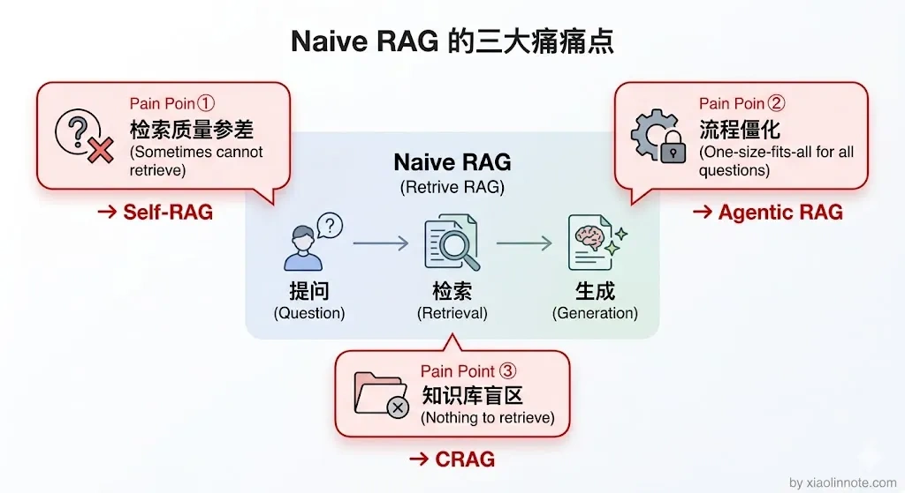
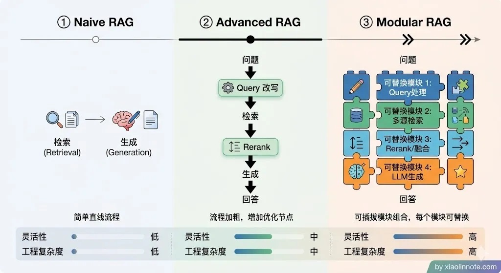
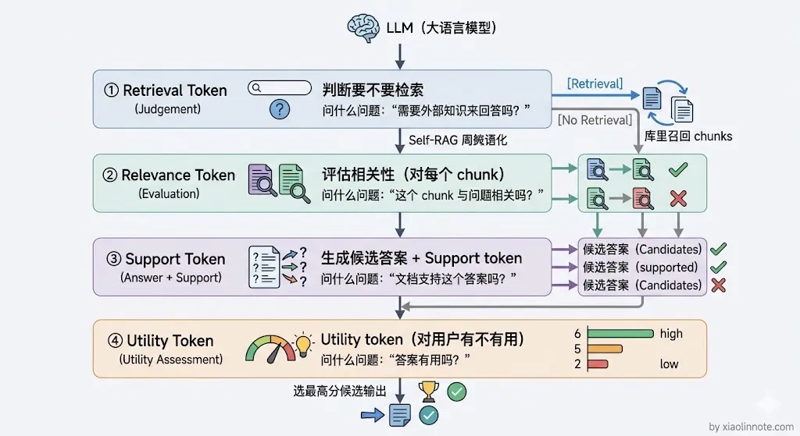
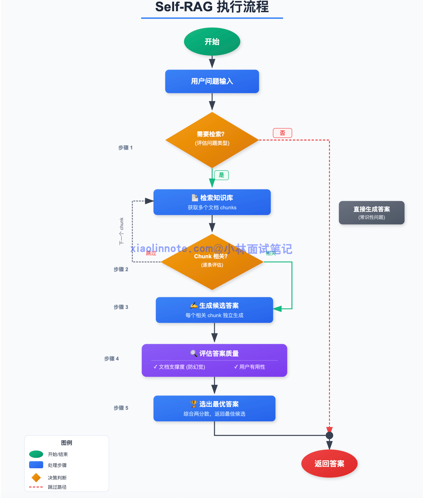
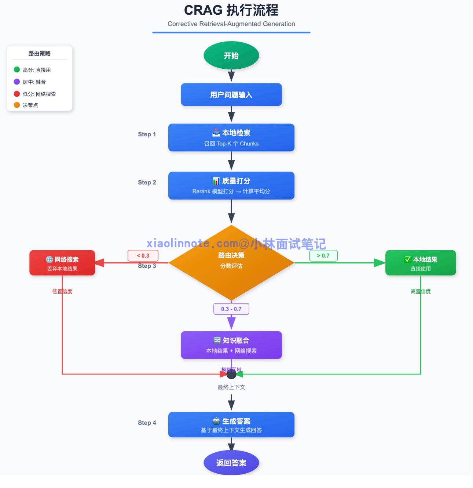
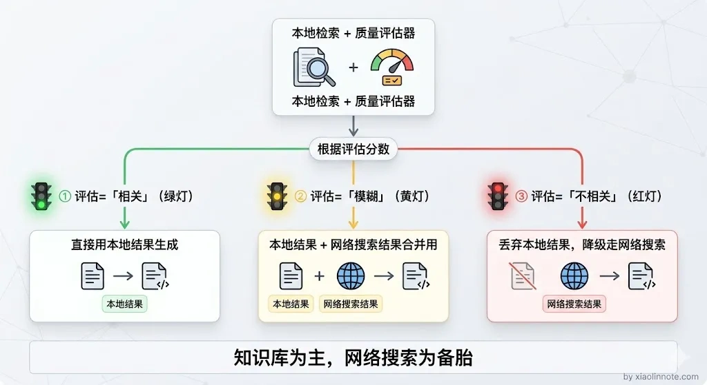
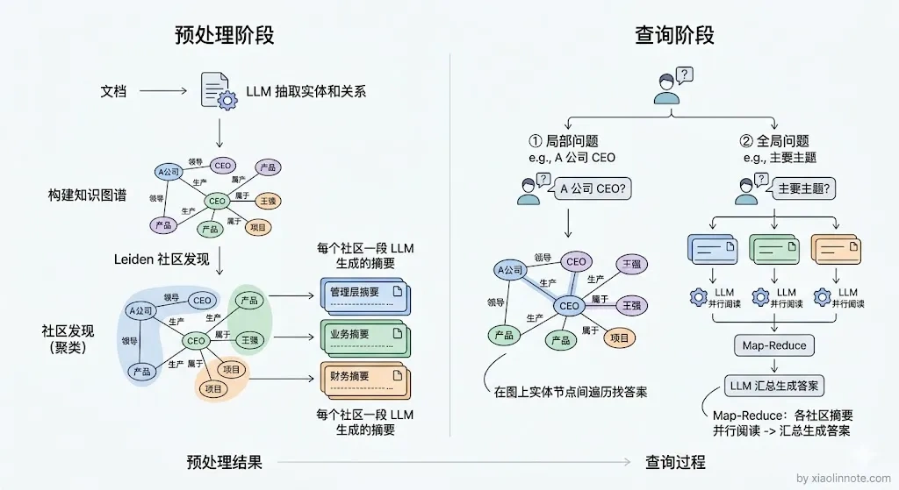
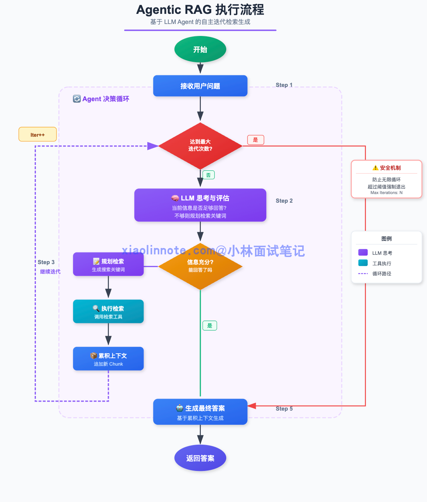
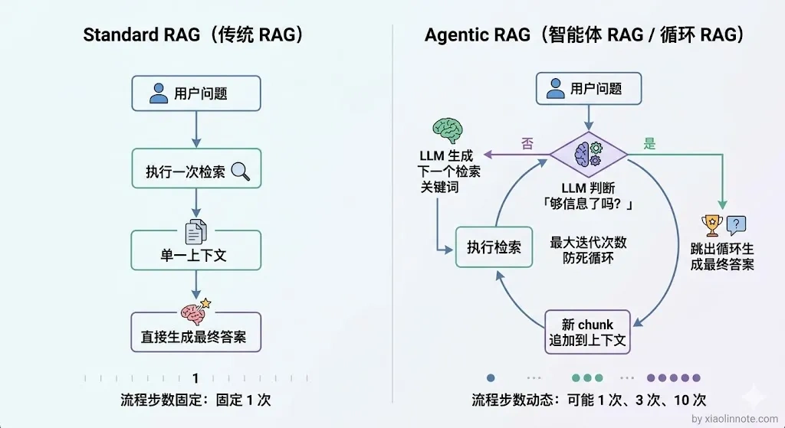

# 了解哪些更复杂的 RAG 范式？

> 原文：[了解哪些更复杂的 RAG 范式？](https://xiaolinnote.com/ai/rag/15_advanced_paradigms.html) · 小林面试笔记

👔面试官：你了解哪些更复杂的 RAG 范式？除了最基本的检索加生成，还有什么更高级的玩法？

🙋‍♂️我：呃，我觉得 Advanced RAG 就是最复杂的了吧，加个 Rerank 和 Query 改写基本上就到头了，其他都是工程优化。

👔面试官：Advanced RAG 只是在固定流程上打补丁，你听说过 Self-RAG、CRAG、Agentic RAG 这些范式吗？它们解决的是完全不同层面的问题。

🙋‍♂️我：Self-RAG 我看过一点，好像就是让模型自己判断要不要检索，但具体怎么实现的我不太清楚，CRAG 和 Agentic RAG 没了解过。

👔面试官：连这些范式的边界都没搞清楚就来面试了？Self-RAG、CRAG 和 Agentic RAG 分别强调检索/反思、检索纠正与动态循环，但论文机制、工程近似和生产成熟度不同，需要说明适用条件与回退路径。

面试官的问题其实是在考察你对 RAG 范式演进的理解深度，不只是背名字，而是要讲清楚每种范式解决了什么痛点、怎么解决的。下面我来系统梳理一下。

## 💡 简要回答

可以用 Naive RAG、Advanced RAG、Modular RAG 这组教学分类来组织答案，但它不是所有论文都采用的统一“发展三代”标准。更准确的说法是：固定流水线、在流水线上增加优化、以及可组合/可路由的模块化设计是三种常见抽象。

在这之上还有几个我觉得值得关注的高级范式。

Self-RAG 是论文提出的、让模型产生检索与反思信号的训练范式；CRAG 是对检索质量进行评估并触发纠正路径的一类方法，纠正路径不必然是开放网络；GraphRAG 是图结构、实体关系和社区/摘要等方法的一个代表性组合；Agentic RAG 则把受约束的 Agent 循环用于动态检索。它们都需要按任务、数据和安全边界落地，不能直接当作现成产品功能。

## 📝 详细解析

### 什么是 RAG 范式？

「范式」可以理解为一套处理流程与决策设计。RAG 范式描述的是从用户提问到证据获取、验证和生成的组织方式；它可以是固定流程，也可以包含路由、循环和人工审批，不一定“固定”。

不同的 RAG 范式，本质上是在回答同一个问题：**在「检索」和「生成」之间，系统应该怎么协调、怎么决策、怎么处理中间的各种异常情况？**

最朴素的 RAG 范式是这样的：用户提问 -> 向量检索 -> 拼 prompt -> LLM 生成答案。这套流程适合做最小基线，但一旦到了真实业务场景，还要面对召回质量、权限、更新、冲突、成本和可观测性问题。

### 为什么需要不同的 RAG 范式？

朴素 RAG 的问题，随着使用场景复杂度的增加会越来越明显。

第一个问题是检索质量参差不齐。用户的提问方式千变万化，有些问题一次检索就能找到正确答案，有些问题一次检索可能漏掉相关内容，但朴素流程未必会区分，一律把候选交给 LLM。低质量上下文可能诱发无依据回答，而用户又难以判断证据边界。

第二个问题是所有问题都走同一套流程，太死板。有些问题根本不需要检索，比如「你好」「今天天气怎么样」，强行去知识库里找毫无意义；有些复杂问题需要多轮检索才能拼出完整答案，而朴素 RAG 一律只检索一次。然后呢？该省的地方没省，该深挖的地方浅尝辄止，结果既浪费又不准。

第三个问题是知识库覆盖有盲区。知识库里永远不可能有所有答案，当找不到相关内容时，朴素 RAG 要么让 LLM 编造答案，要么返回一个风马牛不相及的回答。然后呢？用户拿到的是一个自信满满的错误答案，体验很差。

你可能会想，这些问题用前面讲的 Advanced RAG 手段（Query 改写、Rerank、混合检索）不就能解决了吗？确实能缓解，但它们有一个共同的假设：流程是固定的，只是每个环节做得更好。

而真正复杂的场景需要的是「流程本身能根据情况调整」，什么时候该检索、检索结果不行怎么办、需不需要再检索一次，这些决策需要系统自己做，而不是靠人预先写死。这就是高级范式要解决的问题。

这三个问题，催生了不同思路的 RAG 范式：有的在「如何检索」上做文章，有的在「要不要检索」上加判断，有的在「检索不到时怎么兜底」上下功夫。理解这些范式，本质上是理解面对不同场景约束时，系统设计者各自找到的解法。

### 常见 RAG 设计层次（教学分类）

可以把 RAG 常见设计粗略分为朴素流水线、加入检索前后优化的固定流程、模块化/条件路由与动态检索等层次；这是一种教学分类，不是统一的“三代”标准，实际系统常混合使用。

常被称为 **Naive RAG** 的形态是：用户提问 -> 检索 -> 拼 prompt -> LLM 生成。它适合做基线，但通常缺少 Query 解析、权限过滤、候选评估、引用校验和拒答策略；这些缺口可能导致噪音、偏差和无依据回答。

**Advanced RAG** 常用来指在检索前后加入 Query 改写、混合召回、Rerank、压缩等增强步骤。它可能提高质量，也会引入模型调用、版本、超时和成本；是否有效要靠基线对照，不能宣称所有生产系统都采用同一形态。

Advanced RAG 往往仍可实现为固定或半固定流程；当不同问题需要不同检索器、证据策略和回退路径时，模块化与路由设计会更有帮助。

**Modular RAG** 把检索器、过滤器、融合器、重排器、生成器和校验器等拆成可替换模块，并通过明确的输入/输出契约组合。它提高了可测试性和路由灵活性，也会增加接口、状态、版本和观测复杂度。某些框架提供 Workflow/Graph 能力可以承载这种设计，但框架名称本身不等于架构实现。

用这组分类建立参照后，再看下面的研究/工程范式会更清楚；它们不一定按时间顺序，也不是互斥产品。

### 高级范式

在这之上还有几个值得关注的高级范式，每一种都对应了朴素 RAG 的一个特定痛点：

#### Self-RAG：LLM 自己决定要不要检索

前面提到朴素 RAG 的第二个痛点是「所有问题都走同一套流程，太死板」。Self-RAG 就是专门解决这个问题的。

普通 RAG 常常不区分问题类型。Self-RAG 论文训练模型产生反思信号，用来决定何时检索、评估证据和检查答案。论文中的信号包括：

1. 当前问题需不需要检索？（Retrieval token）
2. 检索回来的内容和问题相不相关？（Relevance token）
3. 生成的答案有没有幻觉？（Support token）
4. 最终答案质量够不够好？（Utility token）

Self-RAG 的执行流程如下：

1. **判断是否需要检索**：根据问题和当前生成状态决定是否请求证据。
2. **评估证据相关性**：判断检索到的片段是否支持当前问题。
3. **检查支持与效用**：评估生成内容是否有证据支持、是否满足任务目标。
4. **继续生成、检索或停止**：根据信号选择下一步；具体流程需遵循模型训练方式和运行时约束。

这套机制有一个很容易被忽略的前提：那四种 reflection token 不是现成 LLM 自带的，需要在一个专门构造的数据集上，对基础 LLM 进行监督微调，把这些特殊 token 作为新词表的一部分训练进去。

换句话说，论文意义上的 Self-RAG 依赖特定训练与反思标记，不能把普通通用模型直接称为“Self-RAG”。工程上可以用通用模型、分类器或规则实现类似的“是否检索/证据评估”控制器，但应称为 Self-RAG-like，并单独评估其误判、成本和安全边界。

潜在收益是按问题跳过不必要的检索、在证据不足时触发回退；它不能保证避免幻觉，反思器本身也可能判断错误，因此仍需硬性的权限、预算、拒答和引用校验。

#### CRAG（Corrective RAG）：检索质量差时自动纠错

Self-RAG 解决的是「要不要检索」的问题，那如果检索了但结果质量很差怎么办？

朴素 RAG 的一个痛点是：知识库可能没有覆盖问题，或召回结果与问题不相关。CRAG 通过质量评估和纠正路径处理这种情况。

CRAG 在检索后增加质量评估与路由：高质量结果可继续本地 RAG；低质量结果可以重写/重检索、查询另一个受控数据源、转人工或拒答。某些论文/实现会使用 Web 搜索，但开放网络不是默认安全兜底，必须考虑来源可信度、时效、版权、隐私、提示注入和权限。

CRAG 的执行流程如下：

1. **本地检索**：先从知识库里召回 top-K 个 chunk。
2. **质量评估**：用标注数据校准的评估器、规则、Rerank 或模型判断来估计候选与问题的相关性，并区分“相关但不支持结论”和“完全无关”。Rerank 分数不能未经校准地当作通用概率。
3. **路由决策**：根据校准阈值和业务风险选择继续、本地重检索、受控外部源、转人工或拒答。阈值、超时和数据源白名单应按领域验证；不能因为评估器“模糊”就自动把不可信内容和网络结果混合。
4. **生成答案**：基于最终上下文生成回答。

这个方案的核心价值是让证据不足时有显式回退，而不是把低质量上下文直接交给生成器。回退可能是另一个内部数据源，也可能是受控 Web 搜索；它不会自动提升健壮性，必须配合来源验证、缓存/版本和安全策略。

#### GraphRAG：用知识图谱增强全局理解

Self-RAG 和 CRAG 解决的都是「检索策略」层面的问题，但还有一种瓶颈是检索方式本身的局限。

向量检索通常以局部候选为主，对于“这批文档的核心主题是什么”这类聚合问题，单次相似度检索可能不够；但它并非只能做“一对一”，也可以通过多查询、聚合、父文档或其他检索策略处理更广范围。GraphRAG 是公开研究/工程方案中的一个代表性组合，把实体关系、社区发现和层次摘要用于全局或跨文档问题；不应把它简化成某个厂商的唯一方案。

GraphRAG 常见做法包括：预处理阶段用模型或规则从文档抽取实体/关系，构建图结构，再用社区发现等方法组织实体，并为社区生成多层摘要。抽取错误、实体消歧、关系时效、来源与权限都会沿图传播，因此要保留原文证据、版本和可回溯边。

检索阶段可以区分局部实体/关系问题与全局聚合问题：前者可做实体查找和受限遍历，后者可对社区摘要做 Map-Reduce 或其他聚合。具体查询模式不是所有 GraphRAG 实现都相同，且全局摘要成本、时效和可解释性要单独评估。

向量检索以 query 与候选向量的相似度为核心，天然更容易先返回局部相关片段；它不自动维护实体关系、社区结构或跨文档聚合。图结构可以补充这些关系，但也引入抽取、更新、查询和权限复杂度。

GraphRAG 通过预先构建社区摘要，把部分全局信息提前组织起来，可能减少查询时的全量扫描；摘要不是事实保证，仍需回溯原文、处理更新和评估覆盖。

适合知识关系强、需要跨文档聚合或全局视角的场景，例如企业关系分析、药物-疾病-症状关联和主题归纳；是否适用要看实体/关系质量与更新频率。代价包括抽取与摘要成本、时效维护、图查询、权限传播和结果验证。

#### Agentic RAG：把 RAG 做成 Agent

前面几种范式可以是固定流程或带分支的流程。有些问题的子问题和所需证据无法在入口一次确定，系统才有理由引入 Agentic RAG，让模型在严格的工具、预算和状态约束下规划下一步。

普通 RAG 是固定的「检索一次 -> 生成」的流程，但有些问题需要多轮检索：第一次检索发现信息不够，需要追加检索；检索结果互相矛盾，需要再检索来验证；问题本身是多步骤的，每一步都需要检索不同的内容。

Agentic RAG 把 RAG 嵌入 Agent 循环，模型可以提出下一次检索、判断证据缺口或停止，但运行时必须验证工具参数、权限、查询范围、最大轮数、Token/费用预算和超时；“自主”不等于无限或无监督。

Agentic RAG 的执行流程如下：

1. **接收问题，建立状态**：记录原问题、权限、已检索证据、预算和停止条件。
2. **提出下一步动作**：模型提出检索、澄清、验证或结束动作，运行时校验 schema、权限和查询范围。
3. **执行检索并更新证据状态**：去重、标注来源/版本/时间，记录失败和部分结果，而不是无条件追加所有 chunk。
4. **判断证据缺口**：根据规则、评估器或模型判断是否需要新的子问题，同时防止重复查询和循环。
5. **生成、引用或拒答**：达到停止条件后生成带证据的答案；若证据不足或冲突，进入澄清、人工或拒答路径。

这套机制可能适合多步骤、证据依赖明确且检索工具可控的问题，比如按年份和指标分析财报；但复杂度高、延迟和费用也会上升，应先比较固定多路流程是否已经足够。

和前面几种范式相比，Agentic RAG 更强调运行时根据中间状态选择下一步，但流程边界、工具集合和停止策略仍应由工程系统定义。如果说 Self-RAG 侧重检索/反思信号，CRAG 侧重检索质量后的纠正路径，Agentic RAG 则侧重多步工具调用与状态循环；三者可以组合，也可以只实现其中一部分。

把几种高级范式的特点对比一下，选型时有个参考：

| 范式 | 核心创新 | 适合场景 | 工程复杂度 |
| --- | --- | --- | --- |
| Advanced RAG | 在固定链路加入改写/融合/Rerank 等 | 基线流程的质量与上下文优化 | 取决于组件数量 |
| Self-RAG / Self-RAG-like | 检索与证据反思信号 | 问题类型多样、需要动态决定是否检索 | 训练或控制器评估成本高 |
| CRAG / corrective flow | 检索质量评估与纠正路径 | 本地知识覆盖/质量不稳定 | 取决于回退源与安全审批 |
| GraphRAG 类方法 | 图结构、社区/摘要与全局查询 | 实体关系、跨文档聚合 | 图构建、更新与权限复杂 |
| Agentic RAG | 受约束的多步动态检索 | 子问题和证据路径难以预先固定 | 循环、工具、预算与观测复杂 |

## 🎯 面试总结

回到面试官的问题，Advanced RAG 只是一个常用的教学标签，用来描述固定链路上的增强；Self-RAG、CRAG、GraphRAG 类方法和 Agentic RAG 分别强调不同的控制、证据和结构问题。

Self-RAG 论文通过训练得到检索/反思信号；工程中的 Self-RAG-like 可以用受控模型或规则近似。CRAG 类流程在检索质量差时触发纠正或回退，回退到网络并不是必选项。

GraphRAG 类方法用图结构、社区/摘要和原文证据支持跨文档或全局查询；Agentic RAG 用受约束循环处理多步检索。它们的收益都要和索引/构建成本、延迟、权限、更新与失败回退一起评估。

回答时不要只罗列名字，要讲清楚每种范式解决了什么痛点、核心机制是什么、适合什么场景，这才是面试官想听到的。

---
