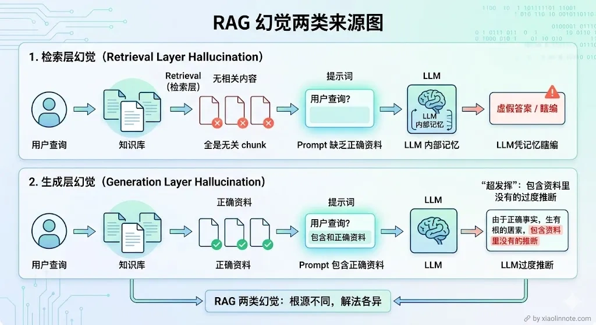
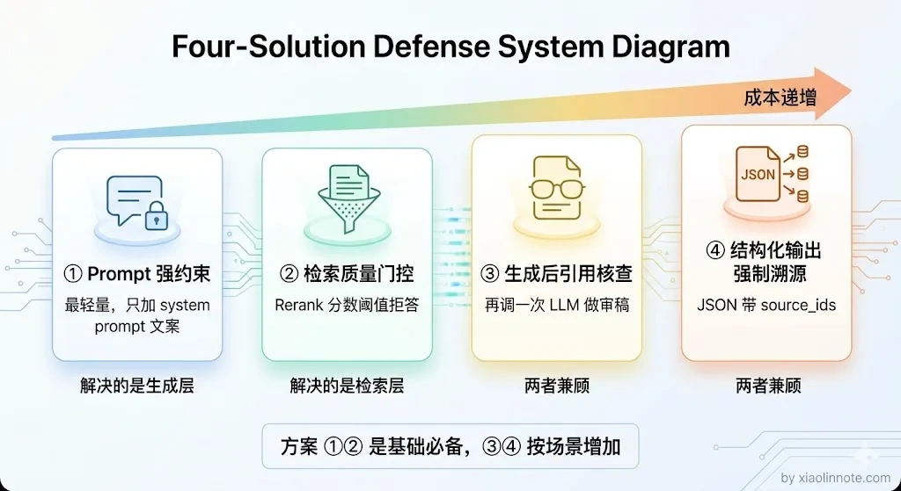
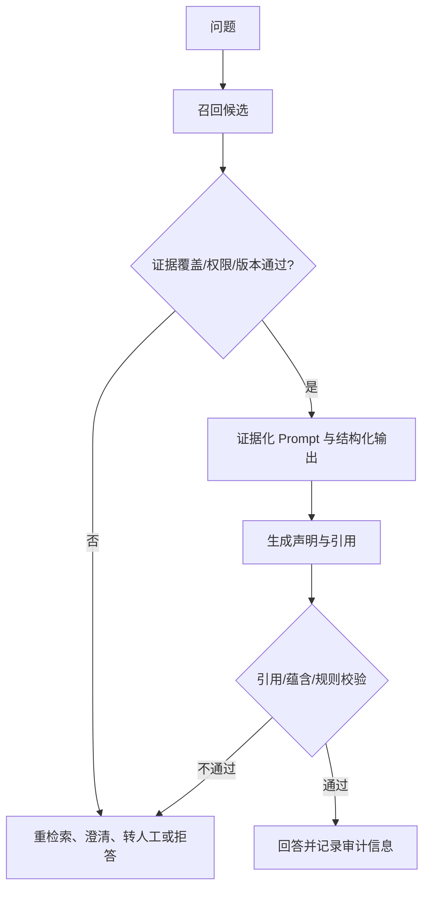
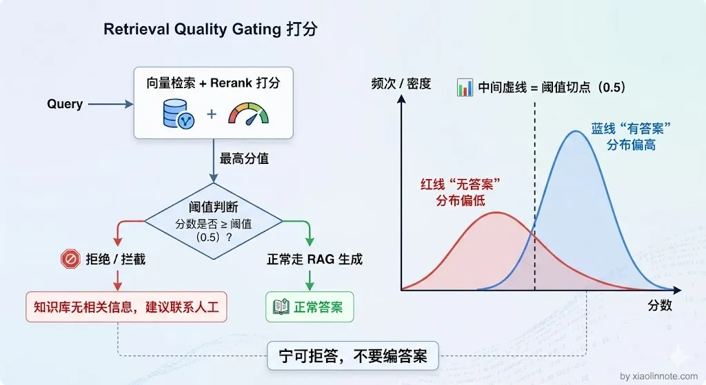
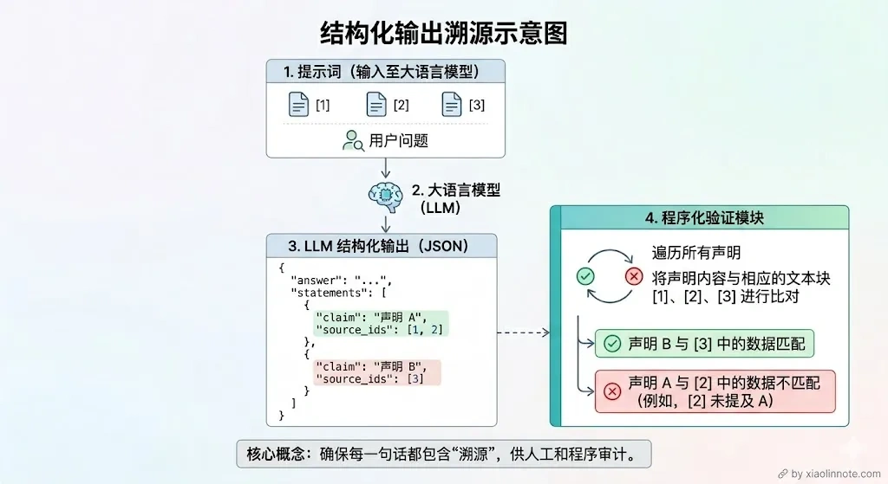
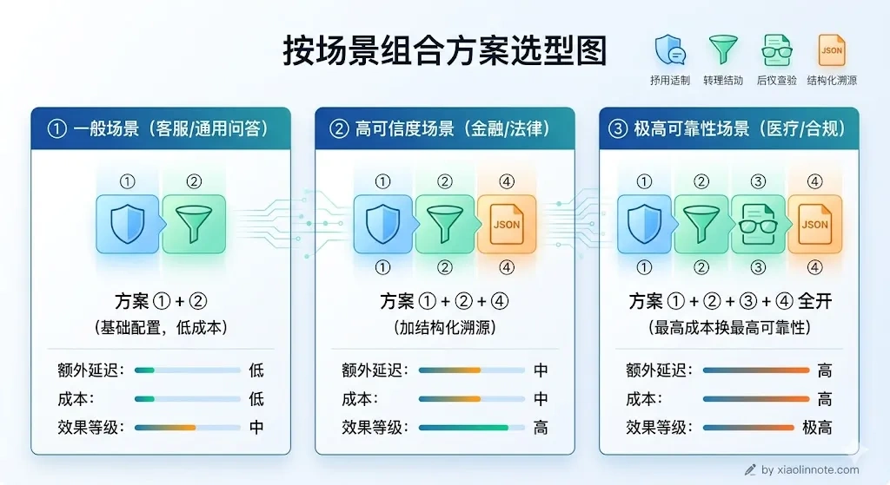

# 如何规避 RAG 系统中大模型的幻觉？

> 原文：[如何规避 RAG 系统中大模型的幻觉？](https://xiaolinnote.com/ai/rag/17_hallucination.html) · 小林面试笔记

👔面试官：RAG 系统中大模型的幻觉问题你怎么处理？

🙋‍♂️我：幻觉的话，我觉得只要检索到了相关内容，LLM 就不会编造了，所以关键是把检索做好就行了。

👔面试官：检索做好了就不会幻觉了？检索到了内容但 LLM 没有严格照着说的情况你怎么处理？这叫「生成层幻觉」，你连这个都没考虑过？

🙋‍♂️我：那我在 prompt 里加一句「请根据资料回答」应该就可以了？

👔面试官：加一句就够了？你知道 RAG 里的幻觉有两个完全不同的来源吗？检索层没找到和生成层超发挥，解法完全不一样。你就只会加一句 prompt？

面试官这里在考察你对 RAG 幻觉来源的理解深度，以及你是否有一套系统的防控策略。下面我从两类幻觉的根源出发，逐层讲清楚怎么规避。

## 💡 简要回答

RAG 中常见的失败至少包括：相关证据没召回或被权限/版本过滤掉；证据存在但生成器误读、过度推断或混合冲突；以及文档本身过期、被提示注入或来源不可信。对应策略包括改进召回与门控、证据化 Prompt、引用/蕴含核查、结构化输出和高风险人工审批。Prompt 与门控可作为基线，但不能保证消除幻觉；是否上线必须按风险、质量、延迟和成本验证。

## 📝 详细解析

### 幻觉是什么，为什么 RAG 里会有幻觉？

先说「幻觉」这个词是什么意思。LLM 的幻觉，就是模型一本正经地说了一件压根不存在的事。它不是在撒谎，它只是在「预测下一个词」，当它没有可靠依据时，就会拼凑出一个「听起来合理」的答案，但内容可能是错的。

你可能会想：RAG 不是已经把知识库的内容塞进 prompt 了吗，LLM 为什么还会编造？很多人以为做了 RAG 就不会有幻觉了，这是一个非常常见的误区。问题是，塞进去不等于 LLM 一定会「老老实实照着说」。LLM 有自己的「知识储备」（来自预训练），当 prompt 里的资料和它平时「学到的」不一致，或者 prompt 里根本就没召回到相关内容，它就可能绕开资料、自己发挥。

所以 RAG 里的幻觉要按来源拆开理解，而不是只分成“检索错”和“生成错”：

**第一种：检索层没找到，LLM 靠「猜」回答。**

这是最根本的问题。RAG 的前提是「检索到了相关内容再生成」，但如果检索这一步失败了，向量没找到相关的 chunk，prompt 里就是空的或者全是不相关的内容，LLM 会怎么做？它不会说「我不知道」，它会用自己训练时见过的知识编一个看起来像答案的东西。这个答案可能和你知识库里的内容完全相反，而且 LLM 说得很自信，用户根本看不出来。

举个具体例子：你的知识库里记录的退款政策是「7 天无理由退款」，但某次检索没召回到这个 chunk，LLM 用自己的「知识」给出了「30 天退款」的答案，用户按这个信息去操作，结果退款失败，这就是检索层幻觉造成的实际损失。

**第二种：检索到了，但 LLM 没有严格照着说。**

那检索到了就安全了吗？也不是。这种幻觉更隐蔽，也更常见。相关的 chunk 确实被召回了，塞进 prompt 里了，但 LLM 在生成答案时「超发挥」了，它把资料里的内容作为基础，然后加了自己的推断、补充了原文没有的细节、甚至把两段不相关的信息混在一起拼出一个「更完整」的答案。读者很难分辨哪句话来自文档、哪句是 LLM 加的。

这两种幻觉的根源不同，解法也不一样。下面四个方案，是从「成本最低」到「机制最严格」依次递进的思路。

这条链路把“有相关 chunk”和“答案声明得到证据支持”分开；其中每个门都可能选择降级，而不是强行生成。

### 方案一：用 Prompt 告诉 LLM「只准照着资料说」

这是成本最低、最容易上手的方案，效果也立竿见影。很多人搭 RAG 时只是把 chunk 塞进 prompt，然后问「请回答这个问题」，并没有明确约束 LLM 的行为。LLM 就会觉得「这些资料只是参考，我可以结合自己的知识一起回答」，幻觉就这样产生了。

修复方法很简单：在 system prompt 里明确立规矩，只能用资料里的内容、资料里没有就说不知道、不准推断和补充。这几条规则，每一条都有它的道理：

> 回答规则：只能使用【参考资料】中的信息来回答，不得引入资料之外的知识如果参考资料中没有足够信息，必须明确回答：「根据现有资料，无法回答该问题」回答时标注信息来源（来自哪条参考资料）不要推断、不要猜测、不要补充资料中没有明确说明的内容

第一条的作用是让 LLM「知道自己的边界」，明确告诉它，你只是个传话人，不是百科全书，只能照资料说话。第二条给了 LLM 一个「合法的逃生出口」，当资料里没有答案时，说「不知道」比编一个看起来合理的答案要好得多，这条规则允许 LLM 优雅地认怂。第三条让 LLM 在回答时主动对照原文，相当于给它加了一个自检动作，哪句话来自哪条资料必须说清楚。

这个方案可能降低部分生成层无依据补全，但不是可靠的安全边界；对检索缺失、文档冲突、提示注入和敏感信息泄露帮助有限。如果 Prompt 中没有相关证据，再强的文字约束也不能创造事实，因此还需要检索门控和运行时校验。

### 方案二：检索质量差时，直接拒绝回答

方案一解决了「LLM 超发挥」的问题，但如果检索这一步就失败了，prompt 里全是无关内容，光靠 Prompt 约束是拦不住的。那怎么办？与其让 LLM 在低质量的上下文里强行生成一个「可能是错的答案」，不如直接告诉用户「知识库里没有这个信息」。前者让用户误以为答案是对的，后者虽然看起来不那么智能，但至少不会给用户错误信息。

怎么判断检索质量够不够好？可以组合 gold 覆盖率、词法/向量召回、Rerank、规则和模型评估。不同 Reranker 的分数范围和语义不一定是 0～1 的可比概率；最高分也不能单独证明候选足以支持答案。门控应基于“已覆盖问题”和“知识库外问题”的标注集校准，并同时检查权限、版本、来源和证据覆盖。

阈值没有通用数字，应使用“知识库内/外”、难例、不同问题类型和不同租户的验证集校准，并监控误拒答、误放行、覆盖率、引用支持率和风险等级。高风险领域通常需要更严格的证据门槛、规则/人工复核，而不是简单把一个分数调高。

你可能会觉得，「拒答」这个行为会让系统显得很笨。但反过来想：用户问了一个知识库覆盖不到的问题，最好的答案就是「我不知道，请联系人工」，而不是 LLM 编一个听起来合理但实际错误的回答。答错比不答更危险。

结合方案一和方案二，可以分别处理证据不足与生成越界的风险：方案二负责在证据不足时回退/拒答，方案一提供生成约束。但两者都可能误判或被绕过，应把拒答、回退和人工路径纳入端到端评测。

### 方案三：答案生成后，逐条核查有没有「凭空捏造」

前两个方案都是在「生成之前」做防控，那万一还是漏了呢？这个方案就是在「生成之后」做校验。思路是：LLM 生成完答案，再用另一个 LLM（或者同一个 LLM）回头检查，答案里的每一条关键信息，在 chunk 里有没有对应的依据。没有依据的内容，标注「无法核实」或者直接删掉。实现方式是发起「第二次 LLM 调用」，把原始答案和 chunk 一起送给 LLM，让它充当编辑角色，逐条核查每个声明有没有来源支撑。就像文章写完还要请编辑审阅一遍，方案一是事前约束作者的行为，方案三是事后审稿。

这个方案会增加模型调用、延迟和成本，而且“评审模型”也可能误判，不能把它当作事实证明。高风险场景还需要规则、结构化数据校验、人工审批和明确责任边界；是否使用后验模型，应由风险与误差评测决定。

### 方案四：强制 LLM 输出时带上来源编号

如果说方案三是在内容层面做校验，那方案四就是在格式层面做约束，和方案一的「Prompt 约束」配合使用效果更好。让 LLM 输出结构化的 JSON，每个结论都必须填写来自哪条参考资料的编号。这样一来，用户看到答案的同时就能看到来源，系统也可以自动验证每条结论的来源 ID 是不是真实存在。LLM 输出的格式大致是这样：

> `{
>     "answer": "完整回答",
>     "statements": [
>         {"claim": "具体结论1", "source_ids": [1, 2]},
>         {"claim": "具体结论2", "source_ids": [3]}
>     ],
>     "confidence": "high/medium/low"
> }`

这个方案为什么有效？

结构化输出的主要价值是让系统能检查 schema、来源 ID 是否存在、来源是否有权访问，以及 claim 与证据是否有可执行的支持关系。要求模型填写 `source_ids` 本身不会证明其内容真实；还要做引用覆盖/蕴含检查、关键字段规则校验，并允许返回“无法核实”。`confidence` 也应视为模型自报字段，不能未经校准当作概率。

### 四个方案怎么组合？

组合应按风险与证据链设计：低风险场景可以从权限过滤、证据化 Prompt、门控和引用开始；高风险场景还要加入结构化校验、冲突处理、人工审批、审计与拒答，不能仅靠“把四个方案全上”获得准确性保证。每项措施都要比较误放行、误拒答、引用支持率、延迟和成本。

说到底，规避幻觉没有一劳永逸的银弹。检索覆盖是重要因素，但文档新鲜度、权限、冲突、上下文组织、模型生成与后验校验同样会影响结果。应沿“召回证据 → 证据是否支持 → 生成声明 → 引用/规则校验 → 拒答/人工”链路分别测量，而不是只治检索。

## 🎯 面试总结

回到面试官的追问，「检索做好了就不会幻觉」这个想法是错的。RAG 里的幻觉有两个来源：检索层没召回到内容，LLM 靠自身知识编造；以及检索到了但 LLM 超发挥，在资料基础上加了自己的推断。

「在 Prompt 里加一句请根据资料回答」远远不够，需要一套可观测的防控策略：权限与版本过滤、召回门控、证据化 Prompt、引用/蕴含核查、结构化输出、拒答和人工回退。组合应由风险评估与测试结果决定，不能承诺某一组合“必须”或能消除幻觉。

---
