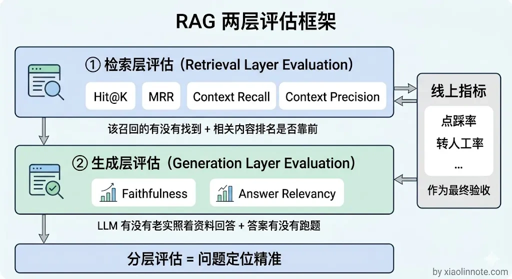
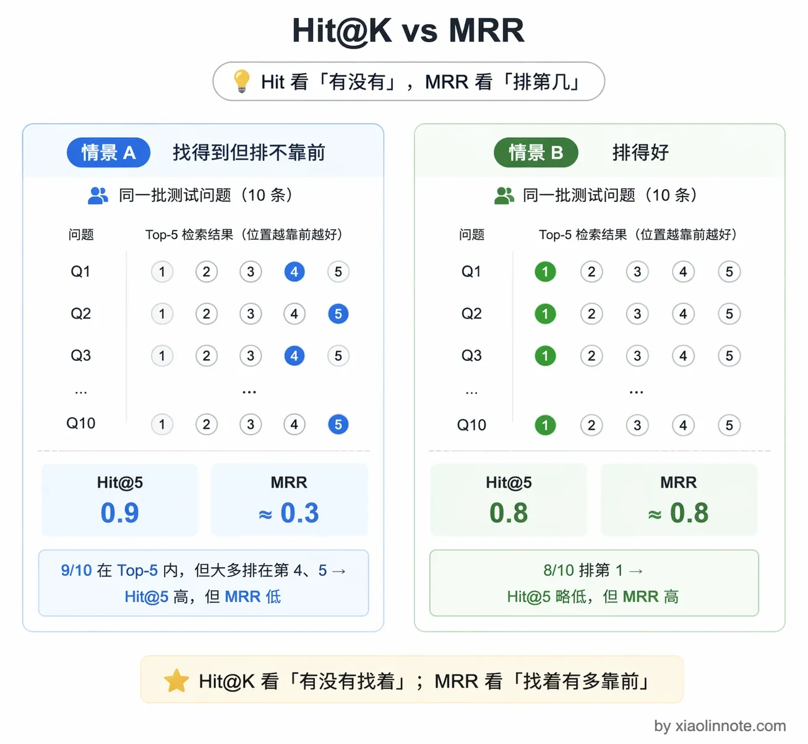
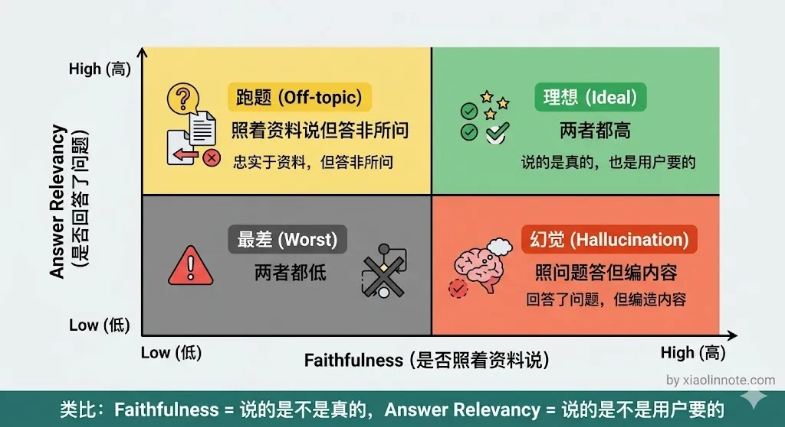
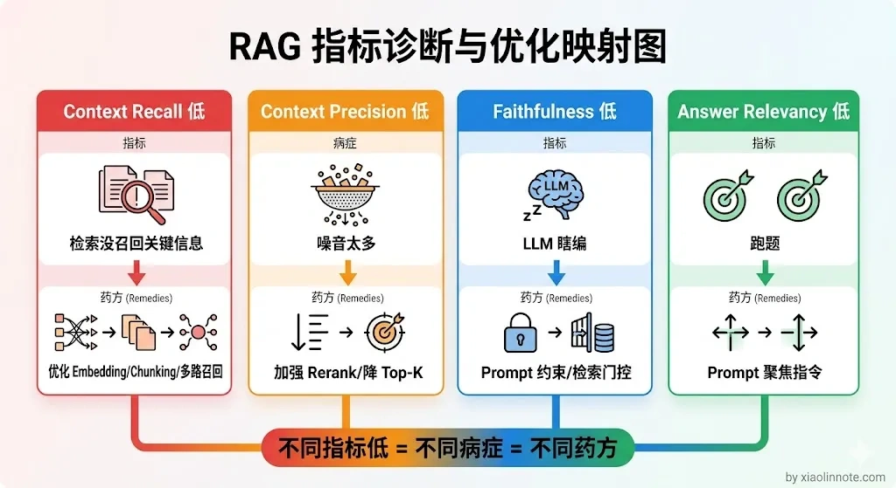
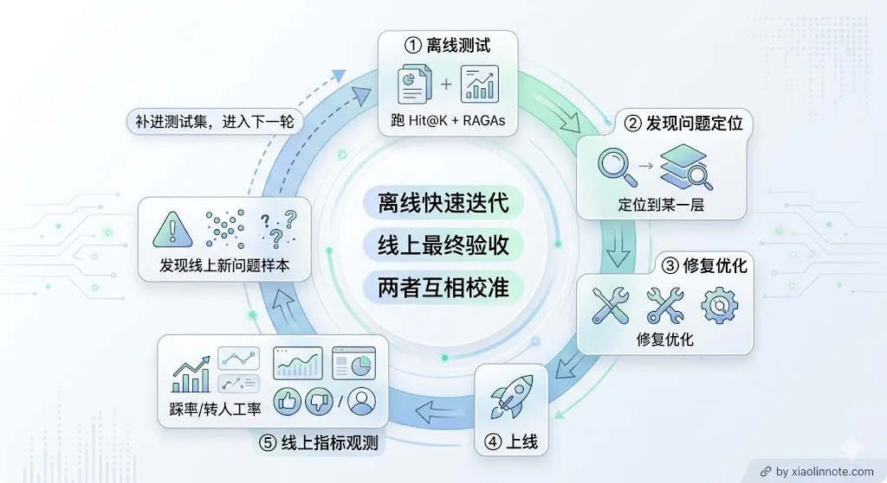

# 怎么量化你的 RAG 效果？

> 原文：[怎么量化你的 RAG 效果？](https://xiaolinnote.com/ai/rag/18_evaluation.html) · 小林面试笔记

👔面试官：你们线上跑了 RAG，那你怎么衡量它的效果好不好？

🙋‍♂️我：我主要看用户反馈，有人投诉就说明效果不好，没人投诉就还行。

👔面试官：靠用户投诉来评估？那你等到用户投诉的时候，已经有多少人被错误答案坑过了？你这叫亡羊补牢，不叫效果评估。再说，用户不投诉不代表效果好，可能人家直接就不用了。

🙋‍♂️我：那我可以抽查几十条问答，人工看看质量怎么样。

👔面试官：几十条样本能代表什么？而且人工抽查主观性太强，不同人标准不一样，你换个人来评估结论可能完全不同。我问的是你怎么系统性地、可量化地评估 RAG 的效果，能定位到具体哪个环节出了问题。

咱们还是来看一下怎么用指标体系来量化 RAG 效果。

## 💡 简要回答

我评估 RAG 效果至少分检索/证据层、生成层和线上业务层来看，并补充安全、延迟与成本。

检索层看必要证据是否出现、排名和权限是否正确，可用 Hit@K、Recall@K、MRR/nDCG 等；生成层分别测引用支持/忠实度、事实正确性、答案相关性、完整性和拒答；可以参考 Ragas 等框架，但指标定义和版本要核对，不能把单个自动分数当作真值。

我的建议是一定要在自己的业务数据上跑，不能只看通用排行榜，那个不能代表你的场景。

线上指标如点踩率、追问率、转人工率能补充真实体验，但受用户选择偏差、流量变化和产品交互影响；离线指标用于可控回归，线上指标用于真实验收，两者都不能单独代表全部质量。

## 📝 详细解析

### 什么是 RAG 评估？

RAG 评估，就是用一套可量化的指标体系，持续测量 RAG 系统「回答得好不好」，并且能把「好不好」这个笼统的感受，拆解成具体是哪个环节出了问题。

你可能会问，为什么非得强调「持续」？

因为 RAG 系统不是搭完就一劳永逸的。知识库在更新，用户的提问方式在变化，Embedding 模型可能要换，Chunking 策略可能要调，每一次改动都可能让效果变好或者变坏。没有评估体系，你就是在盲飞，不知道自己的优化到底有没有用，甚至不知道改完之后系统是变好了还是变差了。

### 为什么需要 RAG 评估？

很多团队早期不做系统性评估，靠「人工抽查几条觉得还行」就上线了。

这种方式的问题很明显。

首先，靠感觉调优没有方向。改了 Chunking 策略、换了 Embedding 模型，系统效果有没有提升？抽查几条根本说明不了问题，样本太少，结论不可靠。

其次，出了问题不知道该查哪里。用户反馈「AI 回答错了」，你不知道是检索没召回到正确内容，还是召回了但 LLM 编造了额外信息，还是 Prompt 设计有问题。没有分层指标，排查就靠猜。

再者，优化后无法验证收益。你花了时间调优，但到底优了多少？没有数字说话，技术决策缺乏说服力，也无法判断下一步该在哪里继续投入。

RAG 评估的本质，是把「这套系统好不好用」这个主观感受，转化成一组可以追踪、可以对比、可以指导决策的客观数字。

### 为什么 RAG 评估很难

说完为什么需要，你可能会想：评估嘛，不就是对答案吗，有什么难的？事实上，RAG 评估比想象中难做得多。

普通分类任务评估很简单，有标准答案对比就行。RAG 的评估难在几个地方：答案是自然语言，没有唯一标准答案；出了问题不知道是检索层的锅还是生成层的锅；人工标注成本高，难以大规模持续做。

正确的做法是把评估拆成两层，分别衡量检索质量和生成质量，定位问题更精准。先看检索层。

### 第一层：检索层评估

不管 LLM 生成什么，先单独评估检索有没有把正确的 chunk 召回来。需要准备一批「问题 + 对应的正确 chunk ID」的测评数据（可以从历史问答里标注，也可以让领域专家整理）。

这一层主要有两个指标。

**Hit@K** 的直觉是：我把 Top-K 的检索结果摆在你面前，你要找的那个在里面吗？如果在，这次就算命中（Hit）。Hit@5 就是说，把前 5 个结果给你，能不能命中，最终统计命中率。

这个指标回答的是“找到没”，不关心排名位置。是否达标取决于业务风险、K、问题分布和标注质量，不能用 0.7/0.8 这样的通用阈值判断检索层是否 OK；应与基线、切片和端到端结果一起看。

**MRR**（Mean Reciprocal Rank，平均倒数排名）更进一步，关心的是「你要找的东西排在第几名」。计算公式是对每个问题取第一个相关结果的倒数，再求平均；如果一个问题有多个必要证据，还应使用 Recall@K、nDCG 或集合指标。MRR 低只能说明相关结果整体排名靠后，原因可能是召回、融合、Rerank、重复 chunk 或标注定义，不能直接归因于 Rerank，更不能用固定阈值判定。

很多人容易混淆这两个指标，觉得差不多。简单来说：**Hit@K 是「找到没」，MRR 是「多快找到的」**。Hit@5 等于 0.9，说明 90% 的问题都能在前 5 个结果里找到相关内容；但 MRR 只有 0.3，说明相关内容虽然找到了，但排得很靠后，可能第 4、第 5 才出现。配合起来用能精确定位检索层的问题出在哪一步。

### 第二层：生成层评估（RAGAs 框架）

检索层评估回答了「找没找到」的问题，但找到之后 LLM 有没有利用证据、答案是否正确和是否相关，还需要生成层评估。Ragas 等框架提供了基于模型评审的指标，但具体指标、输入和版本会变化；LLM-as-a-Judge 可能受评审模型、提示、语言、位置偏差和参考答案质量影响，不能替代人工金标准。

常见指标包括 Faithfulness、Answer Relevancy、Context Recall 和 Context Precision；使用前应核对版本定义、是否需要 reference、是否使用 LLM 评审，以及分数能否跨实验比较。

**Faithfulness（忠实度）**：答案声明是否能被提供的上下文支持。它更接近“基于给定证据的支持度”，不等于外部世界的事实正确性，也不等于引用真的完整；应结合人工/规则蕴含检查。不要预设跨数据集统一的 `>0.8` 目标。

**Answer Relevancy（答案相关性）**：答案有没有回答用户问的那个问题？注意这个指标和 Faithfulness 是两回事，很多人会把它们搞混。Faithfulness 是问「说的是不是真的」，Answer Relevancy 是问「说的是不是用户想要的」。一个答案可以字字有据、但完全跑题，Faithfulness 高、Answer Relevancy 低。

打个比方，你问「北京天气怎么样」，AI 回答了一篇关于北京历史的资料，内容可能忠实于资料但没有回答问题，这说明支持度和相关性是不同维度。相关性目标也应由业务基线、人工一致性和风险要求设定，而不是统一阈值。

**Context Recall（上下文召回率）**：参考答案或人工标注所需的信息，有多少被检索上下文覆盖。它依赖 reference/标注定义；如果问题有多个证据片段，应明确“覆盖”粒度。不要预设统一的 `>0.7` 阈值。

**Context Precision（上下文精确率）**：衡量检索上下文中相关内容的比例及其排名位置。它通常需要相关性标注或 reference，定义可能因框架版本而不同。Context Recall 关注“必要信息是否覆盖”，Context Precision 关注“噪音是否少且相关内容是否靠前”，两者要与权限、版本和引用支持率一起看。

需要注意的是，自动评审会带来模型调用成本、随机性和评审偏差。可采用分层抽样、固定评审提示/版本、重复抽样、人工校准集、规则指标和人工一致性报告；样本量由置信区间、流量切片和变更风险决定，不应固定为 200～500 条，也不要预设某个模型能便宜十倍且精度可接受。

### 通过指标定位问题

有了这些指标，怎么用它们来定位问题？不同指标低说明不同的问题，指导优化方向。

Context Recall 低，通常说明检索上下文缺少答好问题所需的信息，但也要检查 reference/标注、过滤、版本和查询改写。可从切分、Embedding、词法/向量多路、Query、权限过滤和数据更新链路排查。

Context Precision 低，说明上下文中噪音较多或相关内容排名靠后；可检查去重、过滤、融合、Rerank、父子块和上下文预算，但降低 chunk 数量可能同时损失 Recall，必须做曲线评测。

Faithfulness 低，说明答案声明与给定上下文的支持关系较弱，可能是检索缺失、冲突、上下文组织、生成越界或评审偏差；可分别检查证据覆盖、声明拆分、引用核查和拒答策略。

Answer Relevancy 低，说明答案没有充分回应问题；原因可能是 Query、证据、Prompt、模型或产品交互，不应只归因于 Prompt，应结合人工样例定位。

### 线上指标：最终衡量标准

上面说的都是离线指标，但离线指标再好，最终还是要看线上用户的反应。毕竟离线跑得再漂亮，用户不满意也是白搭。

几个实用的线上指标，每一个都能反映 RAG 系统的某个方面。

踩率（thumbs_down_rate）是最直接的信号，用户主动点踩，说明这次回答让他不满意，是最真实的负反馈。

追问率（followup_rate）反映的是「答非所问」的程度，用户紧接着说「你没回答我的问题」或者追问同一个问题，通常意味着上一次回答没用。

转人工率（escalation_rate）衡量的是「RAG 放弃回答」的频率，这个比例太高说明知识库覆盖不足；但如果这个比例因为加了质量门控而上升，不一定是坏事，宁可转人工也不要给用户错误答案。

空回答率（answer_empty_rate）就是系统主动说「我不知道」的比例，过高说明知识库亟需扩充。

会话解决率（session_resolution_rate）是最综合的指标，衡量「一次对话能不能解决用户的问题」，是最贴近用户体验的衡量维度。

离线评估（召回、引用支持、事实/相关性、拒答、安全）用来回归和定位问题，线上指标（反馈、转人工、解决率）用来观察真实体验。两者结合，形成「离线测评 -> 灰度 -> 线上观测 -> 采样复现 -> 修复 -> 再上线」的闭环，并保留延迟、成本、错误率和权限事件。

这里还要提醒一点：离线指标好不代表线上一定好，反过来也一样。常见的情况是离线测试集不能完整代表真实用户分布，或者离线指标优化过头反而损害了线上体验（比如为了 Faithfulness 把 Prompt 收得太死，结果模型回答过于保守、用户觉得不好用）。所以两者要定期交叉对照，发现偏差时往往是测试集需要更新或者指标权重需要调整。

把几个核心指标和它们的含义整理成表，方便对照排查：

| 指标 | 属于哪层 | 衡量什么 | 低了说明什么 |
| --- | --- | --- | --- |
| Hit@K | 检索层 | 必要证据是否被召回 | 切分、Embedding、Query、过滤或数据覆盖需排查 |
| MRR | 检索层 | 第一个相关结果的排名 | 召回、融合、Rerank、重复或标注需排查 |
| Context Recall | 证据/检索层 | 必要信息是否被上下文覆盖 | 召回、切分、过滤或标注需排查 |
| Context Precision | 证据/检索层 | 相关证据是否靠前、噪音是否可控 | 融合、去重、Rerank 或候选过宽 |
| Faithfulness | 生成/证据支持 | 声明是否得到上下文支持 | 证据缺失、冲突、生成越界或评审偏差 |
| Answer Relevancy | 生成层 | 是否回应用户意图 | Query、证据、Prompt 或模型需排查 |
| 踩率 / 转人工率 | 线上 | 用户实际满意度 | 整体系统效果，综合反映 |

## 🎯 面试总结

回到开头的问题，RAG 效果评估不能靠「用户投诉」或「人工抽查」这种事后手段，而是要建立一套分层的量化指标体系。

检索/证据层用 Hit@K、Recall@K、MRR/nDCG 和引用覆盖衡量，生成层分别看支持度、事实正确性、答案相关性、完整性与拒答，线上再结合反馈、解决率、转人工、延迟、成本和安全事件验收。自动评审必须与人工校准和分桶回归结合。

通过不同指标的组合，可以精确定位问题是出在检索层还是生成层，让优化有方向、有数据支撑，而不是凭感觉瞎调。

---
