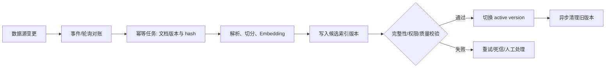

# RAG 知识库如何实现动态与持续更新？

> 原文：[RAG 知识库如何实现动态与持续更新？](https://xiaolinnote.com/ai/rag/19_dynamic_update.html) · 小林面试笔记

👔面试官：你们 RAG 知识库上线之后，文档更新了怎么办？总不能每次改个文档就把整个知识库重建一遍吧。

🙋‍♂️我：可以直接找到变了的那个 chunk，更新它的向量就行了。

👔面试官：你以为改了一段文字，chunk 的边界还能和之前一模一样？文档内容一变，切割结果可能完全不同，你根本没法把旧 chunk 和新 chunk 一一对应起来做局部更新。

🙋‍♂️我：那我把整个文档对应的所有 chunk 都删掉，然后重新入库？但是系统怎么知道哪些文档变了呢？

👔面试官：这还算靠点谱，但你怎么感知文档变更？总不能让人告诉你吧。

接下来看看 RAG 知识库动态更新的完整方案。

## 💡 简要回答

我理解知识库更新的核心挑战是让原文、chunk、Embedding、metadata、权限和检索索引保持可追溯的一致状态，同时控制处理延迟。常见做法是记录文档版本/内容 hash，通过轮询或事件感知变更，再对受影响的文档重切分、重嵌入和版本化发布；是否采用“先删后增”、稳定 chunk ID 或蓝绿切换，要由更新语义、可回滚要求和索引能力决定。消息队列能提供事件传递，但不自动保证秒级可见或端到端一致。

## 📝 详细解析

只要源文档会变化，知识库就需要明确新鲜度、版本、失效和回滚策略；更新频率低的系统可以批处理，实时性要求高的系统才需要更复杂的事件链路。否则确实可能继续返回过期或无权限内容，但更新机制应按业务 SLO 设计，而不是一律追求实时。

### 为什么更新 RAG 知识库比更新普通数据库麻烦？

在讲具体方案之前，先搞清楚一个关键问题：为什么 RAG 知识库的更新不能像普通数据库那样直接 UPDATE？原因在于，普通数据库更新一条记录，直接 UPDATE 就行，数据是独立的，改一条不影响别的。但 RAG 知识库的麻烦在于：原始文档和向量库之间不是一对一的关系，而是一对多的关系。

一篇文档会被切割成几十甚至上百个 chunk，每个 chunk 分别 Embedding 后存入向量库。当文档内容发生变化时，你不能简单地「更新一条记录」，因为文档结构变了，切割结果可能完全不同，chunk 的数量、边界、内容都会变。

因此更新策略要先定义一致性目标。若 chunk 边界可能变化，可以按文档范围重切分；若切分稳定，也可以用稳定 ID 对未变化 chunk 去重、只更新受影响部分。直接“先删后增”实现简单，但会产生短暂空窗、并发查询读到混合版本或删除失败残留；生产上更安全的做法通常是写入新版本、校验完成后原子切换版本，再异步清理旧版本。

抽象来看，知识库的变更只有三种操作类型。新增是最简单的，文档以前不存在，走一遍完整的「切割 -> Embedding -> 写入」流程就行，没有任何历史包袱。

修改是最容易踩坑的操作，值得多说几句。很多同学第一次做这个功能，直觉上认为「只改了一段文字，更新那一个 chunk 就好了」，这个思路在实际中行不通。

原因是文档内容变化可能改变边界，旧 chunk 与新 chunk 不一定一一对应；但可以用文档版本、稳定锚点、内容 hash 或差异算法减少重算范围。若无法可靠映射，就对该文档全量重切分；关键是让发布、回滚和删除具备幂等性。

删除要同时处理原文、chunk、向量、metadata、缓存、倒排/图索引和版本状态。可以先标记下线并让查询过滤，再异步物理删除；否则删除失败或缓存未失效时可能出现“僵尸 chunk”。

### 如何知道文档是否发生了变化？

搞清楚了更新策略是「先删后增」，下一个绕不开的工程问题就是：系统怎么知道一篇文档「变没变」？

常见方案是**内容 hash**。每次文档入库时，按明确的规范化规则计算 SHA256 等摘要，把 hash 与文档 ID、版本、解析器/Embedding/Chunking 配置和 chunk 关联关系一起存下来。下次检测到文档时重新计算并比较；相同只能说明输入字节/规范化结果相同，不代表权限、解析器或外部 metadata 没变，因此这些依赖也应进入变更判断。

hash 通常比重新解析和嵌入便宜，但仍要按文件大小、扫描频率和存储 I/O 测量。内容 hash 能发现输入变化，不会自动发现解析器、权限、外部链接或索引状态变化。

可以先用“最后修改时间、ETag 或数据源版本”做粗筛，再对候选计算 hash；但时间戳可能不可靠或被回填，不能把过滤比例写成固定 99%，必要时要周期性全量校验。

### 文档 ID 和 chunk ID 的设计

有了变更检测的方案，还有一个容易被忽视但非常关键的设计问题：**chunk ID 的命名规范**。这个东西一开始不设计好，后面做更新的时候会非常痛苦。

为什么？因为删除一篇文档的所有 chunk 时，你需要能快速找出「这篇文档对应了哪些 chunk」。

常见的做法是让 chunk ID 带上文档 ID 作为前缀，比如 `product_manual_v3_chunk_001`、`product_manual_v3_chunk_002`，这样按前缀就能批量查找和删除对应的所有 chunk。

另一种做法是在每个 chunk 的 metadata 里存上文档 ID 字段（比如 `source_doc_id: "product_manual_v3"`），向量库一般都支持按 metadata 字段过滤批量删除，效果是一样的。无论选哪种方式，关键是**从一开始就把文档和 chunk 的关联关系设计好**，等到需要更新时再临时想办法，会很狼狈。

### 两种主流的变更感知方式

前面说了怎么检测变更和怎么处理变更，系统还要选择变更感知方式。轮询与事件驱动是常见选项，也可以组合使用，互相补偿丢失事件。

**第一种是定时轮询（Polling）**。系统按时间窗口扫描数据源或增量列表，比较版本/时间戳/hash 并重处理变化文档。它实现简单、可作为事件丢失后的补偿，缺点是有发现延迟和扫描成本；周期应由数据量、变更率与新鲜度 SLO 决定，不必固定为每天或每小时。

**第二种是事件驱动（Event-Driven）**。数据源变更时发出带文档 ID、版本和幂等键的事件（例如消息队列或 Webhook），更新服务订阅并处理。它可能降低发现延迟，但端到端可见时间还取决于排队、解析、Embedding、索引构建和版本切换；必须处理重复、乱序、丢失、重试和死信。代价是系统架构与运维更复杂。

某些内容管理工具提供 Webhook，但支持范围、事件语义和可靠性随产品/版本/权限而异；接入前要核对官方能力，并保留轮询或对账补偿，不要把 Webhook 当成不丢事件的事实。

### 全量重建是最后的手段

除了增量更新，还有全量重建：把所有文档按新配置重新切割、Embedding 并写入新索引。它适合规模可控或 Embedding/Chunking 发生不兼容变化的场景，也可以通过蓝绿索引避免线上空窗。

它的优点是逻辑清晰、能统一切换配置，缺点是计算/存储成本、构建时间和双份容量压力；切换前要做完整性、权限、召回和答案回归，切换失败要能回滚。

全量重建常用于规模可控、解析/Embedding/Chunking 配置重大变化或需要修复索引状态的场景；是否必须全量取决于是否能并行维护新旧索引和是否有稳定的迁移映射，不能只按“几十篇/几分钟”判断。

### 灰度更新：稳妥地切换新版本

对于核心的生产知识库，直接删旧数据、写新数据风险还是太大了。万一新切割的内容有问题，想回滚都来不及。那怎么办？更稳妥的做法是**不直接删旧数据，而是先并行写入新版本，验证没问题再切换**。

具体操作是：把新版本的 chunk 写入时打上 `version=new` 的标签，旧版本保留 `version=old`。在验证阶段，用一批测试问题同时跑新旧两个版本，对比答案质量，确认新版本没有引入退化。验证通过后，把检索时的版本过滤条件从 `old` 切换到 `new`，最后再清理掉旧版本的 chunk。

这个方案类似蓝绿发布：新版本写入、完整性/权限/质量验证通过后切换一个受控的 active version，失败时回滚到旧版本。切换耗时和原子性取决于索引/路由实现，不能承诺秒级；高风险领域还需要审批和审计。

关键不只是“写入新向量”，而是把可见版本、权限、缓存失效、回滚和清理状态作为同一个可观测发布流程。

把几种更新方案的特点做个对比，实际选型时可以对照着看：

| 方案 | 延迟 | 实现复杂度 | 适用场景 |
| --- | --- | --- | --- |
| 定时轮询/对账 | 由周期和处理链路决定 | 低到中 | 变更频率低，或作为事件补偿 |
| Webhook/事件触发 | 由队列、解析、嵌入和索引可见性决定 | 中 | 数据源提供可靠事件且需要较低发现延迟 |
| 消息队列 | 由队列积压与消费者吞吐决定 | 中到高 | 需要重试、削峰、幂等和高并发处理 |
| 新版本全量构建 | 由文档规模与模型/索引构建决定 | 中到高 | 配置重大变化、迁移或需要蓝绿切换 |

总结一下：可用“事件驱动 + hash/版本对账 + 幂等重处理 + 新版本切换”作为候选方案，再按一致性、延迟、成本和回滚要求取舍。更新任务要有状态机、重试/死信、权限继承、索引可见性和审计记录；不要把“永远先删后增”当成唯一可靠做法。

---

## 🎯 面试总结

回到开头对话的问题，不能假设“只更新一个 chunk”总是安全：文档变化可能影响后续边界，但在稳定切分或有可靠映射时可以局部更新；无法映射时应以文档范围重切分。

可以给文档记录规范化内容 hash、解析/Embedding/Chunking 版本和 chunk 关联；变更后重处理并在新版本验证通过后切换，保留回滚与异步清理。低频场景轮询可能足够，高频场景可使用事件驱动，但要用真实链路测量可见延迟，处理重复/乱序/丢失事件，并设计可查询的文档—chunk—版本关系。

---
