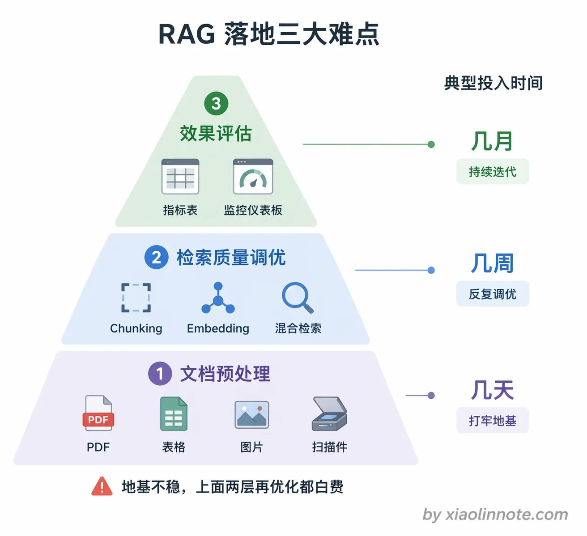
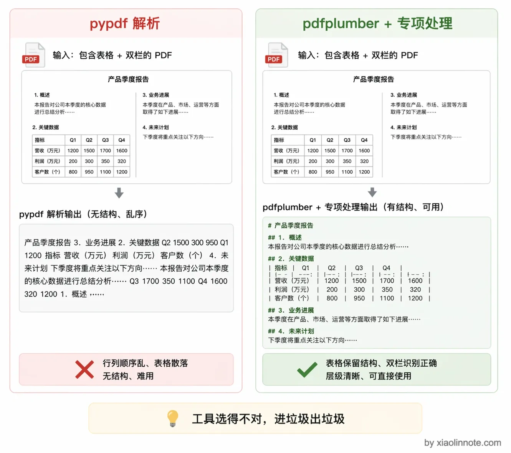
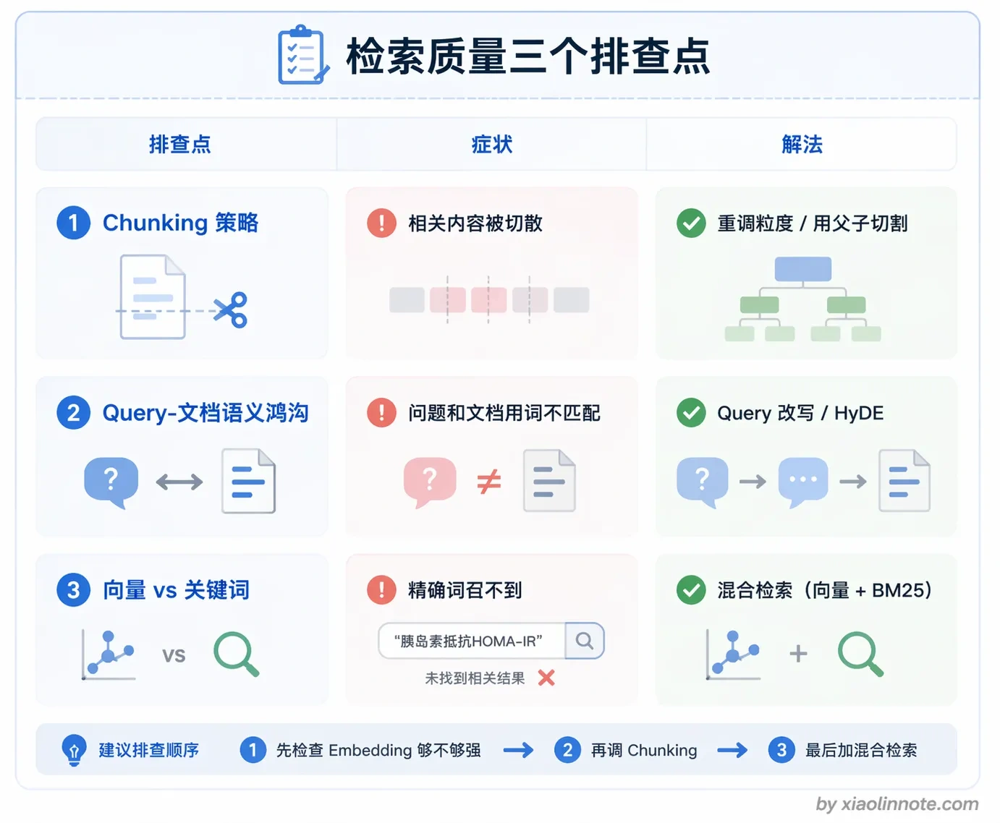
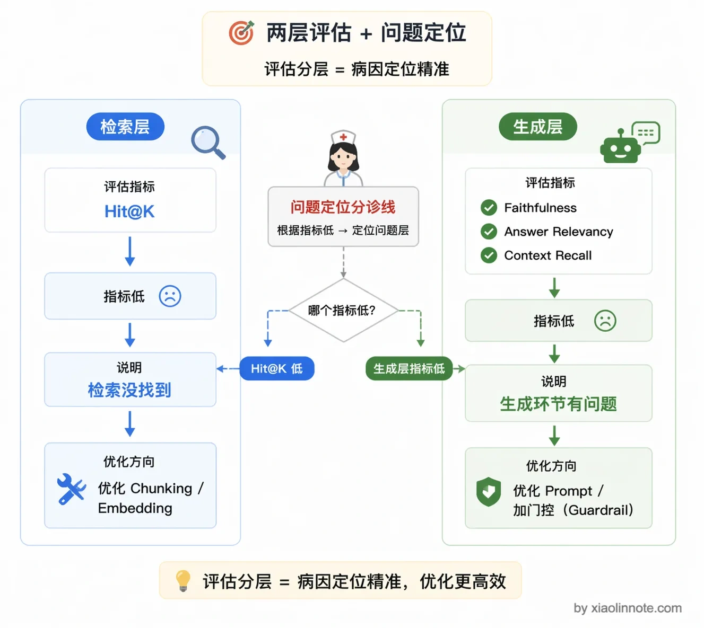
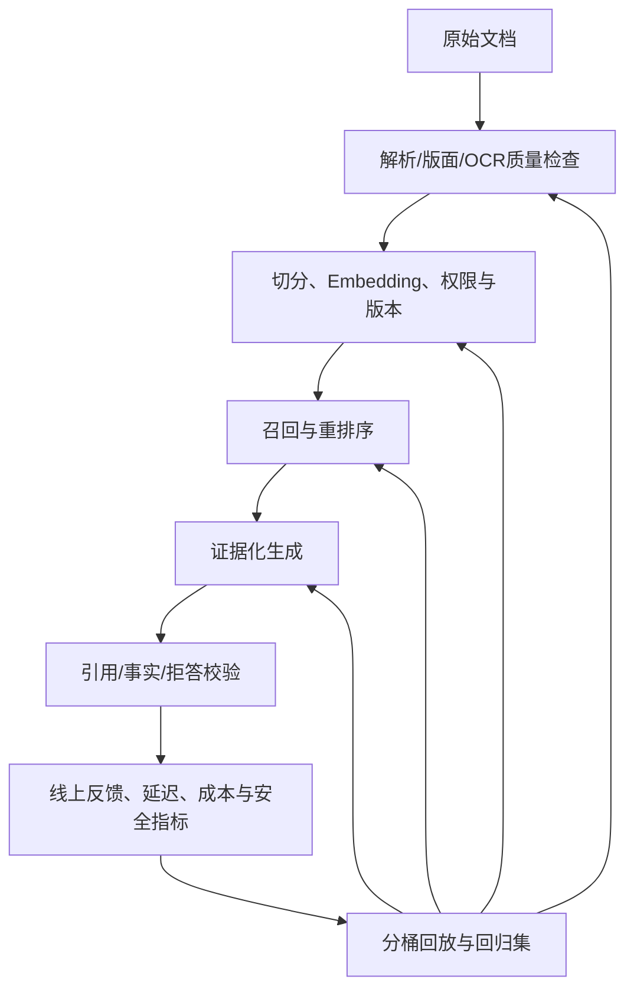
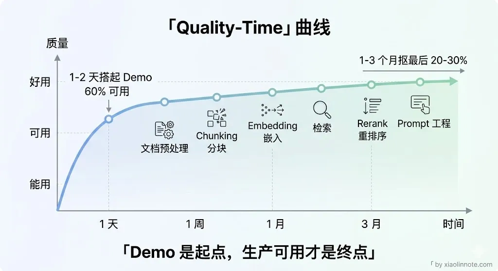

# 在实际落地中，你觉得 RAG 最难的地方是哪里？

> 原文：[在实际落地中，你觉得 RAG 最难的地方是哪里？](https://xiaolinnote.com/ai/rag/20_hardest_parts.html) · 小林面试笔记

👔面试官：RAG 你也做了一段时间了，你觉得实际落地中最难的地方在哪？

🙋‍♂️我：我觉得最难的是 Embedding 模型的选型，模型不好向量就不准，后面效果肯定差。

👔面试官：Embedding 选型确实重要，但你说的是其中一个点，我问的是整体上最难的地方。而且你只说了模型，那文档解析乱码、chunk 切割不合理、效果没法评估这些问题呢？

🙋‍♂️我：对对，还有 chunk 切割也很头疼，切大了检索不准，切小了上下文丢了。

👔面试官：你这东一榔头西一棒槌的，说了半天也没个体系。我问的是你怎么系统地看待 RAG 落地的难点，能不能把它分层说清楚。

让我们来系统地梳理一下 RAG 落地过程中最难啃的几块骨头。

## 💡 简要回答

我觉得 RAG 最难的不是把单条链路跑起来，而是让它在真实数据、权限、更新、延迟、成本和风险约束下稳定工作。工程上最头疼的有几块，且需要通过可回放数据和监控逐层定位。

第一是文档预处理，原始数据格式复杂，PDF 表格、图片、扫描件和嵌套版式如果解析错误，后续检索会失去证据结构。

第二是检索质量调优，召回覆盖是重要瓶颈之一，但问题来源很多：解析、Chunking、Embedding、Query、词法/向量融合、过滤、版本和 Rerank 都可能出错，排查需要分层指标。

第三是效果评估与运营闭环，答案正确性、引用支持、拒答、延迟、成本和用户满意度需要一起衡量，否则优化容易变成猜测。

## 📝 详细解析

### 第一难：文档预处理

RAG 系统的效果受多个环节影响，文档预处理是最前面的一环；若内容顺序、表格关系、标题层级或来源丢失，后续 Chunking、Embedding、检索和生成都可能受影响。它不是唯一瓶颈，但需要作为数据质量、可追溯性和版本化工程来建设。

你可能会想，文档预处理不就是读文件吗？有什么难的？难就难在现实世界的文档格式五花八门，远比想象中复杂。

最常见的问题是 PDF 解析。pypdf 等库通常提供文本/页面级操作，但对复杂表格、双栏、扫描件和阅读顺序的处理能力取决于文件与实现；pdfplumber、unstructured、OCR 或版面/视觉模型可以作为候选管线，但没有一个工具对所有 PDF 都可靠。应对代表性文档做解析回归，并保留人工抽检。

举个具体例子，一个产品规格表的 PDF，原本是整齐的三列：型号、内存、价格，每行一个产品；被 pypdf 解析出来之后，可能变成一串没有分隔的乱码文字「型号内存价格iPhone 158GB5999」，行列关系全没了。

这样的内容存进向量库会丢失结构和证据关系，Embedding 再好也无法恢复丢失的表格语义；应在入库前做结构化质量检查和失败隔离。

处理方案可以是：对文本型 PDF 做文本/布局提取，对表格做结构化抽取，对扫描件走 OCR，对图片和复杂版面按需使用视觉模型，并将页码/区域与原文关联。视觉模型的价格、输入限制、延迟和准确率随供应商与版本变化，不能用固定几十或上百倍概括；应按文档价值、批处理成本、隐私/合规和可审计性做路由。

除了 PDF，还有扫描版文档（需要 OCR）、包含大量图片的文档（图片里的关键信息文本提取不到）、代码文档（代码块切割不当会破坏逻辑完整性）。生产系统还要建设解析失败队列、质量分数、版本化重跑、PII 脱敏、权限继承和人工复核。

### 第二难：检索质量调优

文档预处理提高了输入质量，但检索仍是关键瓶颈之一：必要证据没进入上下文时，生成器很难恢复；即使召回正确证据，也可能因冲突、上下文过长或生成越界而失败。检索质量差的原因可能来自多个环节，定位要依赖分层指标。

Chunking 策略是第一个排查点。chunk 切得不好，用户问的问题和知识库里的相关内容语义对不上。比如用户问「退款流程是什么」，但知识库里的文档是按产品分类组织的，退款相关的内容被切散在十几个不同的 chunk 里，每个 chunk 单独来看相关度都不高，导致召回的都是些边缘内容。

Query 与文档的表达差异是第二个排查点，但不能预设改写一定有效。应检查指代、实体、版本、时间、否定、权限和分析器；可比较 Query 改写、词法别名、假设性问题索引与保留原 Query 的多路方案。

还有一个容易忽视的问题是精确实体与词法信号。产品型号「Pro Max 256GB」、专有名词和缩写可能需要 BM25/倒排检索补充；混合检索可以作为候选方案，但质量、过滤、延迟、成本和权限都要与单路基线比较，不能预设一定更好。

### 第三难：效果评估困难

检索质量调优费劲，但更让人头疼的是：你怎么知道调完之后变好了还是变差了？RAG 系统上线之后，你怎么知道它好不好？这个问题比看起来难得多。

单条答案的对错人工判断成本高，而且不同人的标准不一样。端到端的指标（用户满意度、解决率）反馈周期太长，出了问题不知道是 Chunking 的锅还是检索的锅还是 LLM 生成的锅。

工程上比较实用的做法是把评估拆成两层。

难点不是某个模型名称，而是能否把“数据质量—检索覆盖—证据支持—线上结果”连成可回放、可解释、可回滚的闭环。

第一层是检索/证据层评估，不管 LLM 的输出，先看必要证据有没有被召回、是否有权限、是否为正确版本。可用 Hit@K/Recall@K、MRR/nDCG 和实体/时间约束命中率；例如 Hit@5 = 0.8 只是某个数据集上的示例，不能脱离问题分布和标注定义比较。

第二层是端到端评估，可以使用 Ragas 等框架的自动评审，再用人工标注校准。常见维度包括：

- Faithfulness（忠实度）衡量答案声明是否得到给定上下文支持；高分不等于外部事实正确，也不等于来源本身无误。
- Answer Relevancy（答案相关性）看答案和问题是否对应，防止模型「答非所问」。
- Context Recall（上下文召回率）看检索上下文是否覆盖参考答案/人工标注所需信息；它的定义依赖 reference 和评测版本，低分时要排查检索、切分、过滤、更新和标注。

三个指标只能提供定位线索，还要检查引用支持、事实正确性、拒答、安全、延迟、成本和人工一致性，不能仅凭自动分数断言根因。

总结来看，RAG 的原型与生产化之间差距主要在数据治理、权限/版本、评估、可观测性、回滚和成本 SLO。生产化周期取决于数据规模、风险和团队，不应给出“一两天/几周几个月”的通用估计；各环节相互影响，需要基线、灰度和持续回归。

## 🎯 面试总结

回到面试官的问题，RAG 落地最难的不是单点技术选型，而是整个链路上每个环节都可能成为瓶颈，而且环环相扣。

系统来说有三大难点。第一是文档预处理，PDF 表格、扫描件、复杂排版解析不好，进去的是垃圾出来的也是垃圾。

第二是检索质量调优，Chunking 策略、语义鸿沟、精确词召回这三个问题交织在一起，排查起来非常费劲。

第三是效果评估，没有量化指标体系就不知道该优化哪里，优化变成了瞎猜。

面试中回答这类问题，关键是要能分层、有体系地说明难点在哪，而不是东一榔头西一棒槌地罗列问题。

---
