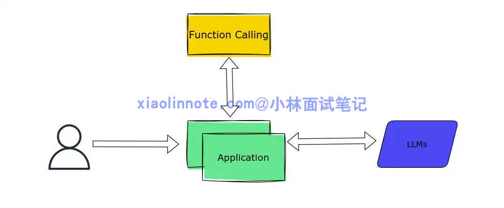
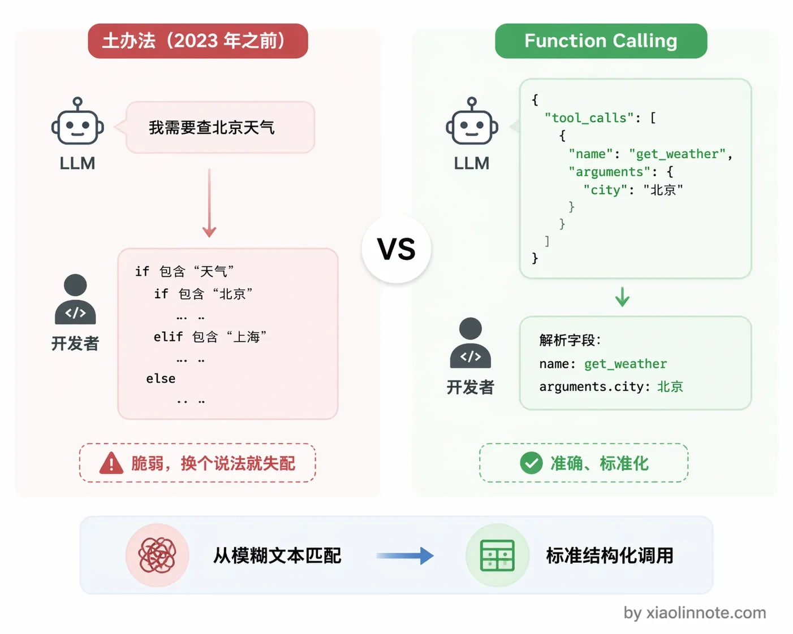
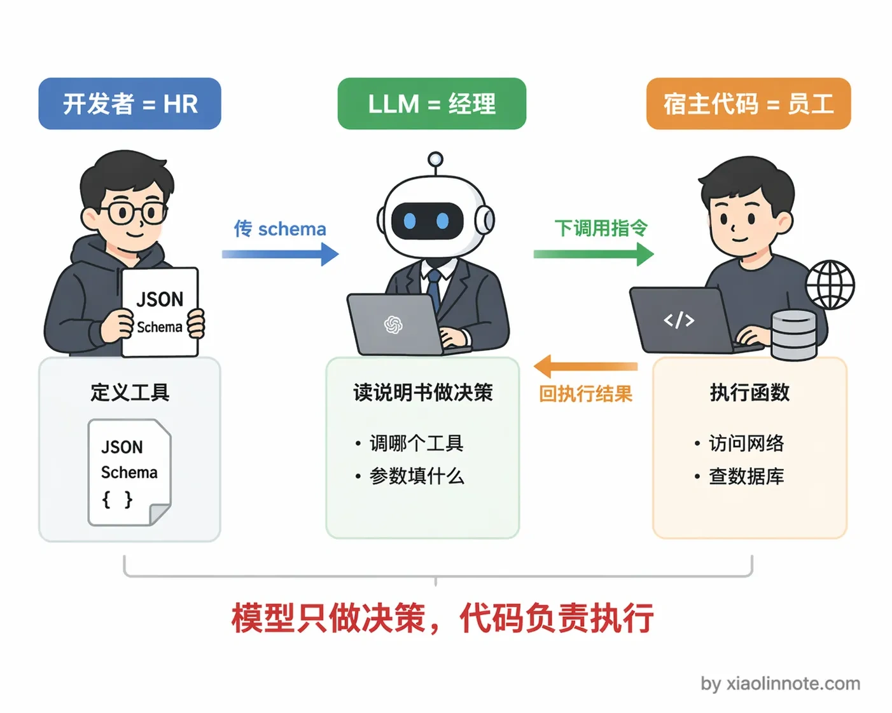
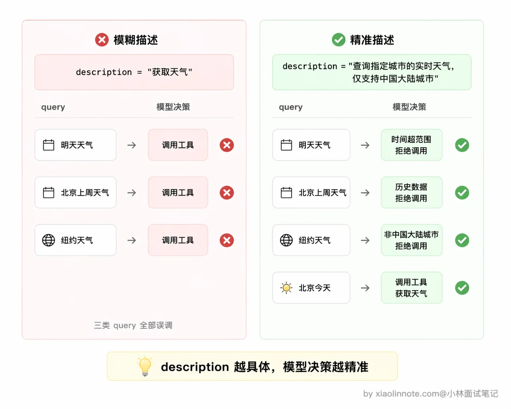
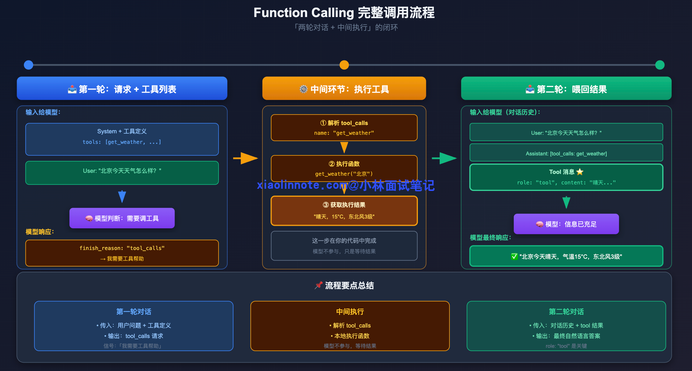
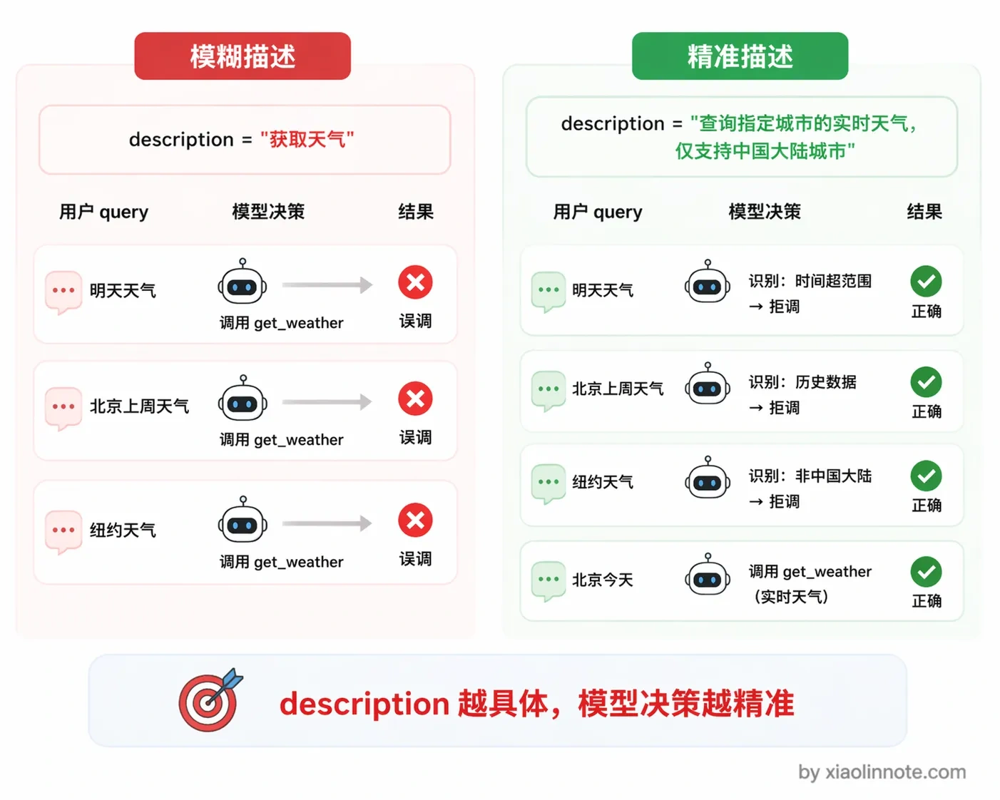
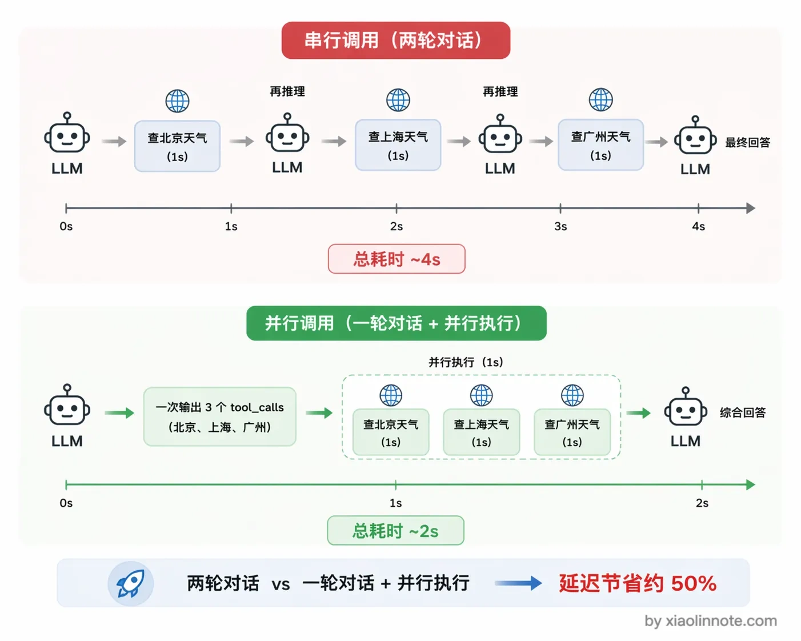
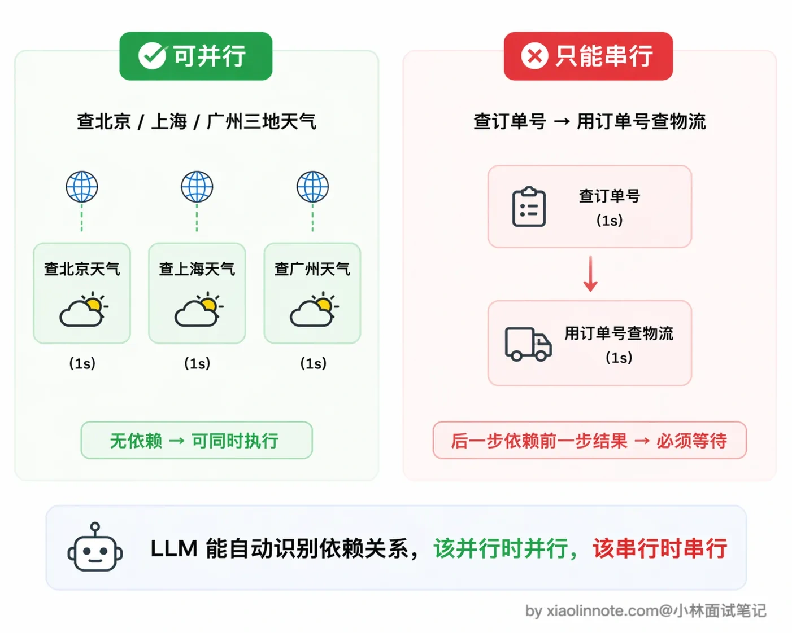
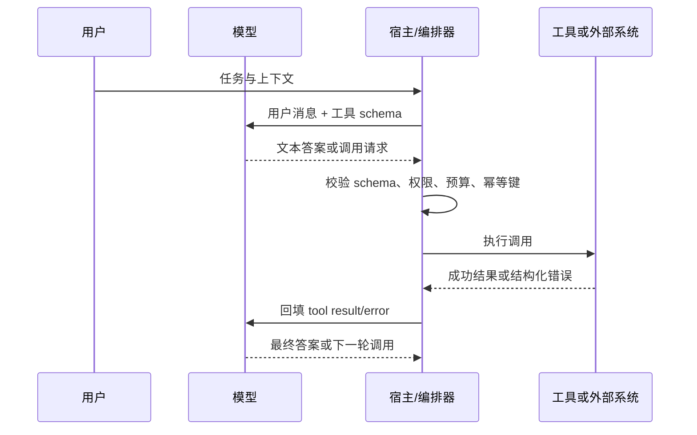

# 什么是 Function Calling ？原理是什么？

> 原文：[什么是 Function Calling ？原理是什么？](https://xiaolinnote.com/ai/tools/1_function_calling.html) · 小林面试笔记


👔面试官：来聊聊 Function Calling 吧，说说它是什么、原理是怎样的？

🙋‍♂️我：Function Calling 就是让大模型直接调用 API 嘛，模型自己去访问网络、查数据库，然后把结果返回给用户。

👔面试官：模型「自己」去访问网络？你确定？模型有直接执行代码的能力吗？它能联网吗？

🙋‍♂️我：呃……那应该是模型输出一段调用指令，然后……后端代码去执行？但我记得好像模型输出的就是自然语言，开发者自己解析文本去调用的吧？

👔面试官：你说的那是 Function Calling 出现之前的土办法，靠 if/else 解析自然语言，极其脆弱。Function Calling 的核心就是模型输出结构化的 JSON，而不是自然语言。你连「模型只负责决策、代码负责执行」这个最基本的分工都没搞清楚，工具定义的 schema 怎么写、两轮对话的流程是什么、并行调用怎么做，这些都回去好好看看吧。

好，这段面试踩的雷还挺典型的，很多人一上来就把「模型决策」和「代码执行」搞混了。下面我把 Function Calling 的完整机制拆开讲清楚。

## 💡 简要回答

Function Calling 我的理解是这样一套机制：开发者用 JSON schema 把工具描述好传给模型，模型判断需要调工具的时候不输出自然语言，而是直接输出一段结构化的 tool_calls JSON，告诉你「我要调哪个函数、参数是什么」，你的代码拿到这段 JSON 去真正执行，把结果塞回对话，模型再生成最终答案。

最小流程通常是「一次模型请求 + 一次工具执行 + 一次后续模型请求」，但真实系统不应把它硬编码成两轮：模型可能一次返回多个调用，也可能在拿到结果后继续调用其他工具，直到满足停止条件或触发预算/权限限制。

我觉得最核心的设计是，模型全程只做决策，执行的事情一律由宿主代码完成，职责分得很清楚。

## 📝 详细解析

### 背景，Function Calling 解决了什么问题

LLM 在没有 Function Calling 之前，想让模型帮你调工具，完全靠解析自然语言。模型输出「我需要查一下北京的天气」，你再写 if/else 判断它「说」的是要查天气，然后手动去调 API。这个做法极其脆弱，模型换个说法，你的 if/else 就失配了，也根本没办法标准化。



Function Calling（也常被厂商称为 tool use / tool calling）把这件事变成了结构化消息：模型返回工具名、参数和调用标识，宿主程序按提供商约定的消息格式解析并执行。它在 2023 年前后被 API 厂商广泛产品化，但并不存在一套所有厂商完全相同的消息协议；字段名、终止原因、并行调用和结构化输出能力都要以具体 API 版本为准。



### 三个角色，把 Function Calling 理解成一场任务委托

理解 Function Calling 的关键是搞清楚谁做什么。可以把这套流程理解成一场「任务委托」：



开发者是 HR，负责给每个工具写「职位说明书」，就是 JSON schema，告诉模型「我们有哪些工具、每个工具能做什么、需要哪些参数」。模型是经理，读完说明书之后决定「这个任务需要调哪个工具、参数填什么」，然后把指令下达出来。你写的代码是员工，真正去跑函数、访问网络、查数据库，把结果汇报回来。

关键点：模型全程只是在「下指令」，它不亲自执行任何代码，也没有直接访问网络的权限。执行的事一律由宿主程序代码完成，这个分工要想清楚。

### 工具定义，schema 的每个字段都有含义

工具 schema 就是一份结构化的「工具说明书」，用 JSON 格式写，告诉模型这个工具叫什么、能做什么、需要哪些参数。

```python
tools = [
    {
        "type": "function",
        "function": {
            "name": "get_weather",          # 工具的唯一标识，模型输出 tool_calls 时会用这个名字
            "description": "查询指定城市的实时天气，包含气温、天气状况、风向风速，仅支持中国大陆城市",
            "parameters": {
                "type": "object",
                "properties": {
                    "city": {
                        "type": "string",
                        "description": "城市名称，如「北京」「上海」，不要带省份前缀"
                    },
                    "unit": {
                        "type": "string",
                        "enum": ["celsius", "fahrenheit"],
                        "description": "温度单位，默认用摄氏度"
                    }
                },
                "required": ["city"]
            }
        }
    }
]
```

其中最关键的字段是 `description`。这里停一下，你想一个问题：如果 description 写得含糊，模型会怎么表现？答案是它会「瞎猜」，比如你只写「获取天气」，模型可能拿到一个带英文名的城市也照样调，拿到「这周天气如何」这种时间跨度不对的问题也硬往里塞，调完之后发现返回的数据根本对不上。模型在决定「要不要调这个工具、参数怎么填」的时候，能依赖的唯一依据就是这段描述。

你可以对比一下：「获取天气」和「查询指定城市的实时天气，包含气温、天气状况、风向风速，仅支持中国大陆城市」，对模型判断准确率的影响差距是很明显的。写得越清晰，模型的选择越准确。参数的 `description` 同理，格式要求、示例值、限制条件都要写进去，模型才能正确填写参数。



### 完整的调用流程：模型决策—宿主执行—结果回填的循环

Function Calling 的运行时本质上是一个可重复的闭环：模型提出调用请求，宿主校验并执行，随后把成功或失败结果回填给模型。模型可以直接结束，也可以继续提出下一轮调用。



第一次请求把工具定义和用户问题传给模型。如果需要工具，模型会返回结构化调用请求；`finish_reason: "tool_calls"` 只是某些 Chat Completions API 的终止字段示例，不是跨厂商保证，不能只靠这个字段判断。应同时检查响应中的工具调用块，并处理拒绝调用、格式错误或普通文本回答。

拿到这个信号之后，中间环节就交给你的代码了。你的代码解析 tool_calls 拿到函数名和参数，找到对应的函数跑一下，拿到执行结果。

然后把工具执行结果按对应 API 的消息格式回填，再次调用模型。结果既可能让模型给出最终答案，也可能触发下一轮工具调用；循环必须有最大轮数、总 token/时间预算和人工确认边界。



```python
import openai, json

client = openai.OpenAI()
messages = [{"role": "user", "content": "北京今天天气怎么样？"}]

# 第一轮：把工具定义和问题一起传给模型
response = client.chat.completions.create(
    model="gpt-4o",
    messages=messages,
    tools=tools,
    tool_choice="auto"  # auto 让模型自己判断要不要调，也可以设 required 强制调
)
msg = response.choices[0].message

finish_reason = response.choices[0].finish_reason  # Chat Completions 示例；其他 API 字段可能不同
if finish_reason == "tool_calls" and msg.tool_calls:
    tool_call = msg.tool_calls[0]
    func_args = json.loads(tool_call.function.arguments)  # 仍需按 schema 做类型/范围校验

    # 中间执行：你的代码真正去跑函数
    result = f"{func_args['city']}今天晴，15°C，东北风 3 级"

    # 第二轮：把工具结果塞回对话，再问一次模型
    messages.append(msg.model_dump(exclude_none=True))  # SDK 对象先序列化为 assistant 消息
    messages.append({
        "role": "tool",
        "tool_call_id": tool_call.id,  # 和 tool_calls 里的 id 对应
        "content": result
    })
    final = client.chat.completions.create(model="gpt-4o", messages=messages, tools=tools)
    print(final.choices[0].message.content)
    # 输出：北京今天天气晴朗，气温 15°C，东北风 3 级，适合外出。
```

### 并行工具调用

看完单个工具的流程，再来想一个问题：如果用户一口气问了好几件事，比如「帮我查北京、上海、广州三个城市的天气」，模型一次该调一个工具，还是可以同时调多个？这就要说到 Function Calling 的并行调用设计。

当用户的问题需要多个工具才能回答时，模型可以在一次响应里同时输出多个 `tool_calls`，`tool_calls` 是个列表，不只有一条。比如用户问「帮我查北京和上海的天气」，模型会一次返回两个调用请求，分别对应两个城市。

为什么要这么设计？你想一下，如果没有并行调用，模型先说「我要查北京天气」，你执行完喂回去，模型再说「我要查上海天气」，又一轮对话，这样两个工具串行要跑两轮，每一轮都有一次模型推理和一次工具执行的延迟，总耗时很长。有了并行调用，模型一次把两个调用请求都输出来，你的代码可以同时执行这两个工具（比如用 Python 的 `asyncio.gather` 或者多线程），拿到所有结果后一次性塞回对话，再调一次模型就拿到综合了多个工具结果的最终答案。整个过程从「两轮对话」压缩成了「一轮对话 + 并行执行」，总耗时大幅降低。



不过要注意一点，并行调用的前提是这些工具之间没有数据依赖，而且宿主必须为每个调用分别做权限、超时、限流、重试和结果关联。

查北京天气和查上海天气互不影响，可以并行；但如果是「先查用户的订单号，再用订单号去查物流」，第二个调用依赖第一个的结果，这种就只能串行，模型也会正确地分两轮来输出。



### 工程边界：结构化请求不等于安全执行



| 环节 | 必须回答的问题 | 常见故障 |
| --- | --- | --- |
| 选择 | 是否真的需要外部事实或副作用？ | 过度调用、工具选择错误 |
| 参数 | 参数是否符合 schema、租户和业务约束？ | JSON 可解析但语义非法 |
| 执行 | 是否需要确认、超时、限流、幂等和审计？ | 重试造成重复扣款/写入 |
| 回填 | 结果是否标明来源、状态和可重试性？ | 把错误当成功结果继续推理 |
| 收敛 | 何时停止，预算耗尽怎么办？ | 无限调用、成本和延迟失控 |

## 🎯 面试总结

回头看开头的面试对话，踩的雷其实很典型。

第一个误区是以为模型能「自己」去访问网络、执行代码，这是对 Function Calling 最常见的误解。面试时一定要强调：模型全程只负责决策，输出结构化的 JSON 调用请求，真正执行工具的是你的宿主程序代码，这个职责分工是整个机制的核心设计。

第二个误区是把 Function Calling 和靠解析自然语言调工具的做法搞混了。它的关键改进是结构化调用消息和明确的宿主执行边界，但具体字段与控制语义仍是提供商相关，并不自动提供权限、幂等或安全保障。

面试回答这道题，可以按「schema → 模型提出结构化调用 → 宿主校验/执行 → 回填结果 → 循环收敛」展开；补充并行调用、依赖关系、错误/重试、权限确认和成本预算。`finish_reason` 可作为某一 API 的实现细节举例，不要说成通用协议字段。

把这几个点讲清楚，再强调「模型决策、代码执行」的分工原则，这道题就稳了。

---
