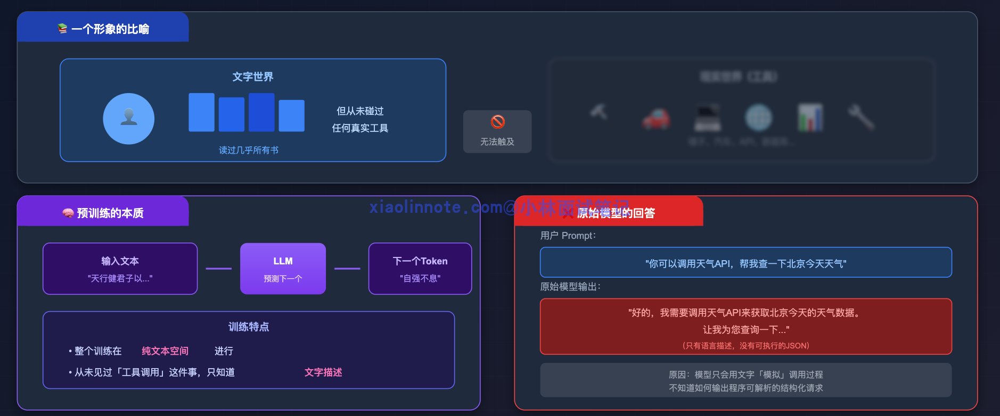
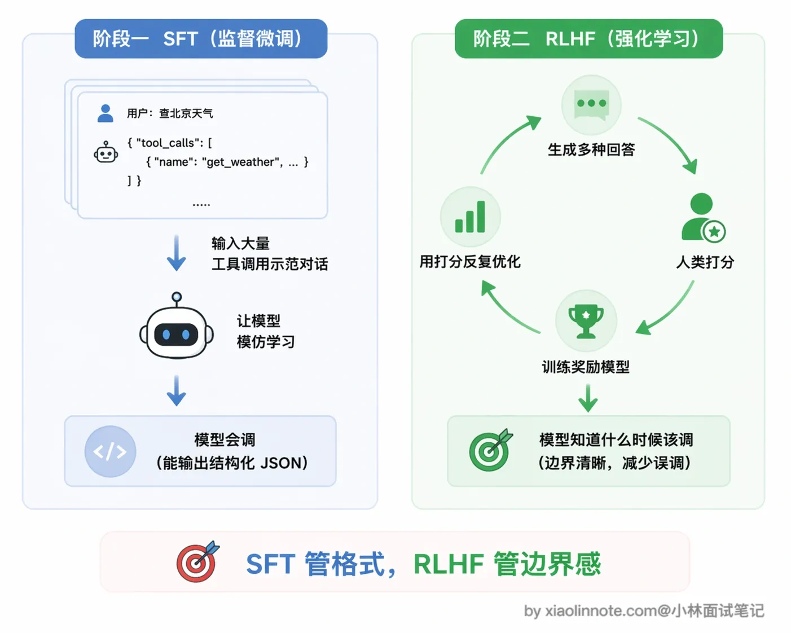
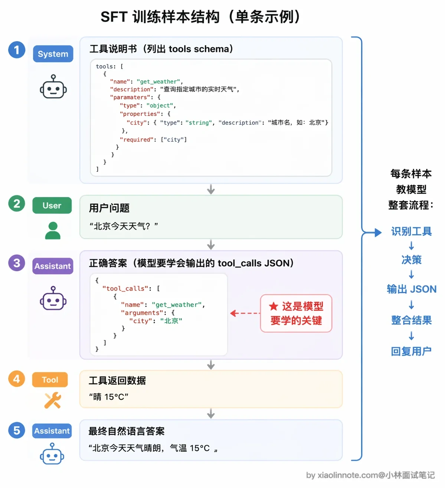
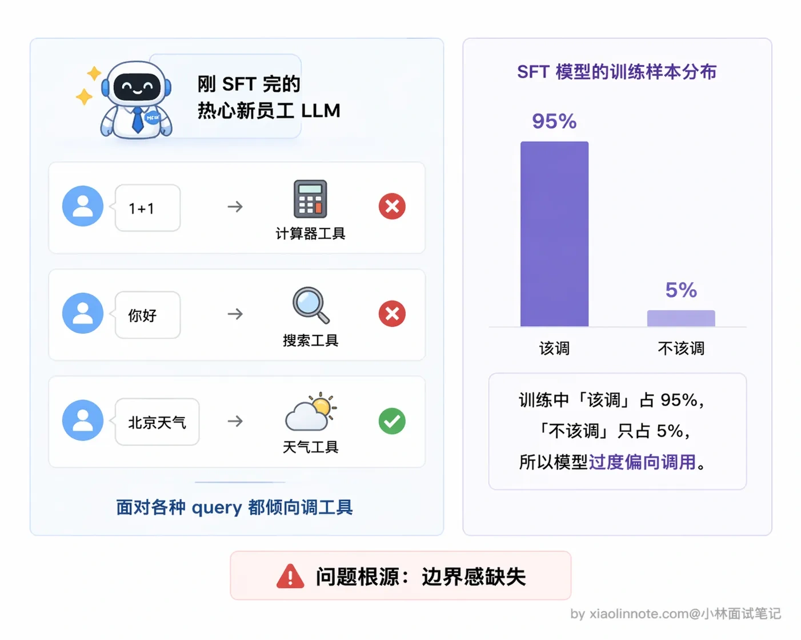
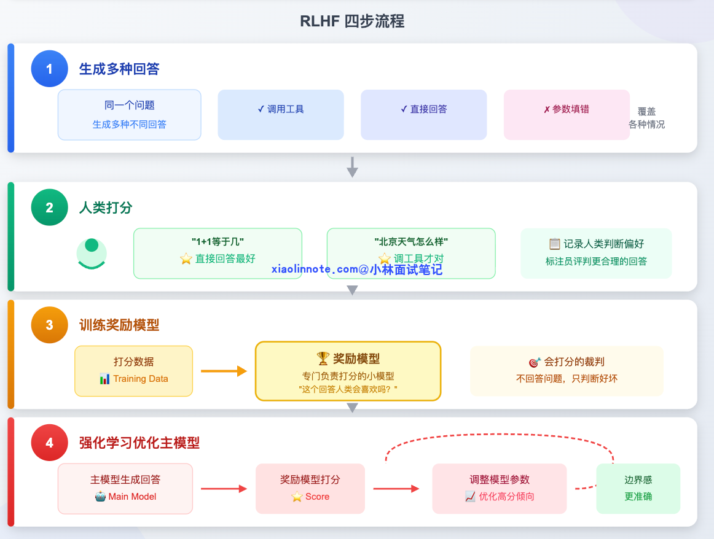
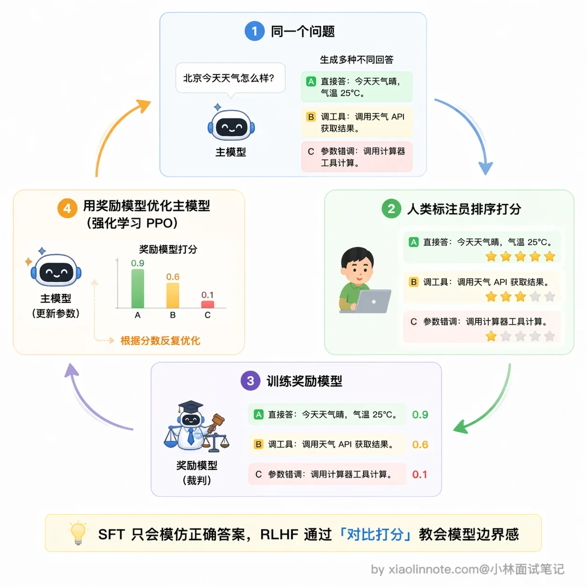
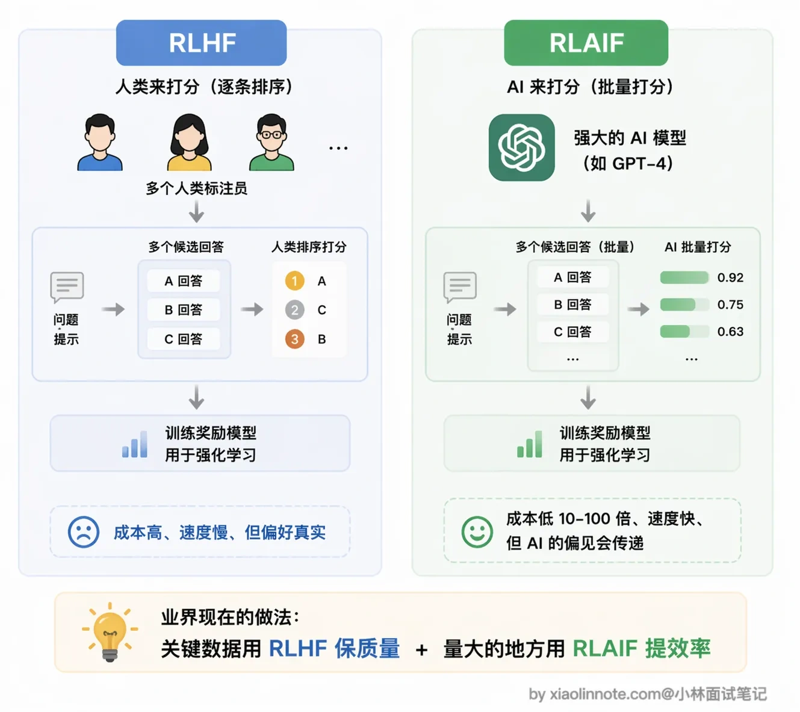
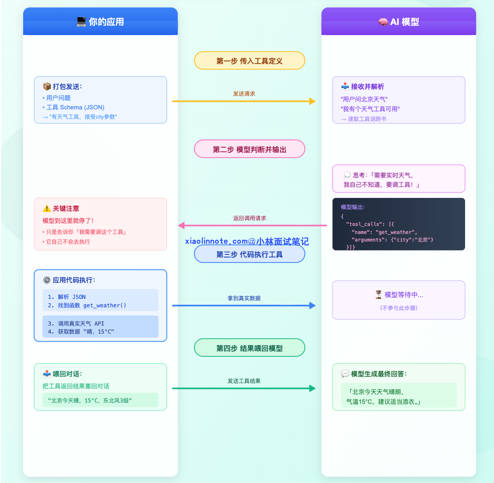
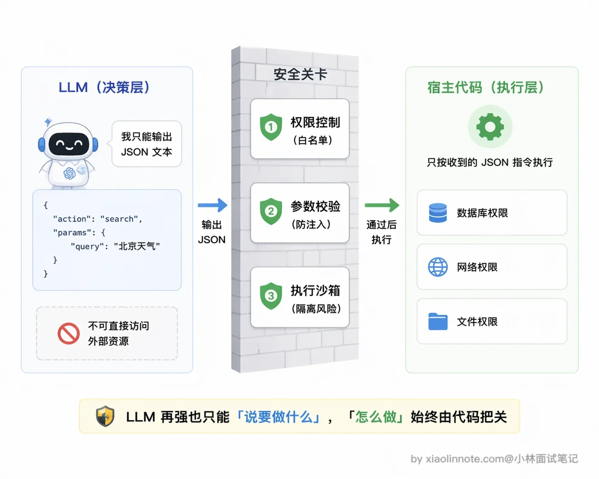

# LLM 是如何学会调用外部工具的？

> 原文：[LLM 是如何学会调用外部工具的？](https://xiaolinnote.com/ai/tools/2_llm_tool_learning.html) · 小林面试笔记


👔面试官：说说大模型是怎么学会调用外部工具的？

🙋‍♂️我：大模型本身就很聪明嘛，参数量够大，涌现能力一出来，自然就会调用工具了，不需要额外训练吧？

👔面试官：涌现能力说的是参数量到某个阈值后，模型突然展现出小模型没有的理解和推理能力，这是「量变引起质变」。但工具调用要的是输出可解析的结构化 JSON，这是预训练语料里根本不存在的模式，不是参数量大了就自动会的。没训练过的模型遇到「查天气」只会说「我需要查天气 API」，而不是输出可解析的 JSON 调用请求。你说说到底是怎么训练出来的？

🙋‍♂️我：那应该是用 SFT 微调出来的吧？给模型喂大量工具调用的样本，它学会了就行了。

👔面试官：SFT 只解决了「会不会调」的问题，但「该不该调」呢？用户问「1+1 等于几」，模型也去调计算器工具，这不是画蛇添足吗？SFT 之后还有一个关键阶段你完全没提到，回去把 RLHF 在工具调用训练中的作用搞清楚再来。

看得出来，很多人把「格式学会了」和「策略边界可靠」混为一谈。下面把训练信号与运行时防线分开说明：SFT、偏好优化、强化学习、约束解码和宿主校验都可能参与，具体组合取决于模型与产品。

## 💡 简要回答

这道题我分两块来讲：模型怎么被训练出工具调用能力，以及训练好之后运行时是怎么工作的。

训练层面常见但并非唯一的组合是：

- **SFT（监督微调，Supervised Fine-Tuning）或其他后训练**：用正例、非调用反例、并行/依赖调用和失败处理示范，学习消息格式与基本行为；
- **偏好优化、强化学习或验证器训练**：把「该不该调、调用是否有帮助、失败后是否安全收敛」变成偏好或可验证的训练信号。RLHF（基于人类反馈的强化学习）只是其中一种路线，并非所有模型都使用它。

运行层面，每次请求时，你的应用代码把工具描述（叫 schema，可以理解为工具的说明书）传给模型，模型如果判断需要工具，就输出一段结构化的 `tool_calls` JSON；你的代码拿到这段 JSON 去真正执行，把结果塞回对话，模型再给出最终答案。

有一点非常关键：模型全程只是在「下指令」，真正执行工具的是你的代码，不是模型本身。这套「模型决策、代码执行」的运行时机制，就是我们常说的 **Function Calling**。

## 📝 详细解析

### 原始 LLM 的世界，为什么不会调工具

想象一个人从出生到成年，只生活在文字的世界里，读过几乎所有的书，却从没接触过任何工具，没用过锤子、没开过车、也没见过 API 是什么。你突然跟他说「去帮我查一下天气 API」，他最多只会用语言描述「我需要查天气 API 来获取数据……」，绝对不会真的去操作工具。



预训练主要通过预测 token 学习语言、代码和交互模式；训练语料中也可能出现 API 文档、JSON、函数调用示例或代理轨迹。因此不能说预训练模型「从未见过工具调用」。更准确的说法是：仅凭通用预训练，不能保证它遵循某个提供商的工具消息协议、正确选择工具并稳定输出符合 schema 的参数；这些能力通常还需要专项后训练、运行时约束和宿主校验。

工具调用能力不是参数量一大就必然出现，而是模型训练与运行时共同形成的。可以用一句更稳妥的话概括：**示范/后训练教格式和策略，宿主程序负责把不可信输出变成受控执行**。



### 第一阶段：SFT，让模型「见过」工具调用

SFT 是 Supervised Fine-Tuning（监督微调）的缩写，核心思路非常直接：给模型看大量正确的示例，让它学会模仿。就像培养一名新员工，前期让他看几百份填好的工单，他自然就学会了「遇到这类问题该怎么写工单、该走哪个流程」。

要让模型学会工具调用，就要构造专门的训练数据。一条完整的训练样本长这样：

首先是 **System 消息**，也就是工具说明书，列出模型现在有哪些工具可用，每个工具叫什么名、能做什么事、需要什么参数，模型从这里「认识」工具。接着是 **User 消息**，就是用户的提问，比如「北京今天天气怎么样？」。

然后到了最关键的部分：**Assistant 的调用请求**。注意，这里的「正确答案」不是自然语言回答，而是结构化 JSON，类似 `{"tool_calls": [{"name": "get_weather", "arguments": {"city": "北京"}}]}`。这就是模型需要学会输出的东西。为什么是 JSON 而不是自然语言？因为 JSON 格式固定、机器好解析，你的代码才能准确读到「调哪个工具、参数是什么」。

再往后是 **Tool 消息**，模拟工具返回的数据，比如「晴，15°C，东北风3级」。最后是 **Assistant 的最终回答**，模型看到工具结果后，给出自然语言答案：「北京今天天气晴朗，气温15°C……」。



样本规模没有通用门槛；关键是覆盖工具定义、无需工具、参数边界、并行/依赖调用、权限确认、失败/超时和多轮上下文。训练集还应保留独立验证集，避免只学会模板而没有泛化。

训练数据可以来自人工标注、程序合成、真实调用轨迹或强模型蒸馏；自动生成必须做 schema、业务规则和安全审查，不能把某个具体模型或某个数量说成行业固定做法。

### SFT 的短板，会了，但不知道「该不该调」

SFT 让模型学会了「调工具」这个动作，但它不知道什么时候该调、什么时候不该调。你可以想象一个刚培训完的新员工，过于热情，每件事都想走流程，有人问他「1+1 等于几」，他也要去查手册，这明显多此一举，直接回答就行。

为什么会这样？因为 SFT 的训练样本里，「该调的场景」占了绝大多数（毕竟我们就是要教它调工具），模型在模仿的过程中会过拟合这种「积极调用」的倾向，没看过足够多的「不该调」反例。再加上训练信号只告诉它「这是正确答案」，没有告诉它「为什么不该调也是一种正确」，所以它的边界感天然就弱。

SFT 之后的模型也有类似的毛病：可能对简单问题也尝试调工具，或者遇到工具调用失败时不知道该怎么处理，行为边界感很弱。



这个问题需要更多的反例、偏好/验证信号和运行时约束共同解决，不应归因于某一个必选训练阶段。

### 第二阶段：RLHF，用反馈建立边界感

RLHF 是 Reinforcement Learning from Human Feedback（人类反馈强化学习）的缩写。如果说 SFT 是让新员工看示例学规范，那 RLHF 就是老板持续给他的工作表现打分，帮他建立判断力。

它的流程分四步：



第一步是生成多样回答。对同一个问题，让模型生成几种不同的处理方式，有的调了工具，有的直接回答，有的参数填错了，故意覆盖各种情况。

第二步是人类打分。标注员评判哪种回答更合理，比如「1+1 等于几」直接回答最好，「北京天气怎么样」调工具才对。这批打分数据就记录了人类的判断偏好。

第三步是训练奖励模型。用这批打分数据，单独训练一个小模型，专门负责打分，它不回答问题，只判断「这个回答人类会喜欢吗」。你可以把它理解成一个「会打分的裁判」。

这一步很关键，也容易被忽略：奖励模型的打分能力本身就是从人类标注员的偏好数据里学出来的，换句话说，人类的判断被「蒸馏」进了这个裁判。所以如果人类标注员自己水平不稳定、标准不一致，奖励模型就会学到一个歪的打分标准，后面主模型再怎么被它优化，方向也是歪的。

第四步是用强化学习优化主模型。拿奖励模型的打分不断调整主模型的参数，让主模型越来越倾向于产出「高分回答」，也就是边界感更准确的工具调用行为。



经过合适的正负样本与反馈，模型可能学会更细的边界：能直接回答的就直接回答，需要实时数据或副作用操作时才调用。但这不是训练后就可以放弃工程防线；应用仍应检查权限、参数、数据新鲜度、超时、幂等和人工确认。

RLAIF（AI Feedback，AI 反馈）是用模型生成偏好或评价信号的路线之一。它可以扩展数据，但会继承评审模型的偏差，不能笼统地说与人工反馈效果相当；应通过独立任务集和安全集验证。



### 运行时，训练好之后怎么用

训练阶段结束，模型上线了。每次你的应用调用模型时，流程是这样的：



首先，你的应用代码把「有哪些工具可用」打包成 JSON 格式（叫做 schema，也就是工具的说明书），连同用户的问题一起发给模型。比如告诉模型：「你现在有一个天气查询工具，接受 city 参数，返回该城市的实时天气。」

模型读完工具定义和用户问题后，做了一个判断：这个问题需要查实时天气，我自己不知道，需要工具帮忙。于是它不直接回答，而是输出一段结构化的 JSON：

```python
{
    "tool_calls": [{
        "name": "get_weather",
        "arguments": {"city": "北京"}
    }]
}
```

注意，**模型到这里就停了**，它只是告诉你「我需要调这个工具，参数是这个」，它自己不会去执行。

接下来就轮到你的代码上场了。你的应用代码解析这段 JSON，找到对应的函数，真正去调天气 API，拿到实际数据。

拿到结果之后，你把工具返回的结果（比如「北京今天晴，15°C，东北风3级」）塞回对话历史，再次调用模型，模型这才组织成一句话回答用户。

这套「模型输出结构化调用请求 -> 代码执行 -> 结果喂回」的机制，有一个专有名词：**Function Calling**。换句话说，Function Calling 就是大模型工具调用能力在运行时的具体实现形式。

### 一个关键认知：模型只负责「决策」，不负责「执行」

这是理解工具调用最重要的一点。

模型在整个过程中只做了一件事：判断要调哪个工具、参数填什么，然后把这个决策用 JSON 格式输出出来。真正去跑函数、访问网络、查数据库的，是你写的宿主程序代码。

这个分工设计得很合理：LLM 擅长理解意图和推理，但不应该有直接操作系统资源的权限；宿主程序负责执行，可以做权限控制、参数校验、执行沙箱等安全措施。这样的设计让工具调用既灵活又安全，是目前主流工具调用框架的核心设计原则。



## 🎯 面试总结

回顾开头的面试对话，第一个雷是以为参数量够大就自然会可靠调工具。预训练可能提供相关先验，但不能保证符合具体 API 的消息协议和业务安全边界；这些需要后训练、约束和宿主侧验证共同完成。

第二个雷是把 SFT 与 RLHF 说成固定的二阶段流水线。SFT 常用于学习示范与格式，偏好优化/强化学习/验证器可用于塑造边界，但是否采用、如何组合都要看模型和任务。

面试回答这道题，核心要讲清楚两个阶段各自的作用。

面试时可以回答：训练数据应同时覆盖调用、非调用、并行/依赖、失败与拒绝场景；后训练信号让模型偏向有帮助且安全的选择；运行时再由 schema 校验、权限策略、超时/重试、幂等键和人工确认兜底。

另外要提到运行时的 Function Calling 机制，模型只负责决策输出 JSON，代码负责执行，这个分工设计是关键认知。

如果能再补充 RLAIF 作为 RLHF 的低成本替代方案，就更完整了。

---
