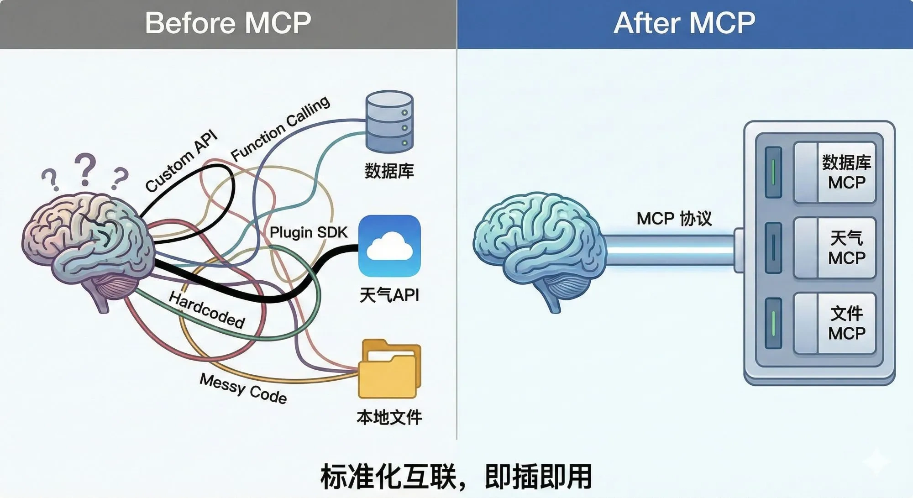
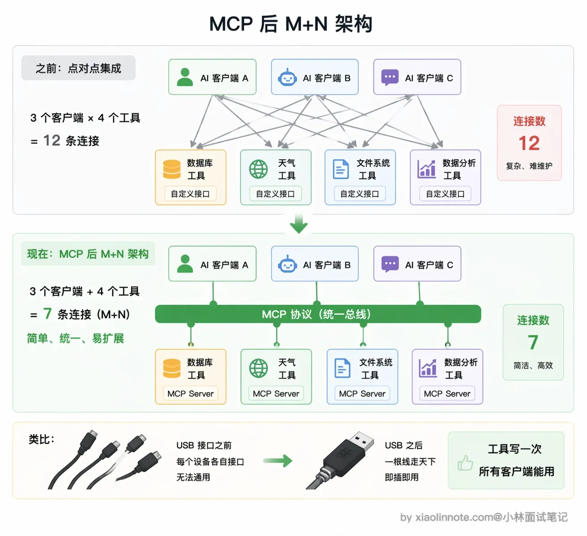
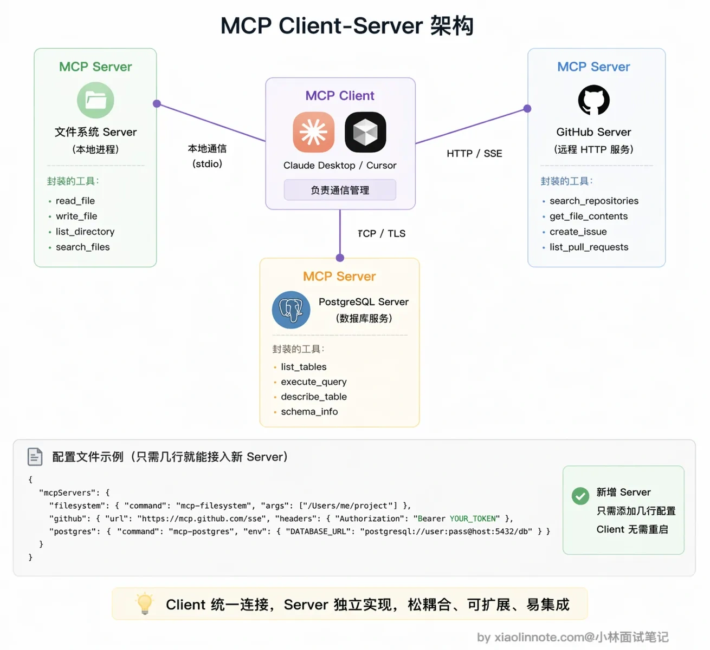
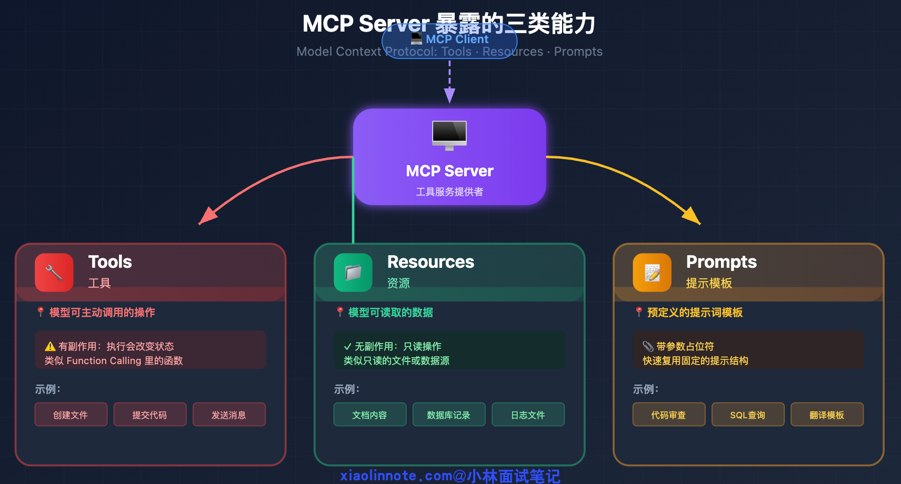
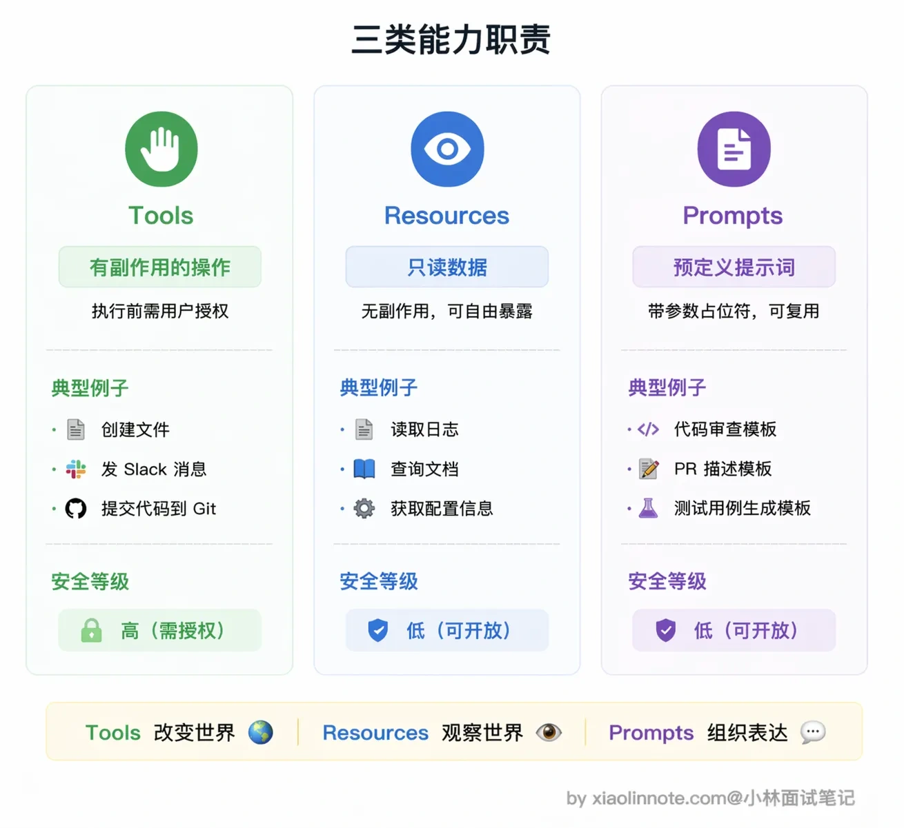
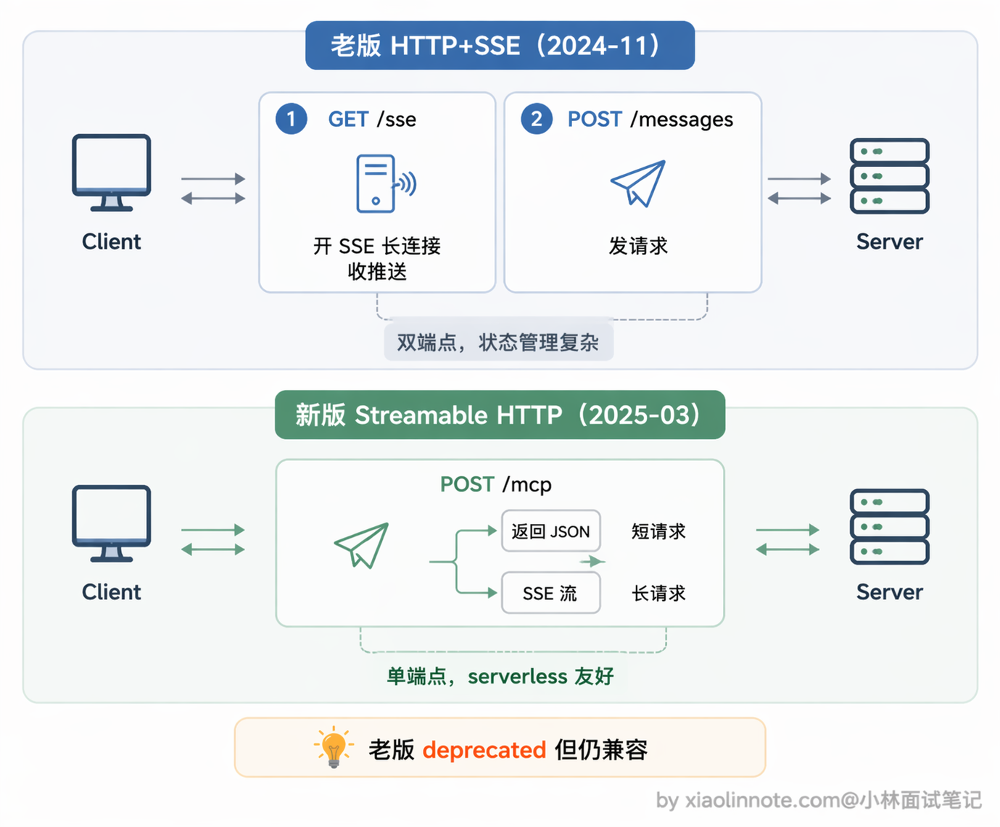
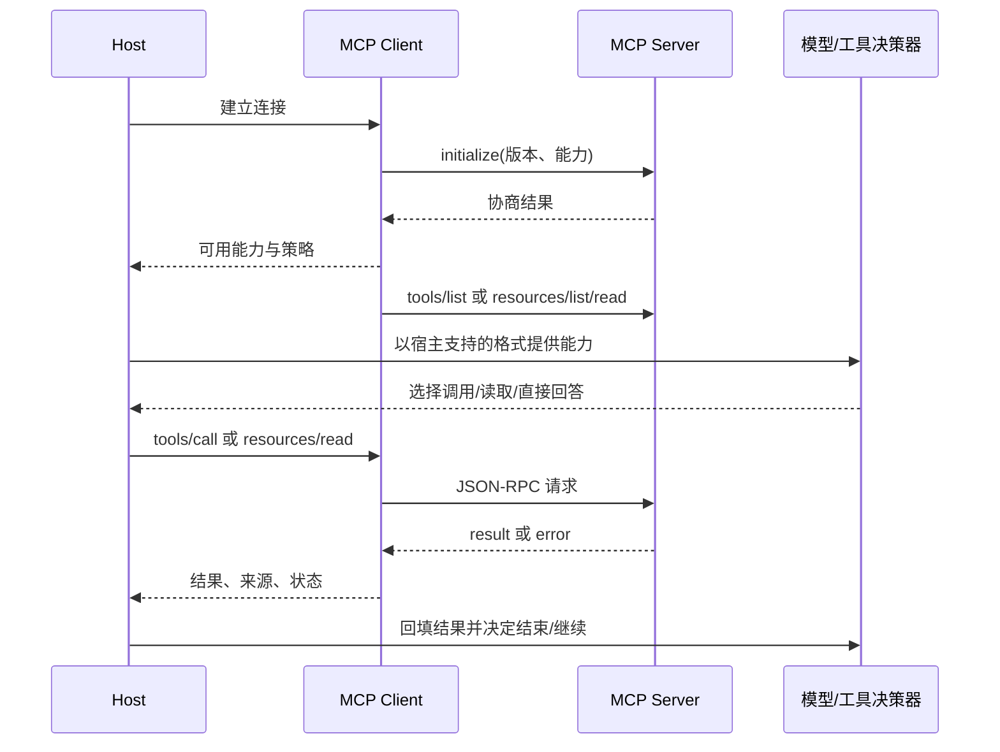

# 什么是 MCP（模型上下文协议）？讲讲它的核心内容？

> 原文：[什么是 MCP（模型上下文协议）？讲讲它的核心内容？](https://xiaolinnote.com/ai/tools/4_what_is_mcp.html) · 小林面试笔记

👔面试官：说说什么是 MCP？它的核心内容是什么？

🙋‍♂️我：MCP 就是一个工具调用框架吧，跟 Function Calling 差不多，都是让模型调用外部工具的。

👔面试官：MCP 是协议，不是框架，跟 Function Calling 更不是一个层面的东西。Function Calling 解决的是「模型怎么输出调用请求」，MCP 解决的是「工具怎么标准化接入」。你把这两个搞混了，说说 MCP 到底要解决什么问题？

🙋‍♂️我：呃……MCP 是为了让工具接入更方便？就是 Anthropic 搞的一个 API 标准，让 Claude 能调更多工具？

👔面试官：MCP 是开放协议，不是只给 Claude 用的。它解决的是工具接入碎片化的问题，工具实现一次、到处复用，任何支持 MCP 的客户端都能接入。Client-Server 架构、三类核心能力 Tools/Resources/Prompts 的区别、底层 JSON-RPC 通信机制，这些核心内容你一个都没提到，回去补课吧。

看来 MCP 这个概念确实容易和 Function Calling 搞混。下面我从「MCP 到底要解决什么问题」出发，把它的架构、三类核心能力、底层通信机制完整讲清楚。

## 💡 简要回答

MCP（Model Context Protocol，模型上下文协议）是由 Anthropic 发起、后来开放演进的协议。它主要解决的是「宿主应用接工具、资源和提示模板时接口碎片化」的问题；具体支持哪些能力要以协议版本和客户端实现为准。

在 MCP 出现之前，每接一个新工具都要单独写集成代码、处理认证、适配格式，而且这套代码和具体模型强绑定，换个模型就得重写，非常繁琐。

MCP 的思路是把发现、调用和上下文交换标准化：工具提供方按协议实现一个 MCP Server，支持相同版本与能力的客户端可以减少定制适配，但仍要处理版本、认证、权限、schema 映射和错误语义。它降低集成成本，不等于「任何客户端零代码兼容」。

协议定义了三类能力：Tools 用于执行有副作用的操作，Resources 是只读数据，Prompts 是提示词模板，底层通信用 JSON-RPC 2.0。

我把它理解成给「AI 接工具」这件事定了一套行业标准。

## 📝 详细解析

### 没有 MCP 之前，接工具有多麻烦

想象你要给 Claude 接入 GitHub 工具。你得手写 GitHub API 的调用代码、处理认证（OAuth token 怎么传）、处理各种返回格式、把 API 响应转成模型能理解的格式……好不容易接好了。

结果过了两个月，Claude 升了个版，接口有变化，你的对接代码得改。更麻烦的是，你同时接了十个工具，每个工具都有自己的一套对接代码，各自的格式、认证方式、错误处理逻辑都不一样。现在产品方说，这套工具也要给 Cursor 用，不好意思，你得重写一遍，因为 Cursor 和 Claude Desktop 的接入方式完全不同。

这就是 MCP 出现之前，AI 工具生态的真实状态：**碎片化、难复用、强绑定**。每个工具、每个模型都是一座孤岛，接一个新工具就要重新搭一座桥。

### MCP 的核心思路，定一套行业标准接口

MCP（Model Context Protocol，模型上下文协议）的设计思路，可以用 USB 接口来类比。在 USB 标准出现之前，鼠标用这个接口、键盘用那个接口、打印机又是另一个，换台电脑就要愁接口不兼容。USB 出现之后，所有外设统一接口，任何设备插到任何电脑都能工作，设备厂商只需要做一次适配，全球所有 USB 电脑都能用。

MCP 做的是同一件事：为「AI 接工具」这件事定了一套统一的协议标准。工具提供方（比如 GitHub 官方）按 MCP 规范实现一个 MCP Server，里面封装好各种操作。任何支持 MCP 的 AI 客户端，Claude Desktop、Cursor、各种 Agent 框架，都能直接连上这个 Server，自动发现里面的工具并使用，不需要写任何定制化对接代码。工具只需要实现一次，到处复用。

### MCP 的 Client-Server 架构

MCP 采用标准的 Client-Server 架构。

Server 是工具的实现方。比如 GitHub 官方维护一个 GitHub MCP Server，里面封装了「列出 PR」「创建 Issue」「搜索仓库」「查看 Diff」等操作；Client 是 AI 应用那一侧，比如 Claude Desktop 或 Cursor，连上 Server 之后就自动获得了这些工具能力。

一个 Host 可以管理多个 MCP Client，每个 Client 通常维护与一个 Server 的会话。Host 可以同时连接多个 Server，但是否只改配置就能使用，取决于客户端、Server 版本和认证方式；高风险工具仍需要宿主策略或用户确认。

### 三类核心能力，Tools、Resources、Prompts

MCP Server 可以向 Client 暴露三类能力，各有各的定位。

先说 **Tools（工具）**，这是可被调用的操作，对应 Function Calling 里的「函数」概念。它们既可以是只读查询，也可以有副作用；创建文件、提交代码、发送 Slack 消息属于高风险示例，需要宿主做权限、确认、审计和幂等控制。MCP 设计上鼓励人类能够拒绝调用，但是否弹确认框不是协议自动保证的。

再说 **Resources（资源）**，它表示可读取的上下文数据，可支持列表、读取，某些实现还支持订阅或变更通知。它通常是只读语义，但「只读」不等于「无敏感性」或「无需授权」：日志、数据库记录和文档都可能包含个人数据、租户数据或提示注入，仍要做访问控制、脱敏和来源标记。

最后是 **Prompts（提示模板）**，这个能力很多人容易忽略，但在团队协作场景下特别有用。Prompts 就是预定义的提示词模板，带参数占位符，解决的是「每次都要手写重复 prompt」的问题。举个例子，你的团队有一套固定的代码审查标准 prompt，接受「编程语言」和「代码内容」两个参数，调用时只需传入参数值，就能自动展开成完整的提示词，不用每次从头写。把公司积累的优质 prompt 封装成 MCP Prompts，所有人都能复用，统一标准，这在实际工程中很实用。

### 底层通信，JSON-RPC 2.0 是什么

理解 MCP 的底层，先要知道 JSON-RPC 是什么。

JSON-RPC 是一种轻量级的远程函数调用协议，用 JSON 格式来表达「调用」这件事。核心非常简单：客户端发一个 JSON 请求，里面说清楚「调哪个方法、参数是什么、这次请求的 ID 是多少」；服务端执行完，返回一个 JSON 响应，里面是执行结果或者错误信息。用 JSON 而不是二进制格式，好处是易读、易调试、语言无关，任何编程语言都能轻松实现。MCP 用的是它的 2.0 版本（JSON-RPC 2.0），相比 1.0 加了批量请求、通知消息等功能。

在传输层，当前规范定义了两种标准方式。

第一种是 **stdio（标准输入输出）**，Server 作为本地子进程运行，Client 通过管道和它通信，Server 从 stdin 读消息，把结果写到 stdout。这种方式适合本地工具，不需要网络，启动快、延迟低，Claude Desktop 接本地 MCP Server 用的就是这种方式。

第二种是 **Streamable HTTP**，Server 作为 HTTP 服务部署在远程，Client 通过 HTTP 连接和它通信。这种方式适合远程部署的工具服务，或者需要多个 Client 共享同一个 Server 的场景，比如团队共用一个部署在服务器上的数据库 MCP Server，所有人的 AI 客户端都连同一个地址就行。

这里有个演进要说清楚：较早版本使用过 HTTP + SSE 的双端点方案；当前规范将 Streamable HTTP 作为标准传输，并保留兼容旧服务的说明。学习或实现时要锁定具体协议版本，不要把旧版部署经验当成所有服务的现状。

Streamable HTTP 不是「只有 SSE」：客户端向一个 MCP endpoint 发 POST，Server 可以返回普通 JSON，也可以返回 `text/event-stream`；GET 是否提供独立的 SSE 监听也由 Server 能力决定。断线不等于取消，若要取消应发送协议取消通知；HTTP 部署还要处理 Origin 校验、认证、会话、重连和代理缓冲。

### MCP 生态发展这么快，背后的原因是什么

MCP 是 Anthropic 在 2024 年底发布的，发布后发展速度很快，主要有两个原因。

第一个原因是**可复用的协议与 SDK**。SDK 能隐藏 JSON-RPC、生命周期和传输细节，但生产 Server 仍要补齐认证、参数校验、错误映射、权限和运维；示例代码行数不代表生产接入成本。

第二个原因是生态复用：社区或厂商可能提供现成 Server，但维护者、权限范围、版本兼容和安全状况各不相同。采用前应检查来源、锁定版本、最小化权限并做隔离测试，不能把「现成」等同于「可信」。

不同 AI 客户端对 MCP 的协议版本、传输、认证和能力支持并不完全一致；接入前应查看客户端与 Server 的兼容矩阵。

### 一次 MCP 会话的因果链

初始化阶段要协商协议版本和能力；正常阶段再执行 `tools/list`、`tools/call`、资源读取或通知。工程上还要设置超时、取消、重连、审计和最大调用预算。

## 🎯 面试总结

回看开头的面试对话，最典型的误区就是把 MCP 和 Function Calling 搞混了。Function Calling 解决的是「模型怎么输出结构化的工具调用请求」，而 MCP 解决的是「工具怎么标准化接入、一次实现到处复用」，两者是不同层面的东西。另一个常见错误是以为 MCP 是 Anthropic 专属的，实际上它是开放协议，任何支持 MCP 的客户端都能接入。

面试回答这道题，首先要说清楚 MCP 解决的核心问题：工具接入碎片化，每接一个新工具都要单独写对接代码，换个客户端又得重写。

然后讲 Client-Server 架构，Server 是工具实现方，Client 是 AI 应用侧，一个 Client 可以连多个 Server。

重点要区分三类核心能力：Tools 是有副作用的操作（需要授权），Resources 是只读数据（无副作用），Prompts 是可复用的提示词模板。

底层通信用 JSON-RPC 2.0，传输层支持 stdio（本地）和 Streamable HTTP（远程）两种方式，早期的 HTTP+SSE 双端点方案在 2025 年 3 月的规范更新里被标记为 deprecated，推荐用单端点的 Streamable HTTP。

最后可以提一下 MCP 的价值：它把能力发现、调用和上下文交换放到一个可协商协议里，但复用效果取决于版本兼容、认证、权限和宿主适配，不能把协议本身当成安全边界。

---
