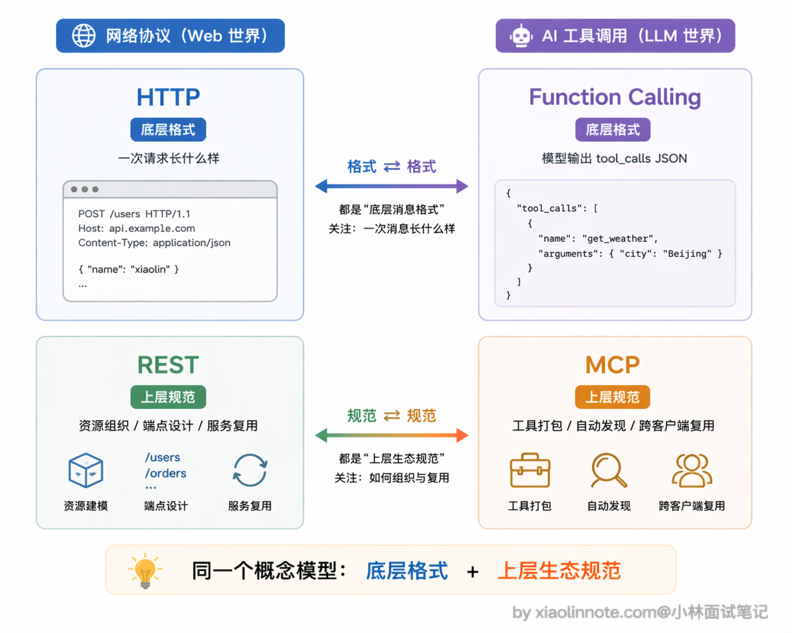
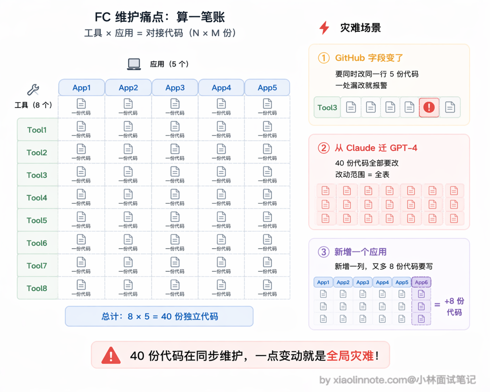
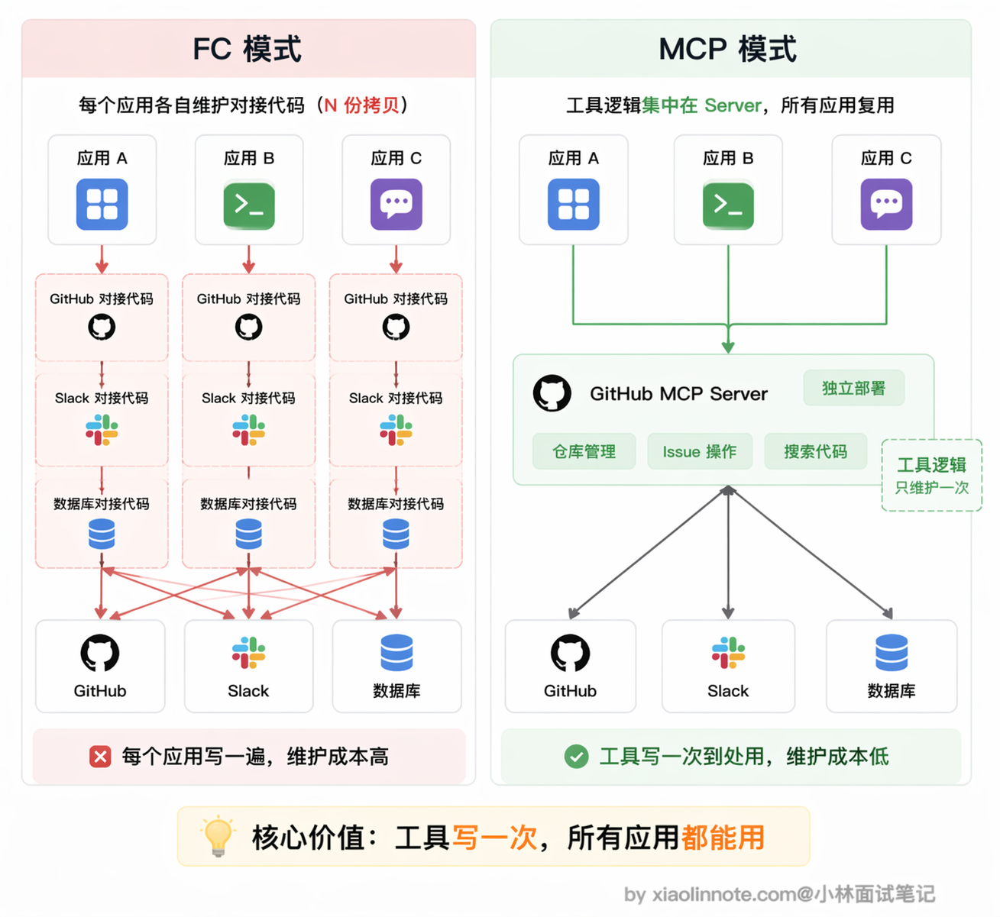
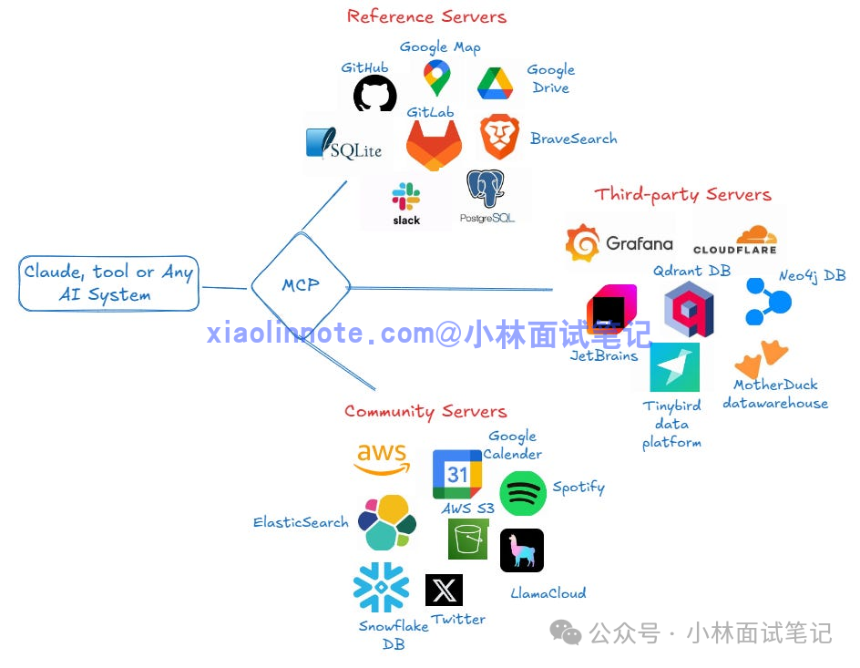
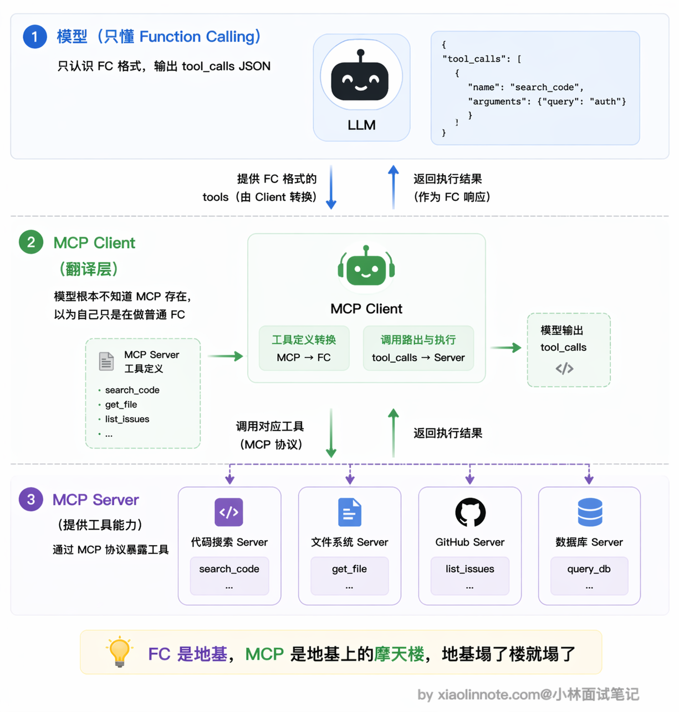
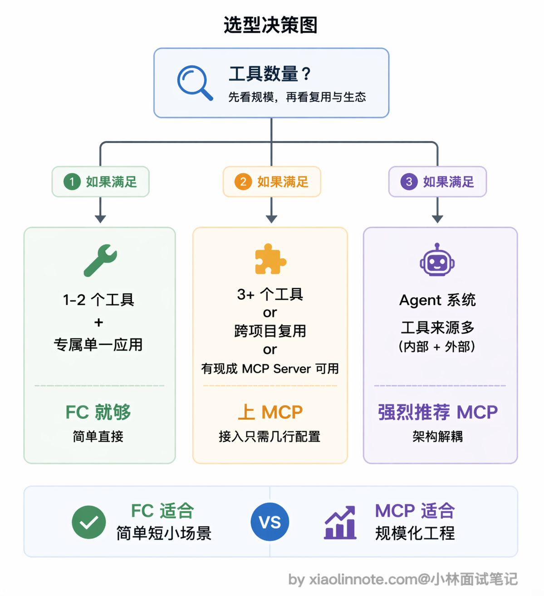

# MCP 和 Function Calling 有什么区别？有没有实际跑过 MCP？

> 原文：[MCP 和 Function Calling 有什么区别？有没有实际跑过 MCP？](https://xiaolinnote.com/ai/tools/6_mcp_vs_fc.html) · 小林面试笔记


👔面试官：来聊聊 MCP 和 Function Calling 的区别吧。

🙋‍♂️我：MCP 就是 Function Calling 的升级版嘛，MCP 出来之后 Function Calling 就被淘汰了，以后工具调用都走 MCP 就行了。

👔面试官：淘汰？MCP 底层靠什么驱动的你知道吗？它可离不开 Function Calling。这两个根本不是同一层面的东西，你把层次搞混了。

🙋‍♂️我：哦，那 MCP 应该就是给 Function Calling 包了一层壳吧？功能上没什么本质区别，就是写法不一样而已？

👔面试官：如果只是写法不一样，Anthropic 为什么要专门设计一个协议出来？Function Calling 解决的是单次调用的格式问题，MCP 解决的是工具怎么标准化管理、跨项目复用和自动发现的问题，两者的抽象层次完全不同。你真跑过 MCP 吗？接入一个 MCP Server 需要写多少代码，你知道吗？

看来这两个概念的层次关系确实容易搞混，下面我把它们各自解决什么问题、怎么配合工作的逻辑理清楚。

## 💡 简要回答

我理解这两者不是竞争关系，解决的不是同一层面的问题。

Function Calling 是「调用语言」，定义的是模型怎么表达「我要调哪个函数、参数是什么」；MCP 是「工具生态协议」，定义的是工具怎么标准化打包、注册和被 AI 客户端发现。

在常见的 Host 中，MCP 工具会被适配成模型 API 能理解的工具定义，模型再通过原生 tool calling、结构化输出或其他策略选择调用；但 MCP 协议本身是 Host/Client 与 Server 之间的协议，并不规定模型必须使用某家厂商的 Function Calling。

打个比方：Function Calling 像 HTTP 请求格式，MCP 像 REST API 的设计规范加服务注册发现机制，两者是不同层次的东西。

关于实际跑过的经验，可以描述为：在支持 MCP 的客户端中配置一个本地或远程 Server，完成初始化和能力发现，再由 Host 决定哪些工具暴露给模型。配置减少了重复接入，但权限、认证、版本兼容和用户确认仍需验证，不能笼统说「完全不用写对接代码」。

## 📝 详细解析

### Function Calling 有了，为什么还需要 MCP？

很多人第一次看到 MCP 会有一个直觉困惑：Function Calling 不是已经能调工具了吗，模型想用工具直接定义 schema 就行，为什么还要再搞一个协议出来？

这个困惑的根源，是把「能调工具」和「管好工具」混在一起了。这两件事完全是不同层次的问题。

有一个很好的类比可以帮你理解：HTTP 协议出来之后，我们已经能在网络上传数据了，为什么还需要 REST API 规范？



因为 HTTP 解决的是「怎么传」（一次请求长什么样、用什么方法、怎么编码），REST 解决的是「怎么组织和管理」（资源怎么命名、端点怎么设计、状态怎么表达、多个服务之间怎么复用同一套约定），两者是不同层次的事。

Function Calling 和 MCP 也是同样的关系：Function Calling 管「一次函数调用请求长什么样」，MCP 管「一堆工具怎么被组织、发现、跨项目复用」。前者是格式，后者是规范+生态约定，少了谁这套机制都运转不起来。

### Function Calling 解决的是「一次调用」的格式问题

从开发者视角看，Function Calling 回答的是这几个问题：工具定义用什么格式传给模型？模型想调工具时怎么表达「我要调哪个函数、参数是什么」？工具执行结果怎么喂回对话？

它定义的是单次调用的消息格式，仅此而已。每次使用，开发者都要手动写工具的 schema 定义，手动写调用逻辑，手动处理结果。Function Calling 本身没有任何工具管理、工具发现、跨项目复用的概念。

### Function Calling 的痛点，每次都是一次性的

那「每次手动」到底有多痛？你可能觉得复制一份 schema 也没多大工作量，但工具一多、项目一多，问题就暴露出来了。

假设你在 A 项目里定义了 10 个工具的 schema 和对接逻辑。现在 B 项目也要用这些工具，怎么办？把那 10 个 schema 定义复制过来，把对接逻辑重写一遍。好，写完了。但 A 项目用的是 Claude API，B 项目换成了 GPT-4，两边的 Function Calling 格式不完全一样，又得各自维护一套适配代码。这还没完，如果某个工具的接口改了呢？你得去每个用到它的项目里逐一更新，漏改一处就是 bug。

把这个账算一下你就知道痛点的规模了：假设你团队里有 5 个应用，每个应用要接 8 个工具，也就是 40 份工具对接代码在维护。某天 GitHub API 的某个字段变了，你要在 5 个地方同步改，只要其中一个忘了，那个应用在凌晨报警；再假设你要从 Claude 迁到 GPT-4，这 40 份代码里的 Function Calling 格式全要重新适配一遍，整个组的季度就这么交代了。



有没有发现问题？同一个工具，换个项目就要重新对接一遍，每次都是一次性的手工活。这就是 Function Calling 解决不了的核心问题：**工具的管理、复用和跨平台兼容**。

### MCP 解决的是「工具生态」的问题

既然痛点是「每个应用各自维护一套工具定义」，那解决思路也就很自然了：把工具做成独立的标准化服务，谁要用就来连，不用每次都重写一遍。这就是 MCP 的核心思路。

工具提供方实现一个 MCP Server；stdio 模式通常是本地子进程，Streamable HTTP 模式也可以是远程服务。Server 暴露标准能力描述，客户端可以自动发现，但仍要做版本、认证、权限、结果映射和安全审查。



这带来的改变是集成边界更稳定：工具提供方可以复用 Server，客户端减少重复的 API 适配，但不同客户端的能力、版本、认证和模型映射仍可能不同。MCP 降低重复劳动，不保证所有客户端天然兼容。



### 最关键的联系：Host 需要一个模型侧的调用机制，但 MCP 不等于 Function Calling

这是很多人没想清楚的一点：二者在不同边界上工作。模型 API 的工具调用是「模型如何表达选择」；MCP 是「Host 如何发现、连接和调用外部能力」。一个 Host 可以把 MCP 工具翻译成某厂商的 tool schema，也可以通过自定义策略或结构化输出驱动工具。

当 MCP Client 连上 Server 后，通常会通过 MCP 的 `tools/list` 发现工具（不是所有 SDK 都把它暴露成名为 `list_tools` 的本地方法），Host 再把选中的能力映射到模型 API 或自己的决策器。模型提出调用后，Host/Client 将请求路由到 `tools/call`，把结果或错误以模型 API 能接受的形式回填。

从**模型的视角**来看，它通常只看到 Host 提供给它的工具描述，不一定知道这些工具来自 MCP；但 Host 也可以显式说明来源，或不使用模型原生工具调用。MCP 的发现、schema 映射、路由、执行结果返回主要发生在宿主层。

这也意味着：如果模型不支持某种原生 Function Calling，Host 仍可能用结构化输出、命令路由或人工/程序策略来驱动 MCP；只是可靠性和实现成本取决于该机制。真正的必要条件是 Host 有可控的「模型选择 → 参数校验 → 工具执行」通路，而不是某个固定字段名。



### 实际体验，接入一个 MCP Server

以 Claude Desktop 接入文件系统 MCP 为例。只需要编辑 `claude_desktop_config.json`，加入如下配置：

```json
{
  "mcpServers": {
    "filesystem": {
      "command": "npx",
      "args": [
        "-y",
        "@modelcontextprotocol/server-filesystem",
        "/Users/yourname/Documents"
      ]
    }
  }
}
```

这几行配置告诉 MCP Client：用 `npx` 这个命令启动文件系统 Server，把 `/Users/yourname/Documents` 目录作为允许访问的范围。`command` 和 `args` 组合起来就是启动 Server 进程的命令行，MCP Client 会把它作为子进程启动，通过标准输入输出和它通信。

配好之后重启 Claude Desktop，它会自动启动这个 Server 进程，自动发现里面提供的工具。然后你直接问 Claude「帮我读一下 Documents 里的 [report.md](http://report.md)」，Claude 会自动调用文件系统工具完成任务，全程你没写一行对接代码。

如果想自己写一个 MCP Server，其实也很简单。核心就三步：首先用 `@app.list_tools()` 装饰器告诉 Client 这个 Server 提供哪些工具及其参数格式，然后用 `@app.call_tool()` 装饰器实现每个工具的真实执行逻辑，最后用 stdio 方式运行，让 Client 能通过管道和它通信。

完整的代码如下：

```python
import asyncio
from mcp.server import Server
from mcp.server.stdio import stdio_server
from mcp.types import Tool, TextContent

# 1. 创建一个 Server 实例，名字叫 "calculator"
app = Server("calculator")

# 2. 定义工具列表 (告诉 Client 我有什么功能)
@app.list_tools()
async def list_tools() -> list[Tool]:
    return [
        Tool(
            name="add_numbers",
            description="计算两个数字的和",
            inputSchema={
                "type": "object",
                "properties": {
                    "a": {"type": "number", "description": "第一个数字"},
                    "b": {"type": "number", "description": "第二个数字"}
                },
                "required": ["a", "b"]
            }
        )
    ]

# 3. 实现工具的具体逻辑
@app.call_tool()
async def call_tool(name: str, arguments: dict) -> list[TextContent]:
    if name == "add_numbers":
        a = arguments.get("a", 0)
        b = arguments.get("b", 0)
        result = a + b
        
        # 返回结果，必须是 TextContent 格式
        return [
            TextContent(
                type="text",
                text=f"计算结果: {result}"
            )
        ]
    
    # 如果工具名不认识，返回错误
    return [TextContent(type="text", text=f"未知工具: {name}")]

# 4. 启动 Server (使用标准输入输出模式)
async def main():
    async with stdio_server() as (read_stream, write_stream):
        await app.run(
            read_stream,
            write_stream,
            app.create_initialization_options()
        )

if __name__ == "__main__":
    asyncio.run(main())
```

整个 Server 加起来不超过 30 行代码，Anthropic 开源的 MCP SDK 把底层通信都封装好了。

然后编辑你的 `claude_desktop_config.json`，添加这个 Python 服务：

```json
{
  "mcpServers": {
    "calculator": {
      "command": "python",
      "args": [
        "/path/to/your/calculator_server.py"
      ]
    }
  }
}
```

注意这里的路径要改成你自己实际存放文件的绝对路径，如果你的系统中 Python 命令是 `python3`，也要把 `command` 对应改过来。

配好之后重启 Claude Desktop，直接输入「帮我算一下 25 加 17 等于多少」，Claude 就会自动调用你写的 `add_numbers` 工具并返回结果。整个过程你只写了工具逻辑本身，所有的通信、发现、调用路由都由 MCP 框架搞定了。

### 什么时候选哪个

如果只是临时给自己的应用接一两个工具，Function Calling 就够用了，简单直接，不需要引入额外的进程和协议。

但如果工具多了、需要跨项目复用、或者想直接用社区里已有的成熟 Server（GitHub、数据库、浏览器自动化都有现成的），MCP 就值得上了。接一个新工具就是在配置文件里加几行，重启后自动生效，比手写对接代码省事很多。

做 Agent 系统的话更应该考虑 MCP。工具来源杂、数量多，如果全靠手写 Function Calling 来维护，工具定义代码会散落在各处，很难管理。MCP 的自动发现和统一管理能让架构干净很多，新增工具不需要改主程序逻辑，接上 Server 就行。



### 一张边界图：不要把两条链路压成一层

```text
模型 API / 决策器
  └─ tool calling、结构化输出或自定义策略
        ↓ Host 适配、权限、确认、预算
MCP Client ── JSON-RPC + stdio/Streamable HTTP ── MCP Server
        ↓                                      ↓
    结果/错误回填                         外部 API、文件、数据库
```

MCP 也不会自动提供权限、幂等、沙箱和审计；这些属于 Host、Server 与业务系统共同承担的工程边界。

## 🎯 面试总结

回到开头的面试对话，最大的雷就是把 MCP 当成 Function Calling 的「替代品」或「升级版」，这是很多人的第一反应，但完全搞反了两者的关系。

面试回答这道题，第一个必须说清楚的点是：Function Calling 解决的是单次调用的消息格式问题，MCP 解决的是工具生态的标准化管理和复用问题，两者是不同抽象层次的东西。

第二个关键点是：MCP 与模型侧 tool calling 是可组合但不等价的两条链路。Host 可以把 MCP 工具映射为原生 tool schema，也可以用其他结构化决策方式；工具发现、路由、权限、确认和错误处理发生在 Host/Client/Server 边界上。

如果能再补充实际跑过 MCP 的经验就更好了，比如在 Claude Desktop 里配置过哪些 MCP Server、接入流程是什么样的，这些实操细节能让面试官看到你不是只背概念。要避免的误区是：不要说 MCP 就是「换了个写法的 Function Calling」，也不要说两者是竞争关系，它们是上下层的配合关系。

---
