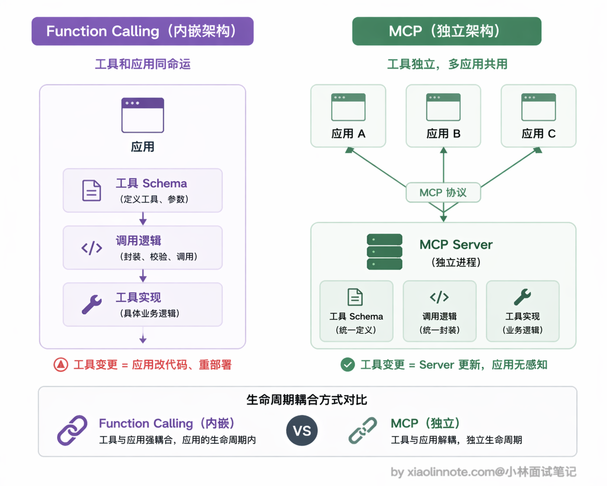
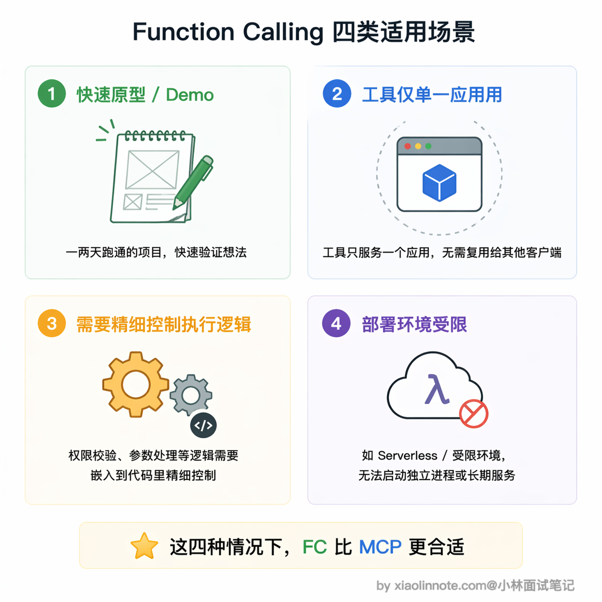
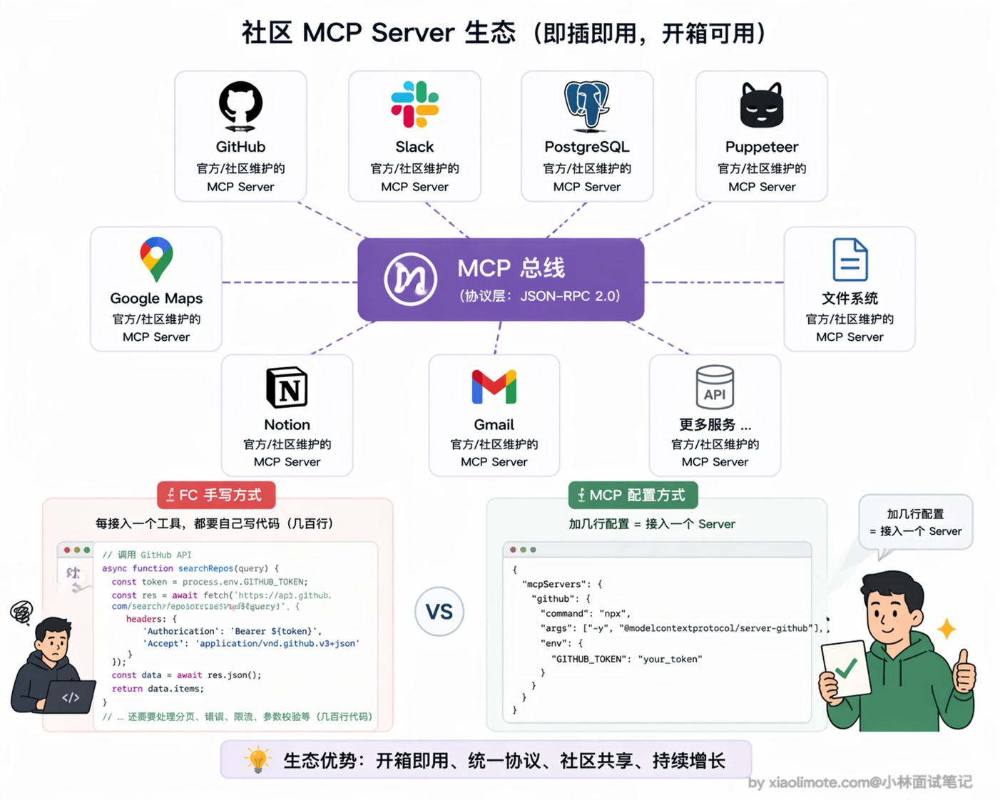
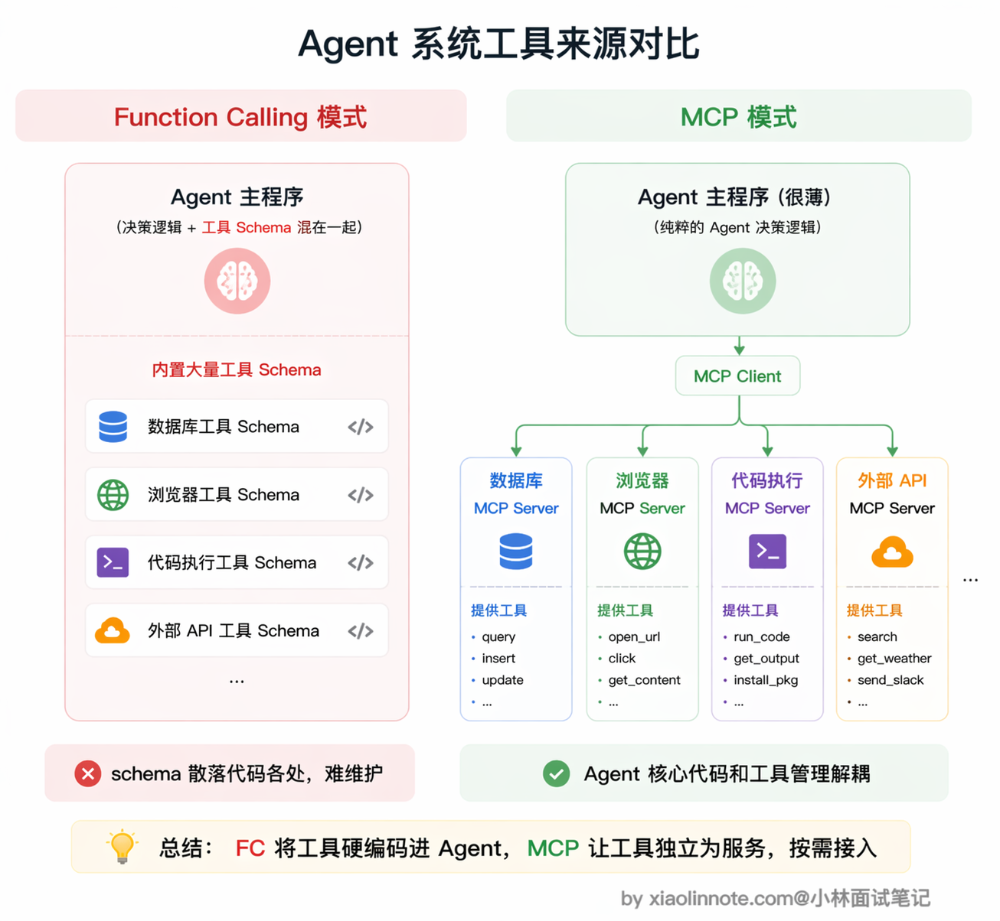
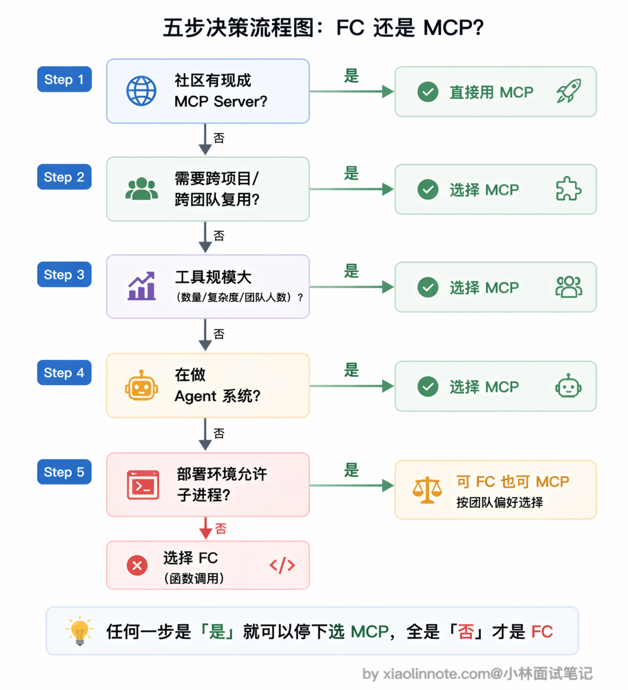

# Function Calling 也属于工具调用，请问什么场景下使用 Function Calling，什么场景下使用 MCP？

> 原文：[Function Calling 也属于工具调用，请问什么场景下使用 Function Calling，什么场景下使用 MCP？](https://xiaolinnote.com/ai/tools/7_fc_vs_mcp_usage.html) · 小林面试笔记


👔面试官：Function Calling 和 MCP 都能做工具调用，那具体什么场景下该选哪个？

🙋‍♂️我：这个简单，小项目用 Function Calling，大项目用 MCP 就行了，主要看项目规模。

👔面试官：项目规模大就一定要用 MCP？如果一个大项目的工具只在内部用、不需要复用呢？你的判断维度太单一了，规模只是其中一个因素。

🙋‍♂️我：那应该是看工具数量吧？工具少就 Function Calling，工具多就 MCP，毕竟 MCP 能自动发现工具。

👔面试官：工具多确实是一个考虑因素，但不是唯一的。如果社区已经有现成的 MCP Server，哪怕只需要一个工具，你还自己手写 Function Calling 去对接 API 吗？还有部署环境的限制、工具复用需求、是不是在做 Agent 系统，这些维度你都没考虑到。场景选型不能只看一个指标。

看来场景选型比想象中复杂，不是一刀切的事，下面我把各种场景的判断逻辑梳理清楚。

## 💡 简要回答

如果只是给单个应用接一两个工具、工具逻辑与业务代码强耦合、场景临时且不需要复用，直接使用模型厂商的 tool calling 接口往往更简单；这里的「Function Calling」指模型侧调用格式，不等于完整的执行安全方案。

如果工具需要跨项目或跨团队复用、需要独立部署与版本治理、或存在可审查的现成 MCP Server，MCP 值得评估；它也会引入会话、认证、兼容性、进程/网络和观测成本。

判断不能只看「是否会复用」，还要看信任边界、部署限制、延迟、故障隔离、权限模型和团队运维能力。会复用只是强信号，不是自动结论。

做 Agent 系统时可以用 MCP 管理跨进程/跨团队能力，但小型 Agent 也完全可以先用内嵌适配器；工具数量多时还要做按需暴露、命名空间、权限和 schema 压缩，不能把 MCP 当作规模增长的唯一解。

## 📝 详细解析

### 先建立一个直觉：内嵌 vs 独立

Function Calling 的工具定义通常由应用代码提供，执行适配器可以内嵌、也可以再调用内部服务；它不强制工具和应用部署在同一进程。

MCP 把 Server 与 Client 之间的发现和调用标准化。stdio 常见于本地子进程，Streamable HTTP 可连接远程服务；是否能直接复用仍取决于版本、认证、权限、能力映射和客户端实现。

这个「内嵌 vs 独立」的本质区别，直接决定了两者各自适合的场景。



### Function Calling 的适用场景

什么时候用 Function Calling 就够了？简单来说，就是「轻量、临时、不需要复用」的场景。



最典型的就是做快速原型和 Demo。你的目标是跑通一个想法或做演示，直接在代码里定义 schema 和调用逻辑就行，不需要启动任何额外进程，也不需要额外配置。这种场景下搞 MCP 完全没必要，你花在搭 Server 上的时间可能会超过原型本身的价值。

再比如工具只为这一个应用服务的情况。假设你在做一个内部工具，里面有一个查本公司私有数据库的接口，这个接口绝不会被任何其他地方用到，那用 Function Calling 把逻辑直接写在项目里反而更清晰，何必额外维护一个独立的 MCP Server 进程呢？

还有一种情况是你需要对工具的执行逻辑做精细控制。Function Calling 的调用逻辑完全在你的代码里，想加权限校验、参数二次处理、特殊错误处理、调用链路追踪，都可以直接嵌进去。MCP Server 是独立进程，这类定制逻辑要额外传递或约定，不如直接写在调用代码里方便。

最后还有一个容易被忽略的因素：部署环境的限制。某些受限的云环境或 Serverless 平台不允许启动子进程，stdio 模式的 MCP Server 就没法用了。这种情况只能退回 Function Calling，工具逻辑都写在主进程里，反而是最稳妥的选择。

### MCP 的适用场景

那什么时候该上 MCP 呢？一句话概括：只要工具不是「自己用、用一次就扔」，MCP 基本都值得考虑。

最核心的场景就是工具需要跨项目或跨团队复用。想想看，同一套 GitHub 操作工具，你自己的 Claude Desktop 要用、同事的 Cursor 要用、团队的 CI/CD Agent 也要用。如果用 Function Calling，意味着三处各维护一份 schema 和调用代码，工具接口一变就要同步改三处，漏改一个就出 bug。MCP 的做法就优雅多了：工具封装成独立 Server，任何人在配置文件里加几行就能接进来用，维护的责任在 Server 那一侧，所有客户端自动受益。

还有一个特别务实的理由：社区已经有现成的 MCP Server 了。GitHub、Slack、PostgreSQL、Puppeteer、Google Maps 这类高频工具，都有经过测试、文档完整的官方或社区 MCP Server。你不需要自己写一遍，直接配置就能用：

```json
// 在 claude_desktop_config.json 里加几行，一行工具代码都不用写
{
  "mcpServers": {
    "github": {
      "command": "npx",
      "args": ["-y", "@modelcontextprotocol/server-github"]
    }
  }
}
```

这种情况下还用 Function Calling 手写 GitHub API 的调用代码，那就是重复造轮子了，完全没必要。



另外，当工具规模起来、MCP 的管理优势就很明显了。这里不想给一个绝对的数字门槛（比如「超过 3 个就要上 MCP」），因为实际判断要看几个维度综合：工具的复杂度（每个工具的 schema 和调用逻辑是几行还是几十行）、团队规模（是一个人维护还是多人协作）、变更频率（工具接口经常改还是基本稳定）。如果你的工具平均复杂度不低、团队里好几个人都在碰这些代码、接口还时不时调整，那就算只有 5 个工具也会很快把你拖进维护泥潭。反过来，两个极其简单、几乎不动的工具，没必要为它们引入一套独立 Server。

为什么工具多了 Function Calling 就会难维护？因为工具的 schema 定义和调用逻辑会散落在代码各处，新加一个工具要改应用代码，工具有 bug 也要进应用代码改，出问题时定位链路很长。MCP 的自动发现机制正好解决这个问题，主程序不感知具体工具，只连 Server，新增工具只需要在 Server 里加实现，主程序完全不需要改动。

最后，如果你在构建 Agent 系统，MCP 是一种可选的模块化边界。它可以把代码执行、文件系统、数据库和外部 API 隔离为不同 Server，但也要承担网络/进程失败、认证、版本、监控和工具选择噪声；小规模系统用内嵌适配器也可能更可靠。



### 一个实用的判断方法

碰到「用 Function Calling 还是 MCP」这个选择题，其实不需要纠结太久，按几个问题依次过一遍就清楚了。



首先看社区有没有现成的 MCP Server，有的话直接用，不要重复造轮子，这是最省事的路径。

如果没有现成的，那就看这个工具需不需要在多个项目或多人之间复用，需要复用就选 MCP，一次封装到处用。

接着综合看工具数量、复杂度、团队规模和变更频率，只要规模一上来（不一定是数字门槛，而是「感觉到散乱」的那个拐点），用 MCP 统一管理会比散落在代码各处的 Function Calling 清爽很多。

然后考虑你是在做正式的 Agent 系统还是 Demo 原型，正式系统选 MCP 更利于长期维护，Demo 的话 Function Calling 上手更快。

最后别忘了检查部署环境，如果平台不允许启动子进程，那 Function Calling 就是更稳妥的选择。

总结成一句话：短期、单应用、强业务耦合的工具可以先用内嵌 tool calling；跨应用复用、独立权限/生命周期和生态接入明显时再评估 MCP。两者可以组合，但 MCP 不必然建立在某家模型的 Function Calling API 之上。

### 选型对比：把「复用」放回完整约束中

| 维度 | 应用内 tool calling | MCP Server |
| --- | --- | --- |
| 集成速度 | 少一层协议，原型快 | 需实现/配置生命周期与传输 |
| 复用 | 由应用自己封装适配器 | 通过标准发现降低重复接入 |
| 信任边界 | 通常在同一应用内更直观 | 跨进程/网络，认证和隔离更重要 |
| 延迟与故障 | 少一跳，链路较短 | 多一跳，需处理断线、超时、重连 |
| 治理 | 代码库内统一测试 | Server 可独立版本、权限、审计 |
| 适合 | 少量、专用、低复用工具 | 跨应用、远程、多团队共享能力 |

面试时说明「为何选它、失败如何降级、谁批准副作用、怎么控制成本」比背一个工具数量阈值更有说服力。

## 🎯 面试总结

回到开头的面试对话，最典型的误区就是用单一维度来做选型判断，比如只看项目规模或只看工具数量。

面试回答这道题，核心是展示你有多维度的判断框架：首先看社区有没有现成的 MCP Server，有就直接用，不要重复造轮子；其次看工具有没有跨项目复用的需求，有就选 MCP；再看工具规模（数量、复杂度、团队规模、变更频率综合判断），规模起来了就考虑 MCP 统一管理；最后还要考虑部署环境限制和是否在做 Agent 系统。

另一个容易踩的雷是只说「什么时候用 MCP」而忽略了 Function Calling 的适用场景。快速原型、工具只为单一应用服务、需要精细控制执行逻辑、部署环境受限这四种场景，Function Calling 反而是更好的选择。面试官想听到的是你能根据具体场景做出合理取舍，而不是一刀切地倾向某一个方案。

---
