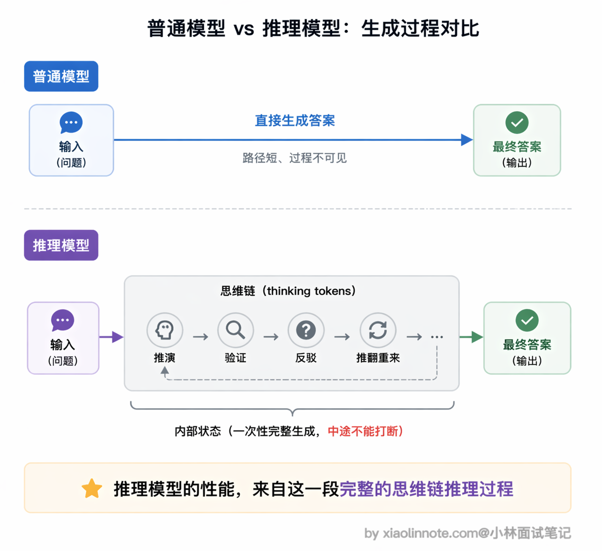
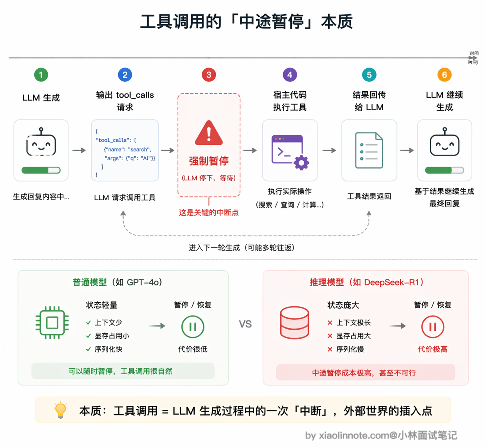
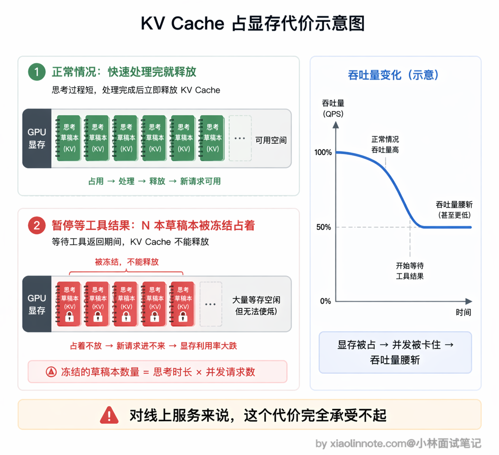
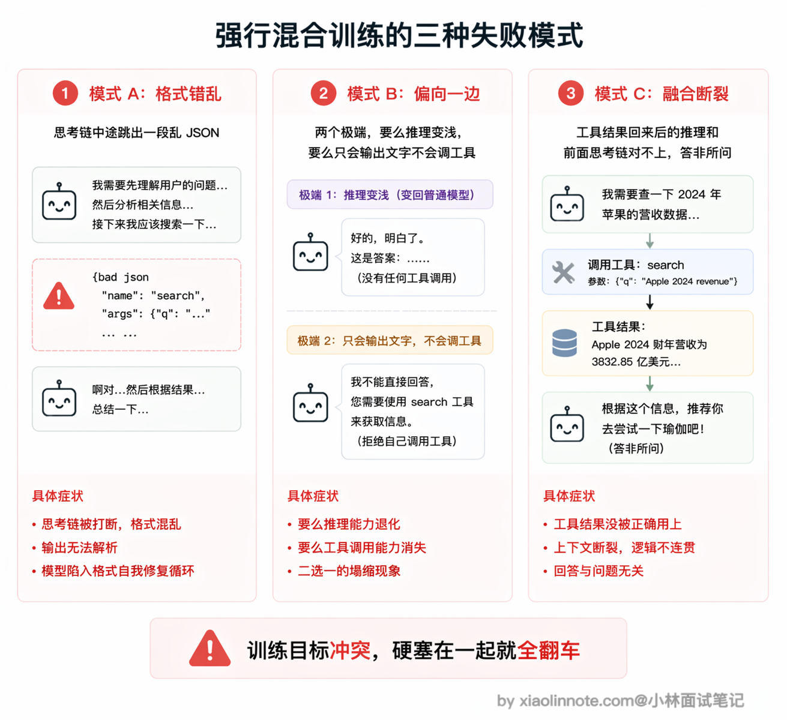
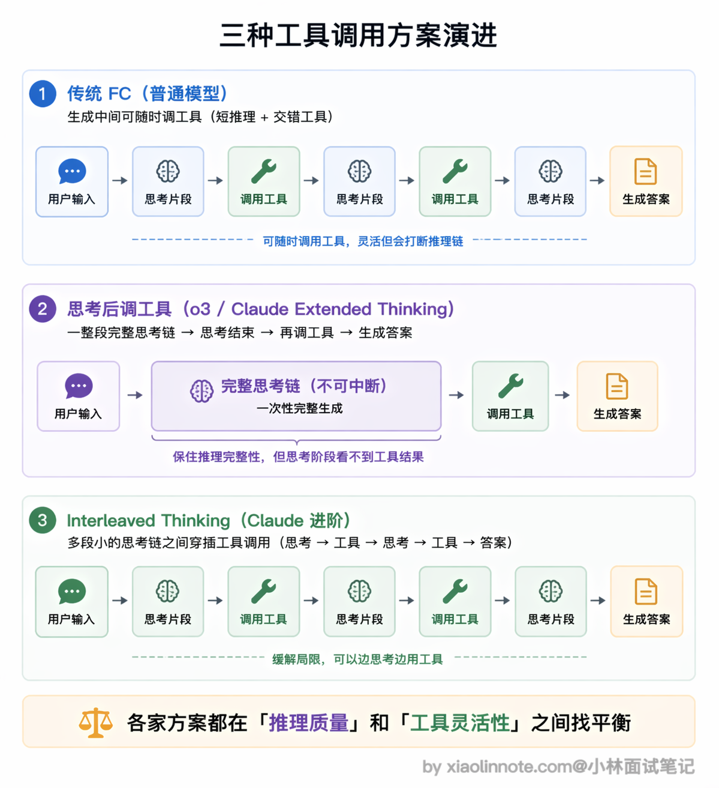
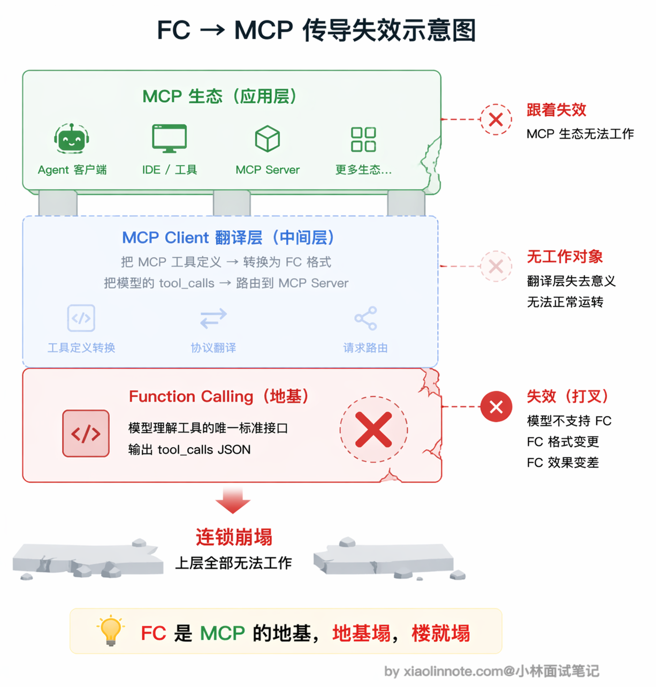

# 为什么有些特定的推理模型不支持 MCP 协议？

> 原文：[为什么有些特定的推理模型不支持 MCP 协议？](https://xiaolinnote.com/ai/tools/8_reasoning_no_mcp.html) · 小林面试笔记


👔面试官：为什么有些推理模型不支持 MCP 协议？

🙋‍♂️我：应该是这些模型比较新，还没来得及做 MCP 的适配吧，等厂商更新一下 SDK 就能支持了。

👔面试官：这不只是 SDK 适配问题。要区分模型 API 是否提供工具调用、推理/工具消息如何序列化、Host 是否能在工具结果后继续发起模型请求，以及 MCP Client 是否能完成能力映射。你得从这几层分析。

🙋‍♂️我：嗯，推理模型会先生成思维链再回答。那是不是因为思维链太长了，占满了上下文窗口，没空间放工具定义了？

👔面试官：上下文窗口不是唯一核心。推理与工具调用的交错会影响消息协议、隐藏推理内容的处理、服务端状态和训练分布，但这并不是理论上不可兼容。你要区分「某个模型/API 版本未开放」和「所有推理模型都不能调用工具」。

这个问题的本质是生成范式的冲突，下面我从推理模型的工作机制开始，把这个冲突的来龙去脉讲清楚。

## 💡 简要回答

我理解更准确的说法是：某些模型或 API 版本没有把推理阶段与工具调用的交错协议、状态管理和安全策略设计好，因此暂时不开放或限制工具调用；这不是 MCP 与推理模型的必然冲突。

推理模型可能生成额外的内部推理 token，产品/API 是否暴露、如何计费和如何与工具消息交错取决于实现。工具调用可以发生在推理段之前、之后，或由支持交错思考的接口在中间发生；Host 通常通过新一轮请求把工具结果和必要的可见上下文发回模型，而不是要求模型服务永久保留一条可暂停的「思维链」。

MCP 是 Host/Client 与 Server 之间的协议，不规定模型侧一定使用 Function Calling。若某模型 API 没有可控的工具选择/结构化输出通路，Host 可以降级为程序规则或另一模型，但自动代理能力会受限；因此应说「该产品组合暂不支持」，不要说「MCP 天然不支持推理模型」。

常见工程方案包括：在推理段结束后调用工具；支持工具结果回填后的新一轮推理；或显式支持 interleaved thinking（交错思考）。具体模型、端点和版本的能力必须查对应官方文档，不能从模型家族名推断。

## 📝 详细解析

### 先弄清楚推理模型是什么

普通模型的工作方式很直接：问题进来，答案出去，收到输入就开始生成 token，一路生成到结束。

推理模型（Reasoning Model）不一样。它在给出最终答案之前，会先生成一大段「内部思考」（thinking tokens），在思考里自言自语地推演、验证、反驳，甚至推翻自己前面的结论重来，直到把问题想清楚了，再输出面向用户的最终答案。代表模型有 OpenAI o1/o3 系列、DeepSeek-R1、Claude 的扩展思考（Extended Thinking）模式。



这套「先思考再回答」的机制常被用于复杂推理，但它与工具调用的兼容性取决于协议设计与训练，不是模型类别的硬性定律。

### 工具调用的本质是「中途暂停」

要理解冲突，先要搞清楚工具调用的完整流程。

工具调用不是一次性生成完成的，它天然是多轮交互：第一步，模型生成调用请求，表达「我要查北京天气，调 `get_weather` 工具，参数是 city=北京」；第二步，**停下来等宿主程序去执行这个工具**；第三步，拿到工具返回的结果；第四步，继续生成，把工具结果纳入后续推理，最终给出答案。

整个流程的核心是第二步，宿主在收到结构化调用后暂停当前请求，执行工具，再发起后续模型请求。对任何模型都可以这样做；差别在于服务端是否保留/返回推理状态、是否允许把工具结果插入上下文、以及 API 是否规定可接受的消息序列。



### 为什么有些实现会把工具交错做得更保守？

模型的生成请求本来就是可结束的；工具结果回来后，模型可以用重建的消息历史重新推理。这样可能增加输入 token、延迟和成本，也可能丢失未公开的中间状态，但不是「只能整个重来所以不能用工具」的协议结论。

### 「那保存状态再恢复不就行了？」

有人可能会问：那暂停时把状态保存起来，工具执行完再恢复，不就解决了？

如果服务端要保存可恢复的 KV Cache，确实会占用显存或外部缓存，并受 TTL、并发、序列长度和缓存管理影响；如果不保存，就需要重建上下文。两者都是性能/成本权衡，不能直接推出「吞吐量腰斩」等固定结论。工具本身的网络延迟、结果大小和重复输入也应单独计入预算。



更难解决的是一致性问题。思考过程中途接入工具结果，等于在模型「想到一半」时改变了输入。模型之前的思路是基于「我还不知道工具结果」建立的，突然工具结果来了，模型需要重新校准，之前的推理链和新来的工具结果可能是矛盾的，怎么融合？这个「思考状态一致性」的问题没有简单的解法。

### 训练目标上的冲突

除了生成范式，训练和消息协议也需要共同设计。推理模型的后训练可能使用强化学习、验证器或其他信号来提高复杂任务表现；工具使用训练还要让模型在合适时机输出结构化调用请求，并正确处理工具结果，并非天然互斥。

如果训练与 API 设计不充分，常见失败模式包括：工具调用块格式错误、把参数写进不可见推理、工具结果回填后重复调用、拒绝处理错误，或在工具与答案之间丢失状态。早期某些模型可能因此限制工具调用，但这属于产品/版本取舍，不能概括所有推理模型。



### 早期推理模型的真实情况

某个模型家族的预览版、正式版或不同 API 端点可能有不同工具能力。回答面试题时应引用明确的模型快照/端点文档，不能把早期版本限制推广到整个家族；事实不确定时只说「该版本未开放或支持有限」。

### 后来是怎么解决的，折中方案

一种工程解法是：**让工具调用发生在一个可结束的推理段之后**。

具体做法是：模型先生成一个可见的调用请求或阶段性结果，Host 执行工具，再把工具结果作为新消息发回模型。这样不要求服务端暂停一条无限长生成，但会增加一次请求和上下文重建成本。

代价是：思考阶段完全感知不到工具结果，模型只能基于自己的已有知识来推理，工具数据只有在「答案生成阶段」才能引入。

对于那种「需要先查到某个数据，再基于这个数据做复杂推理」的任务，这个方案是有局限的，模型没办法带着工具结果去深度推理。但对大多数场景来说，先想清楚再调工具已经够用。

有些产品还提供 interleaved thinking（交错思考），允许在工具调用之间继续推理；是否支持、输出哪些 thinking 内容、能否与 MCP 组合必须按具体 API 文档确认。



但你要知道这个内在限制的本质仍然存在，各家的解法都是在「保证推理质量」和「支持工具调用」之间做权衡。

### 为什么某个模型/API 不支持时，MCP 体验会受影响？

一个常见 Host 链路是：MCP Client 连接 Server、发现工具，Host 再把选中的工具映射为模型可用的结构化接口；模型决定调用后，Host/Client 路由到 Server，执行结果再回填。这里的模型接口可以是原生 tool calling，也可以是其他结构化决策机制。

「MCP 工具定义 → 模型决策接口」是 Host 的适配层，是链路中的一个工程环节，不是 MCP 协议的强制层。

如果某模型端点不支持原生 Function Calling，Host 仍可使用约束 JSON、命令分类器、人工选择或另一个模型来发起 MCP 调用，但自动选择的可靠性、成本和安全边界会变化。若产品没有任何可控的结构化决策通路，才会表现为「该组合暂不支持 MCP」。

所以更准确的关系是「模型/API 的调用接口能力影响 Host 如何使用 MCP」，而不是「MCP 天然依赖 Function Calling」。

### 面试时可画出的状态链

```text
模型请求 ──> [推理/输出调用] ──> Host 校验与权限 ──> MCP tools/call
    ↑                                      │             │
    └──── 工具结果 + 可见上下文 + 错误 ─────┴─────────────┘

可选实现：
1. 原生 tool calling
2. 结构化输出/约束解码
3. 程序策略或人工选择
```

面试回答应区分四个层面：模型能力、模型 API 消息协议、Host 编排、MCP 传输/Server；再说明额外的请求、KV/输入缓存、工具延迟和错误重试如何影响成本与性能。



## 🎯 面试总结

回到开头的面试对话，最常见的误区有两个：一是以为不支持 MCP 只是「还没适配」，把结构性的技术冲突当成了工程进度问题；二是把原因归结为上下文窗口不够大，没有抓到真正的矛盾点。

面试回答这道题，建议讲清楚四层：推理内容可能不可见且由 API 控制；工具调用是可结束的消息往返；某些版本因为训练、序列化、安全或产品策略暂不开放工具；MCP 只是 Host 与 Server 的能力协议，Host 需要另行提供模型决策适配。

如果能再补充方案就更加分：采用推理段后工具调用、工具结果回填后的新一轮推理，或支持交错思考；但模型名和能力要以具体版本的官方文档为准。

同时也要点出折中方案的本质权衡：各家的解法都是在「保证推理质量」和「支持工具调用」之间找平衡点。

---
