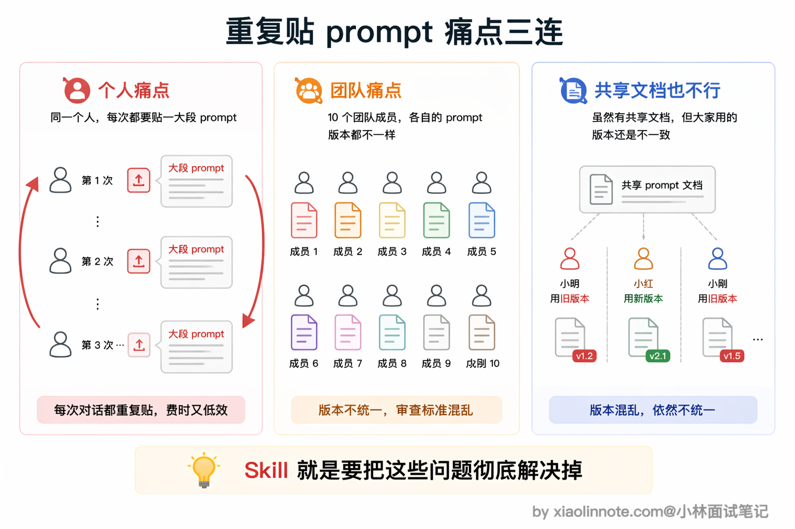
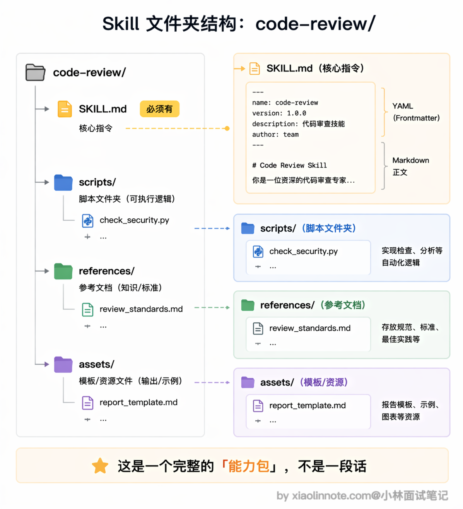
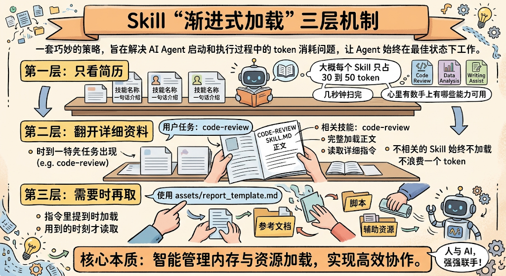
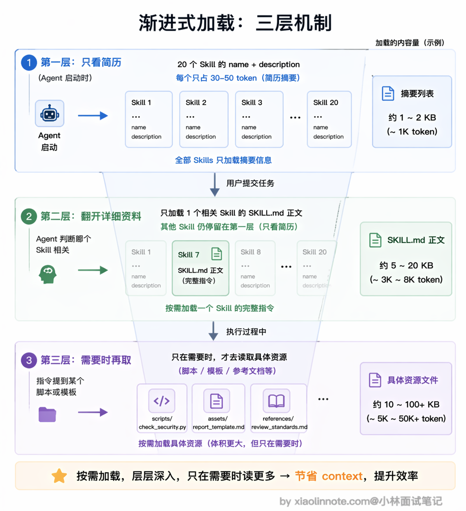
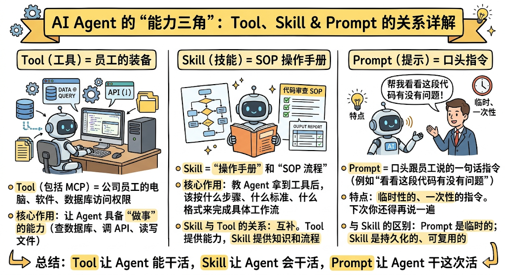
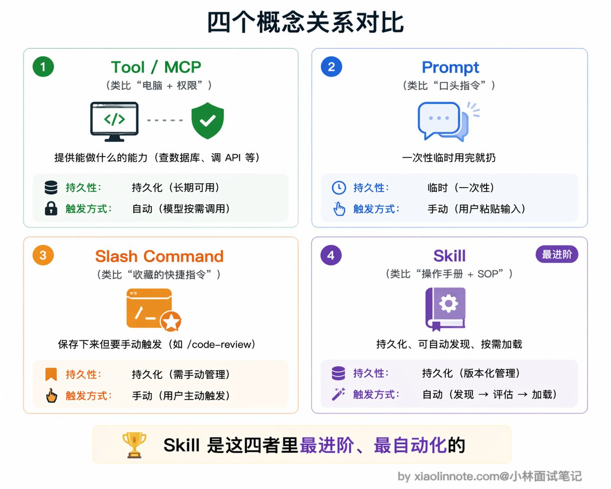
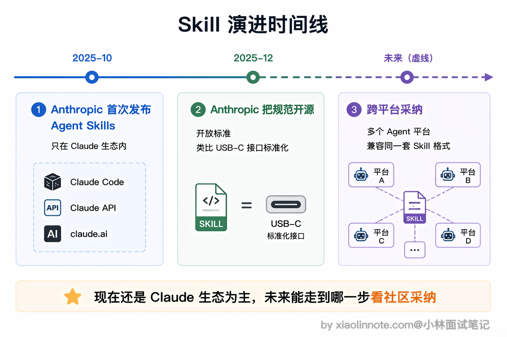

# Skill 是什么？

> 原文：[Skill 是什么？](https://xiaolinnote.com/ai/tools/9_skill.html) · 小林面试笔记


👔面试官：说说 Agent Skill 是什么？

🙋‍♂️我：Skill 就是提示词嘛，把常用的 prompt 保存下来，下次用的时候直接贴上去就行了，跟复制粘贴差不多。

👔面试官：就是「复制粘贴 prompt」？那我每次开新对话都要手动贴一遍，团队里十个人每个人贴的还不一样，这算什么「能力」？你觉得这样能规模化吗？

🙋‍♂️我：那……可以把 prompt 写到一个共享文档里，大家统一从那里复制？

👔面试官：你说的是人工流程管理，不是技术方案。Skill 的核心不是「保存 prompt」，而是把指令、脚本、模板打包成一个模块，Agent 能自动发现它、按需加载它，根本不需要人手动去贴。你连 Skill 和普通 prompt 的区别都没搞清楚，更别提它和 MCP 工具的关系了。

好，这段对话踩的雷很典型，很多人一上来就把 Skill 等同于「保存好的 prompt」。下面我把 Skill 的本质和设计思路拆开讲清楚。

## 💡 简要回答

Agent Skill 是把「指令、脚本、模板」一体化打包成可复用能力包的机制，关键在于三件事：Agent 能自动发现它、按需加载它、在需要时调用里面的脚本和资源。它不只是「存 prompt」，而是一份 Agent 能自己翻阅的「操作手册 + 工具箱」。每个 Skill 是一个文件夹，里面有一份 [SKILL.md](http://SKILL.md) 指令文件，还可以带上脚本、模板、参考文档这些资源。

它和普通 prompt 最大的区别是：Skill 能被 Agent 自动发现和按需加载，不用你每次手动输入；和 MCP 工具的区别是：MCP 给 Agent 提供外部工具和数据的访问能力，而 Skill 教 Agent 拿到这些工具和数据之后该怎么用。

不同 Agent 平台对「Skill」的命名和目录约定并不完全相同。以 Claude Code 当前文档中的 Skill 为例，核心通常是 `.claude/skills/<name>/SKILL.md`，可附带参考资料、模板和脚本；具体字段、作用域和加载策略要以实现版本为准，不应把某个平台的日期或约定写成行业统一标准。

## 📝 详细解析

### 为什么需要 Skill？从「重复贴 prompt」的痛点说起

你一定遇到过这种情况：每次让 AI 帮你做代码审查，你都要贴一大段指令，告诉它「检查这几类问题、用这种格式输出、重点关注安全漏洞」。第一次贴的时候还好，第二次、第三次你就开始烦了，每次新对话都要从头贴一遍，漏掉某个细节就会导致输出质量不稳定。

这还只是一个人的情况。如果是团队协作呢？十个人做代码审查，每个人贴的 prompt 都不一样，有的人关注安全，有的人关注性能，审查标准完全没法统一。



你可能想到把 prompt 写到一个共享文档里让大家复制，但这本质上还是靠人工去维护和执行，版本一多就容易乱，更新了文档但有人还在用旧版的 prompt，质量把控根本做不到。

Skill 要解决的就是这个问题：把那些你反复在用的指令、流程、模板，打包成一个标准化的模块，Agent 自己知道什么时候该用它、怎么用它，不再依赖你手动复制粘贴。

### Skill 的结构长什么样

在采用该约定的实现中，一个 Skill 通常是一个文件夹，里面最核心的是一份 `SKILL.md`，再加上一些可选的辅助资源。目录结构和 frontmatter 字段由具体平台解释，不能假设所有 Agent 都能直接执行同一份 Skill。

```
code-review/                  # Skill 文件夹，名字就是这个 Skill 的标识
├── SKILL.md                  # 核心指令文件（必须有）
├── scripts/                  # 可选：可执行的脚本
│   └── check_security.py     # 比如一个安全检查脚本
├── references/               # 可选：参考文档
│   └── review_standards.md   # 比如团队的审查标准文档
└── assets/                   # 可选：模板、资源文件
    └── report_template.md    # 比如审查报告的输出模板
```



`SKILL.md` 的内容通常分为两部分：顶部是由平台解析的 YAML frontmatter，正文用 Markdown 写指令和步骤。来看一个示例：

```yaml
---
name: code-review
description: "对代码进行全面审查，检查 bug、安全漏洞和性能问题，输出结构化审查报告"
---

# 代码审查 Skill

## 指令

### 第一步：理解代码上下文
阅读提交的代码，理解它的功能和所属模块，确认修改范围。

### 第二步：逐项检查
按以下维度逐一检查：
1. 功能正确性：逻辑是否有 bug，边界条件是否处理了
2. 安全性：是否有注入、XSS、权限绕过等漏洞
3. 性能：是否有 N+1 查询、不必要的循环、内存泄漏风险
4. 可读性：命名是否清晰，关键逻辑是否有注释

### 第三步：输出报告
使用 assets/report_template.md 的模板格式，输出结构化的审查报告。
```

你会发现，这和普通 prompt 的区别就很明显了。普通 prompt 只是一段文字，用完就没了；而 Skill 是一个完整的文件夹，里面的指令、脚本、模板可以持续维护、版本管理，团队里所有人用的都是同一份。

### 渐进式加载：Skill 最聪明的设计

Skill 最让人眼前一亮的设计，不是「能打包」这件事本身，而是它的加载方式。

你可能会想，既然 Skill 可以打包那么多东西，Agent 启动的时候是不是要把所有 Skill 的内容全部读进来？想象一下这个账：假设你有 20 个 Skill，每个 Skill 的指令加上参考文档平均 2000 token，全部加载就是 4 万 token 打底。现在市面上常见的模型上下文窗口是 20 万 token，光 Skill 就吃掉了五分之一，剩下的要分给系统提示、对话历史、用户文件，留给模型真正思考的空间就很紧张了。更糟的是，这 20 个 Skill 里大部分在当前这一次任务里根本用不上，加载了也是白加载。

所以 Skill 用了一套叫「渐进式加载」（Progressive Disclosure）的三层机制来解决这个问题。



- 第一层是「只看元数据」。某些 Agent 会在启动时加载 Skill 的名称和描述，让模型决定是否相关；具体 token 开销取决于实现和描述长度，不存在通用的 30～50 token 配额。
- 第二层是「按需加载正文」。当任务与某个 Skill 相关时，运行时再读取 `SKILL.md`；也可能要求用户显式调用，或由策略禁止自动调用。
- 第三层是「需要时再取」。如果实现支持渐进式加载，执行过程中再读取模板或参考文档；脚本是否允许执行、由谁批准、是否在沙箱中运行，则属于宿主安全策略。

这个设计用一个类比就很好理解：Skill 就像公司给新员工准备的入职手册。你入职第一天不会把整本手册从头到尾看完，而是先扫一眼目录，知道里面有「报销流程」「请假制度」「代码规范」这些章节就行了。等你真的要报销了，再翻开「报销流程」那一章仔细看。这样既不会信息过载，又确保你需要的时候能找到。



为什么这个设计这么重要？因为 context window 是 Agent 最宝贵的资源。如果把所有 Skill 的全部内容一股脑塞进去，真正有用的用户任务信息反而会被淹没，Agent 的注意力被分散，输出质量反而下降。渐进式加载的本质就是「让 Agent 只在需要的时候获取需要的知识」，这和人类的工作方式其实是一样的。

### Skill 和 Tool、Prompt 分别是什么关系

这三个概念经常被混淆，但它们处于完全不同的层次，用一个类比就能讲清楚。



你可以把 Tool（包括 MCP 工具）想象成公司给员工配的电脑、软件和数据库访问权限。有了 Tool，Agent 就能「做事」，比如查数据库、调 API、读写文件。但光有工具不够，你给一个新人配了一台电脑和所有系统权限，他也不知道该按什么流程做代码审查，不知道先查什么、后查什么、用什么格式输出报告。

Skill 就是那份「操作手册」和「SOP 流程」。它教 Agent 拿到这些工具之后，该按什么步骤、什么标准、什么格式来完成一个具体的工作流。所以 Tool 和 Skill 的关系是互补的：Tool 提供能力，Skill 提供知识和流程。

那 Prompt 呢？Prompt 就像你口头跟员工说的一句话指令，比如「帮我看看这段代码有没有问题」。这句话说完就没了，下次你还得再说一遍。Prompt 是一次性的、临时的，而 Skill 是持久化的、可复用的。

还有一个容易搞混的是 Slash Command（斜杠命令）。Slash Command 通常由用户显式触发；Skill 是否能被自动发现和调用取决于宿主配置，也可能被设置为只能手动触发。自动触发不是 Skill 格式本身的安全保证。



### Skill 的跨平台边界

有些平台把 Skill 作为可复用的 Markdown 工作流，有些平台还扩展了脚本、权限、隔离上下文和调用控制。即使目录结构相似，也不能据此推断 Claude Code、API、IDE 或其他 Agent 平台的行为完全一致；迁移时要检查 frontmatter、工具权限、资源路径和执行沙箱。



为什么要把规范开放？核心原因是 Skills 的设计足够简单。一个 Skill 就是一个文件夹加一份 Markdown 文件，不需要安装特殊的运行时，不需要学新的编程语言，任何支持文件系统的 Agent 平台理论上都能实现这套格式。这种「零门槛」的设计让它有希望成为跨平台的通用约定。

如果多个平台都采用相近的目录约定，Skill 内容有机会复用，但复用的是指令和资源，不是自动获得工具权限。移植前应重新审查外部内容、脚本、网络访问、密钥和副作用操作。

### 安全边界：Skill 是不可信输入的一部分

Skill 文件可能来自仓库、插件市场或第三方压缩包；正文、参考资料和脚本都可能包含提示注入、越权指令或供应链风险。加载 Skill 时应把它视为配置代码：锁定来源和版本，最小化允许的工具，隔离工作目录，禁止脚本默认拿到生产凭据，并对副作用操作设置人工确认。

## 🎯 面试总结

回到开头踩的雷，最常见的误区就是把 Skill 等同于「保存好的 prompt」。更稳妥的回答是：Skill 是某个平台约定的可复用指令/知识/工作流包，可选地带参考资料或脚本；自动发现、按需加载和可执行权限都由宿主实现。

第二个关键点是渐进式加载的设计：元数据、正文、辅助资源可以分层加载，但要注明这是具体 Agent 的策略，不是所有 Skill 实现的硬性协议。

第三个要讲清楚的是关系：MCP/Tool 提供外部能力，Skill 提供知识与流程；二者可以组合，也可以分别使用。MCP、Function Calling 与 Skill 不是严格的上下层依赖，宿主负责适配和权限控制。

---
