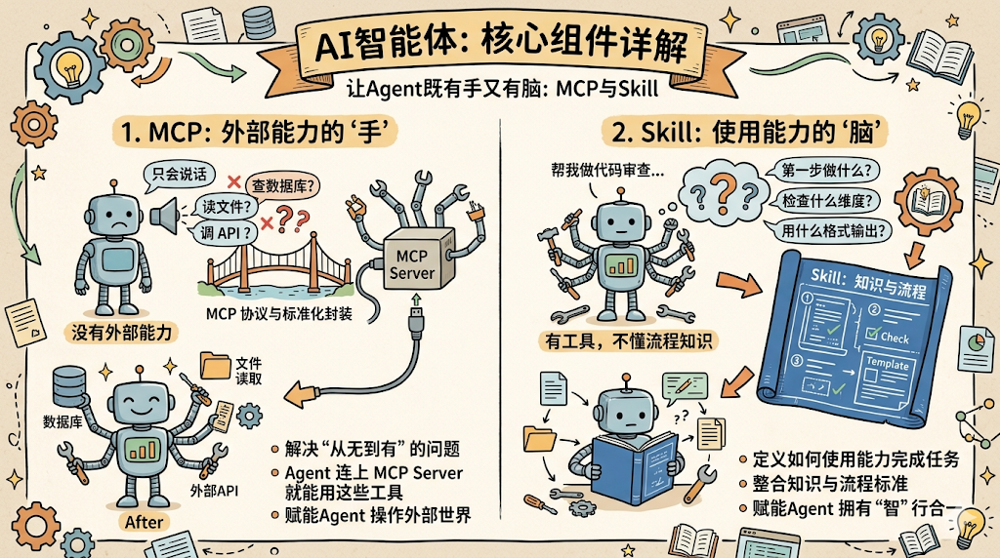
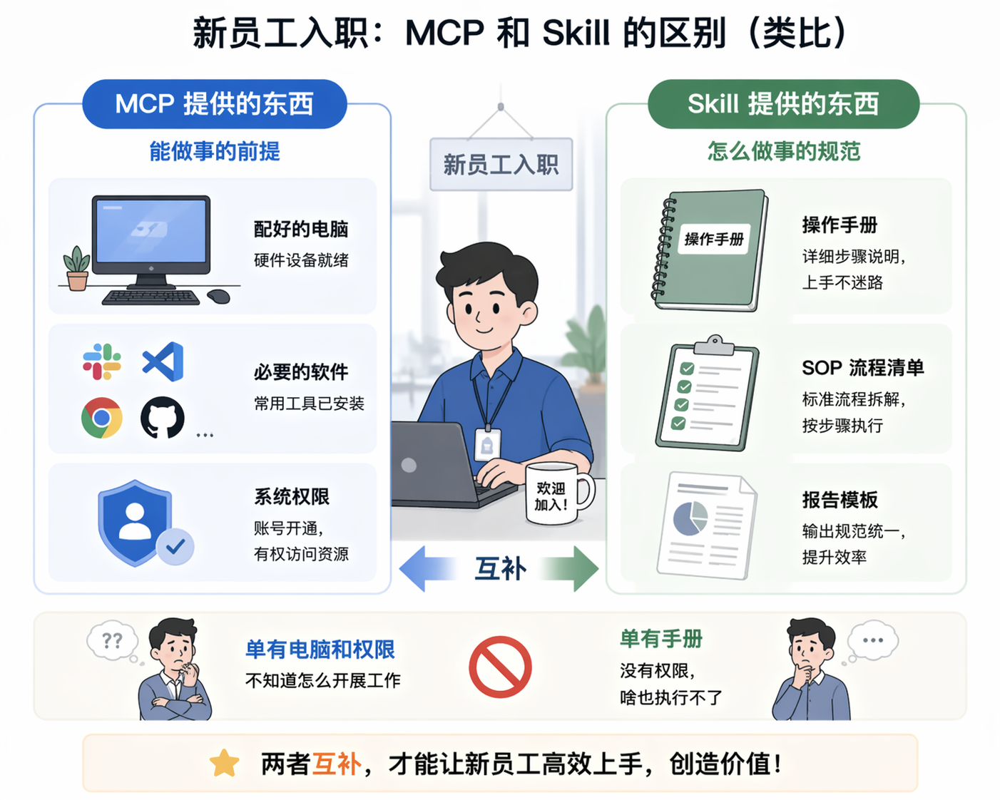
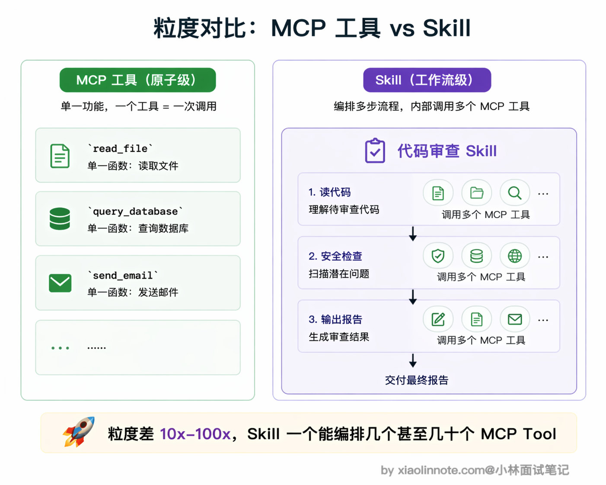
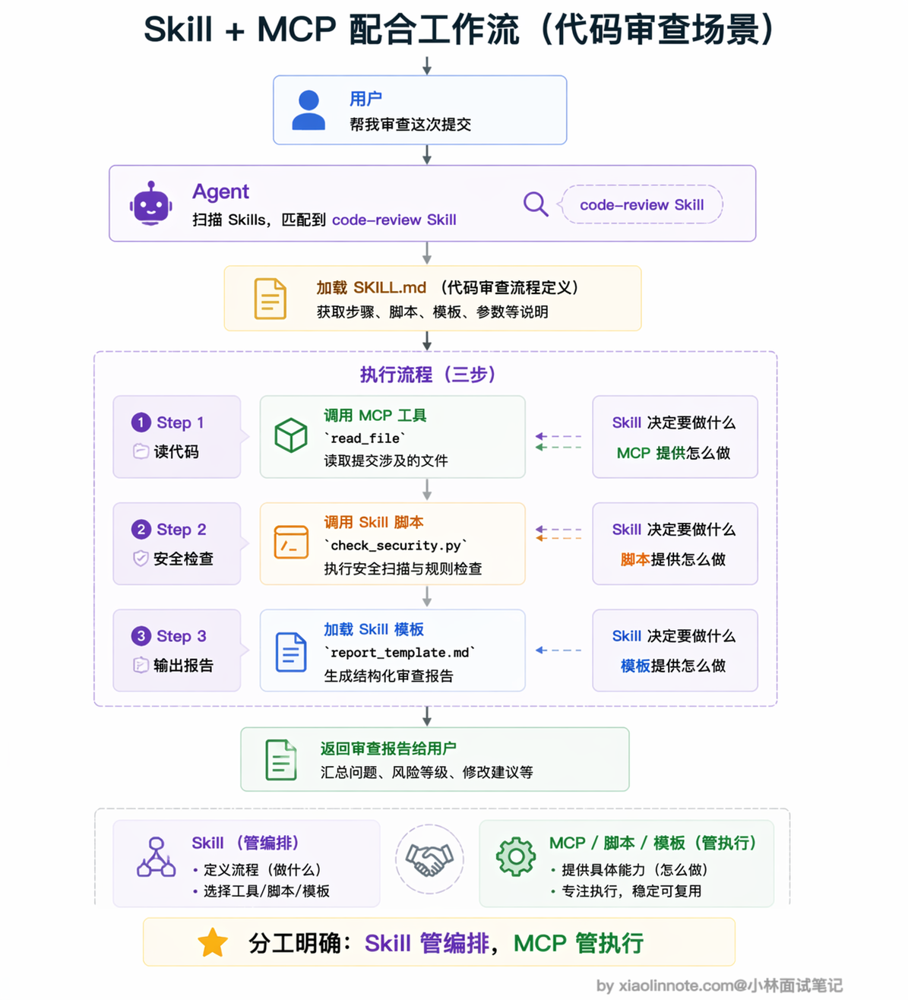
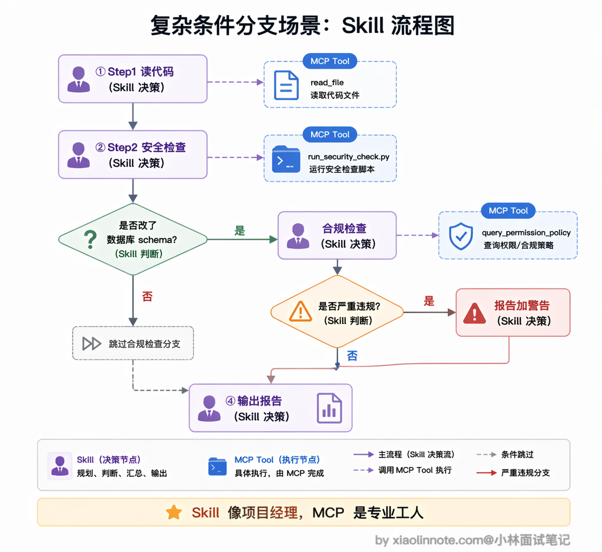

# MCP 和 Agent Skill 的区别是什么？

> 原文：[MCP 和 Agent Skill 的区别是什么？](https://xiaolinnote.com/ai/tools/10_mcp_vs_skill.html) · 小林面试笔记


👔面试官：MCP 和 Agent Skill 有什么区别？

🙋‍♂️我：它们都是给 Agent 加能力的吧？MCP 是用工具列表来描述 Agent 能做什么，Skill 也是描述 Agent 能做什么，本质上差不多，只是格式不同。

👔面试官：「本质上差不多」？那你觉得为什么要搞两套东西，一套不就够了？如果真的差不多，为什么 MCP 和 Skill 的结构、加载方式、使用场景完全不一样？

🙋‍♂️我：嗯……可能 Skill 就是一种更高级的 prompt 模板？把常用的指令保存下来，比 MCP 多了一些描述信息？

👔面试官：你又把 Skill 降格成「prompt 模板」了。Skill 可不只是一段指令文字，它是一个完整的文件夹，里面有指令、脚本、模板、参考文档，而且能被 Agent 自动发现和按需加载。MCP 给 Agent 提供的是工具和数据的访问能力，Skill 教 Agent 拿到这些工具之后该怎么用。一个是「能力」，一个是「知识和流程」，层次完全不同。你把这两者的定位和分工搞清楚。

好，这段对话的误区很典型，很多人把 MCP 和 Skill 当成同类概念。下面我把两者各自的定位和配合方式拆开讲清楚。

## 💡 简要回答

MCP 和 Agent Skill 不是同类概念，不是竞争关系，而是互补的。

MCP 解决的是「Agent 怎么获得外部能力」，它把数据库、API、文件系统这些外部工具标准化封装成服务，Agent 通过 MCP 就能查数据、调接口、读写文件。

Skill 解决的是「Agent 拿到这些能力之后，该按什么步骤、什么标准来完成任务」，它把完成某类工作的知识和流程打包成可复用的模块。

简单记：MCP 主要解决外部能力的发现与调用，Skill 主要承载知识、约束与工作流。两者经常组合，但不是必须绑定；Skill 可以使用宿主内置工具、脚本或人工步骤，MCP 也可以被程序直接调用。

## 📝 详细解析

### 从定位说起：两者解决的不是同一个问题

很多人第一次接触这两个概念会觉得它们都跟「Agent 能做什么」有关，但仔细一想会发现，两者的目的和工作层次完全不同。



MCP 解决的是「Agent 怎么获得外部能力」。没有 MCP 之前，Agent 就是一个只会说话的语言模型，你让它查数据库它查不了，让它读文件它读不了，让它调 API 它也调不了。MCP 把这些外部工具标准化封装成独立的服务，Agent 连上 MCP Server 就能用这些工具了。所以 MCP 解决的是「从无到有」的问题，让 Agent 有能力去操作外部世界。

Skill 解决的是另一类问题：「Agent 有了这些能力之后，该怎么用」。你想，Agent 现在能查数据库了、能读文件了、能调 API 了，但面对一个「帮我做代码审查」的任务，它该先做什么后做什么？检查哪些维度？用什么格式输出？这些「知识和流程」，就是 Skill 要提供的。

用一个类比就很好理解。MCP 就像给新员工配电脑、装软件、开各种系统权限，这些是他「能做事」的前提。但光有电脑和权限是不够的，你还得给他一份操作手册，告诉他做代码审查的时候先检查什么、后检查什么、用什么标准判断、最后用什么模板写报告。这份操作手册就是 Skill。



### MCP：让 Agent 有「手」

理解了两者的定位差异，先来展开看看 MCP。为什么说它是 Agent 的「手」？因为如果没有 MCP，Agent 就只会「说话」，不会「做事」。

MCP Server 暴露的 Tools、Resources、Prompts 是可由 Host 管理的能力。模型侧是否用 Function Calling、是否看到完整 schema、结果如何回填，都由宿主与模型 API 的适配决定。Tool 通常粒度较小，但可以是只读或有副作用；schema 也必须经过权限和来源审查。

简单说，MCP 让 Agent 从「只会聊天」进化成了「能真正干活」，这是一切上层能力的前提。

### Skill：给 Agent 一份「操作手册」

有了 MCP 之后，Agent 确实能查数据、调 API 了，但面对一个复杂任务，它怎么知道该按什么顺序用这些工具？该关注哪些维度？该用什么标准判断质量？这就是 Skill 要解决的问题。

以 Claude Code 当前的实现为例，Skill 通常是包含 `SKILL.md` 的目录，可附带脚本、参考文档和模板；其他 Agent 的目录、frontmatter 和执行权限可能不同。它是工作流/知识的封装，不自动授予任何工具或网络权限。

Skill 和普通 prompt 最大的区别在于两点。

- 第一，某些宿主支持自动发现和按需加载，另一些宿主要求显式调用；不能把自动激活当作格式保证。
- 第二，渐进式加载是常见的上下文策略，但描述长度、加载时机、正文上限和辅助资源策略都由实现决定。脚本执行还要受沙箱、权限和人工确认控制。

所以 Skill 的粒度比 MCP 工具粗得多。MCP 的粒度是单个函数调用，比如 `read_file`、`query_database`；Skill 的粒度是一个完整的工作流程，比如「代码审查」「数据分析报告」，内部可能涉及好几个步骤、调用好几个工具。



### 两者怎么配合工作

看到这里你可能会想，既然 MCP 提供工具、Skill 提供流程，那它们在实际系统里是怎么配合的？咱们用一个代码审查的场景走一遍就清楚了。

用户对 Agent 说「帮我审查一下这次提交的代码」。Agent 收到任务后，先扫描自己可用的 Skill 列表，发现有一个叫 code-review 的 Skill 和这个任务匹配度很高。于是 Agent 加载它的 [SKILL.md](http://SKILL.md) 正文，读取里面的执行流程。这份 [SKILL.md](http://SKILL.md) 长这个样子：

```yaml
---
name: code-review
description: "对代码进行全面审查，识别 bug、安全漏洞和性能问题"
---

# 代码审查

## 第一步：读取待审查的代码文件
读取用户指定的代码文件，理解功能和修改范围。

## 第二步：执行安全检查
运行 scripts/check_security.py 对代码做自动化安全扫描。

## 第三步：输出审查报告
使用 assets/report_template.md 的模板格式，输出结构化审查报告。
```

你看，[SKILL.md](http://SKILL.md) 的作用就是告诉 Agent「做什么、按什么顺序做」，它就是一份操作手册。

但 Skill 只定义了流程，真正「动手」的时候还是得靠 MCP。Agent 执行第一步「读取代码文件」，需要调用文件系统 MCP Server 提供的工具：

```python
# Skill 第一步说：读取待审查的代码文件
# Agent 发现 MCP 有 read_file 工具，于是调用它
code = mcp_client.call_tool("read_file", {
    "path": "src/auth.py"    # 要审查的文件路径
})
```

执行第二步「安全检查」时，Agent 可以在宿主允许的沙箱中运行 Skill 自带脚本，也可以改用内置工具或人工检查。可执行脚本是安全边界，不是 Skill 天然拥有的权限。

执行第三步「输出报告」时，Agent 加载 Skill 的 `assets/report_template.md` 模板，按照里面定义的格式把审查结果整理成结构化报告返回给用户。

整个流程的分工非常清晰：Skill 扮演「编排者」，定义了做什么、按什么顺序做、用什么标准做；MCP 扮演「执行者」，提供了每一步需要调用的具体工具。两者配合起来，Agent 才能既知道「该怎么做」，又有能力「真正去做」。



再看一个稍复杂的场景，你就能感觉到这种分工的威力。假设 Skill 定义的流程里有一步「如果改动涉及数据库表结构，额外执行权限合规检查」，这就是条件分支。

Agent 读到这条指令时，会先调用一个 MCP Tool 去扫描这次提交有没有改数据库 schema，拿到结果（布尔值）之后再决定要不要走那条分支；如果要走，就再调另一个 MCP Tool（比如 `query_permission_policy`）去查合规规则，最后根据结果决定审查报告里是否要加一条严重级警告。

整个过程里，Skill 就像项目经理，拿着流程图和判断标准指挥执行；MCP 提供的每个 Tool 就像专业工人，各自只管做好一件小事。

缺了 Skill，Agent 可能缺少领域流程；缺了 MCP，Skill 仍可以使用内置工具、脚本或 API 适配器。两者的组合常常有价值，但不是互相不可替代的硬依赖。

### 组合时的请求生命周期

```text
用户任务
  ↓
宿主决定是否加载 Skill（来源/版本/触发策略）
  ↓
Skill 提供约束与步骤 ──┐
                        ├─> 模型或程序选择动作
MCP/内置工具提供能力 ────┘
  ↓
权限/参数/预算/确认 → 执行 → 结果/错误 → 验收与收敛
```

审查一个组合时，至少要问：Skill 内容是否可信？工具是否最小权限？脚本是否隔离？副作用是否需要确认？失败是否可重试且幂等？



## 🎯 面试总结

回到开头对话踩的雷，最大的误区就是把 MCP 和 Skill 当成同类概念来对比。面试回答这道题，第一个必须说清楚的是两者的定位差异：MCP 提供工具和数据的访问能力，解决的是「Agent 怎么做事」；Skill 提供完成任务的知识和流程，解决的是「Agent 该怎么做事」。一个是能力，一个是知识。

第二个关键点是粒度差异。MCP 通常描述可发现的远程能力，Skill 通常描述知识与工作流；两者的实际粒度、schema 可见性和加载方式取决于宿主。

第三个加分点是讲清楚两者的配合方式：Skill 给出流程与验收标准，Host 可以把 MCP 或内置工具作为执行能力；二者之间由 Host 负责适配、权限、错误处理与审计，而不是把 Skill 当成自动获得工具权限的脚本。

---
