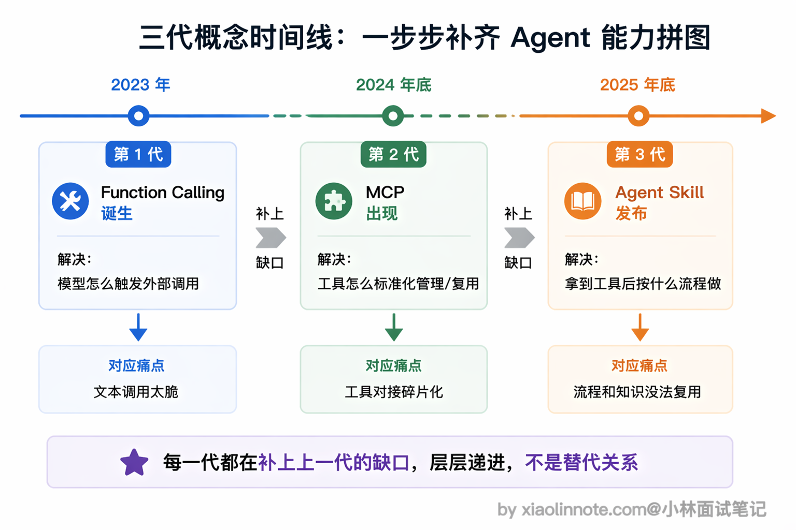
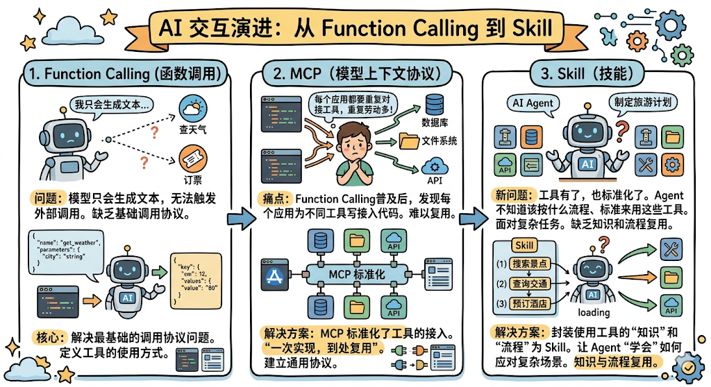
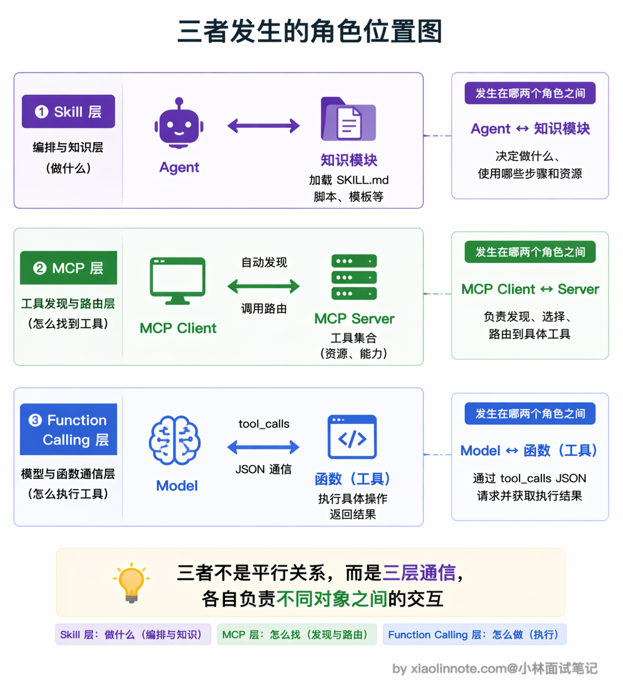
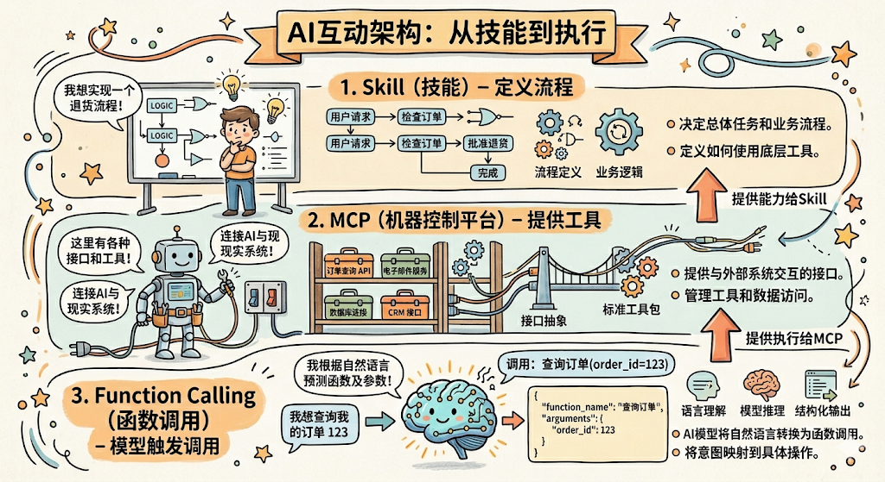
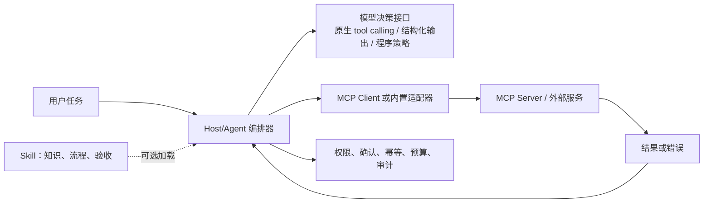
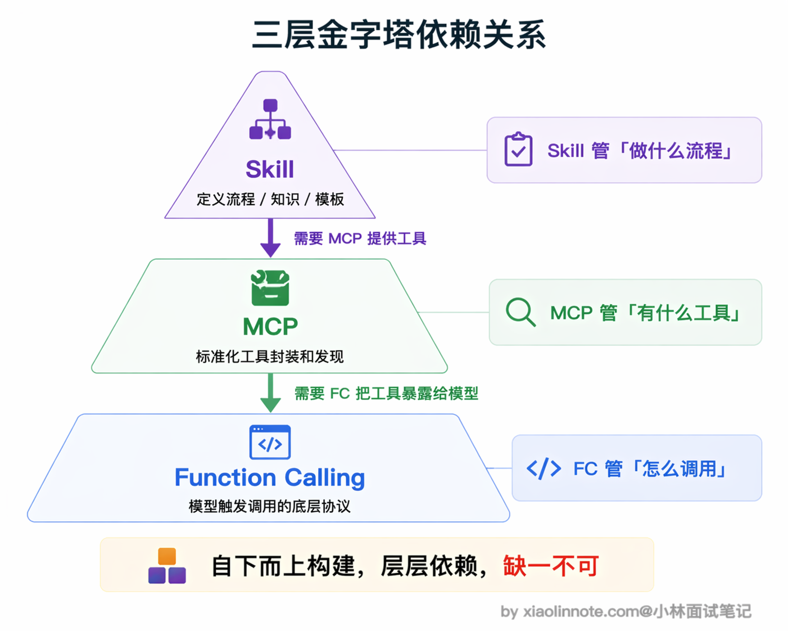
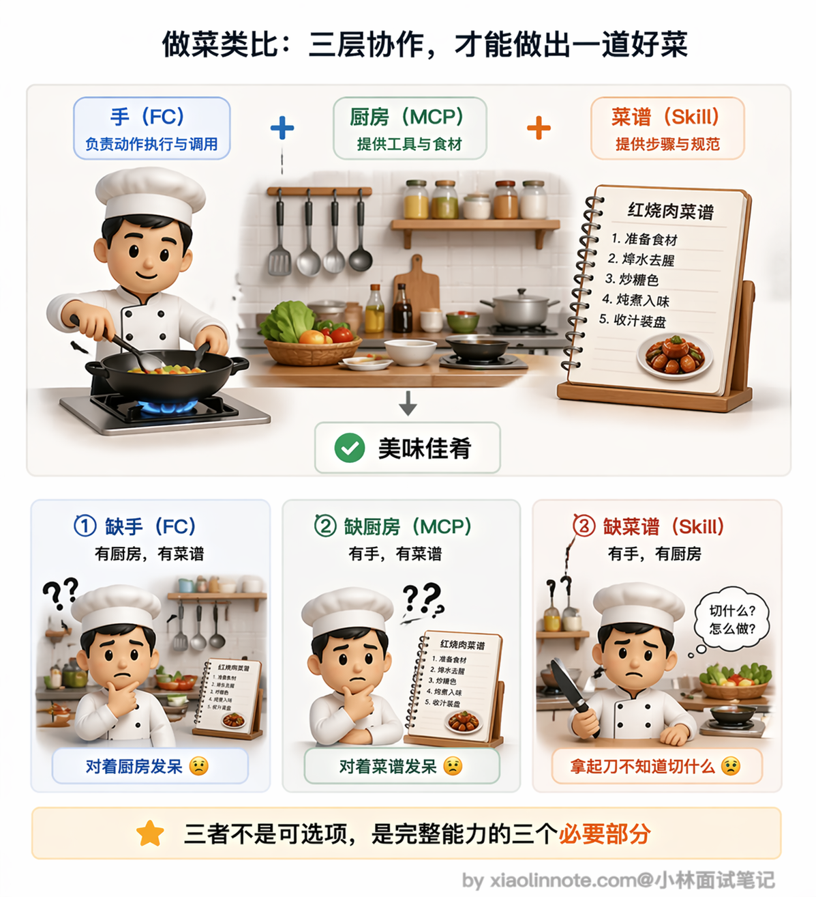
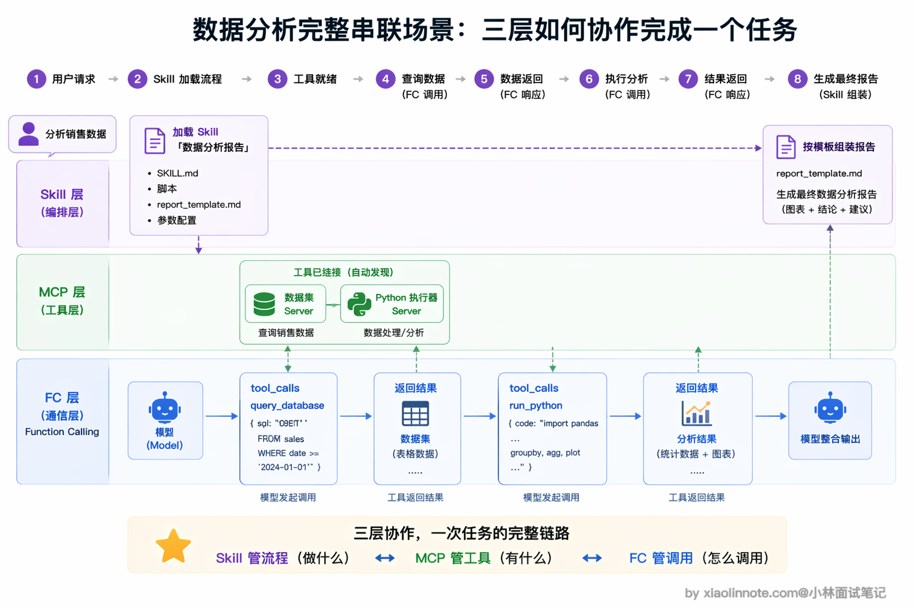

# Function Calling、Skill、MCP 这三个有什么区别？

> 原文：[Function Calling、Skill、MCP 这三个有什么区别？](https://xiaolinnote.com/ai/tools/11_fc_skill_mcp.html) · 小林面试笔记

👔面试官：Function Calling、Skill、MCP 这三个概念有什么区别？

🙋‍♂️我：这三个都是让模型调用外部工具的方式吧？Function Calling 是 OpenAI 的方案，MCP 是 Anthropic 的方案，Skill 也是 Anthropic 的方案，它们是不同时期搞出来的竞争方案。

👔面试官：竞争方案？那你觉得一个系统里只需要选其中一个用就行了？它们是可以互相替代的？

🙋‍♂️我：也不完全是替代关系……它们应该各有侧重？比如 Function Calling 管函数调用，MCP 管工具标准化，Skill 管流程模板？但我不太确定它们之间有没有层级关系。

👔面试官：你前半段说的方向沾边了，但关键问题是你没搞清楚这三者的层级依赖。它们不是并列的三个方案，而是从底到顶的三层架构：Function Calling 是最底层的调用语言，MCP 在它之上做工具标准化，Skill 在最上层把使用工具完成任务的知识和流程封装成可复用模块。你把每层解决什么问题搞清楚，三者的区别就一目了然了。

好，这段对话踩的雷挺典型的，很多人一上来就把这三个当成平行的竞争方案，或误以为它们有固定的上下层依赖。下面按「边界」而不是按虚构的层级拆开讲清楚。

## 💡 简要回答

这三个概念可以组合，但不是严格的三层协议栈，也不要求彼此全部存在。

Function Calling / tool calling 是模型 API 侧的一种结构化调用接口，解决的是「模型如何表达要调用哪个能力以及参数」。字段和语义由具体提供商定义。

MCP（Model Context Protocol，模型上下文协议）解决的是「Host/Client 如何发现、连接和调用外部工具、资源与提示模板」，可降低跨应用复用成本；它不规定模型必须使用某家的 Function Calling。

Agent Skill 通常是宿主约定的知识、指令和工作流包，解决的是「任务按什么原则与步骤完成」。它可以使用 MCP，也可以使用内置工具、脚本或人工确认。

简单记就是：模型侧 tool calling 是「表达动作的格式」，MCP 是「能力连接与发现协议」，Skill 是「可复用的任务知识/流程」。

## 📝 详细解析

### 为什么会有三个概念

这三个概念放在一起确实很容易让人迷惑，但它们解决的是不同边界的问题。实际系统可以只用其中一个，也可以用 Host 把它们组合起来。

怎么理解呢？咱们先建立一个直觉感受：Function Calling 是「模型说：我要调这个函数」，MCP 是「工具服务说：我能提供这些函数」，Skill 是「操作手册说：用这些工具按这个流程做」。你看，三句话的主语不一样，说话对象不一样，粒度也不一样，这就是三者的本质差异。

再从时间线来看就更清楚了。

Function Calling 是最先出现的，当时的核心问题是「模型只会生成文本，怎么让它能触发外部调用」，所以 Function Calling 解决的是最基础的调用协议问题。

后来大家发现每个应用都要自己写代码对接各种工具，重复劳动太多。MCP 提供了一种标准化的工具/资源连接方式，但复用仍受版本、认证、权限和客户端能力约束。

另一个独立问题是：Agent 面对复杂任务不知道该按什么流程、什么标准做。Skill 这类机制用于复用知识和流程；它不必等 MCP 出现，也不必把所有执行能力都放在 MCP 中。

三者的出现背景不同，自然解决的是不同层次的东西。

### 从「谁和谁通信」来看三者位置

理解三者最清晰的切入点是：每个机制发生在哪两个角色之间。

**Function Calling** 发生在模型 API 与宿主程序之间，是结构化调用接口。模型生成某种 provider-specific 的调用块，宿主校验、授权、执行并按对应格式回填结果。

**MCP** 发生在 AI Host 内的 Client 与 Server 之间，是工具、资源和提示模板的发现/调用协议。Host 可以把 MCP 工具映射成某家模型的 tool schema，但这只是组合方式，不是 MCP 的强制依赖。

**Skill** 发生在 Agent 运行时与可复用知识/工作流包之间。是否自动发现、如何加载 `SKILL.md`、脚本是否能执行，都由宿主实现。一个 Skill 可以调用多个 MCP 或内置工具，但不是必须如此。

### 三者的组合关系，而非固定层级

搞清楚三者各自的位置，接下来要问的是：它们能怎样组合？答案是存在常见适配链，但没有唯一、强制的层级。

常见组合是：Skill 提供流程 → Host 选择内置或 MCP 能力 → 模型用 tool calling 表达动作 → Host/Client 校验并执行。但也可能是：Skill 直接指导脚本；程序直接调用 MCP；模型用约束 JSON 而不是原生 tool calling。因此不要把「Skill → MCP → Function Calling」说成唯一依赖链。

用做菜来类比就很好理解。

Function Calling 是你的「手」，能拿刀、能点火、能翻锅，这是最基础的操作能力。MCP 是你的「厨房」，里面有各种厨具和食材，刀在抽屉里、调料在架子上、食材在冰箱里，你走进厨房就知道有哪些东西可以用。Skill 是那份「菜谱」，告诉你先热锅凉油、再放姜蒜爆香、然后下主料翻炒、最后调味出锅。

跳过某一层不一定意味着系统不能工作：没有 Skill 可以用临时提示和程序流程；没有 MCP 可以用内置函数或服务适配器；没有原生 Function Calling 可以用约束输出或人工/程序路由。代价是复用性、可靠性、上下文成本或开发成本不同。

### 用一个完整故事串联三者

把三者放在同一个场景里感受一下各层分工。用户对 Agent 说「帮我分析最近三个月的销售数据，找出下滑的产品线，给改进建议」。

首先是 **Skill 层**在起作用。Agent 收到任务后，扫描自己可用的 Skill 列表，发现有一个叫「数据分析报告」的 Skill 和这个任务高度匹配。于是 Agent 加载这个 Skill 的 [SKILL.md](http://SKILL.md) 正文，读取里面定义的分析流程：第一步从数据库取数据，第二步用 Python 做趋势分析，第三步按模板写分析报告。Skill 就像一份菜谱，把整个任务的步骤和标准安排得明明白白。

然后是 **MCP 层**在起作用。执行第一步「从数据库取数据」的时候，Agent 的 MCP Client 已经连着数据库 MCP Server 和 Python 执行器 MCP Server，自动知道有 `query_database` 和 `run_python` 这些工具可用。MCP 就像厨房，里面的厨具和食材随时可以取用，不需要任何手动配置。

最底层是 **Function Calling** 在起作用。模型判断需要查数据库，输出 `tool_calls: query_database(sql="SELECT product, revenue FROM sales WHERE date >= '2026-01-01'")`，MCP Client 把这个请求路由到数据库 Server 执行，拿到结果后模型继续处理。接着模型输出调用 Python 执行器的 Function Calling，对数据做趋势分析。最后 Agent 按 Skill 里定义的报告模板把结果整理成结构化的分析报告返回给用户。

整个流程里 Skill 做可复用流程，MCP（若采用）做外部能力连接，模型侧调用接口表达动作，Host 负责把三者串起来并守住权限、错误和成本边界。

## 🎯 面试总结

回到开头对话踩的雷，最大的误区是把三者当成竞争方案或固定三层协议栈。面试回答时分别说清：模型侧调用接口、Host/Server 能力协议、Skill 工作流约定；再说明常见组合与可替代路径。

第二个关键点是用类比帮面试官快速理解。Function Calling 是「语言」，让模型能说出要调什么函数；MCP 是「工具箱」，把工具标准化打包，随时插拔；Skill 是「操作手册」，教 Agent 用工具箱里的工具按什么流程完成工作。

面试时可以用完整场景串起来：Agent 按 Skill 定义的流程执行，Host 从 MCP 或内置适配器取得能力，模型通过某种结构化决策接口提出调用，宿主做权限/参数/错误处理。最后补充失败降级、幂等、审计、延迟和 token 成本，回答会比背层级更可靠。

---
