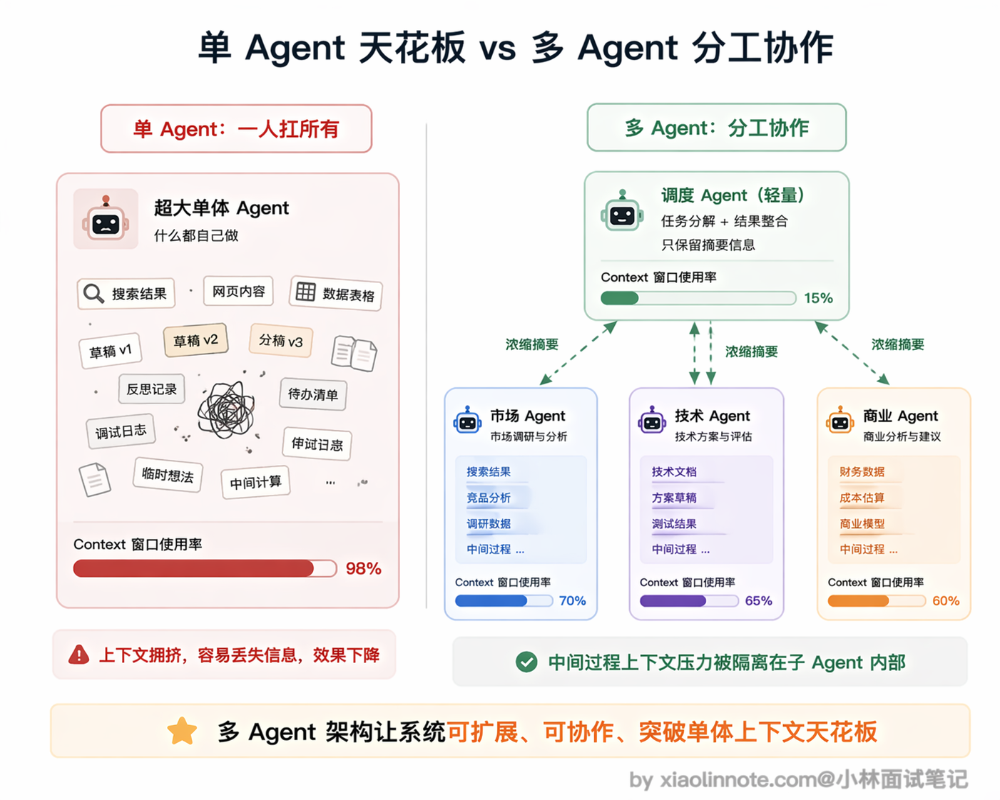
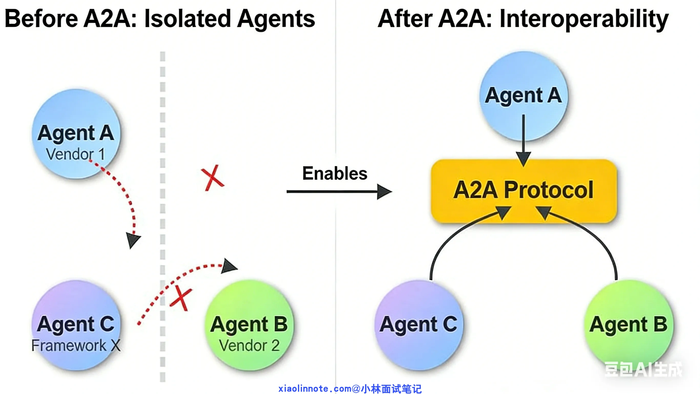
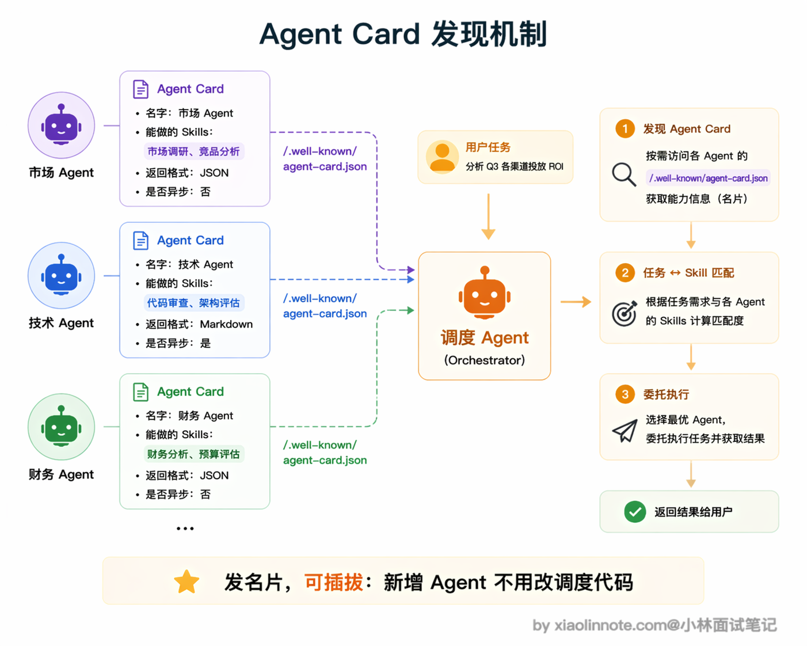
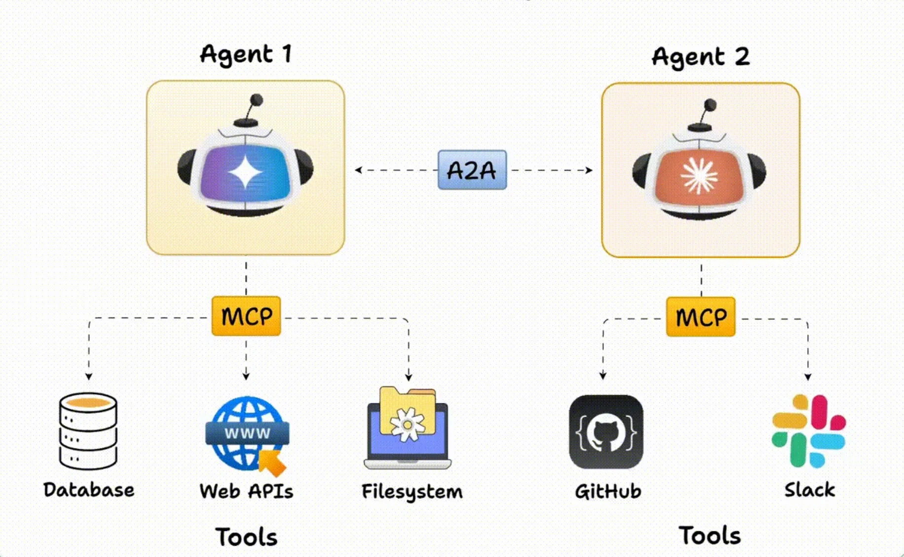
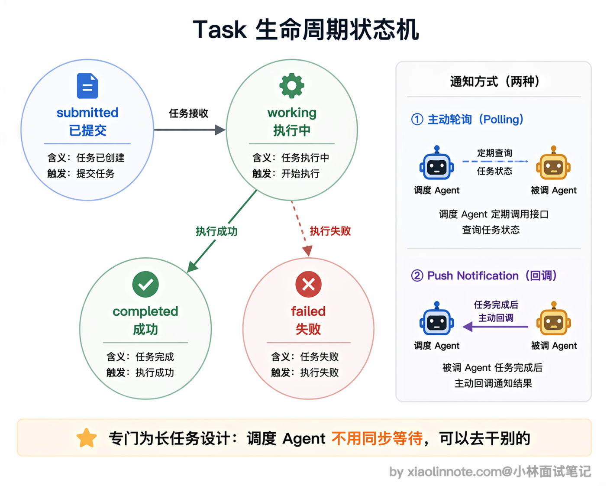
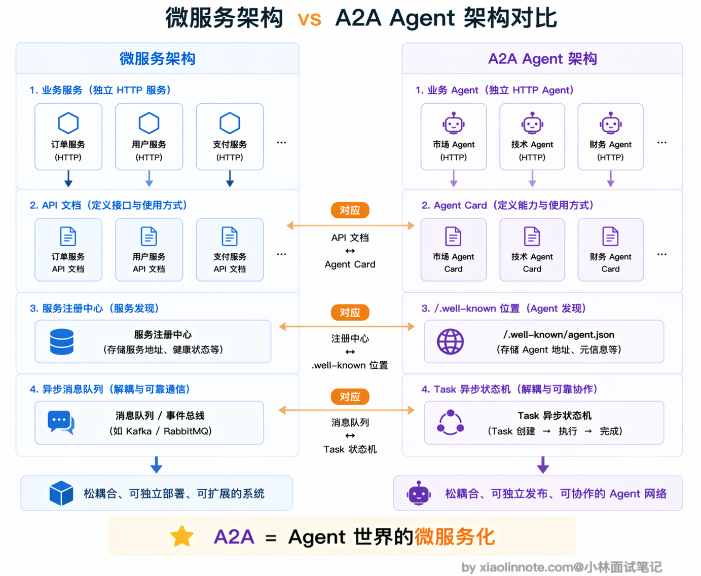
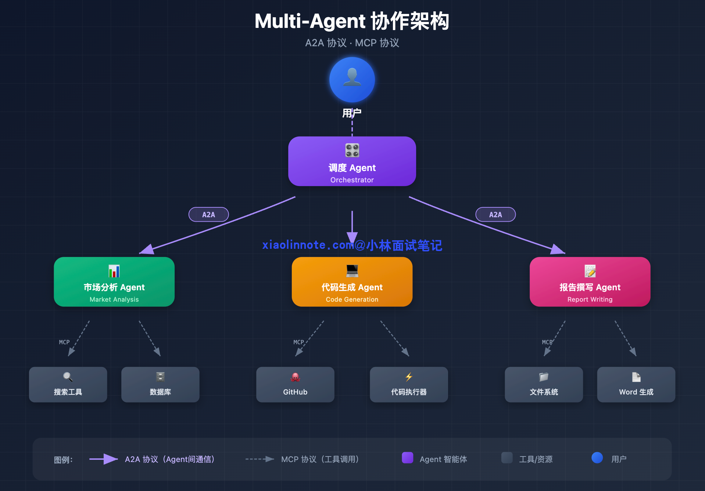
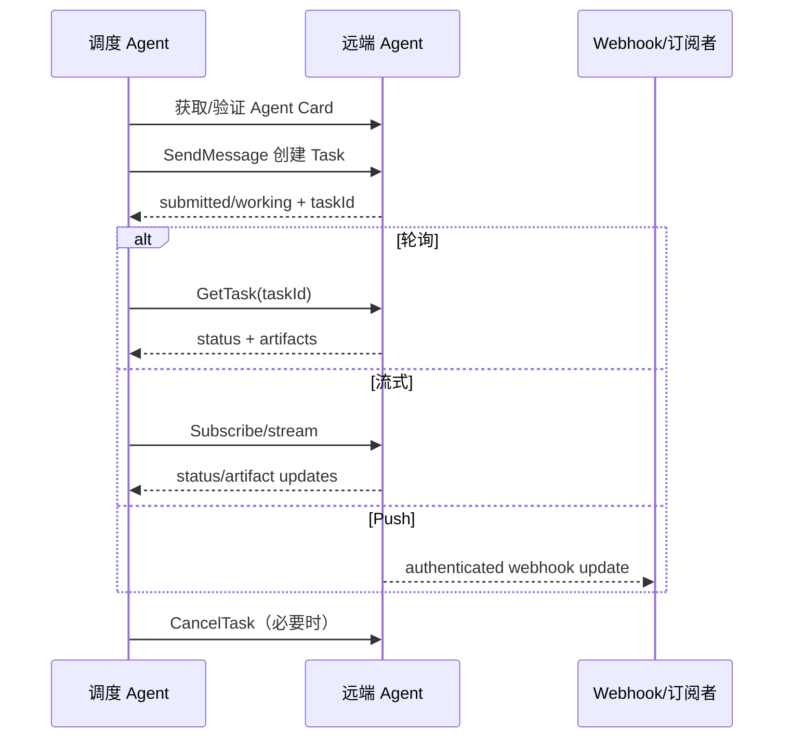
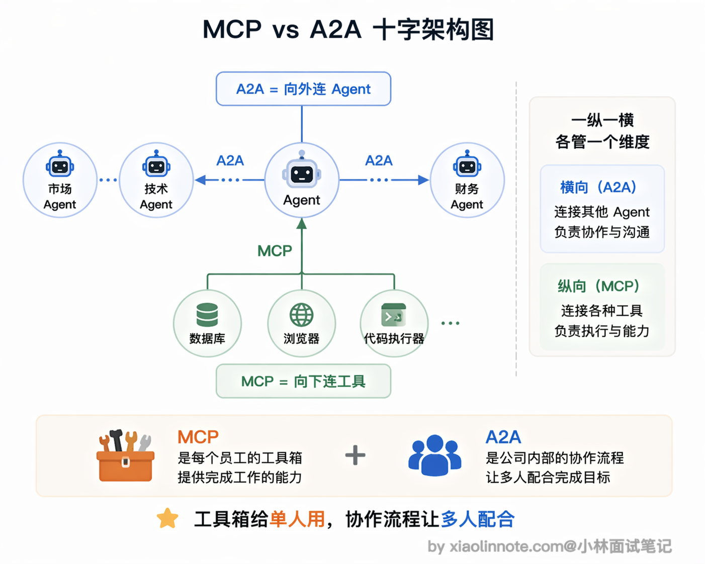

# 什么是 A2A 协议？它和 MCP 协议的区别是什么？

> 原文：[什么是 A2A 协议？它和 MCP 协议的区别是什么？](https://xiaolinnote.com/ai/tools/12_a2a_protocol.html) · 小林面试笔记

👔面试官：说说什么是 A2A 协议，它和 MCP 有什么区别？

🙋‍♂️我：A2A 是 Google 出的一个协议，我理解它就是 MCP 的竞品吧，Google 想自己搞一套标准来替代 MCP。

👔面试官：竞品？MCP 解决的是什么问题，A2A 解决的又是什么问题，你搞清楚了吗？这两个协议面向的对象都不一样，怎么会是竞品？

🙋‍♂️我：那 A2A 应该是用来让 Agent 调用工具的另一种方式？就是和 MCP 一样连工具，只是协议格式不同？

👔面试官：A2A 全称是 Agent-to-Agent，注意看名字，是 Agent 到 Agent，不是 Agent 到工具。MCP 是 Agent 连工具和数据，A2A 是多个 Agent 之间互相通信协作。一个向下连工具，一个向外连 Agent，方向完全不同。你再想想，为什么需要多个 Agent 协作，单个 Agent 不够用吗？

确实，A2A 和 MCP 经常被放在一起比较，但很多人把它们的定位搞混了。下面我从「单个 Agent 的天花板」讲起，把 A2A 的设计思路和它与 MCP 的关系理清楚。

## 💡 简要回答

A2A（Agent-to-Agent）是一个面向 Agent 间协作的开放协议，最初由 Google 推动；项目治理、版本和绑定会演进，工程上应以当前规范与对端 Agent Card 为准。

我理解它和 MCP 的区别是这样的：MCP 解决的是「单个 Agent 怎么连工具和数据」，A2A 解决的是「多个 Agent 之间怎么分工协作」。

一个 Agent 通过 A2A 可以把任务委托给另一个 Agent，接收方通过能力声明告诉调用方支持的交互方式；协议模型可覆盖直接消息、带状态的长任务、流式更新和 webhook/push，具体能力要协商。

两者是互补的，不冲突：MCP 向下连工具，A2A 向上连 Agent，在复杂的多 Agent 系统里这两个通常都要用到。

## 📝 详细解析

### 为什么单个 Agent 不够用，上下文和专业边界

要理解 A2A 是干什么的，得先把「单 Agent 的天花板」搞清楚。

一个 Agent 可以抽象为模型、状态/上下文、策略编排、工具与输出；每个维度都有边界。拆成多个 Agent 可能隔离上下文与权限，但也会增加通信、协调、重复上下文和失败面。

首先是工具数量的限制，你不可能给一个 Agent 装 100 个工具，模型处理起来效率极低，容易混乱。

其次是上下文窗口的限制，128K tokens 听起来很多，但复杂任务积累的中间产物，搜索结果、草稿、反思记录，会很快把窗口塞满，后面的生成根本顾不上前面写了什么。

最后是专业能力的限制，同一个 Agent 既做代码审查又做市场分析，不如专门为各自任务配置或微调的 Agent 效果好。

举一个具体任务：「帮我做一份 AI 编程工具的竞品分析报告，要有行业趋势、技术对比、商业模式分析和 SWOT」。让单个 Agent 做这件事，问题是：搜索结果和草稿会把上下文撑满，等到写 SWOT 时，前面的行业趋势分析早就被挤出了有效注意力范围；而且市场调研和技术分析需要不同的知识侧重，一个 Agent 很难全面兼顾。

你可能会问，拆成多个 Agent 协作，上下文压力就真的变小了吗？

关键就在这里：调度 Agent 把「做行业趋势分析」委托给市场 Agent，市场 Agent 自己去搜几十个网页、写草稿、反复迭代，这些中间过程都在它自己的上下文里。任务做完，它只把最终结论（比如一份几百字的摘要）通过 A2A 返回给调度 Agent。

调度 Agent 可以只接收摘要或结构化产物，从而隔离部分中间过程；但这不是 A2A 自动完成的，摘要可能丢失证据，调用方仍需要求来源、版本、置信度和可追溯 artifact。

解决方案很自然：把任务拆开，交给不同的专业 Agent 并行处理，最后汇总。一个「调度 Agent」负责任务拆分，「市场分析 Agent」专门做趋势调研，「技术研究 Agent」专门做工具对比，每个只需聚焦自己擅长的部分，整体效果远好于一个 Agent 包揽所有。

### 多 Agent 的基础问题，Agent 之间怎么互相认识？

多 Agent 系统有一个绕不开的基础问题：Agent A 要把任务委托给 Agent B，它得先知道 B 能做什么。但怎么知道呢？

最笨的方案是写死配置：A 的代码里硬编码「B 可以做竞品分析」。这样太脆了，B 的能力一变，A 的代码就得改，根本没法维护。

更好的方案是让 B 主动「发名片」，声明自己能做什么，A 来查。这就是 A2A 里 **Agent Card** 的设计思路。

Agent Card 是用于发现和协商的 JSON 元数据，通常描述身份、endpoint、技能/能力、认证要求以及是否支持流式或 push；URI 和字段随规范版本变化，当前对端提供的 Agent Card 才是兼容性依据。调用方不应只凭公开名片信任远端，还要验证来源、TLS、认证和权限范围。

Agent Card 里最关键的是 **Skill 列表**，每个 Skill 描述一类能力，比如「竞品分析」「行业趋势分析」，并带有示例输入。调度 Agent 用这些 Skill 描述来做任务路由决策，「这个任务和哪个 Agent 的哪个 Skill 最匹配？」。

这套机制让多 Agent 系统更容易做能力发现和路由；但 schema 变化、认证、版本、错误语义和业务编排仍可能需要配置或代码变更，不能保证新增 Agent 完全零改动。

### Task，A2A 里的一等公民

A2A 里任务协作的基本单位是 **Task**。

调度 Agent 把一段任务委托给另一个 Agent，就是创建一个 Task；接收方执行这个 Task；完成后把结果作为 Task 的产出（artifacts，可以是文本、文件等）返回。

Task 是带状态的工作单元。常见状态包括 submitted、working、completed、failed、canceled、rejected 或 input-required 等，具体枚举以版本规范为准；调用方要处理非成功终态、需要补充输入和取消竞态。

为什么需要这么完整的状态机？因为 A2A 专门为**长时间任务**设计。

一个「竞品分析」任务可能要跑几分钟，先搜索、再整理、再写报告，不可能让调度 Agent 同步等着。

所以调度 Agent 提交任务后可以去处理其他事情，通过轮询、流式订阅或 push notification（若对端声明支持）接收更新。长任务仍需要超时、取消、重复投递、幂等键和 artifact 持久化策略。

调度 Agent 的视角可以保持在 Task、状态和 artifacts 上，而不必知道 B 的内部工具调用；但「黑盒」不代表不需要可观测性。生产系统仍要记录 trace、输入输出摘要、权限主体、版本和失败原因。

### A2A 的架构本质，Agent 的微服务化

如果你有后端开发经验，A2A 会让人联想到微服务，但它不是普通微服务的同义词。

在微服务架构里，服务通过 API 互调；A2A 借鉴了发现、认证和异步任务等思想，同时增加 Agent Card、Task、Artifact 与能力协商，不能只把「服务」换成「Agent」。

怎么理解这个对应关系呢？Agent Card 就像 API 文档，告诉别人「我能做什么、怎么调用我」。Task 状态机就像异步消息队列，支持提交任务后去做别的事、完成了再来取结果。而 `.well-known` 下的 Agent Card 就像微服务注册中心里的一条记录，让其他 Agent 能自动发现你。

当前常见绑定基于 HTTP(S)，但可用操作、流式和 push 能力由 Agent Card/版本声明；支持 A2A 不等于所有系统都能无条件互操作，也不等于不需要认证和业务适配。这个设计理念与 MCP 都强调边界标准化，但面向对象不同。

### A2A 和 MCP 的关系，一纵一横，各管一层

理清两者关系最简单的方式是看方向：MCP 是 Agent 向下连工具，A2A 是 Agent 向外连其他 Agent。

具体来说，一个专业 Agent 内部，用 MCP 连各种工具，比如数据库、浏览器、代码执行器，用 Function Calling 让 LLM 触发这些工具调用，这是「纵向」的连接。而多个 Agent 之间需要分工协作的时候，就用 A2A 来互相通信、委派任务、接收结果，这是「横向」的连接。两个协议解决的是完全不同维度的问题，不存在谁替代谁。

打个比方，MCP 就像公司里每个员工的「工具箱」，决定了这个人能用什么工具干活。A2A 就像公司里的「协作流程」，决定了不同岗位的人怎么分工、怎么交接任务。工具箱和协作流程是两回事，缺了哪个都不行。

在一个复杂的多 Agent 系统里，这两者可以同时使用：MCP 负责某个 Agent 与工具/资源的连接，A2A 负责 Agent 间任务协作；也可以只采用其中一种或使用内部 RPC。选择取决于边界、复用、认证、延迟和运维成本。

### A2A 请求生命周期与安全检查

调用方要验证 Agent Card 和认证信息，限制租户与数据范围，给任务设置超时/预算，使用幂等键避免重试重复执行，并把远端消息和 artifacts 当作外部输入而不是可信指令。

## 🎯 面试总结

回到开头的面试对话，最大的雷是把 A2A 当成 MCP 的「竞品」或「替代方案」，这说明没搞清楚两者面向的对象完全不同。

面试回答这道题，第一个必须说清楚的点是定位差异：MCP 是 Agent 向下连工具和数据源，A2A 是多个 Agent 之间向外互相通信协作，一纵一横，各管一层。

第二个关键点是 A2A 的核心机制：Agent Card 用于能力/认证发现，Task 与 Artifact 用于跟踪和交付，轮询、流式或 push 支持异步协作；它借鉴微服务思想，但不等同于普通微服务。

还要说清楚「为什么需要 A2A」，也就是单 Agent 的天花板问题：工具数量有限、上下文窗口有限、专业能力有限，复杂任务需要拆分给不同的专业 Agent 并行处理。

最后强调两者是可互补而非必然竞争：MCP 面向 Agent 与工具/资源，A2A 面向 Agent 与 Agent；是否同时使用，要用任务边界、信任边界、延迟、可观测性和运维成本来判断。

---
