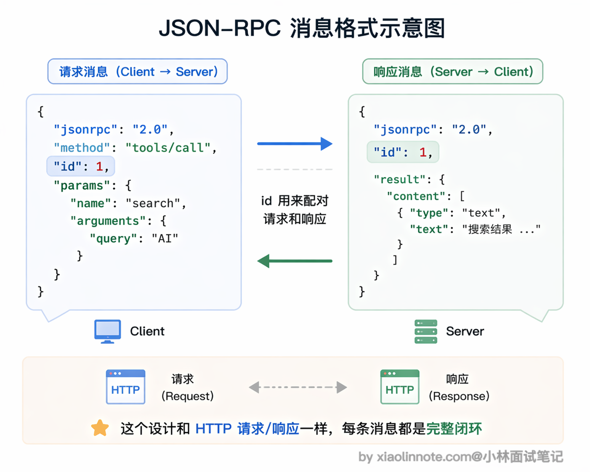
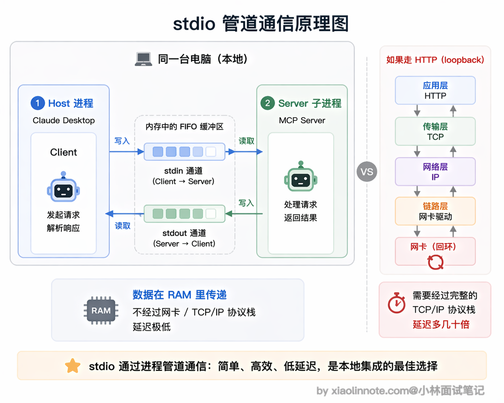
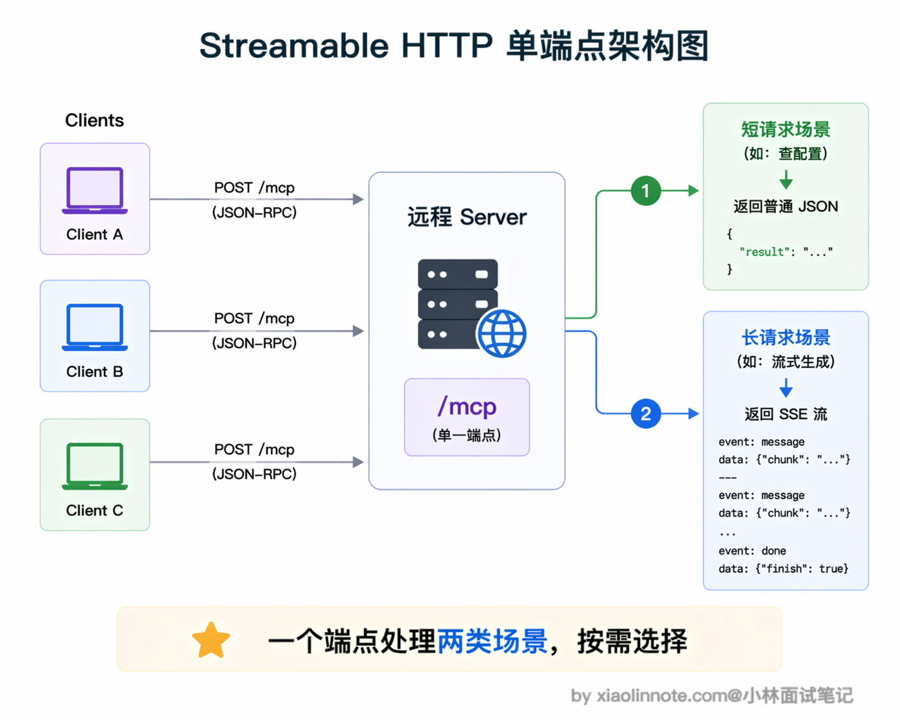
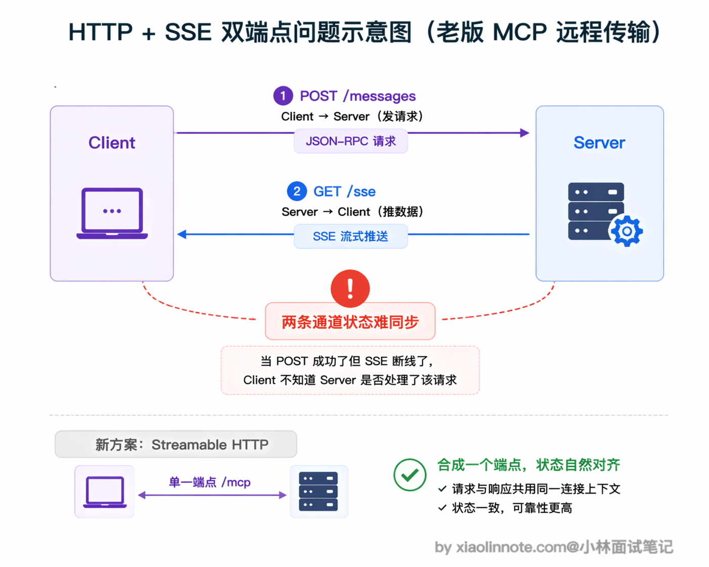
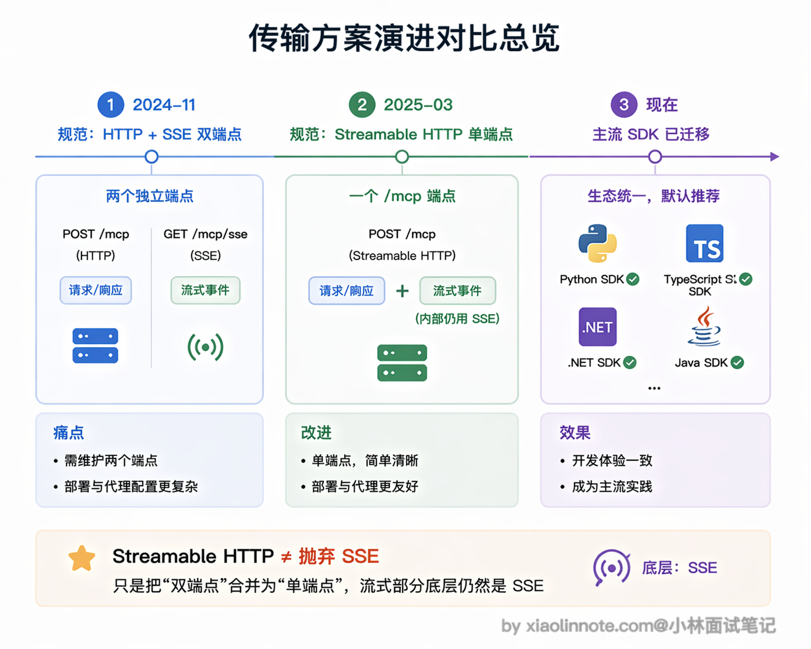

# MCP 协议通常采用什么通信方式？

> 原文：[MCP 协议通常采用什么通信方式？](https://xiaolinnote.com/ai/tools/13_mcp_transport.html) · 小林面试笔记


👔面试官：MCP 协议通常采用什么通信方式？

🙋‍♂️我：MCP 应该是用 WebSocket 吧？因为需要双向通信，Client 发请求、Server 推结果，WebSocket 全双工正好合适。

👔面试官：MCP 并没有用 WebSocket。你想想，MCP 有本地工具和远程工具两种场景，本地场景需要走网络吗？

🙋‍♂️我：本地的话……应该也是走 HTTP 吧，在本机起个服务，Client 通过 localhost 访问？

👔面试官：想复杂了。本地场景用的是 stdio，直接通过进程的标准输入输出通信，根本不需要网络。远程场景才用 HTTP，而且不是 WebSocket，是 SSE。另外不管哪种传输方式，底层消息格式统一用 JSON-RPC 2.0，这一点你也没提到。传输方式和消息格式是解耦的，这个设计是 MCP 灵活性的关键。

看来通信方式这块确实有不少容易搞混的地方，下面我把 MCP 的消息格式和两种传输方式都讲清楚。

## 💡 简要回答

MCP 支持两种主要的传输方式，分别适用于不同场景。

本地场景用 stdio，Client 把 Server 作为子进程启动，通过标准输入输出通信，通常不用开端口，减少了网络暴露面；但仍需审查启动命令、环境变量、文件权限和子进程的工具权限。我用 Claude Desktop 接本地工具走的就是这种方式。

远程场景现在推荐用 Streamable HTTP，Server 作为独立的 HTTP 服务部署，多个 Client 可以共享同一个 Server，适合团队统一管理工具服务。

较早的 MCP 规范（例如 2024-11-05）定义过「HTTP + SSE」双端点方案；当前规范以 Streamable HTTP 为远程传输主线，旧实现仍可能为了兼容而保留，但不应把历史方案当成新项目默认方案。

不管哪种传输方式，底层消息格式都统一用 JSON-RPC 2.0，传输方式只影响「怎么传」，消息协议本身不变。

## 📝 详细解析

### MCP 的消息格式：JSON-RPC 2.0

在说传输方式之前，先说消息格式，因为不管用哪种传输方式，消息格式都是同一套。

那为什么 MCP 选了 JSON-RPC 2.0 呢？

其实原因很朴素：MCP 需要一种「Client 调用 Server 的方法，Server 返回结果」的通信模式，这本质上就是远程过程调用（RPC）。

而 JSON-RPC 2.0 是现成的、足够轻量的 RPC 规范，用 JSON 格式易读易调试，任何编程语言都能实现，不管 Server 是 Python 写的还是 TypeScript 写的，消息格式都一样，不需要额外的序列化工具。



每条消息就是一个 JSON 对象，格式固定：

```jsonc
// 请求消息（Client -> Server）
{
  "jsonrpc": "2.0",
  "id": 1,                        // 请求 ID，用于匹配响应
  "method": "tools/call",         // 调用的方法名
  "params": {
    "name": "take_screenshot",    // 工具名
    "arguments": {"url": "https://example.com"}
  }
}

// 响应消息（Server -> Client）
{
  "jsonrpc": "2.0",
  "id": 1,                        // 对应请求的 ID
  "result": {
    "content": [{"type": "image", "data": "...base64..."}]
  }
}
```

JSON-RPC 本身只定义消息格式，不关心底层怎么传输，MCP 在此基础上定义了两种传输层实现。

### 传输方式一：stdio（标准输入输出）

stdio 是 MCP 最常用的传输方式，适合**本地工具**的场景。

工作原理：MCP Client（比如 Claude Desktop）在启动时，把 MCP Server 当作一个**子进程**启动，然后通过进程的标准输入（stdin）发送请求、从标准输出（stdout）读取响应。两个进程在同一台机器上运行，通过操作系统的管道通信。

这里的「管道」到底是什么？

你可以把它理解成操作系统在内存里给这两个进程分配的一段先进先出的小缓冲区：Client 往里塞一行 JSON，Server 从缓冲区的另一头读出来处理；Server 处理完再往另一条管道里塞一行 JSON，Client 从那头读。

整个过程不经过网卡、不经过 TCP/IP 协议栈，数据在 RAM 里走了一趟就到了，所以延迟天然比网络请求低得多，也不需要序列化成网络可传输的字节流。



stdio 方式有几个很明显的优点。

- 首先延迟极低，进程间通信比走网络快得多，数据直接在操作系统管道里流转，几乎没有开销。
- 其次通常不需要开端口，网络暴露面较小，但这不等于“没有安全问题”：Server 仍可能读取本地文件、访问网络或继承敏感环境变量。通常由 Client 管理子进程生命周期，但异常退出、僵尸进程、日志泄漏和权限隔离仍需显式处理。

在实际使用中，你只需要在配置文件里告诉 Client「用什么命令启动 Server」就行了，比如在 Claude Desktop 的 `claude_desktop_config.json` 里这样配置：

```json
{
  "mcpServers": {
    "filesystem": {
      "command": "npx",               // 启动命令
      "args": ["-y", "@modelcontextprotocol/server-filesystem", "/tmp"],
      "env": {}                       // 环境变量（可选）
    }
  }
}
```

### 传输方式二：Streamable HTTP（当前标准的远程传输）

远程场景下，Server 作为独立的 HTTP 服务运行，Client 通过网络连接访问。MCP 当前推荐的远程传输方式是 **Streamable HTTP**。

Streamable HTTP 的核心设计是用一个 MCP HTTP 端点（常见路径是 `/mcp`，但路径由部署决定）接收 JSON-RPC 消息。Client 通常通过 POST 发送请求，Server 可以返回 `application/json` 的一次性响应，也可以返回 `text/event-stream` 事件流；Client 还可以按规范使用 GET 建立服务器到客户端的事件流。是否保持流、是否复用会话以及断线如何恢复，取决于具体请求和实现，不能简单等同于“永远不需要长连接”。

Streamable HTTP 的优点很明确。Server 可以部署在云端，多个 Client 共享同一个 Server，这对团队来说特别实用，比如团队共用一个部署在服务器上的数据库 MCP Server，所有人连同一个服务就行，不需要各自在本地跑一份。而且支持跨机器访问，不局限于本地环境，适合需要统一管理工具服务的团队或平台。



当然，相比 stdio 多了网络开销，延迟会略高一些，而且你还需要处理认证、网络中断重连等在本地场景下完全不用操心的问题。

### 为什么 SSE 被弃用了

你可能看到一些早期的 MCP 教程还在讲 SSE（Server-Sent Events，服务器推送事件）传输方式。更准确的说法是：HTTP + SSE 双端点是较早规范的历史方案；当前 Streamable HTTP 将请求入口与流式响应放进同一 MCP 端点，兼容策略取决于 Server 和 SDK 版本，新项目应以所依赖的当前规范和 SDK 文档为准。

为什么要替换？原因是架构上有一个小尴尬：Client 向 Server 发请求要走 POST 端点，Server 向 Client 推数据要走另一条 SSE 长连接端点，同一个对话被拆成了两条通道。这带来的具体问题是状态管理复杂，比如 Client POST 了一条消息之后网络突然断了，那条消息到底被处理了没、SSE 流会不会推回结果，Client 没有一个简单的办法判断，出问题时排查链路很长。



Streamable HTTP 的做法是把这两条通道合并成一个端点：Client 照样 POST 发请求，Server 根据情况决定返回「一个普通 JSON」还是「一条 SSE 流」，不需要 Client 提前开另一条连接。

注意这里的关键：Streamable HTTP 仍可使用 SSE 事件流（`Content-Type: text/event-stream`），但它不等于“只有 SSE”，也不保证所有实现都以同样方式处理断线、重连、会话和鉴权。实际部署仍需配置认证、Origin 校验、超时、代理缓冲、限流与重放/恢复策略。



## 🎯 面试总结

回到开头踩的雷，最常见的误区就是想当然地以为 MCP 用 WebSocket 或者 HTTP REST 接口。

面试回答这道题，首先要说清楚 MCP 常见的两类传输：本地可用 stdio（标准输入输出，Server 作为子进程运行，通过管道通信），远程可用 Streamable HTTP（Server 作为 HTTP 服务部署，通过 MCP 端点处理 JSON-RPC 请求，并可按需返回 JSON 或事件流）。stdio 减少网络暴露面但不自动消除本地权限风险；Streamable HTTP 便于共享部署，但必须考虑认证、会话、断线、代理与多租户隔离。

第二个要点是消息格式和传输方式的解耦。不管用 stdio 还是 Streamable HTTP，MCP 都以 JSON-RPC 2.0 消息表达请求、响应、通知和错误；但会话、鉴权、重连和能力协商仍受传输与实现影响，不能说“切换传输完全不影响行为”。

最后可以加分提一句传输方案的演进历史：早期远程实现常见 HTTP + SSE 双端点，当前规范主线是 Streamable HTTP（单个 MCP 端点，按请求返回 JSON 或事件流）。重点不是背日期，而是说明“JSON-RPC 消息层”和“stdio/HTTP 传输层”分离，并补充鉴权、断线恢复和代理兼容等生产问题。

---
