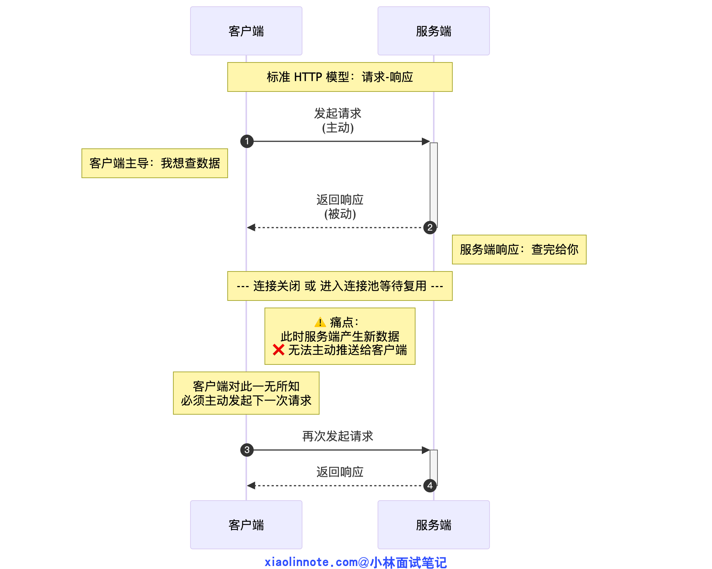
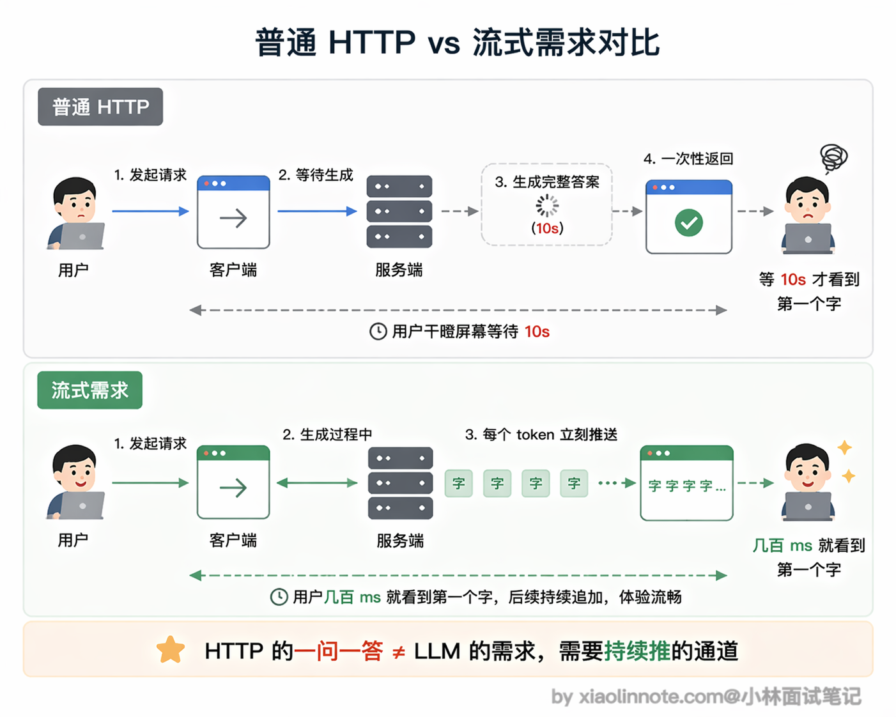
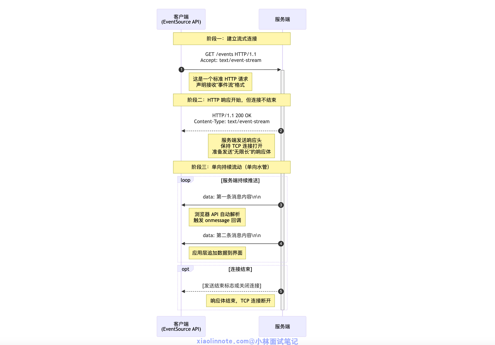
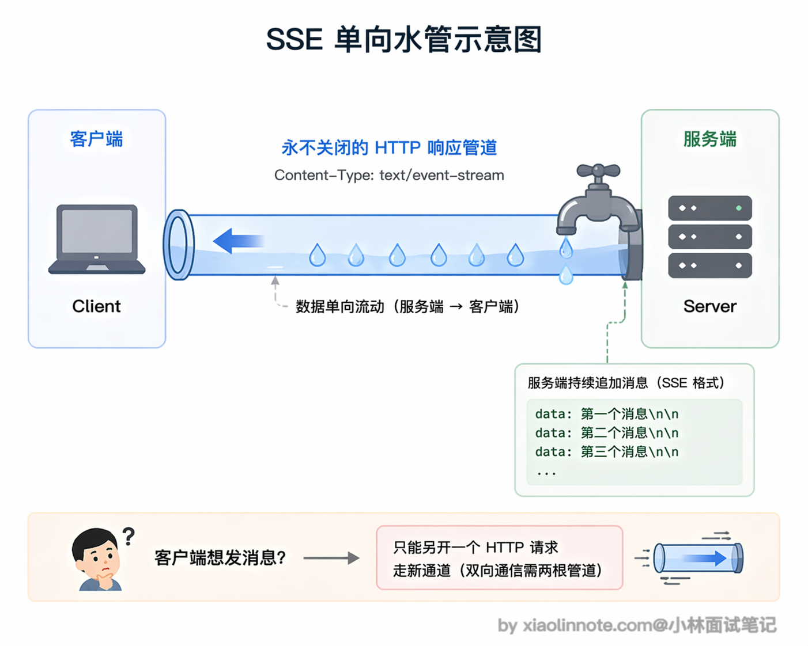
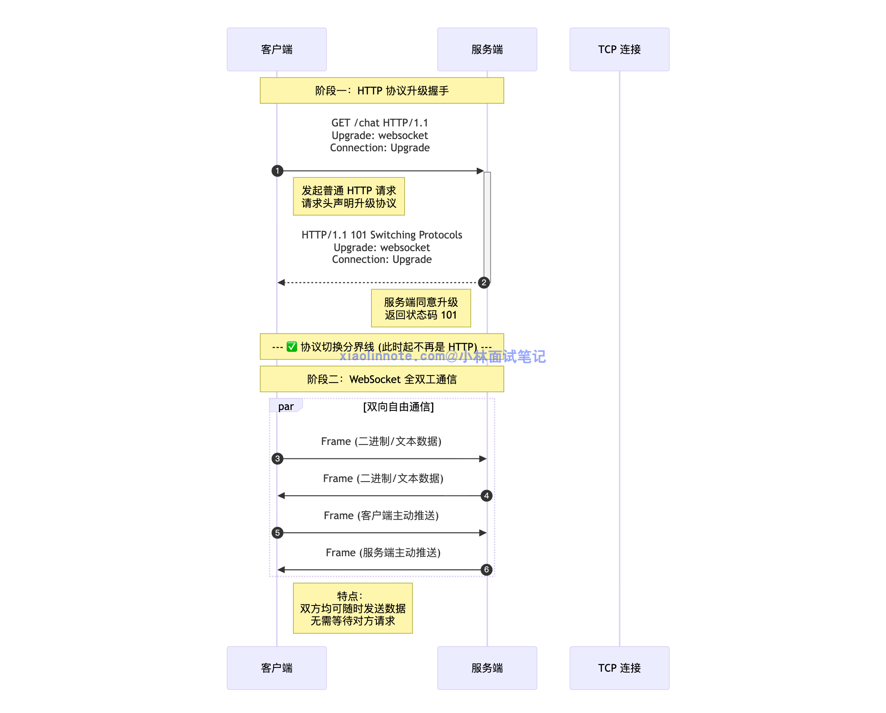
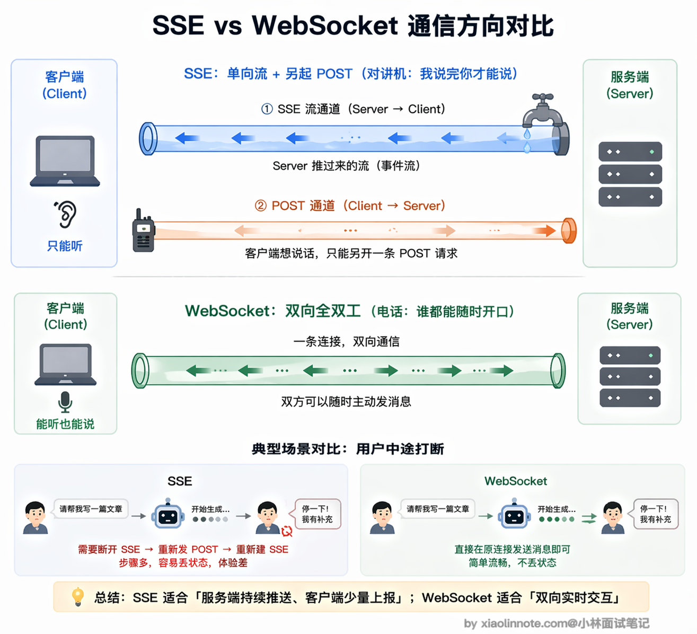
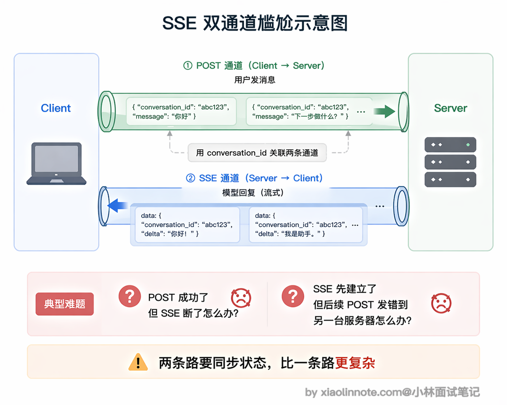
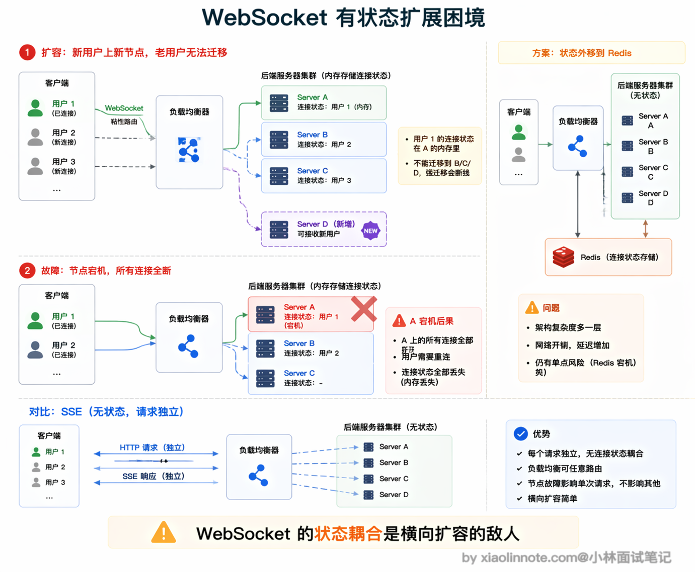
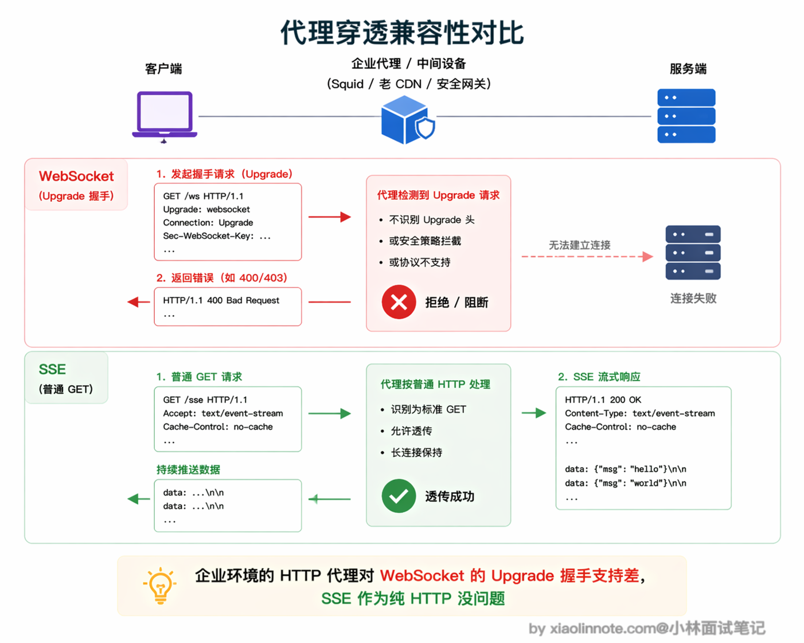
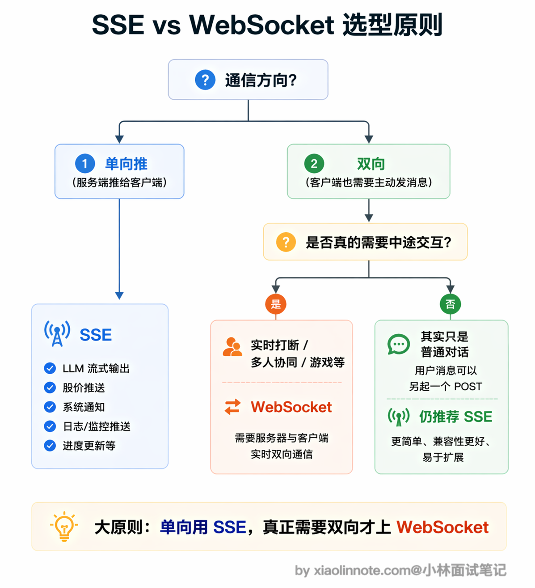

# 说说 WebSocket 和 SSE 通信的区别及局限性？

> 原文：[说说 WebSocket 和 SSE 通信的区别及局限性？](https://xiaolinnote.com/ai/tools/14_sse_vs_websocket.html) · 小林面试笔记

👔面试官：说说 WebSocket 和 SSE 通信的区别及局限性？

🙋‍♂️我：SSE 和 WebSocket 都是长连接，区别就是 SSE 比较简单，WebSocket 比较复杂。做 AI 对话的话，WebSocket 更好，因为它功能更强大，全双工嘛。

👔面试官：「功能更强大就更好」？那为什么 OpenAI、Anthropic 的流式 API 全都用 SSE 而不是 WebSocket？你得从实际场景出发去分析，不能只看功能强不强。

🙋‍♂️我：可能是因为 SSE 更简单吧？不过我觉得 SSE 就是 WebSocket 的简化版，功能上是 WebSocket 的子集，没什么本质区别。

👔面试官：这个理解不对。SSE（Server-Sent Events，服务器推送事件）是定义在 HTTP 响应之上的事件流格式，WebSocket 则是在 HTTP 握手后切换到独立的双向协议，两者不是简单的父子关系。SSE 受浏览器、HTTP 版本、代理缓冲和重连语义影响；WebSocket 则需要额外设计会话、扩展、鉴权和横向扩展。选型要看场景需求，不是简单的「谁是谁的子集」。

看来 SSE 和 WebSocket 的区别远不止「简单 vs 复杂」这么表面，下面我从底层原理到实际局限，把两者的核心差异和各自的坑都讲清楚。

## 💡 简要回答

我觉得最核心的区别是通信方向：SSE 是服务端单向推，客户端只能接收，想发消息只能另起一个 HTTP 请求；WebSocket 是全双工，双方都可以随时主动发消息。

对于 LLM 流式输出这种「模型持续推送增量、用户主要接收」的场景，基于 HTTP 的事件流通常够用，而且容易接入现有鉴权、代理和可观测链路；具体供应商的流式接口和事件格式仍需以其文档为准，不能把某两家产品的实现当成行业统一要求。

WebSocket 的复杂性只有在真正需要双向实时交互的时候才值得引入，比如用户要在模型说话过程中随时打断。

两者各有局限：SSE 在 HTTP/1.1 浏览器连接模型下可能受同源并发连接数限制，并且需要处理文本事件、代理缓冲、超时和重连；WebSocket 连接有状态、横向扩展和断线恢复需要额外设计，也可能被不支持 Upgrade 的中间设备影响。大多数以文本增量为主的对话可以先采用 HTTP 流式方案，再根据双向实时需求升级。

## 📝 详细解析

### 先从 HTTP 的本质说起

要真正理解 SSE 和 WebSocket 的区别，不能只看它们各自的功能列表，得先回到更底层的问题：它们到底在解决什么问题？答案是普通 HTTP 做不到的事情。

标准的 HTTP 请求是「一问一答」模型：客户端发请求，服务端返回响应，连接关闭（或者进连接池等待下次复用）。

服务端在任何时候都不能主动「推」数据给客户端，它只能被动等客户端来问。你可以把它想象成打电话：你说一句「你好」，对方回一句「你好」，然后挂电话，这条线就断了。这套机制在传统 Web 里够用，但 AI 对话场景不行。

模型生成一个完整回答需要几秒甚至十几秒，如果等全部生成完再一次性返回，用户只能干瞪着空白屏幕等待，体验极差。我们需要的效果是：模型生成一个词就推一个词，用户实时看到文字逐渐出现，就像 ChatGPT 那样一个字一个字「打」出来。这就需要连接保持打开、服务端能主动持续往外推数据，HTTP 的「问一答一然后断」做不到这件事。

### SSE：用普通 HTTP「撑开」一条单向水管

SSE（Server-Sent Events，服务器推送事件）是定义在 HTTP 响应之上的事件流格式，不是 WebSocket 的简化版，也不只属于 HTTP/1.1。客户端发起一个普通 HTTP 请求并声明 `Accept: text/event-stream`，服务端保持响应打开，按 SSE 格式写入事件；HTTP/2 或 HTTP/3 是否可用、代理是否正确转发，则取决于浏览器和基础设施。

它的做法是：客户端发一个普通 HTTP GET 请求，但在请求头里声明 `Accept: text/event-stream`，告诉服务端「我想收流式数据」。服务端收到后，不关闭连接，而是保持连接持续打开，不停往里写数据。

这条连接在技术上仍然是一个 HTTP 响应，响应体可以持续一段时间并在服务端需要时结束。可以把它理解为「一根从服务端流向客户端的单向水管」，水（数据）只能从服务端流向客户端；客户端若要提交消息或取消任务，需要另发 HTTP 请求或关闭连接。

有必要讲一下 SSE 的消息格式是什么样的，因为这直接决定了它为什么这么好用。

SSE 的数据不是 JSON，而是一种非常简单的纯文本格式，每条消息以 `data:` 开头，后面跟数据内容，结尾是两个换行符。

浏览器的 `EventSource` API 可以消费符合 SSE 约定的 GET 事件流；但带自定义鉴权头、POST 请求体或更复杂的事件协议时，应用也常用 `fetch`/其他 HTTP 客户端自行解析流。实际产品看到的 `data: {...}` 只是常见应用负载，不是 SSE 强制的 JSON 结构。

浏览器专门有一个叫 `EventSource` 的内置 API 来处理这种格式，你只需要打开这个连接，注册一个 `onmessage` 回调函数，每收到一条消息就自动触发，完全不用自己解析底层数据流，用起来非常方便。

SSE 之所以成为 LLM 流式输出的行业标准，还有一个很关键但容易被忽视的原因：文字传输天然适合 TCP 的可靠有序传输。模型输出是一个个 token 组成的连续文本，如果中间某个 token 丢了，整段话的意思可能完全变了，顺序乱了更是无法阅读。

所以你希望每个 token 都准确到达、不乱序，这恰恰是 TCP 的强项。你愿意等网络重传，因为等来的是正确的内容。这和语音场景（WebRTC）完全相反，那里 TCP 的重传机制会造成不可接受的延迟，所以语音要换 UDP；但文字场景里 TCP 反而是你的朋友，你需要它。

### WebSocket：从 HTTP 升级成真正的双向信道

理解了 SSE 是怎么回事，WebSocket 就很好对比了。WebSocket 是一个独立的协议，建立在 TCP 之上，但不是 HTTP 的特性。它的建立过程有一个特殊的「握手仪式」：客户端先发一个看起来像普通 HTTP 请求的东西，但请求头里带了一句话「我想升级成 WebSocket」。

服务端如果同意，回一个 `101 Switching Protocols` 的响应，从这一刻起，这条 TCP 连接就「变性」了，不再遵循 HTTP 的一问一答规则，变成了一条双方都可以随时说话的全双工信道。你可以把这个转变想象成：原来是对讲机（你说完按按钮让对方说），升级成了电话（双方都可以随时开口，谁都不用等谁）。

和 SSE 最本质的区别是通信方向。SSE 只有服务端能主动推，客户端想发消息必须另起一个 HTTP 请求，两个方向用了两套机制；WebSocket 是真正的双向，客户端和服务端都可以随时主动发消息，对方立刻就能收到，没有任何「谁先说话」的限制，一条连接搞定两个方向。

用「用户要在模型说话中途打断」这个场景来感受两者的差别：用 SSE 时，客户端可以关闭事件流，同时通过独立的取消 HTTP 请求或任务接口通知服务端；如果服务端只把断开当作网络事件而没有取消语义，模型任务可能仍会继续消耗资源。用 WebSocket 时，可以在同一条连接里发送「停止」指令，但服务端仍需定义消息格式、请求 ID、取消确认和超时，不能把“同一连接”当成自动可靠的取消机制。

### SSE 的局限：不只是「单向」那么简单

说完了两者的核心区别，接下来要聊它们各自的局限性了，这往往是面试官追问的重点。先看 SSE。

SSE 的单向性带来的第一个设计问题，是应用层常见的「双通道」组合。

SSE 只能从服务端推向客户端，用户发消息通常走独立的 POST 请求或其他 HTTP 请求；同一个对话因此要靠 conversation ID、request ID 或任务 ID 关联起来。也可以只用一个长轮询/流式 POST，具体取决于客户端和服务端的 API 设计。

服务端收到 POST 请求后，找到对应的 SSE 长连接，把模型输出推过去。对于简单场景这套机制够用，但状态管理比 WebSocket 的单一通道复杂，出问题时排查链路也更长。

第二个容易被忽视的坑是 HTTP/1.1 下的浏览器同源并发连接模型。

许多浏览器对同一来源的 HTTP/1.1 并发连接有实现相关的上限，常见实现约为 6 条，但这不是 SSE 协议规定的固定数字。HTTP/2/HTTP/3 的多路复用通常能缓解这个问题，但浏览器、反向代理和网关的流数、空闲超时和缓冲配置仍可能造成排队或断流。

第三个是 SSE 只能传文本这条限制。

SSE 的事件体按文本处理；如果把二进制放进文本事件，通常要 Base64 编码，理论上会增加约三分之一的数据量，另外还要承担解码和分片开销。它不是传二进制媒体的合适抽象，但并不意味着任何二进制都“必须”这样传：可以另设 HTTP 下载、WebSocket 二进制帧或 WebRTC 媒体轨道。实时语音通常更适合 WebRTC，但仍要结合设备、网络和服务端能力选型。

还有一个实现细节是断线重连。浏览器客户端通常支持按 `retry` 和 `Last-Event-ID` 约定尝试重连，但“断了接着上次继续”不是自动保证的：服务端需要持久化事件 ID、定义重放窗口，并处理重复事件、过期任务和鉴权失效。否则重连可能丢失中间内容，也可能重复消费，应用必须具备幂等或去重逻辑。

### WebSocket 的局限：有状态带来的扩展麻烦

WebSocket 最麻烦的问题是「有状态」。

每条 WebSocket 连接在建立时通常会落到某一台后端服务器，连接对象和部分会话状态保存在该实例；如果业务状态没有外置，后续处理就需要会话亲和或稳定路由。通过共享状态、消息代理或连接网关，可以降低对固定实例的依赖，但会增加一致性和运维复杂度。

当你想横向扩容、加新的机器时，新机器接不到老连接，老连接的用户无法迁移到新机器，扩容的效果大打折扣。

常见的解决办法是把连接状态外移到 Redis 等共享存储，通过发布订阅机制把消息中转到正确的服务器，但这让架构明显变复杂，多了一跳，延迟也增加了。

相比之下，SSE 仍然会占用一个长 HTTP 响应，不能把它简单当成普通短请求任意转发；负载均衡器需要正确处理长连接、超时、缓冲和重连，应用状态也要跨实例可恢复。它通常更容易接入 HTTP 基础设施，但不等于横向扩展自动简单。

第二个实际部署中频繁踩的坑是代理和防火墙穿透。

某些企业代理、老版本 CDN 或安全网关可能不支持或不允许 WebSocket 的 `Upgrade` 握手，导致连接建立失败；是否发生取决于具体网络路径和配置。

SSE 使用普通 HTTP 语义，通常更容易接入现有代理，但仍需关闭不当的响应缓冲、配置心跳与空闲超时，并确认代理不会截断 `text/event-stream`。

MCP 的远程传输也体现了这种分层取舍：当前 Streamable HTTP 在单个 MCP 端点上按请求返回 JSON 或事件流，具体会话、鉴权和重连策略仍由规范与实现共同决定（详见 13 题）。不能简单概括为“所有 MCP 都是 HTTP + SSE”。

第三个是 WebSocket 没有内置的请求-响应配对机制。HTTP 里每个请求有自己的响应，天然一一对应。WebSocket 里消息就是消息，服务端发来一条消息，你不知道它对应哪个请求，需要自己在消息里加请求 ID，在客户端维护请求 ID 到等待回调的映射表，才能实现「发出一条消息，等待特定响应」的语义。

说起来不难，但实现起来是不少的工作量，而且一旦断线重连，那些还在等待响应的请求该怎么处理，也需要专门设计重试逻辑。

### 在 AI 场景下怎么选？

大原则是「单向推就用 SSE，真正需要双向才上 WebSocket」。文字对话天然是单向推：模型在说话，你在看，你想回复直接发一个新的 POST 就行，SSE 完全够。只有当你需要客户端在任意时刻主动说话，比如实时打断、多人协同编辑、游戏类实时同步，才值得引入 WebSocket 的复杂度。

| 场景 | 推荐方案 | 原因 |
| --- | --- | --- |
| LLM 流式文字输出（ChatGPT 风格） | SSE | 单向推送够用，轻量，HTTP 原生支持，运维简单 |
| 多轮对话（用户发消息 + 模型回复） | SSE + 普通 POST | 用户发消息走 POST，模型回复走 SSE，解耦简单 |
| 需要用户中途打断模型输出 | WebSocket | 需要客户端在流式输出中途主动发消息 |
| 多人协同（多用户同时编辑、实时同步） | WebSocket | 频繁双向消息，SSE + POST 的双通道架构太繁琐 |
| 实时语音对话 | WebRTC | 音频流需要 UDP + 低延迟，WebSocket 的 TCP 重传是瓶颈 |
| MCP 远程 Server | 按所用规范选择 Streamable HTTP 等传输 | 关注单端点请求/响应、事件流、认证、会话、断线恢复和代理超时，不要只背历史传输名称 |

对以文本增量为主的 LLM 对话，HTTP 流式响应通常已经足够；但供应商、浏览器客户端和取消语义可能不同，应以实际接口契约为准。只有当双向实时事件、低延迟控制或多方协同带来的收益超过连接管理成本时，才引入 WebSocket。

## 🎯 面试总结

回到开头踩的雷，最大的误区是觉得「WebSocket 功能更强大所以更好」，或者把 SSE 当成 WebSocket 的简化版。

面试回答这道题，第一个核心要点是通信方向的区别：SSE 是服务端单向推送，客户端想发消息要另起 HTTP 请求；WebSocket 是全双工，双方都可以随时主动发消息。这是两者最本质的差异，不是「简单 vs 复杂」的关系。

第二个要点是各自的局限性，这往往是面试官追问的重点。

SSE 的三个坑要记住：HTTP/1.1 浏览器同源连接数可能受实现上限影响、事件体按文本处理且二进制会带来编码开销、断线恢复需要服务端事件 ID/重放和应用层幂等；此外还要排查代理缓冲与空闲超时。

WebSocket 的三个坑也要说到：连接状态让横向扩展需要会话亲和或共享消息层、Upgrade 可能被特定代理或防火墙拦截、协议本身不提供应用层请求-响应/重试语义（需要自己维护请求 ID、超时、取消和断线恢复）。

第三个要点是选型原则：先看通信方向、可靠性和取消语义，再看基础设施约束；单向增量推送可优先考虑 HTTP 事件流，真正需要双向实时控制时再考虑 WebSocket。能说出判断依据，并说明断线、重连、鉴权和代理配置，比单纯罗列功能差异更有说服力。

---
