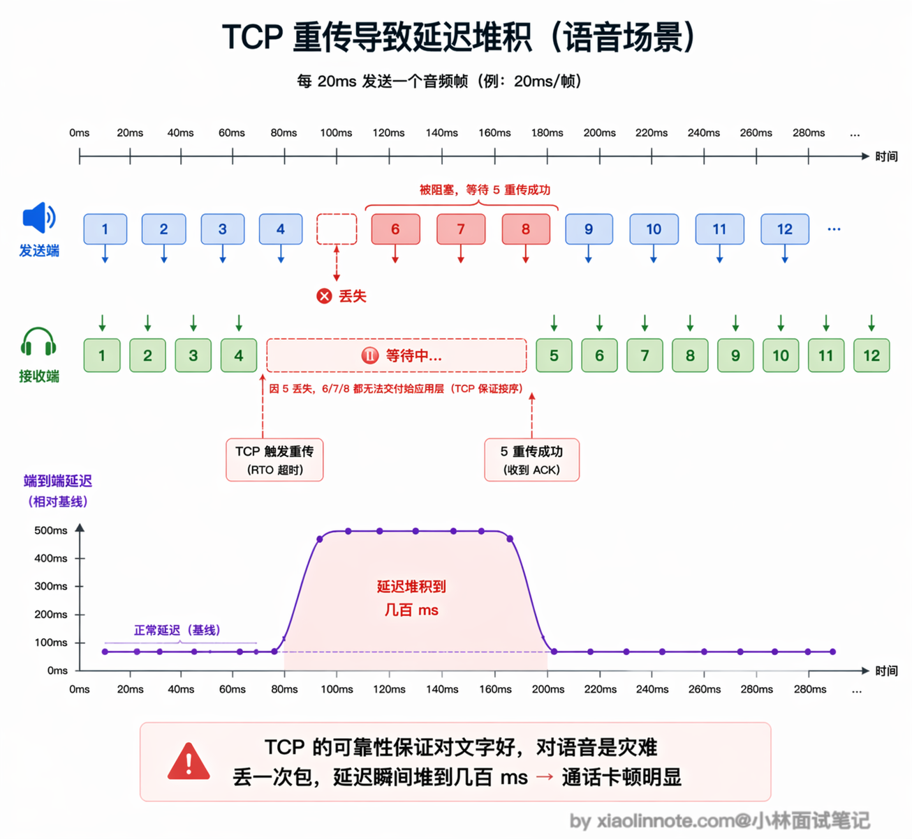
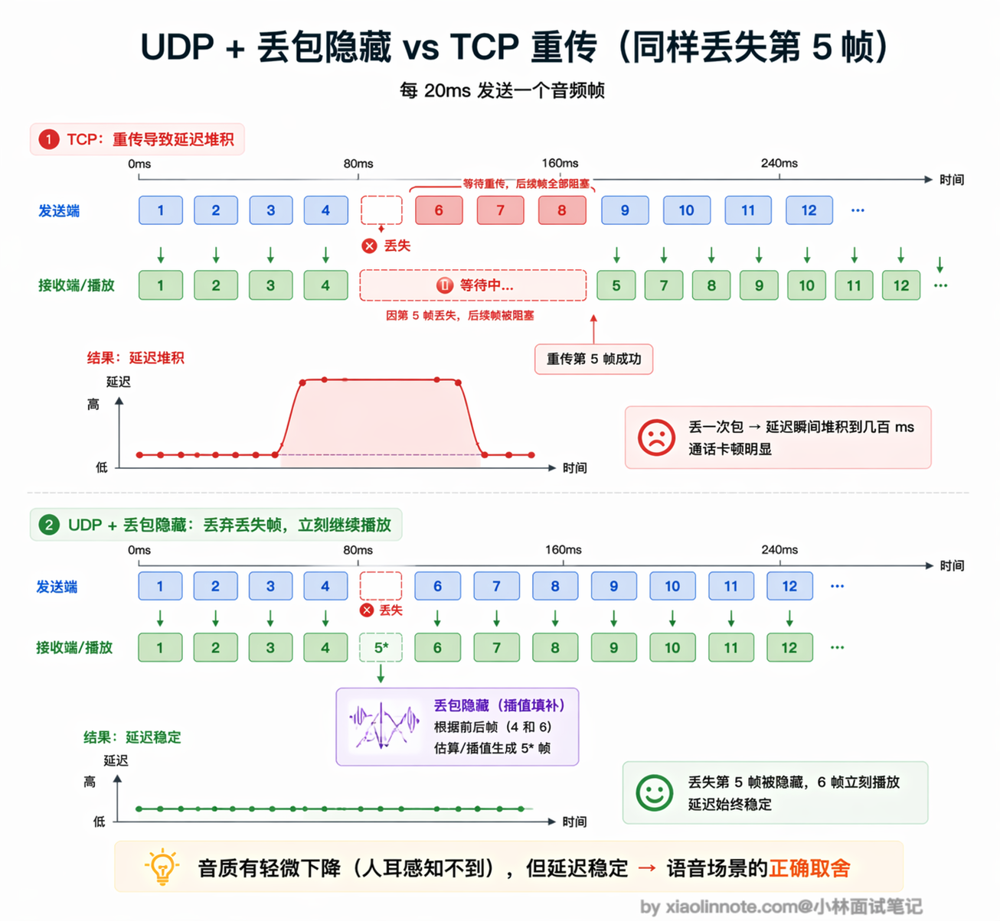
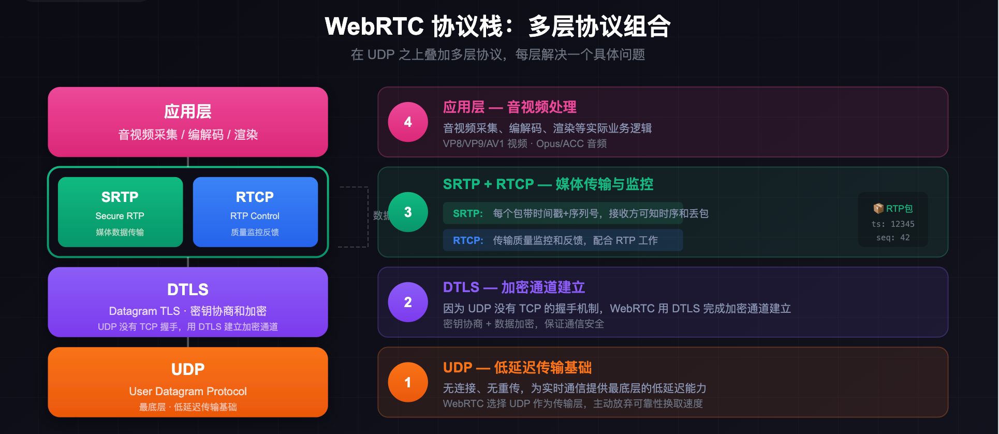
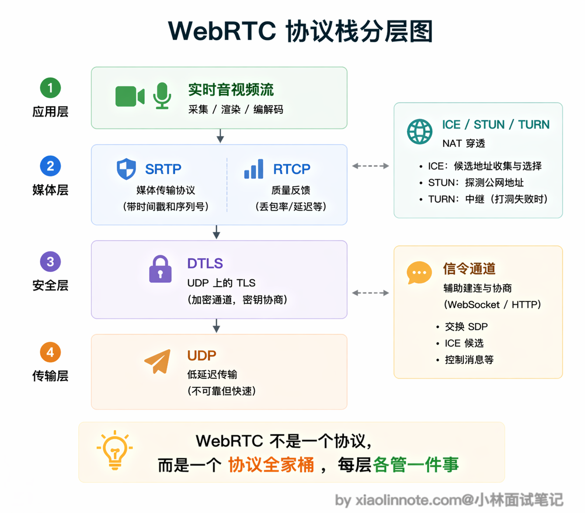
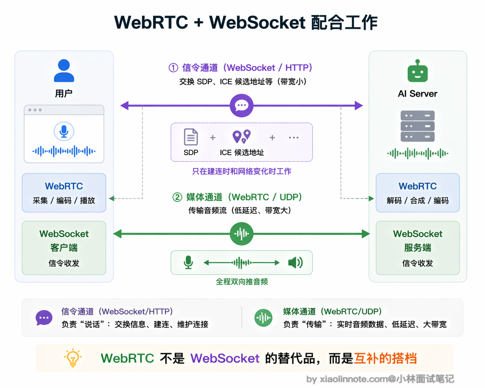
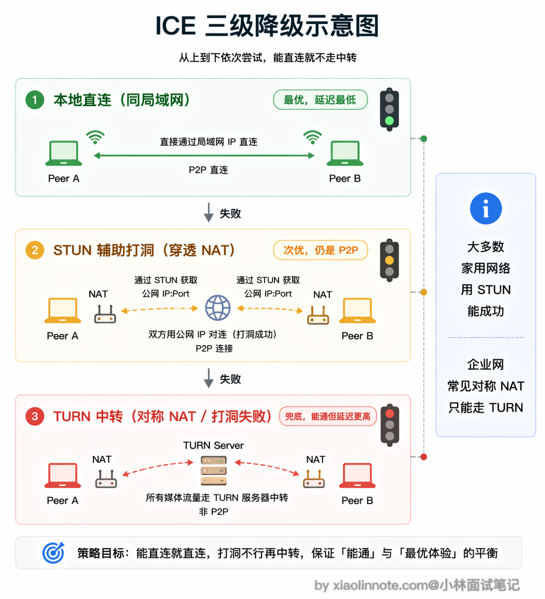
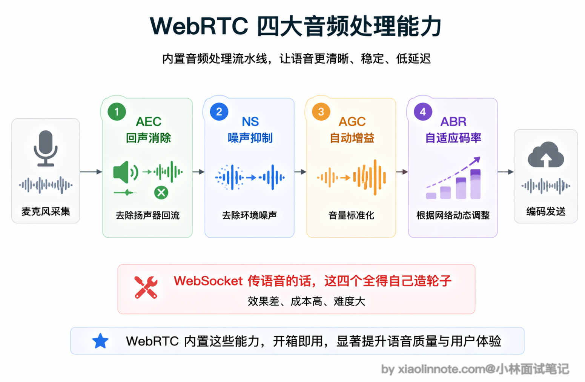
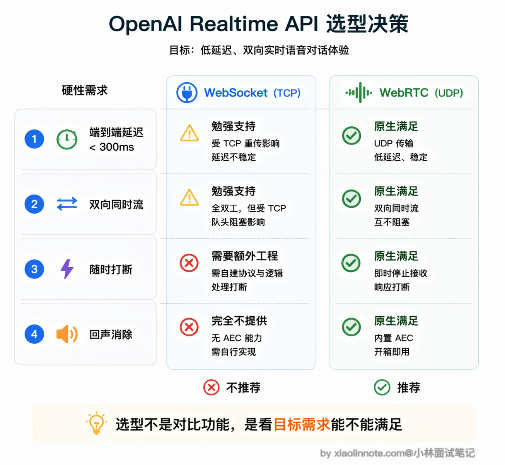

# 为什么要用 WebRTC 协议？它和 WebSocket（WS）在 AI 对话流中的核心差异是什么？

> 原文：[为什么要用 WebRTC 协议？它和 WebSocket（WS）在 AI 对话流中的核心差异是什么？](https://xiaolinnote.com/ai/tools/15_webrtc_vs_ws.html) · 小林面试笔记

👔面试官：为什么 AI 实时语音要用 WebRTC？它和 WebSocket 在 AI 对话流中的核心差异是什么？

🙋‍♂️我：WebRTC 主要面向实时媒体，能够在合适的网络条件下建立点对点路径，并配套处理媒体时序、拥塞和丢包；WebSocket 是可靠的 TCP 消息通道，通常经过服务端，但也能承载音频。两者不是单纯按“谁延迟低”排序，要看媒体与控制面的需求。

👔面试官：你说的 P2P 只是 WebRTC 可能采用的一种路径，不是核心保证。关键是 WebSocket 的消息通道基于 TCP，而 WebRTC 媒体通常使用 RTP/RTCP over UDP，并通过 ICE 在必要时回退到 TCP/TLS 或 TURN 中继；它们对时序、丢包和拥塞的处理不同，你知道这意味着什么吗？

🙋‍♂️我：TCP 丢包会重传，UDP 不重传。但是 TCP 重传不是好事吗？能保证数据完整啊，语音也需要完整传输吧？

👔面试官：语音对实时性更敏感。TCP 的可靠有序字节流可能因丢包重传产生队头阻塞；实时媒体则通常允许有限丢包，并用抖动缓冲、纠错或丢包隐藏维持播放。但 WebRTC 并不等于“UDP 永不回退”，也不保证所有音频处理都由协议本身完成，需要区分媒体栈、浏览器能力和应用代码。

原来语音和文字对网络的要求完全不同，下面我就从这个根本差异出发，把 WebRTC 和 WebSocket 的核心区别讲透。

## 💡 简要回答

我理解核心原因是：WebSocket 提供可靠有序的 TCP 消息流，而实时媒体更关心播放时序和可控延迟；WebRTC 为媒体提供 RTP/RTCP、抖动缓冲、拥塞控制、加密和 ICE 等配套机制。它并非简单的“TCP 换 UDP”。

语音通常可以容忍少量可隐藏的丢包，却很难容忍持续增长的端到端延迟；TCP 的重传和队头阻塞可能让实时播放等待缺失数据。具体体验还受编码器、抖动缓冲、网络和设备影响。

WebRTC 的实时媒体通常优先使用 UDP 上的 RTP/RTCP，但 ICE 也可能选择 TCP/TLS 候选或 TURN 中继。接收端可结合抖动缓冲、前向纠错、选择性重传和丢包隐藏等机制处理损伤，效果与编码器、实现和网络条件有关，不能用固定延迟数字承诺。

另外，浏览器/媒体栈通常能提供回声消除（AEC）、噪声抑制（NS）、自动增益控制（AGC）和自适应发送能力，但启用方式与效果依赖平台；WebSocket 本身不提供这些媒体能力，应用需要另接采集、编码和质量控制组件。

所以，支持 WebRTC 接入的实时语音 API 往往把 WebRTC 用作媒体平面，把 WebSocket/HTTP 或其他通道用作控制和信令平面；这不是说 TCP “根本不能传语音”，而是可靠消息通道通常需要自行承担媒体时序、丢包和设备处理。

## 📝 详细解析

要理解为什么语音场景需要 WebRTC，得先想清楚一个问题：传输文字和传输语音，对网络的要求本质上是不同的。

传输文字时，你希望每个字符都能准确到达，顺序不能乱，丢一个字母整段话可能就不对了。所以 TCP 的可靠有序传输对文字来说是刚需，你愿意等网络重传，因为等来的是完整正确的内容。

传输语音时，时序和端到端延迟会直接影响打断、轮次切换和重叠说话。具体可接受范围取决于编码、缓冲、网络和交互设计，不宜用单一的 200ms/400ms 阈值替代测量。

在这个场景里，短时少量丢包有时可以由编码器或丢包隐藏减轻；但等待重传让播放延迟持续积累，会破坏实时交互。更准确的工程目标是“在可接受的音质、丢包和延迟之间平衡”，而不是绝对地“只要丢包不要延迟”。

WebSocket 底层是 TCP，因此一个连接内的消息按序交付，丢包可能造成队头阻塞。它仍可用于低并发、控制面或对可靠性要求高的音频上传；若用它承载实时媒体，应用必须自己设计分片、时钟、抖动、编码、丢包和背压策略。

### WebRTC 的根本：选择 UDP，主动放弃可靠性

WebRTC 是一组面向实时通信的标准和实现协作，覆盖媒体轨道、RTP/RTCP、加密、ICE、数据通道等部分。它常优先使用 UDP，但 ICE 允许在受限网络中选择其他候选或 TURN 中继；因此“WebRTC = UDP”是有用的简化，却不是完整定义。

UDP 本身不提供可靠有序交付，但 WebRTC 的不同子协议和媒体实现可以在应用语义上增加反馈、纠错或选择性重传。音频媒体与 DataChannel 的可靠性选择也不同，不能把整个 WebRTC 归结为“永不重传”。

这听起来很不可靠，但对实时媒体来说，允许有限损伤可以避免所有后续内容等待。WebRTC 音频实现可能结合抖动缓冲、前向纠错、反馈重传和「丢包隐藏（Packet Loss Concealment，PLC）」等策略；PLC 不是保证“插值后人耳完全感知不到”，效果取决于编码器、丢包形态和实现。

这是一个典型的工程权衡：用偶尔轻微的音质损失，换取稳定的低延迟。对语音通话而言，这是正确的取舍。

### WebRTC 不是单一协议，而是一套协议组合

你可能以为 WebRTC 就是一个协议，跟 WebSocket 一样，换个名字而已。其实不是，WebRTC 更像是一套「协议全家桶」，在 UDP 之上叠加了好几层协议，每层各管一件事，组合在一起才能完成实时音视频通信。

媒体常见的底层路径是 UDP，但最终候选也可能是 TCP/TLS 或 TURN 中继；“低延迟”来自媒体协议、拥塞控制与播放策略的组合，而不是 UDP 单独保证。

WebRTC 使用 DTLS 完成密钥协商，并通常通过 DTLS-SRTP 保护 RTP 媒体；DataChannel 则有自己的 SCTP over DTLS 语义。把 DTLS 简化成“UDP 版 TLS”有助于入门，但实际组合还包括证书指纹、密钥协商和媒体加密。

加密通道建好之后，媒体数据用 SRTP（Secure RTP）传输。

RTP 是专门为实时媒体设计的协议，每个包都带时间戳和序列号，接收方可以知道包的时序和是否有丢失，配合 RTCP 做传输质量的监控和反馈。你可以把 RTP 理解成「给每个音频包贴了标签」，接收方根据标签知道这个包应该排在哪里、前面有没有包丢了。

在连接建立阶段，WebRTC 使用 ICE（Interactive Connectivity Establishment）框架来处理 NAT 穿透，这是实际部署中最复杂的部分，后面单独解释。

### SDP 信令：WebRTC 握手的「协商书」

WebRTC 建立连接前，双方需要互相告知对方自己的能力：支持哪些音视频编解码格式、网络地址是什么、加密参数是什么。这个协商过程通过 SDP（Session Description Protocol）来完成。

SDP 本身只是一种格式，不规定如何传输。双方需要通过一个「信令通道」来交换 SDP，这个信令通道可以是 WebSocket、HTTP 或者任何能双向传输的方式，WebRTC 不关心。这就是为什么用 WebRTC 做 AI 语音时，还是需要一个 WebSocket 连接：WebSocket 负责信令交换（告诉对方「我的网络地址是 xxx，我支持 Opus 编解码」），真正的音频流走 WebRTC 的 UDP 通道。两者各司其职，不是替代关系。

### NAT 穿透：ICE/STUN/TURN 解决的问题

现实中大多数用户都在路由器后面，没有公网 IP，直接用内网地址互相连接是行不通的。WebRTC 用 ICE 框架来解决这个问题，ICE 会按优先级依次尝试三种连接方式：

ICE 会收集并连通性检查多类候选：本地候选、STUN 发现的服务器反射候选，以及 TURN 分配的中继候选。最终路径可能是直连，也可能是 TURN 中继；连通性与延迟不能只凭“家庭网络通常能打洞”来保证。

你可能会问，为什么有些情况下打洞会失败、非得走 TURN？

打洞失败可能来自对称 NAT、严格防火墙、UDP 被阻断、地址映射变化或企业网络策略等。此时可以使用 TURN 中继，但流量和带宽成本会转移到中继服务器，也不再是端到端直连。

这三层降级保证了 WebRTC 在各种网络环境下都能建立连接，只是在最差情况下退化成类似 WebSocket 经过服务器中转的模式。

### WebRTC 内置的音频处理能力

WebRTC 不只是一个传输协议，而是一套媒体、加密、连通性和设备能力的组合。浏览器媒体栈常提供 AEC、NS、AGC、编码和拥塞控制等能力，但具体开关、效果和平台支持需要实测；WebSocket 不会自动提供这些能力。

回声消除（AEC）是其中最重要的一个。当你用扬声器外放 AI 的声音时，麦克风会同时把这段声音采集进去，如果不做处理，AI 就会听到自己说话的回声，形成反馈循环。WebRTC 内置了多年优化的回声消除算法，能实时识别并消除这部分回声，让对话不产生干扰。

噪声抑制（NS）解决环境噪声问题，比如用户在嘈杂的咖啡厅说话，WebRTC 会自动把背景噪声过滤掉，只传人声。自动增益控制（AGC）解决音量不稳定的问题，说话声音太小时自动放大，太大时自动降低，保证对方听到稳定的音量。

最后是基于反馈的拥塞和发送控制：实现可以根据 RTCP 反馈、丢包、往返时间和可用带宽调整发送策略。它不能保证网络波动时永不卡顿，生产系统仍需监控 jitter、RTT、丢包、音频能量和用户打断成功率。

### 实时语音 API 选择 WebRTC 的决策逻辑

以支持 WebRTC 接入的实时语音 API 为例：用户说话时服务端持续接收媒体，模型输出也持续返回，交互需要支持双向流动和打断。具体产品的协议、事件和鉴权方式以其当前文档为准。

这个场景对技术方案的要求包括可测量的端到端延迟、双向媒体、可靠的打断语义、回声控制、鉴权和降级路径。延迟预算应拆成采集、编码、上行、排队、模型首包、下行、播放缓冲等阶段，而不是套用一个固定阈值。

把这些要求综合起来看，WebSocket 可以承担控制、事件或可靠音频片段传输，但实时媒体能力需要应用自行补齐；WebRTC 为媒体提供了更完整的协议栈和浏览器集成。最终选型仍应根据 API 支持、网络可达性、TURN 成本和服务端运维能力验证。

### WebSocket 和 WebRTC 的核心差异总结

| 维度 | WebSocket | WebRTC |
| --- | --- | --- |
| 传输/媒体语义 | TCP 可靠有序消息流 | RTP/RTCP 媒体路径常优先 UDP，也可经 ICE/TURN 使用其他路径 |
| 连接模式 | 通常客户端到服务端 | 可直连，也可经 TURN 中继；不保证 P2P |
| 延迟 | 受排队、重传、服务端处理和网络影响 | 受编码、抖动缓冲、拥塞、网络路径和服务端处理影响 |
| 丢包处理 | TCP 负责可靠有序交付，可能出现队头阻塞 | 媒体实现可结合反馈、纠错、重传和 PLC，策略可配置/实现相关 |
| 音视频支持 | 仅提供消息传输，需自行处理采集、编码和媒体时序 | 浏览器/媒体栈通常提供较完整的采集、编解码和实时控制能力，但效果依赖平台 |
| 连接建立 | 简单，HTTP Upgrade 即可 | 复杂，需要信令交换 + ICE NAT 穿透 |
| 适合场景 | 文字/数据实时双向通信 | 实时音视频通话 |
| 实现复杂度 | 低 | 高（信令服务器、STUN/TURN 服务器都要自建或使用云服务） |

选型原则是：先区分媒体平面与信令/控制平面。文字增量可用 HTTP 流或 WebSocket；实时语音可优先评估 WebRTC，但要把信令、ICE、TURN、鉴权、录音合规和降级方案纳入总成本。WebRTC 复杂度真实存在，直连也不保证，不能把“低延迟”当成未经测量的承诺。

## 🎯 面试总结

回到开头踩的雷，最大的误区是觉得 WebSocket 和 WebRTC「都能传语音，差别不大」。

面试回答这道题，第一个核心点是抽象层不同：WebSocket 是可靠有序的 TCP 消息通道；WebRTC 是包含媒体、加密、ICE 和实时反馈的一组能力，媒体路径通常使用 RTP/RTCP 并优先 UDP，但可能回退或走 TURN。实时语音更重视时序和延迟预算，因此会在可接受音质、丢包与延迟之间做权衡。

第二个要点是媒体工程边界。浏览器/媒体栈常提供 AEC、NS、AGC、编解码、抖动和拥塞控制，但这些不是 WebSocket 协议提供的，也不是所有平台效果一致；用 WebSocket 做实时媒体需要自行组合这些能力。

第三个加分点是连接建立机制：应用通过任意可用信令通道交换 SDP/候选，ICE 使用 STUN/TURN 完成连通性检查，媒体再走选中的安全路径。WebSocket 可以做信令，但不是必需品；它与 WebRTC 是“控制面配合媒体面”的关系，而不是二选一。

---
