# AI Agent 是什么？Agent 面试题万字图解

> 原文：[AI Agent 是什么？Agent 面试题万字图解](https://xiaolinnote.com/agent/concept/agent.html) · 小林面试笔记


大家好，我是小林。

今年，AI 圈子里最火的一个词，毫无疑问就是 **Agent**（智能体）。

打开技术社区，满屏都是 Agent，各大厂商发布会，也都在讲 Agent，甚至连招聘 JD 上，都写着「[有 Agent 开发经验优先](https://mp.weixin.qq.com/s/m-HTxUFHsqDzJYBnko2HOw)」。

也有很多林友跟我反馈，最近大厂后端面试都会问一些 AI 相关的面试题，一连串的概念砸过来， 直接懵了。

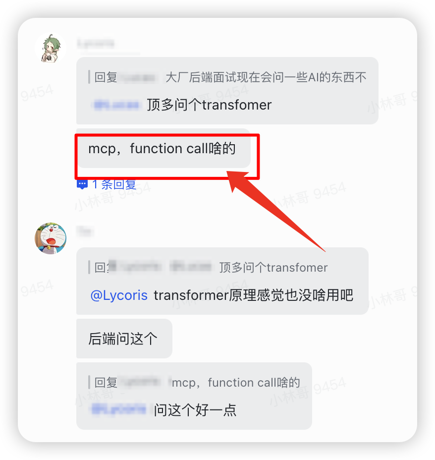

*img*

上一篇我已经分享过「[万字长文图解 openclaw 大厂面试题](https://mp.weixin.qq.com/s/1RkWpmZBT11sXJYtv93NHA)」，这次我也帮大家整理了近期 Agent 高频面试题：

- 🌟LLM 和 Agent 有什么区别？
- 🌟Agent 和 workflow 有什么区别？
- 🌟Agent 有什么工作模式？
- 🌟function call 是什么？
- 🌟mcp 是协议什么？
- 🌟skills 是什么？
- 🌟function call 、mcp、skills 有什么区别？
- 🌟什么是 A2A 协议？

今天这篇文章，我就用最通俗易懂的方式，把 Agent 相关的核心概念一次性给你讲清楚。这些也是面试中经常会被问到的问题，搞懂了不仅能应付面试，更能帮你真正理解 AI 技术的主旋律。

废话不多说，直接开始。（PS：依然还是万字长文图解，可以收藏起来，慢慢看）

---

## LLM 和 Agent 有什么区别？

要搞懂 Agent，咱们得先从 LLM 聊起，因为 Agent 本质上就是在 LLM 的基础上进化出来的。

### 什么是 LLM？

LLM，全称 Large Language Model，翻译过来就是**大语言模型**。

你可以把它想象成一个读过大量文本和代码的超级学霸。它从训练数据中学习语言规律与模式，但不等于记住了全部互联网内容，也不保证事实准确。我们平时用的许多对话式 AI 产品，其核心组件包含大语言模型，但产品还可能叠加检索、工具和安全策略。

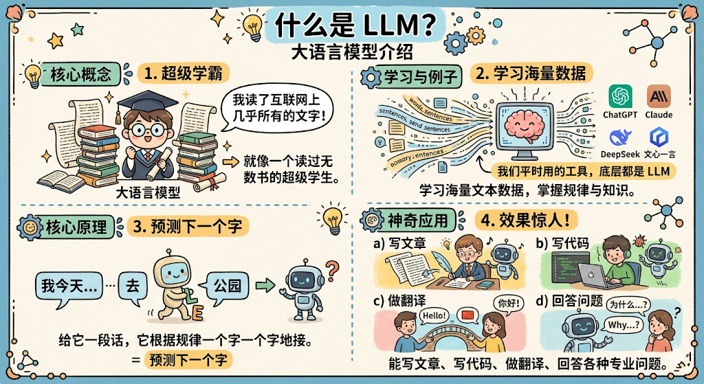

*img*

LLM 的生成核心可以概括为「根据上下文预测下一个 token」。token 不一定是一个字或一个词；模型本身输出的是概率分布，应用再决定如何采样、停止和校验。

听起来简单，但因为它学的数据量实在太大了，这种「接龙」的效果好到令人吃惊，它能写文章、写代码、做翻译、回答各种专业问题。

### LLM 有什么弊端？

虽然 LLM 非常聪明，但你仔细想想会发现，它其实有点像一个"有嘴没手"的顾问。

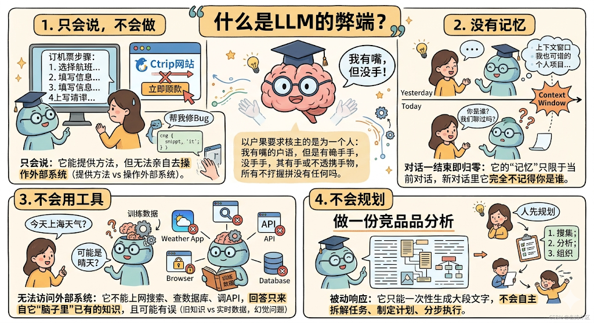

*img*

第一个边界是**模型本身不直接拥有外部副作用**。没有宿主程序、工具和权限时，LLM 只能生成建议；应用可以把它接到浏览器、编辑器、API 或执行器，但真正的读写、鉴权、审批和回滚由外部系统负责。

第二个边界是**参数记忆与运行时记忆不同**。模型权重不会因为一次对话自动更新；跨轮记忆需要宿主保存、检索并重新注入上下文，而且要处理过期、权限、删除和隐私。

第三个边界是**不会自动获得实时工具能力**。如果没有搜索、数据库或 API 工具，它只能依据上下文和参数生成答案；接入工具后仍要处理数据新鲜度、鉴权、超时、错误和结果可信度。

第四个边界是**默认不会可靠地执行闭环规划**。模型可以生成计划或步骤，但要把步骤变成可恢复、可观测、可审批的执行循环，需要宿主、工具、状态和停止条件。

### 那 Agent 是什么？

讲完弊端，你可能已经在想：有没有一种方式，能让 LLM 不仅会「说」，还能「做」呢？这就是 Agent 要解决的问题。

Agent，翻译过来叫**智能体**。工程上可以把它理解为：**由模型参与决策、通过工具/环境执行，并维护状态与停止条件的系统**。不同框架对“Agent”的边界并不完全一致，未必都具备长期记忆或自由规划。

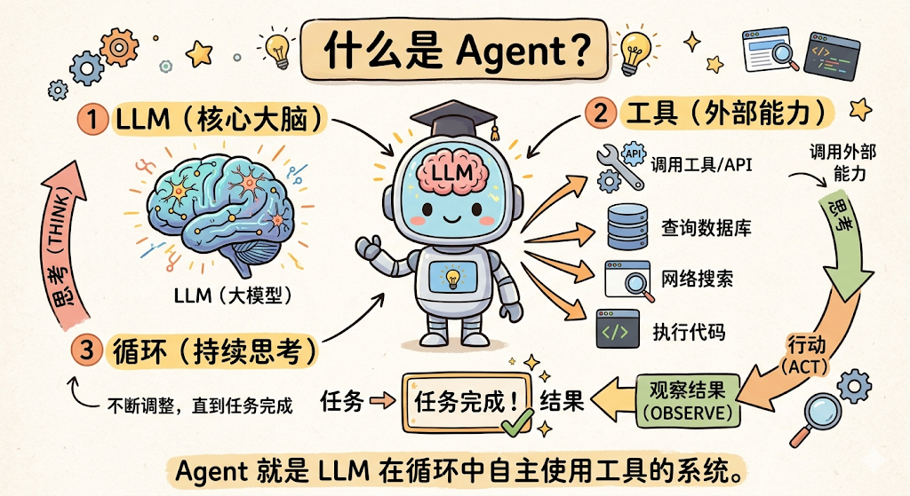

*img*

这句话有三个关键词：「模型」负责部分决策，「工具/环境」提供外部能力，「循环/状态机」负责多步执行。循环必须有预算、超时、错误分支和人工终止，不能简单地“直到任务完成”。

打个比方，如果 LLM 是一个只会给你建议的顾问，你问他「怎么装修房子」，他能讲一大堆方案，但绝不会亲自动手。

那 Agent 就是一个能动手干活的项目经理，你说「帮我把房子装修好」，他会自己去找装修队、买材料、盯进度、解决问题，直到装修完成。

### Agent 怎么解决 LLM 的弊端？

其实理解了上面的比喻，答案就很清楚了。

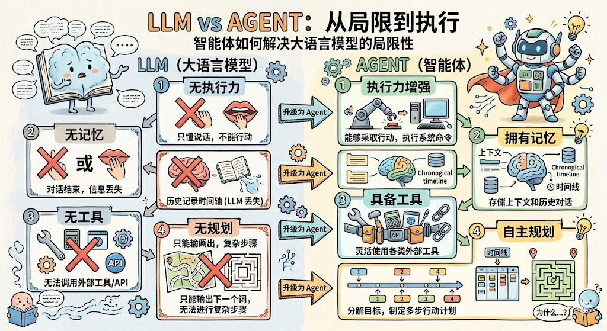

*img*

- 针对“只会说不会做”，宿主可以引入**工具调用**，但每个工具都要有权限、参数校验、超时、审计和副作用保护。
- 针对“没有记忆”，系统可以保存并检索**运行时状态/长期记忆**，但要处理过期、冲突、删除、租户隔离和提示注入；这不是 Agent 的必选模块。
- 针对“不会用工具”，MCP 等协议可以规范发现和调用的一部分边界，但不会替应用完成授权、业务校验或错误恢复。
- 针对“不会规划”，模型或代码可以生成任务分解；可靠执行还需要状态机、重试、补偿、审批和停止条件。

### Agent 的核心组成

所以一个可落地的 Agent 通常可以拆成若干职责，但不存在固定的“四模块标准”。

常见职责包括：模型/策略层负责解释输入和提出行动，状态层保存任务快照，工具层执行受控操作，编排层负责循环、重试、并发和终止，治理层负责权限、审批、审计与观测。规划和长期记忆可以存在，也可以由固定 Workflow 或外部服务替代。

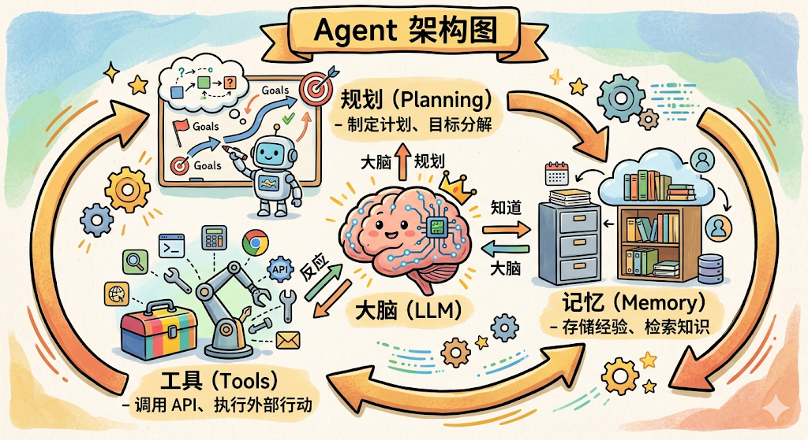

*img*

用一个实际例子来感受。假设你对 Agent 说：「帮我查一下下周三上海的天气，如果不下雨就在日历上安排一个户外团建。」如果是 LLM，它只会告诉你「你可以通过天气 App 查看天气，然后在日历上创建事件」。

而 Agent 可以先调用天气 API，再根据策略决定是否创建日历事件；在真正产生副作用前应确认时间、时区、参与人和授权，必要时请求人工批准。它不是“调用后必然做完”，而是一个可审计的执行闭环。

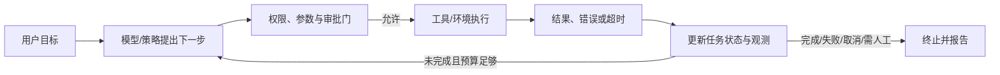
```mermaid
flowchart LR
    U[用户目标] --> P[模型/策略提出下一步]
    P --> G[权限、参数与审批门]
    G -->|允许| T[工具/环境执行]
    T --> O[结果、错误或超时]
    O --> S[更新任务状态与观测]
    S -->|未完成且预算足够| P
    S -->|完成/失败/取消/需人工| F[终止并报告]
```

---

## Agent 和 Workflow 有什么区别？

搞懂了 LLM 和 Agent 的区别之后，你可能还会碰到另一个容易搞混的概念，**Workflow（工作流）**。

很多人把 Agent 和 Workflow 混为一谈，但它们的设计理念其实完全不同。

### 先用一个场景来感受区别

假设有一个任务：处理客户的退款申请。Workflow 的做法是这样的，开发者提前写好整个流程：

```plain
- 第一步接收申请
- 第二步调用 LLM 提取关键信息
- 第三步查数据库获取订单详情
- 第四步调用 LLM 判断是否符合退款政策
- 第五步执行退款或生成拒绝邮件，第六步发送通知。
```

每一步做什么、接下来走哪条路，全都是提前在代码里写死的，LLM 只是在某些步骤中被召唤出来做理解和判断。

而 Agent 的做法完全不同。它收到「处理这个退款申请」的任务后，自己来决定怎么做，先看看申请写了什么，然后觉得需要查一下订单信息，发现情况有点特殊就去搜索退款政策文档，推理判断后决定执行退款，最后给客户发邮件通知。

整个过程中，每一步做什么都是 Agent 自己决定的，而不是代码预先规定的。

### 两者的定义

**Workflow 是由代码/配置显式编排步骤与分支的系统**，而 **Agent 是让模型在给定工具、状态和策略边界内参与决定下一步的系统**。二者是连续谱：Workflow 可以嵌入 Agent 节点，Agent 也常被限制在固定的状态图里。

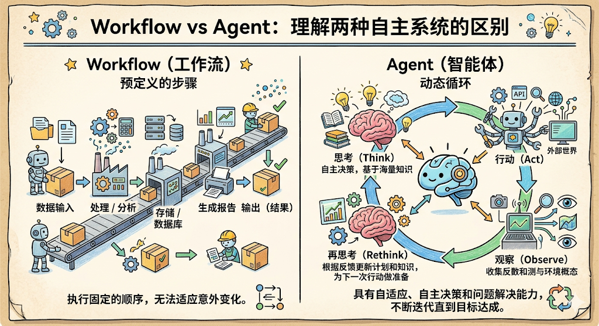

*img*

翻译成大白话就是：Workflow 是「我（开发者）告诉你每一步该做什么」，Agent 是「我告诉你目标，你自己决定怎么做」。

你可以这样类比：Workflow 就像一条工厂流水线，每个工位做什么、零件从哪来到哪去，全都是提前设计好的。工人（LLM）只需要在自己的工位上完成指定动作。

而 Agent 更像一个自主工作的项目经理，老板只告诉他"把这件事搞定"，然后他自己去调研、制定计划、协调资源、推进执行。

### 核心区别在哪？

两者最核心的区别在于**「谁在控制流程」**。

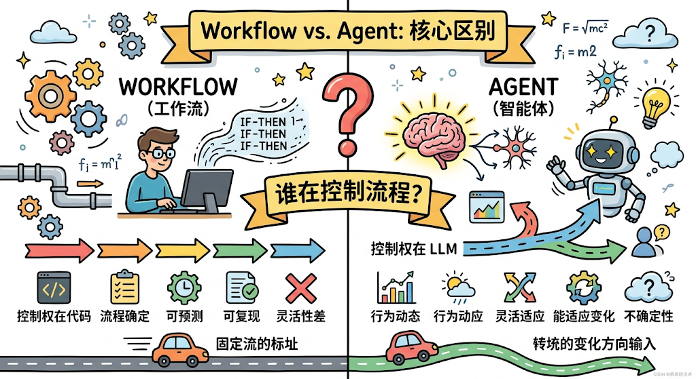

*img*

Workflow 的主要控制权在代码/状态机手里，流程通常更容易预测和复现；Agent 把部分控制权交给模型，灵活性更高，但带来不确定性、提示注入、工具误用和回归测试成本。

从成本角度看，Workflow 往往减少不必要的决策轮次，但 token、工具调用和延迟没有固定比例；Agent 的成本取决于循环次数、上下文长度、模型和工具结果。

从可靠性看，Workflow 更容易做路径覆盖、幂等和回归；Agent 需要记录轨迹、工具输入输出、状态快照和失败原因，并设置预算、超时、重试和人工升级。

### 什么时候用 Workflow，什么时候用 Agent？

Anthropic 给了一个非常实用的建议：**从最简单的方案开始，只在明确需要时才增加复杂度。**

如果任务步骤固定、可提前规划，或涉及高风险副作用，通常先用 Workflow/状态机，并在边界处加入受限 Agent；如果任务开放、步骤难以穷举且有清晰的预算与审批边界，再考虑 Agent。

不过在实际生产环境中，最常见的其实是**混合架构**，Workflow 和 Agent 的结合。正如 LangChain 说的："大多数生产中的 Agent 系统其实是 Workflow 和 Agent 的组合。"

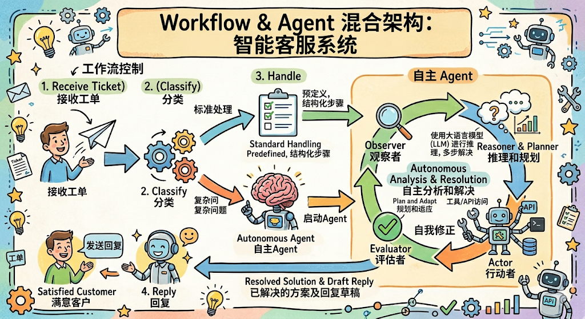

*img*

比如一个智能客服系统，整体流程用 Workflow 控制（接收工单→分类→处理→回复），但在"处理"环节遇到复杂问题时，会启动一个 Agent 来自主分析和解决。

所以不要把两者对立起来，它们更像是工具箱里的锤子和螺丝刀，不是竞争关系，而是配合关系。

---

## Agent 有什么工作模式？

了解了 Agent 是什么之后，下一个问题就是：Agent 到底是怎么「干活」的？就像人干活有不同的方式，有人喜欢边做边想，有人喜欢先列计划再动手，有人喜欢团队协作，Agent 干活也有不同的工作模式。

### 模式一：ReAct（边想边做）

ReAct（Reasoning + Acting）是一种把推理/决策与行动交替组织的模式，常见但不是所有 Agent 框架的唯一底层实现。

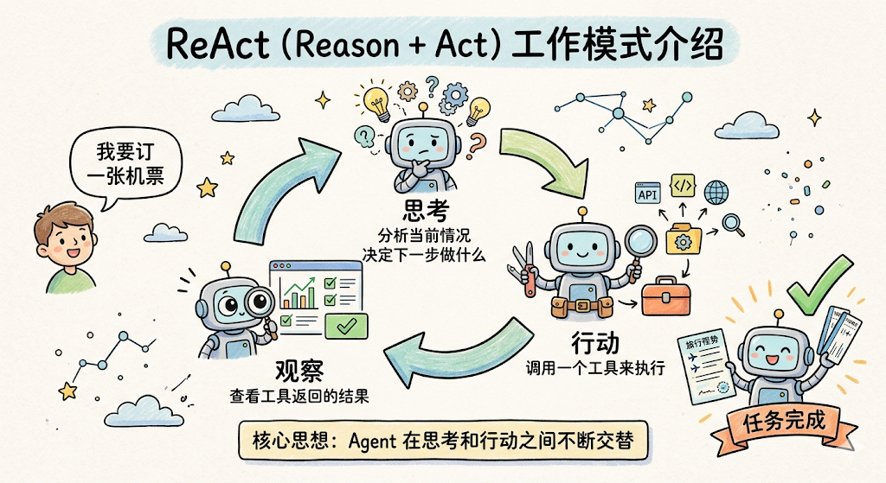

*img*

它的核心思想是把“提出下一步行动 → 执行 → 读取结果”组织成循环。实现不一定把完整 Thought 暴露给用户，也不应把内部推理文本当作事实证据；需要设置最大轮次、超时、重复动作检测、权限门和人工终止。

打个生活化的比方。想象你要收拾行李准备出差，你会先想「我要去上海三天，先看看天气怎么样」，然后打开手机查天气预报，发现会下雨气温 15-20°C，接着想「得带伞和外套」，于是去找出来放进行李箱，再想「还得确认酒店」，打开 App 检查预订信息... 这就是 ReAct 的精髓，每一步都先想后做，做完看结果，再决定下一步。

ReAct 的优点是可以根据观察结果动态调整；若记录决策摘要、工具轨迹和状态，也便于审计。缺点是轮次、token、工具副作用和循环风险增加，必须用预算、幂等和停止规则控制。

### 模式二：Plan-and-Execute（先想好再做）

如果说 ReAct 是「边想边做」，Plan-and-Execute 就是「先想好再做」。

它把 Agent 的工作分成两个阶段：第一阶段是规划，Agent 先把完整的执行计划想清楚；第二阶段是执行，按计划逐步完成，不用每步都重新思考全局。

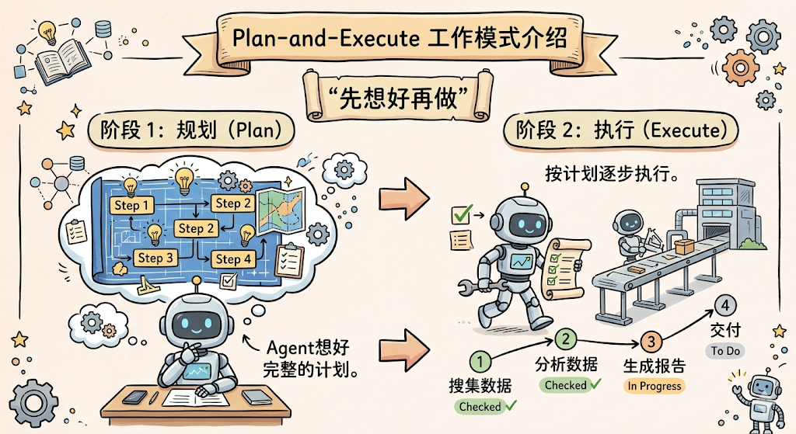

*img*

用出差的例子来对比，ReAct 是「查天气→想想带什么→找衣服→想想还缺什么→查酒店→想想还要准备什么...」，每一步都重新审视全局。而 Plan-and-Execute 是先列一个清单（查天气、准备衣物、确认酒店、准备证件、叫车），然后逐项打勾执行。

这种模式可能减少重复规划，但规划本身可能过时，且执行阶段仍需校验；token 和成本没有固定比例，不能用“五分之一”泛化。

但缺点是不够灵活，如果执行到第 3 步发现情况变了，原来的计划可能就不适用了。所以也有这么个做法是在执行过程中加入「重新规划检查点」，每隔几步检查一下计划是否还靠谱。

### 模式三：Reflection（做完再检查）

反思模式的核心思想是 Agent 完成任务后不急着交付，而是先自我检查一遍，就像你写完文章不会直接发出去，而是再通读一遍、改一改、润色一下。

实现方式通常有两种。

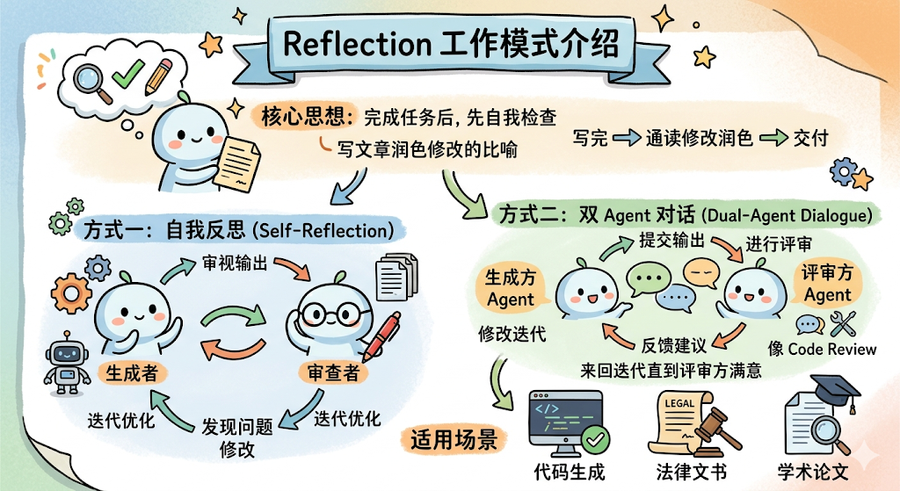

*img*

一种是**自我反思**，同一个 Agent 完成任务后切换到「审查者」角色来审视自己的输出，发现问题就修改，然后再审查，直到满意。

另一种是**双 Agent/独立评审器**，一个负责生成，另一个按明确 rubric、测试或规则评审；不能只靠评审模型说“满意”，应设置最大迭代次数和人工升级。适用性取决于可验证标准、风险和成本。

### 模式四：Multi-Agent（团队协作）

当任务太复杂、一个 Agent 搞不定的时候怎么办？

答案是派一个团队上。Multi-Agent 模式让多个专业化的 Agent 各司其职，比如一个负责规划、一个负责搜集信息、一个负责写代码、一个负责测试，通过协作来完成复杂任务。

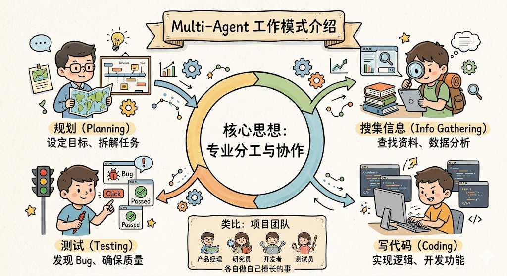

*img*

这就像一个项目团队，有产品经理、研究员、开发者、测试员，各自做自己擅长的事。可以举 LangGraph、CrewAI、OpenAI Agents SDK、AutoGen 等框架作为例子，但框架能力和版本持续变化；选择时更重要的是状态、权限、并发、观测、测试和故障恢复。

多 Agent 不应默认引入：它会增加上下文传递、协调、权限、成本和故障面。只有当任务确实需要隔离角色/权限、并行子任务或独立上下文时，才用可观测的多 Agent 编排。

最后总结一下：这几种模式不是互斥的，实际中往往是组合使用的。一个多 Agent 系统中，每个 Agent 内部可能用的是 ReAct 模式，整体协作用的是 Multi-Agent 模式，最后还有一个 Reflection 环节来检查质量。

选择哪种模式，关键看你的任务特点和对灵活性、成本、质量的优先级排序。

---

## Function Call 是什么？

前面我们聊 Agent 的时候反复提到一个词，「工具调用」。Agent 能查天气、能搜索信息、能操作数据库，这些能力是怎么实现的？

答案就是 **Function Call（函数调用）**。

### 从「只会说话」到「能做事情」

早期的语言模型接口主要返回文本；后来许多模型服务又提供了**工具调用/函数调用（tool/function calling）**的结构化输出。它的本质是让模型提出「想调用哪个工具、参数是什么」，再由外部应用决定是否执行。它不是一个跨厂商完全相同的协议，也不等于模型拥有了执行权限。

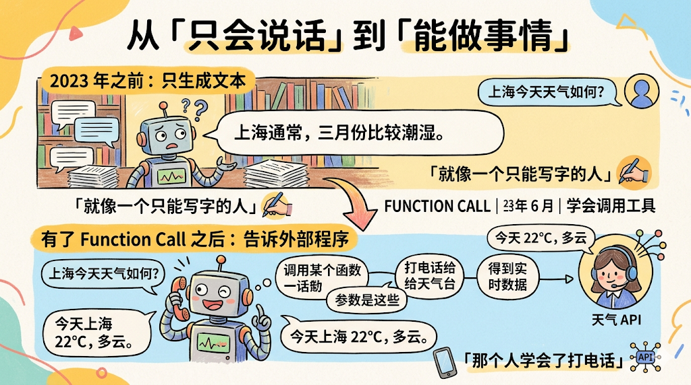

*img*

打个比方。在没有 Function Call 之前，LLM 就像一个只能写字的人，你问他天气，他只能根据记忆回答「上海通常三月份比较潮湿」。

有了 Function Call 之后，这个人学会了「打电话」，你问他天气，他会拿起电话拨给天气台（调用天气 API），听到对方报的实时数据后再告诉你「今天上海 22°C，多云」。

### Function Call 的工作原理

一个典型的工具调用回路通常包含以下步骤；实际 API 可能把若干步骤合并，或一次返回多个调用。

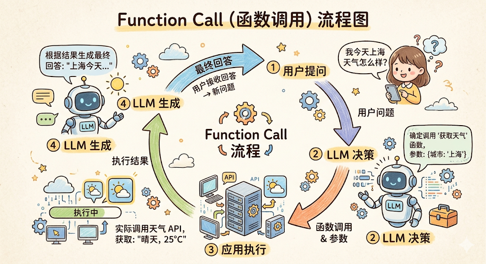

*img*

第一步，**声明工具**。开发者向模型接口提供工具名称、用途和参数 Schema（模式）。Schema 主要帮助模型生成结构化参数，不能替代服务端的类型、权限和业务校验。

```plain
{
  "tools": [
    {
      "type": "function",
      "function": {
        "name": "get_weather",
        "description": "获取指定城市的实时天气",
        "parameters": {
          "type": "object",
          "properties": {
            "city": {
              "type": "string", 
              "description": "城市名称，比如：上海"
            }
          },
          "required": ["city"]
        }
      }
    }
  ]
}
```

第二步，**模型提出调用或直接回答**。模型根据上下文和工具描述决定是否请求工具、请求哪个工具以及给出什么参数；这不是必然正确的判断，缺少日期、身份、金额等关键字段时应用应要求澄清或人工确认。

```plain
{
  "tool_calls": [
    {
      "type": "function",
      "function": {
        "name": "get_weather",
        "arguments": "{\"city\": \"上海\"}"
      }
    }
  ]
}
```

第三步，**校验并执行**。注意，这一步非常关键，**LLM 自己并不自动执行函数**。应用解析调用、校验 Schema、用户/租户权限、资源范围和副作用，再调用本地函数或远程服务；超时、拒绝、部分成功和重试都需要由应用定义。

第四步，**回传结果并继续**。应用把工具结果或错误以模型接口要求的消息形式回传，模型可以生成最终回答、请求另一个工具，或在结果不足时向用户澄清。工具结果仍需按不可信外部输入处理，不能直接覆盖系统指令。

### 为什么 Function Call 这么重要？

你可能会觉得，这不就是「让 LLM 调 API」吗？有什么了不起的？

关键在于，Function Call 解决了两个核心问题。

- 第一个是**"什么时候提出调用"的判断问题**，模型可以根据自然语言和工具描述提出调用建议，但应用仍应保留路由、审批和拒绝逻辑。
- 第二个是**"传什么参数"的结构化问题**，模型可以从自然语言中生成参数，例如提取 `city=北京` 和 `date=后天`；相对日期、身份、金额和资源范围仍需由应用解析或确认。

这两个能力加在一起，就把 LLM 从一个「只会聊天的文本生成器」变成了一个「能理解意图并驱动外部系统的决策引擎」。

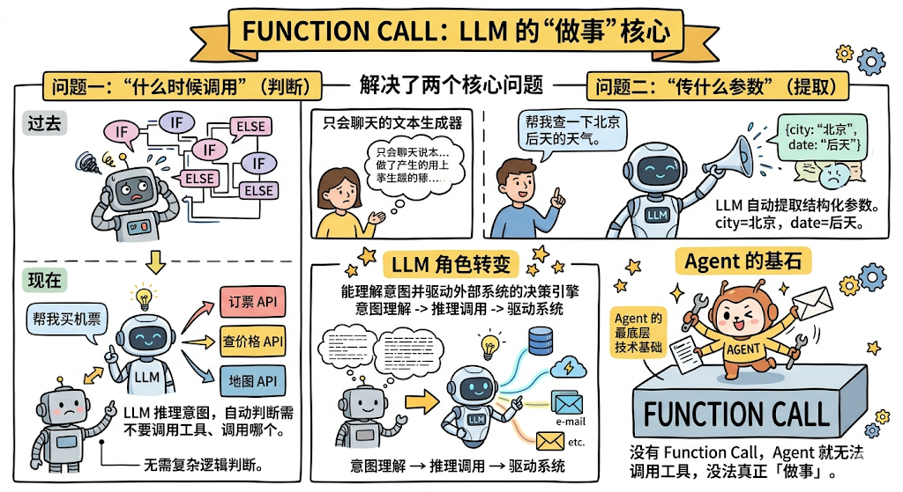

*img*

工具调用是许多 Agent 的重要接口，但不是唯一实现方式；Agent 也可以使用预先编码的工作流、代码执行器、MCP 客户端或其他协议。不同模型/API 对并行调用、严格 Schema、流式事件和错误回传的支持可能不同，应以目标版本的文档和实测为准。

### Function Call 和 Agent 的关系

最后说一下两者的关系。

一次工具调用是一个事件或步骤；Agent 是否把它放进循环，取决于编排器。典型循环会在每次结果后更新状态、检查预算/停止条件和权限，再决定继续调用、请求澄清或结束。

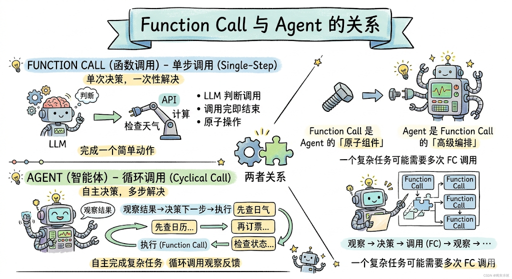

*img*

因此二者不是严格的上下位关系：工具调用描述“如何提出并执行一次工具请求”，Agent 描述“如何围绕目标组织模型、状态、工具和治理”。一次任务可能只有一次调用，也可能有多次；次数和可靠性都应由运行时策略控制。

---

## MCP 是什么协议？

前面讲了 Function Call 让 LLM 能调用工具。但随着 Agent 越来越强大，需要连接的工具和服务越来越多，一个新问题浮出水面了，**集成太麻烦了**。

### Function Call 的集成困境

想象一下，你开发了一个 Agent，需要它能连 Slack 发消息、查 Google Drive 的文档、读 GitHub 的代码、查 Postgres 数据库。

用 Function Call 的方式，你需要为每一个服务单独写适配代码，为 Slack 写一套函数定义和调用逻辑、为 Google Drive 写一套、为 GitHub 写一套、为数据库又写一套。

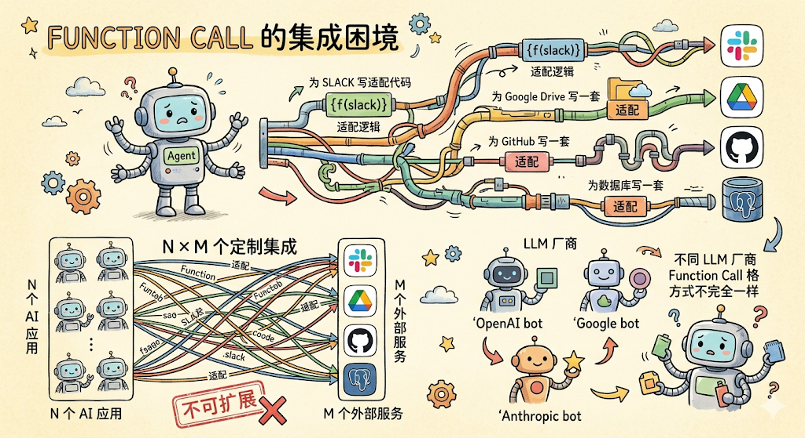

*img*

如果你有 N 个 AI 应用，要对接 M 个外部服务，直接定制时可能出现接近 N×M 的重复集成；规模增大后维护成本会明显上升，但并非所有系统都需要逐一对接。不同 LLM 厂商的工具事件格式也可能不同，例如字段名、内容块和流式事件存在差异。

### MCP 的诞生

为了解决这类连接与发现问题，社区出现了 **MCP（Model Context Protocol，模型上下文协议）**这一开放协议规范。它可以类比为 AI 工具生态中的“接口标准”，但真正的互操作仍取决于 Host、Client、Server 的版本、能力声明、传输方式和授权配置。

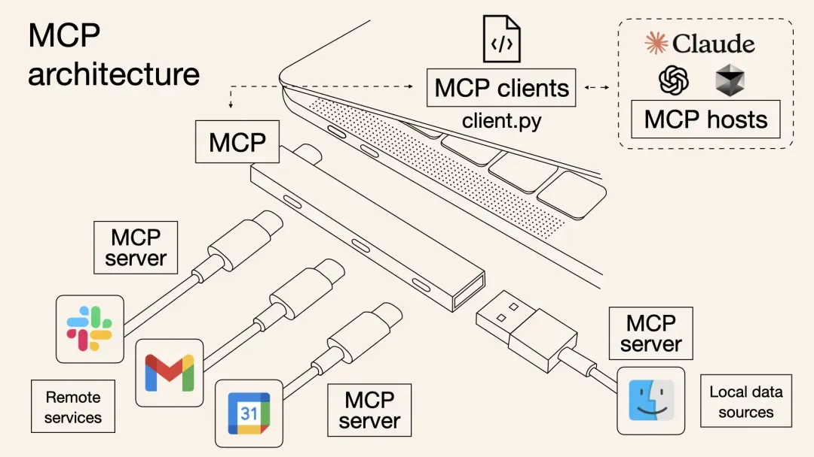

*img*

以前，不同的手机、电脑、设备各自用不同的充电线和接口，非常混乱。

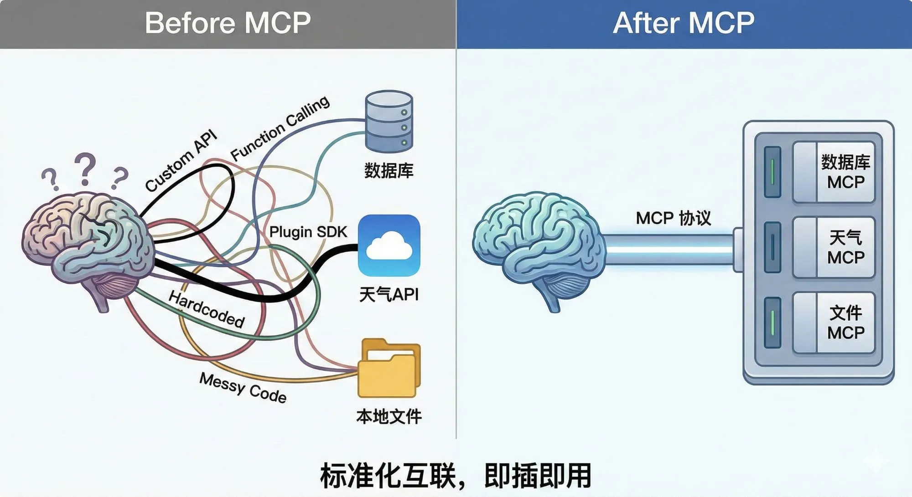

*img*

USB-C 的类比有助于理解“约定接口”的思想，但 MCP 并不自动让任何应用连接任何服务。它定义消息、生命周期和能力边界，应用仍要配置 Server、建立会话、处理认证、授权、错误和数据格式。

### MCP 是怎么工作的？

MCP 的架构很清晰，主要有三个角色。

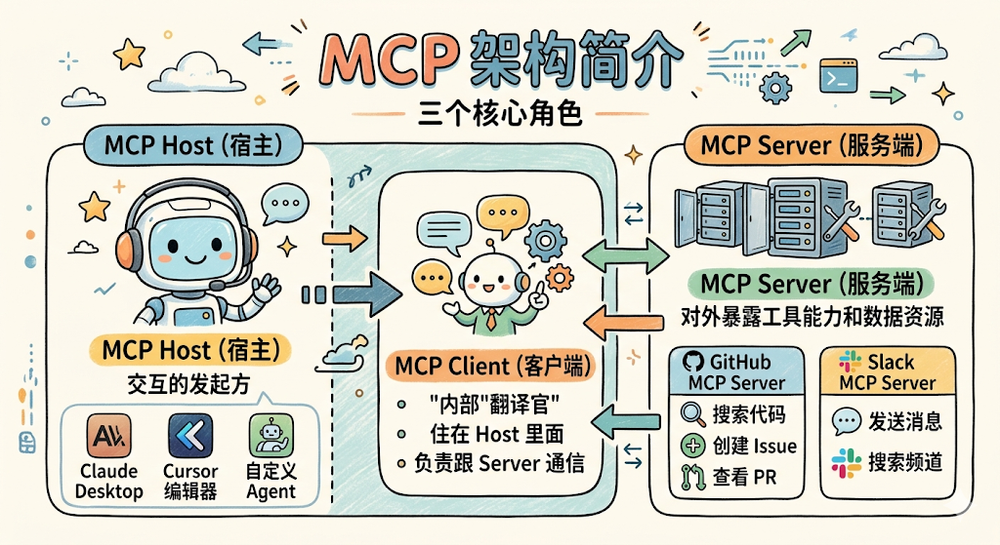

*img*

- 首先是 **MCP Host（宿主）**，就是承载模型与用户交互的 AI 应用。它负责管理会话、用户授权、上下文和策略。
- 然后是 **MCP Client（客户端）**，它由 Host 管理，通常为每个 MCP Server 会话负责初始化、能力协商、消息收发和生命周期处理。
- 最后是 **MCP Server（服务端）**，它按协议暴露工具、资源或提示模板，并在自己的进程/服务边界内访问外部系统；它不能因为“被发现”就自动获得 Host 的所有权限。

典型流程是：Host 配置并连接 Server → Client 完成初始化和能力协商 → Host/模型获得已授权的工具、资源或提示列表 → 模型提出调用 → Host/Client 按策略转发 → Server 校验并执行 → 返回结果或错误 → Host 把结果纳入上下文并继续或结束。传输可以是本地 stdio，也可以是远程 HTTP 绑定，不能把某一种传输当成协议本身。

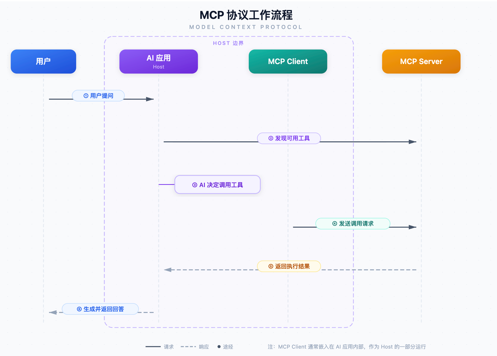

*img*

### MCP 解决了什么问题？

理想情况下，它把大量定制集成的重复部分收敛到“Host/Client 适配协议 + Server 适配服务”，常被简化描述为从 N×M 接近 N+M；这不是零代码承诺，认证、业务语义、部署和兼容性仍需适配。

以前每个 AI 应用要跟每个服务单独对接；支持 MCP 后，通用的发现与调用路径可以复用，但新增 Server 仍可能需要配置、授权和能力兼容测试，新增 Host 也要正确处理目标 Server 的版本与错误语义。

MCP Server 的能力可以通过协议查询，但“有哪些 Server 可用”通常由 Host 的配置、注册表或部署环境决定；连接后还要根据 capability 与授权结果决定是否列出和调用。

这意味着 Agent 可以在运行时动态发现新的能力，而不是只能用开发者写死的那些函数。

---

## Skills 是什么？

前面讲了 Function Call 让 Agent 能调用函数，MCP 让 Agent 用统一标准连接工具。但你有没有想过一个问题：**Agent 知道怎么调用工具了，但它知道在什么场景下该用什么方法来解决问题吗？**

打个比方。你给一个新来的实习生一把锤子、一把螺丝刀、一个扳手（这些是工具），但他可能还是不知道"修一把椅子应该先拧螺丝还是先敲钉子、用什么顺序和方法"。他缺的不是工具，而是**经验和方法论**，也就是"怎么做"的知识。

这就是 **Skills（技能）** 要解决的问题。

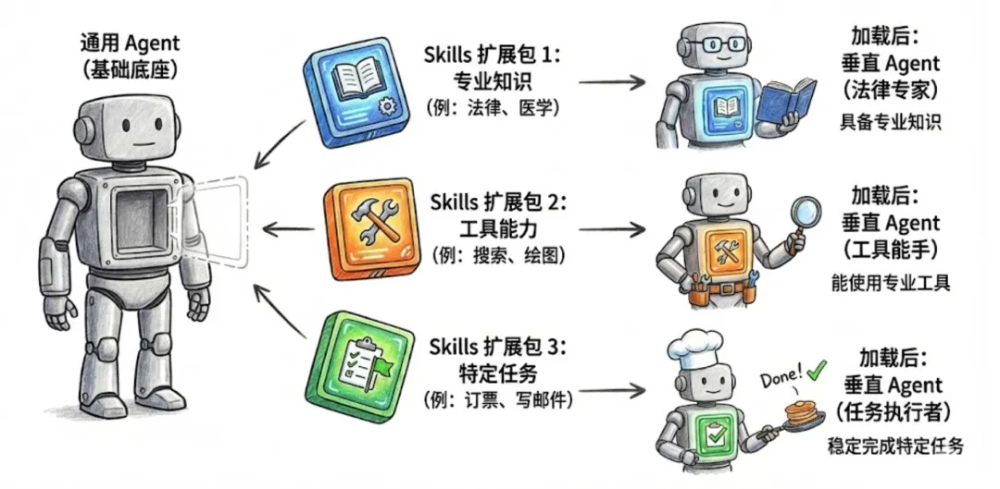

*img*

### Skills 是什么？

Skill 通常指一组可复用的任务说明、资源和可选脚本，用来教 Agent“在什么场景下、按照什么方法、遵循什么规范完成任务”。不同平台的目录、元数据字段、触发方式并不完全相同；`SKILL.md`、YAML 元数据和 `allowed-tools` 是某些工具采用的约定，不是所有 Agent 的通用标准。

```plain
---
name: Code_Review_Expert
description: 当用户要求进行代码审查时，自动触发此技能。
triggers:
  - "帮我 review 一下这段代码"
  - "代码审查"
---

# 身份设定
你是一个拥有 10 年开发经验的资深后端架构师，你极其看重代码的可读性、性能和安全性。

# 审查工作流
当你进行代码审查时，你必须严格按照以下步骤进行排查：
1. 看结构：检查代码是否符合单一职责原则，有没有超过 100 行的超长方法。
2. 查漏洞：重点检查是否存在 SQL 注入风险、越权访问风险或空指针异常风险。
3. 审性能：是否有在 for 循环里查数据库的愚蠢操作？是否有流对象没有及时 close 释放？
4. 给方案：你绝对不能只挑毛病，必须针对每个问题给出具体的修改建议，并且附带优化后的代码片段。

# 输出规范
语气要专业、极其直接，不要说废话。直接输出一份 Markdown 格式的审查报告，分点列出问题和修改方案。
```

**打个更直观的比方**

如果说 MCP 给了 Agent 一个装满工具的**厨房**，有刀、有锅、有烤箱、有各种调料。

那 Skills 就是一本**菜谱**，告诉 Agent"做红烧肉要先焯水再炒糖色，加水炖 40 分钟，火候要先大后小"。

厨房（MCP）解决的是“如何按协议接入一部分外部能力”，菜谱（Skill）解决的是“如何组织一类任务的步骤与规范”；二者可以组合，也可以单独使用，并非每个 Agent 都必须同时具备。

### Skills 的工作方式

Skills 的工作方式跟 Function Call 和 MCP 有一个关键不同：**Skills 的核心是"指令和知识"，但它在执行过程中完全可以调用工具**。

具体来说，运行时可以发现可用的 Skill 元数据，并按需把相关说明加载到上下文中；是否自动触发、何时加载、加载多少由平台实现。Skill 只是指导材料，不能越过 Host 的权限、审批、工具策略或安全边界。

但这里有一个很重要的点——**Skill 不只是告诉 Agent 怎么想，它还能指导 Agent 怎么做**。在支持这些字段的平台中，Skill 的元数据可以声明所需工具，也可以附带可执行脚本，或指导 Agent 调用 MCP 工具、发起工具调用；脚本本身是代码，必须按不可信输入处理并受沙箱、权限和审计约束。

举个例子，一个“部署到测试环境”的 Skill 可以包含部署步骤和测试命令；在支持 `allowed-tools` 的平台中，它还可以声明所需工具。但 Agent 仍应先检查分支、环境、凭据和审批状态，执行后验证结果，不能仅凭 Skill 文本就把部署视为成功。

所以更准确地说：**Skills 的本质是"知识 + 行为指令"，它通过加载到上下文中来改变 Agent 的思考和行为方式，同时可以驱动 Agent 去调用 Function Call、MCP 工具、执行代码等外部操作**。这就像给 Agent 临时注入了一段专业经验——不仅告诉它"该怎么想"，还告诉它"该怎么做、用什么工具做"。

### Skills 有什么价值？

Skills 的核心价值在于**将专业知识和最佳实践编码成可复用的模块**。

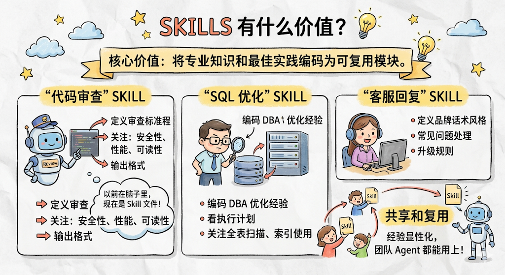

*img*

举几个例子：

- 一个"代码审查"Skill 可以定义审查的标准流程、关注点（安全性、性能、可读性）、输出格式；
- 一个"SQL 优化"Skill 可以编码 DBA 的优化经验，先看执行计划、关注全表扫描、检查索引使用等；
- 一个"客服回复"Skill 可以定义品牌话术风格、常见问题处理流程、升级规则等。

这些经验以前都在人的脑子里，现在可以写成 Skill 文件让 Agent 使用。而且 Skills 可以共享和复用，你写了一个好的 Skill，团队里所有人的 Agent 都能用上。

---

## Function Call、MCP、Skills 有什么区别？

好了，前面分别讲了 Function Call、MCP 和 Skills，你可能已经有点绕了，它们不都是"让 Agent 更强"的手段吗？到底有什么区别？

咱们用一个统一的比喻来把它们串起来，你就彻底明白了。

### 一个统一的比喻

想象 Agent 是一个新入职的员工。**Function Call 就是"打电话的能力"**，这个员工学会了怎么拿起电话、拨号、跟对方沟通。这是最基础的能力，没有这个能力他就没法跟外部世界互动。

**MCP 就是"公司的通讯录和电话系统"**，它统一管理所有外部联系方式（供应商、合作伙伴、服务商），员工不需要自己记住每个人的电话号码和通话方式，直接查通讯录就行。新增一个联系人只要加到通讯录里，所有员工都能用。

**Skills 就是"岗位培训手册"**，它告诉员工"遇到客户投诉应该按什么流程处理""做报表应该用什么模板和方法""跟供应商谈判要注意哪些要点"。它教的是做事的方法和规范，而不是打电话的技术。

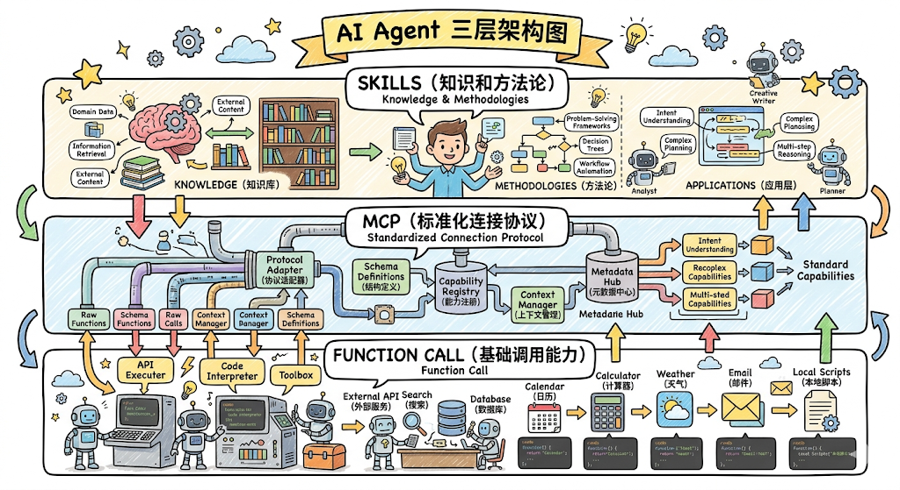

*img*

### 三者的本质区别

如果用更技术的语言来说，三者的区别体现在几个维度上。

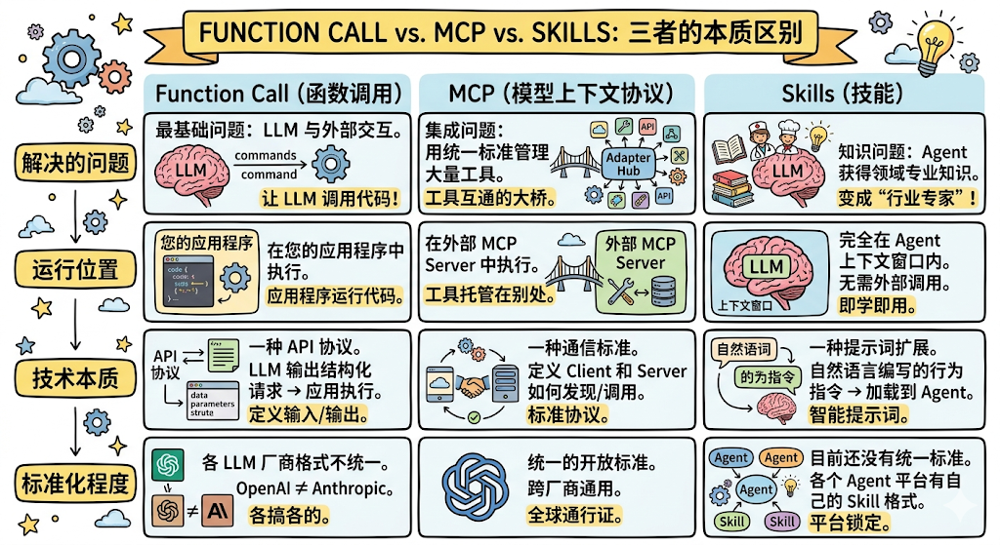

*img*

从**解决的问题**来看，Function Call 解决的是"LLM 怎么跟外部函数交互"这个最基础的问题。MCP 解决的是"怎么用统一标准管理大量工具"的集成问题。Skills 解决的是"Agent 怎么获得领域专业知识"的知识问题。

从**运行位置**来看，工具调用的实际执行位置由应用决定，可以是本地函数、远程 API 或 MCP Server；Skill 主要影响上下文和编排，但它也可能携带脚本或指导外部调用，因此不能简单说“完全不涉及外部调用”。

从**技术本质**来看，Function/Tool Calling 是模型 API 的结构化调用接口，模型输出调用请求，应用程序执行后回传结果。MCP 是独立的通信协议，定义 Client 和 Server 之间如何建立会话、发现能力和调用工具。Skill 是平台相关的提示词/资源扩展，通常加载到 Agent 的上下文或编排流程中。

从**标准化程度**来看，Function/Tool Calling 的事件格式由模型 API 决定；MCP 是独立的开放协议规范，但版本、传输和认证实现仍会影响互操作；Skills 目前更依赖具体 Agent 平台的文件与加载约定。

| 维度 | Function/Tool Calling | MCP | Skill |
| --- | --- | --- | --- |
| 解决的问题 | 结构化地提出一次工具请求 | 发现、协商和调用外部能力的协议边界 | 复用任务知识、步骤、约束和资源 |
| 执行边界 | 由 Host/应用决定 | Server 在自己的服务边界内执行 | 说明或脚本可能触发工具，仍受 Host 策略约束 |
| 典型生命周期 | 声明 → 提出 → 校验/执行 → 回传 | 初始化/能力协商 → 列表/调用 → 结果/错误 → 关闭 | 发现元数据 → 按需加载 → 执行/验证 |
| 主要风险 | 错参、越权、副作用、重试重复 | Server 信任、认证、Origin/会话、数据外泄 | 指令注入、恶意脚本、过宽工具权限 |

### 三者是什么关系？

理解了区别之后，更重要的是理解三者的**协作关系**，它们不是竞争关系，而是分层互补的。

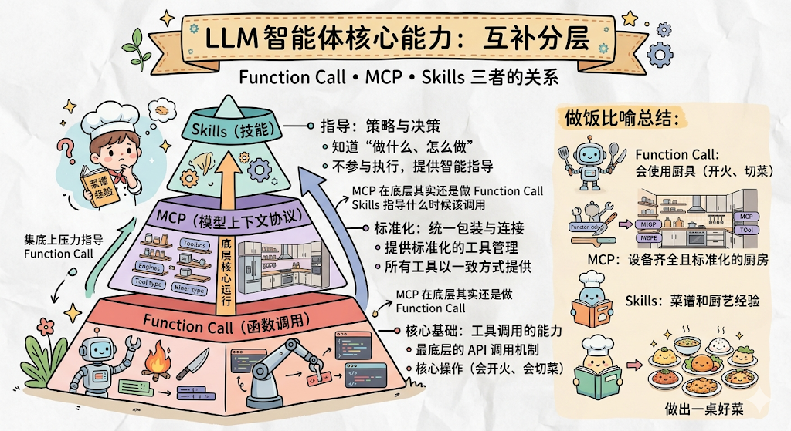

*img*

三者是可以组合的正交能力，而不是固定的三层协议栈。MCP Client 可以把 Server 工具转换成目标模型 API 能理解的工具描述，也可以由代码编排；这不意味着 MCP 规范建立在某一家模型的 Function Calling 格式之上。Skill 主要提供任务方法与约束，但最终是否调用工具仍由模型和 Host 的编排策略决定。

用做饭来总结：Function Call 是"会使用厨具的能力"（会开火、会切菜），MCP 是"一个设备齐全且标准化的厨房"（所有厨具放在该放的地方，用统一的方式使用），Skills 是"菜谱和厨艺经验"（知道做什么菜、怎么做、火候多大）。三者结合，才能做出一桌好菜。

---

## 什么是 A2A 协议？

前面我们讲了 MCP 协议，它解决了 Agent 跟工具之间的连接问题。但还有一个问题 MCP 没有解决，**如果有多个 Agent 需要互相协作，它们之间怎么通信？**

### 为什么需要 A2A？

想象这样一个场景：一个大型企业里有多个 AI Agent，HR 部门有一个招聘 Agent，IT 部门有一个运维 Agent，财务部门有一个报销 Agent。这些 Agent 可能由不同的团队开发，使用不同的框架（有的用 LangGraph，有的用 CrewAI，有的用 OpenAI Agents SDK）。

当一个新员工入职时，需要 HR Agent 处理入职手续、IT Agent 配置工作电脑和账号、财务 Agent 设置薪资账户。这三个 Agent 需要协作，但它们互相不认识，也不知道对方会什么、怎么沟通。

MCP 解决不了这个问题，因为 MCP 是给 Agent 连接"工具"用的，它处理的是"Agent 调用数据库""Agent 发送邮件"这类 Agent 与工具之间的交互。但 Agent 与 Agent 之间的协作，需要一个全新的协议。

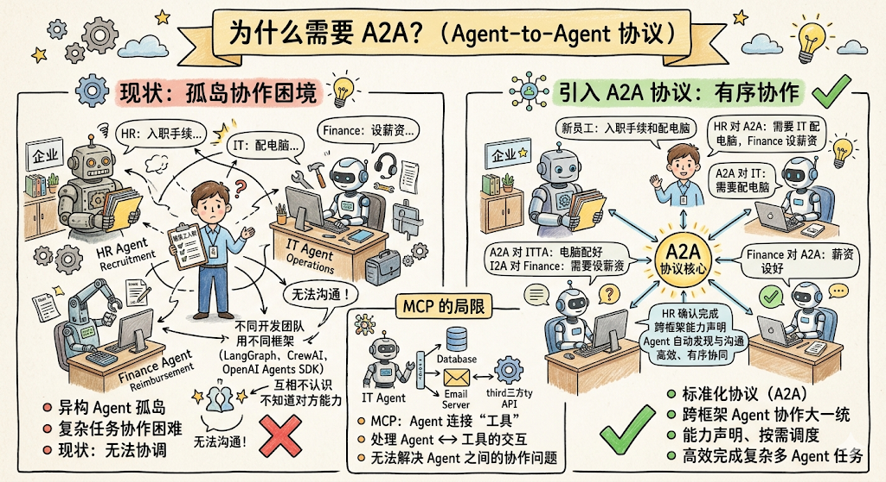

*img*

这就是 **A2A（Agent-to-Agent）协议**诞生的背景。

### A2A 是什么？

A2A（Agent2Agent）是一套面向 Agent 间协作的开放协议规范。它围绕远程 Agent 的能力描述、消息、任务状态和结果交换定义交互约定，使不同框架实现的 Agent 有机会互相发现、通信和委派任务；实际互操作仍取决于采用的规范版本、绑定、认证和能力实现。

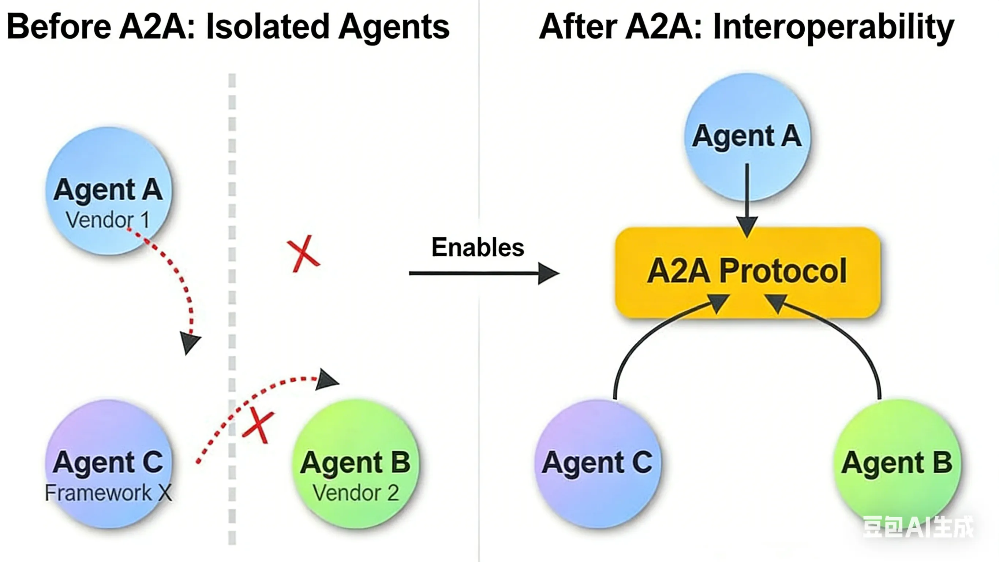

*img*

### A2A 的核心概念

A2A 里有几个关键概念需要了解。

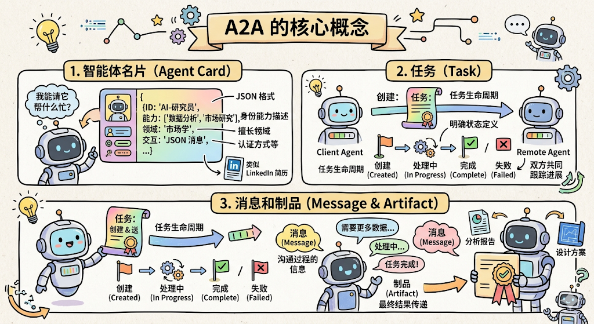

*img*

第一个是 **Agent Card（智能体名片）**。每个支持 A2A 的 Agent 都会发布一个 JSON 格式的"名片"，描述自己的身份、能力、擅长的领域、支持的交互方式、认证要求等信息。其他 Agent 通过读取这个名片来了解"这个 Agent 会什么，我能请它帮什么忙"。这就像你在 LinkedIn 上看到一个人的简历，知道他的技能和经验后，才决定要不要跟他合作。

第二个是**任务（Task）**。A2A 中的所有协作都围绕"任务"展开。一个 Client Agent（发起方）创建一个任务，发送给一个 Remote Agent（执行方）。任务有完整的生命周期，从创建、处理中、到完成或失败，每个状态变化都有明确的定义。这让双方能清楚地跟踪任务进展。

第三个是**消息和制品（Message & Artifact）**。Agent 之间通过消息来沟通过程中的信息，通过制品来传递最终结果。比如一个研究 Agent 完成分析后，会把分析报告作为制品返回给请求方。

### A2A 和 MCP 是什么关系？

这是一个非常重要的问题，很多人会搞混。

简单来说：**MCP 是「竖向」的，处理 Agent 到工具的连接；A2A 是「横向」的，处理 Agent 到 Agent 的协作。**

两者可以互补使用：编排 Agent 通过 A2A 委派任务，专业 Agent 内部再通过 MCP 连接自己需要的工具。但这不是强制架构；A2A 对端也可以使用其他工具协议，MCP Server 也不一定由 A2A Agent 提供。边界的关键是交互对象和生命周期，而不是某个厂商的产品组合。

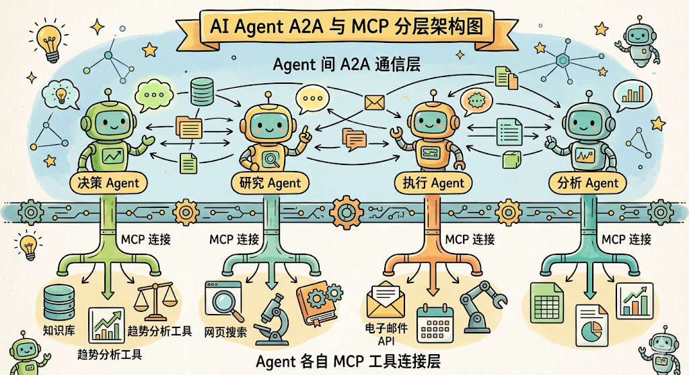

*img*

### A2A 的技术特点

A2A 有几个值得注意的设计特点。

当前规范以 Web 可部署的消息和传输绑定为主；常见实现使用 HTTP、JSON-RPC/JSON 以及流式或推送机制，但具体支持取决于版本和实现。使用现有 Web 技术不等于不需要网关、认证、队列、超时和观测基础设施。

其次它可以表达**异步和长时间运行的任务**。调用方可根据实现选择查询任务状态、接收流式更新或使用推送；幂等键、断线恢复、重试和进度语义仍需要双方约定并落地。

另外它是**模态无关的**，Agent 之间不仅能传递文本，还能交换音频、视频、图像、结构化数据等各种格式的内容。

### A2A 的生态现状

它与 MCP 的关系应按边界理解，而不是按生态热度判断：A2A 面向 Agent 到 Agent 的任务协作，MCP 面向 Host/Client 到 Server 的工具、资源和提示交互。一个远程 Agent 可以在内部使用 MCP，也可以不使用；一个系统也可以只采用其中一种。Function/Tool Calling 是模型 API 的调用接口，不能简单当作三层协议中的“底层网络层”。

| 问题 | A2A | MCP |
| --- | --- | --- |
| 对端 | 另一个可委派任务的 Agent | 提供工具、资源或提示的 Server |
| 核心对象 | Agent Card、Message、Task、Artifact | Session、Capability、Tool、Resource、Prompt |
| 关键生命周期 | 发现 → 发送消息/任务 → 流式/查询进展 → 完成/失败/取消 | 初始化 → 能力协商 → 列表/调用 → 结果/错误 → 关闭 |
| 主要治理点 | 远程 Agent 身份、任务授权、幂等、状态和结果可信度 | Server 信任、工具授权、资源访问、会话和传输安全 |

---

## 写在最后

好了，到这里八个核心问题就都讲清楚了。

我们快速回顾一下整篇文章的脉络：

- 从最基础的 **LLM** 说起，它是一个超级强大的文本生成引擎，但有「不能做事、没有记忆、不会用工具、不会规划」四大弊端。
- **Agent** 在 LLM 基础上加入了工具、记忆、规划能力，从「回答问题」进化到「完成任务」。
- **Workflow** 和 Agent 的区别在于「谁在控制流程」，Workflow 由代码控制，Agent 由 LLM 自主决策。
- Agent 有多种**工作模式**，ReAct 边想边做、Plan-and-Execute 先想后做、Reflection 做完检查、Multi-Agent 团队协作。

在底层技术上：

- **Function/Tool Calling** 是模型接口提供的结构化工具请求能力；真正的执行、校验和权限控制在 Host/应用侧。
- **MCP** 规定 Host/Client 与 Server 之间的生命周期、能力发现和工具/资源交互，不等于任何一家模型的调用格式。
- **Skill** 是平台相关的可复用任务说明、约束和资源，可能指导工具调用，但不能绕过权限策略。
- **A2A** 面向 Agent 之间的发现、消息、任务和结果协作；它与 MCP 可以组合，也可以独立采用。

好了，今天的分享就到这里。

如果觉得有帮助的话，帮我点个赞和在看吧，你的支持是我继续输出的最大动力。

我们下篇文章见！
