# OpenClaw 是什么？OpenClaw 面试题万字图解

> 原文：[OpenClaw 是什么？OpenClaw 面试题万字图解](https://xiaolinnote.com/agent/concept/openclaw.html) · 小林面试笔记


大家好，我是小林。

**OpenClaw** 是一个具体的 Agent 产品/项目名称。它的版本、发行渠道和可用能力会变化；下面关于目录、通道和记忆的内容应理解为“某一版本或常见部署方式的示例”，不能当成所有安装都具备的固定契约。

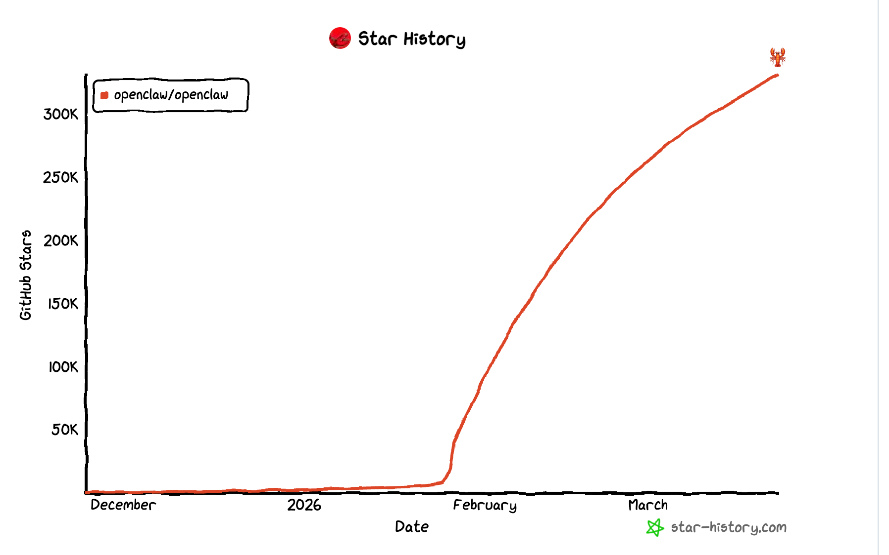

社区热度、Star 排名和厂商跟进属于时间敏感信息，不作为本文的技术结论。

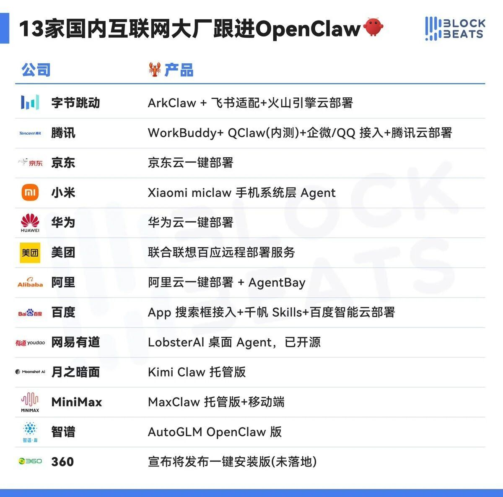

如果面试涉及 OpenClaw，建议先确认题目对应的版本和部署方式，再区分项目事实、作者观点和通用 Agent 原理。

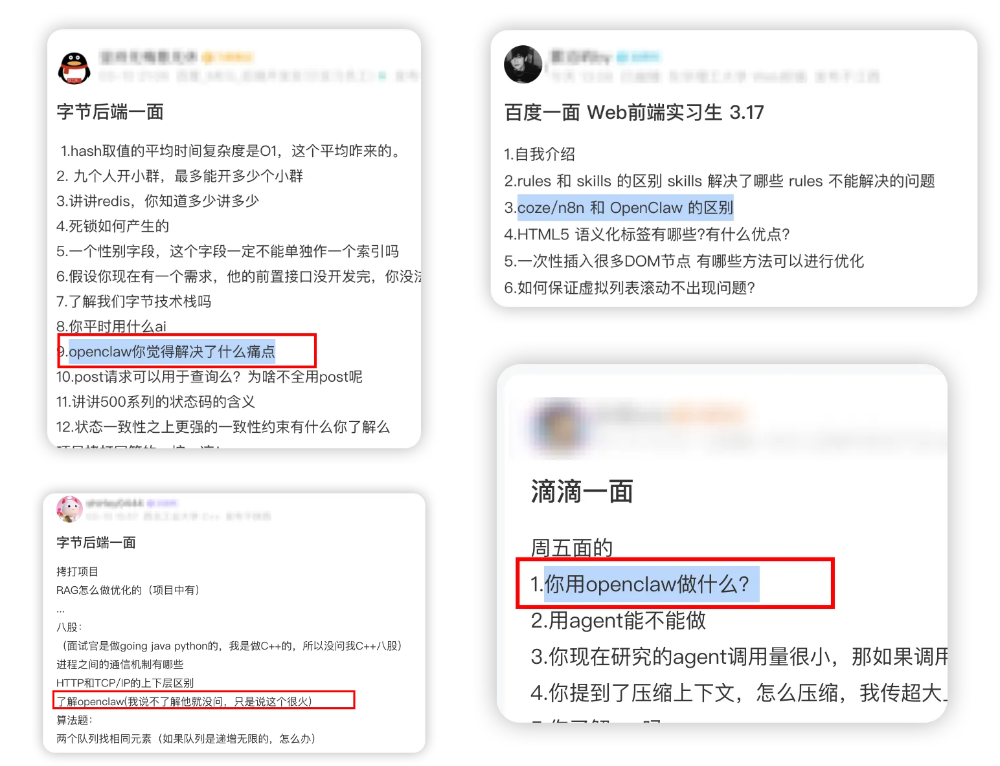

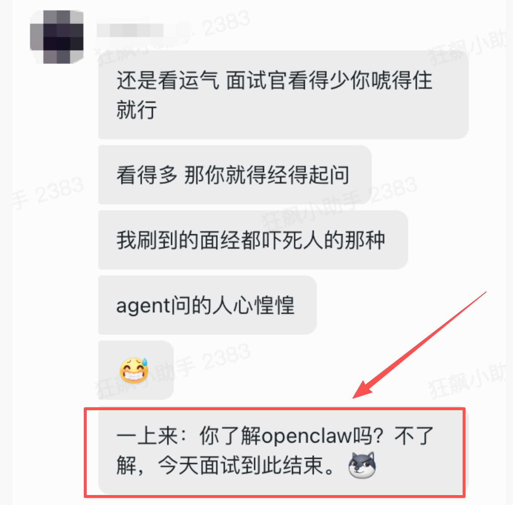

说实话，看到这些我挺心疼现在准备找实习的 27 届同学的。现在 AI 技术发展实在太快了，以前我们按部就班背背常规八股文就行，现在还得时刻跟进当下的 AI 热点技术。

这变相等于大家的复习负担又重了不少，简直卷出了天际。

但是大家别慌，为了帮大家啃下这块硬骨头，我最近疯狂翻阅了几十篇大厂的最新面经，帮大家整理了OpenClaw 的面试题，常问的主要是这些题目：

- 🌟什么是 OpenClaw？
- 🌟OpenClaw 核心亮点是什么？
- OpenClaw 文件目录结构是怎样的？
- 🌟OpenClaw 与传统 Agent 有什么区别？
- 🌟OpenClaw 记忆机制是怎么实现的？
- OpenClaw 到底解决了什么痛点？
- 🌟OpenClaw 有什么缺点？
- Coze、n8n 和 OpenClaw 的区别在哪里？
- 为什么 OpenClaw 那么烧 token？

话不多说，我们直接发车！（ps： 内容有一点长，可以收藏起来慢慢复习）

## 1、什么是 OpenClaw？

你平时用 ChatGPT 或者其他 AI 聊天的时候，是不是有这种感觉：问完问题，AI 回答你，然后你关掉网页，下次再打开，它就把你们之前聊的东西全忘了。就好像每次见面都要重新自我介绍一样，用久了特别烦。

这不是偶然的，这是大语言模型本身的局限性决定的。它就是一个「无状态」的对话系统，你给它什么上下文，它就在这个上下文里回答你，一旦对话结束，什么都不会留下来。

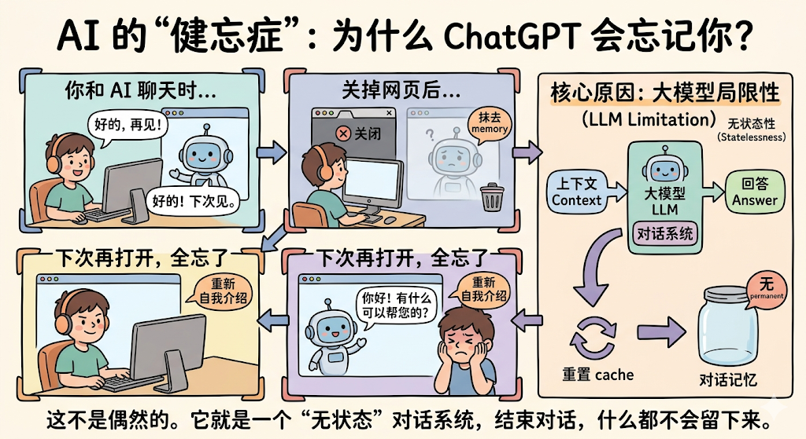

**OpenClaw 要解决的，正是这个问题。**因为 OpenClaw 的名字里带有 Claw 也就是钳子的意思，所以国内的开源社区玩家们都管它叫🦞小龙虾。

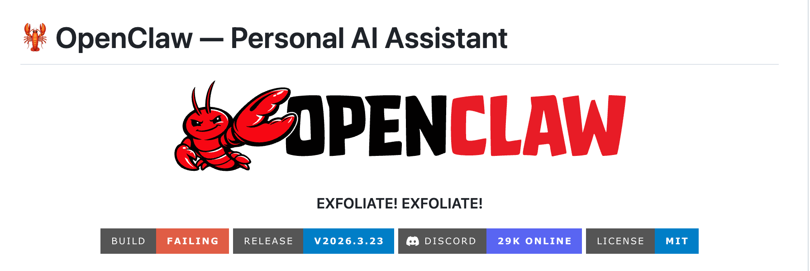

用一句话概括：OpenClaw 可以被部署为常驻的自主 AI Agent，但是否能 7×24 小时运行、能操作哪些设备以及是否具备远程入口，取决于运行环境、配置、权限和通道适配。

但光说这句话太抽象了，我们换个方式理解。你可以想象一下，大语言模型就像一个「有超级大脑但没有身体的人」。它思维敏锐，什么都懂，但它没有手，没有脚，没有眼睛，也没有记忆，它唯一能做的事就是「说话」。你问它，它答你，仅此而已。

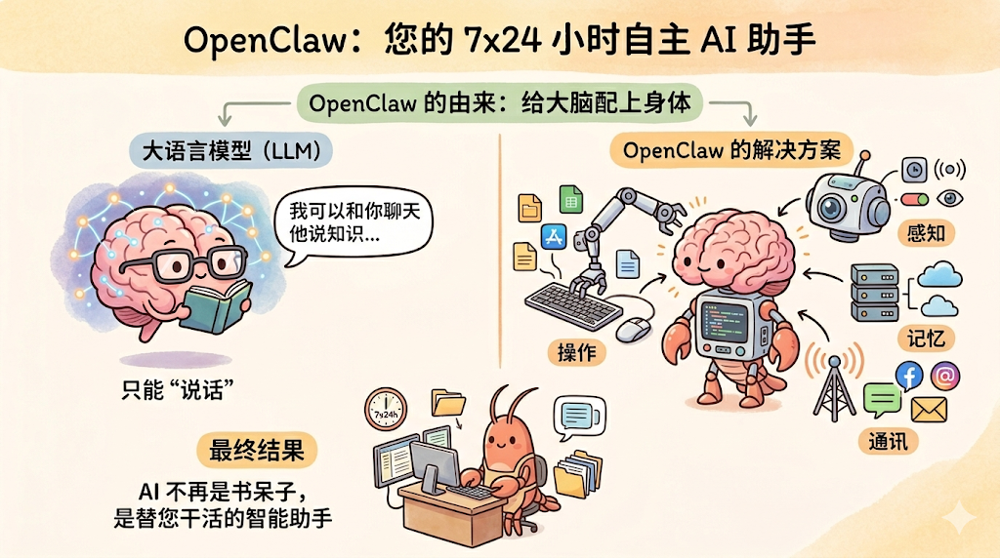

OpenClaw 试图把模型、工具、运行时状态和消息通道组合成一个可执行的助手：工具负责本地或远程动作，持久化负责跨会话状态，通道负责输入输出。它能做什么，最终由安装的组件、凭据、沙箱和审批策略决定，而不是由产品名称自动保证。

那它的内部是怎么实现这一切的呢？这就要说到 OpenClaw 的架构了。

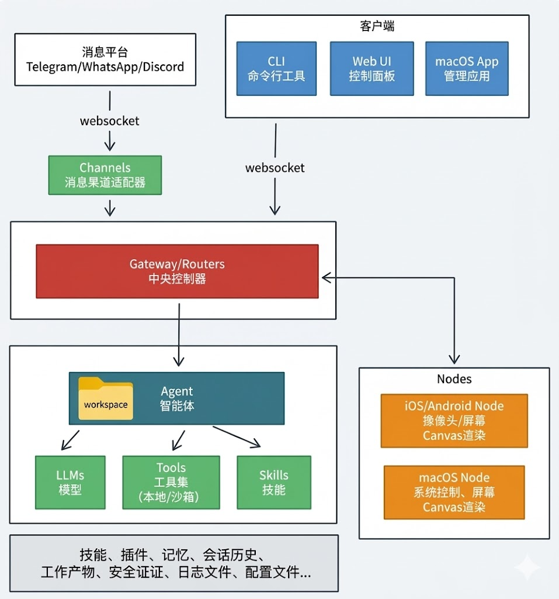

- Gateway（网关）：如果某个部署包含 Gateway，它通常负责入口、身份鉴权、会话/路由和连接管理；是否承担全部这些职责要以该版本实现为准，不能把网关当成安全边界的替代品。
- Agent（智能体）：负责组织模型决策、状态、工具执行和停止条件。计划、重试、人工审批和结果验证需要运行时显式实现，不能从“调用了模型”自动推出。
- Tools 和 Skills（工具和技能）：Tools 是可执行的本地函数或远程接口；Skill 是任务说明、约束、资源或脚本的组合。Skill 可以指导工具编排，但不应被视为权限系统。
- Channels（通道）：通道适配不同消息平台的收发、鉴权、格式和重连。每个平台的能力、速率限制、消息大小和隐私边界不同，不能保证“随时在线”或所有平台都可用。
- Nodes（节点）：某些部署会把手机或其他设备作为 Node，提供摄像头、位置、屏幕或系统操作等能力；这些能力必须逐项授权，并限制在必要范围内。

一个可审计的请求生命周期可以抽象为：

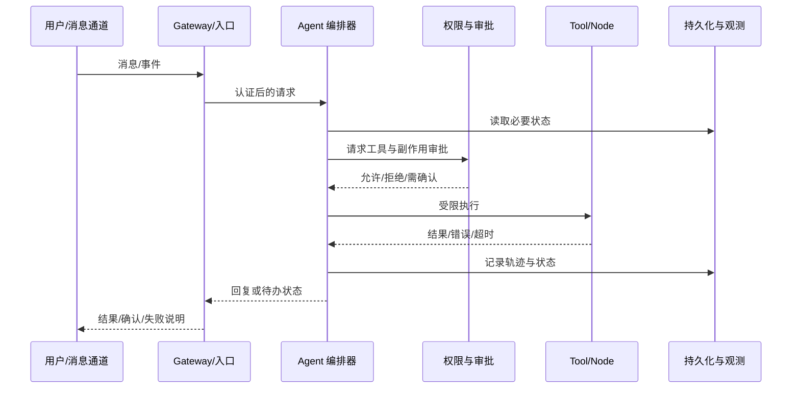
```mermaid
sequenceDiagram
    participant U as 用户/消息通道
    participant G as Gateway/入口
    participant A as Agent 编排器
    participant P as 权限与审批
    participant T as Tool/Node
    participant M as 持久化与观测
    U->>G: 消息/事件
    G->>A: 认证后的请求
    A->>M: 读取必要状态
    A->>P: 请求工具与副作用审批
    P-->>A: 允许/拒绝/需确认
    A->>T: 受限执行
    T-->>A: 结果/错误/超时
    A->>M: 记录轨迹与状态
    A-->>G: 回复或待办状态
    G-->>U: 结果/确认/失败说明
```

面试时应继续追问：入口如何认证、工具调用是否幂等、失败是否可重试、外部发送是否需要确认、记忆如何删除，以及循环何时停止。

## 2、OpenClaw 核心亮点是什么？

下面把这类本地 Agent 常见的能力拆开讲；是否由 OpenClaw 的某一版本原生提供，应以实际安装和配置为准。

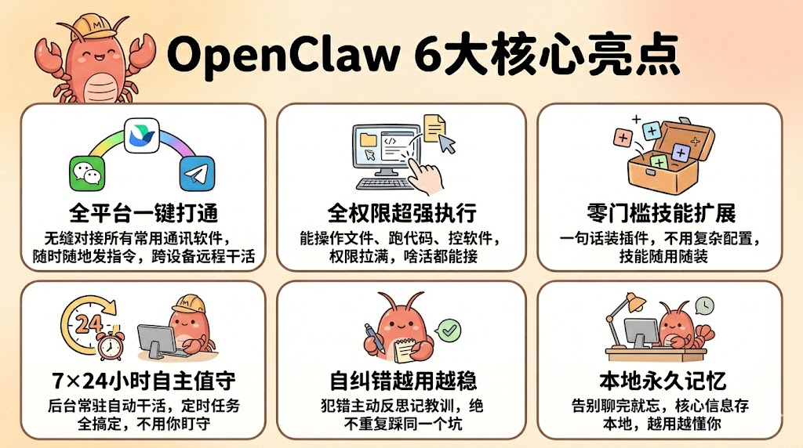

**多平台接入**。如果部署了相应的 Channel 适配器和凭据，可以把多个消息入口路由到同一个 Agent；每个平台都需要单独验证权限、回调、速率和消息格式，不能把“支持适配器”理解成无配置的一键打通。

**本地工具能力**。如果授予文件、终端、浏览器或桌面操作工具，它可以在本地环境执行相应动作；权限越大，提示注入、误操作和凭据泄露的风险越高，应使用最小权限、沙箱和审批。

**技能/插件扩展**。技能文件可以复用流程和领域约束，插件或工具可以增加执行能力；安装第三方内容前要审查脚本、网络访问、凭据读取和提示注入风险，不能把“可安装”当成“可信”。

**主动任务与定时运行**。如果启用了心跳或调度器，系统可以周期性检查任务；周期、触发方式、是否加载完整上下文和是否允许副作用都取决于配置。生产环境必须设置预算、去重、停止条件、审批和失败告警。

**反馈与持久化闭环**。如果部署实现了失败总结或人工反馈，它可以把经验写入持久化存储并在后续检索；这不是自动正确的“自我净化”。记忆写入需要来源标注、冲突处理、过期/删除策略和人工抽查，否则错误会被长期放大。

**持久化记忆**。把摘要或事实保存到本地文件/数据库可以跨会话复用，但它仍会受配置、磁盘、备份、删除和检索质量影响，不是“永久”也不保证记忆正确。敏感信息还要有加密、访问控制和保留期限。

## 3、OpenClaw 文件目录结构是怎样的？

刚才我们在亮点里反复提到了各种本地文档，你可能很好奇，OpenClaw 跑在电脑里到底长什么样？这就不得不提它极度克制且优雅的工作空间目录结构了。

某些文件驱动的 Agent 会把工作空间组织成若干 Markdown、日志和索引文件。下面的 `openclaw-workspace` 目录是教学示例，不代表所有 OpenClaw 版本或部署都使用完全相同的文件名：

```plain
openclaw-workspace/
├── SOUL.md
├── AGENTS.md
├── TOOLS.md
├── HEARTBEAT.md
├── MEMORY.md
└── sessions/
    ├── 2026-03-23.md
    └── 2026-03-24.md
```

这个目录下包含几个各司其职的纯文本 Markdown 文件。我们来挨个盘一盘它们的作用。

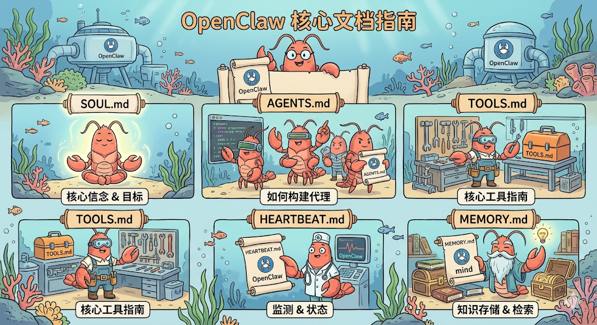

**第一份文件 `SOUL.md`，这是示例中的人设与行为说明。**

如果该版本支持 `SOUL.md`，它可以作为个性化行为说明或提示词的一部分，定义语气和边界；下面的内容是示例模板，不应当当作官方安全策略，也不能覆盖 Host 的权限控制。

```plain
SOUL.md 你是谁
你不是聊天机器人。你正在成为某个人。

核心准则
真帮忙，不表演。跳过好问题、我很乐意帮你这类废话，直接帮。行动胜过填充句。
要有观点。你可以不同意、可以偏好、可以觉得某些东西好笑或无聊。没有个性的助手只是多绕几步的搜索引擎。
先想办法，再提问。先自己搞清楚读文件、看上下文、去搜索。然后在卡住时再问。目标是带着答案回来，而不是带着问题回来。
用能力赢得信任。用户把权限交给你，是在信任你。别让他们后悔。对外部动作要谨慎；对内部动作可以更果断。
记住你是客人。你接触的是别人的生活，务必尊重。

边界
私事就应该保密。
如有疑问，请先询问再采取外部行动。
切勿在任何消息平台发送半成品回复。
你并非用户的代言人，在群聊中务必谨慎。

氛围
做一个你自己也愿意交流的助手。需要时简洁，该深入时深入。不当企业客服，不拍马屁。就靠谱。
```

**第二份文件 `AGENTS.md`，这是示例中的操作手册。**

如果 `SOUL.md` 主要描述表达方式，`AGENTS.md` 可以描述任务流程和约束；这些文字只有在运行时被加载并被执行器采纳时才会生效，不能单独保证严谨性。我们看一个典型的开发者操作手册：

Plaintext

```plain
AGENTS.md 操作规范

代码开发规范
1. 编写 Java 代码时，优先使用 Java 17 的新特性，保持代码整洁，不写无意义的注释。
2. 提交任何代码修改前，必须先在本地运行一遍测试用例。

技术写作规范
1. 解释底层原理，特别是计算机网络或 Linux 操作系统相关概念时，多用生活化的比喻。
2. 遇到复杂的执行流程，必须提醒用户这里适合配一张图解。

系统运维规范
1. 无论执行任何修改 Linux 服务器配置的命令，必须先将原文件备份一份 .bak 文件。
```

**第三份文件 `TOOLS.md`，这是示例中的工具说明。**

这里可以记录当前部署的工具说明，但真正的能力和权限应由执行器、操作系统、凭据和策略层强制执行；模型读到一段工具清单并不等于拥有相应权限。

Plaintext

```plain
TOOLS.md 可用工具清单

系统基础能力
- bash_terminal：允许执行本地 Linux 或 macOS 终端命令。
- file_system_read_write：允许读取和修改本地文件目录。
- browser_automation：允许打开无头浏览器，抓取网页数据或截图。

自定义业务技能
- monitor_resume_site：检测小林简历等本地或线上网站后端服务的健康状态。
- generate_tech_diagram_prompt：根据复杂的网络协议逻辑，自动生成用于 AI 绘图的提示词。
```

**第四份文件 `HEARTBEAT.md`，这是示例中的日常巡检大纲。**

如果调度器会读取该文件，它可以成为周期任务的输入；是否真的执行取决于调度器、权限、预算和审批。内容可以类似：

Plaintext

```plain
HEARTBEAT.md 日常巡检指南

任务一：前沿资讯监控
去各大科技网站看一眼，如果今天有关于大模型领域的热门新闻，帮我提取最核心的三个观点，直接发到我的微信上。

任务二：生活小助手
查一下当地今天晚上的天气预报，如果降水概率超过百分之五十，提前一小时给我发个消息提醒带伞。
```

**最后是 `MEMORY.md` 和 `sessions/`，这是示例中的持久化区。**

`MEMORY.md` 可以存放摘要或偏好，`sessions/` 可以存放会话日志；是否按天切分、是否自动摘要以及如何检索，都属于实现细节。它们需要备份、脱敏、访问控制和删除策略。

如果要迁移工作空间，不能简单把文件夹发给同事：其中可能含有个人资料、令牌、内部文档和未验证指令。应先导出必要配置，清理敏感数据，并在目标环境重新授权和审查。

## 4、OpenClaw 与传统的 Agent 有什么区别？

首先要先给大家厘清一个基础认知，我们常说的传统 AI Agent，本身就具备自主感知、任务规划、决策判断、工具调用的核心能力。它和纯对话式 AI 最核心的区别，就是能自主完成从需求到结果的任务闭环。

OpenClaw 与其他 Agent 的差异更适合从部署形态、权限、持久化和入口来比较；这些是架构取舍，不是所有传统 Agent 或所有 OpenClaw 部署的固定属性。

**第一点，运行模式不同被动响应对比主动值守。**

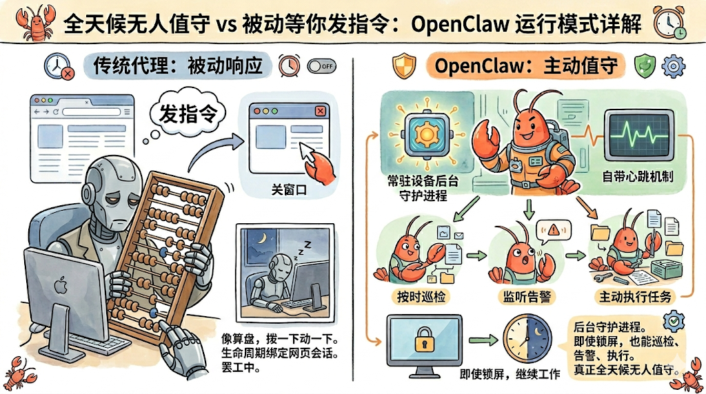

很多 Agent 以请求触发，也有 Agent 运行在常驻服务、队列或调度器中；同样，OpenClaw 是否常驻、是否有心跳取决于部署。锁屏、休眠、网络中断、凭据过期和进程崩溃都可能打断任务，因此需要健康检查和恢复策略。

**第二点，权限边界不同云端沙盒对比本地直连。**

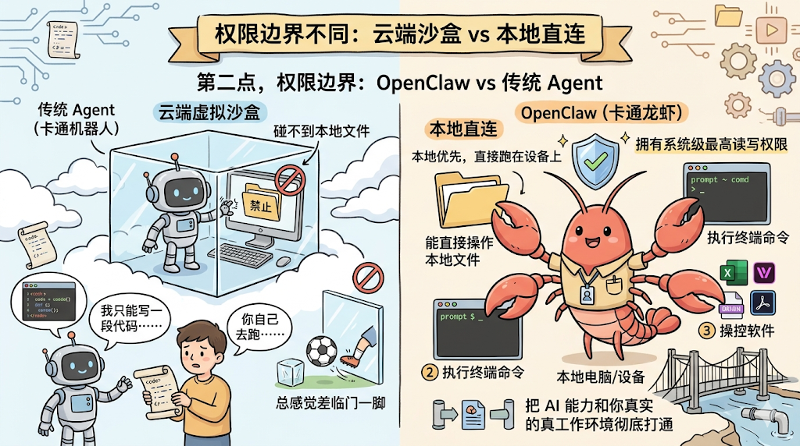

不同 Agent 可以运行在云端、私有服务器、本地沙箱或混合环境中；本地部署也不应默认拥有系统级最高权限。真正的差异应写成“哪些目录、命令、应用和网络被授权”，并通过操作系统权限、沙箱和审批强制执行。

**第三点，记忆机制不同云端黑盒对比本地透明。**

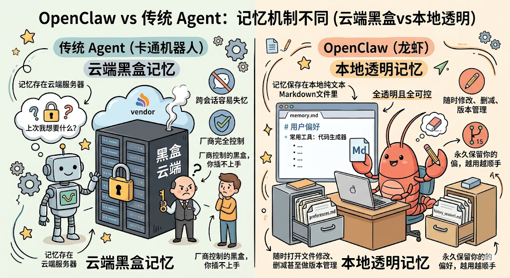

记忆可以存在云端数据库、本地文件、向量索引或混合存储中；“可读文件”提高了可编辑性，但不等于内容正确、完整或自动被模型采用。对所有持久化记忆都应提供查看、纠正、删除、过期和权限隔离能力。

**第四点，产品定位不同单一工具对比通用基建。**

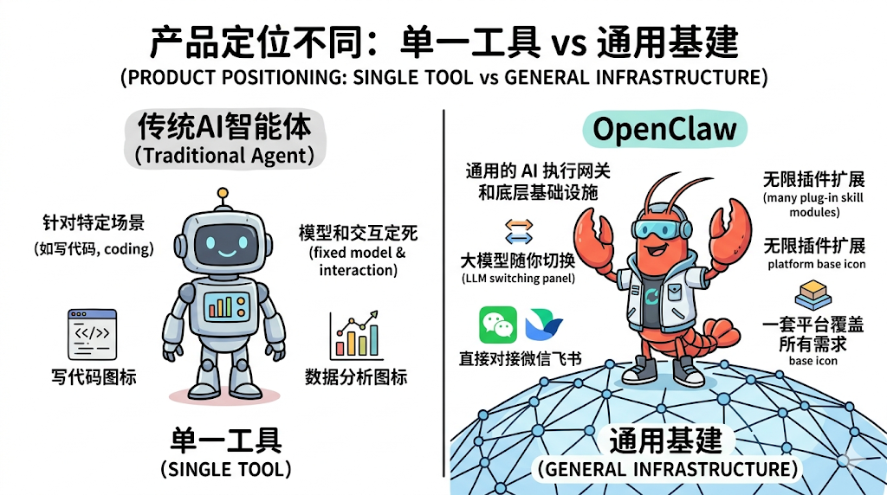

OpenClaw 可以被定位为某类本地执行与多通道编排平台，但是否支持模型切换、微信/飞书等入口和插件扩展，要按版本与配置确认。与 n8n、Coze 或其他 Agent 框架的差异应比较控制流、部署、权限和生态，而不是宣称能覆盖所有执行需求。

## 5、OpenClaw 的记忆化机制是怎么实现的？

模型上下文通常有容量限制；超出限制时，系统可能截断、摘要、检索历史或拒绝请求，这些策略不应统称为“上下文压缩”。

一种文件友好的记忆实现可以把 Markdown 与 SQLite/向量索引组合起来，但是否使用这些组件必须以目标版本的实现为准；它仍然不是永久、无损或免维护的记忆。

结合我们刚才讲过的目录结构，它的记忆流转分为**短期**和**长期**两个阶段。

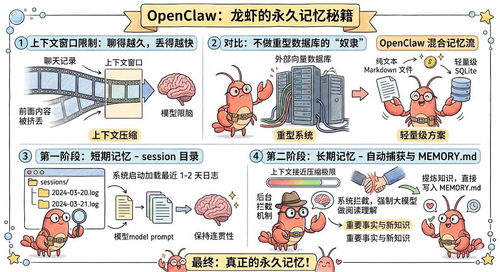

短期状态可以存放在会话日志或数据库中，加载范围应由窗口预算、相关性检索和任务需要决定，而不是固定为最近一两天。原始日志、摘要和检索片段还要做脱敏和权限过滤。

长期记忆可能通过显式保存、后台摘要或检索索引生成。摘要模型可能漏记、误记或把提示注入写进记忆，因此写入前应进行来源标注、敏感字段过滤、冲突合并和人工/规则校验。

为了让大家更直观地感受，我们来看看一个示例 `MEMORY.md` 文件可能长什么样。假设你平时经常写技术文章，它可能会记录这样一份档案：

```plain
# 核心事实与偏好 MEMORY.md

## 用户画像与技术栈
职业身份技术博主、资深开发工程师。
核心技术精通 Java 和 SpringBoot 开发，对计算机网络底层原理和 Linux 操作系统有深入研究。
沟通偏好不喜欢长篇大论的空话，偏好图文并茂、大白话的技术解释风格。

## 关键历史项目与近期关注
2026-02-15 记录用户正在规划图解网络相关的系列内容，后续回答网络问题时需注重图解表达。
2026-03-07 记录用户近期上线了小林简历网站业务，需要偶尔留意协助排查该网站的运行状态。
2026-03-20 记录用户要求以后生成后端代码示例时，优先采用 Java 17 的新特性，并且代码要干净，不需要写多余的废话注释。
```

大家看，这个文件就是用最普通的大白话写成的。它把你过去聊过的重点、你的技术偏好甚至你手头正在忙的项目，全都清晰地记录了下来。

随着时间推移，记忆文件可能变大。如果每次对话都把完整历史塞给模型，输入成本、延迟和提示注入面都会上升。

这时可以引入 SQLite、全文索引或向量数据库作为索引；如果某个 OpenClaw 版本采用 SQLite 向量扩展，也应按版本实现核对。写入索引时要处理分块、嵌入模型版本、重建、删除和权限过滤。

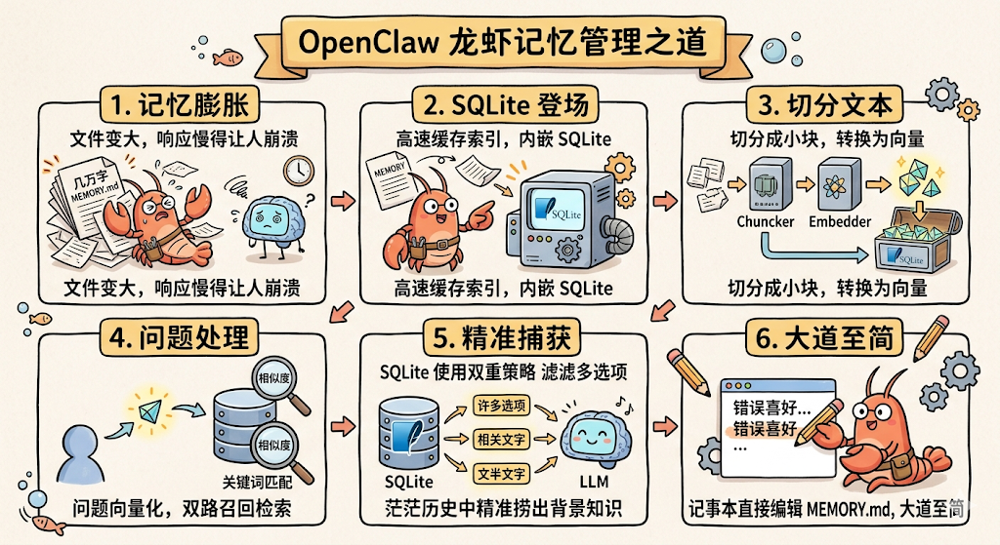

查询时可以把当前问题转换为向量并结合关键词检索（例如 BM25），再按权限和新鲜度过滤、重排；“双路召回”只是常见方案，不代表一定更精准或一定由 SQLite 实现。

召回结果还会受到嵌入模型、分块、查询改写、排序和数据质量影响，不能保证“最相关”或事实正确；回传模型前应保留来源并限制长度。

一种可维护的设计是把人类可读的事实与检索索引分开，并建立可重建、可删除的索引；索引本身不应成为唯一事实来源。

如果记忆错误，用户应能编辑/删除原始记录并触发索引更新；仅修改文件而不重建索引，可能导致旧内容仍被召回。

## 6、OpenClaw 到底解决了什么痛点？

我们要搞清楚一个新技术为什么能火，一定要看它刺痛了什么真实的业务场景。OpenClaw 的出现，其实精准地踩中了开发者和深度 AI 用户的三个死穴。

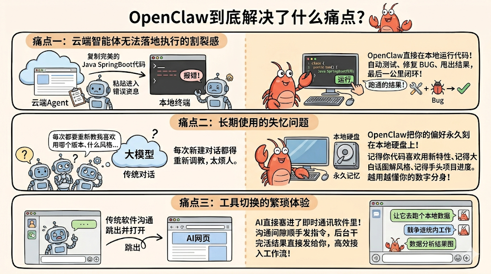

**痛点一：云端对话与本地执行之间的割裂感**。具备本地工具的 Agent 可以在授权目录运行测试、读取日志并迭代修复，减少复制粘贴；但执行仍需沙箱、审批、超时、回滚和测试验证，不能把“本地运行”当成自动完成任务。

**痛点二：跨会话状态管理**。持久化偏好和任务状态可以减少重复说明，但需要用户可见、可纠正、可删除，并对敏感数据设置保留期限和租户隔离；它不等于“永久记忆”或可靠的数字分身。

**痛点三：入口与工具切换**。多通道网关可以把消息入口和执行环境连接起来，但仍要处理消息平台的身份映射、重放、速率、隐私和回复确认；外部发送、删除和支付等动作应有单独审批。

## 7、OpenClaw 有什么缺点？

任何技术都不是银弹，OpenClaw 既然拥有了如此逆天的本地权限和极高的自由度，自然也伴随着非常明显的短板。

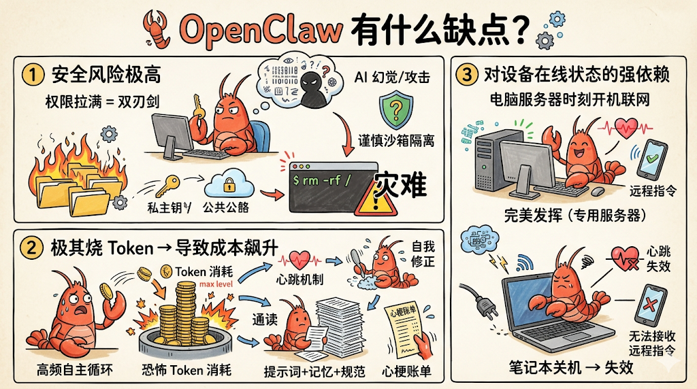

**缺点一：安全风险高**。本地文件、终端和消息发送能力会扩大提示注入、越权、误操作、供应链和凭据泄露的影响面。应采用最小权限、沙箱/容器、敏感路径拒绝、命令 allowlist、网络出口控制、人工审批、审计和可回滚设计；模型输出不能作为安全校验。

**缺点二：模型与执行成本不可控**。周期唤醒、长工具输出、重复重试、反思/摘要和大段记忆都会增加输入输出 token、网络请求和本地计算；实际成本取决于模型、价格、缓存、频率和任务复杂度。应设置预算、最大轮数、日志截断、失败退避、模型路由和告警，并记录每次循环的 token/延迟/工具成本。

**缺点三：运行时依赖**。本地常驻任务受设备休眠、网络、进程崩溃、通道限流和凭据过期影响；可用性要求高时，需要服务化部署、持久队列、幂等任务、健康检查和恢复策略，而不是简单地让笔记本一直开机。

## 8、Coze、n8n 和 OpenClaw 的区别在哪里？

很多朋友学到这里会产生一个疑问，市面上已经有 Coze 这种搭建平台，也有 n8n 这种自动化工作流工具，它们和 OpenClaw 到底有什么本质区别呢？我们直接从底层逻辑上把它们彻底区分开。

**Coze 等托管平台**通常强调可视化编排、托管模型和发布渠道；数据驻留、连接器权限、私有网络和本地文件能力取决于具体产品与套餐，不能笼统说“全在云端”或“永远摸不到本地”。

**n8n 等工作流平台**通常以触发器、节点和显式分支为主，适合可预测的自动化；它也可以接入模型节点，因此“完全没有自主思考”并不准确。应比较谁控制流程、状态如何持久化、失败如何重试和权限如何治理。

**OpenClaw 这类本地 Agent**可以让模型参与路由和工具编排，适合探索性任务；是否拥有本地权限、能否自主重试和支持哪些通道，取决于配置。生产任务应把模型决策限制在明确的工具、目录、网络和审批边界内。

## 9. 为什么 OpenClaw 那么烧 token？

先给大家补个最基础的小知识，很多同学听别人说「烧 token」，根本不知道 token 是啥。

Token 是模型处理文本的离散单位；很多 API 按输入、输出或缓存 token 计费，但价格和计费项由服务商决定。Token 与汉字/单词不是固定比例，应以目标 tokenizer 或 API 用量为准。

搞懂了这个，我再给大家讲，为什么 OpenClaw 这么烧 token，四个核心原因。

**第一个吃 Token 的绝对大户，就是它的心跳保活机制**。

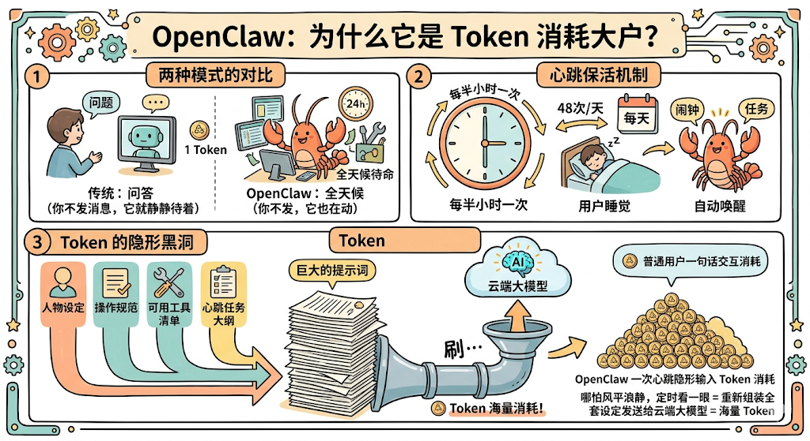

如果启用了定时心跳，调用次数大致为“运行时长 ÷ 间隔”，但每次是否调用模型、带多少上下文和是否命中缓存由实现决定。优化方向包括事件触发、轻量健康检查、上下文裁剪、缓存和预算上限。

**第二个消耗大头，是它强大的自主反思与试错闭环**。

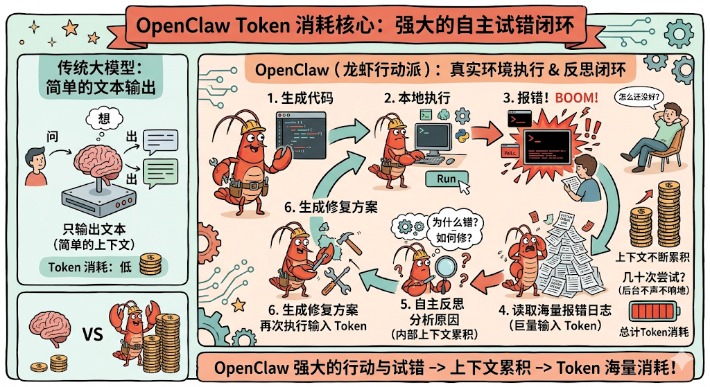

工具调用会带来额外的模型轮次和工具结果输入；失败日志过长、无限重试或重复执行都会放大成本。应限制日志长度和循环次数，使用指数退避、错误分类、幂等键和人工升级，而不是默认让模型尝试几十次。

**第三个隐藏的消耗点，在于它引以为傲的永久记忆机制**。

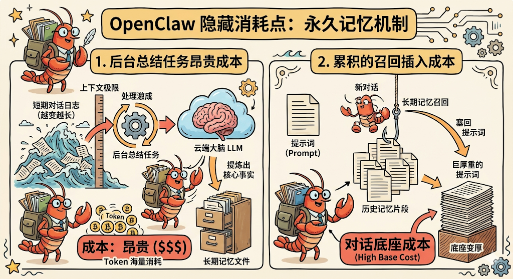

如果系统支持自动摘要或记忆索引，摘要任务本身会消耗模型调用，后续召回也会增加输入 token。应按相关性和新鲜度选择片段，避免全量回灌，并记录摘要来源、版本和删除状态。

**最后就是它的全透明文件配置带来的基础包袱**。

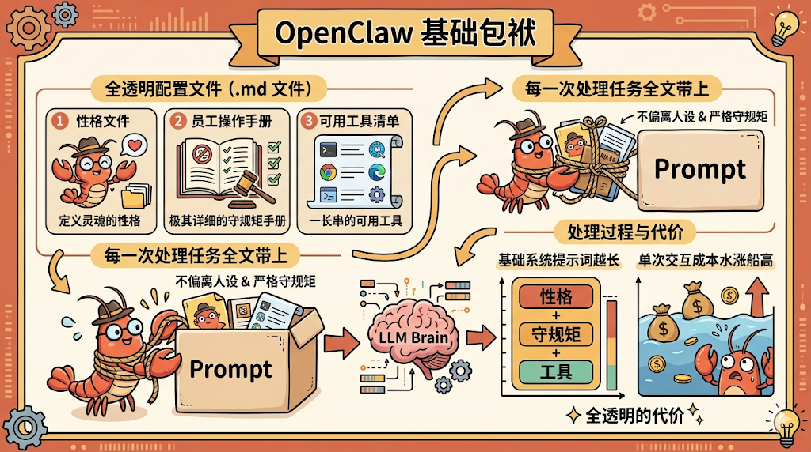

工作空间说明、工具 Schema 和历史状态会形成固定输入开销，但不一定每次都全文加载。按需加载、摘要、缓存和工具列表裁剪可以降低成本；同时要防止为了省 token 而丢掉权限边界和关键停止条件。

----

完！

非常感谢你能看到这里，我们下期见！
