# Loop Engineering 是什么？AI 编程从 Prompt 到 Loop 的范式转变

> 原文：[Loop Engineering 是什么？AI 编程从 Prompt 到 Loop 的范式转变](https://xiaolinnote.com/agent/engineering/loop-engineering.html) · 小林面试笔记


大家好，我是小林。

不知道你有没有跟我一样的感觉：AI 圈造新词的速度，已经超过我学习的速度了。

不同阶段的讨论先后强调 Prompt Engineering、Context Engineering 和 Harness Engineering；这些词有重叠，也不代表前一个已经“过时”。本文把它们作为关注点的变化来解释。

其实 harness engineering，我之前就写过一篇： [万字长文图解 Harness 工程](https://mp.weixin.qq.com/s?__biz=MzUxODAzNDg4NQ==&mid=2247556454&idx=1&sn=ad92c367b10877933f4556d0aceb497c&scene=21#wechat_redirect)，还没看过的同学，可以补补课。当时这篇文章收获了很多读者的好评。

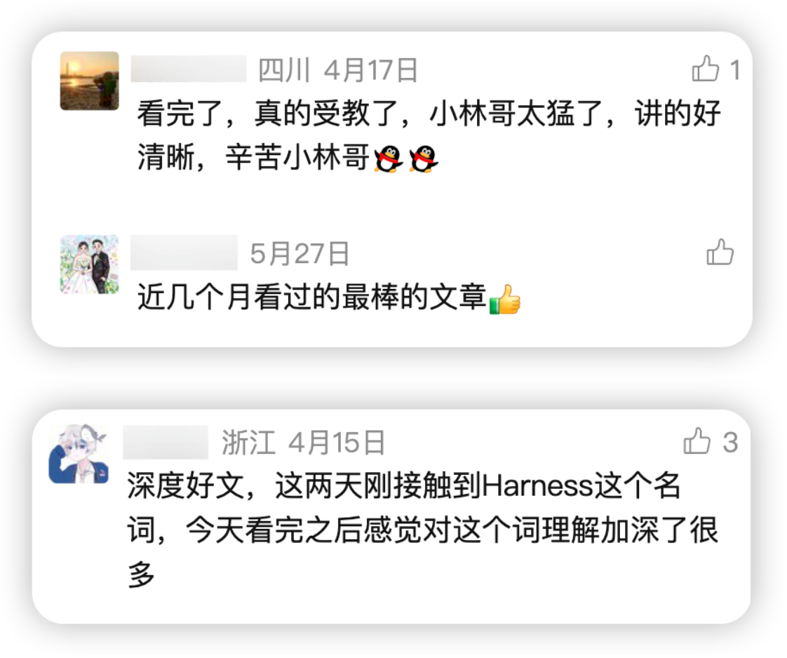

社区随后又出现了 **loop engineering** 这个说法。它更像对持续触发、执行、验证和状态管理实践的概括，并非统一的协议或标准。

讲真，我第一反应是翻白眼：又来？是不是把 engineering 前面换个单词就能造一个赛道？

但我把来龙去脉扒了一圈之后，我收回了白眼。

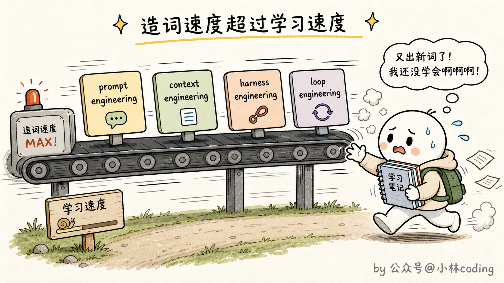

这个词的传播与具体文章、访谈和社交媒体讨论有关；出处应按原文核对，不能把传播口号当成正式定义。

Peter Steinberger 的公开帖子曾用类似表述讨论：与其逐轮手动驱动 coding agent，不如设计能持续驱动它的 loop。这里的观点属于作者语境，不是通用禁令。

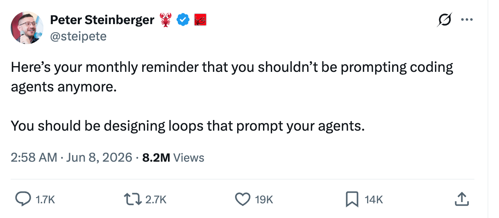

给概念定名写长文的是 Addy Osmani，Google Cloud 的 AI 总监：

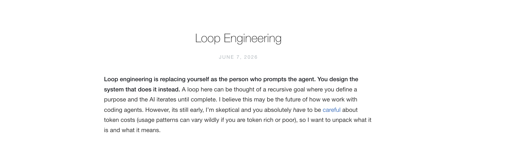

而几天前，Claude Code 创始人 Boris Cherny 在访谈里说了一句更猛的话，等于提前给这个概念背了书：

「我已经不 prompt Claude 了。是 loop 在运行着 prompt Claude、决定做什么。我的工作是写 loop。」

几位工具作者和工程实践者从不同角度讨论了相近问题，这说明话题受到关注，但不构成技术标准。

这种程度的共振，值得认真看一看。

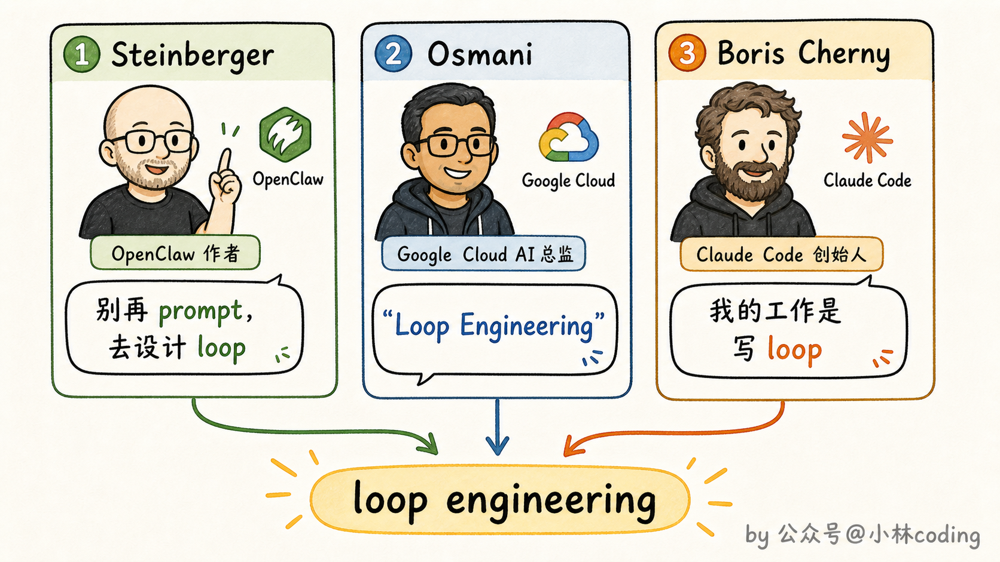

这篇文章我整理成 6 个问题：

- Q1：四个 engineering，到底都在 engineering 什么？
- Q2：Loop Engineering 到底是什么？
- Q3：一个 loop 由什么组成？
- Q4：拼起来之后，一个真实的 loop 长什么样？
- Q5：工具已经追上来了，现在就能搭
- Q6：三盆冷水：loop 越好用，这三个问题越尖锐

我们一个一个来说。

---

## Q1：四个 engineering，到底都在 engineering 什么？

在讲 loop 之前，得先把欠的账还了：prompt、context、harness 这三个词，很多人到现在也只是「听过」，没真正分清。

先问一个问题：为什么这些词会一个接一个地冒出来？是 AI 圈闲得慌吗？

还真不是。每个新词的出现，背后都是同一件事：**上一个瓶颈被解决了，新的瓶颈暴露出来了**。把这条线从头捋一遍，四个词一下就清楚了。

在早期对话式应用中，很多任务是短链路的一问一答，提示词对结果影响尤其明显。

于是大家研究话术：角色扮演、思维链、少样本示例。

这就是提示词工程（Prompt Engineering），本质是**跟一个聪明但一根筋的实习生说话的技巧**，同一件事换个问法，效果天差地别。这个阶段的瓶颈，卡在「怎么说」。

当模型被放进工具调用和长链路 Agent 后，光会表达就不够用了。

你让它改一个 bug，它写得再漂亮也没用，因为它没看过你的代码、不知道你的规范、不了解之前的讨论。话术解决不了「巧妇难为无米之炊」。

于是瓶颈从「怎么问」移到了「喂什么」：把对的代码、文档、工具、历史记忆，在对的时机放进上下文窗口。这就是上下文工程（Context Engineering）的一类关注点；术语的流行有多个来源，不必归因给单一人物。

类比一下：你不再纠结怎么跟实习生说话，而是开始给他准备一桌整理好的资料。

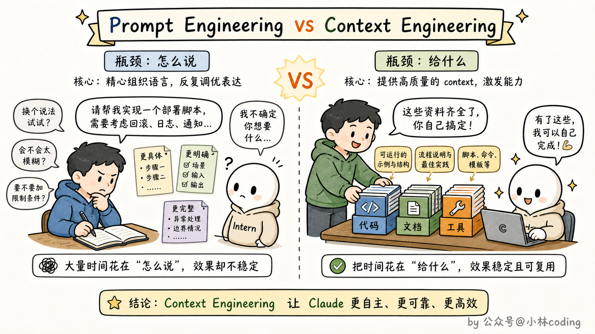

*prompt engineering 与 context engineering 对比图*

即使上下文准备得更好，长链路执行仍会遇到权限、工具、状态、验证和恢复问题；任务能连续运行多久取决于模型、运行时和预算，不能用固定年份或时长概括。

它需要工具去执行命令、需要权限边界防止误伤、需要沙箱安全地试错、需要派出子 agent 分头探索、需要上下文管理机制防止越干越糊涂。这一整套围绕模型搭建的运行装备，业内叫 **harness**（直译是马具，可以理解成 agent 的「驾驶舱」）。

一些团队的公开文章把这类运行环境称为 harness，并用“Agent = 模型 + harness”作记忆性表达。同一个模型在不同工具、上下文、权限和评估环境中表现可能不同，但收益必须按任务实测，不能承诺固定倍数。

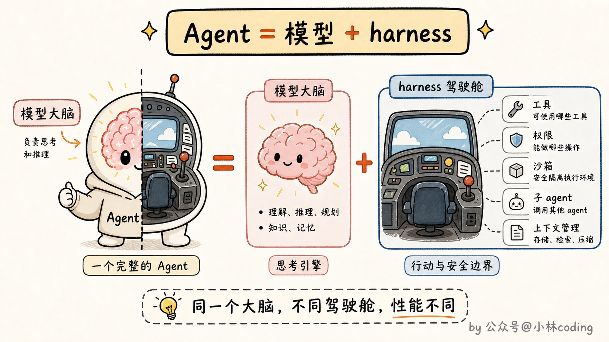

*Agent 等于模型加 harness 公式拆解图*

话术、材料、驾驶舱，三道坎都迈过去了。那最后剩下的瓶颈是谁？

你自己。

在没有调度器或事件触发器时，人仍需手动启动下一轮；接入调度后可以减少手动触发，但依旧需要预算、审批、告警和人工验收。人工不应被描述成唯一瓶颈。

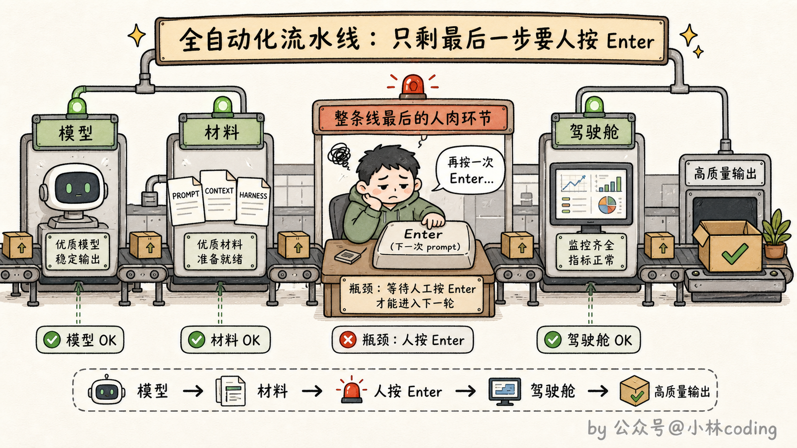

*最后瓶颈示意图*

loop engineering 瞄准的就是这最后一环：设计一个系统，让「下一次回车」不再由你来按。

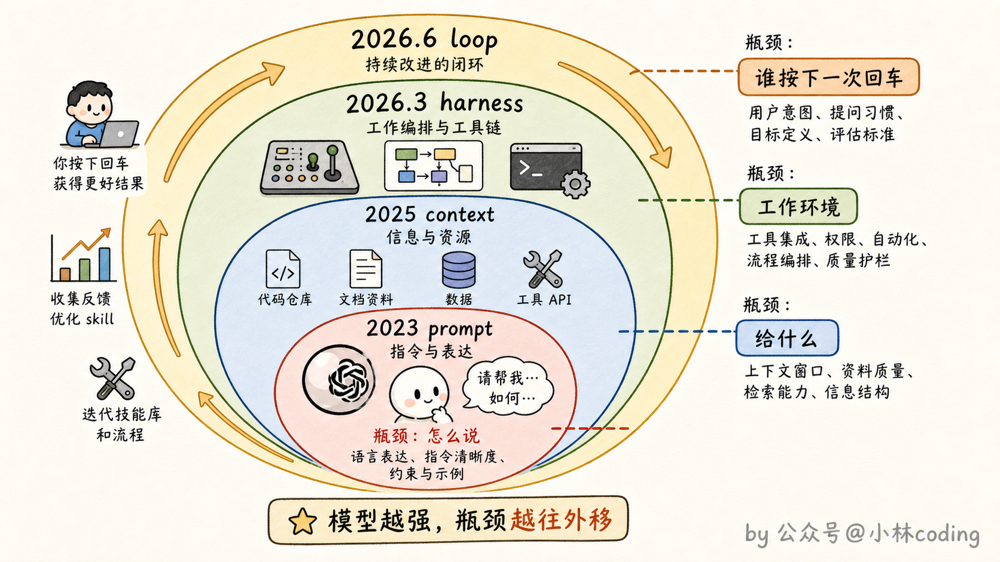

*四代概念演进总览图*

看出规律了吗？**模型每变强一截，瓶颈就往外移一层**：从你说的那句话，到你给的那堆材料，到它干活的环境，最后落到你本人身上。

所以这些词可以作为不同工程关注点的路标，但不应据此断言存在统一的线性“代际迁移”。

**四个 engineering 可以放在同一条因果链中理解：表达、信息、运行环境和持续触发逐层增加治理要求；最终瓶颈仍需通过任务数据定位。**

---

## Q2：Loop Engineering 到底是什么？

铺垫完了，现在正面回答：loop engineering 是什么？

Steinberger 的公开帖子主要起到传播口号的作用：别只在每轮手动 prompt，去设计能驱动 Agent 的 loop。但浏览量和口号都不能替代定义。

随后 Osmani 的文章给出了一种工作性定义：

「Loop engineering 就是把『亲自给 agent 写 prompt 的那个你』替换掉。你转而去设计那个代替你做这件事的系统。」

他还把 loop 描述为围绕目标持续迭代的系统；工程上还必须补充触发、状态、验证、预算、权限和停止条件，不能只说“直到完成”。

说人话就是：过去两年，你跟 coding agent 的协作方式是回合制的，你写一条 prompt，读它的输出，再写下一条。agent 是工具，**你全程握着它**，一回合都不能松手。

loop engineering 说的是，松手吧。你把「发现任务、布置任务、检查结果、决定下一步」这套流程设计成一个能自己运转的循环，然后让循环去握着 agent。

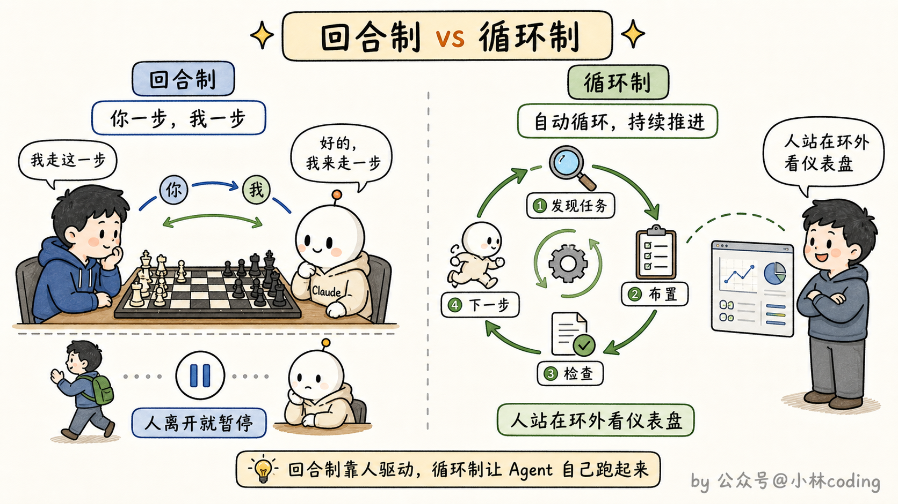

*回合制 vs 循环制对比图*

打个比方。以前你是客服热线的接线员，每个电话都要你亲自接、亲自答；现在你升级成了设计工单系统的人：电话怎么分流、哪类问题转给谁、办结标准是什么、办不了的怎么升级到你，规则定好，系统自己转。

你没有离开这家公司，但你的岗位变了。

这也可以帮助理解“我的工作是写 loop”这类说法：工作重点从逐轮操作转向设计触发、约束、验证和恢复；并不意味着工作量必然下降。

什么叫支点移动？以前你写一条好 prompt，收益是「这一次回答变好」；现在你设计一个好 loop，收益是「之后每一次循环都变好」。投入从消耗品变成了资产。

但反过来，设计 loop 也比写 prompt 难得多：你要考虑触发、并行、验证、状态、止损，相当于从「说一句话」升级到「设计一套制度」。杠杆变长了，对握杠杆的人要求也变高了。

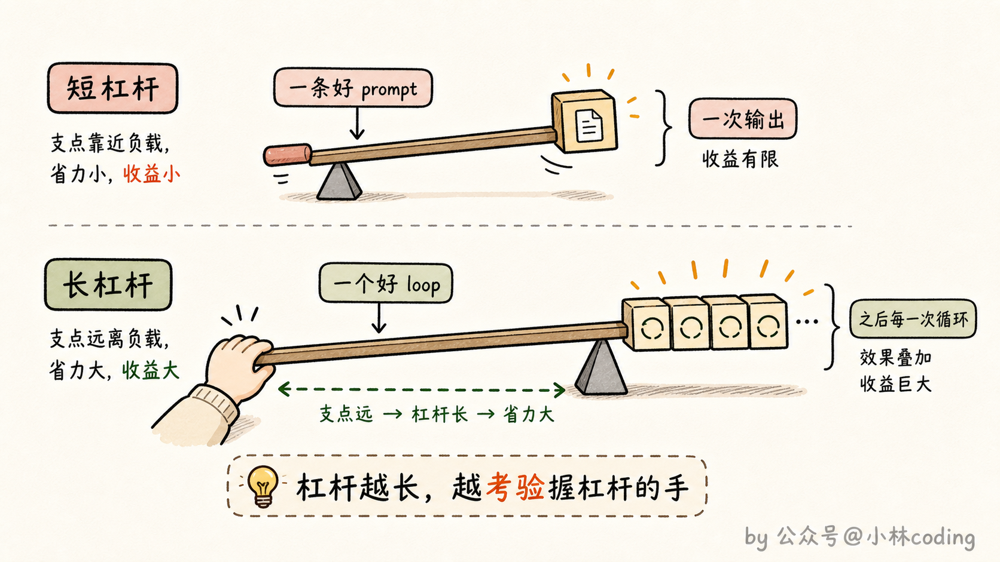

*杠杆支点移动示意图*

**loop engineering 一句话：你从逐轮 prompt 的执行者，转向设计 prompt、工具、状态和验收闭环的系统。**

---

## Q3：一个 loop 由什么组成？

概念清楚了，落地的问题马上来了：一个能自己运转的 loop，到底需要哪几样东西？

把一个可运行的 loop 拆开，常见的是**五类运行部件，外加状态/记忆**：触发、隔离、任务说明、外部连接、独立执行/验收，再加上可恢复状态。不是每个 loop 都需要全部组件。

### 第一件：自动化，loop 的心跳

先想一个问题：你写了一个很完美的工作流脚本，但每次都要你手动启动，它算 loop 吗？

如果目标是无人值守或周期运行，自动化触发是关键；手动重复运行也可以用于开发和调试，只是还没有形成完整的无人值守闭环。

所以第一件是定时或事件触发：例如按计划扫描 CI 失败，或在 PR 合并事件后启动检查。触发器还要做去重、并发限制、失败告警和停止条件。

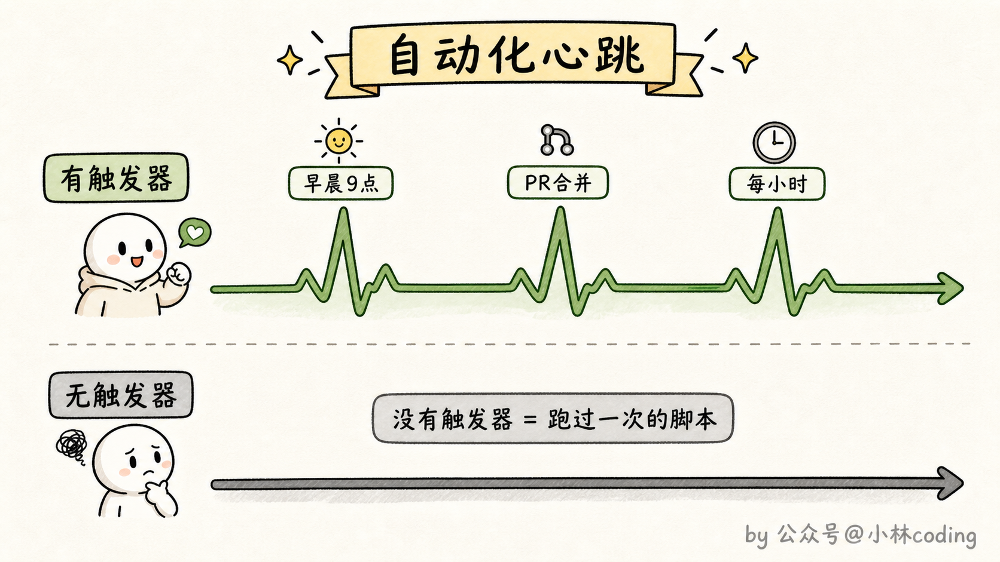

*自动化心跳示意图*

### 第二件：worktree，让并行不变成打架

loop 一旦跑起来，经常是几个 agent 同时干活。这时候你会撞上一个特别具体的麻烦：两个 agent 同时改同一个文件。

就像两个工程师挤在同一台电脑上改同一行代码，还互相不打招呼。

代码并行时，git worktree 可以为不同分支提供独立工作目录，降低文件互相覆盖；它不解决数据库、外部服务或共享配置的冲突，最终仍要合并、测试和审查。

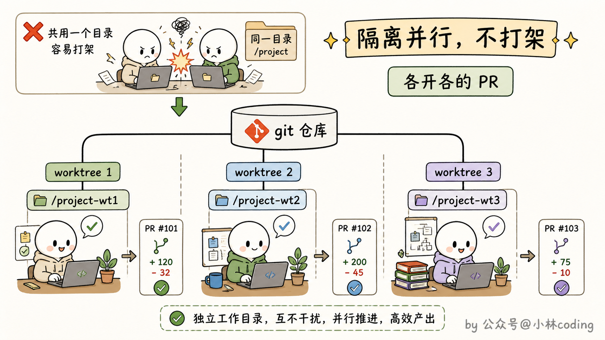

*worktree 并行隔离示意图*

### 第三件：skill，治好 agent 的「金鱼记忆」

新的会话通常不会自动拥有上一轮的全部状态；它能否读取项目规范取决于平台、配置和注入策略。

于是你不得不**像对金鱼一样，每个会话把项目重新解释一遍**。更要命的是，你没解释到的地方，它不会空着，它会用一个自信的猜测填上。

Skill 或规则文件可以把项目知识写进仓库，让运行时按需加载；它们不是权限系统，也不是事实数据库，必须防止过期、冲突和恶意指令。对 loop 的价值在于减少重复说明，但效果需通过回归任务验证。

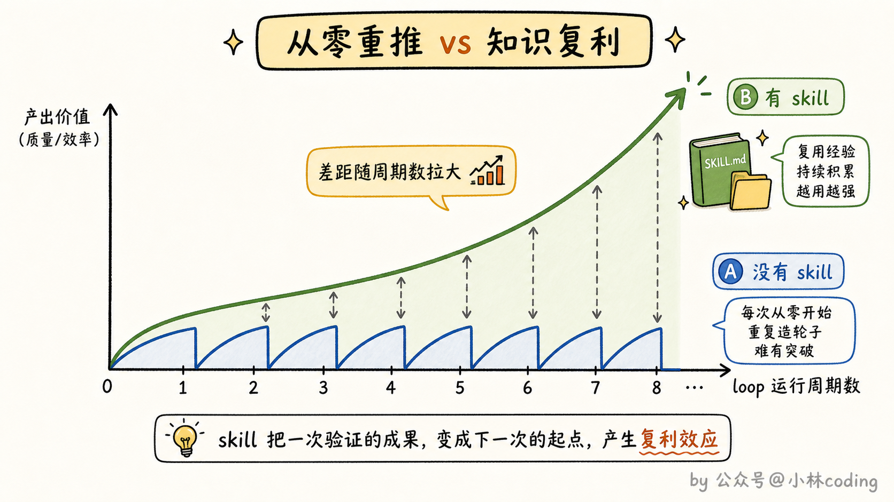

*从零重推 vs 知识复利对比曲线图*

### 第四件：connector，让 loop 摸到真实世界

一个只访问文件系统的 loop 仍然可以完成本地任务；当任务需要 issue、监控、消息或 PR 时，才需要额外的连接器。

真实工作流可能还要读 issue、查监控、发消息、开 PR。connector 可以通过 MCP 或其他 API/队列接入外部系统；每个连接器都要处理认证、权限、速率、幂等和错误。

接入后，loop 可以在授权范围内开 PR、关联工单或发送通知；这些都是副作用，必须有目标校验、审批/策略闸门和发送去重，不能把“能调用”当成“应该自动执行”。

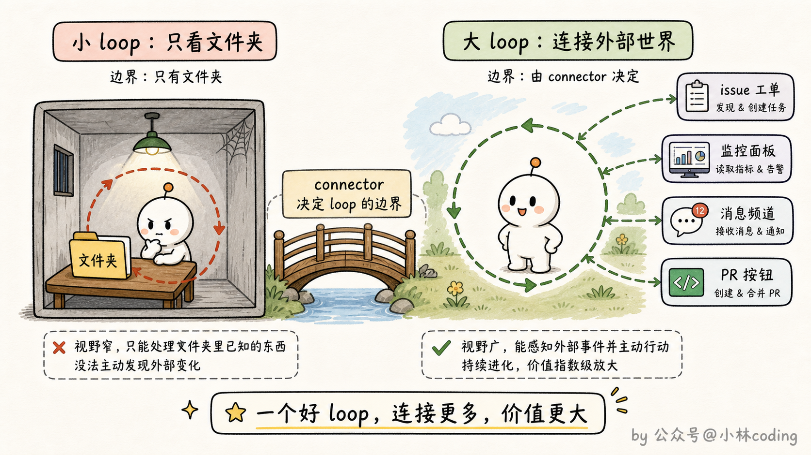

*小 loop vs 大 loop 视野对比图*

### 第五件：sub-agent，写的人和查的人必须分开

一个常见且有价值的结构是：**让生成和检查尽量独立**，可以用不同 Agent、不同上下文、静态测试或人工审查实现。

为什么？理由只有一句话，但谁听谁服：**写代码的那个模型，给自己的作业打分时，实在太手下留情了**。

让 A 出方案，再让独立的 B 或规则检查产物；独立上下文能减少锚定，但不能保证 B 一定找全问题。

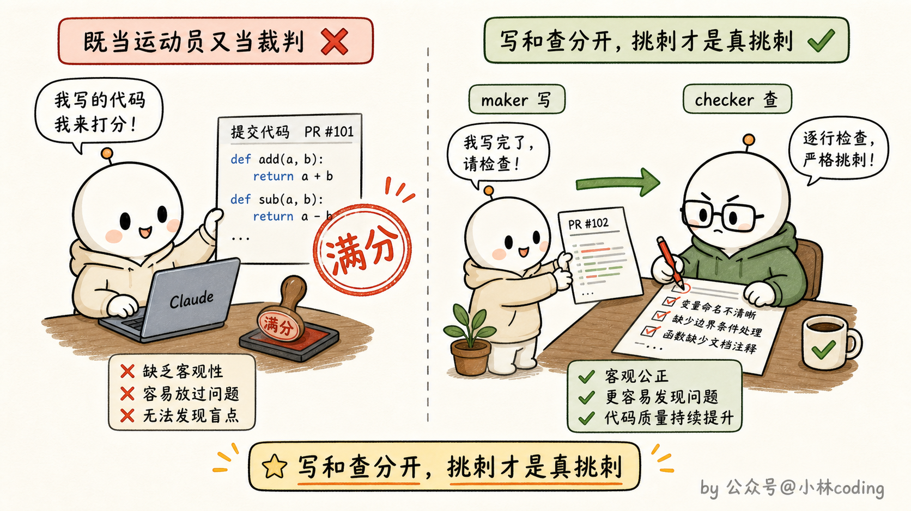

*maker 和 checker 分离示意图*

### 第六件：记忆，loop 的命根子

最后这件听起来最不起眼，但它是整个 loop 的命根子。

问题是这样的：如果没有外化状态，模型在两次运行之间可能不知道今天做了什么、哪些已完成、哪些卡住了。

常见解法是**把可恢复状态放在上下文之外**：Markdown、任务看板、数据库或队列都可以，记录完成项、下一步、版本、错误和幂等标识，并限制敏感信息。

这件事，Osmani 的博客里留了一句很妙的总结：

「agent 会忘，但 repo 不会。」

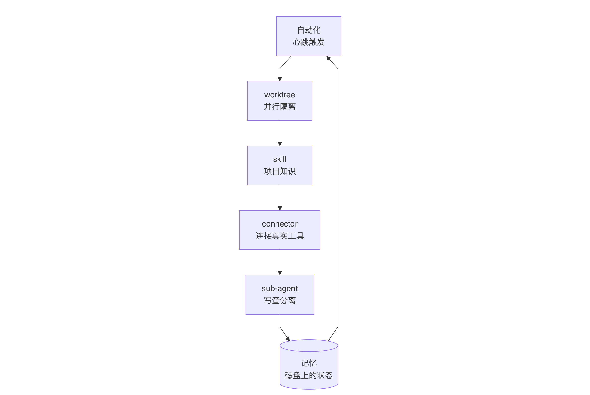

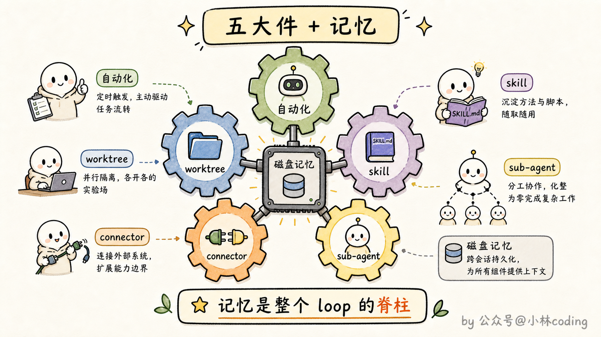

*五大件加记忆的全家福图*

**五类运行部件让 loop 转起来，可恢复状态让下一轮能接得上；二者都需要权限、校验和清理策略。**

一个生产可用的 loop 不应只有“定时再问一次模型”，而应显式包含以下闭环：

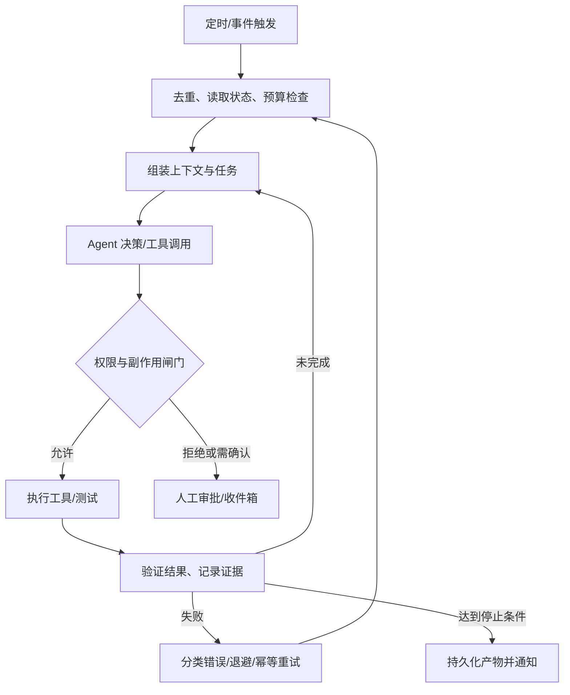
```mermaid
flowchart TD
    T[定时/事件触发] --> D[去重、读取状态、预算检查]
    D --> C[组装上下文与任务]
    C --> A[Agent 决策/工具调用]
    A --> G{权限与副作用闸门}
    G -->|允许| E[执行工具/测试]
    G -->|拒绝或需确认| H[人工审批/收件箱]
    E --> V[验证结果、记录证据]
    V -->|失败| R[分类错误/退避/幂等重试]
    R --> D
    V -->|达到停止条件| S[持久化产物并通知]
    V -->|未完成| C
```

面试回答时，至少说清楚触发条件、状态存放、工具权限、最大轮数/预算、幂等策略、验收证据和人工升级路径。

---

## Q4：拼起来之后，一个真实的 loop 长什么样？

零件都认识了，该看整车了。

下面是根据 Osmani 文章思路抽象出的示例 loop：**按计划发现项目中值得修的问题，生成修复候选，验证后提交人工审核**。它不是某个产品的默认实现。

第一步，调度器按计划或事件触发，调用负责分诊的任务说明/Skill。

第二步，这个 skill 去读昨天的 CI 失败记录、还没关闭的 issue、最近的提交，把「哪些问题值得处理」写进一个状态文件。

第三步，对每一个值得做的问题，开一个隔离的 worktree，派一个 sub-agent 进去起草修复。

第四步，第二个 sub-agent 登场，对照项目的 skill 规范和现有测试，把那份草稿审一遍。

第五步，审过了，在权限和幂等检查通过后，connector 可以创建 PR、更新工单或进入待审批队列。

第六步，loop 搞不定的问题，不硬来，丢进一个待办收件箱，等真人来看。

第七步，所有经过都写回状态文件。明天早上的循环从今天停下的地方继续。

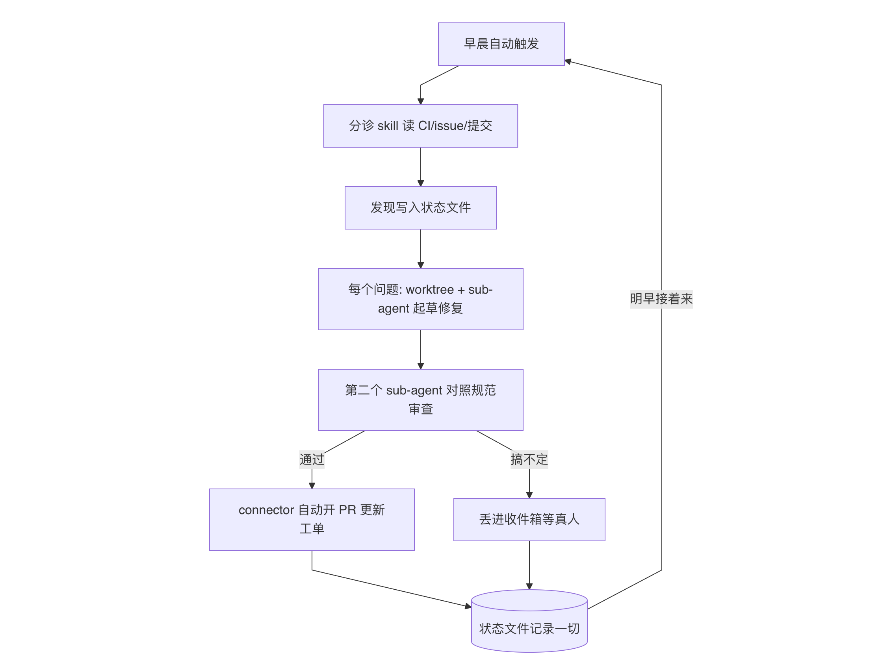

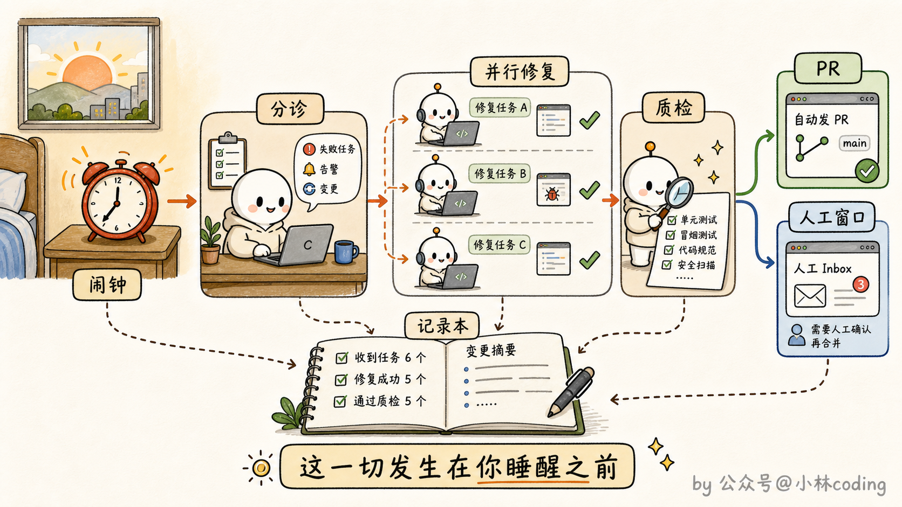

*晨间 triage loop 全流程图*

流程走完，关键变化是：你把逐轮决策外化为触发、状态、工具、验证和升级规则；中间仍可能需要人工澄清或审批，不应假设“完全无需 prompt 或人工”。

这就是 Steinberger 那句口号的落地版本。你的活从「每一步都出现」变成了「只在两个地方出现」：设计循环的时候，和收件箱里有东西的时候。

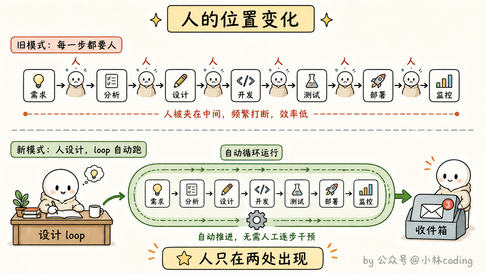

*人的位置变化示意图*

**一个可用 loop 的标志：自动化减少重复驱动，但在高风险节点保留清晰的人工入口和可审计收件箱。**

---

## Q5：工具已经追上来了，现在就能搭

听到这里你可能会想：道理是好道理，但搭这么一套系统，工程量不小吧？

现在一些开发工具已经提供调度、子 Agent、规则、MCP 或隔离工作区能力，但覆盖范围、命令和计费会随产品版本变化；完整的 loop 仍常需要脚本、队列、数据库和 CI 配合。

我把两家头部产品的部件整理成一张对照表：

| 部件 | 在 loop 里的职责 | Codex | Claude Code |
| --- | --- | --- | --- |
| 自动化 | 定时发现和分诊 | 具体产品的计划任务/自动化能力（版本依赖） | 计划任务、命令或 hooks（版本依赖） |
| worktree | 隔离并行任务 | 可用时使用工作树/分支 | `git worktree` 或其他隔离配置 |
| skill | 固化项目知识 | 平台相关的 Skill/规则机制 | 平台相关的 Skill/规则机制 |
| connector | 连接外部工具 | MCP 或其他连接器（能力依赖） | MCP Server 或其他 API |
| sub-agent | 分头干活、写查分离 | 子任务/子 Agent 能力（版本依赖） | 子 Agent/团队能力（版本依赖） |
| 记忆 | 追踪进度 | Markdown、数据库或工单系统 | Markdown、数据库或工单系统 |

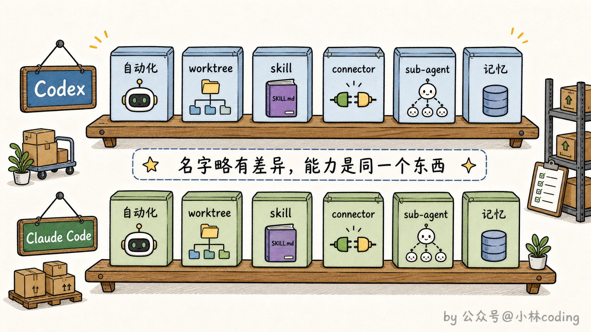

*双产品部件对照货架图*

还可以区分两类停止方式：定时轮询与目标驱动。某些工具提供 `/goal` 或类似命令，但命令名和实现不是跨产品标准。

普通的循环是**按节奏重复跑**；目标驱动循环则以可检查的完成条件为停止依据，例如测试和 lint 通过。完成判断最好依靠独立测试/规则和人工审查，不能只让同一个模型自报。

这样就把“完成声明”和“完成证据”分开了：Agent 可以提出完成，测试、diff、运行结果或人工审批决定是否真的交付。

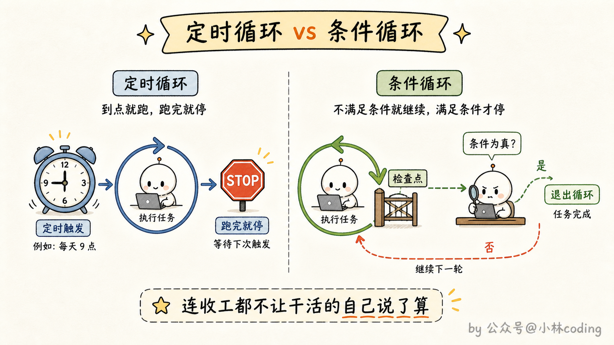

*定时循环 vs 条件循环对比图*

### 实操：用一个最小循环验证设计

光说不练假把式，我们拿一个所有人都烦过的场景，真刀真枪走一遍。

这个场景是：你提了个 PR，然后开始等 CI。挂了，切回去看日志、改、推送，再等。一下午切了八次窗口，正经活没干多少。

如果目标版本的 Claude Code 支持 `/loop`，可以用类似下面的示意命令；否则可用计划任务或脚本实现同样的状态机：

```
/loop 10m 检查当前分支 PR 的 CI 状态：有失败的检查就读日志、修复、推送；
全部变绿后停下来，给我一句话总结改了什么
```

把这条命令拆开看，麻雀虽小，loop 的骨架是全的；示例中的“修复、推送”属于副作用，应先增加权限和审批条件。

在支持该语法的实现中，`10m` 可以表示轮询间隔；具体调度、会话存活和计费要按版本确认。中间是任务，最后是停止条件与汇报方式。

启动后可以减少手动轮询，但不能把“自动修复并推送”当成无风险承诺：应先读取日志、限制改动范围、运行测试、检查 diff，并在推送/合并前保留审批。

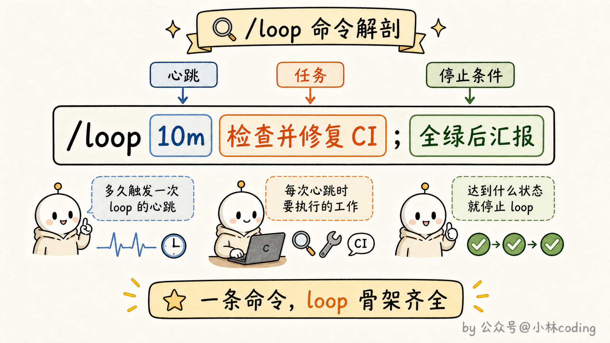

*loop 命令解剖图*

是否可以省略间隔、由模型或调度器自适应轮询，取决于产品实现；更稳妥的做法是由调度器控制退避和最大频率，而不是把节奏交给模型自由决定。

两个使用边界也交代清楚，免得你回头骂我。

第一，`/loop` 的生命周期、会话依赖和机器离线行为取决于产品版本；需要无人值守时，应使用有持久队列、凭据轮换、告警和恢复机制的计划任务或服务。

第二，回头对照 Q3 的五大件你会发现，这个最小 loop 只有心跳、任务和停止条件，没有 worktree、没有写查分离的 sub-agent。这不是缺陷，是起点：先让最小的循环转起来，哪天你觉得「它自己改的代码我不放心」，再把检查的 sub-agent 加上；觉得「想同时盯三个 PR」，再上 worktree。**部件是一件一件长出来的，不是一天配齐的**。

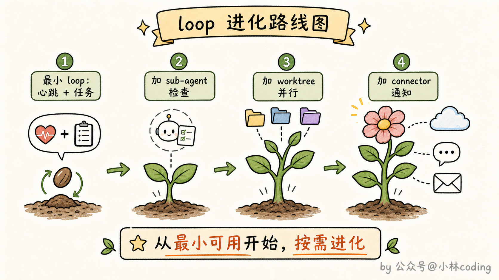

*loop 进化路线图*

对照表说明的是设计职责可以跨工具映射；不同产品在权限、上下文、隔离、调度、计费和可观测性上差异很大，不能简单认为只是商标不同。

因此可迁移的资产是任务状态机、验收标准、权限模型和失败处理，而不是某个产品的命令名；迁移前仍要重做能力、成本和安全评测。

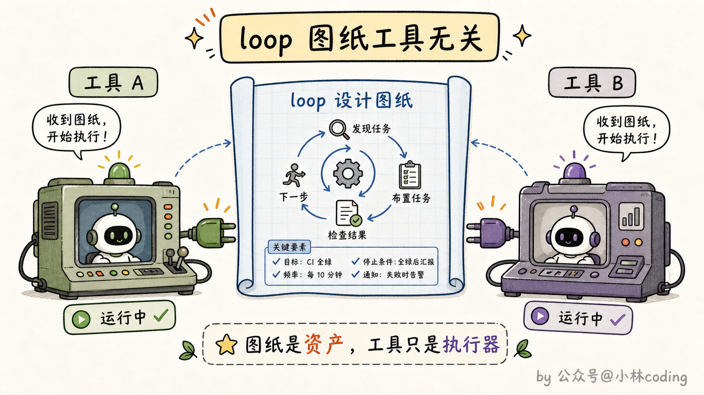

*loop 图纸工具无关示意图*

工具可以降低部分搭建门槛，但剩下的仍包括权限、数据、回滚、观测、成本和责任边界。

---

## Q6：三盆冷水：loop 越好用，这三个问题越尖锐

文章到这里都挺振奋的，该泼冷水了。

有意思的是，泼得最狠的不是哪个反对派，恰恰是给概念定名的 Osmani 本人，他在博客里直说：「现在还早，我是持怀疑态度的。」

冷水的核心是一句话：**loop 改变了工作，但没有把你从工作中删除**。而且有三个问题，会随着 loop 越来越好用，变得越来越尖锐，而不是越来越轻松。

### 第一盆：验证仍然归你

loop 无人值守地运行，听起来很美。但换个角度念这句话：**一个无人值守运行的 loop，也是一个无人值守犯错的 loop**。

你睡觉时它在干活，也意味着你睡觉时它在犯错。

就算你按规矩配了负责检查的 sub-agent，也别高兴太早：**检查 agent 嘴里的「done」，只是一个声明，不是一个证明**。它说没问题，和真的没问题，中间还隔着你的眼睛。

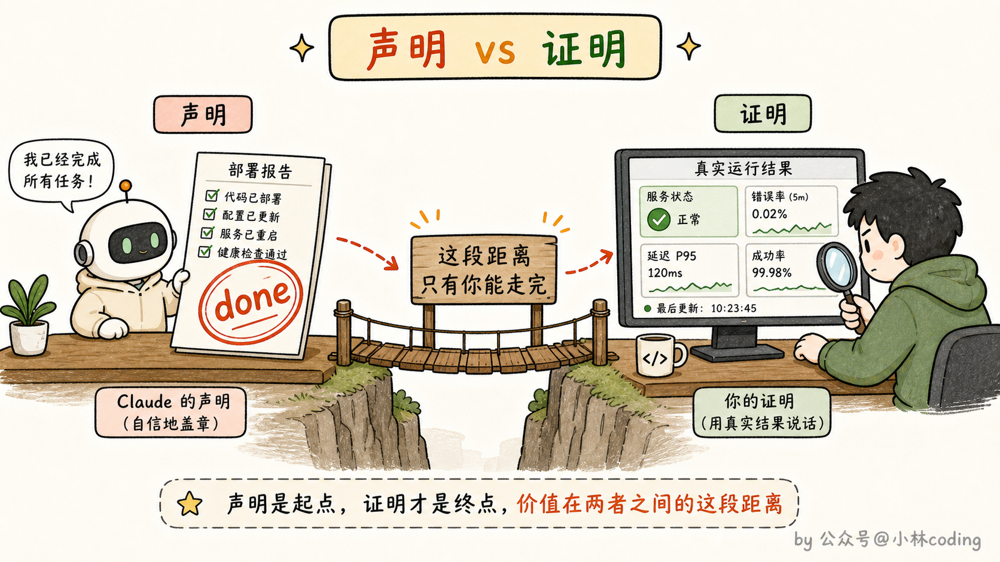

*声明 vs 证明对比图*

### 第二盆：理解债，越顺滑涨得越快

第二个问题更隐蔽。loop 交付你没写过的代码越快，「仓库里实际存在的东西」和「你脑子里真正理解的东西」之间的鸿沟就越大。

这有个专门的名字，叫**理解债（Comprehension Debt）**。

它和技术债不一样：技术债是代码烂，理解债是代码可能不烂，**但你不知道它为什么是对的**。出问题的那天，你面对的是一片自己「拥有」但不「理解」的代码。一个顺滑的 loop 不会帮你还这笔债，只会让它涨得更快，除非你坚持去读 loop 产出的东西。

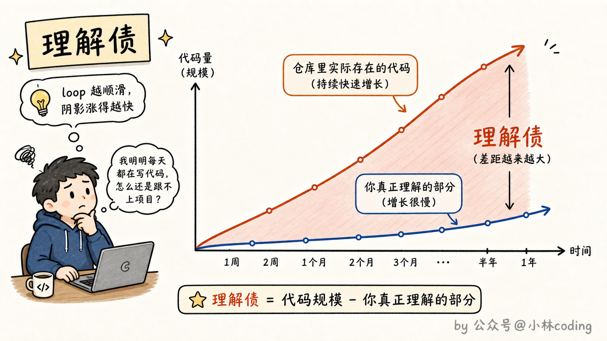

*理解债鸿沟示意图*

### 第三盆：认知投降，最舒服的姿势最危险

第三个问题最扎心。loop 自己转起来之后，你会发现一个特别舒服的姿势：不再对产出有自己的观点，它给什么就收什么。

这个状态有个专门的名字，叫**认知投降（Cognitive Surrender）**。Osmani 的博客里有一段关于它的原话，非常锋利：

「带着判断力去设计 loop，它是解药；为了逃避思考去设计 loop，它是助燃剂。同一个动作，相反的结果。」

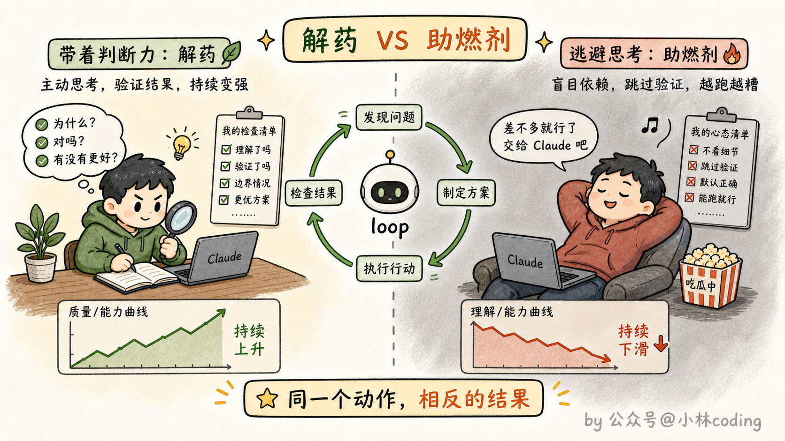

*解药与助燃剂双面图*

最后还有一笔很现实的账：token 成本。loop 是按循环烧 token 的，sub-agent 每多一个，就多一份模型和工具的开销。比较务实的花法，是把 sub-agent 用在「值得买第二意见」的地方，而不是处处双保险。token 富裕和精打细算这两种人，会设计出两种完全不同的 loop。

**这三盆冷水有个共同点：它们都不是 loop 的 bug，而是 loop 的代价，并且由你来付。**

---

## 最后

把整篇浓缩成 3 句话送你：

- 第一，从 prompt 到 context 到 harness 再到 loop，四个词是一场瓶颈迁移：模型越强，瓶颈越往外移，最后移到了「亲自按回车的你」身上。
- 第二，一个 loop 等于五大件加一份磁盘记忆：自动化是心跳，worktree 防打架，skill 治金鱼记忆，connector 摸到真实世界，sub-agent 写查分离，状态文件让明天接得上今天。
- 第三，loop 把你的杠杆变长了，但验证、理解债、认知投降这三笔账也同时变大了，工具分不出你是在加速还是在逃避，你自己分得出。

Osmani 文章的结尾有一段话，我觉得是整场讨论里最值得带走的：

「两个人可以搭一模一样的 loop，得到完全相反的结果。一个用它在自己深刻理解的工作上加速，另一个用它彻底逃避理解工作。loop 分不出区别，你分得出。」

如果你觉得这篇文章对你有启发，欢迎点个「在看」和「赞」，这是对小林最大的肯定和帮助。

我们下一篇见啦！

---

## 参考资料

- Peter Steinberger 的原帖：[https://x.com/steipete/status/2063697162748260627](https://x.com/steipete/status/2063697162748260627)
- Addy Osmani《Loop Engineering》：[https://addyosmani.com/blog/loop-engineering](https://addyosmani.com/blog/loop-engineering)
- Boris Cherny 访谈《Claude Code & the Future of Engineering》
