# Loop Engineering 怎么落地？一条从 0 到 1 的上手路径

> 原文：[Loop Engineering 怎么落地？一条从 0 到 1 的上手路径](https://xiaolinnote.com/agent/engineering/loop_engineering_handbook.html) · 小林面试笔记


大家好，我是小林。

上次那篇讲 [loop engineering 是什么](https://mp.weixin.qq.com/s/fhx_Lozs5G-sX11b7wnZgg) 的文章发出来，评论区问得最多的就一句：「道理我懂了，可到底怎么动手？」

说实话，这问题问到点子上了。概念听着热血，真自己上手，全是细节，一个都绕不过去。

本文参考了一份社区作者 Codez 发布的 Loop Engineering 手册。浏览量和“十个开发者九个没写过”的说法属于原文语境，不是经过抽样调查的行业统计。

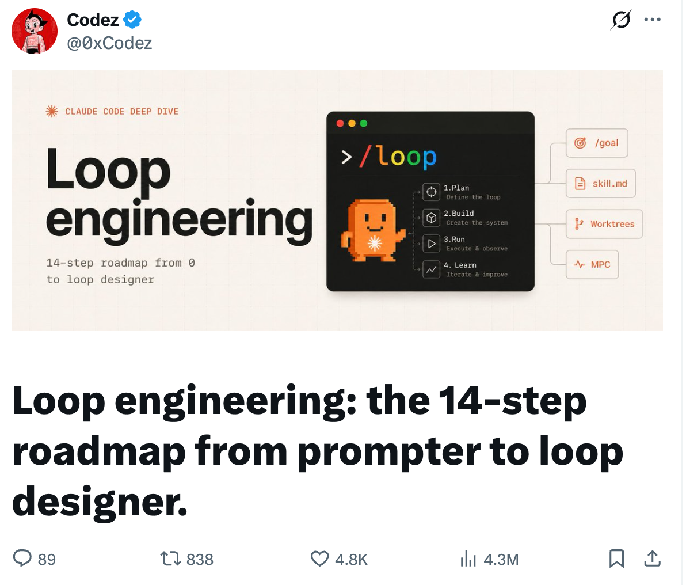

我把这份手册从头到尾啃了一遍，挑出真正能落地的，掰开揉碎讲给你听。

废话不多说，发车。

---

## 先别急，你真需要 loop 吗？

看完概念，你手可能已经痒了，想立马开一个 loop 让它替你打工。

别急着上手。

loop 这东西不是白来的。它烧 token、要花时间搭，真出了岔子，你还得去 debug 一个自己压根没盯着它跑过的系统。说白了，你这是拿真金白银加时间，赌它将来能帮你赚回来。这笔赌划不划算，动手前我建议你拿几个问题，先把自己问一遍。

第一个，也最实在：这活你是不是每周都要干好几遍？要是一锤子买卖，老老实实写个好 prompt 更快更省，搭 loop 纯属杀鸡用牛刀。

第二个，我觉得是条生死线：有没有一个东西能自动告诉你「这活砸了」？测试也行，类型检查、linter、跑个构建也行，随便哪个能当裁判都成。没有这个裁判，loop 吐出来的东西你还得一行行读 diff 去验。那它到底替你省了啥？

第三个是钱：你的 token 预算扛得住浪费吗？loop 会反复读上下文、重试、试探，不出活也照样烧。预算紧的人，这笔空转烧得肉疼。

第四个：agent 能不能跑它自己写的代码？得有日志、能复现、崩在哪看得见。要不然它两眼一抹黑，自己都不知道刚闯了啥祸，根本没法自我修正。

这几个之外，还有个附加题，我觉得比上面都狠：你到底打算 review 它产出的东西吗？不打算？那别建，真的。

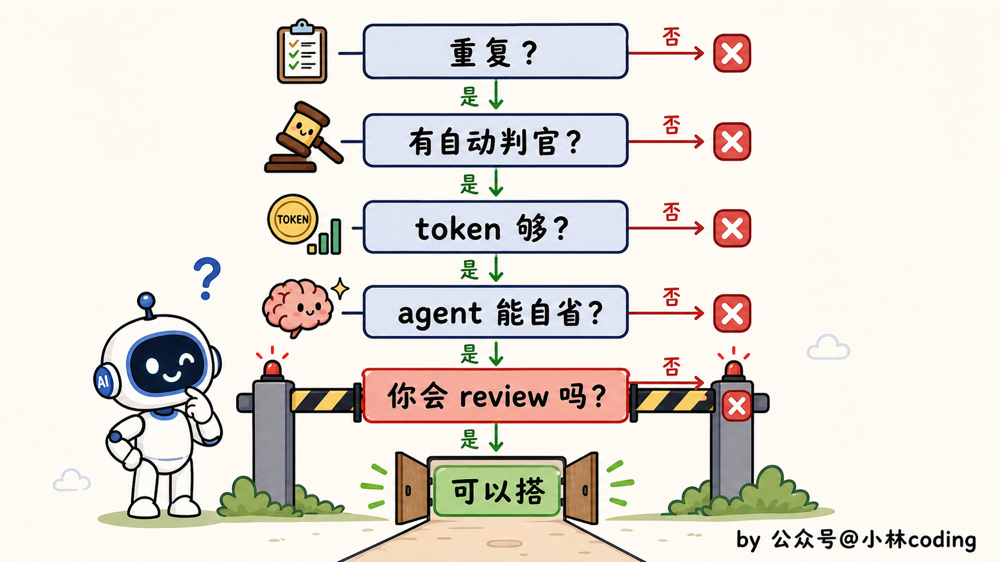

还得算笔不太中听的账。loop 这东西，说到底是偏向「花得起钱的人」的。

token 管够的人玩它觉得真香，背着消费套餐的人呢，跑个两轮可能就触顶了，要么月底收到一张吓人的账单。

所以一句更稳妥的结论是：**loop 有价值，但是否值得搭要由重复频率、可验证性、风险、成本和维护能力决定**。

架构、鉴权、支付、生产部署等高风险任务不应直接交给无人值守 loop；可以让 Agent 做分析、生成候选或在沙箱中测试，但不可逆动作要有人审批和可回滚方案。

至于哪些活适合拿来开张，下一节讲场景时一起说。

---

## 第一个 loop 该怎么搭？

上面这些都想清楚了，确实该搭。

这时候新手最容易犯的错，是一上来就想搭个无所不能的系统：自动化、并行、写查分离、连一堆外部工具，恨不得一步到位。

结果就是搭到一半被各种联调问题劝退，或者搭出来一个根本没法 debug 的庞然大物。

正确的姿势是反过来：先搭一个能观测、能停止、能回滚的最小版，再逐步增加组件。

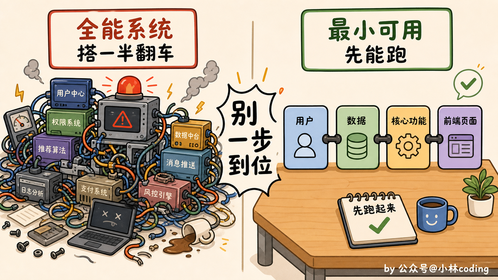

第一样，automation，也就是触发器。按节奏或事件触发都可以，但要配去重、并发上限、预算、超时和停止条件，否则可能无限循环或重复副作用。

第二样，skill/规则，把项目背景和流程约束沉淀下来。平台是否自动发现、何时加载以及支持哪些字段取决于实现；文件不能替代权限和测试。

第三样，状态文件，专门记「做完了啥、下一步干啥」，好让明天的循环接得上今天。

为什么单把状态文件拎出来说？因为它是命根子。

如果没有外化状态，Agent 的新会话可能不知道上次完成了什么；平台可能提供持久化记忆，但不能假定所有运行时都保留完整历史。

我看到有句话点得特别透：agent 会忘，但 repo 不会。你把进度写进文件，loop 才接得上昨天，不然每天都是从头来过。

状态可以放在仓库文件、数据库、任务看板或队列中，选择取决于并发、审计、保密和恢复要求。

最简单的办法，就是在仓库里放一个 `STATE.md`，跟代码一起管，改了还能 diff，谁打开都看得懂，个人或者小团队用这个就够了。

要是想更正式一点，就接到外部系统里，Linear（研发项目管理工具）、GitHub Issues、甚至一张数据库表都行，好处是能跨好几个仓库、随时能查，团队里每个人都看得到 loop 在做什么，正经上生产的 loop 更适合这么放。

它长什么样并不复杂，一个极简的 `STATE.md` 大概就这意思：

```
# STATE.md
## 进行中
- 升级 lodash 到 4.x，本地测试已过，等 CI
## 今天完成
- 修掉登录接口的空指针，已合并
## 卡住了，等人看
- 支付回调偶发超时，复现不稳定，先挂起
## 下一步
- 扫一遍本周新开的 issue，挑能自动改的
```

光有状态还不够。loop 跑久了容易跑偏，所以最好再放一个常驻的目标文件（`VISION.md` 或者 `AGENTS.md`），每轮开工前先让它读一遍。

你可以这么理解。状态文件记的是它现在做到哪了。目标文件不一样，管的是它最终要去哪。一个盯当下，一个盯方向。少了哪个，它都会跑着跑着就忘了自己在干嘛。


第四样，闸门，就是测试、类型检查、构建、静态安全扫描或人工审批等验收机制。它们能降低风险，但覆盖不全；应把门槛和失败处理写成可观测、可回滚的策略。

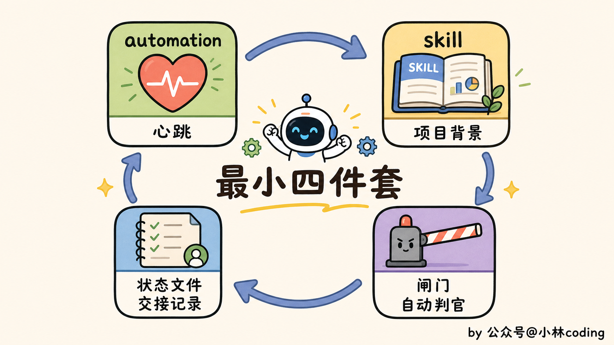

四样凑齐了，还有件事比凑齐零件更要命：顺序别搞反。

正确的走法是，先让一次手动运行稳稳跑通，再把背景沉淀成 skill，再包成 loop，最后才接上自动调度。一步稳了，再上下一步。

非要跳着来，手动都没跑顺就急吼吼上调度，回头出了岔子，你根本分不清是哪一环的锅。

先把路走稳。再谈自动。

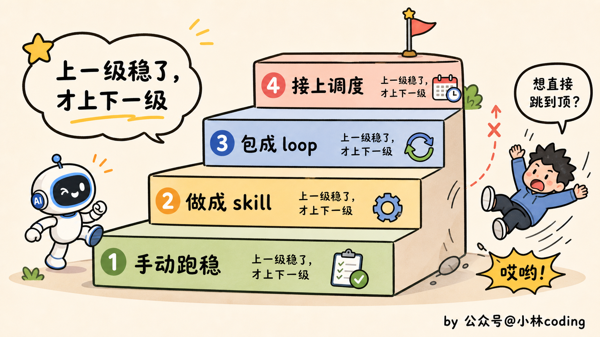

---

## 完整的 loop 还缺哪几块？

最小四件套能转起来，但它还很素，只能干最简单的活。想让它干得更多、更稳，就往上加。

一个完整的 loop，手册拆成五个构件，我先简单过一遍各是干嘛的：

- **自动化**：loop 的心跳。最小版那个 automation 就是它，按时间或事件踢它一脚，它就跑一轮。
- **worktree**：多个 agent 一起干活时，各分一间独立工作区，免得它俩改同一个文件、打起来。
- **skill**：项目背景、约定、踩过的坑，全塞进文件，agent 每轮自己翻，不用你一遍遍念。
- **connector**：走 MCP 接上 GitHub、Slack、Jira 这些，loop 才能真去开 PR、发消息、查告警，而不是干瞪眼。
- **sub-agent**：写代码的和验收的，拆成两个 agent。别让同一个 agent 给自己的作业打分。

一些工具提供其中部分能力，但版本、套餐和权限不同，通常仍需要自己补齐状态、队列、测试和安全策略。

以 Claude Code 为例，若当前版本提供 `/loop`、计划任务、Skills、subagents、MCP 或 worktree 等能力，可以组合成 loop；这些名称、生命周期和权限要按目标版本核对，组合后仍需自己设计审批、幂等、回滚和观测。

这五个里，要我说，最该刻进脑子的是 sub-agent，也就是「写代码的和验收的分家」。

“生成者与评估者分离”并不是新发明，许多 Agent 文章都讨论过 evaluator-optimizer 一类模式；它能减少自评偏差，但评估器也可能错，必须配客观测试和人工抽查。

让生成模型自评可能出现锚定和乐观偏差。独立上下文的第二个 Agent、静态工具、测试或人工审查可以提供不同证据，但没有任何一种方式能保证找全问题。

loop 是在你不看的时候跑的。一个你真信得过的验证器，是你敢撒手走开的唯一底气。

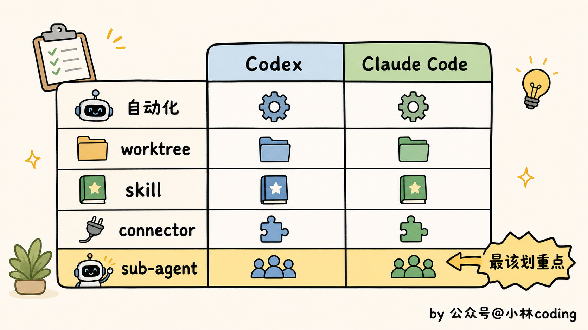

---

## loop 到底能拿来干嘛？

光认识零件还不够，你得知道它们拼起来能替你干什么。

我把见过的、真能跑起来的 loop 场景，按从轻到重分了三档，你对号入座。

**最轻的一档，盯自己手头的活。** 这档不用搭什么系统，一条命令就行，适合所有人。

比如你提了个 PR 在等 CI，可以用轮询或事件触发减少手动切换；下面的命令是产品版本支持时的示意，涉及修复和推送时应增加审批：

```
/loop 10m 检查当前分支 PR 的 CI：有失败就去读日志、修掉、推送；全绿就停下来，给我一句话总结改了什么
```

在支持该语法的实现中，`10m` 可表示轮询间隔；中间是每轮任务，最后是停止条件和汇报方式。启动后仍要限制修改范围、日志长度、轮数和推送权限。

把任务换一换，同一个 `/loop` 还能盯别的：

```
/loop 监控这次部署，跑完通知我
/loop 每天早上用 Slack 把我昨天被 @ 的消息汇总一下
```

没有写时间间隔时，实际调度方式取决于产品实现；更稳妥的是由调度器按退避、限频和预算控制频率，而不是让模型自行决定。

这些活的共同点是：本来得你时不时切回去瞄一眼，现在交给 loop，你专心干别的，它有事才喊你。

这里要区分当前工具提供的会话轮询与持久化计划任务；命令名和行为不是跨工具标准。

某些实现的 `/loop` 绑定当前会话，另一些调度器可以把任务持久化到云端或服务端；关机、会话结束、凭据过期和网络中断时如何恢复，要以目标产品为准。需要无人值守时，应确认持久化队列、告警、权限和取消机制，而不是只看命令名。

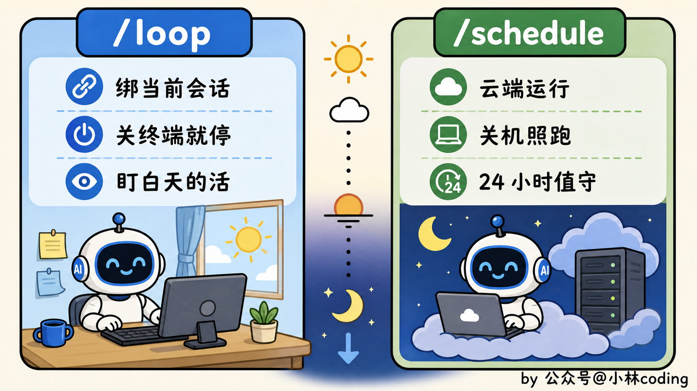

如果工具提供目标驱动命令（有的产品称为 `/goal` 或类似名称），它可以与固定间隔轮询作对比：

固定循环按节奏重复运行；目标驱动循环以可检查条件为停止依据，例如测试与 lint 通过。两者都必须设置最大轮数、超时、预算和失败升级，不能无限跑。

完成条件最好由独立测试、规则和人工审查判定；另一个模型可以提供辅助判断，但不能成为唯一证据。


**中间一档，每天定时帮你清理。** 这档就得用上前面那些构件了，适合有点规模的项目。

最典型的是「晨间分诊」：每天早上自动跑一轮，读昨天挂掉的 CI、还开着的 issue、最近的提交，判断哪些值得处理，写进状态文件，能自己修的修掉提 PR，搞不定的丢进收件箱等你。

等于你每天到工位，活已经被分好类、好处理的那批甚至已经处理完了。

类似的还有定时修 CI（每天凌晨把红掉的流水线捞起来修）、依赖升级（定期查有没有新版本，升完跑测试，绿了才提 PR）。

批量依赖升级可以作为案例，但仓库数量、变更范围、测试覆盖和合并策略必须受限；不应把“自动开很多 PR”当成默认最佳实践。

**最重的一档，让 loop 自己接活、自己验活。** 这档是给重度玩家的。

比如开源项目上，有人提了个 issue，loop 自动去读，对照项目的愿景文档判断这需求合不合方向，合的话直接起草一个 PR，还顺手让另一个 agent 先 review 一遍，再交到你面前。从「有人提需求」到「一个审过的 PR 草稿」，中间没你什么事。

到了这一档，有个让 loop 越跑越好的技巧值得单独说：**内外两层循环**。

内层那个 loop 负责干活，外层那个 loop 专门吸收你每次 review 时的反馈，拿去改进下一轮怎么干。

说白了，你每一次「这里改改」，都不只修了这一次，而是喂给了系统，让它下回别再犯。这才是把「设计 loop」的复利真正吃满。

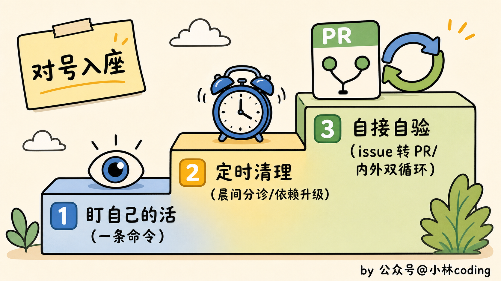

---

## 你的 loop 是赚是亏？

很多人搭完 loop 就傻乐，觉得进入了自动化时代，却没算过一笔账：这东西到底帮你赚了，还是在偷偷亏钱？

loop 不像写 prompt 对错当场可知，它长期运行、持续烧钱，赚亏得靠一个指标来盯。这个指标就一个：

**每个被接受的改动，花了你多少成本。**

把 loop 这阵子烧的 token、占的算力，加上你 review 花掉的时间，全算进去。再除以它真正被你合并了的改动数。得出来的，就是单位成本。这个数你得心里有底。

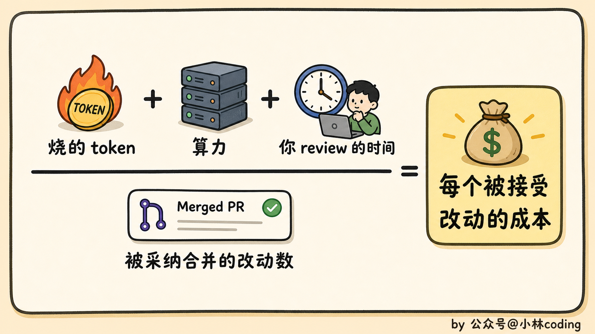

不能用固定的接受率（例如 50%）直接判断盈亏。应把模型/工具成本、失败重试、人工 review、回滚风险、节省的工程时间和业务价值放进同一份基线，按任务类型设定停止阈值。

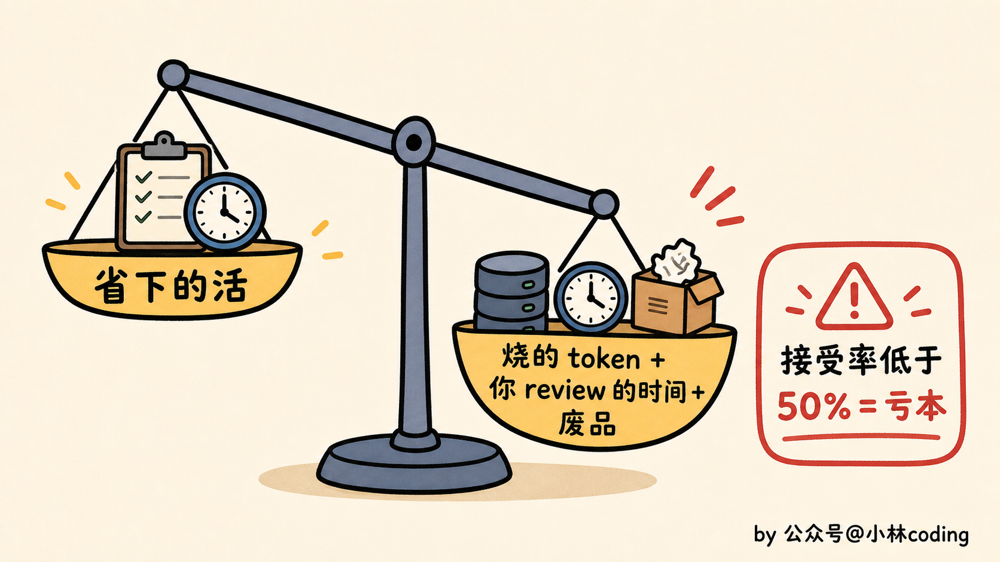

还有笔账顺带说一句：sub-agent 是按个烧钱的，你每多挂一个做检查的，就多花一份模型和工具的钱。

所以别处处都上双保险，「再请一个 agent 来挑刺」这件事，用在那种真正值得买个第二意见的地方就行。token 宽裕的人和精打细算的人，搭出来的 loop 会很不一样。

---

## 没人盯着，安全怎么办？

前面都在讲怎么让 loop 跑得好。最后这节，得讲讲怎么让它别给你惹祸。

loop 最大的卖点是无人值守，你睡觉它干活。但你把这句话反过来念一遍就该警觉了：它在你不看的时候替你干活，**可同样在你不看的时候，它也敞着一个没人守的口子**。

自动开 PR、自动装 skill、自动连外部工具，每一个口子都可能被人钻。

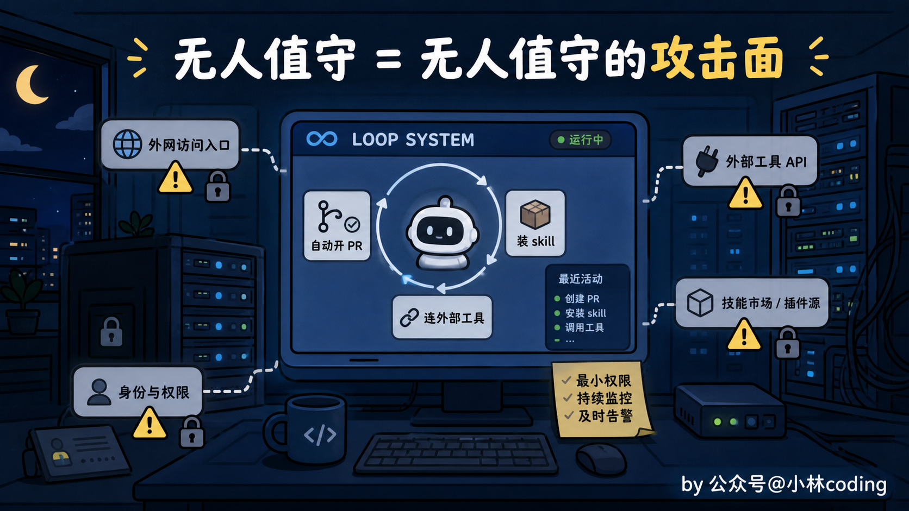

我给你拎四条红线，建议直接焊死在闸门里，一条都别松。

第一条，生成的代码没审就上线。闸门里光有测试和构建还不够，得再塞进 SAST（静态安全扫描）、依赖审计、密钥扫描。让安全检查跟功能检查一个待遇，都是上线前必须过的关。

第二条，也是我觉得最阴的一条：skill 本身就是个注入入口。你以为装个 skill，不就是多份说明书？能有多大风险？讲真，下面这个数据，我第一次看到的时候，手一抖。

关于 Agent Skill/插件的凭据泄露，社区已有研究和案例提示了日志、脚本、依赖和过宽权限等风险；具体样本量、比例和结论必须核对论文版本、抽样框和复现实验，不能在没有可核验引用时当作通用统计。工程上应默认第三方 Skill 不可信，先审源码、依赖、网络访问和凭据读取，再放入沙箱。

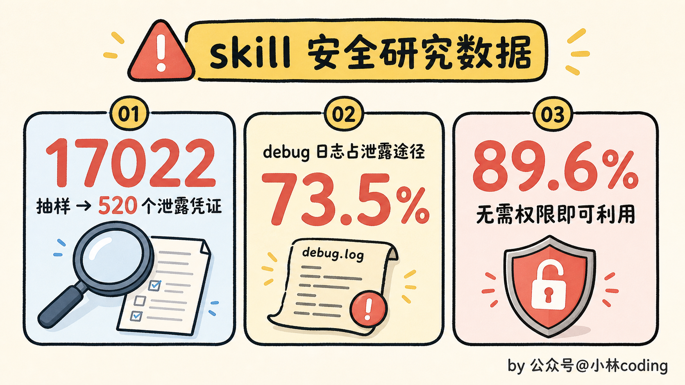

Skill 可能包含说明、脚本和资源，Agent 是否自动读取或执行取决于平台；它应被当作代码和不可信输入审查。

可这话反过来一样成立。恶意 Skill 可能通过指令、脚本、依赖或日志窃取数据。因此**在 loop 自动安装或启用 Skill 之前，应审查源码和依赖，限制网络/文件/凭据权限，并在隔离环境运行**；高风险动作仍需人工确认。

第三条，凭证泄露进日志。生产 loop 应默认脱敏、禁止记录令牌/密钥、限制日志访问和保留期，并对异常输出做检测；不能只靠关闭 verbose，因为排障又需要可审计证据。

最后一条，权限蔓延。今天加一个写权限，明天再加一个，最终很难说清 loop 能访问什么。应按风险和组织策略设定权限复审周期，并在权限变更、凭据轮换和任务结束时及时回收，而不是迷信固定 30 天。

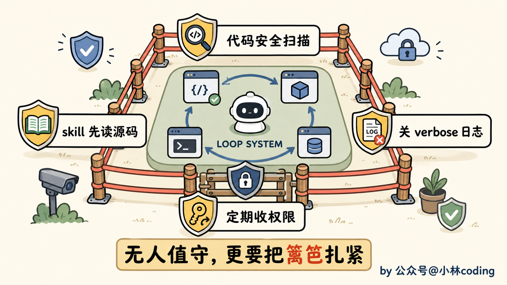

---

## 最后：14 步清单带走

讲了这么多，我把 Codez 这份手册的 14 步原样给你列一遍，分三段，你照着走就行。

**第一段 · 先搞清楚要不要做**

1. 想明白本质：你要做的不是 prompt agent，是设计那个替你 prompt 的系统
2. 过一遍四条件：活够重复、验证能自动、token 扛得住浪费、agent 有日志能跑自己写的代码
3. 算清经济账：loop 偏向花得起钱的人，看清自己是受益那类还是该躲那类
4. 对着具体任务跑一个短清单：任务有重复性、有 gate 能拒坏活、Agent 跑得了代码、有硬性 stop、不可逆操作前有人把关

**第二段 · 五个构件（概念见上一篇，这里只点名）**

1. 自动化：给 loop 一个按节奏或事件触发的心跳
2. worktree：多 agent 并行各给一份独立工作区，别让它们改同一个文件
3. skill：按目标平台的格式把项目背景写成 Skill/规则，省得每轮重讲
4. connector：用 MCP 接上 GitHub、Linear、Slack 这些真实工具
5. sub-agent：写代码的和验收的拆成两个，别让它给自己打分

**第三段 · 要么搭对，要么别搭**

1. 加状态文件：让 loop 接着昨天干，而不是每天从零开始
2. 先搭最小可用版：一个自动化、一个 skill、一个状态文件、一道闸门，按「手动跑稳→做成 skill→包成 loop→再调度」的顺序来
3. 防止无停止条件的循环：用客观 gate（测试、检查、人工验收）判断完成，别让 Agent 自己喊一声“干完了”就退；最大轮数、预算和取消入口也要硬编码
4. 还掉理解债：坚持读 diff、抽查闸门、别让 loop 碰架构
5. 交安全税：代码上线前加安全扫描、Skill 启用前审源、生产日志脱敏、按风险复审和回收权限

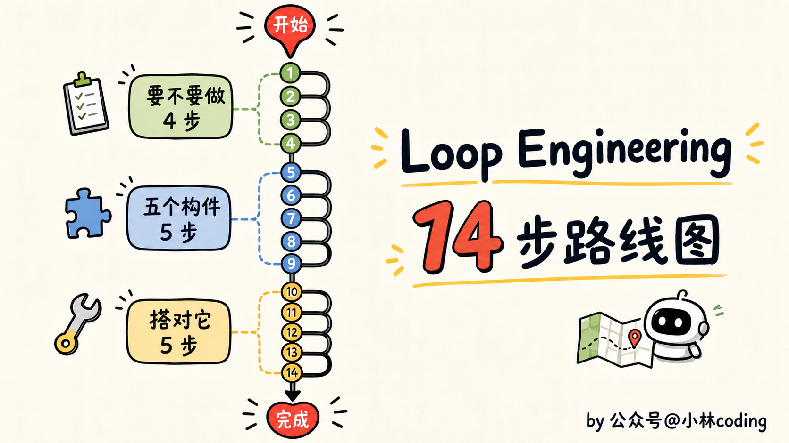

你回头看这 14 步会发现，真正难的根本不在中间搭建那段，构件工具早帮你备好了。难的是头一段的「要不要做」和尾一段的「守不守得住」，全是关于人的判断。

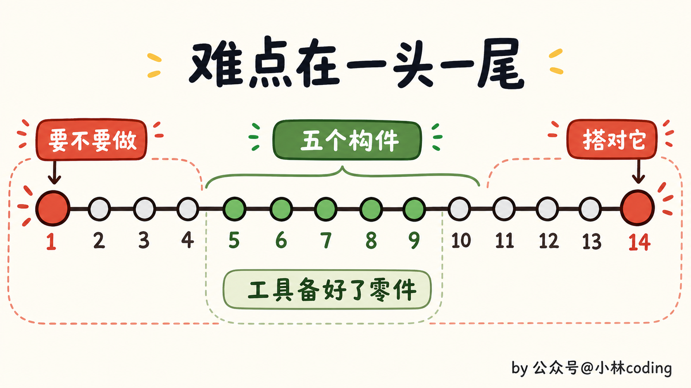

这两年，我们跟编码 agent 打交道，力气一直花在 prompt 上：把提示词写得更漂亮，把上下文喂得更全，盼着它一把就给你出个好结果。

但这条路现在差不多走到头了，真正的支点往上挪了一层，挪到了那个替你拿主意的系统身上，是它在决定 agent 做什么、什么时候做、要过哪道关、做完留下什么。

Codez 那份手册结尾就一句话，我觉得是整篇最该带走的：**杠杆移走了，你的活也跟着变了，但你别把自己也一起交出去。Build the loop, stay the engineer，去把 loop 搭起来，但人还得是那个工程师**。

说到底，把 loop 搭起来只是拿了张入场券。

至于到头来它是帮了你、还是坑了你，就看一件事：你愿不愿意一直盯着那份 diff，守住自己的判断。

工具替你跑，但别替你想。

我们下一篇见。

---

参考资料：

- Codez（@0xCodez）《Loop engineering: the 14-step roadmap from prompter to loop designer》：[https://x.com/0xCodez/status/2064374643729773029](https://x.com/0xCodez/status/2064374643729773029)
