# GraphRAG 和 LightRAG 详解：原理、对比与选型

> 原文：[GraphRAG 和 LightRAG 详解：原理、对比与选型](https://xiaolinnote.com/agent/rag/graphrag-lightrag.html) · 小林面试笔记


大家好，我是小林。

前段时间发的[图解 RAG](https://mp.weixin.qq.com/s/BqOdWsCjtXoUllUuFVb29w) 的文章，当时评论收到了很多同学的好评，很多同学说是他看过最通俗易懂的 RAG 文章。

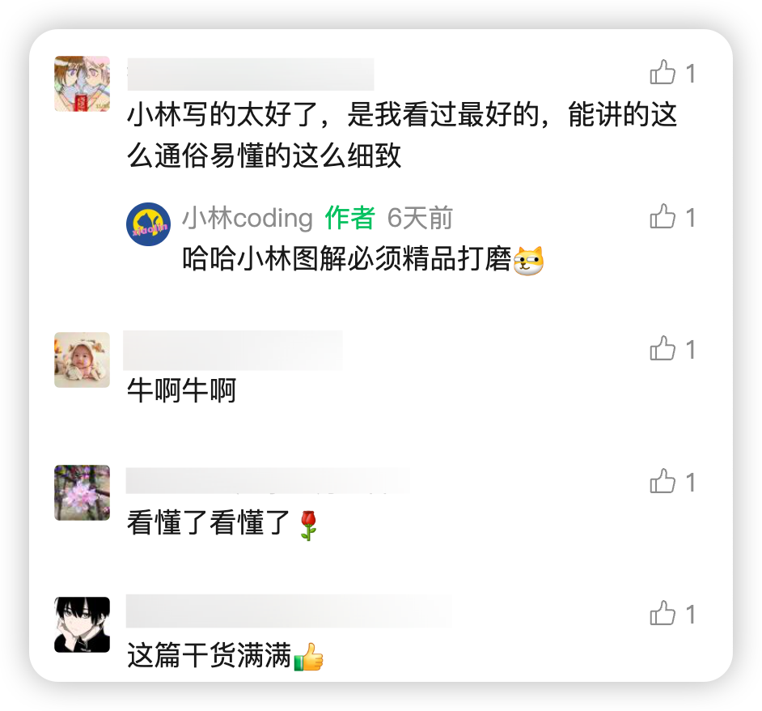

*img*

评论区还有也有同学在催更，让我讲讲 **GraphRAG** 和 **LightRAG**。

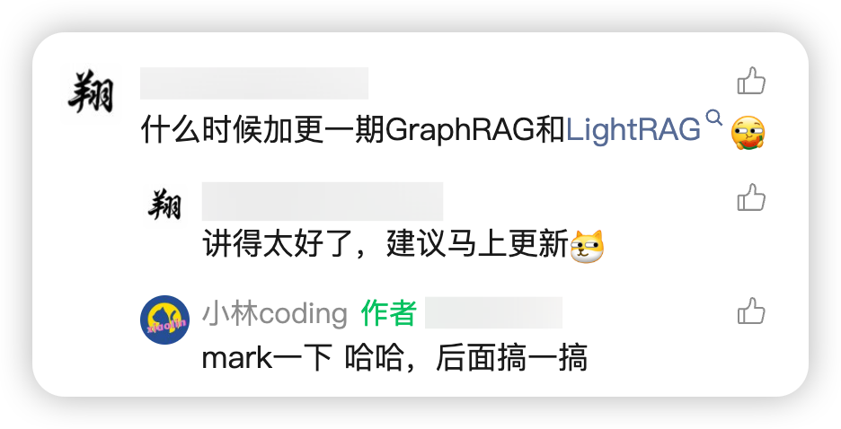

*img*

那么，今天这篇就是来还债的。

上一篇讲的是「传统 RAG」（也叫 Naive RAG），核心思路是：把文档切成块（Chunk）→ 做向量化（Embedding）→ 存入向量数据库 → 查询时基于语义相似度检索 Top-K 个文本块 → 塞给大模型生成答案。

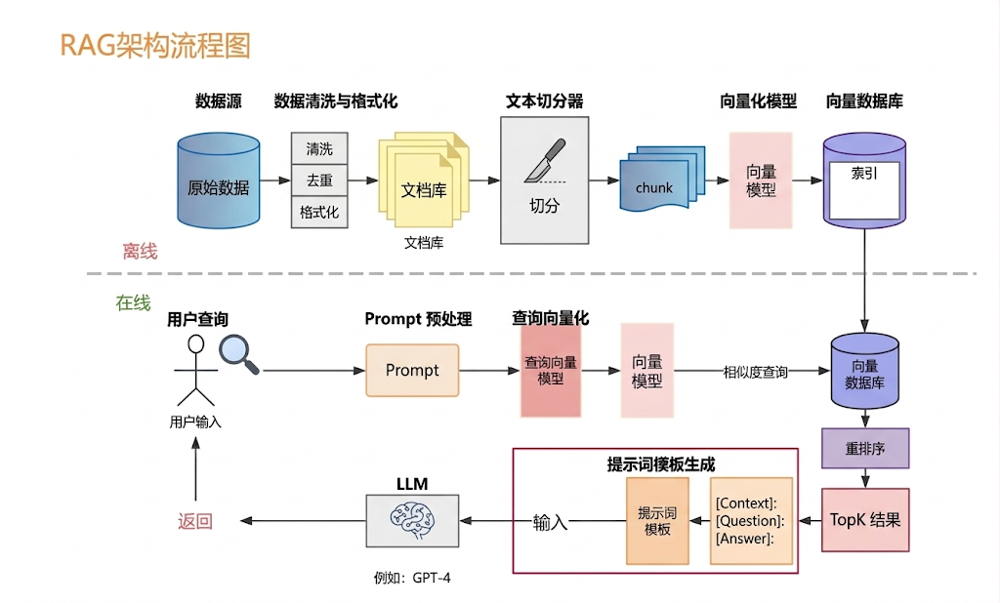

*img*

这套流程很经典，也解决了大模型「闭卷考试」的难题。

但这套方案在实际企业场景落地时，会遇到跨文档关系、全局归纳、更新和成本等问题。GraphRAG、LightRAG 等方法尝试用不同的结构和检索策略缓解其中一部分，并不是专门为所有这些问题共同设计的唯一答案。

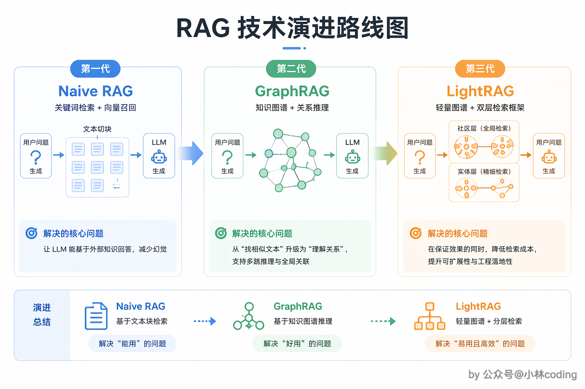

*img*

所以，这篇讲重点介绍下面这些内容，而且也都是我从大厂面经中收集到的面试题：

- 🌟传统 RAG 有什么痛点？
- 🌟什么是 GraphRAG？为什么会有 GraphRAG？
- 🌟GraphRAG 的工作流程是怎样的？
- GraphRAG 的难点是什么？
- 🌟GraphRAG 如何应对增量场景？
- 🌟什么是 LightRAG？为什么会有 LightRAG？
- 🌟LightRAG 的工作原理是怎样的？
- 🌟LightRAG 和 GraphRAG 有什么区别？
- 什么场景下需要 GraphRAG？
- 什么场景下需要 LightRAG？

整篇文章读完，你就能理解这两类图式 RAG 的常见设计、代价和评估方法，并能把自己的业务问题映射到选型条件上。

废话不多说，直接开讲。

---

## 1、传统 RAG 有什么痛点？

要理解 GraphRAG 为什么会出现，咱们得先搞清楚一个问题：**传统 RAG 到底哪里不行？**

很多同学读完上一篇 RAG 文章，可能会觉得：RAG 不是挺好的吗？能让大模型有「外挂知识库」，能减少幻觉，能回答私有数据的问题……听起来已经很够用了。

但问题是，**「够用」和「能打」是两码事**。你在 Demo 场景下跑一跑，确实没什么问题，但一旦真正拿到企业的复杂场景去用，你会发现传统 RAG 经常「表现得体面，但答得不对」。

下面我就用几个真实场景，带你感受一下传统 RAG 会卡在哪里。

### 痛点一：跨文档的「多跳推理」干不了

咱们先来看一个真实的业务场景。

假设你在一家跨国公司做风控，你问 RAG 系统这样一个问题：

「我们公司哪些欧洲供应商，在过去一年的安全审计中没通过，而且还在处理个人隐私数据（PII）？」

这个问题要想答对，得同时拿到三份文档里的信息：**供应商档案**（说明哪些供应商是欧洲的）、**审计报告**（说明哪些供应商没通过审计）、**合同文档**（说明哪些供应商在处理 PII 数据）。

**但传统 RAG 干不了这件事**。为什么？

因为传统 RAG 的检索逻辑是「找语义最相近的 Top-K 个文本块」。你问这个问题，它可能分别检索到：一些提到「欧洲供应商」的文本块、一些提到「安全审计」的文本块、一些提到「PII 处理」的文本块。

**但它没有任何机制把这三个集合做「交集」**。它只能把这些文本块一股脑扔给大模型，然后大模型自己也懵：我该怎么把这几份互相独立的资料关联起来？

这种需要「A 关联到 B，B 关联到 C，然后从 A 推到 C」的问题，就叫**多跳推理**（Multi-hop Reasoning）。传统 RAG 在这种场景下经常翻车，给出的答案要么不完整，要么干脆瞎编。

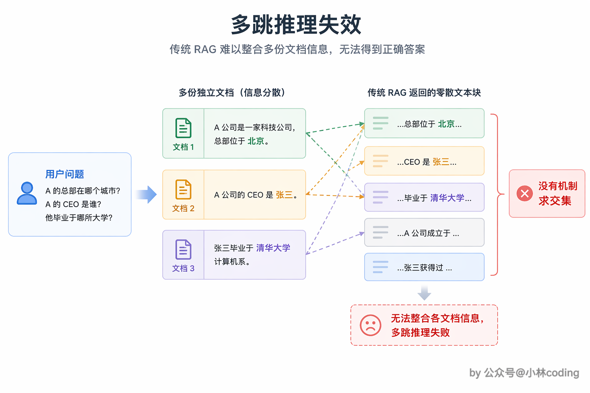

*img*

还有一个经典的例子，问「爱因斯坦的导师的导师是谁？」。这个问题得先找到「爱因斯坦的导师是谁」，然后再找到「那个导师的导师是谁」。**当信息分散在多个文档里时，单次固定 Top-K 的传统 RAG 往往难以稳定完成这种链式推理**；查询分解、迭代检索或结构化查询可以改变这个基线。

### 痛点二：全局性问题不容易直接回答

传统 RAG 的第二个局限，是**对「全局性问题」缺少天然的聚合路径**。

什么叫全局性问题？我举几个例子你就有感觉了。

比如你问「这本小说的主题思想是什么？」、「这份年度财报里，公司战略发生了哪些变化？」、「这个技术文档集合里，主要讨论的是哪几类方向？」这些问题有一个共同的特点：**答案不在某一个文本块里，而是需要你通读所有文档、归纳总结才能得出来**。

但传统 RAG 的常见实现主要按相似度找 Top-K 个文本块。可你想问的是「主题思想」，哪个文本块会直接写「本书主题思想是 XXX」？可能没有。因此固定 Top-K 可能只返回零散片段，大模型拿到的证据不足以稳定总结整体主题；多轮检索、长上下文或预计算摘要可以作为改进路径。

这类问题常被称为 **Query-Focused Summarization**（查询聚焦摘要）：它不仅需要检索，还需要覆盖、分组、归纳和证据校验。固定 Top-K 的传统 RAG 可能覆盖不足，但通过查询分解、迭代检索、长上下文或预计算摘要，也可以改善结果；因此不能绝对说它“天生处理不了”。

你想想，如果你在医院里问医生「过去一年咱们科室主要治疗的是哪几类病？」，医生要给出答案，得在脑子里把过去一年所有病例都过一遍、归归类。他不能只翻最上面的几份病例就告诉你答案吧？传统 RAG 干的就是这种「只翻最上面几份」的事情。

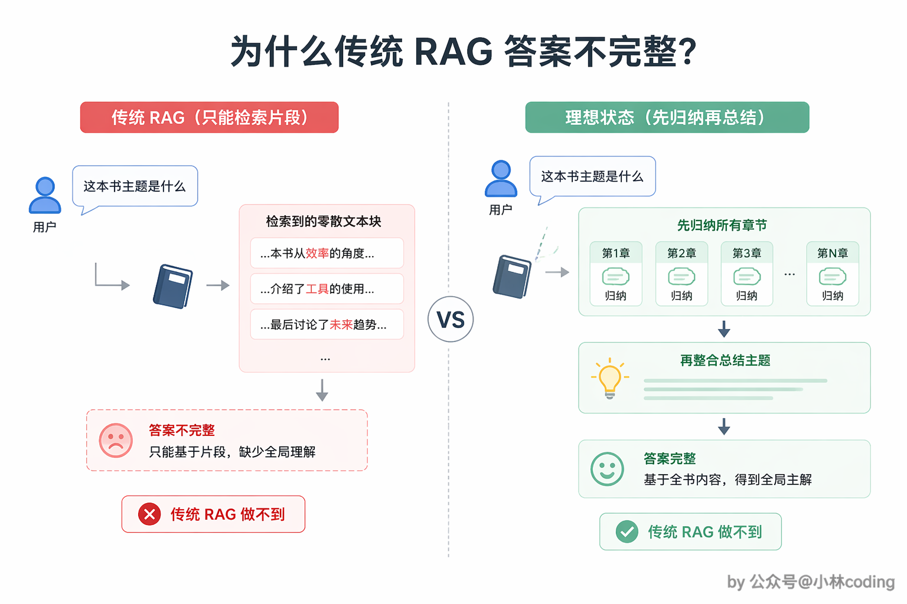

*img*

### 痛点三：切块带来的「语义断裂」

传统 RAG 的第三个痛点，藏在我们经常忽略的细节里：**文档切块（Chunking）本身就在毁坏语义**。

你想啊，传统 RAG 第一步就是把文档切成 500 字或者 1000 字的文本块。这种切法看起来没问题，但实际上会带来三个麻烦：

**第一个麻烦，是「语义被切断了」**。

一段完整的论述可能横跨了三个段落，你按字符数切，就可能把一个完整的观点拦腰斩开。检索时只召回了上半段，下半段没召回，答案自然就不完整。

**第二个麻烦，是「实体之间的关系丢了」**。

举个医疗场景的例子：原文里写的是「卡托普利属于 ACEI 类药物，但严重肾功能不全者禁用」。切块之后，「卡托普利是 ACEI 药物」可能在一个块里，「严重肾功能不全者禁用」可能在另一个块里。

这时候你问「高血压合并糖尿病患者首选哪几种 ACEI 药物？禁忌症是什么？」，传统 RAG 把这两个块都检索出来扔给大模型，大模型一看：诶，这里提到卡托普利，那里提到禁用……然后就可能给你来一句「卡托普利属于禁忌症药物」。

**你看，因果关系被切块这一步给毁了**。大模型拿到的是一堆「碎片化的事实」，但事实和事实之间原本的逻辑链条，没了。

**第三个麻烦，是「检索噪声」**。

因为切块之后每个块都是独立的，语义相似的块不一定就是你真正想要的块。比如你问「苹果的营收」，可能会检索到一堆讨论「苹果」（水果）的文本块，因为它们在语义上都很接近「苹果」这个词。这种噪声进来之后，大模型就容易被误导。

### 一张表总结传统 RAG 的三大痛点

把上面讲的三大痛点汇总一下：

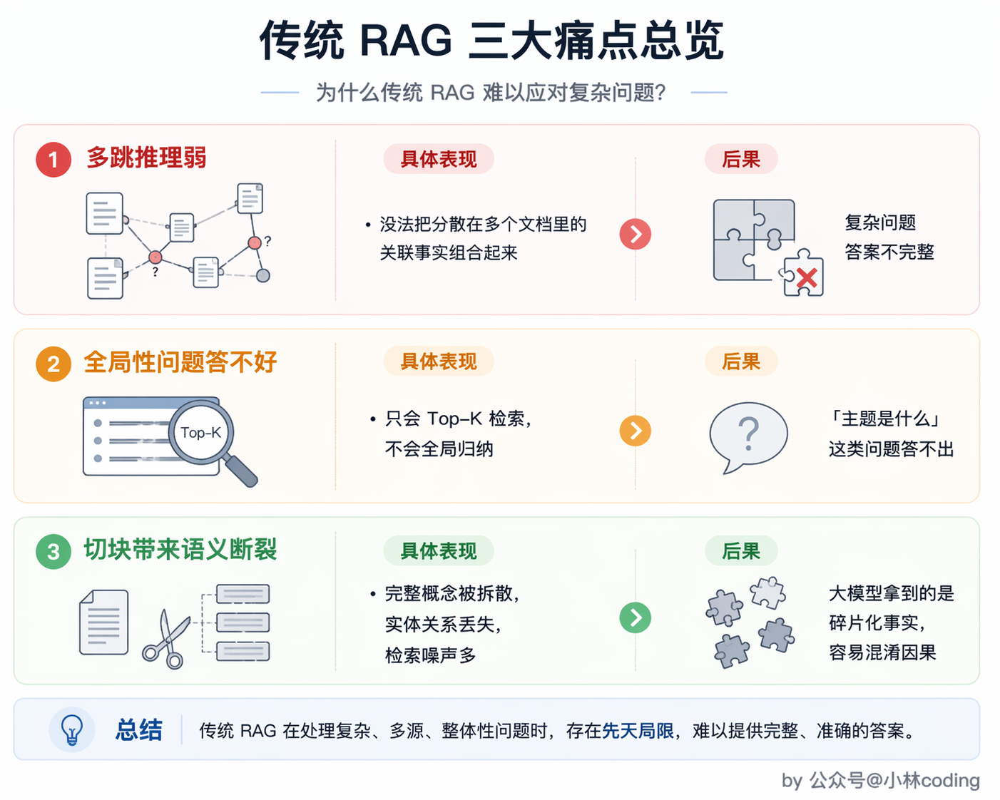

*img*

### 痛点背后的根本原因：它不「理解关系」

你如果仔细琢磨上面这三个痛点，会发现它们背后其实是**同一个根本问题**：

**传统 RAG 做的是「找相似文本」，但企业真正需要的是「理解实体关系」**。

向量检索这种方式，在「找长得像的句子」这件事上是很强的。但它没有机制去理解「这两个实体之间是什么关系」「这条信息和那条信息之间有没有因果链」。

所以，如果你的业务场景只是「找到某条具体事实」（比如问「我们公司年假有多少天」），传统 RAG 往往是合理的起点。但一旦涉及**关系、多跳推理或全局归纳**，就要比较它与查询分解、重排、图索引和摘要等方案的覆盖率、证据支持率与成本。

那问题来了，**怎么让 RAG 真正「理解关系」呢？**

答案就是：**引入知识图谱**。这也正是 GraphRAG 的核心思路。

我们下一节就来聊聊，GraphRAG 到底是怎么把「找相似文本」升级成「理解关系」的。

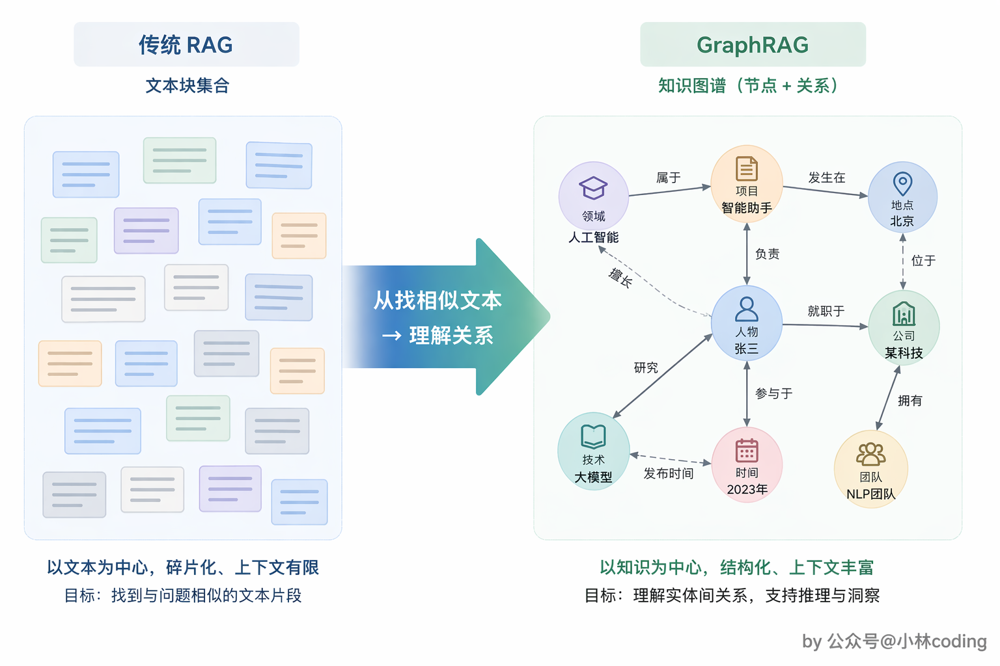

*img*

---

## 2、什么是 GraphRAG？为什么会有 GraphRAG？

### 先搞清楚 GraphRAG 到底是什么

**GraphRAG** 这个词，其实有两层含义。

狭义上，它指的是**微软研究院在 2024 年 4 月发布的那篇论文和配套的开源项目**。论文名字叫 **《From Local to Global: A Graph RAG Approach to Query-Focused Summarization》**（从局部到全局：一种面向查询聚焦摘要的图 RAG 方法），作者是 Darren Edge、Ha Trinh 等人。

广义上，它指的是**所有基于知识图谱做 RAG 的方法**，业界还有很多变种（比如 NebulaGraph、HippoRAG、阿里云的 AnalyticDB GraphRAG 等）。

咱们这篇文章**主要讲的是微软这套 GraphRAG**，因为它目前影响力最大，开源社区也最活跃，几乎是所有 GraphRAG 方案的参照对象。后面如果没特别说明，我说的 GraphRAG 都指微软这一套。

好，定义说清楚了，那 GraphRAG 到底在干嘛？

**一句话概括：GraphRAG 就是用 LLM 把文档「读成一张知识图谱」，然后基于这张图谱来做检索和回答**。

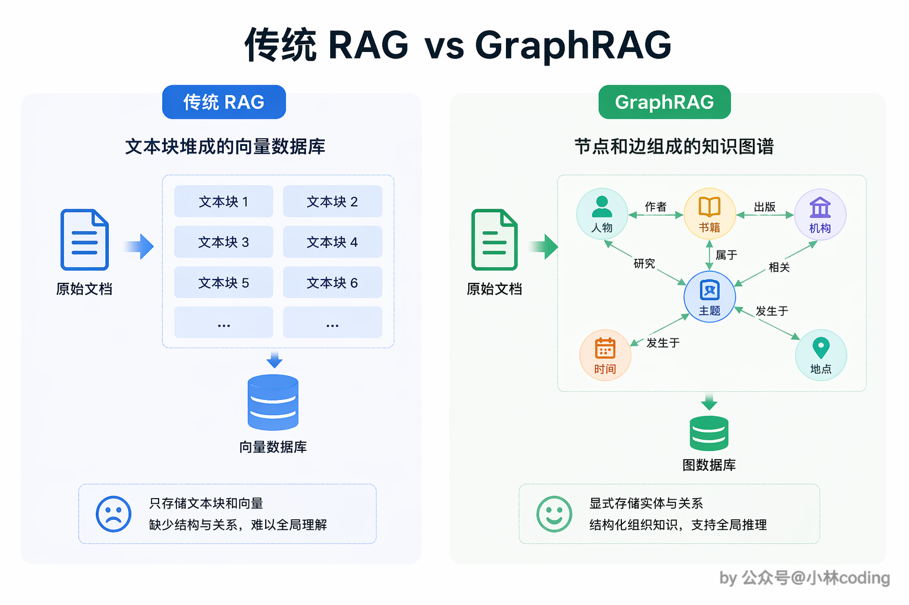

*img*

### 传统 RAG 和 GraphRAG 的核心差异是什么？

你如果把传统 RAG 和 GraphRAG 放一起对比，会发现它们的**关键分歧就在于：知识是以什么形式存储的**。

传统 RAG：通常以**文本块及其索引/元数据**为主要检索单元。块之间未必没有关系，但关系通常不会像图结构那样被显式建模和遍历。

GraphRAG：在文本块之外构建**图（Graph）**表示，把部分实体、关系或声明抽取为节点和边，再结合原文、向量索引或社区摘要检索。抽取结果是模型/规则推断，不天然等于事实。

我举个更具体的例子你就懂了。

假如你有一段文本：「张三在 2025 年创立了 A 公司，李四是 A 公司的 CTO，A 公司主要做自动驾驶业务。」

传统 RAG 会把这段话整体变成一个文本块，存到向量数据库里。你下次问「A 公司的 CTO 是谁？」，它靠语义相似度检索回这段话，然后让大模型去阅读理解，答出「李四」。

GraphRAG 则会从这段话里**抽取出实体和关系**，变成这样的结构化数据：

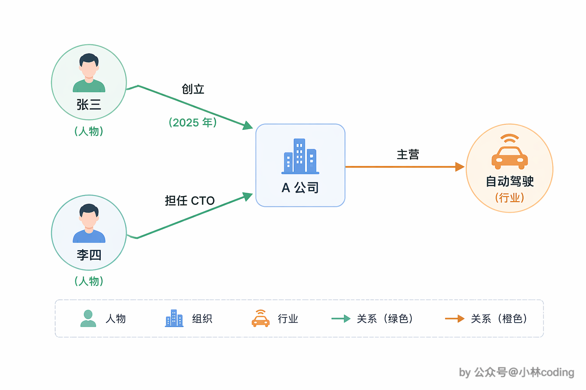

*img*

你看出差别了吗？**GraphRAG 把部分文本证据表示成关系网**，但原文仍是重要证据来源；节点和边是否正确、是否带来源、是否能追溯，取决于抽取、合并和存储设计。

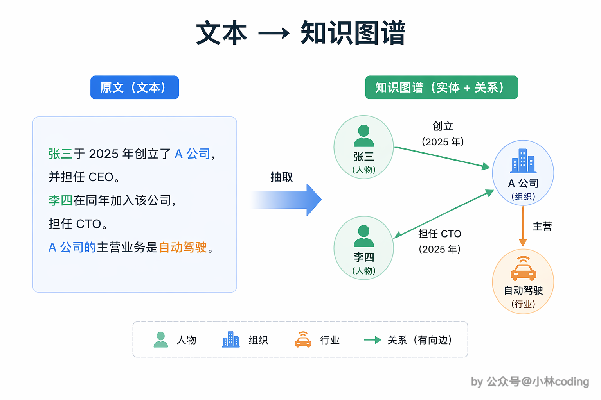

*img*

### 为什么要搞成图？这么做到底好在哪？

你可能会问：费这么大劲把文档变成图，这么做到底有什么好处？

其实就是**为了解决咱们在第 1 章讲的那三个痛点**。咱们一个一个来看。

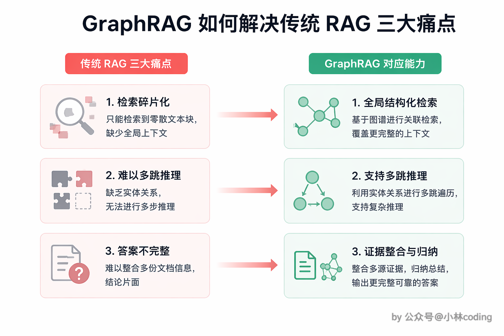

*img*

**第一，多跳推理变得天然可行**。

上一节咱们提到那个「欧洲供应商 + 审计没过 + 处理 PII 数据」的查询，传统 RAG 干不了，是因为它没法做「交集」。但在图上，这件事就变成了图遍历（Graph Traversal）：从「欧洲」这个节点出发，找它连着的所有「供应商」节点，再筛选出那些连着「审计未通过」的，再筛选出那些连着「PII 数据处理」的。

**图结构适合表达和遍历多跳关系**，但是否优于文本 RAG 取决于数据、图质量、查询路由、基线和评测设置；不要把某个数据集或版本的分数提升外推为固定收益。

**第二，全局性问题能答了**。

这是 GraphRAG 最核心的创新点，也是那篇论文标题里「From Local to Global」（从局部到全局）的来源。

微软的做法很巧妙：**先把整张知识图谱通过社区检测算法（比如 Leiden 算法）划分成若干个「社区」，再用 LLM 为每个社区生成一份摘要**。

什么叫社区？你可以把它理解成**图里那些互相抱团、关系特别密切的一群节点**。比如在《三国演义》这本书里，刘关张就是一个小社区、曹操集团是一个社区、诸葛亮周边的人物又是一个社区。每个社区内部的人物关系非常紧密，但社区之间的连接就比较稀疏。

一旦每个社区都有了摘要，系统可以把多个社区摘要作为全局归纳的中间证据；这会增加预计算成本，也可能丢失细节。传统 RAG 也可以通过分层摘要、批处理或其他检索策略回答部分全局问题，只是路径不同。

**第三，实体和关系显式化，切块语义断裂的问题也缓解了**。

因为 GraphRAG 可以把分散文本中的实体和关系连接起来，检索时有机会同时取到相关证据；但关系抽取、时间条件、否定和因果方向都可能出错，仍需保留原文来源、版本和领域校验，不能保证“不混淆”。

### 一个更形象的类比：从「图书馆找书」到「带导游游书店」

讲到这儿，你可能已经有感觉了，但咱们再用一个生活化的类比来强化一下理解。

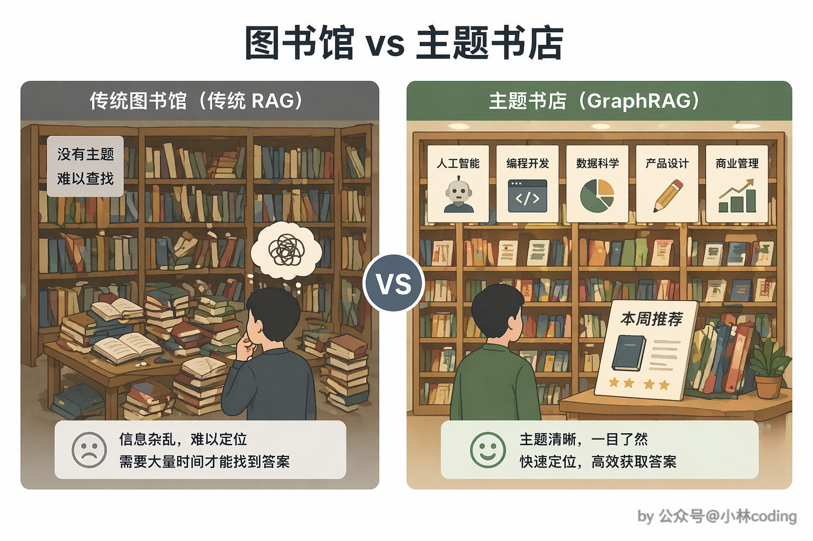

*img*

**传统 RAG 像什么？像你去一个没有任何分类的图书馆找书**。所有书都按出版日期顺序摆在一起，你想找「和气候变化有关的书」，只能靠关键字搜索，一本一本翻，找到几本就交给你。你想问「这个图书馆最近这几年主要收藏的是哪几个方向的书？」对不起，没人能回答你。

**GraphRAG 像什么？像你进了一个带导游的主题书店**。导游在你进门前已经把所有书按主题分好类了，每个主题区还贴了一张「这个主题区主要讨论什么」的概览海报。你要查具体的细节，导游带你精准定位；你要问宏观的主题，导游就把所有主题概览海报念给你听。

你说这两种体验能一样吗？

### GraphRAG 的诞生背景

最后聊聊 GraphRAG 为什么在近年的 LLM 应用中受到关注。

其实「知识图谱」这个东西并不新鲜，早在 2012 年谷歌就提出过 Knowledge Graph 的概念。把知识图谱和 RAG 结合的想法也有人尝试过，但之前都不温不火，为什么？

**因为之前构建知识图谱太痛苦了**。传统的知识图谱构建，要么靠人工标注（超级贵），要么靠专门训练的 NLP 模型（效果一般）。提取实体、关系、消歧、对齐……每一步都是技术壁垒。

大模型可以辅助实体、关系和属性抽取，但仍需要 schema、去重、来源、人工抽查和回归评测；它不会因为几条 Prompt 就自动解决知识图谱质量问题。

**可以把它理解为：LLM 降低了部分图构建的工程门槛，但也引入了 token 成本和抽取不确定性。**

好，到这儿你应该对 GraphRAG 是什么、为什么会有它，有了一个整体的认识。但你可能还有疑问：**它具体是怎么工作的？实体怎么抽？社区怎么划？查询怎么做？**

下一章，我们就来拆解 GraphRAG 的完整工作流程。

---

## 3、GraphRAG 的工作流程是怎样的？

搞清楚了 GraphRAG 是什么，咱们这一节就来拆解它**到底是怎么工作的**。

常见的 GraphRAG 实现可以分为**索引阶段（Indexing，离线/异步）**和**查询阶段（Query，在线）**；不同版本还可能支持增量索引、动态检索或混合路径。关键边界是：索引阶段把原文转换为可检索表示，查询阶段仍要负责证据选择、上下文预算、生成和引用校验。

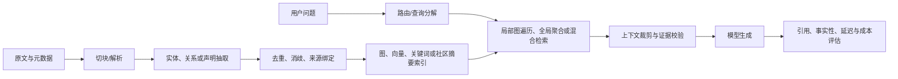
```mermaid
flowchart LR
    A[原文与元数据] --> B[切块/解析]
    B --> C[实体、关系或声明抽取]
    C --> D[去重、消歧、来源绑定]
    D --> E[图、向量、关键词或社区摘要索引]
    Q[用户问题] --> R[路由/查询分解]
    R --> S[局部图遍历、全局聚合或混合检索]
    E --> S
    S --> T[上下文裁剪与证据校验]
    T --> U[模型生成]
    U --> V[引用、事实性、延迟与成本评估]
```

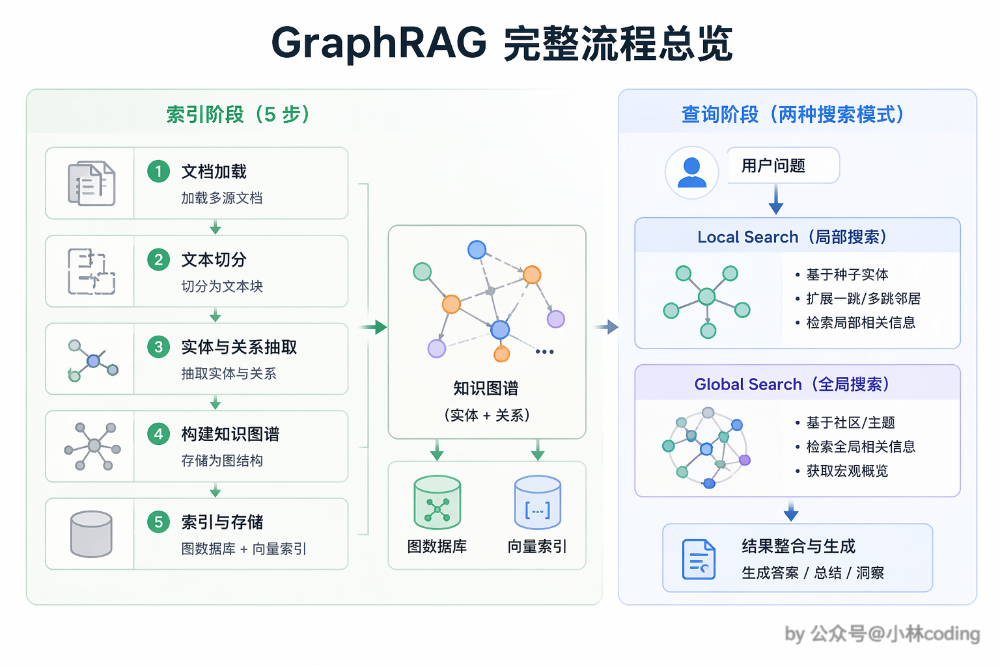

*img*

**索引阶段做的事情**：从原始文档抽取可检索的实体、关系或声明，构建索引和（可选的）社区摘要。这个阶段通常需要较多计算和模型调用，但是否全量离线、是否增量更新取决于实现。

**查询阶段做的事情**：根据问题选择局部、全局或混合检索，组装带来源的证据，再交给 LLM 生成答案；图检索速度不一定“快速”，需要实测。

咱们一个一个阶段来看。

### 索引阶段：5 步把文档变成知识图谱

以一类常见的 GraphRAG pipeline 为例，可以拆成若干步骤。下面的步骤和数量是教学抽象，具体实现可能合并、删减或增加阶段。

**第 1 步：文档切块（Text Chunking）**

把文档按 tokenizer、结构和任务切成文本单元（Text Unit）；1200 字只是示例，实际应通过检索召回、抽取质量和成本评测选择。

切块可以控制模型输入、提高并行度和定位来源，但过小会割裂关系，过大会增加成本；并行还要考虑速率限制、顺序、重试和去重。

**第 2 步：实体与关系提取（Entity & Relationship Extraction）**

这一步是图式 RAG 的关键步骤之一：让模型或规则从文本单元中抽取**实体（Entity）**、**关系（Relationship）**和可选的声明/时间属性。

GraphRAG 用的是一个专门设计的 Prompt，大致长这样（简化版）：

```plain
你是一个实体关系抽取助手。请从下面的文本中：
1. 识别所有的实体，每个实体给出：
   - entity_name：实体名（大写）
   - entity_type：类型（比如 [人物, 组织, 地点, 事件]）
   - entity_description：实体的综合描述

2. 识别所有实体之间的关系，每对关系给出：
   - source_entity：源实体
   - target_entity：目标实体
   - relationship_description：关系的描述
   - relationship_strength：关系强度（1-10 的数字）

文本内容：
{input_text}

请按以下格式输出：
("entity"|实体名|类型|描述)
("relationship"|源|目标|描述|强度)
```

LLM 读完一段「刘备和关羽、张飞在桃园结义」的文本，会输出类似这样的结构化内容：

```plain
("entity"|刘备|人物|蜀汉的建立者，三国时期重要人物)
("entity"|关羽|人物|刘备的义弟，以忠义闻名)
("entity"|张飞|人物|刘备的义弟，勇猛善战)
("relationship"|刘备|关羽|桃园结义为兄弟，关系极为紧密|10)
("relationship"|刘备|张飞|桃园结义为兄弟，关系极为紧密|10)
("relationship"|关羽|张飞|桃园结义为兄弟|10)
```

**这一步跑完，所有文本块都会产出一堆实体节点和关系边**。

但注意，这里会有一个麻烦：**重复和歧义**。比如刘备可能在文本里被叫做「玄德」「先主」「刘皇叔」，LLM 抽取的时候可能把它们抽成了三个不同的实体。这个问题 GraphRAG 后面会通过「实体合并」和「社区检测」来一定程度上缓解，但不能完全解决。这也是我们第 4 章要讲的难点之一。

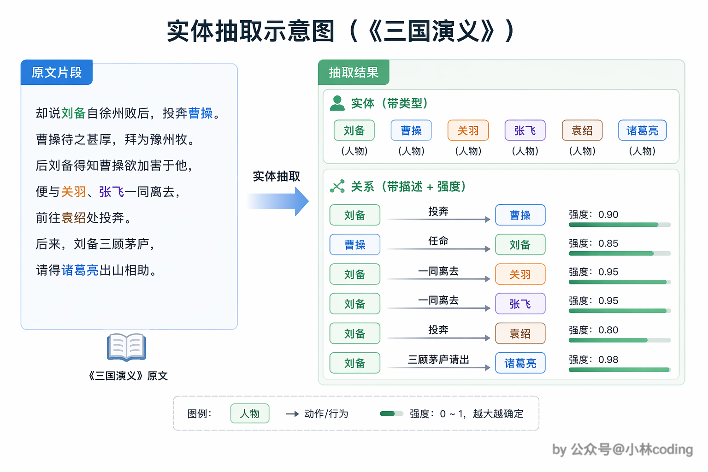

*img*

**第 3 步：生成实体/关系摘要（Summarization）**

这一步容易被忽略，但其实很关键。

同一个实体（比如「刘备」）会在好多个文本块里被反复抽取，每次抽取的描述可能都不一样：「蜀汉的建立者」「关羽的义兄」「汉室宗亲」……

常见实现会把同一候选实体/关系的描述聚合，再生成或计算综合表示；具体是否逐实体调用 LLM、是否用规则/嵌入合并，取决于 pipeline。

这一步做完，每个实体节点就有了一段「综合描述」，这段描述会被向量化后存入向量数据库，供后面的 Local Search 用。

**第 4 步：社区检测（Community Detection）**

到这一步，你手里已经有了一张完整的知识图谱，里面的节点是实体，边是关系。但这张图可能有成千上万个节点，怎么组织？

一些 GraphRAG 实现使用 **Leiden** 等社区检测算法；算法、分辨率、随机种子和层级结构都会影响结果，不能笼统断言比其他算法更稳定。

Leiden 算法会把图谱划分成**多个层级的社区**，这是它最有意思的地方。

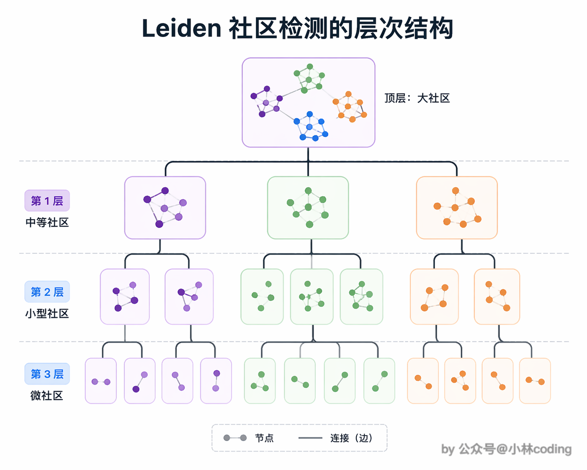

*img*

咱们还是拿《三国演义》来说。

- 最粗的那一层（叫 Level 0）可能把整张图划成五到十个大社区，比如「曹魏集团」「蜀汉集团」「东吴集团」「黄巾起义相关」这种；
- 再往下一层（Level 1），每个大社区又会被拆得更细，比如「蜀汉集团」里会分出「刘关张小团体」「诸葛亮周边」「五虎上将」等等；
- 再继续往下 Level 2、Level 3，一路细分下去，直到社区没法再拆为止。

**这种层次化划分可以支持不同粒度的全局检索**；查询路由不一定只按“宏观/具体”二分，还要结合问题、预算和证据覆盖率。

**第 5 步：生成社区摘要（Community Reports）**

某些实现会为社区生成摘要报告（Community Report）；它是可选的预计算资产，生成前后都应保留来源和版本。

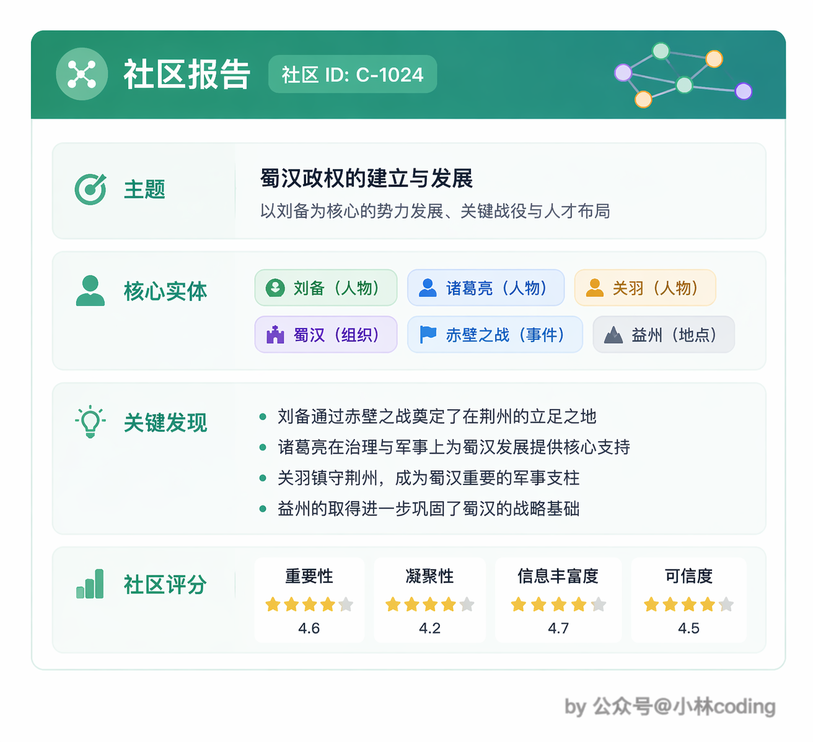

*img*

报告可以由 LLM 根据社区内的实体、关系和声明生成，也可以由规则/统计聚合。输入不能无限“整包”塞入模型，需要分层、截断和来源映射；评分字段也属于实现设计，不应当作客观影响力。

这些社区报告**就是 GraphRAG 回答全局性问题的核心资产**。你可以把它们理解成图书馆里每个主题区前面贴的那张「本主题概览海报」。

索引阶段通常需要多轮模型调用，数量取决于文本单元、批处理、合并策略、社区数和是否启用声明抽取；成本应按真实 tokenizer、模型价格、缓存和并发配置测量，不能由“100 万 token”直接推出固定调用次数。

### 查询阶段：两种搜索模式各司其职

索引后通常会得到实体/关系、原文引用、可选社区和报告。常见查询模式包括 Local Search、Global Search，某些版本还会提供混合或动态检索；名称和实现随版本变化。

（部分实现还会提供动态或混合检索模式；具体名称和行为应按目标版本文档核对。）

**模式一：Local Search（本地搜索）**

**适用场景**：用户问的是关于**某个具体实体**的问题。比如「诸葛亮都有哪些著名的计策？」「A 公司的 CTO 是谁？」。

**工作流程**：

1. **定位入口实体**：先用问题的向量，在所有实体节点的向量索引里做相似度搜索，找到最相关的几个实体。比如问诸葛亮，就先定位到「诸葛亮」这个节点
2. **顺藤摸瓜扩展**：从入口实体出发，沿着图的边扩展，找到相关的**邻居实体、关系、原始文本块、所属社区报告**
3. **组装上下文**：把找到的这些信息整合成一段上下文（Context）
4. **交给 LLM 生成答案**

你看，**Local Search 的核心是「从一个点扩散到它的邻居」**，很适合回答那些「围绕某个具体对象」的问题。

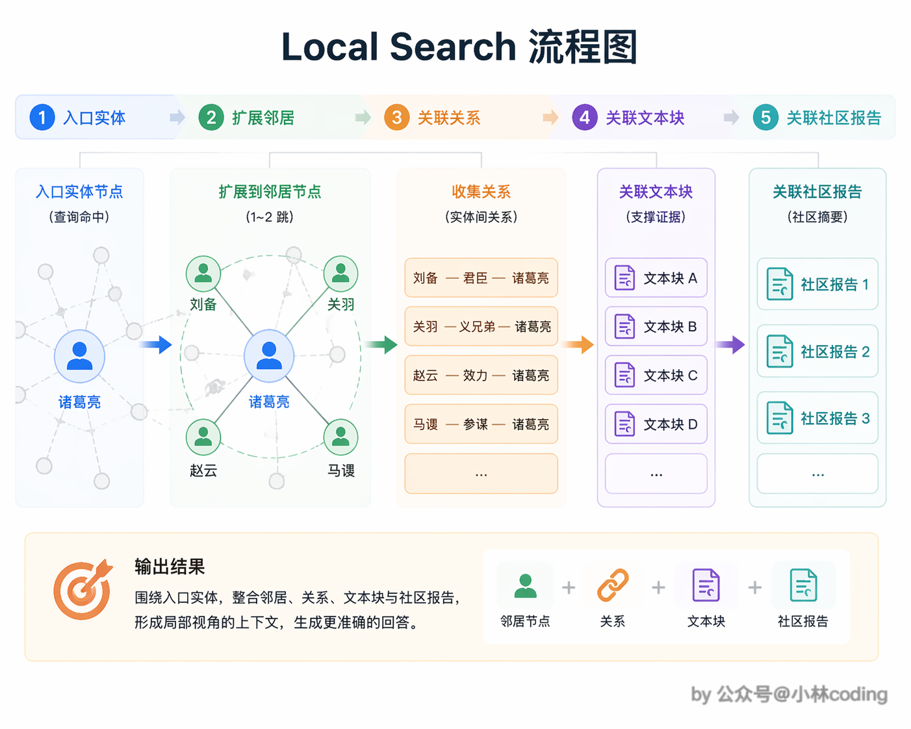

*img*

**模式二：Global Search（全局搜索）**

**适用场景**：用户问的是**全局性、宏观性**的问题。比如「整本书讲了哪几派势力的斗争？」「这份报告的主要结论是什么？」。

**工作流程**：GraphRAG 这里用的是一个**Map-Reduce**的策略：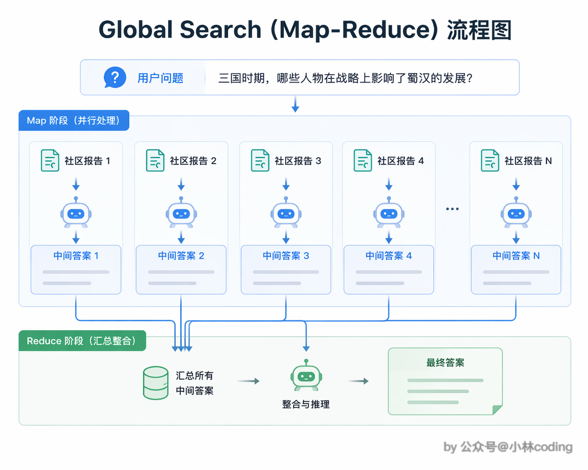

- **Map 阶段**：把某个层级（比如 Level 1）的所有社区报告都拿出来，分成好多批，对每一批都让 LLM 生成一个「中间答案」，并给每个观点打一个「重要性评分」
- **Reduce 阶段**：把所有中间答案里的观点汇总，按评分排序，保留最重要的那些，最后让 LLM 合并成一个完整的最终答案

这个流程听起来有点绕，但它的本质是：**把全局性问题拆分成多个社区内部的子问题并行解答，最后再汇总**。

打个比方，你问班长「咱们班这学期整体学习情况怎么样？」，班长不会去看每个同学的每张考卷，而是会先找每个小组的组长，让他们每人给一份自己组的总结，然后班长再把所有组的总结汇到一块儿给你看。GraphRAG 的 Global Search 干的就是这事儿。

**为什么 Global Search 可能特别费钱？**

Map 阶段可能需要处理大量相关社区报告；社区数量、批大小、模型调用次数和上下文预算取决于数据与实现，可能显著增加延迟和成本。

一种常见优化是动态选择或分层筛选社区：先估计相关性，再展开必要子树，以减少模型调用；收益必须按数据集、阈值和版本实测。

### 一张图总结 GraphRAG 的完整工作流程

最后咱们把整个流程串起来：

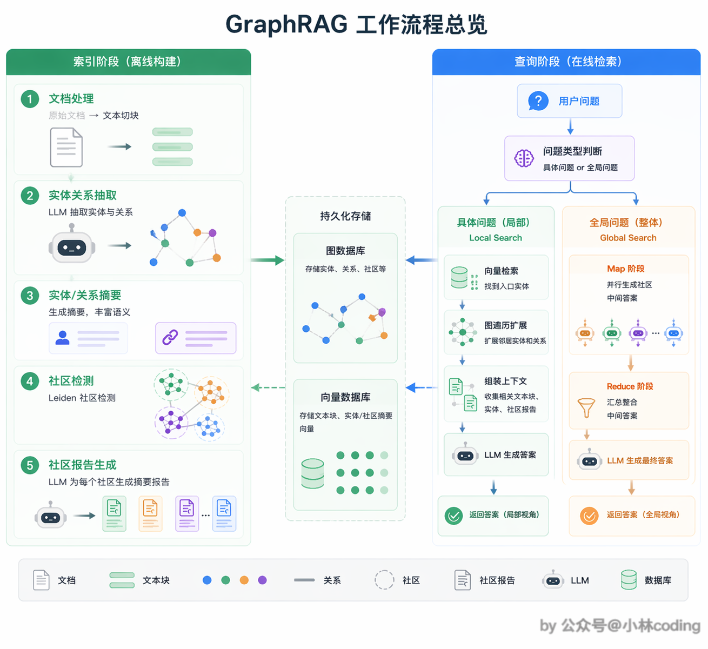

*img*

**索引阶段（离线，一次性跑完）**：

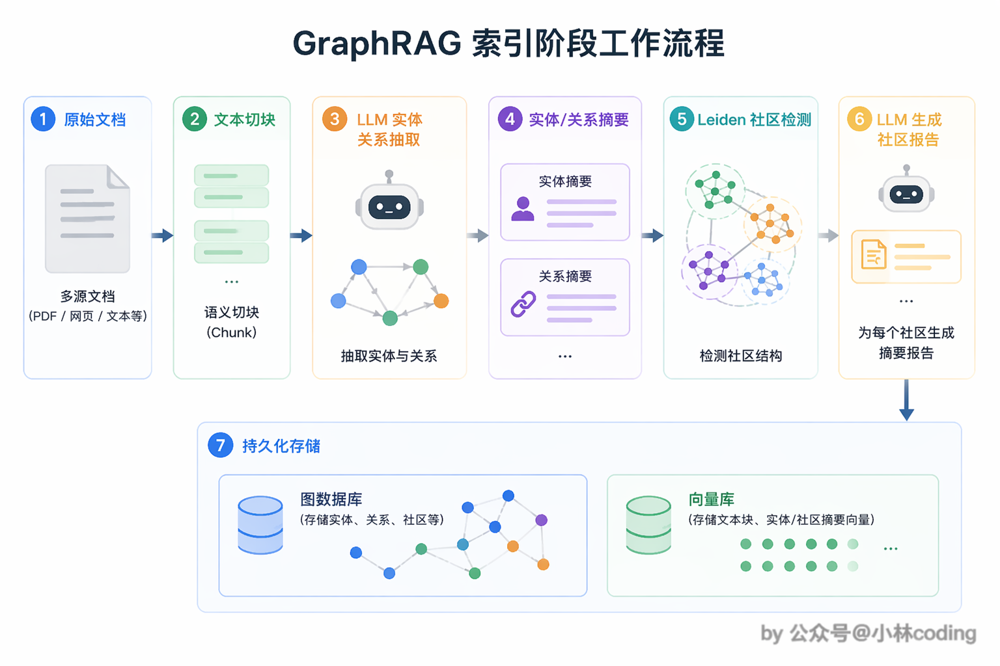

*img*

**查询阶段（在线，每次查询都跑）**：

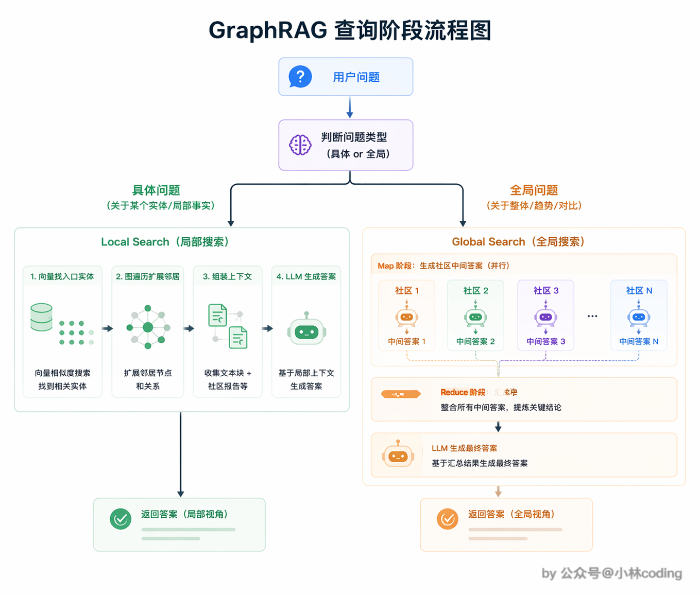

*img*

到这儿你应该已经把 GraphRAG 的整个流程搞清楚了。但你可能也注意到一个问题：**这套方案虽然强大，但步骤多、调用贵、流程复杂**。

GraphRAG 在实际落地的时候，到底会撞上哪些坑？下一节咱们来盘一盘。

---

## 4、GraphRAG 的难点是什么？

读到这儿，你可能会觉得 GraphRAG 好像挺完美的，能解决传统 RAG 的痛点，又有清晰的流程。

**但这里我得给你泼一盆冷水**。

GraphRAG 可能带来更丰富的关系和全局表示，但代价是索引、更新、存储和查询复杂度上升；是否值得取决于业务问题和基线评测，不能据此断言团队都会退回传统 RAG。

这一节咱们就把 GraphRAG 落地时常见的四大难点盘一盘。搞懂这些难点，你也就能理解为什么后来会出现 LightRAG 这种「轻量化改良方案」。

### 难点一：索引成本高得吓人（Token 焚烧炉）

**GraphRAG 第一个也是最让人肉疼的难点，就是构建成本**。

传统 RAG 的索引通常是切片 → 嵌入 → 存储，但实际成本取决于嵌入模型、解析、重排、存储和更新频率，不能用固定的每百万 token 价格概括。

GraphRAG 的索引通常需要更多模型调用，因此可能成为成本主要来源；是否“昂贵”要按 pipeline、模型、缓存和并发实测。

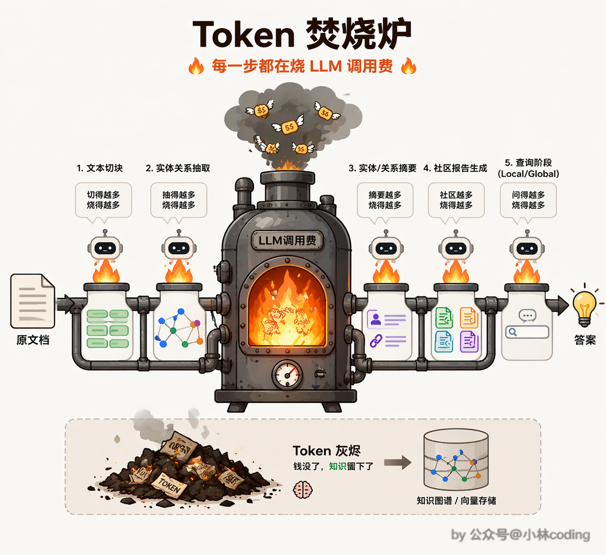

*img*

常见 pipeline 会在文本单元、实体/关系聚合、社区报告或声明抽取阶段调用模型，但可以批处理、缓存、规则化或省略某些阶段；调用结构不是固定模板。

因此输入输出 token 可能明显高于原文，但倍数高度依赖分块、重叠、提示模板、批处理和摘要策略，不能给出通用的十倍/几十倍结论。

成本应按项目实际配置估算：先统计文档 tokenizer、模型调用次数/输入输出 token、嵌入与存储、并发/重试，再乘以当前价格并加入更新与人工校验成本。Lazy/动态构建等方案可以把部分计算移到查询阶段，但会交换在线延迟、成本和结果稳定性，不能直接套用固定百分比。

### 难点二：实体消歧，踩过的人都知道多痛

GraphRAG 第二个难点，也是**很多人没踩坑之前意识不到的杀手级问题，就是实体消歧（Entity Disambiguation）**。

什么叫实体消歧？我举几个例子你就明白了。

你看「IBM」「国际商业机器」「IBM Corp.」「Big Blue」，这四个名字其实指的都是同一家公司，人一看就知道；但机器不知道。再比如「苹果」「苹果公司」「Apple」「Apple Inc.」，前三个在不同语境下既可能指水果也可能指公司，你得结合上下文去判断。还有一些场景更麻烦，比如「张三」这个名字，在几百篇文档里可能对应的根本就不是同一个人。

**LLM 做实体抽取可能不一致**。同一个实体在不同文档里有别名、缩写或不同上下文，若没有规范化和实体链接，就可能变成多个候选节点。

这种情况下会发生什么？

- **第一，可能出现近重复节点**，导致图膨胀和召回分散。
- **第二，关系可能碎片化**；如果别名没有合并，查询可能漏掉一部分证据，但召回策略和原文索引也可能补回它们。
- **第三，错误会沿下游传播**。实体或关系抽错会影响社区、摘要和答案，因此要保留来源、置信度、版本和纠错入口；“指数级放大”不是必然的数学结论。

**这个问题没有一个适用于所有领域的统一解法**。

生产环境通常会叠加好几层策略：字符串编辑距离（处理拼写差异）、向量相似度（处理语义相似）、LLM 判别合并（处理复杂情况）、甚至还要人工兜底。但每一层都会**增加索引成本和延迟**。

有位资深工程师说过一句话我觉得特别扎心：**「实体碎片化的知识图谱，比没有知识图谱更糟糕，因为它制造了一种虚假的完整感」**。你以为图已经建好了，实际上里面全是断裂的关系，但你从外面根本看不出来。

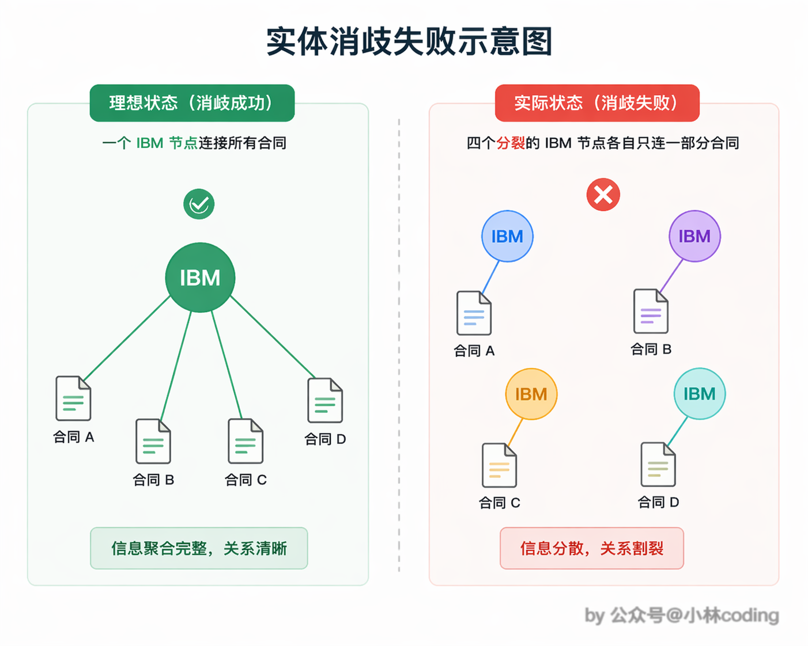

*img*

### 难点三：查询延迟，尤其是 Global Search

GraphRAG 的第三个难点，是**查询延迟**。

传统 RAG 的 ANN（近似最近邻）检索通常比多轮图查询简单，但端到端延迟仍取决于索引、重排、模型首 token、网络和负载，不能用固定毫秒/秒数概括。

GraphRAG 还要承担图遍历、上下文组装和可能的多轮模型调用，因此延迟路径更复杂。

**Local Search** 通常比全局聚合简单，但具体延迟取决于邻居深度、候选数、存储和模型服务，应通过 p50/p95 实测。

**Global Search 的路径更长**。一种实现会采用 Map-Reduce：把若干社区报告分批交给模型生成中间答案，再由 Reduce 阶段汇总；社区数、批次和是否并行取决于实现，并不必然等于同数目的模型调用。

这种“先扇出再汇聚”的结构可能造成较高延迟，尤其在限流或串行 Reduce 时；是否适合实时交互要看 p95、流式体验、问题类型和业务 SLO，不能用固定 10 秒到 1 分钟或“完全不可能”概括。

你想啊，你问一个 ChatGPT，要等一分钟才出答案，谁能忍？

可用动态社区选择、候选截断、并发和缓存降低开销；收益和相对延迟要按版本、语料和负载实测。

### 难点四：增量更新，牵一发而动全身

这是 **GraphRAG 最要命的一个难点**，我单独放在下一节展开讲。

先给你一个直观感受：在传统 RAG 里，新增一份文档，就是把它切片、向量化、upsert 进向量库，完事。

但在 GraphRAG 里，事情就没那么简单了。一份新文档进来，里面可能会冒出一个实体，它其实和图里已有的某个老节点是同一个东西，但名字不一样，于是实体消歧问题又来了。再比如新文档里抽出一堆关系，这些关系一加进图，原来的社区划分就可能过时了；社区一变，你之前花大价钱让 LLM 生成的那些社区摘要就全部跟着失效；等摘要重建完，整张图的向量索引还得跟着同步更新一遍。

这种数据互联性会让部分增量更新比纯向量 upsert 复杂，但可以通过受影响子图、版本化摘要、延迟合并或定期重建处理；是否高效取决于实现和更新模式。

增量更新的具体难在哪、业界有哪些应对方案，咱们下一章专门聊。

### 小结：GraphRAG 是「昂贵的妥协」

咱们把 GraphRAG 的四大难点汇总一下：

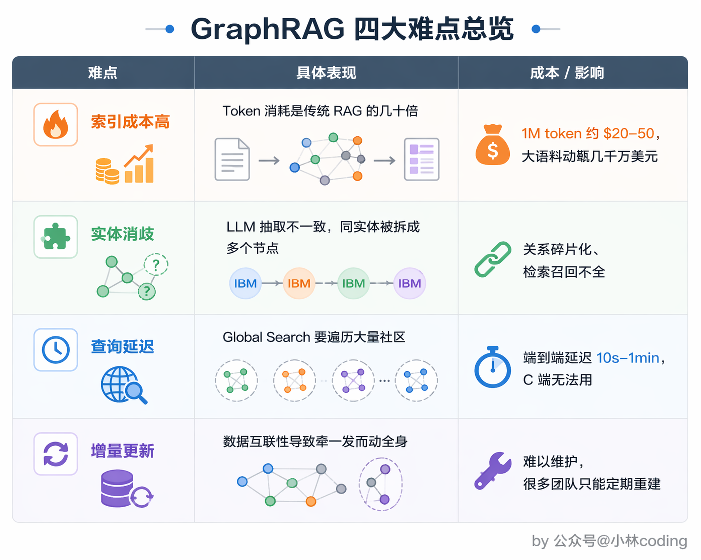

*img*

| 难点 | 具体表现 | 需要测量/治理的影响 |
| --- | --- | --- |
| 索引成本高 | 抽取、聚合和摘要可能引入多轮模型调用 | 输入/输出 token、并发、缓存、嵌入、存储和人工校验 |
| 实体消歧 | LLM 抽取不一致，同实体被拆成多个节点 | 关系碎片化、检索召回不全 |
| 查询延迟 | Global Search 可能扇出多个社区并再汇总 | p50/p95、流式体验、并发和模型限流 |
| 增量更新 | 数据互联性导致牵一发而动全身 | 难以维护，很多团队只能定期重建 |

看到这儿你应该理解了，**GraphRAG 不是银弹，它是一个「在特定场景下不得不接受的昂贵妥协」**。

如果你的业务对成本敏感、对实时性要求高、数据还需要频繁更新，那原生的 GraphRAG 可能并不适合你。这也正是后面 LightRAG 这类「轻量化方案」的价值所在，它们在精度上做一些妥协，换来更低的成本和更好的增量支持。

下一节，咱们就聚焦 GraphRAG 四大难点中最棘手的那个：**增量更新**。看看业界是怎么应对的。

---

## 5、GraphRAG 如何应对增量场景？

这一节咱们单独拎出来讲**增量更新**，因为这是 GraphRAG 落地的时候最容易被低估、也是最让人头大的问题。

### 为什么增量更新对 GraphRAG 来说这么难？

在传统 RAG 里，你加一份新文档是什么流程？

**通常更直接**：把新文档解析、切片、向量化并 upsert 到向量库；耗时、删除、版本和权限同步仍需设计，不能承诺几分钟或零副作用。

在 GraphRAG 里，加一份新文档是什么流程？

GraphRAG 的更新路径更复杂：因为图、原文索引、实体合并和可选社区摘要之间存在依赖，新文档可能触发一串级联操作：

**第一步的麻烦，新文档里的实体可能和现有图谱里的实体需要合并**。

比如老图谱里已经有了「IBM」这个节点，新文档里抽出来的叫「国际商业机器」。你需要识别出它们是同一个实体，然后合并。这就是**增量版本的实体消歧问题**，不仅要做一次性消歧，还要在每次增量时都做一遍。

**第二步的麻烦，新的实体和关系会改变图的结构**。

图结构变了，意味着什么？**原来的社区划分可能过时了**。可能新加入的一堆实体本应该属于某个新社区，或者老社区的边界发生了变化。

**第三步的麻烦，社区一变，下游的社区摘要就全失效了**。

你之前花了大价钱让 LLM 给每个社区生成的那些社区报告，现在可能和实际的图结构对不上了。要不要重新生成？重新生成就意味着**又一次 Token 焚烧**。

**第四步的麻烦，向量索引也要同步更新**。

新的实体、关系、社区摘要都要重新向量化，存进向量库。

**因此，传统 RAG 的简单 upsert 在 GraphRAG 中通常需要额外的一致性、版本和重建策略。**

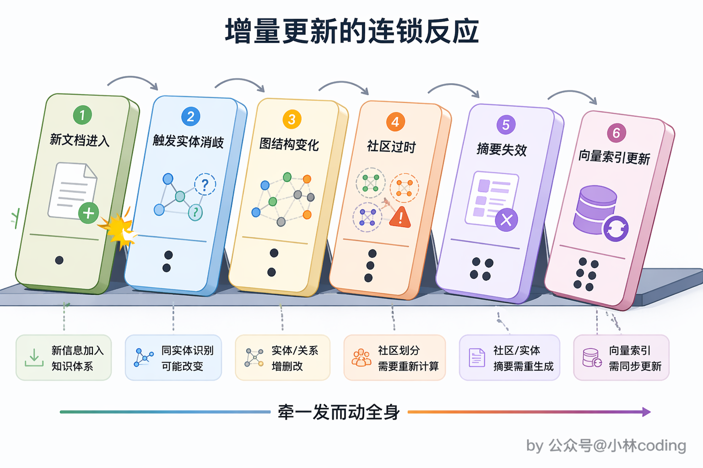

*img*

时间敏感场景的效果高度依赖索引新鲜度、版本过滤、冲突处理和基线；除非明确给出论文、数据集和配置，否则不要引用固定百分点来证明 GraphRAG 必然落后。

### 业界应对增量问题的几种思路

这个问题这么难，业界有没有办法？有，但每种办法都是**有代价的妥协**。下面几种主流思路，你可以根据自己的业务场景挑。

**思路一：简单粗暴，定期全量重建**

最土但最省心的办法：每天、每周、或者每月定时把所有文档重新跑一遍 GraphRAG 索引。

**优点**：实现简单，一致性好，图谱永远是新鲜的。

**缺点**：贵且慢。全量重建的成本与文档规模、模型、缓存、并发和更新频率相关，还要处理双索引切换、回滚和读写一致性；应以预算模型实算。

适合什么场景？**文档更新频率低 + 数据量不大 + 对实时性不敏感**的场景，比如公司年度法规库、历史档案库。

**思路二：增量索引（Incremental Indexing）**

微软 GraphRAG 的后续版本（以及 Fast GraphRAG 这类改良方案）都支持了**增量索引**，只处理新增的文档，把新抽出的实体和关系追加到已有图上。

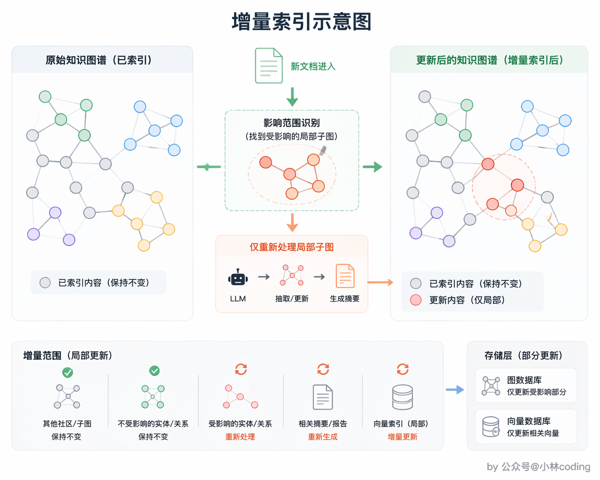

*img*

**核心流程是这样的**：先对新文档做一次实体和关系抽取（注意，只处理新的，老文档完全不碰），然后把抽出来的新实体和图里的老实体做消歧合并（这一步也叫 upsert，实现上一般会用字符串编辑距离加上向量相似度组合判断），合并完之后把新关系追加到图上。这时候关键的一步来了：**系统要判断哪些社区受到了这次更新的影响**（通常是通过图算法识别受影响的子图），然后**只对这些受影响的社区重新做一次检测和摘要**，没受影响的部分保持原样不动。

**优点**：在受影响范围较小且实现支持增量时，可以避免每次全量重建；具体速度和质量要用目标数据、模型和硬件基准测试。

**缺点**：**精度会有损失**。因为社区划分本质是一个全局优化问题，你只重做局部社区，全局的社区划分就不一定是最优的。时间长了，图谱的质量会慢慢「漂移」，需要阶段性做一次全量重建来「校准」。

**思路三：混合策略，小增量 + 周期性全量**

一种常见做法是把日常增量和周期性全量结合起来：日常更新减少延迟，周期性重建校准实体、社区和摘要漂移。周期应按新鲜度、成本和质量指标决定，不是固定每月。

这种方式的优点就是**成本和质量的平衡最好**，缺点嘛，就是你得同时维护两套流程。

**思路四：时间分区（Temporal Partitioning）**

如果你的数据有明显的时间属性（比如新闻、月度报告、季度财报），还有一种做法是**按时间段分开建图**：2025 Q1 一张图，Q2 一张图，Q3 又是一张图。

查询的时候，要么指定时间段查对应的图，要么跨图联邦查询再聚合。

**优点**：每张图相对小、更新隔离性好、老数据不受新数据影响。

**缺点**：跨时间段的查询要专门做联邦策略，图和图之间的实体也需要做全局对齐。

**思路五：延迟实体合并 + 最终一致性**

有些团队的做法更激进：**索引时不做消歧**，只把所有实体直接加进去，哪怕同一个 IBM 有四个节点也无所谓。然后**查询时再做合并**，或者**异步离线跑消歧任务**。

**优点**：索引极快，增量几乎零成本。

**缺点**：查询时可能要做更多的聚合和去重，查询延迟会变高。而且在没来得及异步合并之前，查询结果可能会漏召回。

### GraphRAG 的「增量困境」其实推动了 LightRAG 的诞生

看到这儿你可能已经有感觉了：**GraphRAG 的增量问题，本质上是「社区摘要」这个设计带来的**。

之所以一动就牵一发而动全身，就是因为有「社区→社区摘要」这条依赖链。如果没有社区摘要，增量就只需要在图上加几个节点和边，就像传统 RAG 里 upsert 几个向量一样简单。

**那问题来了：能不能干脆不要社区摘要，用别的方式实现全局查询呢？**

这就是我们下一章要讲的 **LightRAG** 给出的答案。

LightRAG 的一种核心设计是减少对预计算社区/社区摘要的依赖，使用双层检索来支持局部和主题级查询；具体 pipeline 与版本实现可能不同。

这样可能降低预计算成本，并简化部分增量路径，但 token、延迟和质量收益取决于模型、配置、数据和基线；新文档仍需实体合并、删除、冲突和索引一致性处理。

当然，这么做也是有代价的，代价是什么？下一章我们就来揭晓。

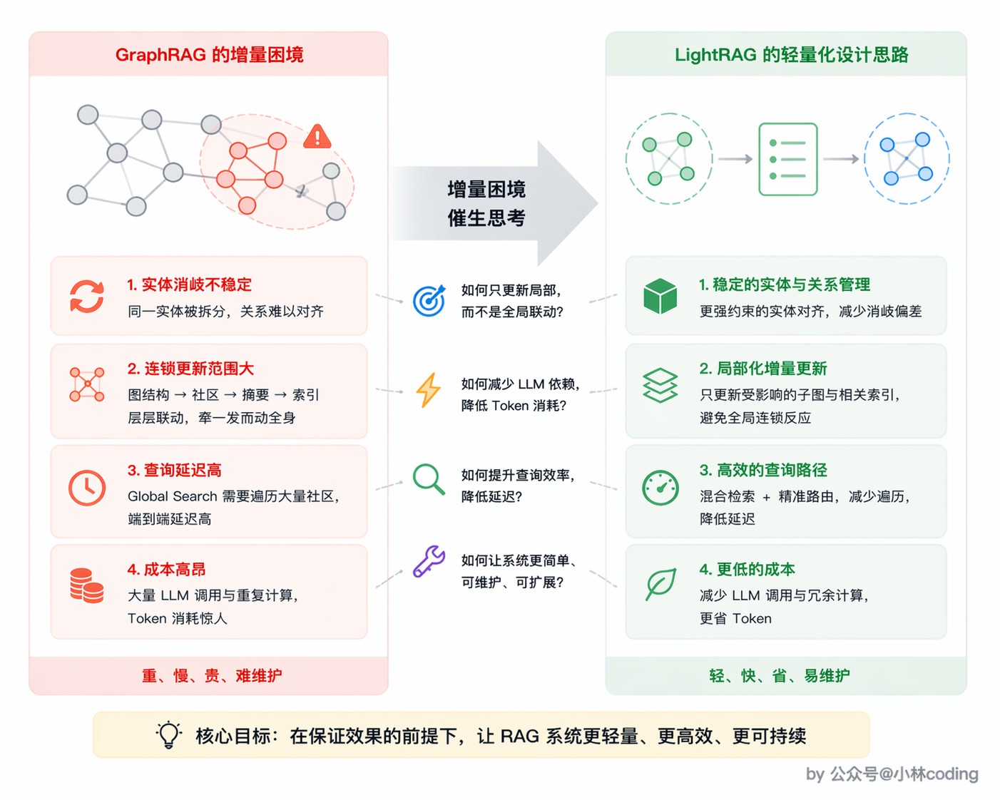

*img*

---

## 6、什么是 LightRAG？为什么会有 LightRAG？

讲完了 GraphRAG 的痛点和增量困境，咱们这一节就该聊聊业界给出的**轻量化答案**：LightRAG。

### LightRAG 的身世背景

LightRAG 是一篇公开论文及其开源实现的名称；论文作者、发布日期、版本和收录状态应以论文/仓库元数据为准，本文重点放在方法边界而非时间线。

论文标题叫 **《LightRAG: Simple and Fast Retrieval-Augmented Generation》**（LightRAG：简洁快速的检索增强生成），名字里这两个词，「Simple」（简洁）和「Fast」（快），其实就是它设计哲学的概括。

论文中的基准结果只适用于其数据集、模型和实现配置；“GraphRAG 的高性价比改良版”、社区热度和 Star 数不是技术定义，也不应作为生产选型证据。

你可以这么理解 LightRAG 的定位：

**可以把 LightRAG 理解为一类减少预计算和社区摘要依赖的图增强 RAG 方法**，它可以作为候选方案，但不是所有 GraphRAG 场景的替代品。

它用更轻的结构换取成本、速度、增量维护上的潜在优势，同时可能牺牲全局预计算、实体消歧或时效冲突处理能力；“做到极致”需要用同一数据和 SLO 验证。

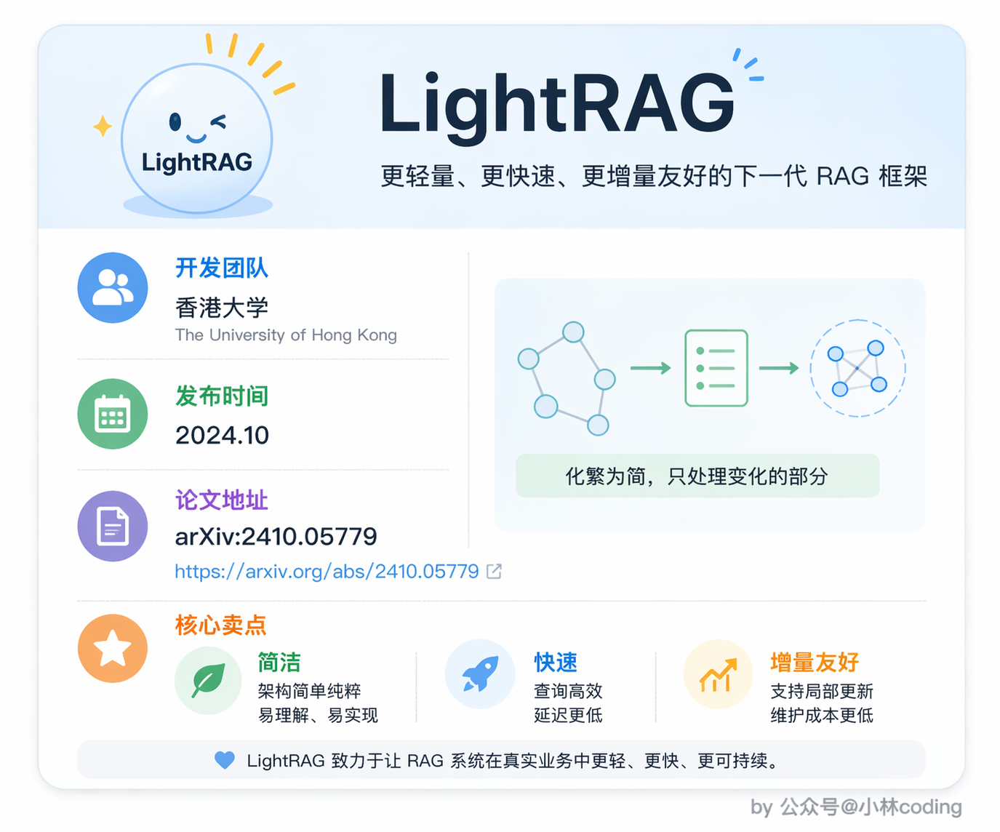

*img*

### 为什么会有 LightRAG？直接原因就是 GraphRAG 的痛

这个问题其实我们前面几章已经铺垫得差不多了。LightRAG 作者在论文里也很直白地点出了他们做这个工作的动机，**就是冲着 GraphRAG 的几个关键问题去的**。

论文讨论了部分图式 RAG 在动态更新和全局查询成本上的局限；这是特定基线和配置下的问题，不等于所有 GraphRAG 实现都只能全量重建或遍历所有社区。

**LightRAG 的目标，就是同时解决这两个问题**。而它解决问题的方式，是引入了三个核心创新。

### LightRAG 的三个核心创新

**创新一：图增强的文本索引（Graph-Enhanced Text Indexing）**

LightRAG 和 GraphRAG 一样，也是用 LLM 从文档里抽实体和关系，构建知识图谱。但它做得**更轻**。

轻的一种体现是**不在索引阶段构建社区摘要**，而保留实体/关系及其检索表示；具体实现仍可能有摘要、全文索引或其他辅助结构。

你可以把 LightRAG 的图理解成 GraphRAG 去掉「社区那层」的轻量版本：

|  | GraphRAG | LightRAG |
| --- | --- | --- |
| 实体抽取 | ✅ | ✅ |
| 关系抽取 | ✅ | ✅ |
| 实体/关系摘要 | ✅ | ✅（更轻量） |
| 社区检测（Leiden） | ✅ | ❌ |
| 社区摘要 | ✅ | ❌ |

省略这些阶段可能显著减少模型调用，但比例不能脱离文本规模、批处理和模型配置引用。

**创新二：双层检索范式（Dual-Level Retrieval）**

这是 LightRAG 最**亮**的创新点。你可能会问：不做社区摘要了，那全局性问题怎么答？

LightRAG 的做法是：**不用提前做全局聚合，而是在查询时把查询本身拆成两层关键词，分别做检索**。

举个例子你就明白了。如果你问「卡托普利的禁忌症是什么？」，低层关键词就是「卡托普利」「禁忌症」这种具体的实体和术语，它关注的是细节。而如果你问「国际贸易如何影响全球经济稳定？」，高层关键词则是「国际贸易」「全球经济稳定」「经济影响」这种抽象的主题和概念，它关注的是更宏观的东西。

拿到这两组关键词之后，LightRAG 就兵分两路。

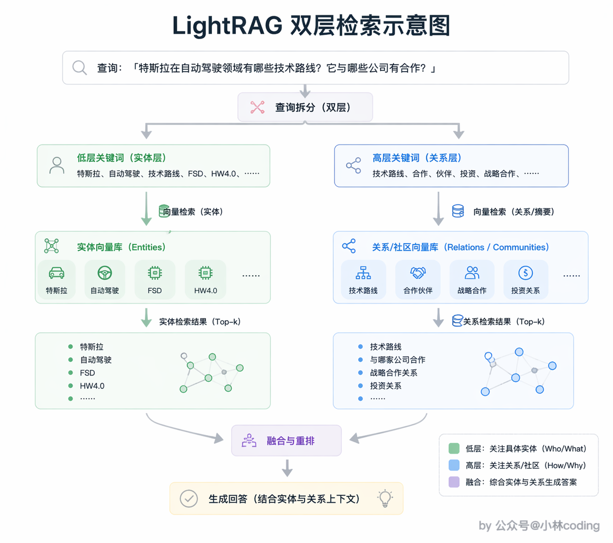

*img*

一路**用低层关键词去向量库里找相关的实体**，另一路**用高层关键词去向量库里找相关的关系**（也就是边的描述）。一个找「点」，一个找「线」，**两种信息合起来组装成上下文**，最后让 LLM 生成答案。

这种双层检索可能把一部分全局聚合成本从离线移到查询时，并减少社区摘要依赖；查询是否只需一次模型调用、成本和延迟能否降低，要按实现和基线实测。

**创新三：增量更新算法**

这是 LightRAG 解决 GraphRAG 最痛那个点的方案。

LightRAG 的增量路径通常是抽取新文档、合并候选实体/关系并更新索引；若实现不依赖社区摘要，可以省掉相应的重建，但仍需处理删除、版本、冲突、来源和索引一致性，不能保证完全不重建。

**如果某个 LightRAG 类 pipeline 不维护社区摘要，就不会产生“社区摘要失效”这一类更新任务**；但它仍要处理实体链接、关系冲突、删除、索引一致性和来源版本。增量索引是否接近传统 RAG 的复杂度，要看具体实现。

### 成本对比：LightRAG 有多便宜？

我们用几组真实数据看一下 LightRAG 到底便宜多少：

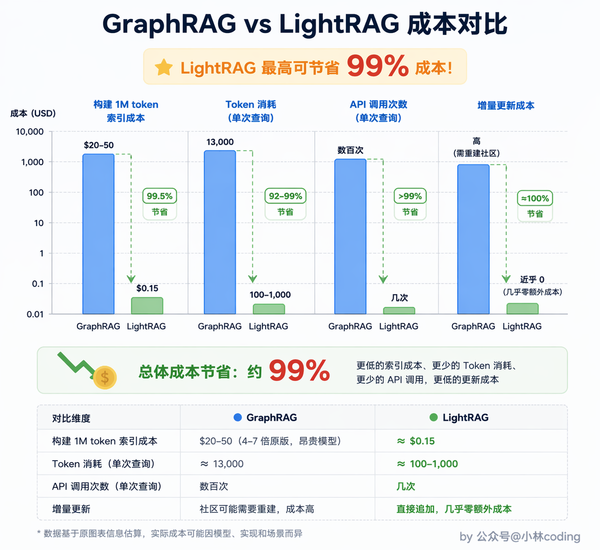

*img*

成本可能下降，但不要把论文/基准中的百分比当作通用承诺；应按目标语料、模型和更新策略重新测量。

### LightRAG 的代价是什么？

当然，天下没有免费的午餐。LightRAG 牺牲了什么呢？

**主要是牺牲了「全局深度洞察」**。

GraphRAG 的社区摘要虽然贵，但它提供的是一种**经过 LLM 加工过的、具有层次抽象的全局知识视图**。对于那种需要深度宏观归纳的问题（比如「这本 500 页的小说整体想表达什么人生哲理？」），GraphRAG 的社区摘要能提供更好的全局洞察。

LightRAG 的双层检索虽然轻量，但本质还是**基于查询去「现场拼凑」** 全局视角，对极其复杂的全局归纳问题，深度可能不如 GraphRAG。

所以**两者的权衡其实很清楚**。如果你追求的是极致的全局深度洞察，而且预算管够，那 GraphRAG 是你的选择；反过来，如果你更在意的是成本可控、增量友好、实时性好，愿意在全局洞察深度上打个折扣，那 LightRAG 就更合适。

好，到这儿你应该已经对 LightRAG 有了一个整体印象。但它的双层检索具体是怎么工作的？它的增量算法在实现层面是怎么做到「零额外成本」的？下一章咱们就来扒一扒 LightRAG 的完整工作流程。

---

## 7、LightRAG 的工作原理是怎样的？

这一章用一个常见实现说明 LightRAG 的索引、查询和增量路径；它是否比 GraphRAG 便宜或更快，要在相同数据、模型和 SLO 下测量。

和 GraphRAG 一样，LightRAG 也分为**索引阶段**（构建知识图谱）和**查询阶段**（双层检索+生成）两大环节。但它的实现细节和 GraphRAG 有很大差异，咱们一步步拆。

### 索引阶段：轻量化的图构建

下面按三类步骤讲解一种实现；代码版本可能增加解析、缓存、索引迁移或校验阶段。

**第 1 步：文档切块（Chunking）**

和 GraphRAG 类似，LightRAG 先把文档切块；块大小和重叠是配置项，应按 tokenizer、文档结构、召回和抽取质量评测。

**第 2 步：实体和关系提取（Entity & Relationship Extraction）**

LightRAG 会用 LLM 从每个文本块里抽实体和关系。每个实体会带上自己的名称、类型（比如是人物、组织还是地点）和一段综合描述；每条关系除了源实体、目标实体、关系描述之外，还会额外生成一个东西，叫「关系关键词」。

这个「关系关键词」是 LightRAG 的一个小巧思，你可以先记着。它描述的是这条关系所代表的主题或概念，比如「张三创立 A 公司」这条关系，对应的关键词可能就是「创业、企业创立」。

为什么要多生成一个关键词呢？这里先埋个伏笔，等到讲查询阶段的双层检索，你自然会明白这个关键词就是后面「高层检索」去命中相关关系的钥匙。

**第 3 步：键值对生成 + 去重（Key-Value Pair Generation & Deduplication）**

这一步是 LightRAG 和 GraphRAG 最大的差别所在。

对于每个实体和关系，LightRAG 会生成一个**键值对（Key-Value Pair）**。所谓 Key，就是一个便于检索匹配的短语，比如实体名或者关系关键词；而 Value 呢，就是一段详细的描述信息，留着后面组装上下文用。

键值对便于把检索键与可读描述关联起来，但实际实现仍可能结合向量/关键词索引、图邻居和原文 chunk；不能说完全省掉嵌入匹配或遍历。

去重/合并也可能发生在这一步，但合并规则由实现决定；同名不一定同实体，异名也可能同实体，必须保留来源和冲突信息。下面的重复次数只是示例。

轻量去重可能更依赖名称或简单规范化，难以覆盖跨语言别名、同名异人和时间版本；多路召回有机会补回遗漏，但不能保证所有相似实体都会被检索到。高风险领域应增加实体链接、来源审查和冲突处理。

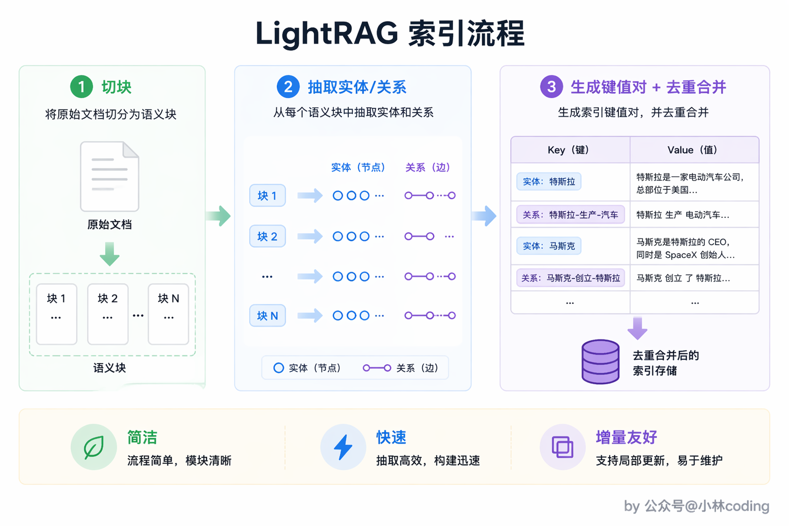

*img*

**最终的存储结构**：

索引后通常会同时保存图结构和检索索引；具体后端（例如内存图、关系库、图数据库、向量库）取决于实现和规模，生产选型要考虑并发、持久化、备份、租户隔离和删除。

与是否保存原文、实体、关系、社区和摘要相比，LightRAG 可能减少预计算结构，但实际系统仍应保留原文引用、索引元数据和可重建信息。

### 查询阶段：双层检索的精髓

索引搞定之后，查询阶段才是 LightRAG 真正的亮点。咱们一步步看。

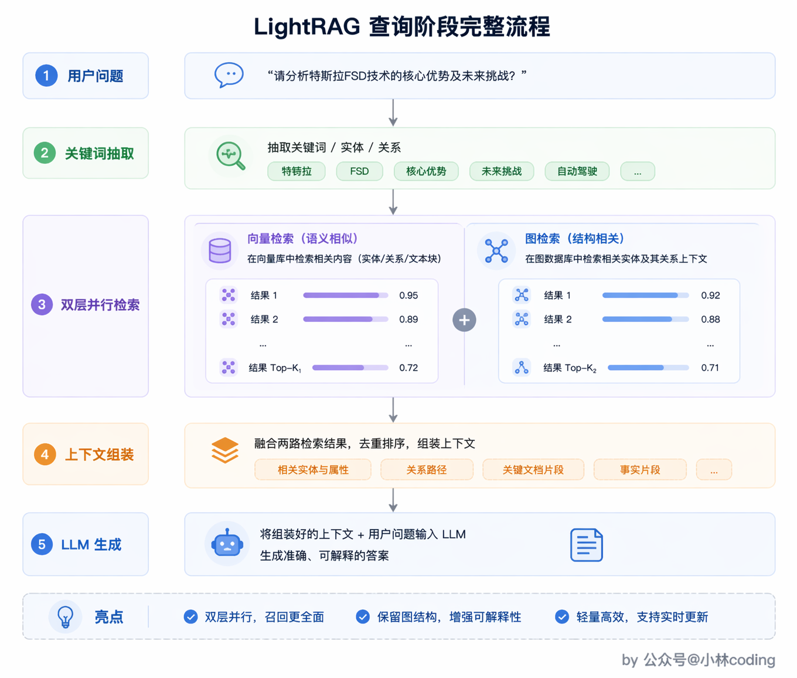

*img*

**第 1 步：关键词抽取（Keyword Extraction）**

一种常见实现会先用模型从问题中抽取两类关键词：低层关键词（Low-level Keywords）关注具体实体/术语，高层关键词（High-level Keywords）关注主题/概念；也可以用规则、查询改写或直接检索，调用次数不是协议要求。

举个 LightRAG 论文里的原生例子：

```plain
查询："国际贸易如何影响全球经济稳定？"

LLM 输出：
{
  "high_level_keywords": ["国际贸易", "全球经济稳定", "经济影响"],
  "low_level_keywords": ["贸易协定", "关税", "货币汇率", "进口", "出口"]
}
```

你看，**高层关键词是抽象主题，低层关键词是具体对象**。这个分层是整个双层检索的基础。

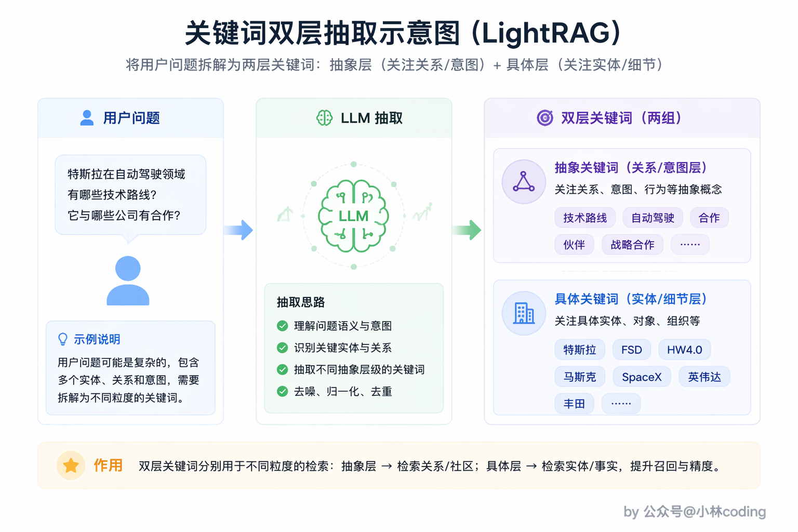

*img*

**第 2 步：双层检索（Dual-Level Retrieval）**

拿到两组关键词之后，LightRAG 会分别做两路检索：

**Low-level 检索**：用低层关键词去向量库里搜**实体节点**。比如用「贸易协定」「关税」这些关键词，找到相关的实体节点（可能是某个具体的贸易协定、某种税种等）。然后从这些入口实体出发，在图上扩展到它们的**一跳邻居**，收集相关的关系和描述。

**High-level 检索**：用高层关键词去向量库里搜**关系边**。比如用「国际贸易」「经济影响」这些关键词，找到相关的关系边（可能是「贸易协定 → 影响 → 国家经济」这类关系）。然后从这些关系出发，聚合它们涉及的实体和更高层的语义。

两路检索可以并行，也可以串行或由路由器选择；一路偏向实体，一路偏向关系只是理解模型。

**第 3 步：上下文组装（Context Building）**

把 Low-level 检索到的实体 + 邻居 + 相关文本块，和 High-level 检索到的关系 + 涉及实体 + 相关文本块**拼在一起**，组装成一段完整的上下文。

这里要控制上下文预算，4000 token 只是示例；应按目标模型窗口、证据覆盖率、输入成本和输出质量配置，并对租户/权限做过滤。

**第 4 步：LLM 生成答案**

把组装好的上下文和原始用户问题一起喂给 LLM，生成最终答案。

### 四种查询模式：灵活应对不同场景

一些实现提供 Naive、Local、Global、Hybrid 等查询模式；名称、默认值和具体检索路径取决于版本：

| 模式 | 用什么检索 | 适用场景 |
| --- | --- | --- |
| Naive（朴素） | 纯向量检索文本块（就是传统 RAG） | 简单事实问答，不需要关系推理 |
| Local（本地） | 只用 Low-level 检索（找具体实体） | 具体实体类问题，比如「这个 API 怎么用」 |
| Global（全局） | 只用 High-level 检索（找关系主题） | 抽象概念、主题归纳类问题 |
| Hybrid（混合） | Low-level + High-level 同时用 | 复杂综合问题，默认推荐 |

Hybrid 可以作为候选起点，但应和 Naive/Local/Global 以及业务基线在同一评测集上比较。

### 增量更新：真正的「轻量友好」

前面我们反复提到 LightRAG 的增量更新很好，具体好在哪？咱们看看它的增量算法做了什么：

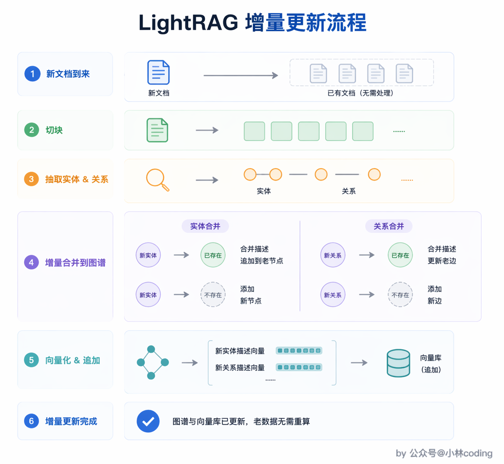

*img*

它的流程其实非常简单。

- 新文档来了，先切块，然后抽实体和关系，这一步只针对新文档，老文档完全不用再碰。
- 接着就是**增量合并**：如果抽出来的实体名字在已有图谱里能找到同名节点，就把新的描述追加或者合并到那个老节点上去；如果是全新的实体，那就添加一个新节点。关系的处理逻辑也一样，已有关系就合并描述，新关系就加条新边。
- 最后一步，把新的实体、关系描述做一下向量化，追加到向量库里。就这样，整个增量过程就完成了。

如果该实现不使用社区层，就不需要重建社区摘要；但增量仍可能触发实体合并、向量更新、删除、关系冲突和索引一致性检查。

因此它可能比需要社区重建的 pipeline 更易增量维护，但成本不会是零，必须按新文档规模、抽取调用和存储更新测量。

**一个细节值得提一下**：LightRAG 目前的增量处理对「语义冲突」并不敏感。比如 Day 1 抽到了「GPT-5.1 是 OpenAI 最新模型」，Day 2 又抽到「GPT-5.2 是 OpenAI 最新模型」，LightRAG 会把两条关系**同时保留**，不会自动判定哪条更新。如果你的业务需要处理这种时效性冲突，得自己在上层加逻辑。

### 一张图总结 LightRAG 的完整工作原理

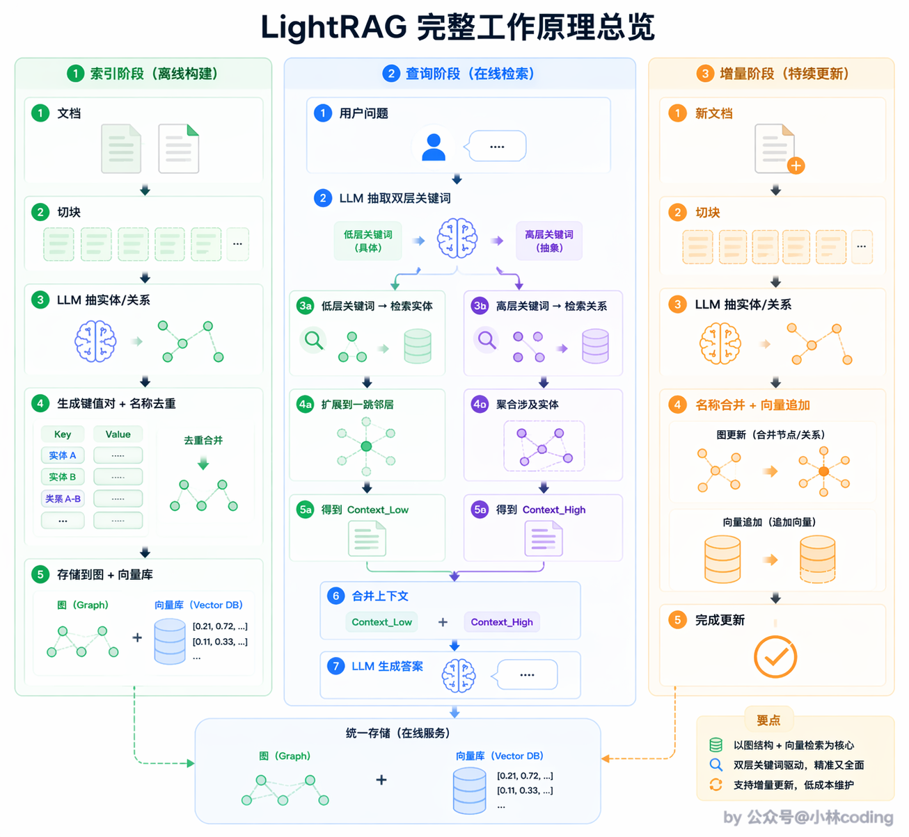

*img*

**索引阶段**：

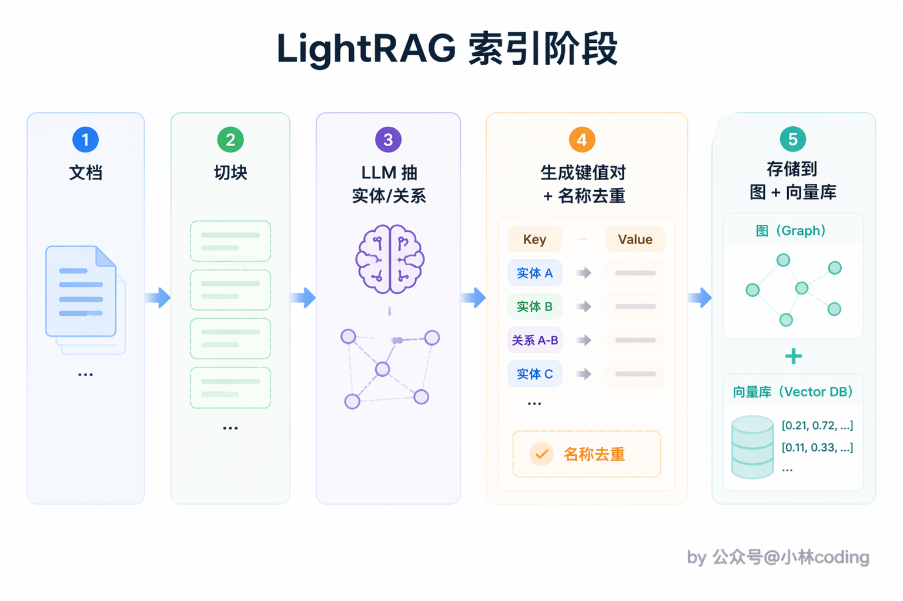

*img*

**查询阶段（Hybrid 模式）**：

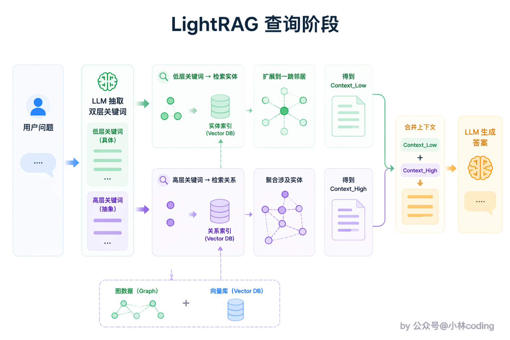

*img*

**增量阶段**：

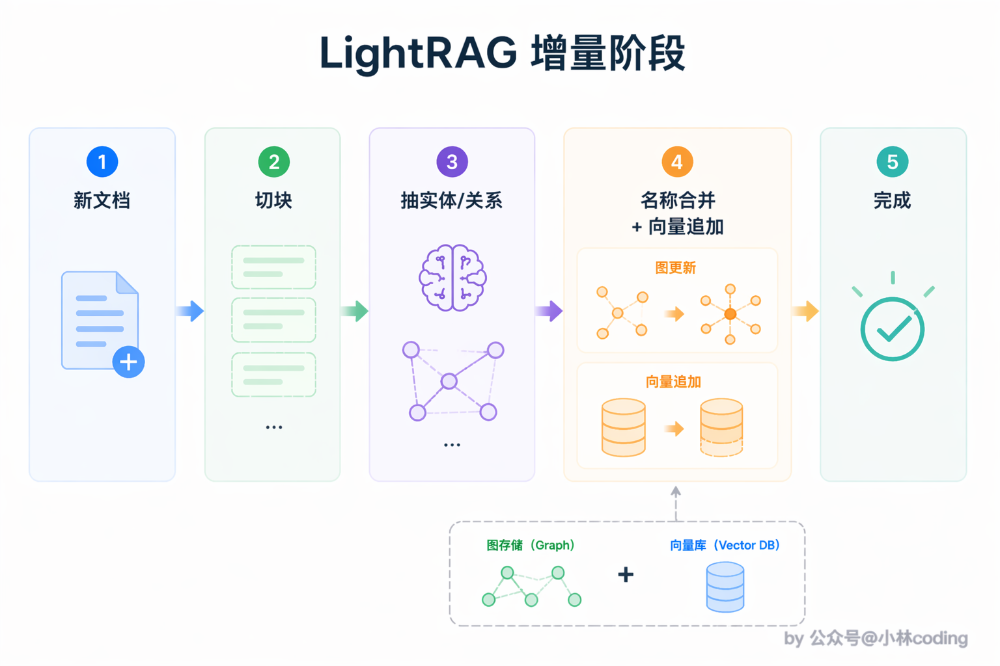

*img*

到这儿你应该已经把 LightRAG 的工作原理搞清楚了。它整体比 GraphRAG 简洁得多，**核心就是用「双层检索」替代了 GraphRAG 昂贵的「社区摘要」**，用「名称去重」替代了复杂的实体消歧。

讲到这儿，两个技术的原理都讲完了，接下来咱们就该做一次完整的对比，看看这两者到底有哪些差异。

---

## 8、LightRAG 和 GraphRAG 有什么区别？

前面几章咱们分别拆解了 GraphRAG 和 LightRAG 的设计哲学、工作原理和核心创新。这一节，咱们来做一次**系统性对比**，把两者的差异说透。

我分几个维度一个一个看。

### 维度一：设计哲学上的分歧

**GraphRAG 的哲学是「预计算全局视角」**，在索引阶段就通过社区检测和社区摘要，把数据集的全局结构「嚼碎了」给你准备好。查询时直接拿现成的摘要用。

**LightRAG 的哲学是「按需检索，延迟聚合」**，索引阶段只做最核心的实体关系抽取，不做全局预计算。查询时通过双层关键词临时拼凑出局部和全局视角。

**打个比方**：GraphRAG 像一个很勤快的图书管理员，在你进图书馆之前已经把每个主题区都写好了概览海报。LightRAG 像一个聪明的助手，你告诉他你想了解什么，他**现场**帮你把相关的书和书之间的关系梳理出来。

**各有取舍**：前者可能把更多计算放在索引期，后者可能把更多聚合放在查询期；查询速度、全局深度和维护成本必须通过基准测试验证。

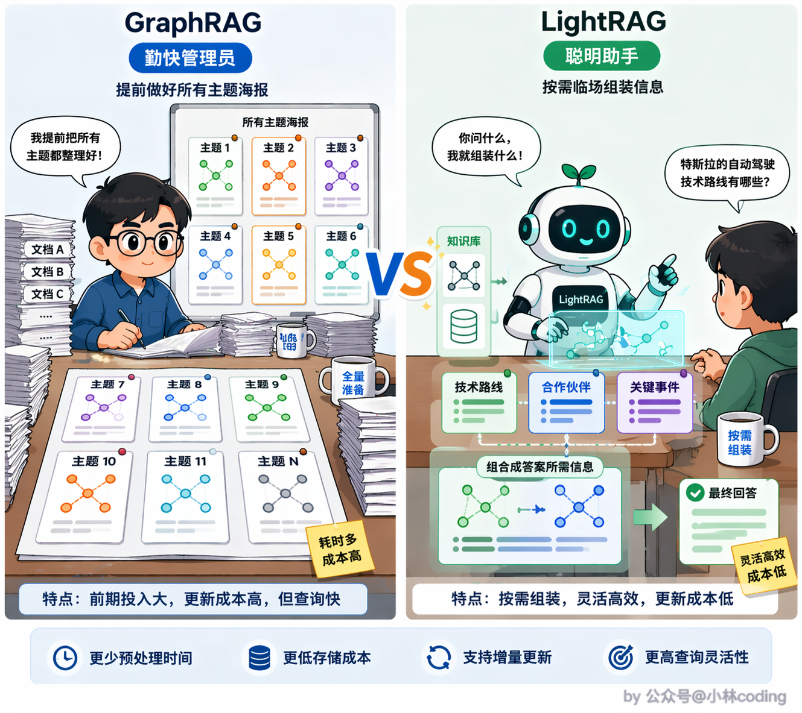

*img*

### 维度二：索引阶段的差异

| 步骤 | GraphRAG | LightRAG |
| --- | --- | --- |
| 文档切块 | ✅ 一样 | ✅ 一样 |
| LLM 抽实体关系 | ✅ 一样 | ✅ 一样 |
| 实体/关系摘要 | ✅ 每个实体/关系都要调 LLM 合成综合描述 | ✅ 有，但更轻（直接 merge） |
| 社区检测（Leiden） | 常见实现使用 | 可能不使用预计算社区 |
| 社区摘要生成 | 可选/常见索引资产 | 通常减少或不预计算 |
| 实体消歧 | 需要复杂策略（字符串 + 向量 + LLM 判别） | **朴素名称匹配**，同名合并 |

**某些 LightRAG pipeline 会省掉或延迟这两个环节**；成本优势不是固定 1% 或更低，需在相同模型、数据、缓存和质量阈值下比较。

### 维度三：查询阶段的差异

先看 GraphRAG 的查询。如果你用的是 Local Search，它会先用向量找到入口实体，然后沿着图遍历扩展，最后组装上下文；如果是 Global Search，则是 Map-Reduce 式地遍历**所有**相关社区的摘要，每个社区生成中间答案，再汇总。

再看 LightRAG 的查询（Hybrid 模式）。一上来先用一次 LLM 把问题拆成双层关键词；低层关键词拿去检索实体，扩展到一跳邻居；高层关键词拿去检索关系，聚合涉及的实体；两路最后合并，交给 LLM 生成答案。

**最大的差别在计算位置与检索对象**：GraphRAG 的 Global Search 可能聚合多个社区报告，LightRAG 的 Hybrid 可能检索实体/关系表示并现场组装；延迟是否低一个数量级不能脱离数据和实现断言。

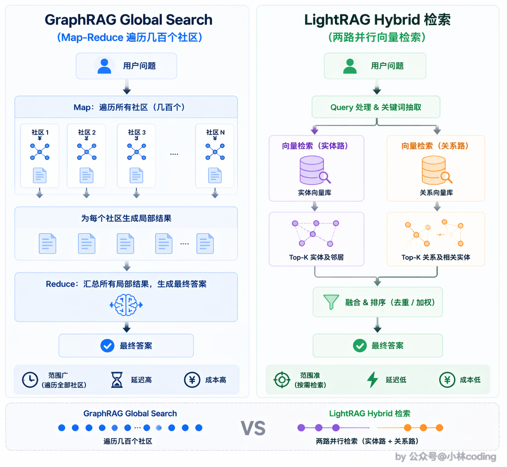

*img*

### 维度四：增量更新能力

| 场景 | GraphRAG | LightRAG |
| --- | --- | --- |
| 新增一份文档 | 可能触发社区重划、摘要重建、向量更新（级联复杂） | 只需抽实体关系 + 名称合并 + 向量追加 |
| 删除一份文档 | 同样会触发级联影响 | 删除对应节点和边即可 |
| 大批量更新 | 通常需要定期全量重建 | 直接增量，不用重建 |
| 时效性冲突处理 | 依赖复杂的版本化和重建策略 | **目前能力较弱**，会同时保留冲突信息 |

**LightRAG 在部分增量场景中可能更容易维护**，但优势要结合实体链接、删除、冲突和质量评测判断。

但要注意，**时效性冲突处理这一点 LightRAG 反而是短板**，如果你的业务场景里有很多「过时被替代」的信息（比如新版产品替换老版），得在上层加逻辑。

### 维度五：成本与性能对比

论文/社区基准中的数字受模型、价格、语料、硬件、缓存和实现版本影响，不能直接当作生产报价。建议用同一数据集建立如下测量表：

| 指标 | GraphRAG 需要关注 | LightRAG 需要关注 |
| --- | --- | --- |
| 索引成本 | 抽取、实体/关系聚合、社区和摘要的模型/存储成本 | 抽取、关键词/关系表示和索引成本 |
| 查询成本 | Local/Global 的候选数、批次、Reduce 和输出 | 关键词抽取、实体/关系召回、上下文和输出 |
| 查询延迟 | p50/p95、扇出并发、限流和缓存命中 | p50/p95、两路召回、图扩展和重排 |
| 增量成本 | 受影响子图、社区/摘要重建和索引一致性 | 实体合并、冲突、删除和索引更新 |
| 质量 | 多跳召回、全局归纳、证据覆盖、事实性 | 实体/关系召回、主题归纳、事实性 |

### 维度六：精度表现（效果谁更好？）

很多人会问：LightRAG 这么便宜，精度是不是不行？

不能只用“便宜”推出“精度不行”或“精度更好”。论文中的数据集、指标、基线和提示配置需要逐项复核；基准胜负不保证迁移到企业语料。应在自己的问题分布上比较召回、证据支持、事实性、延迟和成本。

但咱们也得客观看问题。在**需要极深度全局归纳**的场景下，比如「这本书的终极主题思想是什么」这种问题，GraphRAG 的社区摘要仍然是有优势的；在**实体消歧要求严格**的场景下（像金融合同、医疗诊断这类容错率极低的业务），GraphRAG 那套复杂的消歧策略也更靠谱。

### 一张大表总结所有差异

最后，咱们用一张表把所有维度的对比汇总起来，方便你收藏：

| 对比维度 | GraphRAG 类方案 | LightRAG 类方案 |
| --- | --- | --- |
| 核心思路 | 可预计算社区/摘要，支持局部与全局路径 | 减少预计算，按实体/关系/关键词检索并现场组装 |
| 查询路径 | 可能包含 Local、Global、混合或动态路径 | 常见实现包含 Naive、Local、Global、Hybrid 等 |
| 成本位置 | 较多成本在索引与摘要，也可能有较重全局查询 | 较多成本在抽取与在线召回/组装，具体取决于实现 |
| 增量更新 | 需处理实体、社区/摘要和索引依赖 | 需处理实体合并、冲突、删除和索引更新 |
| 全局归纳 | 预计算摘要可能提供层次化证据 | 现场聚合更灵活，但证据覆盖需评测 |
| 实体消歧 | 可使用多层策略，但成本更高 | 轻量实现可能更依赖名称/简单规范化 |
| 适合的候选场景 | 全局主题、关系遍历且能接受索引维护 | 需要较轻增量路径、成本敏感且能接受在线聚合 |

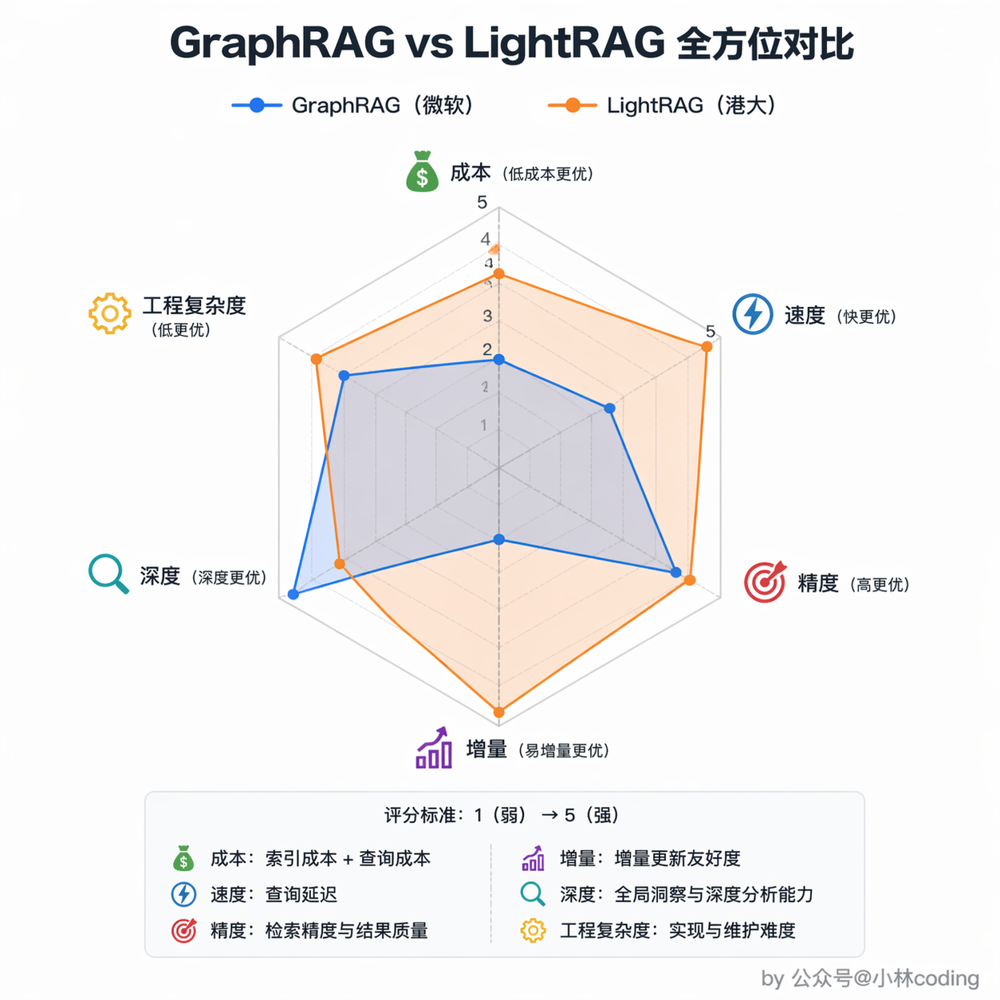

*img*

看完这张对比表，你应该已经对两者的差异心里有数了。但光知道差异还不够，**真正关键的是：什么时候该选哪个？**

接下来两节，咱们就专门聊 GraphRAG 和 LightRAG 各自的适用场景。

---

## 9、什么场景下需要 GraphRAG？

搞清楚了差异，咱们来聊聊**哪些场景真的值得上 GraphRAG**。

这个问题很重要，因为 GraphRAG 往往增加索引、存储和查询链路。如果业务场景用传统 RAG 或 LightRAG 已经达到目标，额外复杂度就未必能换来相应收益；应先用同一评测集核算一次性索引成本、更新成本和查询成本。

**什么场景真的值得？** 我总结下来大概有这么几类。

### 场景一：需要「全局洞察」的深度内容分析

这是 GraphRAG 最核心的主场。典型场景包括：

- **长篇文学作品的主题分析**。比如你要让 AI 分析一部长篇小说整体想表达什么、角色之间的关系网络和不同社会阶层的冲突模式。这种问题通常需要跨章节覆盖和全局归纳；社区摘要可能提供一种组织证据的路径，但仍应回链原文并检查摘要遗漏。
- **多篇研究报告的综述**。例如梳理某个行业多年来的发展脉络或多份白皮书的观点演进。传统 RAG 可能需要查询分解和多轮检索，GraphRAG 则可以用社区或主题摘要组织宏观答案；最终效果取决于语料、抽取质量和评测设计。
- **大规模专利 / 学术论文分析**。比如医药公司想知道「过去五年某个疾病领域的研究热点是怎么演进的」，这需要在数万篇论文上做主题发现和演进追踪，GraphRAG 的层次化社区结构能很好地支持。

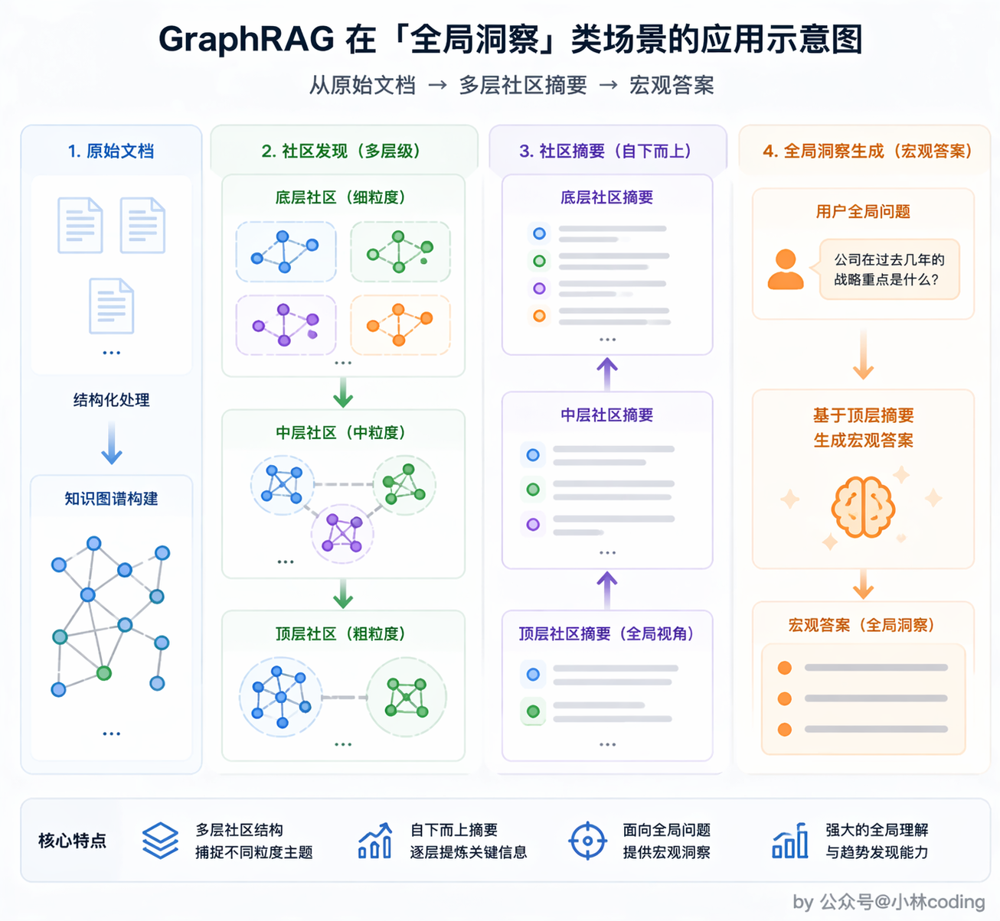

*img*

### 场景二：跨文档多跳推理的高价值场景

这类场景的共同点是：**回答一个问题需要跨多个文档做关系推理，而且答错了代价很大**。

- **合规与审计追踪**。例如关联客户、公司、监管记录和信贷档案。图结构有助于表达关系，但是否能“完整走通”取决于实体匹配、时间条件、权限过滤和来源校验；不能把单篇论文或官方基准的提升幅度直接当作生产保证。
- **医疗诊断辅助**。这类问题需要准确追溯疾病、药物和禁忌症的关系。图式表示可能帮助组织证据，但不能自动避免因果、否定或适用人群错误；高风险场景仍需要权威来源、人工审查和明确的拒答边界。
- **法律案例检索**。案件、判决、法规和判例引用天然具有多层关系，图结构可用于组织检索路径；是否优于带引用的传统 RAG，要以管辖区、时间有效性和证据覆盖评测。
- **金融研报深度分析**。跨实体、跨时间、跨文档的关联推理可能受益于图索引，但不是只有 GraphRAG 才能完成，也可以比较查询分解、结构化数据库和规则查询等方案。

### 场景三：数据相对静态、更新不频繁的知识库

因为 GraphRAG 的增量更新成本高，它最适合那些**建好之后长期服务**的静态知识库。像企业内部的规章制度库、历史档案、法律条文库、已经归档的项目资料、公司的年度研究报告集，这类东西几个月甚至一年才更新一次。

你想想，如果你的数据一年只更新一两次，那花一笔钱建好索引，之后的查询收益是长期的，这笔成本就能慢慢摊薄。

### 场景四：对精度和可解释性要求极高的场景

GraphRAG 还有一个容易被忽略的潜在优势：**更容易组织可追溯证据**。

如果节点、边和摘要都保存了来源、版本、时间和抽取过程，它就有机会把答案追溯到实体、关系和原始文本块。这对于**需要审计追踪的场景**非常关键，但“显式图结构”本身不等于可审计。

比如金融合规，每个决策都必须有据可查；医疗诊断，每个回答都要有明确的医学证据支撑；法律咨询里，每条建议都要能对应到具体的法条或判例；政府政务更不用说，每个答案都必须能追溯回具体的政策文件。

如果 AI 系统回答合规问题却无法追溯证据链，就很难满足高风险场景的审计要求。GraphRAG 的「节点-边-社区」结构可以作为审计索引，但仍需配套来源绑定、访问控制、版本管理、人工复核和输出引用。

### 什么场景下不要上 GraphRAG？

反过来，哪些场景千万不要为了「赶时髦」上 GraphRAG 呢？

如果语料规模较小、问题以单跳事实为主，先用传统 RAG、结构化查询或规则系统建立基线通常更稳妥；如果数据频繁更新、查询有严格实时 SLO 或预算受限，也要先测量增量维护与端到端延迟，再决定是否引入全局摘要。这里没有适用于所有项目的 token 阈值。

**一句话总结**：GraphRAG 更适合被当作一种面向跨文档关系和全局归纳的候选架构。它可能更复杂、更贵，也可能改善证据组织；是否值得使用，要与传统 RAG、结构化查询和其他图式方案在同一数据与 SLO 下比较。

那么**LightRAG 适合的场景**又是什么呢？下一节继续聊。

---

## 10、什么场景下需要 LightRAG？

讲完 GraphRAG 的场景，咱们来聊 LightRAG。LightRAG 的定位其实可以用一句话概括：

它适合那些「想吃图 RAG 的红利，但又扛不住 GraphRAG 的成本和维护负担」的场景。

具体有哪些？咱们分类看。

### 场景一：数据频繁更新的业务

这是 LightRAG 类方案可能有吸引力的场景：数据需要持续增量更新，同时又希望保留实体/关系检索。但不能只凭“增量友好”做决定，还要检查删除、冲突、实体链接和版本化能力。

- **企业知识库的日常维护**。产品发布说明、客户反馈、项目总结和技术方案持续进入时，带社区摘要的 pipeline 可能需要处理受影响的社区和摘要；LightRAG 类方案可以减少部分预计算，但仍需要解析、抽取、索引更新和质量校验。
- **新闻聚合和实时资讯**。高频更新的新闻系统可以比较“增量可写入”与“查询新鲜度”的权衡；能否达到分钟级或更低延迟，取决于模型服务、队列、索引和发布策略，不能由框架名称保证。
- **客户支持系统**。CRM 系统每天都有新的工单、投诉、解决方案记录。LightRAG 的增量友好特性可以让这类动态知识库长期保持新鲜。
- **持续更新的技术文档**。比如 GitHub 开源项目的文档、API 文档、内部技术 wiki，这些东西几乎每天都在变。LightRAG 的「追加式增量」设计就是为这种场景量身定制的。

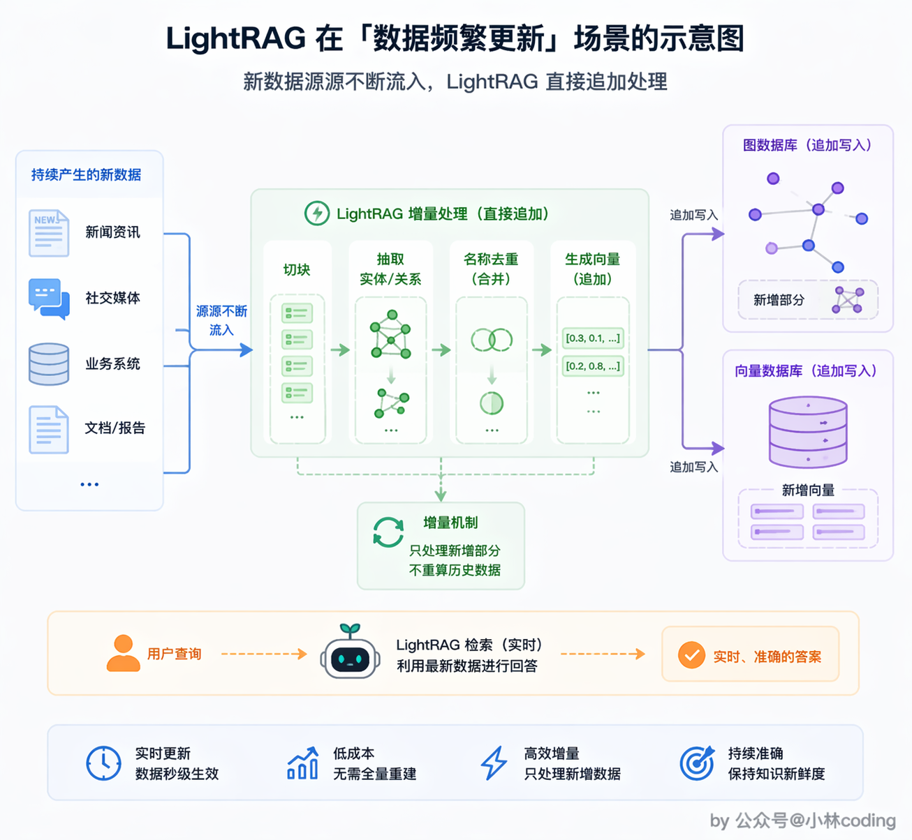

*img*

### 场景二：成本敏感的中小团队和初创公司

**一句话：预算紧张、但又想探索图式 RAG 时，可以把 LightRAG 类方案作为候选**。

创业公司或小团队应先用真实语料测量解析、抽取、嵌入、存储和查询成本；LightRAG 类方案可能减少部分预计算，但不会自动消除模型调用和运维成本。

- **个人知识管理**。有些技术爱好者想把自己的读书笔记、博客收藏、会议记录都做成一个 AI 助手，查询时能引经据典。GraphRAG 成本太高，LightRAG 很合适。
- **教育和学习场景**。老师想把讲义、习题和参考资料做成一个 AI 问答助手。使用本地模型可以减少外部 API 费用，但会转化为本地算力、部署、更新和监控成本；是否适合要按模型质量与硬件测量。
- **SaaS 产品的知识库功能**。如果你做 SaaS，想给每个客户都开一个独立的知识库，GraphRAG 的成本会随着客户数线性放大。LightRAG 的低成本让多租户知识库变得可行。

### 场景三：实时性要求高的 C 端应用

LightRAG 类方案的查询链路可能比带全局社区聚合的方案短，但端到端延迟仍由关键词生成、检索、图扩展、上下文组装、模型首 token 和负载共同决定，应以 p50/p95 和交互 SLO 判断。

- **客服聊天机器人**。用户希望快速看到首个响应，因此应比较不同查询路径的首 token、完整答案延迟和证据质量；不能把固定秒数作为 LightRAG 的承诺。
- **智能客户助手 / AI 助理**。比如你做一个编程助手，用户问「我上次写的那个项目用了什么数据库？」，你希望它能立刻从项目历史记录里找到答案。LightRAG 的双层检索在秒级返回，不会拖累交互节奏。
- **语音交互场景**。语音应用通常更重视首包、分段输出和端到端交互 SLO；图式检索是否适合，取决于是否能在该 SLO 内完成检索、证据校验和流式生成。

### 场景四：轻量部署、本地化环境

LightRAG 类方案的资源需求取决于嵌入模型、生成模型、图/向量存储和并发；在小规模、本地模型或量化配置下，CPU-only 可能可行，但不是框架的普遍保证。

- **边缘设备部署**。比如把 RAG 系统部署到工厂车间的边缘盒子里，帮工人查技术手册。LightRAG 的低资源消耗让这种部署成为可能。
- **私有化内网部署**。对数据隐私要求高的行业可以考虑本地模型和内网索引，但还要审查遥测、依赖下载、日志、模型更新和出网策略；“不出内网”是部署与网络控制结果，不由 RAG 框架单独保证。
- **本地个人 AI 助手**。用 Ollama 跑本地大模型，配合 LightRAG，普通笔记本就能跑起来一个可用的知识库问答系统。

### 场景五：中小规模知识库

从数据规模看：

| 语料规模 | 推荐方案 |
| --- | --- |
| 语料规模与问题类型 | 选型建议 |
| --- | --- |
| 小规模、单跳事实为主 | 先用传统 RAG/结构化查询建立基线 |
| 中等规模、需要实体/关系检索且更新频繁 | 评估 LightRAG 类增量路径，同时测删除、冲突和证据质量 |
| 大规模、跨文档关系或全局归纳明显 | 比较 GraphRAG 类社区摘要、LightRAG 类按需检索和查询分解 |
| 任意规模但高风险/强实时 | 先以证据支持率、审计要求、p95 和成本作为硬约束 |

**中小规模可能是 LightRAG 类方案的试验区间**，但不能只凭 token 数选择；问题分布、更新模式、模型质量和审计要求同样重要。

### 混合架构：两个都要，分而治之

还有一种越来越常见的做法，那就是**混合架构**。具体怎么搭呢？

对于那些稳定的、历史性的核心知识（比如公司规章、法规库），用 GraphRAG 建一次索引，做深度分析；对于动态的、日常变化的增量数据（比如工单、新闻、产品更新），就用 LightRAG 来做实时响应。然后在查询时再搭一个**路由器（Query Router）**，根据查询的类型，把它分流到对应的系统里去。

这种混合架构的好处是能同时享受两者的优势，代价嘛，就是工程复杂度会上升。

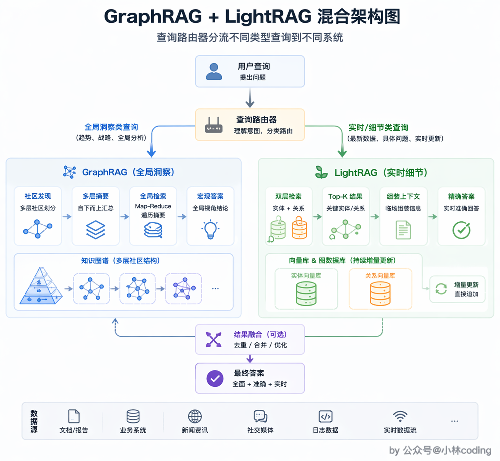

*img*

### 一句话总结

**GraphRAG 是深度分析的重型武器，LightRAG 是日常使用的轻巧刀具**。

一种可行的混合策略是：对稳定的历史知识评估带预计算摘要的方案，对动态数据评估增量友好的方案，再由查询路由器按问题类型分流。覆盖比例应由线上问题集统计，不能预设成固定的 80/20。

---

## 总结

咱们花了很长的篇幅，把 GraphRAG 和 LightRAG 这两个技术从痛点、原理、难点到场景都讲了一遍。最后用一张图把整个脉络串起来：

**RAG 技术的演进线**：

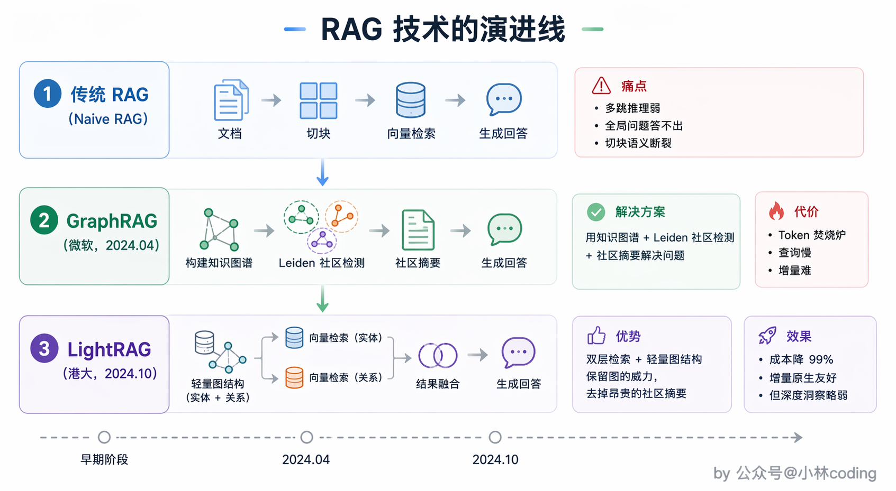

*img*

**一张决策树帮你选型**：

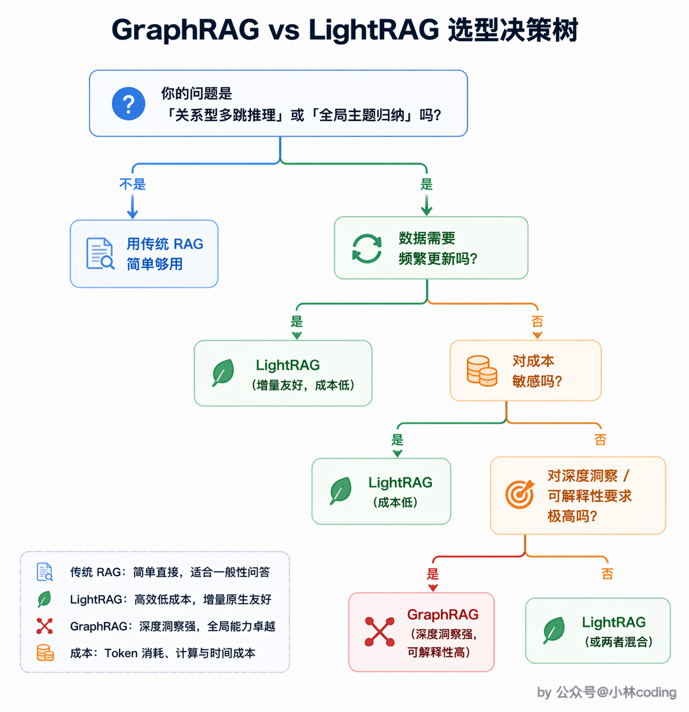

*img*

**最后给一个务实的建议**：

不要一上来就选 GraphRAG 这种「重型方案」。**先用传统 RAG 搭个 MVP，跑一段时间看看用户到底在问什么类型的问题**。如果发现大量问题涉及跨文档关系、全局主题，再考虑升级到 LightRAG。如果 LightRAG 也搞不定你那部分高精度、深度分析的需求，才需要上 GraphRAG。

**RAG 技术的发展，本质上是在「精度」「成本」「速度」「维护」之间不断做权衡**。没有银弹，只有最适合你业务场景的方案。

希望这篇文章能帮你理清 GraphRAG 和 LightRAG 到底是什么、怎么选。

觉得这篇文章对你有帮助，欢迎**点赞、转发**支持一下。

我们下次见！
