# RAG 是什么？RAG 检索增强面试题万字图解

> 原文：[RAG 是什么？RAG 检索增强面试题万字图解](https://xiaolinnote.com/agent/rag/rag.html) · 小林面试笔记


大家好，我是小林。

之前发了一篇「[万字长文图解 Agent 面试题](https://mp.weixin.qq.com/s/82Aj1X1SX1-megVaQ1TcCQ)」，意外收获了很多读者的好评与认可。

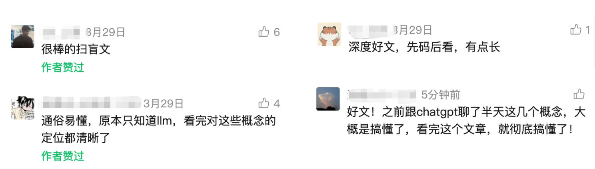

也收到了不少林友的催更，大家都希望我能出一期 RAG 相关的面试题解析，毕竟现在RAG已是面试中的重点考察内容。

但很多同学一聊到 RAG，就只会说「就是给大模型外挂一个知识库嘛」，再深入问几句：RAG 的完整流程是什么？文档怎么切分？向量数据库怎么选？什么是 Re-rank？什么是多路召回？怎么评估 RAG 的效果？

一连串的问题，就卡壳了。

为了帮大家解决这个痛点，我特意收集了近期大厂RAG高频面试题，整理如下：

- 🌟什么是 RAG？
- 🌟RAG 整体工作流程是怎样的？
- 🌟微调和 RAG 各自区别是什么？
- 🌟RAG 中的文档切割策略有哪些？
- 🌟Re-rank 是什么？
- 🌟Embedding有哪几种算法你了解过吗？
- 🌟什么是向量数据库？有没有做过向量数据库的对比选型？
- 🌟什么是多路召回？具体怎么做？
- 🌟怎么量化你的 RAG 效果？
- 🌟什么是大模型幻觉？怎么降低幻觉？

别急，今天这篇文章，我就用最通俗易懂的方式，把 RAG 相关的核心知识一次性给你讲透。

这些也是面试中经常会被问到的高频问题，搞懂了不仅能应付面试，更能帮你真正理解企业级 RAG 系统的设计思路。

废话不多说，直接开始。

---

## 1、什么是 RAG？

聊 RAG 之前，咱们得先搞清楚一个问题：**大模型为什么需要「外挂」？**

### 大模型的「知识困局」

你有没有遇到过这样的情况：问 ChatGPT 一个你们公司内部的问题，比如「我们公司今年的年假政策是什么」，它要么告诉你「我无法获取你们公司的内部信息」，要么就开始一本正经地编答案，说得头头是道，但全是错的。

这就是大模型的第一个困境：**参数知识不是实时数据库**。训练数据、模型版本和产品部署决定了它能否覆盖某个时间点之后的信息；具体知识截止时间不能脱离模型版本和服务说明来假定。因此，涉及最新状态时，应用应把时效性知识放到可更新的数据源中并保留时间戳。

第二个困境是：**大模型不知道你公司的私有数据**。你公司的产品文档、内部规章制度、客户信息、项目资料……这些数据从来没有出现在大模型的训练集中，它怎么可能知道？

第三个困境是：**大模型会「幻觉」**。所谓幻觉，就是大模型会非常自信地说出一些听起来很专业但完全是编造的内容。你问它一个不存在的研究论文，它能给你编出一个标题、作者、摘要、甚至 DOI 号，看起来像模像样，但全是假的。这在需要高准确性的场景（比如医疗、法律、金融）中，是不可接受的。

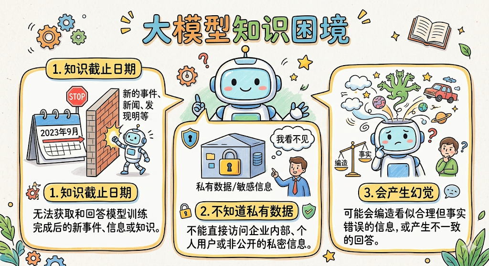

*img*

### 那怎么办？给大模型「开卷考试」

理解了这三个困境，你就能理解 RAG 要解决什么问题了。

打个比方。大模型就像一个参加了「闭卷考试」的学生，所有知识都得靠脑子记。但这个考试有个问题：题目会问到最新的知识（知识截止日期）、会问到课本上没有的内部资料（私有数据），而且这个学生还会「编答案」（幻觉）。

那怎么解决？最直觉的办法就是**给他开卷考试**，允许他翻参考书。

RAG 就是这个思路。RAG 的全称是 **Retrieval-Augmented Generation**，翻译过来就是「检索增强生成」。核心思想非常简单：

1. 先从外部知识库或其他授权数据源中**检索（Retrieval）** 出和用户问题相关的资料
2. 把检索到的资料作为**增强（Augmented）** 上下文，和用户的问题一起给到大模型
3. 大模型基于这些真实的资料来**生成（Generation）** 回答

这样一来，回答有机会以检索到的证据为依据；但文档可能过期、错误或被错误解析，模型也可能忽略或曲解它们。知识更新、私有数据访问和事实性提升都需要数据权限、索引更新、引用校验和拒答策略配合，不能由 RAG 自动保证。

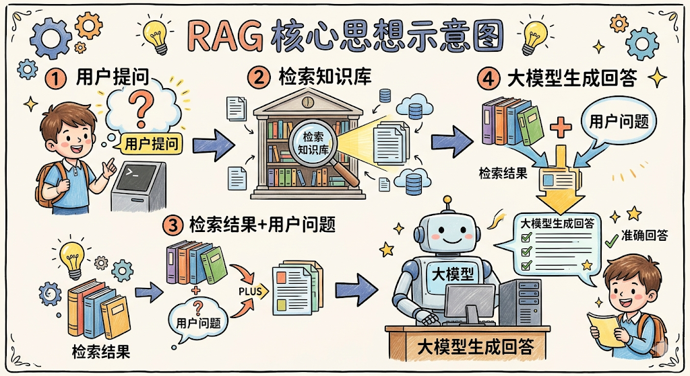

*img*

### RAG 这个概念是怎么来的？

RAG 这个概念最早是由 Facebook（现 Meta）的研究团队在 2020 年提出来的。

简单来说，他们提出了一个思路：在模型回答问题之前，先从外部文档中检索出相关的内容，再把检索到的内容作为参考喂给模型，让模型基于这些内容来生成回答。

但说实话，早期 RAG 更多是研究概念；随着大模型应用增加，检索外部知识、降低知识时效性和私有数据接入的需求显著增长。RAG 可以缓解其中一部分问题，但不能替代数据治理、权限系统或领域评测。

在许多企业知识问答和文档应用中，RAG 是常见架构选项；是否需要它仍取决于知识更新、可追溯性、延迟、合规和成本，不是所有大模型应用都必须接入 RAG。

### RAG 不是万能的

聊到这里，你可能觉得 RAG 好像什么都能解决。但等一下，**RAG 真的万能吗？** 答案显然不是。它解决的是「大模型缺乏特定知识」的问题，但它不能：

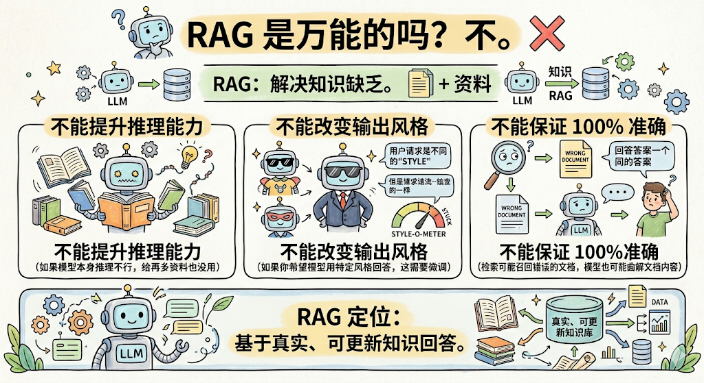

*img*

- 直接替代大模型自身的推理与表达能力（资料充足也不等于模型一定能正确组合）
- 自动满足特定输出风格（可用 Prompt、结构化输出、微调或后处理组合控制）
- 保证 100% 的准确性（检索可能召回错误的文档，模型也可能曲解文档内容）

所以 RAG 更准确的定位是：**一种让大模型基于真实、可更新的知识来回答问题的技术方案**。它和微调、Prompt Engineering 等技术是互补的，而不是替代关系。

---

## 2、RAG 整体工作流程是怎样的？

搞清楚了 RAG 是什么，下一步自然就是：**RAG 系统到底是怎么运转的？**

很多同学对 RAG 的理解停留在「就是检索+生成」这个层面，但真正要搭建一个 RAG 系统，远比这复杂。一个完整的 RAG 系统通常分为**索引阶段（离线/异步）**和**查询阶段（在线）**，并需要把权限、版本、引用、错误处理和评估纳入边界。

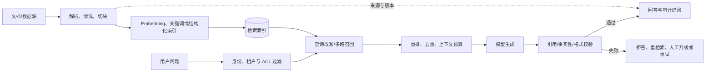
```mermaid
flowchart LR
    A[文档/数据源] --> B[解析、清洗、切块]
    B --> C[Embedding、关键词或结构化索引]
    C --> D[(检索索引)]
    Q[用户问题] --> P[身份、租户与 ACL 过滤]
    P --> R[查询改写/多路召回]
    D --> R
    R --> K[重排、去重、上下文预算]
    K --> G[模型生成]
    G --> V[引用/事实性/格式校验]
    V -->|通过| O[回答与审计记录]
    V -->|失败| E[拒答、重检索、人工升级或重试]
    B -.来源与版本.-> O
```

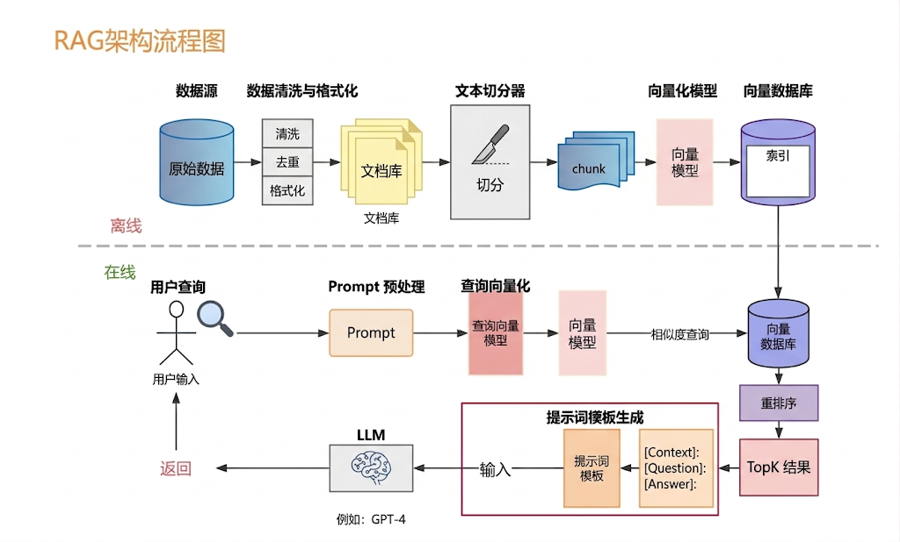

*img*

### 先用一个生活化的例子来理解

在讲技术流程之前，咱们先用一个生活化的例子来理解。

想象你在准备一场开卷考试。考试前，你需要先把所有参考书整理好：给每本书贴上标签、做目录索引、把重点内容标注出来。这就是「索引阶段」，它是在考试前完成的准备工作，不需要实时响应。

考试开始了，你拿到一道题目，你会怎么做？首先理解题目在问什么，然后在参考书中快速找到相关的章节，接着阅读找到的内容，最后基于这些内容组织你的答案。这就是「查询阶段」，它是实时进行的，需要快速响应。

RAG 的工作流程和这个一模一样。

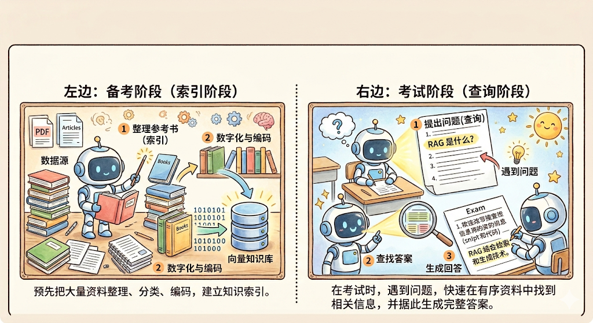

*img*

### 索引阶段：把知识「整理好」

索引阶段的目标是把各种非结构化的文档，变成可以被高效检索的形式。这个阶段通常包括以下几个步骤：

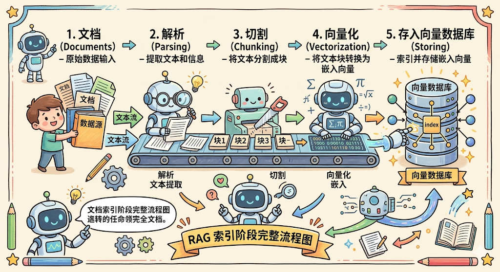

*img*

**第一步：文档加载**

这一步是把各种格式的文档加载进来。企业里的文档格式五花八门，PDF、Word、Excel、PPT、HTML、Markdown……每种格式都有不同的解析方式。比如 PDF 就比较麻烦，尤其是包含表格、图片、多栏排版的 PDF，解析起来很费劲。这一步的目标是把各种格式的文档统一转成纯文本。

**第二步：文档切割（Chunking）**

文档加载完之后，通常不会把整批文档直接放入一次请求，因为上下文窗口、注意力成本和检索精度都有限。因此需要把长文档切成文本块（Chunk）；块大小应按 tokenizer、文档结构、查询类型和上下文预算实验确定。

但切割这个事情没有看起来那么简单。你如果机械地按固定长度切，很可能一句话被切成了两半，或者一个完整的段落被拆开了，这样检索的时候就会丢失上下文。所以文档切割策略是 RAG 系统中非常关键的一环，后面我会专门用一整节来讲。

**第三步：向量化（Embedding）**

文本块切好之后，下一步是把每个文本块转换成一个数学向量（一串数字）。这个步骤叫 Embedding（嵌入）。你可以这样理解：Embedding 模型把一段文本「翻译」成了一个高维空间中的坐标点，语义相近的文本在这个空间中的距离也相近。

比如「今天天气很好」和「今天阳光明媚」这两句话意思差不多，它们经过 Embedding 之后，在向量空间中的距离就会很近。而「今天天气很好」和「Python 是一种编程语言」意思差很远，在向量空间中的距离也会很远。

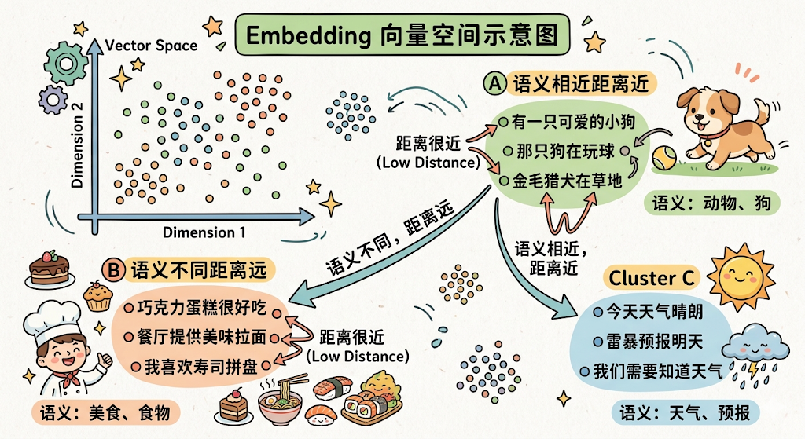

*img*

**第四步：存入向量数据库**

最后一步，就是把所有文本块的向量存入向量数据库。向量数据库是专门用来存储和检索向量的数据库，它能高效地进行「相似度搜索」，也就是给你一个查询向量，它能快速找到和它最相近的 Top-K 个向量。

这一步完成的是一个可检索索引；还需要保留原文位置、来源、版本、访问标签和更新时间，才能做引用、权限过滤、增量更新与审计。

### 查询阶段：让大模型「翻书找答案」

知识库建好之后，当用户提出问题时，就进入查询阶段。

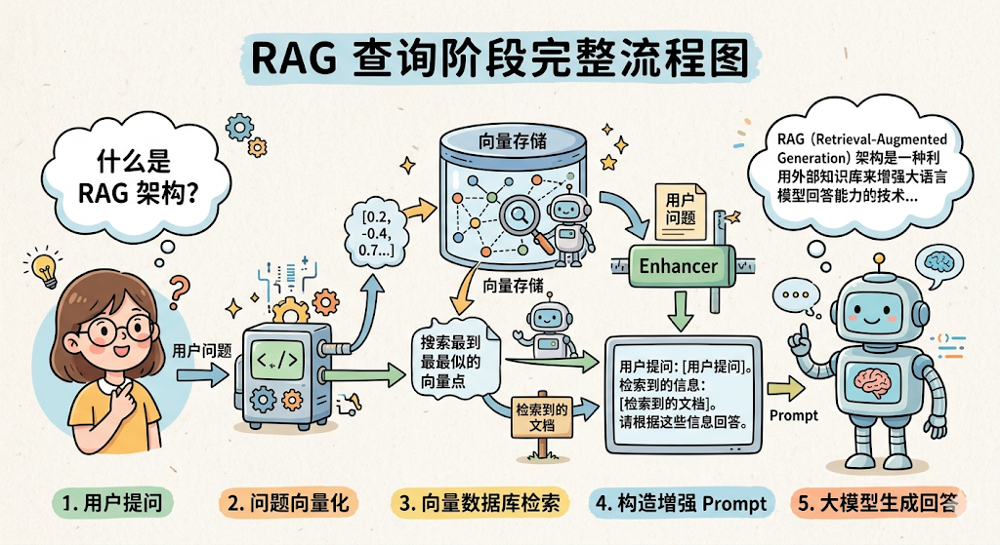

*img*

**第一步：用户提问向量化**

用户提出一个问题，比如「公司年假政策是什么」。系统首先用同样的 Embedding 模型，把这个问题也转换成一个向量。

**第二步：相似度检索**

拿着问题的向量，去向量数据库中进行相似度搜索，找到和这个问题语义最相近的 Top-K 个文本块。比如可能检索出了这样几个文本块：

- 「公司全职员工入职满一年后享有 10 天带薪年假」
- 「年假可以拆分使用，每次不少于半天」
- 「未使用的年假可以累积到下一年，但最多累积 5 天」

**第三步：构造增强 Prompt**

把检索出来的文本块和用户的原始问题拼在一起，构造一个增强版的 Prompt。大概长这样：

「请根据以下参考资料回答用户的问题。参考资料：[检索出的文本块]。用户问题：公司年假政策是什么？」

**第四步：大模型生成回答**

把增强版的 Prompt 发给大模型，大模型基于这些参考资料生成回答。参考资料能约束回答范围，但不保证模型一定引用正确；高风险场景还应校验引用、冲突和不确定性。

### 完整流程一览

把索引阶段和查询阶段合在一起，就是 RAG 的完整工作流程：

- 索引阶段（离线）：文档加载→文档切割→文本向量化→存入向量数据库
- 查询阶段（在线）：用户提问→问题向量化→向量检索→构造增强Prompt→大模型生成回答

这是最基础的 RAG 流程，也常被称为 **Naive RAG**（朴素 RAG）。

在实际生产中，为了提升效果，还会加入查询改写、多路召回、重排序（Re-rank）等高级技术，这些后面都会讲。

---

## 3、微调和 RAG 各自区别是什么？

了解了 RAG 的基本概念和工作流程后，你可能会有一个疑问：**想让大模型学会新知识，不是还可以用微调吗？那 RAG 和微调到底有什么区别？什么时候该用哪个？**

这个问题非常重要，也是面试中的高频问题。

### 先搞清楚什么是微调

微调（Fine-tuning），简单来说就是拿一个已经预训练好的大模型，用你自己的数据对它进行进一步的训练，让它在特定领域或特定任务上表现更好。

打个比方。大模型预训练完之后，就像一个高中毕业生，知识面很广，语数外理化生样样都懂一些。但如果你要让他当一个专业的医生，就需要送他去医学院继续学习，这个过程就类似于「微调」。


*img*

微调的方式也有不同的级别。

- 最重的方式是**全量微调**，也就是更新模型的大部分或全部参数；资源和数据需求通常更高，但效果仍取决于任务、数据与训练方案，并非天然最好。
- 比较轻量的方式叫**参数高效微调**，比如 LoRA，它训练低秩适配器而冻结主体参数，通常能降低训练显存和存储压力；能否在消费级显卡上运行取决于模型规模、量化、序列长度和 batch 配置。
- 还有一种叫**指令微调**，是用「指令-回答」格式的数据来微调，目的是让模型学会听懂指令、按指令来回答，而不是自由发挥。

### 用一个最直观的类比来理解区别

网上有个类比我觉得非常好，分享给大家。

**微调**相当于让模型去上了一门课，知识已经「内化」到脑子里了。考试的时候是**闭卷考试**，模型靠「记忆」来回答。但记忆可能会出错，而且新知识需要重新上课（重新训练）。

**RAG** 则相当于给模型配了一个参考书架，考试的时候是**开卷考试**，模型可以翻书找答案。参考书可以随时更新，新增知识不需要重新训练模型。

这个类比把两者的核心区别说得非常到位。

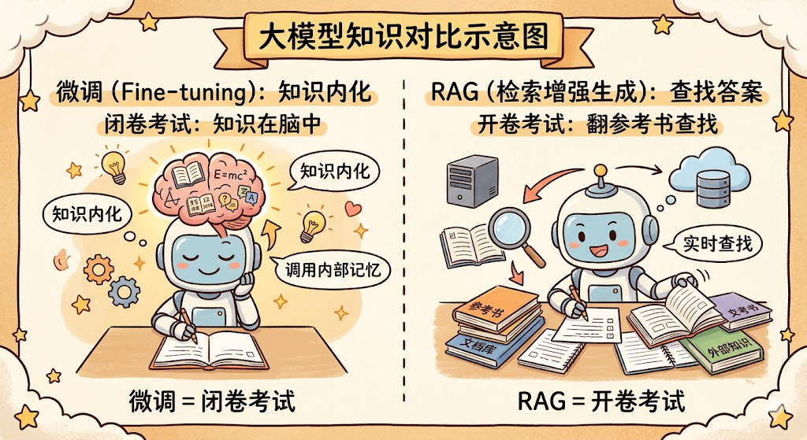

*img*

### 核心维度的对比

接下来咱们从几个关键维度来对比一下。

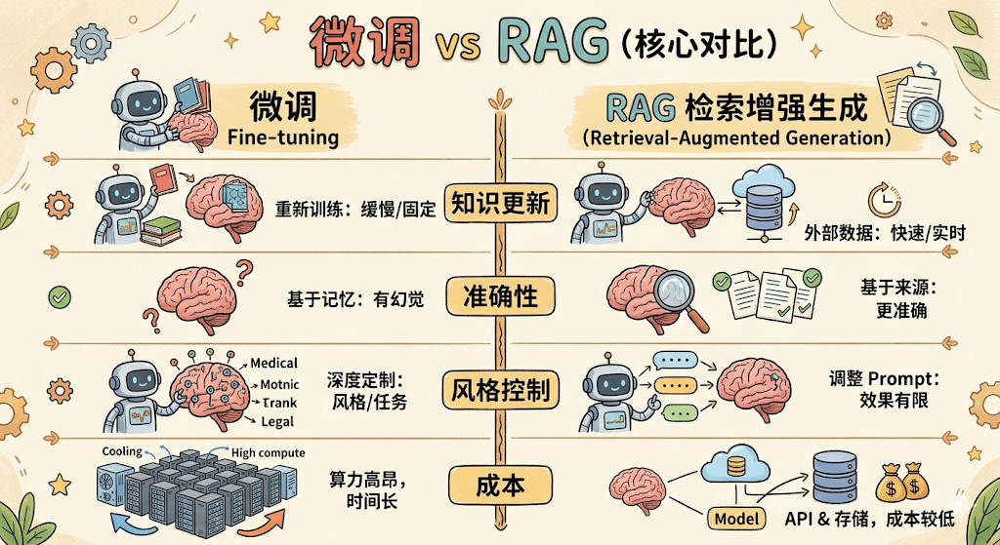

*img*

**知识更新方式**

这是两者的重要差异。把新事实写入模型参数通常需要继续训练或微调，而 RAG 可以通过更新文档、索引和版本元数据接入新知识；更新仍涉及解析、权限、删除、缓存失效和发布校验，不一定实时或低成本。

**准确性**

微调会改变参数中的行为倾向、格式或知识表现，但不会让模型严格复述训练数据。RAG 提供可外置、可引用的证据路径，但检索、解析和生成任何一环出错都可能导致错误；两者的准确性应按同一测试集比较。

**语言风格控制**

这个维度反而是微调的强项。如果你希望模型用文言文回答、用特定的客服话术回答、模仿某个名人的说话方式，微调能做到。因为它在训练过程中就学会了这种风格。RAG 对输出风格的控制能力就比较有限了，检索到的内容只是给模型的「参考」，但模型最终怎么组织语言，还是取决于模型本身。

**成本**

两者的成本结构不一样。微调的初始成本高，你需要准备大量高质量训练数据、租 GPU 资源，但推理阶段的成本相对较低，因为不需要走检索流程。RAG 正好反过来，初始成本低，不需要训练模型，建个知识库就行，但每次查询都有检索开销，token 消耗也更多，因为你得把检索到的文档都塞进 Prompt 里。

### 什么时候用微调，什么时候用 RAG？

说了这么多对比，到底该怎么选？我直接说说我的看法。

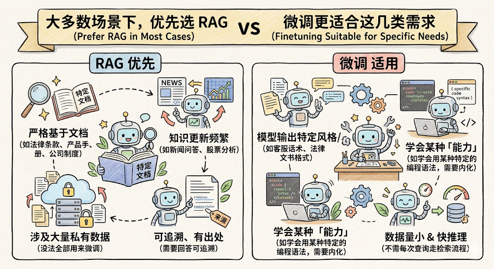

*img*

**需要外部、可更新或可追溯知识时，优先评估 RAG。** 例如法律条款、产品手册、公司制度和私有文档问答；但高风险系统还需要权威数据源、权限、引用校验和人工流程，不能只因为接入 RAG 就视为合规或准确。

**微调可用于稳定的行为、格式、领域术语或任务能力。** 具体收益取决于训练数据和基线；如果事实经常更新、必须逐条引用，仍应保留 RAG 或其他外部数据路径。

生产中也常见**微调 + RAG 结合**：前者改善行为、格式或领域适配，后者提供外部事实和引用。是否优于单独方案，仍需按质量、延迟、成本和运维复杂度评估。

这就好比先送员工去培训（微调），让他学会这个行业的专业知识和做事方式；再给他配一个可随时查询的资料库（RAG），让他能随时查到最新的信息。

---

## 4、RAG 中的文档切割策略有哪些？

前面讲 RAG 工作流程的时候提到过，文档切割（Chunking）是索引阶段非常关键的一步。这一步做得好不好，直接决定了后面检索的质量，进而影响最终回答的准确性。

那文档切割到底有哪些策略？各有什么优劣？咱们来展开聊聊。

### 为什么文档切割这么重要？

先问一个基本的问题：**为什么不直接把整篇文档存进去，非要切成小块？**

最根本的原因是一次请求的**上下文预算有限**。虽然一些模型支持很长的上下文，但具体上限、计费、性能和接口限制会随模型与服务版本变化；知识库通常仍需检索、压缩和分层加载，以控制上下文成本和噪声。

而要检索，就得先把文档切成小块，这样才能精确匹配到和用户问题最相关的那个片段。如果你不切割，整篇文档作为一个检索单元，那用户问「公司年假多少天」，你可能会把整个 100 页的员工手册都检索出来，大模型的上下文窗口根本装不下。

但切割这个事有个两难：

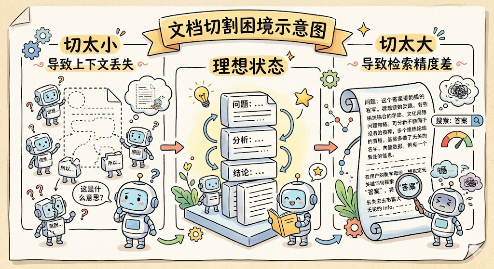

*img*

- **切得太小**：每个文本块信息太少，可能丢失上下文。比如把「公司全职员工入职满一年后享有 10 天带薪年假」切成「公司全职员工入职满一年后享有」和「10 天带薪年假」，第一块根本不知道在说什么。
- **切得太大**：每个文本块信息太多，检索精度下降，而且浪费大模型的上下文窗口。

所以，**怎么切、切多大、在哪切**，就成了一门学问。

### 策略一：固定大小切割

最简单粗暴的方法，就是按照固定的字符数或 token 数来切。比如每 500 个字符切一块。

这个方法的好处是简单、可预测、容易实现。但缺点也很明显：它完全不考虑文本的语义和结构，很可能把一句话或一个段落从中间切开。

比如下面这段话：

「公司全职员工入职满一年后享有 10 天带薪年假。年假可以拆分使用，每次不少于半天。」

如果按固定 30 个字符来切，可能会切成：

- 「公司全职员工入职满一年后享有 10」
- 「天带薪年假。年假可以拆分使用，每次不」
- 「少于半天。」

这就完全破坏了语义。

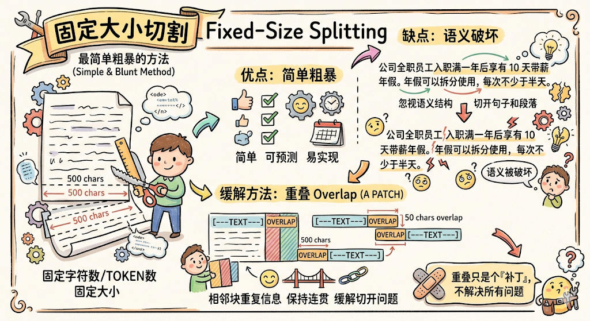

*img*

为了缓解这个问题，通常会引入**重叠（Overlap）**，也就是相邻的两个文本块之间有一段重复的内容。比如每个块 500 字符，重叠 50 字符，这样即使句子被切开了，相邻块之间还有一部分重复信息可以保持连贯。

不过重叠也不能解决所有问题，只能算是一个「补丁」。

### 策略二：递归字符切割

这是常见的切割策略之一；`RecursiveCharacterTextSplitter` 是某些框架提供的实现，分隔符、长度单位和重叠配置仍需按语言与文档类型调整。

它的核心思想是：**按照文本的自然边界来切，而不是死板地按字符数切。**

具体来说，它维护一个分隔符的优先级列表，比如 `["\n\n", "\n", "。", "！", "？", "；", "，", " "]`。它会先尝试用双换行符（段落分隔符）来切，如果切出来的块还是太大，就用单换行符来切，如果还是太大，就用句号来切……依次类推，直到块的大小符合要求。

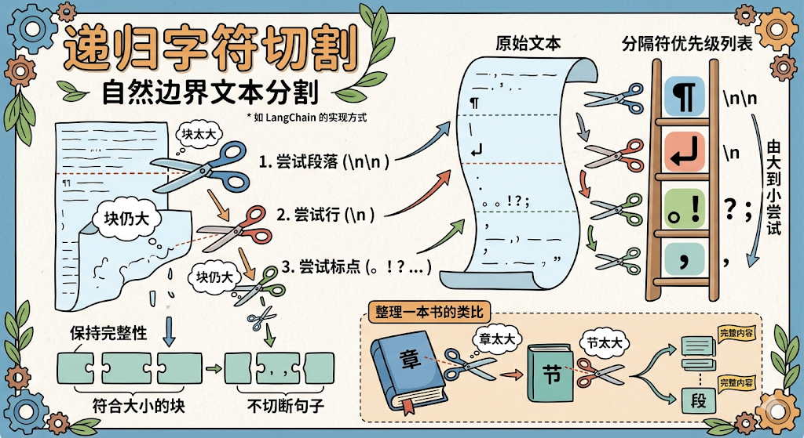

*img*

这样做的好处是，它尽量**保持段落、句子、短语的自然完整性**，不会把一句话从中间切开。

打个比方，这就像你整理一本书的时候，先按「章」来分，一章太大的话就按「节」来分，一节太大的话就按「段」来分。这样分出来的结果，每块内容都是相对完整和独立的。

### 策略三：基于文档结构的切割

这种方法是利用文档本身的格式结构来切割。

比如 Markdown 文档，可以按照标题层级来切：一级标题下面是一块，二级标题下面是一块。这样切出来的内容天然具有语义完整性。

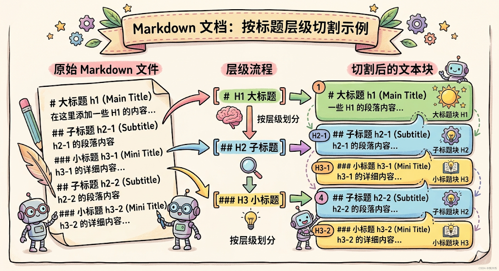

*img*

再比如代码文件，可以按函数、类来切。HTML 可以按标签来切。PDF 可以按页面来切。

这种方法的好处是**充分尊重文档的结构**，切出来的块语义完整。但缺点是只适用于格式规范的文档，如果文档本身结构混乱，或者没有明显的格式标记，就不太好用了。

### 策略四：语义切割

前面三种方法都是基于「规则」的，不管内容是什么，都按照预设的规则来切。语义切割则不一样，它是基于内容的**语义相似度**来决定在哪切。

核心思想是：**把语义相似的句子放在一起，语义发生转折的地方就是切割点。**

具体怎么做呢？先把文档按句子切分，然后计算相邻句子之间的语义相似度（用 Embedding 模型把句子转成向量，然后计算余弦相似度）。如果相邻句子的相似度很高，说明它们在讨论同一个话题，应该放在同一个块里；如果相似度突然下降，说明话题发生了转变，这里就是一个切割点。

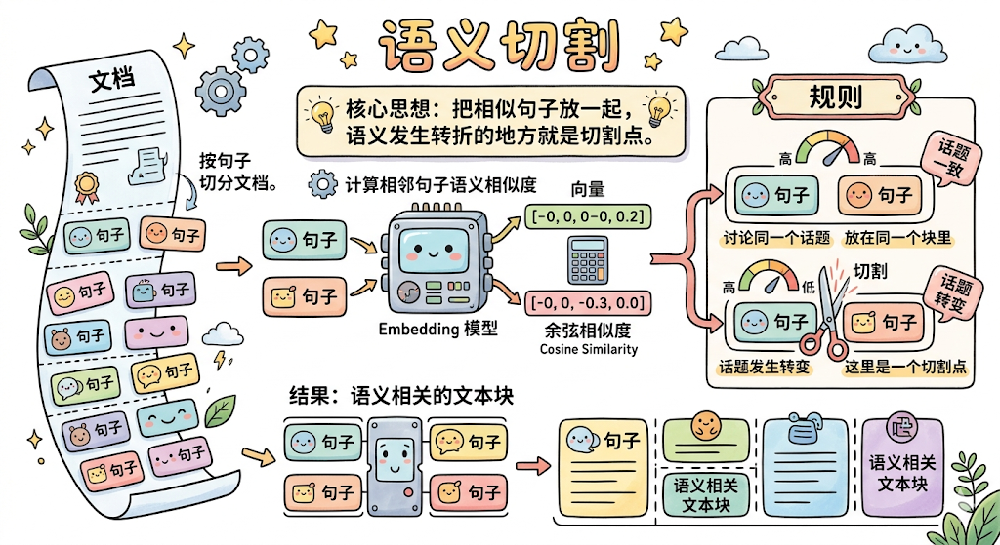

*img*

打个比方，一篇文章前半段在讲「TCP 三次握手的原理」，后半段在讲「UDP 协议的特点」。这两个话题虽然都属于网络协议，但语义上有明显的转变。语义切割就能识别出这个转变点，在前半段和后半段之间切一刀。

这种方法可能更贴合话题边界，但不保证质量最高；它需要额外的句子切分、Embedding 和阈值调参，成本与收益应通过检索评测比较。

### 策略五：Agent 驱动的智能切割

这是一种可选的实验性方法：用 LLM 辅助判断块的边界或完整性。

具体做法是：先用上述方法生成初始的文本块，然后用 LLM 来审视每个块，判断这个块的内容是否完整、是否需要和相邻的块合并或拆分。LLM 充当一个「智能编辑」的角色，根据对内容的理解来做出切割决策。

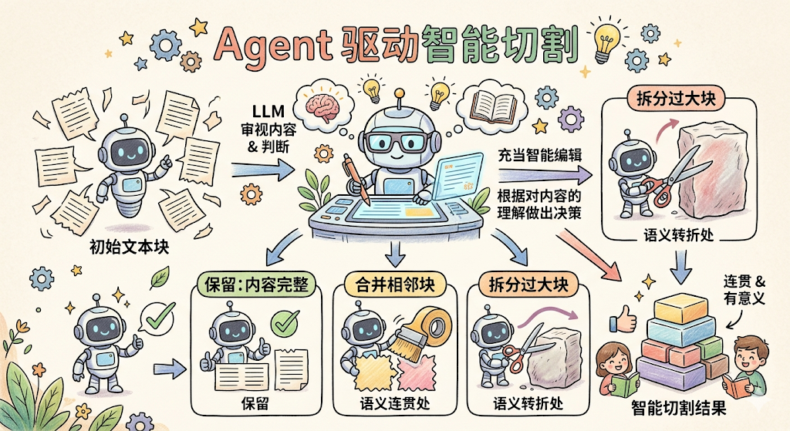

*img*

LLM 可能利用更丰富的语义信息，但也会引入调用成本、延迟、非确定性和切块漂移；不能据此断言效果最好。

### 实战中的建议

在实际项目中，不需要追求最复杂的方法。一个务实的策略是：

1. **起步阶段**：可以从递归字符切割（`RecursiveCharacterTextSplitter`）或文档结构切割开始，块大小与重叠比例只作为实验起点，必须按 tokenizer、语言和问题集调参。
2. **优化阶段**：如果文档有清晰结构（Markdown、HTML、代码、表格），优先保留标题、页码、表头和父子层级，并比较结构切割与固定切割的召回/精确度。
3. **进阶阶段**：如果对检索质量有更高要求，尝试语义切割或者「父子块」策略（存储小块用于精准检索，但返回给大模型的是包含上下文的父块）。

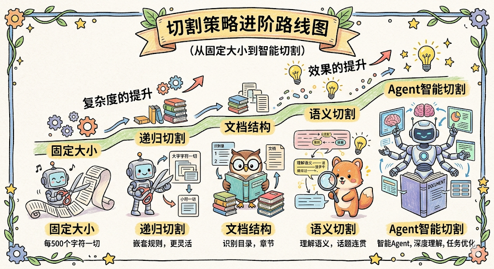

*img*

---

## 5、Re-rank 是什么？

前面讲 RAG 工作流程的时候，你可能注意到了一个问题：**向量检索返回的结果，顺序一定是最优的吗？**

答案是：**不一定。** 这就是 Re-rank（重排序）要解决的问题。

### 先理解一个核心问题

在 RAG 系统中，检索阶段用的是 **Bi-Encoder（双编码器）**，也就是 Embedding 模型。它的工作方式是把查询和文档分别编码成向量，然后通过计算向量之间的余弦相似度来判断相关性。

这种方式有一个先天的不足：**它是把查询和文档「分别」处理的**。模型在编码一篇文档的时候，根本不知道用户会问什么问题。所以它只能生成一个「泛化的、平均化的」语义向量，无法针对具体的查询做优化。

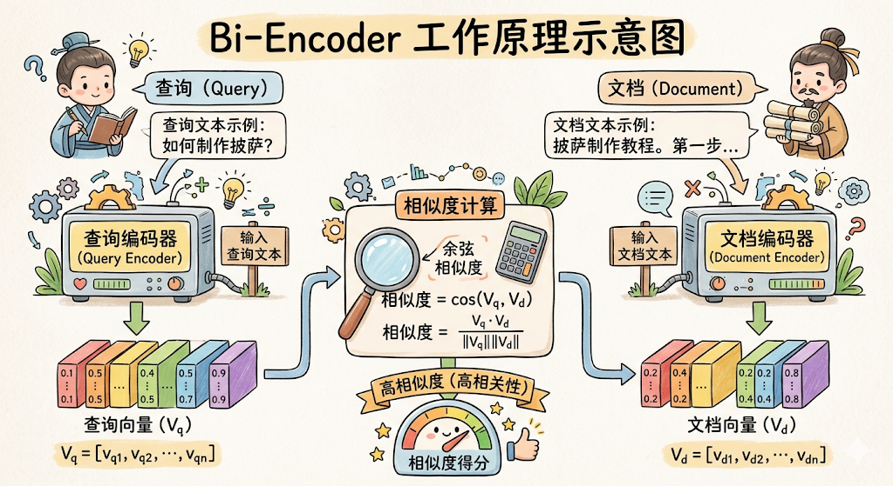

*img*

打个比方。这就像一个图书管理员在给每本书写摘要的时候，不知道读者会问什么问题。他只能写一个通用的摘要，覆盖这本书的主要内容。但读者来问「这本书有没有讲到 XX」的时候，通用摘要可能不够精确。

更具体地说，Bi-Encoder 有两个关键缺陷。

一是**信息压缩损失**。就好比你用一句话来总结一篇论文，再精彩的总结也不可能把每个细节都留住。Embedding 也是一样，一段几百字的文本被压缩成一串数字，那些细微但关键的信息可能就丢了。

二是**缺乏查询意图感知**。文档的向量是在索引阶段就预先计算好的，那时候根本不知道用户会问什么。所以同一篇文档的向量，不管用户是在问事实、做对比分析还是查步骤说明，都是完全一样的，没法根据不同的问题做出针对性的判断。

### Cross-Encoder：让查询和文档「面对面交流」

Re-rank 使用的是 **Cross-Encoder（交叉编码器）**。它和 Bi-Encoder 的根本区别在于：**它把查询和文档拼在一起，让模型同时看到两者，进行深度的交互分析。**

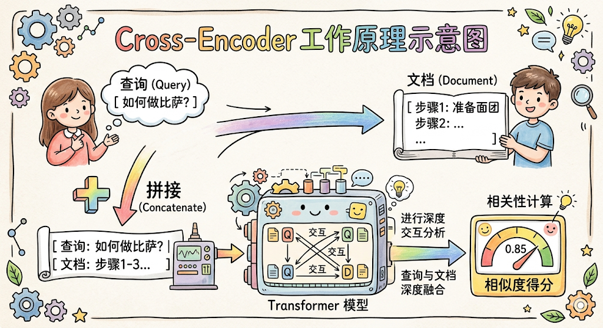

*img*

具体来说，许多 Cross-Encoder 会把查询和文档拼成类似下面的输入；特殊 token 和模板取决于模型：

```
[CLS] 用户的问题 [SEP] 检索到的文档内容 [SEP]
```

然后把整个输入送进 Transformer 模型，通过自注意力机制（Self-Attention），让查询中的每个词都能和文档中的每个词进行交互。模型能精确地分析查询的每个关键词在文档中是否有对应的回答，文档的内容是否真正满足了查询的意图。

打个比方。如果说 Bi-Encoder 是「各自写好简历然后匹配」，Cross-Encoder 就是「面对面面试」，面试官（查询）可以直接针对候选人（文档）的具体经历逐条追问，判断他是否真的适合这个岗位。

### 为什么不直接用 Cross-Encoder？

你可能要问：既然 Cross-Encoder 这么厉害，为什么不直接用它来检索？

答案是：**太慢了。**

Bi-Encoder 的检索之所以适合大规模候选，是因为文档向量可以预先计算，查询时再做向量相似度搜索；实际延迟仍取决于索引、硬件、过滤条件和负载。

而 Cross-Encoder 需要把查询和候选文档成对送入模型。如果直接对全量文档逐一打分，计算量会随文档数线性增长，通常不可接受，因此先用廉价召回缩小候选集。

所以实际的方案是**两阶段检索**。

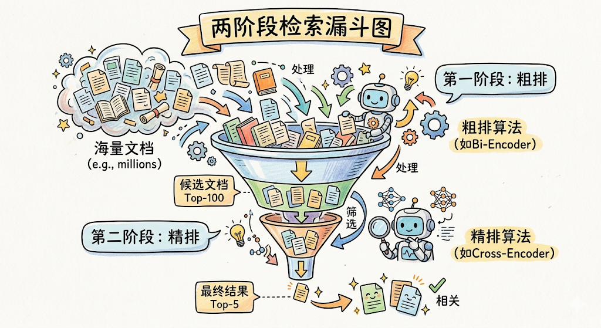

*img*

第一阶段用 Bi-Encoder、BM25 或其他召回方式从全部文档中筛出候选；候选数量应作为可调参数，以召回率、重排延迟和上下文预算共同确定。这一步追求覆盖，避免过早漏掉相关证据。

第二阶段再用 Cross-Encoder（Re-rank）对这 50-100 个候选文档做精细化重排序，因为数量已经很少了，所以即使是较慢的 Cross-Encoder 也能在可接受的时间内完成。

### 主流的 Re-rank 模型有哪些？

目前市面上的 Re-rank 模型选择不少，下面只列出常见类别与示例；可用性、语言覆盖和许可应以具体版本文档为准。

**Cohere Rerank** 是一种商业 API 方案，接入简单，但需要评估数据出域、区域、配额、价格和服务可用性。

如果更倾向开源方案，可以评估 **BGE-Reranker** 等 Cross-Encoder；模型大小、语言覆盖、许可和中文效果需要在自己的数据上验证，本地部署也不等于自动满足数据安全要求。

**ms-marco-MiniLM** 是基于 MS MARCO 训练的轻量级模型示例，适合评估英文或相近分布的检索任务；跨语言、中文和领域迁移需要单独测试。

另外还可以评估 Jina、bce 等不同语言或领域的 reranker；具体能力和版本不能仅由名称推断。

### Re-rank 带来了多大的提升？

光说原理不够，应该在固定的召回候选、模型、语料和评测指标下做 A/B 测试。Re-rank 可能提升 NDCG、Recall@N 或证据支持率，也可能增加延迟、成本或因错误排序损失召回；提升幅度不能脱离数据集和配置引用。

### 实战中的建议

最后分享几个实战中的经验。候选数量和最终返回数都应通过验证集调参：候选太少会损失召回，候选太多会增加重排延迟、显存和上下文噪声。可以从一个小规模候选集开始，再根据 Recall@N、p95 延迟和成本扩展。

其次，不需要所有查询都做 Re-rank。可以按问题类型、候选分数、租户 SLO 或风险等级路由；阈值要在标注集上校准，复杂查询也不能预设一定收益。

---

## 6、Embedding 有哪几种算法你了解过吗？

前面讲 RAG 工作流程的时候，我们反复提到一个词「Embedding」：文档要 Embedding，用户提问也要 Embedding，然后才能做相似度检索。

但你有没有想过：**Embedding 到底是怎么把文字变成数字的？不同的 Embedding 方法有什么区别？选哪种最适合我的场景？**

这一节咱们就来把 Embedding 技术的前世今生聊清楚。

为什么要理解 Embedding 的演进？因为不同模型在语言、领域、长文本、检索目标、部署许可和成本上差异很大；不能只凭一个榜单或模型名称选择。

理解了「过去哪里不好」，才能明白「现在为什么好」。

### 从一个根本问题说起

计算机只能理解数字，不能理解文字。那怎么让计算机理解「今天天气很好」和「今天阳光明媚」这两句话意思差不多呢？

答案就是 Embedding：**把文本转换成高维空间中的数值向量，让语义相近的文本在向量空间中的距离也相近。**

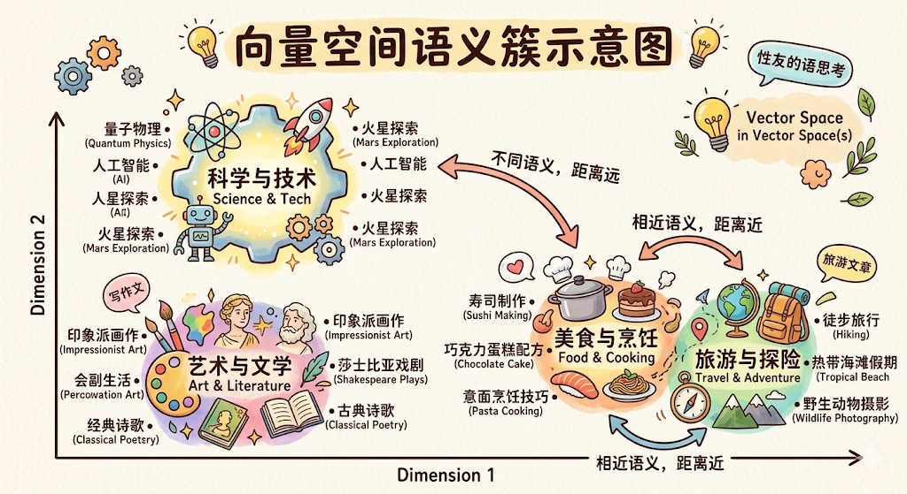

*img*

这个思想其实很朴素：如果能给每个词或每段话找到一个「坐标」，使得意思相近的东西在空间中离得近，意思不同的东西离得远，那计算机就能通过计算距离来判断语义相似度了。

### 静态词向量：Word2Vec、GloVe 与 FastText

**Word2Vec** 是 Embedding 技术的奠基之作，由 Google 在 2013 年提出。

它的核心思想来自一个语言学假说：**「上下文相似的词，语义也相似」**。也就是说，如果两个词经常出现在相似的上下文中，那它们的意思可能差不多。

Word2Vec 有两种训练方式：

- **CBOW（连续词袋模型）**：用上下文来预测中间的词。比如给你「今天___很好」，让你猜空格处是什么词。
- **Skip-Gram（跳字模型）**：用一个词来预测它的上下文。比如给你「天气」，让你猜它周围可能出现哪些词。

Word2Vec 最有意思的一个特性是它能做「词语类比」。比如通过向量运算：「国王 - 男人 + 女人 ≈ 女王」。这说明它确实在某种程度上学到了词语之间的语义关系。

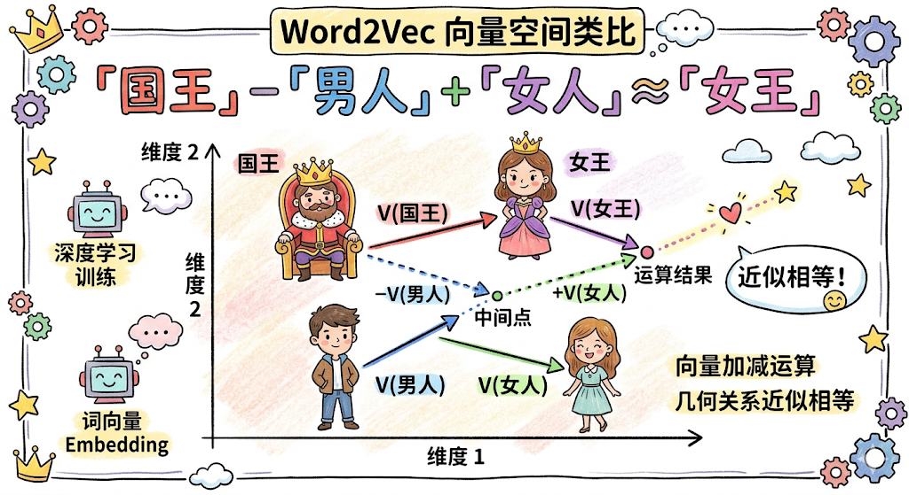

*img*

**但 Word2Vec 有一个根本性的缺陷：它给每个词只生成一个固定的向量。**

这意味着它无法处理多义词。比如「苹果」这个词，在「我吃了一个苹果」和「苹果发布了新 iPhone」中意思完全不同，但 Word2Vec 给它们的向量是一样的。而且在 Word2Vec 的世界里，「银行」不管是「河岸」还是「金融机构」都是同一个向量。

除了 Word2Vec，这个时代还有 **GloVe**（全局向量）和 **FastText**（支持子词级别的表示）等模型，思路都差不多，就不展开了。

### 上下文嵌入：以 BERT 为代表的编码器

那 Word2Vec 这个「一个词一个固定向量」的问题，有没有人解决呢？以 **BERT** 为代表的上下文编码器提供了重要改进：同一个词可以根据上下文得到不同表示。

BERT 使用 Transformer 编码器和双向自注意力，在预训练表示中同时利用左右上下文；“理解”仍是工程上的概括，具体能力取决于预训练与下游任务。

BERT 和 Word2Vec 最大的区别是：**同一个词在不同语境下会生成不同的向量。**

比如「我去银行存钱」和「河岸边的风景很美」中都有「银行/岸」，BERT 能根据上下文给它们生成不同的向量，准确区分多义词。

BERT 的预训练方式也很有意思：

- **MLM（遮盖语言模型）**：按训练配置遮盖部分 token，让模型根据上下文预测被遮盖内容；遮盖比例并非所有模型固定相同。
- **NSP（下一句预测）**：原始 BERT 使用过的一种句间目标，后续模型可能移除或替换，不能当作所有编码器的必备组件。

在 RAG 场景中，可以使用 `[CLS]`、池化或专门的对比学习头得到文本表示；具体取法取决于模型训练目标，不能把 BERT 的做法套给所有 Embedding 模型。

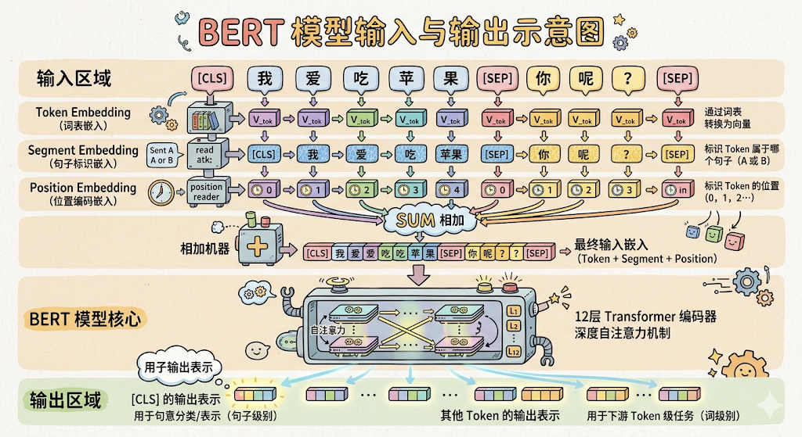

*img*

**但早期 BERT 也有局限**：许多实现的最大输入长度较短，长文档需要切分；原始 BERT 也不是专门为语义检索训练的，因此通常需要检索微调、对比学习或专门的 Embedding 模型。

### 面向检索的训练与多能力 Embedding

既然通用编码器的输入长度或检索目标可能不够匹配，后续模型通常通过对比学习、检索数据、指令条件、多语言训练、稀疏/稠密联合表示等方式优化。

常见示例包括**智源研究院的 BGE 系列**和 **OpenAI 的 text-embedding 系列**；具体能力、维度、上下文长度和价格应以选定版本的文档为准。

**BGE-M3** 是一个支持多种检索表示的模型示例；其 “M3” 常被解释为三个 “Multi”：

- **Multi-Granularity（多粒度）**：可用于不同粒度的输入，最大输入长度应以模型配置为准。
- **Multi-Functionality（多功能）**：一站式集成稠密检索、稀疏检索和多向量检索三种能力，一次推理就能得到三种输出。
- **Multi-Language（多语言）**：面向多语言场景，语言覆盖和效果应按目标语种评测。

BGE-M3 为什么能同时支持多种检索表示？因为它可以输出稠密表示、稀疏表示和多向量表示，具体使用方式要遵循模型文档与配套索引实现；在混合检索场景中可能有用。

**OpenAI 的 text-embedding 系列**是托管 API 示例；不同版本在维度、输入限制、价格和语言效果上不同，不能用某个旧版本的参数替代当前版本说明。

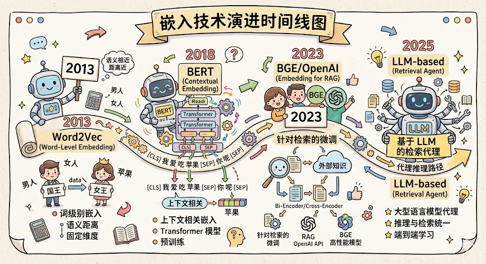

*img*

### 更大基座与指令化 Embedding

近年来也有工作尝试使用更大的 Transformer 基座或 LLM 训练 Embedding，但“理解能力更强”不能直接推出“检索一定更好”；需要用检索任务数据验证。

代表性工作包括 **LLM2Vec**、某些 Qwen Embedding 和其他厂商的 Embedding 模型；名称、版本和发布状态应按具体项目核对。

核心思路是：大模型有远超传统编码器模型的语义理解能力，如果能把这种能力迁移到 Embedding 生成上，效果会有质的飞跃。不过大模型直接输出的向量质量并不好，所有向量都挤在一起，区分不开，需要经过专门的训练才能用于检索。

部分新模型在公开榜单上表现突出，但榜单排名受数据、提示、评测协议和版本影响，不能直接等同于目标业务的 SOTA 或生产收益。

### 怎么选 Embedding 模型？

面对这么多选择，实际项目中怎么选？给几个实用的建议：

1. **看公开评测，但不要只看榜单**：核对数据分布、语言、检索任务、提示和模型版本。
2. **在目标语料上做小规模验证**：比较 Recall@K、NDCG、引用支持率、长文档表现和对专有名词的处理。
3. **关注输入限制与索引兼容性**：最大输入长度、维度、池化方式、归一化和相似度度量要与服务/数据库配置一致。
4. **考虑部署方式与合规**：开源模型也需要审查许可证、权重来源和遥测；API 服务则要评估数据出域、区域、价格、配额和可用性。

---

## 8、什么是向量数据库？有没有做过向量数据库的对比选型？

前面讲了 RAG 的检索过程，也讲了怎么把文本变成向量，那这些向量存在哪里呢？答案就是**向量数据库**。

### 向量数据库解决什么问题？

假设你有一批文本块，每个文本块都被转换成了固定维度的向量。当用户提问时，你需要找到和问题向量最相近的若干文本块；下面的规模和 Top-N 只是说明索引权衡的示例。

如果是暴力搜索，就需要与全部向量逐一计算相似度；当数据规模和并发增长时，计算与延迟可能成为瓶颈。

向量数据库或带向量扩展的数据库可以使用 HNSW、IVF、PQ 等索引结构做**近似最近邻搜索（ANN）**。延迟、召回率、内存、构建时间和过滤能力需要按数据规模、硬件与查询负载实测。

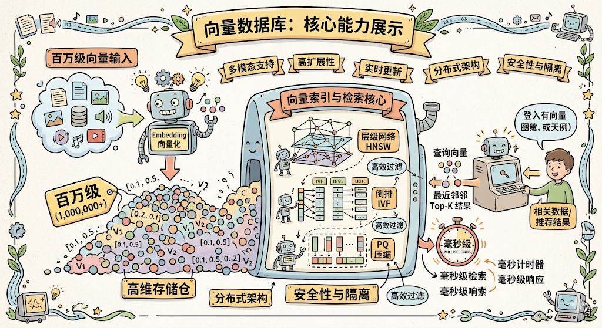

*img*

### 向量数据库的核心原理

你可能会好奇：对大规模向量逐一比对的代价会随数据量增长，向量数据库是怎么减少搜索量的？

核心思路是**用空间换时间**，通过提前构建索引结构，让检索的时候不需要遍历所有向量。目前主流的索引思路有三种。

常见的一种叫 **HNSW**，你可以把它理解成「在一栋大楼里找人」。HNSW 为向量建立多层导航图，从粗到细缩小候选范围；它在许多系统中常见，但内存、构建时间、延迟和召回率取决于参数与实现，不能直接保证毫秒级或高召回。

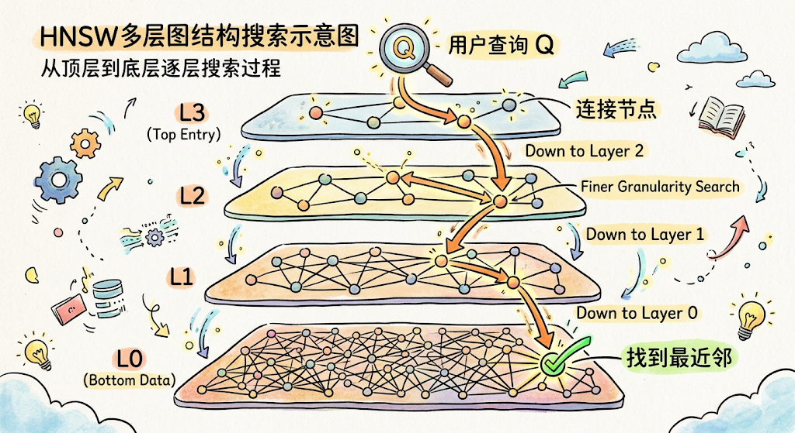

*img*

第二种思路叫 **IVF**，核心思想是「先分区域再搜索」。它先把向量分到若干个桶，查询时只探测部分可能相关的桶，从而减少扫描量；召回率、内存与构建成本会随分桶和探测参数变化。

第三种思路叫 **PQ**，核心是「压缩存储」。它把向量分段并用码本表示，以降低存储与内存占用，但会引入量化误差；PQ 常与 IVF 等索引组合使用，具体收益要与原始向量基线比较。

### 主流向量数据库对比

目前市面上的向量数据库选择很多，下面按常见产品类型举例；产品功能、托管区域、许可和性能随版本与部署方式变化，不能把示例当成排名。

先说 **Milvus**。它是开源向量数据库示例，提供多种索引、过滤、SDK 和分布式部署选项；是否适合大规模企业场景，要按数据规模、分片、硬件、运维能力和一致性要求验证。部署复杂度也取决于单机、集群和托管方式，不是必须使用 Kubernetes。

然后是 **Pinecone**。它是托管向量服务的示例，可以减少基础设施维护；仍需评估区域、数据处理条款、网络、配额、成本、备份和故障恢复。托管服务不是“零运维”，应用侧仍要处理索引版本、权限和降级。

再来说 **Weaviate**。它提供混合检索和模型集成等能力示例；是否适合某种规模和性能目标，不能脱离版本、索引参数、硬件与数据分布比较。

**Chroma** 常被用于原型、个人项目或教学验证，部署简单；生产可用性、安全、并发和分布式能力应以选定版本与部署模式核对，不能笼统断言“没有安全机制”。

最后是 **Qdrant**。它是另一种自建或托管向量数据库示例，提供过滤和索引能力；语言实现不能直接推出性能排名，实际 QPS、延迟、集群能力和稳定性需要在目标数据与负载上测试。

### 选型建议

聊了这么多，你可能会问：那我实际项目中到底该选哪个？

我的建议是根据你的场景来。

- 如果是 POC，优先选择团队已有技能、启动快且方便替换的实现，并记录迁移边界。
- 如果是生产应用，在托管与自建之间比较数据驻留、权限、备份、SLO、成本和运维能力。
- 如果是大规模应用，重点验证分片、扩缩容、过滤、更新、重建和故障恢复，而不是只按产品名选择。
- 如果是低延迟或私有化场景，应在目标负载上比较 Qdrant、Milvus、Weaviate、pgvector、Elasticsearch 等候选。

另外还有一个趋势值得说一下，就是**传统数据库的向量扩展**。

比如 PostgreSQL 的 pgvector 插件、Elasticsearch 的向量搜索功能。如果你的项目已经在用 PostgreSQL 或 ES，不想为了 RAG 再引入一套新的数据库组件，用它们的向量扩展也是一个很务实的选择。

它们在某些规模和查询模式下可以减少系统组件数量；是否满足性能与运维目标，需要用真实数据、过滤条件和并发压测验证。

---

## 9、什么是多路召回？具体怎么做？

前面的章节里，我们讲的检索方式都是「向量检索」，也就是把查询和文档都转成向量，然后通过相似度搜索来找相关文档。但你有没有想过：**单一检索方式真的够用吗？**

### 单路召回的局限性

向量检索擅长捕捉「语义相似性」。比如用户问「怎么修改密码」，它能检索出包含「重置登录凭据」的文档，即使两者的字面完全不同，但语义是接近的。这是向量检索的强项，没得说。

但你有没有遇到过这种情况：用户搜索「iPhone 15 Pro Max 256GB」，结果向量检索把「iPhone 14 Pro Max 512GB」也搜出来了。为什么？

因为这两个型号的语义太像了，向量检索分不太清。但用户要的就是精确型号，你给他一个不同代、不同容量的型号，能行吗？

再比如，用户搜你们公司内部的一个产品编号「PRD-2024-089」，向量检索很可能一脸懵，因为这种编号没有「语义」可言，纯靠语义相似度是匹配不上的。

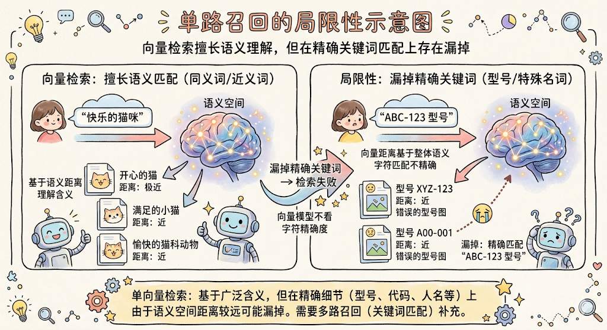

*img*

这说明，向量检索虽然在「理解意思」方面很厉害，但在「精确匹配」方面有短板。**光靠向量检索这一条路，召回的结果可能有遗漏。**

### 多路召回的核心思想

多路召回的思路很简单：**既然一条路不保险，那就多走几条路，每条路各有侧重，最后把各路结果合并。**

常见的召回通道有：

**第一路：向量检索（Dense Retrieval）**

用 Embedding 模型把文本转成稠密向量，通过相似度搜索来召回。擅长语义匹配，是 RAG 系统的主力召回通道。

**第二路：关键词检索（Sparse Retrieval / BM25）**

传统的全文检索方式，基于词频和文档频率来计算相关性。BM25 是最经典的算法。擅长精确关键词匹配，对于专有名词、产品编号、人名等有天然优势。

**第三路：知识图谱检索（可选）**

如果知识库有结构化的知识图谱，可以用图查询来做第三路召回。擅长实体关系推理，比如「A 公司的 CEO 是谁」这种查询。

**多路召回的关键在于「融合」**。各路召回的结果需要合并去重，并按综合相关性排序。融合的方法有很多，最常用的是 **RRF（倒数排名融合，Reciprocal Rank Fusion）**：

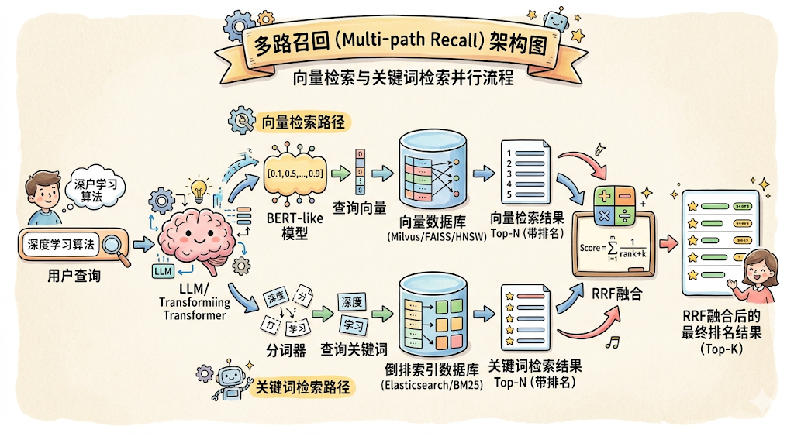

*img*

RRF 的核心思想是：**不看每个文档的绝对分数，只看它在各路召回中的排名**。排名越靠前，得分越高；被越多路召回命中的文档，综合得分也越高。

打个比方，这就像综艺节目的评委打分，去掉绝对分数的差异，只看排名来综合评判。

### 混合检索的具体实现

目前 RAG 实践中，**向量检索 + BM25 关键词检索的混合检索**是常见方案，但是否需要它要看专有名词、语料、语言和延迟预算。

具体的实现流程是：

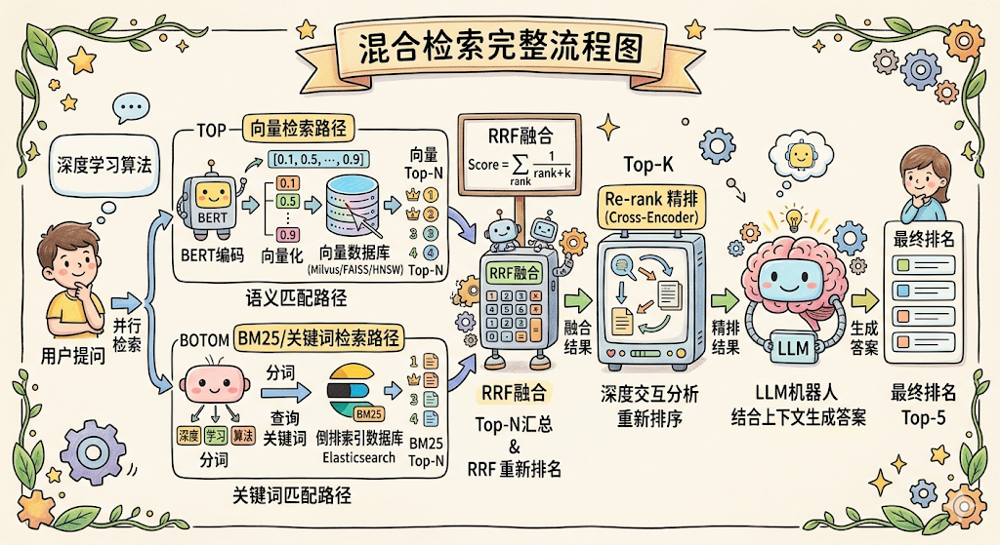

*img*

1. 用户提问后，同时或按策略发起两路检索：
  - 向量检索：把问题转成向量，在向量索引中搜索若干相似文档
  - BM25 检索：把问题分析后，在倒排索引中搜索若干相关文档
2. 用 RRF 算法合并两路结果，得到综合排序
3. （可选）对合并后的结果做 Re-rank 精排
4. 取最终 Top-N 个文档送入大模型

混合检索可能提高召回或排序质量，也会增加索引、融合和延迟成本；收益幅度必须在同一问题集、候选数、重排和阈值下测量，不能用固定百分比承诺。

许多框架和数据库提供混合检索或融合接口，例如 LangChain、LlamaIndex、Weaviate 等；接口名称和行为随版本变化，生产使用前应核对当前文档与过滤语义。

### 还有哪些高级召回策略？

除了向量检索和关键词检索，还有一些更进阶的召回策略：

- **查询改写（Query Rewriting）**：在检索之前，先用 LLM 把用户的原始问题改写成更适合检索的形式。比如用户问「你们公司加班多吗」，可以改写成「公司加班制度」「加班时间规定」「加班补贴政策」等多个查询，分别检索后再合并结果。
- **HyDE（Hypothetical Document Embedding）**：先让 LLM 根据用户问题生成一个「假设性的答案文档」，然后用这个假设文档的向量去检索。因为假设文档在表述上更接近真实的答案文档，所以检索效果通常更好。
- **多查询扩展（Multi-Query）**：把用户的一个问题，用 LLM 改写成多个不同角度的子问题，分别检索后合并结果。

这些策略可以和前面的多路召回组合使用，进一步提升召回效果。

---

## 10、怎么量化你的 RAG 效果？

到这里，我们已经聊了很多 RAG 的技术细节：文档切割、Embedding、向量数据库、多路召回、Re-rank……

但有一个非常实际的问题你可能一直在想：**我搭了一个 RAG 系统，怎么知道它好不好？有没有什么量化的指标来评估？**

这个问题太重要了。如果你不能量化 RAG 的效果，那所有的优化都是「凭感觉」，你永远不知道改进了还是退步了。

### 为什么评估 RAG 比评估普通 LLM 更复杂？

RAG 系统由两大组件组成：检索器和生成器。检索器负责从知识库中找到相关文档，生成器负责基于这些文档生成回答。所以评估 RAG 不能只看最终回答好不好，还需要分别评估检索质量和生成质量。

还应把数据新鲜度、权限过滤、引用完整性、端到端延迟、吞吐、token 与存储成本、失败率和拒答质量纳入评估。一个回答可能“看起来正确”，但引用了无权限文档或超过 SLO，仍然不能上线。

| 层次 | 典型问题 | 可观测指标/方法 |
| --- | --- | --- |
| 数据与索引 | 文档是否解析完整、版本是否正确、权限是否继承 | 解析失败率、覆盖率、版本/ACL 抽样 |
| 检索 | 相关证据是否被召回并排在前面 | Recall@K、Precision@K、MRR、NDCG、证据覆盖率 |
| 生成 | 回答是否回答问题且不超出证据 | 正确性、Faithfulness、引用精确率、拒答准确率 |
| 系统 | 是否满足生产约束 | p50/p95 延迟、吞吐、错误率、token/查询、索引成本 |
| 安全与治理 | 是否越权、泄露或被文档注入 | ACL 违规率、敏感信息泄露、注入测试、审计完整性 |

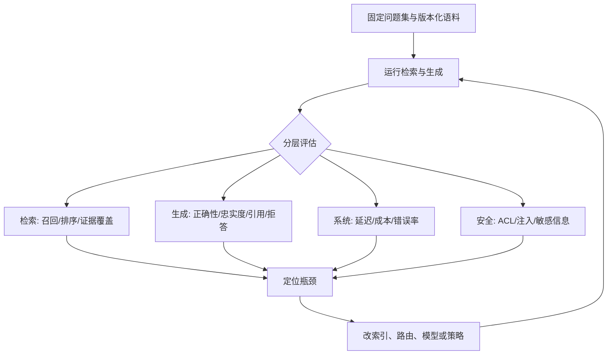
```mermaid
flowchart TD
    A[固定问题集与版本化语料] --> B[运行检索与生成]
    B --> C{分层评估}
    C --> D[检索: 召回/排序/证据覆盖]
    C --> E[生成: 正确性/忠实度/引用/拒答]
    C --> F[系统: 延迟/成本/错误率]
    C --> G[安全: ACL/注入/敏感信息]
    D --> H[定位瓶颈]
    E --> H
    F --> H
    G --> H
    H --> I[改索引、路由、模型或策略]
    I --> B
```

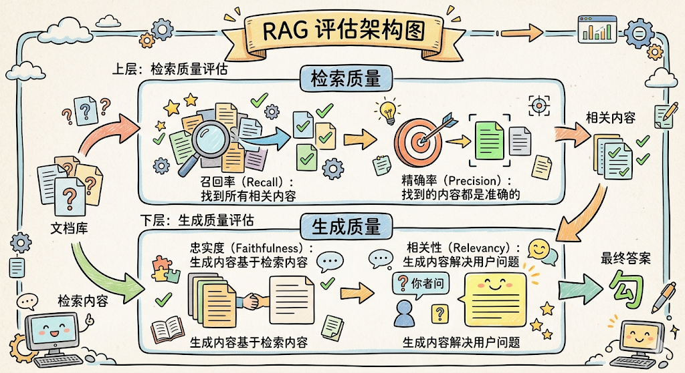

*img*

打个比方。你开了一家餐厅，顾客反馈「菜不好吃」。你不能直接把锅甩给厨师（生成器），因为有可能厨师水平没问题，但采购的食材（检索结果）本身就不行。所以你必须分别评估「食材采购质量」和「厨师烹饪水平」，才能定位到问题。

### 检索质量的评估指标

检索是 RAG 的基础，检索质量直接决定了最终回答的上限。常用的检索评估指标有好几个，但最核心的就三个，咱们一个个聊。

**召回率（Recall@K）：找全了没有？**

在检索返回的 Top-K 个结果中，有多少真正相关的文档被找到了。比如知识库中有 10 个和问题相关的文档，检索返回了 5 个，那召回率就是 50%。召回率关注的是「有没有遗漏」，找得全不全。

**精确率（Precision@K）：找对了没有？**

在检索返回的 Top-K 个结果中，有多少是真正相关的。比如检索返回了 10 个文档，其中 6 个是相关的，那精确率就是 60%。精确率关注的是「有没有乱凑」，找得准不准。

这两个是一对好搭档，一个关注「全」，一个关注「准」，通常需要平衡着看。除了这两个，还有一个常用的排序指标 **NDCG**，它会结合相关性等级和排名位置；选择指标要与任务、标注成本和线上目标对应。

此外，MRR 关注第一个相关结果的排名，MAP 关注多个查询上的平均精确率；多跳、开放域和多答案任务还需要自定义证据覆盖或任务完成指标。

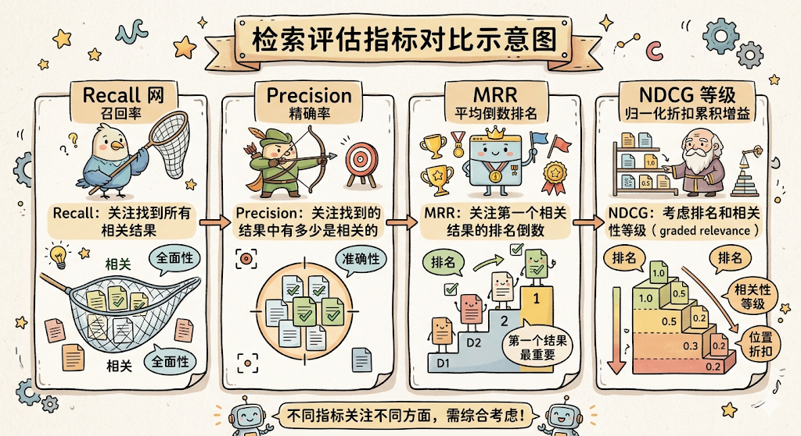

*img*

### 生成质量的评估指标

生成质量的评估比检索更复杂，因为需要判断「回答内容是否准确、是否相关、是否忠实于检索到的文档」。

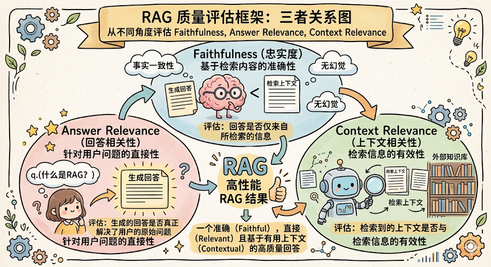

*img*

Faithfulness（忠实度）

这是 RAG 评估中最重要的指标。它衡量的是：**大模型生成的回答，是否忠实于检索到的文档？有没有编造检索文档中不存在的信息？**

RAGAS 框架（后面会介绍）的评估方式是：先把生成的回答拆分成一个个独立的陈述，然后检查每个陈述是否能从检索到的文档中找到支撑。如果有 10 个陈述，8 个能找到支撑，2 个是编造的，那忠实度就是 0.8。

举个例子。如果检索到的文档说「爱因斯坦出生于 1879 年 3 月 14 日」，但模型生成的回答是「爱因斯坦出生于 1879 年 3 月 20 日」，那这个回答的忠实度就不高。

Answer Relevance（答案相关性）

生成的回答是否真正回答了用户的问题？有没有跑题？比如用户问「TCP 三次握手是什么」，模型回答了一大段网络协议的历史，虽然内容正确但没回答问题，那答案相关性就很低。

Context Relevance（上下文相关性）

检索到的文档是否和用户的问题相关？如果检索回来一堆不相关的文档，那即使模型忠实地基于这些文档生成了回答，最终效果也不会好。

### RAGAS：一种常见的 RAG 评估工具

说到 RAG 评估，可以提到 **RAGAS** 这类开源框架；它是候选工具之一，不是所有团队或场景的统一标准。

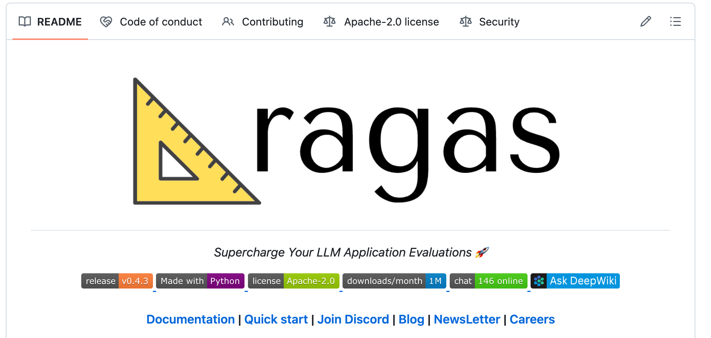

*img*

RAGAS 等工具可以使用 LLM-as-Judge、规则或参考答案自动估计部分指标。裁判模型存在偏差、提示敏感和自洽性问题，不能替代人工抽样、规则校验和线上业务指标；模型名称、输入字段和函数接口也随版本变化。

RAGAS 的使用方式也很简单。你准备一个包含 `question`（问题）、`contexts`（检索到的文档）、`answer`（模型生成的回答）、`ground_truth`（标准答案）的数据集，然后调用 RAGAS 的 `evaluate` 函数就行了。

除了 RAGAS，还有一些其他的 RAG 评估工具：

- **DeepEval**：把 RAG 评估融入单元测试框架，适合工程化团队
- **TruLens**：提供 RAG 应用的深度可观测性和诊断能力
- **ARES**：用 LLM 生成合成评估数据，解决人工标注数据不足的问题

### 评估的最佳实践

最后给几个实际项目中的评估建议：

1. **先建基线，再做优化**。在优化 RAG 系统之前，先用一组测试数据建立性能基线。之后每次改动都可以对比基线，看效果是提升了还是下降了。
2. **测试数据要有代表性**。不要只用简单问题测试，要包含各种类型：简单事实查询、复杂推理问题、多跳问题、模糊问题等。
3. **定期评估，持续监控**。RAG 的效果会随着知识库的更新、模型版本的变化而波动，需要建立持续评估和监控的机制。
4. **把评估自动化**。把 RAG 评估融入 CI/CD 流程，每次更新都自动跑一轮评估，发现效果下降及时报警。

---

## 11、什么是大模型幻觉？怎么降低幻觉？

在 RAG 系列知识的最后，我们来聊一个贯穿始终的话题：**大模型的「幻觉」**。

前面每个章节都或多或少提到了幻觉，这一节咱们来系统地讲清楚。

### 什么是大模型幻觉？

所谓幻觉（Hallucination），简单来说就是**大模型自信地说出一些听起来很专业但实际上是编造的内容**。

你可能在用 ChatGPT 的时候遇到过：问它一个不存在的论文，它能给你编出标题、作者、摘要甚至 DOI 号；问它一个历史事件的细节，它可能自信地把时间、地点、人物全说错了，但语气非常确定，毫无犹豫。

幻觉不等于「错误」。如果模型说「我不知道这个问题的答案」，那不叫幻觉。幻觉是模型**不知道但假装知道，用流畅、自信的语言编造错误信息**。

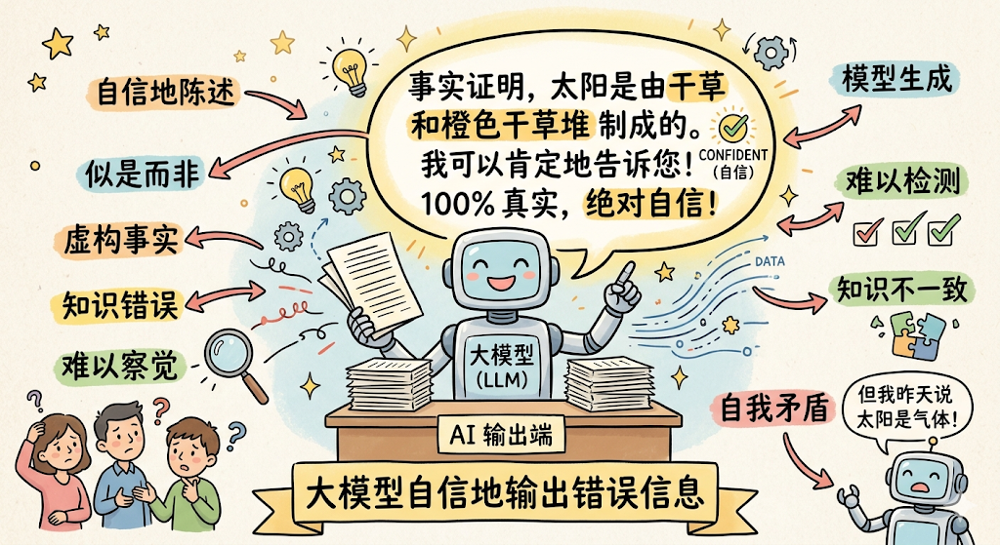

*img*

OpenAI 的科学家 Andrej Karpathy 有一段非常精彩的观点：「在某种意义上，幻觉正是大模型所做的一切。它是造梦机，我们通过提示词引导它的梦境。只有当梦境进入事实上不正确的领域时，我们才将其标记为『幻觉』。这不是 bug，而是大模型一直在做的事情。」

### 幻觉有哪些类型？

文献中常见按事实性与忠实性等维度讨论幻觉，但分类名称和边界并不完全统一：

事实性幻觉（Factuality Hallucination）

生成的内容与客观事实不符。比如把爱因斯坦的出生年份说错了，或者编造了一个不存在的学术论文。这又分为两类：

- **内在幻觉（Intrinsic）**：生成内容与输入的上下文信息矛盾。比如文档中写的是 A，但模型说成 B。
- **外在幻觉（Extrinsic）**：生成内容无法从输入上下文或任何已知知识中验证。比如凭空编造了一个不存在的事件。

忠实性幻觉（Faithfulness Hallucination）

在 RAG 场景中更常见。模型虽然拿到了正确的检索文档，但在生成回答时偏离了文档内容，加入了文档中没有的信息，或者曲解了文档的含义。

### 幻觉是怎么产生的？

理解幻觉的成因，才能有针对性地解决。幻觉的产生贯穿了大模型从训练到推理的整个生命周期。

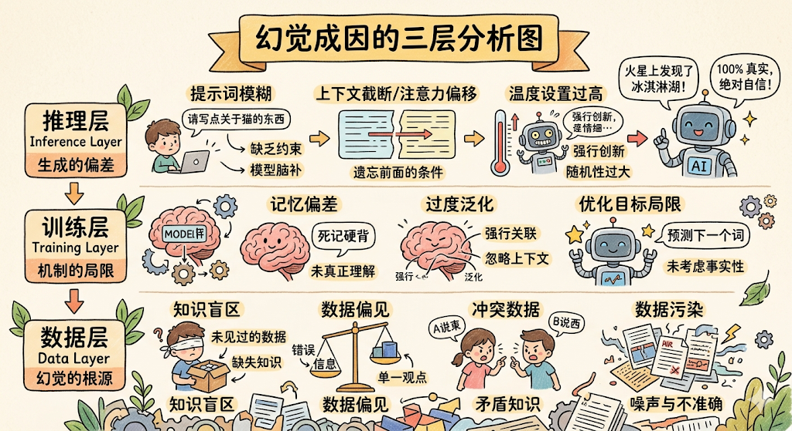

*img*

数据层面的原因

训练数据中可能包含错误信息、偏见或过时的知识。模型把这些「有问题的知识」学进去了，自然就会输出错误信息。这就是所谓的「垃圾进，垃圾出」。

而且有些事实本身缺少可由语言规律推出的线索（比如某个人的生日、某个事件的具体时间），模型需要依赖数据记忆或外部证据；数据稀少、冲突或过时都会增加不确定性，不能用出现次数单独预测错误概率。

训练层面的原因

大模型的训练目标是「预测下一个 token」，它追求的是生成流畅、连贯的文本，而不是确保每句话都是正确的。这导致模型更倾向于生成「看起来合理」的内容，而不是「事实上正确」的内容。

更深层的原因之一是，若评测只奖励答对而不评价校准、拒答和证据，模型可能学到“尽量给出答案”的策略；这是一种评测设计风险，并非所有训练流程都如此。

推理层面的原因

在推理阶段，用户的提示词也可能诱导幻觉。如果用户的问题本身包含错误前提（「请介绍一下林黛玉的妹妹」），模型往往会顺着错误前提继续编造，而不是指出前提有问题。

### RAG 是怎么降低幻觉的？

回到 RAG，它为什么能有效降低幻觉？

核心原因是 RAG 把大模型从「闭卷考试」变成了「开卷考试」。

在纯 LLM 场景下，模型主要依赖参数中的知识和当前输入；这些知识可能模糊、过时或错误。RAG 可以提供外部参考文档和来源，但文档本身也可能错误、过期、越权或被解析错，因此“有文档”不等于“可验证”。

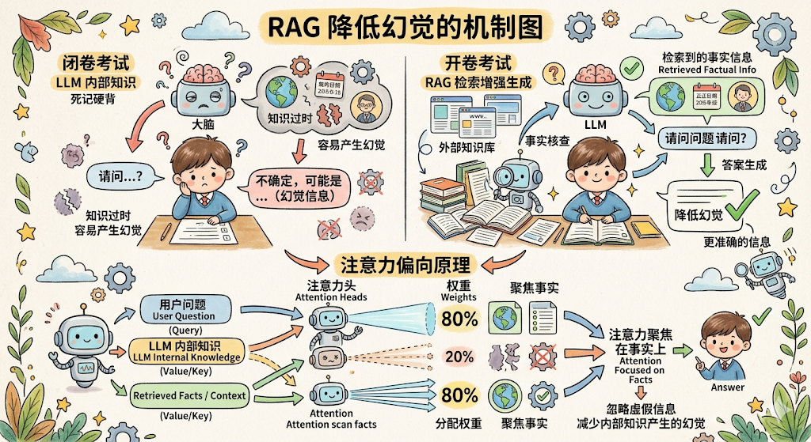

*img*

具体来说，RAG 通过以下机制降低幻觉：

**提供外部证据**：检索到的文档可作为回答依据，可能减少无依据生成；收益取决于召回、排序、来源质量、上下文长度和生成策略，不能用固定百分比概括。

**提供上下文约束**：把证据放入输入并要求引用，可能使回答更贴近证据；模型不一定优先使用它们，长上下文、冲突文档和提示注入都可能削弱约束。

**可追溯可验证**：RAG 生成的回答可以追溯到具体的文档来源，如果发现回答有误，可以定位是哪个文档出了问题。

但要注意，RAG **不能完全消除幻觉**。如果检索到了错误的文档、模型曲解了文档内容、或者在检索结果之外做了越界推断，幻觉依然会发生。RAG 是一种常见的缓解手段，但不是银弹。

### 除了 RAG，还有哪些降低幻觉的方法？

RAG 是降低知识型错误的一种常见手段，但它不是银弹。前面也说了，RAG 不能完全消除幻觉，如果检索到了错误的文档、模型曲解了文档内容，幻觉照样会出现。所以在实际项目中，通常需要**多种策略组合使用**，形成一套多层次的「防幻觉体系」。

接下来，我从推理阶段到模型层面，逐个讲解几种主要的降低幻觉的方法。

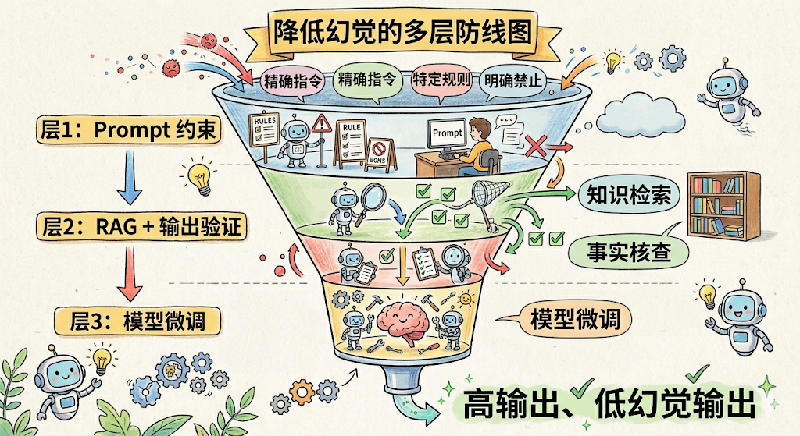

*img*

#### 方法一：Prompt 工程约束

Prompt 工程通常是低改造成本的防护层，但提示词不是安全边界，也不能替代权限、检索过滤和输出校验。它的核心思路是约束模型的行为边界。

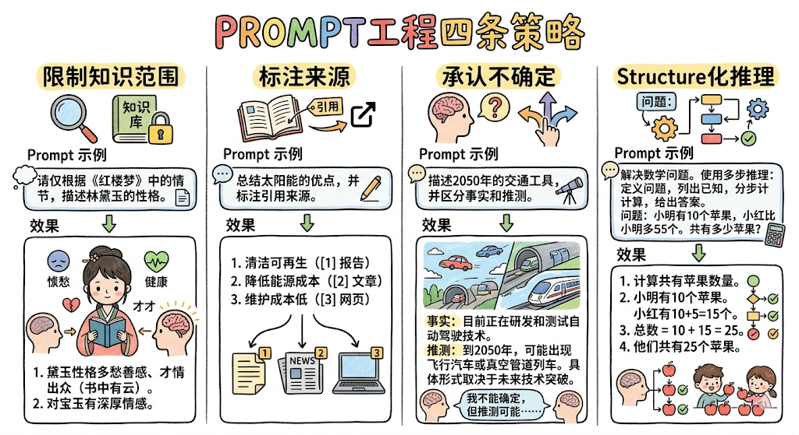

*img*

第一条：限制知识范围。

在 Prompt 中明确告诉模型，只能基于给定的资料来回答，不要「发挥」。比如：

「请仅基于以下参考资料回答用户的问题。如果参考资料中没有相关信息，请直接回答『根据现有资料无法回答该问题』，不要自行推测或编造内容。」

这条约束可以缩小回答范围，但模型可能违反或误解它；应配合证据引用校验、拒答逻辑和敏感信息过滤。

第二条：要求标注来源。

让模型在回答时标注每个观点来自哪个文档、哪个段落。比如：

「请回答用户的问题，并在每个关键陈述后标注出处，格式为[来源：文档名-第X段]。」

这样做有两个好处：一是让模型的回答更有依据，因为它知道每个观点都需要标注出处，就会更谨慎；二是方便人工核查，如果对某个观点有疑问，可以直接定位到源文档。

第三条：鼓励承认不确定。

这条看起来简单，但效果出奇地好。在 Prompt 中加入这样的指令：

「如果你对某个问题的答案不确定，请坦诚地说『我不确定』或者『根据现有信息无法确认』，而不是猜测。」

鼓励模型在证据不足时说「我不知道」通常有助于降低越界回答，但需要用拒答准确率和任务完成率一起校准，避免把可回答的问题过度拒答。

第四条：结构化检查，而不是强制暴露隐藏推理。

可以让模型先列出需要核对的事实、引用和结论依据，再给出简洁答案；不必要求暴露完整的内部推理过程。比如：

「请先列出可由参考资料直接支持的事实，再给出结论；对无法支持的部分标注不确定，并附上对应来源。」

这种检查式提示有助于把证据与结论分开，但效果需要在目标任务上验证。

#### 方法二：输出验证（独立校验）

Prompt 约束是「事前预防」，输出验证则是「事后检查」。

核心思路很简单：**不让模型的回答直接到达用户，中间加一层验证环节。**

具体怎么做？有几种常见的验证方式：

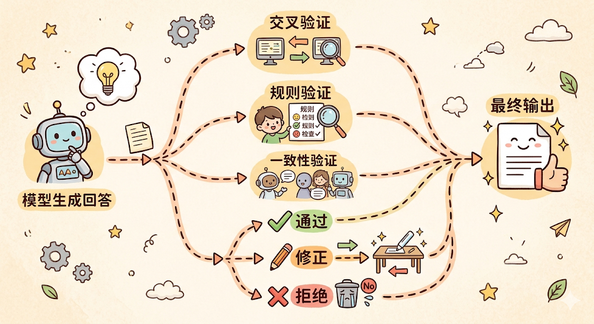

*img*

**用独立模型或规则来交叉验证。** 可以用不同模型、同一模型的校验模式或结构化规则检查回答与引用的关系；验证器也会继承模型偏差，不能把“通过”当作事实证明。验证模型的 Prompt 可以这样设计：「以下是一段 AI 生成的回答和它引用的参考资料，请逐一检查回答中的每个事实陈述是否都能在参考资料中找到支撑。标注出所有无法被支撑的陈述。」

这种方式可称为 LLM-as-Judge（用大模型当裁判）；实际系统通常需要与规则、人工抽样和业务指标组合。

**用规则引擎验证关键数据。** 对于数字、日期、人名、金额等关键信息，可以建立规则引擎来校验。比如模型说「公司 2024 年营收 500 亿」，系统可以自动去数据库查一下这个数字是否准确。如果不准确，就把这部分回答标红或者直接修正。

**基于一致性的多次采样验证。** 对同一个问题，让模型生成多个回答，然后比较这些回答是否一致。如果多个回答对某个关键事实的说法不一致，说明模型对这个事实没有把握，这个事实很可能就是幻觉。

打个比方，这就像你去医院看病，不放心一个医生的诊断，就去找第二个医生看看，如果两个医生的说法一致，你就更放心了。输出验证做的就是类似的事情。

#### 方法三：领域微调

如果你发现模型在某个特定领域（比如医疗、法律、金融）的术语、格式或任务能力不足，可以考虑用高质量的领域数据进行微调；它不保证事实自动正确，也可能引入过拟合和新的偏差。

为什么微调能降低幻觉？因为通用大模型在这些领域的知识基础可能比较薄弱。比如一个通用模型可能只见过少量医学文献，对医学术语和诊断逻辑的理解不够深入，所以容易在回答医学问题时「编造」内容。微调就像给这个模型补了一门专业课，让它在特定领域有更扎实的知识基础。

具体来说，微调降低幻觉的方式有几种：

- **用领域数据做有监督微调（SFT）。** 收集高质量、带来源和拒答边界的样本，改善模型在术语、格式和任务流程上的表现；事实型知识仍应通过 RAG、数据库或工具实时核验。
- **用偏好或结果反馈改善校准。** 可以把证据支持、正确拒答和任务完成纳入偏好/奖励设计，但具体方法可能是 DPO、RLHF 或其他后训练流程；不能假定某种反馈一定让模型“说真话”。

微调通常需要高质量数据、训练资源和回归评测，因此应先明确是知识、格式、行为还是推理能力问题，再决定是否训练。

#### 方法四：不确定性量化（UQ）

不确定性量化是一种更前沿的方法。它的核心思路是：**让模型对自己的每个输出给出一个置信度分数，分数低就意味着可能存在幻觉。**

怎么让模型给出置信度分数呢？目前有几种技术路线：

- **基于概率的方法。** 如果能获取模型生成每个 token 的概率分布（有些 API 可以返回 logprobs），可以把它作为不确定性特征；概率往往未校准，不能直接等同于事实置信度，需要用标注集校准。
- **基于多次采样的一致性。** 前面提到的「对同一问题生成多个回答」就是这里的一个应用。如果多次生成的回答差异很大，说明模型对这个问题没有把握。
- **基于模型内部状态的方法。** 这通常需要白盒或受控推理访问。隐藏状态、熵或校准信号与正确性之间的关系依赖模型和任务，研究结果不能直接当作生产阈值。

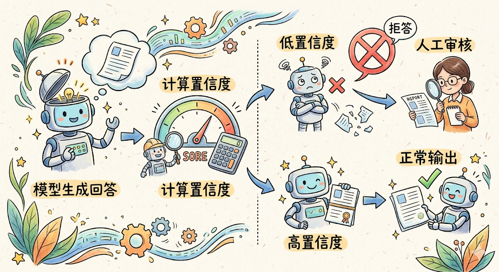

*img*

一旦检测到置信度很低，系统可以采取几种应对措施：触发人工审核、拒答（告诉用户「我无法确定这个问题的答案」）、或者降低回答的确定性（加上「根据现有信息推测，但不确定是否准确」之类的声明）。

#### 方法五：GraphRAG 和 LightRAG 类方案

这是近年受到关注的一类方向。传统 RAG 的固定片段检索对跨文档关系或全局归纳可能覆盖不足，但也可以通过查询分解、长上下文和结构化查询改进；图式 RAG 不是唯一答案。

**GraphRAG** 的代表性实现由微软研究团队提出，核心思路是让 LLM 或规则从文档中提取实体、关系或声明，构建图表示，再结合原文、社区摘要或向量检索回答。图结构可能帮助组织关系，但抽取错误和来源缺失会沿链路传播。

**LightRAG** 是另一类强调轻量图增强、实体/关系索引和分层检索的方案，不能简单等同于 GraphRAG 的官方轻量版。它可能减少部分预计算或更新负担，但成本、效果、冲突处理和版本能力要按实现评估。

这些架构可能改善证据组织或跨文档检索，但不会自动降低幻觉；仍需比较证据支持率、事实性、延迟、成本和拒答行为。

#### 实际项目中的组合策略

说了这么多方法，实际项目中怎么组合使用？核心原则是**分层设防、按需组合**：

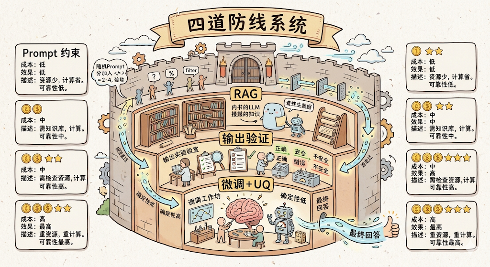

*img*

- **第一道防线：Prompt 与结构化输出约束**。改造成本通常较低，但不是权限或安全边界。
- **第二道防线：RAG、数据库或工具检索**。提供外部证据，代价是索引、调用、延迟和治理。
- **第三道防线：输出验证**。增加延迟和成本，可在高风险或高价值路径上按风险启用。
- **第四道防线：领域微调与不确定性校准**。适合稳定的行为和任务能力，仍需要回归评测与外部事实核验。

### 按风险等级分层管控

最后，在企业应用中，建议按风险等级来分层管控幻觉：

- **高风险场景**（医疗诊断、法律建议、金融决策）：根据法规和组织流程配置权威数据源、权限、引用/规则校验、人工审核、拒答和审计；RAG 不是单独的合规证明。
- **中风险场景**（客户服务、内容生产、代码辅助）：按问题类型配置 Prompt、检索、输出验证和人工升级，并监控错误与越权。
- **低风险场景**（头脑风暴、草稿起草、创意生成）：可以降低验证强度，但仍应明确这是草稿或创意而非事实承诺。

**企业落地的核心原则只有一条：把幻觉当作工程问题而非模型缺陷，用系统设计来约束 AI 的行为边界。**

---

## 总结

好了，到这里，关于 RAG 的十个核心问题就全部讲完了。让我们快速回顾一下：

- **RAG 是什么**：检索增强生成，给大模型「开卷考试」，让它的回答基于真实文档
- **工作流程**：分索引阶段（离线建库）和查询阶段（在线检索+生成）
- **微调 vs RAG**：微调是「内化知识」，RAG 是「外挂参考书」，两者互补
- **文档切割**：从固定大小到语义切割，推荐先用递归字符切割起步
- **Re-rank**：用 Cross-Encoder 或其他模型对候选结果做精排，收益需要在目标数据集上测量
- **Embedding**：从 Word2Vec 到 BERT 再到 BGE-M3，技术不断演进
- **向量数据库**：Milvus、Pinecone、Weaviate 等各有侧重，按需选型
- **多路召回**：向量检索、BM25、结构化或图查询可以融合，收益与成本需要实测
- **效果量化**：用 RAGAS 等框架评估 Faithfulness、Relevance 等核心指标
- **大模型幻觉**：RAG 是降低知识型错误的常见手段，但不能完全消除，需要组合策略

RAG 技术持续演进，从基础的 Naive RAG 到查询改写、多路召回、图式检索和 Agentic RAG 等架构，技术栈仍在变化。

但万变不离其宗，本文讲的这些核心概念是所有 RAG 系统的基石，把基础打牢了，后面的进阶技术学起来就会事半功倍。

希望这篇文章能帮到正在学习 RAG 的林友们。

如果觉得有帮助的话，帮我点个赞和在看吧，你的支持是我继续输出的最大动力。

我们下篇文章见！
