# Claude Code 工程化指南：CLAUDE.md、Skills、Subagents、MCP、Hooks、Plugins 一篇讲透

> 原文：[Claude Code 工程化指南：CLAUDE.md、Skills、Subagents、MCP、Hooks、Plugins 一篇讲透](https://xiaolinnote.com/claudecode/basics/cc_engineering.html) · 小林面试笔记


大家好，我是小林。

用 Claude Code 的人现在是真的多，但我发现一个挺普遍的现象。

大部分人的用法，还停留在「打开终端，敲需求，等它干完」。每次开新会话，都要把项目背景重新交代一遍，我们用什么框架、构建命令是什么、哪些文件不能动。交代完了它干得挺好，可一关掉，下次又是从零开始。

说人话就是，你雇了个能力很强的员工，但他每天下班就失忆，第二天来了你得重新培训一遍。

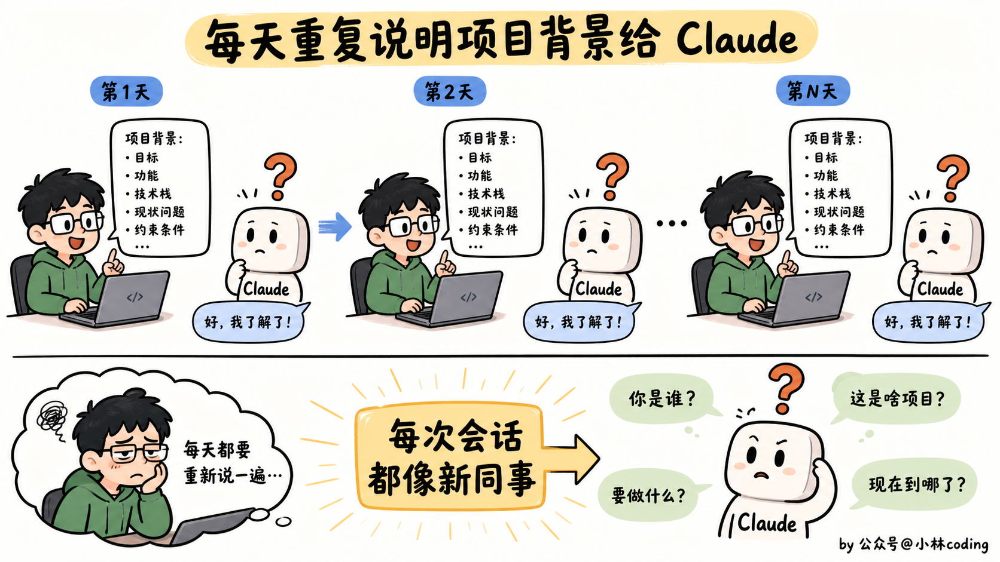

其实 Claude Code 早就给你留好了一整套解决方案，**[CLAUDE.md](http://CLAUDE.md)、Skills、Subagents、MCP、Hooks、Plugins**，一共六样东西。

所以这篇就来聊聊 Claude Code 工程化这个问题。

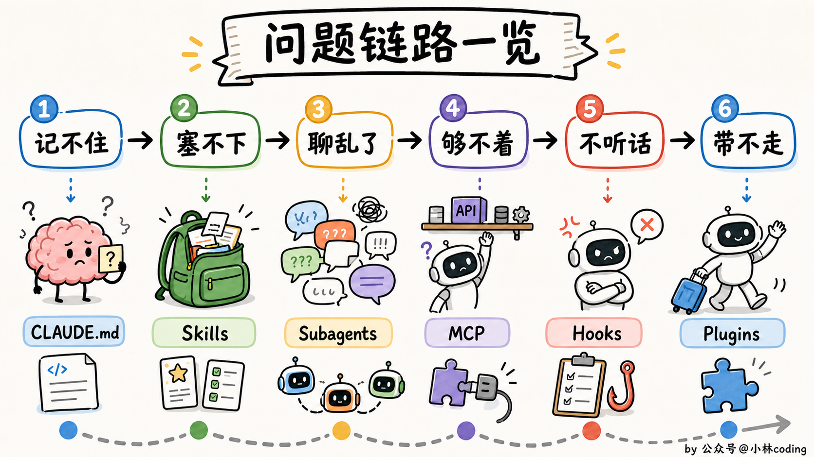

文章有点长，建议先收藏再看。

## 01｜Claude 怎么才能记住你的项目？

### 每次新会话都要重新交代一遍？

先从最扎心的问题开始。

你接手了一个后端项目，用 Claude Code 干活。第一天你跟它说，项目还停在 JDK 8，构建用 mvn 走 package，core 模块是祖传代码别动。它记住了，干得漂亮。

第二天开个新会话，让它加个接口。它上来就写 `Stream.toList()` 和 record，编译直接爆红，顺手还把 core 模块「重构」了一把。

你血压上来了。但冷静想想，这不怪它。

大模型这东西，本身压根没有记忆，每次会话都是一张白纸。你昨天说的话，存在昨天那个会话的上下文里，会话一关，什么都没留下。

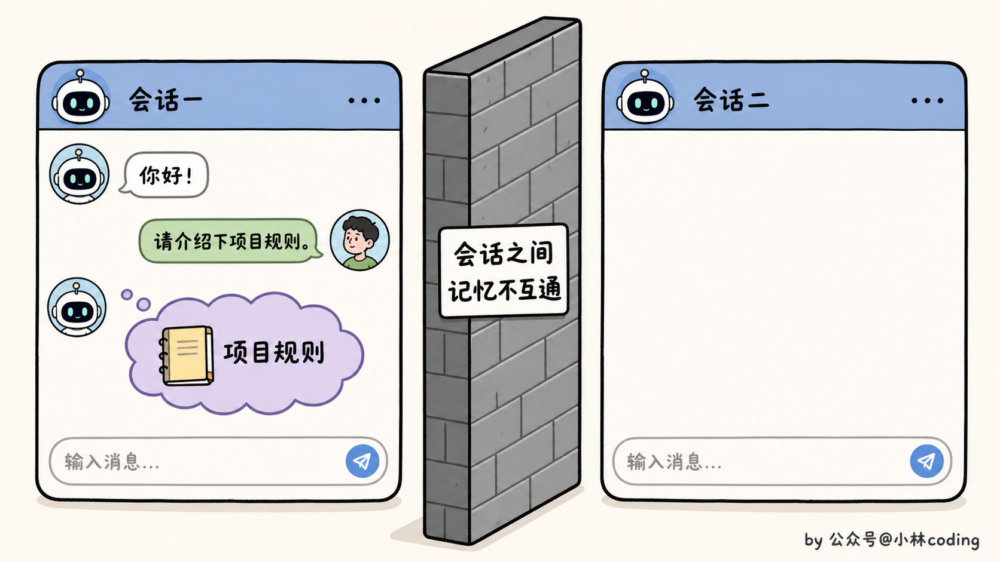

那怎么办？Claude Code 给的答案简单到有点朴素，写个文件。

你在项目根目录放一个叫 `CLAUDE.md` 的 markdown 文件，每次开新会话，Claude Code 都会自动把它读进来，塞进对话的最前面。你后面说的每一句话，都是在这份文件打底的前提下被理解的。

说白了就是给新员工的入职手册。人还没开始干活，规矩先看一遍。你不用每天重新培训，因为培训材料就钉在工位上。

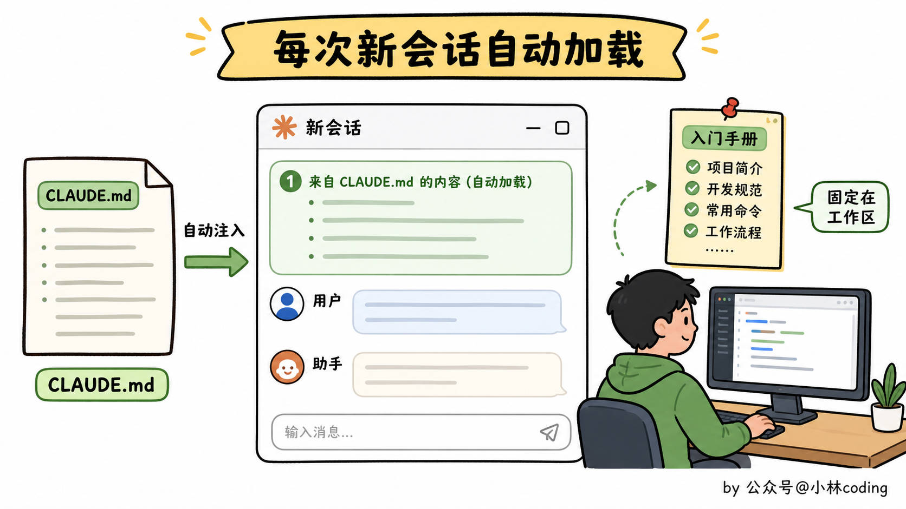

### CLAUDE.md 放哪、怎么被加载？

[CLAUDE.md](http://CLAUDE.md) 不止能放一个地方。

放在 `~/.claude/CLAUDE.md` 的是全局配置，你所有项目都会加载，适合写个人偏好，比如「回答用中文」「commit 信息别写太长」。

放在项目根目录的是项目配置，也是最常用的一层，写这个项目的技术栈、命令、规范。

还可以放在子目录里。这一层有点讲究，它不是启动就加载的，而是等 Claude 读到那个子目录下的文件时才带进来。大项目里各模块规范不一样，就可以各放各的，互不干扰。

三个层级摆在一起看，就是这么个结构。

```
~/.claude/
└── CLAUDE.md        # 全局，所有项目都加载

my-project/
├── CLAUDE.md        # 项目级，启动就加载
├── web/
│   └── CLAUDE.md    # 动到 web 模块的文件才加载
└── core/
    └── CLAUDE.md    # 动到 core 模块才加载
```

还拿前面那个 Java 项目说。个人偏好写在全局那份里，走到哪个项目都带着。JDK 版本、构建命令这种项目级规矩写在根目录。web 模块有自己的接口规范，core 模块有一堆「别动」的禁令，各写各的，Claude 干到哪个模块，哪份规矩才进场。

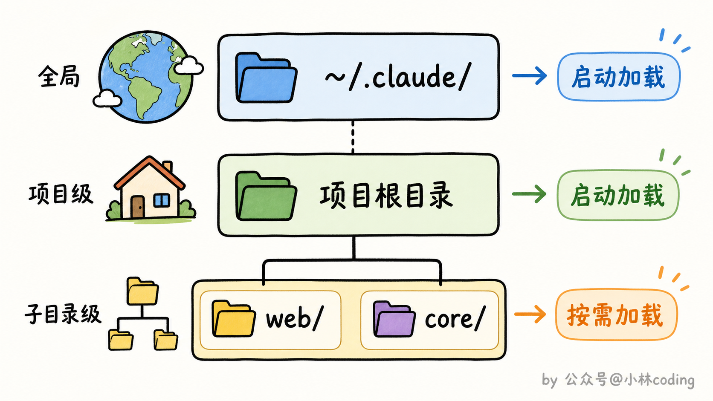

对了，除了你手写的 [CLAUDE.md](http://CLAUDE.md)，Claude Code 还有一套自动记忆。它会在干活过程中自己记下一些经验，比如「这个项目的构建产物在 dist 目录」「用户喜欢先写测试」，存到自己的记忆目录里，下次会话自动想起来。

你写规矩，它记经验，两边凑一块才算全。

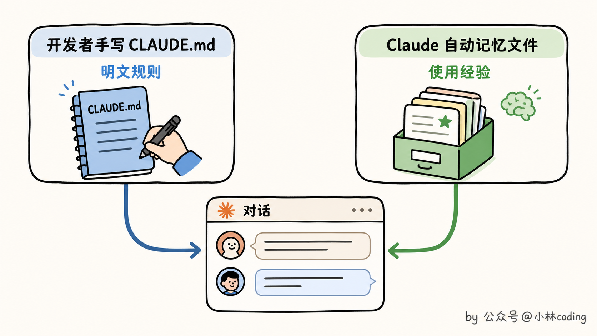

### 一份像样的 CLAUDE.md 长什么样？

光说不练没感觉，我把自己一个项目里的 [CLAUDE.md](http://CLAUDE.md) 抽几段出来给你看。

```markdown
# 项目说明
Spring Boot 服务，JDK 8，禁止用高版本语法。

## 常用命令
- 单测：mvn test -pl web
- 打包：mvn clean package -DskipTests

## 铁律
- core 模块是待下线的祖传代码，只读，不许改
- 表结构变更必须走 Flyway，不许手写 ALTER TABLE
```

没什么花头，就是大白话写规则。但有几个讲究。

命令要写全，别写「跑一下测试」，要写 `mvn test -pl web` 这种能直接复制执行的。禁令要写死，「尽量不要改」这种软话没用，就写「不许改」。

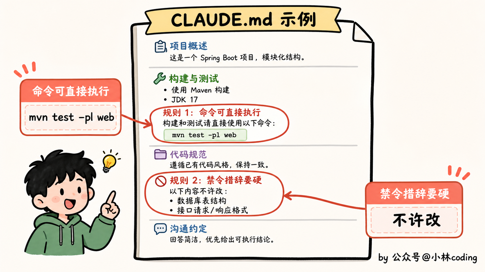

那么问题来了，什么才配写进 [CLAUDE.md](http://CLAUDE.md)？我的标准就一条，每次会话都用得上的才留下。

我见过有人把整个架构文档、接口文档全贴进 [CLAUDE.md](http://CLAUDE.md)，写了一千多行，自我感觉很充实。结果 Claude 该忘的还是忘。因为这个文件是每次会话都全量加载的，你塞得越多，真正重要的规则就被稀释得越狠。

[CLAUDE.md](http://CLAUDE.md) 是入职手册，不是公司图书馆。


但这样一来，新的问题就冒出来了。

那些不是每次都用、但用的时候很重要的东西，往哪放？比如一整套 code review 的检查清单，比如发布流程的操作步骤。塞进 [CLAUDE.md](http://CLAUDE.md)，每次会话都白白吃掉一堆上下文。不写，用的时候它又不知道。

这就轮到六件套里的第二样登场了。

## 02｜不常用的知识该往哪放？

### 为什么不能全塞进 CLAUDE.md ？

先算一笔账。

Claude 的上下文窗口是有限的，就当是它的工作记忆，装满就没地方了。[CLAUDE.md](http://CLAUDE.md) 里的每一个字，每次会话都要占一份工作记忆，不管这次任务用不用得上。

你写了三千字的 code review 清单进去，结果今天的任务是改个文案错别字。这三千字照样加载，照样占地方，照样分散它的注意力。

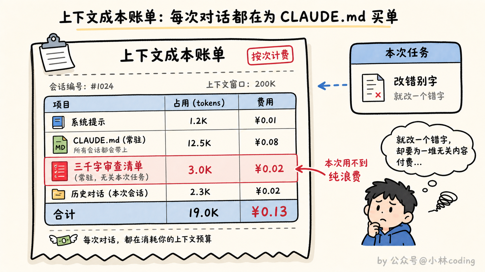

说实话，这就跟你入职第一天，主管把公司所有部门的操作手册全打印出来让你背一样。你要的是「用到的时候知道去哪查」，而不是全背下来。

Claude Code 给这个问题的答案叫 Skill。

### 一个 Skill 长什么样？

Skill 的设计，我第一次看懂的时候真有点想拍大腿。核心就一个点，拆两层加载。

每个 Skill 是一个文件夹，里面放一个 `SKILL.md`，文件开头有一段 frontmatter，就是用两条横线包起来的元信息，里面有名字和一句话描述。

启动的时候，Claude 只加载所有 Skill 的「一句话描述」，正文一个字都不读。等你真的提出相关任务，它发现描述对得上，才去把正文完整读进来。

启动时 Claude 眼里的 Skill 库，其实就是一张这样的单子。

```
code-review    审查代码改动时用，带团队检查清单
deploy-check   上线发布前用，带发布步骤和回滚预案
db-migrate     改表结构时用，带 Flyway 操作规范
```

三行描述，几十个字，每个 Skill 背后的完整正文一个字都还没进来。

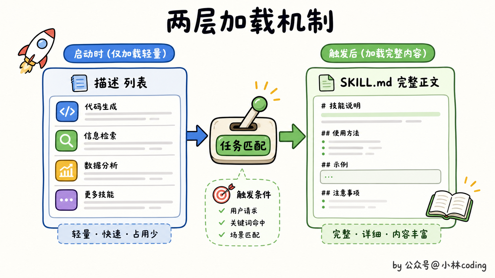

[CLAUDE.md](http://CLAUDE.md) 是全文背诵，Skill 呢，记住书名就行，用时再翻书。

一个描述几十个字，你装二十个 Skill，常驻成本也就千把字。但每个 Skill 背后可以挂几千字的正文，甚至还能在文件夹里附带参考文档和脚本。书多了，书架没变重，大概就是这么个意思。

很多同学估计就问了，装了这么多 Skill，Claude 怎么知道什么时候用哪个？

大多数时候你不用管，你说「帮我 review 这个改动」，它扫一眼描述列表，发现有个 Skill 管这事，就自己加载了。你也可以直接点名，输入斜杠加名字，比如 `/code-review`，强制唤起。

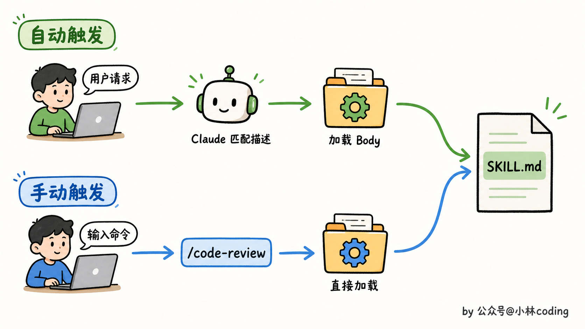

### 举个例子，把 code review 清单做成 Skill

我把一套 review 流程做成了 Skill，放在项目的 `.claude/skills/code-review/` 目录下，[SKILL.md](http://SKILL.md) 大概长这样。

```markdown
---
name: code-review
description: 审查代码改动时使用，包含团队的检查清单和输出格式
---

审查改动时按以下重点检查：
1. 有没有绕过 service 层直接查库
2. 新接口有没有做参数校验
3. 错误处理是吞掉了还是往上抛了
审查结果按「问题、位置、建议」三栏输出。
```

frontmatter 里那句 description 是整个 Skill 的门面，Claude 全靠它判断这个 Skill 什么时候该被唤起，所以要写清楚「什么时候用」。

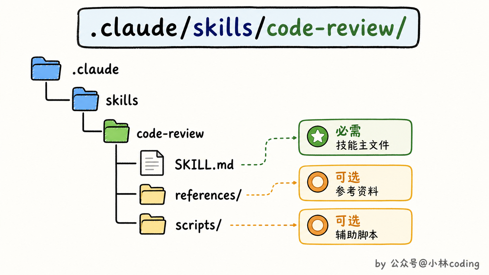

装上之后效果很直接。平时聊天，这套清单完全不占地方。一旦我说「看下这次的改动有没有问题」，它就把清单加载进来，按团队的标准逐条过，输出格式都是统一的。

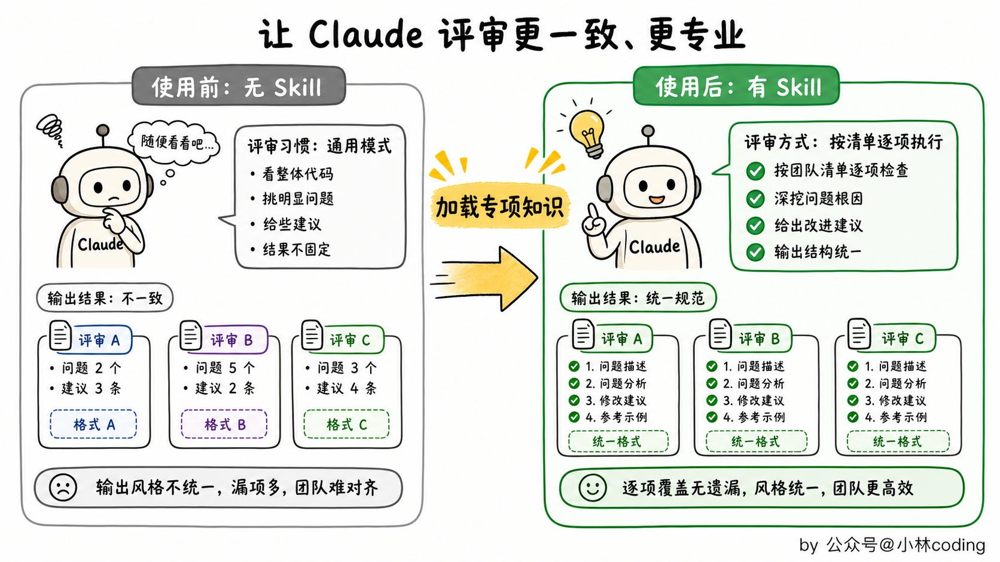

记忆的问题，到这算是解决得七七八八了。常用的进 [CLAUDE.md](http://CLAUDE.md)，专项的做成 Skill。

但你真拿它干重活的时候，会撞上另一堵墙。

比如让它做一次全仓库的安全审查。它吭哧吭哧搜了几十个文件，读了一堆代码，每一次搜索结果、每一段文件内容，全都堆在你的主对话里。审查完了，你想接着聊点别的，发现它开始犯糊涂了，前面说过的话它记不清了。

上下文被垃圾信息灌满了。

## 03｜怎么让 Claude 变成一支小团队？

### 主对话为什么越聊越笨？

这个现象很多人都遇到过，会话用久了，Claude 明显变笨。

原因不玄乎。上下文窗口就那么大，你让它搜索文件、分析日志，这些动作产生的中间信息，搜到的每个文件路径、读过的每段代码、跑命令的每行输出，全都留在对话里。

真正有价值的可能就是最后那三行结论，但为了得出这三行，它往上下文里塞了几万字的过程垃圾。

窗口快满的时候，要么旧内容被压缩丢失，要么新任务没地方施展。你精心写的 [CLAUDE.md](http://CLAUDE.md) 规则，也在一堆日志输出里被淹没了。

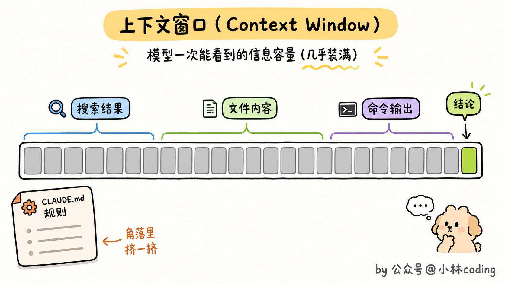

人类团队怎么解决这个问题？主管不会自己扎进日志里逐行翻，他会把活派给组员，「你去查一下昨晚的报错，查完给我个结论」。

组员翻了三小时日志，主管只收到一句「是缓存节点内存溢出，建议调大驱逐阈值」。过程留在组员那里，结论进入主管的脑子。

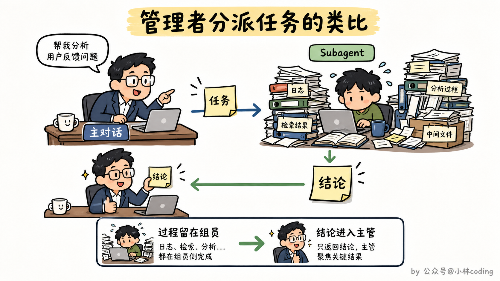

Subagent 干的就是组员这个角色。

主对话把任务派出去，Subagent 在一个完全独立的上下文里干活，搜索、试错、翻文件随便折腾，都污染不到主对话。干完了，只把汇总结果交回来。

更妙的是可以并行。比如安全漏洞、性能隐患、测试覆盖，三路检查互不依赖，派给三个 Subagent 同时跑，主对话就在那等结果，效率直接翻倍。

### Subagent 是怎么配出来的？

配置方式跟 Skill 一脉相承，也是放文件。项目的 `.claude/agents/` 目录下，一个 markdown 文件就是一个 Subagent。

文件分两截。frontmatter 写元信息，名字、什么时候用、能用哪些工具、跑哪个模型。正文写它的系统提示，相当于给这个「组员」的岗位说明书。

frontmatter 里我最喜欢 tools 这个字段。审查代码的 agent，你就只给它读文件和搜索的权限，不给写权限，它想改代码都改不了，天然安全。

model 也很实用。翻日志、跑批量搜索这种体力活，指定用便宜快速的模型，需要深度推理的分析再上贵的。一支团队里有主力有助手，成本就压下来了。

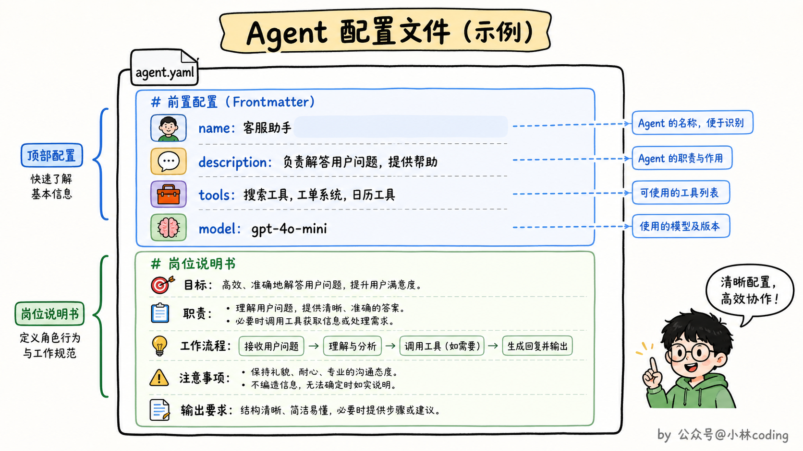

### 举个例子，一个 code-review 小分队成员的配置

```markdown
---
name: code-reviewer
description: 代码改动的专项审查，检查安全、性能与规范
tools: Read, Grep, Glob
model: haiku
---

你是团队的代码审查员，只做审查不做修改。
逐个检查改动文件，重点看安全漏洞与性能隐患。
最终只输出问题列表与修改建议，不要贴大段代码原文。
```

注意最后一句，「只输出问题列表，不要贴大段代码原文」。这是 Subagent 的精髓，它在自己的上下文里可以读几万行代码，但交回主对话的必须是提纯后的结论。

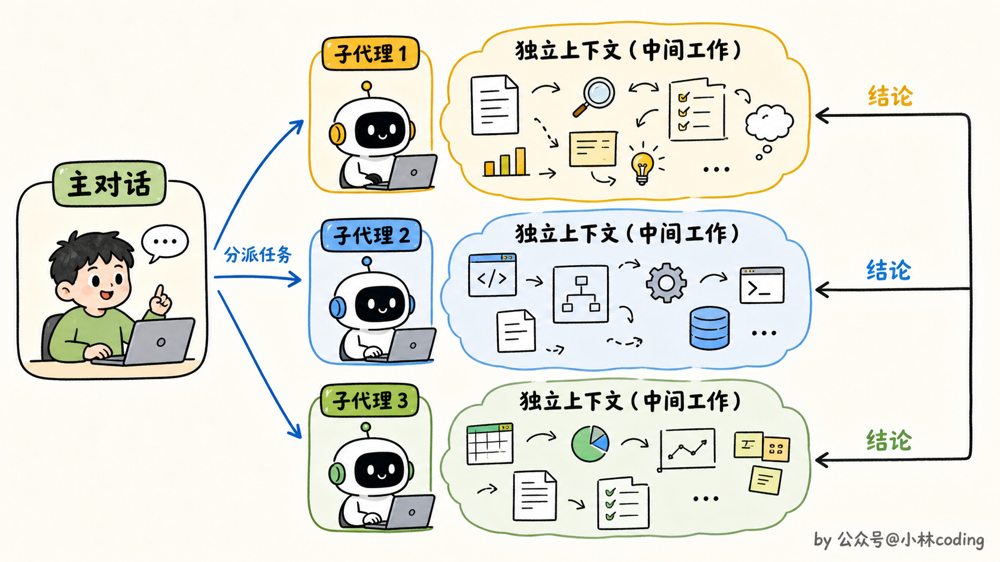

那是不是什么活都该拆出去？还真不是。

适合拆的是「过程重、结论轻」的任务，大范围搜索、日志分析、专项审查。反过来，你们正在反复讨论的方案就别拆，拆出去 Subagent 两眼一抹黑，还得重新交代半天，得不偿失。

这个度我也是拆错过几次才摸到的。有一次把一个改到一半的需求丢给 Subagent，它交回来的东西驴唇不对马嘴，从那以后我只往外派「查清楚一件事」这种边界干净的活。

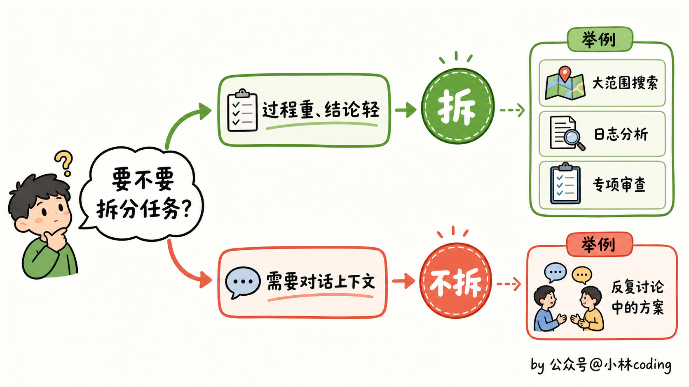

你的 Claude Code 现在有记忆、有专项知识、还带了一支小团队，像模像样了。

但它还有个先天残疾，所有能力都圈在本地这台机器上。你让它「看看 GitHub 上那个 PR 有什么问题」，它一脸诚恳地告诉你，我无法访问外部网站，你可以把内容粘贴过来。

一个连 PR 都摸不到的审查员，清单写得再好也白搭。

## 04｜Claude 怎么够得着外部系统？

### 会「说」不会「做」是什么意思？

有个事情很有意思。你问 Claude 怎么用 GitHub 的接口拉 PR 列表，它能给你写出完整代码，参数、鉴权、分页全都对。

但你让它「直接帮我拉一下」，它做不到。

知识它有，手没有。模型再聪明，它也只是在生成文字，没有一条真实的通道让它去调用外部系统。数据库、GitHub、公司内部的工单系统，它全都够不着。

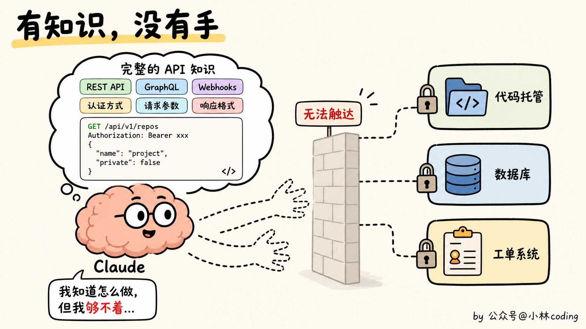

早期大家的解法是各写各的插件，OpenAI 一套接法，Claude 一套接法，每个工具还得为每家 AI 单独适配一遍。工具方累死，用户也乱死。

后来 Anthropic 牵头出了个协议，就是 MCP，Model Context Protocol。它干的事说人话就是，给 AI 和外部工具之间定一个统一的插口。工具方照着协议实现一个 MCP Server，任何支持 MCP 的 AI 应用都能直接插上用，不用再各家单独适配。

跟 USB-C 一个道理。以前每个手机一种充电口，现在一根线走天下。

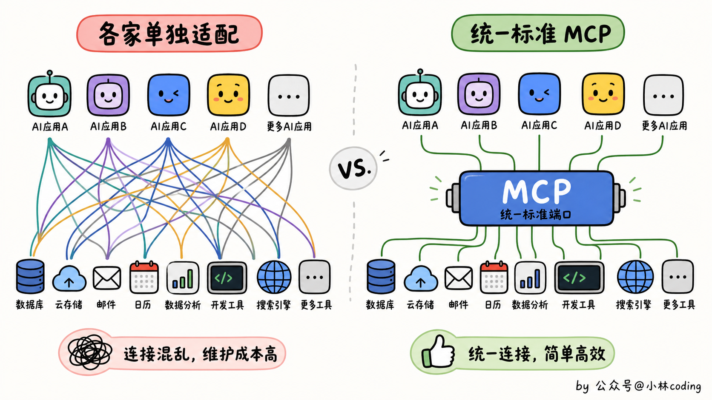

### MCP 协议到底约定了什么？

架构上就两个角色。Claude Code 这边是 Client，工具那边是 Server。

Server 对外声明自己有哪些本事，最主要的就是 tools，一组可以被调用的工具。每个工具带着名字、说明和参数定义。拿 GitHub 的 Server 来说，Claude 连上后拿到的工具清单大概是这个样子。

```
get_pull_request     读取某个 PR 的详情和改动
list_issues          按条件列出仓库的 issue
add_issue_comment    在 issue 或 PR 下发表评论
```

任务需要时，Claude 从清单里挑一个发起调用，Server 执行完把结果传回来。

Server 装在哪都行。跑在你自己机器上的就是个本地进程，走标准输入输出通信，适合操作本地资源。也可以部署在服务商那边，走 HTTP 连过去，GitHub、Notion 这些官方服务基本都提供了。

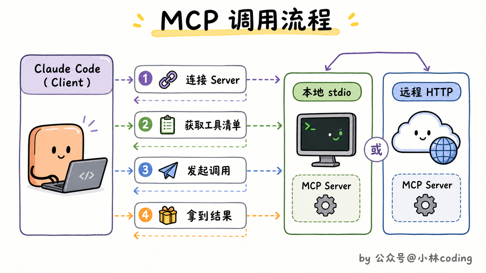

看到这估计有同学就问了，这不就是工具调用吗，跟 Skill 有什么区别？

还真不是一回事。Skill 给的是知识和流程，说明书那种东西。你照着说明书能知道怎么做，但说明书自己不会动手。真能伸出去的手，是 MCP 给的。

实际用起来，这俩经常是配合着用的。比如 Skill 里写着「审查完把结果提交到工单系统」，这是流程。真到提交那一步，动手的是 MCP。

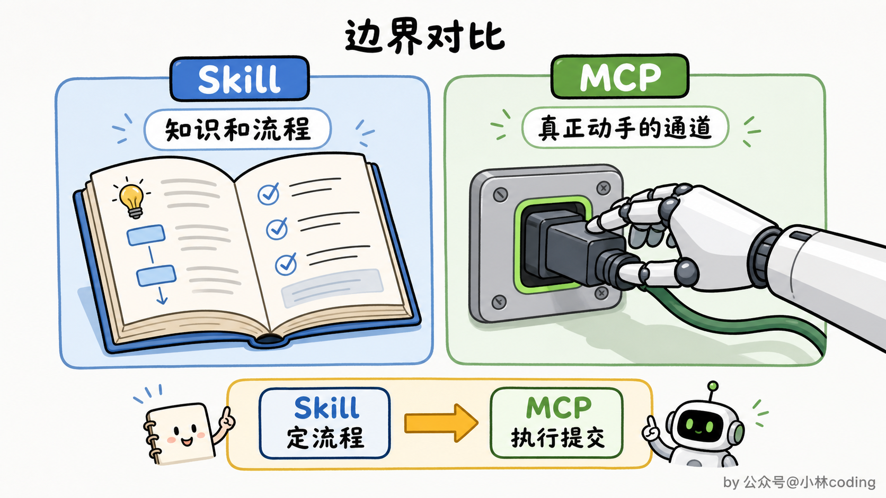

对了，还有一个边界问题值得一提。如果一个工具本来就有好用的命令行，比如 git、gh，Claude 直接在终端里敲命令就行，不一定非要 MCP。

MCP 真正的价值在那些没有现成命令行、或者需要保持长连接和鉴权状态的系统上。

### 举个例子，接上 GitHub 之后能干什么

接入就一条命令的事，带上你在 GitHub 上生成的访问令牌。

```bash
claude mcp add --transport http github https://api.githubcopilot.com/mcp/ \
  --header "Authorization: Bearer 你的GitHub令牌"
```

连上之后，感受一下前后差别。

以前你说「看下 128 号 PR 改了什么」，它说我访问不了。现在同样一句话，它直接调用 MCP 工具把 PR 的改动拉下来，结合你 Skill 里的审查清单逐条过，最后还能把审查意见评论回 PR 上。

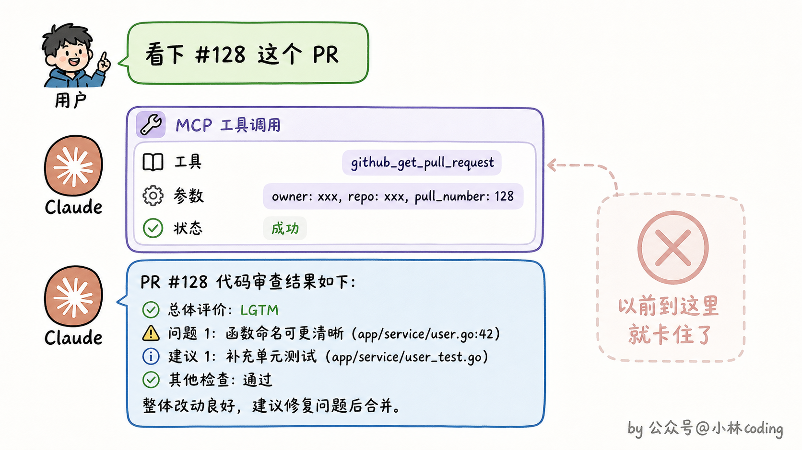

你看，链路这就通了。

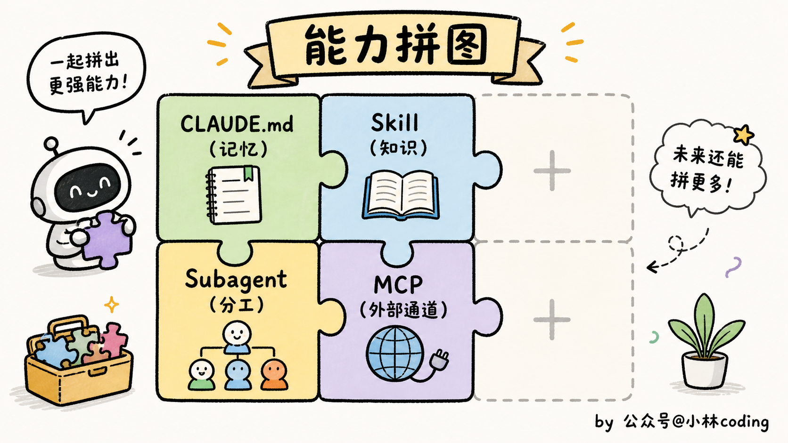

不过用得越深，你会发现一个更隐蔽的问题。

我在 [CLAUDE.md](http://CLAUDE.md) 里写了「每次改完代码要跑一遍格式化」。十次里有八次它照做，剩下两次，忘了。不是它态度不好，是提示词这个东西，本质上就管不了「必须」。

## 05｜规则怎么才能次次生效？

### 写在提示词里的规则，为什么会被无视？

怎么说呢，这个问题我想了挺久才想明白，想明白之后看很多事都顺了。

[CLAUDE.md](http://CLAUDE.md) 也好，Skill 也好，里面写的所有规则，最终都是变成文字交给模型去「理解并遵守」。而模型是概率生成的，它大概率会遵守，但没有任何机制保证百分之百。

上下文一长，规则就被稀释了，任务再一复杂，它的注意力早被别的东西抢走了。于是就出现「十次有八次照做」的情况。

对了，这跟开篇那个「失忆」不是一回事。那是规则压根没进会话，这回规则明明就摆在上下文里，它还是能漏。

说白了，提示词是建议，不是法律。你在员工手册里写「下班要锁门」，员工大部分时候记得，但总有忘的那天。真想万无一失，你装的是门禁系统，人走门自动锁，不依赖任何人的自觉。

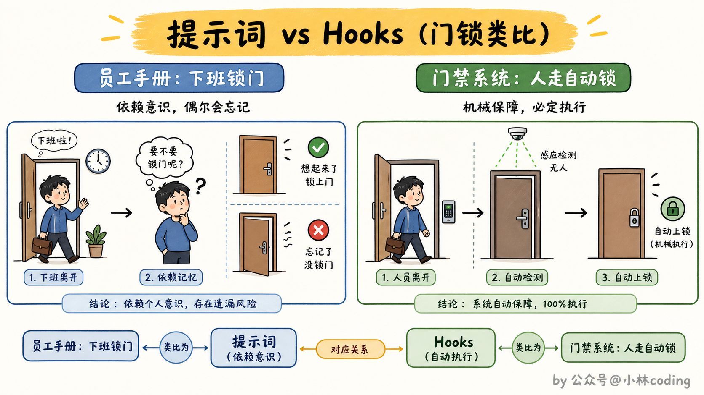

Hooks 就是 Claude Code 的门禁系统。

它让你在 Claude 工作流程的关键节点上，挂一段自己的 shell 命令。节点一到，命令就跑，没有商量的余地。这里压根没有模型什么事，它理不理解、自不自觉，都不影响这段命令执行，纯粹是程序层面的强制触发。

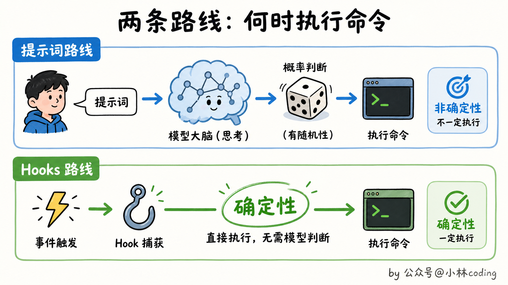

### Hook 挂在哪些环节上？

Claude Code 把一次会话的生命周期切出了一串事件。会话启动、你提交提示词、每次工具调用之前、工具调用之后、Claude 准备结束回复，这些时机全都可以挂 Hook。

用得最多的是工具调用前后这两个。调用前的 Hook 能做拦截，检查这次操作合不合规，不合规直接摁住不让执行。调用后的 Hook 做善后，比如改完文件自动跑格式化。

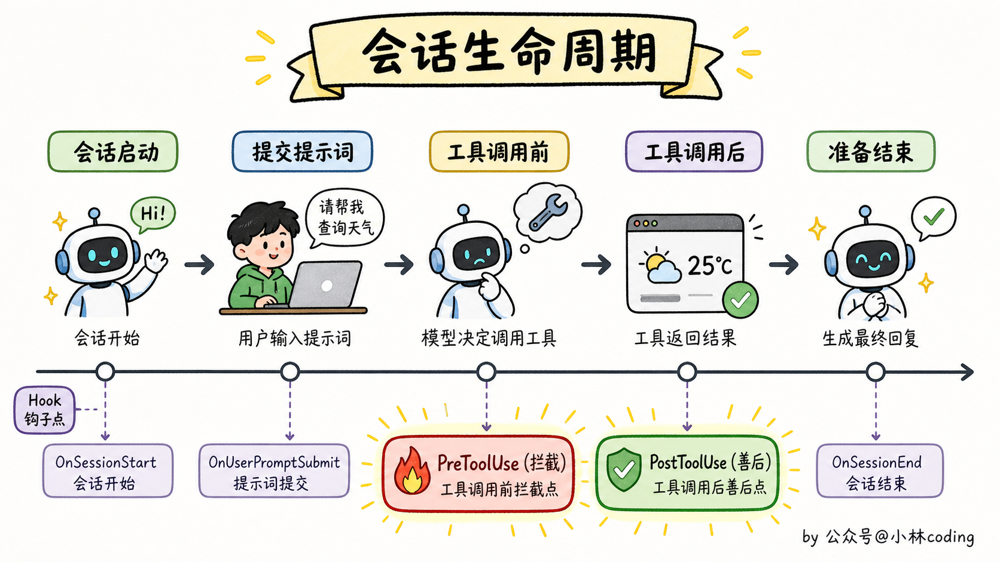

配置写在 `settings.json` 里，就两样东西要认识。matcher 负责筛选，比如只匹配「编辑文件」这类工具调用。command 就是要执行的命令，事件命中就跑。

命令的退出码是有讲究的。退出码是 0，一切正常放行。退出码是 2，这次操作直接被拦截，命令的报错信息还会回传给 Claude，它看到之后会自己调整做法。

说人话就是，门禁不光能拦人，还能告诉他为什么被拦、该走哪个门。

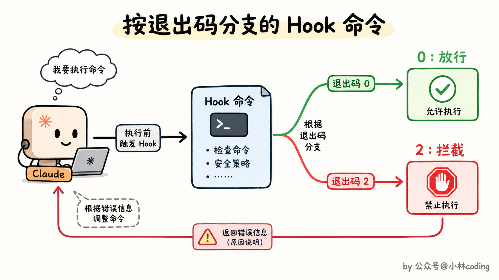

### 举个例子，自动格式化和敏感文件保护

善后型的最常用，比如改完文件自动格式化。

```json
"hooks": {
  "PostToolUse": [{
    "matcher": "Edit|Write",
    "hooks": [{ "type": "command",
      "command": "jq -r '.tool_input.file_path' | xargs npx prettier --write" }]
  }]
}
```

拆开看很好懂。PostToolUse 是挂载点，工具调用之后触发。matcher 筛出「编辑或写入文件」这类操作。command 里 jq 那一截看着唬人，讲真我第一次配的时候也愣了一下，其实就是从事件信息里抠出这次改的是哪个文件，抠出来直接喂给 prettier。

此后任何文件被编辑，prettier 必然跑一遍，我再也没在 [CLAUDE.md](http://CLAUDE.md) 里念叨过格式化的事。

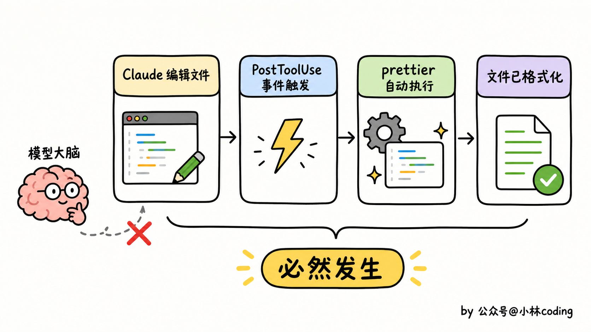

格式化是让它多做事，还有一类正相反，是不许它做的事，比如动敏感文件。这次把 Hook 挂在工具调用之前。

```json
"PreToolUse": [{
  "matcher": "Edit|Write",
  "hooks": [{ "type": "command",
    "command": "~/.claude/hooks/protect.sh" }]
}]
```

[protect.sh](http://protect.sh) 里就几行 shell。

```bash
#!/bin/bash
file=$(jq -r '.tool_input.file_path')
if [[ "$file" == *".env"* || "$file" == *"secret"* ]]; then
  echo "敏感文件禁止修改" >&2
  exit 2
fi
```

逻辑一眼就能看明白。取出这次要动的文件路径，发现命中 `.env` 或者密钥文件，就带着报错信息用退出码 2 退出。

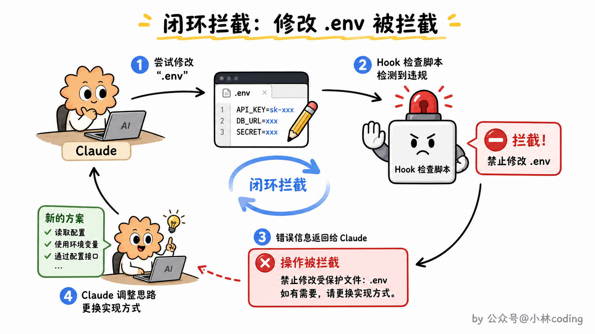

效果很有意思，Claude 的操作被摁住，它收到报错信息「敏感文件禁止修改」，然后它会跟你说，这个文件被保护了，我换个方案。整个过程你一个字都不用说。

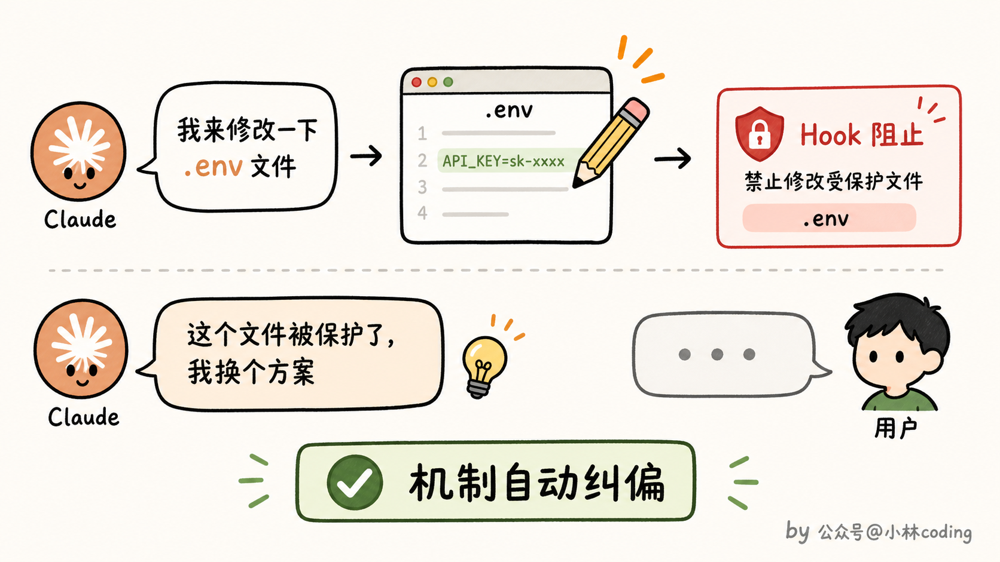

到这里，六件套就差最后一块拼图了。你手上这套 Claude Code，有记忆、有知识库、有团队、有外部通道、还有铁的纪律。

然后现实问题来了。这一摊配置，[CLAUDE.md](http://CLAUDE.md)、几个 Skill、几个 Subagent、MCP 接入、一串 Hooks，全都散落在这个项目的各个角落。

下周你开新项目，全得手动搬一遍。同事看你用得好想抄作业，你只能把文件一个个发给他。过两个月你更新了审查清单，他那份还是旧的。

## 06｜这套配置怎么打包带走？

### 换个项目就要重配一遍？

配置多了之后，分发就成了真问题。

手动复制的毛病，干过的都懂，容易漏、版本乱。你自己的三个项目里躺着三个版本的 code-review Skill，哪个是最新的，你自己都说不清。团队里更麻烦，每个人抄作业的时间点不一样，手上的配置千差万别，出了问题都没法对齐。

这个问题在软件行业早就被解决过一次了，答案叫包管理。没有人会靠拷贝文件夹来分发依赖库，大家发布一个包，别人一条命令安装，更新了再拉一次就行。

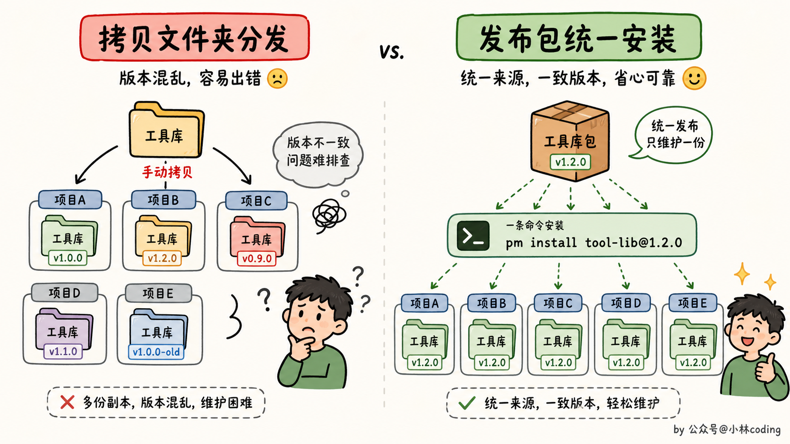

Plugin 就是 Claude Code 配置的包管理。

先说清楚一点，它本身不提供任何新能力，别指望装个 Plugin 就多出什么神仙功能。它干的是打包和分发的活，把 Skills、Subagents、Hooks、MCP 配置装进一个盒子里，发布出去。别人一条命令装上，你更新了，他跟着更新。

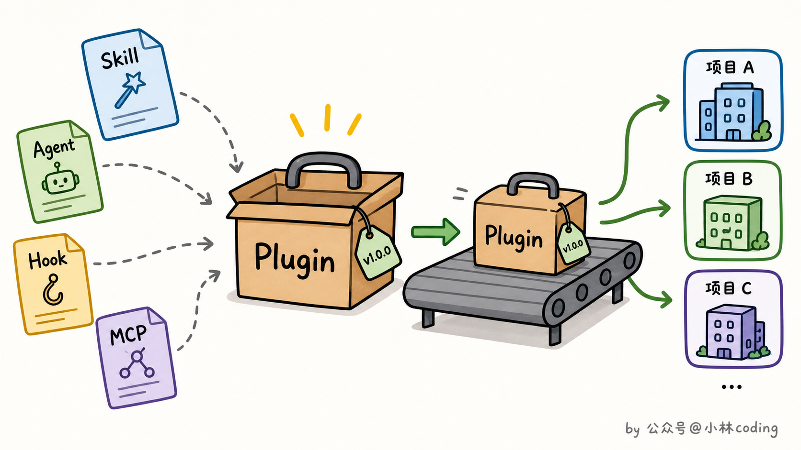

### Plugin 里面装了什么？

一个 Plugin 就是一个约定好结构的文件夹。

```
my-review-kit/
├── .claude-plugin/plugin.json   # 名字、版本、描述
├── skills/        # Skill 们
├── agents/        # Subagent 们
├── hooks/         # Hook 配置
└── .mcp.json      # MCP 接入配置
```

`plugin.json` 是身份证，写清楚名字和版本。剩下几个目录，就是把前面几章那些散装配置按类别归位。你会发现没有任何新概念，Plugin 纯粹是个收纳盒。

分发靠 marketplace。它可以就是一个 git 仓库，团队自己建一个，把插件放进去。使用的人先把这个仓库登记进来。

```
/plugin marketplace add your-team/claude-plugins
```

登记完，这个仓库里的插件就都能看到了，挑想要的装就行。跟手机上「先添加应用商店，再从里面下应用」一个流程。

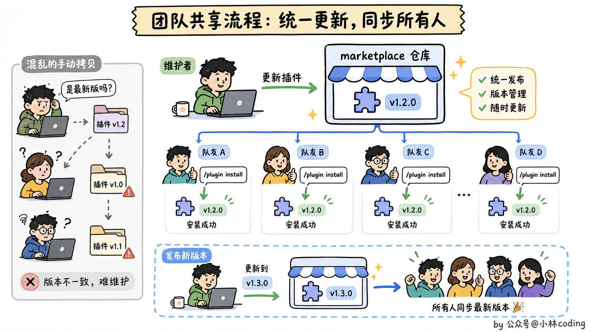

### 举个例子，把前面这些配置装进一个 Plugin

咱们一路走下来，手上已经有这么几样东西了。审查清单 Skill、code-reviewer Subagent、格式化和敏感文件的 Hooks、GitHub 的 MCP 接入。

我把它们按上面的结构归好位，起名 `my-review-kit`，推到团队的 marketplace 仓库。同事那边就一条命令的事。

```
/plugin install my-review-kit@team-marketplace
```

装完，他的 Claude Code 立刻就有了整套审查能力，跟我这边一模一样。我后续更新清单，发个新版本，他更新一下就同步了。

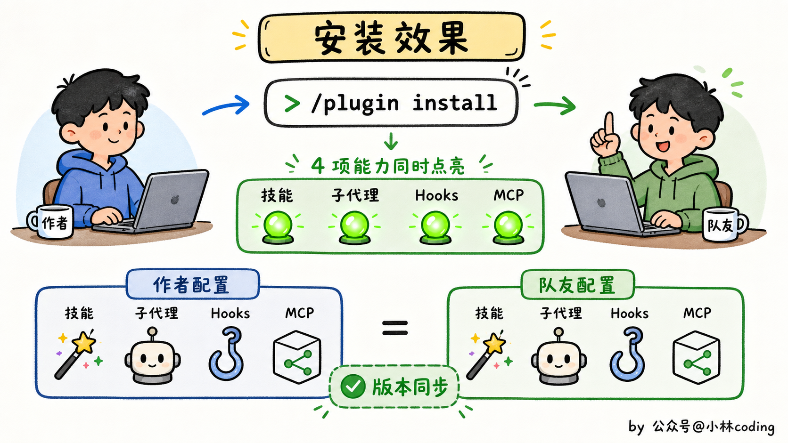

开篇那个「每天失忆的新同事」，到这里已经变成一个带着完整工装、可以批量复制的老师傅。

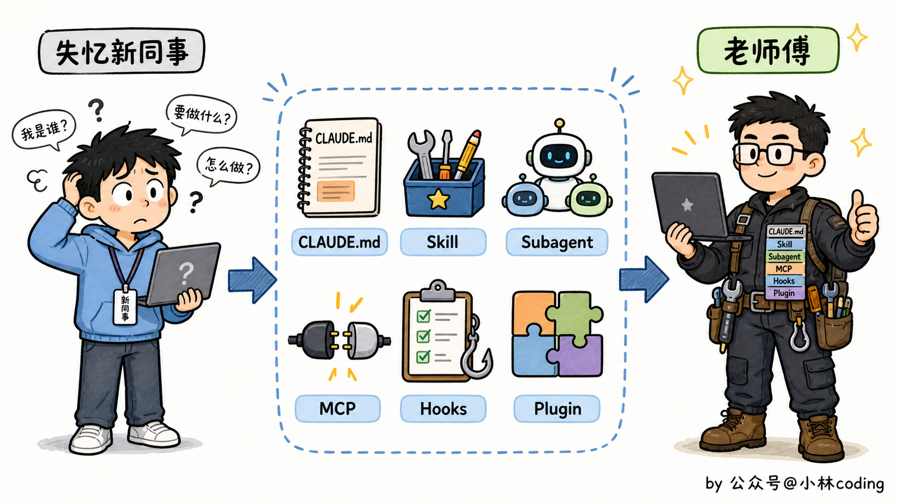

不过有一说一，安全这根弦得绷着。

装别人的 Plugin，跟把来路不明的 U 盘插进公司电脑是一个性质的事。里面的 Hook 能在你机器上执行任意命令，MCP 配置能连外部服务。装之前看看来源，团队内部或者靠谱的开源项目再装，野生插件别乱插。

## 07｜六件套怎么配合打一套完整的？

最后咱们把镜头拉远，看一次完整的配合。

场景就用团队里最日常的，一次代码审查加修改。

会话一开，[CLAUDE.md](http://CLAUDE.md) 先进场。这一步你是完全无感的，但 Claude 已经知道这个项目用什么、忌什么了。

然后你敲了一句「审一下今天这个 PR」。

就这一句话，后面其实发生了不少事。MCP 先把 PR 的改动从 GitHub 拉下来。审查的活呢，不在主对话里干，派给了 code-reviewer Subagent。这个 Subagent 手里还拿着 code-review Skill 里那份团队清单，在自己的上下文里逐个文件过。

那你在主对话里看到的是什么？就一份干干净净的审查结论。搜了多少文件、读了多少代码，你全程不用看。

假设审出三个问题，Claude 接着动手修。这时候 Hook 开始上班了，改一个文件就跟着跑一遍格式化，没人提醒它，也不靠它自觉。中途它想顺手动一下配置文件里的密钥，被拦截 Hook 摁住了。

修完，审查意见通过 MCP 评论回 PR。收工。

还有一个细节，我觉得最有意思。上面这一整套配置，你可能压根没亲手配过，就是上周从团队 marketplace 装的那个 Plugin，全组人手一份，一字不差。

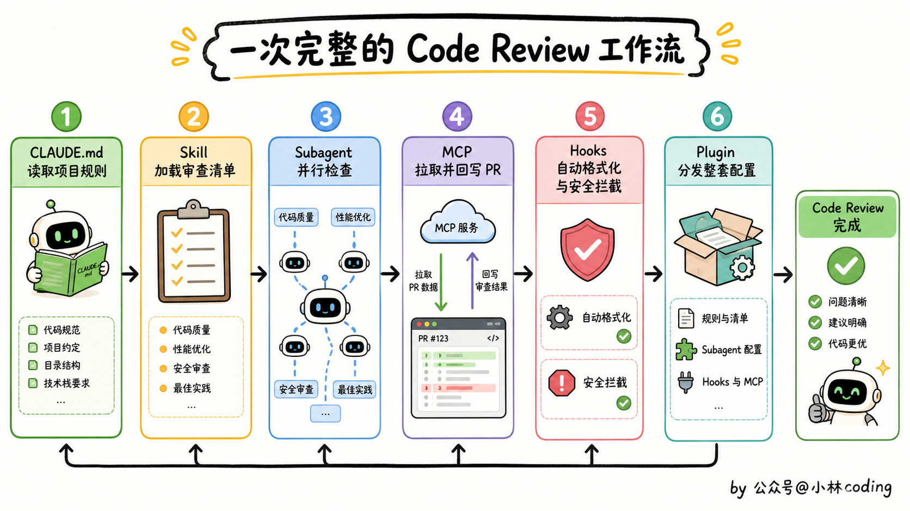

一条流程走完，每个能力各干各的活，少一样都别扭。

最后送一张速查表，以后遇到具体问题，先对号入座再动手。

| 你遇到的问题 | 该用的能力 |
| --- | --- |
| 每次会话都要重新交代项目背景 | [CLAUDE.md](http://CLAUDE.md) |
| 专项知识和流程，用时才需要 | Skills |
| 中间过程太多，主对话被污染 | Subagents |
| 需要访问 GitHub、数据库等外部系统 | MCP |
| 规则必须百分百执行，不能靠自觉 | Hooks |
| 配置要跨项目复用、团队共享 | Plugins |

## 最后

写完这篇，我自己有个挺深的感触。

大家聊 AI 编程，十句里有八句在聊模型，哪家又发新版了，跑分又涨了多少。这些我也天天刷。但讲真，真正拉开使用效果差距的，往往压根不在模型。

你想想，同一个 Claude Code，有人用出来是个每天失忆的实习生。也有人用出来，是一支带着知识库、纪律和外部系统权限的工程团队。

差在哪？模型是同一个模型，差的就是这套脚手架。

模型决定它「能」做到什么。能不能「稳定」做到，看你搭的架子。

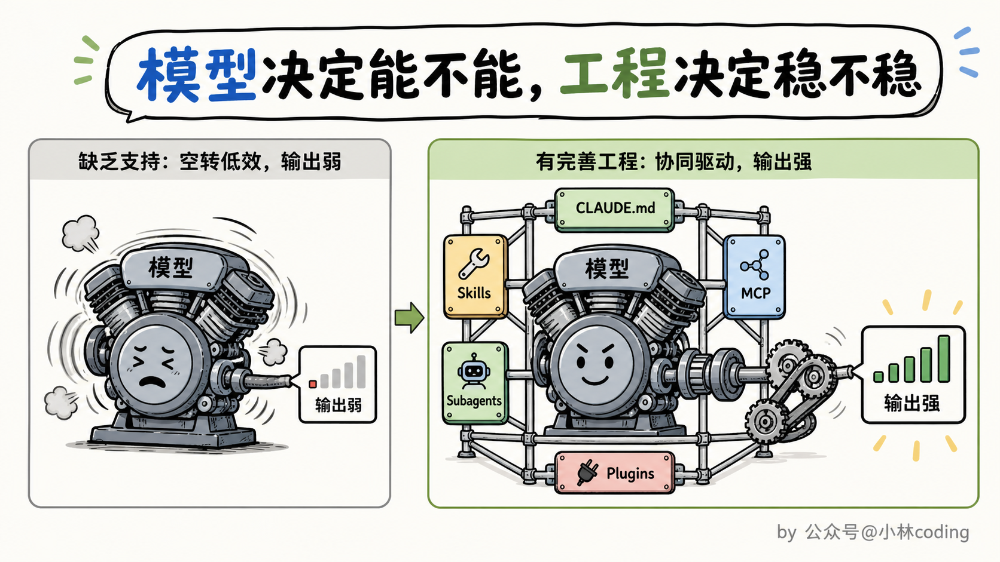

而且你发现没有，这六件套背后的思路全都不新鲜。入职手册、翻书查资料、团队分工、标准接口、门禁系统、包管理，全是软件工程和团队管理里玩了几十年的老经验。

AI 变强了，但让 AI 好好干活的方法，还是那些让人好好干活的方法。

所以别光盯着模型跑分了，回去把脚手架搭起来。工具明年可能又换一茬，这个思路丢不了。
