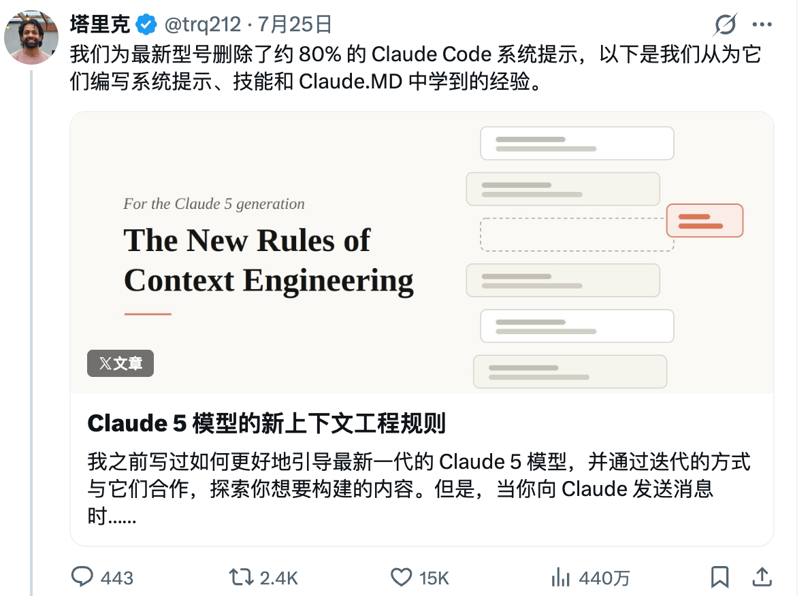
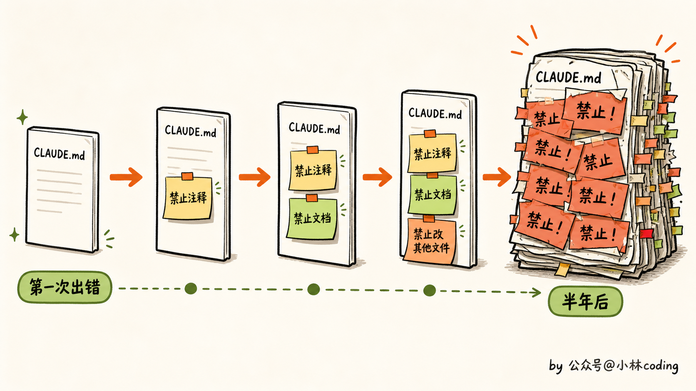
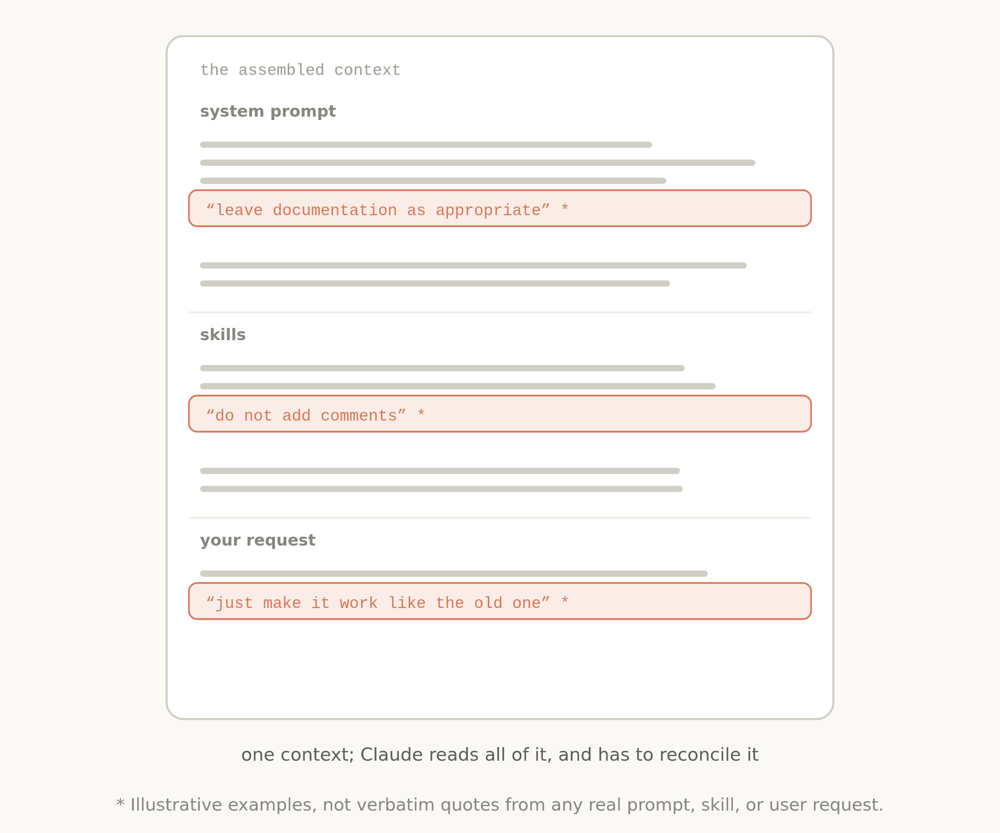
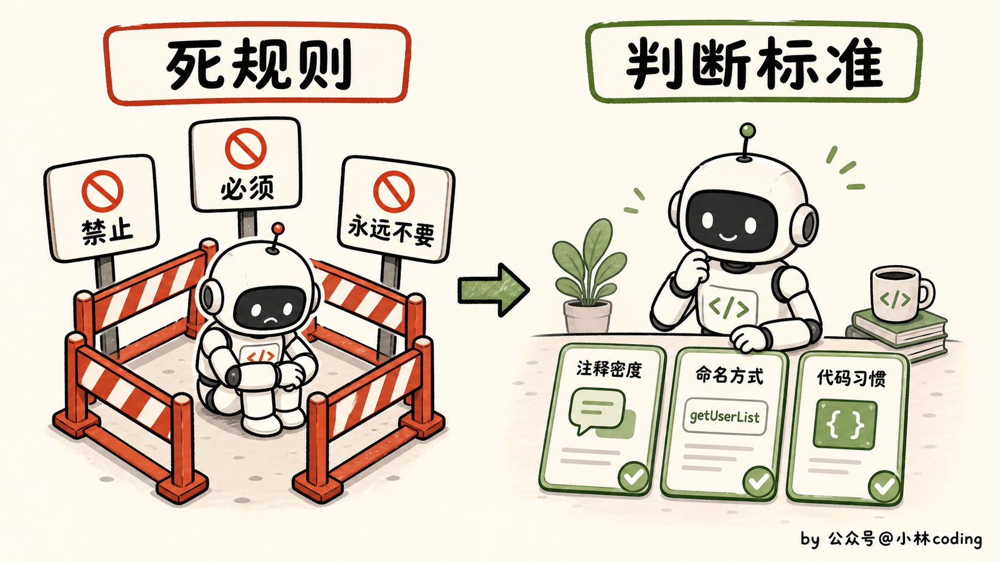
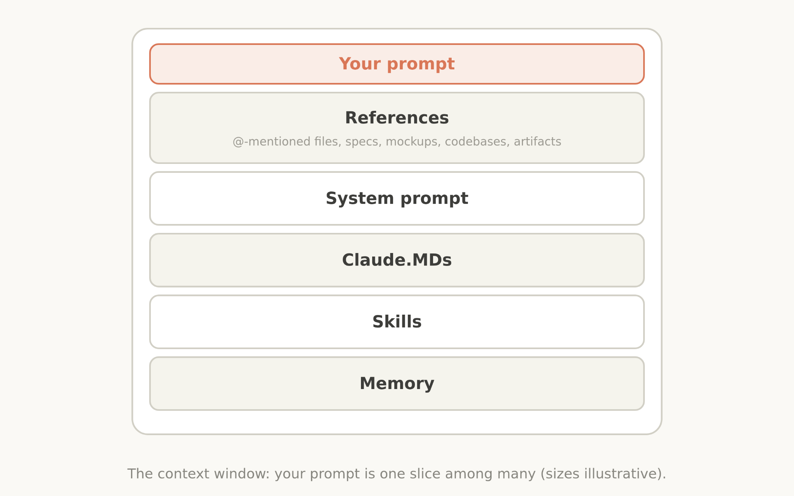
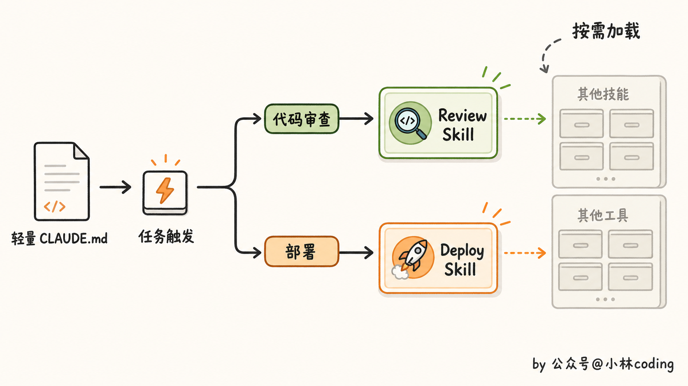
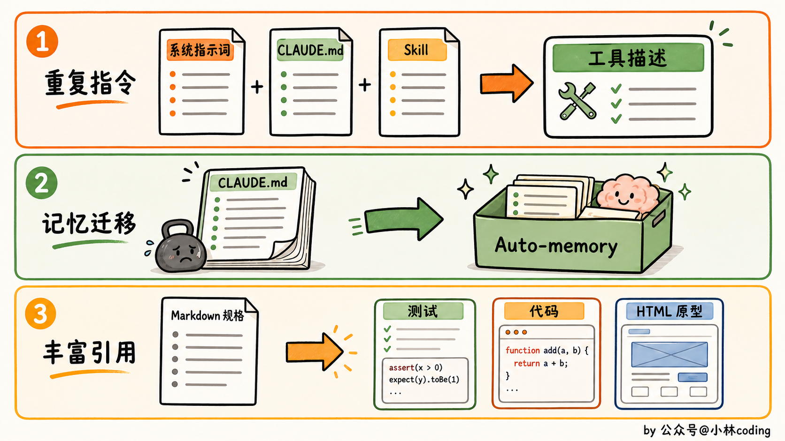
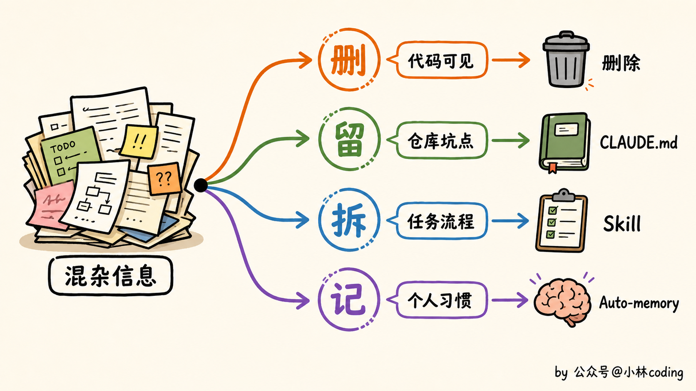
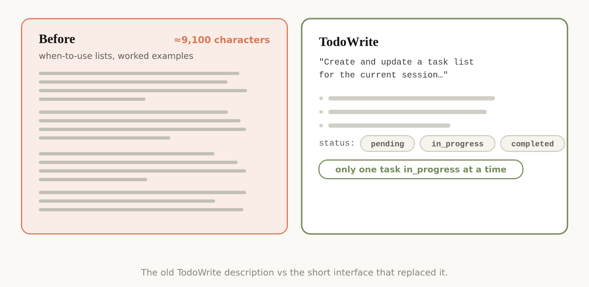
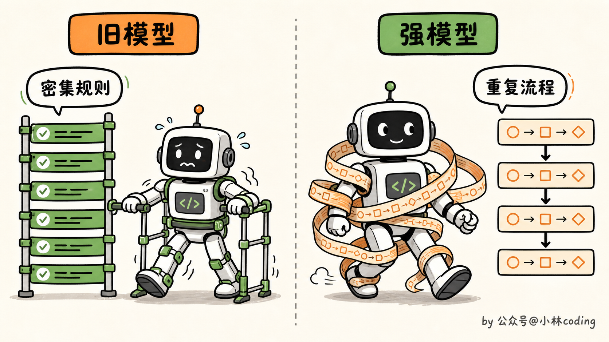

# Claude 5 上下文工程：为什么提示词越写越少？

> 原文：[Claude 5 上下文工程：为什么提示词越写越少？](https://xiaolinnote.com/claudecode/insights/claude5_context_engineering.html) · 小林面试笔记


大家好，我是小林。

前段时间，我看到 Anthropic 官方说，他们把 Claude Code 面向 Claude 5 的系统提示词删掉了 80% 以上。删了这么多，代码评测成绩居然基本没掉。



看到这里我有点懵。大家前面还在研究怎么把提示词写细，怎么突然就开始大删特删了？这不是自己打自己脸吗？

我把这篇文章翻了一遍，发现里面还真有不少东西值得琢磨。尤其是那些以前为了防止模型犯错加上的规则，到了 Claude 5 这里，可能反而开始碍事了。

## 规则写得越多，Claude 怎么还变笨了？

很多人的 `CLAUDE.md` 都是这么变长的。Claude 乱加注释，就补一句「禁止添加注释」。它擅自创建文档，再补一句「禁止创建 Markdown」。它顺手改了别的文件，继续加一句「永远不要修改任务范围之外的代码」。

基本就是犯一次错，再补一条规则。半年以后回头看，`CLAUDE.md` 里全是「必须」「禁止」「永远不要」，很多规则为什么会出现在那里，可能自己都记不清了。



Anthropic 在内部记录里就发现了这个问题。用户说「该写文档的地方就写文档」，系统提示词却说「不要创建分析文档」，项目里的 `CLAUDE.md` 可能又要求「复杂模块必须补文档」。单看都合理，放在一起就打架了。

Claude 还没开始干活，得先判断这几句话到底听谁的。上下文是变多了，真正重要的信息却被埋在一堆历史补丁里。



这些强规则以前确实有用。老模型判断能力不行，直接把路堵死，至少能避开最差的结果。但 Claude 5 已经能结合代码和用户意图做一些判断了，这时候还把原来的防傻规则全留着，模型反而要花更多精力处理这些限制。

## 删掉规则以后，Claude 靠什么做决定？

那这些留下来的规则该怎么写？Anthropic 没有把每个动作继续规定得那么死，而是让模型碰到具体问题时，先看一下项目里的情况。比如旧版 Claude Code 对代码注释的要求就非常狠：

```
默认不写注释。
不要写多段文档字符串。
多行注释最多只能写一行。
```

这套规则简单直接，Claude 肯定看得懂。但它也有一个很大的问题，根本不管你项目原本是什么风格。有些项目就是注释很多，有些复杂算法也确实需要多行解释。这个时候还死守「最多一行」，写出来的代码反而格格不入。

新版提示词把它改成了另一种说法：

```
写出的代码要像周围原有的代码。
保持相近的注释密度、命名方式和代码习惯。
```

你感受一下这两种写法的区别。前一种在告诉 Claude「你只能怎么做」，后一种给了它判断标准，让它先看项目，再决定怎么做。



这其实很像我们带新人。能力还不够的时候，你得把每一步都说死，文件放哪里、函数叫什么、注释写几行，恨不得手把手盯着。等他已经能独立干活了，你再这么管，只会把人管废。这个时候更有效的说法是：「先看看项目里同类模块怎么写，保持一致，有拿不准的地方再问我。」

模型这边其实也差不多。看完这个例子，我感觉 Anthropic 的思路确实变了。以前很多规则是在提前替模型选答案，现在更希望它先看看项目本身，再决定这一处代码到底该怎么写。

## 上下文工程，重点不是使劲塞上下文

不过在往下讲之前，得先把 prompt 和 context 稍微分开一下。

我们平时输入的那句话只是 prompt，Claude 真正拿到的 context 还包括系统提示词、`CLAUDE.md`、Skill、记忆和临时引用的文件。

平时说上下文工程，管的其实是这一整套东西，不只是想办法把用户提示词写得更长。



还有一个变化，我觉得特别重要。很多人理解的上下文工程，就是给模型更多资料。项目介绍塞进去，技术文档塞进去，代码规范塞进去，测试流程也塞进去。反正上下文窗口够大，不塞白不塞。

这思路听着很合理，但 Claude 每次任务真的都需要这些东西吗？

你只是让它改一个按钮颜色，它需要先读完整套后端部署规范吗？你只是让它补一个单元测试，它需要提前知道生产环境怎么回滚吗？大部分时候，不需要。

Anthropic 现在采用的办法叫 progressive disclosure，中文一般叫「渐进式披露」。这个词听起来有点抽象，其实做法并不复杂。先把当前任务肯定会用到的内容放进去，后面真要审查代码或者执行验证，再让 Claude 去读对应的 Skill。

以前 Claude Code 会把代码审查、验证流程等大量说明直接放进系统提示词。模型每次启动都得读，不管这次任务用不用得上。

现在这些内容被拆进了不同的 Skill，要做代码审查时再加载代码审查 Skill，需要验证时再读取验证流程。某些不常用工具的完整说明，甚至会先藏起来，等 Claude 搜到这个工具时才加载。

这样一来，Claude Code 能用的工具和知识变多了，常驻上下文反而更轻。这个思路和我们写程序时按需加载模块有点像，只是以前轮到给 AI 准备上下文，大家很容易觉得多放一点总没坏处，我自己一开始也是这么想的。



而且渐进式加载除了省 token，也能少一些干扰。当前任务只看到眼下需要的信息，模型不太容易被无关规则带偏，那几条重要约束也更容易被注意到。

所以现在让我重新整理一份上下文，麻烦的地方可能还真不是资料够不够多，而是怎么取舍。

有些东西每次都得带着，有些临时再找就行，还有些内容写进去以后基本只会添乱。这个判断其实挺难的。

## 除了少塞上下文，Claude Code 还改了什么？

另外还有三处不那么显眼的变化，我看下来，跟平时怎么用 Claude Code 也挺有关系。



先说重复指令。早期模型有时候记不住上下文前面的要求，或者更容易听后面出现的那一遍。

为了保险，Claude Code 会在系统提示词里介绍一次工具，到了工具描述里再讲一次怎么用。现在 Anthropic 把重复内容删了，工具怎么用，就放回工具自己的描述里。自己的项目也一样，一条要求在 `CLAUDE.md`、Skill 和工具描述里各写一遍，后面很容易改漏，几份内容慢慢就对不上了。

再一个变化是记忆。以前 Claude Code 会鼓励用户按 `#`，把要记住的信息写进 `CLAUDE.md`。现在有了 Auto-memory，它会自动保存和当前工作、用户相关的记忆，不需要什么都往项目文件里放。团队约定和仓库里的特殊坑点还是该写，至于个人习惯、上次做到哪里这类信息，继续塞进项目规则里就有点怪了。

最后一个变化，我之前还真没太注意。以前做长任务，大家习惯先写一份 Markdown 计划或者规格文档，再让 Claude 照着做。现在规格不一定非得是一篇文字说明，也可以是一套详细测试、另一个代码库里的参考函数、HTML 原型，甚至是一份评价标准。

测试和 HTML 原型应该最好理解。你花半天描述一个页面每块区域该放哪里，可能还是有歧义，直接给一个能打开的 HTML，信息会具体很多。

接口也差不多，一套测试有时候比大段文字说得更清楚。规格文档当然还能写，只是碰到合适的任务，可以多给 Claude 一些它能直接检查的东西。

## CLAUDE.md 到底该怎么改？

讲了这么多，最后还是得落到咱们自己的项目。如果你现在的 `CLAUDE.md` 已经写得又长又全，先别急着继续加规则，可以抽时间给它做一次大扫除。

第一件事，删掉 Claude 自己就能看出来的内容。项目用了 React 还是 Vue，目录里已经写得清清楚楚。代码用什么命名风格，扫几份文件也能看出来，这种信息没必要每次启动都重复念一遍。

更值得常驻的，是那些它只看代码不一定能知道的坑。比如某个旧接口暂时不能删，因为还有外部系统在调用。类型必须集中放在一个文件里，这是团队刻意做出的约定。测试不能连接某个环境，因为真的出过事故。这类信息最好直接告诉它，靠模型自己猜不出来。

第二件事，检查那些特别绝对的规则。搜索一下文件里的「永远不要」「任何情况下都禁止」「必须始终」。不是说这些词一律不能用，涉及生产数据、安全边界、危险命令，该严格还是得严格。但如果只是代码风格和工作习惯，可以试着把死命令改成判断标准。

比如：

```
修改代码时不要添加任何注释。
```

可以改成：

```
遵循当前模块的注释习惯。
只在逻辑无法通过代码本身说清楚时补充注释。
```

第三件事，把不是每次都用的流程拆出去。代码审查有一套复杂规范，就做成 Review Skill。发布前有十几项检查，就做成 Deploy Skill。前端和后端的要求差别很大，也可以分别放到对应目录。别再让一个 `CLAUDE.md` 扛下整个公司的知识库，它真的扛不住。



工具这块还有一个挺有意思的变化。以前大家喜欢给 Claude 大量示例，生怕它不会用工具。现在 Anthropic 发现，示例给得太死，反而会限制新模型的探索空间。

比起一口气写十个工具调用例子，现在可能更应该先把工具接口整理清楚。参数叫什么，状态有哪些，什么情况下能调用，返回结果长什么样，这些如果没说清楚，后面补再多示例，Claude 用起来还是容易出问题。程序员对这种情况应该挺熟悉，接口本身比较乱，文档通常也很难把它救回来。



*TodoWrite 工具描述精简前后对比，旧版约 9100 个字符，新版只保留简短说明、状态枚举和一条约束*

如果不想完全靠自己一条条检查，Claude Code 现在还提供了 `claude doctor`。在 Claude Code 里可以使用 `/doctor`，让它帮忙看看 Skill 和 `CLAUDE.md` 有没有写得太重。不过这个结果也不用照单全收，项目里有些坑只有自己知道，最后还是得人工过一遍。

## 为什么模型越强，提示词反而越要少？

前面聊的这些，主要都是 Anthropic 这次对 Claude Code 的调整。

再往下，是我最近观察到的另一个现象。有些使用 GPT-5.6 Sol 的开发者装上 Superpowers Skill 后，效果没觉得好多少，任务反而变慢了，Token 消耗也跟着涨。明明只是改个小东西，最后却跑出一整套流程。

我一开始以为，只是 GPT-5.6 Sol 和这个 Skill 不太搭。后来去翻了下 Superpowers 的工作流，感觉又不完全是兼容问题，更像是流程有点太满了。

Superpowers 会带着 Coding Agent 讨论需求、设计方案、写计划、做 TDD，然后再开子 Agent 开发和审查代码。这套方法本身没什么毛病，甚至挺专业。只是它的 `using-superpowers` Skill 要求，只要有 1% 的可能适用，就必须调用 Skill，「任务太简单」也不能成为跳过理由。

它的 brainstorming 流程也差不多。哪怕只是写一个函数、改一处配置，也要先做设计、让用户确认、写规格文档，然后才能进入实现计划。

Superpowers 的完整工作流基本就是这么串起来的。


放在以前的模型上，这套流程很好理解。模型容易漏步骤，那就提前把路铺好，让它照着走。

但 GPT-5.6 Sol 自己已经会看仓库、做计划、调用工具、开子 Agent，最后也知道要验证结果。

这时候 Skill 再把这些步骤规定一遍，多少有点重复指挥了。模型自己想一遍，Skill 又带着它从头走一遍。



有网友提到，规划阶段几乎把代码写了一遍，到了执行阶段又重新写一遍，Token 消耗直接翻了几倍。

这件事也让我重新想了下，为什么现在的模型越来越强，Anthropic 和 OpenAI 反而都在让大家精简提示词？

以前模型不会规划，我们就把第一步、第二步都给它写好。它不会检查结果，那就再补一套固定的自检流程。这些规则当时有用，但模型自己慢慢学会以后，再全部留着，可能就成了额外负担。

OpenAI 在 [GPT-5.6 的官方提示指南](https://mp.weixin.qq.com/s/gxAd1uTcawK3z3SejehupA)里，第一条建议就是「使用更精简的提示词」。他们还给了一组内部 Coding Agent 评测数据。删掉重复指令和示例、简化工具描述以后，评测分数提升了大约 10%～15%，总 Token 减少 41%～66%，成本下降 33%～67%。

这个结果多少有点反直觉，但也说明提示词写得多，确实不等于模型做得好。


所以我现在越来越觉得，模型能力上来以后，我们反而要开始给 AI 做减法了。

过去大家总觉得，要把 AI 用好，就得装更多 Skill、写更长的提示词，再把每一步安排得清清楚楚。这个思路放在能力没那么强的模型上确实有用，因为你不告诉它下一步做什么，它可能真不知道。

但到了新模型这里，情况有点变了。以前那些约束很重的 Skill，可能不再是在帮它，反而会挡住它自己判断。明明改一个函数就能结束，Skill 却要求它先讨论需求、写设计、拆计划，再开子 Agent。流程走得很完整，活反而干慢了，有时候还会被带偏。

这么看，给 Skill 做减法，也不只是少装几个就行。更该删的，其实是 Skill 里那些替模型做判断的内容。规定第一步做什么、第二步做什么，这类流程会随着模型变强越来越容易过时。

项目内部知识、专用工具、安全边界和验收方法，这些模型自己猜不到，该留还是要留。真碰到复杂架构改造、线上故障或者安全审查，Superpowers 这类完整流程也有价值。

那以后怎么判断一个 Skill 还该不该用？我觉得可以先看一件事，它有没有给模型补充新的信息和能力。要是只是把模型每一步该怎么做重新规定一遍，新模型可能已经会了，再套一层流程，反而容易碍事。

## 最后

看完 Anthropic 这次调整，我也准备回头翻一下自己项目里的 `CLAUDE.md`。

以前模型出一次问题，我就顺手补一条规则，时间久了，里面估计也留了不少现在已经没必要的东西。

当然，我不会因为这篇文章就把规则全删掉。生产环境、安全边界，还有项目里那些只看代码看不出来的坑，该写还是得写。只是下次 Claude 做错事情时，我可能不会马上再补一句「永远禁止」，而是先看看，这到底是模型不知道，还是我已经管得太细了。

如果你也有一份写了很久的 `CLAUDE.md`，可以抽时间重新翻一下。

里面有些规则可能还很重要，也可能只是当年为了解决某一次问题临时加上去，后来一直没人动。

哪些该留，哪些可以先拿掉，我觉得还是得结合自己的项目试一试。

---

参考资料：[https://x.com/trq212/status/2080710971228918066](https://x.com/trq212/status/2080710971228918066)
