# Claude Code Skill 原理图解：几个 Markdown 文件，怎么做到按需加载？

> 原文：[Claude Code Skill 原理图解：几个 Markdown 文件，怎么做到按需加载？](https://xiaolinnote.com/claudecode/source/cc_skill.html) · 小林面试笔记


大家好，我是小林。

[图解 Claude Code 源码剖析](https://mp.weixin.qq.com/mp/appmsgalbum?__biz=MzUxODAzNDg4NQ==&action=getalbum&album_id=4404340926102421504#wechat_redirect)系列已经写过很多篇了，把上下文压缩、记忆机制、多 agent 协作这些硬骨头挨个啃了一遍，这些文章我都收录在 [xiaolinnote.com](http://xiaolinnote.com) 这个网站上。


前几天翻了一下评论区，发现一个很搞笑的留言。

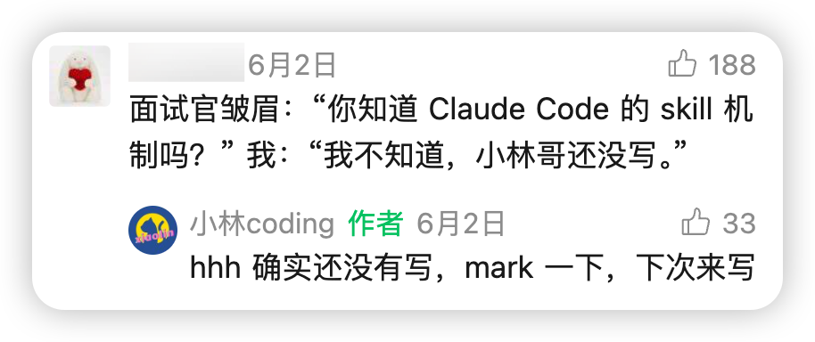

所以这次就来还愿了，剖析一下 Claude Code 的 skill 机制源码，把这块拼图补上。

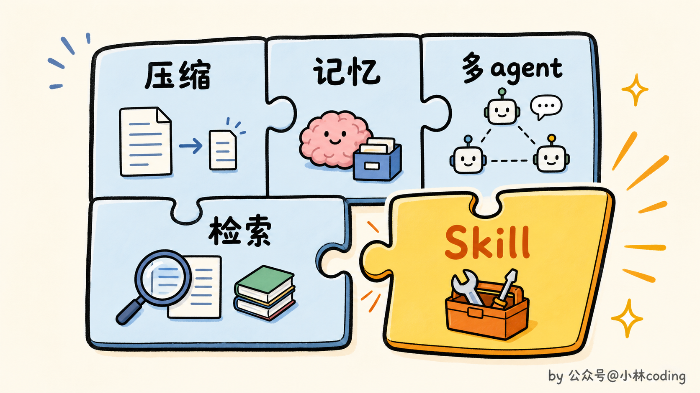

照例先从面试场景说起。

前阵子我翻了一圈读者发来的 agent 岗面经，发现有道题的出镜率高得离谱，「**skill 和提示词有什么区别？**」


乍一看是道送分题。不少人张口就答，「skill 就是封装好的提示词，写成 Markdown 文件，方便复用」。

这答案不能说错。skill 的载体确实就是几个 Markdown 文件，不用装插件，也不用写什么胶水代码，模型本身更是一根汗毛都没动。

但面试官往往会跟着补一刀，「既然就是提示词，那我直接把内容塞进 system prompt，跟用 skill 有什么区别？」

到这里，一大半人就接不住了。支支吾吾半天，憋出一句「skill 更规范一些」。这个回答等于当场告诉面试官，你只是用过，没想过。

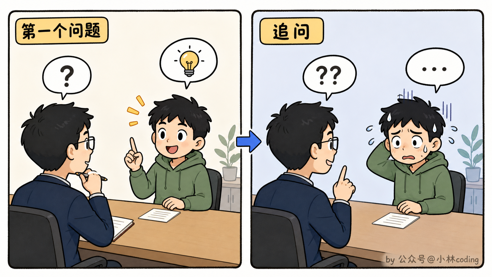

说实话，这道追问出得真好。它恰好戳中了 skill 这套机制真正的含金量，而完整的答案，全藏在 Claude Code 的源码里。我把相关源码翻了个底朝天，这篇文章就来把这道题拆透，重点回答四个问题。

- Skill 到底是个什么东西，跟普通 prompt 差在哪
- 装了几十个 skill，上下文为什么没有被撑爆
- Claude 是怎么知道「当下该用哪个 skill」的
- 想自己写一个好用的 skill，要抓住什么要点

先说结论，这套机制的灵魂就一个词，**渐进式披露（Progressive Disclosure）**。说人话就是，别一股脑全塞给模型，用到哪层才翻开哪层。


好，开拆。

## 一、Skill 到底是个什么东西？

先别急着看源码，我们直接拆一个官方 skill 看看长相。

Anthropic 官方开源了一批 skill，其中有个处理 PDF 的。你把它下载下来打开，会看到这样一个目录。

```
pdf/
├── SKILL.md          # 主文件，必须叫这个名字
├── reference.md      # 进阶操作的详细文档
├── forms.md          # 表单填写的专项说明
└── scripts/
    ├── fill_form.py  # 现成的表单填写脚本
    └── ...
```

就这么点东西。没有二进制文件，没有依赖包，你连个安装脚本都找不到。**全是给人也能直接读的文本**。

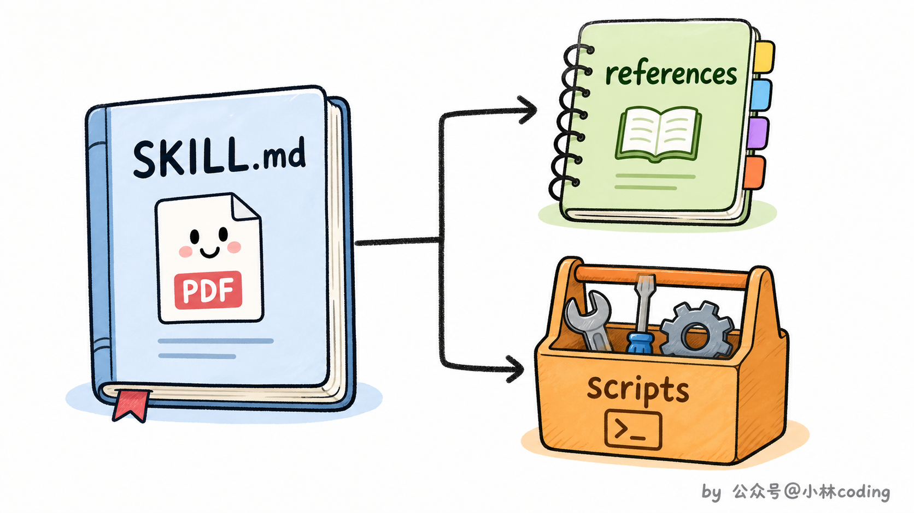

核心是那个 [SKILL.md](http://SKILL.md)。它的开头有一段用 `---` 包起来的元信息，行话叫 frontmatter，长这样。

```markdown
---
name: pdf
description: 处理 PDF 文件的技能。当用户需要读取、
  生成、合并 PDF，或者填写 PDF 表单时使用。
---

# PDF 处理指南

读取 PDF 文本用 pdftotext 命令...
表单填写这种复杂操作，先阅读 forms.md...
```

frontmatter 里最重要的就两个字段。`name` 是这个 skill 的名字，`description` 描述它是干什么的、什么时候该用它。往下的正文，就是一份操作指南，告诉模型处理 PDF 该用什么工具、遇到复杂情况去读哪个补充文档。

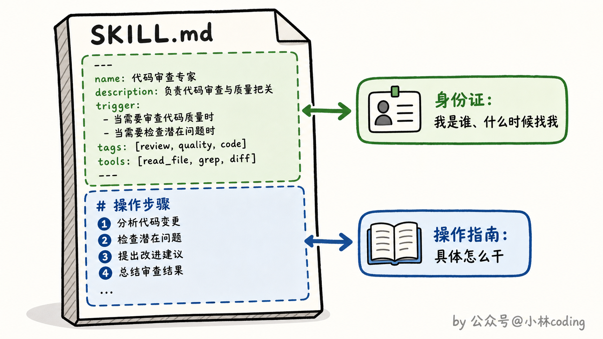

看明白了吗？**skill 没给 Claude 装任何新器官，说白了就是发了本操作手册。**

我喜欢用新员工入职来打这个比方。公司来了个名校毕业的实习生，脑子聪明、基础扎实，但完全不懂你们公司的业务。你会怎么办？

你不会给他做开颅手术往脑子里灌知识，你会扔给他一本入职手册。「报销流程看第三章」「代码规范看附录二」「数据库连接方式问运维前先看第五章」。


skill 就是 Claude 的入职手册。模型本身的能力一点没变，变的是它手头多了一份「你家业务的说明书」。

frontmatter 里其实还有不少可选字段，比如限制这个 skill 能用哪些工具的 `allowed-tools`、指定用哪个模型来执行的 `model`，这些偏进阶，本文就不展开了，你先记住 `name` 和 `description` 这两个主角就行。

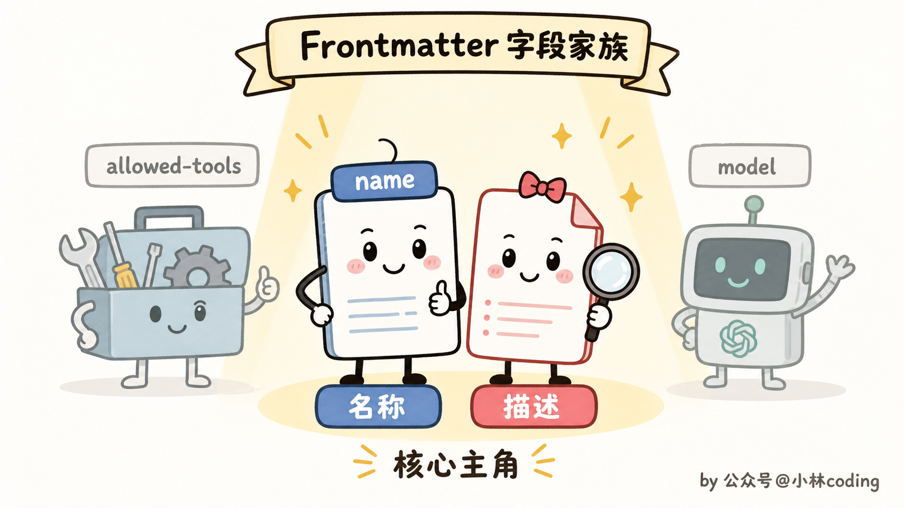

顺便说一句，这个格式已经不是 Claude Code 的私有玩法了。Anthropic 把它定名为 Agent Skills 并且开源，说白了就是想把「给 agent 写说明书」这件事变成行业通用标准。

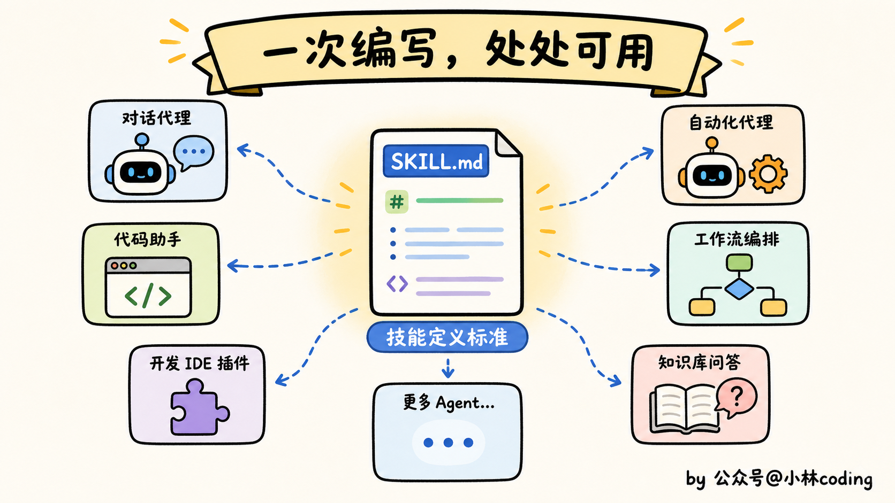

## 二、五分钟写一个最小 skill

光看别人的不过瘾，我们自己动手写一个。

场景就选一个程序员天天撞见的。团队 code review 总有几条雷打不动的规矩，变量名不许瞎起、魔法数字要提成常量、异常不许静默吞掉。每次让 Claude 帮忙看代码，都得把这些规矩重新交代一遍，烦死了。

现在把它做成 skill，三步搞定。

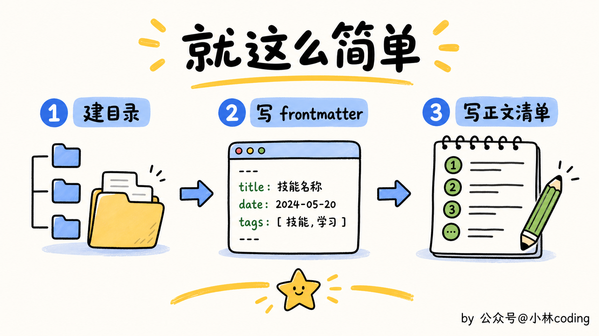

第一步，建目录。用户级的 skill 统一放在家目录的 `.claude/skills/` 下面，一个 skill 一个文件夹。

```bash
mkdir -p ~/.claude/skills/style-check
```

第二步，在里面创建 [SKILL.md](http://SKILL.md)，写上 frontmatter。

```markdown
---
name: style-check
description: 检查代码是否符合团队风格规范。
  当用户要求检查代码风格、评审代码时使用。
---
```

第三步，往正文里写你的规矩。

```markdown
# 代码风格检查清单

逐条检查以下规则，输出违反项和修改建议。

1. 变量名要有业务含义，不许用 a、b、tmp 这种
2. 魔法数字必须提成有名字的常量
3. 捕获异常不许静默吞掉，至少打一行日志
```

保存，收工。整个过程没编译没注册，重启都不需要，**你只是写了一篇一百来字的 Markdown**。

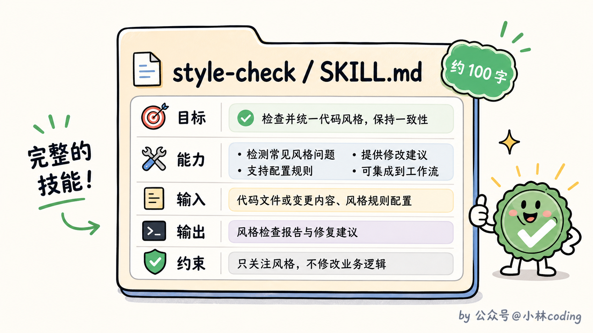

怎么用它？两种方式。

第一种，你自己手动召唤。在对话框里敲 `/style-check`，Claude 就会拿着你这份清单去干活。

第二种更有意思，**你压根不提 skill 的名字**。直接说「帮我看看这段代码写得规不规范」，Claude 会自己反应过来「这活我有本手册管着」，主动翻出 style-check 来执行。

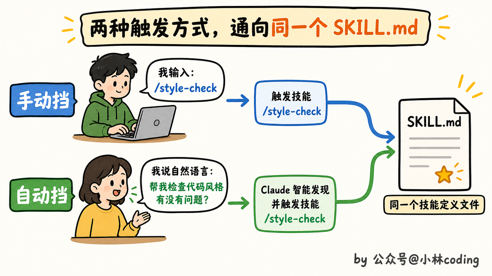

我第一次看到自动挡生效的时候，是真有点惊讶的。我没有说任何暗号，它就是知道该用哪本手册。


先把这个惊讶存着，后面第四节专门拆它。这里先来算一笔更要命的账。

我这个 skill 才一百来字，没什么负担。但你看看社区里那些正经 skill，一份 [SKILL.md](http://SKILL.md) 几千字起步，再带上好几个补充文档。而一个重度用户装几十个 skill 稀松平常，我自己机器上现在就躺着三十多个。

假设装了 50 个 skill，每份手册平均折算 3000 token（token 说人话就是模型眼里的「字数」）。如果把它们全文塞进系统提示词，光这一项就是 15 万 token。

Claude 的上下文窗口一共才 20 万 token。**手册占掉四分之三，你还干不干活了？**


而且更亏的是，这 50 本手册里，当前这轮对话可能一本都用不上。你让 Claude 改个 bug，它上下文里却常驻着「PDF 表单填写指南」和「Excel 透视表操作手册」，纯纯的浪费。


现在你应该品出来了，面试官那句「为什么不直接塞进 system prompt」，戳的就是这个要害。**skill 显然不能全文常驻上下文，但不放进上下文模型又看不见它。**这个死结怎么解？

Claude Code 的解法，就是开头说的那个词，渐进式披露。

## 三、渐进式披露：Claude 怎么做到「用时才翻书」？

先想想人类自己是怎么解决这个问题的。你家里有几百本书，你不会把每本都背下来。你记住的只是**书脊上的名字**，大概知道每本讲什么。真要用的时候，把那一本抽出来读。读的时候发现要查细节，再翻到书末的附录。

Claude Code 把 skill 的加载拆成了一模一样的三层。

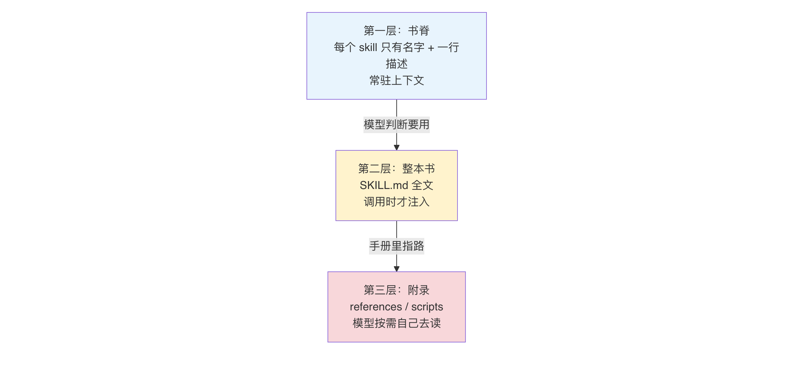

一层一层拆开讲。

### 第一层：常驻的只有「书脊」

Claude Code 启动后，会把所有 skill 的名字和描述拼成一份清单，跟着系统提醒（system-reminder）一起送进上下文。注意，**只有名字和描述，正文一个字都不带**。


这份清单长这样。

```
- style-check: 检查代码是否符合团队风格规范...
- pdf: 处理 PDF 文件的技能。当用户需要读取...
- commit: 根据暂存区变更生成规范的提交信息...
```

一个 skill 一行，像不像图书馆的书目卡片？


这份清单能占多大地方，源码里写得明明白白。

```ts
// src/tools/SkillTool/prompt.ts
export const SKILL_BUDGET_CONTEXT_PERCENT = 0.01
export const MAX_LISTING_DESC_CHARS = 250
```

第一行的意思是，整份 skill 清单的预算，只有**上下文窗口的 1%**。按 20 万 token 的窗口算，就是 2000 个 token 左右。第二行是单条描述的硬上限，250 个字符，超了直接截断。

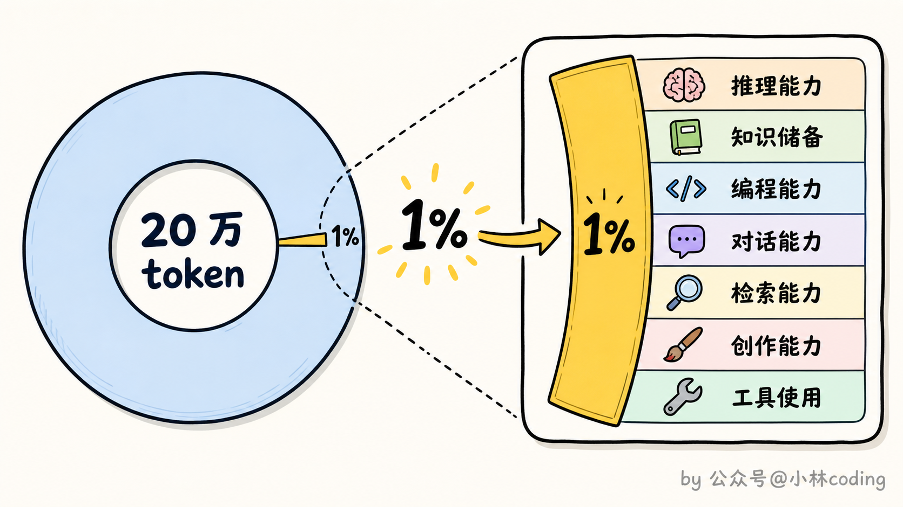

你写的 description 再天花乱坠，进清单时最多留 250 字符。这个设计特别值得咂摸，源码注释里说得很直白，这份清单只用来做「发现」，正文反正调用时会完整加载，描述写太长纯属浪费第一轮的 token。


那如果用户装了两百个 skill，1% 都装不下了怎么办？

源码里有一套完整的降级方案。先尝试全量描述，超预算就按剩余空间把每条描述等比截短，再不行就走最极端的路线，**第三方 skill 只留名字，描述全砍**。

```ts
// src/tools/SkillTool/prompt.ts
return commands.map((cmd, i) =>
  bundledIndices.has(i) ? fullEntries[i]!.full : `- ${cmd.name}`,
)
```

注意这行代码里的小心机，`bundledIndices` 指的是官方内置 skill，它们的描述**永远不被截断**，饿死也是先饿第三方。亲儿子待遇，源码从不说谎。

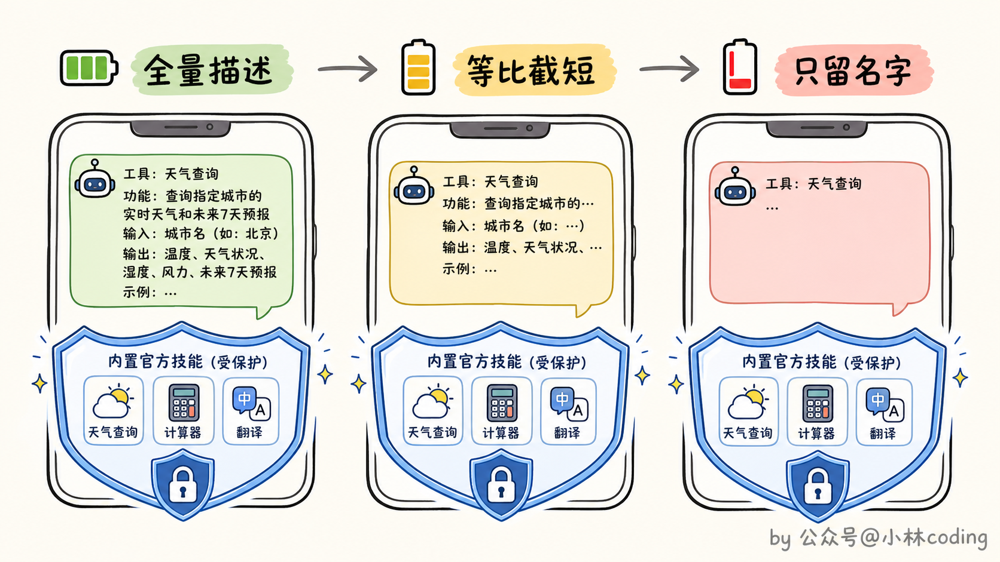

### 第二层：选中了，才把整本书抽出来

当模型判断当前任务需要某个 skill（怎么判断的下一节细说），它会发起一次调用，这时候 [SKILL.md](http://SKILL.md) 的完整正文才被读进来，注入当前对话。


注入的方式也很有意思。你以为会塞进系统提示词？错，它**包装成一条用户消息（user message），直接插进了对话流**。

```ts
// src/tools/SkillTool/SkillTool.ts
newMessages: tagMessagesWithToolUseID(
  [createUserMessage({ content: finalContent, isMeta: true })],
  toolUseID,
),
```

看到那个 `isMeta: true` 了吗？这条消息被标记成「元消息」，模型能看到，但界面上不会像真的用户发言一样刷出来。效果就是，你在屏幕前只看到 Claude 调了一下 skill，而它的视角里，是有人悄悄把整本手册摊开在了它面前。

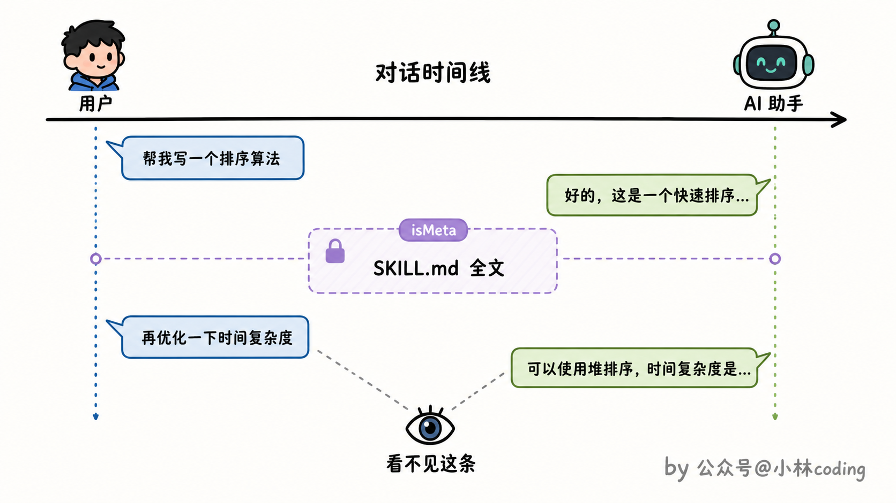

为什么走 user message 而不是改 system prompt？你可以想想。

系统提示词在整个会话里是要反复使用的，改动它会导致提示词缓存（Prompt Cache）大面积失效，每轮都重新计费。而追加一条消息是纯增量，前面的缓存一点不伤。这又是一个「抠 token 抠到骨子里」的细节。

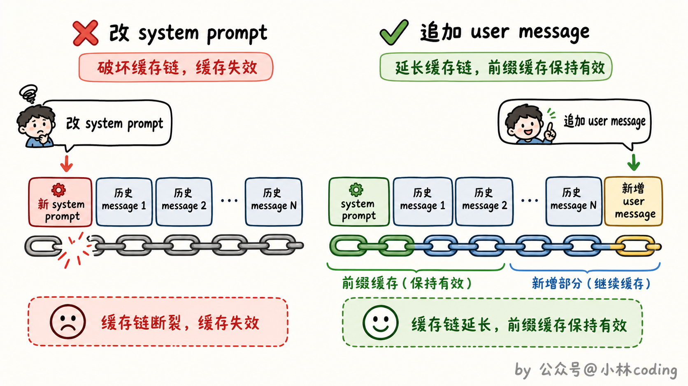

### 第三层：附录，连第二层都懒得进

还记得 pdf skill 目录里那几个 [reference.md](http://reference.md) 和脚本吗？它们在第二层注入时**依然不会被加载**。

[SKILL.md](http://SKILL.md) 正文里只是留了几句指路的话，「表单填写这种复杂操作，先阅读 [forms.md](http://forms.md)」。模型读到这句，真遇到表单任务，才会自己动手把那个文件 Read 进来。

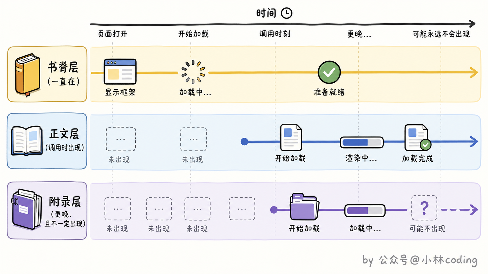

这一层的妙处在于，它根本不需要任何专门的机制。Claude 本来就有读文件的工具，skill 只要在手册里把路指清楚，剩下的交给模型自由发挥。


三层拼起来，我们算一笔总账。

还是 50 个 skill 的场景。全文常驻的方案要 15 万 token。渐进式披露呢？第一层清单撑死 2000 token，第二层只在用到时加载一本手册的几千 token，第三层更是按需付费。

**从 15 万降到 2000，75% 的窗口占用变成 1%。**这就是为什么你装几十个 skill，Claude Code 一点不见臃肿。


我看到这里的时候突然明白了一件事。什么「教模型新技能」，skill 骨子里就是**一套上下文的懒加载系统**。

这也就是开头那道面试题的题眼。skill 和提示词的区别，压根不在「内容」上，内容确实都是提示词。差别在于塞 prompt 是把所有东西一次性怼进去，skill 是设计了一套「什么时候、把哪一层、怼给谁」的调度机制。

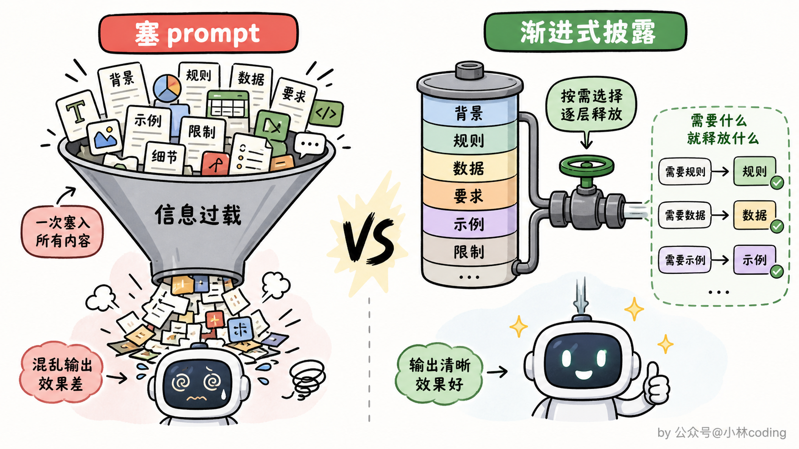

## 四、Claude 是怎么知道该用哪个 skill 的？

解决了「放得下」，还有个更神的问题，「选得准」。

回到第二节那个场景。我说「帮我看看这段代码写得规不规范」，一个字没提 style-check，Claude 是怎么从三十多个 skill 里精准翻出这一本的？

不着急看答案，你先猜猜。如果让你来设计这个「选 skill」的机制，你会怎么搞？

给你几个候选。给每个 skill 的描述算向量（Embedding），用户说话时做相似度检索？训练一个小的意图分类模型？或者简单粗暴上关键词匹配？


都挺合理的对吧？毕竟「从一堆候选里挑最相关的」，听起来就是个标准的检索问题。

但 Claude Code 的答案是，**以上全都没有**。

它就是把那份「书脊清单」摆在模型眼前，然后**相信模型自己能看懂**。

模型每轮生成回复之前，反正都要通读一遍上下文。清单就在里面躺着，用户的需求也在里面躺着，「这个需求跟哪行描述对得上」，这不就是语言模型最擅长的阅读理解吗？

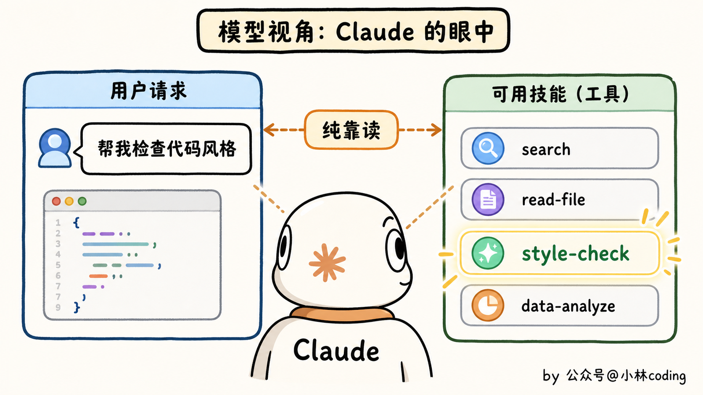

所以那行 description 的分量，比你想象中重得多。它就是 skill 的**唯一广告位**。源码里能看到，这行广告是由两个字段拼出来的。

```ts
// src/tools/SkillTool/prompt.ts
const desc = cmd.whenToUse
  ? `${cmd.description} - ${cmd.whenToUse}`
  : cmd.description
```

`description` 说清「我是干什么的」，可选的 `when_to_use` 字段补一句「什么时候该用我」。两句拼一起，就是模型做判断的全部依据。广告词写得含糊，你的 skill 就会在清单里坐一辈子冷板凳。


光靠模型自觉还不够。模型有时候会「想起来但懒得用」，看到匹配的 skill，却自己顺手把活干了。为了治这个毛病，SkillTool 的工具说明里写了一段措辞相当强硬的指令。

```
When a skill matches the user's request, this is a
BLOCKING REQUIREMENT: invoke the relevant Skill tool
BEFORE generating any other response about the task
```

翻译一下，只要有 skill 跟用户请求匹配上，调用它就是**一票否决级的硬性要求**，必须先调 skill 再说别的。后面还跟了一句「绝不允许嘴上提到 skill 却不真正调用」。


把整条链路串起来，就是这样一个流程。

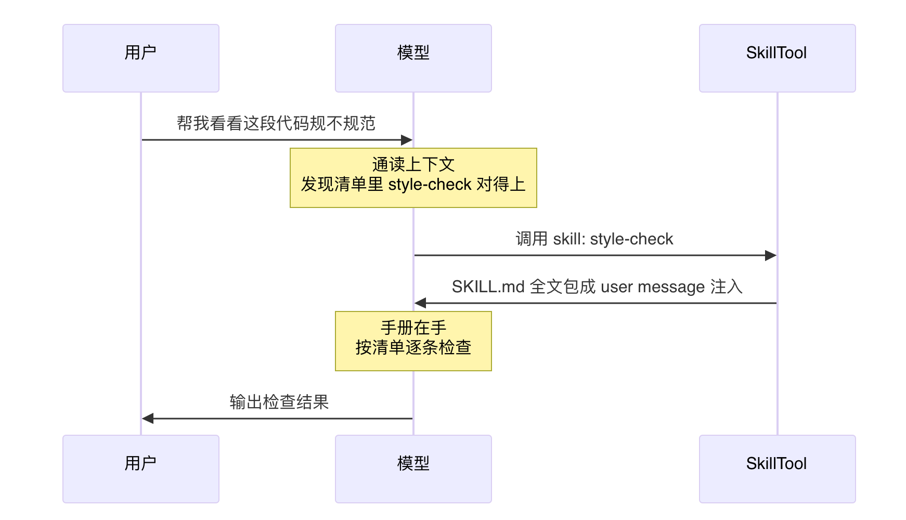

整个选择过程没有一行「检索代码」，全部发生在模型的一次前向推理里。

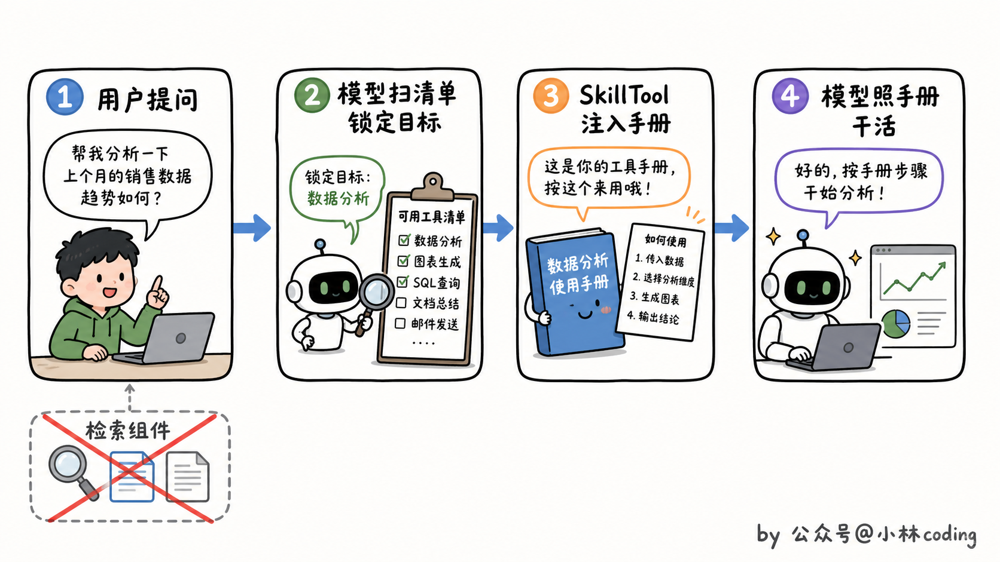

这个设计选择其实贯穿了 Claude Code 的整个源码。读过我之前文章的读者应该有印象，它的检索不用向量库，用的是让模型自己 grep。记忆也不用向量库，用的是让模型自己读写 Markdown。现在选 skill，还是不用向量库。

这背后是一个非常一致的哲学，**能靠模型自身理解力解决的问题，绝不外挂一套额外系统**。外挂系统看着专业，但每挂一个，就多一处能出故障的地方，多一摊要维护的东西，还得天天操心「检索不准怎么办」。而模型的阅读理解能力，是随着模型升级白嫖变强的。


当然，这套「纯靠读」的方案也有软肋。skill 数量真到几百个、描述行被截得只剩名字的时候，匹配准确率肯定会掉。不过对绝大多数装几十个 skill 的用户来说，这个天花板还远碰不到。


## 五、你敲的 /命令 和 skill，其实是同一个东西

用过 Claude Code 的读者肯定敲过斜杠命令，`/commit`、`/review-pr` 这种。你有没有想过，这些命令和 skill 是什么关系？

我原本以为是两套独立系统。翻完源码发现，好家伙，**它们压根就是同一个东西**。

在源码内部，slash command 和 skill 已经统一成了一套 Command 体系。用的是同一个数据结构，加载和执行走的也全是同一条路。SkillTool 的工具说明里甚至直接挑明了。

```
When users reference a "slash command" or "/<something>",
they are referring to a skill.
```

用户嘴里的「斜杠命令」，就是 skill 的另一个名字。

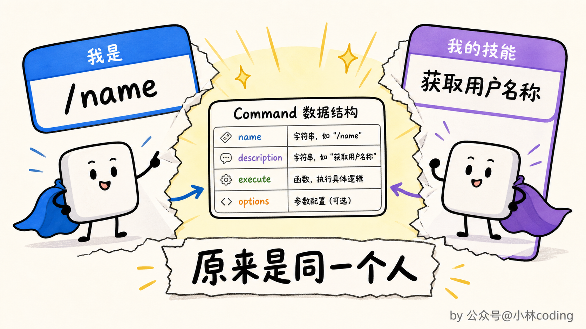

所以准确的说法是，一个 skill 天生有**两个触发入口**。人可以敲 `/名字` 手动触发，模型可以在判断匹配时自主触发。第二节演示的手动挡和自动挡，走的就是这两个入口，殊途同归。

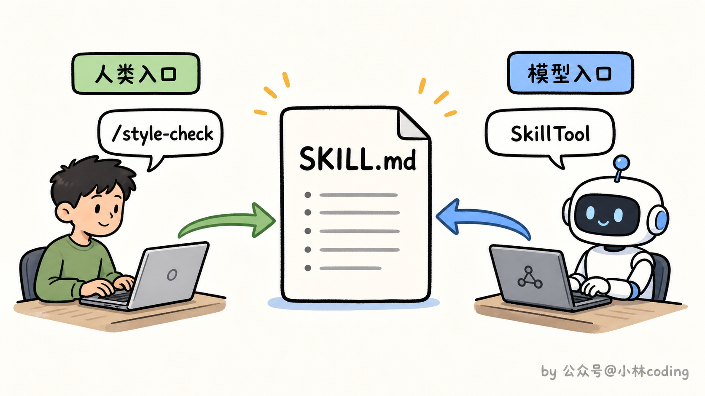

更好玩的是，这两个入口还各配了一个开关，都写在 frontmatter 里。

第一个开关叫 `disable-model-invocation`。设为 true 之后，模型就不许自主调用这个 skill 了，只有人手敲才能触发。源码里对应一段拦截逻辑，模型敢调就直接报错弹回去。

什么场景用它？**危险操作**。比如你写了个「一键发布上线」的 skill，你肯定不希望模型觉得「时机成熟」就自己发布了，这种必须留给人来扣扳机。

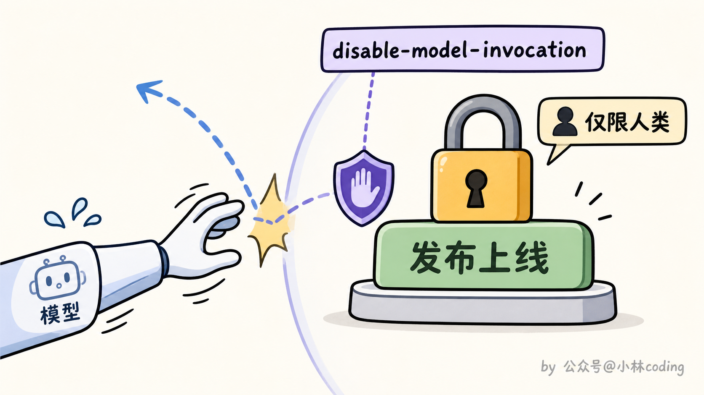

第二个开关反过来，叫 `user-invocable`。设为 false，这个 skill 就从斜杠命令菜单里消失，人敲不出来，只有模型能调。

这个又是什么场景？**纯背景知识类的 skill**。比如「本项目的数据库表结构说明」，它不是一个「动作」，人敲它没有意义，但模型干活时随时可能需要翻它。

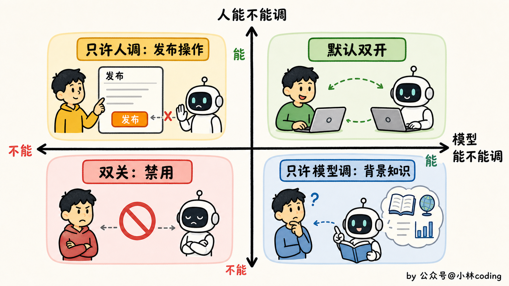

就这么一套文件格式，配上两个入口和两个开关，把「人的工具」和「模型的知识」全装下了。这个统一做得是真优雅。

## 六、skill 不只是静态文档：参数和动态内容

到这里你可能觉得 skill 已经看透了，不就是按需加载的 Markdown 嘛。

还真没完。skill 的正文不是写死的，里面还能玩出两个动态花样。

第一个花样，**接收参数**。

正文里可以写 `$ARGUMENTS` 占位符。用户敲 `/style-check 只查命名问题` 的时候，「只查命名问题」这串话会被原样填进占位符的位置。模型自主调用时同样可以传参。


第二个花样更猛，**执行命令**。

正文里可以用 `!命令` 的语法嵌一段 shell 命令。skill 被调用的那一刻，Claude Code 会**先把这条命令跑了，把输出结果填进正文**，再把填好的成品交给模型。

这两个花样在源码里就是紧挨着的两步处理。

```ts
// src/skills/loadSkillsDir.ts
finalContent = substituteArguments(finalContent, args, ...)
// ...
finalContent = await executeShellCommandsInPrompt(finalContent, ...)
```

第一行做参数替换，第二行执行嵌入的命令。模型最终读到的正文，是已经填满了「实时数据」的版本。


拿我们第二节那个风格检查 skill 升个级，你立刻能感受到威力。给正文加一行。

```markdown
待检查的代码如下：

!`cat $ARGUMENTS`
```

现在敲 `/style-check UserService.java`，Claude Code 会先执行 `cat UserService.java` 把代码读出来，直接怼进 prompt。模型睁眼一看，检查清单和待检查的代码已经并排摆好了，一步到位。

官方的 `/commit` 命令也是这么玩的，正文里嵌了 `!git diff`，调用瞬间把你的代码变更抓进上下文，模型看着真实的 diff 写提交信息。

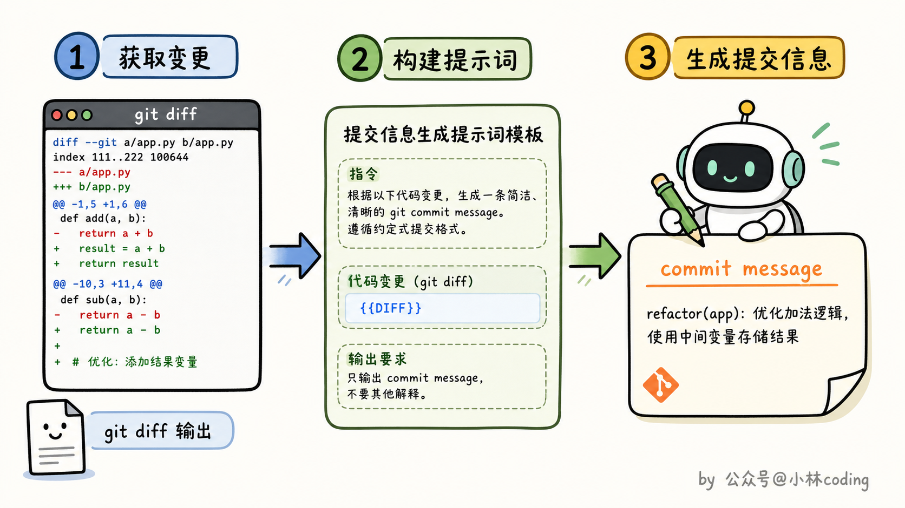

不过看到「skill 能执行命令」这几个字，你后背应该有点发凉。要是有人在网上发了个带恶意命令的 skill 呢？

源码里对此有一道明确的防线。

```ts
// src/skills/loadSkillsDir.ts
if (loadedFrom !== 'mcp') {
  finalContent = await executeShellCommandsInPrompt(...)
}
```

来自 MCP 服务器的远程 skill，**永远不执行**正文里嵌的命令。源码注释写得很直接，MCP skill 是远程内容，不可信。只有你本地目录里的 skill 才享受动态展开的待遇，毕竟本地文件是你自己放进去的，出了事也怪不着别人。

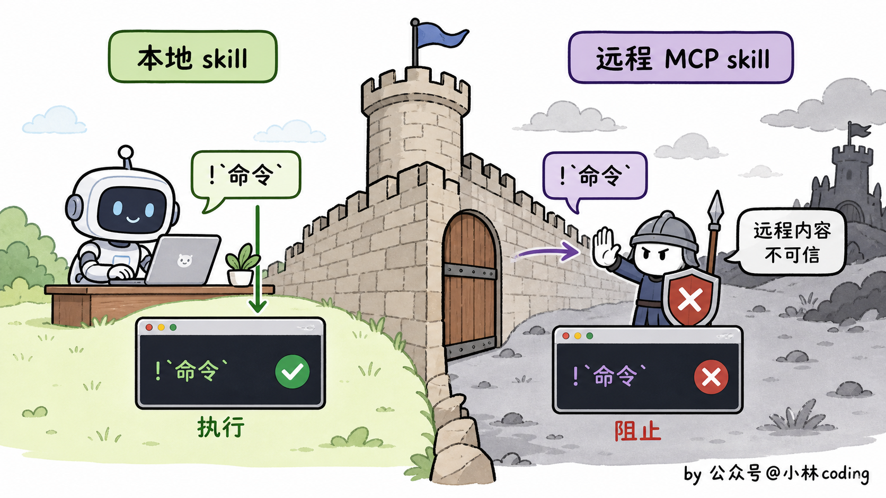

## 七、这些 skill 都是从哪里冒出来的？

一个 skill 从你写完，到出现在 Claude 眼前的清单里，中间发生了什么？

Claude Code 启动时会去好几个地方搜罗 skill，源码里这段扫描逻辑一目了然。

```ts
// src/skills/loadSkillsDir.ts
const userSkillsDir = join(getClaudeConfigHomeDir(), 'skills')
const managedSkillsDir = join(getManagedFilePath(), '.claude', 'skills')
const projectSkillsDirs = getProjectDirsUpToHome('skills', cwd)
```


加上代码其他位置注册的来源，skill 总共有五个来处。

一是**官方内置**，随 Claude Code 发行自带的那批，比如前面提过的 commit。二是**用户级**，你家目录 `~/.claude/skills/` 里的，走到哪跟到哪。三是**项目级**，项目仓库 `.claude/skills/` 里的，只在这个项目里生效。四是**插件**，随安装的插件打包带来的。五是 **MCP**，远程服务器动态提供的。

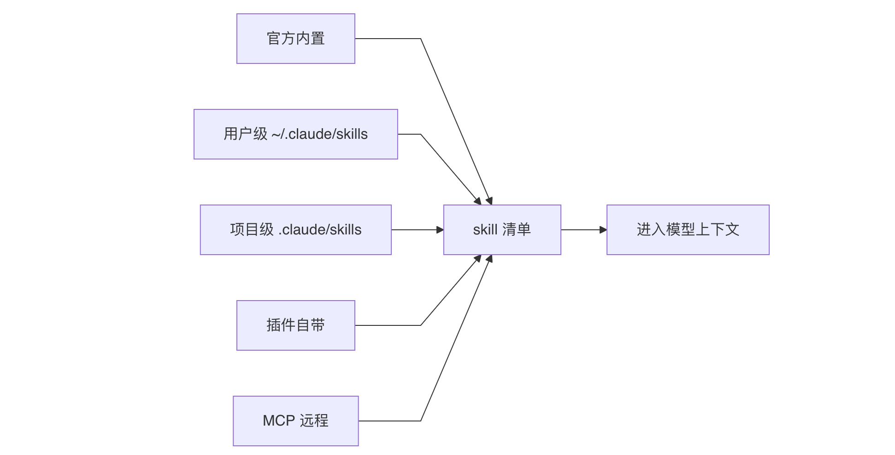

五个来处里面，我最想单独夸一夸**项目级**这个。

skill 放在项目的 `.claude/skills/` 目录里，意味着它会**跟着代码一起进 git 仓库**。新同事克隆项目的那一刻，团队沉淀的所有「操作手册」自动就位。部署流程怎么走、评审要盯哪些点，这些以前靠口口相传的东西，现在全在仓库里躺着。

以前这些东西写在 wiki 里，写完就烂。现在它们是能被 agent 直接执行的活文档，谁用谁更新，这是我觉得 skill 对团队协作最实在的改变。

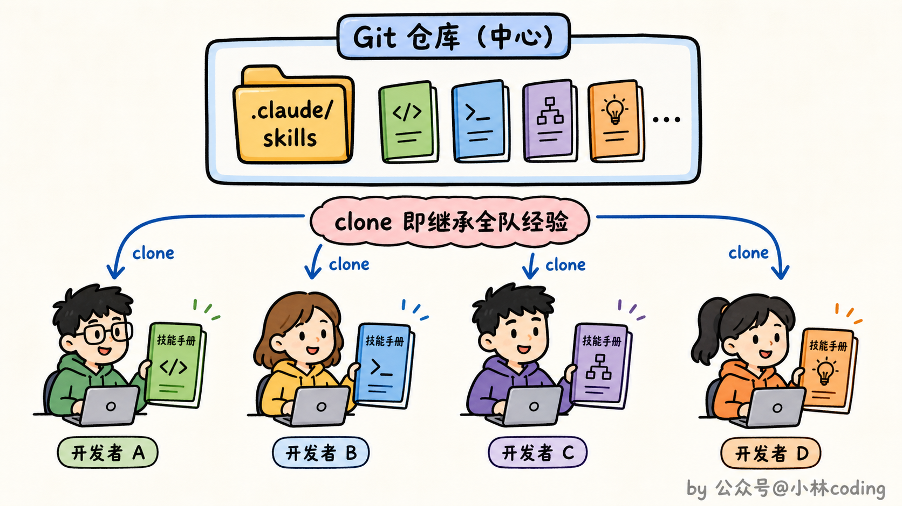

来源一多，马上就有一个问题，撞名了怎么办？项目级和用户级各有一个 style-check 呢？

源码的处理简单直接，扫描按固定顺序进行，同一个文件身份**先到先得**，后来的重名直接跳过并记一条日志。项目级排在用户级后面加载，所以别指望在项目里「覆盖」用户级的同名 skill，起名的时候错开才是正道。

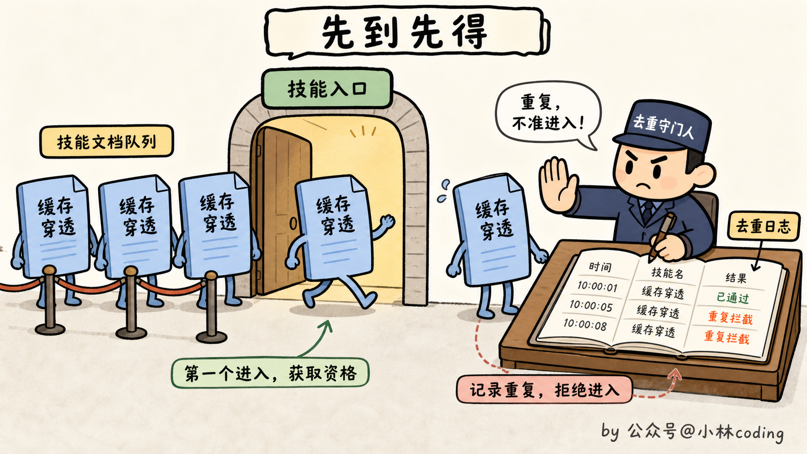

## 八、怎么写好一个 skill？

原理拆完了，最后把方向盘交回你手上。上面这些机制反过来看，就是三条「怎么写好 skill」的心法。

**第一条，description 按广告词的标准写，重点写「什么时候用我」。**

第四节说过，description 是 skill 的唯一广告位，模型全靠它做匹配，而且进清单时最多保留 250 个字符。这几乎逼着你放弃功能罗列，把最宝贵的字数花在触发场景上。

对比感受一下。「这是一个功能强大的代码质量工具，支持多种语言」，这种写法模型根本不知道什么时候该翻你的牌子。换成「检查代码是否符合团队风格规范。当用户要求检查代码风格、评审代码时使用」，动词全是用户嘴里会说出来的词，一对就上。


**第二条，[SKILL.md](http://SKILL.md) 管今天，references 管细节。**

渐进式披露的第三层是留给你主动利用的。[SKILL.md](http://SKILL.md) 只写高频主干流程，把低频的、超长的细节拆到 references 目录，正文里留一句指路的话就行。这样第二层注入时又轻又准，细节等模型真需要时自己去翻。

一个糙但好用的标准，[SKILL.md](http://SKILL.md) 超过 500 行，就该考虑动刀拆附录了。

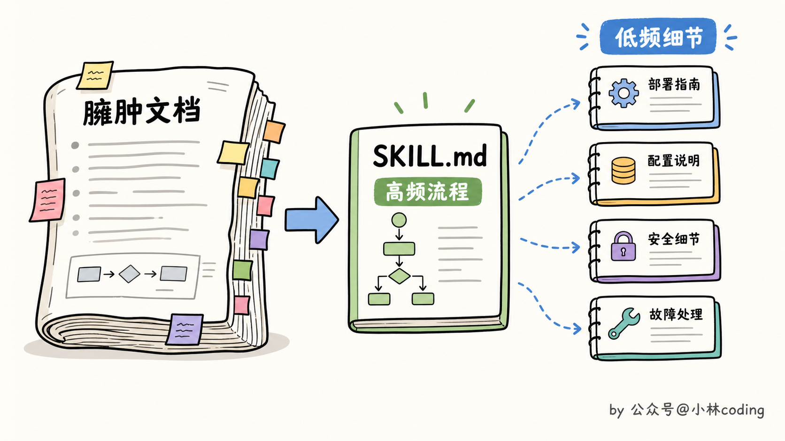

**第三条，重复劳动写成脚本，别让模型每次现想。**

如果 skill 里有一步是固定的机械操作，比如某种固定格式的转换，与其在正文里教模型「第一步第二步第三步」，不如直接写个脚本放进 scripts 目录，正文里一句「执行这个脚本」。

模型现想是有失败率的，今天想对了明天可能想歪。脚本没有失败率，跑一万次一个样。所以**能固化成脚本的就别让模型现想**，这是写 skill 最重要的手感。


## 最后总结

Skill 表面上是「几个 Markdown 文件」，拆开看是一整套精密的上下文调度系统。

「放得下」靠的是三层渐进式披露，几十个 skill 常驻的开销被压到窗口的 1%。

「选得准」就更省事了，一行 description 加上模型自己的阅读理解，检索系统一概没上。

人敲的斜杠命令和模型的自主调用，在源码里本来就是同一个东西的两个入口。

而参数插值和命令预执行，又让 skill 在调用时能填进参数、带上命令的实时输出，不只是一份写死的静态文档。


现在再回到开头那道面试题，「skill 和提示词有什么区别」。下次再被问到，你可以直接这么答。

「skill 的内容确实就是提示词，这个没错。但区别不在内容，在加载方式。提示词是一股脑全塞进上下文的，skill 走的是渐进式披露，分层按需加载。平时上下文里只常驻一行描述，模型自己判断这活用得上了，正文才会被注入进来，更细的参考文档还能再懒一层，真用到才去读。所以我的理解是，**提示词是知识本身，skill 是知识的加载策略**。」

面试官听到「渐进式披露」这四个字，大概率就坐直了。

如果这篇对你有帮助，帮我点个「在看」，我们下期见。
