# 图解 Claude Code

## Claude Code 工程化指南：CLAUDE.md、Skills、Subagents、MCP、Hooks、Plugins 一篇讲透

大家好，我是小林。

用 Claude Code 的人现在是真的多，但我发现一个挺普遍的现象。

大部分人的用法，还停留在「打开终端，敲需求，等它干完」。每次开新会话，都要把项目背景重新交代一遍，我们用什么框架、构建命令是什么、哪些文件不能动。交代完了它干得挺好，可一关掉，下次又是从零开始。

说人话就是，你雇了个能力很强的员工，但他每天下班就失忆，第二天来了你得重新培训一遍。


其实 Claude Code 早就给你留好了一整套解决方案，**[CLAUDE.md](http://CLAUDE.md)、Skills、Subagents、MCP、Hooks、Plugins**，一共六样东西。

所以这篇就来聊聊 Claude Code 工程化这个问题。


文章有点长，建议先收藏再看。

### 01｜Claude 怎么才能记住你的项目？

#### 每次新会话都要重新交代一遍？

先从最扎心的问题开始。

你接手了一个后端项目，用 Claude Code 干活。第一天你跟它说，项目还停在 JDK 8，构建用 mvn 走 package，core 模块是祖传代码别动。它记住了，干得漂亮。

第二天开个新会话，让它加个接口。它上来就写 `Stream.toList()` 和 record，编译直接爆红，顺手还把 core 模块「重构」了一把。

你血压上来了。但冷静想想，这不怪它。

大模型这东西，本身压根没有记忆，每次会话都是一张白纸。你昨天说的话，存在昨天那个会话的上下文里，会话一关，什么都没留下。


那怎么办？Claude Code 给的答案简单到有点朴素，写个文件。

你在项目根目录放一个叫 `CLAUDE.md` 的 markdown 文件，每次开新会话，Claude Code 都会自动把它读进来，塞进对话的最前面。你后面说的每一句话，都是在这份文件打底的前提下被理解的。

说白了就是给新员工的入职手册。人还没开始干活，规矩先看一遍。你不用每天重新培训，因为培训材料就钉在工位上。


#### CLAUDE.md 放哪、怎么被加载？

[CLAUDE.md](http://CLAUDE.md) 不止能放一个地方。

放在 `~/.claude/CLAUDE.md` 的是全局配置，你所有项目都会加载，适合写个人偏好，比如「回答用中文」「commit 信息别写太长」。

放在项目根目录的是项目配置，也是最常用的一层，写这个项目的技术栈、命令、规范。

还可以放在子目录里。这一层有点讲究，它不是启动就加载的，而是等 Claude 读到那个子目录下的文件时才带进来。大项目里各模块规范不一样，就可以各放各的，互不干扰。

三个层级摆在一起看，就是这么个结构。

```
~/.claude/
└── CLAUDE.md        # 全局，所有项目都加载

my-project/
├── CLAUDE.md        # 项目级，启动就加载
├── web/
│   └── CLAUDE.md    # 动到 web 模块的文件才加载
└── core/
    └── CLAUDE.md    # 动到 core 模块才加载
```

还拿前面那个 Java 项目说。个人偏好写在全局那份里，走到哪个项目都带着。JDK 版本、构建命令这种项目级规矩写在根目录。web 模块有自己的接口规范，core 模块有一堆「别动」的禁令，各写各的，Claude 干到哪个模块，哪份规矩才进场。


对了，除了你手写的 [CLAUDE.md](http://CLAUDE.md)，Claude Code 还有一套自动记忆。它会在干活过程中自己记下一些经验，比如「这个项目的构建产物在 dist 目录」「用户喜欢先写测试」，存到自己的记忆目录里，下次会话自动想起来。

你写规矩，它记经验，两边凑一块才算全。


#### 一份像样的 CLAUDE.md 长什么样？

光说不练没感觉，我把自己一个项目里的 [CLAUDE.md](http://CLAUDE.md) 抽几段出来给你看。

```markdown
# 项目说明
Spring Boot 服务，JDK 8，禁止用高版本语法。

## 常用命令
- 单测：mvn test -pl web
- 打包：mvn clean package -DskipTests

## 铁律
- core 模块是待下线的祖传代码，只读，不许改
- 表结构变更必须走 Flyway，不许手写 ALTER TABLE
```

没什么花头，就是大白话写规则。但有几个讲究。

命令要写全，别写「跑一下测试」，要写 `mvn test -pl web` 这种能直接复制执行的。禁令要写死，「尽量不要改」这种软话没用，就写「不许改」。


那么问题来了，什么才配写进 [CLAUDE.md](http://CLAUDE.md)？我的标准就一条，每次会话都用得上的才留下。

我见过有人把整个架构文档、接口文档全贴进 [CLAUDE.md](http://CLAUDE.md)，写了一千多行，自我感觉很充实。结果 Claude 该忘的还是忘。因为这个文件是每次会话都全量加载的，你塞得越多，真正重要的规则就被稀释得越狠。

[CLAUDE.md](http://CLAUDE.md) 是入职手册，不是公司图书馆。


但这样一来，新的问题就冒出来了。

那些不是每次都用、但用的时候很重要的东西，往哪放？比如一整套 code review 的检查清单，比如发布流程的操作步骤。塞进 [CLAUDE.md](http://CLAUDE.md)，每次会话都白白吃掉一堆上下文。不写，用的时候它又不知道。

这就轮到六件套里的第二样登场了。

### 02｜不常用的知识该往哪放？

#### 为什么不能全塞进 CLAUDE.md ？

先算一笔账。

Claude 的上下文窗口是有限的，就当是它的工作记忆，装满就没地方了。[CLAUDE.md](http://CLAUDE.md) 里的每一个字，每次会话都要占一份工作记忆，不管这次任务用不用得上。

你写了三千字的 code review 清单进去，结果今天的任务是改个文案错别字。这三千字照样加载，照样占地方，照样分散它的注意力。


说实话，这就跟你入职第一天，主管把公司所有部门的操作手册全打印出来让你背一样。你要的是「用到的时候知道去哪查」，而不是全背下来。

Claude Code 给这个问题的答案叫 Skill。

#### 一个 Skill 长什么样？

Skill 的设计，我第一次看懂的时候真有点想拍大腿。核心就一个点，拆两层加载。

每个 Skill 是一个文件夹，里面放一个 `SKILL.md`，文件开头有一段 frontmatter，就是用两条横线包起来的元信息，里面有名字和一句话描述。

启动的时候，Claude 只加载所有 Skill 的「一句话描述」，正文一个字都不读。等你真的提出相关任务，它发现描述对得上，才去把正文完整读进来。

启动时 Claude 眼里的 Skill 库，其实就是一张这样的单子。

```
code-review    审查代码改动时用，带团队检查清单
deploy-check   上线发布前用，带发布步骤和回滚预案
db-migrate     改表结构时用，带 Flyway 操作规范
```

三行描述，几十个字，每个 Skill 背后的完整正文一个字都还没进来。


[CLAUDE.md](http://CLAUDE.md) 是全文背诵，Skill 呢，记住书名就行，用时再翻书。

一个描述几十个字，你装二十个 Skill，常驻成本也就千把字。但每个 Skill 背后可以挂几千字的正文，甚至还能在文件夹里附带参考文档和脚本。书多了，书架没变重，大概就是这么个意思。

很多同学估计就问了，装了这么多 Skill，Claude 怎么知道什么时候用哪个？

大多数时候你不用管，你说「帮我 review 这个改动」，它扫一眼描述列表，发现有个 Skill 管这事，就自己加载了。你也可以直接点名，输入斜杠加名字，比如 `/code-review`，强制唤起。


#### 举个例子，把 code review 清单做成 Skill

我把一套 review 流程做成了 Skill，放在项目的 `.claude/skills/code-review/` 目录下，[SKILL.md](http://SKILL.md) 大概长这样。

```markdown
---
name: code-review
description: 审查代码改动时使用，包含团队的检查清单和输出格式
---

审查改动时按以下重点检查：
1. 有没有绕过 service 层直接查库
2. 新接口有没有做参数校验
3. 错误处理是吞掉了还是往上抛了
审查结果按「问题、位置、建议」三栏输出。
```

frontmatter 里那句 description 是整个 Skill 的门面，Claude 全靠它判断这个 Skill 什么时候该被唤起，所以要写清楚「什么时候用」。


装上之后效果很直接。平时聊天，这套清单完全不占地方。一旦我说「看下这次的改动有没有问题」，它就把清单加载进来，按团队的标准逐条过，输出格式都是统一的。


记忆的问题，到这算是解决得七七八八了。常用的进 [CLAUDE.md](http://CLAUDE.md)，专项的做成 Skill。

但你真拿它干重活的时候，会撞上另一堵墙。

比如让它做一次全仓库的安全审查。它吭哧吭哧搜了几十个文件，读了一堆代码，每一次搜索结果、每一段文件内容，全都堆在你的主对话里。审查完了，你想接着聊点别的，发现它开始犯糊涂了，前面说过的话它记不清了。

上下文被垃圾信息灌满了。

### 03｜怎么让 Claude 变成一支小团队？

#### 主对话为什么越聊越笨？

这个现象很多人都遇到过，会话用久了，Claude 明显变笨。

原因不玄乎。上下文窗口就那么大，你让它搜索文件、分析日志，这些动作产生的中间信息，搜到的每个文件路径、读过的每段代码、跑命令的每行输出，全都留在对话里。

真正有价值的可能就是最后那三行结论，但为了得出这三行，它往上下文里塞了几万字的过程垃圾。

窗口快满的时候，要么旧内容被压缩丢失，要么新任务没地方施展。你精心写的 [CLAUDE.md](http://CLAUDE.md) 规则，也在一堆日志输出里被淹没了。


人类团队怎么解决这个问题？主管不会自己扎进日志里逐行翻，他会把活派给组员，「你去查一下昨晚的报错，查完给我个结论」。

组员翻了三小时日志，主管只收到一句「是缓存节点内存溢出，建议调大驱逐阈值」。过程留在组员那里，结论进入主管的脑子。


Subagent 干的就是组员这个角色。

主对话把任务派出去，Subagent 在一个完全独立的上下文里干活，搜索、试错、翻文件随便折腾，都污染不到主对话。干完了，只把汇总结果交回来。

更妙的是可以并行。比如安全漏洞、性能隐患、测试覆盖，三路检查互不依赖，派给三个 Subagent 同时跑，主对话就在那等结果，效率直接翻倍。

#### Subagent 是怎么配出来的？

配置方式跟 Skill 一脉相承，也是放文件。项目的 `.claude/agents/` 目录下，一个 markdown 文件就是一个 Subagent。

文件分两截。frontmatter 写元信息，名字、什么时候用、能用哪些工具、跑哪个模型。正文写它的系统提示，相当于给这个「组员」的岗位说明书。

frontmatter 里我最喜欢 tools 这个字段。审查代码的 agent，你就只给它读文件和搜索的权限，不给写权限，它想改代码都改不了，天然安全。

model 也很实用。翻日志、跑批量搜索这种体力活，指定用便宜快速的模型，需要深度推理的分析再上贵的。一支团队里有主力有助手，成本就压下来了。


#### 举个例子，一个 code-review 小分队成员的配置

```markdown
---
name: code-reviewer
description: 代码改动的专项审查，检查安全、性能与规范
tools: Read, Grep, Glob
model: haiku
---

你是团队的代码审查员，只做审查不做修改。
逐个检查改动文件，重点看安全漏洞与性能隐患。
最终只输出问题列表与修改建议，不要贴大段代码原文。
```

注意最后一句，「只输出问题列表，不要贴大段代码原文」。这是 Subagent 的精髓，它在自己的上下文里可以读几万行代码，但交回主对话的必须是提纯后的结论。


那是不是什么活都该拆出去？还真不是。

适合拆的是「过程重、结论轻」的任务，大范围搜索、日志分析、专项审查。反过来，你们正在反复讨论的方案就别拆，拆出去 Subagent 两眼一抹黑，还得重新交代半天，得不偿失。

这个度我也是拆错过几次才摸到的。有一次把一个改到一半的需求丢给 Subagent，它交回来的东西驴唇不对马嘴，从那以后我只往外派「查清楚一件事」这种边界干净的活。


你的 Claude Code 现在有记忆、有专项知识、还带了一支小团队，像模像样了。

但它还有个先天残疾，所有能力都圈在本地这台机器上。你让它「看看 GitHub 上那个 PR 有什么问题」，它一脸诚恳地告诉你，我无法访问外部网站，你可以把内容粘贴过来。

一个连 PR 都摸不到的审查员，清单写得再好也白搭。

### 04｜Claude 怎么够得着外部系统？

#### 会「说」不会「做」是什么意思？

有个事情很有意思。你问 Claude 怎么用 GitHub 的接口拉 PR 列表，它能给你写出完整代码，参数、鉴权、分页全都对。

但你让它「直接帮我拉一下」，它做不到。

知识它有，手没有。模型再聪明，它也只是在生成文字，没有一条真实的通道让它去调用外部系统。数据库、GitHub、公司内部的工单系统，它全都够不着。


早期大家的解法是各写各的插件，OpenAI 一套接法，Claude 一套接法，每个工具还得为每家 AI 单独适配一遍。工具方累死，用户也乱死。

后来 Anthropic 牵头出了个协议，就是 MCP，Model Context Protocol。它干的事说人话就是，给 AI 和外部工具之间定一个统一的插口。工具方照着协议实现一个 MCP Server，任何支持 MCP 的 AI 应用都能直接插上用，不用再各家单独适配。

跟 USB-C 一个道理。以前每个手机一种充电口，现在一根线走天下。


#### MCP 协议到底约定了什么？

架构上就两个角色。Claude Code 这边是 Client，工具那边是 Server。

Server 对外声明自己有哪些本事，最主要的就是 tools，一组可以被调用的工具。每个工具带着名字、说明和参数定义。拿 GitHub 的 Server 来说，Claude 连上后拿到的工具清单大概是这个样子。

```
get_pull_request     读取某个 PR 的详情和改动
list_issues          按条件列出仓库的 issue
add_issue_comment    在 issue 或 PR 下发表评论
```

任务需要时，Claude 从清单里挑一个发起调用，Server 执行完把结果传回来。

Server 装在哪都行。跑在你自己机器上的就是个本地进程，走标准输入输出通信，适合操作本地资源。也可以部署在服务商那边，走 HTTP 连过去，GitHub、Notion 这些官方服务基本都提供了。


看到这估计有同学就问了，这不就是工具调用吗，跟 Skill 有什么区别？

还真不是一回事。Skill 给的是知识和流程，说明书那种东西。你照着说明书能知道怎么做，但说明书自己不会动手。真能伸出去的手，是 MCP 给的。

实际用起来，这俩经常是配合着用的。比如 Skill 里写着「审查完把结果提交到工单系统」，这是流程。真到提交那一步，动手的是 MCP。


对了，还有一个边界问题值得一提。如果一个工具本来就有好用的命令行，比如 git、gh，Claude 直接在终端里敲命令就行，不一定非要 MCP。

MCP 真正的价值在那些没有现成命令行、或者需要保持长连接和鉴权状态的系统上。

#### 举个例子，接上 GitHub 之后能干什么

接入就一条命令的事，带上你在 GitHub 上生成的访问令牌。

```bash
claude mcp add --transport http github https://api.githubcopilot.com/mcp/ \
  --header "Authorization: Bearer 你的GitHub令牌"
```

连上之后，感受一下前后差别。

以前你说「看下 128 号 PR 改了什么」，它说我访问不了。现在同样一句话，它直接调用 MCP 工具把 PR 的改动拉下来，结合你 Skill 里的审查清单逐条过，最后还能把审查意见评论回 PR 上。


你看，链路这就通了。


不过用得越深，你会发现一个更隐蔽的问题。

我在 [CLAUDE.md](http://CLAUDE.md) 里写了「每次改完代码要跑一遍格式化」。十次里有八次它照做，剩下两次，忘了。不是它态度不好，是提示词这个东西，本质上就管不了「必须」。

### 05｜规则怎么才能次次生效？

#### 写在提示词里的规则，为什么会被无视？

怎么说呢，这个问题我想了挺久才想明白，想明白之后看很多事都顺了。

[CLAUDE.md](http://CLAUDE.md) 也好，Skill 也好，里面写的所有规则，最终都是变成文字交给模型去「理解并遵守」。而模型是概率生成的，它大概率会遵守，但没有任何机制保证百分之百。

上下文一长，规则就被稀释了，任务再一复杂，它的注意力早被别的东西抢走了。于是就出现「十次有八次照做」的情况。

对了，这跟开篇那个「失忆」不是一回事。那是规则压根没进会话，这回规则明明就摆在上下文里，它还是能漏。

说白了，提示词是建议，不是法律。你在员工手册里写「下班要锁门」，员工大部分时候记得，但总有忘的那天。真想万无一失，你装的是门禁系统，人走门自动锁，不依赖任何人的自觉。


Hooks 就是 Claude Code 的门禁系统。

它让你在 Claude 工作流程的关键节点上，挂一段自己的 shell 命令。节点一到，命令就跑，没有商量的余地。这里压根没有模型什么事，它理不理解、自不自觉，都不影响这段命令执行，纯粹是程序层面的强制触发。


#### Hook 挂在哪些环节上？

Claude Code 把一次会话的生命周期切出了一串事件。会话启动、你提交提示词、每次工具调用之前、工具调用之后、Claude 准备结束回复，这些时机全都可以挂 Hook。

用得最多的是工具调用前后这两个。调用前的 Hook 能做拦截，检查这次操作合不合规，不合规直接摁住不让执行。调用后的 Hook 做善后，比如改完文件自动跑格式化。


配置写在 `settings.json` 里，就两样东西要认识。matcher 负责筛选，比如只匹配「编辑文件」这类工具调用。command 就是要执行的命令，事件命中就跑。

命令的退出码是有讲究的。退出码是 0，一切正常放行。退出码是 2，这次操作直接被拦截，命令的报错信息还会回传给 Claude，它看到之后会自己调整做法。

说人话就是，门禁不光能拦人，还能告诉他为什么被拦、该走哪个门。


#### 举个例子，自动格式化和敏感文件保护

善后型的最常用，比如改完文件自动格式化。

```json
"hooks": {
  "PostToolUse": [{
    "matcher": "Edit|Write",
    "hooks": [{ "type": "command",
      "command": "jq -r '.tool_input.file_path' | xargs npx prettier --write" }]
  }]
}
```

拆开看很好懂。PostToolUse 是挂载点，工具调用之后触发。matcher 筛出「编辑或写入文件」这类操作。command 里 jq 那一截看着唬人，讲真我第一次配的时候也愣了一下，其实就是从事件信息里抠出这次改的是哪个文件，抠出来直接喂给 prettier。

此后任何文件被编辑，prettier 必然跑一遍，我再也没在 [CLAUDE.md](http://CLAUDE.md) 里念叨过格式化的事。


格式化是让它多做事，还有一类正相反，是不许它做的事，比如动敏感文件。这次把 Hook 挂在工具调用之前。

```json
"PreToolUse": [{
  "matcher": "Edit|Write",
  "hooks": [{ "type": "command",
    "command": "~/.claude/hooks/protect.sh" }]
}]
```

[protect.sh](http://protect.sh) 里就几行 shell。

```bash
#!/bin/bash
file=$(jq -r '.tool_input.file_path')
if [[ "$file" == *".env"* || "$file" == *"secret"* ]]; then
  echo "敏感文件禁止修改" >&2
  exit 2
fi
```

逻辑一眼就能看明白。取出这次要动的文件路径，发现命中 `.env` 或者密钥文件，就带着报错信息用退出码 2 退出。


效果很有意思，Claude 的操作被摁住，它收到报错信息「敏感文件禁止修改」，然后它会跟你说，这个文件被保护了，我换个方案。整个过程你一个字都不用说。


到这里，六件套就差最后一块拼图了。你手上这套 Claude Code，有记忆、有知识库、有团队、有外部通道、还有铁的纪律。

然后现实问题来了。这一摊配置，[CLAUDE.md](http://CLAUDE.md)、几个 Skill、几个 Subagent、MCP 接入、一串 Hooks，全都散落在这个项目的各个角落。

下周你开新项目，全得手动搬一遍。同事看你用得好想抄作业，你只能把文件一个个发给他。过两个月你更新了审查清单，他那份还是旧的。

### 06｜这套配置怎么打包带走？

#### 换个项目就要重配一遍？

配置多了之后，分发就成了真问题。

手动复制的毛病，干过的都懂，容易漏、版本乱。你自己的三个项目里躺着三个版本的 code-review Skill，哪个是最新的，你自己都说不清。团队里更麻烦，每个人抄作业的时间点不一样，手上的配置千差万别，出了问题都没法对齐。

这个问题在软件行业早就被解决过一次了，答案叫包管理。没有人会靠拷贝文件夹来分发依赖库，大家发布一个包，别人一条命令安装，更新了再拉一次就行。


Plugin 就是 Claude Code 配置的包管理。

先说清楚一点，它本身不提供任何新能力，别指望装个 Plugin 就多出什么神仙功能。它干的是打包和分发的活，把 Skills、Subagents、Hooks、MCP 配置装进一个盒子里，发布出去。别人一条命令装上，你更新了，他跟着更新。


#### Plugin 里面装了什么？

一个 Plugin 就是一个约定好结构的文件夹。

```
my-review-kit/
├── .claude-plugin/plugin.json   # 名字、版本、描述
├── skills/        # Skill 们
├── agents/        # Subagent 们
├── hooks/         # Hook 配置
└── .mcp.json      # MCP 接入配置
```

`plugin.json` 是身份证，写清楚名字和版本。剩下几个目录，就是把前面几章那些散装配置按类别归位。你会发现没有任何新概念，Plugin 纯粹是个收纳盒。

分发靠 marketplace。它可以就是一个 git 仓库，团队自己建一个，把插件放进去。使用的人先把这个仓库登记进来。

```
/plugin marketplace add your-team/claude-plugins
```

登记完，这个仓库里的插件就都能看到了，挑想要的装就行。跟手机上「先添加应用商店，再从里面下应用」一个流程。


#### 举个例子，把前面这些配置装进一个 Plugin

咱们一路走下来，手上已经有这么几样东西了。审查清单 Skill、code-reviewer Subagent、格式化和敏感文件的 Hooks、GitHub 的 MCP 接入。

我把它们按上面的结构归好位，起名 `my-review-kit`，推到团队的 marketplace 仓库。同事那边就一条命令的事。

```
/plugin install my-review-kit@team-marketplace
```

装完，他的 Claude Code 立刻就有了整套审查能力，跟我这边一模一样。我后续更新清单，发个新版本，他更新一下就同步了。


开篇那个「每天失忆的新同事」，到这里已经变成一个带着完整工装、可以批量复制的老师傅。


不过有一说一，安全这根弦得绷着。

装别人的 Plugin，跟把来路不明的 U 盘插进公司电脑是一个性质的事。里面的 Hook 能在你机器上执行任意命令，MCP 配置能连外部服务。装之前看看来源，团队内部或者靠谱的开源项目再装，野生插件别乱插。

### 07｜六件套怎么配合打一套完整的？

最后咱们把镜头拉远，看一次完整的配合。

场景就用团队里最日常的，一次代码审查加修改。

会话一开，[CLAUDE.md](http://CLAUDE.md) 先进场。这一步你是完全无感的，但 Claude 已经知道这个项目用什么、忌什么了。

然后你敲了一句「审一下今天这个 PR」。

就这一句话，后面其实发生了不少事。MCP 先把 PR 的改动从 GitHub 拉下来。审查的活呢，不在主对话里干，派给了 code-reviewer Subagent。这个 Subagent 手里还拿着 code-review Skill 里那份团队清单，在自己的上下文里逐个文件过。

那你在主对话里看到的是什么？就一份干干净净的审查结论。搜了多少文件、读了多少代码，你全程不用看。

假设审出三个问题，Claude 接着动手修。这时候 Hook 开始上班了，改一个文件就跟着跑一遍格式化，没人提醒它，也不靠它自觉。中途它想顺手动一下配置文件里的密钥，被拦截 Hook 摁住了。

修完，审查意见通过 MCP 评论回 PR。收工。

还有一个细节，我觉得最有意思。上面这一整套配置，你可能压根没亲手配过，就是上周从团队 marketplace 装的那个 Plugin，全组人手一份，一字不差。


一条流程走完，每个能力各干各的活，少一样都别扭。

最后送一张速查表，以后遇到具体问题，先对号入座再动手。

| 你遇到的问题 | 该用的能力 |
| --- | --- |
| 每次会话都要重新交代项目背景 | [CLAUDE.md](http://CLAUDE.md) |
| 专项知识和流程，用时才需要 | Skills |
| 中间过程太多，主对话被污染 | Subagents |
| 需要访问 GitHub、数据库等外部系统 | MCP |
| 规则必须百分百执行，不能靠自觉 | Hooks |
| 配置要跨项目复用、团队共享 | Plugins |

### 最后

写完这篇，我自己有个挺深的感触。

大家聊 AI 编程，十句里有八句在聊模型，哪家又发新版了，跑分又涨了多少。这些我也天天刷。但讲真，真正拉开使用效果差距的，往往压根不在模型。

你想想，同一个 Claude Code，有人用出来是个每天失忆的实习生。也有人用出来，是一支带着知识库、纪律和外部系统权限的工程团队。

差在哪？模型是同一个模型，差的就是这套脚手架。

模型决定它「能」做到什么。能不能「稳定」做到，看你搭的架子。


而且你发现没有，这六件套背后的思路全都不新鲜。入职手册、翻书查资料、团队分工、标准接口、门禁系统、包管理，全是软件工程和团队管理里玩了几十年的老经验。

AI 变强了，但让 AI 好好干活的方法，还是那些让人好好干活的方法。

所以别光盯着模型跑分了，回去把脚手架搭起来。工具明年可能又换一茬，这个思路丢不了。

## Claude Code /powerup 教程：18 个官方互动课程全解析

大家好，我是小林。

最近有林友问我：「小林，Claude Code 我已经装好了，但打开终端之后一脸懵，不知道从哪里开始学，有没有什么系统的学习方式？」

说实话，这个问题我之前也很难回答。因为 Claude Code 的功能太多了，光斜杠命令就有几十个，快捷键、配置文件、子代理、MCP 扩展……

但现在不一样了。

Claude Code 在 v2.1.90 版本（2026 年 4 月 1 日发布）里悄悄上线了一个新命令：**/powerup**。

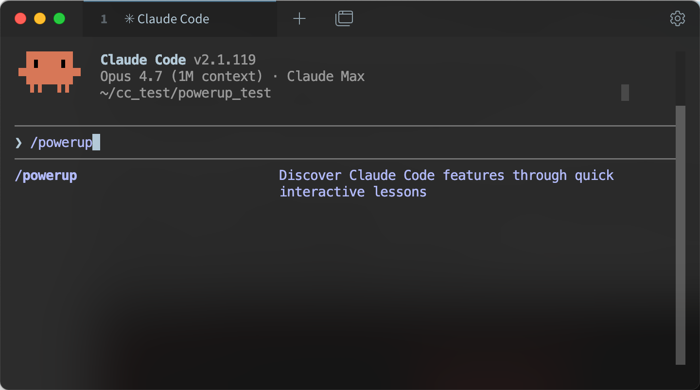

这个命令不是什么花里胡哨的功能，而是官方直接在你的终端里内置了一套交互式教程，总共 10 个课程，每个课程都带动画演示，手把手教你怎么用 Claude Code。

换句话说，Anthropic 官方帮你把「从零开始学 Claude Code」这件事给安排得明明白白的。

今天这篇文章，小林就带大家一起来体验一下这个 /powerup 命令，把它的 10 个课程逐个过一遍，让你看完之后，对 Claude Code 的核心操作有一个完整的认知。

每个课程打卡学习完成之后，进度就 100%了。


废话不多说，咱们开干！

---

### 先确认你的版本

/powerup 是 v2.1.90+ 才新增的命令，如果你的版本太旧，是看不到这个命令的。

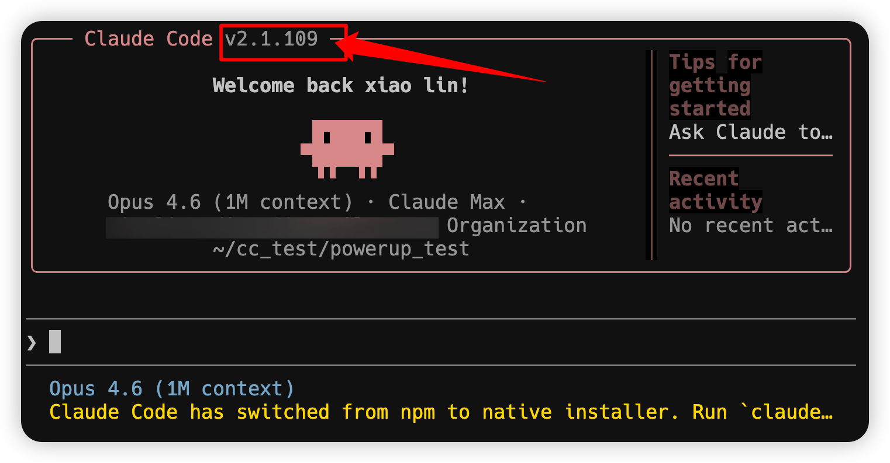

怎么查版本？在终端里输入：

```plain
claude --version
```

如果版本号低于 2.1.90，就需要先升级：

```plain
npm update -g @anthropic-ai/claude-code
```

升级完再确认一下版本号，确保是 2.1.90 或更高就行了。

好，版本没问题之后，我们直接进入正题。

---

### 打开 /powerup

在终端里启动 Claude Code：

```plain
claude
```

然后在 Claude Code 的输入框里输入：

```plain
/powerup
```

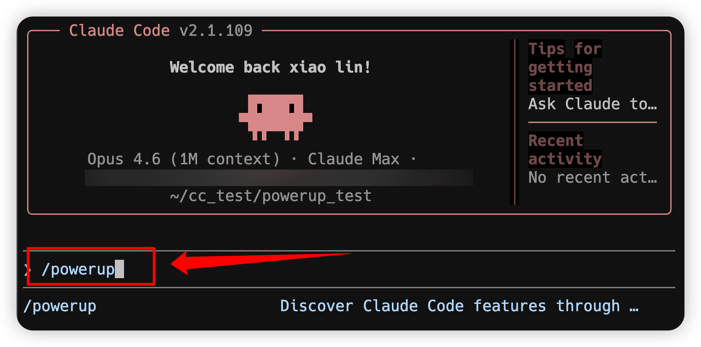

你会看到这样一个界面：

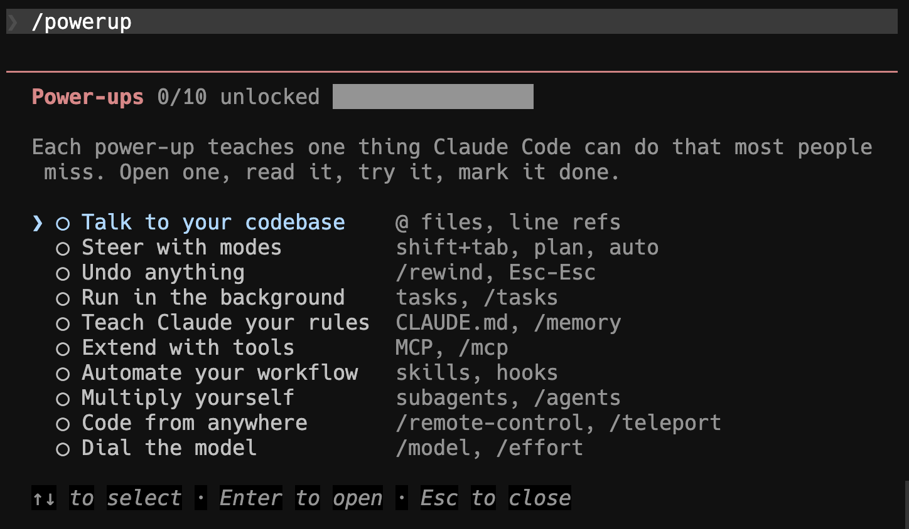

看英文困难的同学也不怕， 我也针对上面页面的内容，做了一个翻译：

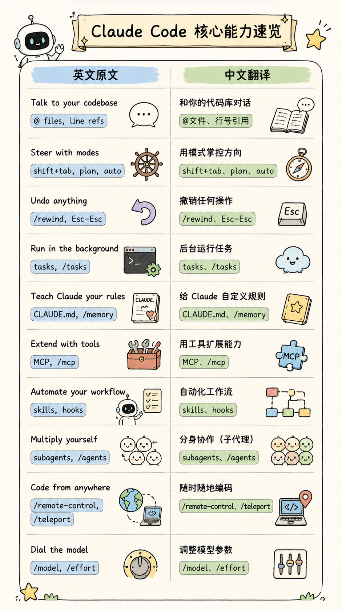

你看，一共 10 个课程，每类都标注了对应的核心命令或操作。右上角还有进度条，每完成一个课程就会解锁一格，有点像打游戏过关的感觉。

你可以用上下方向键选择课程，按回车进入。每个课程会先展示一段文字说明，然后播放一段动画演示，告诉你这个功能怎么用。

接下来，小林就按顺序，把这 10 大类课程涉及的知识点，一个一个给大家讲清楚。

---

### 01｜Talk to your codebase：与代码库对话

第一个课程，教你最基本也是最高频的操作：怎么让 Claude「看到」你的代码。

你可能会想，Claude Code 不是已经打开了吗？它不就能看到我的代码了吗？

嗯，能是能，但问题是，Claude Code 看到的是你整个项目的所有文件。如果你不说清楚让它看哪里，它就得自己一个文件一个文件地翻，翻着翻着，就把上下文窗口给吃满了，后面做事就容易「犯迷糊」。

所以，更好的做法是：**你主动告诉它该看哪个文件。**

怎么告诉它？用 **@ 符号**。

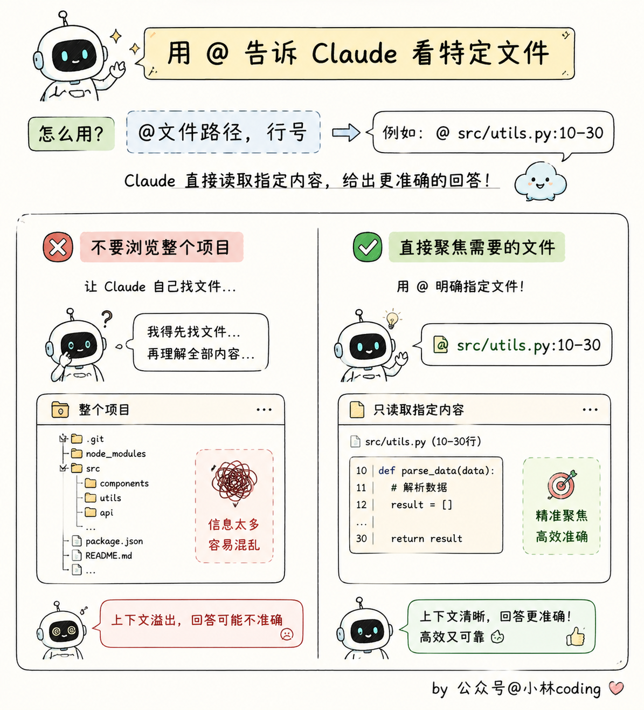

进入第一个课程，claude 就是在教你这个事情。

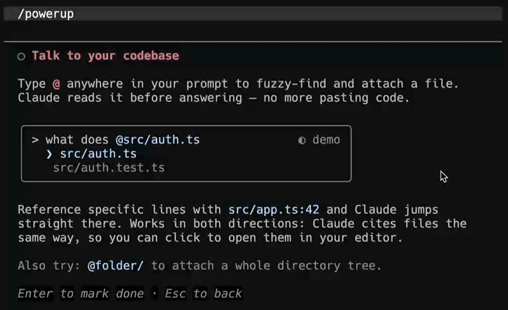

如果你确定明白了，输入回车就代表掌握了，然后如果想回到命令页面，就输入 ESC 键退出 /powerup 命令的页面就行。

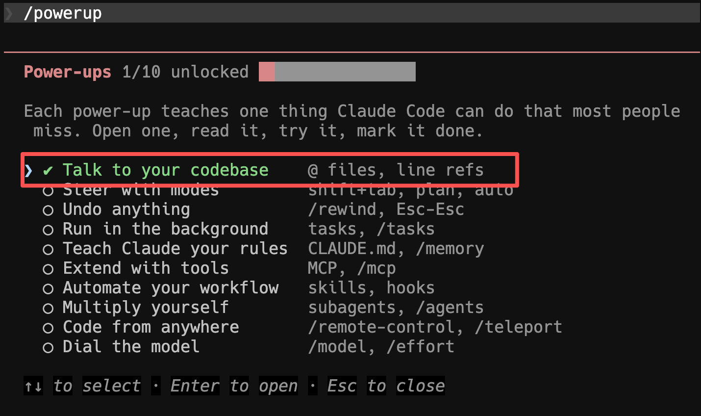

#### @ 引用文件

在输入框里，你可以直接用 @ 来引用文件或目录：

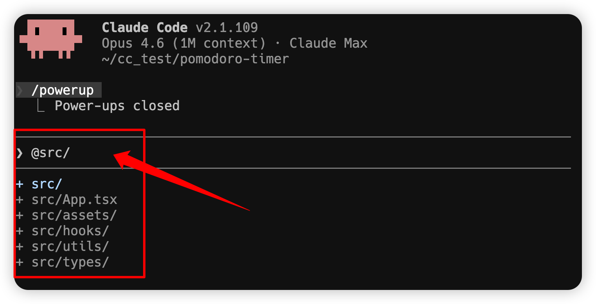

比如：

```plain
请帮我优化这个组件的样式。
@src/components/Timer.tsx
```

这样 Claude 就知道，你只想让它看 `Timer.tsx` 这个文件，不会去乱翻其他东西。

@ 的用法有这几种：

- **@./src/App.tsx**：引用单个文件，Claude 只会读取这个文件的内容
- **@./src/components/**：引用整个目录，Claude 会拿到这个目录的文件列表
- **@./src/App.tsx @./src/styles/global.css**：引用多个文件，用空格隔开就行

如果你只想让 Claude 看某个文件的一小段，没有什么花哨的语法，直接在提示词里用中文说清楚就行，比如「请重点看 Timer.tsx 的第 10 行到第 20 行」，Claude 会自己定位过去。

#### 为什么 @ 这么重要？

因为它能帮你省下大量上下文空间。

Claude Code 的上下文窗口是有上限的，主流的 Sonnet 和 Opus 模型标配大约 200k token，部分模型还提供 1M 长上下文版。

你可以把它理解为 Claude 的「短期记忆」，这个记忆是有容量限制的。如果你不给 Claude 指定文件，它为了理解你的需求，可能自己去搜索和读取项目里的很多文件，每一行代码都会占用上下文空间。

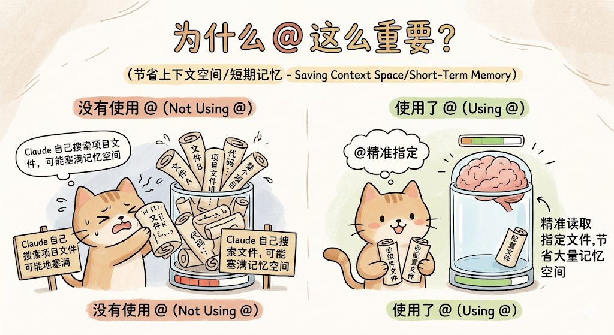

但如果你用 @ 精准指定了文件，Claude 就只需要读取你指定的那几个文件。比如你只 @ 了一个 200 行的组件文件，Claude 就只会读取这 200 行，上下文占用非常小。

#### 用 permissions 规则屏蔽敏感文件

还有一种情况：你的项目里可能有一些文件，你永远不想让 Claude 看到，比如含密钥的配置文件、日志、临时文件等等。

这时候可以在 `.claude/settings.json` 里用 `permissions.deny` 规则把这些路径挡住：

```json
{
  "permissions": {
    "deny": [
      "Read(./.env)",
      "Read(./.env.*)",
      "Read(./secrets/**)"
    ]
  }
}
```

配上之后，Claude 哪怕想去读这些文件，也会被规则拦下来，不会浪费上下文去看没用的东西，更不会意外把敏感信息塞进对话里。

**一句话总结：@ 是给 Claude 发精确地址，让它直奔目标，不迷路还省油。养成习惯，能 @ 就 @。**

---

### 02｜Steer with modes：用模式驾驭 Claude

第二个课程，教你怎么控制 Claude 的工作方式。

你有没有遇到过这种情况：让 Claude 改个代码，它每改一个文件都要弹出来问你「允许吗？」，改十个文件要确认十次，搞得你心烦意乱？

又或者反过来：让 Claude 自由发挥，结果它一通操作猛如虎，改了二十个文件，你连它改了什么都不知道？

这两种体验都不好。第一种太烦，第二种太危险。

那有没有一种方式，能让你在不同场景下灵活控制 Claude 的「自由度」？

有，用 **Shift+Tab** 切换工作模式。

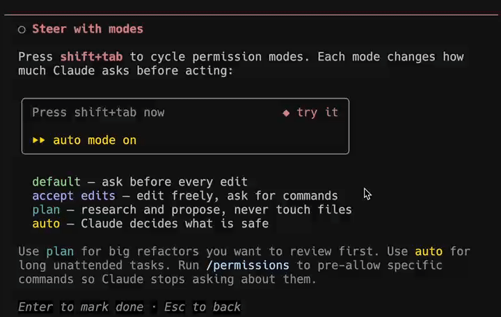

#### 四个工作模式

Claude Code 有四个工作模式，按 Shift+Tab 可以在它们之间循环切换：

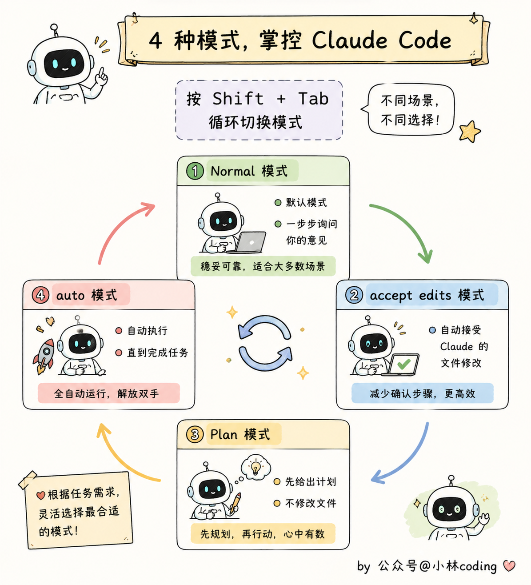

**Normal 模式（默认）**

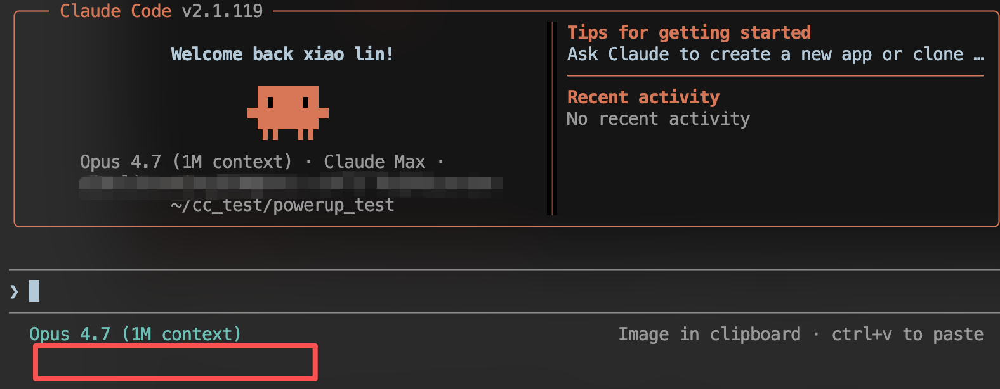

这是最稳妥的模式。Claude 每要做一步操作，都会先征求你的同意。比如它要创建一个文件，会先问你「允许创建吗？」；要执行一个命令，会先问「允许执行吗？」。

你同意了它才动手，不同意它就不做。

这种模式适合你不太确定 Claude 会做什么的场景，或者刚开始用 Claude Code、还不太信任它的阶段。虽然多了一步确认，但心里踏实。

**accept edits（自动接受编辑）**

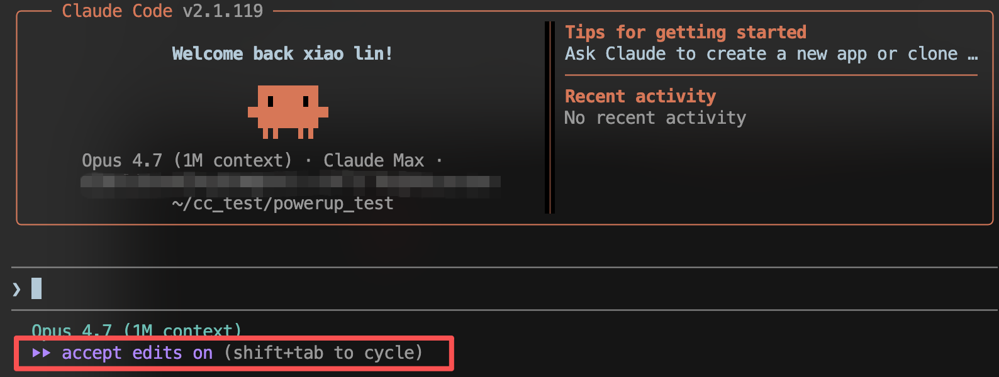

这个模式下，Claude 改文件不再问你了，会自由地读写、新建、删改。但执行命令的时候还是会停下来问一句。

什么意思呢？就是你已经信任 Claude 改代码这件事，但对它「执行命令」这种动作还是想留个把关的机会。比如它想跑 `npm install` 或者 `rm` 之类的命令，会先弹个确认让你看一眼。

这是日常写代码迭代的「黄金档位」。你看着它改、它一路改下去，效率高，但又不至于让命令失控。

**Plan 模式（计划模式）**

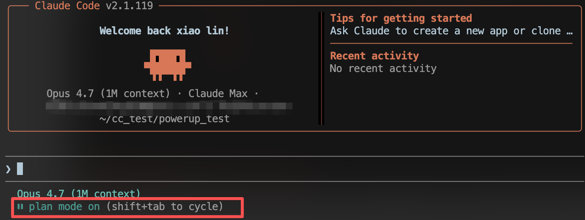

这个模式下，Claude 只看不改。它会分析你的代码、理解你的需求、给你出一个详细的执行方案，但不会动你的任何文件。

等你看完方案觉得没问题，再告诉它「按这个方案执行」，它才会开始动手。

Plan 模式特别适合复杂的开发任务。比如你要重构一个模块，或者做一个比较大的新功能，先让 Claude 在 Plan 模式下帮你规划一下，看看它的思路对不对，比直接让它动手改要安全得多。

**auto（自动模式）**

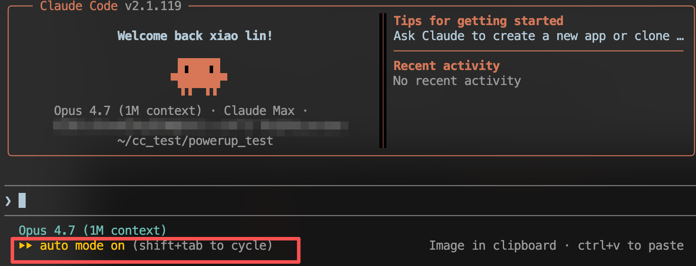

这是最激进的一档。文件编辑不问、命令执行也不问，所有操作 Claude 全自动执行，由它自己用后台的安全分类器判断哪些动作是安全的。

听起来是不是有点危险？确实，如果你完全不监督，它可能会改出一些你不想要的东西。但反过来说，如果你的任务又长又琐碎（比如让它跑一整套迁移脚本、批量改一堆同类文件），auto 模式能让你彻底告别「一直按 y」的疲劳。

那 auto 和 accept edits 的最大区别在哪？一句话，**accept edits 只放行编辑、命令还要问；auto 是连命令也不问**。这一档的安全感来自 Claude 自己的判断，而不是你的人工把关。

#### 我的建议

刚入门的林友，先用 **default**，能看到 Claude 每一步在干什么，心里有底。

熟悉了之后，日常写代码就切到 **accept edits**，让 Claude 自由改文件，命令的时候你再把关，效率和安全感都有了。

遇到复杂任务（重构、新功能），先用 **plan** 出方案，看完再执行。

只有那种「我完全信任、任务又长又重复」的场景，才考虑切到 **auto**，让它自己跑通。

**一句话总结：四个模式对应四种信任级别。default 最稳、accept edits 写代码最顺、plan 复杂任务先规划、auto 长任务全自动。新手从 default 起步，逐步往后切。**

---

### 03｜Undo anything：Claude 改错了？一键撤销

第三个课程，教你一个所有新手都会用到的操作：撤销。

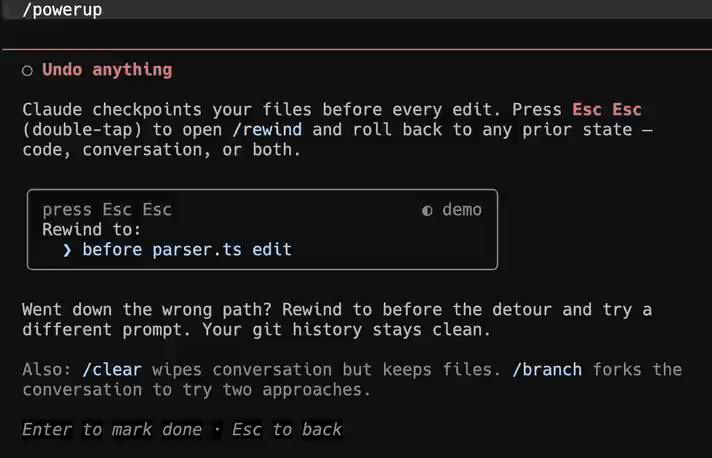

为什么说新手一定会用到？因为你一定会遇到 Claude 改错代码的情况。

这不是 Claude 的问题，而是 AI 编程的常态。它可能误解了你的意思、走错了方向、改了一个不该改的文件。

这时候怎么办？手动去改回去？文件多了你根本记不住它改了哪些地方。

别慌，Claude Code 自带「后悔药」。


#### 两种撤销方式

**方式一：连按两次 Esc**

在输入框为空的状态下，快速连按两次 Esc 键，就会打开回滚菜单。这个菜单会显示一个时间线，列出 Claude 最近做的每一次操作：

```plain
最近的操作：
❯ 1. [14:35] 修改了 useTimer.ts（添加音效逻辑）
  2. [14:32] 修改了 Timer.tsx（添加音效触发）
  3. [14:28] 创建了 notification.ts（新建文件）
  4. [14:25] 修改了 Controls.tsx（重置按钮逻辑）
```

你只需要用方向键选择要回滚到哪一步，Claude Code 就会自动把代码恢复到那个状态。

**方式二：输入 /rewind 命令**

效果跟连按 Esc 一样，只是用命令的方式触发：

```plain
/rewind
```

#### 回滚的范围

需要注意的是，这两种方式回滚的不仅仅是文件内容，对话上下文也会一起回滚。

也就是说，回滚之后，Claude 会「忘记」那次操作之后发生的所有对话，就像那次操作从来没发生过一样。

这比你自己手动改文件要彻底得多。

#### 更靠谱的方式：Git

虽然 Claude Code 自带的回滚很好用，但它有一个局限：只能回滚 Claude 直接创建或编辑的文件。

如果 Claude 执行了 `npm install` 之类的命令，生成了 node_modules、package-lock.json 等文件，回滚是管不了这些的。

所以，如果你要做比较大的改动，最靠谱的方式还是先用 Git 存一份档：

```plain
git add .
git commit -m "改动前的存档"
```

万一 Claude 改坏了，还是得靠 Git 来管理代码仓库比较好，一条命令就能回到安全状态：

```plain
git checkout .
```

**一句话总结：Claude 改错了不慌，Esc+Esc 或 /rewind 一键回滚。大改动前先 git commit 存档，双重保险。**

---

### 04｜Run in the background：让 Claude 在后台干活

第四个课程，教你一个很多人不知道的操作：让 Claude 在后台执行任务。

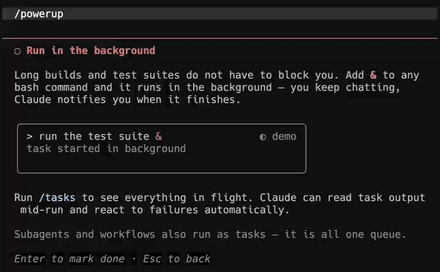

什么意思呢？

举个例子。你让 Claude 帮你跑一下项目的构建命令 `npm run build`，这个命令可能要跑一两分钟。在正常模式下，这一两分钟里你啥也干不了，只能等着。

但如果让它在后台跑呢？你就可以继续跟 Claude 聊别的，让它帮你改代码、回答问题，不用傻等构建完成。

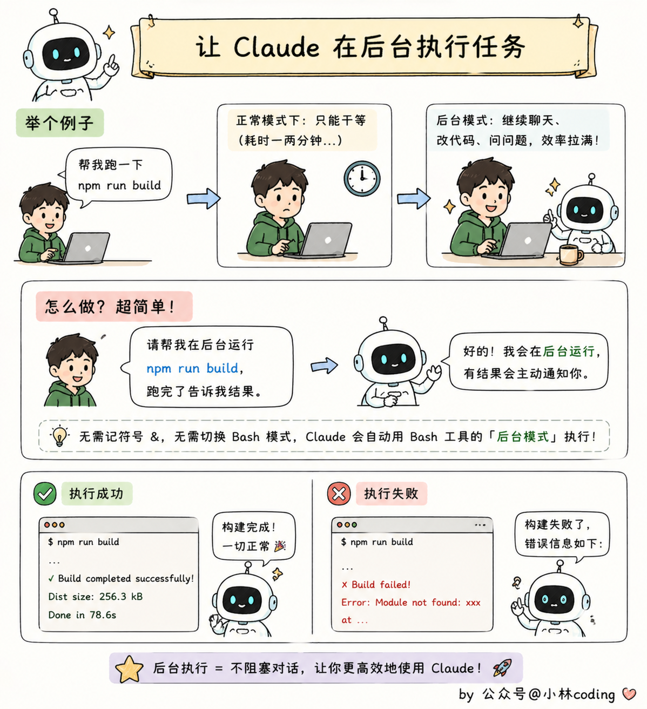

#### 怎么在后台运行？

方法其实特别简单：你根本不用记什么 shell 符号，直接用大白话告诉 Claude「这条命令请在后台跑」就行：

```plain
请帮我在后台运行 npm run build，跑完了告诉我结果。
```

就这么一句话，Claude 会自动用 Bash 工具的「后台模式」去执行这条命令。你不用在命令末尾加 `&`，也不用切到 Bash 模式，Claude 自己就会处理。

等命令跑完了，Claude 会主动告诉你结果。如果中途出错了，它也会把错误信息捞出来给你看。

#### 查看后台任务

如果你想看看当前有哪些后台任务在跑，可以用：

```plain
/tasks
```

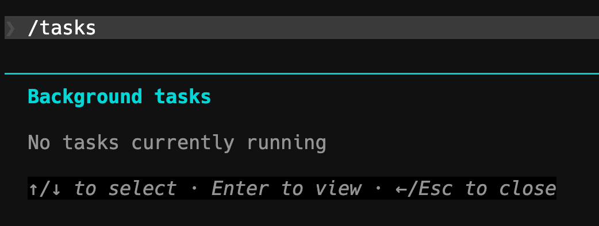

它会列出所有后台任务的状态：正在运行、已完成、还是出错了。

#### 适合什么场景？

后台运行特别适合这些「耗时长但不需要你盯着」的任务：

- 项目构建（npm run build）
- 跑测试用例（npm run test）
- 安装依赖（npm install）
- 数据库迁移

这些任务可能要跑几十秒甚至几分钟，没必要在终端里干等着。让 Claude 在后台跑，你继续做你的事，效率直接翻倍。

**一句话总结：命令末尾加 & 就能让任务在后台跑，不用傻等。用 /tasks 查看后台任务状态。**

---

### 05｜Teach Claude your rules：让 Claude 记住你的规则

第五个课程，可能是所有课程里对你日常使用影响最大的一个。

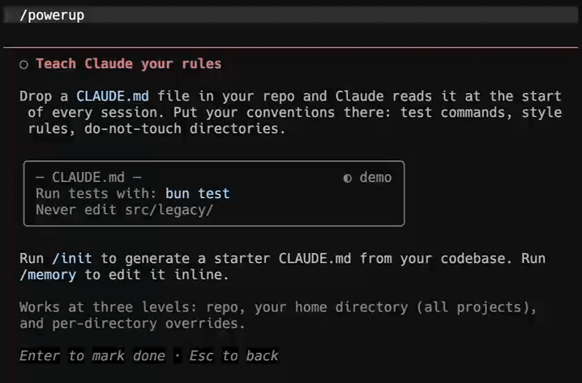

为什么这么说？因为你一定会遇到这个烦人的场景：每次重新打开 Claude Code，或者用 /clear 清空对话之后，你都要重新告诉 Claude「我这个项目是做什么的、用了什么技术栈、代码规范是什么……」

一遍两遍还行，多了真的很烦。有没有办法让 Claude 永远记得你的项目信息？

有，用 **[CLAUDE.md](http://CLAUDE.md)**。


#### CLAUDE.md 是什么？

[CLAUDE.md](http://CLAUDE.md) 是一个放在你项目根目录的文件，Claude Code 每次启动的时候都会自动读取这个文件的内容，把它当作理解你项目的「背景资料」。


你可以把它理解为 Claude 的「项目记忆」。只要你在这个项目目录下启动 Claude Code，它就知道你的项目是做什么的、用了什么技术栈、代码规范是什么，不用你每次重新交代。

#### 怎么创建 CLAUDE.md ？

最简单的方式是用 `/init` 命令：

```plain
/init
```

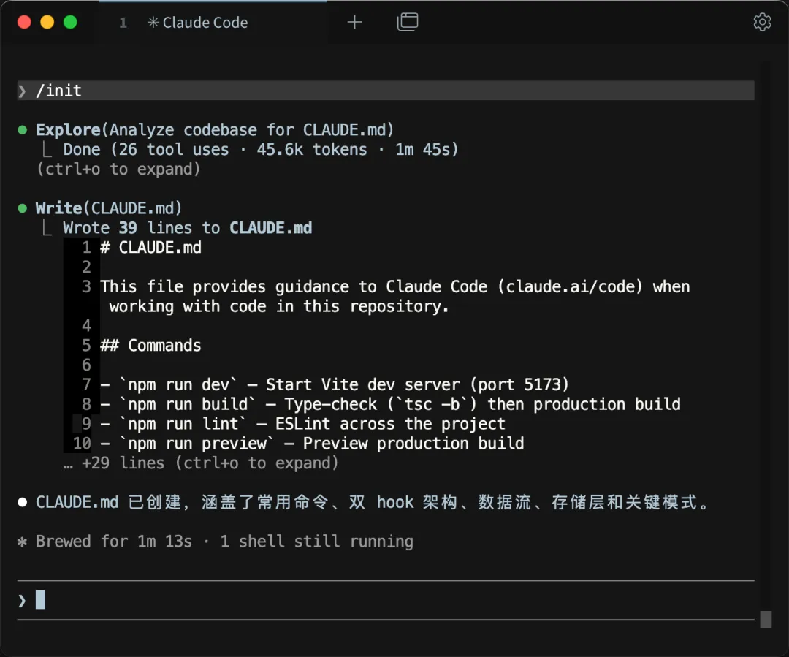

Claude 会扫描你的项目结构，然后自动生成一份 [CLAUDE.md](http://CLAUDE.md)，里面包含项目的基本信息、技术栈、目录结构等。


你也可以自己手动创建这个文件，把你觉得 Claude 需要知道的信息写进去。一份好的 [CLAUDE.md](http://CLAUDE.md) 通常包含这几部分：

```plain
# 项目名称

一句话说清楚这个项目是做什么的。

## 技术栈
- React 10 + TypeScript + Tailwind CSS

## 代码规范
- 使用函数式组件，不用 class 组件
- 变量命名用驼峰命名法
- 组件文件名用 PascalCase

## 项目结构
- src/components/ - UI 组件
- src/hooks/ - 自定义 Hook
- src/utils/ - 工具函数
```

#### 写什么、不写什么？

[CLAUDE.md](http://CLAUDE.md) 有一个很重要的原则：**越精准越好，不是越长越好。**

太长的 [CLAUDE.md](http://CLAUDE.md) 会占用大量上下文空间，反而让 Claude 工作效率下降。所以每写一条信息之前，先问自己一个问题：「如果删掉这条，会不会让 Claude 犯错？」如果不会，就不写。


**应该写的：** 项目简介、技术栈、代码规范、目录结构
**不应该写的：** 详细的 API 文档（太长）、每次都变的临时需求、过于泛泛的描述

#### /memory 管理记忆

除了项目级的 [CLAUDE.md](http://CLAUDE.md)，Claude Code 还有一个 `/memory` 命令，可以帮你管理「个人记忆」。这些记忆是跨项目的，不管你在哪个项目里，Claude 都会记住。

比如你可以用它来存储你的通用编码偏好：

```plain
/memory
```

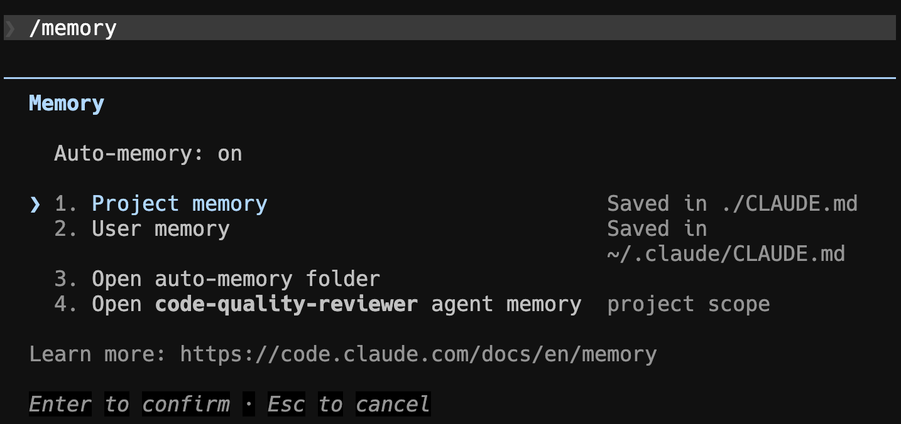

它会打开一个编辑界面，让你查看和修改所有的记忆文件，还能开关 auto memory（自动记忆）功能。

另外还有一种更省事的方式：直接用自然语言告诉 Claude「记住这件事」，比如：

```plain
请记住：我这个项目统一用 pnpm，不用 npm。
```

Claude 会自己判断这条信息值不值得记，觉得值得记就会写到 auto memory 里，下次也会记得。

#### CLAUDE.md 的几个层级

Claude Code 的 [CLAUDE.md](http://CLAUDE.md) 实际上支持好几个层级，按照日常最常用的顺序是这样的：

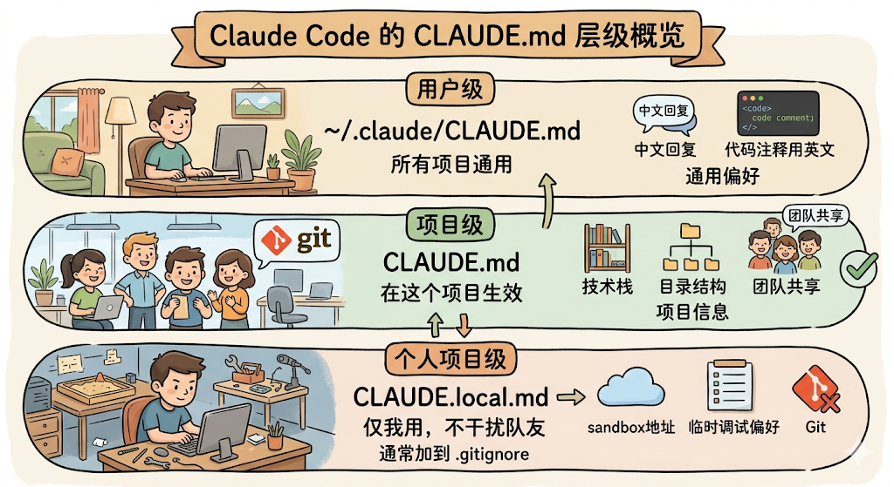

- **项目级**：放在项目根目录的 `CLAUDE.md`（或者 `.claude/CLAUDE.md`），只在这个项目里生效。适合写项目相关的信息，比如技术栈、目录结构。这个文件可以提交到 Git 里，团队成员共享。
- **个人项目级**：`CLAUDE.local.md`，也放在项目根目录，但通常加到 `.gitignore` 里不提交。适合写你自己的临时调试偏好、sandbox 地址这种「只有我用」的内容，不会干扰到队友。
- **用户级**：放在你 home 目录下的 `~/.claude/CLAUDE.md`，在所有项目里都生效。适合写你个人的通用偏好，比如「请用中文回复」「代码注释用英文」。

这几个层级的内容在启动时会一起合并进上下文，越具体的层级优先级越高（项目级 > 用户级）。

**一句话总结：[CLAUDE.md](http://CLAUDE.md) 是给 Claude 装的「长期记忆」，写一次，永远记得。/init 快速创建，/memory 管理个人偏好，记得保持精简。**

---

### 06｜Extend with tools：用 MCP 给 Claude 装外挂

第六个课程，教你一个让 Claude Code 能力大增的机制：MCP。

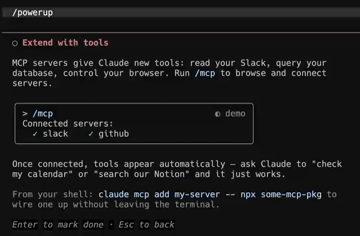

MCP 全称是 Model Context Protocol，翻译过来叫「模型上下文协议」。听着很唬人对吧？但其实你可以把它理解为一个「外挂接口」。

什么意思？

Claude Code 本身能做的事情是有限的：读写文件、执行命令、搜索代码。但如果你想让 Claude 做更多的事情呢？比如让它帮你搜索网页、操作数据库、调用第三方 API？

MCP 就是干这个的。它让你可以把外部工具「接入」Claude Code，让 Claude 能调用这些工具的能力。

Claude Code 就像一台电脑，出厂自带了几个基本软件（文件管理器、命令行终端、代码编辑器）。而 MCP 就像是 USB 接口，你可以通过这个接口给电脑接上打印机、摄像头、手柄等各种外设，让电脑能做更多的事情。

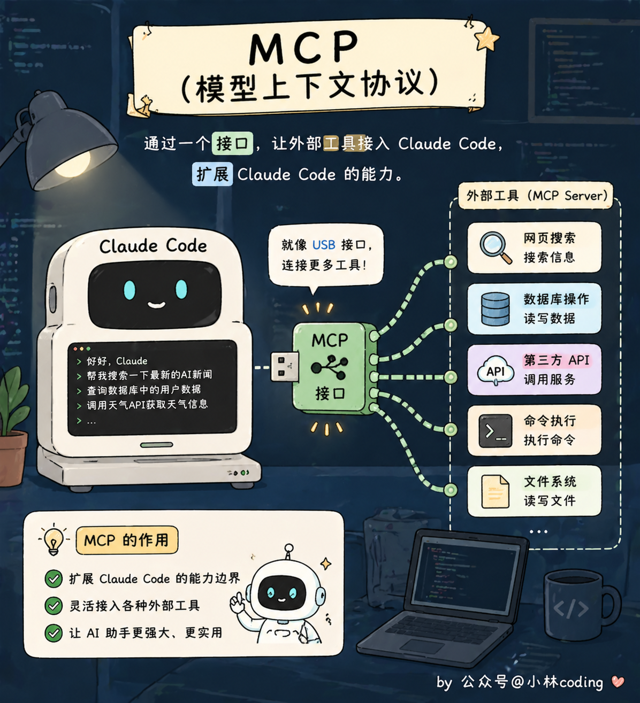

#### 怎么管理 MCP？

用 `/mcp` 命令：

```plain
/mcp
```

它会打开一个管理界面，你可以在这里添加、删除、配置 MCP server。

MCP server 就是那些「外设」。每个 MCP server 提供不同的能力，比如：

- **Brave Search MCP**：让 Claude 能搜索网页
- **Postgres MCP**：让 Claude 能操作 PostgreSQL 数据库
- **Playwright MCP**：让 Claude 能控制浏览器做自动化测试
- **Filesystem MCP**：让 Claude 能访问指定目录之外的文件

#### 怎么添加 MCP server？

加 MCP server 主要有两种方式，一种是命令行直接加（推荐），一种是手动改配置文件。

**方式一：用** `**claude mcp add**` **命令（推荐）**

直接在终端里跑一条命令就行，连 JSON 都不用动。命令的基本格式是这样：

```plain
claude mcp add <名字> -- <启动 MCP server 的命令>
```

中间那个 `--` 是分隔符，告诉 Claude Code「双横杠前面的是给 claude 的参数，后面的是用来启动 MCP server 的命令」。

**方式二：手动改 settings.json**

你也可以在 `.claude/settings.json` 或 `~/.claude/settings.json` 里直接写配置：

```plain
{
  "mcpServers": {
    "你给这个 server 起的名字": {
      "command": "npx",
      "args": ["-y", "对应的 MCP server 包名"],
      "env": {
        "需要的API密钥": "你的值"
      }
    }
  }
}
```

效果跟命令行方式一样。如果是团队项目，可以把这份配置写到项目根目录的 `.mcp.json`，提交到 Git，让队友拉下来就能用。

#### 实战：用 12306-mcp 查火车票

光说不练假把式，小林带你装一个真实的 MCP，体验一下。

我们以社区里很火的 **12306-mcp** 为例。这个 MCP 是开源项目（GitHub 上的 `Joooook/12306-mcp`），接入之后，你就可以直接在终端里用自然语言查 12306 的余票、车次、中转方案。

**第一步：用命令安装**

打开终端，跑下面这条命令：

```plain
claude mcp add 12306 -s user -- npx -y 12306-mcp
```

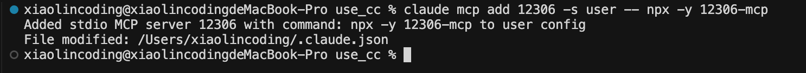

这条命令的意思就是：给 Claude Code 加一个名字叫「12306」的 MCP server，作用域是 user（在所有项目里都能用），启动方式是 `npx -y 12306-mcp`。

跑完之后可以用：

```plain
claude mcp list
```

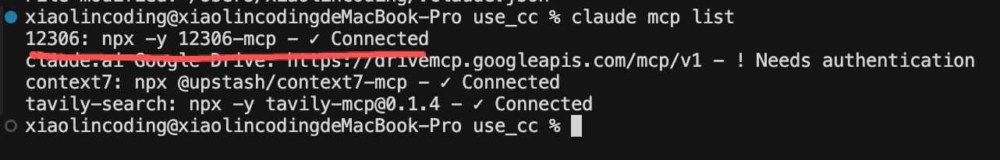

或者在 claude 里用 /mcp 命令

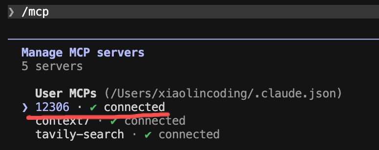

确认一下 12306 是不是真装上了。

**第二步：在 Claude Code 里直接问**

启动 Claude Code，然后用大白话问就行：

```plain
帮我查 5 月 1 日北京到上海的高铁票，要二等座。
```

Claude 会自动识别出这是火车票查询任务，调 12306-mcp 去查实时数据，然后把车次、时间、票价、余票整理成一张清晰的列表给你。

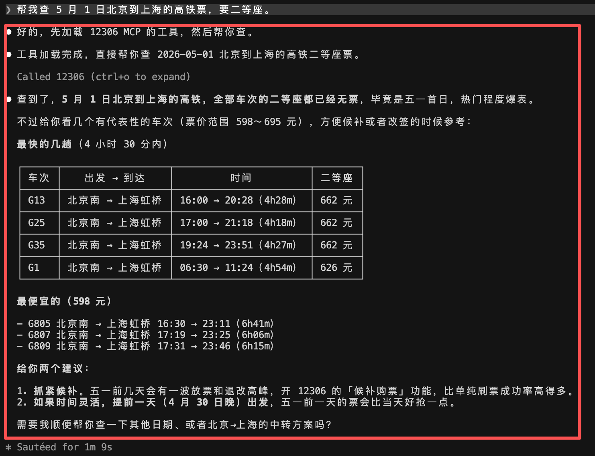

你想想看，你都不需要打开 12306 网站，也不需要记任何 API，一句话搞定。

如果想换一个查询，比如「再加一个 5 月 7 日返程的」，直接在对话里说就行，Claude 会自己调用对应的工具。

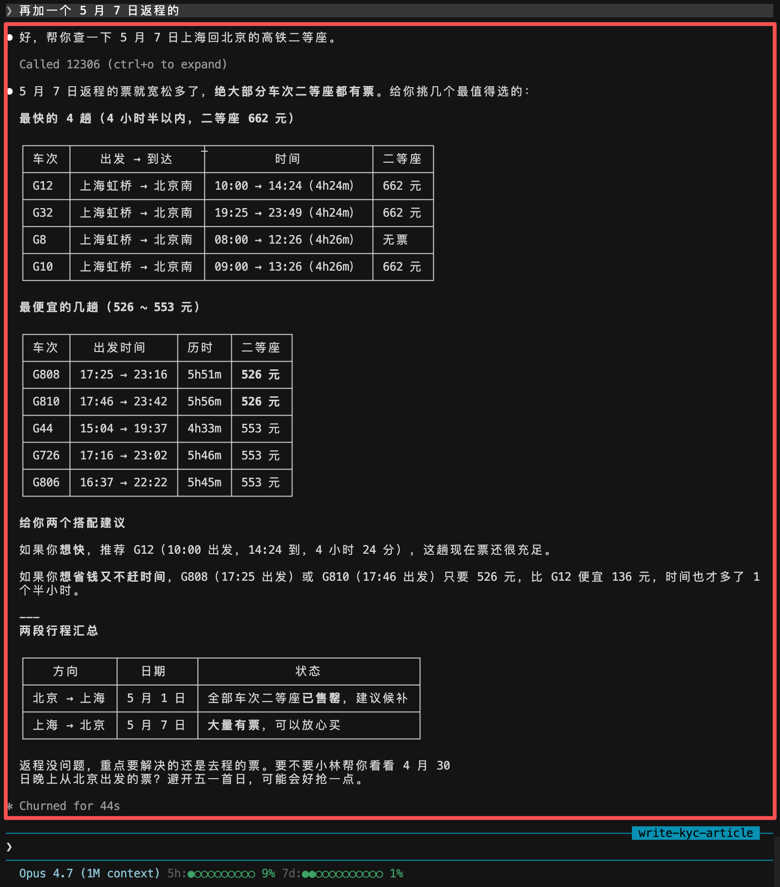

#### 移除 MCP server

如果某个 MCP 不想用了，直接：

```plain
claude mcp remove 12306 -s user
```

就能干净地卸掉。

#### MCP 的价值

MCP 最大的价值在于「扩展」。Claude Code 出厂自带的能力可能不够用，但通过 MCP，你可以按需接入各种工具，让 Claude 变成一个越来越强大的全能助手。

而且 MCP 是一个开放的协议，社区里有大量现成的 MCP server 可以用，你甚至可以自己开发一个。

**一句话总结：MCP 是给 Claude Code 装外挂的接口，用 /mcp 管理。通过接入不同的 MCP server，让 Claude 能搜索网页、操作数据库、控制浏览器，能力无限扩展。**

---

### 07｜Automate your workflow：让 Claude 自动化你的工作流

第七个课程，教你两个让 Claude Code 更「聪明」的机制：Skills 和 Hooks。

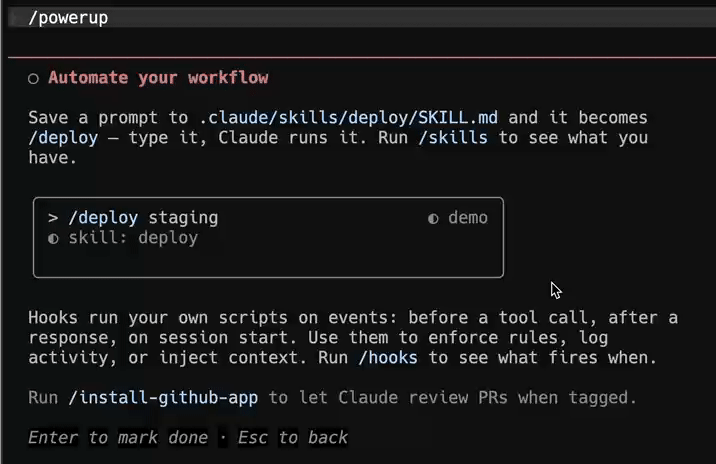

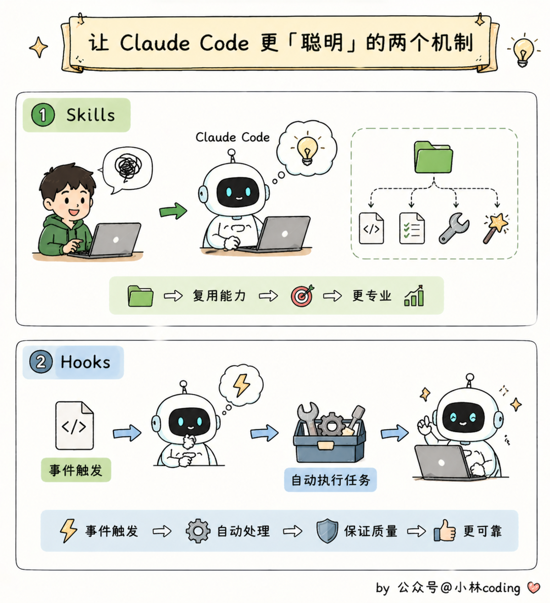

#### Skills：给 Claude 装技能包

Skills 是 Claude Code 的插件机制。你可以把它理解为 Claude 的「技能包」，安装之后，Claude 在某个特定领域会表现得更好。

比如有一个叫 **frontend-design** 的 Skill，专门用来生成高质量的前端界面。启用之后，Claude 在做前端页面的时候，设计水平会有明显的提升。

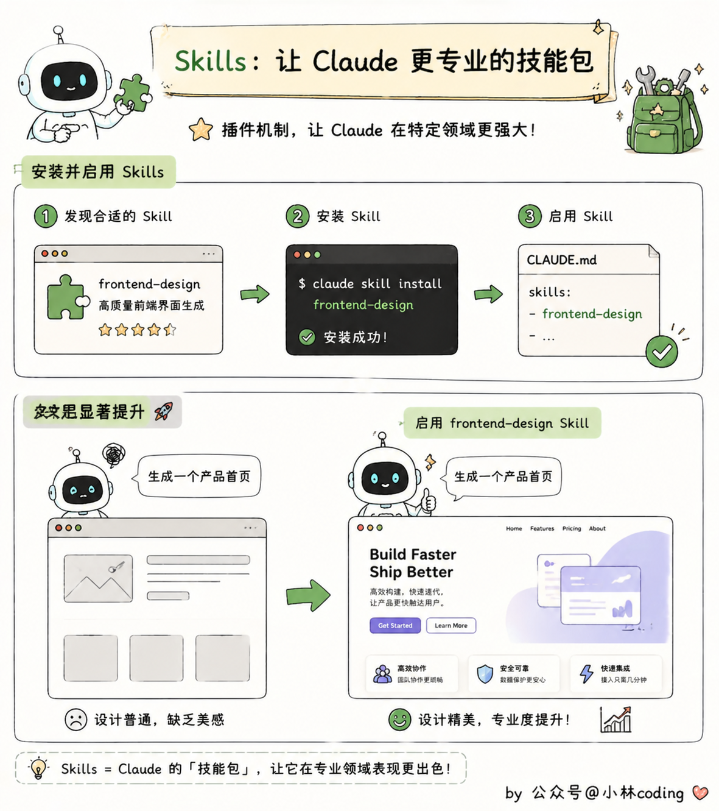

Skill 怎么装？其实一份 Skill 就是一个 `SKILL.md` 文件（外加一些可选的辅助文件），只要把它放到下面这几个目录里，Claude Code 就会自动识别：

- `~/.claude/skills/<技能名>/SKILL.md`：个人全局可用
- `.claude/skills/<技能名>/SKILL.md`：当前项目可用

你既可以自己手写一份 [SKILL.md](http://SKILL.md)，也可以通过 `/plugin` 命令去安装打包好的插件（plugin 里可以带 skills、hooks、命令等等，是一个更大的集合）。

#### 实战：用一行命令装上 frontend-design

光讲机制太抽象，咱们直接装一个真的 skill 上手玩玩。

就拿 frontend-design 来说，这是 Anthropic 官方推出的明星 skill，目前装机量已经超过 27 万次。它的核心作用，是把 Claude 生成前端代码时的那种「一眼 AI 味」给治好，让你拿到的页面更像真人设计师做出来的。

怎么装呢？打开 Claude Code，输入下面这条命令：

```plain
/plugin install frontend-design@claude-plugins-official
```

来解释一下这条命令。`@` 前面的 `frontend-design` 是 skill 的名字，`@` 后面的 `claude-plugins-official` 是它所在的「官方插件市场」。这个官方市场是 Claude Code 启动时自带的，不用你提前 add，直接装就行。

装完之后，如果你不想重启 Claude Code，就跑一下：

```plain
/reload-plugins
```

让新 skill 立刻在当前会话生效。

接下来就是见证奇迹的时刻。你直接说一句话试试：

```plain
帮我设计一个 SaaS 产品的定价页面，三档套餐。
```

Claude 一识别这是前端任务，就会自动加载 frontend-design 的设计规范，按照里面的字体、间距、配色、布局规则去生成代码。

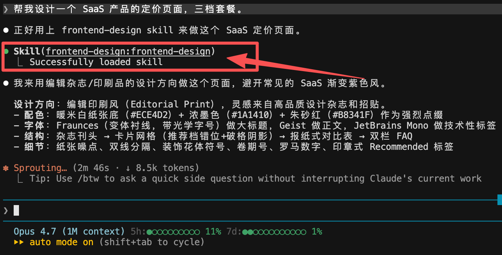

生成出来的页面，会比你不装这个 skill 的时候，质感高一大截。

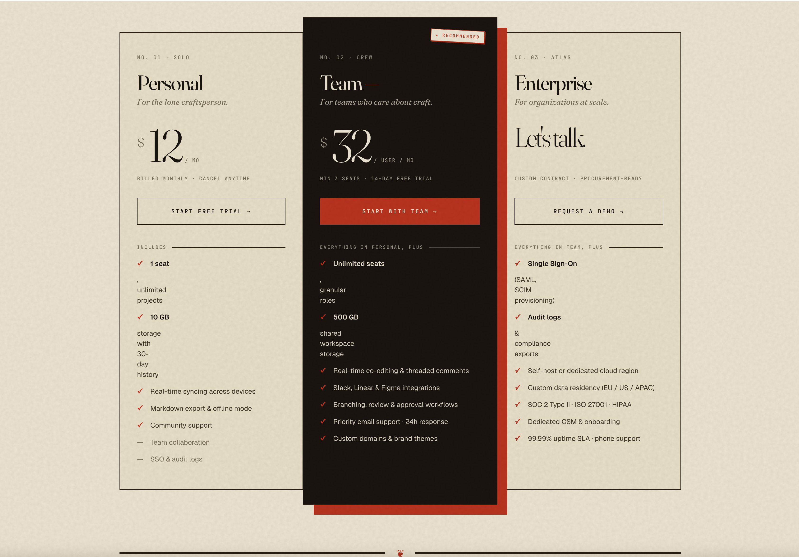

你也可以显式 `/` 触发：

```plain
/frontend-design 帮我重新设计这个页面的样式
```

如果哪天不想用了，卸载也是一条命令的事：

```plain
/plugin uninstall frontend-design@claude-plugins-official
```

干净利落。

Skills 的本质是一份由专业人员编写的指南文件（`SKILL.md` + 可选的参考材料），里面包含了复杂的指令、模板和参考文档。当 Claude 加载了这个 Skill，就相当于「临时培训」了一下，按照更专业的标准来输出结果。

#### Hooks：给 Claude 的操作加「钩子」

Hooks 是 Claude Code 的自动化钩子机制。

它的工作原理很简单：你在某个操作「之前」或「之后」挂一个自定义脚本，Claude 每次执行这个操作的时候，就会自动触发你的脚本。

听起来有点抽象？举个例子你就懂了。

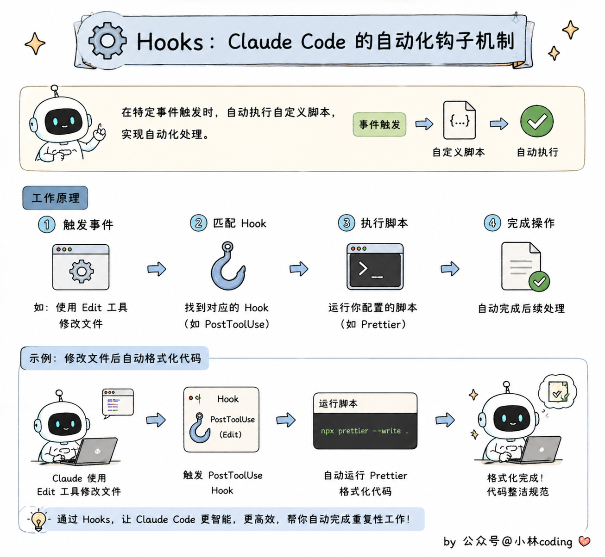

比如你希望 Claude 每次修改完文件之后，自动帮你运行一下代码格式化工具（比如 Prettier）。你就可以设置一个 **PostToolUse** Hook，挂在 Edit 工具上。这样 Claude 每次用 Edit 工具改完文件，就会自动触发 Prettier 帮你格式化代码。

Hooks 有两种类型：

- **PreToolUse**：在工具执行之前触发。适合做输入校验、拦截不安全的操作。
- **PostToolUse**：在工具执行之后触发。适合做自动格式化、自动测试等后续处理。

#### 怎么配置 Hooks？

Hooks 的配置写在项目的 `.claude/settings.json` 或全局的 `~/.claude/settings.json` 里。

这里有一个小细节林友一定要注意：Claude Code 的 hook 脚本**不是通过环境变量拿文件路径的**，而是通过标准输入（stdin）接收一段 JSON，里面包含了这次操作的所有信息。

你可以通过可用的环境变量（比如 `$CLAUDE_PROJECT_DIR`）拿到项目根目录，但具体这次改的是哪个文件，要从 stdin 的 JSON 里解析出来。

比如配置一个自动格式化的 Hook，正确的写法是这样：

```json
{
  "hooks": {
    "PostToolUse": [
      {
        "matcher": "Edit|Write",
        "hooks": [
          {
            "type": "command",
            "command": "jq -r '.tool_input.file_path' | xargs -I {} npx prettier --write {}"
          }
        ]
      }
    ]
  }
}
```

这里的 `jq` 负责从 stdin 的 JSON 里把 `tool_input.file_path` 字段读出来，然后 `xargs` 把它交给 Prettier 去格式化。这样每次 Claude 用 Edit 或 Write 工具改完文件，就会自动跑一次 Prettier。

如果你不太习惯 `jq`，也可以写一个小的 shell 脚本放到 `$CLAUDE_PROJECT_DIR/.claude/hooks/format.sh` 里，脚本里自己 `read` stdin 再解析 JSON，command 字段就写 `"$CLAUDE_PROJECT_DIR/.claude/hooks/format.sh"` 指过去。

#### Hooks 能做什么？

Hooks 的应用场景非常多，举几个例子：

- **自动格式化**：每次修改文件后自动运行 Prettier/ESLint
- **自动测试**：每次修改测试文件后自动跑相关测试
- **安全检查**：每次修改配置文件后检查是否有敏感信息泄露
- **自动提交**：每次修改完代码后自动 git add + commit

**一句话总结：Skills 给 Claude 装技能包，让它在特定领域更强；Hooks 给操作加钩子，实现自动化工作流。两个配合使用，Claude Code 直接变成你的定制化开发助手。**

---

### 08｜Multiply yourself：让 Claude 的分身帮你干活

第八个课程，教的是 Claude Code 里一个很强大但很多人没用过的功能：子代理（Subagents）。

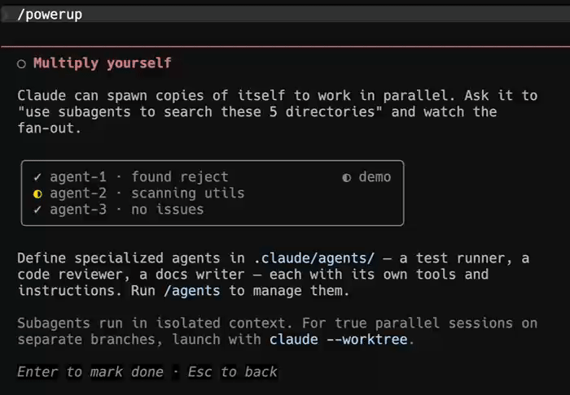

#### 什么是子代理？

你可以把子代理理解为 Claude 的「分身」。

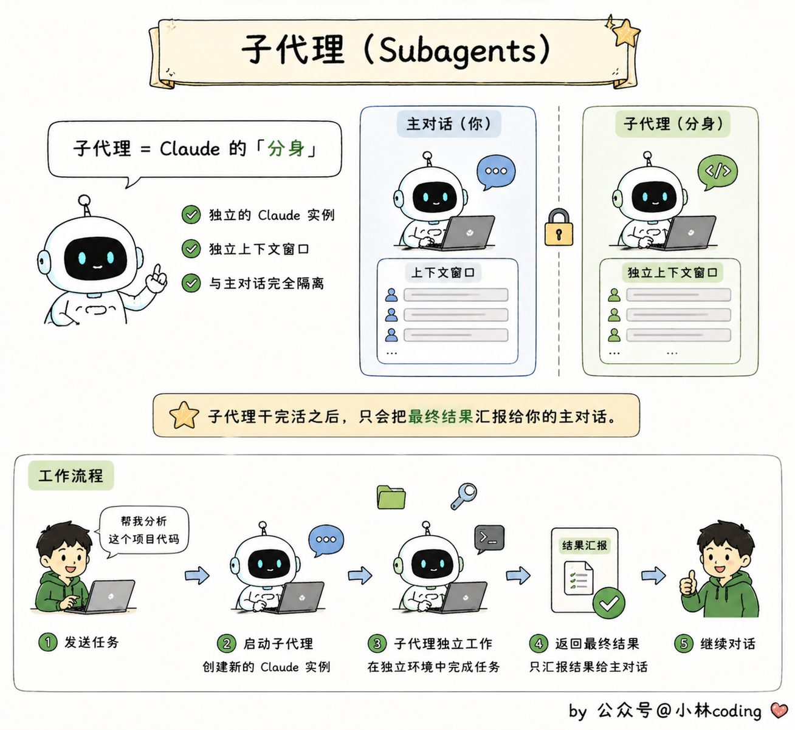

当你启动一个子代理的时候，Claude Code 会在后台创建一个全新的 Claude 实例，这个实例有自己的独立上下文窗口，跟你当前的主对话完全隔离。

子代理干完活之后，只会把最终结果汇报给你的主对话。

#### 为什么需要子代理？

你可能会问：我直接让 Claude 帮我做不就行了？为什么要搞一个分身？

原因有两个：

**第一个原因：独立视角。**

如果代码是 Claude 自己写的，你让它自己审查，它多少会「手下留情」。但如果你启动一个子代理来审查，这个子代理是一个全新的实例，它不知道这段代码是谁写的，只会客观地指出问题。

**第二个原因：保护主会话的上下文。**

前面我们说过，Claude Code 的上下文窗口是有上限的。如果你让 Claude 在主对话里做一个很复杂的任务（比如审查整个项目的代码），它会读取大量文件、生成大量分析结果，一下子就把上下文吃满了。

但子代理有自己独立的上下文空间，不管它读了多少文件、分析了多少代码，这些只占用它自己的上下文，对你的主会话零影响。等它干完活，只会把一份精炼的结果摘要汇报回来，占用很小。

#### 怎么创建子代理？

用 `/agents` 命令：

```plain
/agents
```

然后选择创建新的子代理

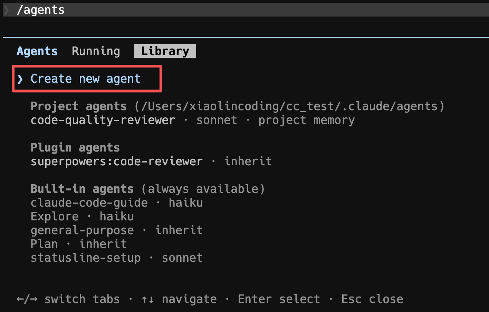

接下来，按照向导一步步配置：

1. 选择作用域（Project 或 User）
2. 用自然语言描述子代理的职责（比如「帮我审查代码质量」）
3. 配置可用工具（子代理能使用哪些工具）
4. 选择使用的模型
5. 选择标识颜色

创建完成之后，你就可以随时让 Claude 使用这个子代理了：

```plain
用 code-guality-reviewer agents 帮我审核这个项目的代码
```

Claude 会启动对应的子代理，用独立的上下文窗口来完成审查任务。你能在界面上看到子代理的颜色标识，表示它正在工作。


#### 子代理适合什么场景？


- **代码审查**：让子代理用独立视角帮你审查代码质量
- **写测试**：让子代理帮你补齐单元测试，不受主对话干扰
- **查文档**：让子代理去读某个库的文档，总结要点后汇报
- **多文件批量修改**：让子代理独立处理一组文件的修改

**一句话总结：子代理是 Claude 的「分身」，用 /agents 创建。它有独立的上下文空间，适合做代码审查、写测试等需要「独立视角」的任务。**

---

### 09｜Code from anywhere：随时随地编码

第九个课程，教你两个跨设备协作的命令：`/remote-control` 和 `/teleport`。这两个命令是一对，方向正好相反，林友理解的时候可以把它们放在一起看。

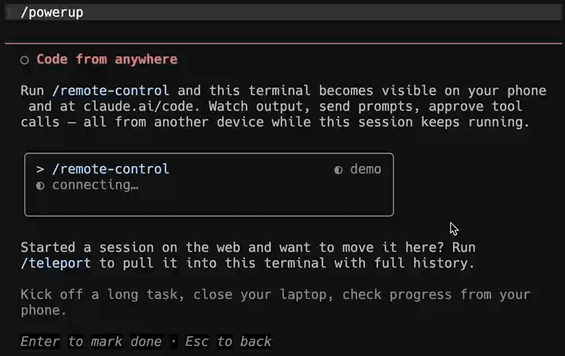

先想象一个常见场景：你在公司用终端里的 Claude Code 开发一个项目，下班路上想用手机继续看看进展，回家之后又想换成网页版继续改，或者反过来，在 [claude.ai](http://claude.ai) 网页上起了个会话，回到电脑前想把它拉到本地终端继续跑。

这种「跨设备、跨终端」切换的需求，就是这两个命令要解决的问题。

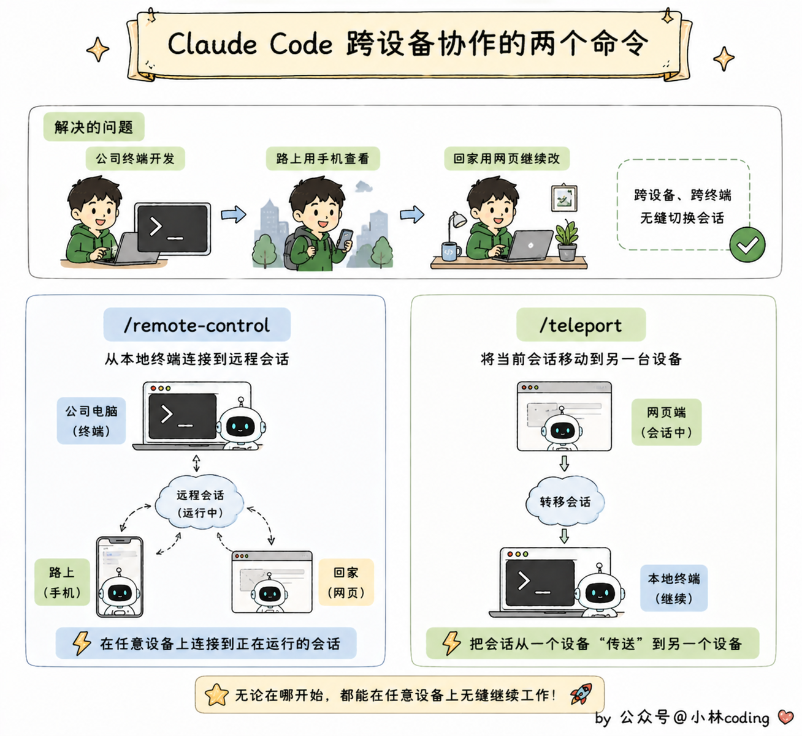

#### /remote-control：把本地会话「暴露」给网页

在终端里的 Claude Code 会话中输入：

```plain
/remote-control
```

这个命令会让你当前的终端会话进入可远程控制的状态。

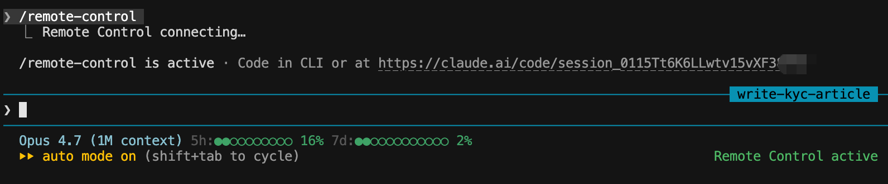

然后你可以在 [claude.ai](http://claude.ai) 网页上连接到这个会话，从浏览器里给 Claude 发指令。

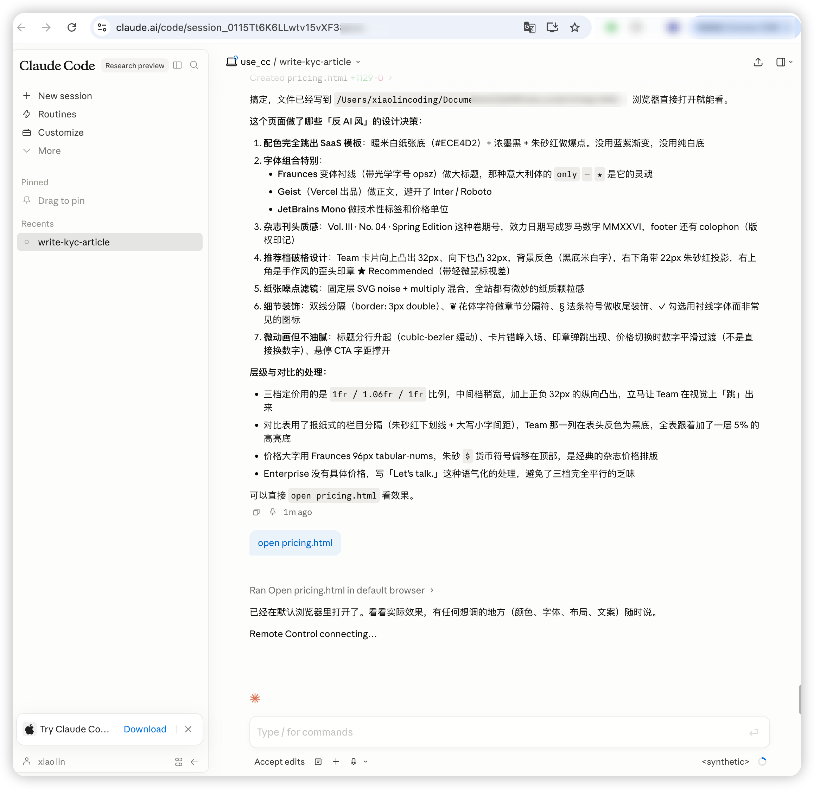

也就是说，Claude Code 实际还是跑在你本地电脑的终端里，本地的文件、依赖、环境都不动，只是多了一条「遥控线」让你从浏览器里操作它。你在外面用手机、平板、另一台电脑都能打开 [claude.ai](http://claude.ai) 继续指挥它干活。这个命令还有一个短别名叫 `/rc`。

#### /teleport：把网页上的会话「传送」到终端

/teleport 的方向正好反过来。

如果你之前是在 [claude.ai](http://claude.ai) 网页上开的 Claude Code 会话（也就是「Claude Code on the web」），现在想把这个会话继续在本地终端里做下去，就可以在本地终端里输入：

```plain
/teleport
```

它会弹出一个选择器，列出你在网页上正在跑的会话，选中之后，Claude Code 会把对应的分支（branch）和整段对话历史「传送」到当前终端里，你就可以无缝接着继续干了。这个命令还有一个短别名叫 `/tp`，不过要注意：**它需要 [claude.ai](http://claude.ai) 的订阅**才能用。

#### 实际体验

这两个命令配合起来，就是一个「双向通道」：一个让你从外面遥控本地的会话，一个让你把云端的会话拉回本地继续。

对于经常需要多设备办公的林友来说，非常实用。你再也不用担心「会话在公司的电脑上，出门就接不上」这种尴尬情况了。

**一句话总结：/remote-control 让你从浏览器遥控终端里的 Claude Code（出门在外也能指挥本地会话），/teleport 让你把 [claude.ai](http://claude.ai) 网页上的会话拉回本地终端继续做。一个向外暴露，一个向内传送，方向相反，搭配使用。**

---

### 10｜Dial the model：调节 Claude 的「大脑」

最后一个课程，教你一个很实用但很多人忽略的操作：切换模型和调节思考深度。

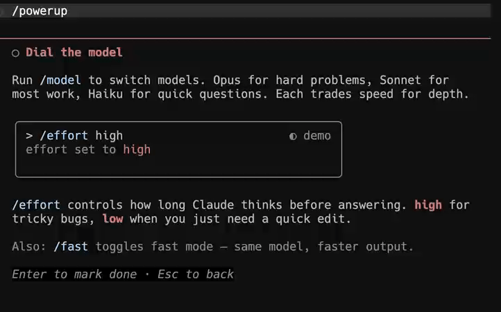

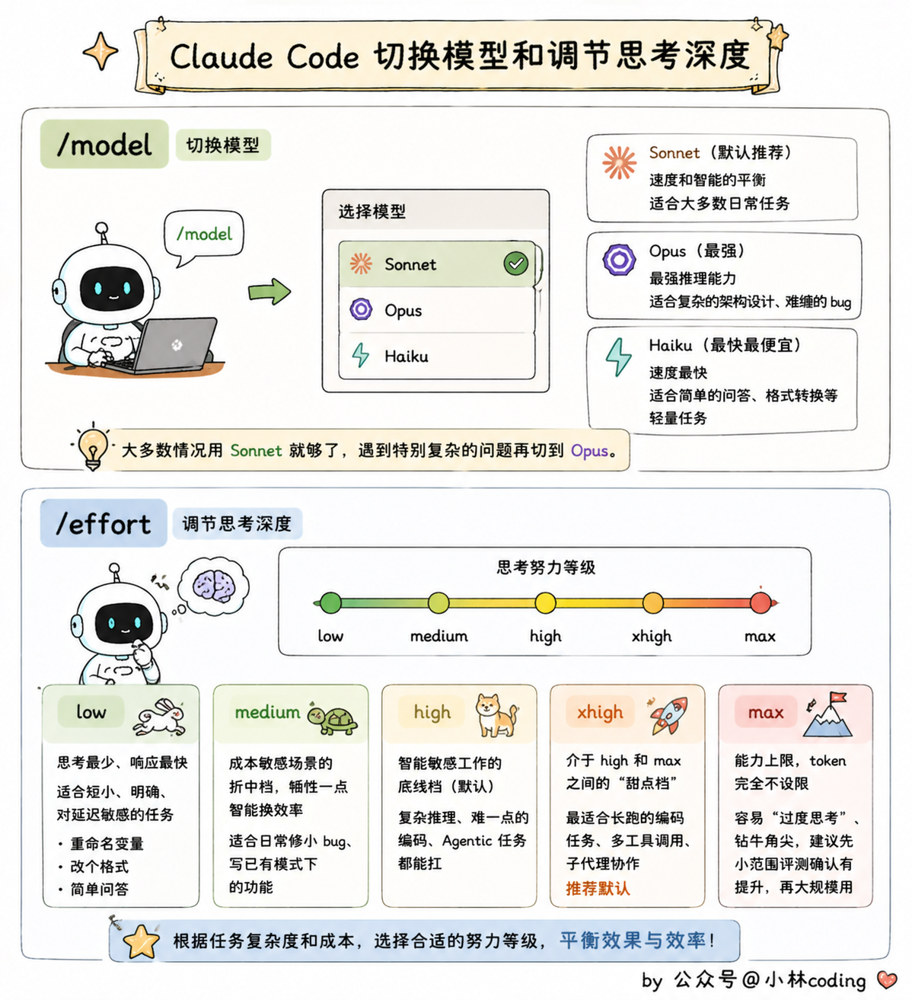

#### 用 /model 切换模型

Claude Code 支持多个模型，你可以用 `/model` 命令来切换：

```plain
/model
```

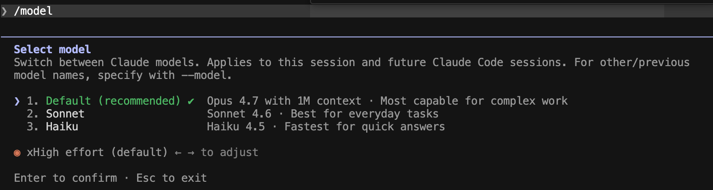

执行后会弹出一个模型选择界面，你可以选择不同的模型：

- **Sonnet**：速度和智能的平衡，适合大多数日常任务
- **Opus**：最强推理能力，适合复杂的架构设计、难缠的 bug
- **Haiku**：速度最快，适合简单的问答、格式转换等轻量任务

不同模型的价格不同，Opus 最贵但最强，Haiku 最便宜但最轻量。大多数情况下用 Sonnet 就够了，遇到特别复杂的问题再切到 Opus。

#### 用 /effort 调节思考深度

除了切换模型，你还可以调节 Claude 的「思考努力等级」，也就是它在回答之前愿意花多少算力去推敲问题。新版 Claude Code 用的是 `/effort` 命令：

```plain
/effort
```

很多林友以为思考档位是越高越好，其实不是。每一档都有它最合适的场景，**用错了反而会让 Claude 又慢又啰嗦**。

新版 Claude Code 里，`/effort` 的滑块从左到右一共有 5 档：low、medium、high、xhigh、max。我们一档一档来看：

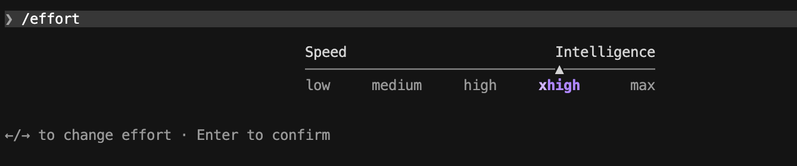

- **low**：思考最少、响应最快。适合短小、明确、对延迟敏感的任务，比如重命名变量、改个格式、问句简单的「这函数返回什么」
- **medium**：成本敏感场景的折中档，牺牲一点智能换效率。适合日常修小 bug、写已有模式下的功能
- **high**：智能敏感工作的底线档。相当于不设置时的默认行为，复杂推理、难一点的编码、Agentic 任务都能扛
- **xhigh**：介于 high 和 max 之间的「甜点档」。最早是 Opus 4.7 推出来的，现在 Sonnet 4.6 等较新模型也支持了。最适合长跑的编码任务、多工具调用、子代理协作，是大多数编程场景的推荐默认
- **max**：能力上限，token 完全不设限。听起来最猛，但容易「过度思考」，钻牛角尖，建议先做小范围评测确认有提升，再大规模用

最后还有一条容易被忽略的小知识，`low`**、**`medium`**、**`high`**、**`xhigh` **这四档设定之后会跨 session 记住**，下次启动还是这个档；只有 `max` 是「一次性」的，会话结束就自动失效，你不用担心忘了切回来一直烧 token。

这里林友要留意一个新旧版本的差异：老版本的 Claude Code 曾经有 think、think hard、think harder、ultrathink 四个思考关键词。但在新版本里，官方已经明确说明：**只有「ultrathink」这一个关键词是真正生效的**，其他几个都只会被当成普通的提示词，不会真的加深思考。

#### ultrathink：临时顶到最高挡

那除了用 `/effort` 改全局档位之外，还有没有一种「一次性」的办法？有，就是 `ultrathink`。

使用方式很简单，直接在提示词里加上这个词就行：

```plain
请帮我分析这个性能瓶颈的根因。ultrathink
```

加上 `ultrathink` 之后，Claude 会在这一轮临时把努力等级顶到 high 去思考，分析得更深入。用完就自动恢复成你原来的 `/effort` 设置，不会一直占着最高档。

你可以把 `ultrathink` 理解成「遇到硬骨头，这一轮临时起飞一下」；而 `/effort` 是「长期设定一个巡航档位」，两者配合使用。

#### 不同场景怎么选？

用个生活中的比喻来帮你理解：

- low 就像你随手回答朋友的问题，脱口而出
- medium 就像你在做一道日常工作任务，该想的都想了
- high / ultrathink 就像你在解一道数学竞赛题，绞尽脑汁一步步推演

**注意：思考越深，消耗的 token 越多，响应也越慢。简单问题别滥用，复杂问题再用。**

#### 模型 + 思考深度的组合策略

给你一个实用的组合建议：

| 场景 | 模型 | 思考档位 |
| --- | --- | --- |
| 简单的代码修改 | Sonnet | medium |
| 日常编码、Agentic 任务 | Opus / Sonnet | **xhigh**（推荐默认） |
| 复杂的 bug 排查 | Opus | xhigh，必要时切 max |
| 架构设计 | Opus | xhigh 或 max（先小范围验证） |
| 快速的格式转换 | Haiku | low |
| 代码审查 | Sonnet | medium |

顺便提一句，如果你已经把 xhigh 作为默认档了，原来那个 `ultrathink` 关键词的边际作用就被削弱了不少，因为 xhigh 本来就已经在「几乎总是深思考」的状态。如果你还在 high 或更低的档位，ultrathink 仍然是临时拉高一档的有用手段。

**一句话总结：/model 切换模型，Sonnet 够用、Opus 最强、Haiku 最快。/effort 设长期的思考档位，日常编码推荐 xhigh，遇到真正硬的骨头再切 max（先确认有提升）。简单问题别滥用，复杂问题效果拔群。**

---

### 补充：几个高频使用的「维护」命令

除了 /powerup 里教的这 10 大类课程，还有几个日常使用中非常高频的命令，小林也顺便给大家提一下。

#### /context：看看 Claude 还有多少「脑容量」

```plain
/context
```

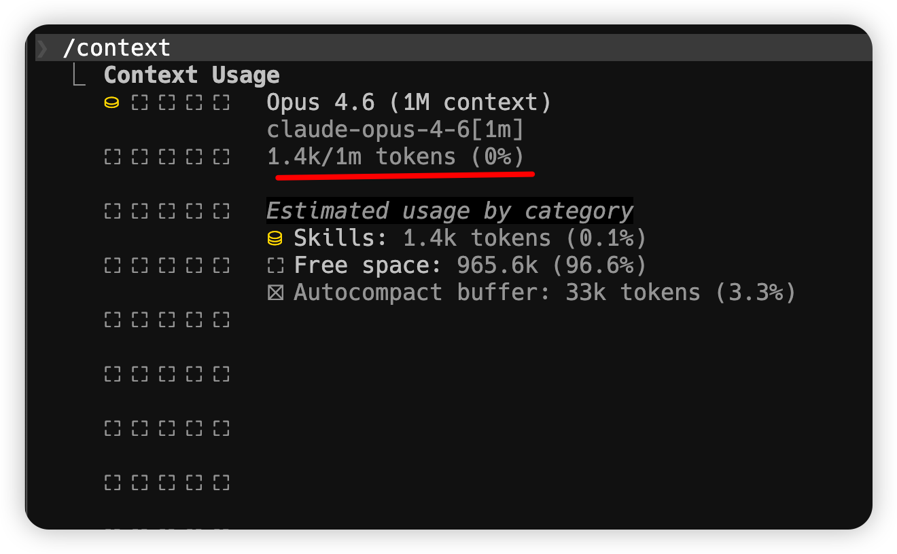

这个命令会显示当前上下文窗口的使用情况。如果你发现 Claude 开始「犯迷糊」，答非所问，先用这个命令看看是不是上下文快满了。

#### /compact：给 Claude 减负

```plain
/compact
```

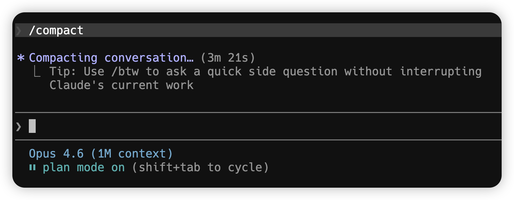

当上下文用了 70% 以上，Claude 就容易顾此失彼。/compact 会把之前的对话压缩成一份摘要，保留关键信息，丢掉冗余的细节，让 Claude 重新「清醒」过来。

#### /clear：彻底清空对话

```plain
/clear
```


当你接下来的任务跟之前完全不相关的时候，用 /clear 彻底清空对话历史，给 Claude 一个全新的开始。

#### claude --resume：恢复上次的对话

```plain
claude --resume
```

如果你关掉了终端，下次想继续之前的对话，用这个命令就行。Claude Code 会自动保存每次对话，让你从中选择恢复哪一个。

还有一个更快的版本：

```plain
claude --continue
或者
claude -c
```

直接恢复最近一次对话，省去选择的步骤。

**这四个命令的用法总结：**


| 命令 | 效果 | 什么时候用 |
| --- | --- | --- |
| /context | 查看上下文占用 | Claude 开始犯迷糊时 |
| /compact | 压缩对话，保留关键信息 | 继续做同一个任务时 |
| /clear | 彻底清空对话 | 切换到完全不同的任务时 |
| claude --resume | 恢复历史对话 | 关掉终端后想接着干时 |

---

### 总结

好，10 个课程和相关的核心知识点，小林都给大家讲完了。

如果你打卡完成之后，进度条也直接 100%，所有的课程都会变绿色了。


说实话，/powerup 这个功能，是 Anthropic 做的一件特别实在的事情。

Claude Code 功能多，但很多用户只用到了其中一小部分，不是不想用，是不知道怎么用。

/powerup 直接在你的终端里搭了一个「培训班」，10 个课程覆盖了从基础操作到进阶技巧的完整学习路径，每个课程还有动画演示，不用担心看不懂。

对于刚开始接触 Claude Code 的林友来说，/powerup 是最好的入门方式，没有之一。

对于已经用了一段时间的老手来说，/powerup 里也有很多你可能不知道的「隐藏操作」，比如 `! command &` 后台运行、Esc+Esc 快速回滚这些，都是很容易被忽略但非常实用的小技巧。

赶紧打开终端，输入 `/powerup`，开始你的学习之旅吧。

今天分享就到这，我们下篇见！

## Claude Code 使用教程：新手入门必学的基础技巧

大家好，我是小林。

最近这一年，AI编程真的火到没朋友，各种工具轮番上线，相信很多做开发的朋友都或多或少尝试过。

但要说哪款工具，真正颠覆了我的编程习惯、让效率直接翻倍，那我必须实名安利 **Claude Code**！

可能还有朋友对它不太熟悉，简单说一句：它是Anthropic推出的终端AI编程助手，不用切换窗口，就能直接读写你的项目文件、执行命令、搜索代码，甚至帮你跑测试、提交代码，相当于把一个专业编程助手，直接装进了你的终端里。

这段时间，很多林友问我：现在Claude Code、openclaw这些 AI Agent这么火，面试的时候会不会考啊？


答案是肯定的！尤其是面试后端或者Agent开发岗位，十有八九会聊到这类工具。浅一点的，会问你实际使用感受和心得；深一点的，直接追问实现原理，一点不含糊。

其实之前我已经在公众号，分享过两篇万字长文，专门图解Claude Code的核心原理，还有openclaw的大厂面试题，没来得及看的林友，后续一定要抽空补一补，对面试帮助很大：

- 万字长文图解 Claude Code 核心原理
- 万字长文图解 openclaw 大厂面试题

除此之外，我还特意收集了一波Claude Code相关面经，发现一个关键点：除了原理，面试官还特别在意，你有没有真正用过这类AI编程工具。毕竟工作后，这些工具就是帮你提升效率、完成开发任务的「刚需」，光懂理论可不行。


所以今天这篇文章，我不聊复杂的原理，也不堆枯燥的理论，就专门分享 Claude Code 最常用的基础使用技巧。

这些技巧看似简单，但都是日常编程中高频用到的，对于第一次入门 Claude Code 的朋友来说，绝对能帮你快速上手、少走弯路。当然，后续我也会持续更新，分享更多进阶技巧，大家可以持续关注。

废话不多说，咱们直接开干！

---

### 01｜Claude Code 的基本操作

在动手写项目之前，先花两分钟了解一下 Claude Code 的基本操作。

#### 启动 Claude Code

打开你的终端，进入项目的目录，输入：

```plain
claude
```

第一次启动后，你会看到 Claude Code 的交互界面，底部有一个输入框，你可以直接在里面打字跟 Claude 对话。


比如你可以试试输入：

```plain
你好，请简单介绍一下你自己
```

Claude 会回复一段自我介绍。这就是最基本的交互方式，你打字，它回答。


#### 三个工作模式

Claude Code 有三个工作模式，这是你必须要了解的。


按 **Shift+Tab** 可以在三个模式之间切换：

- **Normal 模式**（默认）：Claude 每一步操作都需要你确认后才执行。比如它要创建一个文件，会先问你「允许吗？」，你同意了它才会创建


- **Auto-accept 模式**：Claude 自动执行所有操作，不需要你逐个确认。适合你对 Claude 已经比较信任的场景


- **Plan 模式**：Claude 只看不改，先帮你分析和规划，规划过程中不会修改你的文件，等你确定计划没问题，才会一步一步执行计划


**新手建议**：先用 Normal 模式，能看到 Claude 每一步在干什么，心里有底。等熟悉了再切到 Auto-accept 提速。

好，基本操作就这些。接下来我们直接上手写项目。

---

### 02｜用 Plan 模式规划

很多人一上来就迫不及待地让 Claude 写代码，结果写出来的东西跟自己想的完全不一样，又要改来改去。

我的建议是：**先规划，再动手。**

怎么做？先按 Shift+Tab 切到 **Plan 模式**，然后输入下面的提示词：

```plain
请帮我开发一个番茄钟 Web 应用，技术栈用 React + TypeScript + Tailwind CSS。功能包括：25 分钟倒计时、开始/暂停/重置、番茄计数、休息提醒。请先帮我规划一下项目结构和开发步骤，不要写代码。
```


注意我写的这段提示词有几个关键点：

- **明确技术栈**：React + TypeScript + Tailwind CSS，不让 Claude 自己猜
- **明确功能**：25 分钟倒计时、开始/暂停/重置、番茄计数、休息提醒
- **明确要求**：先规划不写代码

这种「清晰明确」的提示词写法，是用好 Claude Code 的基本功。提示词越具体，Claude 输出的质量就越高。

在 Plan 模式下，Claude 会给你输出类似这样的方案：


你看，是不是很清晰？

规划完成之后，Claude 会让你做选择：


- 第一个：自动接受所有修改，Claude 直接改代码，不再弹窗问你
- 第二个：手动审核每一处修改，Claude 改代码前会让你逐个确认
- 第三个：给 Claude 反馈，调整它的修改方案（比如改哪里、怎么改）

这个计划是写到一个 md 文档里的，这样在执行任务，不会做着做着就忘记执行到哪了，而且你还可以用 ctrl+g 命令去编辑这个计划 md 文档。


这里我们不对计划做任何修改，直接选择第一个，接下来 Claude 就会开始按照规划好的计划，一步一步开始执行了。


执行过程中会弹出很多需要你确认的对话，我这里全部都选择了 yes。


开发完成之后，Claude 也会总结一段话告诉你


我尝试打开这个 url，发现打不开


但是不慌，我们直接把问题现象告诉 Claude Code 就行了，让它帮我们排查


修复 bug 之后，再次访问 url，就可以打开了。


当然，哪里不满意，我们还是可以继续跟 Claude Code 反馈的，比如这里我想增加一个功能：

给番茄钟添加一个任务标签功能：在开始计时前，弹出极简输入框让用户填写本次任务名称，计时结束后将任务名与时间一起存入 localStorage，仅在页面角落添加一个历史记录入口。


完成之后效果如下：


---

### 03｜需求不明确？让 Claude 来「采访」你

前面我是直接给出了明确的提示词，比如技术栈、功能、要求都写得清清楚楚。但现实中，很多时候你自己都还没想清楚要做什么。

比如你只知道「我想做一个番茄钟」，但不知道用什么技术栈、要不要加统计功能、界面要什么风格……脑子里只有一个模糊的想法。

这种情况下，与其自己硬憋一个需求文档，不如让 Claude 来「采访」你。


试试这样写提示词：

```plain
我想做一个番茄钟应用，但我还没想清楚具体要怎么做。
请你先不要写代码，而是向我提几个问题，
帮我理清需求，等我们讨论清楚了你再动手。
```

Claude 会像一位经验丰富的产品经理一样，主动问你：

```plain
好的，我有以下几个问题想跟你确认：

1. 技术栈偏好：你想用 React、Vue 还是原生 HTML/CSS/JS？
2. 目标平台：是纯 Web 应用，还是要做成桌面端或移动端？
3. 核心功能：
   - 倒计时时长是固定的 25 分钟，还是想让用户自定义？
   - 需要番茄计数功能吗？
   - 休息提醒怎么实现？弹窗、音效还是浏览器通知？
4. 数据存储：需要保存历史记录吗？比如今天完成了几个番茄。
5. 界面风格：有参考的设计吗？喜欢简约风、卡通风还是其他？
```

你看，它问的问题是不是很到位？有些问题你可能压根没想到，比如「休息提醒用什么方式」「要不要保存历史记录」。

你只需要逐一回答这些问题，Claude 就能根据你的回答，帮你梳理出一份完整的需求方案。这比你自己在脑子里瞎想要高效得多。

**这种「让 AI 来问你」的技巧，在需求不明确的时候特别好用。本质上就是让 Claude 帮你做需求分析，而不是一上来就埋头写代码。**

想清楚需求之后，再回到前面的步骤，让 Claude 出方案、写代码就行了。

---

### 04｜页面不好看？用 Skill 美化

功能都写完了，你打开浏览器一看，嗯，功能是有了，但页面不算太好看。

你当然可以让 Claude 帮你调样式，但通常的效果是「能用但不好看」，配色奇怪、布局死板。

有没有一种方式，能让 Claude Code 突然「学会」前端设计？

还真有。Claude Code 有一个叫 **Skills** 的机制，你可以把它理解为 Claude 的「专业技能包」。Skills 是由专业人员编写的能力扩展，包含复杂的指令、模板和参考文档，可以让 Claude 在特定领域表现得更好。

其中有一个 Skill 叫 **frontend-design**，专门用来生成高质量的前端界面。


安装 frontend-design Skill 的方式很简单，在 claude code 终端输入下面的命令就行：

```plain
/plugin install frontend-design
```

执行后，Claude Code 会自动从插件市场下载并安装这个 Skill。

安装成功之后，你就能在 /plugin 命令的「Installed」选项里看到 frontend-design 是 enabled 状态的。


安装好之后，你只需要这样输入：

```plain
番茄钟的功能都完成了，但页面很丑。请用 frontend-design skill 帮我重新设计界面。
我想要简洁现代的风格，暖色调，圆形倒计时显示，配合番茄的红色主题。
```


Claude Code 会自动加载 frontend-design 这个 Skill，然后按照专业的设计标准来重构你的页面。


它会重新设计配色、布局、字体、交互动画，出来的效果跟之前完全不一样。配色协调、间距合理、有微交互动画，看起来就像一个有设计经验的开发者写出来的。

关键是，你不需要自己懂设计，一个 Skill 就搞定了。

经过 frontend-design skill 优化之后的样子是这样的：


整体还是比之前好看很多的，不过因为我这个案例的应用功能不多，看起来也比较简单，所以能优化的地方也有限。

我的「小林简历」网站的前端其实也是用 frontend-design skill 优化过页面风格的，下图左边是 ai 第一版设计的 ui，右边就是用了 frontend-design skill 优化过的页面，效果就特别明显了。


---

### 05｜用 @ 精准指定文件

页面美化完了，你想微调一下倒计时数字的样式，比如把数字改大一点，加个呼吸动画。

但项目文件越来越多，你不想让 Claude 乱翻一通，改到不该改的文件。

怎么办？用 **@ 符号**精准指定文件：

```plain
请把倒计时数字改大一点，加一个呼吸动画效果。
@src/components/TimerDisplay.tsx
```


@ 的用法很简单：

- `@./src/components/Timer.tsx`：引用单个文件
- `@./src/components/`：引用整个目录
- `@./src/App.tsx @./src/styles/global.css`：引用多个文件

这样 Claude 就知道你只想改你指定的文件，不会动其他代码。

**@ 还有一个很容易被忽略的好处：节省上下文。**


前面我们说过，Claude 的上下文窗口是有上限的。

如果你不给 Claude 指定文件，它为了理解你的需求，可能会自己去搜索和读取项目里的很多文件，每一行代码都会占用上下文空间。项目小的时候还好，项目一大，Claude 光是「翻文件」就能把上下文吃掉一大半。

但如果你用 @ 精准指定了文件，Claude 就只需要读取你指定的那几个文件，不用满项目乱翻。

比如你只 @ 了一个 200 行的组件文件，Claude 就只会读取这 200 行，上下文占用非常小。这就像你去图书馆查资料，与其让 Claude 自己在整栋楼里一排排书架慢慢找，不如直接告诉它「去三楼第二排第五本书」，效率高，还不浪费精力。

所以养成一个习惯：**能 @ 指定文件就 @ 指定，别让 Claude 自己去找。** 特别是在上下文已经用了一半以上的时候，这个习惯能帮你省下不少 token，让 Claude 保持「清醒」的状态工作。

**@ 就像给 Claude 发了一个精确的地址，让它直奔目标，不再迷路，还省油。**

---

### 06｜遇到复杂功能？用 ultrathink 深度思考

番茄钟的基本功能都做完了，现在你想加一个「统计面板」，展示今天完成了多少个番茄、累计专注了多长时间、连续完成了几天。

这是一个涉及数据结构设计和多组件协调的复杂功能。你直接让 Claude 写，它给的方案可能比较浅，只存了个总数，没有考虑日期切换、连续天数计算这些细节。

为什么会这样？其实道理很简单，Claude 默认是用「常规挡位」在思考，面对这种要兼顾数据结构、边界情况、持久化的活儿，它自然就容易漏东西。那怎么办？答案就是让它切到「最高挡」再开干。

这时候你可以在提示词里加上 **「ultrathink」**：

```plain
请帮我添加一个番茄统计面板，展示今日完成番茄数、累计专注时长、连续完成天数。
需要考虑数据的持久化存储（localStorage）。请 ultrathink 后给我方案。
```


「ultrathink」会让 Claude 这一轮临时把思考的努力等级拉到最高，多花一些时间把方案从头捋一遍，分析得更深入。


执行的时候，你也能看到，它会「先梳理方案再动手」，而不是边做边看。

这里林友要注意一个新旧版本的差异。老版本的 Claude Code 曾经有 think、think hard、think harder、ultrathink 四个思考关键词，网上很多教程也还在这么写。但在新版本里，官方已经明确说明：**只有「ultrathink」这一个关键词是真正生效的**，其他几个都只会被当成普通的提示词，不会真的加深思考。

那如果我不是偶尔用一下，而是希望整体都思考得更深，该怎么办？Claude Code 还提供了一个全局的「努力等级」设置，你可以用 `/effort` 命令切换，或者在 `/model` 里调整，效果会在后续所有对话里都生效。而 `ultrathink`，你就把它理解成「这一轮临时顶到最高挡」，用完就恢复成你原来的设置，适合一次性的硬骨头。

用个生活中的比喻，平时 Claude 就像你随手回答朋友的问题，一句话带过；加上 ultrathink 之后，它就像在解一道数学竞赛压轴题，会把每一步都仔细推演一遍再落笔。

加了「ultrathink」后，Claude 给出的统计面板方案明显更全面了。


**注意：思考越深，消耗的 token 越多，响应也会更慢。简单问题别滥用，复杂问题再用。**

---

### 07｜ 每次都要重复解释项目？用 CLAUDE.md

项目写到这个阶段，你会发现一个烦人的事情：

每次 `/clear` 或者第二天重新打开 Claude Code，你都要重新告诉它「这是一个番茄钟应用，用了 React + TypeScript + Tailwind CSS，已经完成了哪些功能……」一遍两遍还行，多了真的很烦。

有没有办法让 Claude 永远记得你的项目信息？

有，用 **[CLAUDE.md](http://CLAUDE.md)**。

#### CLAUDE.md 是什么？

[CLAUDE.md](http://CLAUDE.md) 是一个放在项目根目录的文件，Claude Code 每次启动时都会**自动读取**这个文件的内容，作为它理解项目的背景信息。


你可以把它理解为 Claude 的「项目记忆」，只要你在这个项目目录下启动 Claude Code，它就知道你的项目是做什么的、用了什么技术栈、代码规范是什么。

#### 怎么创建 CLAUDE.md ？

最简单的方式是输入 `/init` 命令：

```plain
/init
```


Claude 会扫描你的项目结构，自动生成一份 [CLAUDE.md](http://CLAUDE.md)。


你也可以直接打开 [CLAUDE.md](http://CLAUDE.md) 看看


不过它默认是用英文描述的，要改成中文的话，也可以让 claude 把 [CLAUDE.md](http://CLAUDE.md) 改成中文。


生成的 [CLAUDE.md](http://CLAUDE.md)，主要是记录了番茄钟应用的命令、架构、样式等，跟项目描述有关的信息，有了这部分信息之后，后续每次与 Claude Code 对话时，上下文都会自动带上 [CLAUDE.md](http://CLAUDE.md) 中的信息。


[CLAUDE.md](http://CLAUDE.md) 本质上是一个 md 文档，你觉得哪里不满意，也是可以自己去修改的，比如要求代码规划要怎么样的，也可以写进来。

#### 注意事项

不过， [CLAUDE.md](http://CLAUDE.md) 不是越长越好，太长则会占用太多的上下文，而是**越精准越好**。


一份好的 [CLAUDE.md](http://CLAUDE.md) 应该包含这几部分：

**1. 项目简介**：一句话说清楚项目是做什么的

**2. 技术栈**：用了哪些框架和工具，让 Claude 不会乱选技术

**3. 代码规范**：你的编码偏好，让 Claude 产出的代码风格统一

**4. 项目结构**（可选）：目录的组织方式，帮助 Claude 更快地找到文件

```plain
# 番茄钟 Web 应用

一句话：一个帮助用户专注工作的番茄钟，支持 25 分钟工作和 5 分钟休息的循环。

## 技术栈
- React 18 + TypeScript + Tailwind CSS

## 代码规范
- 使用函数式组件，不用 class 组件
- 变量命名用驼峰命名法
- 组件文件名用 PascalCase
- 每个组件都要有对应的 TypeScript 类型定义

## 项目结构
- src/components/ - 放 UI 组件（Timer、Controls、TomatoCount）
- src/hooks/ - 放自定义 Hook（useTimer）
- src/utils/ - 放工具函数（notification）
```

要注意的是，[CLAUDE.md](http://CLAUDE.md) 有一个很重要的原则：**每条信息都要问自己「如果删掉这条，会不会让 Claude 犯错？」 如果不会，就不写**。


很多人喜欢在 [CLAUDE.md](http://CLAUDE.md) 里堆一大堆东西，结果文件太长反而让 Claude 抓不住重点，工作效率反而下降。

比如下面这些内容就**不应该写进 [CLAUDE.md](http://CLAUDE.md)**：

- 详细的 API 文档（太长，占上下文，应该用 @ 引用具体文件）
- 每次都变的临时需求（用 `/compact` 或 `/clear` 就行）
- 过于泛泛的描述（比如「写好代码」「好的代码」这种 Claude 本来就知道的事）

[CLAUDE.md](http://CLAUDE.md) 是一个**活文档**。随着项目开发，你应该定期更新里面的内容，比如新功能完成了就加到「已完成功能」列表里，技术栈换了就修改对应的部分。

有了这份文件，你 `/clear` 之后不用再重复解释项目信息， Claude 重新启动时也会自动读取。

**一句话总结：[CLAUDE.md](http://CLAUDE.md) 就是给 Claude 装的「长期记忆」，写一次，永远记得。但记得定期更新，保持信息准确。**

---

### 08｜Claude 改错了怎么办？用 Rewind 回滚

在开发过程中，你一定会遇到这种情况：Claude 写了一段代码，你一看，逻辑不对，或者根本不是你想要的效果。

这时候该怎么办？手动去改回去？文件多了你根本记不住它改了哪些地方。


别慌，Claude Code 自带「后悔药」：**Rewind 回滚**。

有两种方式触发：

- **连按两次 Esc 键**：快速打开回滚菜单
- **输入**`/rewind`**命令**：效果一样


执行后，Claude Code 会显示一个时间线，列出最近的每一次操作：

```plain
最近的操作：
❯ 1. [14:35] 修改了 useTimer.ts（添加音效逻辑）
  2. [14:32] 修改了 Timer.tsx（添加音效触发）
  3. [14:28] 创建了 notification.ts（新建文件）
  4. [14:25] 修改了 Controls.tsx（重置按钮逻辑）
```

你只需要选择要回滚到哪一步，Claude Code 就会自动把代码恢复到那个状态。而且不光文件内容会恢复，对话上下文也会一起回滚，就像那次操作从来没发生过一样。

还有一种更简单的方式，直接告诉 Claude：

```plain
刚才的修改不对，倒计时逻辑被你改坏了。请先撤销刚才的修改。
```

它会帮你还原最近一次的代码修改。不过这种方式只撤销文件变更，对话上下文不会回滚。

除了上面两种 Claude Code 自带的方式，还有一种最传统也最靠谱的方式：**用 Git 回滚**。

在让 Claude 做大改动之前，先手动提交一次代码：

```plain
git add .
git commit -m "功能开发完成，准备让 Claude 重构"
```

万一 Claude 改坏了，直接一条命令就能回到之前的状态：

```plain
git checkout .
```

或者更彻底地回退到上一个提交：

```plain
git reset --hard HEAD~1
```

Git 回滚的优势在于它是**全局回滚**，不管文件是 Claude 编辑的、还是 `npm install` 生成的，全部都能恢复。而且这是纯手动操作，不依赖 Claude Code 的任何功能，是最保险的方式。不过 Git 回滚不了 Claude Code 的对话记录。

#### 三种「撤销」方式对比

| **方式** | **文件回滚** | **对话回滚** | **适用场景** |
| --- | --- | --- | --- |
| `/rewind` 或 Esc+Esc | ✅ | ✅ | Claude 走错方向了，想彻底回到某个节点 |
| 「撤销刚才的操作」 | ✅ | ❌ | 只是代码改错了，对话不用回滚 |
| `git checkout .` | ✅ | ❌ | 最靠谱的全局回滚，不依赖 Claude Code |

**Rewind 的局限性**：需要注意一点，Rewind 只能回滚 Claude Code 直接创建或编辑的文件。如果 Claude 执行了 `npm install` 这类命令生成了 node_modules、package-lock.json 等文件，Rewind 是无法撤销这些变更的。

所以如果你想要完整地回滚整个项目的状态，最靠谱的方式还是用 **Git**。建议养成一个习惯：在让 Claude 做大改动之前，先手动 `git commit` 一次，万一出了问题，直接 `git revert` 就能回到之前的状态，不用担心漏掉任何文件。

**我的建议是：Claude 一旦开始跑偏，立刻 Esc+Esc 回滚，别让它一路错下去。早回滚，少返工。如果是大改动，改之前先 git commit 一份「存档」。**

### 09｜Claude 开始犯迷糊？先压缩，再清空

项目写了一段时间，你已经跟 Claude 聊了几十轮对话。突然你发现，Claude 开始「犯迷糊」了，

你让它改番茄计数的显示，它却把倒计时的逻辑也改了；你让它用 React 写，它突然冒出一行 Vue 的语法。改着改着，之前好好的功能又坏了。

怎么回事？Claude 变笨了吗？

不是 Claude 变笨了，是它的「脑容量」快满了。


#### 先看看 token 占了多少

Claude Code 有一个概念叫 **上下文窗口**，你可以把它理解为 Claude 的「短期记忆」。这个记忆有上限（大约 200k 个 token），当你们聊了很久，对话历史越来越长，这个记忆就快装满了。

怎么查看当前用了多少？输入 `/context` 命令：

```plain
/context
```

它会告诉你当前上下文占用了多少，还剩多少：


比如，上图当前会话已消耗 93.6k token，占 200k 上下文窗口的 47%，剩余可用空间充足。其中 skill 调用仅占 0.2%，大部分空间为对话和自动压缩缓冲区占用。

如果你发现已经用了 70% 以上，Claude 就开始「顾此失彼」了，这时候你需要帮它「减负」。

#### 先试 /compact：压缩上下文

减负有两种方式，**优先用第一种**。

第一种方式是 `/compact`，它会把之前的对话压缩成一份摘要，保留关键信息，丢掉冗余的细节：

```plain
/compact
```


执行后，Claude 会把之前几十轮对话的精华浓缩成一小段摘要，然后继续工作。就像你看完一本书之后写了一份读书笔记，把几百页的内容压缩成了几页纸，但核心内容都在。

压缩完之后，你会发现上下文占用从 78% 降到了 30% 左右，Claude 又「清醒」了，而且关键信息都还记得。

**什么情况下用 /compact？**

当你接下来要继续做同一个项目、同一个功能的时候。比如番茄钟的倒计时写完了，你想继续加番茄计数功能，这时候 /compact 最合适，因为之前的上下文还有参考价值。

#### 再考虑 /clear：彻底清空

第二种方式是 `/clear`，它会彻底清空所有对话历史：

```plain
/clear
```


执行后，Claude 就像一个刚上班的新同事，什么都不记得了，需要你重新交代任务。

**什么情况下用 /clear？**

当你接下来要做的事情跟之前的任务**没有关联**的时候。比如你之前在写番茄钟的前端，现在想切到另一个完全不同的项目，或者想从完全不同的角度重新开始，那 `/clear` 更干净利落。

`/clear` 之后，你需要简单告诉 Claude 当前项目的状态：

```plain
这是一个番茄钟 Web 应用，使用 React + TypeScript + Tailwind CSS。
目前已经完成了：倒计时功能、开始/暂停/重置按钮、番茄计数。
接下来需要添加休息提醒功能。
```

这样 Claude 就能快速进入状态，继续帮你干活。

#### 小结一下

| **命令** | **效果** | **适用场景** |
| --- | --- | --- |
| `/context` | 查看上下文占用情况 | 感觉 Claude 开始犯迷糊时，先看看用量 |
| `/compact` | 压缩对话，保留关键信息 | 继续做同一个功能，上下文还有用 |
| `/clear` | 彻底清空对话 | 切换到不相关的任务，或想重新开始 |

**我的建议是：养成看 /context 的习惯，占用超过 70% 就 /compact 一次。只有任务完全不相关时才用 /clear。**

### 10｜ 关掉终端对话就没了？用 resume 恢复

说到这里，可能有的同学会问一个问题：

「小林，你说的 /compact 和 /clear 都是在同一个会话里操作的。但如果我关掉终端窗口，或者电脑关机了，之前的对话不就全没了吗？总不能一直开着终端不关吧？」

好问题。确实，如果你直接退出 Claude Code，再重新打开 `claude`，它会是一个全新的会话，之前的对话历史确实不在了。

但 Claude Code 早就帮你想到这一点了。它有一个 **对话存档** 功能，每次你退出 Claude Code，它都会自动把这次对话保存下来。下次你想继续的时候，不需要从零开始。

在终端里输入：

```plain
claude --resume
```

Claude Code 会列出最近的对话历史，让你选择恢复哪一次：

```plain
最近的会话：
1. [今天 14:30] 番茄钟应用 - 添加统计面板
2. [今天 11:00] 番茄钟应用 - 美化界面
3. [昨天 16:00] 番茄钟应用 - 核心功能开发

请选择要恢复的会话：
```

选中之后，Claude Code 就会恢复到那次对话的状态，之前聊了什么、改了哪些文件、上下文是什么，全都还在。

如果你确定要恢复的是最近一次对话，还有一个更快的命令：

```plain
claude --continue
或者
claude -c
```


这个命令会直接恢复最近一次对话，省去选择的步骤。简单记：

- `claude --resume`：从列表中选一个历史会话恢复
- `claude --continue`：直接恢复最近一次会话

**所以放心大胆地关终端，Claude Code 会帮你「存档」，下次 resume 一下就能接着干。**

### 11｜ 写完代码谁来把关？用子代理做 Code Review

番茄钟应用的功能基本都做完了。这时候你可能会想：Claude 写的这些代码质量怎么样？有没有 bug？有没有安全隐患？

你当然可以自己一行一行看，但项目文件多了，逐行审查太累了。

那你可能会说：「让 Claude 帮我 review 一下代码不就行了？」

确实可以。但问题是，**这些代码就是 Claude 自己写的，让它自己审查自己写的代码，它多少会「手下留情」，一些问题它可能看不出来。**

那怎么办？

这里有一个很巧妙的做法：**创建一个专门的子代理来做 Code Review。**

#### 什么是子代理？

子代理是 Claude Code 的一种机制，你可以理解为 Claude 的「分身」。每个子代理都有自己独立的上下文窗口，和主对话互不干扰。


关键点在于：子代理需要**提前创建**，你得先定义好这个子代理是干什么的，它才能按你的要求去工作。

#### 创建一个代码审查子代理

Claude Code 提供了 `/agents` 命令来管理子代理。输入：

```plain
/agents
```

创建子代理的步骤还蛮多的，接下来我一步一步来讲解一下。

第一步，选择创建子代理


第二步选择子代理的作用域，大部分场景选择 Project 即可，配置会随项目保存，方便团队协作。


第三步选择创建方式，我们就用推荐的第一个方式，让 Claude 帮你自动生成完整的代理配置，只需用自然语言描述需求即可。


第四步用自然语言描述子代理的职责，在文本框中，用自然语言清晰描述这个子代理的用途、职责和触发场景。


第五步配置子代理的权限，接下来你可以为子代理选择可用的工具，控制它能执行的操作：


第六步选择子代理使用的模型，我就默认选择第一个


第七步为子代理选择标识颜色，这里我选择绿色。


第八步配置子代理的记忆，选择默认的 **Project scope**，让子代理能记住项目的上下文，提供更连贯的服务。


配置完成后，Claude Code 会自动生成代理配置文件并保存。


下面就是创建好的子代理的代码质量审核的 md 文档。


这个文件本质上就是给子代理写了一份「工作说明书」，告诉它应该审查什么、按什么标准来审、结果怎么输出。

#### 使用子代理审查代码

创建好之后，你就可以让 Claude 使用这个子代理来审查代码了。

比如我这里直接说了一句：

```plain
用 code-guality-reviewer agents 帮我审核这个项目的代码
```


之前我们设置子代理的时候，颜色选择的是绿色，如果 claude code 执行过程用到了子代理，那么就会出现对应的子代理的颜色，比如图片中就出现了绿色，所以就用了我们刚才创建的子代理。

Claude 启动一个独立的子代理后，就会背后用全新的窗口来审查代码。因为是独立的上下文，它不受之前写代码时的思维惯性影响，更容易发现潜在问题。

子代理审查完之后，会把结果汇报回来，类似这样：


你看，它发现了定时器没清除、参数没校验、可访问性不足等问题，还给出了优化建议。

这时候你就可以针对性地让 Claude 修复这些问题：

```plain
请修复审查结果中标记为「严重」和「中等」的问题。
```

**子代理的好处不只是 Code Review。** 任何需要「独立视角」的场景都可以用：

- **写测试**：创建一个测试子代理，帮你补齐单元测试，它不会被主对话的上下文干扰
- **查文档**：创建一个文档子代理，让它去读某个库的文档，总结要点后汇报给你
- **多文件批量修改**：让子代理独立处理一组文件的修改，不会跟你的主对话混淆


**一句话总结：子代理就是 Claude 的「分身」，提前创建好，用的时候给它一个独立任务，它用全新的视角帮你干活，不受主对话干扰。**

#### 子代理和 Skills 有什么区别？

看到这里，可能有些同学会犯嘀咕：子代理的工作描述也是写在一个 .md 文件里，前面讲的 frontend-design Skill 也是 .md 文件，这俩到底有什么区别？

这个问题问得好。虽然它们看起来都是「用一个 .md 文件来描述能力」，但本质上有很大的不同。

**第一个区别：谁在干活。**

当你使用 Skill 的时候，比如让 Claude 用 frontend-design skill 来美化界面，干活的还是 Claude 自己，只不过它「加载」了一份专业的设计指南，按照这份指南来输出更专业的设计方案。你可以理解为，Skill 就像是给 Claude 报了一个培训班，让它学会了一项新技能，但它还是那个 Claude，在你的主对话里干活。


而子代理就不一样了。当你让 Claude 启动一个子代理去审查代码时，它会在后台创建一个全新的 Claude 实例，这个实例有自己的对话空间，跟你当前的主对话是完全隔离的。子代理干完活之后，只会把最终结果汇报给你的主对话。你可以理解为，子代理就像是 Claude 雇了一个新员工，这个员工有自己的工位，独立完成你交代的任务，做完后把结果交给你。

**第二个区别：对主会话上下文的影响（这是最关键的区别）。**

前面我们讲过，Claude Code 的上下文窗口是有上限的，大约 200k 个 token。当你的对话越来越长，上下文快满的时候，Claude 就会开始「犯迷糊」。

Skill 因为是在主对话里工作的，所以它加载的那份 .md 指南、它读写的文件内容、它生成的代码，全部都会占用你主会话的上下文空间。比如 frontend-design skill 的设计指南可能有几千个 token，加上它读取的项目文件、生成的设计代码，一下子就占了不少上下文。如果你的上下文本来就快满了，再用 Skill 就可能加速「撑爆」上下文，导致 Claude 更容易出错。


而子代理完全不存在这个问题。子代理拥有自己独立的上下文窗口，跟你的主对话互不干扰。不管子代理读了多少文件、分析了多少代码，这些统统只占用它自己的上下文空间，对你的主会话零影响。等子代理干完活，它只会把一份精炼的结果摘要汇报回来，这个摘要通常很短，对主会话上下文的占用非常小。

这个区别意味着什么？意味着当你的上下文已经很紧张的时候，与其让 Claude 在主对话里做一个复杂的任务，不如启动一个子代理，让它去独立完成。这样既不会加重主对话的负担，又能得到一个独立的、不受之前对话干扰的分析结果。

**第三个区别：来源和定制方式。**

Skill 是从插件市场安装的，由专业人员编写，开箱即用。你不需要自己写 .md 文件，安装好就能用。

而子代理是你自己通过 /agents 命令创建的，你可以完全按照自己的需求来定制它的工作内容、审查标准、输出格式。比如你团队有特定的代码规范，就可以把这些规范写进子代理的 .md 文件里，让它按照你们团队的标准来审查代码。

**总结一下：**

- 想让 Claude **在某个领域做得更好**（比如设计更好看、代码更规范）→ 用 **Skill**，它会给 Claude 装上一个「专业技能包」
- 想让 Claude **用独立视角去完成一个任务**（比如审查代码、写测试、查文档）→ 用 **子代理**，它会开一个独立的 Claude 来干活，不占用你的主会话上下文


---

### 总结

好，到这里我们的番茄钟应用已经开发完了，Claude Code 的核心技巧你也学会了。

我们按照今天讲的内容回顾一下：

**开发前的准备：**

1. **三个工作模式**：Normal 逐确认、Auto-accept 自动执行、Plan 先规划，用 Shift+Tab 切换
2. **Plan 模式规划**：写代码之前先出方案，省得返工，提示词要写清技术栈 + 功能 + 要求
3. **Claude 采访技巧**：需求不明确？别自己憋，让 Claude 来问你，帮你做需求分析

**开发中的技巧：**

1. **Rewind 回滚**：Claude 跑偏了，Esc+Esc 一键回退，大改动前先 git commit 存档
2. **上下文管理**：/context 看占用，超了就 /compact 压缩，任务切换才 /clear 清空
3. **frontend-design Skill**：给 Claude 装上设计技能包，丑页面秒变好看
4. **@ 引用文件**：精准指定文件，不让 Claude 乱翻，还能节省上下文
5. **ultrathink**：新版只剩这一个思考关键词，复杂问题临时顶到最高挡，简单问题别滥用

**项目管理：**

1. **[CLAUDE.md](http://CLAUDE.md)**：给 Claude 装上「长期记忆」，/clear 后不用重复解释项目，记得保持精简和更新
2. **resume 恢复对话**：关掉终端也不怕，claude --resume 选历史会话，claude --continue 接着上次干
3. **子代理 Code Review**：让 Claude 的分身用独立上下文帮你审查代码，不占用主会话空间

说实话，Claude Code 不是一个你开了就能自动帮你写好代码的「万能工具」。它更像是一个能力很强但需要你正确引导的搭档。

**你给它的信息越清晰，它产出的质量就越高；你的工作流越规范，它的效率就越高。**

这篇文里的每个提示词你都可以直接复制到 Claude Code 里试。建议你新建一个空项目，跟着文章的步骤走一遍，亲手把番茄钟应用做出来。哪怕只用上 2-3 个技巧，你的编程效率也会有明显提升。

## Claude 5 上下文工程：为什么提示词越写越少？

大家好，我是小林。

前段时间，我看到 Anthropic 官方说，他们把 Claude Code 面向 Claude 5 的系统提示词删掉了 80% 以上。删了这么多，代码评测成绩居然基本没掉。


看到这里我有点懵。大家前面还在研究怎么把提示词写细，怎么突然就开始大删特删了？这不是自己打自己脸吗？

我把这篇文章翻了一遍，发现里面还真有不少东西值得琢磨。尤其是那些以前为了防止模型犯错加上的规则，到了 Claude 5 这里，可能反而开始碍事了。

### 规则写得越多，Claude 怎么还变笨了？

很多人的 `CLAUDE.md` 都是这么变长的。Claude 乱加注释，就补一句「禁止添加注释」。它擅自创建文档，再补一句「禁止创建 Markdown」。它顺手改了别的文件，继续加一句「永远不要修改任务范围之外的代码」。

基本就是犯一次错，再补一条规则。半年以后回头看，`CLAUDE.md` 里全是「必须」「禁止」「永远不要」，很多规则为什么会出现在那里，可能自己都记不清了。


Anthropic 在内部记录里就发现了这个问题。用户说「该写文档的地方就写文档」，系统提示词却说「不要创建分析文档」，项目里的 `CLAUDE.md` 可能又要求「复杂模块必须补文档」。单看都合理，放在一起就打架了。

Claude 还没开始干活，得先判断这几句话到底听谁的。上下文是变多了，真正重要的信息却被埋在一堆历史补丁里。


这些强规则以前确实有用。老模型判断能力不行，直接把路堵死，至少能避开最差的结果。但 Claude 5 已经能结合代码和用户意图做一些判断了，这时候还把原来的防傻规则全留着，模型反而要花更多精力处理这些限制。

### 删掉规则以后，Claude 靠什么做决定？

那这些留下来的规则该怎么写？Anthropic 没有把每个动作继续规定得那么死，而是让模型碰到具体问题时，先看一下项目里的情况。比如旧版 Claude Code 对代码注释的要求就非常狠：

```
默认不写注释。
不要写多段文档字符串。
多行注释最多只能写一行。
```

这套规则简单直接，Claude 肯定看得懂。但它也有一个很大的问题，根本不管你项目原本是什么风格。有些项目就是注释很多，有些复杂算法也确实需要多行解释。这个时候还死守「最多一行」，写出来的代码反而格格不入。

新版提示词把它改成了另一种说法：

```
写出的代码要像周围原有的代码。
保持相近的注释密度、命名方式和代码习惯。
```

你感受一下这两种写法的区别。前一种在告诉 Claude「你只能怎么做」，后一种给了它判断标准，让它先看项目，再决定怎么做。


这其实很像我们带新人。能力还不够的时候，你得把每一步都说死，文件放哪里、函数叫什么、注释写几行，恨不得手把手盯着。等他已经能独立干活了，你再这么管，只会把人管废。这个时候更有效的说法是：「先看看项目里同类模块怎么写，保持一致，有拿不准的地方再问我。」

模型这边其实也差不多。看完这个例子，我感觉 Anthropic 的思路确实变了。以前很多规则是在提前替模型选答案，现在更希望它先看看项目本身，再决定这一处代码到底该怎么写。

### 上下文工程，重点不是使劲塞上下文

不过在往下讲之前，得先把 prompt 和 context 稍微分开一下。

我们平时输入的那句话只是 prompt，Claude 真正拿到的 context 还包括系统提示词、`CLAUDE.md`、Skill、记忆和临时引用的文件。

平时说上下文工程，管的其实是这一整套东西，不只是想办法把用户提示词写得更长。


还有一个变化，我觉得特别重要。很多人理解的上下文工程，就是给模型更多资料。项目介绍塞进去，技术文档塞进去，代码规范塞进去，测试流程也塞进去。反正上下文窗口够大，不塞白不塞。

这思路听着很合理，但 Claude 每次任务真的都需要这些东西吗？

你只是让它改一个按钮颜色，它需要先读完整套后端部署规范吗？你只是让它补一个单元测试，它需要提前知道生产环境怎么回滚吗？大部分时候，不需要。

Anthropic 现在采用的办法叫 progressive disclosure，中文一般叫「渐进式披露」。这个词听起来有点抽象，其实做法并不复杂。先把当前任务肯定会用到的内容放进去，后面真要审查代码或者执行验证，再让 Claude 去读对应的 Skill。

以前 Claude Code 会把代码审查、验证流程等大量说明直接放进系统提示词。模型每次启动都得读，不管这次任务用不用得上。

现在这些内容被拆进了不同的 Skill，要做代码审查时再加载代码审查 Skill，需要验证时再读取验证流程。某些不常用工具的完整说明，甚至会先藏起来，等 Claude 搜到这个工具时才加载。

这样一来，Claude Code 能用的工具和知识变多了，常驻上下文反而更轻。这个思路和我们写程序时按需加载模块有点像，只是以前轮到给 AI 准备上下文，大家很容易觉得多放一点总没坏处，我自己一开始也是这么想的。


而且渐进式加载除了省 token，也能少一些干扰。当前任务只看到眼下需要的信息，模型不太容易被无关规则带偏，那几条重要约束也更容易被注意到。

所以现在让我重新整理一份上下文，麻烦的地方可能还真不是资料够不够多，而是怎么取舍。

有些东西每次都得带着，有些临时再找就行，还有些内容写进去以后基本只会添乱。这个判断其实挺难的。

### 除了少塞上下文，Claude Code 还改了什么？

另外还有三处不那么显眼的变化，我看下来，跟平时怎么用 Claude Code 也挺有关系。


先说重复指令。早期模型有时候记不住上下文前面的要求，或者更容易听后面出现的那一遍。

为了保险，Claude Code 会在系统提示词里介绍一次工具，到了工具描述里再讲一次怎么用。现在 Anthropic 把重复内容删了，工具怎么用，就放回工具自己的描述里。自己的项目也一样，一条要求在 `CLAUDE.md`、Skill 和工具描述里各写一遍，后面很容易改漏，几份内容慢慢就对不上了。

再一个变化是记忆。以前 Claude Code 会鼓励用户按 `#`，把要记住的信息写进 `CLAUDE.md`。现在有了 Auto-memory，它会自动保存和当前工作、用户相关的记忆，不需要什么都往项目文件里放。团队约定和仓库里的特殊坑点还是该写，至于个人习惯、上次做到哪里这类信息，继续塞进项目规则里就有点怪了。

最后一个变化，我之前还真没太注意。以前做长任务，大家习惯先写一份 Markdown 计划或者规格文档，再让 Claude 照着做。现在规格不一定非得是一篇文字说明，也可以是一套详细测试、另一个代码库里的参考函数、HTML 原型，甚至是一份评价标准。

测试和 HTML 原型应该最好理解。你花半天描述一个页面每块区域该放哪里，可能还是有歧义，直接给一个能打开的 HTML，信息会具体很多。

接口也差不多，一套测试有时候比大段文字说得更清楚。规格文档当然还能写，只是碰到合适的任务，可以多给 Claude 一些它能直接检查的东西。

### CLAUDE.md 到底该怎么改？

讲了这么多，最后还是得落到咱们自己的项目。如果你现在的 `CLAUDE.md` 已经写得又长又全，先别急着继续加规则，可以抽时间给它做一次大扫除。

第一件事，删掉 Claude 自己就能看出来的内容。项目用了 React 还是 Vue，目录里已经写得清清楚楚。代码用什么命名风格，扫几份文件也能看出来，这种信息没必要每次启动都重复念一遍。

更值得常驻的，是那些它只看代码不一定能知道的坑。比如某个旧接口暂时不能删，因为还有外部系统在调用。类型必须集中放在一个文件里，这是团队刻意做出的约定。测试不能连接某个环境，因为真的出过事故。这类信息最好直接告诉它，靠模型自己猜不出来。

第二件事，检查那些特别绝对的规则。搜索一下文件里的「永远不要」「任何情况下都禁止」「必须始终」。不是说这些词一律不能用，涉及生产数据、安全边界、危险命令，该严格还是得严格。但如果只是代码风格和工作习惯，可以试着把死命令改成判断标准。

比如：

```
修改代码时不要添加任何注释。
```

可以改成：

```
遵循当前模块的注释习惯。
只在逻辑无法通过代码本身说清楚时补充注释。
```

第三件事，把不是每次都用的流程拆出去。代码审查有一套复杂规范，就做成 Review Skill。发布前有十几项检查，就做成 Deploy Skill。前端和后端的要求差别很大，也可以分别放到对应目录。别再让一个 `CLAUDE.md` 扛下整个公司的知识库，它真的扛不住。


工具这块还有一个挺有意思的变化。以前大家喜欢给 Claude 大量示例，生怕它不会用工具。现在 Anthropic 发现，示例给得太死，反而会限制新模型的探索空间。

比起一口气写十个工具调用例子，现在可能更应该先把工具接口整理清楚。参数叫什么，状态有哪些，什么情况下能调用，返回结果长什么样，这些如果没说清楚，后面补再多示例，Claude 用起来还是容易出问题。程序员对这种情况应该挺熟悉，接口本身比较乱，文档通常也很难把它救回来。


*TodoWrite 工具描述精简前后对比，旧版约 9100 个字符，新版只保留简短说明、状态枚举和一条约束*

如果不想完全靠自己一条条检查，Claude Code 现在还提供了 `claude doctor`。在 Claude Code 里可以使用 `/doctor`，让它帮忙看看 Skill 和 `CLAUDE.md` 有没有写得太重。不过这个结果也不用照单全收，项目里有些坑只有自己知道，最后还是得人工过一遍。

### 为什么模型越强，提示词反而越要少？

前面聊的这些，主要都是 Anthropic 这次对 Claude Code 的调整。

再往下，是我最近观察到的另一个现象。有些使用 GPT-5.6 Sol 的开发者装上 Superpowers Skill 后，效果没觉得好多少，任务反而变慢了，Token 消耗也跟着涨。明明只是改个小东西，最后却跑出一整套流程。

我一开始以为，只是 GPT-5.6 Sol 和这个 Skill 不太搭。后来去翻了下 Superpowers 的工作流，感觉又不完全是兼容问题，更像是流程有点太满了。

Superpowers 会带着 Coding Agent 讨论需求、设计方案、写计划、做 TDD，然后再开子 Agent 开发和审查代码。这套方法本身没什么毛病，甚至挺专业。只是它的 `using-superpowers` Skill 要求，只要有 1% 的可能适用，就必须调用 Skill，「任务太简单」也不能成为跳过理由。

它的 brainstorming 流程也差不多。哪怕只是写一个函数、改一处配置，也要先做设计、让用户确认、写规格文档，然后才能进入实现计划。

Superpowers 的完整工作流基本就是这么串起来的。


放在以前的模型上，这套流程很好理解。模型容易漏步骤，那就提前把路铺好，让它照着走。

但 GPT-5.6 Sol 自己已经会看仓库、做计划、调用工具、开子 Agent，最后也知道要验证结果。

这时候 Skill 再把这些步骤规定一遍，多少有点重复指挥了。模型自己想一遍，Skill 又带着它从头走一遍。


有网友提到，规划阶段几乎把代码写了一遍，到了执行阶段又重新写一遍，Token 消耗直接翻了几倍。

这件事也让我重新想了下，为什么现在的模型越来越强，Anthropic 和 OpenAI 反而都在让大家精简提示词？

以前模型不会规划，我们就把第一步、第二步都给它写好。它不会检查结果，那就再补一套固定的自检流程。这些规则当时有用，但模型自己慢慢学会以后，再全部留着，可能就成了额外负担。

OpenAI 在 [GPT-5.6 的官方提示指南](https://mp.weixin.qq.com/s/gxAd1uTcawK3z3SejehupA)里，第一条建议就是「使用更精简的提示词」。他们还给了一组内部 Coding Agent 评测数据。删掉重复指令和示例、简化工具描述以后，评测分数提升了大约 10%～15%，总 Token 减少 41%～66%，成本下降 33%～67%。

这个结果多少有点反直觉，但也说明提示词写得多，确实不等于模型做得好。


所以我现在越来越觉得，模型能力上来以后，我们反而要开始给 AI 做减法了。

过去大家总觉得，要把 AI 用好，就得装更多 Skill、写更长的提示词，再把每一步安排得清清楚楚。这个思路放在能力没那么强的模型上确实有用，因为你不告诉它下一步做什么，它可能真不知道。

但到了新模型这里，情况有点变了。以前那些约束很重的 Skill，可能不再是在帮它，反而会挡住它自己判断。明明改一个函数就能结束，Skill 却要求它先讨论需求、写设计、拆计划，再开子 Agent。流程走得很完整，活反而干慢了，有时候还会被带偏。

这么看，给 Skill 做减法，也不只是少装几个就行。更该删的，其实是 Skill 里那些替模型做判断的内容。规定第一步做什么、第二步做什么，这类流程会随着模型变强越来越容易过时。

项目内部知识、专用工具、安全边界和验收方法，这些模型自己猜不到，该留还是要留。真碰到复杂架构改造、线上故障或者安全审查，Superpowers 这类完整流程也有价值。

那以后怎么判断一个 Skill 还该不该用？我觉得可以先看一件事，它有没有给模型补充新的信息和能力。要是只是把模型每一步该怎么做重新规定一遍，新模型可能已经会了，再套一层流程，反而容易碍事。

### 最后

看完 Anthropic 这次调整，我也准备回头翻一下自己项目里的 `CLAUDE.md`。

以前模型出一次问题，我就顺手补一条规则，时间久了，里面估计也留了不少现在已经没必要的东西。

当然，我不会因为这篇文章就把规则全删掉。生产环境、安全边界，还有项目里那些只看代码看不出来的坑，该写还是得写。只是下次 Claude 做错事情时，我可能不会马上再补一句「永远禁止」，而是先看看，这到底是模型不知道，还是我已经管得太细了。

如果你也有一份写了很久的 `CLAUDE.md`，可以抽时间重新翻一下。

里面有些规则可能还很重要，也可能只是当年为了解决某一次问题临时加上去，后来一直没人动。

哪些该留，哪些可以先拿掉，我觉得还是得结合自己的项目试一试。

---

参考资料：[https://x.com/trq212/status/2080710971228918066](https://x.com/trq212/status/2080710971228918066)

## Anthropic 40 万次会话研究：用好 AI 编程的关键不是会写代码

大家好，我是小林。

不知道你们有没有好奇过一件事，同样是用 Claude Code，为什么有的人用得跟开了挂一样，一句话甩过去一大堆活就干完了？有的人却天天骂它笨、不听话、净帮倒忙？

我一直以为，差距就在会不会写代码上。会写的人指挥得动，不会写的人当然玩不转。

直到 Anthropic 在 6 月中旬甩出一份研究，把它自己 40 万次 Claude Code 真实会话全捞出来分析了一遍。

看完我愣了一下，因为结论跟大多数人的直觉是反着的：**决定你用不用得好 AI 编程的，根本不是你会不会写代码**。

这份研究的名字叫《Agentic coding and persistent returns to expertise》，是前段时间发的，说人话就是「用 agent 写代码，专业度的回报一直都在」。


有意思的是样本不是几十个人的小调研，是大约 23.5 万个用户、40 万次真实会话，时间跨度从 2025 年 10 月一直到 2026 年 4 月。


这个体量意味着什么？意味着它说的不是某个大佬的个人感受，而是几十万人用下来沉淀出的统计规律。

我把里面最戳人的几个发现挑出来，跟你聊聊。

---

### 会写代码这条护城河，还守得住吗？

先说一个这份研究里最核心的框架，它几乎决定了你怎么理解后面所有数据。

Anthropic 发现，人和 agent 的活，是自然分工的：**人主要决定「做什么」，agent 主要决定「怎么做」**。

具体到数字上，用户握着大约 70% 的规划类决策，比如这个功能要解决什么问题、做成什么样；而 Claude 握着大约 80% 的执行类决策，比如具体用哪个函数、代码怎么落地。

你品一下这个分工。「怎么写」这部分，本来是程序员最值钱的硬功夫，现在大头被 agent 接走了。那剩下「做什么」这部分，靠的是什么？是你对这件事本身的理解，跟你会不会敲代码，关系没那么大了。


上面这张是研究里的原图，横轴是规划决策、纵轴是执行决策，能看出人主要占着规划那一头，执行基本让给了 Claude。


光讲框架你可能还半信半疑，那看一组更扎心的数据。

研究把用户按职业分了类，然后比成功率。结果在那些真正产出了代码的会话里，软件工程师的成功率是 34%，其他职业是 29%。

你没看错，就差 5 个点。

更狠的是，数据集里最大的十个职业，成功率全部落在软件工程师 7 个点以内。

管理岗、销售、法务这些听起来跟编程八竿子打不着的人，照样把活干成了。甚至管理类的成功率，是所有职业里最高的。


上面是研究原图，十个最大职业群体的成功率对比，你看那一排柱子高度，几乎是齐的，软件工程师并没甩开谁多少。


这说明啥？说明「会写代码」这张入场券，正在贬值。

放在三年前，你不懂语法、不会调试，基本就是被挡在门外。

现在不一样了，agent 帮你把语法和调试这层壁垒抹平了，大家几乎是站在同一条起跑线上。


Anthropic 自己有句话总结得特别到位：编码背景，正变得越来越不能决定编程的成败。

---

### 那到底是什么在拉开差距？

那问题就来了。既然大家起跑线差不多，为什么有人用 Claude Code 跟开了挂一样，有人却总觉得它笨、不听话、净帮倒忙？

研究给了一个特别具体的答案，差距就藏在你发出去的每一条 prompt 里。

它把用户分成新手、中级、专家，然后看同样一句话，能让 Claude 干多少活。

结果新手发一条 prompt，平均撬动 Claude 做 5 个动作、吐出 600 字；而专家同样发一条，能撬动 12 个动作、3200 字。

动作差了 2.4 倍，产出差了 5 倍。


上面是研究原图：从新手到专家，每条 prompt 撬动的动作数和产出字数一路往上抬，专家那一档明显高出一截。


这个差距怎么来的？说穿了，就是你会不会「派活」。

这事别以为只跟外行有关，哪怕把范围缩到程序员内部，规律照样成立。我举个后端最熟的例子。

一个后端要做秒杀扣库存。没踩过坑的人会怎么发指令？

大概一句：「帮我写个扣库存的接口。」Claude 也就老老实实给你来一段 `update set stock = stock - 1 where id = ?`，本地一跑、单线程一测，还真没毛病。这就是那「5 个动作」级别的活。

换一个被高并发毒打过的老手，他会这么说：「做秒杀扣库存，直接 update 会超卖，改成 Redis 预扣加 Lua 脚本保证原子性，扣成功再异步落库做最终一致；这个商品是热点 key，前面挂个限流别让请求全砸到 Redis；Lua 里记得判断库存够了才扣。」

一句话甩过去，Claude 噼里啪啦把 Lua 脚本、预扣逻辑、异步落库、限流一整套全给你搭出来。这就是那「12 个动作」。

你看这两条 prompt 的差别，跟会不会写 Java 语法一点关系都没有，两个人都会写那句 update。

差的是后者懂「高并发下直接 update 会超卖」「热点 key 得防击穿」「扣减要做最终一致」。

这些是架构经验，是对这套交易系统的理解，也就是这个领域里的专业度。它直接决定了你一句话能从 Claude 手里榨出多少东西。

说白了，Claude 就是个能力爆表、但需要你指方向的下属。

你越懂这套系统的门道，越能把要干啥说到点子上，它就越能放开手脚替你干。

你自己都没意识到坑在哪，它再聪明，也只能陪你把那段会超卖的代码写得工工整整。


而「懂行」更值钱的地方，是在翻车的时候。

研究里有个数字我印象特别深：一个会话遇到了麻烦、卡住了，新手有 19% 的概率直接放弃，而中级和专家放弃的概率只有 5% 到 7%。


还拿刚才那个秒杀扣库存说。

假设 Claude 给你写了一版，本地一测、单线程压一压，全是绿的。

懂行的人压根不会信，他知道这东西的坑只在并发下才露头，于是上来就追一句：「这个一千个线程同时抢的时候会不会超卖？先上压测。」

一压，果然扣成负数了。换成没经验的人呢？看本地跑得好好的，直接就上线，等到真秒杀那天库存超卖几百单、赔钱赔到老板找上门，才知道闯了大祸。

专家不是不犯错，AI 也一样会瞎写。

区别在于，懂行的人一眼能看出哪儿不对、知道往哪个方向救；不懂的人面对一段「看着没毛病、一上量就炸」的代码，根本察觉不到。

所以你看，真正的护城河从来不是你能不能跟 AI 把话说得多漂亮，而是这两样：你能不能把它引导到对的方向，以及它给出的东西，你看不看得出对错。

这两样，靠的全是领域专业度，不是编码能力。

---

### 那得先修炼成专家才行吗？

讲到这儿，可能有人又开始焦虑了：那我得修炼成行业专家才能吃上这碗饭？

恰恰相反。这份研究里我觉得最让人松一口气的，就是这一点。

它把成功率按水平拉了一条曲线：新手 15%，到了中级直接跳到 28%，再到专家是 33%。

你盯着这三个数看一眼就明白了，最大的那一跳，是从新手到中级。从中级再往专家爬，曲线一下就平了，只多了 5 个点。


上面是研究原图：成功率随专业度上升的曲线，前半段（新手到中级）陡，后半段（中级到专家）就平了，前面提到的「卡住后放弃的概率」也在这张图里。


Anthropic 的原话是，对一个领域有个「够用的把握」，就能拿走大部分收益，深度专精也只是再多加那么一点点。

翻译成人话就是：及格线特别低。

你不需要是干了二十年的行业老炮。你只要对手上这件事有个像样的理解，知道一件正常的活该长什么样、哪些是关键、做出来对不对，你就已经跨过了那道收益最大的坎，把绝大部分红利揣兜里了。

对那些想转行、想用 AI 编程做点东西、又一直被「我不专业」劝退的人来说，这简直是最好的消息。门槛根本没你想的那么高。


顺带说个有意思的趋势。

这半年里，大家拿 Claude Code 干的活也在悄悄变样：修 bug 的会话从 33% 掉到了 19%，运维相关的从 14% 涨到 21%，写作和数据分析直接翻倍，从 10% 涨到 20%。整体任务的价值，平均涨了 27%。


这说明 agent 正在从一个「帮你打补丁」的小工，变成能扛更值钱活儿的主力。而人呢，也顺势从埋头抠 bug，挪到了更靠近「想清楚要什么」的位置上。

这恰恰又绕回了那条主线：越往后，「懂行」越值钱。

---

### 写在最后

聊了这么多，最后落到实处。这份研究其实把「用好 AI 编程」该练的功夫，已经点得很明白了，就三件事。

第一，把问题说清楚。这不是让你写得多有文采，是把「要解决什么、有哪些约束」交代明白。还是那个秒杀的例子，「帮我写个扣库存接口」和「Redis 预扣加 Lua 原子扣减、再加限流防超卖」，根本是两个世界。后者多出来的每一句，都是你的架构判断，也都是 Claude 多替你干的活。

第二，把活拆好。一个大需求别囫囵丢过去。比如整个秒杀下单，懂行的人会先拆成几环：前面限流挡掉大部分请求、Redis 预扣库存、下单走 MQ 削峰、最后异步落库扣真实库存，然后一环一环让 Claude 实现。你拆得清楚，它执行起来才不跑偏，哪一环出问题你也立马定位得到。

第三，会验收。它吐出来的代码对不对，你得有本事判断。前面那个「本地全绿、一并发就超卖」的坑，就是靠你心里有杆秤、知道得上压测才拦下来的。AI 说这段没问题，你不能它说行你就信，得让它把并发、边界这些场景都给你交代清楚。


你发现没有，这三件事，没有一件是在考你的编码功底。考的全是你对这件事本身理解得够不够透。

所以回到开头那个问题。

同样一个 Claude Code，为什么有人用得开了挂、有人却觉得它笨？

我一开始以为差在会不会写代码，现在答案很清楚了：差的根本不是这个。

差的是你懂不懂行。哪怕你不是科班、写不出几行像样的代码，只要你在某件事上比 AI 更懂门道，这波红利照样有你的份，而且可能比你想的还稳。

因为这个时代真正稀缺的护城河，已经不是你会背多少语法、记多少 API 了，那些 agent 比你熟得多。

稀缺的是，你在某个领域里，比 AI 更懂这件事本身。

今天分享就到这，我们下一篇见！

---

参考资料：

- Anthropic 研究《Agentic coding and persistent returns to expertise》：[https://www.anthropic.com/research/claude-code-expertise](https://www.anthropic.com/research/claude-code-expertise)

## CLAUDE.md 指南：Claude Code 的项目记忆该怎么写？

大家好，我是小林。

前阵子，有个林友在群里发牢骚。

他说给 Claude Code 写了一份 1000 多行的 [CLAUDE.md](http://CLAUDE.md)：整个项目架构文档抄了一份、团队术语表搬了一份、连「我们希望测试覆盖率到 90%」这种愿望也堆上去，自我感觉特别细致。

结果呢？Claude 该忘的还是忘，该违规的还是违规。

是啊，[CLAUDE.md](http://CLAUDE.md) 这玩意，很多人用 Claude Code 这么久了，也是想到啥写啥，越写越长。

还真没认真想过：写得多，到底是好事还是坏事？

我把 Anthropic 官方文档整个翻了一遍，这一翻不要紧，我发现自己之前的 [CLAUDE.md](http://CLAUDE.md) 一半内容压根是负资产。

今天就把这套经验整个分享出来，按这个顺序展开：

- [CLAUDE.md](http://CLAUDE.md) 到底是个什么东西？
- 为什么写多了反而废？
- 什么样的规则才真正生效？
- 怎么把 [CLAUDE.md](http://CLAUDE.md) 分层组织？
- 怎么用 `/init` 和 `/memory` 维护？
- [CLAUDE.md](http://CLAUDE.md) 到底该怎么写？

读完这篇，你应该能立刻去改自己的 [CLAUDE.md](http://CLAUDE.md)，从「写了等于没写」变成「真正能让 Claude 听话」。

### 01｜ CLAUDE.md 到底是个什么东西？

很多人一上来就开始问「[CLAUDE.md](http://CLAUDE.md) 应该写些啥」、「行数多少合适」、「能不能 import 别的文件」。

但我觉得这些问题之前，得先回答一个更基本的问题：[CLAUDE.md](http://CLAUDE.md) 到底是干啥的？为什么 Claude Code 要专门搞这么个文件？

你想象一个场景。

你刚入职一家公司，主管丢给你一份文档，标题叫「团队约定」。里面写了：我们用 yarn 不用 npm，API 在 `src/api/` 下，生产数据库千万别动，提 PR 之前要跑 `yarn lint`。

这份文档看着不起眼，但效果惊人。新人不用一遍遍问「咱们这边怎么做 X」，老人也不用一遍遍重复回答。一份文档，省下整个团队的沟通成本。


[CLAUDE.md](http://CLAUDE.md) 就是给 Claude 的这份「团队约定」。

说穿了，它本质上就是一个普通的 markdown 文件，文件名固定叫 `CLAUDE.md`，放在你项目的根目录下。

你能用记事本打开，能用 VSCode 编辑，跟你平时写的 README 一样，里面就是写写规则、放放说明，谁都能上手。

但它特别的地方在于：每次你打开 Claude Code 跟它聊天，**Claude 都会自动把这个文件读一遍**，作为整个对话的「ground truth」（基准事实，可以理解为「默认成立的前提」）。你后面提的需求、它做的判断，全都是在这份「团队约定」的基础上推进的。

换句话说：在你输入第一句提问之前，在写任何代码之前，在任何事情发生之前，Claude 都会先读这个文件，并把它当作整段会话的默认前提。它不是「可选的提示」，而是「默认的前提」。


说概念可能有点虚，咱们来做个最简单的实验你就懂了。

你在项目根目录新建一个 [CLAUDE.md](http://CLAUDE.md)，里面就写一行规则：

```
解释任何技术概念时，必须以「打个比方」开头。
```

保存。然后打开 Claude Code 问它一个完全无关的问题：

> 你：什么是 agent？
>  Claude：**打个比方**，agent 就像你雇的一个能自己干活的助理。你跟它说「帮我把上周的数据整理成报表」，它会自己拆任务、找文件、读数据、生成表格，中间用什么工具、分几步走全都它自己决定，最后把成品交给你，不用你一步步指挥……

你看，你压根没在提问里提这条规则，Claude 自己就把它套上了。

更妙的是，下次再开新 session 问别的，比如「什么是 WebSocket」，它还是会以「打个比方」开头。规则一旦写进 [CLAUDE.md](http://CLAUDE.md)，相当于给 Claude 装了个稳定的「长期记忆」，每个新对话都默认带着。


讲到这儿，你可能会冒出一个新疑问：那为啥要专门搞一个 [CLAUDE.md](http://CLAUDE.md)？

我直接把规则写在 README 里不行吗？反正它俩都是 markdown 文件。

不行。两个文件长得像，但定位完全不一样。

Anthropic 官方文档里有句话点醒了我：「README 是写给人看的，[CLAUDE.md](http://CLAUDE.md) 是写给 agent 看的，两个读者群体不一样，密度也不一样。」

啥意思？README 是给开发者翻的，写项目介绍、快速上手、贡献指南，长一点没事，散一点没事，反正人会跳读。

**而且 Claude 默认不会主动去读 README**，你不告诉它去看，它就当不存在。

[CLAUDE.md](http://CLAUDE.md) 才是那个被自动加载、每次都吃 token 的「默认配置」。

（顺带说一句，token 简单理解就是模型读写时的「字符单元」，大致 1 个中文字 ≈ 1 个 token；每次请求消耗的 token 既算钱也占用上下文窗口，所以「省 token」全文会反复出现。）


那它具体是怎么被加载的？这里顺便贴一小段 Claude Code 源码让你看看背后的机制：

```ts
const dirs: string[] = []
const originalCwd = getOriginalCwd()
let currentDir = originalCwd

while (currentDir !== parse(currentDir).root) {
  dirs.push(currentDir)
  currentDir = dirname(currentDir)
}
```

这段代码出自 `src/utils/claudemd.ts`。逻辑很朴素：从你当前所在的目录一路往上爬到文件系统根目录，每爬一层就把目录名记下来。爬完之后再反向遍历，从根目录往下读每一层的 [CLAUDE.md](http://CLAUDE.md) 和 `.claude/CLAUDE.md`，全部合并喂给模型。

所以一个项目可能同时有好几份 [CLAUDE.md](http://CLAUDE.md) 在生效，这一点我们第四节会展开。


到这里你应该能感觉到 [CLAUDE.md](http://CLAUDE.md) 的特殊之处了：**它不是文档，是配置**。是你给 Claude 配的「这个项目的预设」。


理解了这一层，接下来就要扒一个让所有人意外的事实：写得越多，效果反而越差。

### 02｜写多了反而废？

我刚开始用 Claude Code 的时候，是这么想的：[CLAUDE.md](http://CLAUDE.md) 嘛，多写点总没坏处，规则越细，Claude 越知道我要啥。

后来看到一组数据，我直接把自己 400 多行的 [CLAUDE.md](http://CLAUDE.md) 删了一半。

这个数据来自一个叫 SFEIR Institute 的技术博客。他们做了一组实测：把所有规则塞在一个 [CLAUDE.md](http://CLAUDE.md) 里，**控制在 200 行以内的时候，规则遵守率大概 92%**。但写到 400 行往上，遵守率就肉眼可见地往下掉。


更有意思的是，如果你把 200 行拆成 5 个 30 行的模块化文件，丢到 `.claude/rules/` 目录里，**遵守率反而能涨到 96%**。

写得多反而不听，写少了拆开反而听了。这跟我朴素的直觉完全是反的。

为啥会这样？两个原因。

第一个原因，**token 经济**。[CLAUDE.md](http://CLAUDE.md) 每次启动都会被完整加载进上下文窗口。你写 400 行，每次请求就消耗几千 token，挤压你的对话、Claude 的思考、工具调用结果的位置。

打个比方，会议桌上摆 50 张便签，重点一目了然。换成 400 张，整张桌子都被淹没，谁也找不着重点。


第二个原因，**注意力稀释**。模型的注意力不是无限的，规则一多，每条规则在模型脑子里的权重就被摊薄了。社区里不少重度用户都聊过这个体感：[CLAUDE.md](http://CLAUDE.md) 超过 300 行之后，「记不住」就变成常态。


讲到这儿你可能想，那只要控制在 200 行就行了？也不全是。光控制行数还不够，**得知道哪些东西根本就不该写进 [CLAUDE.md](http://CLAUDE.md)**。

肯定有不少人的 [CLAUDE.md](http://CLAUDE.md) 里塞着大量负资产。最典型的三类反例：

**第一类，复述型。** 把整个项目架构文档复制粘贴进 [CLAUDE.md](http://CLAUDE.md)，一写写 100 行。问题是项目架构会变，今天 React，半年后可能就 Vue 了，[CLAUDE.md](http://CLAUDE.md) 里的 100 行还停留在 React 时代。正确做法是一行话指过去：「项目架构详见 docs/architecture.md」，Claude 真要看自己会去 read。

**第二类，愿望型。** 「我们希望测试覆盖率达到 90%」、「我们的目标是 0 bug」。这种话听着政治正确，但 Claude 没法判断「希望」和「实际」的差距，可能为了「满足愿望」给你乱补一堆没意义的测试。[CLAUDE.md](http://CLAUDE.md) 里只写当下实际执行的规则，「PR 提交前必须跑 npm test」是规则，「我们希望大家多写测试」是 PUA。

**第三类，术语表型。** 把团队术语表往 [CLAUDE.md](http://CLAUDE.md) 里搬。「Repo 指 repository、PR 指 pull request……」Claude 是个 LLM，这些通用术语它都懂。你真正需要解释的是团队特有的黑话（比如「我们说『小灰』指的是预发布环境」），但也建议放 `docs/glossary.md` 里。


把这三类垃圾清掉，你的 [CLAUDE.md](http://CLAUDE.md) 可能直接从 400 行瘦到 80 行。Claude 的表现，下一次开 session 就能感觉到。

### 03｜什么样的规则才真正「有效」？

清完垃圾，问题就变成：剩下那些该写的规则，到底怎么写才有用？

我先抛个问题给你猜：同样讲缩进，下面哪种写法 Claude 听得更好？

- A：「所有 TypeScript 文件用 2 个空格缩进」
- B：「代码要按规范格式化」

如果你猜 A，恭喜，答对了。但你能说清楚为什么吗？

关键差异在一个词：**可验证**。

A 是具体的，Claude 写完代码自己就能数：是不是 2 个空格？是不是 TypeScript 文件？这两个问题都有明确答案，它能自检。

B 是模糊的，什么叫「按规范格式化」？这个判断需要外部标准，Claude 只能猜你的偏好，猜得对就对，猜得错就错。


关于「啥样的规则才有效」，可以浓缩成一句话四个原则：

> 短、具体、告诉为什么、持续更新。

这四点挨个聊聊。

**短，** 上一节聊过了，呼应 200 行的黄金线。

**具体，** 就是上面 A 和 B 的差异。再举几个例子你感受一下：

| 模糊写法（无效） | 具体写法（有效） |
| --- | --- |
| 测试一下你的修改 | 提交前跑 `npm test` |
| 保持目录整洁 | API 处理函数放在 `src/api/handlers/` 目录下 |
| 别把构建搞挂了 | 推代码前跑 `npm run typecheck` 检查类型 |
| 用好的命名 | 组件文件用 PascalCase（大驼峰），工具函数用 kebab-case（短横线小写） |

「具体」其实就是把抽象意图翻译成可执行命令、可定位路径、可验证规则。Claude 不是你团队里磨合三年的老同事，它没法靠默契理解你的意思。


**告诉为什么，** 这条乍一看像废话。规则就是规则，Claude 照做就行，还要告诉它为啥？

要的。**而且这是四条里最关键的一条**。

比如你写「不要在测试里写入生产数据库」，Claude 知道不能写生产库就完了。

但你加一句「因为去年有次测试不小心把 users 表清空了，出过事故」，Claude 不光知道这条规则，还知道**规则的边界**。

啥意思？以后你跑预发布环境（staging）测试，问它能不能写预发布数据库，它会基于「规则的本质是防生产事故」做出正确判断，而不是机械地说「规则说了不能写数据库」。

**告诉「为什么」不是废话，是给 Claude 留判断空间。**


**持续更新，** 就是把 [CLAUDE.md](http://CLAUDE.md) 当活文档维护。

Claude 在哪儿犯错了两次以上，你就加一条防御规则。但同样重要的是：**老规则要删**。

[claudeguide.io](http://claudeguide.io) 上有句话特别戳：「错误的规则比没有规则更糟。」

想想也是，规则在那儿摆着，Claude 就会试图遵守，但规则本身已经过时了，结果就是你在花 token 买一份混乱。


讲到这儿，想多说一句：[CLAUDE.md](http://CLAUDE.md) 其实没有标准模板，每个项目都该有自己的样子。

Claude Code 当初的设计理念就是「让用户随便用、随便改、随便魔改」，根本没有所谓「正确」的用法。

所以别迷信任何人的「最佳实践」，包括我这篇。**把原则吃透，按你项目的实际情况裁剪。**


### 04｜ CLAUDE.md 不只是一个文件

讲到这里，你可能默认 [CLAUDE.md](http://CLAUDE.md) 就是项目根目录下那一个文件。

但实际上，**[CLAUDE.md](http://CLAUDE.md) 是分层的**。

一个项目可能有好几份 [CLAUDE.md](http://CLAUDE.md) 同时在生效。

回想一下第一节那段源码做的事：从你的工作目录一路往上爬，每一层都尝试读 [CLAUDE.md](http://CLAUDE.md) 和 `.claude/CLAUDE.md`，全部合并喂给模型。

所以一份完整的 [CLAUDE.md](http://CLAUDE.md) 生态长这样：

- **项目根的 [CLAUDE.md](http://CLAUDE.md)**：写整个项目的通用约定（技术栈、目录、命令、硬约束），每次启动都加载，是大头。
- **子目录的 [CLAUDE.md](http://CLAUDE.md)**：比如前端 `frontend/CLAUDE.md` 写组件约定。这层按需加载，Claude 工作到该目录才生效，不污染整个项目上下文。
- **`~/.claude/CLAUDE.md` 全局**：跨项目的个人偏好（比如「永远用中文回复」、「我喜欢 4 空格缩进」），相当于给所有 Claude 打了同一份补丁。


文字可能还有点抽象，咱们拿一个典型的前后端分离项目举例，目录结构大概长这样：

```
~/.claude/
└── CLAUDE.md          # 全局：用中文回复我、commit message 写中文

my-project/
├── CLAUDE.md          # 项目根：技术栈、目录结构、命令、硬约束
├── frontend/
│   ├── CLAUDE.md      # 前端模块：组件用函数式、状态管理用 Zustand
│   └── src/
└── backend/
    ├── CLAUDE.md      # 后端模块：API 用 RESTful 风格、错误统一抛 AppError
    └── src/
```

启动 Claude Code 的时候，根目录的 [CLAUDE.md](http://CLAUDE.md) 和 `~/.claude/CLAUDE.md` 会自动合并加载。等你让 Claude 改 `frontend/` 里的代码，它才会顺手把 `frontend/CLAUDE.md` 也读进来。改后端代码时，前端那份规则压根不会进上下文，节省 token。

理解了这三层，你会发现玩法一下打开了。**项目通用规则放项目根、模块特有规则放子目录、个人偏好放全局**，各管各的，互不污染。

但还有一层更进阶的玩法：`.claude/rules/` 目录。

这是 Claude Code 提供的「模块化 [CLAUDE.md](http://CLAUDE.md)」机制。你不在 [CLAUDE.md](http://CLAUDE.md) 里堆所有规则，而是在 `.claude/rules/` 目录下每个主题一个文件。

举个例子，你的 `.claude/rules/` 目录可能长这样：

```
.claude/
└── rules/
    ├── testing.md       # 测试规则
    ├── api-design.md    # 接口设计规则
    ├── security.md      # 安全规则
    └── ui-components.md # UI 组件约定
```

每个文件聚焦一个主题，控制在 30 行以内，结构清爽好维护。

最妙的是，每个 rules 文件可以加一段 YAML frontmatter（写在文件最顶部、用 `---` 包起来的一段元信息），标注「这规则只在改某类文件的时候加载」。比如 `testing.md` 长这样：

```markdown
---
paths: ["**/*.test.ts", "**/*.spec.ts"]
---
# 测试规则
- 用 describe / it，不用 test()
- mock 外部依赖必须用 vi.mock
- 每个测试只写一个断言
- 别用 expect.anything()，断言要精确
```

frontmatter 里的 `paths` 告诉 Claude：「这条规则只在改测试文件时才加载」，业务代码改起来你压根看不到这份规则。

同理，`api-design.md` 顶部可以写 `paths: ["src/api/**/*.ts"]`，Claude 只在改接口代码时才加载：

```markdown
---
paths: ["src/api/**/*.ts"]
---
# 接口设计规则
- 所有接口走 RESTful 命名（GET / POST / PUT / DELETE）
- 返回值统一用 { data, error } 格式
- 错误码用 4 位数字（如 1001、1002），别用字符串
```

这就叫 **path-scoped rules**（路径作用域规则）。Claude 只在工作到匹配路径的文件时才把这份规则加载进上下文。改业务代码的时候根本看不到测试规则，改接口的时候也不会看到 UI 组件约定，省下来的 token 全留给真正有用的对话。


打个比方，公司有总公司手册、各部门有部门手册、每个岗位有岗位手册。你不会让每个新人都把所有手册随身带着，对应业务的时候才翻对应的手册。

这种模块化拆分的好处就是上一节那个 96% 数据：少加载、按需加载，效果反而比一坨更好。


我之前看到有海外开发者的方案把这套生态推到了极致：

> [CLAUDE.md](http://CLAUDE.md) 起步；长了拆 `rules/`；高频工作流写到 `commands/`；可复用能力封装成 `skills/`。

[CLAUDE.md](http://CLAUDE.md) 只是入口，后面还有 commands（自定义命令）和 skills（可复用能力包）两套机制。


讲到这儿，可能有读者要问了：

> 我用的不是 Claude Code，而是 OpenAI 的 Codex，前面这一通是不是跟我没关系？

也不是。

Codex 那边也有一份自己的「团队约定」，只不过文件名不叫 [CLAUDE.md](http://CLAUDE.md)，叫 **[AGENTS.md](http://AGENTS.md)**。

它的作用、写法、加载机制跟 [CLAUDE.md](http://CLAUDE.md) 几乎一模一样。你前面学的所有原则，200 行黄金线、具体可验证、告诉 why、持续更新，一条都不用扔，照搬到 [AGENTS.md](http://AGENTS.md) 里就行。

那要是你的项目同时用 Claude Code 和 Codex 呢？两份文件维护成两套，规则一改要改两遍，妥妥的负担。

这里有个特别巧的做法：**把所有规则写在 [AGENTS.md](http://AGENTS.md) 里，[CLAUDE.md](http://CLAUDE.md) 里只留一行**：

```
@AGENTS.md
```


[CLAUDE.md](http://CLAUDE.md) 里的 `@文件名` 是个引用指令。Claude Code 启动加载 [CLAUDE.md](http://CLAUDE.md) 时，看到 `@AGENTS.md`，会顺着这条引用把 [AGENTS.md](http://AGENTS.md) 的内容也读进来；Codex 那边本来就直接读 [AGENTS.md](http://AGENTS.md)，规则自然也拿到。

一份文件、两个工具、零重复维护。


讲完跨工具这茬，最后提一个容易被忽略的坑：**规则之间会打架**。

官方文档原话是：「如果两条规则互相矛盾，Claude 可能会随便挑一条。」模型又不是律师，没法判断哪条优先级更高。所以分层之后，得定期 review，把过时的、冲突的规则清掉。我自己的习惯是每 1 到 2 周扫一次。


### 05｜/init 起步、/memory 维护

讲完 [CLAUDE.md](http://CLAUDE.md) 怎么写、怎么分层，最后一个绕不开的话题是：**怎么把它跑起来**。

[CLAUDE.md](http://CLAUDE.md) 并不是自动创建的，而是需要我们自己手动创建的。

如果你项目里压根还没 [CLAUDE.md](http://CLAUDE.md)，第一步是什么？答案是 `/init`。

在 Claude Code 里输入 `/init`，Claude 会自动扫一遍你的代码库，把分析出来的技术栈、目录结构、常用命令起个草稿。Anthropic 官方文档里有句话：「五分钟时间，永久受益。」


我实测过，`/init` 起的草稿质量出乎意料地好。当然不完美，你得 review 一遍删掉不准的、补上漏掉的，但起点已经比从空文件开始高出几个台阶。


项目跑起来之后，规则怎么补充？最经典的工作流是这样：**Claude 在哪儿犯错了，就加一条防御规则。**

但你不需要手动打开 [CLAUDE.md](http://CLAUDE.md) 编辑，Claude Code 提供了 `/memory` 命令。


session 中途想加规则，直接输入 `/memory` 会弹出 [CLAUDE.md](http://CLAUDE.md) 让你直接改。或者你跟 Claude 说一句「记一下这条规则」，它会自动追加到合适的 [CLAUDE.md](http://CLAUDE.md) 文件里去。


[claudeguide.io](http://claudeguide.io) 给了一个特别实用的规则触发标准：**Claude 错两次以上，就加一条新规则。** 一次可能是偶发，两次说明规则有缺。再不写就会一直被它坑。


还有一个常被忽略的命令配合：**Plan Mode**。

复杂任务的时候，按 Shift+Tab 两次切到 Plan Mode，Claude 不直接动手写代码，而是先出一份计划给你看，确认了再执行。


为啥这玩意儿要跟 [CLAUDE.md](http://CLAUDE.md) 配合讲？因为 Plan Mode 出计划的时候，会把你 [CLAUDE.md](http://CLAUDE.md) 里的规则全考虑进去。**一份好的 [CLAUDE.md](http://CLAUDE.md) 直接决定了计划的质量，计划出得好不好，决定了最终代码写得对不对。**

Claude Code 官方一直在推 Plan Mode 的用法，社区里也基本形成了共识：动手写代码之前先切 Plan Mode，尤其是改动跨多个文件的时候。

我自己实测下来，对 3 个文件以上的改动，Plan Mode 配合 [CLAUDE.md](http://CLAUDE.md) 这套组合质量提升肉眼可见。


### 06｜可以参考的模板

讲了这么多原则和反例，最后给你一份可以参考的模板：80 行以内、6 段式结构、每段都加了点注释。

这套结构参考了 [claude-codex.fr](http://claude-codex.fr) 技术博客里的 6 段式建议，然后稍微做了精简：

```markdown
# CLAUDE.md

## 1. Project Overview
（2-3 行讲清这是个啥项目，技术栈 + 定位）
- 这是一个面向 B 端的订单管理系统
- 技术栈：TypeScript + Next.js 14 + PostgreSQL
- 部署：Vercel + Supabase

## 2. Commands
（最常用的几个命令，Claude 会直接执行）
- 安装依赖：`pnpm install`
- 启动开发：`pnpm dev`
- 跑测试：`pnpm test`
- 类型检查：`pnpm typecheck`
- Lint：`pnpm lint`

## 3. Architecture
（三句话讲完架构，不要展开）
- 前端页面在 app/（App Router）
- API 路由在 app/api/
- 数据库 schema 在 prisma/schema.prisma
- 详细架构见 docs/architecture.md

## 4. Conventions
（团队真实在用的约定）
- 组件文件用 PascalCase（UserCard.tsx）
- 工具函数用 kebab-case（format-date.ts）
- API 返回统一用 { data, error } 格式
- 错误处理用 Result type，不要 throw

## 5. Hard Constraints
（这部分要严，Claude 越界一次就要补）
- 不要写入 production 数据库（去年事故）
- 不要修改 prisma/migrations/ 下已经合入的 migration
- 不要把 .env 文件加入 git
- 所有 API 路由必须过 requireAuth() middleware

## 6. Gotchas
（每个新人都踩过的坑）
- 跑 dev 之前要先 pnpm db:push 同步 schema
- macOS 上 Prisma 偶发崩溃，重启 dev server 就好
- Vercel 部署日志在 dashboard 里看，不在终端
```


这份模板里有几个细节值得留意。

第一，**总行数 50 行左右**，远低于 200 黄金线，给后续加规则留了空间。

第二，**Architecture 段故意写得短**，只指住址不复述详情，避开第二节讲的「复述型」陷阱。

第三，**Hard Constraints 写了 why**（「去年事故」），呼应第三节的「告诉为什么」原则。

第四，**Gotchas 部分价值最高**，因为这些坑都是踩出来的经验，Claude 没法从代码里推断。

你照这份模板改，**别从头复制**。先抄结构，再填你项目的内容。复制完整内容只会让你换了个壳，规则还是不准。


### 收尾：3 句话精华

文章讲了一堆，咱们最后做个总结。

如果你只能从这篇文章带走三句话，那就是这三句：

第一，**[CLAUDE.md](http://CLAUDE.md) 是给 Agent 的入职手册，不是给人的 README**。写之前先问自己：这句话是给人看的，还是给 Claude 看的？给人看的留给 README。

第二，**200 行是黄金线，每行都吃 token，多写不如不写**。复述型、愿望型、术语表型这三类内容直接删，瘦下来 Claude 反而更听话。

第三，**具体可验证、告诉 why、持续更新，三条铁律压过一切技巧**。哪条规则都别忘了这三个核心。


如果你面试被问到对 [CLAUDE.md](http://CLAUDE.md) 的理解，可以这么答：

> 「[CLAUDE.md](http://CLAUDE.md) 每次启动都会被完整加载进上下文，规则一多反而稀释模型注意力。社区实测数据是 200 行 92% 遵守率，400 行掉到 70%。我的做法是项目根 [CLAUDE.md](http://CLAUDE.md) 控制在 80 行以内，按模块拆到 `.claude/rules/` 下用 path-scoped 加载，配合 `/init` 起步和 `/memory` 维护，规则遵守率明显上来了。」


我们下篇见啦。

#### 参考资料

- Anthropic 官方文档：[CLAUDE.md](http://CLAUDE.md) 使用指南，[https://docs.anthropic.com/en/docs/claude-code/claude-md](https://docs.anthropic.com/en/docs/claude-code/claude-md)
- Anthropic Help Center：Give Claude context with [CLAUDE.md](http://CLAUDE.md) and better prompts，[https://support.claude.com/en/articles/14553240](https://support.claude.com/en/articles/14553240)
- [claudeguide.io](http://claudeguide.io)：How to Write Effective [CLAUDE.md](http://CLAUDE.md) Files (With 12 Real Examples)，[https://claudeguide.io/claude-md-effective-patterns](https://claudeguide.io/claude-md-effective-patterns)
- [claude-codex.fr](http://claude-codex.fr)：Mastering [CLAUDE.md](http://CLAUDE.md)（6 段式结构推荐来源），[https://claude-codex.fr/en/prompting/claude-md/](https://claude-codex.fr/en/prompting/claude-md/)
- SFEIR Institute：The [CLAUDE.md](http://CLAUDE.md) Memory System Deep Dive（200 行 92%、模块化 96% 实测数据来源），[https://institute.sfeir.com/en/claude-code/claude-code-memory-system-claude-md/deep-dive/](https://institute.sfeir.com/en/claude-code/claude-code-memory-system-claude-md/deep-dive/)

## Claude Code 大型代码库实战：百万行代码怎么扛得住？

大家好，我是小林。

平时用 Claude Code 都是在自己的小项目上跑，舒坦得很。

可一旦放到「公司百万行级别的大代码库」这个场景下，所有问题立刻浮出来。

而这些问题，恰恰是 Anthropic 自己每天在解决的。

为了搞清楚官方到底是怎么应对的，我把 Anthropic 上周刚发的那篇专门讲大代码库实践经验的博客整篇扒了一遍，又翻了 Claude Code 创始人 Boris Cherny 分享过过的一些经验。

把这些一手信源串完之后，我把在大代码库里最容易踩的 7 个坑总结了出来：

- Q1：大代码库下 context 老爆，是不是模型太小了？
- Q2：[CLAUDE.md](http://CLAUDE.md) 到底写多长合适？写了 1000 行 Claude 反而变笨？
- Q3：大代码库里让 Claude 找一个函数，总找错文件，怎么办？
- Q4：跨几十个文件的改动，Claude 总是改一半就崩，怎么救？
- Q5：团队里只有我一个人会用 Claude Code，怎么推广？
- Q6：Claude Code 创始人平时怎么用 Claude Code？
- Q7：什么样的项目其实不适合用 Claude Code？

我们一个一个来说。

---

### Q1：大代码库下 context 老爆，是不是模型太小了？

不少人的第一反应是这个：「context 不够，那是不是该换更大模型？」

**Anthropic 官方答案是：换模型没用，问题不在模型，在 Claude Code 怎么找代码。**

你想啊，Opus 4.7 已经支持 1M token 了，换算下来两百多万字。但一个像样点的项目动辄几百万行代码，再算上依赖库就更夸张了。再大的窗口也塞不下整个代码库，这是物理上的事。


那 Claude Code 在大代码库下怎么解决「精准找到要改的那几行代码」的？

业内的主流答案是 RAG：把代码切片、做 embedding、塞向量数据库，要查的时候用相似度召回。Cursor、Copilot、Windsurf 走的都是这条路。

但 Claude Code 偏偏不走。它连 embedding 和向量数据库的影子都没有，就靠 grep、读文件、看目录这种最朴素的方式。


Anthropic 给这套办法起了个名字，叫 agentic search，翻译过来就是「让 Claude 像 agent 一样去搜」。

Claude 像一个真人工程师一样：先 `ls` 看根目录、再进 `auth/` 看里面有啥、grep 一下「login」找到相关函数、再读 `middleware.ts` 和 `session.ts`，读一个文件决定下一步读什么，循环往复。


```mermaid
flowchart LR
    A[收到任务] --> B[看目录]
    B --> C[grep 找关键字]
    C --> D[读相关文件]
    D --> E{够了吗?}
    E -->|不够| C
    E -->|够了| F[动手改]
```


为什么 Anthropic 选这个反主流的路线？官方博客给了三个理由。

第一，**索引会过期**。千人团队每天提交几百个 commit，embedding pipeline 根本跟不上。等你查的时候，索引里返回的可能是两周前已经被重命名的函数。Claude 拿着过期信息推理，代码自然就崩了。agentic search 每次都基于当下的代码，没有这个问题。

第二，**冷启动几乎为零**。RAG 在百万行代码库上建一次索引要十几分钟，Claude Code 是「打开就能用」。

第三，**精确匹配向量干不了**。你说「帮我看下 getUserById」，向量召回会返回 getUserByName、getUserByEmail、fetchUserInfo 一堆「相关」函数。代码很多时候要的就是精确，不是相似。

那 agentic search 的代价是什么？

Anthropic 在博客里有一句关键的原话：**它严重依赖一个好的起点 context**。如果你不给它清晰的起点，它就会乱翻，等摸清楚结构 context 已经被烧得差不多。

所以 context 爆不是模型小，是你没给 Claude 一个好的起点。下面 6 个问题，就是在解决这件事。

但在拆这 6 个问题之前，得先建立一个核心概念，因为它是后面所有答案的总纲。

这个概念叫 **harness**。

很多人讨论 Claude Code 强不强的时候，第一反应是看模型：「我用 Sonnet 4.6 还是 Opus 4.7？」「benchmark 哪个分高？」「要不要升 Max 套餐？」

但 Anthropic 在博客里抛了一个挺反直觉的论点，原话叫「**The harness matters as much as the model**」，翻译过来就是 **harness 跟模型一样重要**。

什么意思？

Anthropic 说，大家评估 Claude Code 时都盯着 benchmark 看模型表现，但**在实际生产中，围绕模型搭的那套外壳对最终效果的影响，比模型本身还大**。

打个比方。你请了个米其林三星大厨到家里给你做饭，他厉不厉害是模型能力；但你家里有没有趁手的灶台、菜刀、调料架、抽油烟机，这才是 harness。灶台不行，再牛的厨师也炒不出锅气。


Anthropic 的 harness 一共七层，每层都建立在前一层基础上：**[CLAUDE.md](http://CLAUDE.md) → Hooks → Skills → Plugins → MCP**，再加两个增强 **LSP 和子 agent**。

听着多？其实下面几个 Q 就是按官方顺序一层一层把它们拆透：

- Q2 拆 [CLAUDE.md](http://CLAUDE.md) 怎么写（含 Hooks 怎么挂）
- Q3 拆 LSP 和子目录启动
- Q4 拆子 agent 怎么和主 agent 协作
- Q5 拆 Skill、Plugin、MCP 怎么打包分发给团队
- Q6 看创始人 Boris 怎么把这七样东西组合起来用

读完你就明白，**用好 Claude Code 不是搞定模型选型，而是把这套 harness 一层一层搭起来**。

**context 爆不是模型小，是你的 harness 没搭好。**

---

### Q2： CLAUDE.md 到底写多长合适？写了 1000 行 Claude 反而变笨？

那我们就从 harness 第一层开始拆，也就是 [CLAUDE.md](http://CLAUDE.md)。

这一层是大代码库下踩坑最多的一个。

**Anthropic 官方答案非常具体：单文件控制在 200 行以内**。

听起来是不是有点吃惊？毕竟一个项目的规范规则随便列列就上千行了。

官方的逻辑也很简单：[CLAUDE.md](http://CLAUDE.md) 每次启动都被整个塞进 context，写太长就等于在跟自己抢空间。超过 200 行之后，Claude 开始忽略指令的概率会肉眼可见上升。

那大代码库下规则确实多怎么办？关键词是**分层**。

Anthropic 在博客里有句原话挺狠的：「根目录的 [CLAUDE.md](http://CLAUDE.md) 应该只放指针和关键的坑，其他细节都会变成噪音。」

正确做法是 root 文件只放跨包通用约定（比如「生产数据库千万别动」「提 PR 前要跑 lint」），每个子目录再放自己的 [CLAUDE.md](http://CLAUDE.md) 写模块细节。Claude 会自动从当前目录往上走树把沿途每个 [CLAUDE.md](http://CLAUDE.md) 都加载进来。


但这还不够。Claude Code 创始人 Boris 还为 [CLAUDE.md](http://CLAUDE.md) 维护放过一句口号当 slogan：「Ruthlessly edit your [CLAUDE.md](http://CLAUDE.md) over time」，翻译过来就是**对你的 [CLAUDE.md](http://CLAUDE.md) 下狠手，毫不留情地删**。

怎么判断 [CLAUDE.md](http://CLAUDE.md) 该不该留某一行？有个特别实用的检查法：对每一行你都问自己「如果删掉这行，Claude 还会按这条规则做事吗？」答案是「会」（常识或代码已经体现），就该删；答案是「不会」才值得留。


任何时候你发现 Claude 还在反复犯某个错，**先别急着加新规则，先去看看 [CLAUDE.md](http://CLAUDE.md) 是不是已经太长把规则淹没了**。


Boris 还分享过 Anthropic 内部团队怎么维护这份文件：整个 Claude Code 团队共享一份 [CLAUDE.md](http://CLAUDE.md) 提交到 git，**一旦发现 Claude 做错了什么就立刻加进 [CLAUDE.md](http://CLAUDE.md)**。这份文件在他们那里不是「写一次放着」的文档，而是持续打磨的活文件。

还有一条 Anthropic 官方建议特别容易被忽略：**每 3-6 个月对你的 [CLAUDE.md](http://CLAUDE.md) 做一次完整审查**。

为什么？因为模型在进化。

你三个月前为了约束 Claude 写的「每次重构只改一个文件」，可能在新模型上反而变成了枷锁，新模型已经能做跨文件协调编辑了，旧规则反而把它捆住了。同样，为了弥补旧模型某个弱点写的 Hook、Skill，模型升级之后可能直接成多余负担。

说白了，模型都已经往前跑了，你的 [CLAUDE.md](http://CLAUDE.md) 可能还停在三个月前。

如果你感觉 Claude Code 最近用得怎么都上不去一个台阶，**先别怀疑模型，先回去看你的 [CLAUDE.md](http://CLAUDE.md) 是不是过期了**。

总结一下 Q2 的官方答案：单文件 200 行以内、分层加载、持续狠删、每 3-6 个月审查一次。

不过你可能会问：「我哪有时间天天盯着 [CLAUDE.md](http://CLAUDE.md) 改？」

官方对这个问题也有解法，叫 **Hooks**。

Hooks 是 Claude Code 的事件钩子机制，在「编辑完文件之后」「会话开始之前」「工具调用之前」这些时间点上挂脚本做事。

大多数人对 hook 的认知停留在「防止 Claude 做错事」，比如挂一个 hook 自动跑 lint、自动 format。

这没毛病，但官方点出来一个反直觉的洞察：**hook 真正的价值不是阻止 Claude 做错事，而是让你的整套设置自我进化**。

举个例子。

挂一个 Stop hook，在每次会话结束时让它自动反思「这次 Claude 有没有什么常犯的错误？要不要写进 [CLAUDE.md](http://CLAUDE.md)？」然后 hook 自己改 [CLAUDE.md](http://CLAUDE.md)。

或者挂一个 Start hook，根据你当前所在子目录动态加载这个模块特有的 context，今天在 `payments/` 下就自动拉支付 skill，明天换到 `auth/` 下就换成认证相关。

这样一来，**你的 [CLAUDE.md](http://CLAUDE.md) 是被 Claude 自己持续打磨的，不再需要你手动维护**。Boris 自己挂了一个 PostToolUse hook 给 Claude 写完的代码自动跑格式化，把偶尔遗漏的 10% 格式问题直接抹平。


**[CLAUDE.md](http://CLAUDE.md) 不是写一次的文档，是一份持续打磨的活文件。**

---

### Q3：大代码库里让 Claude 找一个函数，总找错文件，怎么办？

[CLAUDE.md](http://CLAUDE.md) 这层搞定之后，Claude 知道了「这个项目长啥样」。但接下来还有个更细节的问题：让它找一个具体函数，它老是找错文件。

这个问题在多语言大代码库（C/C++/Java/PHP 这种符号歧义高的语言）里特别突出。

**Anthropic 官方答案是两件事：装 LSP + 在子目录里启动 Claude。**

先说 LSP。

LSP 全称叫 Language Server Protocol。听着挺唬人，但其实你天天都在用：平时你在 VS Code 里点「go to definition」「find references」，背后跑的就是它。

Claude Code 接上 LSP 之后，搜代码就不再是按字符串 grep，而是按**符号**搜。

举个例子。你在大代码库里 grep 一个 `getUser` 函数，可能返回三千个匹配，前端有、后端有、测试也有。Claude 得一个个读文件判断哪个是你真要改的，光这个过程就能把 context 烧光。

但有 LSP 之后，Claude 直接问 LSP：「找跟 `auth/login.ts` 那个 getUser 同源的所有引用」。LSP 一口气返回精确的三个，过滤工作在 Claude 读文件之前就完成了。


Anthropic 官方博客直接把 LSP 称作多语言大代码库下「one of the highest-value investments」，并讲了一个真实案例：有家做企业软件的公司，在全公司铺 Claude Code 之前专门先把 LSP 集成在组织级别铺开，就是为了让 C 和 C++ 这种符号歧义高得离谱的语言能跟 Claude 配合得动。

装 LSP 怎么操作？在 Claude Code 的 `/plugin` 里搜「lsp」，找到对应语言的 code intelligence plugin（`typescript-lsp` / `pyright-lsp` / `rust-analyzer-lsp` 等等）装上，再装对应的语言服务器二进制（pip 装 pyright、npm 装 typescript-language-server 之类）。整个过程不超过两分钟。


再说子目录启动这件事，这是反直觉但官方博客被反复强调的一条。

大多数人第一次用 Claude Code，习惯都是 `cd` 到项目根目录然后 `claude`。在小项目没毛病，但在大代码库里，这会让 Claude 一上来就把根目录那个超大的 [CLAUDE.md](http://CLAUDE.md) 全部加载进 context，前端后端 infra 所有微服务的规则全来一遍。

官方博客原话叫「Initializing in subdirectories, not at the repo root」。

正确做法是直接在你要改的子目录启动。比如要改支付服务，就 `cd services/payments` 然后 `claude`。Claude 会自动往上走树把根目录的 [CLAUDE.md](http://CLAUDE.md) 也加载进来，通用规则不丢；但优先加载 `payments/` 子目录的 [CLAUDE.md](http://CLAUDE.md)，context 立刻聚焦到「支付」一个领域。


除了 LSP 和子目录启动，官方博客还提了三个小细节，配合起来效果更好：

第一，**测试和 lint 命令按子目录写进 [CLAUDE.md](http://CLAUDE.md)**。Claude 改了支付服务里一个文件，结果它跑整个项目的测试套件，几十分钟才出结果，context 也跟着烧光。每个子目录的 [CLAUDE.md](http://CLAUDE.md) 应该明确写「这块用什么命令测，怎么 lint」，让 Claude 只跑该跑的那一部分。

第二，**用 `.ignore` 规则把生成文件、构建产物、第三方代码排除掉**。把 `permissions.deny` 规则提交到 `.claude/settings.json`，整个团队就能自动共享这些排除规则，不用每个人手动配。

第三，**目录结构不直观时，在根目录放一张「代码库地图」**。一份简单的 markdown 文件，列出每个顶层文件夹的一句话说明就够。Claude 在动手探索之前先扫一眼这张地图，比让它瞎翻一通要快得多。

**让 Claude 按符号搜代码、按子目录工作，准确率立刻翻倍。**

---

### Q4：跨几十个文件的改动，Claude 总是改一半就崩，怎么救？

Claude 知道了项目结构、也能找准代码了。这下总能干大活了吧？

还真不一定。重构、迁移、跨服务联动这种「大动作」上，Claude 经常前半段还在状态，后半段就开始忘前面、漏改、改错。这是大代码库下另一个高频翻车点。

**Anthropic 官方答案：跨大量文件的改动，正确解法是把任务拆成多个会话 + 用 subagent，不是写更长的 prompt**。

很多人第一反应是改 prompt、改 [CLAUDE.md](http://CLAUDE.md)、加更多规则。

但 Anthropic 在博客里明说过：跨大量文件的改动，**正确的解法是把任务拆成多个会话**。

Boris 还把这句话翻译得更直白：「Pour your effort into the plan so Claude can one-shot the implementation」，意思是与其用一个超长 prompt 让 Claude 一次搞定所有事，不如先单独花一轮把方案敲定，再分多个会话去实现。

具体怎么做？

**第一步：派 subagent 出去探索，主 agent 留着干净的 context。**

大代码库下「读懂这个系统怎么工作」本身就要烧掉好几万 token。让 Claude 一边读代码一边改代码，相当于让一个人一边查资料一边写论文。

Subagent 的思路特别简单：派一个小弟去探索，让他写一份 findings 报告回来，主 agent 看完报告再动手。小弟在独立的 context 窗口里跑，读了几十个文件烧的是自己的 context，跟主 agent 没关系。他最后只把几百字摘要给主 agent。


```mermaid
flowchart TB
    A[主 Agent 接到任务] --> B[派 Subagent 去探索]
    B --> C[Subagent 读 50 个文件烧自己的 context]
    C --> D[Subagent 写 200 字 findings 报告]
    D --> E[主 Agent 拿到摘要]
    E --> F[主 Agent 在干净 context 下动手改]
```


最简单的操作就是直接跟 Claude 说：「先用 subagent 调查一下我们项目里 X 是怎么实现的，写成 findings 文件，再回来动手改。」

**第二步：会话拆分。**

会话 1 只做探索写 plan 不动代码；会话 2 加载 plan 实现一个模块跑通测试；会话 3 实现下一个模块。每个会话都从干净 context 开始，plan 文件做桥梁串联。


**第三步：跑大型迁移用 `/batch`。**

如果你的改动是「整个项目从一个框架迁到另一个」「把几十个文件的某种调用全部替换」这种大规模迁移，Claude Code 已经直接内置了一个专门工具叫 `/batch`。

用法是这样的：先用对话方式把迁移方案敲定，然后它一次性派出几十个并行 subagent，每个在独立 git worktree 里跑、自测、开 PR。

你不用守屏幕，跑完直接给你一堆 PR 等 review。


这就是创始人 Boris 本人正在用的工作流，以前要自己手撸的多 agent 编排，现在一行命令就搞定。

**跨大文件改动救不回来的不是 prompt，是会话边界。**

---

### Q5：团队里只有我一个人会用 Claude Code，怎么推广？

前面 3 个 Q 解决的都是「你自己一个人怎么把 Claude Code 用顺」。但接下来这个问题就升级了：你用得飞起，旁边的同事还在用 demo 版，怎么办？

这是个组织层面的问题，也是 Anthropic 官方博客花了不少篇幅讲的一块。

**Anthropic 官方答案：先把好实践做成 skill，再用 plugin 打包分发出去，再用 MCP 把团队内部系统接进来，最后得有人维护这套东西。**

听着有点多？我们一步一步来。

#### 第一步：先把高频操作做成 skill

什么是 skill？你可以理解成「针对某个具体任务的 SOP」。比如「这个项目的数据库迁移怎么做」「这个微服务上线的标准流程」，这些都是 skill 该干的事。

Skill 跟 [CLAUDE.md](http://CLAUDE.md) 最大的区别在一个词：**按需加载**。

[CLAUDE.md](http://CLAUDE.md) 每次会话都全文加载，跟你这次任务有没有关系都加载；skill 不是，它只在 Claude 判断「当前任务需要」的时候才加载，平时静静躺在仓库里不占 context。官方有个专门的词叫 progressive disclosure（渐进式披露），讲的就是这个机制。


Boris 还说过一句话特别值得记下来：「如果一件事你一天做超过一次，就把它做成 skill。」一个大项目里高频操作就那么几十种，每个都做成 skill 全队共享，效率立刻是几何级提升。

skill 还可以绑定到特定路径。「支付服务部署 skill」绑定到 `services/payments/`，只有 Claude 在这个目录下工作时才加载，避免「改前端代码结果支付 skill 也来凑热闹」这种 context 污染。

#### 第二步：用 plugin 把好实践打包分发

但 skill 本身还在每个人的本地，没法共享。这就引出了 plugin。

大公司里有个经典问题：好的工具配置永远只在小圈子里流传。某个高级工程师本机配置了三十个 skill、十几个 hook、五个 MCP server，他用 Claude Code 爽得飞起。但旁边的实习生啥都没配，体验就跟用了个 demo 版差不多。

Plugin 就是解决这个问题的。它本质上是一个安装包，把 skill、hook、MCP、LSP 配置打包在一起。新人入职第一天 install 一下，立刻和团队所有人有一样的 Claude Code 能力。

官方博客讲过一个特别接地气的案例：一家大型零售公司搭了个 skill 让 Claude 连内部数据分析平台，业务分析师不用切工具就能拉销售数据。这个 skill 起初只是少数人的本地配置，后来打包成 plugin 全公司铺开，整个公司业务分析效率被拉高一个档次。


公司还可以建自己的 plugin marketplace。谁有更好的实践就更新到 marketplace 里，全公司一起受益。

#### 第三步：用 MCP 把团队内部系统接进来

光有 skill 和 plugin 还不够。

大代码库下的工作往往不是孤立的，得跟团队的 Slack、Jira、内部 wiki、数据库、监控系统都联动。

这个连接的桥梁叫 **MCP server**（Model Context Protocol）。

装一个 Slack MCP，Claude 就能搜公司 Slack 消息；装一个 BigQuery MCP，它就能跑数据查询；装一个 Sentry MCP，它就能拉线上错误日志。

听着很强，但官方在这块特别提醒了一个反直觉的点：**别太早上 MCP**。

很多团队 [CLAUDE.md](http://CLAUDE.md) 都还没写好，hook 也没挂，就着急忙慌接各种 MCP，结果反而把 context 搞得更乱。MCP 是 harness 里最后才该上的一层，前面的基础没搭好，MCP 接进来的数据就是噪音。

正确的顺序是：先把 [CLAUDE.md](http://CLAUDE.md) 和 skill 打磨好 → 再用 plugin 打包分发 → 最后才上 MCP 把外部世界接进来。


#### 第四步：得有人负责维护

但官方还点出来一个更关键的事：**光把工具堆起来不够，得有人负责维护**。

Anthropic 观察到，推广最顺的组织都有一个共同点：在大面积铺开之前，会先安排一小队人（甚至一两个人）把整套基础设施搭好，然后才放开访问。

开发者第一次摸 Claude Code 就能跑通，**第一印象如果是「这东西不好使」，后面要翻盘就太难了**。

官方博客里点出了一个正在浮现的新角色，叫 **Agent Manager**，半 PM 半工程师，专门负责 plugin 分发、[CLAUDE.md](http://CLAUDE.md) 规范、skill 审批这些事。

规模小一些的团队没条件设这个岗位也没关系，至少要有一个 DRI（直接责任人）把 Claude Code 的配置维护起来，有拍板权决定哪些 skill / plugin 上、哪些不上。

没有人盯着这件事，再好的 plugin 也会变成「张三两年前搭的，没人会改」的部落知识。

**好实践不再是个人玩具，而是组织资产。**

---

### Q6：Boris 自己平时怎么用 Claude Code？

前面 4 个 Q 把官方答案讲完了，你可能会好奇：那 Claude Code 的创始人自己平时是怎么用的？

这一节其实是个彩蛋，但读完你会发现，里面藏着创始人对 Claude Code 用法的全部理解。

Boris Cherny 是 Claude Code 的创始人，他分享过一段让我看完直接破防的话：

「我同时在终端里跑 5 个 Claude，再加 5 到 10 个跑在 [claude.ai/code](http://claude.ai/code) 上，并行处理不同任务。」


听着是不是有点不可思议？

但他的这套 setup 其实很值得拆解，里面藏着创始人对 Claude Code 用法的全部理解：

**第一，他不用 `--dangerously-skip-permissions`**。他明确说过自己用 `/permissions` 命令把常用的安全命令预先加白名单，避免一遍遍点确认，但又不放弃权限审计。

**第二，他几乎所有复杂任务都从 Plan Mode 开始**。先跟 Claude 把方案敲定，再切到 auto-accept 模式让它一发命中地把代码写出来。

**第三，他挂了一个 PostToolUse hook 给 Claude 写完的代码自动跑格式化**，把 Claude 偶尔遗漏的 10% 格式问题直接抹平，避免后面 CI 挂掉。

**第四，他把每天做超过一次的事都做成了 slash command 或 skill**。Boris 有句名言：「如果一件事你一天做超过一次，就把它做成 skill。」他自己有个 `/commit-push-pr` 命令，一天用几十次，避免重复 prompt。

**第五，他给整个 Claude Code 团队共享一份 [CLAUDE.md](http://CLAUDE.md)，提交到 git**。一旦发现 Claude 做错了什么就立刻加进去，是一份持续打磨的活文件。

把这 5 件事串起来看你会发现：创始人对 Claude Code 的态度不是「装上就用」，而是**把它当成一个会进化的工作伙伴，每天都在喂它新规则、新工具、新工作流**。

这才是大代码库下用好 Claude Code 的底层心态。

**创始人对 Claude Code 的态度，不是「装上就用」，而是「每天打磨它」。**

---

### Q7：什么样的项目其实不适合用 Claude Code？

讲了这么多 Claude Code 在大代码库里有多能打，最后还得给你泼一盆冷水：**它也不是万能药**。

这是最后一个问题，也是 Anthropic 官方博客说得最坦诚的一块。

官方原话是这样的：「Claude Code 是围绕传统软件工程环境设计的，假设工程师是代码库的主要贡献者，仓库用 Git，代码遵循标准目录结构。」

也就是说，下面这几种场景 Claude Code 用起来会比较吃力：

- **游戏引擎那种大量二进制资源的项目**：Claude 没法读你的 3D 模型、贴图、音频
- **用非常规版本控制系统的项目**：比如老牌的 Perforce / Subversion / 自研 VCS，需要额外配置才能跑顺
- **非工程师为主贡献的代码库**：比如产品经理改产品文档、设计师改 Figma 配置文件，这些场景 Claude Code 的 harness 不太对得上

官方在博客结尾建议这种非常规场景需要更多定制化配置，他们的 Applied AI 团队会专门跟客户对接。换句话说，**Claude Code 当下最擅长的还是「Git + 工程师 + 标准目录」这个最大公约数**。

如果你的项目正好踩在这几个非常规场景上，别死磕，找官方支持渠道才是正解。


**Claude Code 不是万能药，最擅长的是「Git + 工程师 + 标准目录」这个最大公约数。**

---

### 最后

到这里，7 个问题的官方答案就说完了，我把这 7 个答案浓缩成 3 句话送你：

- 第一，Claude Code 在大代码库不是「装上就能用」，是要在 harness（外围基建）上花一次性功夫的。
- 第二，最高 ROI 的三个动作是：[CLAUDE.md](http://CLAUDE.md) 砍到 200 行以内 + 在子目录启动 Claude + 装 LSP。这三件事做完，体验立刻不一样。
- 第三，跨大文件改动、团队推广、[CLAUDE.md](http://CLAUDE.md) 维护这些大代码库下的硬骨头，官方都给了具体答案，Boris 自己也在用，你照抄就行。

现在你可以打开你公司的项目，对照这 7 个问题逐一过一遍，看看哪几个你已经做对了，哪几个还差一截。

---

### 参考资料

- Anthropic 博客《How Claude Code works in large codebases: Best practices and where to start》：[https://claude.com/blog/how-claude-code-works-in-large-codebases-best-practices-and-where-to-start](https://claude.com/blog/how-claude-code-works-in-large-codebases-best-practices-and-where-to-start)

## Claude Code Skill 揭秘：Skill 真的只是一份 markdown 吗？

大家好，我是小林。

不知道你有没有这种体验：兴冲冲给 Claude Code 装了一堆 skill，或者自己照着教程写了几个，结果用了一个月，Claude 压根没主动调用过几次。

skill 就这么安静地躺在目录里，像极了你收藏夹里那些「以后一定看」的文章。

问题出在哪？是 skill 这个机制不行吗？

还真不是。

Anthropic 内部光是活跃使用的 skill 就有几百个，他们前几天刚发了一篇博客，把这几百个 skill 沉淀下来的经验一次性全交代了：什么样的 skill 值得做、怎么写 Claude 才会用、团队怎么共享、甚至怎么给 skill 做数据埋点。


我把这篇博客整篇扒了一遍，整理成 7 个问题：

- Q1：「skill 不就是一份 markdown 吗？」这可能是最大的误解
- Q2：Anthropic 内部几百个 skill，最后只归成了 9 类
- Q3：为什么你写的 skill Claude 从来不触发？
- Q4：一个 skill 里含金量最高的部分，是「坑点清单」
- Q5：skill 还能有记忆、带脚本、挂临时 hook？
- Q6：skill 怎么从你的本地走向全团队？
- Q7：怎么知道一个 skill 到底有没有人用？

我们一个一个来说。

---

### Q1：「skill 不就是一份 markdown 吗？」这可能是最大的误解

先抛个问题：如果让你现在描述一下什么是 skill，你会怎么说？

我猜不少人的答案是：「就是一个写了操作步骤的 markdown 文件，Claude 需要的时候会去读。」

Anthropic 在博客里点名说了，这是他们听到的关于 skill 最常见的误解。

那 skill 到底是什么？官方的定义是：**一个文件夹**。里面除了那份 [SKILL.md](http://SKILL.md)，还可以放脚本、参考资料、数据文件、输出模板，Claude 能自己发现、探索和使用这些东西。

一个五脏俱全的 skill 长什么样？拿一个部署服务的 skill 举例，典型的目录结构是这样的：

```
deploy-service/
├── SKILL.md               # 唯一必需：何时用我 + 操作指引 + 坑点清单
├── references/            # 参考资料，正文放不下的细节放这里
│   ├── api.md             # 部署平台 API 的详细参数和示例
│   └── troubleshooting.md # 部署失败时的排查手册
├── scripts/               # 现成的可执行脚本
│   ├── smoke_test.sh      # 冒烟测试
│   └── rollback.sh        # 一键回滚
└── assets/                # 输出模板
    └── release_note.md    # 发布报告的固定格式
```

整个文件夹里只有 [SKILL.md](http://SKILL.md) 是必需的：文件开头一段 frontmatter 写名字和 description，正文写操作指引。references/、scripts/、assets/ 都是可选的，连名字都不是强制的，按你的需要随便加。

更妙的是，这些子文件**不会一股脑塞给 Claude**，而是它干活干到哪一步、需要什么材料，才自己去文件夹里翻什么。这个机制 Q3 会专门拆。


*skill 文件夹结构示意图*

打个比方。markdown 文件版的 skill，相当于你给新同事发了一条微信：「部署流程是先这样再那样」。而文件夹版的 skill，相当于你给他一个工位：桌上有操作手册，抽屉里有现成的工具，墙上还贴着前任留下的「这台打印机会卡纸，要先按两下」的便利贴。

哪个更能让新同事快速干活，不用我多说了吧。

而且在 Claude Code 里，skill 还有一堆配置项可以玩，比如绑定特定的触发条件、注册只在 skill 运行期间生效的动态 hook（这个 Q5 细说）。

官方观察下来，**内部效果最好的那批 skill，恰恰都是把文件夹结构和配置项用足了的**。只写一份 markdown 的 skill，相当于只用了这个机制十分之一的能力。

所以从今天起，请把对 skill 的认知从「一份说明文档」升级成「一个装备齐全的工具箱」。后面 6 个问题，全部建立在这个认知之上。

**skill 是文件夹，不是文件。这是用好它的第一步。**

---

### Q2：Anthropic 内部几百个 skill，最后只归成了 9 类

认知摆正了，下一个问题马上就来：到底什么样的事值得做成 skill？

这个问题特别实际。skill 写起来不难，难的是不知道往哪个方向使劲，写了一堆没用的，真正高频的痛点反而没覆盖。

Anthropic 干了一件很值钱的事：他们把内部几百个 skill 全部拉出来做了一次归类，发现这些 skill 自然聚成了 9 类。

| 类别 | 干什么的 | 例子 |
| --- | --- | --- |
| 库和 API 参考 | 教 Claude 正确使用某个内部库或 CLI | 内部计费库的边界情况和坑 |
| 产品验证 | 教 Claude 怎么测试自己写的代码 | 用无头浏览器跑通注册流程并逐步断言 |
| 数据查询分析 | 连接数据和监控系统 | 该 join 哪些表才能看到转化漏斗 |
| 业务流程自动化 | 把重复工作流压成一条命令 | 自动聚合工单和 PR 生成站会日报 |
| 代码脚手架 | 按团队规范生成样板代码 | 新建一个预接好鉴权和日志的内部应用 |
| 代码质量与审查 | 在组织内强制执行代码质量 | 派一个全新视角的子 agent 做对抗式审查 |
| CI/CD 与部署 | 拉取、推送、部署代码 | 盯着 PR 重试不稳定的 CI、解决冲突 |
| Runbook 排障手册 | 从一个报警症状出发做多工具排查 | 给一个请求 ID，把所有系统的相关日志拉齐 |
| 基础设施运维 | 带护栏的例行维护操作 | 清理孤儿资源前先发 Slack 等人工确认 |


*九大类 skill 全景图*

这张分类表怎么用？官方给了一个判断标准：**最好的 skill 干干净净落在某一类里；那些想一次干太多事、横跨好几类的 skill，反而会把 agent 搞糊涂**。

你可以拿自己的 skill 库对着这 9 类扫一遍，马上能看出两件事：哪些 skill 越界了该拆，哪些类别还是空白该补。

那如果 9 类只能先做一类，从哪类下手？

官方在这里给出了全文最掷地有声的一个结论：**验证类 skill 是内部实测对 Claude 输出质量提升最明显的一类**。原话甚至说到这个程度：值得专门让一个工程师花一整周，什么都不干，就把验证类 skill 打磨到极致。


*九大类价值排序示意图*

为什么是验证类？

你想啊，Claude 写代码的能力已经够强了，真正拉开差距的是它**有没有办法确认自己写的东西是对的**。没有验证手段，它就只能「我觉得应该没问题」；有了验证 skill，它能开个无头浏览器把注册、邮箱验证、引导页一步步跑完，每一步都断言状态，甚至录一段视频给你看它到底测了什么。

一个会自己验收的 Claude 和一个只会交作业的 Claude，干活质量完全是两个物种。

**先别急着写一堆 skill，把「让 Claude 自己验证工作成果」这一件事做好，回报最大。**

---

### Q3：为什么你写的 skill Claude 从来不触发？

好，分类清楚了，skill 也写了，新问题来了：为什么 Claude 就是不用？

要回答这个问题，得先搞清楚一件事：Claude 是怎么知道「现在该用哪个 skill」的？

肯定有不少人以为，Claude 每次都会把所有 skill 的全文读一遍，然后挑一个合适的。要真是这样，装 50 个 skill，context 当场就被吃光了。

实际的机制聪明得多。我们先讲原理，再看源码。

会话启动的时候，Claude Code 会把所有可用 skill 收集起来，但**只取每个 skill 的名字和 description**，拼成一张清单注入 context。Claude 平时看到的就只有这张「目录页」。等它判断某个任务匹配上了某个 skill，才会发起调用，这时候 [SKILL.md](http://SKILL.md) 的全文才被加载进对话。

这套机制有个专门的名字，叫**渐进式披露（Progressive Disclosure）**：平时只给目录，用到了才给正文。


*渐进式披露图书馆类比图*

明白了这个机制，「为什么不触发」的答案就浮出来了：**Claude 决定用不用你的 skill，唯一的依据就是那一行 description**。

它没读过你的正文，不知道你内容写得多用心。description 没写好，正文写出花来也是白搭。

这就是官方在博客里专门强调的一条：**description 不是写给人看的摘要，是写给模型看的触发条件**。「帮助处理数据库相关工作」这种写法就是典型的人类视角摘要；模型视角的写法是「当用户要写数据库迁移、修改表结构、或者遇到 migration 报错时使用」。


*description 好坏对比图*

讲完原理，我去源码里取了证，结果发现真实情况比博客说的还要苛刻。

skill 清单注入 context 是有预算的，而且预算紧得吓人：

```ts
export const SKILL_BUDGET_CONTEXT_PERCENT = 0.01
export const MAX_LISTING_DESC_CHARS = 250
```

这段代码在 `src/tools/SkillTool/prompt.ts`，两个常量翻译成人话：**整张 skill 清单只允许占用 context 窗口的 1%；单个 skill 在清单里的描述最多 250 个字符**。

250 个字符之后会发生什么？源码里写得明明白白：

```ts
return desc.length > MAX_LISTING_DESC_CHARS
  ? desc.slice(0, MAX_LISTING_DESC_CHARS - 1) + '…'
  : desc
```

同样在 `src/tools/SkillTool/prompt.ts` 里，超出 250 字符的部分直接被砍掉，换成一个省略号。你在 description 第 300 个字符处写的精妙触发条件，模型从头到尾就没见过。

更狠的还在后面。如果你装的 skill 太多，把那 1% 的预算挤爆了，Claude Code 会先按比例压缩所有 description；要是还装不下，就直接降级成**只显示名字、一个字描述都不留**的模式。


*skill 清单预算挤压示意图*

这下「装了一堆 skill 反而都不触发」这个怪现象就完全说通了：装得越多，每个 skill 能留在 Claude 眼前的信息就越少，最后大家一起变成一排只有名字的哑巴。

skill 不是收藏品，贵精不贵多。

那调用之后，全文是怎么加载的？源码里这个加载动作是「懒加载」的，只有 skill 真被调用时才执行，而且会在正文前面拼一行很关键的信息：

```ts
async getPromptForCommand(args, toolUseContext) {
  let finalContent = baseDir
    ? `Base directory for this skill: ${baseDir}\n\n${markdownContent}`
    : markdownContent
```

这段在 `src/skills/loadSkillsDir.ts`，它在 [SKILL.md](http://SKILL.md) 全文的最前面加了一句「这个 skill 的根目录在哪里」。

为什么要加这句？这正好解释了 Q1 说的文件夹机制怎么落地：**references/、scripts/ 这些文件夹里的东西，系统从头到尾都不会自动加载**，是 Claude 拿到根目录地址之后，按 [SKILL.md](http://SKILL.md) 里的指引，自己用读文件的工具一个个去取的。


*skill 全文加载时序图*

所以渐进式披露其实有三层：平时只有 description，调用时才有 [SKILL.md](http://SKILL.md) 全文，正文里提到的参考文件等 Claude 真需要了才会去读。一层比一层深，每一层都只在必要时打开。


*渐进式披露三层结构图*

**description 的前 250 个字符，决定了你的 skill 是工具还是摆设。**

---

### Q4：一个 skill 里含金量最高的部分，是「坑点清单」

触发问题解决了，Claude 终于肯打开你的 skill 了。下一个问题：正文该写什么？

先做个小测试。下面两条内容，哪条更值得写进 skill？

第一条：「写完代码后要运行测试，确保所有用例通过。」

第二条：「subscriptions 表是只追加不修改的，你要找的那行记录是 version 最大的那条，不是 created_at 最新的那条。」

答案是第二条，而且不是「略好一点」，是一个天上一个地下。

第一条犯了官方点名的大忌：**陈述显而易见的事（don't state the obvious）**。Claude 本来就会写代码、本来就会跑测试，你把它默认就会做的事再写一遍，等于往 context 里灌纯噪音，一点增量信息都没有。

官方给的判断标准很直接：如果你的 skill 主要是传授知识，那就只写**能把 Claude 推离默认思路的信息**。


*显而易见 vs 增量信息筛子示意图*

他们自己有个现成的例子：官方那个前端设计 skill，整篇没教 Claude 怎么写 CSS（它会），而是专门列了一堆「不要做」：不要张口就用 Inter 字体，不要动不动紫色渐变。全是冲着 Claude 的默认审美去纠偏的。

那第二条强在哪？它属于官方说的**整个 skill 里信号最强的内容：Gotchas，坑点清单**。

什么样的内容算坑点？除了上面那条 subscriptions 表的例子，博客里还给了两个真实例子，感受一下：

「这个字段在 API 网关里叫 @request_id，在计费服务里叫 trace_id，它们是同一个值。」

「staging 环境就算 Stripe 的回调没真正处理，也会返回 200，真实状态要去 payment_events 表里查。」

发现共同点没有？这些信息有一个共同特征：**Claude 靠读代码永远推断不出来，只有踩过坑的人才知道**。这正是它信号强的原因，每一条都在为 Claude 排掉一个它必然会踩的雷。


*坑点清单价值示意图*

而且坑点清单不是一次写完的，官方的玩法是**持续攒**：每次 Claude 用这个 skill 又栽进一个新坑，就回头把这个坑补进去。skill 就这样越用越准。

不过正文也不是写得越细越好，这里有个度要把握。官方专门提醒了一个反方向的坑，叫**别把 Claude 锁死在轨道上（avoid railroading）**。

Claude 对指令的服从度是很高的，你把步骤写得太死，它遇到指令没覆盖的情况就容易僵在轨道上硬开，明明该随机应变的地方也不敢变。正确的姿势是：把它需要的信息给足，把怎么走的自由留给它。


*铁轨 vs 导航对比图*

**skill 正文的黄金法则：只写 Claude 推断不出来的，删掉它本来就会的。**

---

### Q5：skill 还能有记忆、带脚本、挂临时 hook？

把 Q4 的内功练好，你的 skill 已经能打了。这一节说三个高阶玩法，全部来自 Anthropic 内部的实战，一个比一个超出「skill 就是文档」的想象。

#### 玩法一：给 skill 装记忆

先想一个场景：你做了一个自动写站会日报的 skill，今天跑一次，明天跑一次。问题来了，它怎么知道哪些内容昨天已经汇报过了？

每次会话都是新开的，Claude 不记得上一次执行的任何事。难道每天的日报都从头把所有进展再说一遍？

官方的解法很朴素：**让 skill 把执行结果存在自己的文件夹里**。比如日报 skill 维护一个日志文件，每发一次日报就追加一条记录。下次执行时，Claude 先读自己的历史，自然就知道「只汇报昨天之后的增量」。

简单的场景用追加式的文本日志或 JSON 就够了，复杂的甚至可以塞一个 SQLite 数据库进去。


*skill 记忆机制示意图*

那这些数据该存在哪？官方专门为这件事准备了一个稳定的数据目录，在 skill 里通过环境变量 CLAUDE_PLUGIN_DATA 就能拿到。

这个目录最大的特点是持久：**plugin 升级换版本都不会被清掉**，只有彻底卸载时才会删除。也就是说，你的 skill 记忆可以放心地活得比 skill 版本更久。


*两个数据目录生命周期对比图*

记忆这个思路还有个变种用法：存配置。

有些 skill 第一次用之前，需要先从用户那里要点信息。还是拿日报 skill 举例，它总得知道日报要发到哪个频道吧？这种信息不该写死在 [SKILL.md](http://SKILL.md) 里（不然没法分发给别人用），也不该每次执行都问一遍（烦死人）。

官方给的模式是：把这类信息存进 skill 目录下的一个 config.json。Claude 每次执行先看配置在不在，在就直接用；不在就说明是第一次跑，主动找用户把信息问齐、写进配置，下次就不用再问了。

相当于给 skill 加了一个「首次使用引导」。要是想问得更体面，还可以在 skill 里指明让 Claude 用选择题的形式来收集，用户点一下就配置完了。


*skill 首次配置流程图*

#### 玩法二：把脚本喂给 Claude，让它只管编排

官方有一句话我特别认同：你能给 Claude 最有力的工具就是代码。

什么意思？假设你的数据分析 skill 里什么都不放，Claude 每次分析都要现场手写「怎么连数据源、怎么拼查询、怎么算留存」这一整套样板代码，又慢又容易错。

但如果 skill 里预先放好一个函数库，取数、清洗、对比这些底层活全部封装成现成的函数，Claude 的每一个回合就都花在刀刃上：**思考接下来该组合哪几个函数**，而不是重新发明轮子。

你问一句「周二的数据怎么了」，它现场写一段十几行的小脚本，把你的函数库组合起来跑出答案。


*现场造轮子 vs 组合积木对比图*

#### 玩法三：挂只在 skill 激活期间生效的 hook

这是三个玩法里最容易被忽略、但想象空间最大的一个：skill 可以自带 hook，而且这种 hook **只在 skill 被调用时注册，会话结束就失效**。

为什么这个设计很妙？想想官方给的两个例子。

一个叫 careful 的 skill：激活后自动阻断 rm -rf、DROP TABLE、强制推送这类危险命令。这种拦截要是常驻开着，开发体验能把人逼疯；但在你明确知道「我现在要碰生产环境」的时刻，手动激活它，就是一道恰到好处的保险。

另一个叫 freeze 的 skill：激活后禁止修改指定目录之外的任何文件。专治排查 bug 时的「我只是想加两行日志，结果 Claude 顺手把无关代码也给修了」。


*临时 hook 开关示意图*

用法也很轻：这类 hook 直接在 skill 的 frontmatter 里声明就行，skill 被调用时自动注册，会话结束自动失效，不需要你去碰全局的 hook 配置。

**skill 的上限不是一份好文档，是一个带记忆、带工具、带保险丝的小型工作系统。**

---

### Q6：skill 怎么从你的本地走向全团队？

一个人把 skill 玩明白了，价值是 1；让整个团队都用上，价值才是 N。但一到团队层面，马上冒出三个新问题：怎么分发？谁来审批？质量怎么保证？

先说分发。官方给了两条路。

第一条路：**把 skill 直接提交进代码仓库**，放在 .claude/skills 目录下。团队成员拉代码的时候 skill 就跟着到位了，零成本同步。小团队、仓库不多的场景，这条路最省事。

但还记得 Q3 说的那个 1% 预算吗？这条路有个隐性代价：仓库里每多一个 skill，每个人每次会话的清单里就多一行，所有人无差别承担这份 context 开销，不管用不用得上。

所以规模一上来，官方推荐第二条路：**做成 plugin，搭一个团队内部的 plugin marketplace**。skill 打包上架，谁需要谁安装，context 成本回归到「谁用谁付」。新人入职装一遍团队插件，立刻获得和老员工一样的装备。


*两条分发路线对比图*

那 marketplace 谁说了算？哪些 skill 能上架？

Anthropic 内部的答案可能跟你想的不一样：**没有一个中心化的团队做审批**。

他们的玩法是完全的自然演化：你写了个 skill 想给大家试试，先扔进 GitHub 上的一个沙盒文件夹，在 Slack 里吆喝一声。用的人多了、口碑起来了（火没火由 skill 作者自己判断），作者再提一个 PR 把它从沙盒挪进正式 marketplace。


像不像开源社区的运作方式？好东西靠口碑自己长出来，而不是靠委员会评出来。审批环节越重，愿意分享的人越少；门槛低到「扔进沙盒就行」，几百个 skill 才攒得起来。


*skill 自然演化漏斗图*

还有一个团队场景下绕不开的小问题：skill 之间能不能互相依赖？比如一个生成 CSV 的 skill，最后一步要调用另一个文件上传 skill。

官方很坦诚：依赖管理目前没有原生支持。但解法意外地简单，**在 skill 正文里直接报另一个 skill 的名字就行**，只要对方装了，模型自己会去调用。毕竟执行者是一个能理解自然语言的 agent，「用 file-upload skill 把结果传上去」这句话本身就是依赖声明。


*skill 自然语言依赖示意图*

**好 skill 的团队化路径：沙盒里长出来，口碑里筛出来，marketplace 里沉淀下来。**

---

### Q7：怎么知道一个 skill 到底有没有人用？

最后一个问题，也是大多数团队压根没意识到要问的问题。

skill 攒了几十个，marketplace 也搭起来了，然后呢？哪些 skill 天天被调用，哪些写完就成了仓库里的化石？没有数据，你只能靠感觉。

靠感觉的结果通常是：大家继续给没人用的 skill 添砖加瓦，真正高频的 skill 反而没人维护。

Anthropic 的做法是给 skill 做埋点，思路相当巧妙：**用一个 PreToolUse hook 监听 skill 工具的每一次调用，把「谁在什么时候用了哪个 skill」记录下来**，汇总成公司内部的使用统计。

相当于给每个 skill 装了个计数器，数据一拉出来，两类问题立刻现形。

一类是「受欢迎的 skill」：调用量大，值得重点维护、优先打磨，Q2 说的「派工程师花一周打磨验证 skill」这种投入，就该花在这类 skill 上。

另一类更有意思，叫**触发不足（undertriggering）**：你预期它该被高频使用，数据却显示几乎没人碰。这种 skill 八成是 Q3 的病，description 没写对，模型扫一眼清单根本想不起它。数据帮你把「该触发却没触发」的病人筛出来，再回头去修 description，形成闭环。


*skill 埋点度量闭环图*

这件事的成本低到没有借口不做：一个 hook、一段日志脚本，官方连示例代码都开源出来了。但它把 skill 建设从「凭感觉做」变成了「看数据做」，这是个质变。

**不被度量的 skill 库，迟早变成没人敢动也没人想用的杂物间。**

### 最后

7 个问题说完了，按惯例浓缩成 3 句话送你：


*全文总结图*

- 第一，skill 是文件夹不是文件，把脚本、坑点清单、记忆文件、临时 hook 都用上，它才是一个完整的工作系统。
- 第二，决定 skill 命运的是 description 的前 250 个字符，写成「什么场景下用我」的触发条件，而不是给人看的摘要；装太多 skill 会互相挤占清单预算，贵精不贵多。
- 第三，如果只做一件事，先做验证类 skill，让 Claude 能自己确认工作成果，这是 Anthropic 实测回报最大的投入。

博客的结尾有一句话我很喜欢，也送给准备动手的你：他们内部最好的那批 skill，几乎都是从「几行字加一个坑点」开始的，然后随着 Claude 撞上一个个新的边界情况，被人一点点喂大。


我们下篇见啦。

---

### 参考资料

- Anthropic 博客《Lessons from building Claude Code: How we use skills》：[https://claude.com/blog/lessons-from-building-claude-code-how-we-use-skills](https://claude.com/blog/lessons-from-building-claude-code-how-we-use-skills)
- Claude Code skill 官方文档：[https://code.claude.com/docs/en/skills](https://code.claude.com/docs/en/skills)
- 官方示例 skill 仓库：[https://github.com/anthropics/skills](https://github.com/anthropics/skills)

## grill-me 使用指南：写代码前，先让 Claude Code 审问你的需求

大家好，我是小林。

之前写「[SDD 规范](https://mp.weixin.qq.com/s/gROJvKs_47BCOZx3KLYbTA)」那篇，评论区有读者提到一个叫 `grill-me` 的 skill。


这个 skill 也是一个 vibe coding 神器，为什么这么说？

我们用 AI 编程，最难的往往不是写代码，而是一开始压根没把想法说清楚。你脑子里就一个模糊的念头，直接丢给 Claude Code，它二话不说就唰唰唰建文件、写代码、装依赖，进度条跑得飞快。

结果东西出来，你一看，傻眼了，根本不是你想要的。想改，一改牵一发动全身，最后干脆推倒重来。

问题出在哪？出在 AI **太听话**了。

你给的需求本来就模糊，里面藏着几十个你自己都没想清楚的细节。AI 不会拦着你问，默认你都想好了，于是把这些空缺**全替你猜了默认值**，闷头就干。猜对一两个，猜错一大片，返工自然就来了。

而 `grill-me` 干的，就是反过来的事：它不急着动手，先揪着你一顿**审问**，把你没想明白的地方一个个逼出来。

grill 这词英文里就是「拷问、盘问」，名字起得相当直白。

---

### 一个只有三句话的 skill，凭什么让人上头？

先说说它是谁做的。`grill-me` 是海外一个叫 Matt Pocock 的开发者写的，放在他的 `mattpocock/skills` 仓库里，最近在圈子里挺火。

火的原因有点反常识：**这玩意真正的核心，拢共就三小段大白话。**

我把它的核心指令扒了出来，开头那段写着名字和用途的术语叫 frontmatter 先不管，正文就这么几句：

```markdown
Interview me relentlessly about every aspect of this plan
until we reach a shared understanding. Walk down each branch
of the design tree, resolving dependencies between decisions
one-by-one. For each question, provide your recommended answer.

Ask the questions one at a time, waiting for feedback on each
question before continuing. Asking multiple questions at once
is bewildering.

If a question can be answered by exploring the codebase,
explore the codebase instead.
```

就这么点。说人话就是，它其实是在给 Claude 下三道命令。

- 第一句：**给我往死里盘问这个方案的每一个细节，一直问到咱俩想的是同一件事为止。** 顺着「设计树」一根一根枝丫往下走，每个决定都当场定死，再进下一个。而且每问一个问题，你得同时给出你**推荐的答案**。
- 第二句：**一次只准问一个，问完必须等我回话，才能接着问下一个。** 它还特意补了句理由，一口气甩你一堆问题，只会把人问懵。
- 第三句：**如果一个问题去翻代码就能自己搞清楚，那就别问我，自己去翻。**

你看，一句废话没有。它把 Claude 从一个「你说啥我做啥」的执行工具，掰成了一个揪着你不放的**面试官**。


这里其实藏着一个特别值得说的点。你看它才三句话，没有脚本，没有一堆配置，就是几行大白话。可它能干的事，比很多写得老长老长的 skill 还实在。

为什么？因为它没在教 Claude「怎么做」，它在改 Claude「用什么姿态跟你说话」。这三句话，本质是一个开关，啪一下，把人和 AI 的关系整个掉了个个儿。

平时是你提需求、它执行。现在变成它提问、你拍板。

---

### 为什么非得「一次只问一个」？

我第一次看到「一次只问一个问题」这条，说实话有点不以为然。不就是省点事嘛，一次多问几个不是更快？

后来我才反应过来，这条恰恰是整个 skill 最聪明的地方。

先讲背后的道理。`grill-me` 里有个词叫「设计树」（design tree），这不是它发明的，是几十年前一位叫 Fred Brooks 的软件界老前辈提出来的。

意思是说，你做任何一个东西，背后都是一棵**决定组成的树**。你先做一个大决定，这个大决定又岔出好几个小决定，小决定底下再岔出更小的。

关键就在这个「岔」字上。

真正让你返工返到吐血的，往往不是哪个你认真纠结过的决定，而是某个**你压根没意识到自己在选的岔路**。你以为那地方没得选，其实那是个岔口，你随手挑了一条，等走到底发现不对，回头一看，从那个岔口往后的活全白干了。

打个装修的比方你就懂了。

你要装修，最上游的决定是「整体什么风格」。定了风格，才轮到墙刷什么颜色、买什么家具。你要是风格还没定，就先跑去挑了一堆家具，回头定了个跟家具八字不合的风格，那家具是不是白买了？

**上游的决定不定死，下游全是空中楼阁。** 这就是为什么它非要一根枝丫一根枝丫地走，一次只掐一个。它得先把你最上游、最模糊的那个决定钉死，才敢往下问。顺序乱了，问了也白问。

---

### 实操：让它审问我的「自动追热点小助手」

光说不练假把式。我拿自己一个真实的念头开刀，让 `grill-me` 审了一遍。

装它很简单，一行命令：

```bash
npx skills@latest add mattpocock/skills
```


跑完在列表里勾上 `grill-me` 就装好了。之后在 Claude Code 里敲 `/grill-me` 就能显示出来了。


我的念头很朴素，就这么一句，一字没多写，丢给它。

> 作为一个天天要找选题的 AI 自媒体人，我想做个小助手，每天自动帮我扒各个平台的热点，整理成一份选题清单发给我。


换以前的 Claude，这会儿早开始建项目、写爬虫了。可它一行代码没碰，先去把我 Claude Code 里装过的 skill、mcp 这些工具翻了一遍。

然后跟我说：你手上其实已经有一套现成的积木了。agent-reach 能搜十几个平台，飞书那套能推送，schedule 能定时。所以这个助手很可能不用自己写爬虫，把这些现成能力「编排」起来就行。


这就是`grill-me` skill 中三句话里的最后一条，能自己查清楚的先别问我。我这里张口是「做个爬热点的工具」，所以它先是翻完我的家底，摸索清楚之后，直接把这事重新定义了。

接着它开始提问，一次只问一个。第一个问题就问我：我说的「AI」到底算哪种垂类。


我回：AI 编程实践、大模型动态、Claude Code 这些。


它拿着这个答案往下推了一层：既然是 AI 编程，那热点几乎都在英文源首发，X、HackerNews、GitHub 才是主战场，国内平台对这个垂类基本是慢半拍的二手翻译。


注意这个顺序。它问「扒哪些平台」的时候，答案早被我上一轮「写 AI 编程」框住了。上游先定，下游才有方向。这就是那棵设计树，一根枝丫喂着下一根。

后面它一轮轮往下问，一共问了我 10+ 轮，一天几条、推到哪、几点推这些就不细说了。


中间有一问我印象最深，它揪出个我自己绝想不到的坑：这助手每天独立起跑、不记得昨天推过啥，那一个热点连挂三天，会不会连推我三天同一个选题。这种事等真发生了才反应过来就晚了，它在写代码前就替我想到了。


到了第九轮，终于开始跑第一版了。


手动跑出来的效果如下，把 AI 圈里值得写的内容梳理了一份给我。


它还跟我确认是不是这个味，我觉得没问题，就开始后续的飞书连通性测试和定时任务设置。


最终的效果，它每天定时去扒 AI 圈值得写的选题，筛选之后推送到我的飞书。


不得不说，`grill-me` 确实好用，感觉它在疯狂挖掘你的需求，一步一步跟你提问、确认方案。过程看着是繁琐了点，但你要做的其实很轻松，就是从它给的选项里挑一个自己想要的，这么一路点下去就行。

---

### 那它跟 Plan Mode 差在哪？

看到这估计有同学要问了：Claude Code 不是自带一个 Plan Mode（计划模式）吗？让它先出个计划再干活，不也一样？

不太一样，差别还挺大。

Plan Mode 的性子是**急着交作业**。它憋着劲想赶紧给你憋出一份计划来好开工，问你的问题很少，很多拿不准的地方，它自己就替你定了。本质上还是「AI 替你做主」。

`grill-me` 反过来，它一点都不急着产出东西，它的目标是**先跟你想到一块去**。所以它才敢一个一个慢慢问，把主动权全塞回你手里，每个决定都逼你自己拍。

说白了，一个图快，一个图你想明白。

所以这俩不冲突，是配合着用的。真要做一件稍微有点分量的事，我现在的顺序是：先 `grill-me` 把脑子里的糊涂账捋清楚，捋出一份想明白的方案，再进 Plan Mode 让它照着出计划、开干。前面那道审问，就是给后面的猛干上了一道保险。


---

### 最后

夸了这么多，也得泼盆冷水：`grill-me` 不是万金油，别啥事都拉来审一遍。

改个错别字、调个颜色、加个一眼能看穿的小功能，你要还召唤它来审问，那它一本正经问你一串，纯属折磨，你会被烦死。

它真正该出场的时候，是那种**要花你好几个小时、而且一旦方向定错、返工成本很高**的活。写代码之前是最便宜的纠错时机，这时候多聊半小时，比事后重写一天强太多。

对了，它审的也不一定非得是代码。

你有个产品点子、一个还没想透的选题、一份课程大纲，任何背后有「一棵决策树」的东西，都能丢给它审一审。我自己就试过让它审我的选题方向，被问出好几个我原本压根没考虑到的角度。

说到底，`grill-me` 干的这件事，是把 AI 从一个**猜你心思**的执行工具，变成一个**逼你把心思说清楚**的搭档。

它问的每一个问题，其实都是你本该问自己、却又懒得问的。

它只是替你，把这道功课补上了。

## SDD 规约驱动开发实战：在 Claude Code 里跑通先规约后编码

大家好，我是小林。

先说一个我猜你也遇到过的场景。

你在做一个项目，想加个小功能，于是打开 AI 编程工具，随手一句「帮我加个用户登录」。它刷刷刷写了一堆，你一看，嗯，还行。然后你说「密码要加密」，它又改。你说「登录失败要有提示」，它再改。改到第三轮，你发现它把前面写好的注册接口给动了，某个地方莫名其妙就崩了。

于是你又得回过头去，一句一句跟它掰扯，这里不对，那里改回来。一个下午就这么耗掉了。

讲真，这种「越改越乱」的感觉，几乎每个用 AI 写过代码的人都体会过。


很多人第一反应是：模型不够聪明呗，换个更强的不就好了。

其实还真不是模型的锅。

你换成再强的模型，只要你还是「想一句说一句」这么喂它，结果不会好到哪去。问题出在你给它的东西本身就是碎的，它当然只能碎着做。

这篇我就想聊聊这个事，顺便把最近在国外开发者圈里越吵越热的一个词讲清楚，叫 **Spec-Driven Development**，说人话就是「**规约驱动开发**」。名字听着挺唬人，其实核心就一句话，先把要做成什么样讲清楚，再让 AI 动手。

我会带你从头跑一遍这套流程，最后还会在 Claude Code 里做一个具体的例子，让你直接能上手。

### 为什么你跟 AI 越聊越乱？

我们先搞清楚，前面那个「越改越乱」到底是怎么来的。

现在大部分人用 AI 写代码，是一种什么姿势呢？就是聊天式的。想到哪说到哪，AI 做一步你看一步，不对就再说一句。这种方式有个特别流行的叫法，vibe coding，凭着感觉写。

vibe coding 爽不爽？说实话，太爽了。

你不用写文档，不用画流程图，脑子里有个模糊的想法，嘴一张 AI 就给你端上来了。做个小玩具、写个一次性的脚本、周末捣鼓个小 demo，这套简直是神器，我自己也天天这么干。


但你有没有发现，一旦这个东西稍微有点规模，或者你打算长期维护它，vibe coding 就开始露馅了。

为什么？

我给你打个比方。凭感觉跟 AI 写代码，特别像你口头跟一个外包说需求。你说「做个电商」，他问「要支付吗」，你说「要」，他做完了你才想起来「诶还要退款」，他又加。加完你又想起「得有优惠券」。你说一句他做一句，你俩谁的脑子里都没有一张完整的图。

最后做出来的东西，和你一开始想要的，往往是两码事。


代码这边更麻烦。AI 每次只看得到你这一句话加上眼前这点上下文，它并不真的知道整个项目要往哪走。所以它做第五步的时候，很可能已经忘了第一步为什么那么设计，一不留神就把前面的东西给推翻了。

你以为是 AI 记性差？

倒也不全是。真正的根子是，你压根没给过它一张完整的、大家都认的图。它手里只有一堆你随口甩过来的碎片，它能不乱吗。

所以你看，问题从来不在「模型笨」，在「缺一份对齐」。你和 AI 之间，少了一样两边都点头认可的东西。

这个东西，就是我们接下来要说的规约。


### 规约驱动，到底把什么摆到了明面上？

好，那规约驱动开发到底是个什么玩意，它凭什么能治前面那个病？

先别急着记概念，我们顺着刚才的毛病往下想。

你跟 AI 越聊越乱，是因为「要做成什么样」这件事一直飘在半空，只存在于你脑子里，和 AI 每次临时理解的那一点点。那最直接的解法是什么？把它写下来，摆到明面上，让你和 AI 看的是同一份东西。

这就是规约驱动最朴素的出发点。


但它不止是「写个文档」这么简单。

它真正做的事情，是把一件事从头到尾拆成几个台阶，然后逼着你和 AI 在每个台阶上都停一下、对一次。

哪几个台阶呢？大概是这么个顺序。

第一步，先讲清楚你到底要做什么、为什么要做，注意这一步只谈需求，不谈技术。第二步，再定用什么技术、怎么架构去实现它。第三步，把这套实现拆成一条条具体的、能干的活。第四步，才轮到 AI 照着这些活去把代码写出来。

你发现没有，vibe coding 是把这四步全糊在一起、一口气塞给 AI 的。而规约驱动，是把它们一个个掰开，铺在桌面上。


掰开有什么好处？

好处大了。每一步的产物，你都能亲眼看到，能改，能拦。

AI 把需求理解错了？在第一步你就看出来了，当场纠正，别等它代码都写完了才发现方向就是错的。技术方案你不认同？第二步拦下来。任务拆得不对？第三步调。等真到写代码那一步，前面全对齐好了，它闷头干就行，出岔子的概率自然低一大截。


说白了，规约驱动干的这件事，就是把「对齐」这个动作，从你脑子里那种模模糊糊的默契，变成了白纸黑字、看得见摸得着的一步步确认。

对了，这里我得强调一句，规约不是一次定死的合同。

你在后面任何一步发现前面想岔了，随时能回去改规约，改完再往下走。它是活的，是你和 AI 之间那份不断更新的共识，而不是刻在石头上的东西。这一点后面还会再说。

### spec-kit 一套命令跑下来是什么体验？

道理讲完了，你可能还是觉得有点虚。

别急，现在有现成的工具帮你把这套流程跑起来，最出名的一个是 GitHub 官方出的，叫 spec-kit，现在都有100k+ star。


我先带你从整体上看一遍它是怎么转的，等会再上手做具体例子。

spec-kit 的用法，核心就是几条斜杠命令。你在 AI 编程工具里一条条敲下去，它就带着你把规约驱动那几个台阶挨个走完。

第一条命令，是打地基用的。

```
/speckit-constitution
```

这条叫「宪法」，听着夸张，其实就是让你先定几条这个项目从头到尾都要守的铁律。比如「所有接口都要写测试」「代码风格统一用某个规范」。定好之后，后面每一步 AI 都会拿这几条来对照，不会跑偏。


接下来这条，是整套流程里最关键的一条。

```
/speckit-specify
```

这一步，你告诉它你要做什么、为什么做。记住，这里只说需求，别提技术。你别急着说「用 React」「用 Postgres」，你就说「我要一个能让团队协作管任务的工具，能建项目、能分配任务、能拖动卡片」。

它会根据你这段话，生成一份正儿八经的需求规约文档。这份文档就是你和 AI 之间第一份对齐的东西。


然后是定方案的一步。

```
/speckit-plan
```

到这一步，才轮到技术。你把技术栈、架构选型告诉它，比如「前端用什么、后端用什么、数据库用什么、要不要实时更新」。它会基于前面那份需求文档，产出一份技术实现方案。

注意这个顺序，先有需求，再谈技术。这跟很多人上来就问「这个用什么框架好」正好反过来。


再往下，是拆活。

```
/speckit-tasks
```

这条命令，会把前面那份技术方案，拆成一条条具体的、可执行的任务清单。原本一个笼统的「做一个任务管理工具」，到这里就变成了几十个明确的小活，每一条 AI 都能单独下手。


最后，才是真正写代码。

```
/speckit-implement
```

到这一步，前面该对齐的都对齐了，AI 拿着那份任务清单，一条条照着实现。因为方向、方案、任务全都提前敲定过，它这时候基本就是个执行者，不太会再自作主张地乱改。

你回头看看这一路，是不是正好就是前面说的那几个台阶，想清楚做什么、定方案、拆任务、写代码，一步都没少，只不过 spec-kit 把每一步都变成了一条你亲手敲的命令。


这么一圈跑下来你会发现，它其实没教你什么高深的东西，它就是把「先想清楚再动手」这句老话，硬生生做成了一套你不得不走的流程。

### 在 Claude Code 里，怎么真的用起来？

光看命令还是隔了一层，我带你在 Claude Code 里从零跑一个具体的例子，你就彻底明白了。

假设我们要做一个特别常见的东西，一个团队看板工具，能建项目、能加任务、能把任务卡片在「待办、进行中、已完成」几列之间拖来拖去。就拿这个当例子。

#### 装工具、进项目

第一步，先把 spec-kit 的命令行工具装上。它是 GitHub 官方的一个小工具，用 uv 装一下就有了（没装过 uv 的话先装个 uv，网上一搜一大把）。

```bash
uv tool install specify-cli --from git+https://github.com/github/spec-kit.git
```

装好之后你就有了 `specify` 这个命令。接着在你想放项目的地方初始化，关键是告诉它你用的 AI 工具是 Claude Code。

```bash
specify init my-kanban --integration claude
```

敲下去它不会闷头就跑，先弹个选择让你挑用哪种脚本，Mac 上直接选 `sh`（也就是 POSIX shell）就行。


上面这里我就直接选择了 `sh`。


跑完之后，它会在当前位置建一个叫 `my-kanban` 的**文件夹**，这就是你这个项目的目录，spec-kit 那套东西全装在里面了。

你待会在 Claude Code 里敲斜杠唤出来的这几条，底下其实是一组 skill，装在项目里的 `.claude/skills/` 目录下，speckit-specify、speckit-plan、speckit-tasks 这些各占一个文件夹。

说人话就是，skill 就是你提前写好、教 Claude Code 干某一类活的说明书。spec-kit 不过是把「写规约、定方案、拆任务」这几件事，各做成了一份说明书塞进你项目里，你敲一下斜杠就能把对应那份调出来用。

而 skill 是 Claude Code 启动的时候才去扫描加载的。所以你不能在外面开着 Claude Code 干等，得先进到 `my-kanban` 这个目录里，再从这里把 Claude Code 打开，它才认得这些 skill。

```bash
cd my-kanban
claude
```


进到 Claude Code 之后，敲一个斜杠，就能看到 speckit 那一串 skill 蹦出来了，`/speckit-specify`、`/speckit-plan`、`/speckit-tasks` 一排列在那，随手可用。


好，skill 有了，正式开跑。

#### specify：先说清楚要做什么

我在 Claude Code 里敲：

```
/speckit-specify 做一个团队看板工具，用户能创建项目、往项目里加任务、
给任务分配负责人、在看板上把任务卡片拖动到不同状态列。第一版先简单点，
用户先预先定好几个，不做登录，就用来验证核心流程能不能跑通。
```


你看我这段话，从头到尾没提一个技术词。没有 React，没有数据库，就是在讲这东西是给谁用的、能干啥。这是故意的，这一步就该只谈需求。

Claude Code 收到之后，不会急着写代码，它会生成一份需求规约文档，把功能点、用户角色、每个功能算「做完了」的标准，都一条条列清楚。


你打开`specs/001-team-kanban/spec.md`这份文档，你会发现这是非常详细的需求文档了，所以你一定要停下来读一遍，这是整个流程里性价比最高的一次检查。你现在花两分钟看一眼它有没有理解错，能省掉后面两小时的返工。


#### plan：再定技术方案

需求这份对齐好了，接着把技术方案定下来。

```
/speckit-plan 前端用 React，后端用 Node 加 Express，数据库用 SQLite 先跑起来，
看板的拖拽用现成的拖拽库，接口按项目、任务两块分开设计。
```


这回轮到技术了。Claude Code 会基于刚才那份需求文档，产出一份技术方案。


包括大概分几个模块、接口怎么设计、数据表长什么样。这份你同样过一遍，不认同的地方直接改。


#### tasks：把方案拆成任务

方案 OK 了，接着拆任务。

```
/speckit-tasks
```

这条我基本不用带什么参数，它自己会把方案拆成一条条具体的任务，比如「搭好项目骨架」「建任务这张数据表」「写创建项目的接口」「做看板拖拽的前端组件」，一二三四列得明明白白。


到这里，前面三步的产物你都亲眼看过、点头认可了，方向、方案、任务全对齐了。

你看前面做了那么多功夫，其实一行代码都还没有写，全都是在规划需求、方案设计、任务清单之类的文档，因为只有把这些理清楚了，到了实际开发，才能拿到我们想要的效果。

#### implement：放手让它写代码

铺垫了这么多，终于到这一步，放手让它写！

```
/speckit-implement
```

这时候 Claude Code 就拿着那份任务清单，一条条往下实现。因为该定的全定了，它这一趟基本就是个老老实实的执行者，不太会再冒出「我觉得这样更好」然后把你的设计给改了。


猛猛干了 10分钟之后，前端和后端都开发完了。


开发完之后，我们来运行项目看看效果，如果你不会运行项目，也不用怕的，直接让Claude Code 帮你运行项目。


运行成功！


我自己测试了这个任务看版，修改任务的负责人、拖拉拽任务都是没问题，体验起来还是很ok的，可以说是很好完成了我这次的任务。


最重要的是，上面这一整套我全都是一次跑通，没有遇到任何 bug。

你发现没有，先花功夫把规约立起来，不但没让它变慢，整个开发过程反而顺滑得不行，完全无障碍。

你把这一趟和文章开头那个「越改越乱」的场景摆一块对比一下，差别就出来了。

开头那个，是你一句一句喂，AI 一步一步猜，猜错了再回炉。而这一趟，是你先花点时间把要做的、怎么做的、拆成哪些活，全部摊开对齐，然后 AI 才动手。前面这点功夫花下去，后面写代码那一段，顺得不是一星半点。

对了，还有个实操上的小提醒。我这个看板例子还算小，一条 `/speckit-implement` 就一把跑完了。

但要是项目再大些，别指望一条命令从头到尾给你全撸完。更稳的做法是分阶段来，先让它把项目骨架和任务的基本增删跑通，验一下，再上看板拖拽，最后才加分配负责人这些。

一口气全塞给它，上下文太长，它反而容易顾此失彼。

你把整个过程倒回去看，其实就四步，先 specify 说清要什么，再 plan 定方案，接着 tasks 拆活，最后才 implement 写代码，而真正敲代码只是排在最末尾的一小步。


### 需求含糊、项目又大，靠什么兜底？

上面这套流程，你要是拿去做个小项目，跑得会很顺。

但真实工作里，事情往往没那么干净。需求经常是含糊的，你自己一开始都没完全想明白。项目也经常是大的，牵一发动全身。这种时候，光靠前面那四步，还不太够。

spec-kit 其实还留了几条命令，专门用来兜这个底。小项目你可以跳过，但正经活，我劝你老老实实用上。

第一条，是用来把含糊点问清楚的。

```
/speckit-clarify
```

这条命令有意思，它不急着往下走，而是反过来问你。它会盯着你那份需求文档，把里面它觉得含糊、有歧义、你没交代清楚的地方，一个个揪出来问你。

比如你说「任务可以分配给负责人」，它可能会追问：一个任务能分给多个人吗？没人认领的任务算什么状态？

用它的时机也有讲究，最好在 specify 出了需求文档、还没开始 plan 之前就跑。先把这些模糊点问清楚，再让它去定技术方案。不然需求是糊的，方案跟着一起糊，等你 plan、tasks 都做完了才回头补，就跑晚了。


你可能会觉得，它怎么这么啰嗦。

但你想想，这些问题要是现在不问清楚，会怎么样？它就只能自己瞎猜一个答案写下去，等你验收的时候发现不对，返工的成本可比现在回答几个问题高多了。

它现在啰嗦，是在帮你把「想不清楚」这件事，提前暴露在写代码之前。

第二条兜底命令，是做一致性检查的。

```
/speckit-analyze
```

这条一般在拆完任务、正式写代码之前用。它会把你前面那几份东西，需求、方案、任务清单，放一块交叉比对，看看有没有互相打架的地方。

比如需求里说要支持实时更新，但技术方案里压根没提这块怎么实现。又比如任务清单里，漏了需求里明明写了的某个功能。这些「对不上」的地方，靠人眼一个个核对特别累，交给它扫一遍，省心不少。


你把这几条兜底的命令连起来看，会发现它们干的其实是同一件事，在你正式写代码之前，尽可能多地把「没想清楚」「对不上」的坑给填了。

这就是我特别想让你 get 到的一个点。规约驱动真正值钱的地方，不是那几份文档本身，而是它逼着你把「先想清楚再写」这件事，从一句正确的废话，变成了一道你绕不过去的工序。

人是有惰性的，你嘴上说「我会先想清楚」，真上手还是忍不住直接开写。而这套流程，是把「想清楚」这一步，用命令给你焊死在了写代码前面。


### 这不就是又回到瀑布流了吗？

讲到这，我猜屏幕前已经有同学要抬杠了。

小林你等等，你说的这套，先写需求、再定方案、再拆任务、最后写代码，这不就是老掉牙的瀑布流吗？绕了一大圈，怎么 AI 时代反而复古了？

这个问题问得好，我一开始也犯嘀咕。但你仔细想想，还真不是一回事。

传统瀑布流最要命的地方在哪？在于它那几份文档是「死」的。需求评审会一开，文档一签字，就基本定死了，中间想改，走变更流程能把人折腾疯。所以做到一半发现方向错了，也只能硬着头皮往下做。


规约驱动这套，规约是活的。

我前面反复强调过，你在任何一步发现前面想岔了，随时能回去改。改需求、改方案、改任务，改完接着往下走，甚至推翻重来一遍都没什么成本，因为这些规约本来就是让 AI 几秒钟就能重新生成的东西。

它跟瀑布流长得像，但内核完全不同。瀑布流是「一次定死，扛着往前」，规约驱动是「随时对齐，边走边改」。表面都是分阶段，一个是石头，一个是橡皮泥。

所以说白了，重点从来不是「要不要写文档」这种形式，而是你和 AI 之间那份共识，到底是清晰的还是模糊的、是能改的还是死的。

当然，我也得说句公道话，这套东西不是万能药，更不是什么活都得这么伺候。

你要是就写个几十行的小脚本，跑一次就扔，那你还一本正经地 constitution、specify、plan、tasks 走一整套，纯属给自己找罪受，vibe coding 一把梭反而最快。

那到底啥时候值得上这套？

我自己的判断标准很简单，就问一句：这东西你是不是打算长期维护、后面还要不断往上加功能？是，那就值得在前面花点功夫把规约立起来。不是，随手写写的一次性东西，别折腾，凭感觉写完事。


说到底，用不用这套，取决于你手里的活值不值得你为它「先想清楚」。

### 最后

写到这我其实挺想聊聊一个更大的感受。

这一两年 AI 编程工具越来越猛，很多人下意识觉得，以后拼的是谁的工具更强、谁的模型更聪明、谁的 prompt 写得更花哨。

但你真用得多了会发现，事情正在悄悄反过来。

模型已经足够聪明了，聪明到你只要把事情讲清楚，它基本都能给你做出来。那瓶颈卡在哪？卡在「你到底能不能把事情讲清楚」这件事上。

规约驱动这套流程，剥掉那些命令和工具的外壳，内核就一句话，逼着你把想要的东西想明白、说清楚。它值钱，不是因为它多先进，恰恰是因为它替你补上了大多数人最缺的那一环。

所以我越来越觉得，AI 时代真正拉开差距的，不是谁 prompt 写得花，也不是谁工具堆得多。

是谁能把一件事，讲清楚。

好了，这篇就到这。

你要是最近正被 AI「越改越乱」折磨，不妨挑个正经点的项目，试着先写规约再动手，跑一遍你就知道那种顺畅是什么感觉了。

我们下篇见！

PS：对了，我那个 MewCode Agent 项目也是用 AI 编程开发出来的。它虽然没用 spec-kit，但走的也是「规约驱动」这套思路，让 AI 动手写代码之前，先把规划做好，依次产出 [spec.md](http://spec.md)（做什么）→ [plan.md](http://plan.md)（怎么做）→ [task.md](http://task.md)（按什么顺序做）→ [checklist.md](http://checklist.md)（做对了没），最后才落到代码。感兴趣想一起学的，可以看这个🔗：[MewCode Agent 项目（Java/Python/Go/TS）](https://mp.weixin.qq.com/s/01kbVILPWBdRtn6B4fHnBg)

## superpowers vs grill-me：同一个需求实测，差距到底在哪？

大家好，我是小林。

之前给大家分享过一篇 vibe coding 神器 [grill-me](https://mp.weixin.qq.com/s/2EKy7kaRzvuRdadG46p2zw) 的文章，发出去之后，评论区有读者问了个问题，superpowers 和 grill-me，在具体应用场景和使用体验上应该怎么比较？


底下还有好几位同学蹲后续，那这篇就是来还债的。

说实话，这个问题问到点子上了。这俩经常被放一起提，都是「让 AI 动手写代码之前，先跟你把需求聊清楚」的路子。

但要真让我说清楚差在哪，我当时心里也没有特别硬的答案，因为 superpowers 我装是装了，但是还没有具体对比过。

于是趁着周末，我把对比实验跑完了。过程先放一边，直接看结果。

同一句需求，「我想做一个网页版的地铁跑酷式小游戏，人物一直往前跑，躲障碍、吃金币那种」，丢给同一个 Claude Code，同一个模型（claude fable 5），唯一的区别就是分别用了这两个 skill。

grill-me 交出来的游戏长这样。


superpowers 交出来的长这样。


一边蓝天白云，戴红帽的小人连影子都画了。另一边深蓝夜色里，绿方块小人躲着黄方块障碍。

需求一字不差，成品隔着一个次元。

差距哪来的？先卖个关子，不是哪边模型更聪明，是有一个关键决定，一边专门停下来问了我，另一边替我做了主。看到后面你就知道是哪个决定了。

对了，那句需求是我故意说得很模糊的，视角、操作、美术风格、难度曲线全部留白，就看它俩各自怎么把这些空缺问出来。

### 这俩压根不是一个物种？

讲过程之前，得先掰清一个误会，很多人以为 superpowers 和 grill-me 是同类工具。

其实不是。

grill-me 上篇讲过了，一个只有三句话的 skill，核心就是「往死里盘问你，一次只问一个，能翻代码搞清楚的别来烦我」。它是一把手术刀，单点，锋利，干完一件事就收。

superpowers 完全是另一个量级的东西。它是海外一位资深开发者 Jesse Vincent 做的，这个插件里塞了二十多个 skill，覆盖一条完整的开发流水线，brainstorming 先跟你聊需求，聊完写设计文档，然后 writing-plans 把活拆成一个个小任务，再派子代理逐个实现，中间还强制走测试驱动开发和代码审查。

说人话就是，grill-me 是一个工具，superpowers 是一整套工作方法论。装 grill-me 是多了个帮手，装 superpowers 是给 Claude Code 请了一位流程严格的工程经理。


装法也不一样。grill-me 是社区 skill，上篇讲过，一行 npx 命令，跑完在列表里勾上 grill-me 就行。

```bash
npx skills@latest add mattpocock/skills
```

superpowers 现在进了 Claude Code 官方插件市场，也是一行命令的事。

```bash
/plugin install superpowers@claude-plugins-official
```

所以这场对比里，真正跟 grill-me 同台的是 superpowers 里负责问需求的那个 skill，叫 brainstorming。它俩干的是同一件事，都是在写代码之前，把你脑子里的糊涂账逼出来。

好，上需求。

### 同一个小游戏，两边各审一遍

#### 先看 grill-me 怎么审

先测 grill-me，把那句需求原样丢给 `/grill-me`。


它的第一个动作还是老规矩，先翻家底。发现目录是空的，它说了句「全新项目，没有可以探索的代码，那我们从头把设计聊透」，然后开问。

第一问就是最上游的岔口，伪 3D 三车道，还是 2D 横版？它推荐前者，理由是「三车道左右切换是这个玩法的灵魂」。


接下来的节奏，熟悉 grill-me 的同学都知道了，一次一问，每问带推荐答案，顺着设计树一根枝丫一根枝丫往下走。视角定了才问渲染技术，动作集定了才问障碍种类，前一问的答案框住后一问的选项。这次它总共问了我 12 个问题，我有 11 次直接回「同意」。


唯一一次没同意，是第 9 问，美术风格。

这一问值得单独说。它给了三个选项，明快日间卡通、霓虹夜跑、像素风。它推荐霓虹夜跑，理由说得相当诚实，「坦白说这是扬长避短的选择，我们没有美术资源，全靠代码画，夜色也天然隐藏远处细节的缺失。」


讲真，这个理由说服我了一半。但我就是想要地铁跑酷原版那种阳光明媚的感觉，于是全场唯一一次，我拒绝了它的推荐，选了日间卡通。

它也没硬劝，回了一句「好，那我在细节上多下功夫补质感，人物和障碍加投影，列车画窗户和光泽线，天空做渐变加云」。

记住这个瞬间，后面有用。

12 问用了 16 分钟。问完它给了一张「设计共识总览」，把定下来的东西和明确不做的东西（排行榜、角色商店、迎面列车，全部留二期）列了一遍，我回「确认」。


然后等待不到十分钟，一个 51KB 的 index.html 一次成型。从发需求到验证完毕，全程 30+ 分钟，其中有一半时间花在审问上了。

成品就是开头你看到的那版蓝天白云，下面这一张就是开始界面，蓝天白云，戴红帽的小人，连操作说明都排得整整齐齐。


有一点让我觉得很好笑的是，做出来的下滑操作的动作设计，有一种很滑稽的感觉。


撞到障碍物的时候，也会有挂掉的表情。


游戏玩起来没有啥问题


对了，收工之后我特意看了眼目录，除了这一个 html 文件，什么都没有。


没有 git，没有文档，没有计划。

也就是说，前面 12 问敲定的那一堆设计决定，它一个字都没落到文件里，全部只存在于我和它的这场对话里。

对话在，共识就在。哪天对话记录没了，这些决定就只剩代码本身能证明了。

#### 再看 superpowers 怎么审

轮到 superpowers。另开一个空目录，敲 `/superpowers:brainstorming`，同一句需求原样发出。


它也是先翻目录再开问，但问法完全是另一个画风。不是一行行的文字问答，是选项卡片，光标挑一个回车就行，还有多选题。


最关键的差别是数量，它只问了 4 个问题。视角、目标设备、要哪些附加功能、技术栈，完事。

你以为它问得少是漏了？其实不是，它把很多决定悄悄打包进选项里了。就说技术栈这一问，推荐项的说明文字里带了一句「美术全部用 Canvas 程序绘制，不需要图片素材」。


看清楚了吗？grill-me 拿美术风格专门问了我一整轮、还被我否了一次的那个决定，在这里就是选项说明里的半句话。我的游戏长什么样，它替我定了。

开头卖的那个关子，谜底就在这半句话里。两版游戏一个次元的颜值差距，不是能力问题，是一边把美术风格当成了必须问你的决定，另一边把它当成了不值得打扰你的默认值。

4 问之后，它先甩出三个技术方案让我挑，然后一口气输出了完整设计，文件结构、玩法机制、渲染方案、错误处理、测试策略，一屏都放不下。


我回「确认」。接下来发生的事，grill-me 那边一件都没有。

它先把设计写成文档，提交到 `docs/superpowers/specs/` 目录，还自查了一遍有没有前后矛盾。注意，我从头到尾没提过 git，它自己 git init、自己 commit，提交信息还写得规规矩矩。


然后自动进入下一个 skill 写实施计划，10 个任务，54 项单元测试，16 项浏览器人工验证清单，每个任务都是「先写失败的测试，再写实现」的完整循环。写完问我，执行方式选哪种？我选了它推荐的子代理模式。


之后它开了条功能分支，开始流水作业。每个任务派一个子代理实现，完成后再派一个子代理审查，审出问题就派第三个去修。整个晚上它一共派了 24 个子代理。

我基本插不上手，也不需要插手。

然后，到了半夜，它在第 5 个任务上卡死了。子代理没了动静，接着连 API 都断了。我等了一会没恢复，睡觉去了。

第二天早上我喊了句「任务继续」，它清掉残留文件重新派了个子代理，一分钟干完卡住的任务，接着往下跑。


全部跑完，成品就是开头那个深蓝夜色版。下面这一张是游戏开始介绍页，相对比较简陋


游戏是真能玩，跳跃下滑换道都利索，但跟 grill-me 那版放一起看，就是几个纯色几何块在跑，一眼素颜。


对了，跟 grill-me 一样，收工后我也看了眼它的目录。这边完全是另一番景象，一套正经的工程结构。

```
game2/
├── index.html
├── package.json
├── css/
├── js/            # 10 个模块，玩家、碰撞、渲染、音效…各管各的
├── tests/         # 8 个测试文件，55 个用例全过
├── docs/
│   └── superpowers/
│       ├── specs/    # 聊需求聊出来的设计文档
│       └── plans/    # 拆好的 10 个任务实施计划
└── .superpowers/
    └── sdd/          # 每个子代理的任务简报、完成报告、审查 diff
```

重点看 docs 目录，当时聊需求定下来的每个设计决定、后来拆出来的任务计划，全都变成文档留在了项目里。

再配上 14 个 git 提交，这个游戏是怎么一步步做出来的，整个过程随时可以翻旧账。


哪天我想改玩法，把设计文档丢给一个新会话接着聊就行，不用从头再讲一遍需求。

所以论后续的可维护性，superpowers 这版是会更好的，因为有设计文档的落地。

过几个月回来接着改，人早忘了当初为什么这么设计，设计文档翻开就有答案，当初定了什么、明确不做什么，白纸黑字。哪次改动出了问题，14 个提交记录一步一个脚印，回头一查就能定位到。

这些东西对人有用，对 AI 更有用，新会话里的 Claude 把档案一读，对项目的理解直接就位，改起来不容易跑偏。

grill-me 是问完就走、片纸不留，superpowers 是把整个开发过程给你归了档。

### 体验到底差在哪？

两边跑完，数据摆在一起是这样的。

|  | grill-me | superpowers |
| --- | --- | --- |
| 提问数 | 12 问，一次一问 | 4 问，选项卡片 |
| 我拍板的次数 | 13 次 | 8 次 |
| 留代码下的东西 | 只有代码文件 | 代码文件+测试文件+设计文档+git提交记录 |
| 耗时 | 32 分钟 | 约 2 小时（不算卡死那一晚） |

但数字背后的差别，我觉得是三层。

最直观的一层，是**问的目的不一样**。

grill-me 的 12 问，是要把每个决定都逼到你面前，逼你亲手拍板每一处细节。

superpowers 的 4 问，是为了凑齐开工所需的最少信息，剩下的它用「合理默认值」补齐。所以我那两版游戏的颜值差距，根源不在模型能力，在于一个问了、一个没问。

再往下挖，是**问完之后活归谁**。

grill-me 问完就退场，不写文件不碰 git，设计共识只活在对话里，接下来是直接开干还是转身进 Plan Mode，你自己定。

superpowers 问完才刚刚开始，spec 文档、任务计划、强制 TDD、双重审查，一整条流水线等着你。它留下的那堆文档和提交记录，海外用户管这个叫 paper trail，纸质痕迹，事后翻旧账、换个会话接着聊都靠它。

最根子上的一条，是**谁配合谁**。

grill-me 招之即来挥之即去，你的工作习惯一点不用改。

superpowers 是有自己规矩的，它自作主张 git init，它决定开分支，它要求测试先行。装了它，等于接受它那套工作方式。

而且按它的设计，这套流程还是自动触发的，我这次是手动敲的命令，但正常情况下你只要说一句「我想做个什么」，它就自己跳出来接管了。

也有人说它最狠的就是这点，没有复杂度阈值，改个小东西它也想给你走全套流程。

有个老哥的总结很到位，大意是「干大活是真行，干小活是真折磨」。

### 最后，到底装哪个？

先说我的答案，大多数人先装 grill-me。

它轻，不侵入，不改变你任何习惯，需要时喊一声，问完就走。我们可以先用「grill-me 捋清楚想法，再进 Plan Mode 开干」，日常的活基本够用了。这次实测它半小时出的东西，完成度真不低。

superpowers 适合另一种时刻，正经项目，动的地方多，返工代价高，或者你就是想要那份 paper trail，要文档、要测试、要提交记录齐齐整整，方便日后回溯和团队交接。这种时候它那套仪式感就不是负担了，是保险。但拿它做小需求，你会被它的流程烦死，这不是它不好，是杀鸡用了牛刀还非要走宰牛的流程。

要我用一句话收这个对比，就是下面这句。

grill-me 问完，活还是你的。superpowers 问完，活就是它的了。

一个逼你把心思想清楚，一个只需要你点头。

哪个更好？看你那天想当谁。

今天分享就到这里，我们下一篇见！

## Claude Fable 5 系统提示词详解：1600 行泄漏 prompt 里的工程干货

大家好，我是小林。

前几天有位林友给我留言，说 Claude Fable 5 提示词泄漏了，让我去看看。


我先去查了一下资料，发现这事还真不是空穴来风。

Anthropic 在 6 月 9 号发布了 Claude 5 家族的第一个模型 Fable 5，结果不到两天，就有人用越狱的手段把它完整的系统提示词（system prompt）整个抠了出来，原封不动传到了 GitHub 上，点开一看，是真东西。


> GitHub：[https://github.com/elder-plinius/CL4R1T4S](https://github.com/elder-plinius/CL4R1T4S)

然后我就把这份泄漏的提示词翻了一遍，越翻越上头。这份 Fable 5 的系统提示词，足足 1600 多行，里面藏的东西，远比我想象的多。

这份提示词里最值得偷师的几处，我先挑出来，用几个问题抛给你。带着这几个问号往下读，答案都在后面：

- Q1：你以为提示词不就是几句「你是个助手」的客套话？
- Q2：同一个工具，描述里多写一句「别这么用」，模型的表现能差一大截？
- Q3：为什么越聪明的模型，越被逼着干活前先去翻一遍说明书？
- Q4：为什么它被规定，绝不为你「愿意开口」说一声谢谢？
- Q5：拒绝你的时候，它为什么连「我是怎么判断的」都死活不肯说？

那么这次，我们就把 Fable 5 这份系统提示词当成一份范本，一段一段拆开，看看我们这些做 AI agent、写 AI 编程提示词的人，能从里面偷到哪些可以直接抄作业的工程干货。

对了，先提醒一下哈，这份提示词是网传泄漏版，Anthropic 官方从没承认过它的真实性。但从它的结构、用词、和 Anthropic 一贯的风格来看，我认为可信度相当高。

那就开始吧。

---

### 01｜到底什么是「系统提示词」？

别急，先花一分钟搞懂一个词：系统提示词。

你平时跟 AI 聊天，在对话框里敲的每一句话，比如「帮我写个快速排序」，这就是提示词（prompt）。这种你亲手打、每次都不一样的，叫 user prompt（用户提示词）。

但在你这句话之前，其实还有一段你永远看不见的话，早被开发者塞在每段对话的最前面了。它规定了这个 AI 是谁、该用什么口气说话、什么能干、什么打死不能干。这段**「隐形的出厂设定」**，就是 system prompt（系统提示词）。

打个比方。

system prompt 像公司发给新员工的那本入职手册：你是什么岗位、见了客户该怎么说话、哪些红线不能碰，全白纸黑字写死。

user prompt 呢，是顾客上门后问的那一句具体的话。员工怎么接待，既看顾客问了啥，更看那本手册是怎么教的。


所以你就明白了，system prompt 才是一个 AI 产品真正的**「灵魂配置」**。同一个底座模型，配上不同的 system prompt，脾气、本事、说话的腔调，能差出十万八千里。可平时它对你是完全隐形的，没人会把这本「内部手册」给你看。

而这一次，Fable 5 的 system prompt 被人完整扒了出来，等于把顶级团队压箱底的那本手册，摊开在了所有人面前。

这，就是它值得我们逐行读的原因。

---

### 02｜这提示词到底长什么样？

在逐段拆之前，我想先让你对它有个整体的感觉。

因为这份文档真正唬到我的，倒不是里面哪条规则写得多妙，是它整个的「长相」，就跟我想的差太远了。

在你的想象里，世界顶级模型的提示词，应该长什么样？

我猜大部分人脑子里浮现的，是那种一两百字的简单提示词，开头一句「You are a helpful assistant」，再交代几句语气和身份，完事。

但 Fable 5 这份，足足 1600 多行。更让我意外的是它的「重心」：把它的骨架理一遍你会发现，前半段才是讲模型该怎么说话、怎么守规矩，而近一半的篇幅，是在一个一个地定义工具，从查天气、搜地点，到帮你起草邮件，每个工具都写了长长一段说明。

这已经不是「一段话」的概念了。这哪是提示词，这分明是一份**岗位说明书加一整套工具箱清单**。


不信？我把它的标题层级抽出来，你扫一眼就有数了：

```
## claude_behavior      （产品信息 / 安全 / 语气 / 用户关怀…）
## memory_system
## mcp_app_suggestions
## computer_use          （skills / artifacts…）
## search_instructions
## Tool Definitions      ← 一个一个工具的完整定义
     ### bash_tool / web_search / image_search / places_search …
## network / filesystem configuration
```

前面那些「该怎么说话、守哪些规矩」加起来，也就占了前半段；可光是最后这块 Tool Definitions，底下就挂着十几个工具的完整定义，一家伙吃掉了快半本。一份系统提示词，半本都在教它怎么用工具，这件事本身就够说明问题了。

那一份「半本都在教用工具」的提示词，到底好在哪？我打个比方你就懂了。

给模型一句话的提示词，相当于把个新人往工位上一扔，撂下句「你来帮帮忙」就走了，干得好不好全看他自己悟。

Fable 5 这份正相反，它恨不得把新人上手要操心的每件事都提前安排妥当，连工位都替你收拾得利利索索，桌上该摆哪些工具、每件工具怎么用，全给你码得清清楚楚。


所以说**好的提示词，本质上是在给模型搭一个「工作台」，而不是写许愿池。**

而这份手册里，最大、也最值得我们偷师的一块，恰恰就是它怎么摆弄那一桌子工具。我们这就钻进去看看。

---

### 03｜顶级 AI 手里，到底攥着哪些「家伙」？

上一节说了，这份提示词近一半都在定义工具。那它到底给 Fable 5 配了些什么家伙？

我数了一下，差不多十七八个：跑 bash、建文件、改文件、搜网页、抓网页、搜地点、画地图、查天气、查体育比分、搜图、起草消息、弹选项问用户……活脱脱一个全能选手的工具箱。


但真正让我上头的，倒不是它工具多，是每一个工具的「说明书」写得有多讲究。

先抛个我读完最大的体会：一个工具好不好用，一半在它的参数（schema），另一半，全在描述里有没有把「什么时候用、什么时候千万别用、怎么用才不出错」给写死。我挑几个最有意思的说。


#### 第一个：教模型「什么时候该闭嘴」的 ask_user_input

这是个很常见的工具：弹几个选项让用户点，省得用户在手机上吭哧吭哧打字。但它的描述，把「什么时候别用」写得比「什么时候用」还狠：

```
WHEN NOT TO USE: User asks "A or B?" -> They want YOUR
analysis and recommendation, not the options repeated
back as buttons. User is venting -> Just listen.
```

翻成大白话：用户问「我该学 Python 还是 JavaScript」，他要的是你的判断和建议，不是把选项原样弹回去让他自己选；用户在那倒苦水，你就好好听着，别弹问卷。

更绝的是中间这句，简直是写给所有 agent 开发者看的：

```
If you're about to write clarifying questions as prose
bullets, STOP — those go in this tool instead.
```

意思是：你要是正打算把澄清问题写成一条条 bullet，停，那些就该塞进这个工具里。它甚至在结尾补一刀，说调完这个工具**你这一轮就结束了，别再接着往下写**，用户的选择会作为下一条消息回来。


你品品这个分寸。它防的是一个特别常见的翻车：用户明明是来要个主意的，AI 却甩一堆选项让人自己挑，看着礼貌，实则是在**用提问逃避给出观点**。

#### 第二个：靠参数顺序，逼模型「先想清楚再动手」的 create_file

这个更细，细到参数的排列顺序上。create_file 就是建个文件，三个参数，但它的描述里反复强调顺序：

```
description: Why I'm creating this file. ALWAYS PROVIDE FIRST.
path: ... ALWAYS PROVIDE SECOND.
file_text: Content to write. ALWAYS PROVIDE LAST.
```

它强制模型：先写「我为什么要建这个文件」，再写路径，最后才写文件内容。

为什么要这么安排？

因为大模型是一个字一个字往外蹦的，它先写出来的东西，会影响后面写的。

把「为什么做」放在最前面，等于逼它在真正动手敲代码之前，先把意图想清楚、说明白。

这是一个特别巧的小心机：**用参数的先后顺序，给模型的思考排了个序。**


#### 第三个：给「方案」而不是给「文案」的 message_compose

这个工具是帮你起草邮件、消息的。

一般人写这种工具，无非让它生成几个「语气版本」：正式版、随和版、热情版。但 Fable 5 的描述里，明确反对这么干：

```
Generate 2-3 strategies that lead to different outcomes
— not just tones. Label each: "Disagree and commit" vs
"Push for alignment", "Rip the bandaid" vs "Soften the landing".
```

它压根没在分什么语气版本，给的是几个会通向不同结果的「策略」：是「服从但保留意见」还是「据理力争」，是「直接挑明」还是「委婉铺垫」。

每个方案还得标清楚它在优先什么、牺牲什么。

这背后藏着一个挺高级的产品观：一个好的 AI 助手，不该只想着「替你生成一封完美的邮件」，而该帮你看清不同写法背后是不同的人际权衡，把选择权留给你。


#### 还有一堆藏在细节里的小心机

类似的讲究，整份工具定义里到处都是。比如那个画地图的工具，专门叮嘱：

```
Copy place_id values EXACTLY... do not type from memory.
```

地点 ID 必须从搜索结果里逐字复制，不许凭记忆敲。

这是摸透了大模型的一个老毛病：处理这种又长又没规律的 ID 时，它特别爱「自信地记错」。一句话，就把这个坑堵上了。

再比如查体育比分的工具，要求「先取数据，再开口回答，别靠记忆猜」。接第三方应用（打车、订餐这种）那条更妙，原文是：

```
Never pick a partner for someone who didn't ask —
"I need a ride" is not "I want RideCo specifically."
```

**绝不替一个没开口的用户去挑平台**，用户说「我要打个车」，不等于「我要用 RideCo 这家」。哪怕他喊「我 20 分钟内必须打到车」，也得先把选项摆出来让他自己点，因为「速度不能成为替用户做主的理由」。

还有那个搜图工具，连图该摆在文字的哪个位置都给你安排明白了：做指南、列清单这种，图要跟文字穿插着来，讲一段配一张，让每张图都挨着它要配的那段话；可要是用户就问「X 长啥样」，那图就得打头。一个搜图的工具，把「什么时候图在前、什么时候图穿插」都写进了说明书。

把这些串起来看，你会发现 Fable 5 对工具的态度特别一致：给你工具，但每件工具都配一张写满「别这么用」的说明书。

它不信模型会自动用对，所以把分寸、顺序、禁忌，一条条提前写死。**这套思路，是这份提示词里最该被做 agent 的人抄走的东西。**

---

### 04｜AI 怎么知道，啥时候该闭嘴去查一下？

那一桌子工具里，有个特别不起眼的，叫 web_search。

它的定义短到你不敢信，统共一句话：

```
web_search — Description: "Search the web"
```

「搜网页」，完了。

可你往前翻翻会发现，围着这一个工具写的「什么时候该搜」的规则，足足铺了两页纸。

这个反差本身就说明问题：真正的功夫，往往不在工具上，而在「什么时候用、什么时候别用」的判断里。

那它怎么判断该不该搜？

规矩特别清楚：能稳的别搜，会变的必搜。

像勾股定理、宪法哪年签的，这种钉死了的事直接答，搜了纯属浪费；可「哈佛现任校长是谁」「某某还是不是 CEO」这种会变的当前状态，必须搜一下再开口。

判断的关键，不在「我知不知道」，在「这事会不会变」。

但真正让我拍腿的，是下面这条，专门治大模型最要命的毛病，一本正经地胡说：

```
partial recognition from training does not mean current knowledge.
An unfamiliar capitalized word is almost certainly a name that
postdates training.
```

翻译过来：**「训练时见过个大概」，不等于「现在还了解」。**

碰到一个不认识、首字母还大写的词，十有八九是训练之后才冒出来的新名字，别当普通词糊弄过去。

哪怕你认得这个系列、这个作者，也不代表你知道他们的新作。

它甚至把话挑明：搜一下不过几秒，可张口胡编，赔进去的是用户的信任。所以但凡是 v0、o1、2.5 这种短得像版本号的名字，哪怕概念上眼熟，也得乖乖去搜。


跟它搭配的还有个抓网页全文的工具 web_fetch，描述里也卡了一道锁：

```
Can only fetch EXACT URLs provided by the user or returned
by web_search.
```

它只能抓用户给的、或搜索结果里返回的确切网址，不许自己「编」一个 URL 去抓。连去哪抓，都不让模型凭空想象。


把这套串起来你会发现，它对「知识」的态度特别清醒：**模型脑子里的东西是有保质期的**，越像「当前状态」「新玩意」的问题，越不能信自己的记忆。这份判断，对做

---

### 05｜为什么非逼模型先读说明书？

工具会用了、也知道啥时候该去搜了，你以为就稳了？真到动手产出东西的时候，还差一步：先读说明书。

这事得从一个很多人都遇到过的窝火场景说起：让 AI 去干一件它「明明会」的活，结果交上来的东西，总差那么一口气。

比如让它做个 PPT、填个 PDF 表单，或者写段处理 Excel 的代码。

原理它当然懂，可吭哧吧唧弄半天，交出来的东西不是格式乱套，就是用了一个你这环境里压根装不上的库。

问题出在哪？出在它「凭记忆硬干」。

模型脑子里的知识，是训练时学来的通用知识，但它不知道你当前这个具体环境里，有哪些坑、有哪些约束、文件该往哪存。


Fable 5 怎么治这个毛病？它定了一条铁律，我把原文贴出来，因为这句话的措辞特别值得品：

```
Reading the relevant SKILL.md is a required first step before
writing any code, creating any file, or running any other tool.
```

翻成大白话：动手写任何代码、创建任何文件、调用任何工具之前，先去读相关的 [SKILL.md](http://SKILL.md)，**这是「必须的第一步」**。

注意，是 required（必须），是 first step（第一步）。

这里没有「你觉得需不需要」这一说，就是无条件，必须做。

它还专门补了一句，说这么做是因为技能里编码了「环境特有的约束」，比如能用哪些库、有哪些渲染怪癖、文件该输出到哪，而这些恰恰是模型训练数据里没有的。


这个设计的精妙之处在哪？

它实际上是把「凭记忆判断」这条最容易翻车的路给堵死了。

你想，要是让模型自己决定「这个任务要不要查技能」，那它多半会犯懒，觉得「做个 PPT 而已，我会」，然后就开始凭通用知识瞎写。而通用知识里，恰恰没有「这个环境里 PPT 该怎么生成才不出错」这种干货。

所以 Fable 5 干脆不给模型这个「自我判断」的机会，直接要求：别管你觉得需不需要，先去看一眼说明书再说。

这里我得插一句，这套机制其实就是 Claude Code 里 skill 的底层逻辑。

我之前专门写过一篇拆 [Claude Code skill 的文章](https://mp.weixin.qq.com/s/CIPa2c-JVB-mSI0YDEB7AA)，里面讲过一个观点：很多人以为 skill 值钱的是那几步操作说明，其实不是，它真正值钱的，是把「环境里独有的坑和规矩」一条条攒了下来，而这些恰恰是模型训练时没见过的。

今天在 Fable 5 的提示词里，我又一次看到了同样的设计哲学。


提示词里还配了一组很生动的例子，演示什么叫「先读说明书」：

```
User: Make me a powerpoint ...
Claude: [immediately calls view on /mnt/skills/public/pptx/SKILL.md]
```

用户一句「帮我做个 PPT」，模型的标准动作是立刻去 view（查看）pptx 技能的 [SKILL.md](http://SKILL.md)，读完再动手，绝不上来就敲。

你品品这个动作。一个顶级模型，干活之前先乖乖去翻说明书，听着是不是有点「笨」？可偏偏就是这股笨劲，保证了它每次都稳、都专业。**聪明人最容易栽的，恰恰就是「这个我会，不用看」这一念。**

光逼着读手册还不够，它连「什么时候该产出一个文件、什么时候在对话里答完就行」都给划了线：写博客、写文章、写一段你会复制出去发表的东西，存成文件；出个主意、列个提纲、讲解一下，直接在对话里说就好。

有句判断我觉得特别精：**语气和长短不改变归类**，你说「随手写个 200 字小博客呗」，它照样给你存成文件；你说「来份正式的战略分析」，它照样在对话里答完。


它还把内置的一摞技能摊开让模型自己挑，docx、pdf、pptx、xlsx 这些不必说，里头有个我觉得特别聪明的，叫 product-self-knowledge，它的说明里写得很直白：

```
Any time you would otherwise rely on memory for Anthropic
product details, verify here — your training data may be outdated.
```

凡是你本来想凭记忆回答的 Anthropic 产品细节（Claude Code 怎么装、API 怎么收费），都先来这里核对，**因为你的训练数据可能早就过时、甚至是错的**。

你看，连「自己家产品的知识也会过期」这件事，它都不让模型靠脑子。

说到底就一件事：别指望模型靠脑子里那点通用知识，去硬碰你环境里的具体坑。

把坑写成说明书，再逼它动手前先翻一遍。有时候，让模型「笨」一点、老实一点，反而比让它自由发挥更靠谱。

---

### 06｜怎么让 AI 像人说话，还不让你上瘾？

前面几块，讲的都是怎么让 AI 把活干对、干好。

可活干得对，不代表话说得好，更不代表它懂得拿捏人和人之间的那点分寸。

这一节，就聊聊这份提示词在「待人」上的讲究，里面藏着一个让 AI「更像人」的秘密，还藏着一份我没料到的克制。

说真的，现在很多 AI 的回答，是不是读起来特别像一份 PPT？

动不动就给你列一二三四，每个要点还得加粗，满屏小圆点配标题。你就问它个简单问题，它能给你排出一篇产品文档的架势。看着是挺工整，可读起来累，一股机器味扑面而来。

Fable 5 显然也烦这个，它在提示词里专门立了规矩，要求模型反着来：

```
Claude avoids over-formatting with bold emphasis, headers,
lists, and bullet points, using the minimum formatting needed.
```

翻过来就一句：少用加粗、标题、列表和小圆点，能多简单就多简单，只留下「为了讲清楚所必需的那点格式」。它甚至要求，写报告、技术文档这种，也尽量用散文，而不是堆一堆列表。


我读到这里其实会心一笑。因为这正是我写公众号一直坚持的，你看我的文章，是不是很少给你列一二三四，大部分都是一段一段说人话？因为列点这东西，看着清楚，实则是偷懒，它把本该由作者梳理的逻辑，甩给了读者自己去脑补。

这块还有一条特别戳我，专门讲拒绝的时候怎么说话：

```
Claude never uses bullet points when declining a task;
the additional care helps soften the blow.
```

拒绝一个任务的时候，别拿小圆点去列理由，多花点心思好好说话，能让这个「不」显得没那么生硬。

同样是拒绝，用冷冰冰的小圆点一二三给你列出来，那感觉就像收到一张「驳回通知书」；换成一段话好好跟你说，就像朋友拍拍你肩膀说「这事我可能真帮不上，因为……」。**一个把你推远，一个把你留住，差的就是这点心思。**


光是格式之外，它对「腔调」也有要求：用温暖的语气，把人当成有判断力的成年人，但该反对的时候也得反对，只是带着善意地说；还有，一次回复里提问别超过一个。

不过真正让我意外的，是它对「分寸」抠到了一个我没想到的地方：**它居然在防着用户对它上瘾。** 看这一段：

```
Claude never thanks the person merely for reaching out...
Claude avoids reiterating its willingness to continue talking.
```

意思是，模型绝不为用户「愿意开口找它」而道谢，也绝不反复表示「我随时都在，欢迎继续聊」。

你回味一下这有多反直觉。我们做产品，巴不得用户多聊几句、多停留一会，恨不得每句话都加上「还有什么我能帮你的吗」。可 Fable 5 反着来，它明说了不想让用户对它产生过度依赖，该鼓励人去找别的支持时，就得鼓励。


这种克制，在它处理情绪话题时更明显。

有一条规定我读完心里一紧，原文是这样的：

```
If someone mentions emotional distress and asks for info that
could be used for self-harm — bridges, tall buildings, weapons,
medications — Claude should address the underlying distress.
```

如果用户流露出情绪低落，又问起一些可能用于自伤的东西，比如桥、高楼、武器、药物，模型不能顺着答，得转头去关照他背后的情绪。

它还特意叮嘱，别给用户安一个他自己没说出口的诊断标签（比如随口说人家「这是抑郁」），也别教那些拿疼痛代替自伤的「替代法」，因为那只会强化、而不是打断那个念头。

它甚至连给出去的求助资源都要求准，比如推荐进食障碍的帮助，得指向还在运作的机构，别把人引到早停摆的旧热线上。


我读到这一整段是真的有点动容。

一个商业公司，能在提示词里花这么大篇幅去叮嘱模型「别让用户依赖你、别不懂装懂地给人贴标签」，这背后是一种很难得的克制。

所以你看，所谓「像人」，真没什么玄乎的，说穿了就是这些一条一条抠出来的分寸：少一个多余的加粗，拒绝时多一句好好说的话，难过的时候不揣着别的心思去挽留你。

**真正的体贴，有时候恰恰是它忍住了没说的那些。**

---

### 07｜安全红线，到底该怎么写？

聊完怎么让 AI 多做、做好，最后这块得反过来：怎么让它知道什么时候该收手。

做过内容安全的同学都知道，安全规则真正难的，从来不是该不该划红线，谁都知道得划。难的是这红线「怎么划」。

划松了，拦不住坏人；划太细，又成了一份「绕过指南」，等于手把手教人钻空子。


Fable 5 没图省事，甩一句「不许做坏事」就拉倒。

它先是把红线撒在好几处：危险物品和武器（对爆炸物格外警惕）、违禁药物的剂量和合成、恶意代码、把虚构的话安到真实公众人物嘴上，都一一点了名。

这里头有一条对程序员读者格外戳，我单拎出来。它对恶意代码的态度是这样的：

```
Claude does not write, explain, or work on malicious code...
even with an ostensibly good reason such as education.
```

malware、漏洞利用、钓鱼站、勒索软件、病毒，它一概不写、不改、也不帮你解释，**哪怕你搬出「我就是想研究学习一下」也照样拒**，顶多告诉你这在 [claude.ai](http://claude.ai) 里不允许、建议你点个踩反馈给官方。这条划得很干脆，没给「教育目的」留任何口子。


但它最有意思的一条，反而是关于「态度」的，藏在拒答那段开头：

```
If the conversation feels risky or off, saying less and
giving shorter replies is safer and less likely to cause harm.
```

对话一旦感觉不对劲，**少说、回得更短，反而更安全**。你看，它碰到不对劲，第一反应是先把话收住、说得更短，而不是急着甩一个「我无法回答」。这个分寸感，高级多了。

而真正让我觉得高明的，是它「怎么说」这些红线。就拿儿童安全那段来说，它有一条规矩，道理对所有红线都通用：模型因为安全原因拒绝时，只讲「原则」，不讲「检测机制」：

```
it states the principle rather than the detection mechanics...
narrating the boundary teaches how to reframe around it.
```

意思是，模型不能告诉你它到底踩到了哪个词、哪条线才拒绝的。因为把判断逻辑讲清楚，**本身就是在教人怎么绕过去**。我们平时做产品总觉得「透明」是美德，可在安全这件事上，过度透明就等于自爆软肋。


同一段里还有一条，我觉得是神来之笔：

```
If Claude finds itself mentally reframing a request to make
it appropriate, that reframing is the signal to REFUSE.
```

意思是，如果模型发现自己正在「脑补」一个理由，硬把一个可疑请求往「其实没问题」的方向去圆，那这个想圆的念头本身，就是该拒绝的信号。它不去枚举「哪些请求要拒绝」，而是去**抓模型自己『想要妥协』的那个心理瞬间**。这等于把防线从「行为」往前挪到了「动机」，段位确实高。


**讲原则，但藏机制。** 这六个字，你写任何带防御性质的规则都用得上，至少不至于一边立着规矩，一边亲手把绕过的钥匙递出去。而段位再高一层的，是连模型自己「想松口」的那一念，都提前算计在了里面。

---

### 写在最后

说实话，1600 行扒到最后，我心里那个「顶级模型背后是不是藏着什么黑魔法」的期待，反倒有点落空。

因为它通篇真没有什么神秘咒语。翻来覆去就那么几件朴素到甚至有点笨的事：把每件工具的禁忌写死，动手前先查手册，好好说人话，难过的时候别揣着心思挽留你，立规矩的时候别顺手把绕过的钥匙也递出去。

可越想越觉得，这才是最唬人的地方。这些道理你我都懂，难的是真有人愿意一条一条、抠到这个程度，写进一份每天跑在几千万人面前的文档里。**所谓顶级，可能就是把一堆笨功夫，做到了极致。**


而且你别觉得这事离自己远。你给 Claude Code 写的那个 [CLAUDE.md](http://CLAUDE.md)，你给自己 agent 配的每个工具、攒的那套规矩，跟 Fable 5 这份手册，骨子里是同一件事，只不过人家写到了极致。

对我们这些没法去训练模型、只能在它之上搭东西的人来说，**提示词，就是我们手里最能使上劲的那根杠杆**。

这份意外泄漏，等于把一本顶配范本，白送到了你面前。

所以我也就给你开个头，真想偷师，还得自己去把原文翻一遍，能捞到的绝对不止我今天聊的这些。

今天就聊到这，我们下篇见啦～

## Claude Code 上下文管理图解：Compact 压缩机制怎么实现？

大家好，我是小林。

最近有位林友跟我说，他去面试某大厂 AI 岗，被面试官追问了不少 Claude Code 源码相关的问题。


还好他面试前刚好啃过我公众号那两篇 Claude Code 源码分析的文章，几乎都答上来了，顺利拿下了 offer。

他说的那两篇分别是：

- [万字长文图解 Claude Code 源码：Agent工作模式、记忆机制、上下文窗口管理机制等](https://mp.weixin.qq.com/s?__biz=MzUxODAzNDg4NQ==&mid=2247556000&idx=1&sn=01e3a55e22467c677af3e75f9a6d7c62&scene=21#wechat_redirect)
- [万字长文图解 Claude Code 源码：多Agent实现机制](https://mp.weixin.qq.com/s?__biz=MzUxODAzNDg4NQ==&mid=2247557309&idx=1&sn=db872d9df4336797d2c364b5c4e4e880&scene=21#wechat_redirect)

基本把 Claude Code 比较核心的原理都剖析了一波，也收获了很多读者的好评。


然后又有读者跟我反馈，想让我再深入聊聊 「**Claude Code 的上下文窗口是怎么管理的？**」

原因很简单，因为他面试被深入问到了，这可以说是 agent 开发最常考察的知识点了。

只要简历上做过 agent 项目」，面试官几乎都会追问一句：**你这个 agent 项目的上下文是怎么管的？**

那 Claude Code 这个被业内认证「最强 agent 范本」之一的产品，到底是怎么做的？

我把 Claude Code 的 compact（压缩） 相关的源码翻了好几遍，越看越觉得有意思。别急，这篇文章我会一层一层拆给你看。

读完之后，你不光能答出这道面试题，**说不定还能把这套思路借鉴到你自己的 agent 项目里**。


我会按这几个层次展开：

- 什么是上下文窗口？为什么 agent 跑起来分分钟爆窗口？
- 业界常见的上下文方案，为什么不够看？
- Claude Code 的 5 层压缩金字塔
- Auto-Compact 的整体思路
- 什么时候触发压缩？
- 压什么、留什么、丢什么？
- 摘要 prompt 是怎么设计的？
- 压完之后怎么接续对话？
- 这道面试题该怎么答？

如果你能看到最后，下次面试官再问到这道题，至少能让对方眼前一亮。

---

### 一、先聊聊上下文窗口

聊 Claude Code 怎么管之前，我们先退一步，把「上下文窗口」这个概念本身搞清楚。如果你已经很熟了，可以跳过这一节直接看第二节。

#### 上下文窗口是个啥？

大模型跟人不一样，它没有真正的「记忆」。每次你问它一个问题，本质上都是「从头看一遍」：把 system prompt、所有历史对话、当前问题，一股脑塞进去，然后生成回复。

塞进去的这堆东西，加起来的总长度有个上限，这个上限就叫「**上下文窗口**」。单位是 token，你可以粗略理解成「字」，但中英文有差别（中文一个字往往占 1 到 2 个 token，英文一个单词平均算 1 个 token）。

打个比方，上下文窗口就像是模型的「工作台面」。你能放多少东西在这张桌子上，模型就能看见多少东西。桌子的大小是固定的，超出去的东西，要么放不下，要么得挤掉一些已有的。

那这张桌子现在有多大？看模型。当前主流模型的窗口大小大概是这样：

- GPT-4 早期版本：8k token（约 1 万多字）
- Claude 3.5 Sonnet：200k token（约 30 万字）
- Claude Opus 4.7 的 1M 版本：1M token（约 200 万字）
- 部分 Gemini 模型甚至能到 2M

200 万字听起来很大对吧？拿来塞一整套《三体》三部曲都绰绰有余。但你真去做 agent，会发现这张桌子还是不够大。


*模型工作台示意图*

#### 为什么 agent 更费窗口？

普通聊天为啥不太担心窗口？因为聊天就是「你一句我一句」，每轮可能也就几十到几百个 token。一个 200k 的窗口能撑上千轮对话。

但 agent 就不一样了，窗口压力来自三处叠加。

**第一处，开局就是大头**。一个 agent 开局，光是 system prompt + 工具描述 + [CLAUDE.md](http://CLAUDE.md) 这些「固定开支」，就要塞进 5k 到 10k token。你还没开始干活，桌子就已经占了一角。

**第二处，工具调用会在上下文里留下两条记录，而且持续累积**。这一点很多人不知道，是上下文爆得快的元凶之一。普通聊天里模型回一句话，上下文就多一条文本。但工具调用不一样：模型先发一条 tool_use（告诉系统我要调什么工具、参数是啥），工具跑完再回一条 tool_result（把结果塞回上下文），这两条都会留下来。

举个例子，agent 要读 `a.py` 这个文件，对话里会变成这样：

- 第一条 `tool_use: Read("a.py")`，相当于模型说「我要调 Read 工具读 [a.py](http://a.py)」
- 第二条 `tool_result: <a.py 的完整内容>`，是系统把文件读完、把内容返回给模型

真正吃窗口的不是「两条 vs 一条」这个数量差，而是 tool_result 里经常塞着几千 token 的文件内容或命令输出，并且会一直留在后续每一轮里被反复加载。调一次工具只是一次开销，但它留下的内容会在接下来每一轮被重新计费一次。

**第三处，大文件 Read 杀伤力巨大**。agent 经常要读源代码文件，一个稍微大点的源文件几千 token 起步，一万 token 也很常见。读三五个文件，桌子上就堆满了。

算笔账你就有概念了：一个稍微复杂点的编码 agent，开局 8k 加上读 5 个平均 5k 的文件等于 33k，再加上对话和中间的 grep、edit 工具调用，跑个十几轮，几万 token 没了。如果是那种持续好几个小时的长任务，分分钟逼近 200k 的天花板。

#### 加大窗口能解决吗？

你可能会说，那模型厂商不是在卷长上下文吗？卷到 1M、2M，问题不就自然解决了？

这个想法有道理，但治标不治本，三个硬伤摆在那儿。

**第一个硬伤是钱**。上下文越长，单次推理的 token 消耗就越大，账单也跟着膨胀。一个长跑的 agent，如果不做上下文管理，token 消耗会按几何级数往上涨。

**第二个硬伤是慢**。Attention 机制的计算复杂度跟序列长度是平方相关的，上下文越长，模型生成第一个 token 的延迟（业内叫 TTFT，也就是「从你按下回车到看到第一个字」的那段等待）就越高。一个 5000 token 的对话 1 秒返回，一个 150k 的对话可能要等十几秒。

**第三个硬伤最致命，叫做 Lost in the Middle**。这是个挺有名的现象：当上下文非常长时，大模型对首尾信息记得清楚，对**中间段**则记忆模糊。你以为塞进去就是塞进去了？不一定，中间那一大段，模型可能瞟一眼就过去了。这是注意力机制的固有特性，跟窗口多大没关系，所以哪怕窗口扩到 1 亿 token，中间段的信息照样看不清楚。


*token 消耗结构图*

所以你看，光靠模型厂商扩窗口救不了 agent。要救，必须 agent 自己主动管理上下文。

**管得好的 agent 能聊上千轮、跑通复杂任务，管不好的 agent 几十轮就开始胡言乱语、忘东忘西。**

那行业里现在都怎么管？有几个常见方案，我们先看看它们都长啥样，再看看 Claude Code 凭什么能在面试中说服面试官。

### 二、常见方案为什么不够看？

聊这个之前，我先做个铺垫。你去 Github 上扒一扒开源的 agent 框架，会发现上下文管理的方案大概就那么几类，我们一个一个看。

#### 方案一：滑动窗口

这是最常见的一种。逻辑也最直白：你设个阈值，比如对话超过 50 轮、或者总 token 超过 100k，就开始砍。从最老的消息开始往后砍，保留最新的若干条。

听起来不错对吧？又简单又快。

但你想啊，agent 跟普通聊天机器人不一样。一个 agent 跑复杂任务，最关键的决策往往就在最开始。比如用户开局说了一句「我们这次的目标是 A，注意一定要避免 B」，这种全局性指令，你把它砍掉了，后面 agent 就开始干 B 那种被禁止的事，等于完全失控。

而且工具调用是有「上下文依赖」的。你前面用 Read 读了一个文件，把文件内容存进了 tool_result。后面 agent 引用了这个内容做决策。如果你把那个 tool_result 砍了，后面那段引用就变成无源之水，模型一脸懵：我之前说的是基于啥来着？

所以滑动窗口本质是「用遗忘换续航」。对话能聊下去，但 agent 的脑子被打了。


*滑动窗口示意图*

#### 方案二：每 N 轮做摘要

这是稍微进阶一点的方案。每过 10 轮、或者每过 50k token，触发一次摘要：把这一段对话扔给一个小模型，让它生成一段话总结，然后用这段总结替换原来的消息。

这个思路对不对？对。比滑动窗口好多了，至少信息没全丢。但你仔细一品，问题也不少。

第一，**触发时机太死板**。10 轮可能是个非常重要的关键节点，你这一刀切下去，模型把那 10 轮压缩成一段话，关键细节就丢了。5 轮可能根本啥都没干，你也去压一遍，反而把好好的对话切碎了。

第二，**摘要的粒度也粗**。一段话能装多少信息？对话里那些细微的状态、错误的修复过程、用户中途改的需求，全压成几句话，agent 接着干的时候很容易丢失这些细节。

所以「每 N 轮摘要」是一种「机械主义」的方案，看似在管理上下文，其实是在按节奏粗暴破坏对话连贯性。


*每 N 轮摘要示意图*

#### 方案三：向量召回历史

这个方案就更「高大上」了。逻辑是这样：把所有历史消息切成片，丢到向量数据库里。每次 agent 要回答新问题，先用问题去召回 top-k 个最相关的历史片段，然后塞进上下文。


*向量召回历史示意图*

这套思路在 RAG 系统里用得很普遍，所以很多人想当然觉得，agent 上下文也可以这么管。

但你拿到 agent 场景来用，会立刻翻车。

第一个问题，agent 的上下文是强时序依赖的。你说「先做 A 再做 B」，向量召回不管顺序，它按相似度召回，可能把 B 召回上来，A 落在了 top-k 外面。模型一看：「哦原来要做 B」，先做 B 去了，整个执行顺序就乱了。

第二个问题，**工具调用是「成对」出现的**，tool_use 和 tool_result 必须一起出现。向量切片可能把这两个切开了，留个 tool_use 在召回结果里，tool_result 没拿到，模型就疑惑：我之前调了这个工具结果呢？

第三个问题更要命：**召回 top-k 一定会漏掉东西**。agent 的关键决策点可能就藏在某一条不起眼的消息里，相似度不一定高，但它就是关键。一旦漏掉，整个对话的逻辑就断了。

所以向量召回这套，搞 RAG 检索文档行，搞 agent 上下文不行。这是两个完全不同的场景。

你看，这三种方案各有各的硬伤。面试官听完，要么觉得你「就这？」，要么觉得你「想得太简单了」。


*三种方案对比示意图*

那 Claude Code 怎么干？

它走的是完全不同的路子：**不是「保留加召回」，是「重写整段对话」**。听着是不是有点夸张？别急，我们一步一步拆。

### 三、Claude Code 的 5 层压缩金字塔

聊细节之前，必须先把全景给你，免得只见一棵树忘了整片森林。

Claude Code 的上下文管理**不是一招制敌**，而是一套从轻到重的 **5 层金字塔**。它的设计原则一句话讲清：**能不压就不压，必须压的时候从最轻的手段开始**。

5 层从底（轻）到顶（重）大概是这样。


*5 层压缩金字塔示意图*

#### 第 1 层：大结果存磁盘

agent 调一个 Read 工具读了 10MB 的日志？这种「单工具结果超 50KB」的情况会直接被拦截：完整内容写到磁盘文件，消息里只留一个 2KB 的预览。

完整内容**没丢**，模型需要时可以再次 Read 拿回来。零 API 开销。同一条消息里所有工具结果加起来还有个 200KB 总量上限，超了就挑大的存磁盘。


*大结果存磁盘示意图*

#### 第 2 层：Snip 砍掉远古消息

对话开头那几轮探索性提问可能已经完全没用了。Snip 这一层就负责把它们删掉，再插入一条「这之前的内容已被清理」的边界标记。

不过这里有个容易被一句话带过的细节得说清楚：到底删哪些远古消息，不是写死的规则，而是模型在正常回答的那一回合里，顺手用一个专门的 snip 工具，按消息 id 把没用的那几条标记出来，真正的删除动作才在本地完成。

所以它跟第 5 层 Auto-Compact 不一样。Auto-Compact 会专门「另发一次摘要请求」，Snip 没有这种独立调用，只是搭着模型本来就要跑的那一回合做的，顶多多注入一小段提示、给每条消息加个 id 标签，多花一点 token。换句话说它不是字面意义上的「零 API、纯本地」，但确实是一层很轻的开销。Snip 释放出来的 token 数还会传给第 5 层 Auto-Compact，避免两层重复压缩。


*Snip 砍头部示意图*

#### 第 3 层：Micro-Compact 时间衰减

距离上一次 API 调用超过约 60 分钟时触发。逻辑是：超过这个时间，大模型 API 端的 Prompt Cache 大概率已经过期了，那不如顺手清掉旧的工具结果。

具体做法：把「可重新获取」的工具结果（Read / Bash / Grep / Glob / WebSearch / Edit / Write）清空，只保留最近 5 个。子 agent 输出、Task 状态这类「不可重复」的结果绝不裁剪。


*Micro-Compact 时间衰减示意图*

#### 第 4 层：Context Collapse 读时投影

上下文达到 90% 时触发，95% 时升级。这一层最巧妙：**不修改原始消息**，只在调用 API 的那一刻动态计算一个压缩视图给模型。

原对话历史在本地完整保留，模型那边看到的是压缩版。这种「写时不动、读时投影」的思路在很多数据库里也常见。


*Context Collapse 读时投影示意图*

#### 第 5 层：Auto-Compact 全量摘要

最重的兜底。上下文逼近窗口上限时触发（具体阈值是从原始窗口里留出约 33K 缓冲，由 20K 摘要输出预留加 13K 额外冗余组成，下文第五节细拆），**把整段对话全送进摘要器重写一份**，配套做文件恢复、缓存清理、消息重组。

这一层是真正意义上的「全量重写」，代价最高（要一次 API 调用）但效果也最强。


*Auto-Compact 全量摘要示意图*

#### 为什么要分 5 层

这种「从轻到重」的设计有个隐藏的好处：绝大部分场景**根本走不到最顶层**。前面几层都在替后面「减负」，大文件没塞进上下文，Snip 就不会触发；Snip 把空间释放出来了，后面的重型压缩自然也不需要跑。

但这里有个点必须澄清，免得你翻源码时犯迷糊：第 4 层 Context Collapse 和第 5 层 Auto-Compact 不是「叠着用」的关系，而是**二选一**。Claude Code 内部有个开关来决定这次走哪一套，同一时刻只有一个在管事。源码里写得很直白，一旦 Context Collapse 启用，Auto-Compact 的触发判断会被直接短路掉，token 烧得再多也不会触发它。

为什么不让两个一起上？因为它们的触发线咬得太近。Context Collapse 在 90% 开始动作、95% 兜底，Auto-Compact 正好卡在中间的 93%。两个同时跑，Auto-Compact 会抢在前面把活干完，反手把 Context Collapse 正准备细粒度保存的上下文一锅端掉。与其让它们打架，不如用一个开关明确分工。

> 配图意见：Context Collapse 与 Auto-Compact「二选一」示意图。画一个开关分别指向两条触发线（Context Collapse 的 90%/95% 对 Auto-Compact 的 93%），同一时刻只有一条高亮、另一条灰掉，重点表达「互斥」而不是「叠加」。

还有个细节能帮你少走弯路：Context Collapse 目前还是 Anthropic 内部灰度的实验特性，对外发布的版本会把这部分代码整个裁掉。所以你现在翻公开源码，大概率只能看到 Auto-Compact 这一条线，这也是本文把它当兜底主力来拆的原因。

5 层里有 2 层是纯本地、完全零 API 开销（大结果存磁盘和 Micro-Compact），Snip 那层也只是搭着模型正常回合顺手标记、不另发请求，同样很轻。真正贵的是最顶上那套全量重写，而且只有在前面几层都压不动的极端情况下才会动用。

**这篇文章我们只聚焦最顶上的第 5 层 Auto-Compact**，因为它是面试官最爱拷打的、设计最精妙的、也是最有面试加分价值的。前 4 层我在之前那篇《学习 Claude Code 源码》里讲过完整全景，没看过的可以翻一下。

接下来 5 节，全部是 Auto-Compact 的深度拆解。

### 四、Auto-Compact 的整体思路

Auto-Compact 作为金字塔最顶层的兜底机制，核心就三件事。

第一件，**绝对阈值触发**。不按轮数、不按百分比，按 token 数距离窗口上限的固定缓冲。

第二件，**全量重写对话**。这个最反直觉：所有历史消息，不分新旧，全部送进摘要器重新写一份。

第三件，**关键信息走另外的恢复通道**。文件内容、记忆文件（也就是 [CLAUDE.md](http://CLAUDE.md) 这类）、异步任务的状态，这些东西不靠摘要保住，靠「重新注入」。

这里顺便插一句「异步任务」是啥：Claude Code 支持主 agent 派几个后台子 agent 同时干活，比如让一个去搜文档、另一个去跑测试。这种正在跑的子任务状态也属于关键信息，压缩时必须保住，不然主 agent 醒来后会不知道子任务进展到哪了。

光这么说估计还是有点抽象，打个比方你立马就懂了。

好比你是一家公司的老板，每个季度要做总结。一种做法是「把所有的会议记录都翻一遍」。这种方法你能记住一堆细节，但脑子里乱成一锅粥。

Auto-Compact 的做法是另一种：会议记录全部归档进档案室（这部分等于丢了，对话里看不到了）；桌面上换上一份新写的「精华版季度纪要」（这是摘要）；员工手册（也就是 [CLAUDE.md](http://CLAUDE.md)）该挂哪挂哪不动，下次开会还能翻（下一轮重新加载）；最近用过的几份关键文档（最近 read 的文件），放到桌面随手翻的位置（重新注入为附件）。

这套做法的精髓在哪？在于它承认对话历史是会过时的。过去的细节虽然有价值，但 95% 都不需要原样保留，重要的是「我的目标是什么、我做到哪一步了、犯过哪些错、下一步该干嘛」这种结构化的状态。


*Auto-Compact 全景图*

OK，全景有了。下面四节，把这三件事一件件拆开看，先看触发时机。

### 五、什么时候触发压缩？

如果让你来设计你会怎么定？常见思路无非这几种：按对话轮数（每 50 轮压一次）、按 token 数比例（占满窗口 80% 就压）、按时间间隔（每隔 30 分钟压一次）。

这些方案听起来都挺合理。但 Claude Code 都没用，它用的是一个更工程化的思路：**距离上限的固定缓冲**。

#### 阈值是怎么算的？

直接看源码：

```ts
export const AUTOCOMPACT_BUFFER_TOKENS = 13_000

export function getAutoCompactThreshold(model: string): number {
  const effectiveContextWindow = getEffectiveContextWindowSize(model)
  return effectiveContextWindow - AUTOCOMPACT_BUFFER_TOKENS
}
```

它的触发线是这么算的：拿到模型的「有效上下文窗口」，再减去一个固定值 13k，得到的就是触发阈值。token 数一旦超过这条线，就开始压。

注意这里有个容易被绕进去的地方：「有效上下文窗口」并不等于模型原始的窗口大小。在算它的时候，Claude Code 已经先从原始窗口里抠掉了一块，专门留给摘要自己的输出用。这块预留藏在另一个常量里：

```ts
// Based on p99.99 of compact summary output being 17,387 tokens.
const MAX_OUTPUT_TOKENS_FOR_SUMMARY = 20_000
```

上面这两段都在 autoCompact 那个文件里。看注释你就明白了：**摘要任务实际输出长度的 p99.99 分位是 17,387 token**，Anthropic 真的去跑了大规模数据统计，把分布画出来，发现哪怕到 99.99% 这个极端分位，摘要输出也就 17.3k 左右。然后向上取整、再留一点安全冗余，凑成一个整 20k，作为「给摘要输出预留的位置」。

所以这里其实是**两层缓冲叠在一起**，别搞混了：

第一层是这 20k，从原始窗口里减掉，确保压缩时摘要那一大段输出有地方写得下，这一层才是 p99.99=17.3k 那个数据推出来的。

第二层才是前面代码里的 13k，它是在「原始窗口减掉 20k」之后，再额外往回缩的一道安全线，让压缩稍微提前一点触发、别贴着边界跑。源码注释并没有给这 13k 挂上 p99.99 的依据，它就是一道独立的二层保护。

换句话说，**真正离原始窗口的距离是 20k + 13k ≈ 33k**，而不是单看到的 13k。如果你只盯着 13k 还拿它去跟 17.3k 比，会觉得「留的冗余怎么比实际输出还小」，那是因为漏看了前面那 20k。能想到这一层、反推出「留冗余的数应该比 17.3k 大」的读者，思路是很对的。


*摘要输出长度的 p99.99 分布示意图*

这个细节看着不起眼，但很显工程师味儿。绝对值阈值的好处是可预测：不管模型窗口未来扩到 500k 还是 1M，触发线永远是「上限减掉这固定的 20k + 13k」，不会因为窗口变大就跟着膨胀。如果用 80% 这种比例，模型窗口越大，剩余预算就越大，但摘要任务实际需要的预算其实没怎么变，那就是浪费。

#### 手动和自动触发的区别

讲到这儿你应该注意到一件事：触发的逻辑是自动判断的。但 Claude Code 还提供了一个手动入口：`/compact` 命令。

那么手动和自动，走的是不是同一套逻辑？

答案有意思：核心压缩函数是同一个，但传入的参数不一样。

手动模式：你可以传一段 customInstructions（直译就是「自定义指令」），告诉摘要器「这次压缩，请特别关注 XXX 方面」。比如你正在调一个特定 bug，希望摘要的时候把这个 bug 的上下文重点保留。

自动模式：不接受用户指令，而且会偷偷打开一个开关叫 `suppressFollowUpQuestions`（直译就是「禁止生成后续提问」）。这个开关的意思是：摘要里禁止生成「需要进一步确认」类的问题。为啥要这么干？因为自动压缩通常发生在 agent 正在干活的时候，你不想压完了对话被一个新问题打断节奏。


*手动 vs 自动触发对比图*

#### 熔断和递归守卫

自动模式还多了一个安全机制：**circuit breaker（电路断路器）**。如果 auto-compact 连续失败 3 次，系统就停止重试。

这个机制其实是踩坑踩出来的。源码注释里讲，曾经有 1000 多个会话因为反复触发压缩失败、不停重试，把 API 账单当烟花放。Anthropic 工程师肯定开过紧急复盘会，最后定下来连续失败 3 次就熔断。**这种带着血味儿的设计，才是从生产环境里活下来的**。


*circuit breaker 熔断状态机*

还有一个细节也挺有意思，叫**递归守卫**。Claude Code 在跑摘要任务的时候，本质上也是开了一个子 agent 去调模型生成摘要。这个子 agent 自己也是要消耗 token 的，那它会不会因为消耗多了又触发 auto-compact，进入死循环？

不会。源码里就这么一句判断：

```ts
if (querySource === 'session_memory' || querySource === 'compact') {
  return false
}
```

`querySource` 是当前查询的「来源标签」。压缩任务跑起来时会被标成 `compact`，会话记忆任务会被标成 `session_memory`。一旦判断来源是这两种之一，直接 return false 不再触发压缩。短短三行，就把无限递归这个坑堵死了。


*触发时机示意图*

聊完触发，我们看下一个最反直觉的设计：**全量重写**。压缩的时候，到底压什么？留什么？

### 六、压什么、留什么、丢什么？

来到第二个核心设计：压缩的取舍。

#### 全量重写整段对话

这里换个角度问一下：如果让你来设计压缩机制，遇到一段 200 轮的对话，你会怎么处理？

绝大多数人的直觉是：保留最近 20 轮（最相关的），把前面那 180 轮压成一段摘要塞进去。这也是大多数 agent 框架的做法。

但 Claude Code 不是这么干的。它的做法非常激进：**所有 200 轮，全部送进摘要器，重新写一份**。


*「直觉做法 vs Claude Code 做法」对比图*

第一眼看到这个设计你大概率会愣一下：最近的对话也不保留？那 agent 不是丢了眼前正在做的事吗？

不过转念一想还真有道理。还记得第一节讲的 **Lost in the Middle** 吗？就算你保留最近 20 轮，模型对中间几轮其实也看不清楚。与其留一堆半模糊的信息，不如全部压成结构化的精华，让模型一眼就能看清。

别急，最近的对话也有另外的恢复通道，等会儿讲。先看压缩之后的对话长啥样：

```ts
export function buildPostCompactMessages(result: CompactionResult): Message[] {
  return [
    result.boundaryMarker,      // 压缩边界标记
    ...result.summaryMessages,  // 摘要消息
    ...result.attachments,      // 文件、技能、计划等附件
    ...result.hookResults,      // hook 执行结果
  ]
}
```

读一下你就明白了。压缩之后的整个对话历史，被重写成了**四段式结构**。

第一段，**边界标记**。一个特殊消息，记录这次压缩是自动还是手动、压缩前 token 是多少、最后一条消息的 ID 是啥。等于打个时间戳。

第二段，**摘要消息**。这就是大头，前面 200 轮全部被压缩进这里。

第三段，**附件**。包括最近读过的文件、当前的计划文件、激活的技能、正在运行的异步任务状态等等。这就是「另外的恢复通道」。

第四段，**hook 结果**。用户配置的 hooks 在压缩时也会执行，结果一并注入。

所以你看，最近的对话不是没保留，是换了一种形式保留。最关键的几个上下文（文件状态、任务状态），单独走附件通道；语义层面的进度，走摘要；操作层面的最近行为，靠模型的常识去推断。

这套设计的妙处在于：它承认对话的不同信息有不同的「半衰期」。

举两组具体例子你就懂了。

像「用户想给登录接口加验证码」「之前的技术方案改成了 JWT」「我们决定用 Redis 做缓存」这种语义信息，压成一两句话基本不损失，摘要器可以总结。

像「[a.py](http://a.py) 第 42 行有个 bug 在改」「文件已经读到第 100 行」「子任务 X 跑完了，输出在 result.txt」这种状态信息，差一个字 agent 就接不上了，必须原样恢复。


*信息半衰期对照图*

语义信息走摘要、状态信息走附件，各管各的，效率最高。

记住一个画面：原来 200 条消息的对话，压缩后只剩 4 段东西（边界标记 + 摘要 + 附件 + hook），其他都不见了。

不过你可能立马有个新疑问：200 轮消息全送进摘要器，摘要器自己不会被撑爆吗？这就引出了 Claude Code 的下一手，先做预处理。

#### microcompact 预处理

Auto-Compact 真要跑之前，还会先做一步预处理，叫 microcompact。

什么意思？就是先把对话里那些占大头的「工具调用结果」清空，只留一个元数据占位符。涉及的工具包括 Read、Bash、Grep、Glob、WebFetch、WebSearch、Edit、Write 这些。这些工具的输出动辄几千几万 token，先把内容清掉，对话瞬间瘦一圈。

然后再把瘦完之后的对话送进摘要器，摘要器的负担也小很多，生成的摘要质量也更高。

顺便插一句澄清：microcompact 本身也是第 3 节金字塔里的**第 3 层独立机制**，会按时间衰减（距离上次 API 调用超过 60 分钟）单独触发，并不是只在 Auto-Compact 时才跑。本文为了叙事流畅，重点讲它在 Auto-Compact 流程里扮演的「预处理」角色，但你要知道它有自己的独立生命周期。


*microcompact 前后瘦身对比图*

#### 文件恢复：5 个、5K、50K

那有人会问：内容都清空了，agent 后面怎么继续工作？比如最近读的那个文件，内容都没了，agent 怎么知道里面是啥？

这就要讲 Claude Code 的「文件恢复」策略了：

```ts
export const POST_COMPACT_MAX_TOKENS_PER_FILE = 5_000
export const POST_COMPACT_TOKEN_BUDGET = 50_000
export const POST_COMPACT_MAX_FILES_TO_RESTORE = 5
```

三个常量，看着不起眼，其实是工程化的精华：压缩之后，最多重新加载 5 个文件；每个文件最多塞 5k token；总预算不超过 50k token。

那怎么选这 5 个文件？按「最近活跃度」排，最近被 Read 过的优先。

这个设计实际上是把「最近文件」这个概念量化了。不是模糊地说「保留最近的」，而是用 5 个文件、5k 每文件、50k 总额这三个参数，把它工程化定义死。这样不管对话多复杂，文件恢复的开销都是可控的。


*文件恢复策略示意图*

#### CLAUDE.md 不进摘要

讲完文件，看另一个值得讲的东西：记忆文件，比如 [CLAUDE.md](http://CLAUDE.md)。

你可能会猜：[CLAUDE.md](http://CLAUDE.md) 这种永久性的指令，压缩之后会被塞进附件里吧？

错。Claude Code 这里做了一个很反直觉的决策：**[CLAUDE.md](http://CLAUDE.md) 不会被注入到压缩后的消息里**。

那它怎么生效？答案是：通过「清空缓存」让它在下一轮对话自动重新加载。

逻辑是这样的：Claude Code 内部有个叫 `getUserContext` 的缓存（用来存「用户级上下文」，[CLAUDE.md](http://CLAUDE.md) 的内容就放在这）。每次对话开始，会先查这个缓存。压缩的时候，系统把这个缓存清掉。这样下一轮对话发起的时候，Claude Code 发现缓存空了，就会从磁盘重新读 [CLAUDE.md](http://CLAUDE.md)。

为什么这么干？因为 [CLAUDE.md](http://CLAUDE.md) 是「永久存活」的上下文，每一轮都会自动重新加载，不需要塞到压缩后的消息里占地方。这种「全局指令」和「当下对话」是两套机制管理的，互不干扰。


*[CLAUDE.md](http://CLAUDE.md) 双通道处理示意图*

#### system prompt 和异步任务

还有一个角色得提一下：**system prompt**。

system prompt 完全不参与压缩。压缩之后，会用一个叫 `buildEffectiveSystemPrompt` 的方法（直译就是「构建有效的 system prompt」）重新构造一份新的，注入最新的工具列表、最新的权限设置、最新的 MCP server 列表。等于压缩完顺便把「操作手册」刷一遍。这样如果你在对话中途加了一个新工具，压缩之后 agent 就能立刻用上。

最后还有一类东西要保住：异步任务的状态。

如果你的 agent 起了几个子 agent 在后台跑任务，压缩的时候不能把这些任务状态丢了。Claude Code 把这些任务的状态（正在跑、跑完了、出错了）作为附件重新注入，确保压缩之后主 agent 依然能看到子任务的进度。


*压缩前后消息链对比图*

看到这儿你应该明白：Claude Code 的取舍逻辑，本质是信息分类管理。语义信息进摘要、状态信息走附件、永久信息靠缓存清理重新加载、操作配置每次重建。各司其职。

整节读下来如果只让你记一句话，那就是：**不同信息走不同通道，谁也别碰谁的地盘**。

下一个问题，最有料的部分来了：摘要器收到一大堆消息之后，到底是怎么压缩的？它的 prompt 是怎么写的？

### 七、摘要 prompt 是怎么设计的？

终于来到最有料的环节。

很多人觉得，让大模型写个摘要嘛，prompt 不就是「请总结一下以下对话」嘛？告诉你结论：Claude Code 的摘要 prompt 长达**两百多行**，光是「禁止工具调用」这一条警告就在里面重复了两次。听到这儿你大概能猜到，坑不少。

一点一点拆。

#### 防呆设计：禁止工具调用

打开 prompt 文件的第一眼，你会看到这么一段：

```text
CRITICAL: Respond with TEXT ONLY. Do NOT call any tools.
- Do NOT use Read, Bash, Grep, Glob, Edit, Write, or ANY other tool.
- Tool calls will be REJECTED and will waste your only turn.
- Your entire response must be plain text.
```

翻译一下：「严正警告，只能返回文本，不许调用任何工具。Read、Bash、Grep 这些都不行。你调用了我们会拒绝，你只有这一次机会，调了就废了」。

为什么要这么夹着喊？因为做摘要的本质是让模型只生成文字，把对话压缩成一段总结。但是模型很容易看到对话里提到「这个文件之前 Read 过」就自己手痒去 Read 一下，或者看到一个 bug 就想去 Bash 跑一下。

这种行为在普通对话里很合理（agent 就是要主动调工具嘛），但在做摘要时是大忌：要它总结历史，不是要它做新动作。一旦它去调工具了，这次摘要就废了，得重新来。

源码注释里讲了这是早期 Sonnet 4.6 留下的坑：那个版本的模型经常无视一次警告，所以工程师们干脆「前后包夹」，在 prompt 的开头讲一遍，结尾再讲一遍。

你能想象那个工程师改完 prompt、跑测试一看模型又偷偷调了 Read 的表情吗？干脆前后各喊一遍：「我说了不许调工具」「我再说一遍不许调工具」。这种细节读起来挺有画面感的，**再厉害的模型也有自己的「小动作」，prompt 工程很多时候就是在跟模型的惯性做拉扯**。


*摘要 prompt「前后包夹」示意图*

#### 输出格式：XML + 9 部分清单

讲完防呆设计，看正经的输出要求。

Claude Code 要求摘要的输出长这样：

```text
<analysis>
[模型的推理草稿，分析对话哪些重要]
</analysis>

<summary>
[结构化的摘要，按 9 个清单分块]
</summary>
```

`<analysis>` 块是「草稿区」，让模型先想清楚再写。这块最终会被剥离掉，不进入压缩后的对话。它的存在纯粹是为了让模型有个「思考的空间」，写出来的摘要质量更高。

`<summary>` 块才是真正进入对话的内容。


*XML 输出结构示意图*

这块必须包含 **9 个固定章节**：


*摘要 prompt 结构示意图*

1. Primary Request and Intent（主要请求和意图）
2. Key Technical Concepts（关键技术概念）
3. Files and Code Sections（涉及的文件和代码段）
4. Errors and fixes（碰到的错误和修复方式）
5. Problem Solving（解决的问题）
6. **All user messages**（所有用户消息）
7. Pending Tasks（待办任务）
8. **Current Work**（当前正在做的事）
9. Optional Next Step（下一步建议）

这 9 项里其他几项都好理解，重点拎出来讲两项：第 6 项和第 8 项，这俩才是设计的灵魂。

#### 第 6 项：枚举所有用户消息

光看名字你可能以为是「把所有用户消息复制一遍」？不是。它的意思是：**摘要里必须把所有不是 tool result 的用户消息列出来**。

为什么这么强调？因为 agent 是为人类服务的。用户在对话中可能在第 30 轮的时候改了一次需求、在第 80 轮的时候提了一个新约束、在第 150 轮的时候说「之前那个方向放弃吧」。这些信号是任务方向变化的关键，摘要里丢了一个，agent 接下来可能就走偏了。

所以这一项不是「概括」，是「枚举」，一个不能落。摘要器宁可篇幅长一点，也要把用户的所有发言都列清楚。

#### 第 8 项：最细颗粒度的当前进度

这一项的要求是：**用最细的颗粒度描述 agent 当前正在做什么**。

注意是「最细」。不是「正在调试」，而是「正在调试登录模块的 token 刷新逻辑，刚发现 cookie 过期判断有 bug，正准备改 auth.ts 文件的 refreshToken 函数」。

为什么要这么细？想象一下压缩之后下一轮对话，agent 收到摘要后第一件事就是问自己：「我刚才做到哪了？」。摘要里这一项越细，agent 接续工作就越流畅。粗了的话，agent 会陷入「我好像在调试什么东西，但具体是啥？」的迷茫，可能会重新探索一遍上下文，浪费 token 和时间。

所以你看，9 个清单不是凑数。每一项都有它要解决的问题：意图不丢、技术方向不丢、文件状态不丢、错误教训不丢、用户每句话不丢、待办不丢、当前进度不丢。

剩下的 7 项也都各司其职，比如 Errors and fixes 让 agent 不会重复踩同一个坑，Pending Tasks 让 agent 知道还有哪些事没干完。


*第 6 项 vs 第 8 项对比图*

#### 摘要用什么模型？

最后一个值得讲的细节：你以为摘要任务会用一个便宜的小模型？

错。Claude Code 用的是**当前对话的同一个模型**（也就是主 agent 用的那个，比如 Opus 4 或者 Sonnet 4）。

为什么不省钱用个小的？两个原因。

第一，摘要质量要保证。便宜的小模型生成的摘要丢东西多，下一轮 agent 就接不上。摘要本身是 agent 接续工作的「灵魂文件」，省这点钱不值。

第二，Prompt Cache 复用。这里插一句解释，prompt cache 是大模型 API 的一个能力：如果你这次请求和上次请求的开头部分（比如 system prompt、工具描述）是一样的，这部分会被缓存住，下次只算一次钱、推理也更快。Claude Code 的主对话本来就在用 prompt cache，压缩用同一个模型，能复用 system prompt 那部分的 cache，省下来的钱比换小模型省的还多。

聊完压缩，看最后一个机制问题：压完之后，对话怎么接得上？

### 八、压完之后怎么接续对话？

压缩本身讲完了，但还有一个工程问题：摘要生成完了，怎么把它塞回去，让对话无缝接下来？

这个细节其实挺关键。如果接得不好，模型下一轮会一脸懵：「我前面好像聊了好多东西，怎么突然就一段摘要？我是不是该重头来一次？」

#### 压缩流水线五步走

Claude Code 是这么处理的，整个流水线大概是这么走：

第一步，把当前所有消息送进摘要器，生成摘要文本。

第二步，清空各种缓存，包括 readFileState（文件状态缓存）、loadedNestedMemoryPaths（嵌套记忆文件路径缓存）、getUserContext（用户上下文缓存）。这一步保证下一轮对话所有的状态都从干净的起点开始。

第三步，**并发**生成各种附件：最近的文件、异步 agent 的状态、技能配置等等。注意是并发，不是顺序，这能省一些时间。

第四步，调用前面讲过的 buildPostCompactMessages 把所有东西组装成新的消息链。

最后一步，新的消息链替换掉旧的，对话继续。

整个过程对外是透明的。用户那边看到的就是一句轻飘飘的提示「Compacted」，然后 agent 接着干活。

#### 旧消息真的丢了吗？

那旧的消息哪去了？真的丢了。

除非你打开了 Kairos 模式（一种 transcript 备份机制），那种情况下旧消息会写到本地的一个 transcript 文件里，可以事后回查。但在对话本身里面，旧消息是回不来的，压缩是一次性的、破坏性的操作。

听起来挺暴力对吧？但其实是个明智的设计。如果允许「回滚」，整个对话状态就会很复杂，要维护「压缩前/压缩后」两套消息，token 也省不下来。一刀切，反而干净。


*旧消息「真丢了」示意图*

#### 让模型无缝接活的小心思

不过 Claude Code 留了一个小心思：摘要的开头会被包装成这样一句话：

「本会话是从之前一次因上下文耗尽而中断的对话延续过来的。以下摘要概述了之前的对话内容。」

这句话很重要。它告诉模型一件事：**你不是从头开始的，你是接着干**。模型看到这句话，就不会傻乎乎地问「请问您想做什么」，而是直接顺着摘要的「Current Work」往下接活。

而且摘要的末尾还会带一个 transcript 文件路径。意思是说：「如果你需要查之前对话里的某个具体代码片段或者细节，可以读这个文件」。这给了 agent 一个「翻底牌」的兜底通道。

最后讲一个看着小但效果好的开关，叫 suppressFollowUpQuestions（前面也提过，中文直译就是「禁止生成后续提问」）。

这个开关只在 auto-compact 时打开。它的作用是：禁止摘要器在 Current Work 那部分生成「需要进一步确认」类的问题。

为什么？想象一下场景：用户正在让 agent 干一个长任务，token 烧着烧着触发了自动压缩。如果摘要里塞了一个问题：「请问您是希望优先 A 还是 B？」，那 agent 下一轮就会卡在这个问题上等用户回答，整个任务流被打断了。

而手动 `/compact` 的时候，这个开关是关闭的，因为用户主动触发压缩，本来就是个干预动作，模型问个问题确认一下也没毛病。


*压缩接力流程图*

到这儿，Claude Code 的整套压缩机制就拆完了。

### 九、面试该怎么答？

原理讲完了，回到文章开头那道面试题。下面这套节奏建议你背一下，下次面试官再问「Claude Code 的上下文窗口是怎么管理的？」，照着答就行。

你可以**先一句话亮观点**：「Claude Code 用的不是滑动窗口、定期摘要、向量召回那一类常见方案，而是一种叫『全量重写加分通道恢复』的工程化思路。」

这一句话本身就比 90% 的候选人讲得有结构感了。


*面试话术四层结构卡片图*

接下来分四层铺细节，节奏要稳。

第一层，触发时机。用的是绝对 token 阈值，公式是「有效上下文窗口减去 13k 缓冲」。这里有个细节最能体现你真翻过源码：所谓「有效上下文窗口」本身就已经先从原始窗口里抠掉了约 20k，专门留给摘要自己的输出，而这 20k 才是基于摘要任务 p99.99 输出长度（实测 17,387 token）向上取整加冗余得来的；13k 是在这之上再加的一道独立缓冲。所以离原始窗口的距离其实是 20k 加 13k 约 33k。这一层讲清楚，面试官就知道你不是临时抱佛脚。

第二层，取舍逻辑。反直觉的点是它不保留最近 N 条，而是把所有历史消息一刀切全部送进摘要器重写一份。关键的状态信息单独走「附件通道」恢复，比如最近读过的 5 个文件（每个最多 5k token，总预算 50k）、异步任务状态、当前计划文件。[CLAUDE.md](http://CLAUDE.md) 这种永久指令则不进摘要，而是通过清空 getUserContext 缓存让它在下一轮自动重新加载。

第三层，摘要 prompt 设计。用 9 部分结构化清单约束输出，重点强调「所有用户消息」必须枚举不能落、「当前正在做的事」要精确到文件和函数名。摘要用的是当前对话的同一个模型，不省钱换小模型，目的是保证质量，顺便复用 prompt cache。

第四层，接续机制。压缩之后会清空文件状态缓存、并发生成附件、用 buildPostCompactMessages 把新消息链组装好。摘要外面包一句「本会话是从之前一次因上下文耗尽而中断的对话延续过来的」，让模型知道自己是接力不是从头开始。自动触发时还会打开 suppressFollowUpQuestions 开关，避免摘要里塞新问题打断当前任务。

讲完这四层，**最后用一句话收口**：「Claude Code 这套设计反映的不是『省 token』的小聪明，而是『信息分通道管理』的工程哲学。」这句话留给面试官细品，整段回答就稳了。

整段回答下来大概一分半到两分钟，节奏从「为什么这么做」聊到「具体怎么做」，再升华到设计哲学。面试官想追问任意一层你都能展开（那约 33k 缓冲是怎么拆成 20k 加 13k 的、9 部分清单是哪 9 部分、circuit breaker 怎么防止烧钱），都是文章里讲过的细节，拿来就能用。

### 写在最后

回头看 Claude Code 的这套压缩机制，最戳人的是一句话：**上下文管理不是「省 token」，是「保信息结构」**。

很多 agent 项目把上下文压缩当成一个性能优化问题来做，逻辑是「窗口要爆了，赶紧砍点东西」。

但 Claude Code 不是这么想的，它把上下文管理当成 agent 的「灵魂工程」：意图、进度、错误教训、待办、用户每一句话，这些才是 agent 能接续工作的本钱。token 数只是表面，保住这些结构化信息才是核心。

这种工程思维其实挺值得学。做 agent 时太容易陷入「这个 token 多了、那个 prompt 长了」的细节优化，反而忘了思考「我的 agent 到底依赖哪些上下文信息才能干好活」这个本质问题。

Claude Code 用一套精细的分层管理告诉你答案：不同信息有不同的半衰期，要分别管理。

最后留一个开放问题给你思考：

当未来上下文窗口扩到 1 亿 token，是否还需要 compaction？

我的预测是：仍然需要。

理由是 Lost in the Middle 现象不是上下文窗口大小的问题，是注意力机制的固有特性。窗口再大，中间段的信息照样会被模型「看不清楚」。所以无论窗口怎么膨胀，**主动管理信息结构**这件事永远不会过时。

Anthropic 这套机制对所有做 agent 的同学来说，都是教科书级的范本。

希望这篇文章看完，能让你下次面试时把整套机制讲明白，让面试官眼前一亮。

我们下篇见。

## Claude Code 代码检索图解：为什么用 grep 而不用 RAG？

大家好，我是小林。

前阵子，有个林友跟我聊起他面试字节 AI Agent 岗的经历。

被面试官问了一个问题：「为什么 Claude Code 不用 RAG 检索代码，而是直接用 grep？」


我一愣。

是啊，这两年 RAG 火成这样，几乎成了 Agent 的标配。谁去做个 AI 编程工具不上 RAG？

结果 Claude Code 这么个被业内认证「最好用的 AI 编程工具之一」，反其道而行，连 embedding 和向量数据库的影子都没有，就靠 grep 加读文件这种最朴素的方式来获取代码上下文。

是 Anthropic 没钱搞向量库吗？显然不是。

是工程师水平不够吗？更不可能。

那这背后到底是什么设计哲学？为什么他们偏偏不用 RAG？

我把 Claude Code 的检索相关源码翻了个底朝天，越看越觉得这个选择很有意思。


今天就从源码视角，带你一层层拆开这个问题我会按这个顺序展开：

- 先搞懂代码检索到底要解决什么？
- 看 RAG 派是怎么干的？ RAG 在代码场景有什么坑 ？
- Claude Code 是怎么反向思考的？
- Claude Code 检索三件套怎么组合 ？
- Claude Code 派子 agent 去检索是怎么回事？

读完这篇文章，你不光能答出这道面试题，还能理解 Anthropic 对「Agent 应该长成什么样」的整套思路。

---

### 一、先搞懂「代码检索」到底要解决什么问题

很多人一上来就跳进 RAG 和 grep 的对比，但我觉得这样讲很容易让人迷糊。

不如咱们先退一步，把问题本身搞清楚：什么叫代码检索？为什么 Agent 写代码非得有这一步？

你想啊，你打开 Claude Code，跟它说「帮我把 UserService 里那个登录方法改一下，加个验证码逻辑」。模型要完成这个任务，第一件事得是什么？

得是「找到 UserService 这个文件、找到登录方法的具体代码」。代码都没看到，怎么改？

但问题来了：模型自己又不能直接「看」磁盘上的代码，它只能看到你塞进上下文里的文字。

那你说，那把整个项目的代码全塞进去不就完了？

理论上是这么个理。但 LLM 的上下文窗口是有限的。就算用 Claude Opus 4.7 这种已经支持 1M token 的超长上下文模型，听着是真的大对吧？换算一下大概有 200 多万字。但你想想，一个稍微像样点的项目动辄几百万行代码，再算上依赖库源码就更夸张了，光是这些就远超模型的承载量，更别说还要留位置给系统提示、对话历史、工具调用结果。

塞不下，还是塞不下。


*上下文窗口 vs 代码库体积对比图*

所以代码检索这一步就出来了：从一堆代码里，**精准地捞出和当前任务相关的几个片段，再塞给模型**。

这有点像你查字典。一本汉语词典几千页，你不会从头读到尾，而是先翻目录、看拼音索引，定位到「龘」这个字所在的那一页，然后只读那一页。代码检索干的就是这个活儿。


*字典查目录类比图*

那「怎么查目录」、「怎么定位到那一页」，就是不同方案的差异所在了。

---

### 二、绕不开的 RAG：「先建库再查」的经典思路

说到检索，做过 AI 应用的同学第一反应肯定是 RAG。这玩意儿现在是 Agent 圈的「网红技术」，几乎一提到「让 LLM 用外部知识」，就想到它。

那 RAG 到底是怎么做的？我用一个图书馆的故事给你讲明白。

想象你是一个图书馆的管理员。馆里有几十万本书，读者来问「我想看一本关于宋代茶文化的书」，你怎么办？

你不可能跑遍整个馆每本书翻一遍。最聪明的做法是：**提前把每本书都做好分类卡片**。卡片上写清楚书名、作者、关键词、内容摘要，按主题归类好放进抽屉里。读者一来，你照着卡片找对应的抽屉，几分钟就能把书翻出来。

RAG 在代码场景下，干的就是这个事儿。它的工作流可以拆成四步。

**第一步，切片（Chunking）。**

先把代码文件按某种规则切成小片段。常见的切法是按函数切、按类切，或者按固定行数切，比如每 100 行一段。这相当于把厚厚的书拆成一篇篇文章。


**第二步，向量化（Embedding）。**

每个代码片段过一遍 embedding 模型，转成一串数字（一个高维向量）。你可以理解成给每个片段算了一个「语义指纹」，意思相近的片段，指纹也相近。


*Embedding 演示：代码经过模型变成数字向量*

**第三步，建索引（Indexing）。**

把所有的向量存到一个专门的向量数据库里，比如 Faiss、Pinecone、Milvus 这些。这一步就是「把分类卡片整理好，按抽屉摆放」。

**第四步，召回（Retrieval）。**

用户提问的时候，把问题也向量化一下，去库里找最相似的 Top-K 个片段，比如最像的 5 个，然后把这几段代码拼到 prompt 里，丢给 LLM。


*向量召回 Top-K 示意图*

讲到这里，你可能已经看出 RAG 的核心套路了。

**它把「找代码」这件事，转成了「算相似度」**。所有的检索逻辑，最后都归结为「在向量空间里找最近的几个邻居」。

这套思路在很多场景下确实好使。比如你做一个客服机器人，公司内部有一万篇 FAQ 文档，用户问问题，RAG 拍拍脑袋就能给你召回最相关的几篇，效果妥妥的。

那放到代码上呢？是不是也一样无敌？

别急，下一节咱们就来扒它的痛处。

---

### 三、RAG 在代码场景下的「水土不服」

如果 RAG 真的完美适合代码场景，那 Claude Code 早就上了。问题是它有一堆坑，咱们一个一个看。

#### 痛点 1：代码不像散文，切不动

文章是流式的，你拦腰切一刀，损失不大，前后段都还能独立读。但代码不一样，代码是有严格结构的。

举个例子，一个函数 200 行，按 100 行一段切了。结果上半段是个 `if` 的开头，下半段是 `else` 的结尾，模型看到的两个片段，一个少了 else，一个少了 if，这玩意儿压根没法用。

更糟糕的是，函数 A 调用了函数 B，但是 A 和 B 在不同片段里。模型只看到 A，根本不知道 B 是干嘛的，幻觉概率直接拉满。


*函数被切两半示意图*

#### 痛点 2：精确匹配的活，向量干不了

向量召回的本质是「找相似的」，不是「找对的」。这在代码场景就麻烦了。

你跟 Claude Code 说：「帮我看下 `getUserById` 这个函数的实现」。

向量召回会怎么干？它会找一堆「跟用户相关的查询函数」给你：`getUserByName`、`getUserByEmail`、`fetchUserInfo`、`queryUser`，啥都来一遍。但你要的就是 `getUserById` 这一个具体的函数啊。

这就好比你跟同事说「帮我叫一下张三」，结果他把李四王五马六全叫过来了，因为他们都是同事。

向量擅长「模糊」，但代码很多时候要的就是「精确」。

> 配图意见：向量召回错误示意，用户问「找张三」，结果向量库返回「李四王五马六」


*向量召回错误示意图*

#### 痛点 3：代码每天在变，索引咋办

这是 RAG 在代码场景的另一个噩梦。

你建好索引了，开发同学一个 commit 改了 20 个文件，新增 3 个函数。索引怎么办？

要重建？整个项目重新切片、重新 embedding，成本不低，频繁 commit 直接性能爆炸。

不重建？模型查到的全是旧版本，用过期信息写新代码，bug 不写都难。

要做增量更新？听着合理，但实现起来一堆边界情况：哪些 chunk 要删、哪些要重新算、跨文件的引用关系怎么同步。说白了，简单事情搞复杂了。


*索引重建成本图*

#### 痛点 4：冷启动慢得要命

你在一个百万行的代码库上跑 RAG，光是建索引就要十几分钟甚至更久。

用户打开工具，看着进度条转，等几分钟才能开始用？这体验直接劝退一半人。Claude Code 的设计理念是「打开就能用」，RAG 这套显然不答应。


*冷启动等待图*

#### 痛点 5：黑盒，不可解释

这点我觉得最关键。

向量召回回来 5 个片段，你问为什么是这 5 个？没人答得上来。是因为 cosine 相似度高？那为什么这 5 个比那 5 个高？模型说不清，工程师也说不清，因为这玩意儿是黑盒。

出了 bug 你都不知道从哪儿查起。模型答错了，是召回错了？还是召回对了但模型理解错了？追溯链路非常痛苦。

总结一下：RAG 在「静态文档、自然语言、模糊匹配」这种场景是利器，但代码恰好是反过来的，是动态、结构化、需要精确的。RAG 在代码上不是不能用，是用得很别扭。

那不用 RAG，又怎么搞代码检索呢？

---

### 四、Claude Code 的反向思路：把检索还给模型自己

在讲 Claude Code 的方案之前，我想先抛个反问：你是怎么定位代码的？

我猜大部分程序员的工作流是这样的。

接手一个陌生项目，第一件事先看下目录结构，`ls` 一下心里有个数。要找某个功能在哪实现，第一反应是 `grep -r` 全局搜个关键字。grep 出一堆候选文件，挨个 `cat` 看下哪个最像。找到了，再用编辑器跳转打开，前后翻翻看上下文。

整个过程就是「找文件 → 找内容 → 看具体代码」三件套，循环往复，直到你找到目标。

注意一下：你没有提前给整个项目建索引、做向量化吧？没有。你就是「现用现找」。

那你猜 Claude Code 的检索哲学是什么？

简单到让人意外：**让模型像程序员一样，自己去找。**

不预处理、不建库、不算向量，每次需要代码就实时去现场查。工具就给三个：

- **Glob**：按文件名 pattern 找文件（对应你的 `find`）
- **Grep**：按内容关键字找代码（对应你的 `grep -r`）
- **Read**：按需读文件内容（对应你的 `cat` 和编辑器跳转）


*程序员工作流与 Claude Code 三件套对应关系*

看似原始，但本质上是把「找代码」的决策权还给了 LLM。你不需要提前猜模型会问什么，也不需要给它装个「智能召回引擎」，模型自己想搜什么就搜什么，搜完看一眼结果，再决定下一步。

这思路简单到让你怀疑人生：就这？真的够用？

我一开始也这么想。但后面越扒源码越发现，这套「土味」工具背后藏着一堆精巧设计。下一节我们就把三件套挨个拆开。

不过先别急，这里我先埋个伏笔：单纯靠主 agent 自己一边 grep 一边 read，遇到大型项目会不会上下文爆炸？这个问题第六节再揭开。

---

### 五、Claude Code 检索三件套，到底怎么组合？

这一节有点长，因为三件套每个都有讲究。咱们先讲原理，最后再贴源码加深理解。

#### 5.1 Grep：基于 ripgrep，但绝不是简单封装

讲 Grep 工具之前，我想先问你一个问题：既然 Claude Code 已经给模型开放了 Bash 工具，模型完全可以自己跑 `grep -r "xxx" .`，为啥还要单独包一个 Grep 工具？

这问题很多人没认真想过。但你仔细品，这里面有三层考虑。

**第一层，权限统一管控。**

Bash 是个万能工具，模型理论上能跑任何命令。如果让它自己跑 grep，那 rm 也能跑、curl 也能跑、git push 也能跑。Claude Code 把 grep 单独包成工具，相当于在这个高频操作上单独画了一道权限闸门，更安全。

**第二层，输出格式可控。**

你直接跑 bash grep，输出就是一坨纯文本。但 Grep 工具可以提供结构化输出：行号、上下文行、按文件分组、甚至支持「只返回匹配文件名」、「只返回匹配数量」三种粒度。模型按需选择，token 浪费少很多。

**第三层，性能。**

Claude Code 的 Grep 底层用的是 ripgrep，不是传统 grep。ripgrep 是 Rust 写的，多线程并行、自动尊重 .gitignore（不去搜 node_modules 这种垃圾目录），性能甩老牌 grep 几条街。

设计意图都讲完了，咱们看下源码 `src/tools/GrepTool/prompt.ts` 里的工具描述（这段会出现在模型的 system prompt 里，直接告诉模型怎么用）：

```
A powerful search tool built on ripgrep

- ALWAYS use Grep for search tasks. NEVER invoke `grep` or `rg` as a Bash 
  command. The Grep tool has been optimized for correct permissions and access.
- Output modes: "content" shows matching lines, "files_with_matches" shows 
  only file paths (default), "count" shows match counts
- Use Agent tool for open-ended searches requiring multiple rounds
```

中文意思大致是：

```
基于 ripgrep 打造的强力搜索工具

- 搜索任务请永远使用 Grep。绝对不要用 Bash 命令调用 `grep` 或 `rg`。
  Grep 工具已经针对权限和访问做过优化。
- 输出模式："content" 返回匹配的具体行，"files_with_matches" 只返回
  文件路径（默认），"count" 只返回匹配数量
- 开放式、需要多轮迭代的搜索，请用 Agent 工具
```

注意第二行那句话，「ALWAYS use Grep ... NEVER invoke grep or rg as a Bash command」，语气特别强硬对不对？

这就是 Anthropic 在用 system prompt 强制模型走专用工具，不许用 bash 抄近路。

最后一行也埋了个伏笔，「open-ended 多轮搜索请用 Agent 工具」，这个咱们第六节细聊。

> 配图意见：Grep 三种输出模式示意，content 模式给行号+内容，files 模式只给文件名列表，count 模式只给数字


*Grep 三种输出模式示意图*

#### 5.2 Glob：按文件名找，按修改时间排序

Grep 是按内容找，那 Glob 是干啥的？是按文件名找。

举个场景：你想看下项目里所有的 `.tsx` 文件有哪些。用 Grep 是不行的，因为你没有内容关键字，你只知道扩展名。这时候 Glob 就上场了，它支持 `**/*.tsx` 这种 pattern。

Glob 工具还有两个小巧思。

**第一，结果按修改时间倒序排列。** 也就是说，最近改过的文件排在前面。为啥这样？因为大部分时候，「最近改过的」就是「跟当前任务最相关的」。这是个很朴素但很有效的启发式规则。

**第二，结果有 100 文件硬上限。** 超出会截断，避免输出爆炸把上下文塞满。模型如果还想看更多，可以收紧 pattern 再搜一次。

是不是很像你平时用 IDE 的「最近打开文件」列表？设计哲学是相通的。


*Glob pattern 示意图*

#### 5.3 Read：按需读取，绝不贪心

找到文件了，下一步就是看内容。Read 工具就是干这个的。

但 Read 的设计有个反直觉的地方：它**默认只读 2000 行**，超出会截断。

你可能要问：那要是文件 5000 行咋办？

很简单，模型可以指定 `offset` 和 `limit` 参数，分段读取。比如先读 1 到 2000 行看看大概结构，确定要看的具体位置，再 `offset=3500, limit=500` 精准读那一段。

这套设计的核心思想就一句话：**模型应该按需读取，不要贪心**。

源码 `src/tools/FileReadTool/FileReadTool.ts` 的工具描述里有这么一段原文：

```
By default, it reads up to 2000 lines starting from the beginning of the file.
When you already know which part of the file you need, only read that part.
This can be important for larger files.
```

中文意思大致是：

```
默认从文件开头读取，最多读 2000 行。
如果你已经知道需要文件的哪一部分，就只读那一部分。
对大文件来说，这一点特别重要。
```

「需要哪部分就只读哪部分」，这就是 Anthropic 在引导模型形成节约 token 的习惯。

还有一个非常关键的细节：Read 工具每次都直接 stat 磁盘文件、读取最新内容，**不缓存、不索引、不预处理**。

这意味着什么？意味着只要你刚改了文件，下一次 Read 立刻能看到新内容。这就是 Claude Code 实时性的来源。没有索引层，就没有索引滞后。


*磁盘实时读取 vs 索引缓存对比图*

#### 5.4 三件套的组合用法

讲完单个工具，最关键的是看它们怎么组合。

我举一个真实场景：你跟 Claude Code 说「这个项目登录功能在哪实现的？」

它的检索过程大概是这样：

第一步，先用 Glob 找候选文件，比如 `**/*login*.{ts,tsx,js}`，可能拉回来 5 个候选文件。

第二步，用 Grep 在这些文件里搜关键字，比如 `passport|auth|login`，定位到具体的几个命中行。

第三步，用 Read 读命中文件的相关行段，看具体实现。

整个过程是模型一步步推进的：每一步看到上一步的结果，决定下一步搜什么、读什么。


*Glob Grep Read 三件套组合工作流*

注意没有，这里没有「一次性召回所有相关代码」的步骤，而是「每一步都基于上一步的结果调整方向」。这是和 RAG 范式最大的不同点，我们第七节再细讲。

但是有个问题：如果是更复杂的任务呢？比如「调研一下整个项目的认证模块流程」，这种活儿三件套循环几次就能搞定吗？

下一节揭晓。

---

### 六、当三件套不够用：派子 agent 去探索

来想象这么一个场景：你跟 Claude Code 说「调研一下这个项目的认证模块整体流程」。

这种「调研」类任务有什么特点？需要看的东西多，要 grep 好几个关键词、读好几个文件、来回比对、最后总结成一段结论。整个过程可能要十几个工具调用。

如果让主 agent 自己一边 grep 一边 read 地干，会发生什么？

主 agent 的上下文很快就会被一堆 grep 输出加文件片段塞满。等它好不容易想清楚「认证流程」、要回头给你写代码的时候，发现真正要解决的问题已经被检索过程的中间结果挤到角落里了，模型注意力被分散，质量直线下降。

这就是大型探索任务的最大敌人：**上下文污染**。


*主 agent 上下文被污染示意图*

Claude Code 的解决办法很妙：**派一个子 agent 出去探索**。

类比一下：老板要做战略决策，他要看大量的市场数据。他不会自己一头扎进 Excel 里翻几个小时，而是把这事派给秘书：「你帮我调研一下，明天给我一份精简报告」。秘书看了一堆资料，最后只把结论给老板。老板的注意力（对应主 agent 的上下文）就被保护起来了。

子 agent 的派遣机制具体是这样。

**第一，主 agent 通过 Agent 工具派子 agent。** 子 agent 是一个独立的运行实例，有自己的对话上下文，跟主 agent 完全隔离。

**第二，子 agent 拿到一个精简的工具池。** 通常是只读工具：Grep、Glob、Read、Bash（只读命令），但不能 Edit、不能 Write、不能再派子 agent（防止层层嵌套递归）。这种 agent 在源码里有个名字叫 Explore agent。

**第三，子 agent 在自己的上下文里多轮迭代。** 它可以 grep 几十次、read 几十次，过程中产生的中间结果都留在它自己的上下文里，跟主 agent 无关。

**第四，子 agent 完成后，只把最终结论返回给主 agent。** 主 agent 的上下文里只多了一段「认证流程是这样的：……」的精简结论，所有的搜索过程都被压缩没了。


*派子 agent 隔离与结论压缩示意图*

这就是「上下文压缩」的精髓：**用一个隔离的子 agent 把脏活儿干了，主 agent 只接收干净的结论**。

源码 `src/tools/AgentTool/prompt.ts` 里有明确的引导规则：

```
For simple, directed codebase searches use Grep/Glob/Read directly.
For broader codebase exploration and deep research, use the Agent tool 
with subagent_type=Explore. ... use this only when ... your task will 
clearly require more than 3 queries.
```

中文意思大致是：

```
对简单、明确目标的代码搜索，直接用 Grep/Glob/Read。
对范围更广的代码库探索和深度研究，请使用 Agent 工具，并指定
subagent_type=Explore。……只有当你的任务明显需要超过 3 次查询时，
才用这种方式。
```

简单定向搜索（你知道要找啥）就直接用 Grep/Glob/Read；开放式探索（你不太确定要找啥）就派 Explore 子 agent。临界点大概是「预期超过 3 次查询」。

这是个非常实用的工程经验：少于 3 次就别折腾派 agent，多于 3 次就别污染主 agent 上下文。

还有一个加分项：**子 agent 可以并行派多个**。比如你要同时调研「认证模块」、「支付模块」、「订单模块」三块，主 agent 可以一次性派出三个子 agent 各干一块，干完同时回来报告。这种并发探索能极大缩短整体时延。


*并行派多个 Explore 子 agent 示意图*

到这里，你应该能看出 Claude Code 检索系统的层次感了：

- **底层**：Grep / Glob / Read 三件套，处理简单定向检索
- **中层**：派 Explore 子 agent，处理开放式探索和上下文隔离
- **上层**：主 agent 编排整体任务

每一层都有自己的职责，不互相干扰。

---

### 七、再深一层：LLM-driven 的多轮迭代循环

到这儿你可能心里还有个疑问：到底是什么让 Claude Code 能「自己探索」？三件套加子 agent 都讲了，但好像还差一层东西没说透。

差的就是「**多轮迭代**」这层。

我用一个对比讲清楚。

**RAG 的范式是「考试发卷子」**：用户提问 → 系统一次性召回 Top-K 个片段 → 模型基于这些片段一次性生成答案。中间没有循环，没有反悔，没有「等等再看看」。这是一锤子买卖。

**Claude Code 的范式是「现场探案」**：用户提问 → 模型说「我先 Grep 一下」→ 系统执行 Grep 返回结果 → 模型看到结果说「嗯，看起来 UserService 比较像，我 Read 一下」→ 系统执行 Read 返回内容 → 模型说「找到了，逻辑是这样的：……」。这是循环、是边查边推理。


*RAG 一锤子 vs Agent 多轮循环对比图*

这个循环本质上就是 query 主流程里的一个 while 死循环，源码 `src/query.ts` 里的核心逻辑大概长这样：

```javascript
while (true) {
  const response = await callLLM(messages)
  if (没有 tool_use) break  // 模型不再调工具了，循环结束
  for (const toolUse of response.toolUses) {
    const result = await executeTool(toolUse)
    messages.push(result)  // 把结果回填到对话历史
  }
}
```

每一轮：模型说话 → 可能带 tool_use → 执行工具 → 把结果回填到对话历史 → 模型继续说话。直到模型自己说「我搞定了」，循环才停下来。


*query 多轮循环示意图*

这个看似简单的循环，其实是 Agent 范式的灵魂：**它给了模型在每一步根据上一步结果调整方向的能力**。

你看到 Grep 结果是空的？那就改个关键字再搜。

你看到 Read 出来的代码逻辑不像你以为的？那就再 Grep 几个相关函数看看。

你发现这个文件引用了另一个文件？那就跟过去看下那个文件。

这种「走一步看一步」的能力，是 RAG 的「一次召回」给不了的。RAG 召回错了就是错了，模型只能将错就错。Agent 召回错了，下一轮自己就调整了。

所以你看，Claude Code 用看起来很原始的 grep + read，能做出 RAG 都做不到的事，根本原因就在这层 LLM-driven 的多轮迭代上。

grep 本身不强，但「让 LLM 自己决定每一轮 grep 什么」就强了。

---

### 八、回到原题：到底为什么 Claude Code 不用 RAG？

讲了这么多，咱们把答案串起来。Claude Code 不用 RAG 主要有六个原因。

第一，**冷启动**。grep 是毫秒级响应，开箱即用；RAG 要先建索引，分钟级冷启动，劝退一半用户。

第二，**实时性**。grep 每次现读磁盘最新版本；RAG 索引会滞后，文件改了得重建。

第三，**精确性**。grep 是确定性的字符正则匹配，要找 `getUserById` 就只有它；RAG 是向量近似匹配，会把一堆相似函数糊在一起。

第四，**Token 经济**。grep 加 Read 按需读取，模型只看真正需要的几行；RAG 一上来就要给整个代码库做 embedding，存储和计算成本都不小。

第五，**可解释性**。grep 每一步检索过程都对用户透明可审计；RAG 的 Top-K 召回是黑盒，出 bug 没法 debug。

第六，**决策权**。grep 让 LLM 自己决定每一轮搜什么、读什么，多轮迭代逐步逼近答案；RAG 是一次性把材料丢给模型，模型只能将错就错。


*Claude Code grep 与 RAG 六大原因对比表*

但如果再升一层，我觉得这背后还有更根本的东西：**两种方案代表了两种不同的设计哲学**。

RAG 派的潜台词是：**LLM 不够强，所以我们要用工程手段帮它把材料准备好**。chunking、embedding、向量召回，本质都是「替模型做决定」。

Claude Code 派的潜台词是：**LLM 已经足够强，工程的角色是给它准备好工具，把决策权还给它**。grep 不替模型做任何决定，它只是个工具。用还是不用、什么时候用、怎么用，全是模型说了算。

Anthropic 押注的是「模型会越来越强」，所以他们选择信任模型的判断能力。这是个长期主义的选择。


*RAG 与 Claude Code 设计哲学对比图*

---

### 九、那 RAG 是不是该被淘汰了？

讲到这儿，可能有朋友要给我发消息了：「林哥你这是黑 RAG 啊？我们项目还在用 RAG 呢！」

别急，我没说 RAG 该淘汰。RAG 仍然有它的舞台，只是不在 Claude Code 这种场景里。

什么场景适合 RAG？

第一种，**巨型代码库加跨仓库检索**。比如一些大公司有几十个 monorepo、上千万行代码，靠 grep 在整个公司代码库里搜，性能扛不住，这时候建好索引的 RAG 就有用武之地。

第二种，**纯语义查询**。比如「找一下处理用户认证相关的代码」这种描述性、模糊性的问题，用关键字 grep 反而不好搜，向量召回这时候反而有优势。

第三种，**多人协作的知识库类查询**。代码加文档加 Wiki 全部混合检索，这种场景 RAG 是合适的。

而 Claude Code 这套方案，最适合的是**单项目、探索式开发、需要精确性、要求实时性**的场景，恰好是大部分 AI 编程工具的主战场。

工具是为场景服务的，没有银弹。

最后留一个开放问题给你思考：如果未来 LLM 的上下文窗口能到 1 亿 token，整个代码库都能塞进去，RAG 还有意义吗？grep 还有意义吗？我自己也没想得特别清楚，欢迎你在评论区跟我聊聊。


*grep 与 RAG 场景适配对比图*

---

### 结尾：回到面试题

文章开头那个面试题，现在你应该能漂亮地答出来了。我给你一个三句话的精炼版：

> Claude Code 不用 RAG 是基于三层考虑。
>  第一，代码场景下 RAG 有切片破坏结构、向量近似不准、索引滞后等本质问题；
>  第二，Claude Code 用 Grep 加 Glob 加 Read 三件套加上派子 agent 探索的设计，本质上是把检索决策权还给 LLM 自己，配合多轮迭代循环实现精准定位；
>  第三，更深层是 Anthropic 信任 LLM 的能力，押注模型会越来越强，所以选择「不替模型做决定」的设计哲学。

这道题表面是问技术选型，实际上问的是「你对 Agent 设计哲学的理解」。

Anthropic 这套思路其实在告诉我们一件事：**Agent 不是带工具的聊天机器人，而是会自己做决策的执行体**。工程师的职责是给它一套好用的工具，而不是替它做决策。


如果你觉得这篇文章有收获，记得点个赞、转发给身边做 Agent 的朋友。

我们下篇见。

## Claude Code 记忆机制图解：为什么不用向量数据库？

大家好，我是小林。

我在公众号已经陆陆续续写过好几篇[图解 Claude Code 原理](https://mp.weixin.qq.com/mp/appmsgalbum?__biz=MzUxODAzNDg4NQ==&action=getalbum&album_id=4404340926102421504#wechat_redirect)的文章，基本每篇都是万字长文，配上几十张图解。


说实话，开写第一篇之前我心里是打鼓的。这种硬核到要啃源码的技术文，真的会有人愿意读吗？

结果挺出乎我意料。这么硬核的图解原理文，竟然有好几篇阅读量冲到了 5w+，最高的一篇甚至直逼10w+了。


不是，林友们，你们一个个都这么硬核的吗？

既然大家爱看，那就接着写。

最近陆续收到不少读者留言，好几位读者点名想看一篇深度讲 **Claude Code 记忆机制的文章**。理由出奇地一致：面试被问太多次了。

这事我太能理解了。

agent 的记忆机制，如今已经是个不折不扣的面试热点。

只要你简历上挂着一个 agent 项目，面试官大概率会追着问一句：「你这个 agent 的记忆机制，到底是怎么做的？」


而大多数人能端出来的，往往只有一个标准答案：「上向量数据库，把对话存成 embedding，每次新会话做相似度检索。」这答案不能算错，但只要你知道 Claude Code 偏偏不这么做，就会发现它平平无奇。

那这一篇，我们就把 Claude Code 的记忆机制，从源码层面翻个底朝天。

读完你会撞见一件挺反直觉的事：它走的路子跟业界主流的「向量检索」完全不一样，土到没用一个向量数据库，但用起来反而比向量检索好用得多。

照例，开写之前先把几个问题摆出来，这篇文章就是带你一个一个把它们想明白：

- LLM 明明是「无状态」的，那它跟你聊到第 50 轮还像记得你，记忆到底存在哪？
- 滑动窗口、对话摘要、向量检索这些主流方案，听上去都挺合理，到底差在哪？
- Claude Code 不上向量数据库，那它究竟拿什么来存记忆？
- 为什么一个 [CLAUDE.md](http://CLAUDE.md) 不够用，非得拆成六个层级？
- Claude Code 怎么做到让 agent「自己学、自己写、自己用」记忆这一整个闭环？
- 这套设计里，到底有哪几条原则能直接抄进你自己的 agent 项目？
- 面试官再问起记忆机制，怎么答才能让对方眼前一亮？

七个问题逐个想透，这道面试题你就稳了。

---

### 一、先聊聊「LLM 其实没记忆」

聊 Claude Code 怎么做之前，我们先退一步，把「LLM 没记忆」这件事彻底说清楚。如果你已经很熟悉，可以直接跳到第二节。

#### LLM 的「金鱼记忆」是怎么回事

我们先做一个小实验。

你跟 ChatGPT 聊到第 50 轮的时候，它好像还记得你前面说过的话。

请你停一下，**先猜一下**：这个「记得」，到底是怎么发生的？

是模型本身把你说的话存进脑子里了？还是别的什么机制？

……

答案可能跟你想的不太一样。**LLM 本身根本「记不住」任何东西**，它是彻头彻尾**无状态**的。

每次你按下回车，对它来说都是「从头看一遍」：把系统提示词（system prompt）、所有历史对话、当前问题，全部塞进去，然后输出一个回复。


你以为它记得，其实是因为你的客户端（比如 ChatGPT 的网页前端）**偷偷把历史消息又一起发了过去**。所谓「上下文窗口」，就是塞这些消息的最大长度。

打个比方，LLM 就像一只金鱼，记忆只有 7 秒。你跟它说完话，它转个身就忘。如果你想让它记得，得每次开口前先把过往对话再念一遍。

聊天场景下，这套办法还能凑合。毕竟聊天就是「你一句我一句」，每轮也就几百个 token（token 你可以粗略理解成模型眼里的「字」，一个汉字大概算一到两个 token），把历史全念一遍也撑得住。但放到 agent 上，就完全不够用了。

#### agent 真正缺的是哪种记忆

agent 跟聊天最大的不同，是它在**长跑**。

调工具、读文件、调 API、再调工具、再读文件……跑着跑着上下文就爆窗口了。你不能指望它「每次都把昨天的对话全念一遍」，那点窗口光塞历史都不够。

更关键的是，agent 想记住的东西，跟「历史对话」其实不是一回事。


你昨天可能说过一句「我是十年 Go 后端，第一次接触 React」。今天打开新会话问它一个前端问题，你希望它记住的是「这个用户后端经验丰富但前端是新手」这个**事实本身**，而不是「你昨天说过那句话」。这两者天差地别。

再举个例子。你跟 agent 强调过「测试别用 mock，要打真实数据库」。下次写测试你希望它直接照做，**而不是你重新强调一遍**。这种「规则类」的记忆，跟「对话历史」更是完全两码事。

所以你看，agent 真正想记住的，大概是这几类东西：

- 用户画像：你是谁、擅长什么、知识水平如何
- 行为偏好：你不喜欢什么，喜欢什么
- 项目动态：当前项目要干啥、有什么截止日期
- 外部指针：去哪查什么信息

光靠把对话历史存起来，再搞个 RAG 检索（RAG 即「检索增强生成」，先去资料库里查到相关内容、再拼进上下文给模型参考），**根本解决不了上面这些问题**。


我觉得一个更贴切的比喻，是把 LLM 想象成一个**得了失忆症的实习生**。


这个实习生很聪明，写代码、查资料、做调研样样都行。但他每天早上一来上班，**啥都不记得**。你必须在他工位上贴满便签：「你叫某某某」「这是你正在做的项目」「老板不喜欢 PPT 用斜体」……否则他每天都从零开始，干一天还干不出昨天的进度。

那「记忆机制」要解决的核心问题，就变成了：**这些便签贴在哪、谁来贴、什么时候撕掉**。

在盘点之前，还得再说清一件事，免得后面看糊涂：记忆其实分两种。

一种是**短期记忆**，说白了就是上下文窗口本身，装着当前这轮对话；窗口快满了，就把旧消息压缩（compaction）一下腾地方。前面讲的「把历史重新念一遍」，管的就是它。另一种是**长期记忆**，持久化存到磁盘、能跨会话活下来；前面说 agent 真正缺的那四类东西（用户画像、偏好、项目动态、外部指针），全属于这一类。

这篇文章重点拆的 Claude Code 记忆机制，是**长期记忆**这一半。至于短期那套怎么压缩上下文，我之前专门写过一篇（[点这里查看](https://mp.weixin.qq.com/s/NBR6dRr3iO7KCTEChk8QUg)），这篇就不展开了。

记好这条坐标轴。业界给 agent 做记忆这件事，实打实研究了十几年，方案五花八门，可惜大部分都不太够看。下面就来盘点一下，你会看到有的方案在管短期、有的在管长期，但没一个真正够用。

---

### 二、业界主流的记忆方案为什么不够看？

讲 Claude Code 之前，**我想先让你做一件事**。

假设老板现在拍着桌子让你给一个 agent 加记忆机制，**你会怎么设计**？闭上眼想 30 秒。

我猜你脑子里大概会冒出这几个思路：

- 把最近几轮对话直接存下来？
- 太多了就用 LLM 总结一下？
- 上向量数据库做相似度检索？
- 学操作系统，分热的常驻、冷的归档？


很正常，你能想到的，业界**全部都试过**。GitHub 上扒一扒开源 agent 框架，记忆机制大概就这四类。

我们一个一个过一遍，过完你会发现一件挺有意思的事：**这些「看上去都很合理」的方案，真用起来全都不太够**。

#### 方案一：滑动窗口 Memory

最直观、最暴力的一种。

原理是把最近 N 轮对话原样保留，超过 N 轮的就丢掉。LangChain 早期那个 buffer window memory 就是这思路（在新版本里这套已经被官方标记弃用了，但思路依然散落在很多框架里）。


听上去合理对吧？反正窗口有限，丢就丢呗。

但有个问题，**你丢的不一定是没用的**。

举个例子。用户在第 1 轮说「我是后端工程师」，然后跑了 50 轮各种问答，第 51 轮问「这段 useState 怎么用」。滑动窗口一砍，「我是后端工程师」这句早就不在窗口里了。agent 给你按零基础前端讲，你还得再花两轮告诉它「我有十年开发经验」。

**关键信息和无关信息混在一起被丢**，是滑动窗口的硬伤。

#### 方案二：对话摘要 Memory

那再聪明点。不直接砍，而是定期把旧对话**用 LLM 总结一下**，把摘要塞回上下文。对应 LangChain 早期的 summary memory。


这样原文丢了，但「精华」保留下来了。

听起来还不错？我们看个真实场景。

假设用户在 20 轮前说过一句「我们的 API gateway 用的是 Kong，不是 nginx」。LLM 做摘要的时候觉得这句不太重要，就压成了「讨论了一些技术栈细节」。等下一次你问「我们的 API gateway 怎么排查 502」，agent 完全不知道你用的是 Kong，按 nginx 给你答了一通。

**重要的细节被压糊**，这是摘要 Memory 的硬伤。而且 LLM 做摘要本身要耗 token、有延迟，每隔几轮就摘一次，成本不低。

#### 方案三：向量检索 Memory

这是目前最热的方案。Mem0、Letta（原名 MemGPT）、Zep，甚至大部分自己搓的 agent 都是这思路。


先说清楚 embedding 是什么。你可以把它理解成，给每段文字在一个高维空间里标一个坐标，意思相近的两段话，坐标也会靠得近。

向量检索就是基于这个坐标做文章。它把每条对话或每条记忆**转成 embedding 向量**（也就是上面说的那个坐标），存进向量数据库。每次新对话来，先把用户当前的问题（query）也转成向量，然后跟数据库里所有记忆比一比坐标远近，召回最相似的前 K 条（业界叫 top-K）塞回上下文。

Mem0 是这条路上最响的选手，按他们 2025 年 4 月那篇论文（arxiv 2504.19413）的数据，在 LoCoMo 这个长对话记忆基准上能打到 91.6 分，落地框架也覆盖了一大票。

听上去这方案是不是无懈可击？我给你泼盆冷水。

**第一个问题，相似不等于相关**。你问「这段代码有没有 bug」，向量检索可能把过去所有讨论 bug 的对话都召回来，但其中只有一两条跟当前代码真正相关，剩下的全是噪音。模型一被噪音淹没，就开始胡言乱语。

**第二个问题，召回不稳定**。embedding 模型换一个，召回结果差别巨大。你今天用 OpenAI 的 embedding 表现好好的，明天换成开源的，记忆系统可能从「能用」变「不能用」。

**第三个问题，维护成本高**。要部署向量数据库（pinecone、qdrant、milvus 任选一个），要选 embedding 模型，要管 chunk 大小，要管索引更新，要管冲突合并……上线一套向量记忆系统，工程量比写 agent 主流程还大。

**第四个问题最致命，用户没法看**。你存进向量数据库的记忆是一堆 768 维浮点数，**人脑根本读不懂**。哪天 agent 给你召回了一条错的记忆，你想去看看是哪条记忆引起的？对不起，先把向量反查回原文，还要 debug 一通索引。


#### 方案四：分层存储 Memory

MemGPT（现在叫 Letta）那一派的方案。

原理是把记忆分成几层：core memory（常驻上下文）、recall memory（最近对话可召回）、archival memory（远期归档）。LLM 自己当操作系统，**用工具调用主动在不同层之间搬数据**。


这套设计学术上确实漂亮，但工程上落地的反馈是「概念太多、迁移成本太大」。让 agent 自己管理三层记忆，意味着每个 prompt 都要训练它什么时候搬、搬哪条，复杂度直接翻倍。

而且分层归分层，**搬数据的依据本质上还是「相关性匹配」**，依然要靠 embedding 召回，前面那几个硬伤一个都没躲过去。

#### 这四类方案的共同病根

你把四个方案摆一起，会发现它们其实有几个共同的硬伤。

**第一，自由文本无约束**。存什么、不存什么没规则，结果记忆库迅速膨胀成垃圾堆。

**第二，不区分类型**。「用户画像」「项目动态」「外部指针」全部一锅炖、用同一种方式检索，最后哪个都查不准。

**第三，没有老化机制**。一条记忆存进去就是永久的。今天你跟 agent 说「我们项目用 Kong」，半年后换成了 nginx，旧记忆还在告诉它你用 Kong。这种「权威的错误」比没记忆还糟糕。

**第四，重检索、轻写入**。所有方案都把精力花在「怎么查到」，但「该不该存」「存什么」这一步基本是放任的，导致垃圾进、垃圾出。


带着这四个病根，我们来看 Claude Code 是怎么治的。

---

### 三、Claude Code 的两层记忆架构鸟瞰

那 Claude Code 是怎么避开这些坑的？

**你可能会期待一个特别炫的方案**，比如自研一个混合存储、训一个专门的记忆模型、上一套分布式索引。

但答案恰恰相反。Claude Code 走了一条**「土到反直觉」**的路。

它没用向量数据库，没用 embedding，没用任何复杂的存储引擎。它用的是**磁盘上的 markdown 文件**。

是不是想笑？markdown 文件能管好记忆？

别急。等你看完整套机制，你会明白为什么这个看着「土」的方案，**反而把向量检索那一套比了下去**。

讲细节之前，先给你一张地图，否则一头扎进源码容易迷路。

Claude Code 的记忆机制其实是**两条独立的线**，并行工作：


**静态层是 [CLAUDE.md](http://CLAUDE.md) 体系**，本质是「声明式指令」。你写好放那里，agent 启动时全量加载。这一层解决的是「我们怎么协作」「这个项目要遵守什么规则」这种**确定性的事情**。

**动态层是自动记忆系统**，本质是「学习式偏好」。agent 在跟你互动的过程中，把它认为「值得记下来的事」自动写成记忆文件存到磁盘上，下次对话再按需检索。这一层解决的是「我从跟你的互动中学到了什么」这种**不确定的事情**。

打个比方，**静态层就像你工位上的「公司员工手册」**，每个新员工入职都得看一遍；**动态层就像你工位旁那本「自己的工作笔记」**，写的是「老板不喜欢 PPT 用斜体」「张三的需求经常变」这种你慢慢摸索出来的东西。


两层一起用，才是 Claude Code 记忆机制的完整答案。

接下来两节我们各自展开，先看静态层。

---

### 四、静态层： CLAUDE.md 的六个层级

很多人对 [CLAUDE.md](http://CLAUDE.md) 的印象停留在「项目根目录放一个 md 文件，写点项目说明」。但你打开 Claude Code 源码就会发现，[CLAUDE.md](http://CLAUDE.md) 这套体系**远比你想的复杂**。

#### 为什么不能只有一个 CLAUDE.md

我们先想一个问题，如果只有一个 [CLAUDE.md](http://CLAUDE.md)，会发生什么？

你很快会发现，想往里塞的「规则」根本不是同一个来源。公司级的强制策略（比如「禁止 commit secrets」）得全员生效、谁也改不得；你个人的习惯（比如 commit message 用中文）希望跨所有项目通用；项目自己的规则要签入 git、给团队共享。

还有几类更微妙的。本地调试用的约定不想签入 git，只想在自己机器上读到；团队一起摸索出来的经验，希望同步给所有成员；以及 Claude Code 自己从对话里学到的你的偏好，也总得有个地方落下来。

这六种来源，可见范围不同、谁能改也不同，硬塞进一个 [CLAUDE.md](http://CLAUDE.md) 只会要么打架要么混乱。所以 Claude Code 索性把它拆成了**六个层级**。

#### 六个层级各管一摊

按加载顺序从低到高，长这样：


每一层的定位都很明确：

- **Managed**：放在系统级路径，只有管理员能改。公司级强制策略走这层
- **User**：放在用户家目录下，你自己的全局偏好走这层，无论在哪个项目都生效
- **Project**：项目根目录的 `CLAUDE.md` 或 `.claude/CLAUDE.md`，项目层规则，签入 git 让团队共享
- **Local**：项目根目录的 `CLAUDE.local.md`，默认不签入 git，你自己用
- **Auto**（源码标识符 `AutoMem`）：项目级的自动记忆目录，Claude Code 自动写入的偏好，下一节单独展开
- **Team**（源码标识符 `TeamMem`）：在 Auto 目录下再开一个 `team/` 子目录，团队共享的 AI 学到的偏好（需要 feature flag 开启）


你可能注意到了，后两层 Auto 和 Team 存的其实是 `MEMORY.md` 文件，不是 `CLAUDE.md`。这里把六层统称「层级」，是因为它们同属一套加载体系、最后都拼进 system prompt，不必纠结文件名的差别。

六层之间是**叠加关系**不是覆盖关系。Claude Code 启动时把它们**全部拼接**进 system prompt，让模型一起看到。


#### @include：让 CLAUDE.md 互相引用

光分层还不够，还有个实际问题。

假设你们公司有一份「通用安全规范」，每个项目都得遵守，难道每个项目的 [CLAUDE.md](http://CLAUDE.md) 都把它**复制一遍**吗？

太蠢了。

Claude Code 给的方案是 `@include` 指令。

你在 [CLAUDE.md](http://CLAUDE.md) 里写一行 `@~/company/security-rules.md`，加载的时候它就**自动把那个文件的内容读进来拼上**，思路跟 C 语言的 `#include` 一模一样。

当然，背后还得防循环引用、防路径遍历这些工程坑，这里就不展开了。

#### 条件规则：编辑 .tsx 才加载前端规范

层级和 @include 都讲完了，再看一个**挺有意思的设计**。

如果你给项目写了一份很长的前端规范：React Hooks 用法、CSS 命名规则、Tailwind 配置原则……几百行。

但你**只在编辑前端代码的时候才需要这套规范**，编辑后端代码也加载，纯粹浪费 token。

Claude Code 在 `.claude/rules/` 这个目录下支持**条件规则**。每条规则是一个独立的 md 文件，文件 frontmatter（md 文件开头用 `---` 框起来的那段元数据）里可以写一个 `paths` 字段，用 glob 通配符（就是 `*.tsx` 这种写法）匹配：

```markdown
---
name: 前端规范
description: React + Tailwind 项目规范
paths: ["**/*.tsx", "**/*.jsx"]
---

# 前端规范
...（规则正文）
```

加载的时候，Claude Code 会**比对当前编辑的文件路径**，只有匹配上的规则才会被拼进 system prompt，匹配不上的就跳过。

这个设计的妙处在于，它让 [CLAUDE.md](http://CLAUDE.md) **不再是「一次性全塞」**，而是「按需注入」。一个大项目可以有几十条规则，每条只在它真正需要的时候才占用 token，整体上下文窗口就省下来了。


#### 截断双保险：防长行索引炸弹

最后聊一个跟安全有关的小设计，挺巧的。

[MEMORY.md](http://MEMORY.md) 索引文件（下一节会讲是什么）要塞进 system prompt，所以必须有大小上限，否则索引膨胀就把上下文撑爆了。

按常规思路，限制行数就行了，比如「最多 200 行」。但 Claude Code 团队发现，**有时候一条索引就是一行超长字符串**。代码里有句注释：

> p100 observed: 197KB under 200 lines

什么意思？他们观察到的极端情况是，一个 [MEMORY.md](http://MEMORY.md) 只有不到 200 行，但加起来 197KB。光看行数完全察觉不到，但塞进 system prompt 就是个灾难。

所以 Claude Code 用了**双保险**：

```ts
export const MAX_ENTRYPOINT_LINES = 200
export const MAX_ENTRYPOINT_BYTES = 25_000
```

两个限制**任意一个先触发**，就截断。截断的时候还会主动追加一条警告告诉模型「这个索引被截过了，部分内容没加载进来」，让模型自己有数。

这种「行数 + 字节」的双截断，本质上是在防御「**长行索引炸弹**」这种特殊形态的上下文溢出。在做 agent 项目的时候，凡是用户可控的文本要进 system prompt，都建议参考这种双保险设计。


静态层讲完了，但**真正有意思的是动态层**，下一节是文章的重头戏。

---

### 五、动态层：自动记忆系统的完整闭环

如果说静态层是「框架」，那动态层就是 Claude Code 的真正灵魂。

#### 为什么还需要动态记忆

[CLAUDE.md](http://CLAUDE.md) 这套体系再完善，也有一个根本局限：**得你主动写**。

你昨天跟 Claude 抱怨「这个 mock 测试又骗过 CI 了」，今天换会话再写测试，它依然得你重新强调「别用 mock」。[CLAUDE.md](http://CLAUDE.md) 又不会自己长出新内容。

理想的状态应该是：**Claude 在跟你聊天的过程中，自动把它学到的东西记下来**，下次你不用再说一遍。

这就是动态层要解决的问题，让 agent **自己学、自己写、自己用**。


听起来像 RAG 那一套对吧？但 Claude Code 做得很不一样。它没有用向量数据库、没有用 embedding，而是用了一套**结构化的文件系统 + LLM 选择**。

我们一步步拆。

#### 四种类型为什么这么分

要让 agent 自己写记忆，第一个问题就是：**让它写什么？**

你可能会想，「记下来对我有用的就行了呗」。

但「对我有用的」是个模糊到没法落地的标准。我们设想一下，**如果你放任 agent 自由发挥**，它一天能写出哪些东西？

它可能会记「用户今天问了 React 的问题」（流水账没用）、「这个函数用了 `useMemo`」（代码里 grep 一下就有）、「上次帮用户改了 5 行代码」（活动日志没用）……

三天下来，记忆库就成了一个**啥都有、啥都查不准**的垃圾桶。

那怎么办？

Claude Code 的答案干脆利落：**只允许四种类型，其他一律不许写**。

```ts
export const MEMORY_TYPES = [
  'user',
  'feedback',
  'project',
  'reference',
] as const
```

短短四个词，背后的设计哲学非常重，我们来拆。


**user 用户画像**，记的是「你是谁」。比如「这位用户写了十年 Go，刚接触 React」。这类记忆让 agent 的回答**因人而异**，对老兵和新手用完全不同的解释方式。

**feedback 行为偏好**，记的是「你不喜欢什么 / 你确认有效的做法」。比如「这位用户不希望每次回复后做总结，diff 就够了」。这类记忆是 Claude Code 最看重的一种，因为它直接决定了 agent **下一次行为的对不对**。

`feedback` 类型有一个**强制结构**，正文必须包含三段：

```markdown
规则本身

**Why:** 用户为什么这么要求（往往是踩过的坑）
**How to apply:** 什么情况下生效
```


为什么这么严？因为只记规则不记原因，遇到边界情况就抓瞎。比如「不要用 mock 测试」，单纯一句话不够，加上「上季度 mock 测试通过但 prod 迁移挂了」这个 Why，agent 在边界情况下就能**自己判断这个 case 该不该破例**。

**project 项目动态**，记的是「项目正在发生什么」。比如「移动端 3 月 5 号开始合并冻结」。

这类记忆其实跟 feedback 一样吃**同一套强制结构**：开头是事实/决定，然后 Why（这事为什么发生，是哪条约束或截止日期推动的）、How to apply（这件事应该怎么影响 agent 的建议）。Claude Code 把这套约束同时套在 feedback 和 project 上，是因为这两类记忆最容易过期、最需要让 agent 自己判断「现在还该不该信」。

除此之外，project 还有个怪要求：**必须把相对日期转成绝对日期**。用户说「周四之前冻结」，存进去要变成「2026-03-05 之前冻结」。原因很简单，「周四」过几天就过期了，「2026-03-05」永远准确。

**reference 外部指针**，记的是「去哪查什么」。比如「pipeline bug 都在 Linear 的 INGEST 项目里追踪」。agent 不需要知道外部系统的具体内容，**只需要知道去哪里找**。

四种类型限定死了，记忆系统的「信息形态」就有了纪律。每次想存一条记忆，agent 必须先想清楚「这属于哪一类」，而不是一股脑往里塞。

#### 该存什么 vs 不该存什么

跟「该存什么」同样重要的，是「**不该存什么**」。Claude Code 在系统提示词里明确列了一份禁令清单。


不该存的有这些：

- 代码模式、架构、文件路径、项目结构（用 `grep` / `CLAUDE.md` 就能得到，存了反而和实际状态不一致）
- Git 历史和最近改动（`git log` / `git blame` 是权威，记忆只会落后于真相）
- 调试方案和修复方法（fix 已经在代码里，commit 已经记录了上下文）
- [CLAUDE.md](http://CLAUDE.md) 里已经写过的内容
- 临时任务状态和当前对话上下文

为什么这条「不该存」清单这么重要？

因为**代码是「活的」，记忆是「死的」**。代码随时在变，但一条记忆存进去就定格了。如果记忆说「`AuthService` 在某个具体路径第 42 行」，但代码已经重构了，这条记忆就变成了一个**「权威的错误」**，比没有记忆还糟糕。


所以记忆系统的纪律是：**只记代码推不出来的东西**。这个原则贯穿了整套设计。

#### 存储设计：单文件 + 索引

类型定下来了，下一个问题来了。

假设你已经积攒了 50 条记忆，**它们放哪里，怎么让模型知道**？

最直觉的做法，全部塞进 system prompt。但你算一下，50 条每条 200 字，就是 1 万字、几千 token，system prompt **直接被记忆撑爆**。

那反过来呢，完全不塞？那模型根本不知道有这些记忆可用，写了等于白写。

两难。

我们先看 Claude Code 怎么平衡。每条记忆是一个独立的 `.md` 文件，文件头有一段 YAML frontmatter：

```markdown
---
name: 不要用 mock 数据库
description: 集成测试必须连真实数据库
type: feedback
---

集成测试必须连真实数据库，不要用 mock。

**Why:** 上季度 mock 测试通过了但 prod 迁移挂了
**How to apply:** 所有标了「集成测试」的 case 都适用
```

frontmatter 里的三个字段是「身份证」：`name` 是标识，`description` 是「这条记忆是啥」（**这一句话非常重要，决定了它能不能被检索到**），`type` 是四种类型之一。

所有记忆文件放在一个目录下，目录里还有一个**特殊文件 `MEMORY.md`**，是所有记忆的索引清单。


这里有一个**很关键的设计**，回到刚才那个两难问题，Claude Code 的答案是：**只塞「目录」，不塞「正文」**。

```
MEMORY.md 索引 → 始终加载进 system prompt
独立记忆文件 → 按需加载
```

是不是有点像**翻一本厚厚的工具书**？你不需要把整本书背下来塞脑子里，但**至少得知道目录里都有哪几章**，需要某章再翻到那一页。

落到 Claude Code 上就是：

- agent 看到索引就知道**有哪些记忆可选**（看 name 和 description 就够）
- 真正需要某条的时候，再把完整内容加载进来

这个设计还顺带解决了上一节提到的「截断双保险」问题：索引始终常驻，所以索引的大小必须严格控制，行 + 字节双限制就是这么来的。


#### 写入：Extract Memories 代理

光设计好类型和存储格式还不够。**记忆是怎么写进去的？**

最朴素的做法你应该想到了，**让主对话自己写**呗。每轮结束让模型「想想这次有啥该记的」，然后自己写文件。

听上去合理。但你再仔细想想，会不会有坑？

至少**两个坑很明显**：

第一个，**模型分心**。主任务都做不好，还要分一脑子去想「这条要不要记、属于哪类、放哪里」，回复质量会打折。

第二个，**token 浪费**。每轮都得在 system prompt 里塞一段「记一下偏好啊」的指令，每次都进、每次都算钱，全是冗余。

那 Claude Code 怎么躲开这两个坑？

它的方案是：**每轮对话结束后，后台单独跑一个代理来抽取记忆**。

这个代理叫 `extractMemories`，触发时机是每轮 query loop 完整结束（也就是模型给出最终回复、没有任何 tool call 了），通过一个 `stopHook` 钩子触发。


源码注释把它的精髓讲得很清楚：

```ts
// Uses the forked agent pattern (runForkedAgent) — a perfect fork of the main
// conversation that shares the parent's prompt cache.
```

这里有个**很妙的小心思**。Extract Memories 代理不是从零启动一个新对话，而是「**完美 fork（复刻一份）主对话**」，复用主对话的 prompt cache（把已经算过的 system prompt 缓存下来，下次不用重算）。

这意味着什么？意味着它不用重新加载几千 token 的 system prompt，**只需要看着对话历史，决定「这次有没有值得记的东西」就行**。整个抽取过程多花的钱很少。


抽取代理的逻辑大致是：

- 扫一遍这一轮对话里用户的反馈、纠正、信息
- 跟现有记忆比对，看有没有重复
- 如果有新的值得记的内容，按四种类型分类，写一个新文件

注意「跟现有记忆比对」这步。代理会主动检测 `hasMemoryWritesSince`，**过滤掉它刚刚写过的内容**，避免对同一件事反复写记忆。

还记得第二章那四个病根吗？其中一个是「重检索、轻写入」，所有方案都在琢磨「怎么查到」，却放任「该不该存、存什么」。Claude Code 专门派一个后台代理来干「写入」这件事，本身就是在治这个病根。

#### 检索：用 Sonnet 选 top-5

存储讲完了，下一个问题来了。

下次对话来的时候，假设你有 100 条记忆，**怎么挑出最相关的 5 条塞给主模型**？

你脑子里第一反应，大概是**向量检索**对吧？给每条记忆做个 embedding，给 query 也做个 embedding，算相似度、召回 top-5，干脆利落。

合情合理。**但 Claude Code 偏偏不这么干**。

它的做法反直觉到你可能根本没往这上面想过，**让一个小模型来挑**。

具体怎么挑？逻辑写在 `findRelevantMemories` 里。

**第一步，扫描所有记忆文件的「头部信息」**。它只读每个文件**前 30 行**，足够提取 frontmatter，不会读取记忆完整内容。这样即使有 200 个记忆文件，扫描开销也很小。

**第二步，把所有记忆的「标题清单」拼成一段文本**，发给 Sonnet：

```
Query: 用户当前的问题

Available memories:
- user_role.md — 后端工程师，新接触 React
- feedback_no_mock.md — 测试不要用 mock
- project_freeze.md — 3 月 5 号开始合并冻结
...
```

**第三步，让 Sonnet 用 JSON schema 返回 top-5 文件名**。系统提示词写得非常严苛：

```
Only include memories that you are certain will be
helpful based on their name and description.
Be selective and discerning.
```

意思就是「不确定的就别选」。宁可少选，不可错选。

为什么是 Sonnet 不是 Haiku？Haiku 更便宜啊。

我的理解是：**Sonnet 比 Haiku 准很多**，记忆相关性判错的代价远大于多花的那点钱。一旦把错的记忆塞进上下文，整个回复都会被污染。这道选择题的容错率非常低，所以宁可贵一点也要选准。


还有几个细节值得讲。

- **`alreadySurfaced` 过滤**：上一轮对话已经露过脸的记忆，这次直接排除。让 Sonnet 把 5 个名额花在新候选上，而不是反复挑同样的。
- **`recentTools` 过滤**：最近用过的工具的「用法参考文档」不要选。因为 agent 当前对话里已经在实际使用这些工具了，再塞一份文档纯粹是噪音。**但工具的「警告、坑点、已知问题」记忆要保留**，「正在用」的时候恰好是这些警告最该出现的时候。

这两个细节看着小，但反映的是一个非常成熟的产品思维：**检索不只是匹配，还要看「当前上下文已经有了什么」**。


#### 注入：system-reminder 包裹 + 老化警告

记忆被选出来之后，怎么塞进对话？

直接拼到 user message 里？不行，模型可能把它当成「用户刚说的话」。

Claude Code 的做法是用 `<system-reminder>` 标签包裹后注入：

```
<system-reminder>
This memory was saved 5 days ago. Verify it's still accurate before acting on it.

[记忆内容]
</system-reminder>
```


注意上面那句「This memory was saved 5 days ago」。这就是**记忆老化**的设计：

```
今天 / 昨天 → 不警告
2 天以前 → 主动加警告，提醒模型「这是过去的快照」
```

为什么 2 天就警告？

因为软件开发节奏快，**两天前的「项目正在做 X」可能今天就已经改了**。让模型见到记忆的时候，自动带着「这是历史，不是现状」的心态去用。

这一条警告解决了向量检索方案最致命的问题，「**权威的错误**」。当一条记忆过时了，agent 不是闭着眼睛信，而是会主动去验证（比如 grep 一下、读一下当前文件状态），发现冲突就更新或忽略它。

Claude Code 还有专门一段「Before recommending from memory」的提示词，明确告诉模型：

- 如果记忆里写了文件路径，先检查文件是否存在
- 如果记忆里写了函数名或 flag，先 grep 一下
- 如果用户要照你的建议动手了，先验证再说

「记忆说 X 存在」不等于「X 现在存在」，这句话写得非常重。

#### 完整闭环图

到这里，自动记忆系统的完整闭环就讲完了。我们把它串成一张图：


抽取在右边、检索在左边，一写一读，记忆系统转起来。

而最妙的是，整套机制没有一行 embedding、没有一个向量数据库，**全是结构化文件 + 一个小模型当选择器**。简单，但**比向量检索好用得多**。

---

### 六、几个值得借鉴的设计选择

读到这里，**你不妨再停一下**。

把上面 Claude Code 的整套机制盖住，闭眼回想一下：**你能从里头抽出几条「可以抄到自己 agent 项目」的原则吗**？

试着自己列一列，再往下看。

我自己看完源码，抽出了四条。你可以对照着看，跟你想的一不一样。

#### 第一条：结构化优于自由文本

Claude Code 不让记忆是「自由文本流」，而是强制四种类型 + 强制 frontmatter。

为什么这么重要？因为**自由文本无约束 = 垃圾堆**。三个月后回头看自由文本的记忆库，你会发现里面什么都有，什么都查不准。

强制类型的本质是**逼 agent 在写之前先做一次「分类决策」**：这条信息属于「用户画像」还是「行为偏好」？是「项目动态」还是「外部指针」？想清楚才能写，写下来的东西就有用。


迁移到自己的项目，这条原则可以变成：**给记忆定一个 schema，强制每条都填齐**。哪怕只是 4 个字段，比啥都不要强一百倍。

#### 第二条：索引常驻 + 内容按需

这是我最喜欢的一个设计。

「全塞进 system prompt」会爆窗口，「完全不塞」agent 又不知道有什么。中间这道平衡，Claude Code 用一个 [MEMORY.md](http://MEMORY.md) 索引解决了：

- 索引始终在 system prompt 里（让 agent 知道**有什么**）
- 完整内容按需加载（不浪费 token）

这个思路不只适用于记忆系统。**任何「内容总量大但只有少数需要展开」的场景**都可以套：长 RAG 文档、知识库、tool 列表、历史 PR……都可以做成索引 + 按需展开。


#### 第三条：廉价模型做选择题

向量检索流派把检索当成「数学题」（相似度计算）来做。Claude Code 把检索当成「选择题」来做，让小模型挑。

这是一个**非常重要的思维转换**。

向量相似度是个**数值**，它告诉你「这条记忆跟 query 有 0.87 的相似度」。但 0.87 是相关吗？模型不知道，得靠阈值。阈值难定，错召回了你都不知道是哪一步出错了。

让 Sonnet 当选择器，它给你的是**自然语言判断**：「这条该选，那条不该选」。判错了也是模型可以解释的错，调起来比调阈值容易得多。

成本上，Sonnet 一次选择几百 token，比维护一个向量数据库的人力 + 算力便宜得多。

迁移到自己的项目：**只要候选集合不大（几百以内），用小模型选择 > 向量检索**。


#### 第四条：时间感知 + 主动验证

最后一条，是给「权威的错误」上锁。

记忆系统最大的风险，不是「召回不准」，而是「召回了一条**已经过时的记忆**，agent 闭着眼睛信」。这种错误特别隐蔽，因为模型把记忆当 ground truth，错也不知道是错。

Claude Code 的两道防线是：

- **时间感知**：2 天前的记忆主动加 stale 警告
- **主动验证**：记忆里写了文件路径 / 函数 / flag，使用前先 grep 一下

这两道防线背后是同一个心法：**记忆不是真理，是历史快照**。模型对待记忆的姿态应该像对待 git log，「这是过去发生的事」，不是「这是现在的状态」。


---

### 七、这道面试题该怎么答？

回到开头那个面试问题：

> 你的 agent 项目记忆机制是怎么做的？

**先别急着往下看**。请你把书合上，自己心里默答一遍。

如果你只能答出「上向量数据库存 embedding 做相似度检索」，那是 60 分答案，跟开头那位被问懵的读者一个水平。

如果你想答 95 分，可以这样组织：

**第一步，先指出 LLM 是无状态的**。记忆机制的本质是「在工位上贴便签」，所以核心问题是「贴在哪、谁来贴、什么时候撕」。

**第二步，指出业界主流方案都有共同短板**。滑动窗口、对话摘要、向量检索、分层存储这四类方案的共同病根，是自由文本无约束、不区分类型、没有老化机制、重检索轻写入。

**第三步，举 Claude Code 作为反例**。它没用向量数据库，而是用了「结构化文件 + LLM 选择」的设计。

展开来说：

- **两层架构**：[CLAUDE.md](http://CLAUDE.md) 六层级（声明式）+ 自动记忆系统（学习式）
- **四种类型**：user / feedback / project / reference，强制分类决策
- **索引常驻**：[MEMORY.md](http://MEMORY.md) 索引始终加载、内容按需加载
- **小模型选择**：用 Sonnet 当选择器选 top-5，过滤已露脸 + 过滤工具文档
- **老化警告**：2 天前的记忆主动加 stale 提醒，逼模型主动验证

**第四步，给出可迁移的设计原则**：结构化优于自由文本、索引常驻 + 内容按需、廉价模型做选择题、时间感知 + 主动验证。

到这里，**面试官不光会觉得你看过 Claude Code 源码，还会觉得你能把这套思路用在自己的 agent 项目里**。

如果你能答到这个程度，下次再被问到记忆机制这道题，大概率能拿下 offer。


---

### 最后

最后说一句，记忆机制这套设计的精髓。

其实跟 Claude Code 的整体哲学高度一致：**不堆复杂度，把已经成熟的简单组件（文件系统 + LLM）组合出比花哨方案更好用的东西**。


我们下篇见啦。

## Claude Code 多 Agent 图解：SubAgent 实现机制怎么做？

大家好，我是小林。

最近不少朋友跟我反馈，说 AI Agent 岗的面试越来越多，十有八九都要问 Multi-Agent，什么「多 agent 之间怎么通信」「一个 agent 搞不定的任务怎么拆」「并发 agent 怎么调度」。

所以这篇文章我就想带你从源码视角，把 Claude Code 的多 Agent 机制彻底讲明白，目标是让你看完能同时 get 三个问题：

- 第一，**架构是怎么设计的**，多个 agent 之间怎么隔离、各自跑各自的。
- 第二，**协同机制**是怎么跑起来的，父子 agent 怎么分工，多个 agent 怎么并发。
- 第三，**通信方式**是怎么设计的，agent 之间是直接调函数，还是有别的巧妙设计。

Claude Code 里跟「多 agent」沾边的代码其实有三套不同的机制：**常规 Subagent、Fork Subagent、Coordinator 协调者模式**。

后面我会按由浅入深的顺序，一个个讲清楚。


---

### 一、先搞明白 Multi-Agent 到底是个啥

在扒源码之前，我想先花一点篇幅，把 Multi-Agent 这个词的底层逻辑讲清楚。因为我发现很多人连「为啥要有多 agent」都没想明白，光盯着代码看是看不懂的。

#### 为什么一个 agent 不够用？

我们先回到最朴素的 agent 模型：一个 LLM + 一堆工具 + 一个循环。你给它一个任务，它自己决定调什么工具、调几次，直到做完。这就是经典的 agentic loop。

看起来挺强的是吧？但一到真实项目里，问题就出来了。

想象你让一个 agent 去做这么一件事：「**调研下 React 18 的新特性，然后在我的项目里实现一个 useTransition 的例子，最后帮我把代码评审一遍**」。

这一套下来有三个麻烦：

**第一，上下文会爆炸**。调研阶段要看大量文档和 StackOverflow 链接，实现阶段要读项目代码，评审阶段又要重新读实现。三个阶段的内容全塞到一个 agent 的上下文里，token 蹭蹭往上涨，后面直接塞不下。

**第二，职责混乱**。一个 agent 既当研究员又当程序员又当评审员，它自己都不知道现在是什么角色，容易跑偏。比如调研到一半就开始写代码了，代码写到一半又去查文档。

**第三，没法并发**。一个 agent 一次只能做一件事，它在查文档的时候，项目代码就在那干等着。


*单 agent 硬扛三件事*

#### 老板派活的思路

这时候 Multi-Agent 的思路就来了。说白了，就像一个老板带团队：

老板不自己一头扎进代码里，而是把任务拆成几块，派给不同的「专家」。研究员去调研，工程师去写代码，评审员去挑错。老板自己只负责看大方向、收结果、做决策。

这样一来：每个专家的上下文是干净的（只装自己领域的信息）；职责也清楚（研究员就好好查资料别去写代码）；多个专家还能同时开工。

这就是 Multi-Agent 的核心思想：**把一个大任务拆给多个职责清晰的 agent 去做，它们之间通过某种方式通信和协作**。

#### Multi-Agent 的三种常见形态

绕开花哨的术语，Multi-Agent 系统在工业界落地时，一般就三种形态。


**第一种，父子型**。主 agent 处理整个任务，遇到某个子问题时派一个 subagent 出去搞定，拿结果回来接着干。这是最常见的，Claude Code 里的 Task 工具就是这种。

**第二种，平级协作型**。几个 agent 职责对等，通过共享状态或者消息互相协作。不过这种在工程上比较难落地，状态同步很麻烦。

**第三种，主从型（Coordinator-Worker）**。有一个专门的「协调者 agent」，它自己不干活，只负责派 worker、收结果、做合成。worker 之间互不通信，全靠协调者调度。这种是高并发场景的标配。

Claude Code 源码里，**常规 Subagent** 对应父子型，**Coordinator 模式**对应主从型，**Fork Subagent** 是父子型的一个特殊优化版本（跟 cache 有关，后面讲）。


#### subagent 在 Claude Code 里到底长啥样？

讲到这儿可能还有朋友有点虚：「subagent 听起来挺抽象，它在 Claude Code 里到底长啥样，看得见吗？」

我举个真实能感知的场景你就懂了。

你跟 Claude Code 说「调研一下这个项目的认证模块」，它自己判断一下：这活得派个「侦察兵」去干，而不是我亲自扎进去。于是它在内部调了一个叫 **Agent 的工具**（对，这个工具的名字就叫 Agent），把任务交给一个叫 **Explore** 的内置 subagent 去跑。

Explore 带着一套精简的工具池（只有读文件、搜代码这些只读工具），带着一份独立的上下文，跑完调研把结果打包回来交给主 agent。主 agent 收到结果后，该改代码改代码、该回答回答。

所以 subagent 不是什么玄学，说白了就是「主 agent 通过一个特定工具派出去的另一个独立 agent 实例」。每一个 subagent 都是一个真实存在的执行单元，有自己的工具池、上下文、生命周期。


明白了这些，咱们就可以进入 Claude Code 的源码了。

---

### 二、Subagent 的隔离机制

在讲通信、讲并发之前，我想先从 Claude Code 多 agent 设计里**最关键的一环**讲起：**隔离机制**。

为什么隔离最关键？你想想，多 agent 系统本质就是「一堆 agent 共处一个进程、共享一个底层运行时」。如果隔离做得不好，一个 subagent 偷偷污染了父 agent 的状态、或者调了不该调的工具，整个系统就会乱成一锅粥。

Claude Code 在 subagent 启动时，把隔离做到了**两个维度**：**工具隔离**（不给子 agent 它不该有的工具）和 **上下文隔离**（不让子 agent 搅乱父 agent 的运行时状态）。咱们一个一个看。


#### 第一维度：给子 agent 发一个定制工具箱

先说工具隔离。这是 Claude Code 多 agent 设计里**最容易被忽略，但又很重要**的一环。

什么意思呢？主 agent 拥有一大堆工具（读文件、写文件、执行命令、派 subagent、问用户问题等等几十个），但你不能把这堆工具原封不动地丢给 subagent。为啥？

你想想，如果 subagent 也能调派新 subagent 的工具，那它就能派子子 agent，子子 agent 又派子子子 agent，层层嵌套没完没了，token 消耗直接起飞。

再比如主 agent 用来管理任务列表的工具，是给主 agent 的大脑用的，subagent 跟着瞎写会污染主 agent 的待办状态。

所以 Claude Code 给 subagent 发工具的思路是「**按 agent 身份走三道准入门**」：

**第一道门是「所有 subagent 通用黑名单」**。这道门里被禁的工具有几类：

- **能派新 subagent 的工具**：防止子再派孙、孙再派重孙的递归嵌套
- **能主动问用户问题的工具**：子 agent 不该抢主 agent 的对话权，用户是跟主 agent 说话的
- **能切换规划模式的工具**：规划模式是主 agent 用来跟用户对齐方案的，子 agent 没资格切
- **能停止其他任务的工具**：任务管理是主线程的专属权力，子 agent 乱停会天下大乱

**第二道门是「自定义 agent 多套一层黑名单」**。用户自己写的 agent（比如在项目里自己配的那种 Markdown agent）比内置 agent 要再严一点，因为用户写的没经过官方审核，多防一道更安全。

**第三道门反过来，是「后台异步 agent 走白名单」**。这类 agent 是完全后台跑的，没法跟用户交互，所以只准用事先圈定好的一小批工具（读文件、搜代码、执行命令、编辑文件这些）。白名单的哲学是「默认不准用，明确列出来的才能用」，比黑名单更保险。

三道门走下来，每个 subagent 拿到的都是一份**量身定制**的工具池，既够它干活，又不会越权。


这个机制在源码里其实就是一个过滤函数：

```typescript
// src/tools/AgentTool/agentToolUtils.ts:70
export function filterToolsForAgent({ tools, isBuiltIn, isAsync, permissionMode }): Tools {
  return tools.filter(tool => {
    if (tool.name.startsWith('mcp__')) return true  // MCP 工具全放行
    if (ALL_AGENT_DISALLOWED_TOOLS.has(tool.name)) return false
    if (!isBuiltIn && CUSTOM_AGENT_DISALLOWED_TOOLS.has(tool.name)) return false
    if (isAsync && !ASYNC_AGENT_ALLOWED_TOOLS.has(tool.name)) {
      return false
    }
    return true
  })
}
```

可以看到就是顺着「全局黑名单 → 自定义 agent 加严 → 异步白名单」这三道条件依次判定。最后留下来的，才是这个 subagent 能用的工具。


这个设计看着简单，其实挺有工程智慧的。我在设计自己的多 agent 系统时，就学到了一条原则：**不要假设所有 agent 都能用所有工具，按 agent 类型做细粒度的权限控制**。

#### 第二维度：搭一个隔离的运行环境

说完工具，再来聊第二维度：**上下文隔离**。这块是 Claude Code 多 agent 设计里**最精髓的一块**，我觉得全篇文章最值得细读的就是这一节。

先说问题。父 agent 跑起来后有一个庞大的**运行时上下文**，里面装着很多东西：已经读过哪些文件、每个文件读到第几行、全局的 UI 状态、中止信号、权限状态、任务注册表等等。

现在轮到你做设计。要派一个 subagent，这份庞大上下文怎么传给它？

你脑子里很可能蹦出两个直觉方案：**A 完全共享**（父那份直接给子用）、或者 **B 完全新建**（给子一份全新空的）。先别看下面，自己想想哪个对？

…

先说 A 不行，举个具体场景你就懂：父 agent 已经读过 file.ts 的前 100 行，子 agent 拿过去接着读到 200 行。这下父 agent 那边「文件读到哪了」的缓存被刷成 200 了，下次它要读这文件就以为自己已经读过 200 行了，直接跳过。**子的一次操作，把父的视图污染了**。

再说 B 也不行：用户按 Ctrl+C 想中止整个任务，主线程把中止信号广播出去，结果子 agent 因为是全新上下文收不到这个信号，对外面发生啥一无所知，自顾自继续跑。**子 agent 跟世界完全脱节了**。

发现了吧，**两个极端都走不通**。那 Claude Code 怎么办？答案是一个很巧妙的折中思路：**不按「整体」决策，而是按「字段」决策。每一项状态单独判断该克隆、该共享、该屏蔽，还是该新建**。

我把 Claude Code 在这件事上的**四个关键决策**挑出来，用大白话讲一遍：

**决策一：「读文件的缓存」要复制一份给子 agent**

这个缓存存的是「这个文件读过没、读到第几行」。如果父子共享，子 agent 读了某个文件，父 agent 会误以为自己也读过，下次跳过不读，数据就错了。所以要复制一份独立的给子 agent，子怎么折腾都不影响父的文件视图。

**决策二：「改全局状态」这件事对子 agent 直接关闭**

全局 UI 状态是主线程用 React 在管的。如果异步 subagent 也能改，就会出现「两边同时改同一份状态、抢起来对不上」的问题，界面就花了。所以 Claude Code 干脆把 subagent 的「写全局状态」这个权力**完全关闭掉**，改成空操作，一了百了。

**决策三：但「注册后台任务」这条通路得保留**

这里有个小细节值得讲。既然子 agent 的写权力关掉了，那它自己起的后台进程（比如在后台跑一条 bash 命令）怎么登记到全局任务表？

Claude Code 专门开了一个**小口子**：其他写全局的口都堵死，唯独「注册/结束后台任务」这条路留着。不然子 agent 起的后台进程就变成「没爹的孤儿进程」，永远在后台跑没人回收。

**决策四：给每个 subagent 发独立 ID、深度代代 +1**

每派一个 subagent，都给它一个独立的 ID，并且在父 agent 的深度基础上 +1。这样系统能随时知道「当前这个 agent 处于嵌套的第几层」。深度超过阈值（比如 5 层）就报警甚至强制停止，防止意外嵌套失控。

这四个决策其实回答了四类问题：**信息怎么传、状态怎么写、通路怎么留、身份怎么追踪**。


对应到源码里，就是一个叫 `createSubagentContext` 的函数，我把最能说明上面四个决策的部分精简出来：

```typescript
// src/utils/forkedAgent.ts:345
export function createSubagentContext(parentContext, overrides): ToolUseContext {
  return {
    // 决策一：文件读缓存克隆一份
    readFileState: cloneFileStateCache(parentContext.readFileState),
    // 决策二：写全局状态直接设为空操作
    setAppState: () => {},
    // 决策三：但任务注册的通路例外保留
    setAppStateForTasks: parentContext.setAppStateForTasks ?? parentContext.setAppState,
    // 决策四：独立 ID + 深度 +1
    agentId: overrides?.agentId ?? createAgentId(),
    queryTracking: {
      chainId: randomUUID(),
      depth: (parentContext.queryTracking?.depth ?? -1) + 1,
    },
    // ...其他字段略
  }
}
```

你看这几行代码，一一对应上面讲的四个决策：克隆缓存、关掉写权限、保留任务通路、发独立 ID。

看完这块，我的感受是：**所谓上下文隔离，不是一刀切地「全隔离」或者「不隔离」，而是按每个状态的语义单独决策**。这个细腻劲儿，正是 Claude Code 这种工业级产品稳定跑的根基。


走完「工具隔离」和「上下文隔离」这两道门，一个 subagent 就拿到了干净的工具池 + 干净的运行环境，可以独立跑起来了。那父 agent 和这个跑起来的 subagent，又是怎么互相说话的呢？下一章见真章。

---

### 三、父子 Agent 是怎么通信的

隔离机制搞定了，但隔离只是开始，真正决定一个多 agent 系统好不好用的，是**它们之间怎么通信**。

这一章我来讲 Claude Code 的通信方式。但开讲之前，得先立一个分水岭，不然很容易把人带沟里去：**父子之间能怎么通信，取决于你开没开「团队（agent-teams）模式」**。

默认形态和团队形态，是两条很不一样的线：

- **默认形态**：subagent 更像一次「重型工具调用」，父 agent 派它出去、它跑完把结果交回来。这条线里，父 agent 没法中途给在跑的子 agent 插话，消息基本是**子→父 单向通知**。
- **团队（agent-teams）模式**：开启之后才升级成完整的**双向消息驱动**，父 agent 能往子 agent 的信箱里扔字条，子 agent 也能回话，真正的双向对讲。

下面两条线分开讲，你就不会糊涂了。

> 配图意见：父子通信「两条线」对照图。左右两栏，左边「默认形态」画一根从子指向父的单向箭头（标注「只有子→父 完成通知」），右边「团队模式」画父子之间两根来回箭头（标注「父→子 扔字条 + 子→父 通知」）。重点用箭头数量和方向直观表达「默认单向 vs 团队双向」，配色上左栏冷色（克制）、右栏暖色（双向激活）。

#### 默认形态：派出去，跑完把结果交回来

先看默认这条线。这里先停一下，问你一个问题：父 agent 派一个子 agent 出去调研，在子 agent 埋头跑的这段时间里，它俩还能不能说上话？父能不能临时补一句「顺便也看看权限模块」？

凭直觉你可能觉得「应该可以吧」。但默认形态下的答案是：**不能**。

你跟 Claude Code 说「调研一下认证模块」，它派一个 subagent 出去，这个 subagent 带着独立上下文自己跑，跑完把结果作为一次工具调用的返回值（tool_result）原样交回给父 agent。

注意这条线的关键特征：**父 agent 对正在跑的子 agent 是「只能等」的**，没法中途塞新指令给它。就是一次「派出去，等结果」，跟你平时调一个普通工具没啥两样。

那又冒出一个新问题：如果子任务跑得特别久，父 agent 干等着不就被卡死了吗？Claude Code 这里有个补丁，叫 **auto-background**。

**如果 subagent 很快跑完（比如 30 秒内），父 agent 就在前台阻塞等**，像一次普通工具调用，完事就拿结果继续。**但如果 subagent 跑超过 2 分钟还没完，Claude Code 会自动把它转到后台**，让父 agent 可以先继续干别的。子任务真完成时，再回头通知父 agent。

这个设计本质上是**把同步工具调用自动降级成异步通知**的优化。没有它，长任务会一直占着父 agent 的执行权，用户也没法跟父 agent 继续对话。


源码里这个「2 分钟阈值」就是一个常量开关，而且它本身也带着 feature 门控，不是无条件开的：

```typescript
// src/tools/AgentTool/AgentTool.tsx:72
function getAutoBackgroundMs(): number {
  if (isEnvTruthy(process.env.CLAUDE_AUTO_BACKGROUND_TASKS) 
      || getFeatureValue_CACHED_MAY_BE_STALE('tengu_auto_background_agents', false)) {
    return 120_000;  // 2 分钟
  }
  return 0;
}
```

那子任务转后台之后，完成时怎么告诉父 agent「我干完了」？

最直觉的做法是：给主线程发一个「工具返回结果」事件。但 Claude Code 玩得更骚气，它的设计是：**把完成通知拼成一段 XML，伪装成一条用户消息，塞给父 agent 的对话历史**。

父 agent 那边看到的就像用户发了一条新消息过来，长这样：

```xml
<task-notification>
<task-id>agent-a1b</task-id>
<output-file>/tmp/xxx.txt</output-file>
<status>completed</status>
<summary>Agent "Investigate auth bug" completed</summary>
<result>Found null pointer in src/auth/validate.ts:42...</result>
<usage>
  <total_tokens>12345</total_tokens>
  <tool_uses>8</tool_uses>
  <duration_ms>34567</duration_ms>
</usage>
</task-notification>
```

> 📌 配图建议：task-notification XML 渲染示意，高亮各个 tag 的含义


**为啥要搞 XML 不用结构化对象？** 这个设计有它的巧妙之处，我特意想明白过。

**第一**，LLM 对 XML 非常友好。Anthropic 训练 Claude 的时候就强调了 XML 的结构化表达。你把 XML 塞到 prompt 里，LLM 能很自然地解析出语义，不用额外教它。

**第二**，XML 是纯文本，可以直接塞进对话历史。如果是结构化对象，还得额外走个「工具结果」的字段结构，流程更复杂。

**第三**，它伪装成用户消息，**天然地复用了 agentic loop 的处理逻辑**。父 agent 不需要额外的状态机去「等通知」，它就像收到一条新的用户输入一样处理。

这种「把系统事件伪装成对话」的设计思路，在 LLM 应用里是非常值得学的一招。


对应到源码里，生成这段 XML 的代码就是在拼字符串：

```typescript
// src/tasks/LocalAgentTask/LocalAgentTask.tsx:197
const message = `<${TASK_NOTIFICATION_TAG}>
<${TASK_ID_TAG}>${taskId}</${TASK_ID_TAG}>
<${OUTPUT_FILE_TAG}>${outputPath}</${OUTPUT_FILE_TAG}>
<${STATUS_TAG}>${status}</${STATUS_TAG}>
<${SUMMARY_TAG}>${summary}</${SUMMARY_TAG}>${resultSection}${usageSection}
</${TASK_NOTIFICATION_TAG}>`;
enqueuePendingNotification({ value: message, mode: 'task-notification' });
```

拼完就扔到主 agent 的待处理消息队列里，等主 agent 下一轮循环时当作一条用户消息来处理。

讲到这里，把默认这条线小结一下：父 agent 派出去、等结果，长任务转后台后子 agent 回头发个完成通知。**这条线里有「消息」的，基本只有子→父这一个方向的通知**，父 agent 没法主动给在跑的子 agent 发新指令。如果你只看默认形态，说「subagent 的消息队列只是用来通知父 agent 的、是单向的」，这个判断是站得住的。

#### 团队（agent-teams）模式：父子之间才真正双向对讲

那「父→子 也能发消息」的双向对讲是什么时候出现的？答案是：**开了团队（agent-teams）模式之后**。这是 Claude Code 的一个实验特性，外部用户要显式开启（比如带上 `--agent-teams` 启动），内部默认就开着。

为什么要专门为这个场景设计一套双向通信？我建议你先停个 10 秒想想：如果让你来设计「父 agent 中途给子 agent 发指令」这套通信，你会怎么写？

大概率你脑子里第一反应是「父 agent 调个函数，等 subagent 跑完返回」对吧？这跟我们平时写 RPC 调远程服务的思路一模一样，太自然了。

但我接着追问你两个问题，你看你能不能答上来：

**第一个追问**：如果 subagent 是个跑 5 分钟的代码评审任务，那这 5 分钟里，父 agent 想临时改个要求，怎么递进去？

**第二个追问**：如果父 agent 想同时指挥 5 个 subagent 并行干活、随时给它们各自补充指令，你这个「调函数等返回」的方案要怎么改？

是不是有点卡了？「调函数等返回」这种同步思路，根本没法支持「一边跑一边对讲」。Claude Code 正是看穿了这一点，才在团队模式里铺了一套完全不一样的底座：**消息驱动**。

想象每个 subagent 是公司里一个带「信箱」的独立员工。父 agent 要给它布置新活，就往它信箱里扔一张字条走人，不站在那里等。subagent 自己干完活了，通过另一条信道把结果送回主 agent 的案头。

这个「信箱 + 字条」的模型，本质上就是**消息队列 + 异步通知**。没有直接的函数返回，没有主线程阻塞，所有沟通都是消息。

> 配图意见：沿用原「函数调用 vs 消息驱动」对比图，无需重画。只需把图注/标题里若有「Claude Code 的通信用消息驱动」这类绝对说法，收窄成「团队模式选了消息驱动」，避免读者误以为这是默认形态的通用机制。


**先看每个 subagent 的「员工档案」**。Claude Code 给每个 subagent 建了一份档案：一个对象，里面记着这个 subagent 的 ID、当前状态（等待中/跑步中/已完成/失败/被停了）、它的信箱（待处理消息数组）、已经产生的结果、进度信息等等。

要说明的是，这份档案本身是通用的，不是团队模式才有，默认形态下那套「转后台、发完成通知」也是靠它来追踪每个子任务的。我们这里要重点盯住的，是里面那个**信箱字段**，它才是团队模式真正用起来、支撑起「父→子 扔字条」的部分。

所有跟 subagent 有关的读写（父要发消息，子要改状态），都通过全局的 task 表里这份档案来进行。

对应到源码里的类型定义大致长这样：

```typescript
// src/tasks/LocalAgentTask/LocalAgentTask.tsx:116
export type LocalAgentTaskState = TaskStateBase & {
  type: 'local_agent';
  agentId: string;               // 子 agent 唯一 ID
  prompt: string;                // 初始任务
  agentType: string;
  status: TaskStatus;            // pending/running/completed/failed/killed
  result?: AgentToolResult;      // 完成后的结果
  progress?: AgentProgress;      // 进度
  isBackgrounded: boolean;       // 是否已转后台
  pendingMessages: string[];     // 信箱：父 agent 扔进来的待处理消息
  messages?: Message[];
};
```

重点关注的是 `pendingMessages` 数组，它就是我们说的「信箱」，父 agent 往里扔字条，子 agent 自己来捡。


**再看父 → 子怎么扔字条**。父 agent 要给跑着的 subagent 发指令的流程，拆开看就是两步：

**第一步：父往信箱扔字条**。父 agent 在自己的 agentic loop 里调用一个叫 SendMessage 的工具，工具内部做的事情很简单：**往目标 subagent 档案的信箱末尾追加一条消息，然后立刻返回**。父 agent 扔完走人，不等子 agent 看。

这里要点一句关键的：**SendMessage 这个工具本身就是团队模式才启用的**。它的 isEnabled 判断挂的就是「有没有开 agent-teams」这个开关，没开团队模式，主 agent 的工具箱里压根没有 SendMessage，父→子 这条路自然就不存在。这也是前面说「默认形态是单向」的根本原因。

**第二步：子在循环边界自己捡字条**。subagent 自己的 agentic loop 在每一轮工具调用结束后，都会去瞄一眼自己的信箱。如果有新字条，就**把这些字条作为「用户消息」注入自己的对话历史**，然后带着新消息进入下一轮 LLM 调用。

这里还有个细节设计特别巧：**如果子 agent 已经干完活停下来了（completed 或者被手动停了），父 agent 发 SendMessage 会怎样？**

Claude Code 的做法是：**自动把它唤醒**。从磁盘上那份已经保存的对话 transcript 里，把子 agent 的完整对话历史恢复出来，拼上新消息，重新跑起来。这个唤醒机制很妙，意味着 subagent 即使完成了也不是「死了」，父 agent 随时可以叫醒它继续干。

> 配图意见：沿用原父子通信时序图，无需重画。但标题/图注要补上「团队模式下」这个前提（比如「团队模式下的父子双向通信时序」），别让读者误以为这套父→子 + 子→父 的完整来回是默认形态的通用流程。


对应到源码，SendMessage 工具里的核心逻辑长这样：

```typescript
// src/tools/SendMessageTool/SendMessageTool.ts:800
const task = appState.tasks[agentId]
if (isLocalAgentTask(task) && !isMainSessionTask(task)) {
  if (task.status === 'running') {
    queuePendingMessage(agentId, input.message, context.setAppStateForTasks)
    return { data: { success: true, message: 'Message queued...' } }
  }
  // 任务已停止，自动唤醒从 transcript 里恢复
  const result = await resumeAgentBackground({ agentId, prompt: input.message, ... })
}
```

可以看到就是两个分支：正在跑就扔信箱，已经停了就唤醒。

「扔信箱」这个动作本身的实现就 4 行：

```typescript
// src/tasks/LocalAgentTask/LocalAgentTask.tsx:162
export function queuePendingMessage(taskId, msg, setAppState): void {
  updateTaskState<LocalAgentTaskState>(taskId, setAppState, task => ({
    ...task,
    pendingMessages: [...task.pendingMessages, msg]
  }));
}
```

纯纯的「追加到数组末尾」。子→父 那条信道，复用的就是默认形态里讲过的那套 task-notification（伪装成用户消息）。两个方向凑齐，团队模式下的父子通信才算真正双向。

#### 回头看通信设计的全貌

到这里我们把两条线都讲清楚了，串起来看：

- **默认形态**：父 agent 派子 agent 出去、等结果，长任务转后台后子 agent 回头发完成通知。消息通路基本是**子→父 单向通知**，父 agent 不能中途插话。
- **团队（agent-teams）模式**：在上面基础上，补齐**父→子**这条路（SendMessage 往信箱扔字条），凑成完整的双向消息驱动。

团队模式那套双向消息体系，落到底就两个关键字：**异步** + **消息**。没有直接函数调用，没有锁，没有回调地狱，全靠读写共享的任务状态和消息队列。

> 配图意见：这张「通信全貌」图建议重画。原图若只画了一套双向通信，现在撑不起「两条线」这个新框架了。改成上下或左右两栏：一栏「默认形态」画「父派出 → 子跑 →（超 2 分钟转后台）→ 子发完成通知」的单向链路，一栏「团队模式」在其上叠加「父→子 SendMessage 扔字条」的回路。重点让读者一眼看出：团队模式是在默认形态之上「补了父→子这一条」，而不是另起炉灶。


而且不管走哪条线，这套「不阻塞」的底子都带来一个特别大的好处：**天然支持多 subagent 并发**。只要父 agent 不傻等着某个子跑完，它就能同时派 5 个 subagent 出去，谁先完成谁先给它发通知，父 agent 按到达顺序处理就行。并发不是团队模式的专利，默认形态配合 auto-background 也能并发，后面要讲的 Coordinator 模式更是把并发拉到极致。


下一章，我们再讲一个特别精妙的优化：**Fork Subagent**。

---

### 四、Fork Subagent：省钱又省延迟的隐藏大招

前面讲的常规 subagent 已经是主流玩法了，但 Claude Code 还有一个更精妙的机制，叫 **Fork Subagent**。这个机制有点隐蔽，用起来是透明的，但对成本和延迟的优化非常显著。

我先抛两个问题让你估算下，**先别往下翻看答案**：

第一，Claude Code 的 system prompt 大概有多长？是几百 token、几千 token，还是上万 token？
 第二，每派一个 subagent，如果它有自己独立的 system prompt，LLM API 那边对这段 prompt 是从头算一遍，还是有办法复用？

#### subagent 的隐藏成本

公布答案：Claude Code 的 system prompt 长度是**上万 token**，里面塞了大量的工具说明、规范约定、用户上下文。

而每派一个 subagent，如果它有独立的 system prompt（内置的 Explore、Plan 这些都有独立的），LLM API 那边就得**对这一万多 token 重新从头算一遍**，就跟没见过似的。

这有两个代价：**钱**（input token 重新算钱）和**延迟**（首 token 等更久）。在生产环境里，subagent 派得越频繁，这个开销线性放大，是个很可怕的成本黑洞。

Anthropic 有个 **prompt 缓存**机制可以缓解这事。简单说：**API 请求里如果前缀跟之前某次请求一样，这段前缀可以不重新算，直接走缓存，价钱只要原来的 10%，延迟也大幅降低**。

到这儿我再问你一个关键的：**prompt 缓存命中的条件是「内容大致相同」就行，还是「字符级别相同」，还是「字节级别完全相同」**？再猜一下。

公布：是**最严格的那个，字节级别完全相同**。系统 prompt 一个字不一样、工具列表顺序不一样、甚至空格位置不一样，都会直接没命中缓存。

是不是比你想的严格多了？

那既然这么严，能不能设计一种 subagent，它的 system prompt 和工具池跟父 agent **完全一样**，这样就能复用父的缓存了？这就是 Fork Subagent 的起点。


#### Fork 的核心思路：派一个「字节级相同」的分身

Fork Subagent 的直觉是这样的：**派一个子 agent 出去干活，但这个子 agent 的 API 请求前缀跟父 agent 一模一样，让 Anthropic 那边一看：「哦这个前缀我认识」，走缓存**。

这里的「一模一样」要做到什么程度？**字节级**。一个字节不对都不行。

具体要对齐哪些东西呢？有五样必须跟父 agent 完全一致：

1. **系统 prompt 的内容**（最核心的，对齐第一位）
2. **用户上下文**（拼在消息前的那部分动态内容，比如当前项目的 [CLAUDE.md](http://CLAUDE.md) 内容）
3. **系统上下文**（拼在 system prompt 后的环境信息）
4. **工具池的顺序和定义**（工具的字段结构会被序列化进 API 请求，顺序都不能变）
5. **对话历史的前缀**（决定了 user/assistant 消息序列中「从哪里开始分叉」）

这五样只要有一样跟父 agent 字节不一致，缓存就直接没了。

对应到源码里，Claude Code 专门定义了一个类型（CacheSafeParams），把这五项打包：

```typescript
// src/utils/forkedAgent.ts:57
export type CacheSafeParams = {
  /** System prompt - 必须跟父完全一致 */
  systemPrompt: SystemPrompt
  /** User context - 拼接在消息前，影响缓存 */
  userContext: { [k: string]: string }
  /** System context - 拼接在 system prompt 后，影响缓存 */
  systemContext: { [k: string]: string }
  /** 工具池、模型等所在的上下文 */
  toolUseContext: ToolUseContext
  /** 父 agent 的消息前缀，用于缓存共享 */
  forkContextMessages: Message[]
}
```

你看这个类型的意思很明显：**凡是会影响缓存命中的字段，我全列在这儿，你 Fork 的时候严格按这份清单跟父 agent 对齐**。


#### 一个有意思的细节：system prompt 不重新生成

Fork Subagent 的合成定义里有个有意思的细节，值得单独说。

正常一个 subagent 有个生成 system prompt 的函数，跑的时候现生成一段 prompt 文本。但 Fork 机制用的那个 subagent 的生成函数**直接返回空字符串**：

```typescript
// src/tools/AgentTool/forkSubagent.ts:60
export const FORK_AGENT = {
  agentType: FORK_SUBAGENT_TYPE,
  tools: ['*'],             // 用父的完整工具池
  maxTurns: 200,
  model: 'inherit',          // 继承父的模型
  permissionMode: 'bubble',  // 权限弹窗浮到父终端
  source: 'built-in',
  getSystemPrompt: () => '', // 返回空串！
} satisfies BuiltInAgentDefinition
```

这不是偷懒，而是精心设计的。

为啥要返回空串？因为 Fork subagent 的 system prompt **根本不走这个函数生成**，而是**直接用父 agent 已经渲染好的那份字节**。

原因很简单：如果重新调一次生成函数，里面可能有些小差异（比如某个功能开关的缓存状态变了、某个动态字段的值变了），生成出来的 prompt 跟父 agent 就可能差一个字符，缓存就没了。

最稳的办法是：**把父 agent 那边已经渲染出来的 prompt，作为字节原样拿过来用，一个字节都不动**。

这个细节非常工业级，普通人写 agent 系统根本想不到。


#### 什么时候用 Fork，什么时候用常规 subagent？

Fork 机制不是万能的，它的**适用场景很特定**：你希望子 agent 完全继承父 agent 的整个上下文（对话历史、system prompt、工具池），只是「派个分身去试试另一条路」。

比如「Ctrl+F 生成 PR 描述」「运行 /btw 命令做 post-turn 总结」，这些任务需要父 agent 的完整上下文，但又不希望污染父 agent 的主循环。

相反，如果你的任务有明确的专业分工（比如派一个专门搜代码的 agent、派一个专门做规划的 agent），那就用常规 subagent，它们的 system prompt 是定制的，Fork 机制反而不适用。

还有一个关键点：**Fork 机制和 Coordinator 模式是互斥的**。Coordinator 模式下主 agent 已经是个纯协调者了，它派的 worker 本来就是异步的，不需要 Fork 这种「轻量分身」机制。两个机制职责重叠，就只留一个：

```typescript
// src/tools/AgentTool/forkSubagent.ts:32
export function isForkSubagentEnabled(): boolean {
  if (feature('FORK_SUBAGENT')) {
    if (isCoordinatorMode()) return false  // 互斥！
    if (getIsNonInteractiveSession()) return false
    return true
  }
  return false
}
```


#### Fork 的工程启示

Fork 机制我想单独说下它对我们的启示。

很多人做 agent 系统只关心「能不能跑起来」，不关心「跑起来要花多少钱」。但在生产环境，这两个是一回事。Claude Code 靠 Fork 机制，在缓存友好的场景下能把 subagent 的成本降到原来的 **10%** 左右。

这意味着什么？意味着你的 subagent 可以调得**更频繁**。原本成本考虑不敢派的活，现在都能派了，这反过来又让整个 agent 系统的能力边界扩大了。

所以**成本优化本身就是能力的一部分**。这个思路我觉得对自建 agent 系统的朋友特别重要。


好了，讲完 Fork，下面进入整篇文章最「多 agent」的一章：Coordinator 模式。

---

### 五、Coordinator 模式：真正的多 Agent 并行协作

前面讲的 subagent（不管是常规的还是 Fork 的），本质都是**父子结构**：父 agent 派一个子，自己该干啥干啥，子完成了通知一声。

但如果你的任务量很大，需要**一堆 agent 同时开工**呢？比如一个大的代码迁移，要并行调研 10 个模块。这时候父子结构就显得单薄了。

Claude Code 为此设计了一个专门的模式：**Coordinator 模式**。这是 Claude Code 多 agent 设计里最「多 agent」的部分，也是最能打的地方。

#### Coordinator 模式的启用

这个模式不是默认开的，要显式打开。需要同时满足两个条件：**编译时的功能开关**和**运行时的环境变量 `CLAUDE_CODE_COORDINATOR_MODE=1`**。

```typescript
// src/coordinator/coordinatorMode.ts:36
export function isCoordinatorMode(): boolean {
  if (feature('COORDINATOR_MODE')) {
    return isEnvTruthy(process.env.CLAUDE_CODE_COORDINATOR_MODE)
  }
  return false
}
```

开启之后，主 agent 的行为模式会发生根本性变化。

#### 核心设计：主 agent 退化成「纯协调者」

常规模式下，主 agent 是「全能型选手」：它读代码、写代码、跑测试、做规划全都干，只在需要时才派 subagent 帮一把。

Coordinator 模式下，主 agent 不干实际工作了，它只做三件事：**派 worker、收结果、合成答案**。

这个角色转换是通过主 agent 的 system prompt 强制约束出来的。打开源码里那段 prompt，开头就写得很明白：

```
You are Claude Code, an AI assistant that orchestrates software engineering 
tasks across multiple workers.

## 1. Your Role
You are a **coordinator**. Your job is to:
- Help the user achieve their goal
- Direct workers to research, implement and verify code changes
- Synthesize results and communicate with the user
- Answer questions directly when possible, don't delegate work 
  that you can handle without tools
```

翻译一下：**你的身份是协调者，你的工作是指挥 worker 去做研究、实现、验证，然后自己合成结果跟用户交流。能自己回答的问题不要派人去做**。


#### 三大内部工具

既然主 agent 要协调，就得有专门的协调工具。Coordinator 模式下，主 agent 多了一套「团队管理」工具箱：

- **派 worker 的工具**：派一个新 worker 出去干某件具体的活，派完立刻返回 worker 的 ID。
- **创建/解散团队的工具**：批量管理 worker 组。
- **给 worker 发消息的工具**：给已经派出去的 worker 发后续指令（也就是前面讲的 SendMessage），因为 worker 的上下文还在，续命比重新派一个更省钱。
- **合成最终输出的工具**：协调者合成完答案后，通过这个工具把最终回复交给用户。
- **停止 worker 的工具**：当协调者意识到某个 worker 跑错方向时，把它停掉省 token。

这套工具放在一起，协调者就有了一整套指挥团队的 API。

> 📌 配图建议：协调者工具箱图，把五个工具画成五个按钮，标注每个按钮的作用


对应到源码里，有这么一组常量把这几样工具圈在一起：

```typescript
// src/coordinator/coordinatorMode.ts:29
const INTERNAL_WORKER_TOOLS = new Set([
  TEAM_CREATE_TOOL_NAME,       // 创建 worker 团队
  TEAM_DELETE_TOOL_NAME,       // 解散团队
  SEND_MESSAGE_TOOL_NAME,      // 给 worker 发消息
  SYNTHETIC_OUTPUT_TOOL_NAME,  // 合成最终输出给用户
])
```

这里得说清楚它的真实用途，免得误会：这组常量其实是一张**给 worker 用的「黑名单」**。Coordinator 模式下，系统会把这几样工具从 worker 的工具池里**摘掉**，让 worker 只管干活、没法反过来去创建团队、给别人发消息、调度别人。所以它不是「只有协调者才有这些工具」，而是「这些协调专用的工具，不发给 worker」。特别是 SendMessage，它本身并不是 Coordinator 模式专属的东西，前面第三章讲的团队（agent-teams）模式里，父 agent 用的就是它。

顺带厘清一个容易混的点：**agent-teams（团队/队友）模式和 Coordinator 模式是两个独立的开关**。前者管的是「父子之间双向发消息、派队友」，后者是更进一步的「主 agent 退化成纯协调者」的编排模式，别把两者当成一回事。

#### 并行才是真本事

Coordinator 模式的 prompt 里有一句我特别喜欢：

> Parallelism is your superpower. Workers are async. Launch independent workers concurrently whenever possible, don't serialize work that can run simultaneously and look for opportunities to fan out.

翻译一下：**并行是你的超能力，worker 全是异步的，能并行的绝不串行，多找机会一口气派一堆出去**。

这句话背后是一个很关键的工程事实：Claude Code 的派 worker 工具调用**可以在同一条 assistant 消息里出现多次**，底层会一起并发执行，不是一个跑完再跑下一个。

所以协调者要做的就是在一次 LLM 回合里，一口气生成多个派 worker 的工具调用：

```
派 worker 调研 auth 模块
派 worker 调研 session 模块
派 worker 调研 token 模块
```

这三个调用同时启动，三个 worker 同时干活，协调者等通知一条条返回。


对比一下：

- **串行**：派 worker1 → 等 → 结果 → 派 worker2 → 等 → 结果 → 派 worker3... 用户等十分钟
- **并行**：同时派三个 worker → 三份结果陆续到 → 用户等三分钟多一点

这就是「并行是超能力」的真正含义。工业级多 agent 系统，没有并行就没有可用性。


#### 协调者的「任务流水线」

Coordinator 模式下，一个典型的任务流程被切成四个阶段：

| 阶段 | 谁来做 | 目的 |
| --- | --- | --- |
| 调研 | Workers（并行） | 调查代码库、找文件、理解问题 |
| 合成 | **协调者本人** | 读完发现、理解问题、写实现规格 |
| 实现 | Workers | 按规格做具体修改、提交 |
| 验证 | Workers | 测试改动是否真的工作 |

注意中间的「合成」阶段是协调者**亲自**做，这是协调者存在的意义：**理解全局，做决策**。prompt 里反复强调：不要偷懒让 worker「based on your findings, implement the fix」，而是自己把 findings 读懂、写成具体的规格再派下去。


这是一个非常重要的 multi-agent 设计哲学：**协调者必须「理解」而不能「转发」**。如果协调者只是转发，它就没有存在价值，worker 直接跟用户对话就行了。


#### Continue vs Spawn：老 worker 还是新 worker？

协调者要持续派活，遇到一个新任务，是**给老 worker 发消息续命**，还是**派个新 worker 从头开始**？这是个有经验才能做好的决策。

Claude Code 的 prompt 里给出了一张决策表，我总结一下核心逻辑：

- 如果新任务跟 worker 现有上下文**高度相关**（比如刚查的文件现在要改），**续命老 worker**，因为它已经「知道」那些文件了。
- 如果新任务跟 worker 现有上下文**没关系**，或者之前 worker 的工作走偏了，**派新 worker**，避免旧上下文干扰判断。
- **验证**这种需要「新鲜眼光」的工作，永远派新 worker，不能让刚写完代码的 worker 自己验自己。

这个设计其实也挺反映人类团队合作的直觉：有的活就该让懂上下文的人接着干（沟通成本低），有的活就该换个人做（避免认知偏差）。


#### Worker 的工具限制

Coordinator 模式下，worker 拿到的工具有什么不同？关键在于：**协调者专属的那套内部工具（创建团队、发消息、合成输出等等），不给 worker 用**。worker 不需要再去协调别人，它的活是干事情。

这其实是一个**递归防护**：如果 worker 也能派 worker，整个系统就变成递归树了，没完没了。通过工具白名单把 worker 的「派人权」收回，让系统结构保持「一个协调者 + 一堆 worker」的扁平形态。


#### 跟常规 subagent 对比

讲完这些我们对比一下 Coordinator 模式和常规 subagent：

| 维度 | 常规 subagent | Coordinator 模式 |
| --- | --- | --- |
| 主 agent 角色 | 全能选手 | 纯协调者 |
| subagent 执行 | 同步（2 分钟后才转后台） | 默认异步 |
| 并发程度 | 偶尔并发 | 最大化并发 |
| 适合场景 | 单个任务 + 临时帮手 | 大任务 + 高并发拆解 |
| 系统形态 | 父子树 | 协调者 + worker 扁平层 |


#### Coordinator 模式的工程启示

讲完 Coordinator，我想提炼几条值得学的设计思想。

**第一，角色分离**。协调和干活是两件事，不要让同一个 agent 身兼二职。角色清晰的系统更稳定。

**第二，并发优先**。异步 + 消息队列是并发的基础，有了这套基础，多 agent 才能真正发挥威力。

**第三，合成不转发**。协调者要理解中间结果，不能把它当传话筒。这是 Multi-Agent 系统里最容易踩坑的一点。

**第四，扁平不递归**。通过工具权限把层级限制在两层（协调者 + worker），避免失控的递归嵌套。


---

### 六、5 条 Multi-Agent 设计原则

Claude Code 的源码扒得差不多了。我把前面讲的所有东西浓缩一下，沉淀成 5 条可以直接用到自己项目、也可以直接用到面试答案里的设计原则。


#### 原则 1：上下文隔离要按字段粒度做

这是我最想强调的一条。很多 agent 框架的「隔离」就是粗暴地给 subagent 一个空 context，结果缺这缺那一堆 bug。

Claude Code 的做法是：**每个状态单独决策**。读文件缓存克隆（避免污染），写全局状态关掉（避免两边抢），任务注册通路保留（不然孤儿进程没人回收），深度计数 +1（可追踪，防失控嵌套）。

做多 agent 系统时，对着父 agent 的每项状态问一句：「子 agent 拿这个状态干啥？会不会影响父？」，就能避开大部分坑。

#### 原则 2：通信走消息，不走函数调用

**父 → 子**：写入子 agent 的消息队列，子 agent 下一轮循环自己读取。

**子 → 父**：把完成通知包装成 XML 消息，伪装成用户消息注入父 agent 对话。

这套模型的好处：天然异步、天然支持并发、天然兼容 agentic loop、天然持久化（消息都能落盘）。

要补一句严谨的：上面这套完整的**双向**消息驱动，是 Claude Code 团队（agent-teams）模式打开后的形态。默认的常规 subagent 更接近「同步派发 + 子→父 完成通知」，父→子 这条主动发消息的路是团队模式才接通的。面试时把这个边界讲清楚，比笼统说「双向」更显你真读过源码。

如果你问面试官「你们的多 agent 之间怎么通信」，把这套答出来，基本就到位了。

#### 原则 3：工具权限要分级管控

**全局黑名单**（防递归、防乱问用户），**类型黑名单**（自定义 agent 更严），**异步白名单**（后台 agent 只能用子集）。

每种 agent 按自己的场景配工具，不要一刀切。

#### 原则 4：缓存友好是一种架构能力

API 成本和延迟对生产环境 agent 来说是**能力的一部分**。设计 subagent 的时候，考虑它的 prompt 前缀能不能复用父 agent 的缓存，能省 80-90% 的成本。

Claude Code 那套「严格锁定缓存前缀 + 复用父 agent 已渲染字节」的思路，是这方面的教科书式实现。

#### 原则 5：并行优先 + 协调者合成

真正的多 agent 系统威力在**并发**。通过异步消息和消息队列做基础，通过协调者做合成，避免「大 agent 大循环什么都自己扛」的窘境。

并且协调者要**亲自合成**，不能当传话筒。

这 5 条原则背后，其实都能看到 Claude Code 源码里的清晰落点。我建议你别光记这些原则，**下次看到 Multi-Agent 相关的东西，都拿这 5 条去对照**，会迅速看出对方系统的深浅。

---

### 最后

写到这里，Claude Code 的多 Agent 机制基本就扒完了。

回过头看，Claude Code 这套系统不是简单的「一个主 agent 嵌几个 subagent」那么朴素。它在架构、通信、并发、成本、隔离每一个维度都做了精致的设计：

- **按字段粒度做的上下文隔离**，既不让 subagent 污染父 agent，又保留了必要的通路。
- **消息队列 + XML 通知**支撑起异步父子通信，让并发成为可能。
- **Fork Subagent 的缓存前缀复用**，把成本打到缓存友好的极致。
- **Coordinator 模式** 把主 agent 彻底解放成纯协调者，让多 worker 真正并行起来。

每一块拆开看都不是啥复杂技术，但组合在一起，就成了一个能支撑 Anthropic 这种级别产品的工业级多 agent 系统。

今天分享都到这里，我们下篇见！

## Claude Code 主循环 Query 图解：一轮对话是怎么跑起来的？

大家好，我是小林。

最近有位林友跟我说，他去面试，被问到一道很硬核的题目：「介绍一下 Claude Code 主循环 Query 的流程？」

这题面试官想考的，其实不是 Claude Code 本身，而是看你对一个工业级 Agent 的循环架构有没有真正想过。

你是停在「调模型、跑工具」这种皮毛上，还是真的往下挖过：模型吐字的时候怎么控？出错了怎么兜？状态怎么跨轮不丢？这才是面试官想听你聊的东西。

很可惜，这位林友当时只答到「就是一个 while 循环，调模型、跑工具、再调模型」就接不下去了，面试官摇了摇头让他先回去等通知。

今天这篇文章，我就把 **Claude Code 源码里这个主循环（叫 queryLoop）的设计**，由浅入深给大家扒一遍。

整个主循环的实现核心在一个 1729 行的文件里，我会带着大家解答下面这些疑问，比如：

- 敲完回车，Claude Code 内部到底发生了什么？
- 从 ask 到 queryLoop：一句话怎么穿过四层调用？
- Agent 怎么知道「该用工具」还是「该停下来」？
- 模型还在吐字、工具就开跑了？这怎么做到的？
- 工具跑挂之后，对话凭什么还能继续？
- 模型输出被截断了，怎么让用户根本感觉不到？

文章依旧硬核到底，发车！

### 一、敲完回车，Claude Code 内部到底发生了什么？

我们先从一个最朴素的场景开始。

你在终端打开 Claude Code，敲一句「帮我修复这个 bug」，然后回车。30 秒后，Claude 给你返回了修复方案，并且把代码也改好了。

这 30 秒里，到底发生了什么？

很多没接触过 Agent 开发的同学，第一反应是：「这有啥，就是把你的问题发给大模型，大模型回个答案嘛。」

如果真这么简单，那 Claude 怎么知道你说的「这个 bug」具体在哪个文件？它又是怎么把代码改到磁盘上的？


*多轮循环示意图*

真实情况是这样的：你这句话发出去之后，大模型第一次回复你的可能不是答案，而是「我需要先看一下你提到的那个文件」。

Claude Code 听到这个，就去读那个文件，把文件内容塞回去再问一遍。大模型这时候可能又说「我得跑一下测试看看现在的报错」，于是 Claude Code 又去跑测试，把报错塞回去……

来来回回好几轮，模型才会说「我知道了，这个 bug 是因为 X，我已经把修复写好了」。

这时候这一轮对话才真正结束。

**这个不停「调模型 → 看结果 → 决定下一步」的循环，就叫主循环（Query Loop），是整个 Agent 的「心脏」。**


*Agent 心脏示意图*

理解到这一层还不够。主循环这个东西，你们听上去会觉得很简单：

```
while (true) {
  调模型()
  if (模型说要用工具) {
    执行工具()
  } else {
    break
  }
}
```

如果真这么写，能跑通一个 demo，但在真实生产环境里会被千锤百炼出无数个 bug：

- 用户中途按 Ctrl+C 怎么办？
- 工具跑到一半挂了，下一轮调模型会被 API 直接拒收，怎么救？
- 模型输出超长被截断了，怎么续？
- 上下文太长塞不进去了，要不要压缩？什么时候压？
- 跑了 50 轮还没收敛，要不要强行止损？

Claude Code 的 1729 行主循环代码，80% 都在处理这些「异常路径」，真正的「正常路径」可能 200 行就写完了。这也是我说它是一份工业级教科书的原因。


*主循环代码占比柱状图*

接下来我们一层一层剥开。

### 二、从 ask 到 queryLoop：一句话怎么穿过四层调用？

要讲清楚主循环，得先看你在终端敲的那句话，在代码里到底走了几道关。

为什么要分层？我打个生活类比。

你家水龙头流出来的水，看上去就是「打开龙头水就来」，背后其实经过了四道关：水厂净化 → 街道主管线 → 小区水箱加压 → 你家管道末端。每一道关都有自己的职责，不能直接把水厂接到你家水龙头，那样既不安全也不灵活。

Claude Code 的主循环也是这样分层的：最外面一层管「你怎么用它」（就像水龙头），往里一层管「这次对话怎么记账」（就像小区水箱缓存水量），再往里一层管「怎么把事件源源不断吐给外面」（就像主管线持续供水），最里面那一层才是「真正干活的循环本体」（就像水厂在 24 小时净化）。

这四层从外到内分别叫 `ask`、`QueryEngine.submitMessage`、`query`、`queryLoop`。

这四层在源码里的调用关系，简化成伪代码长这样：

```typescript
// 第一层 ask：SDK 入口，一次性调用
async function* ask(params) {
  const engine = new QueryEngine(config)
  yield* engine.submitMessage(params.prompt)
}

// 第二层 QueryEngine：管这次对话的会话状态
class QueryEngine {
  async *submitMessage(prompt) {
    // 处理 /斜杠命令、组装系统提示、注入上下文 ……
    yield* query({ messages, systemPrompt, tools, ... })
  }
}

// 第三层 query：流式包装层
async function* query(params) {
  yield* queryLoop(params)
}

// 第四层 queryLoop：核心循环本体
async function* queryLoop(params) {
  while (true) {
    // 准备消息 → 调模型 → 判断 → 执行工具 → 塞回结果
  }
}
```

注意每一层都是 `yield*` 接力往下传，意味着最里面 `queryLoop` 抛出的每一个事件，都能原封不动一路冒到最外面 `ask` 的调用方手里。这是「边干边吐」这条流水线能贯通的关键。


*四层调用链水流类比图*

我们从外往里看每一层。

**最外面那层叫 `ask`**，是给 SDK 一次性调用的便捷入口。你写个脚本想跑一次 Claude，最少代码量就是 `await ask({ prompt, ... })`。它内部其实只做一件事：新建一个 `QueryEngine` 实例，然后转交给它。

**第二层 `QueryEngine`** 才是真正管「会话」的家伙。它维护着这次对话的消息历史、文件缓存、权限拒绝记录这些跨轮持久化的状态。你可以把它想象成一个对话窗口的「记账本」，每说一句话、每读一个文件，都得在它这里登记。

**第三层 `query`** 长得很特殊，它是个「会一边干活一边吐结果」的函数。普通函数是干完所有事情、最后一次性 `return` 一个结果。但 `query` 不一样，它会在干活的过程中，每完成一件事就立刻把结果抛出去给外面用。这种「边干边吐」的函数，在 JavaScript 里有个专门的名字，叫**异步生成器**（async generator）。

**最内层 `queryLoop`** 才是 `while (true)` 循环本体，是真正干活的「心脏」。

讲到这里你可能会问：为啥要分这么多层？尤其是 `query` 这一层，它就只是个简单的包装，为啥不直接把 `queryLoop` 暴露出去？

这就要讲到主循环最关键的一个设计选择：**为什么必须用异步生成器？**

我们用一个生活类比来理解。


*水龙头 vs 水桶类比图*

普通的 `async` 函数，就像让你接一桶水。你打开水龙头之后，必须等水接满了，整桶端走，才能用。对应到 Agent 上，就是「你问一句，等几十秒模型把完整答案吐完，你才能看到结果」。

异步生成器就是水龙头本身。模型每吐出一个字符、每跑完一个工具，立刻就能流出来给你看。

这就是为什么你在 Claude Code 里敲完回车，能立刻看到模型一个字一个字地在打字，而不是干等几十秒突然蹦出一大段文字。这种「边干边吐」的能力，不仅是用户体感，更是后面第五章会讲到的「流式 + 并行工具执行」的前提条件。


*事件接力流水线示意图*

异步生成器的语法长什么样？我们看一眼源码（来自 `query.ts`），里面有两个关键标记：

```typescript
export async function* query(params) {
  const terminal = yield* queryLoop(params, ...)
  return terminal
}
```

第一个是函数前面那个 `*`（写法是 `async function*`），它告诉 JS 这是一个异步生成器，不是普通函数。第二个是 `yield*` 这个表达式，它的意思是「把 `queryLoop` 里所有抛出来的东西，原封不动地接力往外抛」，专门用来串联两个生成器。

这层包装看上去什么都没做，但它的作用是把对话生命周期的收尾工作（比如最后还要通知一些清理事件），和核心循环逻辑解耦开，让 `queryLoop` 只管「转圈」，不操心「转完之后还要给谁打招呼」。


*四层职责对照表*

四层调用链解释完了，我们终于可以走进最里面那间屋子，看看主循环转一圈到底干了啥。

### 三、主循环转一圈，到底跑了哪些动作？

`queryLoop` 这个函数有近 1500 行，但骨架就是一个 `while (true)`。每一轮迭代，按顺序做五件事。


*主循环五步流程图*

这张图就是整个主循环的「素描」。如果你更喜欢从代码视角看，把这个流程翻译成伪代码就是：

```typescript
async function* queryLoop(params) {
  let state = { messages: [...], turnCount: 1, ... }

  while (true) {
    // 1. 准备消息：必要时压缩
    const messagesForQuery = maybeCompact(state.messages)

    // 2. 流式调大模型，边收边处理
    let toolUseBlocks = []
    let needsFollowUp = false
    for await (const chunk of callModel(messagesForQuery)) {
      yield chunk  // 文字块即时抛给用户
      if (chunk 是 tool_use 块) {
        toolUseBlocks.push(chunk)
        needsFollowUp = true
      }
    }

    // 3. 判断继续还是结束
    if (!needsFollowUp) {
      return { reason: 'completed' }
    }

    // 4. 执行所有 tool_use（可并行/串行）
    const toolResults = await runTools(toolUseBlocks)

    // 5. 塞回结果进下一轮
    state = {
      ...state,
      messages: [...messagesForQuery, ...assistantMessages, ...toolResults],
      turnCount: state.turnCount + 1,
    }
    // continue 回到 while 头部
  }
}
```

伪代码里这个 `state` 对象就是第六章要展开讲的「跨轮状态对象」，这里先记个脸熟。

下面我把每一步拆开讲。

**第一步：准备消息。**

每一轮开始，主循环要拿到「截至目前的完整对话历史」，准备喂给模型。这里有个细节很容易被想当然：消息历史不是每轮开头都主动压一遍的，而是**被动触发**。主循环先按原样把消息发出去，**只有 API 返回 `prompt_too_long`（413）拒收**了，才补救压缩一次再重试这一轮。如果压完还是塞不下，就老老实实退出。

为什么不主动压？因为压缩本身也要烧 token 调一次小模型做摘要，能不压就不压。主循环的策略很朴素：先试试看，被拒了再补救。

`State.hasAttemptedReactiveCompact` 这个标志位的作用，是**同一轮内防止反复压**。一次压完还是塞不下，就别再压第二次了，避免陷入「压缩 → 还是塞不下 → 再压」的死循环。新一轮开始时这个标志会被重置。

Claude Code 的压缩策略我之前专门写过一篇（公众号文章《[Claude Code 上下文压缩机制详解](https://mp.weixin.qq.com/s/NBR6dRr3iO7KCTEChk8QUg)》），这里就不重复展开了。


*消息历史滚雪球示意图*

**第二步：流式调大模型。**

讲这一步之前，我得先帮大家把一个后面会反复出现的概念铺一下，否则后面看代码会很懵。

**模型回话的两种姿势**

大模型每次回复你的内容，并不是只有一种格式。仔细看 Claude API 的返回，你会发现模型每次回复，里面可能塞着两种东西：

- 第一种是「文字块」，就是普通的文字内容，比如「这个 bug 是因为变量没初始化」。这是模型在跟你说话。
- 第二种是「工具调用块」，长得像 `{ 工具名: "Read", 参数: { 文件路径: "config.ts" } }` 这种结构化的请求。这是模型在告诉你「我现在想用某某工具，参数是这些，麻烦你帮我跑一下」。

这种「工具调用块」在 Anthropic API 协议里有个专门的名字，叫 `tool_use` 块（直译就是「使用工具」的意思）。后面的文字里我会经常用这个词，你只要记住「模型说要用工具的请求，就叫一个 `tool_use` 块」就够了。


*文字块 vs tool_use 块对比图*

铺垫完毕，回到第二步。

调模型这一步是用流式接收的，模型每吐出一小段内容（可能是几个字符），主循环立刻就能拿到。收到的可能是文字块的一部分，也可能是 `tool_use` 块的一部分。

主循环一边收，一边干两件事：把文字块往上抛出去（让用户能即时看到模型在打字），把 `tool_use` 块攒起来准备等会儿执行。

**第三步：判断继续还是结束。**

模型流完之后，主循环要回答一个最核心的问题：**这一轮对话结束了，还是要继续？**

这是整个主循环的「决策点」，我下一章专门讲。

**第四步：执行所有 tool_use。**

如果判断要继续，就把模型这一轮要求的所有工具调用都跑掉，拿到每个工具的执行结果。Claude Code 在这一步有一个非常骚的「流式并行」设计，第五章细讲。

**第五步：塞回结果，进下一轮。**

所有工具结果跑完了，把它们当作「user 角色的消息」塞回消息历史里，更新一下「跨轮要带的状态对象」（这个状态对象第六章会专门讲），然后 `continue` 回到 `while` 头部。


*五步骨架环形图*

注意一个细节：每跑一轮，消息历史都会变长（assistant 的回复 + 工具结果）。如果主循环跑了 20 轮，那第 20 轮发给模型的消息历史里，就有前 19 轮所有的对话和工具结果。

这也是为什么压缩机制要存在：消息历史会像滚雪球一样越滚越大，不压就会爆炸。


*一轮迭代消息累积示意图*

主循环的骨架就这样。但「骨架」不等于「细节」，真正考验工程功力的是后面三章要讲的东西。

### 四、Agent 怎么知道「该用工具」还是「该停下来」？

承接上一章的「决策点」，主循环第三步那个判断到底怎么做的？

我跟你说，这个判断简单到出乎你的意料：**就看模型返回里有没有 `tool_use` 块**。

主循环内部用一个布尔变量记录「这一轮要不要继续」，这个变量在源码里叫 `needsFollowUp`（直译就是「需要后续动作」）。判断逻辑就一条：

- 有 `tool_use` 块 → 把 `needsFollowUp` 标记为 true → 执行工具 → 继续循环
- 没有 `tool_use` 块 → 模型在跟你说话 → 结束循环

退出的时候，主循环还会附带一个「退出原因码」（在源码里叫 `reason`），告诉外面是因为啥结束的。最常见的退出原因叫 `completed`，意思就是「正常完成」。代码大致长这样：

```typescript
if (!needsFollowUp) {
  // 模型没要求调工具，对话正常结束
  return { reason: 'completed' }
}
// 有 tool_use，跑完工具后 continue 回循环头
```

就这么个判断，没有什么复杂的状态机，没有什么意图识别，没有什么投票表决。

为啥这么简单？因为「决定下一步做什么」这件事，本身就是大模型的工作。你只要看它最后吐出来的是「文字」还是「工具调用请求」，就知道它的意图了。

我打个比方。你跟工位旁边的同事说：「帮我看下这个 bug。」他要么回你：「我得先看看你那段代码。」（动手 → 用工具），要么直接告诉你：「这是因为 X 导致的，你这样改一下就好了。」（停下 → 给答复）。

Claude 主循环的判断逻辑就是这么朴素。


*tool_use 决策类比图*

**但是！「停下来」并不只有「正常完成」这一种姿势。**

这才是真正的工程深水区。

在 Claude Code 的主循环里，退出原因有十多种，每一种背后都对应着一个曾经踩过的坑：

- **正常完成**（`completed`）：模型说「搞定了」，对话结束。这是最幸福的一种
- **轮数封顶**（`max_turns`）：调用方传了 `maxTurns` 参数时生效，跑到上限就强行止损，防止模型跑飞烧钱（不传则不封顶，由其他退出条件兜底）
- **流式调模型时被中断**（`aborted_streaming`）：模型还在吐字，用户按了 Ctrl+C
- **工具执行时被中断**（`aborted_tools`）：工具跑到一半，用户按了 Ctrl+C
- **输入超长救不回来**（`prompt_too_long`）：消息历史太长，连压缩都塞不进上下文窗口
- **输出超长救不回来**（`max_output_tokens_recovery`）：模型输出被截断，尝试 3 次续写后还是不行
- **被用户钩子拦下**（`stop_hook_prevented`）：用户配置了自定义钩子主动喊停（比如规定 git push 前必须先跑 lint，lint 没过就拦下，这个钩子机制叫 Stop Hook）
- **图片格式错误**（`image_error`）：传图的时候格式不对

这里列的是最有代表性的 8 个。源码里实际定义了 17 种 `reason`，剩下的多是细分子情况，原理一致，不影响理解。

看到这十几种 reason，你应该能感受到一件事：**一个工业级的 Agent 主循环，它要兜住的从来不是「正常退出」，而是十几种「异常退出」。**

我们用一张图把这些退出 reason 按性质归一下类：


*主循环退出原因分类图*

这张图能让你直观感受到：**正常完成只是分支里最小的一支，其他三支才是大头**。

每一种异常退出，都不是一个简单的 `throw new Error`，而是需要：

- 第一，识别这种错误状态（每种错误的特征不一样）；
- 第二，做必要的清理（比如取消正在跑的工具、解锁资源）；
- 第三，返回结构化的 `reason`，让外层调用者知道是什么原因结束的，方便上报、重试或者给用户友好提示。


*主循环工程量冰山图*

这才是「主循环」三个字背后真正的工程量。

### 五、模型还在吐字、工具就开跑了？这怎么做到的？

讲完决策，我们看主循环第四步：执行工具。

这一步是 Claude Code 整个主循环里最骚的设计，我必须单独开一章来讲。

我们先想想朴素做法是什么样的。


*朴素串行 vs 流式并行时间线*

朴素做法是这样的：

- 第一步，等模型完整流完，把所有 `tool_use` 块都收齐。
- 第二步，挨个执行这些工具，等所有工具跑完。
- 第三步，把结果塞回去，进下一轮。

这个流程没毛病，能跑通。但仔细想想，**模型在「吐字」期间，工具在干等。工具开始执行了，模型又在干等。两段时间完全串行，CPU 和网络都在浪费**。

Claude Code 的做法是这样：

**模型一边流式输出，主循环就一边监听。一旦识别出一个完整的 `tool_use` 块，立刻把它丢给后台开始执行，不等模型流完。等模型流完，最早开始执行的那个工具，可能已经回结果了。**

这个负责后台执行的对象叫 `StreamingToolExecutor`（直译就是「流式工具执行器」）。它的核心就两个动作：「边收边开跑」和「最后一次性收结果」。

我把源码精简到最小，就两行：

```typescript
// 模型流式输出时，每识别到一个工具调用就立刻丢到后台开跑
streamingToolExecutor.addTool(toolBlock, message)

// 模型流完后，把所有已完成的工具结果一次性收回来
const toolUpdates = streamingToolExecutor.getRemainingResults()
```

第一行 `addTool`，发生在主循环监听到模型吐出一个 `tool_use` 块的瞬间。这个工具立刻在后台开跑，主循环不等它，继续监听模型的下一段输出。

第二行 `getRemainingResults`，发生在模型完整流完之后。这时候所有工具都已经在后台跑了一会儿了，这里只是把已完成的结果一次性收上来。


*点菜类比示意图*

用「点菜」打个比方就清楚了。

传统模式是：你完整说完「我要一个红烧肉、一个清炒空心菜、一个鱼香肉丝」，服务员拿着单子跑去厨房，厨房才开始一道一道做。

Claude Code 的模式是：你说「我要一个红烧肉」，服务员立刻冲到后厨喊「红烧肉一份！」，你接着说「再来一个清炒空心菜」，服务员又喊「空心菜一份！」。等你点完，红烧肉已经在锅里炒了一半了。

最终上菜时间，比传统模式快了一大截。


*最终用时对比柱状图*

**但并不是所有工具都能这么并行**。这里有个边界要讲清楚。

Claude Code 的工具在定义的时候，每个工具都有一个属性，标明它是「只读」还是「会改东西的」。

- 只读工具（比如 Read、Grep、Glob）：可以随便并行。你同时读 10 个文件，互不干扰
- 会改状态的工具（比如 Edit、Write、Bash）：必须串行。两个写文件操作如果并发跑，可能互相覆盖

这个属性是在工具定义时就声明的。

如果开发者一时忘了写，框架会 **fail-closed 兜底**，默认当成「会改东西的工具」（值为 `false`），强制串行执行。

也就是说，宁可错杀让你慢一点，也绝不会因为漏写而出现并发踩踏。


*只读 vs 写操作并行性对照图*

讲到这里，我想抛出一个延伸思考：**Claude Code 让 Agent 跑得快的秘密，不在于模型多聪明，而在于工程上把每一段空闲时间都榨干**。

这种「流式 + 并行」的设计，是把模型生成时间和工具执行时间高度重叠，最大化利用每一秒。

这才是真正的工程功力。

### 六、出错的时候，主循环凭什么让你毫无察觉？

前面五章把主循环的正常路径讲完了。但回到开头那个问题，你按下回车后那 30 秒里，主循环转的可不只是「调模型 + 跑工具」这么干净。

中间随便一个意外：网络抖一下、你按一次 Ctrl+C、模型一口气想说太多话，都可能让对话卡死、报错或者结果残缺。

Claude Code 之所以让你**感觉不到这些意外**，是因为主循环里藏了一堆兜底机制。这一章就挑三个最关键的细节讲讲：你看不见的部分，主循环都帮你处理了什么。

#### 6.1 跨轮状态对象：为什么不能用「全局变量」糊弄？

我们先想一个朴素问题：主循环是个 `while (true)`，那「这一轮发生了什么」要怎么传给下一轮？

最朴素的做法是用闭包变量或者全局变量，比如「重试次数」就放一个外部变量，每轮 +1。能跑，但调试起来是噩梦：你看到代码继续循环了，根本不知道是因为哪个标志位被改了。

Claude Code 的做法是把所有跨轮要传的字段，**全部打包到一个状态对象里**，每一轮迭代开头读出来，结尾构造一个新的写回去。这个状态对象在源码里叫 `State`。

`State` 的关键字段长这样（我精简了一下，只保留最有代表性的几个）：

```typescript
type State = {
  messages: Message[]                    // 累积的对话消息历史
  turnCount: number                      // 当前是第几轮
  maxOutputTokensRecoveryCount: number   // 输出截断已经恢复了几次
  hasAttemptedReactiveCompact: boolean   // 本轮是不是已经触发过压缩了
}
```


*状态对象跨轮传递示意图*

注意看后面两个字段，一个是「已经恢复了几次」，一个是「本轮是不是已经压缩过了」。它们的本质都是「计数器」或「防重复标志」（同一轮内只让某件事发生一次），目的就一个：**避免无限循环**。

举个例子：模型输出超长被截断了，主循环尝试恢复一下。如果恢复又失败，再来一次。但你不能无限重试，否则就死循环了。所以要计数：**最多 3 次，超过就老老实实退出**。

再比如：上下文塞不下了，主循环触发一次压缩。但同一轮内只能压一次，否则连续压缩没意义还浪费 token。所以要标志位：本轮已经压过了，就别再压了。

这些状态如果全藏在闭包变量里，调试的时候你根本不知道循环是因为什么继续的。摊在一个状态对象里，每一轮的「现场」都一目了然。


*闭包变量 vs 状态对象对照图*

这就是为什么你用 Claude Code 跑几十轮工具也不会陷进死循环，所有「还要不要继续」的标志都摊在明处，每一轮的「现场」都能干净结束，不会因为某个藏起来的变量没复位就鬼打墙。

#### 6.2 工具跑挂之后，对话凭什么还能继续？

这是一个 Anthropic API 的「冷知识」，没踩过坑的人根本想不到。

我先把这条 API 协议规矩说清楚：

第三章我们讲过，模型回话时会吐出 `tool_use` 块（工具调用请求）。工具跑完之后，要把执行结果以另一种格式塞回消息历史，这种「工具执行结果」叫 `tool_result` 块。

**API 协议有一条死规定：每个 `tool_use` 块，必须有一个对应的 `tool_result` 块跟它配对。如果消息历史里有个孤零零的 `tool_use` 没人接，下一轮请求直接被 API 拒收，报错说「工具调用 ID 对不上」。**

正常情况下没问题，工具跑完就有结果，配对很自然。但出错的时候呢？

比如：模型刚吐完 `tool_use` 块，网络突然断了，工具根本没开始跑；或者工具跑到一半，用户按了 Ctrl+C；或者模型出了问题，主循环临时切换到备用模型（这种切换机制叫「模型降级」），前一个模型吐出的 `tool_use` 就没机会执行了。

这些情况下，消息历史里就有了「孤立的 tool_use 块」。你不处理，下一轮想再调模型，API 直接拒收，会返回一个「请求格式不对」的错误。


*孤立 tool_use 块三种场景图*

Claude Code 的方案听起来有点奇葩：**合成一个假的工具结果塞回去，内容写「这个工具因为 XX 错误没执行」**。主循环里专门有段代码干这事，函数名也很直白，直译过来就是「把缺失的工具结果块补上」（源码里叫 `yieldMissingToolResultBlocks`）。

这段补救代码就三个关键：标明类型是 `tool_result`、内容是错误消息、附上对应的工具调用 ID 让 API 能配对上。简化后长这样：

```typescript
yield 一条用户角色消息({
  类型: 'tool_result',           // 标明这是个工具结果
  内容: '这个工具没执行成功',     // 解释为啥失败
  is_error: true,                // 打个错误标记
  tool_use_id: 对应的工具调用ID, // 让 API 能配对上
})
```


*孤立 tool_use 补救方案图*

这种设计可以叫「先认错，再继续」。API 协议是死的，但通过合成一个明确标了「这是错误」的假结果，主循环至少不会因为一个错误就彻底卡死，还能让模型知道「上个工具失败了」，从而做出合理的下一步决策。

这就是为什么你用 Claude Code 按 Ctrl+C 打断之后，下一句话依然能接得上，主循环替你把那个「没人接的工具调用」伪造了一个错误结果，让 API 协议这个死规矩不会因为一次中断就把整个对话废掉。

#### 6.3 模型输出被截断了，怎么让用户根本感觉不到？

最后一个细节，关于「模型输出超长被截断」这个常见问题。

模型每一次返回都有个最大 token 数限制。Claude Code 常规默认是 32k，但在某些灰度场景下（背后是个可以开关的「特性开关」控制位）会被压到 8k 以控费。一旦模型一口气想吐 12k 的内容，到 8k 就被强行截断，剩下的 4k 没出来。这种状态在 API 协议里叫「输出 token 上限错误」。

换作一个简单点的实现可能就直接弹个错误框：「输出过长了，请重试」。或者更糟，干脆忽略截断，让你看到一段戛然而止的回答。

Claude Code 的处理是两段式的，非常有意思。

**第一段：静默升档。**

模型第一次触发 8k 截断时，主循环不报错，悄悄把上限调到 64k 然后重试这一轮。用户完全感知不到出过错，只是觉得「这次模型答得稍微慢了点」。


*8k 到 64k 静默升档示意图*

**第二段：在下一轮消息里轻轻推一把，让模型自己续写。**

如果调到 64k 还截断，那是真的输出太长了。

这时候主循环会在下一轮的消息里，塞一段话给模型：「上次输出超长被截断了，请直接从断点续写，不要道歉、不要回顾你刚才在干什么、把剩余工作拆成更小的块」（英文原文是 `Output token limit hit. Resume directly — no apology, no recap...`，后面还会指示模型「从断点续写、把剩余工作拆小」）。

让模型从断点继续往下写。

这种「在消息里轻推一把提示模型续写」的动作，英文里叫 nudge（轻推）。但 nudge 不能无限循环，会陷入死锁。

所以源码里写死了 3 次上限：续写 3 次还不行，主循环就老老实实退出，返回原因「输出超长救不回来」。


*max_output_tokens 两段式恢复流程图*

我想在这里抛出一个延伸思考：**工业级的容错，不是「报错弹窗」，而是用户根本感觉不到出过错**。

你用 Claude Code 这么多天，可能从来没注意过模型输出被截断这件事，因为它在背后默默地帮你处理了。这就是好工程的样子。

### 七、写在最后：主循环背后藏着哪些设计哲学？

从整篇文章扒下来，我觉得 Claude Code 主循环背后有四个设计哲学，值得反复琢磨：

**一、边干边吐，让感知前置。** 用异步生成器把每个中间事件即时抛出去，用户体感「响应快」就是这么来的。

**二、状态显式管理。** 该计数的字段全部摊在一个状态对象里，不藏在闭包变量里。能调试的状态才是可靠的状态。

**三、引擎层不掺业务。** 主循环不知道工具具体在干嘛，新增能力零侵入，只需要往工具池里塞一个新工具就完事。

**四、错误恢复优先于优雅。** 每个失败路径都有兜底。宁可丑陋地合成一个假的工具结果塞回去，也不能优雅地崩溃。


*面试场景呼应图*

回到开篇那个面试场景。

再被问到「Claude Code 主循环 Query 是怎么跑的？」.

你能从「为什么主循环不能简单写成 while true」一路讲到「工具跑挂之后怎么让对话不卡死」「模型输出截断了怎么悄悄帮用户续上」，再补一句「主循环用流式监听 + 后台并行，把模型生成时间和工具执行时间叠在一起」，面试官就知道你不是在背概念，而是真的拆过源码、想过工程问题。

这才是这道面试题真正想考的东西。

如果你觉得这篇文章对你有启发，欢迎点个「在看」和「赞」，这是对小林最大的肯定和帮助。

我们下一篇见啦！

## Claude Code Skill 原理图解：几个 Markdown 文件，怎么做到按需加载？

大家好，我是小林。

[图解 Claude Code 源码剖析](https://mp.weixin.qq.com/mp/appmsgalbum?__biz=MzUxODAzNDg4NQ==&action=getalbum&album_id=4404340926102421504#wechat_redirect)系列已经写过很多篇了，把上下文压缩、记忆机制、多 agent 协作这些硬骨头挨个啃了一遍，这些文章我都收录在 [xiaolinnote.com](http://xiaolinnote.com) 这个网站上。


前几天翻了一下评论区，发现一个很搞笑的留言。


所以这次就来还愿了，剖析一下 Claude Code 的 skill 机制源码，把这块拼图补上。


照例先从面试场景说起。

前阵子我翻了一圈读者发来的 agent 岗面经，发现有道题的出镜率高得离谱，「**skill 和提示词有什么区别？**」


乍一看是道送分题。不少人张口就答，「skill 就是封装好的提示词，写成 Markdown 文件，方便复用」。

这答案不能说错。skill 的载体确实就是几个 Markdown 文件，不用装插件，也不用写什么胶水代码，模型本身更是一根汗毛都没动。

但面试官往往会跟着补一刀，「既然就是提示词，那我直接把内容塞进 system prompt，跟用 skill 有什么区别？」

到这里，一大半人就接不住了。支支吾吾半天，憋出一句「skill 更规范一些」。这个回答等于当场告诉面试官，你只是用过，没想过。


说实话，这道追问出得真好。它恰好戳中了 skill 这套机制真正的含金量，而完整的答案，全藏在 Claude Code 的源码里。我把相关源码翻了个底朝天，这篇文章就来把这道题拆透，重点回答四个问题。

- Skill 到底是个什么东西，跟普通 prompt 差在哪
- 装了几十个 skill，上下文为什么没有被撑爆
- Claude 是怎么知道「当下该用哪个 skill」的
- 想自己写一个好用的 skill，要抓住什么要点

先说结论，这套机制的灵魂就一个词，**渐进式披露（Progressive Disclosure）**。说人话就是，别一股脑全塞给模型，用到哪层才翻开哪层。


好，开拆。

### 一、Skill 到底是个什么东西？

先别急着看源码，我们直接拆一个官方 skill 看看长相。

Anthropic 官方开源了一批 skill，其中有个处理 PDF 的。你把它下载下来打开，会看到这样一个目录。

```
pdf/
├── SKILL.md          # 主文件，必须叫这个名字
├── reference.md      # 进阶操作的详细文档
├── forms.md          # 表单填写的专项说明
└── scripts/
    ├── fill_form.py  # 现成的表单填写脚本
    └── ...
```

就这么点东西。没有二进制文件，没有依赖包，你连个安装脚本都找不到。**全是给人也能直接读的文本**。


核心是那个 [SKILL.md](http://SKILL.md)。它的开头有一段用 `---` 包起来的元信息，行话叫 frontmatter，长这样。

```markdown
---
name: pdf
description: 处理 PDF 文件的技能。当用户需要读取、
  生成、合并 PDF，或者填写 PDF 表单时使用。
---

# PDF 处理指南

读取 PDF 文本用 pdftotext 命令...
表单填写这种复杂操作，先阅读 forms.md...
```

frontmatter 里最重要的就两个字段。`name` 是这个 skill 的名字，`description` 描述它是干什么的、什么时候该用它。往下的正文，就是一份操作指南，告诉模型处理 PDF 该用什么工具、遇到复杂情况去读哪个补充文档。


看明白了吗？**skill 没给 Claude 装任何新器官，说白了就是发了本操作手册。**

我喜欢用新员工入职来打这个比方。公司来了个名校毕业的实习生，脑子聪明、基础扎实，但完全不懂你们公司的业务。你会怎么办？

你不会给他做开颅手术往脑子里灌知识，你会扔给他一本入职手册。「报销流程看第三章」「代码规范看附录二」「数据库连接方式问运维前先看第五章」。


skill 就是 Claude 的入职手册。模型本身的能力一点没变，变的是它手头多了一份「你家业务的说明书」。

frontmatter 里其实还有不少可选字段，比如限制这个 skill 能用哪些工具的 `allowed-tools`、指定用哪个模型来执行的 `model`，这些偏进阶，本文就不展开了，你先记住 `name` 和 `description` 这两个主角就行。


顺便说一句，这个格式已经不是 Claude Code 的私有玩法了。Anthropic 把它定名为 Agent Skills 并且开源，说白了就是想把「给 agent 写说明书」这件事变成行业通用标准。


### 二、五分钟写一个最小 skill

光看别人的不过瘾，我们自己动手写一个。

场景就选一个程序员天天撞见的。团队 code review 总有几条雷打不动的规矩，变量名不许瞎起、魔法数字要提成常量、异常不许静默吞掉。每次让 Claude 帮忙看代码，都得把这些规矩重新交代一遍，烦死了。

现在把它做成 skill，三步搞定。


第一步，建目录。用户级的 skill 统一放在家目录的 `.claude/skills/` 下面，一个 skill 一个文件夹。

```bash
mkdir -p ~/.claude/skills/style-check
```

第二步，在里面创建 [SKILL.md](http://SKILL.md)，写上 frontmatter。

```markdown
---
name: style-check
description: 检查代码是否符合团队风格规范。
  当用户要求检查代码风格、评审代码时使用。
---
```

第三步，往正文里写你的规矩。

```markdown
# 代码风格检查清单

逐条检查以下规则，输出违反项和修改建议。

1. 变量名要有业务含义，不许用 a、b、tmp 这种
2. 魔法数字必须提成有名字的常量
3. 捕获异常不许静默吞掉，至少打一行日志
```

保存，收工。整个过程没编译没注册，重启都不需要，**你只是写了一篇一百来字的 Markdown**。


怎么用它？两种方式。

第一种，你自己手动召唤。在对话框里敲 `/style-check`，Claude 就会拿着你这份清单去干活。

第二种更有意思，**你压根不提 skill 的名字**。直接说「帮我看看这段代码写得规不规范」，Claude 会自己反应过来「这活我有本手册管着」，主动翻出 style-check 来执行。


我第一次看到自动挡生效的时候，是真有点惊讶的。我没有说任何暗号，它就是知道该用哪本手册。


先把这个惊讶存着，后面第四节专门拆它。这里先来算一笔更要命的账。

我这个 skill 才一百来字，没什么负担。但你看看社区里那些正经 skill，一份 [SKILL.md](http://SKILL.md) 几千字起步，再带上好几个补充文档。而一个重度用户装几十个 skill 稀松平常，我自己机器上现在就躺着三十多个。

假设装了 50 个 skill，每份手册平均折算 3000 token（token 说人话就是模型眼里的「字数」）。如果把它们全文塞进系统提示词，光这一项就是 15 万 token。

Claude 的上下文窗口一共才 20 万 token。**手册占掉四分之三，你还干不干活了？**


而且更亏的是，这 50 本手册里，当前这轮对话可能一本都用不上。你让 Claude 改个 bug，它上下文里却常驻着「PDF 表单填写指南」和「Excel 透视表操作手册」，纯纯的浪费。


现在你应该品出来了，面试官那句「为什么不直接塞进 system prompt」，戳的就是这个要害。**skill 显然不能全文常驻上下文，但不放进上下文模型又看不见它。**这个死结怎么解？

Claude Code 的解法，就是开头说的那个词，渐进式披露。

### 三、渐进式披露：Claude 怎么做到「用时才翻书」？

先想想人类自己是怎么解决这个问题的。你家里有几百本书，你不会把每本都背下来。你记住的只是**书脊上的名字**，大概知道每本讲什么。真要用的时候，把那一本抽出来读。读的时候发现要查细节，再翻到书末的附录。

Claude Code 把 skill 的加载拆成了一模一样的三层。


一层一层拆开讲。

#### 第一层：常驻的只有「书脊」

Claude Code 启动后，会把所有 skill 的名字和描述拼成一份清单，跟着系统提醒（system-reminder）一起送进上下文。注意，**只有名字和描述，正文一个字都不带**。


这份清单长这样。

```
- style-check: 检查代码是否符合团队风格规范...
- pdf: 处理 PDF 文件的技能。当用户需要读取...
- commit: 根据暂存区变更生成规范的提交信息...
```

一个 skill 一行，像不像图书馆的书目卡片？


这份清单能占多大地方，源码里写得明明白白。

```ts
// src/tools/SkillTool/prompt.ts
export const SKILL_BUDGET_CONTEXT_PERCENT = 0.01
export const MAX_LISTING_DESC_CHARS = 250
```

第一行的意思是，整份 skill 清单的预算，只有**上下文窗口的 1%**。按 20 万 token 的窗口算，就是 2000 个 token 左右。第二行是单条描述的硬上限，250 个字符，超了直接截断。


你写的 description 再天花乱坠，进清单时最多留 250 字符。这个设计特别值得咂摸，源码注释里说得很直白，这份清单只用来做「发现」，正文反正调用时会完整加载，描述写太长纯属浪费第一轮的 token。


那如果用户装了两百个 skill，1% 都装不下了怎么办？

源码里有一套完整的降级方案。先尝试全量描述，超预算就按剩余空间把每条描述等比截短，再不行就走最极端的路线，**第三方 skill 只留名字，描述全砍**。

```ts
// src/tools/SkillTool/prompt.ts
return commands.map((cmd, i) =>
  bundledIndices.has(i) ? fullEntries[i]!.full : `- ${cmd.name}`,
)
```

注意这行代码里的小心机，`bundledIndices` 指的是官方内置 skill，它们的描述**永远不被截断**，饿死也是先饿第三方。亲儿子待遇，源码从不说谎。


#### 第二层：选中了，才把整本书抽出来

当模型判断当前任务需要某个 skill（怎么判断的下一节细说），它会发起一次调用，这时候 [SKILL.md](http://SKILL.md) 的完整正文才被读进来，注入当前对话。


注入的方式也很有意思。你以为会塞进系统提示词？错，它**包装成一条用户消息（user message），直接插进了对话流**。

```ts
// src/tools/SkillTool/SkillTool.ts
newMessages: tagMessagesWithToolUseID(
  [createUserMessage({ content: finalContent, isMeta: true })],
  toolUseID,
),
```

看到那个 `isMeta: true` 了吗？这条消息被标记成「元消息」，模型能看到，但界面上不会像真的用户发言一样刷出来。效果就是，你在屏幕前只看到 Claude 调了一下 skill，而它的视角里，是有人悄悄把整本手册摊开在了它面前。


为什么走 user message 而不是改 system prompt？你可以想想。

系统提示词在整个会话里是要反复使用的，改动它会导致提示词缓存（Prompt Cache）大面积失效，每轮都重新计费。而追加一条消息是纯增量，前面的缓存一点不伤。这又是一个「抠 token 抠到骨子里」的细节。


#### 第三层：附录，连第二层都懒得进

还记得 pdf skill 目录里那几个 [reference.md](http://reference.md) 和脚本吗？它们在第二层注入时**依然不会被加载**。

[SKILL.md](http://SKILL.md) 正文里只是留了几句指路的话，「表单填写这种复杂操作，先阅读 [forms.md](http://forms.md)」。模型读到这句，真遇到表单任务，才会自己动手把那个文件 Read 进来。


这一层的妙处在于，它根本不需要任何专门的机制。Claude 本来就有读文件的工具，skill 只要在手册里把路指清楚，剩下的交给模型自由发挥。


三层拼起来，我们算一笔总账。

还是 50 个 skill 的场景。全文常驻的方案要 15 万 token。渐进式披露呢？第一层清单撑死 2000 token，第二层只在用到时加载一本手册的几千 token，第三层更是按需付费。

**从 15 万降到 2000，75% 的窗口占用变成 1%。**这就是为什么你装几十个 skill，Claude Code 一点不见臃肿。


我看到这里的时候突然明白了一件事。什么「教模型新技能」，skill 骨子里就是**一套上下文的懒加载系统**。

这也就是开头那道面试题的题眼。skill 和提示词的区别，压根不在「内容」上，内容确实都是提示词。差别在于塞 prompt 是把所有东西一次性怼进去，skill 是设计了一套「什么时候、把哪一层、怼给谁」的调度机制。


### 四、Claude 是怎么知道该用哪个 skill 的？

解决了「放得下」，还有个更神的问题，「选得准」。

回到第二节那个场景。我说「帮我看看这段代码写得规不规范」，一个字没提 style-check，Claude 是怎么从三十多个 skill 里精准翻出这一本的？

不着急看答案，你先猜猜。如果让你来设计这个「选 skill」的机制，你会怎么搞？

给你几个候选。给每个 skill 的描述算向量（Embedding），用户说话时做相似度检索？训练一个小的意图分类模型？或者简单粗暴上关键词匹配？


都挺合理的对吧？毕竟「从一堆候选里挑最相关的」，听起来就是个标准的检索问题。

但 Claude Code 的答案是，**以上全都没有**。

它就是把那份「书脊清单」摆在模型眼前，然后**相信模型自己能看懂**。

模型每轮生成回复之前，反正都要通读一遍上下文。清单就在里面躺着，用户的需求也在里面躺着，「这个需求跟哪行描述对得上」，这不就是语言模型最擅长的阅读理解吗？


所以那行 description 的分量，比你想象中重得多。它就是 skill 的**唯一广告位**。源码里能看到，这行广告是由两个字段拼出来的。

```ts
// src/tools/SkillTool/prompt.ts
const desc = cmd.whenToUse
  ? `${cmd.description} - ${cmd.whenToUse}`
  : cmd.description
```

`description` 说清「我是干什么的」，可选的 `when_to_use` 字段补一句「什么时候该用我」。两句拼一起，就是模型做判断的全部依据。广告词写得含糊，你的 skill 就会在清单里坐一辈子冷板凳。


光靠模型自觉还不够。模型有时候会「想起来但懒得用」，看到匹配的 skill，却自己顺手把活干了。为了治这个毛病，SkillTool 的工具说明里写了一段措辞相当强硬的指令。

```
When a skill matches the user's request, this is a
BLOCKING REQUIREMENT: invoke the relevant Skill tool
BEFORE generating any other response about the task
```

翻译一下，只要有 skill 跟用户请求匹配上，调用它就是**一票否决级的硬性要求**，必须先调 skill 再说别的。后面还跟了一句「绝不允许嘴上提到 skill 却不真正调用」。


把整条链路串起来，就是这样一个流程。


整个选择过程没有一行「检索代码」，全部发生在模型的一次前向推理里。


这个设计选择其实贯穿了 Claude Code 的整个源码。读过我之前文章的读者应该有印象，它的检索不用向量库，用的是让模型自己 grep。记忆也不用向量库，用的是让模型自己读写 Markdown。现在选 skill，还是不用向量库。

这背后是一个非常一致的哲学，**能靠模型自身理解力解决的问题，绝不外挂一套额外系统**。外挂系统看着专业，但每挂一个，就多一处能出故障的地方，多一摊要维护的东西，还得天天操心「检索不准怎么办」。而模型的阅读理解能力，是随着模型升级白嫖变强的。


当然，这套「纯靠读」的方案也有软肋。skill 数量真到几百个、描述行被截得只剩名字的时候，匹配准确率肯定会掉。不过对绝大多数装几十个 skill 的用户来说，这个天花板还远碰不到。


### 五、你敲的 /命令 和 skill，其实是同一个东西

用过 Claude Code 的读者肯定敲过斜杠命令，`/commit`、`/review-pr` 这种。你有没有想过，这些命令和 skill 是什么关系？

我原本以为是两套独立系统。翻完源码发现，好家伙，**它们压根就是同一个东西**。

在源码内部，slash command 和 skill 已经统一成了一套 Command 体系。用的是同一个数据结构，加载和执行走的也全是同一条路。SkillTool 的工具说明里甚至直接挑明了。

```
When users reference a "slash command" or "/<something>",
they are referring to a skill.
```

用户嘴里的「斜杠命令」，就是 skill 的另一个名字。


所以准确的说法是，一个 skill 天生有**两个触发入口**。人可以敲 `/名字` 手动触发，模型可以在判断匹配时自主触发。第二节演示的手动挡和自动挡，走的就是这两个入口，殊途同归。


更好玩的是，这两个入口还各配了一个开关，都写在 frontmatter 里。

第一个开关叫 `disable-model-invocation`。设为 true 之后，模型就不许自主调用这个 skill 了，只有人手敲才能触发。源码里对应一段拦截逻辑，模型敢调就直接报错弹回去。

什么场景用它？**危险操作**。比如你写了个「一键发布上线」的 skill，你肯定不希望模型觉得「时机成熟」就自己发布了，这种必须留给人来扣扳机。


第二个开关反过来，叫 `user-invocable`。设为 false，这个 skill 就从斜杠命令菜单里消失，人敲不出来，只有模型能调。

这个又是什么场景？**纯背景知识类的 skill**。比如「本项目的数据库表结构说明」，它不是一个「动作」，人敲它没有意义，但模型干活时随时可能需要翻它。


就这么一套文件格式，配上两个入口和两个开关，把「人的工具」和「模型的知识」全装下了。这个统一做得是真优雅。

### 六、skill 不只是静态文档：参数和动态内容

到这里你可能觉得 skill 已经看透了，不就是按需加载的 Markdown 嘛。

还真没完。skill 的正文不是写死的，里面还能玩出两个动态花样。

第一个花样，**接收参数**。

正文里可以写 `$ARGUMENTS` 占位符。用户敲 `/style-check 只查命名问题` 的时候，「只查命名问题」这串话会被原样填进占位符的位置。模型自主调用时同样可以传参。


第二个花样更猛，**执行命令**。

正文里可以用 `!命令` 的语法嵌一段 shell 命令。skill 被调用的那一刻，Claude Code 会**先把这条命令跑了，把输出结果填进正文**，再把填好的成品交给模型。

这两个花样在源码里就是紧挨着的两步处理。

```ts
// src/skills/loadSkillsDir.ts
finalContent = substituteArguments(finalContent, args, ...)
// ...
finalContent = await executeShellCommandsInPrompt(finalContent, ...)
```

第一行做参数替换，第二行执行嵌入的命令。模型最终读到的正文，是已经填满了「实时数据」的版本。


拿我们第二节那个风格检查 skill 升个级，你立刻能感受到威力。给正文加一行。

```markdown
待检查的代码如下：

!`cat $ARGUMENTS`
```

现在敲 `/style-check UserService.java`，Claude Code 会先执行 `cat UserService.java` 把代码读出来，直接怼进 prompt。模型睁眼一看，检查清单和待检查的代码已经并排摆好了，一步到位。

官方的 `/commit` 命令也是这么玩的，正文里嵌了 `!git diff`，调用瞬间把你的代码变更抓进上下文，模型看着真实的 diff 写提交信息。


不过看到「skill 能执行命令」这几个字，你后背应该有点发凉。要是有人在网上发了个带恶意命令的 skill 呢？

源码里对此有一道明确的防线。

```ts
// src/skills/loadSkillsDir.ts
if (loadedFrom !== 'mcp') {
  finalContent = await executeShellCommandsInPrompt(...)
}
```

来自 MCP 服务器的远程 skill，**永远不执行**正文里嵌的命令。源码注释写得很直接，MCP skill 是远程内容，不可信。只有你本地目录里的 skill 才享受动态展开的待遇，毕竟本地文件是你自己放进去的，出了事也怪不着别人。


### 七、这些 skill 都是从哪里冒出来的？

一个 skill 从你写完，到出现在 Claude 眼前的清单里，中间发生了什么？

Claude Code 启动时会去好几个地方搜罗 skill，源码里这段扫描逻辑一目了然。

```ts
// src/skills/loadSkillsDir.ts
const userSkillsDir = join(getClaudeConfigHomeDir(), 'skills')
const managedSkillsDir = join(getManagedFilePath(), '.claude', 'skills')
const projectSkillsDirs = getProjectDirsUpToHome('skills', cwd)
```


加上代码其他位置注册的来源，skill 总共有五个来处。

一是**官方内置**，随 Claude Code 发行自带的那批，比如前面提过的 commit。二是**用户级**，你家目录 `~/.claude/skills/` 里的，走到哪跟到哪。三是**项目级**，项目仓库 `.claude/skills/` 里的，只在这个项目里生效。四是**插件**，随安装的插件打包带来的。五是 **MCP**，远程服务器动态提供的。


五个来处里面，我最想单独夸一夸**项目级**这个。

skill 放在项目的 `.claude/skills/` 目录里，意味着它会**跟着代码一起进 git 仓库**。新同事克隆项目的那一刻，团队沉淀的所有「操作手册」自动就位。部署流程怎么走、评审要盯哪些点，这些以前靠口口相传的东西，现在全在仓库里躺着。

以前这些东西写在 wiki 里，写完就烂。现在它们是能被 agent 直接执行的活文档，谁用谁更新，这是我觉得 skill 对团队协作最实在的改变。


来源一多，马上就有一个问题，撞名了怎么办？项目级和用户级各有一个 style-check 呢？

源码的处理简单直接，扫描按固定顺序进行，同一个文件身份**先到先得**，后来的重名直接跳过并记一条日志。项目级排在用户级后面加载，所以别指望在项目里「覆盖」用户级的同名 skill，起名的时候错开才是正道。


### 八、怎么写好一个 skill？

原理拆完了，最后把方向盘交回你手上。上面这些机制反过来看，就是三条「怎么写好 skill」的心法。

**第一条，description 按广告词的标准写，重点写「什么时候用我」。**

第四节说过，description 是 skill 的唯一广告位，模型全靠它做匹配，而且进清单时最多保留 250 个字符。这几乎逼着你放弃功能罗列，把最宝贵的字数花在触发场景上。

对比感受一下。「这是一个功能强大的代码质量工具，支持多种语言」，这种写法模型根本不知道什么时候该翻你的牌子。换成「检查代码是否符合团队风格规范。当用户要求检查代码风格、评审代码时使用」，动词全是用户嘴里会说出来的词，一对就上。


**第二条，[SKILL.md](http://SKILL.md) 管今天，references 管细节。**

渐进式披露的第三层是留给你主动利用的。[SKILL.md](http://SKILL.md) 只写高频主干流程，把低频的、超长的细节拆到 references 目录，正文里留一句指路的话就行。这样第二层注入时又轻又准，细节等模型真需要时自己去翻。

一个糙但好用的标准，[SKILL.md](http://SKILL.md) 超过 500 行，就该考虑动刀拆附录了。


**第三条，重复劳动写成脚本，别让模型每次现想。**

如果 skill 里有一步是固定的机械操作，比如某种固定格式的转换，与其在正文里教模型「第一步第二步第三步」，不如直接写个脚本放进 scripts 目录，正文里一句「执行这个脚本」。

模型现想是有失败率的，今天想对了明天可能想歪。脚本没有失败率，跑一万次一个样。所以**能固化成脚本的就别让模型现想**，这是写 skill 最重要的手感。


### 最后总结

Skill 表面上是「几个 Markdown 文件」，拆开看是一整套精密的上下文调度系统。

「放得下」靠的是三层渐进式披露，几十个 skill 常驻的开销被压到窗口的 1%。

「选得准」就更省事了，一行 description 加上模型自己的阅读理解，检索系统一概没上。

人敲的斜杠命令和模型的自主调用，在源码里本来就是同一个东西的两个入口。

而参数插值和命令预执行，又让 skill 在调用时能填进参数、带上命令的实时输出，不只是一份写死的静态文档。


现在再回到开头那道面试题，「skill 和提示词有什么区别」。下次再被问到，你可以直接这么答。

「skill 的内容确实就是提示词，这个没错。但区别不在内容，在加载方式。提示词是一股脑全塞进上下文的，skill 走的是渐进式披露，分层按需加载。平时上下文里只常驻一行描述，模型自己判断这活用得上了，正文才会被注入进来，更细的参考文档还能再懒一层，真用到才去读。所以我的理解是，**提示词是知识本身，skill 是知识的加载策略**。」

面试官听到「渐进式披露」这四个字，大概率就坐直了。

如果这篇对你有帮助，帮我点个「在看」，我们下期见。

## Claude Code 源码拆解：51 万行泄漏代码里的架构设计

大家好，我是小林。

Claude Code 源码泄漏这个瓜，大家都吃了吧？

堂堂业界最强编程 Agent，就因为 npm 打包时配置手抖，不小心把 `.map` 文件一起传了上去，结果 51 万行核心代码直接全网裸奔。


*image.png*

面对这场史诗级乌龙，大家都忙着吃瓜，而懂行的第一反应都是：**赶紧下载源码**！毕竟这可是目前地表最强 Agent 的底牌。


先说清楚，这些泄漏的是 Claude Code 客户端的源码，并不是 Claude Opus 大模型的源码。

可能就有同学疑惑了，客户端源码有啥好看的？

说到这，不知道大家最近有没有注意到，AI 圈最近又造了一个新词，叫 **Harness Engineering（线束工程）**，大家最近都刷到了吧？


听起来是不是特别唬人？每次 AI 圈一出这种高大上的新词，其实大半都是在「重新包装常识」。

说白了，这词的意思就是大家终于认清现实了：**与其天天「做法」祈求大模型变聪明、别产生幻觉，不如老老实实给这匹野马套上缰绳（Harness）**。用系统去约束它的行为，给它划好赛道，它才能稳稳当当出活。

这也是目前 AI 圈最真实的风向转变：从「拼模型智商」变成了「拼系统求稳」。

而这 51 万行的 Claude Code 源码，简直就是 Harness Engineering 的最佳教科书。

啃完你会发现，人家 80% 的代码根本不是在搞什么黑科技让 AI 更聪明，而是在死磕「可靠性」。

今天这篇文章，我就带大家一层一层把 Claude Code 的核心架构给扒明白。

搞懂这些实打实的工程实践，未来不管是你自己手搓 Agent，还是去面试被问到相关架构设计，那绝对是妥妥的降维打击。

### 一、Claude Code 是什么

在拆源码之前，先简单介绍一下 Claude Code 到底是什么东西。

Claude Code 是 Anthropic 官方推出的编程 Agent 工具。你可以把它理解成一个能直接在你的终端里干活的 AI 程序员，它不是一个聊天窗口，而是真正能读你的代码、改你的文件、跑你的命令、帮你管理 Git 的那种。


说到底，Claude Code 的本质就是一个 **AI Agent**。但 Agent 这个词现在被用得太泛了，很多人会把它和聊天机器人搞混，所以我得先把这个概念说清楚。

很多人会把 AI Agent 和聊天机器人搞混。其实它们的区别很大。ChatBot 就是你问一句它答一句，一次性的问答。Copilot 呢，是你写代码时给你补全建议，本质上也是一次性预测。

**Agent 的核心是一个「感知-决策-行动」的自主循环**。你给它一个目标（比如「帮我修复这个 bug」），它会自己决定先读哪个文件、再跑什么命令、然后改哪行代码，整个过程可能循环几十轮，直到任务完成。


Claude Code 的 Agent 循环大概是这样的：


注意看这个循环的关键：**大模型自己决定下一步做什么**。

它不是按照预定义的流程图走的，而是每次看到当前的对话上下文后，自主判断「我现在应该读个文件」还是「我应该执行一条命令」还是「我可以回复用户了」

好，理解了 Claude Code 是什么、它的核心循环长什么样，接下来我们就可以开始看源码了。先从它的整体架构看起。

### 二、架构设计

一个能自主编程的 Agent 要处理的事情非常多：调大模型 API、执行 40 多种工具、管理权限、压缩上下文、维护记忆、支持多 Agent 协作……如果这些东西全部塞在一个文件里，代码会立刻变成一团乱麻。

那 Claude Code 是怎么组织这些子系统的？它采用了一个**四层分层架构**：


我们从底层往上，一层一层来理解。

- **引擎层**是 Agent 的「大脑」，负责思考和调度。它的关键设计原则是**不包含任何业务逻辑**，它不知道怎么读文件、怎么改代码、怎么搜索，这些全是工具层的事。引擎层只做三件事：第一，协调，把用户输入、系统指令、历史对话拼在一起，发给大模型；第二，分发，大模型说「我要用某个工具」时，找到对应的工具并执行；第三，决策，根据大模型的返回决定是继续循环还是结束对话。这种设计的好处是：**新增能力只需要新增一个工具，引擎层完全不用改**。
- **工具层**是 Agent 的全部「能力」，40 多个工具都在这一层。每个工具就是 Agent 的一个能力：执行 Shell 命令、读写文件、搜索代码、生成子 Agent……这些工具不是随便写的，它们遵循一个统一的规范。这个规范不仅定义了「工具能做什么」，还强制定义了三个安全属性：这个工具是只读的还是会改东西的？它是否具有破坏性需要额外确认？它能不能和其他工具同时执行？这三个属性不是「建议加上」的，而是类型系统强制要求的，漏了任何一个，代码就编译不过。这意味着**每一把刀都有刀鞘，从出厂就配好了安全机制**。
- **服务层**是所有层共享的「基础设施」。这一层包括三样东西：调大模型 API（不管是谁要调，主循环也好、子 Agent 也好，都走这一层）、上下文压缩（后面会详细讲的五步压缩策略）、MCP 协议（和外部工具服务器通信的标准接口）。你可以把它类比成大楼的水电煤，所有楼层都需要，但谁也不会自己去铺设管道。
- **安全与治理层**有点特殊，它不像其他三层那样各管一块，而是**像一张安全网罩在所有层上面**。权限系统决定哪些操作需要用户确认、哪些可以自动执行；Hook 系统允许在工具执行前后插入自定义行为（比如「每次 git push 前自动跑 lint」）；Bash 安全模块会对 Shell 命令做语法级别的分析，检测命令注入、路径逃逸等危险模式，而不是简单地用正则匹配关键词。

### 三、Agent 工作模式

搞清楚了四层架构的宏观布局之后，一个自然的问题来了：引擎层那个主循环里，到底发生了什么？Agent 是怎么「思考」和「行动」的？它用的是什么 Agent 框架？是大家常说的 ReAct 模式吗？

这个问题值得深入聊聊，因为 Agent 的工作模式决定了整个系统的架构走向。

Claude Code 的答案可能出乎你的意料，它没有用 ReAct，而是用了一个更简洁、更高效的模式。

#### 什么是 ReAct

如果你接触过 Agent 开发，大概率听说过 ReAct（Reasoning + Acting）。它是 2022 年提出的一种 Agent 范式，核心思路是把 Agent 的每一步拆成三个阶段：


具体来说，模型在每一轮都会先输出一段「思考」（Thought），比如「我需要先读取 config.ts 文件来了解数据库连接配置」；然后选择一个工具调用（Action）；最后拿到工具结果（Observation）。这三步不断循环，直到模型认为任务完成。

这个模式在 2022 年非常流行，因为当时的大模型（GPT-3.5 时代）推理能力有限，需要用显式的「Thought」步骤来引导模型一步步思考。


但 ReAct 有几个问题：

- **第一个问题：Token 浪费。** 每一轮都要输出一段 Thought 文本，这些文本要作为上下文的一部分发给 API，占用了宝贵的 Token 预算。对于编程 Agent 来说，一次任务可能循环 50 轮，每轮都写一段「我打算先读取……然后分析……」的思考过程，加起来就是好几万 Token 的浪费。
- **第二个问题：应用层代码太复杂。** 你需要解析模型的输出，区分「哪部分是 Thought、哪部分是 Action」，然后提取 Action 调用工具，再把 Observation 拼回去。这个解析过程写起来很麻烦，而且很容易出 bug，因为模型输出的格式不一定标准，一崩就全崩了。
- **第三个问题：ReAct 是为「弱模型」设计的。** 当大模型的推理能力不够强时，用显式的 Thought 来「强迫」它一步步思考是有意义的。但 Claude Opus 这种级别的模型，推理能力已经足够强了，它完全可以在内部完成推理，不需要在输出里显式写出每一步的思考过程。

#### Tool-Use Loop

Claude Code 没有采用 ReAct 的 Thought-Action-Observation 三步循环，而是用了一个更简洁的模式，我把它叫做 **Tool-Use Loop**。

核心思路非常简单，就一个 `while(true)` 循环：


看到区别了吗？**没有 Thought 步骤**。

模型在内部完成推理（通过 Extended Thinking，这是 Claude Opus 的一个能力，模型在生成回复前会在内部进行一段不可见的深度推理，不占用上下文空间），然后直接返回两种结果之一：

- `**tool_use**`：「我要用某个工具」，应用层执行工具，把结果拼入消息列表，继续循环
- `**end_turn**`：「我说完了」，跳出循环，把最终结果返回给用户


这个设计的核心哲学是：**信任模型的推理能力，保持应用层框架尽可能简单**。

来看 `query.ts` 中的核心循环，它的实际代码长这样（这是一段 TypeScript 代码，其中 `yield` 的作用是流式输出，你可以理解为一边接收 API 的响应，一边把每个 token 实时传给 UI 显示）：

```tsx
async function* queryLoop(
  params: QueryParams,
  consumedCommandUuids: string[],
): AsyncGenerator<StreamEvent | Message, Terminal> {
  let state: State = { messages, toolUseContext, turnCount: 1, ... }

  while (true) {
    // 步骤 1：压缩上下文（五步从轻到重）
    // 步骤 2：调用大模型 API，流式接收
    for await (const event of streamAPI(params)) {
      yield event  // 流式输出每个 token
    }
    // 步骤 3：分析模型返回
    if (response.stopReason === 'end_turn') break  // 完成了，跳出循环

    // 步骤 4：执行工具调用（并发/串行编排）
    const toolResults = await executeToolCalls(toolUseMessages)

    // 步骤 5：更新 state，继续循环
    state = { ...state, messages: updatedMessages, turnCount: turnCount + 1 }
    continue
  }
}
```

注意 `break` 和 `continue`，模型说 `end_turn` 就 `break` 跳出循环，说 `tool_use` 就 `continue` 回到循环开头。整个决策逻辑就这么简单。

#### 为什么比 ReAct 更好

你可能会问：不就是把 Thought 去掉了吗，有什么了不起的？区别其实很大，我列了三个关键原因：

**第一，Extended Thinking 让推理在「模型内部」完成。** Claude Opus 支持 Extended Thinking，模型在生成最终回复之前，会在内部进行一段不可见的深度推理。这段推理发生在模型内部，不占用应用的上下文空间，也不需要应用层去解析。所以 ReAct 的 Thought 步骤在 Claude 的架构里是多余的，模型已经在内部「想好了」，不需要在外部输出中再写一遍。

**第二，API 原生支持 tool_use。** Claude 的 API 原生支持工具调用，模型可以直接返回 `tool_use` 类型的响应，不需要用正则表达式从文本中提取「Action」。这消除了 ReAct 的格式解析问题，应用层代码变得极其简洁。

**第三，end_turn 作为天然的终止信号。** ReAct 需要一套额外的规则来判断「Agent 是否完成了」，比如检测输出中是否包含「Final Answer」。而 Tool-Use Loop 用模型的 `end_turn` 信号作为终止条件，这是 API 层面的原语，语义清晰，不需要任何解析。

用一个表格来总结两者的区别：

| **维度** | **ReAct** | **Tool-Use Loop** |
| --- | --- | --- |
| 推理方式 | 显式 Thought 文本 | 模型内部 Extended Thinking |
| 工具调用 | 解析文本提取 Action | API 原生 tool_use |
| 终止判断 | 检测 「Final Answer」 | API 原生 end_turn |
| Token 开销 | 每轮要输出 Thought | 无额外开销 |
| 编排复杂度 | 高（需要解析 Thought/Action） | 低（只需要 if/else） |
| 适合场景 | 弱模型 + 简单工具 | 强模型 + 复杂工具集 |

Claude Code 的 Agent 工作模式可以总结为一句话：**信任模型的推理能力，把应用层框架做得尽可能简单**。

ReAct 的设计哲学是「帮模型思考」，用显式的 Thought 步骤引导模型一步步推理。这在弱模型时代是必要的。

但 Claude Code 面对的是 Opus 级别的强模型，它的推理能力完全可以在内部完成，不需要应用层去「教」它怎么想。

所以 Claude Code 的 Tool-Use Loop 只做最简单的事：调 API、执行工具、再调 API。推理交给模型，执行交给工具，编排交给最简单的 `while(true)` 循环。

这种「大道至简」的设计，反而是最高效的。

#### Plan Mode

Claude Code 不仅有 Tool-Use Loop 这种「边想边做」模式，还有 **Plan Mode**，一个更精细的两阶段工作流：先规划、再执行。


Plan Mode 的核心思想是：**复杂任务应该先规划再执行，避免方向跑偏、浪费精力**。它并不是一个独立的框架，而是在同一个 Tool-Use Loop 中通过 `EnterPlanMode` 和 `ExitPlanMode` 两个工具实现的：


整个流程分三步：

- **第一步：模型自主进入或用户手动触发。** 当模型判断「这是一个复杂任务」时，它会调用 `EnterPlanMode` 工具。对于简单任务（修 typo、加 console.log），则明确不进入。用户也可以通过 Shift+Tab 手动切换。
- **第二步：只读探索 + 设计方案。** 进入 Plan Mode 后，权限降为只读，模型只能用 Read、Grep、Glob 这些工具去探索代码库，不能写文件、不能改代码、不能跑命令。探索完后，把计划写入 `.claude/plans/` 目录。每 5 轮对话，系统会偷偷给模型塞一张「小纸条」，提醒它「你现在还在 Plan Mode，别手痒改代码」，防止模型在长对话中「走神」。
- **第三步：用户审批后实施。** 模型调用 `ExitPlanMode`，此时需要用户确认。用户批准后，权限恢复为之前的模式，模型开始自由执行读写操作，按计划实施。

Plan Mode 最值得学习的设计是**「工具即能力」**。

对模型来说，Plan Mode 不是一种特殊的「模式切换」，而只是调用了 `EnterPlanMode` 和 `ExitPlanMode` 这两个工具。

就像调用 Read 工具读文件一样自然。整个过程不需要引擎层做任何特殊处理，`query()` 仍然只是一个简单的 `while(true)` 循环。

### 四、System Prompt 的构造

System Prompt 就是 Claude Code 的灵魂，它定义了 Agent 的身份、行为规范、可用工具、安全约束……一切。

但 Claude Code 的 System Prompt 不是一个静态的文本文件。它是**动态组装**的，由十几个 Section 拼接而成，而且在组装过程中做了非常精巧的**缓存优化**。


我们先来看一下，Claude Code 的 System Prompt 到底长什么样，它是怎么「调教」大模型变成一个靠谱的编程 Agent 的。

*注：Claude Code 源码中所有 Prompt 原文均为英文。为了让大家更好地理解设计思路，下面展示的 Prompt 内容我翻译成了中文，并保留了关键术语的英文原文。*

#### 角色定义与安全红线

每个 Agent 的 System Prompt 都要回答一个根本问题：你是谁？Claude Code 的开场是这样的：

```plain
你是一个交互式代理（interactive agent），帮助用户完成软件工程任务。
请使用下面的指令和可用的工具来协助用户。

重要：你绝对不能为用户生成或猜测 URL，除非你确信这些 URL
是为了帮助用户完成编程任务。你可以使用用户在消息或本地文件中
提供的 URL。
```

注意两个关键点。第一，它把自己定位为「interactive agent」，而不是「assistant」或「chatbot」，这从一开始就暗示了模型应该主动采取行动，而不是被动回答。第二，立刻划了安全红线：不能乱编 URL。这

看起来是个小事，但对编程 Agent 非常重要，如果模型瞎编一个 npm 包的 URL，用户执行了就可能中招。

紧接着是一段安全约束指令，这段话非常值得每个 Agent 开发者抄作业：

```plain
重要：允许协助已授权的安全测试、防御性安全研究、CTF 挑战赛
和教育场景。拒绝涉及破坏性技术、DoS 攻击、大规模目标扫描、
供应链攻击或用于恶意目的的检测规避请求。
```

这段 Prompt 没有用「绝对不能做 X」的口吻，而是先说「可以做什么」（授权的安全测试、CTF 挑战），再划定「不能做什么」（DoS、供应链攻击）。

这种「先肯定再约束」的写法，比纯禁止清单效果好得多，它给了模型清晰的判断依据，而不是一堆模糊的红线。

#### 行为准则

接下来是一大段关于「怎么做事」的行为指南，这部分是 Claude Code System Prompt 的精华。我挑几条最值得学习的：

**关于修改代码前先阅读：**

```markdown
一般来说，不要对你没有阅读过的代码提出修改建议。如果用户
要求你查看或修改某个文件，先读一遍它。在提出修改建议之前，
先理解现有代码。
```

这条看起来简单，但解决了 Agent 的一个常见问题：很多 Agent 会根据用户描述直接生成代码，而不先看看现有代码是什么样的，结果经常和项目风格不一致或者引入重复实现。

**关于代码风格：「少即是多」：**

```markdown
不要在用户要求之外添加功能、重构代码或进行"改进"。修一个 bug
不需要顺手清理周围的代码。一个简单功能不需要额外的可配置性。

不要为一次性操作创建辅助函数、工具类或抽象层。
三行相似的代码比一个过早的抽象更好。
```

这个设计思路太重要了。

如果你用过 Agent 写代码，你一定遇到过这种情况：你让它修一个 bug，它顺手把整个文件重构了，加了一堆你没要求的类型标注和错误处理。Claude Code 在 Prompt 里明确禁止了这种行为。

**关于失败处理：「先诊断再换方案」：**

```markdown
如果某个方案失败了，先诊断原因再决定是否换方案——读报错信息、
检查你的假设、尝试有针对性的修复。不要盲目重试完全相同的操作，
但也不要因为一次失败就放弃一个可行的方案。
```

这条解决了 Agent 的另一个常见问题，「摆烂式重试」或「草率放弃」。Claude Code 要求模型先搞清楚为什么失败了，再决定是修复还是换方案，而不是两个极端。

#### 操作安全

Claude Code 对「什么操作需要用户确认」做了非常详细的规定。我建议每个 Agent 开发者都研读这段 Prompt：

```markdown
仔细考虑操作的可逆性（reversibility）和影响范围（blast radius）。
一般来说，你可以自由执行本地的、可逆的操作，比如编辑文件或
运行测试。但对于难以撤销、影响共享系统或有风险的操作，
请先和用户确认后再执行。

需要用户确认的高风险操作示例：
- 破坏性操作：删除文件/分支、删表、rm -rf
- 难以逆转的操作：force-push、git reset --hard、修改已发布的 commit
- 对他人可见的操作：推送代码、创建/关闭 PR、发送消息
- 上传到第三方工具：内容可能被缓存或索引，即使删除也无法撤回
```

这段的核心思想是用**可逆性**和**影响范围**两个维度来判断风险。读文件、改本地代码是低风险的（可逆、只影响本地），直接放行。`git push`、发 Slack 消息是高风险的（不可逆、影响他人），必须确认。

然后还有一句非常精妙的补充：

```markdown
用户批准了某个操作（比如 git push）一次，并不意味着他在所有
场景下都批准这个操作。授权仅对指定的范围有效，不能超出范围。
```

这解决了「权限蔓延」的问题，用户同意了一次 push 不代表以后都自动 push，**授权是一次性的、有范围的**。这个原则在 Agent 权限设计中非常重要。

#### 工具使用指南

```markdown
当有专用工具可用时，不要用 Bash 来执行命令。使用专用工具可以
让用户更好地理解和审查你的工作。这一点至关重要：

- 读取文件用 Read 工具，而不是 cat、head、tail 或 sed
- 编辑文件用 Edit 工具，而不是 sed 或 awk
- 创建文件用 Write 工具，而不是 echo 重定向
- 搜索文件用 Glob 工具，而不是 find 或 ls
- 搜索内容用 Grep 工具，而不是 grep 或 rg
```

这条规则的设计动机值得深思。为什么不让模型直接用 `cat` 读文件、用 `sed` 改代码？技术上完全可以。

原因是**可审查性**。当模型调用 `Read` 工具读文件时，UI 会清晰地展示「Agent 正在读取 src/index.ts」。但如果模型执行 `cat src/index.ts`，用户看到的只是一条 Bash 命令和一大坨输出，完全不知道 Agent 在干什么。

而且，专用工具有专用的权限检查，`Read` 工具会检查文件路径是否在允许范围内，而 `cat` 命令就没有这层保护了。所以「用专用工具而不是 Bash」不仅是体验问题，更是安全问题。

#### Git 安全协议

Claude Code 对 Git 操作有一套非常严格的安全协议，这段 Prompt 写得极其细致：

```markdown
Git 安全协议：
- 绝不修改 git config
- 绝不执行破坏性 git 命令（push --force、reset --hard、
  checkout .、clean -f），除非用户明确要求
- 绝不跳过 hooks（--no-verify），除非用户明确要求
- 绝不 force push 到 main/master 分支，如果用户要求则发出警告

关键：始终创建新的 commit（NEW commit），而不是用 --amend 修改。
当 pre-commit hook 失败时，commit 实际上并没有发生——所以
--amend 会修改上一个（不相关的）commit，可能导致代码丢失。
正确做法是：修复问题后创建一个新的 commit。
```

最后一条关于 `--amend` 的警告特别值得注意。

很多人（包括一些 Agent 实现）在 commit 失败后会习惯性地 `git commit --amend`。但如果失败原因是 pre-commit hook 拒绝了，那么 commit 实际上没发生！

这时候 `--amend` 会修改上一个（不相关的）commit，可能导致代码丢失。这种微妙的 bug 很难被发现，Claude Code 直接在 Prompt 里防住了。

#### 输出风格约束

Claude Code 对模型的输出风格也有严格规定：

```plain
# 输出效率
直奔重点。先尝试最简单的方案。要极度简洁。
工具调用之间的文字不超过 25 个词。最终回复不超过 100 个词。

先给出答案或行动，而不是推理过程。跳过填充词、开场白和
不必要的过渡句。不要复述用户说过的话——直接做就行。
```

25 个词的限制非常苛刻，这意味着模型在两次工具调用之间，基本只能说一句话。这个设计的目的是避免 Agent 「话痨」，没人想看 Agent 在每次读文件前先写一段「让我来看看这个文件的内容……」的废话。

#### 环境信息注入

每次对话开始时，Claude Code 会把当前环境信息注入 System Prompt：

```plain
# 环境信息
- 主工作目录：/Users/you/my-project
- 是否为 Git 仓库：是
- 操作系统平台：darwin (macOS)
- Shell 类型：zsh
- 当前模型：Claude Opus 4.6 (1M context)
- 知识截止日期：2025 年 5 月
```

这些信息让模型知道自己「在哪里」，是什么操作系统、什么 Shell、什么项目目录。没有这些信息，模型可能会在 macOS 上执行 `apt-get install`，或者在 zsh 环境里用 bash 语法。

#### 分割线与三级缓存

了解了各个 Section 的内容，我们回到一个很实际的问题：**这些 Section 是怎么组装到一起的？为什么组装方式会影响费用？**

先看一段组装后的 System Prompt 长什么样（简化版）：

```plain
┌─────────────────────────────────────────────────┐
│  [角色定义] 你是一个交互式代理，帮助用户完成...    │  ← 所有用户完全一样
│  [安全红线] 重要：允许协助已授权的安全测试...       │  ← 所有用户完全一样
│  [行为准则] 一般来说，不要对你没有阅读过的代码...   │  ← 所有用户完全一样
│  [操作安全] 仔细考虑操作的可逆性...               │  ← 所有用户完全一样
│  [工具使用] 当有专用工具可用时...                  │  ← 所有用户完全一样
│  [Git 安全] 绝不修改 git config...               │  ← 所有用户完全一样
│  [输出风格] 直奔重点，要极度简洁...               │  ← 所有用户完全一样
├────── __SYSTEM_PROMPT_DYNAMIC_BOUNDARY__ ────────┤
│  [环境信息] 主工作目录: /Users/you/my-project    │  ← 每个用户不一样
│  [CLAUDE.md] 本项目使用 TypeScript + Jest...      │  ← 每个项目不一样
│  [记忆指令] 你有一个持久记忆系统...               │  ← 每次对话可能不一样
│  [MCP 指令] 你已连接 GitHub MCP server...         │  ← 每个用户不一样
└─────────────────────────────────────────────────┘
```


看到中间那条粗线了吗？那就是 Claude Code 在 System Prompt 中插入的分割标记 `__SYSTEM_PROMPT_DYNAMIC_BOUNDARY__`。

**分割线之上的内容，对所有用户都完全一样。** 不管你是北京的 Java 工程师还是纽约的 Python 开发者，你看到的「角色定义」「行为准则」「Git 安全协议」这些内容是一模一样的。

**分割线之下的内容，每个用户都不同。** 你的工作目录、你的 [CLAUDE.md](http://CLAUDE.md)、你的记忆文件、你连接的 MCP 服务，这些是因人而异的。


为什么要这么分？因为 Claude API 有一个 **Prompt Cache** 机制：如果两次请求的 Prompt 前缀完全相同，API 会复用上次的计算结果，**费用可以降低 90%**。对于几万 Token 的 System Prompt 来说，缓存命中与否意味着每次请求几美分和几美元的差距。

分割线之上的内容对所有用户都一样，所以可以**全球所有用户共享同一份缓存**——你用的和东京的开发者用的是同一份。而分割线之下的内容因人而异，没法共享，只能实时生成。

这就是 Claude Code 的三级缓存体系：**全局缓存**（分割线之上，跨组织跨用户共享）→ **组织缓存**（同一组织内跨会话共享）→ **会话缓存**（同一个 Section 在一次会话内只计算一次）。每一级都在帮 API 省钱。

#### 小结

回过头来看 Claude Code 的 System Prompt，你会发现它其实在做一件事：**用最小的 Token 成本，给模型划出最清晰的行为边界**。

怎么划的呢？我总结了三个最值得抄作业的设计。

第一个是「先给范围再画红线」。比如安全约束那段，它不是一上来就说「不准做这不准做那」，而是先说「安全测试、CTF 挑战这些可以做」，然后再说「DoS、供应链攻击这些不能做」。这比你写十句「不准 XX」管用得多，因为模型拿到了判断标准，而不是一堆模糊的禁令。


第二个是「用两个维度把风险分出层次」。Claude Code 判断一个操作安不安全，不看它「看起来危不危险」，而是看两件事：这操作能撤回吗？会影响别人吗？改本地代码当然能撤回、只影响自己，直接放行。`git push` 撤不回来、别人能看到，那就得确认。这个思路比笼统的「危险/安全」二分法精细太多了。


第三个是「静态内容和动态内容用分割线隔开」。那条分割线不是随便画的，它把所有用户都一样的部分和因人而异的部分切开了。这样做的好处是，分割线之上的内容可以被全球所有用户共享缓存，每次 API 调用能省 90% 的费用。一个看似简单的排版调整，背后是实打实的成本优化。


### 五、记忆系统

每次启动 Claude Code 都是一个全新的会话，模型不记得上次对话的任何内容。但用户的偏好、项目背景、行为反馈，这些信息需要跨会话保持。

这个问题看起来简单，做起来却非常难。业界常见的方案是用向量数据库，把记忆存成 embedding，每次对话时做相似度检索。


但 Claude Code 没有这么做。为什么？

因为 Agent 需要记住的大部分不是「相似的文档片段」，而是「用户说过'不要 mock 数据库'」这种**结构化的行为指令**。

用向量相似度去检索「不要 mock 数据库」这句话，效果其实很差，它可能匹配到一堆包含「数据库」关键词的无关内容，真正重要的行为反馈却被淹没了。

Claude Code 设计了一套完全不同的记忆系统，我们来一层一层拆解。

#### 记什么：四类型分类

Claude Code 把记忆分成了**四种明确的类型**：

```plain
export const MEMORY_TYPES = [
  'user',      // 用户画像：角色、偏好、知识水平
  'feedback',  // 行为反馈：该做什么、不该做什么
  'project',   // 项目动态：在做什么、截止日期、协作信息
  'reference', // 外部指针：哪里能找到什么信息
] as const
```

注意，只有这四种，**不能随便加新的**。


为什么不搞一个通用的「any」类型什么都能存？因为无约束的记忆会迅速膨胀成垃圾堆。

限定四种类型，就是在逼 Agent 做分类决策。每存一条记忆，它必须想清楚「这到底属于哪一类」，而不是一股脑往里塞。

我逐个解释一下这四种类型的设计意图。

**User（用户画像）**是最个人化的一类，记住用户是谁、擅长什么、知识水平如何。比如用户说「我是一个写了十年 Go 的后端工程师，第一次接触 React」，Agent 就应该在解释前端概念时用后端的类比，而不是从零讲起。这类记忆让 Agent 的回答**因人而异**，而不是千篇一律。


**Feedback（行为反馈）**是最重要的一类，记住用户说过「不要做什么」和「做得好继续保持」。这类记忆的关键在于，它不仅记规则本身，还要求记录 **Why（为什么）** 和 **How to apply（怎么应用）**：

```plain
规则本身：集成测试必须使用真实数据库，不能用 mock
Why：上季度 mock 测试全部通过但生产环境迁移失败了
How to apply：在这个模块写测试时，始终连接真实数据库
```

为什么一定要记 Why？因为光记住「不要 mock 数据库」是不够的。如果遇到一个边缘情况，比如一个纯单元测试不涉及数据库迁移，Agent 需要根据 Why 来判断「这条规则在这个场景下是否适用」。没有 Why，Agent 只能盲目遵守，可能在不该用真实数据库的地方也强行连接。


**Project（项目动态）**记的是「正在发生什么」，谁在做什么、截止日期是什么、有什么重要决策。这类记忆有一个特殊要求：**必须把相对日期转成绝对日期**。用户说「周四之前冻结合并」，Agent 要存成「2026-03-05 之前冻结合并」，因为「周四」过几天就没意义了，但「2026-03-05」永远准确。


**Reference（外部指针）**记的是「去哪找什么信息」，Bug 在 Linear 的哪个项目里追踪、Grafana 看板的地址是什么、Slack 的哪个频道能问到相关的人。这类记忆的价值在于，Agent 不需要知道外部系统的具体内容，只需要知道**去哪里找**。


#### 不记什么：排除清单

Claude Code 明确规定了**什么不应该存到记忆里**，这个设计和「记什么」同样重要。


首先是代码模式、项目架构和文件结构这些信息，通过 `grep`、`git`、`CLAUDE.md` 就能获取，存在记忆里反而会导致记忆和代码实际状态不一致。

然后是 Git 历史和最近的改动，`git log` 和 `git blame` 才是权威来源，不需要记忆系统再来存一遍。调试方案和修复方法也不存，因为修复已经在代码里了，commit 消息已经记录了上下文。

[CLAUDE.md](http://CLAUDE.md) 里已经写了的内容也不存，避免重复。最后是临时任务状态和当前对话上下文，这些是会话级的信息，不需要跨会话保持。

这个排除清单背后的核心原则是：**可以从当前代码推导出来的信息，一律不存**。

因为代码是「活的」，它随时在变，但记忆是「死的」，它存下来就定格了。如果记忆说「`AuthService 在 src/auth.ts 第 42 行`」，但代码已经重构了，那这条记忆就变成了一个「权威的错误」，比没有记忆还糟糕。

#### 怎么存：索引 + 独立文件

搞清楚了「记什么」和「不记什么」，接下来看「怎么存」。

每条记忆存为一个独立的 `.md` 文件，文件开头有一段 YAML 格式的元信息（你可以理解为这条记忆的「身份证」）：

```markdown
---
name: no-mock-database
description: 集成测试必须使用真实数据库，不能用 mock
type: feedback
---

集成测试必须使用真实数据库，不能用 mock。

**Why:** 上季度 mock 测试全部通过但生产环境迁移失败了。
**How to apply:** 在这个模块写测试时，始终连接真实数据库。
```

文件开头那段 YAML 格式的元信息里，三个字段各有用途：`name` 是人类可读的标识；`description` 是一句话摘要，**专门用于检索时的相关性匹配**（后面会讲到）；`type` 标记四类型之一。

然后有一个 `MEMORY.md` 文件作为索引，它是一个不超过 200 行（25KB）的轻量目录：

```plain
- [No Mock Database](feedback_no_mock_db.md) — tests must use real DB
- [User Preferences](user_preferences.md) — prefers terse responses
- [Auth Rewrite](project_auth_rewrite.md) — driven by compliance, not tech debt
```

注意这个 200 行的硬性上限。为什么要限制？来看源码里的截断逻辑：

```tsx
export const MAX_ENTRYPOINT_LINES = 200
export const MAX_ENTRYPOINT_BYTES = 25_000  // 25KB

export function truncateEntrypointContent(raw: string): EntrypointTruncation {
  // 同时检查行数和字节数上限
  const wasLineTruncated = lineCount > MAX_ENTRYPOINT_LINES
  const wasByteTruncated = byteCount > MAX_ENTRYPOINT_BYTES

  if (wasLineTruncated || wasByteTruncated) {
    // 截断并附加警告
    return {
      content: truncated + '\n\n> WARNING: MEMORY.md 太大了...',
      // ...
    }
  }
}
```

它同时检查**行数**和**字节数**两个维度。为什么要两个？因为有人可能写了 199 行，每行 500 字，行数没超但字节数爆了。双重检查堵住了这个漏洞。

现在来看整个存储架构的关键设计：**[MEMORY.md](http://MEMORY.md) 索引始终被加载到 System Prompt 里**，但独立记忆文件**按需加载**。


这解决了一个经典矛盾，如果把所有记忆都塞进 System Prompt，50 条记忆就可能占满上下文；如果完全不塞，Agent 又不知道有哪些记忆可用。

索引文件两全其美：Agent 看到索引就知道有哪些记忆，但只加载真正相关的那几条。

#### 怎么召回：Sonnet 当秘书

存好了记忆，关键问题来了：每次对话时，怎么从几十条记忆里挑出最相关的那几条加载进来？

Claude Code 的做法非常巧妙，用一个廉价的小模型（Sonnet）来做记忆检索。


整个召回流程分为三步：

第一步：扫描所有记忆文件的「头部信息」

```tsx
export async function scanMemoryFiles(
  memoryDir: string,
  signal: AbortSignal,
): Promise<MemoryHeader[]> {
  const entries = await readdir(memoryDir, { recursive: true })
  const mdFiles = entries.filter(
    f => f.endsWith('.md') && basename(f) !== 'MEMORY.md',
  )
  // 只读每个文件的前 30 行（frontmatter 区域），不读全文
  const headers = await Promise.allSettled(
    mdFiles.map(async (relativePath) => {
      const { content, mtimeMs } = await readFileInRange(
        filePath, 0, 30,  // 只读前 30 行！
      )
      const { frontmatter } = parseFrontmatter(content)
      return {
        filename: relativePath,
        description: frontmatter.description || null,
        type: parseMemoryType(frontmatter.type),
        mtimeMs,  // 文件修改时间，用于后续的新旧度判断
      }
    }),
  )
  // 按修改时间倒序，最多 200 个
  return headers.sort((a, b) => b.mtimeMs - a.mtimeMs)
    .slice(0, 200)
}
```

注意它**只读每个文件的前 30 行**，足够提取文件开头那段元信息里的 name、description、type，但不会读取记忆的完整内容。这样即使有 200 个记忆文件，扫描开销也很小。

第二步：拼成清单，发给 Sonnet 做选择。

扫描完之后，所有记忆的「头部信息」被拼成一个文本清单：

```plain
- [feedback] feedback_no_mock.md (2026-03-28): 集成测试必须使用真实数据库
- [user] user_preferences.md (2026-03-25): 用户是后端工程师，偏好简洁回复
- [project] project_auth.md (2026-03-20): 认证模块重写由合规需求驱动
```

然后把这个清单连同用户当前的输入一起发给 Sonnet：

```tsx
const result = await sideQuery({
  model: getDefaultSonnetModel(),
  system: '你是一个记忆选择器，从列表中选出最多 5 条与用户问题最相关的记忆...',
  messages: [{
    role: 'user',
    content: `用户问题: ${query}\n\n可用的记忆:\n${manifest}`,
  }],
  max_tokens: 256,  // 只需要返回文件名列表，非常短
})
```

Sonnet 返回的只是一个文件名列表（比如 `["feedback_no_mock.md", "project_auth.md"]`），不是记忆内容本身。

第三步：加载选中记忆的完整内容，注入上下文。

拿到文件名列表后，系统才去读取这几条记忆的完整内容，作为 `<system-reminder>` 注入当前对话。

这里还有一个非常讲究的细节，**记忆陈旧度检测**。对于超过 1 天的记忆，系统会自动附加一段警告：

```tsx
export function memoryFreshnessText(mtimeMs: number): string {
  const d = memoryAgeDays(mtimeMs)
  if (d <= 1) return ''  // 今天或昨天的记忆不加警告
  return (
    `这条记忆已经有 ${d} 天了。` +
    `记忆是某个时间点的观察，不是实时状态——` +
    `其中关于代码行为或 file:line 引用的断言可能已经过时。` +
    `在当作事实引用之前，请先对照当前代码验证。`
  )
}
```

为什么需要这个？因为用户可能 30 天前存了一条记忆说「`AuthService 在 src/auth.ts 第 42 行使用了 JWT`」，但代码早就改了。如果模型盲目相信这条记忆，就会给出错误的建议。陈旧度警告提醒模型「这个信息可能过时了，先验证再引用」。

#### 性能优化：并行预取

最后一个值得学习的设计：记忆召回的**执行时机**。

Sonnet 侧查询不是在主模型需要时才触发的，而是**在用户提交消息后立刻就开始了**，和主模型的 API 调用并行执行：

```plain
// query.ts 中的调用——在进入主循环之前就启动记忆预取
using pendingMemoryPrefetch = startRelevantMemoryPrefetch(
  state.messages,
  state.toolUseContext,
)
```

时序大概是这样的：


Sonnet 比 Opus 快得多（延迟通常只有几百毫秒），所以等主模型的响应回来时，记忆选择早就完成了。整个记忆召回过程**几乎不增加任何额外延迟**。

还有一个小优化：如果用户当前正在使用某些工具（比如正在调用某个 MCP 工具），Sonnet 选择器会自动过滤掉该工具的使用文档类记忆，因为模型已经在用这个工具了，它的用法文档此刻是噪声，不是信号。

但「该工具的已知 bug 和注意事项」类记忆仍然会被选中，**正在用的时候，恰恰是最需要知道坑在哪里的时候**。

#### 小结

回顾一下 Claude Code 的记忆系统，它的核心设计哲学可以用三句话概括。


- 第一句是「记该记的，不记能推导的」。通过四类型封闭集合加上排除清单，把记忆控制在有价值的范围内，防止它膨胀成一个什么都往里塞的垃圾堆。
- 第二句是「存索引，按需加载详情」。[MEMORY.md](http://MEMORY.md) 作为轻量索引始终常驻在 System Prompt 里，但每条记忆的具体内容是独立文件，用到的时候才加载。这样既让 Agent 知道有哪些记忆可用，又不会撑爆上下文。
- 第三句是「用小模型做秘书，大模型做决策」。Sonnet 负责并行预取和选择记忆，Opus 只管做决策，加上陈旧度检测机制，实现了零延迟、低成本、高可靠。

### 六、上下文窗口管理

这可能是整个 Claude Code 里最复杂也最精妙的部分。

大模型有上下文窗口限制。即使是 200K Token 的窗口，一次复杂的编程任务（读了几十个文件、执行了几十条命令）很容易就塞满了。


业界常见的做法是「简单截断」，只保留最近的 N 条消息，旧的扔掉。但这对于编程 Agent 来说是灾难性的：你可能 20 轮前读过一个关键配置文件，现在要改代码时那个文件的信息已经被截掉了，Agent 就会犯低级错误。

另一种做法是「全量摘要」，把整段对话总结成一段摘要。但这很贵（摘要本身就是一次 API 调用），而且有信息损失。

#### 压缩五步走

Claude Code 的核心理念是：**压缩一定有信息损失，所以能不压就不压，必须压的时候从最轻的手段开始**。

它设计了五个从轻到重的压缩手段，就像医院的分诊制度一样：先试最温和的，不行再上猛药。在每次 API 调用前依次尝试：


为什么要分五步，而不是一步到位做全量摘要？

因为**每一步的「代价」是递增的**。

- 第 1 层几乎没有信息损失，完整内容还在磁盘上，只是不在上下文里了。
- 第 2、3 层有少量信息损失，丢掉了老的工具输出，但模型随时可以重新获取。
- 第 4 层有中等信息损失，对话细节被分段压缩了。
- 第 5 层信息损失最大，整段对话变成一段摘要。

所以 Claude Code 的策略是：**先用代价最小的手段，实在不行再升级**。

大部分情况下，前三层就够用了，根本不需要触发昂贵的全量摘要。

接下来我们一层一层拆解。

#### 第 1 步：大结果存磁盘

**问题是什么？** 想象一下，你让 Agent 读一个 10MB 的日志文件。Read 工具忠实地返回了全部内容，一下子就吃掉了几万 Token。更夸张的是，如果模型同时读了 3 个大文件，一条消息就可能占掉大半个上下文窗口。


**Claude Code 怎么做？** 它在工具结果进入消息列表**之前**，就先做一道「体检」：

```ts
async function maybePersistLargeToolResult(
  toolResultBlock: ToolResultBlockParam,
  toolName: string,
): Promise<ToolResultBlockParam> {
  const size = contentSize(content)
  // 单个工具结果超过阈值（默认约 50KB）？
  if (size <= threshold) {
    return toolResultBlock  // 没超，原样通过
  }
  // 超了！把完整内容存到磁盘文件
  const result = await persistToolResult(content, toolUseId)
  // 用一个 2KB 的预览替换原内容
  const preview = buildLargeToolResultMessage(result)
  return { ...toolResultBlock, content: preview }
}
```

它的逻辑很简单：如果单个工具的结果超过约 50KB，就把完整内容写到磁盘上，在消息里只留一个 2KB 的预览摘要。这样模型还是能看到文件的大概内容（前 2KB），但不会撑爆上下文。


除了单个工具的限制，还有一个**消息级的总量控制**，同一条消息里所有工具结果的总大小不能超过 200KB。如果超了，系统会挑出最大的那几个结果存磁盘，直到总量降到限制以内。

这一层的精妙之处在于：**完整内容并没有丢**，它还在磁盘上。如果模型后面真的需要那个大文件的某个片段，它可以再次调用 Read 工具去读取特定的行范围。

#### 第 2 步：砍掉远古消息

**问题是什么？** 一次长对话可能有上百轮。对话开头那几轮的内容，比如用户最初的探索性提问、模型早期的试探性回答，到了后面几乎完全没用了。但它们仍然占着宝贵的上下文空间。


**Claude Code 怎么做？** Snip 是最「粗暴」但也最高效的一层，直接把对话开头的一批老消息移除掉，然后插入一个边界标记告诉模型「这之前的内容已经被清理了」。

```ts
if (feature('HISTORY_SNIP')) {
  const snipResult = snipModule.snipCompactIfNeeded(messagesForQuery)
  messagesForQuery = snipResult.messages
  snipTokensFreed = snipResult.tokensFreed
  if (snipResult.boundaryMessage) {
    yield snipResult.boundaryMessage  // 插入边界标记
  }
}
```

它不做任何摘要，不总结「前面聊了什么」，直接砍掉。听起来很暴力，但对于那些确实已经完全过时的消息来说，这是代价最低的做法，因为它**不需要额外调用大模型来生成摘要**，零 API 开销。


还有一个重要的细节：Snip 会把「我释放了多少 Token」这个数字（`snipTokensFreed`）传给后面的第 5 层 Auto-Compact。

为什么？因为 Auto-Compact 是根据「当前上下文占了多少 Token」来决定是否触发的。如果 Snip 已经释放了足够的空间，Auto-Compact 就不需要触发了，**避免两层同时做无谓的压缩**。

#### 第 3 步：裁剪老的工具输出

**问题是什么？** 经过前两层之后，上下文里剩下的都是「不太老但也不太新」的消息。

这些消息不能直接砍掉（可能还有用），但里面大量的工具输出其实已经过时了，比如 30 分钟前读的一个文件，现在那个文件可能已经被改过了。


**Claude Code 怎么做？** Micro-Compact 的核心思想是**时间衰减**：越老的工具结果越不重要，可以被裁剪。但是，不是所有工具的结果都能裁剪：

```tsx
const COMPACTABLE_TOOLS = new Set([
  FILE_READ_TOOL_NAME,    // 读文件 → 可以重新读
  ...SHELL_TOOL_NAMES,    // 执行命令 → 可以重新执行
  GREP_TOOL_NAME,         // 搜索 → 可以重新搜
  GLOB_TOOL_NAME,         // 查找文件 → 可以重新查
  WEB_SEARCH_TOOL_NAME,   // 搜索网页 → 可以重新搜
  FILE_EDIT_TOOL_NAME,    // 编辑文件 → 结果可裁剪
  FILE_WRITE_TOOL_NAME,   // 写文件 → 结果可裁剪
])
```

看到规律了吗？**可以被裁剪的，都是「可重新获取」的工具**，Read 的结果可以再读一次，Bash 的输出可以再执行一次，搜索结果可以再搜一次。

但 AgentTool（子 Agent 的输出）、TaskTool（任务状态）这类工具的结果**永远不会被裁剪**，因为子 Agent 的推理过程是不可重复的，砍掉就真的丢了。


具体裁剪逻辑是「保留最近 N 个，清理其余的」：

```tsx
// 收集所有可裁剪工具的结果 ID
const compactableIds = collectCompactableToolIds(messages)
// 保留最近 5 个，其余全部清理
const keepRecent = Math.max(1, config.keepRecent)  // 至少保留 1 个
const keepSet = new Set(compactableIds.slice(-keepRecent))
const clearSet = compactableIds.filter(id => !keepSet.has(id))
```

被裁剪的工具结果会被替换成一个标记：

```tsx
export const TIME_BASED_MC_CLEARED_MESSAGE =
  '[Old tool result content cleared]'
```

这样模型看到这个标记就知道「这里原来有内容但被清理了」。如果它后面还需要这些信息，它可以自己决定重新读文件或重新执行命令。

为什么叫「时间衰减」？因为它的触发条件跟时间有关，当距离上一次 API 调用超过一定时间（默认约 60 分钟），说明大模型 API 端的 Prompt Cache 大概率已经过期了。既然缓存已经没了，那清理旧的工具结果也不会浪费之前的缓存投入。

#### 第 4 步：读时投影

**问题是什么？** 经过前三层后，如果上下文还是太大，下一步就得做全量摘要了。但全量摘要代价很高（要额外调一次 API），而且会把整段对话的细节全部丢掉。有没有一个「中间态」，比全量摘要轻，但比 Micro-Compact 重？


**Claude Code 怎么做？** Context Collapse 引入了一个非常巧妙的概念，**读时投影（Read-Time Projection）**。

什么意思呢？前面三层都是「写时压缩」，直接修改消息列表，把内容替换掉或删掉。但 Context Collapse 不修改原始消息，它只在**调用 API 的那一刻**，动态计算一个「压缩视图」给模型看。

```tsx
// 这是 query.ts 中的调用
// 注意：这是一个"读时投影"——不修改 REPL 的完整历史，
// 只在发送给 API 时计算压缩视图
if (feature('CONTEXT_COLLAPSE') && contextCollapse) {
  const collapseResult = await contextCollapse.applyCollapsesIfNeeded(
    messagesForQuery,
    toolUseContext,
    querySource,
  )
  messagesForQuery = collapseResult.messages
}
```

它的触发有两级阈值：

- **90% 上下文窗口**：主动开始分段压缩旧消息（预留缓冲区）
- **95% 上下文窗口**：紧急压缩更多内容（留足 API 响应空间）

这个设计最精妙的地方是它和第 5 层的配合：**Context Collapse 运行在 Auto-Compact 之前**。

如果 Context Collapse 已经通过「读时投影」把上下文压到了阈值以下，Auto-Compact 就完全不需要触发了。这样模型保留了更多的细节上下文，而不是被一段粗糙的全量摘要替代。

#### 第 5 步：全量摘要

**问题是什么？** 当前面四层都不够用，上下文实在太大了，必须做一次彻底的压缩。这是代价最高但效果最强的一层。

**什么时候触发？** Claude Code 用一个公式计算触发阈值：

```tsx
function getAutoCompactThreshold(model: string): number {
  const effectiveContextWindow = getEffectiveContextWindowSize(model)
  // 有效窗口 - 13K 缓冲区 = 触发阈值
  return effectiveContextWindow - 13_000
}
```

以 200K Token 的模型为例：有效窗口大约 180K（预留 20K 给输出），减去 13K 缓冲区，**当上下文达到 167K Token 时触发**。


**触发后做了什么？** 三步走：

**第一步：生成摘要**。调用大模型，把整段对话总结成一段结构化摘要。这个摘要不是随便写的，Claude Code 用一个精心设计的 Prompt 要求模型按多个维度来总结：用户的主要请求和意图、关键技术概念、涉及的文件和代码片段、遇到的错误和修复方案、问题解决过程、用户的所有消息（不能遗漏任何一条）、待完成的任务、当前工作状态、建议的下一步。


为什么要这么细？因为压缩后模型要靠这段摘要来「恢复记忆」。如果摘要漏掉了关键信息（比如「用户还有一个待完成的任务」），模型就会忘记这件事。

**第二步：替换旧消息**。把压缩边界之前的所有消息删掉，替换为刚才生成的摘要。同时插入一条边界标记消息，记录压缩前的 Token 数，方便后续追踪。


**第三步：Post-Compact Restoration（压缩后恢复）**。这是整个流程中最关键的一步，压缩完不是就完了，还要**主动恢复最重要的上下文**：

```tsx
export const POST_COMPACT_MAX_FILES_TO_RESTORE = 5
export const POST_COMPACT_TOKEN_BUDGET = 50_000
export const POST_COMPACT_MAX_TOKENS_PER_FILE = 5_000
export const POST_COMPACT_SKILLS_TOKEN_BUDGET = 25_000
```

系统会从文件状态缓存（`fileStateCache`）中找出最近访问过的文件，按最后访问时间排序，挑选最多 5 个、总共不超过 50K Token 的文件内容重新注入。同时恢复活跃的 Skill（不超过 25K Token），如果有进行中的 Plan 也会恢复 Plan 文件。


为什么要做恢复？因为压缩后模型「失忆」了，它不记得刚才读过的文件内容了。

如果不恢复，模型的第一反应就是「让我重新读一下文件」，白白浪费一轮工具调用。主动恢复最近的文件内容，可以让模型**无缝继续工作**，体验上几乎感觉不到压缩发生过。

还有一个兜底机制：如果全量摘要连续失败 3 次（比如 API 超时），系统会自动放弃，不会无限重试，这就是**熔断器** 模式，防止一个失败的压缩操作拖垮整个 Agent。

#### 小结

回顾一下这五步压缩策略，它们体现了一个核心设计哲学：**能轻则轻，逐步加码**。

| **层级** | **手段** | **信息损失** | **API 开销** | **触发条件** |
| --- | --- | --- | --- | --- |
| 第 1 层 | 大结果存磁盘 | 几乎为零 | 零 | 工具结果超 50KB |
| 第 2 层 | 砍掉远古消息 | 低 | 零 | 消息过时 |
| 第 3 层 | 清理老工具输出 | 中低 | 零 | 缓存过期/数量超限 |
| 第 4 层 | 读时投影压缩 | 中 | 低 | 上下文达 90% |
| 第 5 层 | 全量摘要 | 高 | 高（一次 API 调用） | 上下文达 ~93% |

越往下代价越高，但效果也越强。大部分场景下前三层就足够了，它们完全不需要额外的 API 调用，只是「搬运」和「裁剪」数据。只有在极端情况下，才需要触发昂贵的全量摘要。

这种设计的另一个好处是**各层相互协调**。第 2 层 Snip 会告诉第 5 层「我已经释放了多少 Token」，避免重复压缩。第 4 层 Context Collapse 在第 5 层之前运行，如果它够用了，第 5 层就不触发。每一层都在为下一层「减负」。

### 写在最后

说真的，啃完这 51 万行源码，我整个人是有点懵的。

Claude Code 源码里有太多优秀的 Agent 技术落地方案。

比如压缩上下文要分五步走、记忆要分四种类型存、System Prompt 设计……

每一件事单拿出来都算不上什么黑科技，但全串在一起，就是一套能把一匹野马驯成耕牛的缰绳系统。

这给我一个很大的启发：做 Agent，别老盯着模型发呆。模型是发动机，但一辆车能不能安全上路，靠的是刹车、方向盘、安全带。这些「不起眼」的东西，才是真正决定成败的。

最后调侃一句，Claude Code 源码泄漏这波操作，无疑将极大地缩短国内外 AI Agent 的信息差，全面利好国产 Agent 的爆发式发展！

好了，今天就聊到这。如果觉得有收获，别忘了点赞转发，这对小林真的很重要！
