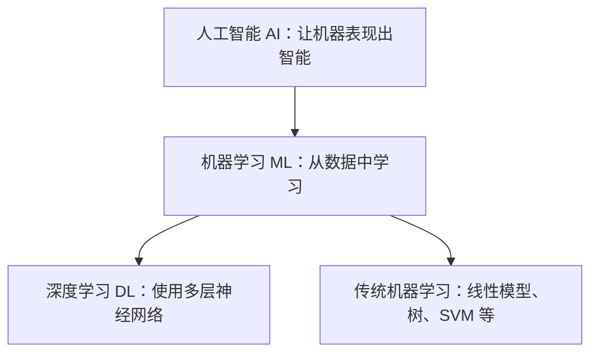
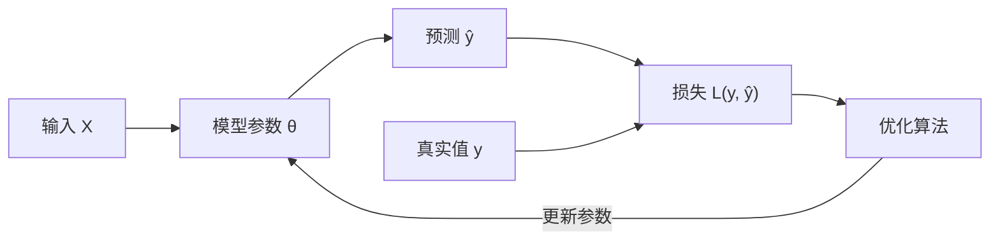

# 机器学习快速入门：从基本概念到完整实践

> 目标：读完后能够解释机器学习是什么、解决哪些问题、常用方法如何选择，并能独立完成一个基础机器学习项目。  
> 阅读方式：先理解问题和数据，再理解算法；代码只用于验证概念，不要求逐行背诵。  
> 适合人群：具备基础 Python 知识，希望快速建立完整机器学习知识框架的初学者。  
> 学习建议：第一遍按第 1～21 章建立主线；遇到公式或工程细节时，再跳到附录 A～F。附录不是额外考试内容，而是主文中关键概念的放大解释。  
> 前置基础：需要会用 Python 列表、循环、函数以及简单的 NumPy/pandas 操作。基础不牢可先读《Python 实用入门与 AI 开发：语法、API、并发及工程实践》第 2、4、12、26 章；Token、Embedding、RAG 等 AI 术语可查该书第 36 章术语表。

### 怎么用这份笔记

- **零基础建立直觉**：按顺序读第 1～9 章，代码照敲但不用背；看不懂的数学公式直接跳过，附录 A 有放大解释；
- **要动手验证**：第 15 章是完整案例，第 20 章有分阶段练习，附录 F 是更接近真实项目的回归案例；
- **做项目时**：按第 2 章的流程图推进，遇到具体问题查对应章节（数据划分看 11，评价看 12，调参看 14）；
- **查速查**：算法选择看第 19 章，全部浓缩在第 21 章；
- **学完记得输出**：每学一章，用自己的话写三行总结，再讲给一个不懂的人听。

## 目录

- [1. 机器学习是什么](#1-机器学习是什么)
- [2. 一个机器学习项目如何完成](#2-一个机器学习项目如何完成)
- [3. 认识数据：样本、特征与标签](#3-认识数据样本特征与标签)
- [4. 机器学习的主要类型](#4-机器学习的主要类型)
- [5. 监督学习：回归](#5-监督学习回归)
- [6. 监督学习：分类](#6-监督学习分类)
- [7. 常用监督学习算法](#7-常用监督学习算法)
- [8. 无监督学习](#8-无监督学习)
- [9. 模型是怎样学会的](#9-模型是怎样学会的)
- [10. 数据预处理与特征工程](#10-数据预处理与特征工程)
- [11. 训练集、验证集与测试集](#11-训练集验证集与测试集)
- [12. 如何评价一个模型](#12-如何评价一个模型)
- [13. 过拟合、欠拟合与正则化](#13-过拟合欠拟合与正则化)
- [14. 模型选择与超参数调优](#14-模型选择与超参数调优)
- [15. 完整案例：鸢尾花分类](#15-完整案例鸢尾花分类)
- [16. 神经网络与深度学习的位置](#16-神经网络与深度学习的位置)
- [17. 其他重要机器学习范式](#17-其他重要机器学习范式)
- [18. 工程实践与常见陷阱](#18-工程实践与常见陷阱)
- [19. 算法选择速查](#19-算法选择速查)
- [20. 学习路线与练习](#20-学习路线与练习)
- [21. 一页总结](#21-一页总结)
- [附录 A：机器学习所需的最小数学基础](#附录-a机器学习所需的最小数学基础)
- [附录 B：数据预处理与特征工程深入理解](#附录-b数据预处理与特征工程深入理解)
- [附录 C：无监督学习不只是没有标签](#附录-c无监督学习不只是没有标签)
- [附录 D：指标、概率、阈值与类别不平衡](#附录-d指标概率阈值与类别不平衡)
- [附录 E：正则化、调参与可信比较](#附录-e正则化调参和可信比较)
- [附录 F：更接近真实项目的表格回归案例](#附录-f一个更接近真实项目的表格回归案例)

---

### 章节导读：先看这张表

| 章节 | 回答的核心问题 | 关键概念 |
|---|---|---|
| 1. 机器学习是什么 | 它和传统编程有什么不同？ | 模型、泛化、AI/ML/DL 的关系 |
| 2. 一个项目如何完成 | 一个 ML 项目的标准流程？ | 定义问题、基线、训练/评估、部署监控 |
| 3. 认识数据 | 数据由什么组成？ | 样本、特征、标签、类型、抽样偏差 |
| 4. 主要类型 | 有哪些学习范式？ | 监督/无监督/半监督/自监督/强化 |
| 5. 回归 | 怎么预测连续值？ | 线性回归、MSE/MAE/R² |
| 6. 分类 | 怎么预测离散类别？ | 逻辑回归、混淆矩阵、精确率/召回率 |
| 7. 常用算法 | 每种算法怎么“想问题”？ | 线性、KNN、树、随机森林、提升树、SVM、朴素贝叶斯、神经网络 |
| 8. 无监督学习 | 没有标签能学什么？ | 聚类、降维、异常检测、PCA |
| 9. 模型怎样学会 | 训练的本质是什么？ | 损失函数、梯度下降、参数/超参数 |
| 10. 预处理与特征工程 | 数据要怎样加工？ | 缺失值、缩放、编码、Pipeline |
| 11. 划分数据 | 怎样避免自欺欺人？ | 训练/验证/测试、交叉验证、数据泄漏 |
| 12. 评价模型 | 怎样才算“好”？ | 指标匹配任务、AUC、阈值、业务指标 |
| 13. 过拟合与正则化 | 模型为什么不稳？ | 偏差/方差、L1/L2、学习曲线 |
| 14. 模型选择与调参 | 怎样选模型和参数？ | 简单优先、网格/随机搜索、误差分析 |
| 15. 完整案例 | 标准流程长什么样？ | 鸢尾花全流程代码 |
| 16. 神经网络的位置 | 深度学习何时上场？ | 激活函数、反向传播、预训练 |
| 17. 其他重要范式 | 还有哪些方向？ | 集成、迁移、在线学习、推荐、时序、生成、强化 |
| 18. 工程实践与陷阱 | 上线要注意什么？ | 训练/预测一致、漂移、公平、安全 |
| 19. 算法选择速查 | 该先试哪个算法？ | 按场景查表 |
| 20. 学习路线与练习 | 下一步学什么？ | 五阶段路线与练习 |
| 21. 一页总结 | 全部浓缩成什么？ | 关键原则清单 |
| 附录 A～F | 概念想深挖怎么办？ | 数学、预处理、无监督、指标、正则、完整案例 |

---

## 1. 机器学习是什么

机器学习（Machine Learning，ML）是让计算机从数据中发现规律，并利用这些规律对未见过的数据进行预测或决策的方法。

传统编程通常由人明确写出规则：

```text
数据 + 人工规则 → 结果
```

机器学习则把历史数据和正确结果交给算法，让算法学习规则：

```text
历史数据 + 正确答案 → 学习算法 → 模型
新数据 + 模型 → 预测结果
```

例如，想判断邮件是不是垃圾邮件。传统方法可能人工规定：“含有‘中奖’则判为垃圾邮件”。规则很容易漏掉新的表达方式。机器学习会阅读大量已经标注为“正常”或“垃圾”的邮件，学习词语、发件人、链接数量等特征与类别之间的关系。

### 1.1 模型是什么

模型可以理解为一组从数据中学到的参数和计算规则。最简单的房价模型可能是：

$$
\hat{y}=w_1x_1+w_2x_2+b
$$

其中：

- $x_1$ 是面积，$x_2$ 是房间数；
- $w_1$、$w_2$ 表示每个特征对价格的影响；
- $b$ 是基础偏移；
- $\hat{y}$ 是模型预测的房价。

训练就是根据历史房价不断调整 $w$ 和 $b$，使预测误差尽可能小。复杂模型虽然参数更多、关系更非线性，本质仍是从输入计算输出。

### 1.2 机器学习适合什么问题

机器学习通常适合以下情况：

- 规则很难由人完整写出，例如图像识别、语音识别；
- 已经积累了足够的历史数据；
- 规律会随数据变化，需要定期更新；
- 允许一定概率的错误，并能定义评价指标；
- 需要预测、分类、排序、推荐、聚类或异常检测。

不适合的情况包括：规则非常明确且必须百分之百执行、数据量太少或质量极差、无法定义目标、错误代价无法接受且没有人工兜底。

### 1.3 AI、机器学习与深度学习



机器学习是人工智能的一部分，深度学习又是机器学习的一部分。并不是所有机器学习都需要神经网络。对于中小型表格数据，树模型和线性模型往往更简单、更快，也更容易解释。

---

### 1.4 机器学习真正学习的是可迁移规律

训练集只是现实世界的一小份样本。模型真正有价值的地方，不是在已知样本上答对，而是在**与训练场景具有相同或相近生成规律的新样本**上仍然有效，这叫泛化（generalization）。

可以区分三个概念：记忆是记住训练样本及答案；拟合是找到能降低训练误差的参数；泛化是提取在新样本上仍然成立的稳定关系。假设历史数据中“使用某浏览器的用户更容易流失”，但这只是一次短期活动产生的偶然关系，活动结束后模型就可能失效。

可靠泛化通常要求：训练样本能代表上线对象；特征在预测时真实可用；标签定义准确稳定；模型复杂度与数据量匹配；评价方式真实模拟未来。训练阶段会利用已知数据调整参数，推理阶段固定参数并对新输入计算预测，两者的计算目标和工程要求并不相同。

> 数学公式第一次出现看不懂没关系：第 9 章用损失和梯度串起训练过程，[附录 A](#附录-a机器学习所需的最小数学基础) 再逐个放大向量、协方差、条件概率、梯度和经验风险。先跳过不影响主线。

---

## 2. 一个机器学习项目如何完成

无论使用什么算法，一个完整项目通常遵循相似流程：


### 第一步：定义问题

先回答：要预测什么？预测结果给谁使用？错误会造成什么影响？怎样才算成功？

例如“预测客户是否流失”还不够明确，应进一步规定：

- 预测未来 30 天是否流失；
- 提前多少天做出预测；
- 错过一个真实流失客户和误判一个正常客户，哪个代价更高；
- 业务能联系多少客户；
- 模型至少达到怎样的召回率或投入产出比。

### 第二步：建立基线

基线是最简单的参考方法。例如始终预测平均房价，或始终预测多数类别。复杂模型只有明显优于基线才有价值。

### 第三步：训练和评估

训练集用于学习参数，验证集用于选择方案，测试集只用于最终估计泛化能力。不能一边查看测试结果，一边反复修改模型，否则测试集也被“学会”了。

### 第四步：部署和监控

模型上线不是终点。用户行为、市场和设备可能变化，导致训练数据与线上数据分布不同，这称为数据漂移。需要监控输入分布、预测质量、延迟和业务指标，并按需重新训练。

---

### 2.1 先把业务问题翻译成可学习问题

一个问题至少要明确预测对象、观察窗口、预测窗口、标签、决策时点和预测后的行动。例如“预测客户流失”可以定义为：每周一根据过去 60 天行为，预测当前活跃用户未来 30 天是否停止活跃，再对风险最高且有可能被挽回的用户进行干预。

“预测谁会流失”和“找出发券后会被挽回的用户”并不是同一个问题。前者预测自然风险，后者需要估计干预效果，更接近因果推断或 uplift modeling。还要确认模型应输出类别、可排序分数还是可靠概率，以及业务是否有固定审核或触达容量。这些选择会直接决定标签、划分方式、指标和阈值。

---

## 3. 认识数据：样本、特征与标签

假设用房屋信息预测价格：

| 面积 | 房间数 | 房龄 | 距地铁距离 | 价格 |
|---:|---:|---:|---:|---:|
| 80 | 2 | 10 | 500 | 300 |
| 120 | 3 | 5 | 800 | 450 |
| 150 | 4 | 2 | 300 | 620 |

- 每一行是一个**样本**（sample）；
- 面积、房间数、房龄和距离是**特征**（feature），通常记为 $X$；
- 价格是希望预测的**标签/目标**（label/target），通常记为 $y$；
- 所有样本和字段组成数据集（dataset）。

### 3.1 数值、类别与文本

特征可能有不同类型：

| 类型 | 示例 | 常见处理 |
|---|---|---|
| 连续数值 | 身高、温度、收入 | 标准化、异常值处理 |
| 离散数值 | 购买次数、家庭人数 | 可直接使用或分箱 |
| 无序类别 | 城市、颜色 | One-Hot 编码 |
| 有序类别 | 差/中/好 | 有序编码 |
| 文本 | 评论、邮件 | TF-IDF、Embedding |
| 图像/音频 | 像素、波形 | 特征提取或深度学习 |
| 时间 | 日期、时间戳 | 年月日、周期、时间间隔 |

多数经典机器学习算法最终对数值表示进行计算；某些库可以直接接收类别字段，但内部仍会编码或使用专门的类别处理。因此，类别、文本、图像和音频都需要转换为与算法匹配的数值表示。

### 3.2 数据比算法更重要

常见数据问题包括：

- 标签错误；
- 缺失值；
- 重复样本；
- 单位不一致；
- 训练数据不能代表真实用户；
- 未来信息泄漏到特征中；
- 类别严重不平衡；
- 采集过程带有偏见。

一个复杂算法无法从错误目标和错误数据中学出可靠规律。实际项目经常把大部分时间花在数据理解、清洗和验证上。

---

### 3.3 总体、样本与抽样偏差

总体是希望模型最终服务的全部对象，样本是实际收集到的一部分对象。只用主动填写问卷的用户训练满意度模型，会漏掉不愿填写的人；只用旧规则批准的贷款客户训练违约模型，又无法观察被拒绝者获贷后的结果。

常见问题包括覆盖偏差、选择偏差、幸存者偏差、测量偏差、历史偏差和模型反馈回路。随机抽样只能降低一部分选择偏差，不能修复错误标签和测量方式。训练前应记录数据来源、时间、纳入条件、字段含义、单位、更新频率和标签生成逻辑。

### 3.4 EDA 不是画图比赛

探索性数据分析的目的，是验证建模假设：每行数据的粒度是什么，主键是否唯一，目标是否长尾或不平衡，字段是否越界或缺失，月份和渠道分布是否突变，同一主体是否重复跨集合，以及特征在预测时点是否可用。

Pearson 相关主要反映线性关系，强烈的 U 型关系也可能得到接近 0 的相关系数；高相关还可能由共同原因造成。EDA 用于发现异常、形成假设，不能单凭图表得出因果结论。

---

## 4. 机器学习的主要类型

### 4.1 监督学习

训练数据同时包含特征 $X$ 和正确答案 $y$。目标是学习 $X \rightarrow y$ 的映射。

- **回归**：预测连续数值，如价格、销量、温度；
- **分类**：预测离散类别，如是否违约、图片是哪种动物。

### 4.2 无监督学习

数据没有人工标签，算法寻找内部结构。

- 聚类：自动将相似客户分组；
- 降维：用更少变量表达主要信息；
- 异常检测：找出与大多数样本明显不同的数据。

### 4.3 半监督与自监督学习

半监督学习同时使用少量有标签数据和大量无标签数据。自监督学习从数据自身构造学习目标，例如遮住句子中的词再预测它。现代语言模型和视觉基础模型大量使用自监督预训练。

### 4.4 强化学习

智能体在环境中行动，根据奖励学习策略。例如游戏、机器人控制和资源调度。强化学习关心连续决策和长期收益，不能简单等同于普通分类。

---

### 4.5 学习范式的关键差别是监督信号从哪里来

监督学习的信号是标签，自监督学习的答案来自数据自身，强化学习的信号是环境奖励。同一份点击日志既可构造点击分类、商品排序、下一个行为预测、用户聚类，也可用于连续推荐决策。应先明确反馈从哪里来、何时到达、未选择动作的结果能否观察，再选择学习范式。

---

## 5. 监督学习：回归

回归预测连续值。典型任务包括房价、销售额、能耗和等待时间预测。

### 5.1 线性回归的直觉

只有一个特征时，线性回归寻找一条最合适的直线：

$$
\hat{y}=wx+b
$$

模型通过比较预测值 $\hat{y}$ 和真实值 $y$ 的差距学习参数。常见损失是均方误差：

$$
MSE=\frac{1}{n}\sum_{i=1}^{n}(y_i-\hat y_i)^2
$$

平方会让大错误受到更重惩罚，因此 MSE 对异常大误差更敏感。训练目标就是找到使 MSE 尽可能小的参数。

### 5.2 一个最小回归例子

```python
import numpy as np
from sklearn.linear_model import LinearRegression

# X 必须是二维：每行一个样本，每列一个特征
X = np.array([[50], [80], [100], [120], [150]])
y = np.array([180, 280, 350, 410, 520])

model = LinearRegression()
model.fit(X, y)                    # 从历史数据学习参数

prediction = model.predict([[90]])
print(f"90 平方米预测价格：{prediction[0]:.1f} 万元")
print("面积系数：", model.coef_[0])
print("截距：", model.intercept_)
```

代码只有三件核心事情：准备 $X/y$、调用 `fit()` 学习、调用 `predict()` 预测。后面大多数 scikit-learn 模型都遵循这个接口。

### 5.3 回归评价指标

| 指标 | 含义 | 特点 |
|---|---|---|
| MAE | 绝对误差平均值 | 单位与目标相同，直观，受极端值影响较小 |
| MSE | 平方误差平均值 | 更惩罚大错误，不便直接解释单位 |
| RMSE | MSE 开平方 | 与目标同单位，仍重视大错误 |
| $R^2$ | 相对平均值基线解释了多少变化 | 1 最好，可能小于 0 |

不同业务对错误敏感方式不同。预测配送时间时，MAE 的“平均差几分钟”容易解释；安全场景可能更关注极端大误差。

MAE、RMSE、$R^2$、MAPE 各自的适用边界，以及“平均误差 5 分钟但 99 分位误差 90 分钟”这类陷阱，见 [附录 D](#附录-d指标概率阈值与类别不平衡)。

### 5.4 线性回归的边界

线性回归简单、快速、可解释，但假设特征与目标的关系近似线性。若关系明显弯曲、包含复杂交互或异常值很多，需要非线性特征、树模型或其他算法。

---

### 5.5 线性回归训练完成后还要检查什么

得到一个较高的 $R^2$ 并不代表线性回归一定可靠。这里要先区分两件事：**能否可靠预测**，和**能否对系数做统计推断**。多数实际项目只关心前者，后者需要更强假设。

对预测来说，至少检查：

- 输入与目标的关系是否大致可以用线性组合表达；若关系明显弯曲，线性模型会在某些区间系统性高估或低估；
- 少数异常样本是否过度影响拟合结果；MSE 使用平方误差，极端点会把拟合线拉向自己；
- 训练与预测时特征是否同源、同单位，缺失和异常处理是否完全一致。

如果想进一步解读系数、计算置信区间或做显著性检验，才需要额外检查：

- 样本之间是否相对独立；
- 残差的波动是否在不同预测区间大致稳定；
- 特征之间是否存在严重共线性。

残差是 $e_i=y_i-\hat y_i$。一个健康的残差图通常围绕 0 随机分布。如果残差呈现弧形，说明遗漏了非线性关系；随预测值越来越分散，可能存在异方差；出现少数远离其他点的残差，则要检查异常值或特殊群体。注意：残差正态性和同方差通常是 OLS 做区间估计、检验时的理想假设，并不是获得预测值的硬性前提。

多重共线性表示两个或多个输入特征高度相关。例如“房屋面积”和“房间数”可能同时增长。模型的总体预测仍可能不错，但单个系数会变得不稳定：换一批样本后，两个特征的权重可能明显变化。因此不能机械地把每个线性权重解释为独立因果作用。

### 5.6 如何处理非线性回归

“线性回归”中的线性是指对参数线性，不表示输入只能原样使用。可以增加 $x^2$、$x_1x_2$ 等特征表达弯曲关系和特征交互：

$$
\hat{y}=w_1x+w_2x^2+b
$$

多项式阶数过高会产生剧烈波动并过拟合。实际项目还可使用回归树、随机森林、梯度提升树、样条或神经网络。应通过验证集比较，而不是因为散点图看起来弯曲就无限增加阶数。

回归目标若非常偏斜，例如收入、交易额和房价，也可能对目标做对数变换。此时指标解释和预测反变换要保持一致，并注意 `exp(平均对数预测)` 通常不等于原空间的条件平均值。

---
## 6. 监督学习：分类

分类预测离散类别。例如：

- 二分类：垃圾/正常、违约/不违约；
- 多分类：数字 0～9、花的品种；
- 多标签分类：一篇文章同时属于“科技”和“教育”。

### 6.1 逻辑回归

虽然名字带“回归”，逻辑回归主要用于分类。它先计算线性分数，再通过 Sigmoid 转成 0～1 的概率：

$$
p(y=1|x)=\frac{1}{1+e^{-(w^Tx+b)}}
$$

如果概率大于某个阈值，就预测为正类。阈值不一定必须是 0.5：疾病筛查为了少漏诊，可能降低阈值以提高召回率。

### 6.2 混淆矩阵

二分类结果可分为：

|  | 实际正类 | 实际负类 |
|---|---|---|
| 预测正类 | TP：真正例 | FP：假正例 |
| 预测负类 | FN：假负例 | TN：真负例 |

由此得到：

$$Precision=\frac{TP}{TP+FP}$$

$$Recall=\frac{TP}{TP+FN}$$

- 精确率高：预测为正的样本大多真的为正；
- 召回率高：真实正类大多被找出来；
- F1 是精确率与召回率的调和平均。

垃圾邮件过滤要避免把正常邮件误删，关注精确率；疾病筛查要避免漏掉患者，更关注召回率。指标必须联系业务错误代价选择。

### 6.3 为什么准确率可能骗人

若 1000 人中只有 10 人患病，模型全部预测“健康”也有 99% 准确率，却一个患者都找不到。这时应查看混淆矩阵、精确率、召回率、F1、PR-AUC 等指标，并考虑类别权重或重采样。

---

### 6.4 Logit、Softmax 与交叉熵

逻辑回归通常最小化二元交叉熵：

$$
L=-\frac{1}{n}\sum_i[y_i\log p_i+(1-y_i)\log(1-p_i)]
$$

真实标签为 1 时，预测 0.9 的损失约为 0.105，预测 0.01 的损失约为 4.605，因此它会强烈惩罚“非常自信但答错”。逻辑回归假设对数胜算与输入线性：

$$
\log\frac{p}{1-p}=w^Tx+b
$$

在其他输入不变的模型条件下，某特征增加一单位会使胜算乘以 $e^{w_j}$；这仍是统计关联，不是因果效应。多分类通常用 Softmax 把多个 logits 转成总和为 1 的概率；多标签任务则通常对每个标签分别使用 Sigmoid，因为多个标签可以同时成立。

Softmax 可以用一个简单例子验证。假设三个类别的 logits 是 $z=(2.0,\ 1.0,\ 0.0)$，则分母 $e^{2.0}+e^{1.0}+e^{0.0}\approx 7.39+2.72+1.00=11.11$，三个类别的概率约为 $0.665$、$0.245$、$0.090$，和为 1。若样本的真实类别是 logit 最低的第三类，模型却把约 66% 概率分给了第一类，交叉熵会给出较大损失。可以看到 Softmax 只负责“把 logits 变成和为 1 的分布”，不会自动纠正模型对类别的偏好。

### 6.5 多分类、多标签与排序不能混用

- **多分类**：每个样本只属于一个类别，如数字 0～9、花的品种，通常用 Softmax，并检查 $N\times N$ 的混淆矩阵（行是实际类别，列是预测类别）；
- **多标签**：一个样本可同时拥有多个标签，如文章既是“科技”又是“教育”，通常对每个标签独立使用 Sigmoid，再分别计算每个标签的 Precision、Recall、F1；
- **排序**：重点不是绝对类别，而是相关项目应排在前面，常用 NDCG、MAP、MRR、Recall@K 等指标。

多分类指标常分三种平均方式：

- **Macro**：先按类别分别计算指标再取平均，每个类别权重相同，样本少的类别也同等重要；
- **Micro**：先把所有类别的 TP/FP/FN 汇总再算指标，样本多的类别影响更大；
- **Weighted**：按各类别样本数加权平均，介于两者之间，也是 `classification_report` 默认展示的加权 F1。

把多标签问题错误地当成多分类，会强迫所有标签概率竞争、总和必须为 1；把排序问题只当普通分类，则可能获得不错 AUC，却无法保证最前面的少量结果质量。任务定义必须与最终消费预测的方式一致。

---

## 7. 常用监督学习算法

初学者不必先推导所有公式，但要知道每种方法的思路、优势和边界。

### 7.1 线性模型：用加权组合形成预测

线性模型假设输出可以由各特征的加权和表示。回归任务直接输出数值；逻辑回归会把线性分数映射为概率，而线性 SVM、感知机等模型通常只给决策分数，若需要概率还要额外校准。

#### 线性回归案例：预测二手车价格

假设特征包括车龄、行驶里程和是否发生事故：

$$
\hat{price}=w_1\times age+w_2\times mileage+w_3\times accident+b
$$

训练会寻找一组权重，使历史车辆的预测价格与成交价尽量接近。若车龄权重为负，表示在其他输入不变时，车龄增加会降低模型预测价格；事故字段的负权重表示事故车通常被预测得更便宜。

线性回归的“线性”指参数以加权相加方式进入模型。可以加入车龄平方、品牌与车龄交互等人工特征表达一定非线性，但模型不会像树那样自动发现任意切分和交互。

#### 逻辑回归案例：垃圾邮件分类

将邮件转换为 TF-IDF 特征后，每一维代表某个词的重要程度。逻辑回归为每个词学习权重：

```text
“中奖”“免费领取” → 可能获得正权重，提高垃圾邮件分数
“会议纪要”“项目进度” → 可能获得负权重，降低垃圾邮件分数
```

加权和经过 Sigmoid 变成 0～1 概率。模型能处理数万维稀疏文本，因为计算主要是向量乘法，并可通过 L1/L2 正则抑制不稳定权重。

#### 为什么线性模型值得先尝试

- 训练和预测速度快，可以快速验证数据与标签是否有信号；
- 权重便于检查模型是否依赖了奇怪特征；
- 在高维稀疏文本上常有很强基线；
- 概率输出容易用于阈值和校准；
- 复杂模型只有明显超过它，才证明额外复杂度有意义。

#### 什么时候表现不好

若决策规则类似“年龄小且收入高，或年龄大且存款高”，单一线性边界难以表达这种分段和交互关系。异常值、严重共线性和不合适的特征尺度也会影响训练与解释。

关键参数通常是正则化强度。正则太弱容易让权重受噪声影响，太强则把有用信号也压小。逻辑回归中的阈值属于决策参数，不是模型训练参数。

### 7.2 K 近邻 KNN：参考最相似的历史样本

KNN 几乎不建立显式公式，而是保存训练数据。预测新样本时：

1. 计算它与所有训练样本的距离；
2. 找到距离最近的 $K$ 个邻居；
3. 分类时由邻居投票，回归时取均值或距离加权均值。

#### 案例：根据花瓣尺寸识别花的品种

一朵新花的花瓣长度和宽度接近多朵已知山鸢尾，那么 KNN 会把它预测为山鸢尾。这里的核心假设是：在选择的特征空间中，距离近的样本拥有相似标签。

若 $K=1$，预测完全取决于最近的一个训练样本，容易被噪声和错标影响；若 $K$ 太大，邻域会包含其他类别，局部特征被全局多数类冲淡。通常通过交叉验证选择 K。

距离可以手算确认。若新样本是 $x=(1,2)$，某个训练样本是 $z=(4,6)$，欧氏距离为 $\sqrt{(4-1)^2+(6-2)^2}=\sqrt{9+16}=5$；曼哈顿距离为 $|4-1|+|6-2|=3+4=7$。K=3 时，就是先算出所有训练样本到新样本的距离，再取最小的 3 个邻居投票或取均值。

#### 为什么必须缩放特征

假设一个特征是年龄 18～80，另一个是年收入 2 万～100 万。直接计算欧氏距离时，收入差异会完全压过年龄。标准化后，各特征才能在距离中获得较合理的影响。

距离不一定只能用欧氏距离。曼哈顿距离适合某些网格型数据，余弦距离常用于高维文本向量。距离度量应与数据含义匹配。

#### 优势和边界

KNN 直观、无需复杂训练，能形成非线性决策边界，适合小型、低维且局部结构明显的数据。但预测时要搜索大量历史样本，数据大时速度和内存开销高；高维空间中距离会变得不容易区分，这就是维度灾难。

实际使用还要处理类别不平衡：邻域中多数类更容易占据投票优势，可以采用 `weights="distance"` 让近邻拥有更大投票权，或只在训练折内重新采样。`KNeighborsClassifier` 没有通用的 `class_weight` 参数，距离权重也不等同于类别权重。

### 7.3 决策树：通过一连串条件划分样本

决策树像一套自动学习的“如果—那么”规则。每个内部节点选择一个特征和阈值，将样本分到不同分支；叶节点给出类别概率或回归值。

#### 案例：贷款违约风险

一棵简化的树可能学习出：

```text
收入是否低于 6000？
├─ 是：历史逾期次数是否大于 1？
│  ├─ 是 → 高风险
│  └─ 否 → 中风险
└─ 否：负债率是否高于 60%？
   ├─ 是 → 中风险
   └─ 否 → 低风险
```

这些规则不是人工预先写入，而是树在训练数据中寻找能让子节点标签更纯的切分。

分类树常用 Gini 不纯度或信息熵评价切分。若一个节点中全是同一类别，不纯度最低；类别混杂越严重，不纯度越高。算法遍历候选特征和阈值，选择能让加权子节点不纯度下降最多的切分。

Gini 不纯度的公式为 $G=1-\sum_k p_k^2$，其中 $p_k$ 是该节点中第 $k$ 类样本的占比。例如一个节点有 8 个样本、4 正 4 负，则 $G=1-(0.5^2+0.5^2)=0.5$。若某个切分把样本完全分开，两个子节点的不纯度都是 0，加权后仍是 0，说明这次切分信息量最大；若切分后子节点仍是“3 正 3 负”和“1 正 1 负”，加权不纯度仍是 0.5，切分没有带来任何增益。树就是在所有候选切分里寻找加权不纯度下降最多的那一个。

回归树不看类别纯度，而是寻找能最大程度降低子节点目标方差或平方误差的切分。叶节点通常输出该区域训练样本的平均目标值。

#### 为什么树能学习非线性和交互

树可以在空间不同区域使用不同规则。例如只有收入低时才检查逾期次数，这自然表达了特征交互。树也不依赖欧氏距离，因此通常不用标准化。

#### 为什么容易过拟合

若无限切分，树可以不断建立非常具体的规则，直到一个叶节点只对应一两个训练样本。训练分数几乎完美，却把偶然噪声当成规律。

常用限制参数包括 `max_depth`（最大深度）、`min_samples_split`（继续切分所需的最小样本数）、`min_samples_leaf`（叶节点最小样本数）、`max_leaf_nodes`（叶节点总数上限）和 `ccp_alpha`（代价复杂度剪枝强度）。限制复杂度会降低训练分数，但可能提高未见数据表现。

树容易解释的是单条路径，但深树整体仍可能非常复杂。特征或样本轻微变化也可能改变早期切分，使整棵树结构明显变化。

### 7.4 随机森林：让许多不同的树共同投票

随机森林解决单棵决策树方差高、对数据扰动敏感的问题。它不是简单复制同一棵树，而是有意制造差异：

1. 对训练样本进行 Bootstrap 抽样，每棵树看到不同样本集合；
2. 每次节点切分时，只从随机选取的一部分特征中寻找最佳切分；
3. 分类时多数投票，回归时取多棵树平均。

#### 案例：疾病风险预测

一棵树可能过度依赖血压，另一棵树更关注年龄与检查指标，第三棵树从另一批患者中学习。只要这些树的错误不完全相同，投票就能抵消部分偶然错误。

可以用一个直觉理解：若多位医生拥有不同训练经历，每个人都比随机判断好，而且不会犯完全相同的错误，集体表决通常比单个人稳定。

#### 为什么随机特征很重要

如果每棵树在每次切分都能看到所有特征，一个特别强的特征可能让所有树形成类似结构，错误也高度相关。随机限制候选特征能增加树的多样性，虽然单棵树可能稍弱，但森林整体更稳健。

#### 常用参数

- `n_estimators`：树的数量，更多通常更稳定，但收益逐渐减小；
- `max_depth`、`min_samples_leaf`：控制每棵树复杂度；
- `max_features`：每次切分可考虑的特征数，影响树之间的相关性；
- `class_weight`：类别不平衡时增加少数类权重。

随机森林通常不要求标准化，对非线性和特征交互友好，是表格数据的可靠基线。缺点是模型较大、预测要遍历多棵树，整体规则不如单树直观；它对超高维稀疏文本通常不如线性模型自然。

袋外样本（OOB）是某棵树 Bootstrap 时未抽到的训练样本，可用于估计泛化表现，但不能在所有场景中完全替代独立验证集。

### 7.5 梯度提升树：让后续树专门纠正当前错误

随机森林中的树彼此独立并行训练；梯度提升中的树按顺序训练。每加入一棵小树，都试图减少当前模型仍然存在的错误。

#### 案例：预测外卖配送时间

第一棵树可能只学到距离越远时间越长。计算残差后发现：晚高峰订单普遍被低估、恶劣天气订单也被低估。下一棵树专门学习这些残差；后续树再修正商圈、骑手负载等剩余误差。

最终预测是许多小树贡献的累加：

$$
F_M(x)=F_0(x)+\eta\sum_{m=1}^{M}f_m(x)
$$

$\eta$ 是学习率，控制每棵树的修正幅度。学习率小通常需要更多树，但更新更谨慎；学习率大收敛快，也更容易过拟合。

“梯度”一词来自：对一般可微损失，算法拟合的是损失对当前预测的负梯度。平方误差下，这恰好对应残差；分类交叉熵下则是与概率错误相关的伪残差。

#### XGBoost、LightGBM 和 CatBoost

它们都属于高效梯度提升树实现，但工程策略不同：

- XGBoost 提供正则化、缺失值处理和成熟并行优化；
- LightGBM 使用直方图和叶子优先生长，对大数据和高维特征高效；
- CatBoost 对类别特征提供专门编码和有序提升，减少目标泄漏。

不能只按库名判断强弱，应使用相同数据划分和指标比较。

#### 关键参数与风险

树数量、学习率、树深/叶节点数、行列采样和正则化共同决定复杂度。表格竞赛中提升树很强，但也容易利用泄漏字段；特征重要性高不代表因果关系。早停应基于验证集，而不是观察测试集后决定训练轮数。

### 7.6 支持向量机 SVM：寻找间隔最大的边界

对于可以被直线分开的二分类数据，可能有许多条边界都能得到 100% 训练准确率。SVM 不只要求分对，还希望边界距离两类最近样本尽可能远，这个距离称为间隔。

离边界最近、真正决定位置的样本称为支持向量。远离边界的大量样本发生小变化时，通常不会改变最终边界。

#### 案例：小样本图像缺陷分类

把每张产品图片转换为特征向量后，合格与缺陷样本可能在高维空间中分开。线性 SVM 可寻找最大间隔超平面；若边界明显非线性，可使用 RBF 核。

核函数通过计算样本在隐式高维空间中的相似度，使原空间无法线性分开的数据变得可分，而不必显式构造所有高维特征。

#### `C` 和 `gamma` 的含义

- `C` 大：强烈惩罚训练错误，边界更努力适应训练样本，可能对异常值敏感；
- `C` 小：允许部分训练错误，追求更宽、更平滑的间隔；
- RBF 的 `gamma` 大：单个样本影响范围小，边界可能非常细碎；
- `gamma` 小：影响范围大，边界更平滑，也可能欠拟合。

SVM 依赖距离和内积，因此通常强烈建议标准化；若特征本来已同尺度或尺度本身具有特殊含义，则应通过验证判断。它适合中小型、高维数据，但核 SVM 在样本很多时训练和内存开销高。原始 SVM 分数不是概率，若业务需要概率通常还要校准。

### 7.7 朴素贝叶斯：用概率比较每个类别更可能产生当前样本

朴素贝叶斯根据贝叶斯公式计算类别后验概率：

$$
P(y|x)\propto P(y)P(x|y)
$$

为了让高维联合概率可计算，它假设给定类别后，各特征条件独立：

$$
P(x_1,\ldots,x_d|y)=\prod_jP(x_j|y)
$$

#### 案例：新闻主题分类

对于“体育”类别，训练数据中“比赛、球队、冠军”等词出现概率较高；对于“财经”类别，“股票、市场、公司”等词概率较高。新文章到来时，模型比较各类别产生这些词的联合可能性。

词语显然不真正独立，例如“足球”和“比赛”经常一起出现，因此模型被称为“朴素”。但分类只需要类别间的相对分数，而且这种强假设减少了需要估计的参数，所以在小数据、高维稀疏文本中仍可能非常有效。

用一个极简例子说明计算过程。假设只有“冠军”和“股票”两个词，“体育”类 10 篇文章中 9 篇含“冠军”、1 篇含“股票”；“财经”类 10 篇文章中 1 篇含“冠军”、9 篇含“股票”，两类先验都是 0.5。一篇只含“冠军”的新文章：

$$
P(体育)\times P(冠军|体育)=0.5\times0.9=0.45
$$

$$
P(财经)\times P(冠军|财经)=0.5\times0.1=0.05
$$

体育类得分更高，因此被预测为体育新闻。若新文章同时含“冠军”和“股票”，两类得分都会是 $0.045$，模型无法区分——这正是“条件独立”假设带来的局限：真实文本中这两个词出现模式可能相关，模型却把它们当独立信号相乘。

再考虑零概率问题：若“股票”从未出现在“体育”类训练文章中，则 $P(股票|体育)=0$，任何含“股票”的文章都会让“体育”类整体得分为 0。拉普拉斯平滑给每个计数加一个小量（如 1），分子加 $\alpha$、分母加词表大小乘 $\alpha$，避免这种一刀切，也让小样本类别更稳定。

上面的例子按 MultinomialNB 的习惯只累乘“出现词”的词概率；BernoulliNB 还会把“未出现词”也乘上 $1-p$，对词是否出现更敏感。具体选择哪种变体，取决于文本特征用词频还是二值出现标记。

#### 常见变体

- MultinomialNB：词频和计数型非负特征；
- BernoulliNB：某词是否出现等二值特征；
- GaussianNB：假设每类中的连续特征近似高斯分布。

若某个词在某类别训练集中从未出现，直接相乘会让整个类别概率为 0。拉普拉斯平滑为计数增加小量，避免零概率。

朴素贝叶斯训练和预测很快，也适合作为文本基线；但特征高度相关、分布假设严重不符时会受限，输出概率也常未校准。

### 7.8 神经网络：通过多层表示学习复杂函数

神经网络把线性变换和非线性激活重复组合。前层学习基础表示，后层组合成更复杂模式。它与线性模型最大的区别不是“参数更多”，而是能自动学习多层非线性特征。

#### 案例：手写数字识别

输入是一张 $28\times28$ 灰度图片。若直接手工设计规则，很难描述每个人不同的写法。神经网络可以从像素中逐层学习：

```text
像素变化 → 边缘和笔画 → 局部形状 → 数字类别
```

全连接网络可处理展平像素，但 CNN 利用局部结构和参数共享，更适合图片。文本和序列则常使用 Transformer。

#### 网络怎样训练

前向传播产生 logits，交叉熵衡量预测与数字标签的差距，反向传播计算每个权重的梯度，优化器反复更新参数。隐藏层宽度、层数、激活函数、学习率和正则化共同影响表达能力与训练稳定性。

#### 什么时候值得使用

神经网络特别适合图像、语音、文本和大规模复杂数据，可通过预训练减少从零训练成本。但在几千行普通表格数据上，梯度提升树可能训练更快、效果更好、解释更容易。

它的主要代价是数据和计算需求大、超参数多、训练时间长、调试和解释困难。使用神经网络也不能忽略数据泄漏、测试集隔离和业务评价。

### 7.9 把算法放在同一个问题中比较

算法名称很多，但它们都在尝试回答同一个问题：**根据训练样本，怎样推断新样本的输出？** 差别在于它们对“规律长什么样”有不同假设。

假设要根据年龄、收入判断客户是否会购买产品：

- 逻辑回归寻找一个线性决策边界，认为每个特征以相对稳定的方向影响购买概率；
- KNN 不显式总结规则，而是假设相近客户的行为也相近；
- 决策树反复提出条件问题，把空间切成许多区域；
- 随机森林对多棵树投票，减少单棵树因偶然样本产生的波动；
- 梯度提升树逐步增加新树，重点拟合当前仍预测不好的样本；
- SVM 寻找类别之间间隔尽可能大的边界，核函数还能把非线性问题映射到更容易分开的空间。

这些假设决定了算法的优缺点。线性模型偏差可能较大但方差较小；深树表达能力强但容易随训练样本变化；KNN 几乎保留全部训练信息，因此预测成本和尺度敏感性更明显。

下面使用完全相同的训练集、测试集和评价指标比较四个模型。代码的重点不是选出“冠军”，而是形成公平实验：

```python
from sklearn.datasets import load_breast_cancer
from sklearn.linear_model import LogisticRegression
from sklearn.metrics import accuracy_score, f1_score
from sklearn.model_selection import train_test_split
from sklearn.neighbors import KNeighborsClassifier
from sklearn.pipeline import make_pipeline
from sklearn.preprocessing import StandardScaler
from sklearn.ensemble import RandomForestClassifier, HistGradientBoostingClassifier

X, y = load_breast_cancer(return_X_y=True)
X_train, X_valid, y_train, y_valid = train_test_split(
    X, y, test_size=0.25, random_state=42, stratify=y
)

models = {
    # 线性模型和 KNN 对尺度敏感，因此把标准化放入 Pipeline
    "逻辑回归": make_pipeline(StandardScaler(), LogisticRegression(max_iter=2000)),
    "KNN": make_pipeline(StandardScaler(), KNeighborsClassifier(n_neighbors=7)),
    # 树根据阈值切分，不要求所有特征具有相同尺度
    "随机森林": RandomForestClassifier(n_estimators=300, random_state=42),
    "梯度提升": HistGradientBoostingClassifier(random_state=42),
}

for name, model in models.items():
    model.fit(X_train, y_train)
    pred = model.predict(X_valid)
    print(name, "accuracy=", round(accuracy_score(y_valid, pred), 3),
          "f1=", round(f1_score(y_valid, pred), 3))
```

这里的留出集合是候选比较使用的验证集，不是最终测试集。正确的比较不能只看一次验证分数。数据较少时，某次随机划分可能恰好有利于某个模型，应使用交叉验证比较平均值和波动；还要比较训练时间、预测延迟、概率质量、可解释性和部署复杂度。

### 7.10 模型的可解释性应该怎样理解

“可解释”至少包括三层：

1. **全局解释**：模型总体依赖哪些特征，关系大致是什么；
2. **局部解释**：为什么某一个样本得到当前预测；
3. **过程解释**：数据怎样处理、阈值怎样选择、人工怎样使用结果。

线性模型权重看似容易解释，但只有在特征尺度、共线性和编码方式明确时才有意义。树的特征重要性可能偏爱取值多的特征。SHAP、Permutation Importance 等工具可以辅助分析，但仍不等于因果解释。

---
## 8. 无监督学习

### 8.1 聚类

聚类将相似样本自动分组，但组的含义需要人解释。

#### K-Means

K-Means 的基本过程：

1. 选择 $K$ 个聚类中心；
2. 把每个样本分给最近的中心；
3. 用组内样本平均值更新中心；
4. 重复，直到分组基本不变。

```python
import numpy as np
from sklearn.cluster import KMeans
from sklearn.preprocessing import StandardScaler

# 每行表示一位客户：[年消费金额, 年购买次数]
X = np.array([
    [1000, 2], [1200, 3], [900, 2],
    [8000, 20], [9500, 24], [7200, 18],
])

X_scaled = StandardScaler().fit_transform(X)
labels = KMeans(n_clusters=2, random_state=42, n_init="auto").fit_predict(X_scaled)
print(labels)  # 只表示组号，具体业务含义需要结合数据解释
```

K-Means 需要预先指定 $K$，偏好近似球形、大小相近的簇，也对特征尺度和异常值敏感。

其他聚类方法包括层次聚类和 DBSCAN。DBSCAN 能发现任意形状的密集区域并标记噪声，但对密度差异大的数据较困难。

### 8.2 降维

降维用较少的新特征保留主要信息。

- PCA：寻找数据方差最大的正交方向；
- t-SNE、UMAP：常用于高维数据可视化；
- 自动编码器：用神经网络压缩和重建数据。

降维可用于可视化、去噪、压缩和缓解维度灾难，但新维度可能难以解释。可视化中看起来分开的点，不一定代表真实可分类结构。

### 8.3 异常检测

目标是发现少见或与正常模式差异很大的样本，如欺诈交易、设备故障和网络攻击。常见方法有 Isolation Forest、One-Class SVM、局部离群因子以及基于重建误差的方法。

异常不一定等于错误或欺诈；算法只说明“与学习到的常态不同”，最终需要业务判断。

---

### 8.4 聚类结果怎样评价

监督学习有真实标签可以直接比较，聚类通常没有标准答案，因此评价更困难。常见方法包括：

- **轮廓系数**：同时衡量样本与本簇是否紧密、与其他簇是否分离，越接近 1 越好；
- **簇内平方和**：样本到各自中心的平方欧氏距离之和，随 $K$ 增大必然下降，可用肘部法观察收益何时明显变小；
- **稳定性**：换一次抽样或初始化，分组是否大致一致；
- **外部指标**：若有少量真实类别，可计算 ARI、NMI 等；
- **业务可用性**：每个簇能否被解释，是否能形成不同运营策略。

不要因为二维图上出现几团点，就断言数据存在真实群体。标准化、降维参数和绘图方法都可能改变视觉结构。聚类标签 `0、1、2` 只是任意编号，并不天然代表“低价值、中价值、高价值”。

### 8.5 PCA 到底做了什么

假设数据有身高、体重、腰围等高度相关特征。PCA 会寻找一个方向，使样本投影后变化最大；再寻找与第一个方向正交、能解释剩余变化最多的第二个方向。每个主成分都是原始特征的线性组合。

PCA 常用于：

- 压缩相关特征；
- 在训练前减少维度和噪声；
- 将高维数据投影到二维或三维观察；
- 缓解部分模型在高维空间中的距离失效。

它也有明显边界：PCA 只关心输入方差，不知道预测标签。方差很小的方向也可能对分类非常重要；主成分通常不如原始业务字段容易解释。PCA 会先对每个特征做中心化（减去均值）再寻找最大方差方向，因此使用前通常先标准化，否则数值范围大的特征会主导方差；若特征单位本身有业务含义，是否缩放需要按问题判断。

```python
from sklearn.datasets import load_wine
from sklearn.decomposition import PCA
from sklearn.pipeline import make_pipeline
from sklearn.preprocessing import StandardScaler

X, y = load_wine(return_X_y=True)
pca_pipeline = make_pipeline(StandardScaler(), PCA(n_components=2))
X_2d = pca_pipeline.fit_transform(X)

pca = pca_pipeline.named_steps["pca"]
print("原始维度：", X.shape[1], "降维后：", X_2d.shape[1])
print("两个主成分解释的方差比例：", pca.explained_variance_ratio_)
print("累计解释方差比：", pca.explained_variance_ratio_.sum())
```

这里的“保留信息比例”准确说是保留了多少输入方差，并不保证保留同样比例的分类信息。

K-Means 的一次手算更新、DBSCAN 的 `eps` 与 `min_samples`、轮廓系数公式，见 [附录 C](#附录-c无监督学习不只是没有标签)。

---
## 9. 模型是怎样学会的

训练可以概括为：定义模型、定义错误、调整参数减少错误。



### 9.1 损失函数

损失函数衡量一个或一批样本预测得有多差：

- 回归常用 MSE、MAE；
- 二分类常用交叉熵；
- 多分类常用多类别交叉熵。

模型优化的是损失函数，不会自动理解业务目标。因此损失、数据和采样方式必须与真实目标一致。

### 9.2 梯度下降

梯度表示损失对参数变化的敏感方向。梯度下降沿负梯度更新参数：

$$
\theta \leftarrow \theta-\alpha\nabla_\theta L
$$

$\alpha$ 是学习率：太小收敛慢，太大可能越过最优点甚至发散。

不必为使用 scikit-learn 手写梯度下降，但理解它能帮助学习神经网络。批量梯度下降使用全部数据，随机梯度下降使用单个样本，小批量梯度下降在效率和稳定性之间折中。

### 9.3 参数与超参数

- 参数由训练数据学得，例如线性回归权重、树的切分；
- 超参数由开发者设置，例如树深、邻居数、学习率、正则化强度。

训练学习参数，验证集帮助选择超参数。

---

### 9.4 用极简代码观察梯度下降

下面代码只为解释更新过程，实际线性回归通常直接使用经过优化和验证的库实现：

```python
import numpy as np

X = np.array([1.0, 2.0, 3.0, 4.0])
y = np.array([3.0, 5.0, 7.0, 9.0])  # 规律接近 y = 2x + 1
w, b = 0.0, 0.0
learning_rate = 0.05

for step in range(1000):
    y_hat = w * X + b
    error = y_hat - y

    # MSE 分别对 w、b 的梯度
    dw = 2 * np.mean(error * X)
    db = 2 * np.mean(error)

    w -= learning_rate * dw
    b -= learning_rate * db

print(round(w, 3), round(b, 3))  # 接近 2 和 1
```

每一轮都先用当前参数预测，再计算误差方向，最后更新参数。若学习率过大，参数可能在最低点两边来回跳动甚至发散；过小则需要很多轮。特征尺度相差很大时，损失曲面可能非常狭长，标准化能让优化更稳定。

需要注意，并非所有模型都用梯度下降：普通决策树通过搜索切分点构建；随机森林组合多棵树；某些线性模型可以用闭式解或其他数值优化方法。

### 9.5 一个 Epoch、Batch 和 Iteration

在深度学习中：

- Epoch：完整看过一次训练集；
- Batch：一次用于计算梯度的一小批样本；
- Iteration/Step：执行一次参数更新。

假设训练集有 1000 个样本，batch size 为 100，那么一个 epoch 大约有 10 个 step。增加 epoch 不一定持续改善泛化，验证损失开始上升时可能已经过拟合。

---
## 10. 数据预处理与特征工程

### 10.1 缺失值

常见方法：删除、用均值/中位数/众数填充、增加“是否缺失”标记、使用模型估计。填充值只能从训练集计算，否则会数据泄漏。

### 10.2 特征缩放

- 标准化：减去均值，再除以标准差；
- 归一化：缩放到指定范围。

KNN、SVM、逻辑回归和神经网络通常受尺度影响；决策树、随机森林和梯度提升树通常不依赖缩放。

### 10.3 类别编码

无序类别常用 One-Hot。有序类别可按顺序编码。不要把“北京、上海、南京”随意编码为 1、2、3，否则模型可能误认为城市之间有数值大小关系。

### 10.4 特征工程

特征工程利用领域知识构造更有意义的输入：

- 日期拆成年、月、星期和是否节假日；
- 在预测时价格已知且价格不是目标时，可用价格与面积构造单价；若目标是房价，这样做会直接泄漏答案；
- 经纬度计算到门店的距离；
- 用户行为构造最近一次、频率、金额等统计；
- 文本转换为词频、TF-IDF 或 Embedding。

好的特征让简单模型也能表现良好。构造特征时必须确保预测时能够获得同样信息。

### 10.5 Pipeline

scikit-learn 的 Pipeline 把预处理和模型绑定在一起，保证交叉验证和预测使用相同转换，并降低数据泄漏风险。

为什么验证集只能 `transform` 不能 `fit`，以及填充、缩放、编码的公式与陷阱，见 [附录 B](#附录-b数据预处理与特征工程深入理解)。

---

### 10.6 混合类型表格数据的正确处理方式

真实表格通常同时包含数值和类别字段。数值列可能需要填充中位数和标准化，类别列需要填充众数并做 One-Hot。关键是：所有转换都只在训练数据上 `fit`，预测时只 `transform`。

```python
import numpy as np
import pandas as pd
from sklearn.compose import ColumnTransformer
from sklearn.impute import SimpleImputer
from sklearn.linear_model import LogisticRegression
from sklearn.pipeline import Pipeline
from sklearn.preprocessing import OneHotEncoder, StandardScaler

numeric_features = ["age", "income"]
categorical_features = ["city", "device"]

numeric_pipeline = Pipeline([
    ("imputer", SimpleImputer(strategy="median")),
    ("scaler", StandardScaler()),
])

categorical_pipeline = Pipeline([
    ("imputer", SimpleImputer(strategy="most_frequent")),
    ("onehot", OneHotEncoder(handle_unknown="ignore")),
])

preprocess = ColumnTransformer([
    ("num", numeric_pipeline, numeric_features),
    ("cat", categorical_pipeline, categorical_features),
])

model = Pipeline([
    ("preprocess", preprocess),
    ("classifier", LogisticRegression(max_iter=1000)),
])

# 构造一份带缺失值的小训练集
train_df = pd.DataFrame({
    "age": [25, 40, np.nan, 35],
    "income": [5000, 8000, 12000, 6000],
    "city": ["北京", "上海", np.nan, "深圳"],
    "device": ["手机", "电脑", "手机", "平板"],
})
y_train = pd.Series([0, 1, 0, 1])

# 测试集包含训练时没见过的新城市“广州”，验证 handle_unknown
test_df = pd.DataFrame({
    "age": [30, np.nan],
    "income": [9000, 4500],
    "city": ["广州", "北京"],
    "device": ["手机", np.nan],
})

model.fit(train_df, y_train)
print(model.predict_proba(test_df))
```

运行结果是一个 `(2, 2)` 的概率矩阵，两行对应两条测试样本，两列分别是“预测为类别 0 / 类别 1”的概率：

```text
[[0.73 0.27]
 [0.50 0.50]]
```

数值会因库版本略有不同，关键是理解发生了什么：年龄缺失的样本由训练集中位数填充，收入做标准化，城市被 One-Hot 编码；测试集出现的新城市“广州”被忽略而不是报错，所以模型仍能给出预测。

`handle_unknown="ignore"` 使预测时遇到训练阶段没见过的新城市不会直接报错，但模型也无法从这个新类别获得已学习权重，该类别对应的所有 One-Hot 列都会是 0。线上系统仍要监控未知类别比例，比例突然升高可能意味着数据分布或上游字段发生变化。

### 10.7 缺失值本身可能有信息

“没有收入记录”可能不是随机缺失，而是某类用户没有提交材料。因此除了填充数值，还可以加入 `income_is_missing` 特征。但也要判断缺失机制是否会随上线流程改变。

缺失通常分为：

- 完全随机缺失（MCAR）：缺失与已观测和未观测的值都无关；
- 条件随机缺失（MAR）：给定已观测变量后，缺失概率不再依赖缺失值本身；
- 非随机缺失（MNAR）：即使给定已观测信息，缺失概率仍与缺失值本身有关。

简单填充会改变数据分布，并低估不确定性。高风险统计分析需要更谨慎的方法；普通预测项目至少应比较不同填充策略并检查缺失率切片表现。更完整的说明见 [附录 B](#附录-b数据预处理与特征工程深入理解)。

### 10.8 特征选择并不是越少越好

删除无用特征可以降低噪声、训练成本和泄漏风险。常见方法包括：

- 基于领域知识和可用性删除；
- 低方差过滤；
- 相关性或统计检验；
- L1 正则化；
- 树重要性或 Permutation Importance；
- 递归特征消除。

任何依赖标签的特征选择都必须在交叉验证的训练折内部完成，否则会把验证信息泄漏给模型。

---
## 11. 训练集、验证集与测试集

### 11.1 为什么必须划分

模型在训练数据上表现好，可能只是记住了样本。真正关心的是对未见数据的泛化能力。

| 数据 | 用途 | 是否用于拟合参数 | 是否用于选择方案 |
|---|---|---|---|
| 训练集 | 学习参数 | 是 | 否 |
| 验证集 | 评估并选择特征、算法和超参数 | 否 | 是 |
| 测试集 | 最终一次评估 | 否 | 否 |

数据不多时可使用交叉验证：把训练数据轮流分成若干折，每次用一折验证、其余训练，最后取平均。

### 11.2 时间数据不能随机打乱

预测未来时，训练数据必须早于验证和测试数据。随机划分可能让模型看到“未来”，产生虚假的高分。

### 11.3 分组数据要防止串组

同一患者的多张图片、同一用户的多条记录不能随意分到训练集和测试集，否则模型可能识别的是用户而不是目标规律。应使用 Group Split。

### 11.4 数据泄漏

泄漏是模型训练时使用了真实预测场景中不可获得的信息。例如：

- 用全数据计算标准化均值；
- 把退款后才出现的字段用于预测是否退款；
- 同一对象的重复记录进入训练和测试；
- 先用全部数据筛选特征，再交叉验证。

泄漏会让离线分数异常漂亮，但上线迅速失效。

---

### 11.5 时间序列划分为何必须模拟真实预测

若目标是在 6 月底预测 7 月销量，那么模型训练时不能看到 7 月以后的记录。随机划分会把未来模式泄漏到训练集，例如新价格政策、节假日或用户状态。

时间验证通常采用扩展窗口：

```text
第 1 折：训练 1～6 月，验证 7～8 月
第 2 折：训练 1～8 月，验证 9～10 月
第 3 折：训练 1～10 月，验证 11～12 月
```

也可采用固定长度滚动窗口，让训练集只保留最近一段历史。选择哪一种取决于旧数据是否仍有价值、季节周期和系统允许的训练成本。

```python
import numpy as np
from sklearn.model_selection import TimeSeriesSplit

X = np.arange(12).reshape(-1, 1)  # 假设按月份排序
splitter = TimeSeriesSplit(n_splits=3)

for fold, (train_idx, valid_idx) in enumerate(splitter.split(X), 1):
    print(f"第 {fold} 折：训练月份", train_idx + 1,
          "验证月份", valid_idx + 1)
```

这里 `n_splits=3` 表示 12 个月被切成 3 段验证，每段 2 个月；训练集从第 1 个月开始不断向前扩展。上面代码的运行结果如下，正好对应前面的文字描述：

```text
第 1 折：训练月份 [1 2 3 4 5 6] 验证月份 [7 8]
第 2 折：训练月份 [1 2 3 4 5 6 7 8] 验证月份 [9 10]
第 3 折：训练月份 [1 2 3 4 5 6 7 8 9 10] 验证月份 [11 12]
```

时间特征也要避免泄漏。预测未来 7 天销量时，“未来 7 天实际平均价格”不可用；可以使用已知排期价格或过去窗口统计。滚动均值必须只使用当前预测时点以前的数据，并按实体分组计算。

### 11.6 分组划分解决的不是类别比例问题

`stratify=y` 保证每个集合的类别比例相近；Group Split 保证同一组不会同时出现在训练和验证。两者解决不同问题。

典型组包括患者、用户、设备、门店、家庭和文档来源。同一患者的多张图片高度相似，随机分开会让模型在测试时见到“熟悉患者”，分数高估面对新患者的能力。

有时既要保持类别平衡又要按组隔离，可以使用 StratifiedGroupKFold。若最终部署是预测现有用户的下一次行为，是否需要隔离用户则取决于实际场景；划分方式必须模拟上线时面对的对象。

### 11.7 为什么预处理必须在每个训练折内学习

假设先在全体数据上选择与标签相关性最高的 20 个特征，再做交叉验证。虽然模型没有直接读取验证标签，但特征选择步骤已经利用了验证标签，因此分数仍然泄漏。

正确方式是把填充、标准化、编码、特征选择、降维和模型一起放入 Pipeline。交叉验证在每一折中只用训练部分 `fit` 整条 Pipeline，再对验证部分 `transform/predict`。

---
## 12. 如何评价一个模型

### 12.1 指标必须匹配任务

回归看误差大小，分类看类别判断，排序看前列质量，聚类看内部结构和业务价值。没有一个指标适用于所有问题。

### 12.2 ROC-AUC 与 PR-AUC

ROC 曲线比较不同阈值下真正率和假正率，AUC 衡量排序能力。类别极不平衡时，PR 曲线更关注正类的精确率和召回率，通常更有解释力。

### 12.3 概率校准

如果模型输出 0.8，应希望约 80% 的这类样本真的为正。分类正确不代表概率可信。风险评估、医疗和金融场景常需要检查校准曲线或 Brier Score。

### 12.4 不只看平均值

还应按地区、设备、年龄、时间段等切片评估，检查模型是否只对某些群体有效。对于高风险应用，需要公平性、稳定性和置信区间分析。

### 12.5 业务指标

模型分数不是最终价值。推荐系统还要看点击、停留和长期满意度；流失预测要看挽回率与联系成本；欺诈检测要看减少的损失和人工审核量。

---

### 12.6 分类阈值为什么要单独选择

分类器常先输出概率或分数，再通过阈值转换成类别。默认 0.5 只是通用选择，不一定符合业务成本。

假设欺诈审核团队每天只能处理 1000 笔交易，阈值应结合审核容量、欺诈损失和误拦成本决定。降低阈值通常提高召回率，同时产生更多假正例；提高阈值通常提高精确率，但会漏掉更多真实正类。

```python
import numpy as np
from sklearn.metrics import precision_score, recall_score

y_true = np.array([1, 1, 0, 0, 1, 0, 0, 1])
y_prob = np.array([0.92, 0.82, 0.72, 0.55, 0.45, 0.38, 0.25, 0.12])

for threshold in [0.3, 0.5, 0.7, 0.9]:
    y_pred = (y_prob >= threshold).astype(int)
    print(
        threshold,
        "precision=", round(precision_score(y_true, y_pred), 2),
        "recall=", round(recall_score(y_true, y_pred), 2),
    )
```

运行结果：

```text
0.3 precision= 0.5 recall= 0.75
0.5 precision= 0.5 recall= 0.5
0.7 precision= 0.67 recall= 0.5
0.9 precision= 1.0 recall= 0.25
```

可以看到阈值从 0.3 升到 0.9 时，精确率从 0.5 升到 1.0，召回率从 0.75 降到 0.25。业务要做的不是找一个“最准”的阈值，而是选择错误代价最合理的点：欺诈审核若容量有限，可接受一定漏检来保证拦下的基本都是欺诈；疾病筛查若漏诊代价极高，则应接受更多假阳性来换取高召回。

阈值也属于模型方案的一部分，应在验证集上选择，在测试集上做最终确认。不能看到测试结果后不断调阈值。

混淆矩阵手算、ROC/PR-AUC 的概率解释和校准方法，见 [附录 D](#附录-d指标概率阈值与类别不平衡)。

### 12.7 指标之间为什么可能互相矛盾

模型 A 的准确率可能更高，模型 B 的召回率可能更高；A 的 RMSE 更低，B 的 MAE 可能更低。这不是计算错误，而是指标强调不同错误。

评价模型前，应写清楚成本矩阵：

| 错误 | 业务后果 | 相对代价 |
|---|---|---|
| 漏掉正类 FN | 患者未被发现、欺诈未拦截 | 可能很高 |
| 错报正类 FP | 增加复查、打扰正常用户 | 中等或很高 |
| 概率不准 | 资源分配和风险定价失真 | 视业务而定 |

当错误代价可量化时，可以直接计算期望成本；当不可量化时，至少应报告多个指标和混淆矩阵，而不是只宣布一个最高准确率。

### 12.8 交叉验证分数怎样阅读

五折分数为 `0.90、0.92、0.75、0.91、0.89` 时，平均分不低，但某一折明显较差，说明数据可能存在子群、时间变化或样本量不足。应检查每折的数据组成，而不是只报告均值。

分数的标准差反映对数据划分的敏感程度，但不是严格的统计置信区间。比较两个模型时，除了均值，还要观察每折差异、训练成本和错误样本是否一致。

---
## 13. 过拟合、欠拟合与正则化

### 13.1 欠拟合

模型太简单或训练不足，训练集和测试集都表现差。例如用直线拟合明显弯曲的数据。

改善方式：增加有效特征、使用更有表达力的模型、降低过强正则化、训练更充分。

### 13.2 过拟合

模型在训练集很好，在新数据上明显变差，说明学到了噪声或偶然细节。

改善方式：

- 增加和清洗数据；
- 简化模型、限制树深；
- 使用正则化；
- 交叉验证选择复杂度；
- 神经网络使用 Dropout、Early Stopping；
- 删除泄漏和不稳定特征。

### 13.3 偏差与方差

- 高偏差：模型假设过强，学不到规律，常对应欠拟合；
- 高方差：模型对训练数据太敏感，常对应过拟合。

机器学习的核心任务之一，就是在二者之间找到合适平衡。

### 13.4 正则化

正则化在损失中惩罚过大的参数或复杂模型：

- L2 让权重整体变小，通常更稳定；
- L1 可把部分权重压到 0，具有特征选择效果；
- 树模型通过深度、叶节点样本数等限制复杂度。

正则化不是越强越好，过强会造成欠拟合。

Ridge、Lasso、Elastic Net 的目标函数、几何直觉和逻辑回归中 `C` 的含义，见 [附录 E](#附录-e正则化调参和可信比较)。

---

### 13.5 如何从训练曲线诊断问题

只看最终训练分数和验证分数，很难知道应增加数据还是更换模型。学习曲线会画出训练样本数增加时两种分数的变化：

- 训练和验证都差且接近：高偏差，模型或特征表达不足；
- 训练很好、验证明显较差：高方差，存在过拟合；
- 增加数据后验证分数仍在提高：更多高质量数据可能有用；
- 两条曲线已经汇合且都不高：仅增加同分布数据可能帮助有限。

神经网络常观察每个 epoch 的训练损失和验证损失。训练损失继续下降而验证损失回升，是典型过拟合信号，可在最佳验证点 Early Stopping。

### 13.6 增加数据不总能解决问题

更多数据只有在数据代表真实场景、标签可靠且包含需要学习的信号时才有价值。大量重复、错误或带有相同偏差的数据不会自动改善模型。若特征根本不包含目标信息，再多样本也无法预测。

数据增强应保持标签语义。例如图像轻微旋转可能不改变类别，但将数字 6 翻转可能变成 9；文本同义改写也可能改变情感强度。增强规则需要领域审查。

---
## 14. 模型选择与超参数调优

### 14.1 先从简单模型开始

推荐顺序：

1. 建立业务或常数基线；
2. 尝试线性/逻辑回归；
3. 表格数据尝试决策树、随机森林、梯度提升；
4. 根据数据规模和任务再考虑 SVM、KNN 或神经网络。

简单模型便于发现数据问题，也能判断复杂模型的提升是否值得。

### 14.2 调参方法

- 网格搜索：穷举小范围组合；
- 随机搜索：从分布中随机采样，适合参数多；
- 贝叶斯优化：根据历史结果选择下一组参数；
- Early Stopping：验证集不再改善时停止。

调参必须在交叉验证或验证集上完成，不能用测试集挑参数。

### 14.3 实验可复现

记录数据版本、代码版本、特征、模型参数、随机种子、指标和运行环境。随机种子有助于复现一次划分，但不能保证不同硬件和库版本逐位相同。

---

### 14.4 网格搜索并不是参数越多越好

假设同时搜索 6 个参数，每个参数 10 个候选值，共有一百万种组合；再做五折交叉验证就是五百万次拟合。大部分计算可能浪费在明显不合理的区域。

实践中先根据算法机理选择少数影响最大的参数，并使用对数尺度。例如正则化强度可尝试 `0.001、0.01、0.1、1、10、100`，而不是只在 `1～2` 之间均匀取值。随机搜索在参数较多时通常比网格搜索更高效，因为它能覆盖更多不同取值。

超参数搜索结果也会对验证数据过拟合：尝试的方案越多，越可能偶然找到一个高分组合。应保留独立测试集。对小数据和严谨比较，可使用嵌套交叉验证：内层选择超参数，外层评估整个选择过程。

### 14.5 调参前先做误差分析

如果模型把大量猫识别成狗，原因可能是图片太暗、标签错误、训练集中某类不足或模型能力不够。只增加树数量或搜索学习率，未必能解决数据问题。

误差分析可按以下顺序：

1. 查看错误样本，而不只是总体分数；
2. 按类别、来源、时间和关键群体切片；
3. 检查标签和输入质量；
4. 比较训练与验证差距；
5. 判断是召回、特征、模型容量还是阈值问题；
6. 针对主要错误来源设计下一轮实验。

每次实验尽量只改变一个主要因素，并记录假设、配置和结果。否则即使分数上升，也不知道是哪项改动起作用。

### 14.6 模型比较需要考虑不确定性

测试集上 90.2% 与 90.4% 的差异可能只是抽样波动。可以通过重复交叉验证、Bootstrap 置信区间或配对统计检验估计差异稳定性。对于同一批样本，比较模型错误是否发生在相同对象上，比只比较两个平均分更有信息。

工程上还要考虑“统计显著”是否具有业务意义。准确率提高 0.1%，若带来十倍推理成本和更差延迟，未必值得上线。

---
## 15. 完整案例：鸢尾花分类

下面用一个代码块展示标准流程：加载数据、划分、预处理、训练、交叉验证和最终测试。代码不追求最高分，而是展示正确结构。

```python
from sklearn.datasets import load_iris
from sklearn.linear_model import LogisticRegression
from sklearn.metrics import classification_report, confusion_matrix
from sklearn.model_selection import cross_val_score, train_test_split
from sklearn.pipeline import make_pipeline
from sklearn.preprocessing import StandardScaler

# 1. 数据：150 朵花，4 个特征（花萼长、花萼宽、花瓣长、花瓣宽），目标是 3 个品种
iris = load_iris()
X, y = iris.data, iris.target
target_names = iris.target_names  # ['setosa', 'versicolor', 'virginica']

# 2. 先留出最终测试集；stratify 保持类别比例
X_train, X_test, y_train, y_test = train_test_split(
    X, y, test_size=0.2, random_state=42, stratify=y
)

# 3. Pipeline 保证标准化只从每次训练折学习
model = make_pipeline(
    StandardScaler(),
    LogisticRegression(max_iter=1000),
)

# 4. 交叉验证估计训练阶段的泛化能力
cv_scores = cross_val_score(model, X_train, y_train, cv=5, scoring="accuracy")
print("交叉验证准确率：", cv_scores.mean(), "+/-", cv_scores.std())

# 5. 用全部训练数据拟合，再在未使用的测试集上评估一次
model.fit(X_train, y_train)
y_pred = model.predict(X_test)

print("混淆矩阵：\n", confusion_matrix(y_test, y_pred))
print(classification_report(y_test, y_pred, target_names=target_names))
```

这段代码在常见随机种子下的典型输出为：

```text
交叉验证准确率： 0.958 +/- 0.026
混淆矩阵：
 [[10  0  0]
  [ 0  9  1]
  [ 0  1  9]]
              precision    recall  f1-score   support

      setosa       1.00      1.00      1.00        10
  versicolor       0.90      0.90      0.90        10
   virginica       0.90      0.90      0.90        10

    accuracy                           0.93        30
   macro avg       0.93      0.93      0.93        30
weighted avg       0.93      0.93      0.93        30
```

混淆矩阵的行是实际类别、列是预测类别，因此对角线是“预测正确”的样本数。上面的矩阵说明：10 朵山鸢尾全部预测正确；10 朵变色鸢尾中有 9 朵正确、1 朵被误判为维吉尼亚鸢尾；维吉尼亚鸢尾也有 1 朵被误判为变色鸢尾。只看 93% 的准确率看不到这个错误模式，这正是要同时看混淆矩阵和分类报告的原因。

### 15.1 怎样阅读这段代码

- `train_test_split` 在训练前隔离测试集；
- `stratify=y` 防止小数据划分后类别比例失衡；
- `Pipeline` 防止标准化使用验证折的信息；
- 交叉验证用于估计方案稳定性；
- `fit()` 学习预处理参数和模型参数；
- 混淆矩阵显示每个类别错在哪里；
- 最终测试只应在方案基本确定后执行。

### 15.2 真正项目还缺什么

需要补充数据字典、缺失与异常处理、基线、错误案例分析、超参数选择、模型保存、API、监控、漂移检测和业务反馈。教学数据干净且规模小，不能代表现实项目难度。

想看一个包含基线、交叉验证、候选比较、最终测试和误差分析的可运行回归案例，见 [附录 F](#附录-f一个更接近真实项目的表格回归案例)。

---

## 16. 神经网络与深度学习的位置

一个神经元执行加权求和再通过激活函数：

$$
h=\sigma(w^Tx+b)
$$

多层神经网络把许多神经元组合起来，逐层学习复杂表示。训练使用反向传播计算梯度，再由优化器更新权重。

### 16.1 常见网络

| 网络/架构 | 主要数据 | 典型任务 |
|---|---|---|
| MLP | 表格或向量 | 分类、回归 |
| CNN | 图像、空间数据 | 图像分类、检测 |
| RNN/LSTM | 序列 | 早期文本、时间序列 |
| Transformer | 文本、图像、多模态 | 大语言模型、视觉模型 |
| GNN | 图结构 | 分子、社交网络、推荐 |

### 16.2 什么时候使用深度学习

适合原始图像、音频、文本、大规模数据和复杂表示学习。对于几千条结构化表格数据，梯度提升树可能更实用。

深度学习仍遵循本笔记的基本原则：数据划分、损失函数、优化、泛化、评价、泄漏和上线监控都没有消失。更系统的深度学习讲解见[《深度学习快速入门：从神经网络到 Transformer》](%E6%B7%B1%E5%BA%A6%E5%AD%A6%E4%B9%A0%E5%BF%AB%E9%80%9F%E5%85%A5%E9%97%A8%EF%BC%9A%E4%BB%8E%E7%A5%9E%E7%BB%8F%E7%BD%91%E7%BB%9C%E5%88%B0%20Transformer.md)（同一目录下的关联笔记）。

---

### 16.3 神经网络为什么需要非线性激活

如果多层网络每层都只做线性变换，那么多层线性运算最终仍等价于一层线性变换，无法表达复杂边界。ReLU、Sigmoid、GELU 等激活函数引入非线性，使网络能够组合出曲线、区域和复杂层级特征。

一次前向传播从输入逐层得到预测；损失函数比较预测与标签；反向传播使用链式法则计算每个权重对损失的影响；优化器再更新权重。反向传播是高效求梯度的方法，不等于优化算法本身，SGD、Adam 才负责如何利用梯度更新。

### 16.4 深度学习训练中常见概念

- Batch size：每次更新使用的样本数，影响显存、速度和梯度噪声；
- Learning rate：最重要的超参数之一；
- Optimizer：SGD、Adam 等参数更新策略；
- Weight decay：常见 L2 风格正则；
- Dropout：训练时随机将部分激活置零，减少神经元之间的共同适应；
- Batch/Layer Normalization：稳定中间激活，但工作机制不同；
- Early Stopping：验证指标不再改善时停止；
- Checkpoint：保存模型权重、优化器和训练进度。

训练失败不一定是模型不够大。应依次检查数据与标签、损失是否匹配、输出形状、学习率、归一化、梯度是否爆炸/消失，以及训练和验证代码是否一致。

### 16.5 预训练、微调与特征提取

预训练模型已经从大规模数据学到通用表示。使用时有三种常见方式：

1. 冻结主干，只训练新的分类头；
2. 解冻部分层做小学习率微调；
3. 全量微调，成本和过拟合风险更高。

数据少时优先使用预训练和简单头部。微调效果仍要与不训练的基线、传统模型或直接提示方法比较。

---
## 17. 其他重要机器学习范式

### 17.1 集成学习

组合多个模型提高稳定性：

- Bagging：通常在不同 Bootstrap 样本上并行训练多个同类基学习器再平均，如随机森林；
- Boosting：后面的模型纠正前面错误，如梯度提升树；
- Stacking：用另一个模型组合多个基模型的预测。基模型必须在交叉验证折内生成“未见过的样本”预测（折外预测），否则元模型看到的是训练时见过的分数，会高估效果。

### 17.2 迁移学习

先在大数据上训练通用模型，再在目标任务上微调。图像和自然语言中非常常见，可以减少目标任务对标注数据的需求。

### 17.3 在线学习

数据持续到来时逐步更新模型，适合广告、推荐和实时系统。需要防止异常数据迅速污染模型，并监控分布漂移。

### 17.4 推荐系统

常见方法包括协同过滤、矩阵分解、内容推荐和深度排序。推荐系统通常包含召回、粗排、精排等阶段，离线准确率与线上用户体验不完全等价。

### 17.5 时间序列

预测未来销量、负载和价格。关键是时间顺序、趋势、周期、节假日和外生变量。不能随机划分未来与过去。

### 17.6 生成模型

生成模型学习数据分布并产生新样本，例如语言模型、VAE、GAN、扩散模型。它与判别式分类模型目标不同，但仍属于广义机器学习。

---

### 17.7 在线学习如何更新模型

批量学习定期收集一批数据重新训练；在线学习则让模型随着数据流逐批更新。scikit-learn 中部分模型支持 `partial_fit()`，例如 SGDClassifier 和某些朴素贝叶斯模型。

在线学习适合数据量巨大、模式变化较快或无法频繁全量训练的场景。但它带来新的风险：

- 一批错误标签可能迅速污染模型；
- 数据顺序影响更新结果；
- 新模式学习太快会遗忘旧模式，太慢又跟不上漂移；
- 需要保存模型版本，并能在指标恶化时回滚；
- 在线评价只能在标签到达后进行，可能有明显延迟。

常见评估方式是 prequential evaluation：先用当前模型预测新样本，等真实标签到达后计算误差，再用该样本更新模型。不能先训练再评价同一个样本。

### 17.8 推荐系统为什么通常分成多阶段

候选物品可能有数百万个，无法让复杂模型逐一评分。因此实际推荐常分为：

1. **召回**：从巨大物品库快速找出数百或数千个可能相关候选；
2. **粗排**：用较轻模型过滤明显不合适的候选；
3. **精排**：结合用户、物品和上下文特征精细预测点击、观看或购买；
4. **重排**：加入多样性、新鲜度、业务规则和安全约束。

协同过滤利用“相似用户喜欢相似物品”，内容推荐利用物品属性。冷启动用户没有历史行为时，可用热门、人口属性、初始兴趣或探索策略；新物品则依赖内容特征和曝光探索。

离线 AUC、NDCG 和 Recall@K 只衡量历史数据上的排序，无法完全反映新颖性、长期满意度和反馈回路。最终通常需要在线 A/B 测试，并防止模型只推荐容易点击但低质量的内容。

### 17.9 时间序列不仅是普通回归加一个日期

时间序列通常包含：

- 趋势：长期上升或下降；
- 季节性：每周、每月或每年的重复规律；
- 自相关：当前值与过去值相关；
- 外生变量：价格、天气、活动、节假日；
- 结构突变：政策、系统或市场发生变化。

常用基线非常重要，例如“预测等于上周同一天”“最近 7 天平均”。复杂模型若不能稳定超过季节性基线，就没有实际价值。

特征可以使用滞后值、滚动统计、日历和已知未来变量。预测多步未来有递归预测、直接为每个步长训练模型、多输出模型等方案。递归方式会把前一步误差传给后一步；直接方式模型更多但不会层层传播预测误差。

评价应按预测步长分别报告。例如未来 1 天和未来 30 天的难度不同，只给一个平均 MAE 会隐藏远期性能下降。

### 17.10 生成模型与判别模型的区别

判别模型主要学习输入到标签的边界或条件概率 $P(y|x)$；生成模型尝试学习数据如何产生，例如联合分布 $P(x,y)$ 或数据分布 $P(x)$，因此能够采样新数据。

不同生成模型采用不同训练思想：

- 自回归模型逐个预测下一个元素；
- VAE 学习连续潜变量空间，并在重建质量与分布约束间平衡；
- GAN 让生成器与判别器对抗训练；
- 扩散模型学习逐步去除噪声；
- 大语言模型通常通过下一个 Token 预测进行自监督预训练。

生成质量不能只看样本“像不像”。还要检查多样性、忠实度、事实性、安全、训练数据记忆和下游任务效果。语言模型生成流畅文字不代表事实正确。

### 17.11 强化学习为什么更难评价

监督学习每个样本通常有固定标签；强化学习的动作会改变未来状态，奖励还可能延迟。一个动作眼前奖励低，却可能带来更高长期回报。

核心概念包括状态、动作、策略、奖励、回报和值函数。Agent 还必须在探索新动作和利用已有最好动作之间权衡。离线日志通常只包含旧策略选择过的动作，难以可靠评价新策略，这叫反事实评价问题。

在能用监督学习、规则或规划解决时，不应只因为任务有“Agent”就使用强化学习。真实系统的探索可能伤害用户或设备，需要模拟器、安全约束和逐步上线。

---
## 18. 工程实践与常见陷阱

### 18.1 训练与预测必须一致

训练使用的字段、编码、缩放和缺失处理必须在预测时完全一致。Pipeline、特征仓库和版本化可以降低“训练—服务偏差”。

### 18.2 模型保存不等于项目可复现

还需要保存预处理、类别顺序、依赖版本、特征定义和数据版本。反序列化不可信模型文件可能执行恶意代码，因此模型文件也要视为软件制品管理。

### 18.3 相关不等于因果

模型发现的是统计相关性。冰淇淋销量和溺水事件可能同时随气温增加，并不表示冰淇淋导致溺水。若问题是“采取措施会造成什么结果”，需要实验设计或因果推断。

### 18.4 可解释性

线性权重、树规则、特征重要性、Permutation Importance、SHAP 等可以解释模型。但解释方法也有假设，特征重要不等于因果作用。

### 18.5 公平、隐私与安全

训练数据可能包含社会偏见和敏感信息。应检查不同群体的错误率，限制敏感数据访问，遵守数据授权和保留规则，并防范模型反演、成员推断及对抗样本等风险。

### 18.6 常见初学者错误

- 先选最复杂算法，再理解问题；
- 只看训练分数；
- 在划分前用全数据预处理；
- 用测试集调参；
- 只报告准确率；
- 忽略类别不平衡；
- 随机划分时间或分组数据；
- 把缺失值随意填成 0；
- 把相关性解释为因果；
- 只保存模型，不保存预处理；
- 上线后不监控数据变化。

---

### 18.7 从 Notebook 到线上服务还缺哪些环节

Notebook 证明模型在一份数据上可运行；生产系统还要把训练与预测变成稳定、可重复、可监控的流程：

```text
数据验证 → 特征流水线 → 训练 → 离线评估 → 模型注册
→ 灰度部署 → 在线监控 → 标签回流 → 再训练/回滚
```

需要版本化的数据包括：数据快照、特征代码、模型参数、依赖环境、随机种子和评价报告。模型注册表记录某个制品是否通过门禁、由谁批准以及部署到哪里。

线上预测分为批处理和实时服务。批处理适合每天生成客户分数；实时服务适合风控、搜索和推荐。实时系统还要考虑延迟、吞吐、超时、缓存、降级和模型加载内存。

### 18.8 漂移不只有一种

- 数据漂移：$P(X)$ 变化，例如用户年龄分布改变；严格的 covariate shift 还通常假设 $P(y|X)$ 保持不变；
- 标签漂移：$P(y)$ 变化，例如欺诈比例升高；严格的 label shift 还通常假设 $P(X|y)$ 保持不变；现实中多种漂移可以同时发生；
- 概念漂移：$P(y|X)$ 变化，同样特征对应的结果规律改变；
- 特征管道漂移：上游字段定义、单位或编码发生变化。

只监控输入均值无法发现所有漂移。应结合分布距离、未知类别比例、缺失率、预测分布以及标签到达后的真实指标。检测到漂移也不等于立即重训：要先判断是否是数据故障、短期活动或真实规律变化。

### 18.9 公平性不能用一个指标概括

不同公平定义可能互相冲突。例如要求各群体有相同正例预测率，与要求各群体有相同真正率，通常无法同时满足，尤其当基础发生率不同。

正确流程是先明确模型决策会影响谁、受保护属性是什么、哪类错误伤害最大，再按群体报告样本量、混淆矩阵、校准和置信区间。简单删除敏感字段不一定公平，因为邮编、消费或学校等变量可能成为代理特征。

高风险场景还需要人工申诉、解释、审计和定期复核。公平性是产品、数据和决策流程问题，不只是模型调参问题。

### 18.10 机器学习系统的安全问题

除普通软件安全外，还要考虑：

- 数据投毒：攻击者向训练数据注入恶意样本；
- 对抗样本：对输入做微小修改诱导错误预测；
- 模型窃取：大量查询近似复制模型能力；
- 成员推断：判断某条记录是否出现在训练集；
- 模型反演：从输出推测训练数据敏感属性；
- 不安全反序列化：加载恶意模型文件时执行代码。

防护包括数据来源审计、访问控制、查询限流、隐私保护、鲁棒性测试、模型制品签名和安全的序列化格式。安全目标要根据威胁模型设计，而不是只安装一个库。

---
## 19. 算法选择速查

| 场景 | 建议先尝试 | 原因 |
|---|---|---|
| 连续值预测 | 线性回归、随机森林、梯度提升树 | 从可解释基线到强表格模型 |
| 二/多分类 | 逻辑回归、随机森林、梯度提升树 | 稳定、成熟、易评估 |
| 高维稀疏文本 | 逻辑回归、朴素贝叶斯、线性 SVM | 适合稀疏特征 |
| 小型非线性数据 | SVM、KNN、树模型 | 能表达非线性 |
| 无标签客户分组 | K-Means、层次聚类、DBSCAN | 对应不同簇形状和噪声 |
| 高维可视化 | PCA 后配合 UMAP/t-SNE | 先降噪再观察局部结构 |
| 异常检测 | Isolation Forest、规则基线 | 易用且能处理多维数据 |
| 图像、语音、复杂文本 | 预训练深度模型、迁移学习 | 自动学习高层表示 |
| 时间预测 | 时间基线、树模型、统计模型/深度模型 | 保留时间顺序和周期信息 |

选择模型时同时考虑：数据规模、特征类型、非线性、可解释性、训练/预测成本、缺失值、部署延迟和错误代价。

---

## 20. 学习路线与练习

> 前置要求：熟练 Python 基础语法，会 NumPy/pandas 的基本操作（筛选、分组、统计、绘图）。基础不熟可先读《Python 实用入门与 AI 开发：语法、API、并发及工程实践》第 2、4、12、26 章。

### 第一阶段：建立直觉

掌握样本、特征、标签、训练、预测、回归、分类、损失和评估。用 scikit-learn 完成线性回归和逻辑回归。

练习：用面积预测房价；用鸢尾花数据分类，并解释混淆矩阵。

### 第二阶段：数据和泛化

学习预处理、Pipeline、训练/验证/测试、交叉验证、过拟合和正则化。

练习：故意先用全数据标准化，再改成 Pipeline，解释为什么前者泄漏。

### 第三阶段：常用算法

掌握树、随机森林、梯度提升、KNN、SVM、朴素贝叶斯、聚类和 PCA 的直觉与边界。

练习：同一分类数据比较逻辑回归、决策树和随机森林，观察训练分数、测试分数和推理时间。

### 第四阶段：完整项目

选择公开数据，完成问题定义、EDA、数据清洗、基线、Pipeline、交叉验证、误差分析和报告。

推荐入门项目：泰坦尼克生存分类、加州房价回归、客户流失分类、手写数字分类。

### 第五阶段：按方向深入

- 表格数据：XGBoost/LightGBM/CatBoost、特征工程、概率校准；
- NLP/视觉：PyTorch、Transformer、迁移学习；
- 推荐：召回、排序、Embedding；
- 工程：MLflow、模型服务、特征仓库、漂移监控；
- 理论：概率统计、线性代数、优化、学习理论。

---

## 21. 一页总结

```text
机器学习：从历史数据中学习规律，用于未见数据。

监督学习：有标签。
  回归 → 连续值；分类 → 离散类别。

无监督学习：无标签。
  聚类 → 自动分组；降维 → 压缩主要信息；异常检测 → 找不同。

模型训练：预测 → 计算损失 → 优化参数 → 重复。

完整项目：
  定义问题 → 理解数据 → 划分数据 → 预处理/特征
  → 基线 → 训练/调参 → 最终测试 → 部署/监控。

关键原则：
  1. 数据和目标比算法名字更重要。
  2. 测试集不能参与调参。
  3. 预处理必须只从训练数据学习。
  4. 指标必须匹配业务错误代价。
  5. 训练好不等于泛化好，要防过拟合。
  6. 复杂模型必须优于简单基线才有意义。
  7. 上线后仍要监控漂移、性能、公平和业务效果。
```

学会机器学习，不是背下所有算法公式，而是能够把一个现实问题转换成数据和评价指标，选择合适方法，通过可靠实验判断模型是否真的对新数据有用。

---

## 附录 A：机器学习所需的最小数学基础

数学的作用不是制造门槛，而是把“模型为什么这样做”说准确。入门阶段不需要先学完高等数学，只要能把下列概念与算法联系起来。

### A.1 向量、矩阵与形状

一个样本有 $d$ 个特征时，可写成向量 $x=(x_1,\ldots,x_d)$；$n$ 个样本排在一起形成矩阵 $X\in\mathbb{R}^{n\times d}$。行表示样本，列表示特征，标签向量通常是 $y\in\mathbb{R}^{n}$。

线性模型的 $Xw+b$ 本质是每一行与权重向量做点积。若 $X$ 为 `(100, 5)`，表示 100 个样本、5 个特征，$w$ 必须含 5 个权重，结果是 100 个预测。大量代码错误都来自形状不匹配，因此看到数组时应先问：每一维代表什么？

点积 $w^Tx=\sum_jw_jx_j$ 可以理解为“对各特征加权汇总”。余弦相似度则比较方向：

$$
\cos(x,z)=\frac{x^Tz}{\lVert x\rVert\lVert z\rVert}
$$

它忽略整体长度，常用于文本向量相似度。欧氏距离关注绝对坐标差异，KNN 和 K-Means 常用它，因此特别依赖尺度。

### A.2 均值、方差与协方差

均值描述中心，方差描述围绕均值的波动：

$$
\bar x=\frac1n\sum_i x_i,\qquad
Var(x)=\frac1n\sum_i(x_i-\bar x)^2
$$

协方差描述两个变量是否共同增减：

$$
Cov(x,z)=E[(x-E[x])(z-E[z])]
$$

协方差受量纲影响；相关系数把它除以标准差，缩放到 $[-1,1]$。相关接近 0 只表示缺少明显线性关系，不代表完全独立。PCA 正是从中心化数据的协方差结构中寻找方差最大的方向。

### A.3 条件概率、贝叶斯公式与似然

$P(A|B)$ 表示已知 $B$ 后 $A$ 的概率。贝叶斯公式为：

$$
P(A|B)=\frac{P(B|A)P(A)}{P(B)}
$$

在疾病检测中，$P(阳性|患病)$ 是灵敏度，但用户真正关心的通常是 $P(患病|阳性)$。两者并不相同，还取决于患病率 $P(患病)$。当疾病很少见时，即使检测灵敏度和特异度都很高，阳性结果中仍可能有相当多假阳性。

概率模型训练时常使用最大似然：参数固定后，计算当前参数产生已观察数据的可能性，再寻找使其最大的参数。多个概率相乘容易数值下溢，所以通常最大化对数似然；乘法变成加法，也更容易优化。逻辑回归的交叉熵可以从负对数似然得到。

### A.4 导数、偏导与梯度

导数衡量输入发生微小变化时输出如何变化。模型有很多参数时，损失对每个参数都有偏导数，这些偏导数组成梯度：

$$
\nabla_\theta L=
\left(\frac{\partial L}{\partial\theta_1},\ldots,
\frac{\partial L}{\partial\theta_m}\right)
$$

梯度指向局部上升最快方向，因此参数沿负梯度更新。链式法则把复合函数的导数逐层相乘，反向传播就是高效组织链式法则，而不是一种单独的优化器。

### A.5 经验风险最小化：把多数监督学习写成同一个式子

许多算法都可以写成：

$$
\hat\theta=\arg\min_\theta
\left[\frac1n\sum_{i=1}^nL\bigl(y_i,f_\theta(x_i)\bigr)
+\lambda\Omega(\theta)\right]
$$

- $f_\theta$ 是带参数的模型；
- $L$ 衡量单个样本的预测错误；
- 前半部分是训练数据上的经验风险；
- $\Omega$ 是复杂度惩罚；
- $\lambda$ 控制拟合数据与限制复杂度的权衡。

我们真正关心的是未知总体上的期望风险，但只能用有限训练样本近似它。正则化、交叉验证和简化模型，都是为了避免把这份有限样本的偶然噪声当作总体规律。

### A.6 凸优化与非凸优化

线性回归的平方损失、带合适正则的逻辑回归通常是凸问题：局部最低点也是全局最低点。深度神经网络的损失面是非凸的，可能包含局部低点、鞍点和平坦区域。现代优化器不保证找到理论全局最优，但通常能找到足够好的参数。训练损失更低也不必然代表泛化更好。

---

## 附录 B：数据预处理与特征工程深入理解

### B.1 `fit`、`transform` 和数据泄漏

预处理器也会从数据学习参数。`StandardScaler.fit(X_train)` 学习训练均值与标准差，`transform(X_valid)` 用这组固定参数转换验证集；`fit_transform(X_train)` 只是先学习再转换的快捷写法。

验证集和测试集只能 `transform`，因为它们模拟未知数据。若先对全数据 `fit_transform` 再划分，即使没有显式使用标签，也让训练过程知道了未来样本的分布；特征选择、目标编码和降维还可能造成更严重泄漏。Pipeline 的意义不是让代码更漂亮，而是保证每个交叉验证折都只从该折训练部分学习转换参数。

### B.2 三种常用缩放方法

标准化为：

$$z=\frac{x-\mu_{train}}{\sigma_{train}}$$

它让训练集特征均值约为 0、标准差约为 1，但不会把数据限制在固定范围，也不会删除异常值。Min-Max 缩放为：

$$x'=\frac{x-x_{min}}{x_{max}-x_{min}}$$

训练最大值和最小值受异常值影响，而且测试值可能落到 $[0,1]$ 之外。RobustScaler 使用中位数和四分位距，对少量极端值更稳健。

KNN、K-Means、SVM、带正则的线性模型和神经网络通常需要关注尺度；决策树按单个特征阈值切分，通常无需缩放。是否缩放由模型机制决定，不是固定清洗步骤。

### B.3 缺失值不是一个统一问题

- MCAR：缺失与已观测、未观测值都无关；
- MAR：给定已观测变量后，缺失概率不再依赖缺失值本身；
- MNAR：即使给定已观测信息，缺失概率仍与缺失值本身有关。

中位数比均值更不受异常值影响，但任何单值填充都会压低变量的自然波动。缺失指示器可以告诉模型“此处原本缺失”，但如果上线采集流程改变，这个信号也可能失效。删除缺失行只有在比例小、缺失机制不会造成系统偏差时才较安全。

### B.4 类别编码与高基数问题

One-Hot 为每个类别创建一个二元列，适合无序、基数不高的字段。预测时可能出现未见类别，因此需要 `handle_unknown="ignore"` 或明确兜底。城市、商品 ID 等高基数字段会产生巨大稀疏矩阵，还可能让模型记住稀有实体。

Ordinal Encoding 只适合真实有序类别，例如“低、中、高”。Target Encoding 用某类别的目标均值替代类别，信号强但极易泄漏：必须用训练折之外的折外统计为训练样本编码，并做平滑；不能先在全数据上按标签求均值。

### B.5 异常值不等于错误值

年龄 500 岁通常是录入错误，交易金额 100 万却可能是真实且重要的高风险事件。处理前先判断来源：

- 明确不可能的值可按数据规则纠正或设为缺失；
- 真实长尾可做对数变换、分位数截断或使用稳健损失；
- 欺诈、故障等任务中的极端值可能正是要发现的目标，不能机械删除；
- 任何阈值都应从训练集确定，再原样应用到验证和测试。

### B.6 时间特征和预测时间点

星期、月份、小时具有周期性。把星期一到星期日编码成 1～7 会让 1 与 7 看起来相距最远，可以用正余弦表达周期：

$$
sin=\sin(2\pi t/T),\qquad cos=\cos(2\pi t/T)
$$

更重要的是 point-in-time correctness：每个特征必须只使用预测时点之前已产生且线上可获取的信息。计算用户过去 30 天消费时，应按用户排序、先 `shift` 排除当前或未来记录，再滚动聚合。任何“全生命周期总消费”“退款完成状态”都要检查其产生时间。

### B.7 特征工程的三问

每个新特征都问：

1. 预测时能否获得？
2. 它是否直接或间接包含目标答案？
3. 离线和线上能否用完全相同的定义计算？

例如用“价格/面积”构造单价：若目标就是房价，这等于把答案放进输入；只有价格在决策时已知且目标不是价格时才可能合法。一个离线相关性极强的字段，往往更应该先排查泄漏，而不是立即庆祝。

---

## 附录 C：无监督学习不只是“没有标签”

### C.1 K-Means 的目标和一次更新

K-Means 最小化所有点到所属中心的平方距离：

$$
J=\sum_{k=1}^{K}\sum_{x_i\in C_k}\lVert x_i-\mu_k\rVert_2^2
$$

假设一维点为 `1, 2, 3, 8, 9, 10`，初始中心为 2 和 8。分配后前 3 个点属于第一簇，后 3 个属于第二簇；更新中心得到 2 和 9。固定中心时，选择最近中心能使目标最小；固定分组时，均值是平方误差最小的中心，所以“分配—更新”会让目标不增。

但目标非凸，不同初始化可能得到不同局部最优。k-means++ 会让初始中心尽量分散，多次 `n_init` 再选择目标最小的结果更稳定。它偏好近似球形、尺度相近的簇，对异常值敏感，因为均值和平方距离都会被极端点拉动。

### C.2 层次聚类与 DBSCAN

凝聚式层次聚类起初把每个点当成一簇，再逐步合并最近的簇。Single linkage 看最近点，Complete linkage 看最远点，Ward linkage 尽量减小簇内方差。树状图能观察不同切割高度下的分组，但大数据上的距离矩阵成本较高。

DBSCAN 用 `eps` 定义邻域、用 `min_samples` 定义密集程度，把点分为核心点、边界点和噪声点。它不要求预先指定 K，能发现弯曲簇并显式标记噪声；但不同簇密度差异很大时，一个全局 `eps` 很难兼顾，高维空间中的距离失真也会使参数难选。

### C.3 聚类评价为什么没有唯一答案

轮廓系数对样本 $i$ 定义：$a(i)$ 为它与本簇其他点的平均距离，$b(i)$ 为它与最近其他簇的平均距离：

$$s(i)=\frac{b(i)-a(i)}{\max(a(i),b(i))}$$

接近 1 表示本簇紧密且与他簇分离，接近 0 表示在边界附近，负数表示可能被分错。但它偏好分离良好的凸簇，未必符合业务群体。肘部法也不保证出现清晰“肘”。最终还要检查抽样或时间变化后的稳定性、各簇规模、业务可解释性和可行动性。

### C.4 PCA 的计算链条

PCA 先对每列中心化，再寻找投影方差最大的单位方向；后续方向与前面正交，并解释剩余的最大方差。可以通过协方差矩阵的特征向量理解，也可以通过 SVD 直接计算。scikit-learn 的 PCA 会自动中心化，但不会自动把每列缩放到相同方差；是否标准化取决于单位差异是否应被保留。

主成分的正负号可以整体翻转而不改变结果。解释方差比表示保留了多少输入波动，不表示保留同等比例的预测信息。t-SNE 和 UMAP 更适合可视化局部邻域，二维图上的簇间距离、面积和坐标轴不应被当成严格原空间结论。

### C.5 异常检测怎样评价

Isolation Forest 的直觉是：稀有且孤立的点通常用更少随机切分就能隔离。`contamination` 常用于确定输出阈值或预期比例，不会神奇地告诉模型真实异常率；异常分数也不是欺诈概率。

有标签时可看 PR-AUC、Recall@K 和固定人工容量下的命中率；标签稀少时可做历史时间回放、抽样人工复核、注入合理合成异常，并报告不同来源的命中情况。异常本身只是“偏离常态”，必须由业务确认它是否有害。

---

## 附录 D：指标、概率、阈值与类别不平衡

### D.1 用同一个混淆矩阵手算指标

假设 1000 人中有 10 位患者。模型找到 8 位患者，同时误报 12 位健康者，则 TP=8、FN=2、FP=12、TN=978：

$$Accuracy=\frac{TP+TN}{N}=98.6\%$$

$$Precision=\frac{TP}{TP+FP}=40\%,\qquad Recall=\frac{TP}{TP+FN}=80\%$$

$$Specificity=\frac{TN}{TN+FP}\approx98.8\%$$

$$F_1=2\frac{Precision\cdot Recall}{Precision+Recall}\approx53.3\%$$

全预测健康的准确率反而达到 99%，但 Recall=0。这说明准确率回答“总体有多少判断正确”，而不是“患者找到了多少”。$F_\beta$ 可用 $\beta>1$ 更重视召回，或 $\beta<1$ 更重视精确率，但权重仍应由业务代价解释。

### D.2 ROC-AUC、PR-AUC 各自回答什么

ROC 横轴是 $FPR=FP/(FP+TN)$，纵轴是 $TPR=Recall$。ROC-AUC 可理解为随机抽取一个正类和一个负类时，模型把正类分数排得更高的概率。它衡量整体排序能力，不说明某个阈值能否满足业务，也不保证概率准确。

PR 曲线观察 Precision 与 Recall，其随机基线约等于正类比例。在极不平衡任务中，大量 TN 会使 FPR 看起来很小，PR 曲线更直接聚焦正类检出质量。但 PR-AUC 数值会随正类比例变化，不能跨不同数据集脱离基准比例比较。

### D.3 区分排序、决策和概率质量

- 排序能力：高风险样本是否排在低风险样本前面，常用 AUC；
- 决策质量：给定阈值或 top-k 后是否满足 Precision、Recall、成本；
- 校准质量：预测为 0.8 的样本是否约 80% 真为正类。

一个模型可以 AUC 很高却概率过度自信，也可以校准良好但没有区分能力——若所有样本都预测总体正类率，概率在整体上可能校准，却无法排序个体风险。

Brier Score 为概率与 0/1 标签平方误差的均值：

$$Brier=\frac1n\sum_i(p_i-y_i)^2$$

Log Loss 对自信错误惩罚更大。可靠性图把样本按预测概率分箱，比较平均预测概率与真实发生率。Platt scaling 和 isotonic regression 等校准方法也必须只在验证数据或交叉验证的折外预测上学习，最终测试集不能参与。

### D.4 回归指标的边界

- MAE 给每个绝对误差相同权重，单位直观；
- RMSE 因平方而更重罚大错误；
- $R^2=1-SS_{res}/SS_{tot}$ 比较模型与“预测评估集目标均值”的基线，可能小于 0，负值表示比该常数基线还差，不是负相关；
- MAPE 使用相对误差，真实值为 0 时无定义，接近 0 时会被极度放大；
- RMSLE 更关注相对比例且常用于非负长尾目标，但不能直接用于负值。

除了平均指标，还应报告误差分位数、最坏切片、不同目标区间和预测时间跨度。例如平均配送误差 5 分钟可能掩盖 99 分位误差 90 分钟。

### D.5 阈值应由成本或容量决定

阈值 $t$ 的一个直接目标是最小化：

$$Cost(t)=c_{FN}\cdot FN(t)+c_{FP}\cdot FP(t)$$

如果审核团队每天只能处理 100 条，就不一定需要概率阈值，而可按风险排序取 top 100，再报告 Precision@100 和覆盖的欺诈金额。阈值在验证集上选择，测试集只评一次；上线后若类别比例和成本变化，阈值也可能需要重估。

### D.6 类别不平衡的四类处理方法

1. **指标与阈值**：先使用 PR-AUC、Recall、Precision、top-k 和成本指标，默认 0.5 不一定合理；
2. **类别权重**：在损失中提高少数类错误代价，不改变原始样本数量；
3. **欠采样/过采样**：减少多数类或复制少数类；欠采样会丢信息，简单过采样可能过拟合重复样本；
4. **SMOTE 等合成采样**：在少数类邻居之间生成点，但类别重叠、高维稀疏、离散字段或异常点附近可能生成不合理样本。

所有重采样只能发生在每个训练折内部。若先对全数据 SMOTE 再划分，原样本的合成近邻可能同时出现在训练和验证中，造成泄漏。应使用 `imblearn.pipeline.Pipeline` 把预处理、采样和模型串起来。最终测试集必须保持真实类别比例。

---

## 附录 E：正则化、调参和可信比较

### E.1 Ridge、Lasso 与 Elastic Net

线性回归加入 L2 惩罚得到 Ridge：

$$\min_w MSE+\lambda\sum_jw_j^2$$

L2 通常把相关特征的权重一起缩小，解较稳定。L1 惩罚得到 Lasso：

$$\min_w MSE+\lambda\sum_j|w_j|$$

L1 的几何约束更容易让最优点落在坐标轴上，因此可产生精确为 0 的稀疏权重，但高度相关特征中选中哪一个可能不稳定。Elastic Net 同时使用 L1 和 L2，在稀疏性与稳定性间折中。

惩罚直接作用于系数，因此量纲不同会导致不公平：同样实际作用可能只因单位不同而有不同系数大小。带正则的线性模型通常先标准化。scikit-learn 逻辑回归中的 `C` 大致是正则强度的倒数：`C` 越大，正则越弱。

### E.2 偏差与方差不是两个可直接读出的数字

低复杂度模型可能在所有训练集上都犯相似错误，表现为高偏差；高复杂度模型会随训练样本变化形成不同边界，表现为高方差。增加模型复杂度通常降低训练误差，却可能先降低后提高验证误差。

训练好、测试差不一定全是“模型太复杂”：数据泄漏可能让训练或验证分数虚高，分布偏移会使测试突然变差，训练和测试预处理不一致也会产生差距。诊断时必须同时检查数据、划分和实现。

### E.3 参数搜索为何常使用对数尺度

学习率、正则强度等参数常跨多个数量级变化，搜索 `0.0001、0.001、0.01、0.1、1、10` 比只搜索 `0.1、0.2、0.3` 更合理。网格搜索会把计算均匀花在所有组合上；参数较多时，随机搜索通常能在相同预算覆盖更多不同取值。

```python
from scipy.stats import loguniform
from sklearn.linear_model import LogisticRegression
from sklearn.model_selection import RandomizedSearchCV, StratifiedKFold
from sklearn.pipeline import make_pipeline
from sklearn.preprocessing import StandardScaler

pipe = make_pipeline(StandardScaler(), LogisticRegression(max_iter=2000))
search = RandomizedSearchCV(
    pipe,
    param_distributions={"logisticregression__C": loguniform(1e-4, 1e2)},
    n_iter=30,
    scoring="roc_auc",
    cv=StratifiedKFold(5, shuffle=True, random_state=42),
    random_state=42,
    n_jobs=-1,
)
search.fit(X_train, y_train)
print(search.best_params_)
print(round(search.best_score_, 3))
```

`best_score_` 是交叉验证估计，不是最终测试结果。搜索前应预先确定主指标，若使用多个指标还要明确 `refit` 哪个指标。尝试组合越多，越可能对验证过程本身过拟合。

### E.4 嵌套交叉验证解决什么问题

普通交叉验证既调参又报告同一轮最佳分数，会有一定乐观偏差。嵌套交叉验证中，外层每次留一折只用于评价，内层在其余数据中选参数；外层得到的是“整套选择流程”的表现。它适合小数据和严谨算法比较，但计算成本较高。数据足够时，独立训练/验证/测试划分更直观。

### E.5 多模型比较不能反复查看测试集

候选模型应在训练集内部用相同交叉验证折比较，选定方案后再对完全隔离的测试集评估一次。若看过四个模型的测试分数再宣布最高者为最终模型，测试集已经参与模型选择，不再是无偏的最终检查。

分数差 0.2% 可能来自抽样波动。应同时观察每折差异、置信区间、错误样本、训练和推理成本。统计差异存在也不代表有业务价值；若提升很小却让延迟和维护成本增加十倍，简单模型可能更合适。

---

## 附录 F：一个更接近真实项目的表格回归案例

鸢尾花适合展示 API，但数据过于干净。下面用 scikit-learn 自带的糖尿病回归数据演示完整实验结构。它只用于教学，不应被解释为医疗诊断系统。

### F.1 明确问题与基线

目标是根据 10 个基线变量预测一年后的疾病进展量化指标。先隔离测试集，再用 `DummyRegressor(strategy="mean")` 建立“永远预测训练均值”的基线。若复杂模型不能稳定超过它，说明流程或特征没有提供足够价值。

### F.2 训练内比较、最终只测试一次

```python
import numpy as np
from sklearn.datasets import load_diabetes
from sklearn.dummy import DummyRegressor
from sklearn.ensemble import RandomForestRegressor
from sklearn.linear_model import Ridge
from sklearn.metrics import mean_absolute_error, mean_squared_error, r2_score
from sklearn.model_selection import KFold, cross_validate, train_test_split
from sklearn.pipeline import make_pipeline
from sklearn.preprocessing import StandardScaler

X, y = load_diabetes(return_X_y=True)
X_train, X_test, y_train, y_test = train_test_split(
    X, y, test_size=0.2, random_state=42
)

models = {
    "均值基线": DummyRegressor(strategy="mean"),
    "Ridge": make_pipeline(StandardScaler(), Ridge(alpha=10.0)),
    "随机森林": RandomForestRegressor(
        n_estimators=400, min_samples_leaf=5, random_state=42, n_jobs=-1
    ),
}

cv = KFold(n_splits=5, shuffle=True, random_state=42)
for name, model in models.items():
    result = cross_validate(
        model, X_train, y_train, cv=cv,
        scoring={"mae": "neg_mean_absolute_error", "r2": "r2"}
    )
    print(
        name,
        "CV MAE=", round(-result["test_mae"].mean(), 2),
        "CV R2=", round(result["test_r2"].mean(), 3),
    )

# 根据交叉验证、稳定性和复杂度选定 Ridge 后，才使用测试集一次
final_model = models["Ridge"]
final_model.fit(X_train, y_train)
pred = final_model.predict(X_test)

print("Test MAE:", round(mean_absolute_error(y_test, pred), 2))
print("Test RMSE:", round(mean_squared_error(y_test, pred) ** 0.5, 2))
print("Test R2:", round(r2_score(y_test, pred), 3))
```

在常见版本与该随机划分下，Ridge 的测试结果大约为 MAE 42～44、RMSE 53～55、$R^2$ 约 0.45；具体数值可能随库版本和参数略有变化。不要背结果，重点是流程：测试集在候选比较阶段完全不可见。

### F.3 结果之后还要做误差分析

总体 MAE 不能说明错误发生在哪里。至少应继续检查：

```python
errors = y_test - pred
abs_errors = np.abs(errors)

print("绝对误差中位数：", round(np.median(abs_errors), 2))
print("绝对误差 90 分位：", round(np.quantile(abs_errors, 0.9), 2))
print("最大低估：", round(errors.max(), 2))
print("最大高估：", round(-errors.min(), 2))
```

接下来应把大误差样本还原为原始字段，检查它们是否集中在目标极高、某年龄段或某数据来源；画残差对预测值图，观察非线性和异方差；比较训练与验证误差，判断是欠拟合、过拟合还是特征信号不足。

### F.4 真实混合表格应如何替换

真实数据含数值、类别和缺失值时，用 `ColumnTransformer` 分别处理列，再把完整 Pipeline 作为交叉验证和保存对象。不要单独保存模型而忘记填充、编码和列顺序。模型上线前还需加入 schema 校验、字段范围、未知类别比例、模型和数据版本、延迟门槛、灰度发布、回滚以及标签回流。

### F.5 从这份案例迁移到自己的项目

1. 把目标、预测对象、观察/预测窗口写成一句可验证定义；
2. 隔离真正模拟未来的测试集；
3. 建立常数或业务规则基线；
4. 将预处理和模型绑定在 Pipeline；
5. 用训练集内部交叉验证比较少量合理候选；
6. 依据错误代价确定指标和阈值；
7. 选定后只做一次测试评估；
8. 阅读错误样本并按切片检查；
9. 记录数据、代码、参数和环境版本；
10. 上线后监控输入、预测、真实指标和业务效果。

---

## 参考资料

- [scikit-learn User Guide](https://scikit-learn.org/stable/user_guide.html)
- [scikit-learn：Common pitfalls](https://scikit-learn.org/stable/common_pitfalls.html)
- [Google Machine Learning Crash Course](https://developers.google.com/machine-learning/crash-course)
- [PyTorch Tutorials](https://pytorch.org/tutorials/)
- [Python 实用入门与 AI 开发：语法、API、并发及工程实践](../Python/Python%E5%AE%9E%E7%94%A8%E5%85%A5%E9%97%A8%E4%B8%8EAI%E5%BC%80%E5%8F%91%EF%BC%9A%E8%AF%AD%E6%B3%95%E3%80%81API%E3%80%81%E5%B9%B6%E5%8F%91%E5%8F%8A%E5%B7%A5%E7%A8%8B%E5%AE%9E%E8%B7%B5.md)（语言基础、NumPy/pandas 用法与 AI 术语表）
- [深度学习快速入门：从神经网络到 Transformer](%E6%B7%B1%E5%BA%A6%E5%AD%A6%E4%B9%A0%E5%BF%AB%E9%80%9F%E5%85%A5%E9%97%A8%EF%BC%9A%E4%BB%8E%E7%A5%9E%E7%BB%8F%E7%BD%91%E7%BB%9C%E5%88%B0%20Transformer.md)（本目录关联笔记）
- 原始参考笔记：`E:\JAVA\machine_learning\笔记\01-监督学习-回归与分类.md`
