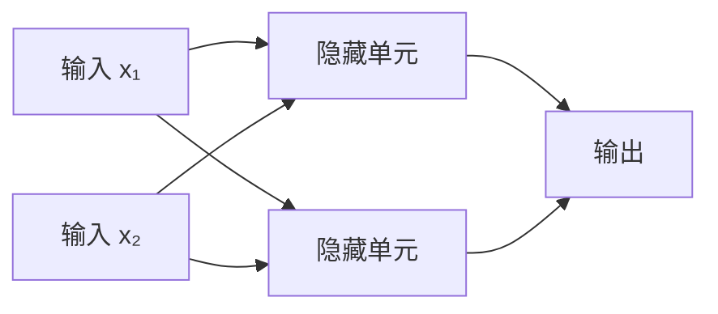
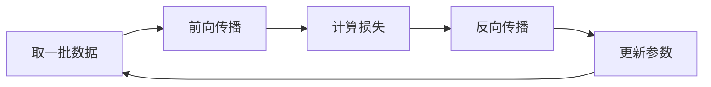
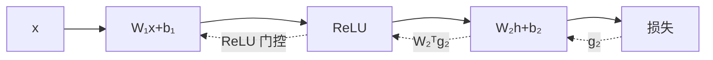
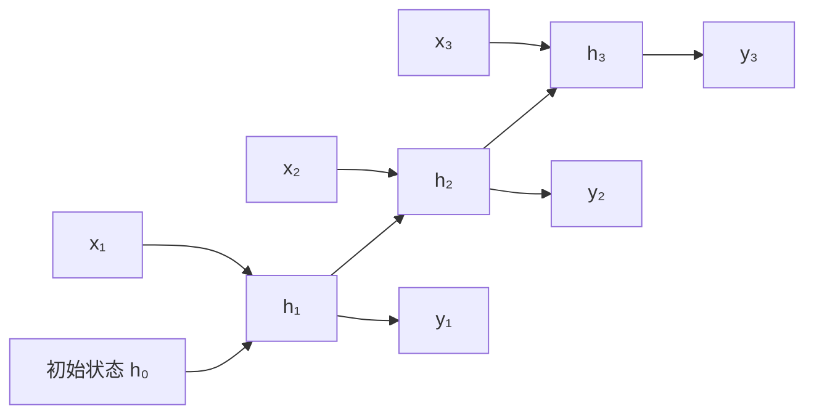
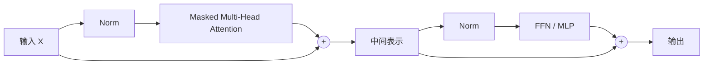

# 深度学习快速入门：从神经网络到 Transformer

> 目标：快速理解深度学习是什么、神经网络怎样训练，以及 CNN、Transformer、迁移学习等核心方法解决什么问题。  
> 深度：入门够用，不追求复杂数学推导；代码用于建立直觉。  
> 前置阅读：[机器学习快速入门：从基本概念到完整实践](%E6%9C%BA%E5%99%A8%E5%AD%A6%E4%B9%A0%E5%BF%AB%E9%80%9F%E5%85%A5%E9%97%A8%EF%BC%9A%E4%BB%8E%E5%9F%BA%E6%9C%AC%E6%A6%82%E5%BF%B5%E5%88%B0%E5%AE%8C%E6%95%B4%E5%AE%9E%E8%B7%B5.md)（先掌握训练/验证/测试集、过拟合、评价指标等基础）。  
> 语言基础：需要能读懂 Python 和简单的 PyTorch 代码；Python 基础不牢可读《Python 实用入门与 AI 开发：语法、API、并发及工程实践》，Token、Embedding、RAG 等概念可查该书第 36 章术语表。

### 怎么用这份笔记

- **建立主线**：按第 1 → 16 章顺序读，前 4 章是最重要的地基；
- **动手验证**：第 4 章完整训练流程、第 5.9 节 Fashion-MNIST、第 6.14 节最小 Transformer 都值得亲手跑一遍；
- **看不懂公式**：先跳过，记住“它在负责什么”即可（第 1.3 节有数学直觉总览）；
- **做项目时**：按第 10 章的流程推进，训练出问题查第 9 章；
- **查速查**：任务选型看第 11 章，全部浓缩在第 17 章一页速记。

## 目录

- [1. 深度学习是什么](#1-深度学习是什么)
- [2. 神经网络的基本结构](#2-神经网络的基本结构)
- [3. 神经网络怎样学习](#3-神经网络怎样学习)
- [4. 一个完整的 PyTorch 训练流程](#4-一个完整的-pytorch-训练流程)
- [5. CNN：理解图像](#5-cnn理解图像)
- [6. 序列模型与 Transformer](#6-序列模型与-transformer)
- [7. Embedding 与表示学习](#7-embedding-与表示学习)
- [8. 迁移学习与预训练模型](#8-迁移学习与预训练模型)
- [9. 训练中常见问题](#9-训练中常见问题)
- [10. 深度学习项目流程](#10-深度学习项目流程)
- [11. 常见任务与模型选择](#11-常见任务与模型选择)
- [12. 生成模型](#12-生成模型)
- [13. 图神经网络与多模态学习](#13-图神经网络与多模态学习)
- [14. 训练效率、模型压缩与部署](#14-训练效率模型压缩与部署)
- [15. 可解释性、鲁棒性与安全](#15-可解释性鲁棒性与安全)
- [16. 学习路线](#16-学习路线)
- [17. 一页速记](#17-一页速记)

---

### 章节导读：先看这张表

| 章节 | 回答的核心问题 | 关键概念 |
|---|---|---|
| 1. 深度学习是什么 | 它和传统机器学习有什么不同？ | 表示学习、归纳偏置、端到端 |
| 2. 神经网络的基本结构 | 网络由什么组成？ | 神经元、层、激活函数、张量、初始化 |
| 3. 神经网络怎样学习 | 训练循环里发生了什么？ | 前向/反向传播、损失、优化器、学习率 |
| 4. 完整 PyTorch 流程 | 一个训练脚本长什么样？ | Dataset/DataLoader、训练/验证/测试、checkpoint |
| 5. CNN | 图像怎么处理？ | 卷积、池化、感受野、ResNet、检测/分割 |
| 6. 序列模型与 Transformer | 序列和文本怎么建模？ | RNN/LSTM、注意力、Self-Attention、Mask、KV Cache |
| 7. Embedding 与表示学习 | 对象怎么变成向量？ | 向量语义、对比学习、向量检索 |
| 8. 迁移学习与预训练 | 数据少怎么办？ | 特征提取、微调、LoRA、数据增强 |
| 9. 训练中常见问题 | 训练不收敛怎么办？ | 过拟合、梯度异常、NaN、复现 |
| 10. 项目流程 | 一个 DL 项目怎么推进？ | 基线、指标、消融、漂移、实验管理 |
| 11. 任务与模型选择 | 我的任务该用什么？ | 按任务查表 |
| 12. 生成模型 | 怎样生成新样本？ | 自回归、VAE、GAN、扩散 |
| 13. GNN 与多模态 | 非表格/非单模态怎么办？ | 图消息传递、多模态对齐、多任务 |
| 14. 训练效率与部署 | 显存不够、上线怎么办？ | 混合精度、并行、量化、剪枝蒸馏 |
| 15. 可解释性与安全 | 模型可靠吗？ | 解释方法、对抗样本、隐私、公平 |
| 16. 学习路线 | 下一步学什么？ | 四阶段路线与练习 |
| 17. 一页速记 | 全部浓缩成什么？ | 关键概念清单 |

---

## 1. 深度学习是什么

深度学习是机器学习的一部分，主要使用多层神经网络从数据中自动学习特征和预测规则。

传统机器学习常由人先设计特征：

```text
原始图片 → 人工提取边缘/纹理 → 分类器 → 类别
```

深度学习希望端到端学习：

```text
原始图片 → 多层神经网络 → 自动形成特征 → 类别
```

低层网络可能学习边缘和颜色，中层组合成纹理和局部形状，高层进一步识别眼睛、轮廓或完整物体。这种逐层形成表示的能力，称为**表示学习**。

### 1.1 深度学习为什么有效

主要原因包括：

- 多层非线性变换可以表达复杂函数；
- 大量数据使模型能学习稳定规律；
- GPU/加速器适合大规模矩阵运算；
- 反向传播能高效计算大量参数的梯度；
- 预训练模型可以把通用知识迁移到小数据任务。

深度学习并不总是最佳选择。对于规模较小的结构化表格数据，逻辑回归、随机森林和梯度提升树通常更容易训练和解释。

### 1.2 常见应用

- 图像分类、目标检测、图像生成；
- 语音识别、语音合成；
- 文本分类、翻译、问答和大语言模型；
- 推荐、搜索和广告排序；
- 时间序列预测、异常检测；
- 多模态理解与生成。

---

### 1.3 入门所需的数学直觉

深度学习需要的数学可以边实践边补，不必先学完高等数学。但以下概念必须知道它们在模型中负责什么。

#### 线性代数

向量表示一个样本或特征，矩阵表示一批样本、线性层权重或多个向量。矩阵乘法不是逐元素相乘，而是把输入特征按权重组合成新特征。

若输入 $X$ 形状为 `[B, d_in]`，权重 $W$ 为 `[d_in, d_out]`，则：

$$
Y=XW+b
$$

输出形状为 `[B, d_out]`。绝大多数神经网络层最终都能分解为矩阵乘法、逐元素运算、归一化和数据重排。

#### 微积分

导数表示输出对输入变化的敏感程度，偏导数表示多参数函数对其中一个参数的敏感程度。梯度把所有参数的偏导数组成向量，指出损失增长最快的方向。

链式法则负责把后层误差传回前层。若 $y=f(g(x))$，则：

$$
\frac{dy}{dx}=\frac{dy}{dg}\frac{dg}{dx}
$$

反向传播就是在计算图上高效重复应用链式法则。

#### 概率统计

模型输出概率、损失、采样和不确定性都依赖概率。期望表示长期平均，方差表示波动，最大似然把“让训练数据出现概率最大”转成优化目标。交叉熵可从最大似然推导出来，并非任意选择的公式。

训练集指标是有限样本估计，存在随机波动。随机种子只能帮助复现一次实验，不能证明结论稳定，因此还需要验证集、重复实验和置信区间。

### 1.4 深度学习中的归纳偏置

归纳偏置是模型对规律形式的预设。没有任何偏置，有限数据无法决定应学哪种规律。

- CNN 假设局部区域相关，并让特征探测器在空间共享；
- RNN 假设相同状态转移可在各时间步复用；
- Transformer 假设位置之间可以通过注意力动态交互；
- GNN 假设节点可从邻居聚合信息；
- 数据增强假设某些变换不改变标签。

模型选择本质上是在选择适合数据结构的归纳偏置。数据量巨大时，模型可从数据中学习更多结构；数据少时，合适的偏置尤其重要。

---
## 2. 神经网络的基本结构

### 2.1 一个神经元

神经元先对输入进行加权求和，再通过激活函数：

$$
z=w_1x_1+w_2x_2+\cdots+w_dx_d+b
$$

$$
h=\sigma(z)
$$

- $x$：输入特征；
- $w$：每个特征的权重；
- $b$：偏置；
- $\sigma$：激活函数；
- $h$：神经元输出。

单个神经元与线性模型很相似。神经网络的能力来自大量神经元、多层组合和非线性激活。

### 2.2 网络的层



- 输入层接收数据；
- 隐藏层学习中间表示；
- 输出层产生最终结果。

“深度”通常指隐藏层较多。网络更深可以表达复杂的层级关系，但也更难训练，并需要更多数据与算力。

### 2.3 为什么需要激活函数

如果每层都只做线性运算，多层线性变换仍等价于一层线性变换。激活函数引入非线性，使网络能拟合曲线和复杂决策边界。

把这句话写成代数会更直观。若两层都没有激活函数：

$$
y=W_2(W_1x+b_1)+b_2=(W_2W_1)x+(W_2b_1+b_2)
$$

令 $W'=W_2W_1$、$b'=W_2b_1+b_2$，两层就被合并成了 $y=W'x+b'$。无论叠多少个纯线性层，最终仍只能形成一个线性决策边界。ReLU、GELU 等非线性函数像“可弯折的连接点”，让网络能用许多局部线性片段逼近复杂函数。

| 激活函数 | 特点 | 常见位置 |
|---|---|---|
| ReLU | $\max(0,x)$，简单高效 | 隐藏层 |
| GELU | 平滑，Transformer 常用 | Transformer 隐藏层 |
| Sigmoid | 每个值独立压缩到 0～1 | 二分类、多标签分类的概率转换 |
| Softmax | 一组输出联合归一化，概率和为 1 | 互斥多分类的概率转换 |

分类训练时，损失函数通常已经包含 Sigmoid 或 Softmax 的数值稳定实现，不要无条件重复添加。

需要特别注意：Sigmoid 和 Softmax 更准确地说是**输出到概率的映射**，不应与隐藏层中的逐元素激活完全混为一谈。

| 任务 | 模型原始输出 | 标签 | 训练损失 | 展示概率时 |
|---|---|---|---|---|
| 单标签二分类 | `[B]` 或 `[B,1]` 的一个 logit | 0/1 浮点数 | `BCEWithLogitsLoss` | `sigmoid(logits)` |
| 互斥多分类 | `[B,C]`，每类一个 logit | `[B]` 类别编号 | `CrossEntropyLoss` | `softmax(logits, dim=-1)` |
| 多标签分类 | `[B,C]`，每类独立判断 | `[B,C]` 的 0/1 | `BCEWithLogitsLoss` | 对每类做 `sigmoid` |

`CrossEntropyLoss` 内部已经组合 `log_softmax` 与负对数似然；`BCEWithLogitsLoss` 内部组合 Sigmoid 与二元交叉熵。训练前手动再做一次概率转换，不仅重复，还可能降低数值稳定性。

### 2.4 张量 Tensor

张量是深度学习的基本数据结构，可以理解为多维数组：

```text
标量：0 维
向量：1 维
矩阵：2 维
一批彩色图片：[batch, channel, height, width]
文本 Token：[batch, sequence_length]
```

深度学习代码常见错误来自形状不匹配。阅读网络时，应始终跟踪每层输入和输出的 shape。

---

### 2.5 权重初始化为什么重要

网络开始训练前必须给权重一个初始值。如果所有神经元权重都初始化为相同值，它们会得到相同梯度、学习相同特征，这称为对称性问题。随机初始化打破对称性，但范围也不能随意选择。

权重过大时，激活和梯度可能在层间快速放大；权重过小时，信号和梯度可能逐层衰减。常见初始化根据输入/输出维度控制方差：

- Xavier/Glorot 初始化常与 Tanh、Sigmoid 等配合；
- He/Kaiming 初始化常与 ReLU 系列配合；
- 预训练模型通常直接加载已有权重，不重新随机初始化主干。

偏置常初始化为 0 不会造成同样的对称性问题，因为随机权重已经让不同神经元产生差异。

### 2.6 常见激活函数的边界

**Sigmoid** 将值压到 0～1，适合二分类概率输出。但输入绝对值很大时梯度接近 0，深层隐藏层容易梯度消失，而且输出不是以 0 为中心。

**Tanh** 输出 -1～1，中心性更好，但大输入仍会饱和。它在早期 RNN 中常见。

**ReLU** 计算简单，正区间梯度稳定，是 CNN 和普通 MLP 的常用起点。但神经元若长期处于负区间，输出和梯度都为 0，可能成为“死亡 ReLU”。LeakyReLU、ELU 等允许负区间保留少量梯度。

**GELU** 平滑地按输入大小控制通过比例，Transformer 中很常见。激活函数不是越复杂越好，应与网络结构、初始化和实验结果一起选择。

### 2.7 归一化层在归一化什么

输入标准化处理数据集字段；BatchNorm、LayerNorm 等处理网络内部激活，二者不是一回事。

它们都做类似“减均值、除标准差、再缩放平移”的操作：

$$
\hat x=\frac{x-\mu}{\sqrt{\sigma^2+\epsilon}},\qquad
y=\gamma\hat x+\beta
$$

区别在于 $\mu$、$\sigma^2$ 按哪个维度统计：

- BatchNorm：对每个通道，在一个 mini-batch 内按 N/H/W 统计；训练用当前 batch 统计量，推理用训练期累计的 running stats，因此必须正确调用 `train()`/`eval()`；
- LayerNorm：在单个样本的最后一个特征维上归一化，不依赖 batch 内其他样本；Transformer 中每个 Token 沿 $d_{model}$ 维归一化；
- GroupNorm：在单个样本内把通道分成若干组统计，batch 很小时比 BatchNorm 更稳定。

归一化能改善优化条件、允许更稳定的训练，但不是万能正则化。批量太小、数据分布特殊或训练/推理状态错误时，BatchNorm 可能产生问题。

---
## 3. 神经网络怎样学习

训练循环可以概括为五步：



### 3.1 前向传播

输入依次经过各层，得到预测。此时网络只使用当前参数计算，没有学习。

### 3.2 损失函数

损失函数衡量预测与真实答案之间的差距：

- 回归：MSE、MAE；
- 二分类：Binary Cross Entropy；
- 多分类：Cross Entropy。

损失越小，表示模型在当前训练目标下预测得越好。但训练损失小不代表新数据表现好。

### 3.2.1 常见损失函数为什么这样设计

#### 回归损失

MSE 对误差平方，因此大误差会获得更大梯度。它在误差近似高斯分布时具有概率解释，但对异常值敏感。

MAE 对每个误差线性惩罚，对异常值更稳健，但在 0 点不可导，优化也可能不如 MSE 平滑。Huber Loss 在误差小时使用平方、误差大时改用线性，在稳定优化和鲁棒性之间折中。

#### 分类交叉熵

二分类交叉熵：

$$
L=-[y\log p+(1-y)\log(1-p)]
$$

正确类别概率越接近 1，损失越小；模型自信地预测错误时，损失会非常大。多分类交叉熵只关心真实类别对应的 Softmax 概率。

PyTorch 的 `CrossEntropyLoss` 接收 logits 和整数类别 ID，内部完成 LogSoftmax 与 NLLLoss。`BCEWithLogitsLoss` 将 Sigmoid 与二分类交叉熵合并，数值上比手动组合稳定。

#### 类别不平衡与 Focal Loss

类别权重可以让少数类错误占更大损失。Focal Loss 进一步降低容易样本的贡献，让训练更关注困难样本，目标检测中常见。但困难样本也可能是错标数据，过度强调会放大标签噪声。

#### 度量学习损失

Contrastive Loss、Triplet Loss 等直接塑造向量距离。Triplet 包含 Anchor、Positive 和 Negative，希望 Anchor 与 Positive 比 Negative 至少近一个 margin。样本对和困难负样本的选择往往比公式本身更影响效果。

### 3.2.2 损失、指标与业务目标不是同一个东西

损失需要可微且适合优化；评价指标可以不可微，例如准确率、F1、mAP；业务目标可能是收入、风险或用户满意度。

训练交叉熵下降不保证 F1 一定上升，也不保证业务收益增加。正确流程是选择可优化的代理损失，在验证集上观察任务指标，再用线上或业务评价确认真实价值。

### 3.3 反向传播

反向传播使用链式法则，从损失开始反向计算每个参数对损失的影响，即梯度。自动微分框架会保存前向计算图并自动完成求导。

反向传播负责**计算梯度**；SGD、Adam 等优化器负责**利用梯度更新参数**。二者不是同一件事。

### 3.3.1 通过一个两层网络理解链式法则

假设网络为：

$$
z_1=W_1x+b_1,\quad h=ReLU(z_1),\quad z_2=W_2h+b_2
$$

设上游输出梯度为 $g_2=\partial L/\partial z_2$。在列向量约定下：

$$
\frac{\partial L}{\partial W_2}=g_2h^T,\quad
\frac{\partial L}{\partial h}=W_2^Tg_2,\quad
\frac{\partial L}{\partial b_2}=g_2
$$

经过 ReLU 时，负输入处的局部导数为 0：

$$
g_1=\frac{\partial L}{\partial z_1}
=\frac{\partial L}{\partial h}\odot\mathbf{1}(z_1>0)
$$

$$
\frac{\partial L}{\partial W_1}=g_1x^T,\quad
\frac{\partial L}{\partial x}=W_1^Tg_1,\quad
\frac{\partial L}{\partial b_1}=g_1
$$

转置保证矩阵方向正确，每个参数梯度的 shape 必须与参数自身一致。反向传播只计算梯度；优化器才使用梯度更新参数。



令 $w=2$、$x=3$、目标 $y=7$，$L=(wx-y)^2=1$，手算得：

$$
\frac{\partial L}{\partial w}=2(wx-y)x=-6
$$

```python
import torch
w = torch.tensor(2.0, requires_grad=True)
loss = (w * torch.tensor(3.0) - 7.0) ** 2
loss.backward()
print(w.grad)  # tensor(-6.)
```

梯度为负说明当前应增大 $w$。若学习率 0.1，SGD 更新为 $w\leftarrow2-0.1\times(-6)=2.6$。牢记顺序：**zero_grad()** 清旧梯度，**backward()** 算新梯度，**step()** 更新参数。

### 3.4 参数更新

最基本的梯度下降更新：

$$
\theta \leftarrow \theta-\alpha\nabla_\theta L
$$

$\alpha$ 是学习率。过大可能震荡或发散，过小则训练很慢。

### 3.4.1 为什么参数更新要在 `no_grad` 语义下进行

优化器更新参数本身不应成为下一次求导图的一部分。PyTorch 优化器内部会在不记录梯度的上下文中修改参数。若手写 `param -= lr * param.grad` 而不关闭梯度记录，可能触发叶子 Tensor 原地修改错误或建立不需要的图。

---
### 3.5 Epoch、Batch 与 Step

- Epoch：完整遍历一次训练集；
- Batch：一次送入网络的一小批样本；
- Step/Iteration：进行一次参数更新。

训练集有 10,000 个样本，batch size 为 100，则一个 epoch 约有 100 个 step。

---

### 3.6 SGD、Momentum 与 Adam

最基础的 SGD 直接沿当前 mini-batch 的负梯度前进。mini-batch 带来噪声，有时能帮助跳出尖锐区域，但也会使损失抖动。

Momentum 累积过去梯度形成“速度”：

$$
v_t=\mu v_{t-1}+g_t,\qquad
\theta\leftarrow\theta-\alpha v_t
$$

在方向持续一致时加速，在来回震荡方向上抵消部分波动。可以想象小球在谷底滚动，惯性帮助它沿主要下降方向前进。

Adam 同时维护梯度的一阶矩和二阶矩估计：

$$
m_t=\beta_1 m_{t-1}+(1-\beta_1)g_t,\qquad
v_t=\beta_2 v_{t-1}+(1-\beta_2)g_t^2
$$

$$
\hat m_t=\frac{m_t}{1-\beta_1^t},\qquad
\hat v_t=\frac{v_t}{1-\beta_2^t},\qquad
\theta\leftarrow\theta-\alpha\frac{\hat m_t}{\sqrt{\hat v_t}+\epsilon}
$$

它为不同参数自适应调整步长，是快速得到可用结果的良好起点，尤其在 Transformer 中常用。普通 SGD 中 L2 正则与 Weight Decay 近似等价，但在 Adam 中并不等价，因此实践中常用 AdamW 把权重衰减与梯度更新解耦。SGD 配合 Momentum 在一些视觉任务中可能获得更好的最终泛化。

不存在所有任务都最好的优化器。比较时应让学习率和调度策略得到合理设置，否则只是比较默认参数。

### 3.7 学习率调度与 Warmup

训练早期参数随机、梯度不稳定，Transformer 常先从很小学习率逐步升高，这叫 Warmup。之后可以：

- Step Decay：每隔若干轮降低；
- Cosine Annealing：按余弦曲线平滑下降；
- ReduceLROnPlateau：验证指标停止改善时降低；
- OneCycle：先升后降，在一个训练周期内大范围变化。

学习率调度器改变的是优化路径，不会修复错误标签、数据泄漏或输出维度错误。

### 3.8 计算图与自动微分

PyTorch 在执行 Tensor 运算时动态记录操作和依赖关系，形成计算图。`loss.backward()` 从损失节点反向应用链式法则，把梯度累积到叶子参数的 `.grad` 中。

某些操作会破坏梯度链，例如把 Tensor 转为 NumPy、调用 `.detach()`，或在错误位置使用 `no_grad()`。原地修改也可能覆盖反向传播需要的中间值。遇到参数不更新时，应检查 `requires_grad`、`.grad`、损失是否依赖参数，以及优化器是否包含这些参数。

### 3.9 梯度累积与梯度裁剪

显存放不下大 batch 时，可对多个小 batch 反向传播后再执行一次 `optimizer.step()`，这叫梯度累积。累积时通常要把损失除以累积步数，才能保持大致相同的梯度尺度。

梯度裁剪限制梯度范数或单个值，用于缓解 RNN、Transformer 等训练中的梯度爆炸。裁剪能防止一次异常更新破坏模型，但若每一步都严重裁剪，说明学习率、数据或模型可能存在更根本的问题。

---
## 4. 一个完整的 PyTorch 训练流程

下面用二维人工数据完成二分类，并完整展示训练集、验证集、最佳权重与测试集。重点是理解流程，而不是数据本身。

```python
import copy
import torch
from torch import nn
from torch.utils.data import DataLoader, TensorDataset, random_split

torch.manual_seed(42)

# 1. 构造数据并划分；真实项目应在任何训练前完成划分
X = torch.randn(1000, 2)
y = (X[:, 0] + X[:, 1] > 0).long()
dataset = TensorDataset(X, y)
train_set, valid_set, test_set = random_split(
    dataset, [700, 150, 150],
    generator=torch.Generator().manual_seed(42),
)
train_loader = DataLoader(train_set, batch_size=32, shuffle=True)
valid_loader = DataLoader(valid_set, batch_size=64)
test_loader = DataLoader(test_set, batch_size=64)

# 2. 选择设备；先移动模型，再创建优化器
if torch.cuda.is_available():
    device = torch.device("cuda")
elif torch.backends.mps.is_available():
    device = torch.device("mps")
else:
    device = torch.device("cpu")

model = nn.Sequential(
    nn.Linear(2, 16),
    nn.ReLU(),
    nn.Linear(16, 2),       # 两个类别的原始 logits
).to(device)
loss_fn = nn.CrossEntropyLoss()
optimizer = torch.optim.Adam(model.parameters(), lr=1e-3)

# 3. 单独定义评价函数，验证和测试都不更新参数
def evaluate(loader):
    model.eval()
    total_loss, total_correct, total_count = 0.0, 0, 0
    with torch.no_grad():
        for batch_X, batch_y in loader:
            batch_X, batch_y = batch_X.to(device), batch_y.to(device)
            logits = model(batch_X)
            total_loss += loss_fn(logits, batch_y).item() * len(batch_X)
            total_correct += (logits.argmax(dim=1) == batch_y).sum().item()
            total_count += len(batch_X)
    return total_loss / total_count, total_correct / total_count

# 4. 训练并按验证损失保存最佳权重
best_valid_loss = float("inf")
best_state = None

for epoch in range(20):
    model.train()
    for batch_X, batch_y in train_loader:
        batch_X, batch_y = batch_X.to(device), batch_y.to(device)
        optimizer.zero_grad()
        loss = loss_fn(model(batch_X), batch_y)
        loss.backward()
        optimizer.step()

    valid_loss, valid_acc = evaluate(valid_loader)
    if valid_loss < best_valid_loss:
        best_valid_loss = valid_loss
        best_state = copy.deepcopy(model.state_dict())

    if epoch % 5 == 0:
        print(epoch, "valid_loss=", round(valid_loss, 4),
              "valid_acc=", round(valid_acc, 4))

# 5. 恢复验证集最优权重，只在方案确定后评价测试集
model.load_state_dict(best_state)
test_loss, test_acc = evaluate(test_loader)
print("test_loss=", round(test_loss, 4), "test_acc=", round(test_acc, 4))
```

### 4.1 最容易忽略的几行

- `optimizer.zero_grad()`：PyTorch 默认累加梯度，不清零会把多批梯度混在一起；
- `model.train()`：启用 Dropout、BatchNorm 的训练行为；
- `model.eval()`：切换到推理行为；
- `torch.no_grad()`：推理时不保存求导图，减少内存；
- `CrossEntropyLoss` 接收原始 logits，不需要先手动 Softmax。

这个例子使用人工随机数据，因此随机划分是合理的。若是时间序列、同一用户的多条记录或同一患者的多张图片，应按时间或实体分组划分，不能直接使用 `random_split`。

这里用 `copy.deepcopy()` 在内存中保存最佳参数，适合小示例。大型模型应将 checkpoint 写入文件，并同时保存优化器、调度器、epoch 和混合精度状态，以便恢复训练。

---

### 4.2 Dataset 与 DataLoader 的职责

`Dataset` 定义“第 i 个样本怎样读取和变换”，`DataLoader` 负责打乱、批处理、并行加载和拼接。大数据集不应一次全部读入内存，而应按需读取。

训练集通常 `shuffle=True`，减少样本固定顺序带来的偏差；验证和测试不需要打乱。图像增强只应用于训练 Dataset，验证集使用固定变换，否则每次评价的数据都不同。

### 4.3 一个更可靠的训练循环需要什么

教学代码省略了验证与保存。真实训练通常还要：

1. 每个 epoch 在验证集上计算指标；
2. 保存验证指标最好的 checkpoint，而不是只保存最后一轮；
3. 记录训练/验证损失、学习率和耗时；
4. 使用 Early Stopping 防止继续过拟合；
5. 遇到 NaN、显存不足或中断时能恢复；
6. 最终只在测试集上评价一次。

Checkpoint 除模型参数外，若要继续训练还应包含优化器、调度器、epoch、随机状态和混合精度 scaler。

### 4.4 Device 与数据搬运

模型、输入和标签必须位于兼容设备。上面的完整示例已经按 CUDA → Apple MPS → CPU 的顺序选择设备，并在创建优化器前执行 `.to(device)`。这是更稳妥的顺序，因为优化器应持有最终设备上的模型参数。

GPU 训练的数据通常先由 CPU DataLoader 读取，再传到显存。CUDA 环境可以为 DataLoader 设置 `pin_memory=True`，并在 `.to(device, non_blocking=True)` 时尝试异步搬运；只有硬件、固定内存和计算重叠条件合适时才会提速。频繁把 Tensor 在 CPU 和 GPU 之间来回移动，通常会抵消加速收益。

---
## 5. CNN：理解图像

全连接网络把每个像素独立连接到下一层，会产生大量参数，也忽略图像的空间邻近关系。卷积神经网络（CNN）使用小型卷积核在图像上滑动，提取局部模式。

### 5.1 卷积的直觉

一个卷积核可看作小型特征探测器。某些核对水平边缘响应强，另一些核对纹理、颜色或角点响应强。卷积核参数由训练学习，不需要人工指定。

CNN 有两个关键特点：

- 局部连接：每次只观察邻近区域；
- 参数共享：同一个卷积核在整张图上使用。

这让 CNN 参数更少。更准确地说，理想卷积具有**平移等变性**：输入移动，特征图也相应移动；池化、步幅、全局汇聚和数据增强才带来一定的平移不变性，边界与下采样还会破坏严格等变。

#### 一次卷积实际算了什么

对 $5\times5$ 单通道输入取左上角 $3\times3$ 区域：

$$
X=\begin{bmatrix}1&2&0\\0&1&3\\2&1&0\end{bmatrix},\qquad
K=\begin{bmatrix}1&0&-1\\1&0&-1\\1&0&-1\end{bmatrix}
$$

对应输出值是逐元素乘积之和：

$$
(1\times1+2\times0+0\times(-1))+(0\times1+1\times0+3\times(-1))+(2\times1+1\times0+0\times(-1))=0
$$

卷积核继续滑到下一区域，重复同一组参数。PyTorch 的 **Conv2d** 数学上实际执行互相关（不翻转核），但深度学习中习惯仍称卷积。

多通道输入时，一个普通输出通道并非只看一个输入通道：它对所连接的每个输入通道分别卷积，再求和并加 bias。若输入 RGB、输出 16 通道，则有 16 组探测器，每组通常同时读取 R/G/B 三个通道；Depthwise Convolution 才是每个通道独立进行空间卷积。

### 5.2 常见结构

```text
图片 → Conv → ReLU → Pool/Stride
     → Conv → ReLU → 全局池化/全连接 → 类别
```

- Channel：不同特征图；
- Kernel Size：卷积核尺寸；
- Stride：每次移动步长；
- Padding：边缘填充；
- Pooling：压缩空间尺寸、扩大感受野。

随着层数增加，单个神经元间接观察的原图范围扩大，这称为感受野。

### 5.3 图像任务

- 图像分类：整张图是什么；
- 目标检测：有哪些物体、在哪里；
- 语义分割：每个像素属于什么类别；
- 实例分割：进一步区分同类的不同物体。

现代视觉模型也大量使用 Vision Transformer，但 CNN 的局部结构和高效性仍很重要。

---

### 5.4 卷积输出尺寸怎样计算

对单个空间维度，输入大小为 $H$、卷积核为 $K$、Padding 为 $P$、Stride 为 $S$、Dilation 为 $D$ 时，输出大小为：

$$
\left\lfloor\frac{H+2P-D(K-1)-1}{S}+1\right\rfloor
$$

Stride 增大通常降低空间分辨率；Padding 可控制边缘和尺寸；Dilation 在不增加参数量的情况下扩大采样范围。输出通道数由显式超参数 `out_channels` 决定，与输入宽高无关；`groups` 决定输入、输出通道怎样分组连接，不能把二者混为一谈。

卷积层参数量约为：

$$
C_{out}\left(\frac{C_{in}}{groups}K_hK_w+1\right)
$$

公式假设启用了 bias；若 `bias=False`，去掉最后的 1。普通卷积 `groups=1`；深度卷积通常令 `groups=C_in`。参数量不随图片宽高变化，这是参数共享的直接结果。

### 5.5 为什么需要残差连接 ResNet

网络变深后，理论表达能力增强，但普通深层网络可能比浅层更难优化。残差块不直接学习目标映射 $H(x)$，而是学习残差 $F(x)=H(x)-x$：

$$
y=F(x)+x
$$

跳跃连接为信息和梯度提供直接通路，使网络更容易学习“保持不变”或小幅修正。残差连接后来也成为 Transformer 等深层架构的重要组成。

若输入和输出形状不同，需要用投影或下采样对齐后才能相加。

### 5.6 一个小型 CNN 的形状变化

```python
import torch
from torch import nn

cnn = nn.Sequential(
    nn.Conv2d(3, 16, kernel_size=3, padding=1),  # [B,3,32,32] -> [B,16,32,32]
    nn.ReLU(),
    nn.MaxPool2d(2),                             # -> [B,16,16,16]
    nn.Conv2d(16, 32, kernel_size=3, padding=1),  # -> [B,32,16,16]
    nn.ReLU(),
    nn.AdaptiveAvgPool2d((1, 1)),               # -> [B,32,1,1]
    nn.Flatten(),                                # -> [B,32]
    nn.Linear(32, 10),                           # 10 类 logits
)

x = torch.randn(8, 3, 32, 32)
print(cnn(x).shape)  # torch.Size([8, 10])
```

`AdaptiveAvgPool2d((1,1))` 对每个通道汇总空间信息，使分类头不强依赖固定图片尺寸。真正视觉项目通常优先使用预训练 ResNet、EfficientNet 或 ViT，而不是从零训练这个小网络。

### 5.7 目标检测的核心概念

检测模型同时回答“是什么”和“在哪里”。输出通常包括边界框、类别和置信度。

- IoU 衡量预测框与真实框的重叠程度；
- NMS 删除大量指向同一物体的重复框；
- Anchor-based 方法从预设框调整位置，Anchor-free 方法直接预测中心或边界；
- AP 是在给定类别与 IoU 判定标准下，随置信度阈值变化得到的 PR 曲线面积；COCO mAP 再对类别及 IoU=0.50:0.95 的多个阈值平均。

一阶段检测器直接密集预测，通常速度快；二阶段检测器先产生候选区域再分类回归，通常更精细。现代架构边界正在融合，选型应看数据、速度和精度要求。

### 5.8 语义分割与实例分割

语义分割为每个像素预测类别，但不区分同类不同实例；实例分割还要分别标出每个物体。医学图像、遥感和自动驾驶常用。

分割需要保留或恢复空间分辨率，常见 Encoder-Decoder、跳跃连接和上采样结构。指标包括像素准确率、IoU、Dice。类别区域很小时，仅看像素准确率会被大面积背景掩盖。

---
### 5.9 实战：Fashion-MNIST 图像分类

Fashion-MNIST 包含 28×28 灰度服饰图片，共 10 类。下面示例从官方训练集划出验证集；每轮只看验证集，恢复验证集最优权重后才评价一次测试集。首次运行会下载数据。

```python
import torch
from torch import nn
from torch.utils.data import DataLoader, random_split
from torchvision import datasets, transforms
import copy

# ToTensor 将像素转到 0～1；Normalize 再将其中心化
transform = transforms.Compose([
    transforms.ToTensor(),
    transforms.Normalize((0.5,), (0.5,)),
])
full_train = datasets.FashionMNIST("data", train=True, download=True, transform=transform)
test_set = datasets.FashionMNIST("data", train=False, download=True, transform=transform)
generator = torch.Generator().manual_seed(42)
train_set, val_set = random_split(full_train, [54000, 6000], generator=generator)
train_loader = DataLoader(train_set, batch_size=128, shuffle=True)
val_loader = DataLoader(val_set, batch_size=256)
test_loader = DataLoader(test_set, batch_size=256)

device = torch.device("cuda" if torch.cuda.is_available() else "cpu")
model = nn.Sequential(
    nn.Conv2d(1, 16, 3, padding=1), nn.ReLU(), nn.MaxPool2d(2),
    nn.Conv2d(16, 32, 3, padding=1), nn.ReLU(), nn.MaxPool2d(2),
    nn.Flatten(),
    nn.Linear(32 * 7 * 7, 10),
).to(device)
loss_fn = nn.CrossEntropyLoss()
optimizer = torch.optim.Adam(model.parameters(), lr=1e-3)

def accuracy(loader):
    model.eval()
    correct = total = 0
    with torch.no_grad():
        for images, labels in loader:
            images, labels = images.to(device), labels.to(device)
            correct += (model(images).argmax(1) == labels).sum().item()
            total += labels.numel()
    return correct / total

best_val, best_state = -1.0, None
for epoch in range(3):
    model.train()
    for images, labels in train_loader:
        images, labels = images.to(device), labels.to(device)
        optimizer.zero_grad()
        loss = loss_fn(model(images), labels)
        loss.backward()
        optimizer.step()

    val_acc = accuracy(val_loader)
    if val_acc > best_val:
        best_val = val_acc
        best_state = copy.deepcopy(model.state_dict())
    print(f"epoch={epoch + 1}, val_accuracy={val_acc:.4f}")

model.load_state_dict(best_state)
print(f"test_accuracy={accuracy(test_loader):.4f}")
```

代码明确分开了验证集与测试集。实际项目还应将训练轮数增大，并用 patience、min_delta 与最佳 checkpoint 实现 Early Stopping；不能为了得到更好数字而反复查看测试集。

这个网络经过两次 `MaxPool2d(2)`，空间尺寸从 28×28 变为 14×14，再变为 7×7，因此全连接层输入是 `32 × 7 × 7`。若更换输入分辨率，可使用自适应池化避免手工计算尺寸。

---
### 5.10 从 LeNet 到现代视觉网络

理解架构演进比背网络层数更重要：

- LeNet 证明卷积适合手写数字等图像任务；
- AlexNet 借助 GPU、ReLU、Dropout 和大数据推动深度视觉突破；
- VGG 使用重复的 $3\times3$ 卷积，结构规则但参数和计算量大；
- Inception 在同一层使用不同尺度分支，兼顾多尺度特征；
- ResNet 用残差连接让数十甚至数百层网络更易优化；
- DenseNet 让各层连接到后续多层，促进特征复用；
- MobileNet 使用深度可分离卷积，面向移动端效率；
- EfficientNet 系统地协调网络深度、宽度和输入分辨率；
- Vision Transformer 把图片切成 Patch，使用 Transformer 建模全局关系。

新架构通常是在表达能力、优化难度、计算量、显存和硬件效率之间重新权衡，而不是简单“层数更多”。

### 5.11 深度可分离卷积

标准卷积同时混合空间和通道。深度可分离卷积拆成两步：

1. Depthwise Convolution：每个输入通道独立做空间卷积；
2. Pointwise Convolution：用 $1\times1$ 卷积混合通道。

它显著减少参数和乘加运算，是 MobileNet 等轻量网络的重要组成。理论 FLOPs 降低不一定等比例转化为真实延迟下降，还取决于硬件内核和内存访问。

### 5.12 ViT 怎样处理图片

ViT 将图片切成固定大小 Patch，每个 Patch 展平后线性投影为 Token，加上位置与类别 Token，再送入 Transformer Encoder。

Patch 越小，序列越长、细节越丰富，但注意力成本更高。ViT 的局部归纳偏置比 CNN 弱，原始版本往往更依赖大规模预训练；现代混合架构、增强和训练方法已改善数据效率。

CNN 和 ViT 不是绝对替代关系。CNN 在小数据、边缘设备和局部特征任务中仍有优势；Transformer 更擅长统一架构和全局建模。

---
## 6. 序列模型与 Transformer

文本、语音、代码和时间序列都不是无序特征集合。“南京到北京”和“北京到南京”包含相同的词，却表达不同方向；模型必须同时理解内容与位置。本章先解释 RNN 为什么自然、又为什么困难，再逐步推导 Transformer 如何把“沿时间递归”改造成“所有位置直接交互”。

### 6.1 从 RNN 到 LSTM：顺序信息怎样传递

普通 RNN 在第 $t$ 个时间步读取当前输入 $x_t$ 与上一时刻隐藏状态 $h_{t-1}$：

$$
h_t=\tanh(W_xx_t+W_hh_{t-1}+b_h),\qquad y_t=W_yh_t+b_y
$$

隐藏状态可理解为“读到当前位置为止的压缩记忆”。同一组参数在所有时间步共享，所以参数量不随序列长度增加，也能处理变长序列。



同一结构可支持 many-to-one 情感分类、many-to-many 序列标注、Encoder-Decoder 翻译，也可在流式任务中复用旧隐藏状态。

#### 6.1.1 RNN 为什么难以记住很久以前的信息

训练 RNN 时使用沿时间反向传播（BPTT）。从较晚时间回到较早时间，梯度会反复乘 $W_h$ 和激活函数导数：

$$
\frac{\partial h_t}{\partial h_k}=\prod_{i=k+1}^{t}\frac{\partial h_i}{\partial h_{i-1}}
$$

若这些 Jacobian 的尺度长期小于 1，连乘趋近 0，早期信息几乎得不到训练信号，即梯度消失；长期大于 1 则可能梯度爆炸。梯度裁剪能限制爆炸，却不能恢复已经消失的梯度。

#### 6.1.2 LSTM 的门控到底在做什么

LSTM 增加细胞状态 $c_t$，用若干 0～1 的门决定信息流：

$$
f_t=\sigma(W_f[x_t;h_{t-1}]+b_f)
$$

$$
i_t=\sigma(W_i[x_t;h_{t-1}]+b_i),\qquad
\tilde c_t=\tanh(W_c[x_t;h_{t-1}]+b_c)
$$

$$
c_t=f_t\odot c_{t-1}+i_t\odot\tilde c_t
$$

$$
o_t=\sigma(W_o[x_t;h_{t-1}]+b_o),\qquad h_t=o_t\odot\tanh(c_t)
$$

遗忘门 $f_t$ 决定保留多少旧记忆；输入门 $i_t$ 控制写入多少候选信息；输出门 $o_t$ 决定暴露多少记忆。关键是 $c_t$ 中存在加法路径，梯度不必每一步都完全穿过一次 tanh，因此比普通 RNN 更容易保留长程信息。GRU 合并部分状态并减少门，参数更少，但优劣仍应实测。

```python
import torch
from torch import nn

lstm = nn.LSTM(input_size=16, hidden_size=32,
               num_layers=2, batch_first=True)
x = torch.randn(8, 20, 16)       # [B,T,D]
output, (h_n, c_n) = lstm(x)
print(output.shape)               # [8,20,32]
print(h_n.shape, c_n.shape)       # 均为 [2,8,32]
```

如果序列经过 Padding，不能盲目取 `output[:, -1]` 做分类，因为最后位置可能只是 PAD。应使用真实长度索引，或在分类时对每个样本取最后一个有效隐藏状态；`nn.LSTM` 本身不读取 Padding Mask，若要跳过 PAD 参与递归，应使用 `pack_padded_sequence`，或把 Mask 用于池化和损失。双向 RNN 能看未来，适合理解任务，却不适合因果生成和严格流式预测。

### 6.2 注意力：不再把整段序列压进一个状态

RNN 要让远处信息逐步经过中间状态。注意力允许当前位置直接从所有可见位置读取信息：

$$
Attention(Q,K,V)=softmax\left(\frac{QK^T}{\sqrt{d_k}}+M\right)V
$$

- Query：当前位置正在寻找什么；
- Key：每个位置用什么特征供别人匹配；
- Value：匹配成功后真正提供的内容。

三者都由输入经过可学习投影得到：$Q=XW_Q$、$K=XW_K$、$V=XW_V$。

#### 6.2.1 用极小数字例子走完注意力

若某个 Query 与两个 Key 的点积是 $[2,0]$，暂令缩放因子为 1：

$$
softmax([2,0])\approx[0.881,0.119]
$$

若两个 Value 是 $[10,0]$ 与 $[0,4]$，则输出为：

$$
0.881[10,0]+0.119[0,4]=[8.81,0.476]
$$

所以注意力不是“挑一个词”，而是对 Value 加权混合。权重反映一次信息聚合，不等价于严格的因果解释。

若 Q、K 各维方差相近，点积方差随 $d_k$ 增长。除以 $\sqrt{d_k}$ 能避免 Softmax 过早饱和，使训练更稳定。

### 6.3 Self-Attention 的 shape 一步步怎样变化

设输入 $X$ 为 `[B,N,d_model]`：

```text
X                  [B, N, d_model]
线性投影 Q,K,V      [B, N, d_model]
拆成 h 个头         [B, h, N, d_head]
Q @ Kᵀ             [B, h, N, N]
Softmax 后 @ V      [B, h, N, d_head]
拼接所有头           [B, N, d_model]
输出投影             [B, N, d_model]
```

$N\times N$ 矩阵第 $i$ 行表示第 $i$ 个 Query 对所有 Key 的读取权重。输出仍保留 N 个 Token，只是每个 Token 已融入上下文。

```python
import math
import torch
from torch import nn

class MultiHeadSelfAttention(nn.Module):
    def __init__(self, d_model=64, num_heads=8):
        super().__init__()
        assert d_model % num_heads == 0
        self.h = num_heads
        self.dh = d_model // num_heads
        self.qkv = nn.Linear(d_model, 3 * d_model)
        self.out = nn.Linear(d_model, d_model)

    def forward(self, x, blocked_mask=None):
        B, N, D = x.shape
        if N == 0:
            raise ValueError("sequence length must be positive")
        qkv = self.qkv(x).view(B, N, 3, self.h, self.dh)
        q, k, v = qkv.unbind(dim=2)
        q, k, v = [t.transpose(1, 2) for t in (q, k, v)]
        scores = q @ k.transpose(-2, -1) / math.sqrt(self.dh)
        if blocked_mask is not None:
            # True 表示禁止关注；scores 是 [B,h,N,N]
            if blocked_mask.dim() == 2:
                # 常见输入 [B,N] 代表每个 Query 都屏蔽相同的 Key 集合
                blocked_mask = blocked_mask.unsqueeze(1).unsqueeze(2)
            elif blocked_mask.dim() != 4:
                raise ValueError("blocked_mask must be [B,N] or [B,h,N,N]")
            scores = scores.masked_fill(blocked_mask, -torch.inf)
        weights = torch.softmax(scores, dim=-1)
        context = weights @ v
        context = context.transpose(1, 2).contiguous().view(B, N, D)
        return self.out(context), weights

x = torch.randn(2, 5, 64)
y, weights = MultiHeadSelfAttention()(x)
print(y.shape, weights.shape)  # [2,5,64] [2,8,5,5]
```

实际项目优先使用框架的优化实现。不同 PyTorch API 对布尔 Mask 的语义可能相反，迁移时必须查对应接口。若某个 Query 的整行 Key 都被屏蔽，该行 Softmax 会退化为 NaN，因此数据里不能有全 PAD 样本，或在屏蔽时至少保留一个有效位置。

### 6.4 多头注意力为什么不是简单重复

$$
head_i=Attention(XW_i^Q,XW_i^K,XW_i^V)
$$

$$
MHA(X)=Concat(head_1,\ldots,head_h)W_O
$$

不同头使用不同投影，可在不同子空间表达局部邻近、指代或长距离关系。但注意力头不一定有清晰人类语义。固定 $d_{model}$ 时，头越多则每头维度越小，并非头数越多越强。

### 6.5 Mask：模型可以看见谁

- Padding Mask：阻止有效 Token 读取补齐位置；
- Causal Mask：预测第 $t$ 个 Token 时屏蔽 $t$ 之后的位置。

长度为 4 的 Causal Mask：

```text
      K0 K1 K2 K3
Q0     ✓  ×  ×  ×
Q1     ✓  ✓  ×  ×
Q2     ✓  ✓  ✓  ×
Q3     ✓  ✓  ✓  ✓
```

训练语言模型时目标序列虽然全部已知，但 Causal Mask 保证各位置不能偷看未来，于是所有位置可并行计算下一 Token 损失。Mask 方向、shape 或广播错误常不会报错，却会产生虚假的高分。

### 6.6 位置信息：Self-Attention 为什么需要顺序

没有位置表示时，同时置换输入顺序，输出也只会相应置换；模型不天然区分第一个与最后一个 Token。原始 Transformer 使用正弦位置编码：

$$
PE(pos,2i)=\sin(pos/10000^{2i/d_{model}})
$$

$$
PE(pos,2i+1)=\cos(pos/10000^{2i/d_{model}})
$$

现代模型还使用可学习绝对位置、相对位置偏置、RoPE 和 ALiBi。RoPE 通过旋转 Q/K 子空间，使点积携带相对位置信息。配置支持更长上下文不代表模型在窗口所有位置都同样可靠；训练长度与“中间信息遗失”仍会影响有效上下文。

### 6.7 Transformer Block 内部的数据流

现代 Decoder 常采用 Pre-Norm：



$$
X'=X+MHA(Norm(X)),\qquad Y=X'+FFN(Norm(X'))
$$

注意力负责 Token 间交换信息；FFN 对每个 Token 独立执行同一非线性变换：

$$
FFN(x)=W_2\phi(W_1x+b_1)+b_2
$$

FFN 通常先升维，再用 GELU/SwiGLU 等筛选特征，最后降回 $d_{model}$。残差为信息和梯度提供直接通路；LayerNorm/RMSNorm 控制尺度。Pre-Norm 通常更利于深层优化，Post-Norm 是原始论文形式，但结论仍取决于整体训练配方。

### 6.8 Encoder、Decoder 与 Cross-Attention

| 结构 | 可见范围 | 训练目标示例 | 典型用途 |
|---|---|---|---|
| Encoder-only | 双向读取整个输入 | Masked LM | 分类、抽取、Embedding |
| Decoder-only | 只读取左侧 | Next-Token Prediction | 自回归生成、大语言模型 |
| Encoder-Decoder | Encoder 双向；Decoder 因果并读取 Encoder | 条件生成 | 翻译、摘要、语音识别 |

Cross-Attention 中 Query 来自 Decoder，Key/Value 来自 Encoder。它回答“生成当前目标 Token 时，应从输入哪些位置读取信息”。

### 6.9 语言模型训练：标签怎样构造

```text
输入： [BOS, 我, 喜欢, 机器, 学习]
标签： [我, 喜欢, 机器, 学习, EOS]
```

模型输出词表 logits，shape 为 `[B,N,V]`，与 `[B,N]` 标签计算交叉熵。PAD 标签通常设为 `ignore_index`。

```python
import torch
from torch import nn

B, N, V = 2, 5, 10000
logits = torch.randn(B, N, V)
targets = torch.randint(0, V, (B, N))
loss = nn.CrossEntropyLoss()(
    logits.reshape(-1, V), targets.reshape(-1)
)
```

训练时真实目标已知，可在 Causal Mask 下同时计算全部位置，这称 Teacher Forcing。推理只能生成一个再追加一个，还要面对自己先前的错误；这种输入分布差异称为暴露偏差。

### 6.10 推理与 KV Cache

生成分为两阶段：

1. Prefill：一次处理整个 Prompt，建立每层 K/V；
2. Decode：每轮处理一个新 Token，并读取缓存的历史 K/V。

缓存后无需重复计算历史 Token 在各层的隐藏状态、注意力、FFN 和 K/V 投影，但新 Query 仍需读取历史缓存并参与注意力计算。KV Cache 随层数、序列长度、batch 和 K/V 头数占用显存。因此生成服务要同时权衡首 Token 延迟、单 Token 延迟、吞吐与显存。

### 6.11 解码策略不是模型能力本身

- Greedy：总选最高概率，稳定但可能重复；
- Beam Search：保留多条高分序列，常用于翻译；
- Temperature：$softmax(z/T)$，低温更确定，高温更随机；
- Top-k：只在最高的 k 个候选中采样；
- Top-p：选累计概率达到 p 的最小候选集；
- 重复惩罚：抑制机械重复，过强会破坏正常表达。

解码只改变如何从模型已有分布中选择，不能补回模型不知道的事实。事实型任务仍需检索、工具与结果验证。

### 6.12 Transformer 的复杂度

标准注意力分数矩阵为 $N\times N$，注意力部分计算随长度为 $O(N^2 d_k)$，朴素实现还会保存 $[B,h,N,N]$ 分数矩阵，显存占用为 $O(BhN^2)$。整个 Block 还包含投影与 FFN，计算常含 $O(N d_{model}^2)$ 项：短序列、大模型时线性层可能占主导；很长序列时二次注意力更突出。

滑动窗口、稀疏注意力、状态压缩和 RAG 可减少长序列负担。FlashAttention 不改变精确注意力的数学结果和 $O(N^2 d_k)$ 计算量级，主要通过分块与减少高带宽显存读写降低实际显存并加速。

### 6.13 RNN、LSTM 与 Transformer 怎么选

| 维度 | RNN | LSTM/GRU | Transformer |
|---|---|---|---|
| 时间步并行训练 | 差 | 差 | 好 |
| 长依赖 | 较弱 | 有改善 | 可直接连接可见位置 |
| 流式状态 | 天然紧凑 | 天然紧凑 | 通常依赖增长的 KV Cache |
| 长序列主要代价 | 顺序递归 | 顺序递归 | 标准注意力二次增长 |
| 小型低延迟流式 | 可合适 | 常合适 | 需要实测 |
| 大规模预训练 | 较少 | 较少 | 主流 |

Transformer 并非全面取代 RNN。持续传感器流、边缘设备或只需小状态的任务中，RNN/LSTM 仍可能更经济。

### 6.14 可运行的最小 Transformer 分类器

```python
import torch
from torch import nn

class TinyTransformerClassifier(nn.Module):
    def __init__(self, vocab_size, d_model=64, nhead=4,
                 num_layers=2, num_classes=3, max_len=256):
        super().__init__()
        self.token_emb = nn.Embedding(vocab_size, d_model, padding_idx=0)
        self.pos_emb = nn.Embedding(max_len, d_model)
        layer = nn.TransformerEncoderLayer(
            d_model=d_model, nhead=nhead,
            dim_feedforward=4 * d_model,
            activation="gelu", batch_first=True, norm_first=True)
        self.encoder = nn.TransformerEncoder(layer, num_layers)
        self.head = nn.Linear(d_model, num_classes)

    def forward(self, token_ids):
        B, N = token_ids.shape
        padding_mask = token_ids.eq(0)
        if N == 0 or padding_mask.all(dim=1).any():
            raise ValueError("输入不能为空序列，也不能包含全 PAD 样本")
        positions = torch.arange(N, device=token_ids.device)
        x = self.token_emb(token_ids) + self.pos_emb(positions)
        x = self.encoder(x, src_key_padding_mask=padding_mask)
        valid = (~padding_mask).unsqueeze(-1)
        pooled = (x * valid).sum(1) / valid.sum(1).clamp_min(1)
        return self.head(pooled)

model = TinyTransformerClassifier(vocab_size=5000)
ids = torch.tensor([[12, 28, 91, 0], [7, 6, 5, 4]])
print(model(ids).shape)  # [2,3]
```

这段代码用于理解 Encoder 分类的数据流。成熟任务通常优先微调预训练模型，而不是从随机参数开始训练。

### 6.15 Transformer 常见误区与排查

1. 注意力权重不是严格的因果解释；
2. 上下文越长不一定越好，无关信息会干扰并增加成本；
3. 头数越多不一定越强，固定总维度时每头会变窄；
4. Mask 不报错不代表正确，广播错误和未来泄漏常很隐蔽；
5. KV Cache 消除重复投影，却没有让生成成本与长度无关；
6. Transformer 不只有注意力，还依赖 FFN、残差、归一化、位置表示和训练配方；
7. 训练 loss 低不等于生成事实正确，还需任务评价与证据验证。

排查时优先打印 Token ID、有效长度、Q/K/V 与注意力 shape、一个实际 Mask 矩阵、标签 shift、PAD 是否进入损失。先让模型过拟合几十个样本，再扩大训练，通常比直接调大模型更能发现实现错误。

---

## 7. Embedding 与表示学习

Embedding 把离散对象映射为连续向量。含义相似的词、图片或用户在向量空间中通常更接近。

```text
“猫” → [0.21, -0.43, ...]
“狗” → [0.18, -0.39, ...]
```

Embedding 可以通过任务训练自动学习，也可以来自预训练模型。常见用途：

- 语义搜索和 RAG；
- 推荐系统中的用户/物品表示；
- 文本和图片聚类；
- 相似样本查找；
- 作为下游分类器输入。

向量距离表示模型学到的相似性，不等于事实关系或因果关系。Embedding 还可能继承训练数据偏见。

### 7.1 对比学习

对比学习让正样本对靠近、负样本对远离。例如同一图片的两种增强视图作为正对，不同图片作为负对。它能在缺少人工标签时学到通用表示。

---

### 7.2 Embedding 是怎样学到相似性的

Embedding 没有唯一“正确坐标”，它通过训练目标形成几何结构。词预测任务让出现在类似上下文中的词向量靠近；推荐系统让用户向量与喜欢物品的向量具有更高相似度；对比学习直接拉近正样本、推远负样本。

常见相似度：

- 欧氏距离：关注绝对空间距离；
- 点积：同时受方向和向量长度影响；
- 余弦相似度：主要比较方向，常用于文本语义检索。

训练和检索必须使用一致的相似度与归一化方式。

### 7.3 对比损失与负样本

对比学习需要定义正样本和负样本。正样本选择错误会把不相似内容强行拉近；负样本太容易，模型很快学会但表示不精细；困难负样本很有价值，但若其实是未标注正样本，会伤害训练。

Batch size 常影响可见负样本数量。大型对比学习可使用内存队列或跨设备收集负样本。温度参数控制 Softmax 分布尖锐程度，也需要验证。

### 7.4 向量检索为什么还需要重排

Embedding 召回速度快，但一个向量要压缩整段文本含义，可能错过细粒度关系。实际搜索常先用向量或关键词召回候选，再用 Cross-Encoder 或更强模型同时阅读查询和候选进行重排。

检索系统要分别评价召回率、排序质量和最终答案，不能只凭几个相似句示例判断 Embedding 好坏。

---
## 8. 迁移学习与预训练模型

从零训练大型网络需要大量数据和算力。迁移学习先使用在大规模数据上训练好的模型，再适配目标任务。

### 8.1 三种使用方式

1. **特征提取**：冻结预训练主干，只训练新的输出层；
2. **部分微调**：解冻靠后的层，用较小学习率训练；
3. **全量微调**：更新全部参数，成本和过拟合风险最高。

数据少时先冻结大部分参数通常更稳。目标数据与预训练数据差异很大时，需要解冻更多层或重新训练。

### 8.2 参数高效微调

大型模型可以使用 Adapter、LoRA 等方法，只训练少量新增或低秩参数。这样能降低显存、存储和多任务模型管理成本，但不保证在所有任务上等同于全量微调。

### 8.3 数据增强

图像可随机裁剪、翻转和调整颜色；音频可加噪或改变速度；文本增强需要更谨慎，替换词语可能改变标签。

增强应保持任务语义，并只用于训练集。验证和测试通常使用固定、确定性的预处理。

---

### 8.4 LoRA 的核心直觉

全量微调直接更新大权重矩阵 $W$。LoRA 冻结 $W$，只学习一个低秩更新：

$$
W'=W+\frac{\alpha}{r}BA
$$

若原矩阵很大而秩 $r$ 很小，$A$、$B$ 的参数量远少于 $W$。推理时可保留适配器或把更新合并进原权重。

其中 $\alpha/r$ 是常见缩放项。关键参数包括秩 $r$、缩放系数 $\alpha$、Dropout 以及注入哪些层。秩更大表达能力更强但参数更多。LoRA 减少可训练参数和优化器状态，不一定按相同比例减少前向激活显存。

### 8.5 领域迁移与灾难性遗忘

预训练领域与目标领域越接近，迁移通常越容易。自然图片模型迁移到医学影像时，低层边缘特征可能仍有用，高层语义差异却很大。

微调过强可能破坏原有通用能力，称为灾难性遗忘。可以使用更小学习率、冻结部分层、混合原任务数据、正则化或 Adapter 缓解。选择策略要通过目标任务和保留能力共同评价。

### 8.6 微调数据质量

少量高质量、覆盖真实任务的数据通常胜过大量重复或错误样本。需要检查：

- 指令与答案是否一致；
- 是否包含目标场景和困难边界；
- 是否混入测试集或未来信息；
- 是否存在隐私、版权和敏感内容；
- 模板是否过于单一，导致模型只学会格式。

---
## 9. 训练中常见问题

### 9.1 过拟合

表现：训练损失持续下降，验证损失先下降后上升。

处理方法：

- 增加和清洗数据；
- 数据增强；
- 减小模型；
- Weight Decay、Dropout；
- Early Stopping；
- 使用预训练模型。

### 9.1.1 Dropout 为什么只在训练时启用

Dropout 训练时随机将部分激活置零，迫使网络不能过度依赖某几个通路。为保持期望尺度，框架通常对保留下来的激活进行缩放。推理时使用完整网络，不再随机屏蔽。

因此忘记 `model.eval()` 会让预测随机且性能下降。Dropout 比例太高会造成欠拟合；在 BatchNorm、残差网络和大型预训练模型中，最佳使用方式依架构而异。

### 9.1.2 Weight Decay 与 L2 正则化

L2 正则在损失中加入权重平方和，抑制过大参数。Weight Decay 直接在更新时衰减权重。在普通 SGD 中二者常等价，但在 Adam 等自适应优化器中并不完全等价，因此常使用 AdamW 将权重衰减与梯度更新解耦。

偏置、LayerNorm 参数等常不做 Weight Decay。正则强度必须在验证集上选择。

### 9.2 梯度消失和爆炸

深层网络反向传播时，梯度可能越来越小或越来越大。ReLU、合理初始化、残差连接、归一化和梯度裁剪有助于缓解。

### 9.2.1 为什么残差连接能缓解梯度问题

在 $y=F(x)+x$ 中，反向梯度包含一条经过 $F$ 的路径和一条恒等路径。即使 $F$ 的梯度很小，恒等路径仍能传递信号。这不是保证所有深网都不会梯度消失，但显著改善了优化。

梯度爆炸可通过初始化、归一化、残差缩放、较小学习率和梯度裁剪缓解。应记录梯度范数；若突然增大，定位对应批次和层。

### 9.3 类别不平衡

可使用类别权重、重采样、Focal Loss，并报告精确率、召回率、F1 和 PR-AUC，而不只看准确率。

### 9.3.1 类别不平衡不只靠重采样

重采样改变训练分布，类别权重改变损失贡献，阈值调整改变最终决策，三者作用阶段不同。

过采样少数类可能重复噪声，欠采样多数类会丢信息。使用类别权重后，输出概率可能需要重新校准。评价应使用真实线上类别比例，并报告 PR-AUC、各类召回和混淆矩阵。

### 9.4 学习率不合适

- 太大：损失剧烈波动、出现 NaN；
- 太小：损失下降极慢；
- 常用 Learning Rate Scheduler 在训练过程中调整学习率。

### 9.5 训练结果无法复现

应记录数据、代码、依赖、模型配置、随机种子、硬件和评价方法。GPU 某些运算仍可能存在非确定性。

### 9.5.1 随机性来自哪里

随机初始化、数据打乱、数据增强、Dropout、多进程加载和 GPU 并行算法都可能引入随机性。固定 Python、NumPy、PyTorch 和 DataLoader Worker 的种子只能覆盖部分来源。

完全确定性可能禁用高性能算法。研究复现和生产吞吐的要求不同，应明确记录是否开启确定性模式，而不是承诺所有设备逐位相同。

---
### 9.6 先排查数据和代码

模型不学习时，优先检查：

1. 标签和输入是否对齐；
2. 输出 shape 与损失函数是否匹配；
3. 数据范围和归一化是否合理；
4. 梯度是否存在、参数是否真的更新；
5. 在很小数据集上能否过拟合。

如果模型连几十个样本都无法记住，通常先怀疑实现或数据，而不是正则化不足。

---

### 9.7 损失不下降时的最小过拟合测试

从训练集中只取 10～50 个样本，关闭数据增强和大部分正则化，尝试让模型几乎完全记住它们。如果做不到，优先检查：标签、损失、输出、梯度、数据范围和实现。若能记住小样本却无法泛化，再处理数据量、正则化和模型选择。

### 9.8 NaN 和数值不稳定

常见原因有学习率过大、除以零、对非正数取对数、指数溢出、半精度范围不足和梯度爆炸。应定位第一个出现非有限值的层，而不是只在最终损失上用 `nan_to_num` 掩盖。

成熟损失函数常使用 LogSumExp 等稳定技巧，因此优先使用框架提供的 `CrossEntropyLoss`、`BCEWithLogitsLoss`，不要先 Sigmoid 再手写对数。

### 9.9 数据增强过强也会伤害模型

增强必须保持标签。随机水平翻转对普通物体可能合理，对文字、交通标志和医学左右方向可能改变含义。Mixup、CutMix 等通过混合图片和标签提供正则化，但会影响概率解释和定位任务。

应可视化增强后的样本，确认人仍能正确识别，并在验证集上比较。

### 9.10 预训练模型的输入规范

预训练模型往往要求特定颜色通道、分辨率、均值方差、Tokenizer、特殊 Token 和最大长度。使用错误预处理不会总是报错，却可能大幅降低效果。预处理配置应随模型权重一起版本化。

---
## 10. 深度学习项目流程


### 10.1 必须保存什么

- 模型结构和权重；
- 预处理、Tokenizer、类别映射；
- 训练配置和依赖版本；
- 最佳验证指标对应的 checkpoint；
- 数据版本和评价结果。

### 10.2 推理阶段

推理时使用 `eval()`，关闭梯度，保持与训练相同的预处理。还需考虑批处理、延迟、吞吐、显存、量化和模型服务。

### 10.3 误差分析

不要只看平均指标，应查看错误样本并按类别、来源、场景和群体切片。许多改进来自修复标签、补充困难样本或调整数据分布，而不是扩大模型。

---

### 10.4 深度学习评价不只看一个分数

分类、检测、生成和检索需要不同指标：

- 分类：Accuracy、Precision、Recall、F1、AUROC、PR-AUC；
- 检测：IoU、mAP、不同尺寸目标的 AP；
- 分割：IoU、Dice、边界质量；
- 语言建模：困惑度，衡量模型对真实序列的平均不确定性；
- 翻译与摘要：BLEU、ROUGE 等重叠指标，但不能完整反映语义和事实；
- 图像生成：FID 等分布指标，但不能完整反映提示词一致性；
- 开放式生成：人工偏好、事实性、相关性、安全性和任务成功率；
- 检索：Recall@K、MRR、NDCG；
- 回归：MAE、RMSE 和分位数误差。

#### 用混淆矩阵把分类指标算明白

假设 100 个样本中：TP=30、FP=10、FN=20、TN=40。

$$
Accuracy=\frac{TP+TN}{100}=0.70
$$

$$
Precision=\frac{TP}{TP+FP}=0.75,\qquad
Recall=\frac{TP}{TP+FN}=0.60
$$

$$
F1=\frac{2PR}{P+R}\approx0.667
$$

阈值降低时，更多样本被判为正类，Recall 通常上升，但 FP 也常增加，使 Precision 下降。漏诊代价高时优先 Recall；误报代价高时优先 Precision；最终阈值必须在验证集按业务成本选择。

- Macro F1：各类别 F1 等权平均，能暴露少数类问题；
- Micro F1：先汇总各类 TP/FP/FN，大类别影响更大；
- Weighted F1：按类别样本数加权，可能掩盖稀有类失败；
- PR-AUC：类别极不平衡时通常比 Accuracy 更直观；AUROC 不依赖单一阈值，但上线仍需选阈值。

模型给出 0.9 不代表真实有 90% 正确概率。可用可靠性图、Brier Score 或 ECE 检查校准；高风险任务应设置拒识区间与人工复核。

语言模型困惑度为 $PPL=\exp(\text{平均 token NLL})$。它越低表示模型对真实序列越不意外，但不同 Tokenizer、词表或预处理下通常不能直接横比。

生成任务没有一个自动指标能完整代表质量。指标可能偏好特定表达，并与人类判断不一致，必须结合样本检查和任务级评价。报告实验时还应给出多次运行的均值与标准差，避免把随机波动误认为改进。

### 10.5 数据漂移与反馈闭环

上线后输入设备、用户、语言和内容会变化。模型还可能影响自己未来看到的数据，例如推荐系统只获得已曝光物品的反馈。

需要监控输入分布、缺失率、预测置信度、类别比例、延迟和有标签后的真实指标。发现漂移后先排查数据管道，再判断是否重训、调整阈值或回滚。

### 10.6 实验管理

至少记录：代码提交、数据版本、模型结构、超参数、随机种子、训练时长、硬件、最佳 checkpoint 和评价报告。否则很难回答“这次为什么更好”或复现线上模型。

---
### 10.7 消融实验

消融实验逐项移除或替换组件，验证性能提升来自哪里。例如比较：无数据增强、有普通增强、有 CutMix；无预训练、冻结主干、全量微调。

一次改变多个因素只得到“整体方案更好”，无法判断哪个组件有效。消融应保持数据划分、训练预算和评价方法一致，并报告波动。

### 10.8 错误案例要形成类别

不要只挑几个有趣错误。可以建立错误分类：标签错误、模糊输入、长尾类别、遮挡、域外样本、模型高置信误判等，并统计占比。优先解决占比高且业务代价大的错误。

若主要问题是标签错误，应改数据；若正确证据缺失，应改输入/检索；若只在某类模式失败，考虑补数据或改变模型；若概率过度自信，考虑校准和拒绝机制。

### 10.9 深度学习基线应该包括什么

基线不只是一套小网络：

- 随机或多数类基线；
- 传统机器学习基线；
- 不微调的预训练模型；
- 简单线性探针；
- 当前生产模型或规则系统。

复杂方案要说明相对基线提升多少、增加多少计算和维护成本。

---
## 11. 常见任务与模型选择

| 任务 | 建议起点 | 说明 |
|---|---|---|
| 小型表格分类/回归 | 线性模型、梯度提升树 | 不必急着用神经网络 |
| 图像分类 | 预训练 ResNet/ViT | 先冻结主干，再尝试微调 |
| 目标检测 | 预训练检测模型 | 标注框质量很重要 |
| 文本分类 | 预训练 Encoder/Embedding + 分类器 | 小数据可先用 TF-IDF 基线 |
| 文本生成 | 预训练 Decoder 模型 | 关注事实性、安全和推理成本 |
| 语义搜索 | Embedding + 向量检索 | 需要检索评测集 |
| 时间序列 | 统计/树模型基线，再考虑深度模型 | 必须按时间划分 |
| 生成图片 | 预训练扩散模型 | 从零训练成本很高 |

最好的起点通常是成熟的预训练模型，而不是自己设计几十层网络。

---

## 12. 生成模型

判别模型主要判断“输入属于什么”或预测 $P(y|x)$；生成模型学习数据怎样产生，希望能采样新的文本、图片、音频或其他数据。

### 12.1 自回归模型

自回归模型把联合概率分解为一连串条件概率：

$$
P(x_1,\ldots,x_n)=\prod_{t=1}^{n}P(x_t|x_{<t})
$$

语言模型逐 Token 预测下一个 Token，图像也可按像素或离散视觉 Token 生成。训练可以并行计算各位置损失，但推理通常需要逐步生成，速度受序列长度影响。

生成时的关键参数：

- Temperature 调整概率分布的平滑程度；
- Top-k 只从概率最高的 k 个候选采样；
- Top-p 从累计概率达到 p 的最小候选集合采样；
- Greedy 每次选概率最高项，稳定但可能重复和缺乏多样性。

采样控制多样性，不会自动提高事实正确性。

### 12.2 Autoencoder 与 VAE

普通自动编码器包含 Encoder 和 Decoder：Encoder 把输入压缩为潜在表示 $z$，Decoder 尝试重建原输入。若只追求重建，模型可能学会近似复制，潜在空间不一定适合平滑采样。

VAE 让 Encoder 输出潜变量分布的均值和方差，从中采样 $z$。损失通常包括重建损失和 KL 散度：前者要求还原输入，后者让潜在分布接近简单先验。这样潜在空间更连续，可插值和生成，但重建可能比普通 Autoencoder 模糊。

重参数化技巧将随机采样写成 $z=\mu+\sigma\odot\epsilon$，使梯度能够通过 $\mu$、$\sigma$ 传播。

### 12.3 GAN

GAN 包含生成器和判别器：生成器把随机噪声变成样本，判别器区分真实样本与生成样本。二者进行对抗：生成器努力骗过判别器，判别器努力识破。

GAN 能产生锐利图像，但训练可能不稳定：

- Mode Collapse：生成器只产生少数模式；
- 判别器过强时，生成器得到的有效梯度不足；
- 两个网络需要保持动态平衡；
- 训练损失与视觉质量不总是同步。

WGAN、谱归一化等方法用于改善稳定性，但扩散模型已成为许多图像生成任务的重要方案。

### 12.4 扩散模型

扩散模型的前向过程逐步向真实数据加入噪声，直到接近纯噪声；神经网络学习预测噪声或去噪方向。生成时从随机噪声开始，反复去噪得到样本。

它训练相对稳定、样本多样性好，但传统采样需要许多步，推理较慢。潜空间扩散先把图像压缩到潜在空间再去噪，显著降低计算量。文本条件通常通过 Cross-Attention 注入。

应区分训练目标和最终质量：准确预测噪声是可优化目标，但图像是否符合提示、结构是否正确仍需额外评价。

### 12.5 生成模型的评价与风险

- 图像可用 FID 等衡量生成分布，但它不能完整代表语义正确性；
- 文本可看困惑度和任务指标，还要评价事实性、相关性与安全；
- 需要检查训练数据记忆、隐私泄露和版权；
- 生成样本应标识来源，防止被误认为真实证据。

---

## 13. 图神经网络与多模态学习

### 13.1 图神经网络 GNN

图由节点和边组成，适合社交网络、分子、交通、知识图谱和推荐系统。普通 CNN 假设规则网格，而图中每个节点邻居数量不同。

消息传递 GNN 的基本过程是：

1. 每个节点收集邻居表示；
2. 用求和、平均或注意力聚合；
3. 将邻居信息与自身表示组合并更新；
4. 堆叠多层后获得多跳邻域信息。

典型模型包括 GCN、GraphSAGE 和 GAT。任务可分为节点分类、边预测和整图分类。

层数太深时，不同节点表示可能越来越相似，称为 Over-smoothing；图很大时，完整邻居聚合成本高，需要邻居采样。图划分还要防止通过边把测试信息泄漏到训练阶段。

### 13.2 多模态学习

多模态模型同时处理文本、图像、音频或视频。核心问题是不同模态怎样对齐和融合。

常见方法：

- 双塔模型分别编码图片和文本，用对比学习对齐向量空间；
- 将视觉特征映射为语言模型可读取的 Token；
- 使用 Cross-Attention 让一个模态查询另一个模态；
- 在统一 Transformer 中混合多模态 Token。

CLIP 类模型通过图片—文本配对做对比学习，可用于零样本分类和跨模态检索。视觉语言生成模型还需要解决物体计数、空间关系、幻觉和高分辨率细节丢失。

### 13.3 多任务学习

多任务学习共享部分网络，同时预测多个相关目标。例如自动驾驶同时做车道分割、目标检测和深度估计。相关任务可共享表示并互相正则化，但任务也可能争夺模型容量或产生梯度冲突。

损失通常是多个任务损失的加权和。权重不只反映数值尺度，也反映业务优先级。某个任务损失下降可能以另一个任务退化为代价，因此必须分别评价。

---

## 14. 训练效率、模型压缩与部署

### 14.1 混合精度训练

FP32 精度高但显存和计算成本较大。混合精度让适合的运算使用 FP16/BF16，同时关键累积保持更高精度。

FP16 数值范围较小，常需要 Loss Scaling 防止小梯度下溢；BF16 指数范围接近 FP32，训练通常更稳定，但有效精度较低。框架的 autocast 和 GradScaler 可以自动管理许多细节。

混合精度提高速度取决于硬件、算子和数据加载是否成为瓶颈，不保证所有模型都更快。

### 14.2 数据并行与模型并行

- 数据并行：每个设备持有完整模型，处理不同 mini-batch，再同步梯度；
- 张量并行：把单层大矩阵拆到多个设备；
- 流水线并行：不同设备负责不同层；
- 参数/优化器分片：把状态拆分保存，降低单卡显存。

数据并行最容易理解，但通信会成为瓶颈。大型模型需要组合多种并行策略。全局 batch size 随设备数增大时，学习率和优化策略可能也要调整。

### 14.3 Gradient Checkpointing

正常反向传播需要保存大量前向激活。Gradient Checkpointing 只保存部分节点，反向时重新计算缺失激活，用更多计算换更少显存。它与保存训练进度的 checkpoint 名字相似，但含义不同。

### 14.4 量化

量化用 INT8、INT4 等较低精度表示权重或激活，减少存储、内存带宽和推理成本。

- PTQ：训练后量化，简单但可能掉点；
- QAT：训练时模拟量化误差，通常精度更好；
- Weight-only：只量化权重，常用于大语言模型；
- 动态/静态量化：激活尺度确定方式不同。

模型变小不等于实际延迟一定下降，还取决于硬件是否有对应低精度内核、批量和内存访问。

### 14.5 剪枝与知识蒸馏

剪枝删除不重要权重、通道或层。非结构化稀疏虽然参数少，但普通硬件未必加速；结构化剪枝更容易获得实际速度收益。

知识蒸馏让小型 Student 学习大型 Teacher 的软概率、特征或关系。软标签包含类别间相似性，可能比硬标签提供更多信息。蒸馏效果取决于教师质量、温度、损失权重和学生容量。

### 14.6 推理服务

部署要同时考虑：

- 延迟、吞吐和尾延迟；
- Batch、动态批处理与并发；
- 模型加载时间和显存；
- CPU/GPU/端侧硬件支持；
- 输入校验、超时和降级；
- 模型版本、灰度发布和回滚。

离线 benchmark 应包含预处理、数据搬运和后处理，不能只测一次模型前向传播。

---

## 15. 可解释性、鲁棒性与安全

### 15.1 可解释性方法

- Saliency/Gradient：查看输出对输入哪些位置敏感；
- Grad-CAM：在 CNN 特征图上产生类别相关热力图；
- Integrated Gradients：沿基线到输入的路径累积梯度；
- Attention 可视化：观察注意力权重，但注意力不必然等于因果解释；
- SHAP/Permutation：可用于表格和部分深度模型。

解释图看起来合理不代表模型推理正确。应通过删除/遮挡重要区域、对照实验和领域专家检查验证解释的忠实性。

### 15.2 对抗样本与分布外输入

微小但有针对性的输入扰动可能让模型产生错误预测。现实中还存在拍摄角度、天气、传感器故障和全新类别等自然分布外输入。

系统应检测低置信度或分布外样本，设置人工复核和安全降级。Softmax 最高概率很高也不保证输入来自训练分布。

### 15.3 数据投毒与后门

攻击者可在训练数据中加入特殊触发模式，使模型正常情况下表现良好，看到触发器时输出攻击者指定结果。需要审计数据来源、检查异常样本、限制训练流水线权限，并对模型做触发和鲁棒性测试。

### 15.4 隐私

模型可能记住训练样本。成员推断尝试判断某记录是否用于训练，模型反演尝试恢复敏感属性。常见缓解包括数据最小化、访问控制、去标识化、差分隐私训练和限制输出信息。

### 15.5 公平性

训练数据中的代表性不足和历史偏见会进入模型。应按群体切片评价错误率、召回率、校准和置信区间。删除敏感属性不一定足够，因为其他特征可能成为代理。

高风险应用需要人工复核、申诉、审计和清晰责任边界，不能只靠一个公平性指标。

---
## 16. 学习路线

> 前置要求：能读懂本笔记第 1～4 章的代码，具备基本的向量/矩阵直觉（见第 1.3 节）。建议先跑通第 4 章的完整训练流程，再进入本路线。

### 第一阶段：神经网络基础

掌握 Tensor、线性层、激活函数、损失、反向传播、优化器、Batch 和 Epoch。运行并修改本笔记的 PyTorch 例子。

### 第二阶段：图像分类

使用 MNIST/CIFAR-10 理解 CNN，再使用预训练 ResNet 做迁移学习。观察训练与验证曲线。

### 第三阶段：Transformer

理解 Token、Embedding、Self-Attention、Encoder/Decoder，再使用预训练模型完成文本分类或语义搜索。

### 第四阶段：工程实践

掌握 Dataset/DataLoader、Checkpoint、混合精度、实验记录、推理部署和错误分析。

推荐练习：

1. 修改隐藏层宽度，比较欠拟合和过拟合；
2. 在图片分类中比较从零训练和迁移学习；
3. 用 Embedding 完成相似句子搜索；
4. 故意调大学习率，观察损失如何异常；
5. 保存最佳 checkpoint，并独立加载进行测试。

---

## 17. 一页速记

```text
深度学习 = 使用多层神经网络进行表示学习。

神经元：加权求和 + 非线性激活。
训练：前向传播 → 损失 → 反向传播 → 优化器更新。
Tensor：多维数组，始终关注 shape。

CNN：局部连接和参数共享，擅长图像。
Transformer：Self-Attention，擅长序列与大规模预训练。
Embedding：把对象映射为语义向量。
迁移学习：复用预训练模型，减少数据与算力需求。

训练关键：学习率、Batch、损失、数据划分、正则化。
常见问题：过拟合、梯度异常、类别不平衡、数据泄漏。

可靠流程：
定义任务 → 检查数据 → 简单基线 → 训练与验证
→ 错误分析 → 最终测试 → 部署与监控。
```

深度学习入门最重要的不是背网络名称，而是理解数据如何变成 Tensor、预测如何产生、损失如何反向影响参数，以及怎样判断模型对未见数据是否真的有效。

---

## 参考资料

- [PyTorch Tutorials](https://pytorch.org/tutorials/)
- [PyTorch：Learn the Basics](https://pytorch.org/tutorials/beginner/basics/intro.html)
- [Dive into Deep Learning](https://d2l.ai/)
- [Stanford CS231n](https://cs231n.stanford.edu/)
- [The Illustrated Transformer](https://jalammar.github.io/illustrated-transformer/)
- [机器学习快速入门：从基本概念到完整实践](%E6%9C%BA%E5%99%A8%E5%AD%A6%E4%B9%A0%E5%BF%AB%E9%80%9F%E5%85%A5%E9%97%A8%EF%BC%9A%E4%BB%8E%E5%9F%BA%E6%9C%AC%E6%A6%82%E5%BF%B5%E5%88%B0%E5%AE%8C%E6%95%B4%E5%AE%9E%E8%B7%B5.md)（本目录关联笔记：前置基础）
- [Python 实用入门与 AI 开发：语法、API、并发及工程实践](../Python/Python%E5%AE%9E%E7%94%A8%E5%85%A5%E9%97%A8%E4%B8%8EAI%E5%BC%80%E5%8F%91%EF%BC%9A%E8%AF%AD%E6%B3%95%E3%80%81API%E3%80%81%E5%B9%B6%E5%8F%91%E5%8F%8A%E5%B7%A5%E7%A8%8B%E5%AE%9E%E8%B7%B5.md)（语言基础与 AI 术语表）
